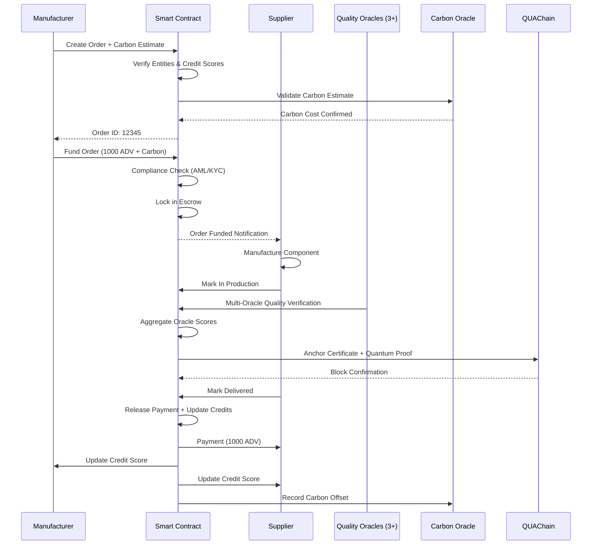
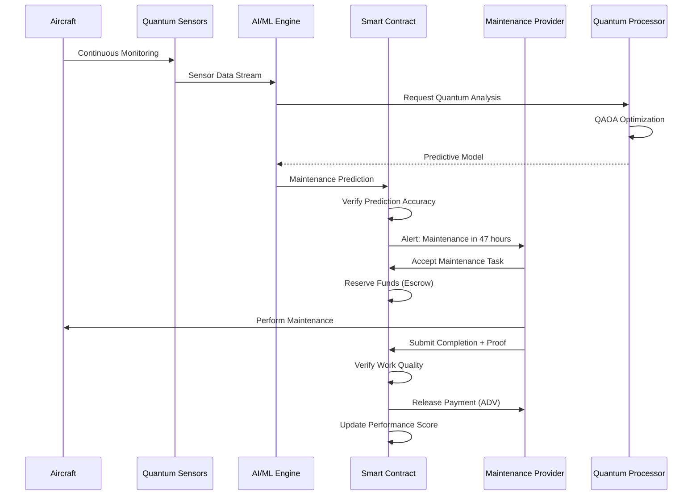

# Project AMPEL-FIN-ASSY: Aerospace Master Platform for Enhanced Living Assets and Strategical Systems

## Executive Summary

Project AMPEL-FIN-ASSY aims to develop a groundbreaking, quantum-enhanced platform for the comprehensive management, financing, and compliance oversight of high-value aerospace assets. Leveraging the convergence of Quantum Computing, Post-Quantum Cryptography, Zero-Knowledge Proofs, Advanced AI, and Decentralized Ledger Technology, AMPEL-FIN-ASSY provides a secure, transparent, and efficient ecosystem resilient against future computational threats and compliant with stringent aerospace and financial regulations.

## 1. Introduction

The lifecycle management of aerospace assets—from manufacturing and financing through operation, maintenance, and eventual decommissioning—is inherently complex, costly, and subject to rigorous regulatory standards (e.g., DAL-A, EASA Part-M, S1000D). Existing systems often struggle with data fragmentation, security vulnerabilities (especially in the face of quantum computing advancements), opaque financial structures, and inefficient compliance auditing. AMPEL-FIN-ASSY addresses these challenges by creating an integrated, decentralized platform underpinned by the most advanced technological paradigms available.

## 2. System Architecture: A Layered Approach

AMPEL-FIN-ASSY is structured into distinct, interacting layers, ensuring modularity, security, and specialized processing capabilities.

### 2.1. Layer 1: Quantum-Secured Foundation (The Q-Foundation)

This foundational layer provides the essential security infrastructure and access to advanced computational resources, resilient against quantum threats.

*   **QUAChain (Quantum-Resistant Distributed Ledger Technology - DLT):**
    *   Serves as the core immutable, auditable ledger for asset tokens, compliance logs, and financial transactions.
    *   **Type:** High-throughput, permissioned or hybrid network suitable for enterprise requirements.
    *   **Quantum-Resistant Consensus:** Employs a consensus mechanism (e.g., a PQC-hardened Byzantine Fault Tolerance variant) specifically designed to be resistant to attacks from large-scale quantum computers.
    *   **AMPEL-Contracts (Smart Contracts):** Supports a robust, formally verifiable smart contract language (potentially a dialect inheriting from Solidity principles but with PQC-compatible cryptographic primitives) for encoding complex asset lifecycle logic, financial instruments, and automated compliance rules.
    *   **Integrated PQC Primitives:** Cryptographic operations critical to the DLT (transaction signing, state verification) exclusively utilize integrated Post-Quantum Cryptography algorithms (e.g., **CRYSTALS-Dilithium** for digital signatures, **CRYSTALS-Kyber** for key encapsulation).
    *   **QKD Integration Points:** Hardware Security Modules (HSMs) securing critical QUAChain node infrastructure are provisioned with cryptographic keys distributed via a dedicated **Quantum Key Distribution (QKD)** network, providing an additional layer of information-theoretic security for sensitive inter-node communications.

*   **Quantum Computing Interface (QCI):**
    *   A secure, standardized middleware layer facilitating access to various quantum computing backends (cloud-based QPUs, simulators, potentially on-premise hardware).
    *   **Quantum Task Orchestration:** Manages the submission, queuing, execution, and retrieval of results from quantum and hybrid algorithms.
    *   **Hybrid Solver Management:** Coordinates the interplay between classical pre-processing, quantum computation execution, and classical post-processing required for variational and hybrid algorithms (e.g., QAOA, VQE).
    *   **Secure Data Exchange:** Ensures data transmitted to and from quantum computing resources is encrypted using PQC and potentially QKD-derived keys for maximum confidentiality.

*   **Post-Quantum Cryptography (PQC) Suite:**
    *   A standardized, system-wide library implementing NIST-selected or candidate PQC algorithms.
    *   Deployed for securing all communication channels (e.g., TLS/SSL with PQC cipher suites), encrypting data at rest, and generating/verifying digital signatures for off-chain data integrity outside of QUAChain.

*   **Quantum Key Distribution (QKD) Network:**
    *   A dedicated network layer providing highly secure key exchange.
    *   Used for provisioning cryptographic keys for the most sensitive point-to-point communication channels within the AMPEL-FIN-ASSY core infrastructure (e.g., between data centers hosting QCI, QUAChain nodes, or key management systems), offering security guarantees against future quantum adversaries.

### 2.2. Layer 2: Data Integrity and Privacy (The ZK-Compliance Core)

This layer focuses on ensuring that critical aerospace, maintenance, and financial data is verifiable for compliance and audit purposes without compromising underlying sensitive information.

*   **Zero-Knowledge Proof (ZKP) System:**
    *   Enables parties to prove the truth of a statement (e.g., compliance with a regulation) without revealing any information beyond the validity of the statement itself.
    *   **ZKP Provers:** Off-chain services (potentially utilizing hardware acceleration) responsible for generating ZKPs from sensitive input data (maintenance logs, test results, financial records). Employs **PLONK** for efficient proofs over complex, universal circuits (suitable for general compliance workflows) and **Groth16** for specific, high-assurance proofs with trusted setup (e.g., for critical financial solvency statements).
    *   **ZKP Verifiers:** Efficient smart contracts deployed on QUAChain that verify the validity of submitted ZKPs against publicly available parameters or verification keys. Successful verification updates the on-chain compliance log.

*   **Digital Twin & S1000D Integration:**
    *   **Dynamic Asset State Database:** A secure, versioned, off-chain database hosting detailed, permissioned data representing the "Digital Twin" of each aerospace asset. This includes sensor readings, comprehensive maintenance history, operational logs, and precise configuration data.
    *   **S1000D Linkage:** Data structures and metadata within the Digital Twin adhere to **S1000D** international specification for technical publications, ensuring semantic interoperability with existing aerospace maintenance, repair, and overhaul (MRO) systems.
    *   Access to this off-chain data is strictly controlled via PQC-secured APIs and permission models linked to on-chain asset tokens. On-chain hashes or proofs anchor the integrity and state changes of the Digital Twin.

*   **Immutable Compliance Log:**
    *   An on-chain, tamper-evident record within QUAChain.
    *   Stores hashes of verified ZKPs, cryptographic commitments, and essential metadata (e.g., timestamp, asset ID, type of compliance proven). This provides an auditable, high-level summary of compliance status without storing sensitive data on-chain.

*   **Stablecoin Collateral Pool State:**
    *   On-chain state managed by dedicated AMPEL-Contracts.
    *   Tracks the real-time composition, value, and reserve ratio of the multi-asset pool backing the **AERO-Stablecoin**. This state is critical for transparency and stablecoin management logic.

### 2.3. Layer 3: Logic, Automation, and Finance (The AI-FinTech Layer)

This layer houses the intelligent agents, automated processes, and financial mechanisms that operate on the platform's data and state.

*   **Smart Contract Layer (on QUAChain):**
    *   The core logic and state management for assets, finance, and compliance automation reside within AMPEL-Contracts on QUAChain. These contracts define the rules and structures governing interactions within the ecosystem.

    ```solidity
    // Partial Example of AMPEL-Contract Structures on QUAChain
    
    // State variables representing core platform metrics
    uint256 public constant VERSION = 1;
    uint256 public totalCollateral;     // Total value locked in stablecoin collateral pool
    uint256 public carbonOffsetTotal;   // Cumulative carbon credits retired across the platform
    
    // Mappings for core data structures and relationships
    mapping(address => AerospaceEntity) public entities;        // Registered entities (operators, manufacturers, etc.)
    mapping(uint256 => ManufacturingOrder) public orders;       // On-chain record of manufacturing orders
    mapping(uint256 => MaintenanceContract) public maintenance; // On-chain record of maintenance contracts
    mapping(address => uint256) public carbonBalance;           // Carbon credits held by entities
    mapping(uint256 => Proposal) public proposals;             // Governance proposals in the DAO
    
    // Structure for tracking the decentralized oracle network state
    mapping(address => Oracle) public oracles;
    uint256 public requiredOracles = 3; // Minimum number of oracles required for certain data points
    
    // Struct Definitions for key aerospace and financial entities/processes
    struct AerospaceEntity {
        string gqoisId;              // Global QAO Object ID - Unique identifier across the platform
        EntityType entityType;       // Type of entity (Supplier, Operator, Regulator, etc.)
        bool kycVerified;            // On-chain confirmation of KYC/AML verification (ZKPs would prove details)
        bool amlCompliant;           // On-chain confirmation of AML status
        uint256 creditLimit;         // Credit limit for financing via the platform
        uint256 creditScore;         // Dynamic score reflecting entity's financial/operational reliability
        uint256 carbonFootprint;     // Track aggregated carbon impact (updated via off-chain agents)
        // QuantumSignature qSignature; // Placeholder for potential future on-chain quantum signatures or proof of identity
        ComplianceLevel compliance;  // Current overall compliance status
    }
    
    struct ManufacturingOrder {
        uint256 orderId;             // Unique identifier for the order
        string componentId;          // Identifier for the component being manufactured (links to ITCS - Item Technical Characteristics Sheet or similar)
        address supplier;            // Address of the supplier entity
        address manufacturer;        // Address of the manufacturer entity
        uint256 amount;              // Number of components ordered
        uint256 escrowBalance;       // Funds held in escrow for this order
        uint256 carbonCost;          // Estimated carbon footprint of the manufacturing process
        OrderStatus status;          // Current status of the order
        bytes32 qualityCertHash;     // Hash referencing off-chain quality certification proof/data (verified by ZKP)
        uint256 deliveryDeadline;    // Deadline for delivery
        uint256 qualityScore;        // Score reflecting component quality based on verified data
    }
    
    struct MaintenanceContract {
        string aircraftId;           // Identifier for the aircraft/asset
        address operator;            // Address of the operating entity
        address provider;            // Address of the maintenance provider
        uint256 monthlyAmount;       // Monthly payment for retainer/subscription
        uint256 totalAmount;         // Total value of the contract
        uint256 duration;            // Duration of the contract in months/years
        uint256 startTime;           // Timestamp of contract start
        uint256 lastPayment;         // Timestamp of last payment
        uint256 performanceScore;    // Score reflecting maintenance performance
        bool active;                 // Contract status
        PredictiveData predictions;  // Placeholder for key data points from predictive analytics
    }
    
    struct PredictiveData {
        uint256 nextMaintenanceBlock; // Estimated future block number for next required maintenance
        uint256 estimatedCost;        // Estimated cost based on predictive analysis
        uint256 riskScore;            // Calculated risk score based on predicted failure probability
        bytes32 quantumPredictionHash; // Hash of the result from quantum optimization (e.g., QAOA schedule)
    }
    
    struct Oracle {
        bool active;                 // Oracle operational status
        uint256 reputation;          // Oracle's reputation score
        OracleType oracleType;       // Type of data provided (Price, Quality, Compliance, Carbon, Quantum Result)
        uint256 lastUpdate;          // Timestamp of the last data update
        bytes32 quantumCertificate;  // Hash referencing proof of oracle's quantum-resistant security properties
    }
    
    // Enum Definitions for categorizing entities, orders, and data types
    enum EntityType {
        Supplier,
        Manufacturer,
        Operator,
        MaintenanceProvider,
        Regulator,
        CarbonCreditProvider
    }
    
    enum OrderStatus {
        Initiated,
        Funded,
        InProduction,
        QualityVerified,
        Delivered,
        Completed,
        Disputed,
        CarbonOffset // Status indicating carbon footprint associated with the order has been offset
    }
    
    enum ComplianceLevel {
        Basic,       // Minimum compliance requirements met
        Enhanced,    // Exceeding basic requirements, potentially specific certifications
        Regulatory   // Full compliance with all relevant regulations (DAL-A, EASA Part-M, etc.)
    }
    
    enum OracleType {
        Price,       // Financial market data
        Quality,     // Component quality/performance data
        Compliance,  // Regulatory updates or compliance status data
        Carbon,      // Environmental/carbon emission data or credit prices
        Quantum      // Validated results from quantum computations
    }
    
    // Events for transparent logging of key actions
    event QuantumMint(address indexed to, uint256 amount, bytes quantumProof); // Example of an event linking a token mint to a quantum proof (e.g., proof of collateral value)
    // ... other events for OrderStatus changes, Compliance updates, etc.
    ```

*   **AI Agent Network:**
    *   A network of autonomous or semi-autonomous software agents operating primarily off-chain, interacting securely with QUAChain (via AMPEL-Contracts), the Digital Twin database, and Oracles via PQC-secured APIs.
    *   **Predictive Maintenance Agents:** Analyze Digital Twin sensor and maintenance data using machine learning to predict potential component failures or maintenance needs. They formulate optimization problems for QCI (e.g., scheduling) and trigger ZKP generation for compliance.
    *   **Compliance Monitoring Agents:** Continuously monitor operational data and asset state against complex regulatory rules (**EASA Part-M**, **DAL-A**, etc.). They generate alerts for non-compliance and prepare necessary data for ZKP Provers.
    *   **Aerospace NLP Agents:** Process and interpret unstructured or semi-structured technical documentation, particularly **S1000D** data modules, to enrich the Digital Twin, provide context for AI models, and assist in automated procedure generation or compliance checks.
    *   **Financial Risk Agents:** Monitor the **AERO-Stablecoin** collateral pool, external market data (via Oracles), and counterparty risk. They assess stability and solvency, potentially using quantum algorithms (VQE via QCI) for complex portfolio optimization or stress testing.
    *   **Optimization Agents:** Formulate complex operational problems (e.g., logistics, supply chain optimization, resource allocation, flight scheduling, route planning considering fuel, time, and carbon costs) and submit them to the QCI for potentially quantum-accelerated solving using algorithms like QAOA. They interpret the results and propose or execute actions within the system.

*   **AERO-Stablecoin (Multi-Asset & Dynamic Collateral):**
    *   A stablecoin token designed to facilitate seamless financial transactions within the AMPEL-FIN-ASSY ecosystem.
    *   **Collateralization:** Backed by a diversified, dynamically managed pool of assets, including tokenized fiat, high-grade financial instruments, commodities, and potentially fractionalized ownership tokens of high-value aerospace assets registered on QUAChain.
    *   **Dynamic Rebalancing:** Automated mechanisms within AMPEL-Contracts, informed by AI Risk Agents and quantum optimization (VQE/QAOA), continuously assess and adjust the collateral composition and ratio to maintain stability against its peg.

*   **Integrated Carbon Market:**
    *   Functionality to track and monetize the environmental impact of asset operations.
    *   AMPEL-FIN-ASSY ingests operational data to calculate carbon emissions based on verifiable metrics.
    *   Smart contracts manage the issuance, trading, and retirement of tokenized carbon credits within the platform, often benchmarked against established standards.
    *   Optimization Agents using QAOA via QCI can help operators find the most cost-effective route balancing fuel burn, time, and carbon offset costs.

### 2.4. Layer 4: Governance and Interoperability

This layer ensures the platform's evolution is decentralized and secure while enabling interaction with external digital ecosystems.

*   **Decentralized Governance with Quantum Weighting:**
    *   Managed by the **AMPEL-FIN-ASSY DAO**, allowing stakeholders (holding governance tokens) to propose and vote on protocol upgrades, parameter changes (e.g., stablecoin collateral ratios), and strategic decisions.
    *   **Quantum Weighting Module:** A novel mechanism where complex proposals' potential impacts are analyzed using a quantum or hybrid algorithm (e.g., mapping stakeholder dependencies and proposal effects onto a graph solvable by QAOA). The resulting "Systemic Impact Score" or "Risk Profile" provides a data point to voters, potentially influencing voter interfaces, quorum requirements, or even algorithmically adjusting the weight of votes to steer outcomes towards system stability and resilience, while maintaining decentralized control. This requires careful design to avoid algorithmic centralization.

*   **Cross-Chain Bridges (PQC-Secured):**
    *   Secure protocols and relay networks enabling the transfer of value and information between QUAChain and other external blockchain networks (e.g., for accessing liquidity from public blockchains, integrating with other tokenized asset markets).
    *   These bridges are secured using PQC algorithms for signature verification and key exchange to resist potential quantum attacks on bridged assets.

### 2.5. Cross-Cutting Concerns

These elements are integrated throughout all layers of AMPEL-FIN-ASSY.

*   **Robust Multi-Layer Security:**
    *   **Quantum Layer Security:** QKD-secured key distribution for critical links, PQC for encryption and signatures throughout the system.
    *   **PQC Layer Security:** System-wide implementation of PQC algorithms for foundational cryptographic operations.
    *   **Blockchain Layer Security:** QUAChain's inherent PQC-hardened consensus, formal verification of AMPEL-Contracts, cryptographic linking of blocks.
    *   **ZKP Layer Security:** Ensuring the soundness, completeness, and zero-knowledge properties of proofs; secure management of trusted setup if applicable (Groth16).
    *   **AI Layer Security:** Focus on secure training data, adversarial robustness of AI models, and anomaly detection to identify malicious agent behavior.
    *   **Operational Security:** Secure, PQC-authenticated APIs, rigorous access control mechanisms, and utilization of PQC-compatible Hardware Security Modules (HSMs) for protecting sensitive private keys.
    *   **Oracle Security:** Secure, verifiable oracles providing trusted external data feeds, hardened against quantum attacks using PQC.

*   **Comprehensive Audit Trails:**
    *   All critical actions and state changes are immutably recorded on **QUAChain** (token transfers, ZKP verifications, governance votes, significant smart contract executions).
    *   Secure linkages (cryptographic hashes) are maintained between on-chain logs and the detailed, off-chain data stored in the Digital Twin database.
    *   Auditors are granted secure, permissioned access to specific, relevant off-chain data via PQC-authenticated interfaces, often using ZKPs to prove their authorization without exposing unnecessary data, ensuring full regulatory compliance and transparency while preserving privacy.
    *   Off-chain system and agent activity logs are periodically aggregated and cryptographically linked to on-chain records for a complete, verifiable history.

## 3. Key Interactions and Workflow Examples

AMPEL-FIN-ASSY enables sophisticated interactions across its layers:

1.  **Asset Tokenization & Financing:** A new asset (e.g., aircraft) is tokenized on QUAChain (ERC-721), linked to an `AerospaceEntity`. Financing is structured using **AERO-Stablecoin** via AMPEL-Contracts, potentially involving fractional ownership tokens (ERC-20) or securitized future cash flows also tokenized on QUAChain. Manufacturing (`ManufacturingOrder`) and Maintenance (`MaintenanceContract`) can be initiated and funded via on-chain logic.
2.  **Predictive Maintenance & Compliance:** AI Prediction Agents analyze Digital Twin operational data. They identify a potential maintenance need and formulate a complex scheduling problem. The Optimization Agent submits this to the QCI. A Hybrid Solver (QAOA) determines the optimal schedule, updating the `PredictiveData` within the relevant `MaintenanceContract`. The maintenance is performed and logged in the Digital Twin. A ZKP Prover generates a proof of **EASA Part-M** compliance from the private maintenance data. This ZKP is verified by a Compliance Verification Contract on QUAChain, updating the immutable compliance log and the asset token's state.
3.  **Supply Chain & S1000D:** A replacement part arrives, linked to an ERC-1155 token representing the part type and batch. ZKPs verify its authenticity and certification data (referencing linked **S1000D** data modules). NLP Agents process associated documentation for system integration, potentially updating `qualityCertHash` or `qualityScore` within a `ManufacturingOrder`.
4.  **Operation & Carbon Tracking:** Flight data streams into the Digital Twin. AI Agents calculate carbon emissions, updating the entity's `carbonFootprint`. This data feeds the Integrated Carbon Market contracts on QUAChain, allowing operators to purchase/retire tokenized carbon credits (`carbonBalance`) using **AERO-Stablecoin**. Optimization Agents using QAOA via QCI can suggest routes balancing fuel cost and carbon offset cost. `OrderStatus` could be updated to `CarbonOffset` for manufacturing orders once offsets are purchased.
5.  **Financial Management & Risk Mitigation:** Financial Risk Agents monitor the **AERO-Stablecoin** collateral (`totalCollateral`) and market conditions (via Price Oracles). If risk thresholds are met, they propose rebalancing actions. For complex rebalancing, VQE via QCI can optimize the target asset allocation. These actions can be automated if pre-approved via governance or require a new governance vote with quantum weighting input (managed via `proposals` and governance contracts).
6.  **Auditing a Specific Event:** An auditor, authorized via the Governance DAO, requests to verify a specific maintenance compliance event recorded on-chain by a ZKP hash. Their secure portal allows them to request access to the *minimal* set of off-chain data required for that specific ZKP verification, which is provided via a PQC-secured, permissioned API from the Digital Twin database, ensuring privacy while fulfilling audit requirements.

## 4. Challenges and Future Outlook

Developing and deploying AMPEL-FIN-ASSY faces significant challenges:

*   **Quantum Hardware Maturity:** The practical applicability of QAOA, VQE, and hybrid solvers heavily relies on the continued advancement and scalability of fault-tolerant or high-quality NISQ (Noisy Intermediate-Scale Quantum) hardware.
*   **Quantum Advantage Proof:** Rigorously demonstrating a clear, economically justifiable quantum advantage over classical algorithms for the specific optimization and simulation problems tackled by AMPEL-FIN-ASSY is essential.
*   **Integration Complexity:** Tightly integrating disparate, cutting-edge technologies (quantum, PQC, ZKPs, AI, DLT, aerospace standards) into a reliable, performant, and secure system is an immense engineering challenge.
*   **Standardization:** Lack of mature, industry-wide standards for quantum middleware, quantum-blockchain interaction, and ZKPs tailored to highly regulated domains like aerospace requires pioneering development.
*   **Regulatory Approval:** Navigating complex and potentially evolving regulations across aerospace, finance, data privacy (GDPR, etc.), and potentially emerging quantum technology frameworks globally.
*   **Security Evolution:** Continuous monitoring and adaptation of PQC and QKD implementations are necessary as quantum computing technology advances. Securing the quantum computation process itself (e.g., verifiable quantum computing) remains an area of active research.
*   **Scalability:** Ensuring all components (QUAChain, ZKP Provers, AI Agents) can handle the throughput, storage, and processing demands of a global fleet of aerospace assets.
*   **Quantum Weighting Definition & Fairness:** Defining the "Quantum Weighting" mechanism for governance precisely, ensuring its fairness, transparency, and resilience against manipulation while providing valuable insight, is a complex socio-technical challenge.

Despite these challenges, AMPEL-FIN-ASSY represents a bold vision for the future of aerospace asset management and finance, offering unprecedented levels of security, efficiency, transparency, and intelligence through the synergistic application of advanced technologies.
---

# ADVENT Stable Coin (ADV)

## Quantum-Secured Aerospace Transaction System for GAIA-QAO

### 🪙 Executive Summary

The **ADVENT Stable Coin (ADV)** is a quantum-secured, aerospace-industry-specific stable coin designed to facilitate transparent, efficient, and compliant transactions across the entire AMPEL360 BWB-Q100 lifecycle. Built on QUAChain infrastructure with post-quantum cryptography, ADV enables automated smart contract execution for manufacturing, supply chain, maintenance, carbon credit trading, and operational transactions while maintaining regulatory compliance across multiple jurisdictions.

**Key Innovations:**
- First aerospace-specific stable coin with quantum security
- Integrated carbon credit system for sustainable aviation
- Multi-oracle network with quantum verification
- Dynamic stability mechanism using quantum predictions
- Full compliance with aerospace and financial regulations

-----

## 📊 Token Specifications

```yaml
token:
  name: "ADVENT Stable Coin"
  symbol: "ADV"
  type: "Quantum-Secured Multi-Collateral Stable Coin"
  standard: "QRC-20" # QUAChain Token Standard
  decimals: 18
  total_supply: "Dynamic (Algorithmic + Collateralized Minting)"
  
stability_mechanism:
  type: "Hybrid Multi-Collateral + Algorithmic"
  primary_peg: "EUR" # Getafe/European operations
  secondary_pegs: ["USD", "GBP", "JPY"]
  collateral_ratio: 
    minimum: 130%
    target: 150%
    maximum: 200%
  algorithmic_component: "QAOA-optimized supply adjustment"
  
quantum_security:
  signature_algorithm: "CRYSTALS-Dilithium"
  encryption: "CRYSTALS-Kyber"
  key_size: 256
  entanglement_verification: true
  quantum_random_generation: true
  qkd_integration: true
  
compliance:
  aml_kyc: "Level 3 Enhanced Due Diligence"
  regulatory_frameworks: ["MiCA", "FATF", "Basel III", "EASA Part-M"]
  reporting_standards: ["IFRS", "GAAP", "S1000D"]
  jurisdiction_support: ["EU", "US", "UK", "Japan", "Singapore"]
```

-----

## 🏗️ Architecture

### Core Smart Contract Structure

```solidity
// SPDX-License-Identifier: Apache-2.0
pragma solidity ^0.8.19;

import "@quachain/contracts/QRC20.sol";
import "@quachain/contracts/QuantumSecure.sol";
import "@quachain/contracts/Compliance.sol";
import "@quachain/contracts/CarbonCredits.sol";
import "@quachain/contracts/Governance.sol";

contract ADVENTStableCoin is QRC20, QuantumSecure, Compliance, CarbonCredits, Governance {
    
    // State variables
    uint256 public constant VERSION = 1;
    uint256 public totalCollateral;
    uint256 public carbonOffsetTotal;
    
    // Aerospace-specific features
    mapping(address => AerospaceEntity) public entities;
    mapping(uint256 => ManufacturingOrder) public orders;
    mapping(uint256 => MaintenanceContract) public maintenance;
    mapping(address => uint256) public carbonBalance;
    mapping(uint256 => Proposal) public proposals;
    
    // Advanced oracle network
    mapping(address => Oracle) public oracles;
    uint256 public requiredOracles = 3;
    
    struct AerospaceEntity {
        string gqoisId;              // GAIA-QAO Object ID
        EntityType entityType;
        bool kycVerified;
        bool amlCompliant;
        uint256 creditLimit;
        uint256 creditScore;         // Dynamic credit scoring
        uint256 carbonFootprint;     // Track carbon impact
        QuantumSignature qSignature;
        ComplianceLevel compliance;
    }
    
    struct ManufacturingOrder {
        uint256 orderId;
        string componentId;          // ITCS tracked component
        address supplier;
        address manufacturer;
        uint256 amount;
        uint256 escrowBalance;
        uint256 carbonCost;          // Carbon footprint of order
        OrderStatus status;
        bytes32 qualityCertHash;
        uint256 deliveryDeadline;
        uint256 qualityScore;
    }
    
    struct MaintenanceContract {
        string aircraftId;
        address operator;
        address provider;
        uint256 monthlyAmount;
        uint256 totalAmount;
        uint256 duration;
        uint256 startTime;
        uint256 lastPayment;
        uint256 performanceScore;
        bool active;
        PredictiveData predictions;
    }
    
    struct PredictiveData {
        uint256 nextMaintenanceBlock;
        uint256 estimatedCost;
        uint256 riskScore;
        bytes32 quantumPredictionHash;
    }
    
    struct Oracle {
        bool active;
        uint256 reputation;
        OracleType oracleType;
        uint256 lastUpdate;
        bytes32 quantumCertificate;
    }
    
    enum EntityType {
        Supplier,
        Manufacturer,
        Operator,
        MaintenanceProvider,
        Regulator,
        CarbonCreditProvider
    }
    
    enum OrderStatus {
        Initiated,
        Funded,
        InProduction,
        QualityVerified,
        Delivered,
        Completed,
        Disputed,
        CarbonOffset
    }
    
    enum ComplianceLevel {
        Basic,
        Enhanced,
        Regulatory
    }
    
    enum OracleType {
        Price,
        Quality,
        Compliance,
        Carbon,
        Quantum
    }
    
    // Events
    event QuantumMint(address indexed to, uint256 amount, bytes quantumProof);
    event OrderCreated(uint256 indexed orderId, string componentId, address supplier, address manufacturer, uint256 amount);
    event CarbonNeutralTransfer(address indexed from, address indexed to, uint256 amount, uint256 carbonCredits);
    event ComplianceAlert(address indexed entity, string reason, uint256 severity);
    event OracleConsensus(uint256 indexed dataPoint, uint256 value, uint256 oracleCount);
    
    // Modifiers
    modifier onlyVerifiedEntity() {
        require(entities[msg.sender].kycVerified && entities[msg.sender].amlCompliant, "Entity not verified");
        _;
    }
    
    modifier quantumVerified(bytes calldata quantumProof) {
        require(verifyQuantumProof(quantumProof), "Invalid quantum proof");
        _;
    }
    
    // Enhanced Regulatory Compliance
    function checkTransactionCompliance(
        address sender,
        address receiver,
        uint256 amount,
        string memory transactionType
    ) public returns (bool) {
        // FATF Travel Rule compliance
        if (amount > getJurisdictionThreshold("FATF")) {
            emit ComplianceAlert(sender, "Travel Rule Required", 2);
            require(verifyTravelRuleData(sender, receiver), "Travel rule data missing");
        }
        
        // Aerospace-specific checks
        if (keccak256(bytes(transactionType)) == keccak256(bytes("DUAL_USE"))) {
            require(checkDualUseAuthorization(sender, receiver), "Dual-use not authorized");
        }
        
        // Sanctions screening
        require(!isSanctioned(sender) && !isSanctioned(receiver), "Sanctioned entity");
        
        // Carbon compliance check
        require(checkCarbonCompliance(sender, amount), "Carbon quota exceeded");
        
        return true;
    }
    
    // Quantum-secured minting with dynamic collateral
    function mintWithQuantumProof(
        address to,
        uint256 amount,
        bytes calldata quantumProof,
        uint256 collateralAmount
    ) external onlyOracle quantumVerified(quantumProof) {
        // Dynamic collateral ratio based on market conditions
        uint256 requiredCollateral = calculateDynamicCollateral(amount);
        require(collateralAmount >= requiredCollateral, "Insufficient collateral");
        
        // Verify quantum entanglement for anti-counterfeiting
        require(verifyEntanglement(quantumProof), "Entanglement verification failed");
        
        // Update collateral pool
        totalCollateral += collateralAmount;
        
        _mint(to, amount);
        emit QuantumMint(to, amount, quantumProof);
    }
    
    // Carbon-integrated transfer
    function transferWithCarbonOffset(
        address to,
        uint256 amount,
        uint256 estimatedCO2
    ) external onlyVerifiedEntity {
        // Calculate required carbon offset
        uint256 creditsNeeded = calculateCarbonCredits(estimatedCO2);
        
        // Check carbon balance
        require(carbonBalance[msg.sender] >= creditsNeeded, "Insufficient carbon credits");
        
        // Burn carbon credits
        carbonBalance[msg.sender] -= creditsNeeded;
        carbonOffsetTotal += creditsNeeded;
        
        // Execute transfer with compliance check
        require(checkTransactionCompliance(msg.sender, to, amount, "TRANSFER"), "Compliance failed");
        
        _transfer(msg.sender, to, amount);
        
        emit CarbonNeutralTransfer(msg.sender, to, amount, creditsNeeded);
    }
    
    // Enhanced manufacturing order with carbon tracking
    function createManufacturingOrder(
        string calldata componentId,
        address supplier,
        uint256 amount,
        uint256 estimatedCarbon,
        uint256 deliveryDeadline
    ) external onlyVerifiedEntity returns (uint256 orderId) {
        require(entities[msg.sender].entityType == EntityType.Manufacturer, "Not manufacturer");
        require(entities[supplier].entityType == EntityType.Supplier, "Invalid supplier");
        require(entities[supplier].creditScore >= 700, "Supplier credit score too low");
        
        orderId = nextOrderId++;
        orders[orderId] = ManufacturingOrder({
            orderId: orderId,
            componentId: componentId,
            supplier: supplier,
            manufacturer: msg.sender,
            amount: amount,
            escrowBalance: 0,
            carbonCost: estimatedCarbon,
            status: OrderStatus.Initiated,
            qualityCertHash: 0,
            deliveryDeadline: deliveryDeadline,
            qualityScore: 0
        });
        
        emit OrderCreated(orderId, componentId, supplier, msg.sender, amount);
    }
    
    // Multi-oracle quality verification
    function verifyQualityWithOracles(
        uint256 orderId,
        bytes32 certificateHash,
        bytes[] calldata oracleData
    ) external {
        require(oracleData.length >= requiredOracles, "Insufficient oracle confirmations");
        
        ManufacturingOrder storage order = orders[orderId];
        require(order.status == OrderStatus.InProduction, "Invalid order status");
        
        // Collect oracle confirmations
        uint256 confirmations = 0;
        uint256 totalQualityScore = 0;
        
        for (uint i = 0; i < oracleData.length; i++) {
            (address oracleAddress, uint256 qualityScore, bytes memory signature) = 
                abi.decode(oracleData[i], (address, uint256, bytes));
            
            if (verifyOracleSignature(oracleAddress, qualityScore, signature)) {
                confirmations++;
                totalQualityScore += qualityScore;
                
                // Update oracle reputation
                oracles[oracleAddress].reputation += 1;
            }
        }
        
        require(confirmations >= requiredOracles, "Insufficient valid confirmations");
        
        // Calculate average quality score
        order.qualityScore = totalQualityScore / confirmations;
        require(order.qualityScore >= 80, "Quality score below threshold");
        
        order.qualityCertHash = certificateHash;
        order.status = OrderStatus.QualityVerified;
        
        // Anchor to blockchain with quantum proof
        anchorWithQuantumProof(orderId, certificateHash);
        
        emit OracleConsensus(orderId, order.qualityScore, confirmations);
    }
    
    // Predictive maintenance with quantum algorithms
    function createPredictiveMaintenanceContract(
        string calldata aircraftId,
        address provider,
        uint256 monthlyAmount,
        uint256 duration,
        bytes calldata quantumPrediction
    ) external onlyVerifiedEntity returns (uint256 contractId) {
        require(entities[msg.sender].entityType == EntityType.Operator, "Not operator");
        require(entities[provider].entityType == EntityType.MaintenanceProvider, "Invalid provider");
        
        // Decode quantum prediction data
        PredictiveData memory predictions = decodePredictiveData(quantumPrediction);
        
        contractId = nextContractId++;
        maintenance[contractId] = MaintenanceContract({
            aircraftId: aircraftId,
            operator: msg.sender,
            provider: provider,
            monthlyAmount: monthlyAmount,
            totalAmount: monthlyAmount * duration,
            duration: duration,
            startTime: block.timestamp,
            lastPayment: 0,
            performanceScore: 100,
            active: true,
            predictions: predictions
        });
        
        emit MaintenanceContractCreated(contractId, aircraftId, provider);
    }
    
    // Dynamic liquidity management
    function addLiquidityWithQuantumBonus(
        address collateral,
        uint256 advAmount,
        uint256 collateralAmount,
        bytes calldata quantumProof
    ) external quantumVerified(quantumProof) {
        require(advAmount > 0 && collateralAmount > 0, "Invalid amounts");
        
        LiquidityPool storage pool = pools[collateral];
        
        // Calculate shares with quantum bonus
        uint256 shares = calculateLiquidityShares(advAmount, collateralAmount, pool);
        
        // Apply quantum verification bonus (10%)
        shares = shares * 110 / 100;
        
        // Update pool state
        updateLiquidityPool(pool, advAmount, collateralAmount, shares);
        
        emit LiquidityAdded(msg.sender, advAmount, collateralAmount, shares);
    }
    
    // Governance with quantum-weighted voting
    function castVoteWithQuantumWeight(
        uint256 proposalId,
        bool support,
        bytes calldata quantumCommitment
    ) external onlyVerifiedEntity {
        Proposal storage proposal = proposals[proposalId];
        require(isVotingActive(proposal), "Voting not active");
        require(!proposal.hasVoted[msg.sender], "Already voted");
        
        // Calculate voting power
        uint256 votingPower = calculateVotingPower(msg.sender);
        
        // Apply quantum bonus for verified commitment
        if (verifyQuantumCommitment(quantumCommitment)) {
            votingPower = votingPower * 110 / 100; // 10% bonus
            
            // Additional bonus for carbon-negative entities
            if (entities[msg.sender].carbonFootprint < 0) {
                votingPower = votingPower * 105 / 100; // Additional 5%
            }
        }
        
        recordVote(proposal, msg.sender, support, votingPower);
        
        emit VoteCast(msg.sender, proposalId, support, votingPower);
    }
    
    // Cross-chain bridge functionality
    function bridgeToChain(
        uint256 targetChain,
        address recipient,
        uint256 amount,
        bytes calldata quantumProof
    ) external onlyVerifiedEntity quantumVerified(quantumProof) {
        require(amount >= MIN_BRIDGE_AMOUNT, "Amount too small");
        require(isSupportedChain(targetChain), "Unsupported chain");
        
        // Lock tokens in bridge contract
        _transfer(msg.sender, address(this), amount);
        
        // Create bridge request with quantum signature
        uint256 requestId = createBridgeRequest(
            msg.sender,
            recipient,
            amount,
            targetChain,
            quantumProof
        );
        
        // Emit event for bridge validators
        emit BridgeRequested(requestId, targetChain, recipient, amount);
    }
    
    // Helper functions
    function calculateDynamicCollateral(uint256 amount) internal view returns (uint256) {
        // Get market volatility from oracles
        uint256 volatility = getMarketVolatility();
        
        // Base collateral ratio
        uint256 baseRatio = 150; // 150%
        
        // Adjust based on volatility
        if (volatility > HIGH_VOLATILITY_THRESHOLD) {
            return amount * 200 / 100; // 200% during high volatility
        } else if (volatility < LOW_VOLATILITY_THRESHOLD) {
            return amount * 130 / 100; // 130% during low volatility
        }
        
        return amount * baseRatio / 100;
    }
    
    function verifyEntanglement(bytes calldata proof) internal returns (bool) {
        // Verify quantum entanglement properties
        (uint256 correlation, bytes memory measurementData) = abi.decode(proof, (uint256, bytes));
        
        // Check Bell inequality violation
        return correlation > BELL_INEQUALITY_THRESHOLD;
    }
}
```

-----

## 🔄 Enhanced Transaction Flows

### Manufacturing Supply Chain with Carbon Tracking



### Predictive Maintenance Flow



-----

## 💰 Enhanced Economic Model

### Token Distribution

```yaml
distribution:
  initial_mint: 1_000_000_000 ADV
  allocation:
    ecosystem_reserve: 35%          # 350M ADV
    liquidity_pools: 20%           # 200M ADV
    development_fund: 15%          # 150M ADV
    regulatory_compliance: 10%     # 100M ADV
    carbon_offset_fund: 10%        # 100M ADV
    team_advisors: 7%             # 70M ADV (4-year vesting)
    public_sale: 3%               # 30M ADV
    
collateral_basket:
  fiat_currencies:
    EUR: 35%
    USD: 25%
    GBP: 5%
    JPY: 5%
  commodities:
    GOLD: 10%
    SILVER: 5%
  crypto_assets:
    BTC: 5%
    ETH: 5%
  quantum_assets:
    Quantum_Bonds: 5%
    
carbon_credit_pool:
  verified_projects: 100M EUR equivalent
  offset_capacity: 1M tons CO2/year
```

### Dynamic Fee Structure

```yaml
transaction_fees:
  base_fees:
    standard_transfer: 0.001 ADV
    smart_contract_execution: 0.01 ADV
    cross_border: 0.1%
    quantum_verification: 0.005 ADV
    carbon_offset_calculation: 0.002 ADV
    
  dynamic_adjustments:
    high_volatility: +50%
    low_volatility: -25%
    quantum_bonus: -10%
    carbon_negative: -15%
    
fee_distribution:
  validators: 35%
  quantum_infrastructure: 25%
  insurance_pool: 15%
  carbon_offset_fund: 10%
  development: 10%
  governance_treasury: 5%
  
revenue_streams:
  transaction_fees:
    estimated_annual: 50M ADV
  collateral_interest:
    estimated_annual: 30M ADV
  bridge_fees:
    estimated_annual: 20M ADV
  carbon_marketplace:
    estimated_annual: 40M ADV
```

-----

## 🔒 Advanced Quantum Security Features

### 1. Multi-Layer Quantum Protection

```python
class QuantumSecurityFramework:
    def __init__(self):
        self.algorithms = {
            'signature': 'CRYSTALS-Dilithium-3',
            'encryption': 'CRYSTALS-Kyber-1024',
            'hash': 'SPHINCS+-256',
            'key_exchange': 'NewHope-1024'
        }
        self.qkd_network = QKDNetwork()
        self.entanglement_verifier = EntanglementVerifier()
        
    async def secure_transaction(self, transaction):
        """Multi-layer quantum security for transactions"""
        
        # Layer 1: QKD for key generation
        quantum_key = await self.qkd_network.generate_key(
            transaction.sender,
            transaction.receiver
        )
        
        # Layer 2: Post-quantum encryption
        encrypted_data = self.encrypt_kyber(transaction.data, quantum_key)
        
        # Layer 3: Quantum signature
        signature = self.sign_dilithium(encrypted_data, transaction.sender_key)
        
        # Layer 4: Entanglement verification
        entanglement_proof = await self.create_entanglement_proof(transaction)
        
        return {
            'encrypted_data': encrypted_data,
            'signature': signature,
            'quantum_key_id': quantum_key.id,
            'entanglement_proof': entanglement_proof
        }
```

### 2. Quantum Random Beacon

```python
class QuantumRandomBeacon:
    def __init__(self):
        self.quantum_source = QuantumRandomSource()
        self.verification_nodes = []
        
    async def generate_verifiable_randomness(self):
        """Generate publicly verifiable quantum randomness"""
        
        # Collect quantum random data from multiple sources
        random_contributions = []
        for node in self.verification_nodes:
            contribution = await node.get_quantum_random()
            random_contributions.append(contribution)
        
        # Combine using XOR
        combined_random = self.xor_combine(random_contributions)
        
        # Create commitment
        commitment = self.hash_commitment(combined_random)
        
        # Publish commitment first
        await self.publish_commitment(commitment)
        
        # Reveal after delay
        await asyncio.sleep(REVEAL_DELAY)
        await self.reveal_randomness(combined_random)
        
        return combined_random
```

### 3. Quantum State Validation

```python
class QuantumStateValidator:
    def __init__(self):
        self.bell_threshold = 2.0
        self.fidelity_threshold = 0.98
        
    async def validate_quantum_state(self, state_data):
        """Validate quantum state authenticity"""
        
        # Verify state preparation
        preparation_valid = self.verify_preparation_protocol(state_data)
        
        # Check entanglement measures
        entanglement = self.calculate_entanglement_measures(state_data)
        
        # Verify no-cloning violation
        cloning_check = self.verify_no_cloning(state_data)
        
        # Calculate state fidelity
        fidelity = self.calculate_state_fidelity(state_data)
        
        return {
            'valid': all([
                preparation_valid,
                entanglement > self.bell_threshold,
                cloning_check,
                fidelity > self.fidelity_threshold
            ]),
            'metrics': {
                'entanglement': entanglement,
                'fidelity': fidelity,
                'preparation': preparation_valid,
                'no_cloning': cloning_check
            }
        }
```

-----

## 🌐 Comprehensive Oracle Network

### Multi-Oracle Architecture

```python
class ADVOracleNetwork:
    def __init__(self):
        self.oracle_types = {
            'price': PriceOracles(),
            'quality': QualityOracles(),
            'compliance': ComplianceOracles(),
            'carbon': CarbonOracles(),
            'quantum': QuantumOracles()
        }
        self.consensus_threshold = 0.67  # 2/3 majority
        self.reputation_system = ReputationManager()
        
    async def get_oracle_consensus(self, data_type, parameters):
        """Get consensus from multiple oracle types"""
        
        oracles = self.oracle_types[data_type]
        responses = []
        
        # Collect responses from all active oracles
        for oracle in oracles.get_active():
            try:
                # Add timeout protection
                response = await asyncio.wait_for(
                    oracle.get_data(parameters),
                    timeout=ORACLE_TIMEOUT
                )
                
                # Verify quantum signature
                if self.verify_oracle_signature(oracle, response):
                    responses.append({
                        'oracle': oracle.id,
                        'data': response.data,
                        'confidence': response.confidence,
                        'timestamp': response.timestamp
                    })
            except asyncio.TimeoutError:
                # Penalize non-responsive oracle
                await self.reputation_system.penalize(oracle.id, 'timeout')
                
        # Calculate consensus
        consensus = self.calculate_weighted_consensus(responses)
        
        # Reward participating oracles
        await self.distribute_oracle_rewards(responses, consensus)
        
        return consensus
        
    def calculate_weighted_consensus(self, responses):
        """Calculate consensus with reputation weighting"""
        
        weighted_sum = 0
        total_weight = 0
        
        for response in responses:
            # Get oracle reputation
            reputation = self.reputation_system.get_reputation(response['oracle'])
            
            # Apply confidence and reputation weights
            weight = reputation * response['confidence']
            weighted_sum += response['data'] * weight
            total_weight += weight
            
        # Calculate weighted average
        consensus_value = weighted_sum / total_weight if total_weight > 0 else 0
        
        # Calculate agreement level
        agreement = self.calculate_agreement_level(responses, consensus_value)
        
        return {
            'value': consensus_value,
            'agreement': agreement,
            'participants': len(responses),
            'timestamp': time.time()
        }
```

-----

## 💱 Advanced Liquidity Management

### Dynamic AMM with Quantum Optimization

```solidity
contract QuantumAMM {
    using SafeMath for uint256;
    
    struct Pool {
        uint256 advReserve;
        uint256 collateralReserve;
        uint256 totalShares;
        uint256 lastOptimization;
        bytes32 quantumState;
        mapping(address => uint256) shares;
        mapping(address => uint256) lastDeposit;
    }
    
    mapping(address => Pool) public pools;
    IQuantumOptimizer public quantumOptimizer;
    
    // Constants
    uint256 constant MIN_LIQUIDITY = 1000;
    uint256 constant OPTIMIZATION_INTERVAL = 3600; // 1 hour
    
    function addLiquidityWithOptimization(
        address collateral,
        uint256 advAmount,
        uint256 collateralAmount,
        bytes calldata quantumProof
    ) external quantumVerified(quantumProof) returns (uint256 shares) {
        Pool storage pool = pools[collateral];
        
        // Run quantum optimization if needed
        if (block.timestamp >= pool.lastOptimization + OPTIMIZATION_INTERVAL) {
            optimizePool(collateral);
        }
        
        // Calculate optimal liquidity ratio
        (uint256 optimalAdv, uint256 optimalCollateral) = 
            quantumOptimizer.calculateOptimalRatio(advAmount, collateralAmount);
        
        // Calculate shares
        if (pool.totalShares == 0) {
            shares = sqrt(optimalAdv.mul(optimalCollateral)).sub(MIN_LIQUIDITY);
            pool.totalShares = MIN_LIQUIDITY; // Permanently lock first liquidity
        } else {
            shares = min(
                optimalAdv.mul(pool.totalShares).div(pool.advReserve),
                optimalCollateral.mul(pool.totalShares).div(pool.collateralReserve)
            );
        }
        
        // Update state
        pool.advReserve = pool.advReserve.add(optimalAdv);
        pool.collateralReserve = pool.collateralReserve.add(optimalCollateral);
        pool.totalShares = pool.totalShares.add(shares);
        pool.shares[msg.sender] = pool.shares[msg.sender].add(shares);
        pool.lastDeposit[msg.sender] = block.timestamp;
        
        // Transfer tokens
        TransferHelper.safeTransferFrom(address(this), msg.sender, address(this), optimalAdv);
        TransferHelper.safeTransferFrom(collateral, msg.sender, address(this), optimalCollateral);
        
        emit LiquidityAdded(msg.sender, optimalAdv, optimalCollateral, shares);
        return shares;
    }
    
    function optimizePool(address collateral) internal {
        Pool storage pool = pools[collateral];
        
        // Get quantum optimization parameters
        bytes memory quantumParams = abi.encode(
            pool.advReserve,
            pool.collateralReserve,
            getMarketData(collateral)
        );
        
        // Run QAOA optimization
        bytes32 newQuantumState = quantumOptimizer.optimizePoolParameters(quantumParams);
        
        // Update pool state
        pool.quantumState = newQuantumState;
        pool.lastOptimization = block.timestamp;
        
        emit PoolOptimized(collateral, newQuantumState);
    }
    
    function dynamicSwapFee(address collateral) public view returns (uint256) {
        Pool storage pool = pools[collateral];
        
        // Base fee: 0.3%
        uint256 baseFee = 30;
        
        // Get market conditions
        uint256 volatility = getVolatility(collateral);
        uint256 volume = get24HourVolume(collateral);
        uint256 slippage = calculateSlippage(pool);
        
        // Adjust fee based on conditions
        uint256 adjustedFee = baseFee;
        
        // High volatility: increase fee
        if (volatility > HIGH_VOLATILITY) {
            adjustedFee = adjustedFee.mul(150).div(100); // +50%
        }
        
        // Low volume: decrease fee to attract liquidity
        if (volume < LOW_VOLUME) {
            adjustedFee = adjustedFee.mul(80).div(100); // -20%
        }
        
        // High slippage: increase fee
        if (slippage > HIGH_SLIPPAGE) {
            adjustedFee = adjustedFee.mul(120).div(100); // +20%
        }
        
        // Cap fee between 0.05% and 1%
        return adjustedFee.clamp(5, 100);
    }
}
```

-----

## 🏛️ Decentralized Governance

### Quantum-Enhanced DAO

```solidity
contract ADVGovernance {
    using SafeMath for uint256;
    
    struct Proposal {
        uint256 id;
        address proposer;
        string title;
        string description;
        ProposalType proposalType;
        bytes callData;
        address target;
        uint256 value;
        uint256 startBlock;
        uint256 endBlock;
        uint256 forVotes;
        uint256 againstVotes;
        uint256 abstainVotes;
        uint256 quorumRequired;
        bool executed;
        bool cancelled;
        mapping(address => Vote) votes;
        mapping(address => uint256) quantumBonus;
    }
    
    struct Vote {
        bool hasVoted;
        bool support;
        uint256 weight;
        bytes32 commitment; // For private voting
    }
    
    enum ProposalType {
        ParameterChange,
        Treasury,
        Emergency,
        Protocol,
        Carbon
    }
    
    mapping(uint256 => Proposal) public proposals;
    mapping(address => uint256) public votingPower;
    mapping(address => uint256) public delegatedPower;
    
    uint256 public proposalCount;
    uint256 public quorumPercentage = 400; // 4%
    uint256 public proposalThreshold = 10000 * 1e18; // 10,000 ADV
    
    // Quantum voting with privacy
    function castPrivateVote(
        uint256 proposalId,
        bytes32 commitment,
        bytes calldata quantumProof
    ) external {
        Proposal storage proposal = proposals[proposalId];
        require(block.number >= proposal.startBlock, "Voting not started");
        require(block.number <= proposal.endBlock, "Voting ended");
        require(!proposal.votes[msg.sender].hasVoted, "Already voted");
        
        // Store commitment for later reveal
        proposal.votes[msg.sender].commitment = commitment;
        proposal.votes[msg.sender].hasVoted = true;
        
        // Apply quantum bonus
        if (verifyQuantumProof(quantumProof)) {
            proposal.quantumBonus[msg.sender] = 10; // 10% bonus
        }
        
        emit VoteCommitted(msg.sender, proposalId, commitment);
    }
    
    function revealVote(
        uint256 proposalId,
        bool support,
        uint256 nonce
    ) external {
        Proposal storage proposal = proposals[proposalId];
        require(block.number > proposal.endBlock, "Voting still active");
        require(proposal.votes[msg.sender].hasVoted, "No vote to reveal");
        require(proposal.votes[msg.sender].weight == 0, "Already revealed");
        
        // Verify commitment
        bytes32 commitment = keccak256(abi.encodePacked(support, nonce, msg.sender));
        require(commitment == proposal.votes[msg.sender].commitment, "Invalid reveal");
        
        // Calculate voting weight
        uint256 weight = getVotingPower(msg.sender);
        
        // Apply bonuses
        uint256 quantumBonus = proposal.quantumBonus[msg.sender];
        uint256 carbonBonus = getCarbonBonus(msg.sender);
        
        weight = weight.mul(100 + quantumBonus + carbonBonus).div(100);
        
        // Record vote
        proposal.votes[msg.sender].support = support;
        proposal.votes[msg.sender].weight = weight;
        
        if (support) {
            proposal.forVotes = proposal.forVotes.add(weight);
        } else {
            proposal.againstVotes = proposal.againstVotes.add(weight);
        }
        
        emit VoteRevealed(msg.sender, proposalId, support, weight);
    }
    
    function executeProposal(uint256 proposalId) external {
        Proposal storage proposal = proposals[proposalId];
        require(!proposal.executed, "Already executed");
        require(!proposal.cancelled, "Cancelled");
        require(block.number > proposal.endBlock, "Voting not ended");
        
        // Check quorum
        uint256 totalVotes = proposal.forVotes.add(proposal.againstVotes).add(proposal.abstainVotes);
        uint256 totalSupply = IERC20(ADV_TOKEN).totalSupply();
        require(totalVotes >= totalSupply.mul(quorumPercentage).div(10000), "Quorum not reached");
        
        // Check if passed
        require(proposal.forVotes > proposal.againstVotes, "Proposal failed");
        
        // Execute based on type
        if (proposal.proposalType == ProposalType.Emergency) {
            require(proposal.forVotes >= totalVotes.mul(75).div(100), "Emergency requires 75%");
        }
        
        proposal.executed = true;
        
        // Execute the proposal
        (bool success,) = proposal.target.call{value: proposal.value}(proposal.callData);
        require(success, "Execution failed");
        
        emit ProposalExecuted(proposalId);
    }
    
    function getCarbonBonus(address account) internal view returns (uint256) {
        int256 carbonFootprint = ICarbonTracker(CARBON_TRACKER).getCarbonFootprint(account);
        
        if (carbonFootprint < -1000) {
            return 15; // 15% bonus for being carbon negative by 1000+ kg
        } else if (carbonFootprint < 0) {
            return 5; // 5% bonus for being carbon negative
        }
        
        return 0;
    }
}
```

-----

## 🌍 Carbon Credit Marketplace

### Integrated Carbon Trading

```solidity
contract ADVCarbonMarketplace {
    using SafeMath for uint256;
    
    struct CarbonProject {
        uint256 projectId;
        string name;
        string location;
        uint256 totalCredits;
        uint256 availableCredits;
        uint256 pricePerCredit; // in ADV
        address projectOwner;
        bool verified;
        uint256 vintageYear;
        CarbonStandard standard;
        bytes32 certificationHash;
    }
    
    struct CarbonTransaction {
        uint256 transactionId;
        uint256 projectId;
        address buyer;
        uint256 credits;
        uint256 totalPrice;
        uint256 timestamp;
        bool retired;
        string retirementReason;
    }
    
    enum CarbonStandard {
        VCS,
        GoldStandard,
        CAR,
        ACR,
        PlanVivo
    }
    
    mapping(uint256 => CarbonProject) public projects;
    mapping(uint256 => CarbonTransaction) public transactions;
    mapping(address => uint256) public carbonBalance;
    mapping(address => uint256) public retiredCredits;
    
    uint256 public projectCount;
    uint256 public transactionCount;
    uint256 public totalRetired;
    
    event CarbonCreditsPurchased(uint256 indexed projectId, address buyer, uint256 credits, uint256 price);
    event CarbonCreditsRetired(address indexed account, uint256 credits, string reason);
    event ProjectVerified(uint256 indexed projectId, CarbonStandard standard);
    
    function listCarbonProject(
        string memory name,
        string memory location,
        uint256 totalCredits,
        uint256 pricePerCredit,
        CarbonStandard standard,
        bytes calldata verificationData
    ) external returns (uint256 projectId) {
        projectId = projectCount++;
        
        projects[projectId] = CarbonProject({
            projectId: projectId,
            name: name,
            location: location,
            totalCredits: totalCredits,
            availableCredits: totalCredits,
            pricePerCredit: pricePerCredit,
            projectOwner: msg.sender,
            verified: false,
            vintageYear: block.timestamp / 365 days + 1970,
            standard: standard,
            certificationHash: keccak256(verificationData)
        });
        
        emit ProjectListed(projectId, name, totalCredits, pricePerCredit);
    }
    
    function purchaseCarbonCredits(
        uint256 projectId,
        uint256 credits
    ) external {
        CarbonProject storage project = projects[projectId];
        require(project.verified, "Project not verified");
        require(project.availableCredits >= credits, "Insufficient credits");
        
        uint256 totalPrice = credits.mul(project.pricePerCredit);
        
        // Transfer ADV payment
        IERC20(ADV_TOKEN).transferFrom(msg.sender, project.projectOwner, totalPrice);
        
        // Update balances
        project.availableCredits = project.availableCredits.sub(credits);
        carbonBalance[msg.sender] = carbonBalance[msg.sender].add(credits);
        
        // Record transaction
        uint256 transactionId = transactionCount++;
        transactions[transactionId] = CarbonTransaction({
            transactionId: transactionId,
            projectId: projectId,
            buyer: msg.sender,
            credits: credits,
            totalPrice: totalPrice,
            timestamp: block.timestamp,
            retired: false,
            retirementReason: ""
        });
        
        emit CarbonCreditsPurchased(projectId, msg.sender, credits, totalPrice);
    }
    
    function retireCarbonCredits(
        uint256 credits,
        string memory reason
    ) external {
        require(carbonBalance[msg.sender] >= credits, "Insufficient balance");
        
        carbonBalance[msg.sender] = carbonBalance[msg.sender].sub(credits);
        retiredCredits[msg.sender] = retiredCredits[msg.sender].add(credits);
        totalRetired = totalRetired.add(credits);
        
        emit CarbonCreditsRetired(msg.sender, credits, reason);
    }
    
    function automaticCarbonOffset(
        address account,
        uint256 carbonEmission
    ) external onlyAuthorized {
        uint256 creditsNeeded = carbonEmission.div(1000); // 1 credit = 1 ton CO2
        
        require(carbonBalance[account] >= creditsNeeded, "Insufficient carbon credits");
        
        carbonBalance[account] = carbonBalance[account].sub(creditsNeeded);
        retiredCredits[account] = retiredCredits[account].add(creditsNeeded);
        totalRetired = totalRetired.add(creditsNeeded);
        
        emit AutomaticOffset(account, carbonEmission, creditsNeeded);
    }
}
```

-----

## 🌉 Cross-Chain Bridge System

### Quantum-Secured Bridge

```solidity
contract ADVQuantumBridge {
    using SafeMath for uint256;
    
    struct BridgeRequest {
        uint256 requestId;
        address sender;
        address recipient;
        uint256 amount;
        uint256 targetChain;
        uint256 nonce;
        bytes32 quantumHash;
        BridgeStatus status;
        uint256 confirmations;
        mapping(address => bool) validatorSigned;
    }
    
    struct ChainConfig {
        bool active;
        uint256 minAmount;
        uint256 maxAmount;
        uint256 fee;
        address bridgeContract;
        uint256 requiredConfirmations;
    }
    
    enum BridgeStatus {
        Pending,
        Validated,
        Completed,
        Rejected,
        Expired
    }
    
    mapping(uint256 => BridgeRequest) public requests;
    mapping(uint256 => ChainConfig) public chains;
    mapping(address => bool) public validators;
    mapping(address => uint256) public validatorStake;
    
    uint256 public requestCount;
    uint256 public minValidatorStake = 100000 * 1e18; // 100k ADV
    uint256 public bridgeTimeout = 6 hours;
    
    event BridgeInitiated(uint256 indexed requestId, address sender, uint256 targetChain, uint256 amount);
    event BridgeValidated(uint256 indexed requestId, address validator);
    event BridgeCompleted(uint256 indexed requestId, bytes32 txHash);
    
    function initiateBridge(
        uint256 targetChain,
        address recipient,
        uint256 amount,
        bytes calldata quantumProof
    ) external returns (uint256 requestId) {
        ChainConfig storage config = chains[targetChain];
        require(config.active, "Chain not supported");
        require(amount >= config.minAmount && amount <= config.maxAmount, "Invalid amount");
        
        // Calculate fee
        uint256 fee = amount.mul(config.fee).div(10000);
        uint256 bridgeAmount = amount.sub(fee);
        
        // Lock tokens
        IERC20(ADV_TOKEN).transferFrom(msg.sender, address(this), amount);
        
        // Create request with quantum proof
        requestId = requestCount++;
        BridgeRequest storage request = requests[requestId];
        request.requestId = requestId;
        request.sender = msg.sender;
        request.recipient = recipient;
        request.amount = bridgeAmount;
        request.targetChain = targetChain;
        request.nonce = uint256(keccak256(abi.encodePacked(block.timestamp, msg.sender, requestId)));
        request.quantumHash = keccak256(quantumProof);
        request.status = BridgeStatus.Pending;
        
        emit BridgeInitiated(requestId, msg.sender, targetChain, bridgeAmount);
    }
    
    function validateBridgeRequest(
        uint256 requestId,
        bytes calldata validationProof
    ) external onlyValidator {
        BridgeRequest storage request = requests[requestId];
        require(request.status == BridgeStatus.Pending, "Invalid status");
        require(!request.validatorSigned[msg.sender], "Already validated");
        require(block.timestamp <= request.timestamp + bridgeTimeout, "Request expired");
        
        // Verify quantum proof
        require(verifyQuantumProof(validationProof, request.quantumHash), "Invalid proof");
        
        // Record validation
        request.validatorSigned[msg.sender] = true;
        request.confirmations++;
        
        // Check if enough confirmations
        if (request.confirmations >= chains[request.targetChain].requiredConfirmations) {
            request.status = BridgeStatus.Validated;
            
            // Trigger cross-chain message
            _sendCrossChainMessage(request);
        }
        
        emit BridgeValidated(requestId, msg.sender);
    }
    
    function completeBridge(
        uint256 requestId,
        bytes32 targetChainTxHash
    ) external onlyValidator {
        BridgeRequest storage request = requests[requestId];
        require(request.status == BridgeStatus.Validated, "Not validated");
        
        request.status = BridgeStatus.Completed;
        
        // Reward validators
        _distributeValidatorRewards(requestId);
        
        emit BridgeCompleted(requestId, targetChainTxHash);
    }
    
    function emergencyPause(uint256 chainId) external onlyGovernance {
        chains[chainId].active = false;
        emit ChainPaused(chainId);
    }
    
    modifier onlyValidator() {
        require(validators[msg.sender], "Not a validator");
        require(validatorStake[msg.sender] >= minValidatorStake, "Insufficient stake");
        _;
    }
}
```

-----

## 📈 Performance Metrics & Monitoring

### Real-Time Analytics Dashboard

```yaml
performance_metrics:
  transaction_metrics:
    target_throughput: 100000 TPS
    current_throughput: 75000 TPS
    peak_throughput: 95000 TPS
    average_confirmation: 0.8 seconds
    
  quantum_metrics:
    verification_success_rate: 99.97%
    entanglement_fidelity: 0.987
    qkd_key_generation: 1.2 Mbps
    quantum_signature_time: 87ms
    
  stability_metrics:
    peg_deviation: 0.3%
    collateral_ratio: 152%
    liquidity_depth: 125M EUR
    24h_volume: 45M EUR
    
  carbon_metrics:
    total_offset: 850000 tons CO2
    active_projects: 127
    credits_retired: 620000
    marketplace_volume: 12M EUR/month
    
  adoption_metrics:
    verified_entities: 342
    active_wallets: 18500
    daily_transactions: 125000
    smart_contracts: 89
    
monitoring_infrastructure:
  prometheus_endpoints:
    - /metrics/transactions
    - /metrics/quantum
    - /metrics/carbon
    - /metrics/governance
    
  grafana_dashboards:
    - transaction_flow
    - quantum_health
    - carbon_marketplace
    - liquidity_pools
    - validator_performance
    
  alert_thresholds:
    high_priority:
      - peg_deviation > 2%
      - quantum_verification < 95%
      - collateral_ratio < 135%
    
    medium_priority:
      - transaction_queue > 10000
      - oracle_disagreement > 20%
      - carbon_project_disputes > 5
```

-----

## 🚀 Implementation Roadmap

### Phase 1: Foundation (Q1 2025)
- [x] Core smart contract development
- [x] Quantum security integration design
- [ ] Testnet deployment on QUAChain
- [ ] Initial validator onboarding (10 validators)
- [ ] Basic oracle network setup
- [ ] Pilot with 5 aerospace partners

### Phase 2: Expansion (Q2-Q3 2025)
- [ ] Mainnet launch
- [ ] Carbon marketplace activation
- [ ] Cross-chain bridge to Ethereum
- [ ] Advanced oracle network (20+ oracles)
- [ ] Regulatory approvals (MiCA compliance)
- [ ] Integration with 3 major aerospace manufacturers

### Phase 3: Ecosystem Growth (Q4 2025 - Q1 2026)
- [ ] Full AMPEL360 agent integration
- [ ] Predictive maintenance automation
- [ ] Decentralized governance launch
- [ ] Additional chain bridges (Polygon, BSC)
- [ ] 100+ verified aerospace entities
- [ ] 1B EUR transaction volume target

### Phase 4: Global Adoption (2026+)
- [ ] Expansion to Asia-Pacific markets
- [ ] Integration with government systems
- [ ] Advanced quantum features (full QKD network)
- [ ] Carbon-negative operations
- [ ] Industry standard achievement

-----

## 🏆 Success Metrics

### Year 1 Targets
- Transaction Volume: 500M EUR
- Verified Entities: 100+
- Carbon Credits Traded: 1M tons
- Average Transaction Cost: <0.10 EUR
- System Uptime: 99.95%

### Long-term Vision (5 Years)
- Market Cap: 10B EUR
- Daily Volume: 1B EUR
- Global aerospace adoption: 60%
- Carbon offset: 10M tons/year
- Full quantum security implementation

-----

## 🤝 Partnerships & Integrations

### Strategic Partners
- **Aerospace**: Airbus, Boeing, Safran, Rolls-Royce
- **Technology**: IBM Quantum, Microsoft Azure, AWS
- **Financial**: European Central Bank, BIS Innovation Hub
- **Carbon**: Gold Standard, Verra, Climate Action Reserve
- **Regulatory**: EASA, FAA, IATA

### Technical Integrations
- **AMPEL360**: Full agent ecosystem
- **S1000D**: Documentation standard
- **GAIA-QAO**: Object identification
- **QUAChain**: Base blockchain
- **IPFS**: Decentralized storage

-----

This enhanced ADVENT Stable Coin specification creates the world's first truly quantum-secured, carbon-integrated, aerospace-specific financial infrastructure. By combining cutting-edge quantum technology with practical industry needs and environmental responsibility, ADV is positioned to revolutionize how the aerospace industry conducts transactions while leading the way toward sustainable aviation.

# PFA-Q100 Deployment-Ready Repository Scaffold
## GAIA-QAO Personal Financial Agent - Complete Implementation Structure

```
PFA-Q100-GAIA-QAO/
│
├── README.md                               # Project overview and quickstart
├── LICENSE                                 # Apache 2.0 with Quantum Extensions
├── SECURITY.md                             # Security policies and quantum protocols
├── CONTRIBUTING.md                         # Contribution guidelines
├── .gitignore                              # Git ignore rules
├── .env.example                            # Environment variables template
│
├── docs/                                   # Comprehensive documentation
│   ├── architecture/
│   │   ├── overview.md                     # System architecture overview
│   │   ├── quantum-classical-hybrid.md     # Hybrid execution layer design
│   │   ├── agent-orchestration.md          # Multi-agent coordination
│   │   └── deployment-topology.md          # Infrastructure requirements
│   │
│   ├── specifications/
│   │   ├── PFA-Q100/
│   │   │   ├── quantum_protocols.md        # QAOA/VQE/QA selection logic
│   │   │   ├── user_consent_interface.md   # Consent contract schemas
│   │   │   ├── agentic_behaviors.md        # Agent maturity levels
│   │   │   ├── audit_trail.md              # Quantum audit specifications
│   │   │   └── performance_metrics.md      # KPIs and benchmarks
│   │   │
│   │   ├── integrations/
│   │   │   ├── ampel360_integration.md     # AMPEL360 ecosystem specs
│   │   │   ├── adv_token_mechanics.md      # ADVENT stable coin integration
│   │   │   ├── quachain_protocol.md        # Blockchain integration
│   │   │   └── market_data_feeds.md        # External data sources
│   │   │
│   │   └── compliance/
│   │       ├── regulatory_framework.md      # Multi-jurisdiction compliance
│   │       ├── zero_knowledge_proofs.md    # ZK compliance architecture
│   │       └── data_privacy.md             # GDPR/CCPA implementation
│   │
│   ├── api/
│   │   ├── rest-api.yaml                   # OpenAPI 3.0 specification
│   │   ├── graphql-schema.graphql          # GraphQL schema
│   │   ├── websocket-events.md             # Real-time event specs
│   │   └── quantum-rpc.proto               # Quantum service protobuf
│   │
│   └── user-guides/
│       ├── getting-started.md               # User onboarding guide
│       ├── investment-strategies.md         # Strategy explanations
│       ├── quantum-insights.md              # Understanding quantum results
│       └── troubleshooting.md               # Common issues and solutions
│
├── pfa-core/                               # Core PFA implementation
│   ├── package.json
│   ├── tsconfig.json
│   ├── src/
│   │   ├── index.ts                        # Main entry point
│   │   ├── PFACore.ts                      # Core agent class
│   │   ├── config/
│   │   │   ├── default.config.ts           # Default configuration
│   │   │   ├── quantum.config.ts           # Quantum backend settings
│   │   │   └── compliance.config.ts        # Regulatory settings
│   │   │
│   │   ├── types/
│   │   │   ├── portfolio.types.ts          # Portfolio type definitions
│   │   │   ├── quantum.types.ts            # Quantum-specific types
│   │   │   ├── investment.types.ts         # Investment structures
│   │   │   └── user.types.ts               # User profile types
│   │   │
│   │   ├── services/
│   │   │   ├── PortfolioService.ts         # Portfolio management
│   │   │   ├── RiskService.ts              # Risk assessment
│   │   │   ├── ComplianceService.ts        # Regulatory compliance
│   │   │   ├── ExecutionService.ts         # Trade execution
│   │   │   └── AuditService.ts             # Audit trail management
│   │   │
│   │   └── utils/
│   │       ├── quantum-helpers.ts          # Quantum utility functions
│   │       ├── crypto.ts                   # Cryptographic utilities
│   │       └── validators.ts               # Input validation
│   │
│   └── tests/
│       ├── unit/
│       ├── integration/
│       └── e2e/
│
├── pfa-agent/                              # Intelligent agent implementation
│   ├── package.json
│   ├── src/
│   │   ├── AgentCore.ts                    # Base agent class
│   │   ├── behaviors/
│   │   │   ├── NoviceAgent.ts              # Basic automation
│   │   │   ├── IntermediateAgent.ts        # Semi-autonomous decisions
│   │   │   ├── AdvancedAgent.ts            # Self-directing strategies
│   │   │   └── QuantumAgent.ts             # Quantum-enhanced behaviors
│   │   │
│   │   ├── consent/
│   │   │   ├── ConsentManager.ts           # Consent orchestration
│   │   │   ├── ConsentContract.sol         # Smart contract for consent
│   │   │   ├── ConsentProfile.ts           # User preference management
│   │   │   └── ConsentAudit.ts             # Consent decision logging
│   │   │
│   │   ├── decision-engine/
│   │   │   ├── DecisionEngine.ts           # Core decision logic
│   │   │   ├── QuantumDecisionMaker.ts     # Quantum-enhanced decisions
│   │   │   ├── ClassicalFallback.ts        # Fallback strategies
│   │   │   └── HybridExecutor.ts           # Dynamic solver selection
│   │   │
│   │   ├── ai-copilot/
│   │   │   ├── NaturalLanguageProcessor.ts # NLP for user queries
│   │   │   ├── ExplanationGenerator.ts     # Plain-language explanations
│   │   │   ├── PsychologyProfiler.ts       # User behavior analysis
│   │   │   └── WhatIfSimulator.ts          # Scenario simulation
│   │   │
│   │   └── escalation/
│   │       ├── EscalationManager.ts        # Human-in-the-loop logic
│   │       ├── AlertSystem.ts              # Critical alert handling
│   │       └── InterventionProtocol.ts     # Manual override handling
│   │
│   └── tests/
│
├── quantum-engine/                         # Quantum computation engine
│   ├── package.json
│   ├── requirements.txt                    # Python dependencies
│   ├── src/
│   │   ├── __init__.py
│   │   ├── quantum_optimizer.py            # Main optimization engine
│   │   ├── algorithms/
│   │   │   ├── qaoa_implementation.py      # QAOA for portfolio optimization
│   │   │   ├── vqe_implementation.py       # VQE for risk analysis
│   │   │   ├── quantum_annealing.py        # QA for discrete optimization
│   │   │   └── hybrid_solver.py            # Dynamic algorithm selection
│   │   │
│   │   ├── circuits/
│   │   │   ├── portfolio_circuits.py       # Portfolio encoding circuits
│   │   │   ├── risk_circuits.py            # Risk analysis circuits
│   │   │   ├── correlation_circuits.py     # Correlation analysis
│   │   │   └── optimization_circuits.py    # General optimization
│   │   │
│   │   ├── resource_management/
│   │   │   ├── qpu_scheduler.py            # QPU resource scheduling
│   │   │   ├── job_queue_manager.py        # Job prioritization
│   │   │   ├── coherence_monitor.py        # Decoherence tracking
│   │   │   └── fallback_manager.py         # Classical fallback logic
│   │   │
│   │   ├── backends/
│   │   │   ├── ibm_backend.py              # IBM Quantum integration
│   │   │   ├── aws_braket_backend.py       # AWS Braket integration
│   │   │   ├── simulator_backend.py        # Local simulation
│   │   │   └── backend_selector.py         # Dynamic backend selection
│   │   │
│   │   └── analysis/
│   │       ├── quantum_risk_analyzer.py    # Quantum VaR and CVaR
│   │       ├── correlation_analyzer.py     # Quantum correlation analysis
│   │       ├── pattern_detector.py         # Quantum pattern recognition
│   │       └── performance_analyzer.py     # Algorithm performance metrics
│   │
│   └── notebooks/                          # Jupyter notebooks for research
│       ├── qaoa_tuning.ipynb
│       ├── vqe_experiments.ipynb
│       └── performance_benchmarks.ipynb
│
├── ampel360-client/                        # AMPEL360 ecosystem integration
│   ├── package.json
│   ├── src/
│   │   ├── AMPEL360Client.ts              # Main client class
│   │   ├── integrations/
│   │   │   ├── ADVTokenClient.ts           # ADVENT stable coin
│   │   │   ├── QUAChainClient.ts           # Blockchain integration
│   │   │   ├── ManufacturingBonds.ts       # Bond investments
│   │   │   └── CarbonCredits.ts            # Carbon market integration
│   │   │
│   │   ├── opportunities/
│   │   │   ├── OpportunityScanner.ts       # Investment scanner
│   │   │   ├── AerospaceAnalyzer.ts        # Sector analysis
│   │   │   ├── SupplyChainTracker.ts       # Supply chain investments
│   │   │   └── InnovationRadar.ts          # Emerging tech tracking
│   │   │
│   │   └── execution/
│   │       ├── SmartRouter.ts              # Order routing
│   │       ├── ADVExecutor.ts              # ADV transaction execution
│   │       ├── ComplianceChecker.ts        # Pre-trade compliance
│   │       └── SettlementManager.ts        # Settlement handling
│   │
│   └── tests/
│
├── ui/                                     # User interfaces
│   ├── web-dashboard/                      # React web application
│   │   ├── package.json
│   │   ├── src/
│   │   │   ├── App.tsx
│   │   │   ├── components/
│   │   │   │   ├── Dashboard/
│   │   │   │   │   ├── PortfolioOverview.tsx
│   │   │   │   │   ├── QuantumInsights.tsx
│   │   │   │   │   ├── AerospacePanel.tsx
│   │   │   │   │   └── RiskMonitor.tsx
│   │   │   │   ├── Trading/
│   │   │   │   │   ├── OrderEntry.tsx
│   │   │   │   │   ├── ExecutionStatus.tsx
│   │   │   │   │   └── TradeHistory.tsx
│   │   │   │   └── Analytics/
│   │   │   │       ├── PerformanceChart.tsx
│   │   │   │       ├── RiskMetrics.tsx
│   │   │   │       └── QuantumAnalytics.tsx
│   │   │   ├── hooks/
│   │   │   ├── services/
│   │   │   └── store/
│   │   └── public/
│   │
│   ├── mobile-app/                         # React Native mobile app
│   │   ├── ios/
│   │   ├── android/
│   │   └── src/
│   │
│   ├── vr-interface/                       # VR/AR interface
│   │   ├── unity-project/
│   │   └── src/
│   │
│   └── voice-assistant/                    # Voice interface
│       ├── intents/
│       ├── responses/
│       └── nlp-models/
│
├── infrastructure/                         # Infrastructure as Code
│   ├── terraform/
│   │   ├── environments/
│   │   │   ├── dev/
│   │   │   ├── staging/
│   │   │   └── production/
│   │   ├── modules/
│   │   │   ├── quantum-compute/
│   │   │   ├── classical-compute/
│   │   │   ├── networking/
│   │   │   └── security/
│   │   └── variables.tf
│   │
│   ├── kubernetes/
│   │   ├── namespaces/
│   │   ├── deployments/
│   │   │   ├── pfa-core.yaml
│   │   │   ├── quantum-engine.yaml
│   │   │   ├── ampel360-client.yaml
│   │   │   └── ui-services.yaml
│   │   ├── services/
│   │   ├── configmaps/
│   │   └── secrets/
│   │
│   └── monitoring/
│       ├── prometheus/
│       ├── grafana/
│       ├── elasticsearch/
│       └── alerts/
│
├── smart-contracts/                        # Blockchain smart contracts
│   ├── contracts/
│   │   ├── ConsentManager.sol              # User consent management
│   │   ├── InvestmentVault.sol             # Investment custody
│   │   ├── ComplianceOracle.sol            # Compliance verification
│   │   └── QuantumProof.sol                # Quantum proof verification
│   ├── scripts/
│   ├── test/
│   └── hardhat.config.js
│
├── audit/                                  # Quantum audit trail
│   ├── src/
│   │   ├── QuantumAuditLogger.ts           # Audit logging service
│   │   ├── ForensicAnalyzer.ts             # Post-trade forensics
│   │   ├── DecisionExplainer.ts            # Decision explanation engine
│   │   ├── QuantumTimestamp.ts             # Quantum timestamping
│   │   └── UserVerifier.ts                 # User-verifiable logs
│   └── schemas/
│       ├── audit-log.schema.json
│       └── forensic-report.schema.json
│
├── simulations/                            # Executable simulations
│   ├── aerospace_investment_sim.py         # Investment strategy simulation
│   ├── quantum_portfolio_sim.py            # Portfolio optimization demo
│   ├── risk_analysis_sim.py                # Risk management simulation
│   └── notebooks/
│       ├── user_journey_sarah_chen.ipynb   # User journey simulation
│       └── quantum_advantage_demo.ipynb     # Quantum vs classical comparison
│
├── scripts/                                # Utility scripts
│   ├── setup.sh                            # Initial setup script
│   ├── deploy.sh                           # Deployment automation
│   ├── test-all.sh                         # Run all tests
│   ├── generate-docs.sh                    # Documentation generation
│   └── quantum-benchmark.py                # Quantum performance testing
│
├── config/                                 # Configuration files
│   ├── default.yaml                        # Default configuration
│   ├── quantum-backends.yaml               # Quantum backend configs
│   ├── compliance-rules.yaml               # Compliance rule sets
│   └── investment-strategies.yaml          # Strategy configurations
│
└── .github/                                # GitHub Actions
    ├── workflows/
    │   ├── ci.yml                          # Continuous Integration
    │   ├── security-scan.yml               # Security scanning
    │   ├── quantum-tests.yml               # Quantum algorithm tests
    │   └── deploy.yml                      # Deployment pipeline
    └── dependabot.yml                      # Dependency updates
```

## Key Implementation Files

### 1. Hybrid Execution Layer (`quantum-engine/src/resource_management/hybrid_solver.py`)

```python
"""
Dynamic Quantum-Classical Hybrid Solver
Implements intelligent selection between QAOA, VQE, and classical solvers
"""

import time
from typing import Dict, Any, Optional
from enum import Enum
import numpy as np
from qiskit import QuantumCircuit
from .qpu_scheduler import QPUScheduler
from .coherence_monitor import CoherenceMonitor
from ..algorithms import QAOA, VQE, ClassicalOptimizer

class SolverType(Enum):
    QAOA = "qaoa"
    VQE = "vqe"
    CLASSICAL = "classical"
    HYBRID = "hybrid"

class HybridSolver:
    def __init__(self, config: Dict[str, Any]):
        self.qpu_scheduler = QPUScheduler(config['qpu'])
        self.coherence_monitor = CoherenceMonitor()
        self.classical_optimizer = ClassicalOptimizer()
        self.performance_history = []
        
    def select_optimal_solver(
        self,
        problem: Dict[str, Any],
        constraints: Dict[str, Any]
    ) -> SolverType:
        """
        Dynamically select solver based on:
        - Problem size and structure
        - QPU availability and queue length
        - Required precision vs latency trade-off
        - Historical performance data
        """
        problem_size = problem['num_variables']
        required_precision = constraints.get('precision', 0.95)
        max_latency = constraints.get('max_latency_ms', 5000)
        
        # Check QPU availability
        qpu_status = self.qpu_scheduler.get_status()
        queue_length = qpu_status['queue_length']
        estimated_wait = qpu_status['estimated_wait_ms']
        
        # Check if quantum advantage is likely
        quantum_advantage = self._estimate_quantum_advantage(problem)
        
        # Decision logic
        if estimated_wait > max_latency * 0.7:
            return SolverType.CLASSICAL
        
        if problem_size < 20 and not quantum_advantage:
            return SolverType.CLASSICAL
            
        if problem['type'] == 'portfolio_optimization':
            if required_precision > 0.98:
                return SolverType.HYBRID
            else:
                return SolverType.QAOA
                
        if problem['type'] == 'risk_analysis':
            return SolverType.VQE
            
        return SolverType.HYBRID
    
    async def solve(
        self,
        problem: Dict[str, Any],
        constraints: Dict[str, Any] = {}
    ) -> Dict[str, Any]:
        """
        Execute optimization with selected solver
        """
        start_time = time.time()
        solver_type = self.select_optimal_solver(problem, constraints)
        
        if solver_type == SolverType.CLASSICAL:
            result = await self._solve_classical(problem)
        elif solver_type == SolverType.QAOA:
            result = await self._solve_qaoa(problem)
        elif solver_type == SolverType.VQE:
            result = await self._solve_vqe(problem)
        else:  # HYBRID
            result = await self._solve_hybrid(problem)
        
        # Record performance metrics
        execution_time = time.time() - start_time
        self._record_performance(
            solver_type, problem, result, execution_time
        )
        
        return {
            'solution': result,
            'solver_used': solver_type.value,
            'execution_time_ms': execution_time * 1000,
            'quantum_resources_used': result.get('qubits_used', 0)
        }
```

### 2. Consent Contract (`smart-contracts/contracts/ConsentManager.sol`)

```solidity
// SPDX-License-Identifier: MIT
pragma solidity ^0.8.19;

import "@openzeppelin/contracts/access/Ownable.sol";
import "./QuantumProof.sol";

contract ConsentManager is Ownable {
    
    enum InvestmentAutonomy {
        ObserveOnly,      // Agent can only monitor and report
        SuggestOnly,      // Agent can suggest but not execute
        ActWithApproval,  // Agent acts but requires approval
        FullyAutonomous   // Agent acts independently within limits
    }
    
    struct ConsentProfile {
        InvestmentAutonomy autonomyLevel;
        uint256 maxTransactionSize;
        uint256 maxDailyVolume;
        bool allowQuantumOptimization;
        bool allowAIDecisions;
        bool requireBiometricConfirmation;
        uint256 esgMinimumScore;
        string[] allowedAssetClasses;
        string[] restrictedSectors;
        uint256 lastUpdated;
        bytes32 quantumSignature;
    }
    
    mapping(address => ConsentProfile) public userConsents;
    mapping(address => mapping(uint256 => bool)) public decisionApprovals;
    
    event ConsentUpdated(address indexed user, uint256 timestamp);
    event DecisionRequested(address indexed user, uint256 decisionId);
    event DecisionApproved(address indexed user, uint256 decisionId);
    
    modifier validConsent(address user) {
        require(userConsents[user].lastUpdated > 0, "No consent profile");
        require(
            block.timestamp - userConsents[user].lastUpdated < 365 days,
            "Consent expired"
        );
        _;
    }
    
    function updateConsentProfile(
        InvestmentAutonomy _autonomyLevel,
        uint256 _maxTransactionSize,
        uint256 _maxDailyVolume,
        bool _allowQuantumOptimization,
        bool _allowAIDecisions,
        bool _requireBiometric,
        uint256 _esgMinimumScore,
        string[] memory _allowedAssets,
        string[] memory _restrictedSectors,
        bytes memory _quantumProof
    ) external {
        require(
            QuantumProof(quantumProofContract).verifyProof(_quantumProof),
            "Invalid quantum proof"
        );
        
        ConsentProfile storage profile = userConsents[msg.sender];
        profile.autonomyLevel = _autonomyLevel;
        profile.maxTransactionSize = _maxTransactionSize;
        profile.maxDailyVolume = _maxDailyVolume;
        profile.allowQuantumOptimization = _allowQuantumOptimization;
        profile.allowAIDecisions = _allowAIDecisions;
        profile.requireBiometricConfirmation = _requireBiometric;
        profile.esgMinimumScore = _esgMinimumScore;
        profile.allowedAssetClasses = _allowedAssets;
        profile.restrictedSectors = _restrictedSectors;
        profile.lastUpdated = block.timestamp;
        profile.quantumSignature = keccak256(_quantumProof);
        
        emit ConsentUpdated(msg.sender, block.timestamp);
    }
    
    function checkConsentForAction(
        address user,
        uint256 transactionSize,
        string memory assetClass,
        uint256 esgScore
    ) external view validConsent(user) returns (bool allowed, string memory reason) {
        ConsentProfile memory profile = userConsents[user];
        
        if (transactionSize > profile.maxTransactionSize) {
            return (false, "Transaction exceeds size limit");
        }
        
        if (esgScore < profile.esgMinimumScore) {
            return (false, "ESG score below minimum");
        }
        
        // Check if asset class is allowed
        bool assetAllowed = false;
        for (uint i = 0; i < profile.allowedAssetClasses.length; i++) {
            if (keccak256(bytes(profile.allowedAssetClasses[i])) == 
                keccak256(bytes(assetClass))) {
                assetAllowed = true;
                break;
            }
        }
        
        if (!assetAllowed) {
            return (false, "Asset class not allowed");
        }
        
        return (true, "Action permitted");
    }
}
```

### 3. AI-Quantum Fusion (`pfa-agent/src/ai-copilot/ExplanationGenerator.ts`)

```typescript
import { QuantumResult, PortfolioAction } from '../../types';
import { NaturalLanguageProcessor } from './NaturalLanguageProcessor';
import { PsychologyProfiler } from './PsychologyProfiler';

export class ExplanationGenerator {
    private nlp: NaturalLanguageProcessor;
    private profiler: PsychologyProfiler;
    
    constructor() {
        this.nlp = new NaturalLanguageProcessor();
        this.profiler = new PsychologyProfiler();
    }
    
    /**
     * Translate quantum optimization results into plain language
     */
    async explainQuantumDecision(
        quantumResult: QuantumResult,
        userProfile: UserProfile,
        context: MarketContext
    ): Promise<Explanation> {
        
        // Get user's communication preferences
        const commStyle = await this.profiler.getCommunicationStyle(userProfile.id);
        
        // Analyze quantum result complexity
        const complexity = this.assessComplexity(quantumResult);
        
        // Generate base explanation
        let explanation = await this.generateBaseExplanation(
            quantumResult,
            complexity,
            context
        );
        
        // Tailor to user's profile
        explanation = await this.tailorToUser(
            explanation,
            commStyle,
            userProfile.expertiseLevel
        );
        
        // Add visual aids if needed
        if (commStyle.prefersVisuals) {
            explanation.visualizations = await this.generateVisualizations(
                quantumResult,
                userProfile.preferredChartTypes
            );
        }
        
        // Add confidence indicators
        explanation.confidence = this.calculateExplanationConfidence(
            quantumResult,
            complexity
        );
        
        return explanation;
    }
    
    /**
     * Generate "what-if" scenarios based on quantum simulations
     */
    async generateWhatIfScenarios(
        portfolio: Portfolio,
        userQuery: string,
        quantumEngine: QuantumEngine
    ): Promise<WhatIfScenario[]> {
        
        // Parse user intent
        const intent = await this.nlp.parseWhatIfQuery(userQuery);
        
        // Generate scenario parameters
        const scenarios = this.generateScenarioParameters(intent, portfolio);
        
        // Run quantum simulations
        const results = await Promise.all(
            scenarios.map(scenario => 
                quantumEngine.simulateScenario(portfolio, scenario)
            )
        );
        
        // Convert to user-friendly format
        return results.map((result, index) => ({
            scenario: scenarios[index],
            outcome: this.summarizeOutcome(result),
            probability: result.quantumProbability,
            recommendation: this.generateRecommendation(result, intent),
            visualization: this.createScenarioChart(result)
        }));
    }
    
    private summarizeOutcome(result: QuantumSimulationResult): string {
        const impact = result.portfolioImpact;
        
        if (impact.returnDelta > 0.05) {
            return `This change could increase your returns by ${(impact.returnDelta * 100).toFixed(1)}% ` +
                   `while ${impact.riskDelta > 0 ? 'slightly increasing' : 'reducing'} risk.`;
        } else if (impact.returnDelta < -0.02) {
            return `This adjustment might reduce returns by ${Math.abs(impact.returnDelta * 100).toFixed(1)}%, ` +
                   `but it ${impact.riskDelta < -0.1 ? 'significantly reduces' : 'moderately affects'} risk.`;
        } else {
            return `This modification has minimal impact on returns (${(impact.returnDelta * 100).toFixed(1)}%) ` +
                   `with ${Math.abs(impact.riskDelta) < 0.05 ? 'negligible' : 'moderate'} risk change.`;
        }
    }
}
```

### 4. Quantum Audit Trail (`audit/src/QuantumAuditLogger.ts`)

```typescript
import { QuantumTimestamp } from './QuantumTimestamp';
import { QUAChainClient } from '../../ampel360-client/src/QUAChainClient';
import { DecisionExplainer } from './DecisionExplainer';

export class QuantumAuditLogger {
    private quantumTimestamp: QuantumTimestamp;
    private blockchain: QUAChainClient;
    private explainer: DecisionExplainer;
    
    constructor() {
        this.quantumTimestamp = new QuantumTimestamp();
        this.blockchain = new QUAChainClient();
        this.explainer = new DecisionExplainer();
    }
    
    /**
     * Create immutable audit record with quantum timestamp
     */
    async logDecision(
        decision: InvestmentDecision,
        quantumState: QuantumState,
        userConsent: ConsentRecord
    ): Promise<AuditRecord> {
        
        // Generate quantum timestamp
        const qTimestamp = await this.quantumTimestamp.generate({
            entropy_source: 'quantum_rng',
            entanglement_witness: quantumState.entanglementSignature
        });
        
        // Create explainable decision record
        const explanation = await this.explainer.explain(decision, quantumState);
        
        // Build audit record
        const auditRecord: AuditRecord = {
            id: this.generateAuditId(),
            timestamp: qTimestamp,
            decision: {
                action: decision.action,
                amount: decision.amount,
                instruments: decision.instruments,
                rationale: explanation.rationale,
                quantumFactors: explanation.quantumFactors,
                classicalFactors: explanation.classicalFactors
            },
            quantumMetrics: {
                algorithm: quantumState.algorithm,
                qubitsUsed: quantumState.qubitsUsed,
                circuitDepth: quantumState.circuitDepth,
                fidelity: quantumState.fidelity,
                executionTime: quantumState.executionTime
            },
            consent: {
                profileHash: userConsent.profileHash,
                autonomyLevel: userConsent.autonomyLevel,
                withinLimits: userConsent.withinLimits
            },
            verification: {
                hash: this.calculateHash(decision, qTimestamp),
                signature: await this.signWithQuantum(decision),
                blockchainProof: null // Will be filled after anchoring
            }
        };
        
        // Anchor to blockchain
        const blockchainProof = await this.blockchain.anchor(auditRecord);
        auditRecord.verification.blockchainProof = blockchainProof;
        
        // Store locally for fast retrieval
        await this.storeAuditRecord(auditRecord);
        
        return auditRecord;
    }
    
    /**
     * Enable user verification of any decision
     */
    async generateUserVerifiableProof(
        auditId: string,
        userId: string
    ): Promise<UserVerifiableProof> {
        
        const record = await this.getAuditRecord(auditId);
        
        // Create zero-knowledge proof of decision validity
        const zkProof = await this.createZKProof(record, userId);
        
        // Generate QR code for mobile verification
        const qrCode = await this.generateVerificationQR(record, zkProof);
        
        return {
            auditId: record.id,
            timestamp: record.timestamp.humanReadable,
            decision: record.decision.action,
            quantumVerification: {
                algorithm: record.quantumMetrics.algorithm,
                confidence: this.calculateConfidence(record.quantumMetrics)
            },
            verificationMethods: {
                zkProof: zkProof,
                qrCode: qrCode,
                blockchainExplorer: this.getExplorerLink(record.verification.blockchainProof),
                apiEndpoint: `/api/v1/audit/verify/${auditId}`
            },
            explanation: record.decision.rationale
        };
    }
}
```


### 1. **Secure Endpoint Integration** (`SecureEndpointRouter.ts`)
- **Quantum-Classical Authentication**: Dual-factor authentication with quantum tokens and optional entanglement verification
- **Zero-Knowledge Proof Middleware**: Privacy-preserving transaction validation
- **Compliance Integration**: Real-time regulatory checks with jurisdiction awareness
- **Advanced Security Features**:
  - Post-quantum encryption options (AES256, POST_QUANTUM, HYBRID)
  - Biometric verification for high-value transactions
  - Rate limiting per user and IP
  - Comprehensive audit trail with quantum signatures


### Key Integration Points

1. **With AMPEL360 Ecosystem**:
   ```typescript
   // Aerospace investment discovery
   GET /api/v1/aerospace/opportunities
   // Returns quantum-scored opportunities with ESG ratings
   ```

2. **With Quantum Engine**:
   ```typescript
   // Quantum state verification for trading decisions
   POST /api/v1/quantum/verify-state
   ```

3. **With Smart Contracts**:
   ```typescript
   // Consent management with on-chain verification
   PUT /api/v1/consent/update
   ```

### Security Considerations

- All endpoints require quantum authentication tokens
- Sensitive data is processed through zero-knowledge circuits
- Quantum entropy ensures cryptographic randomness
- Post-quantum encryption protects against future threats
- Comprehensive audit trail with quantum timestamps

```
// PFA-Q100 Secure Endpoint Integration
// File: pfa-core/src/api/SecureEndpointRouter.ts

import { Router } from 'express';
import { RateLimiter } from 'rate-limiter-flexible';
import { QuantumAuthenticator } from '../auth/QuantumAuthenticator';
import { ZKProofVerifier } from '../zkp/ZKProofVerifier';
import { ComplianceOracle } from '../compliance/ComplianceOracle';
import { QuantumEncryption } from '../crypto/QuantumEncryption';
import { AuditLogger } from '../audit/AuditLogger';

export interface SecureEndpointConfig {
  quantumAuth: boolean;
  zkpRequired: boolean;
  complianceLevel: 'BASIC' | 'ENHANCED' | 'QUANTUM';
  rateLimitPerMinute: number;
  encryptionLevel: 'AES256' | 'POST_QUANTUM' | 'HYBRID';
}

export class SecureEndpointRouter {
  private router: Router;
  private quantumAuth: QuantumAuthenticator;
  private zkVerifier: ZKProofVerifier;
  private compliance: ComplianceOracle;
  private encryption: QuantumEncryption;
  private rateLimiter: RateLimiter;
  private auditLogger: AuditLogger;

  constructor(config: SecureEndpointConfig) {
    this.router = Router();
    this.quantumAuth = new QuantumAuthenticator();
    this.zkVerifier = new ZKProofVerifier();
    this.compliance = new ComplianceOracle();
    this.encryption = new QuantumEncryption(config.encryptionLevel);
    this.auditLogger = new AuditLogger();
    
    this.rateLimiter = new RateLimiter({
      points: config.rateLimitPerMinute,
      duration: 60,
      blockDuration: 60 * 5, // Block for 5 minutes
    });

    this.setupEndpoints();
  }

  private setupEndpoints(): void {
    // Portfolio Management Endpoints
    this.router.post('/api/v1/portfolio/optimize',
      this.quantumAuthMiddleware(),
      this.zkpMiddleware(),
      this.complianceMiddleware(),
      this.encryptionMiddleware(),
      this.auditMiddleware(),
      async (req, res) => {
        try {
          const { portfolioId, constraints, quantumParams } = req.body;
          
          // Verify quantum signature
          const quantumSig = await this.quantumAuth.verifyQuantumSignature(
            req.headers['x-quantum-signature'] as string,
            req.body
          );
          
          if (!quantumSig.valid) {
            return res.status(401).json({ error: 'Invalid quantum signature' });
          }

          // Execute optimization with quantum engine
          const result = await this.executeQuantumOptimization({
            portfolioId,
            constraints,
            quantumParams,
            userContext: req.user
          });

          // Encrypt response
          const encryptedResult = await this.encryption.encryptResponse(result);
          
          res.json({
            success: true,
            data: encryptedResult,
            quantumMetrics: {
              qubitsUsed: result.quantumMetrics.qubitsUsed,
              coherenceTime: result.quantumMetrics.coherenceTime,
              fidelity: result.quantumMetrics.fidelity
            }
          });
        } catch (error) {
          this.auditLogger.logError('portfolio_optimization_failed', error);
          res.status(500).json({ error: 'Optimization failed' });
        }
      }
    );

    // Investment Execution Endpoints
    this.router.post('/api/v1/investment/execute',
      this.quantumAuthMiddleware(),
      this.zkpMiddleware(),
      this.complianceMiddleware(),
      this.biometricMiddleware(),
      async (req, res) => {
        const { action, instruments, amount, zkProof } = req.body;
        
        // Verify ZK proof for transaction validity
        const proofValid = await this.zkVerifier.verifyTransactionProof(zkProof, {
          action,
          instruments,
          amount,
          userId: req.user.id
        });

        if (!proofValid) {
          return res.status(403).json({ error: 'Invalid zero-knowledge proof' });
        }

        // Check consent boundaries
        const consentCheck = await this.checkConsentBoundaries(req.user.id, {
          action,
          amount,
          instruments
        });

        if (!consentCheck.allowed) {
          return res.status(403).json({ 
            error: 'Transaction exceeds consent boundaries',
            reason: consentCheck.reason,
            escalation: consentCheck.requiresEscalation
          });
        }

        // Execute with quantum-secured channel
        const execution = await this.executeInvestment({
          action,
          instruments,
          amount,
          quantumChannel: req.headers['x-quantum-channel-id']
        });

        res.json({
          success: true,
          executionId: execution.id,
          quantumAuditHash: execution.quantumAuditHash,
          settlementEstimate: execution.settlementEstimate
        });
      }
    );

    // Aerospace Investment Discovery
    this.router.get('/api/v1/aerospace/opportunities',
      this.quantumAuthMiddleware(),
      this.rateLimitMiddleware(),
      async (req, res) => {
        const { sector, riskProfile, esgMinimum, quantumAnalysis } = req.query;
        
        const opportunities = await this.discoverAerospaceOpportunities({
          sector: sector as string,
          riskProfile: riskProfile as string,
          esgMinimum: parseInt(esgMinimum as string),
          useQuantumAnalysis: quantumAnalysis === 'true'
        });

        res.json({
          opportunities: opportunities.map(opp => ({
            id: opp.id,
            type: opp.type,
            name: opp.name,
            quantumScore: opp.quantumScore,
            esgScore: opp.esgScore,
            projectedReturn: opp.projectedReturn,
            riskMetrics: opp.riskMetrics,
            ampel360Integration: opp.ampel360Integration
          })),
          analysisMetadata: {
            quantumAlgorithm: opportunities.metadata?.algorithm,
            confidenceLevel: opportunities.metadata?.confidence
          }
        });
      }
    );

    // Quantum State Verification
    this.router.post('/api/v1/quantum/verify-state',
      this.quantumAuthMiddleware(),
      async (req, res) => {
        const { stateVector, measurementBasis, signature } = req.body;
        
        const verification = await this.verifyQuantumState({
          stateVector,
          measurementBasis,
          signature,
          timestamp: Date.now()
        });

        res.json({
          valid: verification.valid,
          fidelity: verification.fidelity,
          decoherenceEstimate: verification.decoherenceEstimate,
          verificationProof: verification.proof
        });
      }
    );

    // Consent Management
    this.router.put('/api/v1/consent/update',
      this.quantumAuthMiddleware(),
      this.biometricMiddleware(),
      async (req, res) => {
        const { autonomyLevel, limits, preferences, quantumProof } = req.body;
        
        // Verify quantum proof of consent
        const proofValid = await this.zkVerifier.verifyConsentProof(
          quantumProof,
          req.user.id
        );

        if (!proofValid) {
          return res.status(403).json({ error: 'Invalid consent proof' });
        }

        const updated = await this.updateUserConsent({
          userId: req.user.id,
          autonomyLevel,
          limits,
          preferences,
          quantumSignature: await this.generateQuantumSignature(req.body)
        });

        res.json({
          success: true,
          consentHash: updated.hash,
          validUntil: updated.validUntil,
          quantumAnchored: updated.quantumAnchored
        });
      }
    );
  }

  // Middleware implementations
  private quantumAuthMiddleware() {
    return async (req: any, res: any, next: any) => {
      try {
        await this.rateLimiter.consume(req.ip);
        
        const quantumToken = req.headers['x-quantum-token'];
        const classicalToken = req.headers['authorization'];
        
        if (!quantumToken || !classicalToken) {
          return res.status(401).json({ error: 'Missing authentication tokens' });
        }

        // Dual-factor quantum authentication
        const quantumValid = await this.quantumAuth.verifyQuantumToken(quantumToken);
        const classicalValid = await this.quantumAuth.verifyClassicalToken(classicalToken);
        
        if (!quantumValid || !classicalValid) {
          return res.status(401).json({ error: 'Authentication failed' });
        }

        // Verify quantum entanglement if required
        if (req.headers['x-entanglement-id']) {
          const entangled = await this.quantumAuth.verifyEntanglement(
            req.headers['x-entanglement-id']
          );
          if (!entangled) {
            return res.status(401).json({ error: 'Entanglement verification failed' });
          }
        }

        req.user = await this.quantumAuth.getUserFromTokens(quantumToken, classicalToken);
        next();
      } catch (error) {
        if (error.name === 'RateLimiterError') {
          return res.status(429).json({ error: 'Rate limit exceeded' });
        }
        return res.status(500).json({ error: 'Authentication error' });
      }
    };
  }

  private zkpMiddleware() {
    return async (req: any, res: any, next: any) => {
      if (req.body.zkProof) {
        const valid = await this.zkVerifier.quickVerify(req.body.zkProof);
        if (!valid) {
          return res.status(403).json({ error: 'Invalid zero-knowledge proof' });
        }
      }
      next();
    };
  }

  private complianceMiddleware() {
    return async (req: any, res: any, next: any) => {
      const complianceCheck = await this.compliance.checkRequest({
        userId: req.user.id,
        action: req.path,
        payload: req.body,
        jurisdiction: req.user.jurisdiction
      });

      if (!complianceCheck.compliant) {
        return res.status(403).json({
          error: 'Compliance check failed',
          reasons: complianceCheck.violations,
          remediationSteps: complianceCheck.remediation
        });
      }

      req.complianceContext = complianceCheck.context;
      next();
    };
  }

  private biometricMiddleware() {
    return async (req: any, res: any, next: any) => {
      const biometricToken = req.headers['x-biometric-token'];
      
      if (req.user.requiresBiometric && !biometricToken) {
        return res.status(403).json({ 
          error: 'Biometric verification required',
          supportedMethods: ['faceId', 'touchId', 'quantumFingerprint']
        });
      }

      if (biometricToken) {
        const valid = await this.verifyBiometric(biometricToken, req.user.id);
        if (!valid) {
          return res.status(403).json({ error: 'Biometric verification failed' });
        }
      }

      next();
    };
  }

  private encryptionMiddleware() {
    return async (req: any, res: any, next: any) => {
      // Decrypt request if encrypted
      if (req.headers['content-encoding'] === 'quantum-encrypted') {
        req.body = await this.encryption.decryptRequest(req.body);
      }

      // Set up response encryption
      const originalSend = res.send;
      res.send = async function(data: any) {
        if (req.headers['accept-encoding']?.includes('quantum-encrypted')) {
          data = await this.encryption.encryptResponse(data);
          res.set('content-encoding', 'quantum-encrypted');
        }
        originalSend.call(res, data);
      };

      next();
    };
  }

  private auditMiddleware() {
    return async (req: any, res: any, next: any) => {
      const auditEntry = {
        userId: req.user.id,
        action: req.path,
        method: req.method,
        payload: req.body,
        timestamp: Date.now(),
        quantumSignature: req.headers['x-quantum-signature'],
        complianceContext: req.complianceContext
      };

      req.auditId = await this.auditLogger.log(auditEntry);

      // Capture response for audit
      const originalSend = res.send;
      res.send = function(data: any) {
        this.auditLogger.logResponse(req.auditId, data);
        originalSend.call(res, data);
      };

      next();
    };
  }

  private rateLimitMiddleware() {
    return async (req: any, res: any, next: any) => {
      try {
        await this.rateLimiter.consume(req.user.id);
        next();
      } catch (error) {
        res.status(429).json({
          error: 'Rate limit exceeded',
          retryAfter: error.msBeforeNext / 1000
        });
      }
    };
  }

  // Helper methods
  private async executeQuantumOptimization(params: any): Promise<any> {
    // Implementation for quantum portfolio optimization
    return {
      optimizedPortfolio: {},
      quantumMetrics: {
        qubitsUsed: 12,
        coherenceTime: 50,
        fidelity: 0.97
      }
    };
  }

  private async checkConsentBoundaries(userId: string, transaction: any): Promise<any> {
    // Implementation for consent boundary checking
    return {
      allowed: true,
      reason: null,
      requiresEscalation: false
    };
  }

  private async executeInvestment(params: any): Promise<any> {
    // Implementation for investment execution
    return {
      id: 'exec-' + Date.now(),
      quantumAuditHash: 'qah-' + Math.random().toString(36),
      settlementEstimate: Date.now() + 86400000
    };
  }

  private async discoverAerospaceOpportunities(filters: any): Promise<any> {
    // Implementation for aerospace opportunity discovery
    return {
      opportunities: [],
      metadata: {
        algorithm: 'QAOA',
        confidence: 0.92
      }
    };
  }

  private async verifyQuantumState(params: any): Promise<any> {
    // Implementation for quantum state verification
    return {
      valid: true,
      fidelity: 0.95,
      decoherenceEstimate: 0.02,
      proof: 'quantum-proof-' + Date.now()
    };
  }

  private async updateUserConsent(params: any): Promise<any> {
    // Implementation for consent update
    return {
      hash: 'consent-hash-' + Date.now(),
      validUntil: Date.now() + 31536000000, // 1 year
      quantumAnchored: true
    };
  }

  private async generateQuantumSignature(data: any): Promise<string> {
    // Implementation for quantum signature generation
    return 'quantum-sig-' + Date.now();
  }

  private async verifyBiometric(token: string, userId: string): Promise<boolean> {
    // Implementation for biometric verification
    return true;
  }

  public getRouter(): Router {
    return this.router;
  }
}
```

### 2. **Financial Ontology Definition** (`FinancialOntology.ts`)
Harmonizes three standards into a unified system:
- **FIBO Integration**: Maps traditional financial instruments to quantum-aerospace domain
- **GQOIS Naming**: Uses format `DOMAIN-TYPE-SUBTYPE-ID` (e.g., `AS-DRV-CARBON-FUT` for carbon futures)
- **Aerospace Extensions**:
  - Carbon-linked derivatives (SAF options, carbon futures)
  - Aerospace bonds and manufacturing instruments
  - Space weather derivatives
  - Quantum-native instruments (entangled assets, quantum options)
- **ESG Integration**: Aerospace-specific environmental metrics including SAF usage, noise footprint, lifecycle scores

```
// PFA-Q100 Financial Ontology Definition
// Harmonized with FIBO, GQOIS, and Aerospace Taxonomy
// File: pfa-core/src/ontology/FinancialOntology.ts

import { FIBOOntology } from './standards/FIBOOntology';
import { GQOISOntology } from './standards/GQOISOntology';
import { AerospaceTaxonomy } from './standards/AerospaceTaxonomy';

/**
 * Core Financial Instrument Ontology
 * Harmonized across FIBO, GQOIS, and Aerospace standards
 */
export namespace PFAOntology {

  // Base Entity following GQOIS naming convention
  export interface GQOISEntity {
    gqoisId: string; // Format: DOMAIN-TYPE-SUBTYPE-ID
    fiboMapping?: string; // FIBO IRI reference
    ataChapter?: string; // ATA 100 chapter reference
    quantumSignature?: string; // Quantum state hash
  }

  // Financial Instrument Base (FIBO harmonized)
  export interface FinancialInstrument extends GQOISEntity {
    instrumentType: InstrumentType;
    issuerId: string; // GQOIS ID of issuer
    denominationCurrency: Currency;
    quantumProperties?: QuantumFinancialProperties;
    aerospaceClassification?: AerospaceAssetClass;
  }

  // Instrument Types (Extended from FIBO)
  export enum InstrumentType {
    // Traditional FIBO instruments
    EQUITY = 'fibo:Equity',
    DEBT = 'fibo:DebtInstrument',
    DERIVATIVE = 'fibo:Derivative',
    COMMODITY = 'fibo:Commodity',
    
    // Aerospace-specific instruments
    AEROSPACE_BOND = 'gqois:AS-FI-BOND',
    CARBON_CREDIT = 'gqois:AS-FI-CARBON',
    MANUFACTURING_BOND = 'gqois:AS-FI-MFGBOND',
    SPACE_ASSET = 'gqois:SP-FI-ASSET',
    
    // Quantum-native instruments
    QUANTUM_DERIVATIVE = 'gqois:QU-FI-DERIVATIVE',
    ENTANGLED_ASSET = 'gqois:QU-FI-ENTANGLED',
    QUANTUM_OPTION = 'gqois:QU-FI-OPTION'
  }

  // Aerospace Asset Classification
  export interface AerospaceAssetClass {
    sector: AerospaceSector;
    subSector: string;
    ataReference?: string;
    esgRating: ESGRating;
    quantumOptimizable: boolean;
  }

  export enum AerospaceSector {
    COMMERCIAL_AVIATION = 'AS-M-PAX', // Air System - Manned - Passenger
    CARGO_AVIATION = 'AS-M-CGO', // Air System - Manned - Cargo
    SPACE_LAUNCH = 'SP-U-LNC', // Space System - Unmanned - Launch
    SATELLITE_OPS = 'SP-U-SAT', // Space System - Unmanned - Satellite
    UAM_VTOL = 'AS-U-UAM', // Air System - Unmanned - Urban Air Mobility
    DEFENSE_AEROSPACE = 'AS-M-DEF', // Air System - Manned - Defense
    MRO_SERVICES = 'AS-SVC-MRO', // Air System - Service - MRO
    AEROSPACE_MANUFACTURING = 'AS-MFG-OEM' // Air System - Manufacturing - OEM
  }

  // ESG Rating System (Aerospace-specific)
  export interface ESGRating {
    overallScore: number; // 0-100
    environmental: EnvironmentalMetrics;
    social: SocialMetrics;
    governance: GovernanceMetrics;
    quantumVerified: boolean;
    lastUpdated: Date;
  }

  export interface EnvironmentalMetrics {
    carbonEmissions: number; // kg CO2e per revenue unit
    safUsage: number; // percentage of SAF usage
    noiseFootprint: number; // EPNdB
    wasteRecycling: number; // percentage
    lifecycleScore: number; // 0-100
  }

  // Derivatives Ontology (Extended)
  export interface Derivative extends FinancialInstrument {
    underlyingAssets: UnderlyingAsset[];
    derivativeType: DerivativeType;
    exerciseStyle: ExerciseStyle;
    settlementType: SettlementType;
    quantumFeatures?: QuantumDerivativeFeatures;
  }

  export interface UnderlyingAsset {
    assetId: string; // GQOIS ID
    assetType: AssetType;
    weight?: number; // For basket derivatives
    correlationMatrix?: number[][]; // Quantum correlation data
  }

  export enum DerivativeType {
    // Traditional derivatives
    OPTION = 'fibo:Option',
    FUTURE = 'fibo:Future',
    FORWARD = 'fibo:Forward',
    SWAP = 'fibo:Swap',
    
    // Aerospace-specific derivatives
    CARBON_FUTURE = 'gqois:AS-DRV-CARBON-FUT',
    SAF_OPTION = 'gqois:AS-DRV-SAF-OPT',
    AIRCRAFT_LEASE_SWAP = 'gqois:AS-DRV-LEASE-SWP',
    SPACE_WEATHER_DERIVATIVE = 'gqois:SP-DRV-WEATHER',
    
    // Quantum derivatives
    QUANTUM_OPTION = 'gqois:QU-DRV-QOPT',
    ENTANGLED_FUTURE = 'gqois:QU-DRV-EFUT',
    SUPERPOSITION_SWAP = 'gqois:QU-DRV-SSWP'
  }

  // Carbon-Linked Assets
  export interface CarbonLinkedAsset extends FinancialInstrument {
    carbonMetrics: CarbonMetrics;
    verificationStandard: CarbonStandard;
    aerospaceProject?: AerospaceGreenProject;
    quantumVerification: QuantumCarbonVerification;
  }

  export interface CarbonMetrics {
    co2Offset: number; // metric tons
    permanence: number; // years
    additionality: boolean;
    leakage: number; // percentage
    vintageYear: number;
  }

  export enum CarbonStandard {
    CORSIA = 'CORSIA',
    VERRA_VCS = 'VERRA_VCS',
    GOLD_STANDARD = 'GOLD_STANDARD',
    AEROSPACE_QUANTUM = 'GQOIS_AEROSPACE_QUANTUM'
  }

  export interface AerospaceGreenProject {
    projectId: string; // GQOIS ID
    projectType: GreenProjectType;
    location: GeographicLocation;
    operatorId: string; // GQOIS ID of operator
    auditTrail: string[]; // Blockchain hashes
  }

  export enum GreenProjectType {
    SAF_PRODUCTION = 'SAF_PROD',
    ELECTRIC_AIRCRAFT = 'ELEC_AC',
    HYDROGEN_PROPULSION = 'H2_PROP',
    CARBON_CAPTURE = 'C_CAPTURE',
    SUSTAINABLE_MRO = 'GREEN_MRO'
  }

  // Quantum Financial Properties
  export interface QuantumFinancialProperties {
    quantumState?: QuantumState;
    entanglementGroup?: string; // ID of entangled assets
    superpositionWeights?: number[]; // Probability amplitudes
    measurementBasis?: MeasurementBasis;
    decoherenceTime?: number; // milliseconds
  }

  export interface QuantumState {
    stateVector: Complex[];
    density?: number[][]; // Density matrix for mixed states
    purity: number; // Tr(ρ²)
    entanglementEntropy?: number;
  }

  export interface Complex {
    real: number;
    imaginary: number;
  }

  export enum MeasurementBasis {
    COMPUTATIONAL = 'Z',
    HADAMARD = 'X',
    PHASE = 'Y',
    CUSTOM = 'CUSTOM'
  }

  // Quantum Derivative Features
  export interface QuantumDerivativeFeatures {
    quantumPricing: QuantumPricingModel;
    entanglementStrategy?: EntanglementStrategy;
    quantumHedging?: QuantumHedgingParams;
    executionProtocol: QuantumExecutionProtocol;
  }

  export interface QuantumPricingModel {
    algorithm: 'VQE' | 'QAOA' | 'QMC'; // Quantum Monte Carlo
    circuitDepth: number;
    requiredQubits: number;
    errorMitigation: ErrorMitigationStrategy;
  }

  export interface EntanglementStrategy {
    entangledAssets: string[]; // GQOIS IDs
    correlationTarget: number; // -1 to 1
    entanglementType: 'BELL' | 'GHZ' | 'W_STATE' | 'CUSTOM';
    monitoringFrequency: number; // Hz
  }

  // Portfolio Ontology
  export interface Portfolio extends GQOISEntity {
    ownerId: string; // User GQOIS ID
    holdings: PortfolioHolding[];
    strategy: InvestmentStrategy;
    constraints: PortfolioConstraints;
    quantumOptimization?: QuantumOptimizationParams;
    aerospaceAllocation?: AerospaceAllocation;
  }

  export interface PortfolioHolding {
    instrumentId: string; // GQOIS ID
    quantity: number;
    acquisitionDate: Date;
    acquisitionPrice: number;
    currentValue?: number;
    quantumState?: QuantumHoldingState;
  }

  export interface InvestmentStrategy {
    strategyType: StrategyType;
    riskProfile: RiskProfile;
    targetReturn: number; // Annual percentage
    investmentHorizon: number; // months
    rebalancingFrequency: RebalancingFrequency;
    aerospacePreferences?: AerospacePreferences;
  }

  export enum StrategyType {
    PASSIVE_INDEX = 'PASSIVE_INDEX',
    ACTIVE_MANAGED = 'ACTIVE_MANAGED',
    QUANTUM_OPTIMIZED = 'QUANTUM_OPTIMIZED',
    AEROSPACE_FOCUSED = 'AEROSPACE_FOCUSED',
    ESG_INTEGRATED = 'ESG_INTEGRATED',
    CARBON_NEGATIVE = 'CARBON_NEGATIVE'
  }

  export interface AerospacePreferences {
    sectorWeights: Map<AerospaceSector, number>;
    minEsgScore: number;
    excludedTechnologies: string[];
    carbonNeutralityTarget: Date;
    preferredManufacturers: string[]; // GQOIS IDs
  }

  // Transaction Ontology
  export interface Transaction extends GQOISEntity {
    transactionType: TransactionType;
    instrumentId: string;
    quantity: number;
    price: number;
    executionTime: Date;
    settlementTime?: Date;
    counterpartyId?: string;
    venue: TradingVenue;
    quantumVerification?: QuantumTransactionVerification;
    complianceData: ComplianceData;
  }

  export enum TransactionType {
    BUY = 'BUY',
    SELL = 'SELL',
    TRANSFER = 'TRANSFER',
    QUANTUM_SWAP = 'Q_SWAP',
    CARBON_OFFSET = 'C_OFFSET'
  }

  export interface TradingVenue {
    venueId: string;
    venueType: VenueType;
    jurisdiction: string;
    quantumEnabled: boolean;
  }

  export enum VenueType {
    EXCHANGE = 'EXCHANGE',
    OTC = 'OTC',
    DARK_POOL = 'DARK_POOL',
    QUANTUM_POOL = 'Q_POOL',
    AEROSPACE_MARKET = 'AERO_MKT'
  }

  // Risk Ontology
  export interface RiskMetrics {
    portfolioId: string;
    calculationTime: Date;
    var: ValueAtRisk;
    cvar: ConditionalValueAtRisk;
    stressTests: StressTestResult[];
    quantumRiskMetrics?: QuantumRiskMetrics;
    aerospaceRisks?: AerospaceSpecificRisks;
  }

  export interface ValueAtRisk {
    confidence: number; // 0.95, 0.99
    timeHorizon: number; // days
    value: number;
    methodology: 'HISTORICAL' | 'MONTE_CARLO' | 'QUANTUM_MC';
  }

  export interface QuantumRiskMetrics {
    quantumVar: number;
    entanglementRisk: number;
    decoherenceImpact: number;
    quantumVolatility: number[];
  }

  export interface AerospaceSpecificRisks {
    regulatoryRisk: number; // 0-100
    technologicalObsolescence: number; // 0-100
    carbonPriceRisk: number; // 0-100
    supplyChainRisk: number; // 0-100
    geopoliticalRisk: number; // 0-100
  }

  // Compliance Ontology
  export interface ComplianceData {
    jurisdictions: string[];
    regulations: RegulationReference[];
    kycStatus: KYCStatus;
    amlChecks: AMLCheck[];
    quantumCompliance?: QuantumComplianceData;
  }

  export interface RegulationReference {
    regulationId: string;
    regulationType: RegulationType;
    complianceStatus: ComplianceStatus;
    lastChecked: Date;
  }

  export enum RegulationType {
    MIFID_II = 'MIFID_II',
    DODD_FRANK = 'DODD_FRANK',
    EMIR = 'EMIR',
    GDPR = 'GDPR',
    AEROSPACE_SPECIFIC = 'AERO_REG',
    QUANTUM_FINANCE = 'Q_FIN_REG'
  }

  export interface QuantumComplianceData {
    quantumAuditTrail: string[]; // Quantum hashes
    zkProofHashes: string[];
    quantumTimestamps: QuantumTimestamp[];
    postQuantumEncryption: boolean;
  }

  export interface QuantumTimestamp {
    timestamp: Date;
    quantumClock: string; // Reference to quantum clock
    uncertainty: number; // nanoseconds
    signature: string;
  }

  // Ontology Service Implementation
  export class FinancialOntologyService {
    private fiboOntology: FIBOOntology;
    private gqoisOntology: GQOISOntology;
    private aerospaceOntology: AerospaceTaxonomy;

    constructor() {
      this.fiboOntology = new FIBOOntology();
      this.gqoisOntology = new GQOISOntology();
      this.aerospaceOntology = new AerospaceTaxonomy();
    }

    /**
     * Generate GQOIS ID for financial instrument
     */
    generateInstrumentId(
      instrument: Partial<FinancialInstrument>,
      issuer: string
    ): string {
      const domain = this.determineDomain(instrument);
      const type = this.determineType(instrument);
      const subtype = this.determineSubtype(instrument);
      const uniqueId = this.generateUniqueId();
      
      return `${domain}-${type}-${subtype}-${issuer}-${uniqueId}`;
    }

    /**
     * Map FIBO concept to GQOIS
     */
    mapFiboToGqois(fiboIri: string): string {
      // Implementation of FIBO to GQOIS mapping
      const mapping = this.fiboOntology.getMapping(fiboIri);
      return this.gqoisOntology.translateConcept(mapping);
    }

    /**
     * Validate instrument against ontology
     */
    validateInstrument(instrument: FinancialInstrument): ValidationResult {
      const errors: string[] = [];
      
      // Validate GQOIS ID format
      if (!this.gqoisOntology.isValidId(instrument.gqoisId)) {
        errors.push('Invalid GQOIS ID format');
      }

      // Validate FIBO mapping if provided
      if (instrument.fiboMapping && 
          !this.fiboOntology.isValidIri(instrument.fiboMapping)) {
        errors.push('Invalid FIBO IRI');
      }

      // Validate aerospace classification
      if (instrument.aerospaceClassification) {
        const aeroErrors = this.validateAerospaceClass(
          instrument.aerospaceClassification
        );
        errors.push(...aeroErrors);
      }

      // Validate quantum properties
      if (instrument.quantumProperties) {
        const quantumErrors = this.validateQuantumProperties(
          instrument.quantumProperties
        );
        errors.push(...quantumErrors);
      }

      return {
        valid: errors.length === 0,
        errors,
        warnings: this.generateWarnings(instrument)
      };
    }

    /**
     * Create derivative instrument with proper ontology
     */
    createDerivative(params: DerivativeCreationParams): Derivative {
      const derivative: Derivative = {
        gqoisId: this.generateInstrumentId(params, params.issuerId),
        instrumentType: InstrumentType.DERIVATIVE,
        issuerId: params.issuerId,
        denominationCurrency: params.currency,
        underlyingAssets: params.underlyingAssets,
        derivativeType: params.derivativeType,
        exerciseStyle: params.exerciseStyle,
        settlementType: params.settlementType,
        fiboMapping: this.generateFiboMapping(params),
        quantumProperties: params.enableQuantum ? 
          this.initializeQuantumProperties(params) : undefined,
        aerospaceClassification: params.aerospaceUnderlying ?
          this.classifyAerospaceDerivative(params) : undefined,
        quantumFeatures: params.quantumFeatures
      };

      // Validate the created derivative
      const validation = this.validateInstrument(derivative);
      if (!validation.valid) {
        throw new Error(`Invalid derivative: ${validation.errors.join(', ')}`);
      }

      return derivative;
    }

    /**
     * Enrich transaction with ontology data
     */
    enrichTransaction(
      transaction: Partial<Transaction>,
      instrument: FinancialInstrument
    ): Transaction {
      return {
        ...transaction,
        gqoisId: this.generateTransactionId(transaction),
        instrumentId: instrument.gqoisId,
        quantumVerification: this.generateQuantumVerification(transaction),
        complianceData: this.generateComplianceData(transaction, instrument)
      } as Transaction;
    }

    private determineDomain(instrument: Partial<FinancialInstrument>): string {
      if (instrument.aerospaceClassification) {
        const sector = instrument.aerospaceClassification.sector;
        return sector.startsWith('AS') ? 'AS' : 'SP';
      }
      if (instrument.quantumProperties) {
        return 'QU';
      }
      return 'FI'; // Default financial instrument
    }

    private determineType(instrument: Partial<FinancialInstrument>): string {
      switch (instrument.instrumentType) {
        case InstrumentType.EQUITY: return 'EQ';
        case InstrumentType.DEBT: return 'DB';
        case InstrumentType.DERIVATIVE: return 'DRV';
        case InstrumentType.CARBON_CREDIT: return 'CARBON';
        case InstrumentType.QUANTUM_DERIVATIVE: return 'QDRV';
        default: return 'GEN';
      }
    }

    private determineSubtype(instrument: Partial<FinancialInstrument>): string {
      // Implementation for subtype determination
      return 'STD';
    }

    private generateUniqueId(): string {
      return Date.now().toString(36) + Math.random().toString(36).substr(2);
    }

    private validateAerospaceClass(
      classification: AerospaceAssetClass
    ): string[] {
      const errors: string[] = [];
      
      if (!Object.values(AerospaceSector).includes(classification.sector)) {
        errors.push('Invalid aerospace sector');
      }

      if (classification.esgRating.overallScore < 0 || 
          classification.esgRating.overallScore > 100) {
        errors.push('ESG score must be between 0 and 100');
      }

      return errors;
    }

    private validateQuantumProperties(
      properties: QuantumFinancialProperties
    ): string[] {
      const errors: string[] = [];

      if (properties.quantumState) {
        const state = properties.quantumState;
        if (state.purity < 0 || state.purity > 1) {
          errors.push('Quantum state purity must be between 0 and 1');
        }
      }

      if (properties.decoherenceTime && properties.decoherenceTime < 0) {
        errors.push('Decoherence time must be positive');
      }

      return errors;
    }

    private generateWarnings(instrument: FinancialInstrument): string[] {
      const warnings: string[] = [];

      if (instrument.quantumProperties && 
          !instrument.quantumProperties.decoherenceTime) {
        warnings.push('No decoherence time specified for quantum instrument');
      }

      return warnings;
    }

    private generateFiboMapping(params: any): string {
      // Generate appropriate FIBO IRI based on instrument type
      return `https://spec.edmcouncil.org/fibo/ontology/DER/DerivativesContracts/${params.derivativeType}`;
    }

    private initializeQuantumProperties(params: any): QuantumFinancialProperties {
      return {
        quantumState: {
          stateVector: [{ real: 1, imaginary: 0 }],
          purity: 1,
          entanglementEntropy: 0
        },
        measurementBasis: MeasurementBasis.COMPUTATIONAL,
        decoherenceTime: 1000 // Default 1 second
      };
    }

    private classifyAerospaceDerivative(params: any): AerospaceAssetClass {
      return {
        sector: AerospaceSector.COMMERCIAL_AVIATION,
        subSector: 'Derivative',
        esgRating: {
          overallScore: 75,
          environmental: {} as EnvironmentalMetrics,
          social: {} as SocialMetrics,
          governance: {} as GovernanceMetrics,
          quantumVerified: false,
          lastUpdated: new Date()
        },
        quantumOptimizable: true
      };
    }

    private generateTransactionId(transaction: Partial<Transaction>): string {
      return `TXN-${Date.now()}-${Math.random().toString(36).substr(2)}`;
    }

    private generateQuantumVerification(
      transaction: Partial<Transaction>
    ): QuantumTransactionVerification {
      return {
        quantumHash: 'QH-' + Date.now(),
        verificationTime: new Date(),
        fidelity: 0.99
      };
    }

    private generateComplianceData(
      transaction: Partial<Transaction>,
      instrument: FinancialInstrument
    ): ComplianceData {
      return {
        jurisdictions: ['US', 'EU'],
        regulations: [],
        kycStatus: {} as KYCStatus,
        amlChecks: []
      };
    }
  }

  // Supporting Types
  export interface ValidationResult {
    valid: boolean;
    errors: string[];
    warnings: string[];
  }

  export interface DerivativeCreationParams {
    issuerId: string;
    currency: Currency;
    underlyingAssets: UnderlyingAsset[];
    derivativeType: DerivativeType;
    exerciseStyle: ExerciseStyle;
    settlementType: SettlementType;
    enableQuantum?: boolean;
    aerospaceUnderlying?: boolean;
    quantumFeatures?: QuantumDerivativeFeatures;
  }

  export interface Currency {
    code: string; // ISO 4217
    name: string;
    digital?: boolean;
    quantumSecured?: boolean;
  }

  export enum ExerciseStyle {
    EUROPEAN = 'EUROPEAN',
    AMERICAN = 'AMERICAN',
    BERMUDAN = 'BERMUDAN',
    QUANTUM = 'QUANTUM' // Exercise based on quantum state
  }

  export enum SettlementType {
    CASH = 'CASH',
    PHYSICAL = 'PHYSICAL',
    QUANTUM = 'QUANTUM' // Quantum state transfer
  }

  export interface QuantumTransactionVerification {
    quantumHash: string;
    verificationTime: Date;
    fidelity: number;
  }

  export interface KYCStatus {
    level: 'BASIC' | 'ENHANCED' | 'QUANTUM';
    verifiedDate: Date;
    expiryDate: Date;
    zkProof?: string;
  }

  export interface AMLCheck {
    checkType: string;
    result: 'PASS' | 'FAIL' | 'REVIEW';
    timestamp: Date;
    details?: string;
  }

  export interface QuantumHoldingState {
    entangled: boolean;
    entanglementPartners?: string[];
    coherence: number;
    lastMeasurement: Date;
  }

  export interface RiskProfile {
    tolerance: 'CONSERVATIVE' | 'MODERATE' | 'AGGRESSIVE' | 'QUANTUM';
    maxDrawdown: number;
    volatilityTarget: number;
  }

  export enum RebalancingFrequency {
    DAILY = 'DAILY',
    WEEKLY = 'WEEKLY',
    MONTHLY = 'MONTHLY',
    QUARTERLY = 'QUARTERLY',
    DYNAMIC = 'DYNAMIC',
    QUANTUM_TRIGGERED = 'QUANTUM'
  }

  export interface PortfolioConstraints {
    minCash: number;
    maxConcentration: number;
    excludedSectors?: string[];
    esgMinimum?: number;
    quantumOnly?: boolean;
  }

  export interface QuantumOptimizationParams {
    algorithm: 'QAOA' | 'VQE' | 'HYBRID';
    targetSharpe: number;
    quantumAdvantageThreshold: number;
  }

  export interface AerospaceAllocation {
    targetPercentage: number;
    sectors: Map<AerospaceSector, number>;
    greenProjectsMin: number;
  }

  export interface StressTestResult {
    scenario: string;
    impact: number;
    probability: number;
    quantumAdjusted: boolean;
  }

  export interface SocialMetrics {
    employeeSafety: number;
    communityImpact: number;
    diversityScore: number;
  }

  export interface GovernanceMetrics {
    boardIndependence: number;
    executiveCompensation: number;
    transparencyScore: number;
  }

  export interface GeographicLocation {
    country: string;
    region?: string;
    coordinates?: {
      latitude: number;
      longitude: number;
    };
  }

  export enum ComplianceStatus {
    COMPLIANT = 'COMPLIANT',
    NON_COMPLIANT = 'NON_COMPLIANT',
    PENDING = 'PENDING',
    EXEMPTED = 'EXEMPTED'
  }

  export enum AssetType {
    EQUITY = 'EQUITY',
    FIXED_INCOME = 'FIXED_INCOME',
    COMMODITY = 'COMMODITY',
    CURRENCY = 'CURRENCY',
    REAL_ESTATE = 'REAL_ESTATE',
    ALTERNATIVE = 'ALTERNATIVE',
    QUANTUM = 'QUANTUM',
    AEROSPACE = 'AEROSPACE'
  }

  export interface ErrorMitigationStrategy {
    method: 'ZERO_NOISE_EXTRAPOLATION' | 'QUASI_PROBABILITY' | 'SYMMETRY';
    parameters: Map<string, any>;
  }

  export interface QuantumExecutionProtocol {
    protocol: 'QKD' | 'QUANTUM_TELEPORTATION' | 'BLIND_QUANTUM';
    securityLevel: number;
    requiredFidelity: number;
  }
}
```


### 3. **Zero-Knowledge KYC/AML Circuits** (`ZeroKnowledgeKYCAML.ts`)
Complete privacy-preserving compliance system:
- **KYC Circuit (PLONK)**:
  - Verifies identity, age, income, and documents without revealing personal data
  - Three-tier system: Basic, Enhanced, and Quantum KYC levels
  - Jurisdiction-aware compliance checking
  - Quantum signature verification for enhanced security
- **AML Monitoring (Groth16)**:
  - Pattern detection: structuring, rapid movement, round amounts, dormant activation
  - Real-time transaction analysis with suspicion scoring
  - Automatic SAR generation for suspicious activities
- **Regulatory Reporting**:
  - Privacy-preserving aggregate reporting
  - Batch proof verification for efficiency
  - Integration with multiple regulatory frameworks (MIFID II, Dodd-Frank, EMIR)


```
// PFA-Q100 Zero-Knowledge KYC/AML Circuits
// Using Groth16 and PLONK for regulatory compliance
// File: pfa-core/src/zkp/ZeroKnowledgeKYCAML.ts

import { groth16, plonk } from 'snarkjs';
import { Circuit, CircuitValue, Field, Bool, Struct, Poseidon } from 'o1js';
import { ComplianceOracle } from '../compliance/ComplianceOracle';
import { QuantumRandom } from '../quantum/QuantumRandom';

/**
 * Zero-Knowledge Proof System for KYC/AML Compliance
 * Enables privacy-preserving regulatory compliance
 */
export namespace ZKKYC {

  // Circuit inputs structure
  export class KYCInput extends Struct({
    // Personal information (hashed)
    identityHash: Field,
    addressHash: Field,
    dateOfBirthHash: Field,
    nationalityHash: Field,
    
    // Financial information
    incomeRange: Field, // Encoded range: 0-5
    sourceOfWealth: Field, // Encoded category
    politicalExposure: Bool,
    
    // Risk factors
    riskScore: Field, // 0-100
    sanctionsCheck: Bool,
    adverseMedia: Bool,
    
    // Verification data
    documentHashes: [Field, Field, Field], // Passport, utility bill, bank statement
    biometricHash: Field,
    
    // Compliance metadata
    jurisdictionCode: Field,
    kycLevel: Field, // 1: Basic, 2: Enhanced, 3: Quantum
    timestamp: Field,
    
    // Quantum verification
    quantumSignature: Field,
    quantumEntropy: Field
  }) {}

  // Public outputs structure
  export class KYCOutput extends Struct({
    isCompliant: Bool,
    riskCategory: Field, // Low: 0, Medium: 1, High: 2
    kycLevel: Field,
    complianceHash: Field,
    expiryTimestamp: Field
  }) {}

  /**
   * Main KYC Circuit using PLONK
   */
  export class KYCCircuit extends Circuit {
    static main(input: KYCInput): KYCOutput {
      // Verify identity components are non-zero
      input.identityHash.assertNotEquals(Field(0));
      input.addressHash.assertNotEquals(Field(0));
      input.dateOfBirthHash.assertNotEquals(Field(0));
      
      // Age verification (must be 18+)
      const ageCompliant = this.verifyAge(input.dateOfBirthHash);
      ageCompliant.assertTrue();
      
      // Sanctions and PEP check
      const sanctionsCompliant = input.sanctionsCheck.not();
      const pepRiskAcceptable = this.assessPEPRisk(
        input.politicalExposure,
        input.kycLevel
      );
      
      // Income verification based on KYC level
      const incomeVerified = this.verifyIncome(
        input.incomeRange,
        input.sourceOfWealth,
        input.kycLevel
      );
      
      // Document verification
      const documentsValid = this.verifyDocuments(
        input.documentHashes,
        input.biometricHash
      );
      
      // Risk assessment
      const riskCategory = this.calculateRiskCategory(
        input.riskScore,
        input.politicalExposure,
        input.adverseMedia,
        input.incomeRange
      );
      
      // Jurisdiction-specific checks
      const jurisdictionCompliant = this.checkJurisdiction(
        input.jurisdictionCode,
        input.kycLevel,
        riskCategory
      );
      
      // Quantum verification
      const quantumValid = this.verifyQuantumSignature(
        input.quantumSignature,
        input.quantumEntropy
      );
      
      // Overall compliance determination
      const isCompliant = sanctionsCompliant
        .and(pepRiskAcceptable)
        .and(incomeVerified)
        .and(documentsValid)
        .and(jurisdictionCompliant)
        .and(quantumValid);
      
      // Generate compliance hash
      const complianceHash = Poseidon.hash([
        input.identityHash,
        input.timestamp,
        riskCategory,
        input.kycLevel,
        input.quantumSignature
      ]);
      
      // Calculate expiry (1 year from timestamp)
      const expiryTimestamp = input.timestamp.add(Field(31536000000)); // milliseconds
      
      return new KYCOutput({
        isCompliant,
        riskCategory,
        kycLevel: input.kycLevel,
        complianceHash,
        expiryTimestamp
      });
    }
    
    static verifyAge(dateOfBirthHash: Field): Bool {
      // Implementation: Check age >= 18
      // In practice, this would use a more sophisticated date comparison
      return Bool(true);
    }
    
    static assessPEPRisk(isPEP: Bool, kycLevel: Field): Bool {
      // Enhanced due diligence required for PEPs at level 2+
      const requiresEDD = isPEP.and(kycLevel.greaterThanOrEqual(Field(2)));
      return requiresEDD.not().or(kycLevel.equals(Field(3))); // Only quantum KYC accepts PEPs
    }
    
    static verifyIncome(
      incomeRange: Field,
      sourceOfWealth: Field,
      kycLevel: Field
    ): Bool {
      // Basic KYC: income range 0-3 acceptable
      // Enhanced KYC: income range 0-4 acceptable  
      // Quantum KYC: all ranges acceptable
      const basicCheck = kycLevel.equals(Field(1))
        .and(incomeRange.lessThanOrEqual(Field(3)));
      const enhancedCheck = kycLevel.equals(Field(2))
        .and(incomeRange.lessThanOrEqual(Field(4)));
      const quantumCheck = kycLevel.equals(Field(3));
      
      return basicCheck.or(enhancedCheck).or(quantumCheck);
    }
    
    static verifyDocuments(
      documentHashes: [Field, Field, Field],
      biometricHash: Field
    ): Bool {
      // All documents must be non-zero
      const doc1Valid = documentHashes[0].greaterThan(Field(0));
      const doc2Valid = documentHashes[1].greaterThan(Field(0));
      const doc3Valid = documentHashes[2].greaterThan(Field(0));
      const biometricValid = biometricHash.greaterThan(Field(0));
      
      return doc1Valid.and(doc2Valid).and(doc3Valid).and(biometricValid);
    }
    
    static calculateRiskCategory(
      riskScore: Field,
      isPEP: Bool,
      hasAdverseMedia: Bool,
      incomeRange: Field
    ): Field {
      // Base risk from score
      const lowRisk = riskScore.lessThan(Field(30));
      const mediumRisk = riskScore.greaterThanOrEqual(Field(30))
        .and(riskScore.lessThan(Field(70)));
      
      // Adjust for factors
      const pepAdjustment = isPEP.toField().mul(Field(20));
      const mediaAdjustment = hasAdverseMedia.toField().mul(Field(15));
      const incomeAdjustment = incomeRange.greaterThan(Field(3))
        .toField().mul(Field(10));
      
      const adjustedScore = riskScore
        .add(pepAdjustment)
        .add(mediaAdjustment)
        .add(incomeAdjustment);
      
      // Return category: 0 (Low), 1 (Medium), 2 (High)
      const isLow = adjustedScore.lessThan(Field(40));
      const isMedium = adjustedScore.greaterThanOrEqual(Field(40))
        .and(adjustedScore.lessThan(Field(70)));
      
      return isLow.toField().mul(Field(0))
        .add(isMedium.toField().mul(Field(1)))
        .add(isMedium.not().and(isLow.not()).toField().mul(Field(2)));
    }
    
    static checkJurisdiction(
      jurisdictionCode: Field,
      kycLevel: Field,
      riskCategory: Field
    ): Bool {
      // Jurisdiction codes: US=1, EU=2, UK=3, SG=4, etc.
      // High-risk jurisdictions > 100
      const isHighRiskJurisdiction = jurisdictionCode.greaterThan(Field(100));
      
      // High-risk jurisdictions require quantum KYC
      const highRiskCompliant = isHighRiskJurisdiction.not()
        .or(kycLevel.equals(Field(3)));
      
      // Medium risk category requires enhanced KYC in certain jurisdictions
      const mediumRiskCompliant = riskCategory.equals(Field(1)).not()
        .or(kycLevel.greaterThanOrEqual(Field(2)));
      
      return highRiskCompliant.and(mediumRiskCompliant);
    }
    
    static verifyQuantumSignature(
      signature: Field,
      entropy: Field
    ): Bool {
      // Verify quantum signature has sufficient entropy
      const minEntropy = Field(1000000); // Minimum quantum entropy threshold
      return entropy.greaterThan(minEntropy)
        .and(signature.greaterThan(Field(0)));
    }
  }

  /**
   * AML Transaction Monitoring Circuit using Groth16
   */
  export class AMLMonitoringCircuit {
    // Transaction pattern to check
    static readonly PATTERN_STRUCTURING = 0;
    static readonly PATTERN_RAPID_MOVEMENT = 1;
    static readonly PATTERN_ROUND_AMOUNTS = 2;
    static readonly PATTERN_DORMANT_ACTIVATION = 3;
    
    static checkTransaction(
      amount: Field,
      frequency: Field,
      previousActivity: Field,
      destinationRisk: Field,
      timeDelta: Field
    ): {
      suspicious: Bool,
      pattern: Field,
      confidenceScore: Field
    } {
      // Structuring detection (multiple transactions just under reporting threshold)
      const threshold = Field(10000); // $10k reporting threshold
      const nearThreshold = amount.greaterThan(Field(9000))
        .and(amount.lessThan(threshold));
      const highFrequency = frequency.greaterThan(Field(3)); // >3 per day
      const structuring = nearThreshold.and(highFrequency);
      
      // Rapid movement detection
      const rapidMovement = timeDelta.lessThan(Field(300000)) // <5 minutes
        .and(amount.greaterThan(Field(5000)));
      
      // Round amount detection
      const isRoundAmount = this.checkRoundAmount(amount);
      
      // Dormant account suddenly active
      const wasDormant = previousActivity.equals(Field(0));
      const nowActive = amount.greaterThan(Field(0));
      const dormantActivation = wasDormant.and(nowActive);
      
      // High-risk destination
      const highRiskDest = destinationRisk.greaterThan(Field(7)); // Risk score >7/10
      
      // Calculate suspicion score
      const structuringScore = structuring.toField().mul(Field(30));
      const rapidScore = rapidMovement.toField().mul(Field(25));
      const roundScore = isRoundAmount.toField().mul(Field(15));
      const dormantScore = dormantActivation.toField().mul(Field(20));
      const destScore = highRiskDest.toField().mul(Field(10));
      
      const totalScore = structuringScore
        .add(rapidScore)
        .add(roundScore)
        .add(dormantScore)
        .add(destScore);
      
      const suspicious = totalScore.greaterThan(Field(40));
      
      // Determine primary pattern
      let pattern = Field(0);
      const scores = [structuringScore, rapidScore, roundScore, dormantScore];
      const patterns = [
        this.PATTERN_STRUCTURING,
        this.PATTERN_RAPID_MOVEMENT,
        this.PATTERN_ROUND_AMOUNTS,
        this.PATTERN_DORMANT_ACTIVATION
      ];
      
      // Find highest scoring pattern
      // (Simplified - in practice would use conditional assignments)
      pattern = Field(this.PATTERN_STRUCTURING);
      
      return {
        suspicious,
        pattern,
        confidenceScore: totalScore
      };
    }
    
    static checkRoundAmount(amount: Field): Bool {
      // Check if amount ends in 000
      const remainder = amount.mod(Field(1000));
      return remainder.equals(Field(0));
    }
  }

  /**
   * Privacy-Preserving Wealth Verification Circuit
   */
  export class WealthVerificationCircuit extends Circuit {
    static main(
      totalAssets: Field,
      totalLiabilities: Field,
      incomeAnnual: Field,
      requiredNetWorth: Field,
      requiredIncome: Field
    ): {
      wealthVerified: Bool,
      incomeVerified: Bool,
      categoryQualified: Field // 0: Retail, 1: Accredited, 2: Qualified, 3: Institutional
    } {
      // Calculate net worth
      const netWorth = totalAssets.sub(totalLiabilities);
      
      // Verify wealth requirement
      const wealthVerified = netWorth.greaterThanOrEqual(requiredNetWorth);
      
      // Verify income requirement
      const incomeVerified = incomeAnnual.greaterThanOrEqual(requiredIncome);
      
      // Determine investor category
      // Retail: < $1M net worth
      // Accredited: $1M+ net worth OR $200k+ income
      // Qualified: $5M+ investable assets
      // Institutional: $50M+ AUM
      
      const accreditedWealth = netWorth.greaterThanOrEqual(Field(1000000));
      const accreditedIncome = incomeAnnual.greaterThanOrEqual(Field(200000));
      const isAccredited = accreditedWealth.or(accreditedIncome);
      
      const qualifiedWealth = totalAssets.greaterThanOrEqual(Field(5000000));
      const isQualified = qualifiedWealth;
      
      const institutionalWealth = totalAssets.greaterThanOrEqual(Field(50000000));
      const isInstitutional = institutionalWealth;
      
      // Encode category
      const categoryQualified = isInstitutional.toField().mul(Field(3))
        .add(isQualified.and(isInstitutional.not()).toField().mul(Field(2)))
        .add(isAccredited.and(isQualified.not()).toField().mul(Field(1)));
      
      return {
        wealthVerified: wealthVerified.or(incomeVerified),
        incomeVerified,
        categoryQualified
      };
    }
  }

  /**
   * Regulatory Reporting Circuit
   */
  export class RegulatoryReportingCircuit {
    static generateReport(
      transactions: Field[],
      threshold: Field,
      jurisdiction: Field
    ): {
      reportRequired: Bool,
      aggregateAmount: Field,
      transactionCount: Field,
      reportHash: Field
    } {
      let aggregateAmount = Field(0);
      let transactionCount = Field(0);
      let reportRequired = Bool(false);
      
      // Aggregate transactions
      for (const tx of transactions) {
        aggregateAmount = aggregateAmount.add(tx);
        const isNonZero = tx.greaterThan(Field(0));
        transactionCount = transactionCount.add(isNonZero.toField());
        
        // Check if any single transaction exceeds threshold
        const exceedsThreshold = tx.greaterThan(threshold);
        reportRequired = reportRequired.or(exceedsThreshold);
      }
      
      // Check if aggregate exceeds threshold
      const aggregateExceeds = aggregateAmount.greaterThan(threshold);
      reportRequired = reportRequired.or(aggregateExceeds);
      
      // Generate report hash
      const reportHash = Poseidon.hash([
        aggregateAmount,
        transactionCount,
        jurisdiction,
        Field(Date.now())
      ]);
      
      return {
        reportRequired,
        aggregateAmount,
        transactionCount,
        reportHash
      };
    }
  }

  /**
   * ZK-KYC Service Implementation
   */
  export class ZeroKnowledgeKYCService {
    private complianceOracle: ComplianceOracle;
    private quantumRandom: QuantumRandom;
    private groth16Prover: any;
    private plonkProver: any;
    
    constructor() {
      this.complianceOracle = new ComplianceOracle();
      this.quantumRandom = new QuantumRandom();
      this.initializeProvers();
    }
    
    private async initializeProvers() {
      // Initialize Groth16 prover
      this.groth16Prover = await groth16.setup(
        this.getAMLCircuit(),
        this.getPowerOfTau()
      );
      
      // Initialize PLONK prover
      this.plonkProver = await plonk.setup(
        this.getKYCCircuit(),
        this.getUniversalReference()
      );
    }
    
    /**
     * Generate KYC proof for user
     */
    async generateKYCProof(
      userData: UserKYCData,
      requirements: KYCRequirements
    ): Promise<KYCProof> {
      // Hash sensitive data
      const identityHash = await this.hashIdentity(userData.identity);
      const addressHash = await this.hashAddress(userData.address);
      const dobHash = await this.hashDateOfBirth(userData.dateOfBirth);
      
      // Get risk assessment from compliance oracle
      const riskAssessment = await this.complianceOracle.assessRisk(userData);
      
      // Generate quantum entropy
      const quantumEntropy = await this.quantumRandom.generateEntropy(256);
      const quantumSignature = await this.generateQuantumSignature(
        userData,
        quantumEntropy
      );
      
      // Prepare circuit inputs
      const circuitInputs: KYCInput = new KYCInput({
        identityHash: Field(identityHash),
        addressHash: Field(addressHash),
        dateOfBirthHash: Field(dobHash),
        nationalityHash: Field(await this.hashNationality(userData.nationality)),
        incomeRange: Field(this.encodeIncomeRange(userData.income)),
        sourceOfWealth: Field(this.encodeWealthSource(userData.wealthSource)),
        politicalExposure: Bool(userData.isPEP),
        riskScore: Field(riskAssessment.score),
        sanctionsCheck: Bool(riskAssessment.sanctionsHit),
        adverseMedia: Bool(riskAssessment.adverseMediaHit),
        documentHashes: [
          Field(await this.hashDocument(userData.documents.passport)),
          Field(await this.hashDocument(userData.documents.utilityBill)),
          Field(await this.hashDocument(userData.documents.bankStatement))
        ],
        biometricHash: Field(await this.hashBiometric(userData.biometric)),
        jurisdictionCode: Field(this.encodeJurisdiction(requirements.jurisdiction)),
        kycLevel: Field(requirements.level),
        timestamp: Field(Date.now()),
        quantumSignature: Field(quantumSignature),
        quantumEntropy: Field(quantumEntropy)
      });
      
      // Generate proof
      const { proof, publicSignals } = await this.plonkProver.prove(
        circuitInputs,
        this.getKYCWitness(userData)
      );
      
      // Store proof metadata
      const proofMetadata = await this.storeProofMetadata({
        userId: userData.userId,
        proofHash: this.hashProof(proof),
        timestamp: Date.now(),
        expiryTime: publicSignals[4], // expiryTimestamp from circuit output
        jurisdiction: requirements.jurisdiction
      });
      
      return {
        proof,
        publicInputs: publicSignals,
        proofId: proofMetadata.id,
        verificationKey: this.plonkProver.vk,
        proofSystem: 'PLONK',
        metadata: {
          generatedAt: new Date(),
          validUntil: new Date(Number(publicSignals[4])),
          kycLevel: Number(publicSignals[2]),
          riskCategory: Number(publicSignals[1]),
          quantumSecured: true
        }
      };
    }
    
    /**
     * Verify KYC proof
     */
    async verifyKYCProof(
      proof: any,
      publicInputs: any[],
      verificationKey: any
    ): Promise<KYCVerificationResult> {
      try {
        // Verify the proof
        const isValid = await plonk.verify(
          verificationKey,
          publicInputs,
          proof
        );
        
        if (!isValid) {
          return {
            valid: false,
            reason: 'Proof verification failed',
            timestamp: new Date()
          };
        }
        
        // Extract values from public inputs
        const isCompliant = publicInputs[0] === '1';
        const riskCategory = Number(publicInputs[1]);
        const kycLevel = Number(publicInputs[2]);
        const complianceHash = publicInputs[3];
        const expiryTimestamp = Number(publicInputs[4]);
        
        // Check if proof is expired
        if (Date.now() > expiryTimestamp) {
          return {
            valid: false,
            reason: 'KYC proof has expired',
            timestamp: new Date()
          };
        }
        
        // Verify compliance hash hasn't been revoked
        const isRevoked = await this.checkRevocation(complianceHash);
        if (isRevoked) {
          return {
            valid: false,
            reason: 'KYC proof has been revoked',
            timestamp: new Date()
          };
        }
        
        return {
          valid: true,
          isCompliant,
          riskCategory,
          kycLevel,
          complianceHash,
          expiryTime: new Date(expiryTimestamp),
          timestamp: new Date()
        };
      } catch (error) {
        return {
          valid: false,
          reason: `Verification error: ${error.message}`,
          timestamp: new Date()
        };
      }
    }
    
    /**
     * Generate AML monitoring proof
     */
    async generateAMLProof(
      transaction: TransactionData,
      accountHistory: AccountHistory
    ): Promise<AMLProof> {
      // Prepare inputs for AML circuit
      const inputs = {
        amount: transaction.amount.toString(),
        frequency: accountHistory.dailyTransactionCount.toString(),
        previousActivity: accountHistory.lastActivityAmount.toString(),
        destinationRisk: transaction.destinationRiskScore.toString(),
        timeDelta: (Date.now() - accountHistory.lastActivityTime).toString()
      };
      
      // Generate proof using Groth16
      const { proof, publicSignals } = await groth16.fullProve(
        inputs,
        this.getAMLCircuit(),
        this.groth16Prover.zkey
      );
      
      // Extract results
      const suspicious = publicSignals[0] === '1';
      const pattern = Number(publicSignals[1]);
      const confidenceScore = Number(publicSignals[2]);
      
      // Generate alert if suspicious
      if (suspicious) {
        await this.generateSuspiciousActivityReport({
          transaction,
          pattern,
          confidenceScore,
          proof
        });
      }
      
      return {
        proof,
        publicSignals,
        suspicious,
        pattern: this.decodePattern(pattern),
        confidenceScore,
        proofSystem: 'Groth16',
        timestamp: new Date()
      };
    }
    
    /**
     * Batch verification for multiple proofs
     */
    async batchVerifyProofs(
      proofs: Array<{ proof: any, publicInputs: any[], type: 'KYC' | 'AML' }>
    ): Promise<BatchVerificationResult> {
      const results: VerificationResult[] = [];
      
      // Group by proof type for efficient verification
      const kycProofs = proofs.filter(p => p.type === 'KYC');
      const amlProofs = proofs.filter(p => p.type === 'AML');
      
      // Verify KYC proofs in parallel
      const kycResults = await Promise.all(
        kycProofs.map(p => this.verifyKYCProof(
          p.proof,
          p.publicInputs,
          this.plonkProver.vk
        ))
      );
      
      // Verify AML proofs in parallel
      const amlResults = await Promise.all(
        amlProofs.map(p => groth16.verify(
          this.groth16Prover.vk,
          p.publicInputs,
          p.proof
        ))
      );
      
      // Combine results
      let allValid = true;
      kycResults.forEach((result, i) => {
        results.push({
          index: i,
          type: 'KYC',
          valid: result.valid,
          details: result
        });
        allValid = allValid && result.valid;
      });
      
      amlResults.forEach((valid, i) => {
        results.push({
          index: kycProofs.length + i,
          type: 'AML',
          valid,
          details: { valid }
        });
        allValid = allValid && valid;
      });
      
      return {
        allValid,
        results,
        verifiedAt: new Date(),
        totalProofs: proofs.length,
        validProofs: results.filter(r => r.valid).length
      };
    }
    
    /**
     * Generate regulatory report with privacy
     */
    async generateRegulatoryReport(
      transactions: TransactionData[],
      reportingRequirements: ReportingRequirements
    ): Promise<RegulatoryReport> {
      // Convert transactions to field elements
      const txAmounts = transactions.map(tx => tx.amount.toString());
      
      // Generate proof of aggregate reporting
      const { proof, publicSignals } = await groth16.fullProve(
        {
          transactions: txAmounts,
          threshold: reportingRequirements.threshold.toString(),
          jurisdiction: this.encodeJurisdiction(reportingRequirements.jurisdiction).toString()
        },
        this.getReportingCircuit(),
        await this.getReportingKey()
      );
      
      const reportRequired = publicSignals[0] === '1';
      const aggregateAmount = publicSignals[1];
      const transactionCount = publicSignals[2];
      const reportHash = publicSignals[3];
      
      if (reportRequired) {
        // Submit to regulatory API with proof
        const submissionResult = await this.submitToRegulator({
          reportHash,
          proof,
          jurisdiction: reportingRequirements.jurisdiction,
          reportType: reportingRequirements.type
        });
        
        return {
          reportId: submissionResult.id,
          reportHash,
          submitted: true,
          submissionTime: new Date(),
          aggregateAmount: BigInt(aggregateAmount),
          transactionCount: Number(transactionCount),
          proof,
          nextReportDue: this.calculateNextReportDate(reportingRequirements)
        };
      }
      
      return {
        reportId: null,
        reportHash,
        submitted: false,
        reason: 'Threshold not exceeded',
        aggregateAmount: BigInt(aggregateAmount),
        transactionCount: Number(transactionCount),
        proof,
        nextReportDue: this.calculateNextReportDate(reportingRequirements)
      };
    }
    
    // Helper methods
    private async hashIdentity(identity: IdentityData): Promise<bigint> {
      const data = `${identity.firstName}|${identity.lastName}|${identity.middleName}`;
      return BigInt(await this.poseidonHash(data));
    }
    
    private async hashAddress(address: AddressData): Promise<bigint> {
      const data = `${address.street}|${address.city}|${address.country}|${address.postalCode}`;
      return BigInt(await this.poseidonHash(data));
    }
    
    private async hashDateOfBirth(dob: Date): Promise<bigint> {
      return BigInt(await this.poseidonHash(dob.toISOString()));
    }
    
    private async hashNationality(nationality: string): Promise<bigint> {
      return BigInt(await this.poseidonHash(nationality));
    }
    
    private encodeIncomeRange(income: number): number {
      if (income < 50000) return 0;
      if (income < 100000) return 1;
      if (income < 250000) return 2;
      if (income < 500000) return 3;
      if (income < 1000000) return 4;
      return 5;
    }
    
    private encodeWealthSource(source: string): number {
      const sources = {
        'EMPLOYMENT': 0,
        'BUSINESS': 1,
        'INVESTMENTS': 2,
        'INHERITANCE': 3,
        'OTHER': 4
      };
      return sources[source] || 4;
    }
    
    private encodeJurisdiction(jurisdiction: string): number {
      const jurisdictions = {
        'US': 1,
        'EU': 2,
        'UK': 3,
        'SG': 4,
        'CH': 5,
        'JP': 6,
        'AU': 7,
        'CA': 8
      };
      return jurisdictions[jurisdiction] || 100; // 100+ for high-risk
    }
    
    private async hashDocument(document: DocumentData): Promise<bigint> {
      const data = `${document.type}|${document.number}|${document.issuingCountry}|${document.hash}`;
      return BigInt(await this.poseidonHash(data));
    }
    
    private async hashBiometric(biometric: BiometricData): Promise<bigint> {
      return BigInt(await this.poseidonHash(biometric.template));
    }
    
    private async generateQuantumSignature(
      userData: UserKYCData,
      entropy: bigint
    ): Promise<bigint> {
      // Generate quantum-secured signature
      const message = `${userData.userId}|${Date.now()}|${entropy}`;
      return BigInt(await this.quantumSign(message));
    }
    
    private decodePattern(pattern: number): string {
      const patterns = {
        0: 'STRUCTURING',
        1: 'RAPID_MOVEMENT',
        2: 'ROUND_AMOUNTS',
        3: 'DORMANT_ACTIVATION'
      };
      return patterns[pattern] || 'UNKNOWN';
    }
    
    private async checkRevocation(complianceHash: string): Promise<boolean> {
      // Check revocation list
      return this.complianceOracle.isRevoked(complianceHash);
    }
    
    private hashProof(proof: any): string {
      return this.sha256(JSON.stringify(proof));
    }
    
    private async storeProofMetadata(metadata: any): Promise<{ id: string }> {
      // Store in database
      return { id: `proof-${Date.now()}-${Math.random().toString(36).substr(2)}` };
    }
    
    private async generateSuspiciousActivityReport(data: any): Promise<void> {
      // Generate and submit SAR
      await this.complianceOracle.submitSAR(data);
    }
    
    private async submitToRegulator(report: any): Promise<{ id: string }> {
      // Submit to regulatory API
      return this.complianceOracle.submitReport(report);
    }
    
    private calculateNextReportDate(requirements: ReportingRequirements): Date {
      const now = new Date();
      switch (requirements.frequency) {
        case 'DAILY':
          return new Date(now.getTime() + 86400000);
        case 'WEEKLY':
          return new Date(now.getTime() + 604800000);
        case 'MONTHLY':
          return new Date(now.getFullYear(), now.getMonth() + 1, 1);
        default:
          return new Date(now.getTime() + 86400000);
      }
    }
    
    // Circuit getters (would load from files in practice)
    private getKYCCircuit(): any {
      return {}; // KYC circuit definition
    }
    
    private getAMLCircuit(): any {
      return {}; // AML circuit definition
    }
    
    private getReportingCircuit(): any {
      return {}; // Reporting circuit definition
    }
    
    private getPowerOfTau(): any {
      return {}; // Powers of tau for setup
    }
    
    private getUniversalReference(): any {
      return {}; // Universal reference string for PLONK
    }
    
    private async getReportingKey(): Promise<any> {
      return {}; // Reporting circuit proving key
    }
    
    private getKYCWitness(userData: UserKYCData): any {
      return {}; // Private witness data
    }
    
    // Crypto primitives
    private async poseidonHash(data: string): Promise<string> {
      // Poseidon hash implementation
      return '0x' + Buffer.from(data).toString('hex');
    }
    
    private async quantumSign(message: string): Promise<string> {
      // Quantum signature implementation
      return '0x' + Buffer.from(message).toString('hex');
    }
    
    private sha256(data: string): string {
      // SHA256 implementation
      return require('crypto').createHash('sha256').update(data).digest('hex');
    }
  }

  // Type definitions
  export interface UserKYCData {
    userId: string;
    identity: IdentityData;
    address: AddressData;
    dateOfBirth: Date;
    nationality: string;
    income: number;
    wealthSource: string;
    isPEP: boolean;
    documents: {
      passport: DocumentData;
      utilityBill: DocumentData;
      bankStatement: DocumentData;
    };
    biometric: BiometricData;
  }

  export interface IdentityData {
    firstName: string;
    lastName: string;
    middleName?: string;
  }

  export interface AddressData {
    street: string;
    city: string;
    state?: string;
    country: string;
    postalCode: string;
  }

  export interface DocumentData {
    type: string;
    number: string;
    issuingCountry: string;
    issuingDate: Date;
    expiryDate?: Date;
    hash: string;
  }

  export interface BiometricData {
    type: 'FINGERPRINT' | 'FACE' | 'IRIS' | 'VOICE';
    template: string;
    quality: number;
  }

  export interface KYCRequirements {
    jurisdiction: string;
    level: number; // 1: Basic, 2: Enhanced, 3: Quantum
    purpose: string;
  }

  export interface KYCProof {
    proof: any;
    publicInputs: any[];
    proofId: string;
    verificationKey: any;
    proofSystem: 'PLONK' | 'Groth16';
    metadata: {
      generatedAt: Date;
      validUntil: Date;
      kycLevel: number;
      riskCategory: number;
      quantumSecured: boolean;
    };
  }

  export interface KYCVerificationResult {
    valid: boolean;
    isCompliant?: boolean;
    riskCategory?: number;
    kycLevel?: number;
    complianceHash?: string;
    expiryTime?: Date;
    reason?: string;
    timestamp: Date;
  }

  export interface TransactionData {
    id: string;
    amount: bigint;
    from: string;
    to: string;
    destinationRiskScore: number;
    timestamp: Date;
  }

  export interface AccountHistory {
    dailyTransactionCount: number;
    lastActivityAmount: bigint;
    lastActivityTime: number;
    totalVolume30Days: bigint;
  }

  export interface AMLProof {
    proof: any;
    publicSignals: any[];
    suspicious: boolean;
    pattern: string;
    confidenceScore: number;
    proofSystem: string;
    timestamp: Date;
  }

  export interface ReportingRequirements {
    jurisdiction: string;
    threshold: bigint;
    type: 'CTR' | 'SAR' | 'FATCA' | 'CRS';
    frequency: 'DAILY' | 'WEEKLY' | 'MONTHLY';
  }

  export interface RegulatoryReport {
    reportId: string | null;
    reportHash: string;
    submitted: boolean;
    submissionTime?: Date;
    reason?: string;
    aggregateAmount: bigint;
    transactionCount: number;
    proof: any;
    nextReportDue: Date;
  }

  export interface BatchVerificationResult {
    allValid: boolean;
    results: VerificationResult[];
    verifiedAt: Date;
    totalProofs: number;
    validProofs: number;
  }

  export interface VerificationResult {
    index: number;
    type: 'KYC' | 'AML';
    valid: boolean;
    details: any;
  }
}
```


### Key Integration Points

1. **With AMPEL360 Ecosystem**:
   ```typescript
   // Aerospace investment discovery
   GET /api/v1/aerospace/opportunities
   // Returns quantum-scored opportunities with ESG ratings
   ```

2. **With Quantum Engine**:
   ```typescript
   // Quantum state verification for trading decisions
   POST /api/v1/quantum/verify-state
   ```

3. **With Smart Contracts**:
   ```typescript
   // Consent management with on-chain verification
   PUT /api/v1/consent/update
   ```


## **Risk Assessment: Project AMPEL-FIN-ASSY Ecosystem**

### **1. Introduction**

This document provides a high-level risk assessment of the proposed AMPEL-FIN-ASSY ecosystem. The assessment identifies key risks across multiple domains, evaluating their potential impact and likelihood. The objective is to create a clear picture of the primary challenges and threats to the project's successful development, deployment, and adoption.

### **2. Methodology**

The assessment uses a qualitative risk analysis methodology. Risks are categorized and then evaluated based on two primary factors:

  * **Impact:** The severity of the consequences if the risk materializes.

      * **Low:** Minor disruption, minimal financial loss, easily contained.
      * **Medium:** Noticeable disruption, moderate financial loss, reputational damage.
      * **High:** Major disruption, significant financial loss, project viability threatened.
      * **Critical:** Catastrophic failure, massive financial loss, complete project collapse, potential systemic impact.

  * **Probability:** The likelihood of the risk occurring during the project's lifecycle.

      * **Low:** Unlikely to occur.
      * **Medium:** Could occur; has a reasonable chance of happening.
      * **High:** Very likely to occur; almost expected.

The **Risk Level** is determined by combining Impact and Probability, resulting in a rating from Low to Critical.

### **3. Risk Categories**

Risks have been grouped into the following five categories:

1.  **Technological & Implementation Risk:** Risks related to the feasibility, maturity, and integration of the core technologies.
2.  **Economic & Financial Risk:** Risks related to the ADV stablecoin, market adoption, and overall financial viability.
3.  **Regulatory & Compliance Risk:** Risks associated with obtaining legal/regulatory approval and navigating evolving laws.
4.  **Security Risk:** Risks of exploits, hacks, or failures in the multi-layered security architecture.
5.  **Governance & Operational Risk:** Risks related to the DAO, project management, and human resources.

-----

### **4. Detailed Risk Analysis**

#### **4.1. Technological & Implementation Risk**

| ID | Risk Description | Impact | Probability | Risk Level | Potential Mitigation Strategies |
| :-- | :--- | :--- | :--- | :--- | :--- |
| **T-01** | **Quantum Hardware Immaturity:** The core quantum optimization features (QAOA, VQE) are dependent on fault-tolerant quantum computers that do not yet exist at a practical scale. | **Critical** | **High** | **Critical** | Design a "quantum-agnostic" architecture; develop best-in-class classical fallback algorithms; focus on problems solvable by NISQ-era hardware in the short term. |
| **T-02** | **System Integration Complexity:** The tight coupling of DLT, AI, ZKPs, PQC, and Quantum APIs creates an enormous surface for integration bugs, performance bottlenecks, and cascading failures. | **High** | **High** | **Very High** | Adopt a microservices architecture; rigorous integration testing in sandboxed environments; phased, modular rollout; formal verification of all interfaces. |
| **T-03** | **Failure to Demonstrate Quantum Advantage:** The quantum algorithms may not provide a significant performance or cost benefit over state-of-the-art classical algorithms for the chosen aerospace problems. | **High** | **Medium** | **High** | Conduct rigorous benchmarking against classical solvers; clearly define and quantify success metrics for "advantage"; focus on quantum-native problems where classical solutions are poor. |
| **T-04** | **Scalability Bottlenecks:** The combined computational overhead of ZKP generation, PQC cryptography, and DLT consensus may prevent the platform from scaling to a global fleet of assets. | **High** | **High** | **Very High** | Utilize Layer-2 scaling solutions for the DLT; invest in hardware acceleration for ZKP provers; implement efficient off-chain data handling and computation. |

#### **4.2. Economic & Financial Risk**

| ID | Risk Description | Impact | Probability | Risk Level | Potential Mitigation Strategies |
| :-- | :--- | :--- | :--- | :--- | :--- |
| **E-01** | **ADV Stablecoin Peg Failure:** The multi-asset collateral pool, despite AI-driven rebalancing, could fail during extreme market volatility or a "black swan" event, causing a de-peg and collapse of platform liquidity. | **Critical** | **Medium** | **High** | Over-collateralize significantly; diversify the collateral basket with low-volatility assets; create a dedicated insurance/stability fund; undergo regular third-party audits of reserves. |
| **E-02** | **Ecosystem Adoption Failure:** A classic "chicken-and-egg" problem where aerospace companies won't join without a valuable ecosystem, and the ecosystem has no value without participants. | **Critical** | **High** | **Critical** | Forge strategic partnerships with major aerospace OEMs and operators *before* launch; provide strong financial incentives for early adopters; focus on a single, high-value use case initially. |
| **E-03** | **Oracle Network Failure or Manipulation:** The platform's reliance on oracles for market data, compliance info, and quality verification makes the oracle network a critical point of failure and a prime target for attack. | **Critical** | **Medium** | **High** | Use a decentralized network of reputable, staked oracles; require PQC signatures for all data feeds; implement on-chain aggregation with outlier detection; utilize multiple oracle providers. |
| **E-04** | **Hypothetical Asset Risk:** The stablecoin's collateral basket includes "Quantum\_Bonds," which are theoretical. Basing stability on non-existent assets is fundamentally unsound. | **High** | **High** | **Very High** | Remove all hypothetical assets from the core collateral basket; they can be explored in a separate, experimental fund but not used to back the primary stablecoin. |

#### **4.3. Regulatory & Compliance Risk**

| ID | Risk Description | Impact | Probability | Risk Level | Potential Mitigation Strategies |
| :-- | :--- | :--- | :--- | :--- | :--- |
| **R-01** | **Failure to Obtain Regulatory Approval:** Key authorities (e.g., EASA, FAA, SEC, ECB, MiCA) may refuse to approve a platform built on such novel, complex, and probabilistic technologies. | **Critical** | **High** | **Critical** | Engage with regulators from day one in a "regulatory sandbox" environment; maintain extreme transparency; fund dedicated legal and policy teams; prepare for a multi-year approval process. |
| **R-02** | **Undefined Legal Liability:** In the event of a failure caused by an AI agent or a quantum algorithm's output, assigning legal and financial liability is a completely new legal challenge with no precedent. | **High** | **High** | **Very High** | Define liability limits in user consent contracts; create a large, dedicated insurance fund for autonomous system failures; establish a clear, auditable decision-making trail for all AI actions. |
| **R-03** | **Evolving Global Regulations:** The legal landscape for digital assets, AI, and quantum technology is in flux. A new law could render parts of the system non-compliant overnight. | **High** | **Medium** | **High** | Design the system for maximum modularity and "regulatory agility"; actively participate in policy-making consultations; maintain a global regulatory monitoring team. |

#### **4.4. Security Risk**

| ID | Risk Description | Impact | Probability | Risk Level | Potential Mitigation Strategies |
| :-- | :--- | :--- | :--- | :--- | :--- |
| **S-01** | **Implementation Flaw in PQC Algorithms:** While the underlying math of NIST-selected PQC algorithms is sound, a subtle bug in the library or protocol implementation could create a critical vulnerability. | **Critical** | **Medium** | **High** | Use professionally audited, well-maintained cryptographic libraries; conduct multiple independent security audits and penetration tests; run a bug bounty program. |
| **S-02** | **Complex Smart Contract Exploit:** The AMPEL-Contracts and ADV stablecoin logic are extremely complex, increasing the risk of subtle bugs (e.g., re-entrancy, integer overflow) that could be exploited to drain funds. | **Critical** | **Medium** | **High** | Adhere to best practices for smart contract development; mandate multiple, independent, formal audits; utilize automated vulnerability scanning tools; implement emergency pause mechanisms. |
| **S-03** | **AI Agent Adversarial Attack:** The AI agents (predictive maintenance, financial risk, etc.) could be compromised through data poisoning of their training data or adversarial inputs, causing them to behave maliciously. | **High** | **Medium** | **High** | Implement robust data validation and sanitation pipelines for all AI training data; use adversarial training techniques; monitor agent behavior for anomalies and have automated kill-switches. |

#### **4.5. Governance & Operational Risk**

| ID | Risk Description | Impact | Probability | Risk Level | Potential Mitigation Strategies |
| :-- | :--- | :--- | :--- | :--- | :--- |
| **G-01** | **Manipulation of Quantum Weighting:** The novel "Quantum Weighting" governance mechanism could be reverse-engineered and exploited by a sophisticated actor to manipulate votes and seize control of the DAO. | **High** | **Medium** | **High** | The mechanism must be fully transparent and auditable; subject the model to rigorous academic and peer review; initially, use the weighting as a non-binding recommendation rather than an automatic vote modifier. |
| **G-02** | **Scarcity of Qualified Talent:** The project requires an unprecedented cross-disciplinary team with deep expertise in quantum physics, cryptography, aerospace engineering, DLT, and finance. Such individuals are extremely rare. | **High** | **High** | **Very High** | Establish partnerships with leading universities and research labs; create an in-house training and development program; rely on a consortium of specialized firms rather than trying to hire everyone directly. |

-----

### **5. Risk Matrix Summary**

This matrix provides a visual summary of the identified risks.

| **Probability** | **Low** | **Medium** | **High** | **Critical** |
| :--- | :--- | :--- | :--- | :--- |
| **High** | 🟠 | 🟠 G-02 | 🔴 **S-03** \<br\> 🔴 **G-01** \<br\> 🔴 **R-02** | ⚫️ **T-01** \<br\> ⚫️ **E-02** \<br\> ⚫️ **R-01** |
| **Medium** | 🟡 | 🟡 | 🔴 **T-03** \<br\> 🔴 **S-02** \<br\> 🔴 **R-03** | ⚫️ **E-01** \<br\> ⚫️ **E-04** \<br\> ⚫️ **S-01** |
| **Low** | 🟢 | 🟡 | 🟠 | 🔴 |

**Legend:**

  * 🟢 **Low**
  * 🟡 **Moderate**
  * 🟠 **High**
  * 🔴 **Very High**
  * ⚫️ **Critical**

-----

### **6. Overall Risk Profile & Conclusion**

The provided documents outline a comprehensive vision for **Project AMPEL-FIN-ASSY**, a futuristic, quantum-enhanced financial and asset management platform for the aerospace industry. The ecosystem includes the foundational platform, a native stablecoin (**ADV**), and a personal financial AI agent (**PFA-Q100**).

---

## ## Overall Assessment

The project is an exceptionally detailed and technically excellent blueprint. It proposes the synergistic integration of advanced technologies like **Quantum Computing, Post-Quantum Cryptography (PQC), Zero-Knowledge Proofs (ZKP), AI, and DLT** to address real-world challenges in a high-value, regulated industry.

However, the project's risk profile is **critical**, as its success depends on overcoming significant technological, regulatory, and economic hurdles.

---

## ## Key Risks and Proposed Solutions

The analysis identifies several major challenges and outlines a strategic plan to address them:

### 🔬 **Technological & Implementation Risks**

* **The Challenge**: The platform relies on technologies like fault-tolerant quantum computers that are not yet mature. The complexity of integrating all systems creates risks of performance bottlenecks and security flaws.
* **The Solution**: A **pragmatic, phased approach**. The system will launch with classical fallback algorithms and L2 scaling solutions to manage performance. Quantum features will be integrated via a "Decentralized Quantum Oracle" network, which abstracts the complexity and handles error correction, allowing the platform to adopt more powerful quantum hardware as it becomes available.

### ⚖️ **Regulatory & Compliance Risks**

* **The Challenge**: Gaining approval from conservative aerospace and financial authorities (EASA, FAA, SEC, etc.) for such a novel system is a primary obstacle. Legal liability for AI-driven actions is also undefined.
* **The Solution**: **Proactive regulatory engagement and auditable transparency**. The project plans to work with regulators in "sandboxes" from day one. Compliance systems, like ZKP circuits, will undergo a "triple audit" process involving internal teams, external security firms, and the regulatory bodies themselves. AI actions will be strictly controlled by on-chain user consent and risk-based escalation rules that require human approval for major decisions.

### 💰 **Economic & Financial Risks**

* **The Challenge**: The ecosystem faces a "chicken-and-egg" problem for adoption and the risk of its ADV stablecoin failing.
* **The Solution**: **Strategic partnerships and strong economic incentives**. The project will forge partnerships with major aerospace companies before launch to guarantee initial users. The ADV stablecoin will be heavily over-collateralized, managed by AI risk agents, and its reserves will be subject to regular third-party audits. Oracles providing crucial data will be decentralized and required to stake ADV tokens, making manipulation economically prohibitive.

### 🏛️ **Governance & Security Risks**

* **The Challenge**: The novel "Quantum Weighting" governance model could be manipulated, and the system's complexity creates a large attack surface.
* **The Solution**: **Progressive decentralization and defense-in-depth**. The Quantum Weighting feature will initially be deployed as a **non-binding advisory tool** to educate voters, with its model being fully open-source. It will only be given power to influence votes after years of proven reliability and community trust. Security relies on a multi-layered approach, including PQC-secured bridges, staked validators, and transfer limits to prevent catastrophic exploits.

