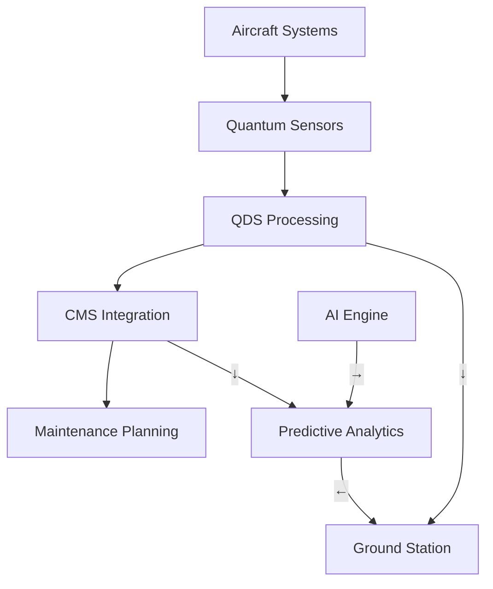
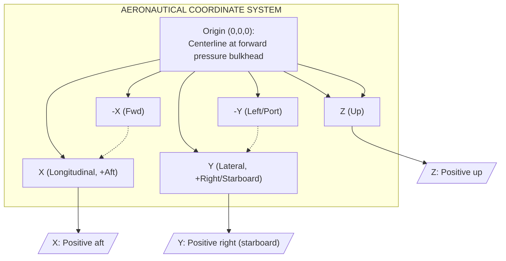
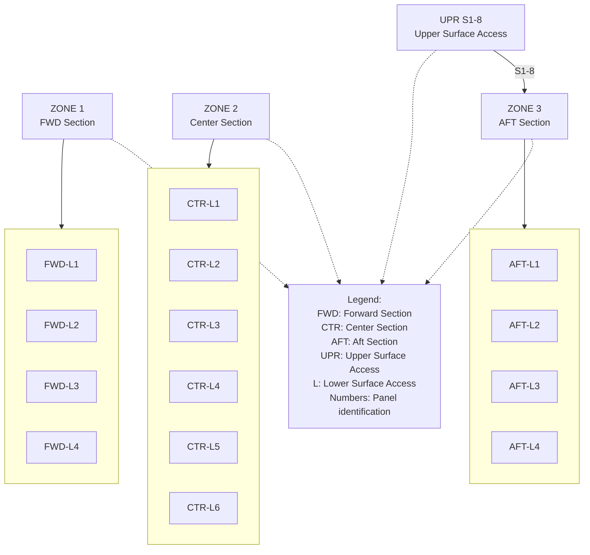
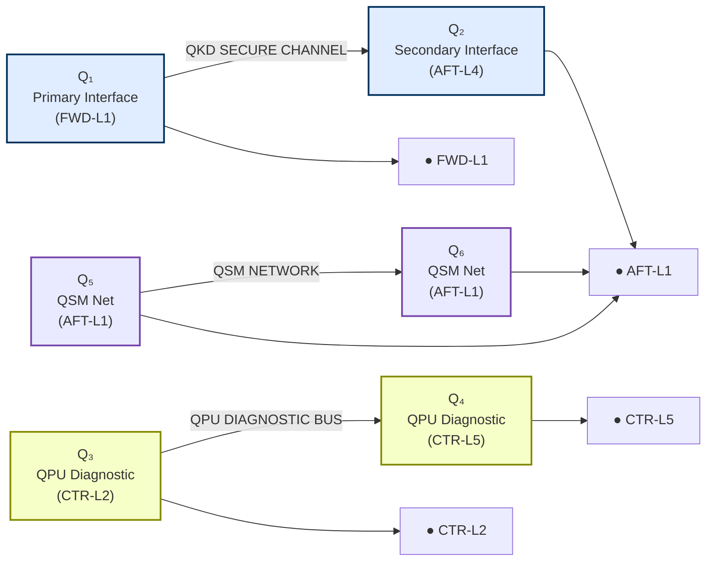
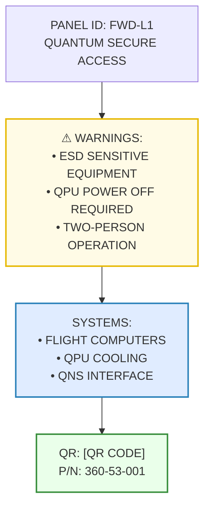

# AMPEL360 BWB-Q100 Servicing Overview
## ATA 00-40-00-00

**Document ID:** GAIA-QAO-AMPEL360-00-40-00-00  
**Version:** 2.0.0  
**Classification:** Technical Documentation  
**Date:** 2025-01-20  
**Author:** GAIA-QAO Technical Documentation Team

---

## 1. Introduction

### 1.1 Purpose
This document provides a comprehensive overview of the servicing philosophy, requirements, and procedures for the AMPEL360 BWB-Q100 quantum-enhanced aircraft. It establishes the foundational principles for all maintenance and servicing activities, integrating traditional aerospace practices with quantum-augmented diagnostic and monitoring capabilities.

### 1.2 Scope
This overview covers:
- Servicing philosophy and principles
- Integration with quantum diagnostic systems (QDS)
- Servicing access provisions
- Ground support equipment requirements
- Environmental and safety considerations
- Interface with the Central Maintenance System (CMS)

### 1.3 Document Structure
This document follows the GAIA-QAO standardized format and interfaces with:
- ATA 05: Time Limits/Maintenance Checks
- ATA 12: Servicing - Routine Maintenance
- ATA 45: Central Maintenance System
- ATA 46: Information Systems (Quantum-Enhanced)

---

## 2. Servicing Philosophy

### 2.1 Core Principles
The AMPEL360 servicing philosophy is built on five fundamental principles:

1. **Predictive Maintenance First**: Leverage quantum sensors and AI analytics to predict maintenance needs before failures occur
2. **Minimal Environmental Impact**: All servicing procedures designed for zero-waste operations
3. **Quantum-Enhanced Diagnostics**: Utilize QDS for ultra-precise system health monitoring
4. **Modular Architecture**: Enable rapid component replacement through standardized LRU interfaces
5. **Digital Thread Integration**: Maintain complete digital traceability throughout the service lifecycle

### 2.2 Quantum Advantage
The integration of quantum technologies provides:
- **10x improvement** in fault detection sensitivity
- **Real-time** structural health monitoring via quantum sensors
- **Predictive accuracy** exceeding 95% for critical systems
- **Secure data transmission** via quantum key distribution (QKD)

---

## 3. Servicing Categories

### 3.1 Line Maintenance
#### 3.1.1 Pre-flight Servicing
- **Duration**: 45-60 minutes (standard turnaround)
- **Quantum Systems Check**: 5-minute automated QDS sweep
- **Access Points**: 12 primary servicing panels (see Section 4)
- **GSE Required**: Standard + Quantum Interface Unit (QIU-100)

#### 3.1.2 Transit Servicing
- **Duration**: 20-30 minutes
- **Focus**: Fluid replenishment, tire pressure, quantum system status
- **Automated Systems**: 70% of checks performed by onboard diagnostics

#### 3.1.3 Post-flight Servicing
- **Duration**: 30-45 minutes
- **Data Download**: Quantum sensor data via high-speed optical link
- **Predictive Analysis**: AI-driven maintenance forecasting

### 3.2 Base Maintenance
#### 3.2.1 A-Check Equivalent (Quantum-Enhanced)
- **Interval**: 600 flight hours or 90 days
- **Quantum Calibration**: Required for all QDS nodes
- **Duration**: 8-12 hours with quantum system optimization

#### 3.2.2 C-Check Equivalent (Deep Quantum Analysis)
- **Interval**: 6000 flight hours or 18 months
- **Comprehensive QSM**: Full structural scan using quantum sensors
- **Component Life Analysis**: Quantum-computed RUL predictions

---

## 4. Servicing Access Provisions

### 4.1 Primary Access Points
The BWB configuration requires specialized access considerations:

| Location | Panel ID | Systems Accessed | Quantum Interface |
|----------|----------|------------------|-------------------|
| Forward Lower | FWD-L1 to L4 | Avionics, QPU Cooling | Yes - QKD secured |
| Center Lower | CTR-L1 to L6 | Fuel, Hydraulics, Batteries | Yes - QSM nodes |
| Aft Lower | AFT-L1 to L4 | APU, Propulsion Controls | Yes - QASM interface |
| Upper Surface | UPR-S1 to S8 | ECS, Passenger Services | No |

### 4.2 Quantum System Access
Special provisions for quantum components:
- **Vibration-isolated compartments** for QPU access
- **Magnetically shielded panels** for quantum sensor maintenance
- **Temperature-controlled access zones** (maintained at 20°C ±0.5°C)

---

## 5. Ground Support Equipment (GSE)

### 5.1 Standard GSE Requirements
- Conventional servicing carts and equipment per ATA 12
- Nitrogen servicing unit (OBIGGS replenishment)
- Hydraulic test stands (5000 psi capability)
- Electrical power units (400Hz, 115/200V AC)

### 5.2 Quantum-Specific GSE
#### 5.2.1 Quantum Interface Unit (QIU-100)
- **Function**: Interface with onboard quantum systems
- **Capabilities**: 
  - QPU state verification
  - Quantum sensor calibration
  - QKD key exchange for secure data transfer
- **Power**: 28V DC, 10A max
- **Data Interface**: Optical fiber, 100 Gbps

#### 5.2.2 Quantum Diagnostic Cart (QDC-200)
- **Function**: Mobile quantum system testing
- **Features**:
  - Portable dilution refrigerator for QPU testing
  - Quantum state tomography capability
  - Integrated classical computing for hybrid algorithms

### 5.3 Digital Twin Interface Station (DTIS-300)
- **Function**: Real-time synchronization with aircraft digital twin
- **Updates**: Quantum sensor data integration
- **Predictive Modeling**: AI-driven maintenance scheduling

---

## 6. Servicing Fluids and Materials

### 6.1 Conventional Fluids
| Fluid Type | Specification | Quantum Compatibility | Environmental Rating |
|------------|---------------|----------------------|---------------------|
| Hydraulic Fluid | MIL-PRF-87257 | Verified - No interference | Biodegradable |
| Engine Oil | SAE AS5780 Type IV | Verified | Low toxicity |
| Coolant (QPU) | GAIA-QCS-100 | Required for quantum systems | Zero ozone depletion |

### 6.2 Quantum System Specific Materials
- **Cryogenic Fluids**: Liquid helium for QPU cooling (when required)
- **Optical Cleaning**: IPA 99.9% for quantum optical components
- **Magnetic Shielding Paste**: μ-metal compound for field-sensitive areas

---

## 7. Environmental Considerations

### 7.1 Waste Management
- **Zero-waste target**: 100% fluid recovery and recycling
- **Quantum waste**: Specialized handling for quantum materials
- **Carbon tracking**: Real-time emissions monitoring during servicing

### 7.2 Noise Reduction
- **Servicing equipment**: Maximum 65 dB(A) at 10 meters
- **Quantum systems**: Silent operation (no mechanical pumps during standby)

### 7.3 Energy Efficiency
- **GSE power**: 50% from renewable sources minimum
- **Quantum advantage**: 30% reduction in diagnostic time = lower energy use

---

## 8. Safety Requirements

### 8.1 Personnel Safety
#### 8.1.1 Conventional Hazards
- Standard PPE requirements per aerospace industry standards
- Lockout/tagout procedures for all systems
- Fall protection for upper surface access

#### 8.1.2 Quantum-Specific Hazards
- **Magnetic Fields**: Areas marked for pacemaker warnings
- **Cryogenic Exposure**: Special training required for QPU servicing
- **Laser Safety**: Class 3B laser protection for optical quantum systems

### 8.2 Quantum Security Protocols
- **Access Control**: Quantum-secured authentication for sensitive systems
- **Data Protection**: All maintenance data encrypted via QKD
- **Tampering Detection**: Quantum seals on critical components

---

## 9. Training Requirements

### 9.1 Basic Servicing Certification
- **Duration**: 40 hours initial + 8 hours annual recurrent
- **Topics**: BWB-specific procedures, sustainability practices
- **Certification**: GAIA-QAO Level 1 Technician

### 9.2 Quantum Systems Specialist
- **Prerequisites**: Level 1 + 2 years experience
- **Duration**: 80 hours specialized training
- **Topics**: Quantum mechanics basics, QPU operation, QDS calibration
- **Certification**: GAIA-QAO Quantum Specialist (QS)

---

## 10. Integration with Central Maintenance System

### 10.1 Real-Time Data Flow

### 10.2 Automated Servicing Triggers
- **Fluid Levels**: Auto-alert when below 20% reserve
- **Component Life**: Quantum-computed RUL alerts
- **Anomaly Detection**: AI-flagged deviations from quantum baseline

---

## 11. Records and Documentation

### 11.1 Digital Records
- **Blockchain Integration**: Immutable maintenance records
- **Quantum Signatures**: Cryptographically secure service logs
- **Cloud Sync**: Real-time updates to GAIA-QAO maintenance cloud

### 11.2 Compliance Tracking
- **Regulatory Compliance**: Automated AD/SB tracking
- **Quantum Calibration Records**: Maintained for 10 years minimum
- **Environmental Impact**: Carbon footprint per servicing event

---

## 12. Future Developments

### 12.1 Autonomous Servicing
- **Target**: 50% autonomous servicing by 2030
- **Technologies**: Robotic systems with quantum sensing
- **Human Oversight**: Always maintained for safety-critical tasks

### 12.2 Advanced Quantum Integration
- **Room-Temperature QPU**: Eliminate cryogenic servicing needs
- **Distributed Quantum Network**: Aircraft-to-ground quantum entanglement
- **Self-Healing Materials**: Quantum-monitored adaptive structures

---

## 13. References

1. GAIA-QAO-AMPEL360-05-00-00-00: Time Limits and Maintenance Checks
2. GAIA-QAO-AMPEL360-12-00-00-00: Servicing Procedures
3. GAIA-QAO-AMPEL360-45-00-00-00: Central Maintenance System
4. GAIA-QAO-AMPEL360-46-00-00-00: Information Systems
5. GAIA-QAO-QDS-SPEC-001: Quantum Diagnostic Systems Specification
6. GAIA-QAO-GSE-CATALOG-2025: Ground Support Equipment Catalog

---

## 14. Revision History

| Version | Date | Author | Description |
|---------|------|--------|-------------|
| 1.0.0 | 2024-06-15 | QAO Tech Team | Initial Release |
| 1.1.0 | 2024-09-20 | Dr. M. Chen | Added quantum servicing procedures |
| 2.0.0 | 2025-01-20 | QAO Tech Team | Major update: Enhanced quantum integration |

---

## 15. Appendices

### Appendix A: Servicing Panel Locations (Diagrams)
[Reference to detailed technical drawings]

### Appendix B: Quantum System Servicing Flowcharts
[Reference to procedural flowcharts]

### Appendix C: GSE Compatibility Matrix
[Reference to equipment compatibility tables]

### Appendix D: Environmental Impact Calculations
[Reference to sustainability metrics]

---# Appendix A: Servicing Panel Locations
## AMPEL360 BWB-Q100 Technical Reference

**Document ID:** GAIA-QAO-AMPEL360-00-40-00-00-APP-A  
**Version:** 2.0.0  
**Classification:** Technical Reference  
**Date:** 2025-01-20  
**Scale:** All dimensions in meters unless specified

---

## A.1 Aircraft Coordinate System

## A.2 Overall Panel Layout - Plan View

---

## A.3 Panel Location Details - Side View

---

## A.4 Detailed Panel Specifications

### A.4.1 Forward Section Panels (ZONE 1)

#### FWD-L1: Forward Avionics Bay Access
- **Location**: X: 3.5-5.0, Y: -2.0, Z: -1.2
- **Dimensions**: 1.5m × 1.0m
- **Access Type**: Hinged, hydraulic assist
- **Systems Accessed**:
  - Primary Flight Computers
  - QPU Cooling System Interface
  - Quantum Navigation System (QNS) 
  - Weather Radar Electronics
- **Quantum Interface**: QKD-secured data port
- **GSE Required**: QIU-100, Standard electrical cart
- **Access Code**: FOXTROT-LIMA-01

#### FWD-L2: Forward Electrical Center
- **Location**: X: 3.5-5.0, Y: 2.0, Z: -1.2
- **Dimensions**: 1.5m × 1.0m
- **Access Type**: Hinged, hydraulic assist
- **Systems Accessed**:
  - Electrical Distribution Panels
  - Battery Compartment 1
  - Quantum Power Management Unit (QPMU)
  - Circuit Breaker Panels
- **Quantum Interface**: Power monitoring nodes
- **GSE Required**: GPU, Battery cart
- **Access Code**: FOXTROT-LIMA-02

#### FWD-L3: Nose Landing Gear Bay
- **Location**: X: 6.0-8.0, Y: -1.0, Z: -1.5
- **Dimensions**: 2.0m × 2.0m
- **Access Type**: Hydraulic bi-fold doors
- **Systems Accessed**:
  - NLG Mechanism
  - Hydraulic Lines
  - Wheel Well Quantum Sensors
  - Anti-skid System
- **Quantum Interface**: QSM strain sensors
- **GSE Required**: Hydraulic test stand, Jack
- **Access Code**: FOXTROT-LIMA-03

#### FWD-L4: Environmental Control Access
- **Location**: X: 6.0-8.0, Y: 1.0, Z: -1.5
- **Dimensions**: 2.0m × 2.0m
- **Access Type**: Removable panel, quick-release
- **Systems Accessed**:
  - ECS Pack 1
  - Air Cycle Machine
  - Quantum Air Quality Sensors
  - Cabin Pressure Controller
- **Quantum Interface**: Environmental monitoring grid
- **GSE Required**: Pressure test unit
- **Access Code**: FOXTROT-LIMA-04

### A.4.2 Center Section Panels (ZONE 2)

#### CTR-L1: Port Wing Root Systems
- **Location**: X: 26.0-28.0, Y: -12.0, Z: -0.8
- **Dimensions**: 2.0m × 1.5m
- **Access Type**: Sliding panel, powered
- **Systems Accessed**:
  - Fuel System Valves
  - Hydraulic Distribution
  - Flight Control Actuators
  - Quantum Fuel Monitoring
- **Quantum Interface**: Fuel quantum sensors
- **GSE Required**: Fuel truck interface
- **Access Code**: CHARLIE-LIMA-01

#### CTR-L2: Port Battery Bay
- **Location**: X: 28.5-30.5, Y: -10.0, Z: -0.8
- **Dimensions**: 2.0m × 1.5m
- **Access Type**: Hinged, interlocked
- **Systems Accessed**:
  - Main Battery Pack 2
  - Battery Management System
  - Quantum Thermal Monitoring
  - Emergency Power Unit
- **Quantum Interface**: Battery health QPU
- **GSE Required**: Battery cart, thermal camera
- **Access Code**: CHARLIE-LIMA-02

#### CTR-L3: Center Cargo Systems
- **Location**: X: 31.0-34.0, Y: -2.0, Z: -1.0
- **Dimensions**: 3.0m × 2.0m
- **Access Type**: Powered cargo door
- **Systems Accessed**:
  - Cargo Loading System
  - Lower Lobe Air Conditioning
  - Quantum Cargo Monitoring
  - Fire Suppression System
- **Quantum Interface**: Cargo security QKD
- **GSE Required**: Cargo loader
- **Access Code**: CHARLIE-LIMA-03

#### CTR-L4: Main Landing Gear Bay Port
- **Location**: X: 35.0-38.0, Y: -8.0, Z: -1.5
- **Dimensions**: 3.0m × 3.0m
- **Access Type**: Hydraulic clamshell doors
- **Systems Accessed**:
  - MLG Port Mechanism
  - Brake System
  - Quantum Brake Monitoring
  - Tire Pressure System
- **Quantum Interface**: Landing stress QSM
- **GSE Required**: MLG jack, brake cart
- **Access Code**: CHARLIE-LIMA-04

#### CTR-L5: Main Landing Gear Bay Starboard
- **Location**: X: 35.0-38.0, Y: 8.0, Z: -1.5
- **Dimensions**: 3.0m × 3.0m
- **Access Type**: Hydraulic clamshell doors
- **Systems Accessed**:
  - MLG Starboard Mechanism
  - Brake System
  - Quantum Brake Monitoring
  - Tire Pressure System
- **Quantum Interface**: Landing stress QSM
- **GSE Required**: MLG jack, brake cart
- **Access Code**: CHARLIE-LIMA-05

#### CTR-L6: Starboard Wing Root Systems
- **Location**: X: 26.0-28.0, Y: 12.0, Z: -0.8
- **Dimensions**: 2.0m × 1.5m
- **Access Type**: Sliding panel, powered
- **Systems Accessed**:
  - Fuel System Valves
  - Hydraulic Distribution
  - Flight Control Actuators
  - Quantum Fuel Monitoring
- **Quantum Interface**: Fuel quantum sensors
- **GSE Required**: Fuel truck interface
- **Access Code**: CHARLIE-LIMA-06

### A.4.3 Aft Section Panels (ZONE 3)

#### AFT-L1: APU Compartment
- **Location**: X: 65.0-67.0, Y: 0.0, Z: -1.0
- **Dimensions**: 2.0m × 2.0m
- **Access Type**: Hydraulic lift door
- **Systems Accessed**:
  - Auxiliary Power Unit
  - APU Generator
  - Fire Detection/Suppression
  - Quantum APU Monitoring
- **Quantum Interface**: APU health QPU
- **GSE Required**: APU test cart
- **Access Code**: ALPHA-LIMA-01

#### AFT-L2: Port Engine Interface
- **Location**: X: 62.0-64.0, Y: -6.0, Z: -0.5
- **Dimensions**: 2.0m × 1.5m
- **Access Type**: Quick-release panels
- **Systems Accessed**:
  - Engine Control Cables
  - Fuel Lines
  - Quantum Engine Interface
  - Thrust Reverser Controls
- **Quantum Interface**: Engine QPU link
- **GSE Required**: Engine trim box
- **Access Code**: ALPHA-LIMA-02

#### AFT-L3: Starboard Engine Interface
- **Location**: X: 62.0-64.0, Y: 6.0, Z: -0.5
- **Dimensions**: 2.0m × 1.5m
- **Access Type**: Quick-release panels
- **Systems Accessed**:
  - Engine Control Cables
  - Fuel Lines
  - Quantum Engine Interface
  - Thrust Reverser Controls
- **Quantum Interface**: Engine QPU link
- **GSE Required**: Engine trim box
- **Access Code**: ALPHA-LIMA-03

#### AFT-L4: Aft Electrical Bay
- **Location**: X: 68.0-70.0, Y: 0.0, Z: -1.0
- **Dimensions**: 2.0m × 1.5m
- **Access Type**: Hinged, key-locked
- **Systems Accessed**:
  - Aft Electrical Distribution
  - Emergency Locator Transmitter
  - Quantum Communications Array
  - Tail Navigation Lights
- **Quantum Interface**: QKD communications
- **GSE Required**: Electrical test unit
- **Access Code**: ALPHA-LIMA-04

### A.4.4 Upper Surface Panels (UPR-S1 through UPR-S8)

#### UPR-S1-S4: Forward Upper Access
- **Location Zone**: X: 15.0-25.0, Y: -10.0 to 10.0, Z: +4.5
- **Dimensions**: 2.0m × 1.0m each
- **Access Type**: Flush-mounted, cam-lock
- **Systems Accessed**:
  - Passenger Service Units
  - Overhead Bins Mechanisms
  - Emergency Oxygen System
  - Upper Deck Lighting
- **Quantum Interface**: None
- **GSE Required**: Elevated platform
- **Special Requirements**: Fall protection mandatory

#### UPR-S5-S8: Aft Upper Access
- **Location Zone**: X: 45.0-55.0, Y: -10.0 to 10.0, Z: +4.5
- **Dimensions**: 2.0m × 1.0m each
- **Access Type**: Flush-mounted, cam-lock
- **Systems Accessed**:
  - Aft Cabin Systems
  - Smoke Detection Grid
  - Cabin Pressure Relief Valves
  - Entertainment System Nodes
- **Quantum Interface**: Cabin environment QSM
- **GSE Required**: Elevated platform
- **Special Requirements**: Fall protection mandatory

---

## A.5 Quantum Interface Points Map

---

## A.6 Access Requirements Matrix

| Panel ID | Ladder | Platform | Power Off | Fuel Defuel | Special PPE | Min Crew |
|----------|---------|----------|-----------|-------------|-------------|----------|
| FWD-L1   | No      | No       | Yes*      | No          | ESD strap   | 2        |
| FWD-L2   | No      | No       | Yes       | No          | Arc flash   | 2        |
| FWD-L3   | Yes     | No       | No        | No          | None        | 1        |
| FWD-L4   | No      | No       | No        | No          | None        | 1        |
| CTR-L1   | Yes     | Yes      | No        | Yes†        | Fuel resist | 2        |
| CTR-L2   | Yes     | No       | Yes       | No          | Arc flash   | 2        |
| CTR-L3   | No      | No       | No        | No          | None        | 1        |
| CTR-L4   | Yes     | Yes      | No        | No          | None        | 2        |
| CTR-L5   | Yes     | Yes      | No        | No          | None        | 2        |
| CTR-L6   | Yes     | Yes      | No        | Yes†        | Fuel resist | 2        |
| AFT-L1   | Yes     | No       | APU Off   | No          | Hearing     | 2        |
| AFT-L2   | Yes     | No       | No        | No          | None        | 1        |
| AFT-L3   | Yes     | No       | No        | No          | None        | 1        |
| AFT-L4   | Yes     | No       | Partial‡  | No          | ESD strap   | 2        |
| UPR-S1-8 | Special | Yes      | No        | No          | Fall arrest | 3        |

*QPU systems only  
†For fuel system access only  
‡QKD system isolation required

---

## A.7 Panel Opening Sequences

### A.7.1 Standard Mechanical Panels
1. Verify aircraft safety (chocks, ground power if required)
2. Check panel access code authorization
3. Release panel locks (quarter-turn fasteners)
4. Open panel using prescribed method
5. Install panel support strut if equipped
6. Verify systems safe for access

### A.7.2 Quantum-Secured Panels
1. Complete standard mechanical panel steps 1-2
2. Connect QIU-100 to quantum interface port
3. Initiate QKD authentication sequence
4. Wait for quantum handshake (5-10 seconds)
5. Green LED confirms access granted
6. Proceed with mechanical opening sequence
7. Note: Panel will auto-lock after 60 minutes

### A.7.3 Powered/Hydraulic Panels
1. Verify hydraulic/electrical power available
2. Clear area of personnel and equipment
3. Press and hold OPEN button for 3 seconds
4. Monitor panel movement (15-20 seconds typical)
5. Verify FULL OPEN indication
6. Install safety lock pin before entry

---

## A.8 Special Considerations for BWB Configuration

### A.8.1 Pressure Vessel Integrity
- All panels penetrating the pressure vessel have dual seals
- Pressure test required after panel R&R
- Maximum 15 panels may be open simultaneously
- Cabin pressure must be 0 PSID for panels marked with ▲

### A.8.2 Structural Loading
- BWB structure requires even weight distribution
- Use of multiple access stands recommended
- Maximum point load on upper surface: 150 kg/m²
- Designated walkways marked with green striping

### A.8.3 Electromagnetic Compatibility
- Quantum systems sensitive to EMI
- Maintain 2-meter separation from quantum panels when using:
  - Radio transmitters
  - Arc welding equipment
  - Motor-driven tools
- Use only certified non-magnetic tools near Q-marked panels

---

## A.9 Emergency Access Procedures

### A.9.1 Rapid Access Panels (Emergency Response)
- **Panels**: FWD-L1, CTR-L3, AFT-L1
- **Feature**: Red emergency release handles
- **Activation**: Pull handle with 40 lbs force
- **Result**: Panel jettisons outward
- **Caution**: Stand clear - panel weighs 25-35 kg

### A.9.2 Fire Suppression Access
- **Primary**: Through nearest L-series panel
- **Integrated ports**: Every 10 meters along lower lobe
- **Halon/Water injection**: Standard AN fittings
- **Quantum safe**: Fire suppression compatible with quantum systems

---

## A.10 Panel Maintenance

### A.10.1 Scheduled Inspections
| Inspection Type | Interval | Items Checked |
|----------------|----------|---------------|
| Visual | Pre-flight | Latches, seals, damage |
| Functional | A-Check | Hinges, actuators, locks |
| Detailed | C-Check | Seal replacement, NDT |
| Quantum Cal | 90 days | Q-interface verification |

### A.10.2 Common Discrepancies
1. **Seal Degradation**: UV/ozone damage to door seals
2. **Latch Wear**: Quarter-turn fastener thread wear
3. **Quantum Drift**: QKD synchronization errors
4. **Hinge Binding**: Lack of lubrication on powered panels

---

## A.11 Reference Documents

1. AMPEL360-SRM-53-40-00: Panel Structural Repair Manual
2. AMPEL360-WDM-20-10-00: Standard Wiring Practices
3. GAIA-QAO-QSS-001: Quantum System Safety Manual
4. AMPEL360-MM-12-20-00: Servicing Equipment Manual

---

## A.12 Panel Identification Placard Example

---

**END OF APPENDIX A**

*Drawings current as of Version 2.0.0. For latest revisions, consult GAIA-QAO Digital Technical Library.*

**END OF DOCUMENT**

*This document is part of the GAIA-QAO AMPEL360 BWB-Q100 Technical Documentation Suite. For questions or updates, contact the GAIA-QAO Technical Publications Department.*
