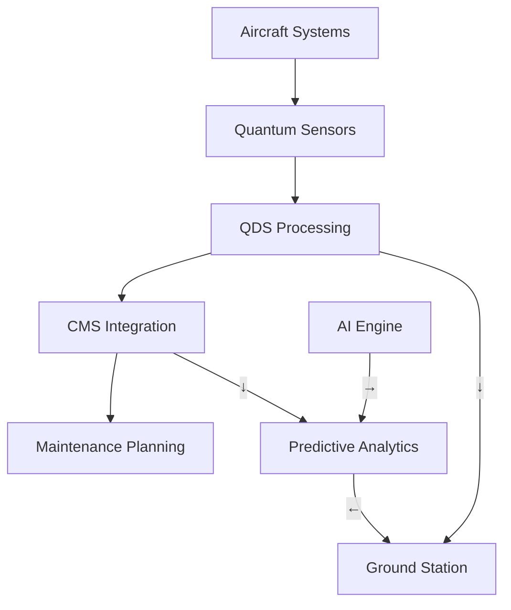

# AMPEL360 BWB-Q100 Servicing Overview
## ATA 00-40-00-00

**Document ID:** GAIA-QAO-AMPEL360-00-40-00-00  
**Version:** 2.0.0  
**Classification:** Technical Documentation  
**Date:** 2025-01-20  
**Author:** GAIA-QAO Technical Documentation Team

---

## 1. Introduction

### 1.1 Purpose
This document provides a comprehensive overview of the servicing philosophy, requirements, and procedures for the AMPEL360 BWB-Q100 quantum-enhanced aircraft. It establishes the foundational principles for all maintenance and servicing activities, integrating traditional aerospace practices with quantum-augmented diagnostic and monitoring capabilities.

### 1.2 Scope
This overview covers:
- Servicing philosophy and principles
- Integration with quantum diagnostic systems (QDS)
- Servicing access provisions
- Ground support equipment requirements
- Environmental and safety considerations
- Interface with the Central Maintenance System (CMS)

### 1.3 Document Structure
This document follows the GAIA-QAO standardized format and interfaces with:
- ATA 05: Time Limits/Maintenance Checks
- ATA 12: Servicing - Routine Maintenance
- ATA 45: Central Maintenance System
- ATA 46: Information Systems (Quantum-Enhanced)

---

## 2. Servicing Philosophy

### 2.1 Core Principles
The AMPEL360 servicing philosophy is built on five fundamental principles:

1. **Predictive Maintenance First**: Leverage quantum sensors and AI analytics to predict maintenance needs before failures occur
2. **Minimal Environmental Impact**: All servicing procedures designed for zero-waste operations
3. **Quantum-Enhanced Diagnostics**: Utilize QDS for ultra-precise system health monitoring
4. **Modular Architecture**: Enable rapid component replacement through standardized LRU interfaces
5. **Digital Thread Integration**: Maintain complete digital traceability throughout the service lifecycle

### 2.2 Quantum Advantage
The integration of quantum technologies provides:
- **10x improvement** in fault detection sensitivity
- **Real-time** structural health monitoring via quantum sensors
- **Predictive accuracy** exceeding 95% for critical systems
- **Secure data transmission** via quantum key distribution (QKD)

---

## 3. Servicing Categories

### 3.1 Line Maintenance
#### 3.1.1 Pre-flight Servicing
- **Duration**: 45-60 minutes (standard turnaround)
- **Quantum Systems Check**: 5-minute automated QDS sweep
- **Access Points**: 12 primary servicing panels (see Section 4)
- **GSE Required**: Standard + Quantum Interface Unit (QIU-100)

#### 3.1.2 Transit Servicing
- **Duration**: 20-30 minutes
- **Focus**: Fluid replenishment, tire pressure, quantum system status
- **Automated Systems**: 70% of checks performed by onboard diagnostics

#### 3.1.3 Post-flight Servicing
- **Duration**: 30-45 minutes
- **Data Download**: Quantum sensor data via high-speed optical link
- **Predictive Analysis**: AI-driven maintenance forecasting

### 3.2 Base Maintenance
#### 3.2.1 A-Check Equivalent (Quantum-Enhanced)
- **Interval**: 600 flight hours or 90 days
- **Quantum Calibration**: Required for all QDS nodes
- **Duration**: 8-12 hours with quantum system optimization

#### 3.2.2 C-Check Equivalent (Deep Quantum Analysis)
- **Interval**: 6000 flight hours or 18 months
- **Comprehensive QSM**: Full structural scan using quantum sensors
- **Component Life Analysis**: Quantum-computed RUL predictions

---

## 4. Servicing Access Provisions

### 4.1 Primary Access Points
The BWB configuration requires specialized access considerations:

| Location | Panel ID | Systems Accessed | Quantum Interface |
|----------|----------|------------------|-------------------|
| Forward Lower | FWD-L1 to L4 | Avionics, QPU Cooling | Yes - QKD secured |
| Center Lower | CTR-L1 to L6 | Fuel, Hydraulics, Batteries | Yes - QSM nodes |
| Aft Lower | AFT-L1 to L4 | APU, Propulsion Controls | Yes - QASM interface |
| Upper Surface | UPR-S1 to S8 | ECS, Passenger Services | No |

### 4.2 Quantum System Access
Special provisions for quantum components:
- **Vibration-isolated compartments** for QPU access
- **Magnetically shielded panels** for quantum sensor maintenance
- **Temperature-controlled access zones** (maintained at 20°C ±0.5°C)

---

## 5. Ground Support Equipment (GSE)

### 5.1 Standard GSE Requirements
- Conventional servicing carts and equipment per ATA 12
- Nitrogen servicing unit (OBIGGS replenishment)
- Hydraulic test stands (5000 psi capability)
- Electrical power units (400Hz, 115/200V AC)

### 5.2 Quantum-Specific GSE
#### 5.2.1 Quantum Interface Unit (QIU-100)
- **Function**: Interface with onboard quantum systems
- **Capabilities**: 
  - QPU state verification
  - Quantum sensor calibration
  - QKD key exchange for secure data transfer
- **Power**: 28V DC, 10A max
- **Data Interface**: Optical fiber, 100 Gbps

#### 5.2.2 Quantum Diagnostic Cart (QDC-200)
- **Function**: Mobile quantum system testing
- **Features**:
  - Portable dilution refrigerator for QPU testing
  - Quantum state tomography capability
  - Integrated classical computing for hybrid algorithms

### 5.3 Digital Twin Interface Station (DTIS-300)
- **Function**: Real-time synchronization with aircraft digital twin
- **Updates**: Quantum sensor data integration
- **Predictive Modeling**: AI-driven maintenance scheduling

---

## 6. Servicing Fluids and Materials

### 6.1 Conventional Fluids
| Fluid Type | Specification | Quantum Compatibility | Environmental Rating |
|------------|---------------|----------------------|---------------------|
| Hydraulic Fluid | MIL-PRF-87257 | Verified - No interference | Biodegradable |
| Engine Oil | SAE AS5780 Type IV | Verified | Low toxicity |
| Coolant (QPU) | GAIA-QCS-100 | Required for quantum systems | Zero ozone depletion |

### 6.2 Quantum System Specific Materials
- **Cryogenic Fluids**: Liquid helium for QPU cooling (when required)
- **Optical Cleaning**: IPA 99.9% for quantum optical components
- **Magnetic Shielding Paste**: μ-metal compound for field-sensitive areas

---

## 7. Environmental Considerations

### 7.1 Waste Management
- **Zero-waste target**: 100% fluid recovery and recycling
- **Quantum waste**: Specialized handling for quantum materials
- **Carbon tracking**: Real-time emissions monitoring during servicing

### 7.2 Noise Reduction
- **Servicing equipment**: Maximum 65 dB(A) at 10 meters
- **Quantum systems**: Silent operation (no mechanical pumps during standby)

### 7.3 Energy Efficiency
- **GSE power**: 50% from renewable sources minimum
- **Quantum advantage**: 30% reduction in diagnostic time = lower energy use

---

## 8. Safety Requirements

### 8.1 Personnel Safety
#### 8.1.1 Conventional Hazards
- Standard PPE requirements per aerospace industry standards
- Lockout/tagout procedures for all systems
- Fall protection for upper surface access

#### 8.1.2 Quantum-Specific Hazards
- **Magnetic Fields**: Areas marked for pacemaker warnings
- **Cryogenic Exposure**: Special training required for QPU servicing
- **Laser Safety**: Class 3B laser protection for optical quantum systems

### 8.2 Quantum Security Protocols
- **Access Control**: Quantum-secured authentication for sensitive systems
- **Data Protection**: All maintenance data encrypted via QKD
- **Tampering Detection**: Quantum seals on critical components

---

## 9. Training Requirements

### 9.1 Basic Servicing Certification
- **Duration**: 40 hours initial + 8 hours annual recurrent
- **Topics**: BWB-specific procedures, sustainability practices
- **Certification**: GAIA-QAO Level 1 Technician

### 9.2 Quantum Systems Specialist
- **Prerequisites**: Level 1 + 2 years experience
- **Duration**: 80 hours specialized training
- **Topics**: Quantum mechanics basics, QPU operation, QDS calibration
- **Certification**: GAIA-QAO Quantum Specialist (QS)

---

## 10. Integration with Central Maintenance System

### 10.1 Real-Time Data Flow

### 10.2 Automated Servicing Triggers
- **Fluid Levels**: Auto-alert when below 20% reserve
- **Component Life**: Quantum-computed RUL alerts
- **Anomaly Detection**: AI-flagged deviations from quantum baseline

---

## 11. Records and Documentation

### 11.1 Digital Records
- **Blockchain Integration**: Immutable maintenance records
- **Quantum Signatures**: Cryptographically secure service logs
- **Cloud Sync**: Real-time updates to GAIA-QAO maintenance cloud

### 11.2 Compliance Tracking
- **Regulatory Compliance**: Automated AD/SB tracking
- **Quantum Calibration Records**: Maintained for 10 years minimum
- **Environmental Impact**: Carbon footprint per servicing event

---

## 12. Future Developments

### 12.1 Autonomous Servicing
- **Target**: 50% autonomous servicing by 2030
- **Technologies**: Robotic systems with quantum sensing
- **Human Oversight**: Always maintained for safety-critical tasks

### 12.2 Advanced Quantum Integration
- **Room-Temperature QPU**: Eliminate cryogenic servicing needs
- **Distributed Quantum Network**: Aircraft-to-ground quantum entanglement
- **Self-Healing Materials**: Quantum-monitored adaptive structures

---

## 13. References

1. GAIA-QAO-AMPEL360-05-00-00-00: Time Limits and Maintenance Checks
2. GAIA-QAO-AMPEL360-12-00-00-00: Servicing Procedures
3. GAIA-QAO-AMPEL360-45-00-00-00: Central Maintenance System
4. GAIA-QAO-AMPEL360-46-00-00-00: Information Systems
5. GAIA-QAO-QDS-SPEC-001: Quantum Diagnostic Systems Specification
6. GAIA-QAO-GSE-CATALOG-2025: Ground Support Equipment Catalog

---

## 14. Revision History

| Version | Date | Author | Description |
|---------|------|--------|-------------|
| 1.0.0 | 2024-06-15 | QAO Tech Team | Initial Release |
| 1.1.0 | 2024-09-20 | Dr. M. Chen | Added quantum servicing procedures |
| 2.0.0 | 2025-01-20 | QAO Tech Team | Major update: Enhanced quantum integration |

---

## 15. Appendices

### Appendix A: Servicing Panel Locations (Diagrams)
[Reference to detailed technical drawings]

### Appendix B: Quantum System Servicing Flowcharts
[Reference to procedural flowcharts]

### Appendix C: GSE Compatibility Matrix
[Reference to equipment compatibility tables]

### Appendix D: Environmental Impact Calculations
[Reference to sustainability metrics]

---

**END OF DOCUMENT**

*This document is part of the GAIA-QAO AMPEL360 BWB-Q100 Technical Documentation Suite. For questions or updates, contact the GAIA-QAO Technical Publications Department.*
