# AMPEL360 BWB-Q100 Transit Service Procedures
## Document ID: 00-40-10-03-TransitService
### ATA Chapter: 00-40-10 (Servicing - Transit Operations)
### Version: 1.0.0
### Date: 2025-01-20
### Status: Initial Release

---

## Table of Contents
1. [Introduction](#1-introduction)
2. [Transit Service Overview](#2-transit-service-overview)
3. [Transit Service Categories](#3-transit-service-categories)
4. [Pre-Arrival Transit Planning](#4-pre-arrival-transit-planning)
5. [Aircraft Configuration for Transit](#5-aircraft-configuration-for-transit)
6. [Quantum System Transit Management](#6-quantum-system-transit-management)
7. [Passenger Transit Procedures](#7-passenger-transit-procedures)
8. [Limited Service Operations](#8-limited-service-operations)
9. [Fuel-Only Transit Procedures](#9-fuel-only-transit-procedures)
10. [Through-Flight Operations](#10-through-flight-operations)
11. [Emergency Transit Procedures](#11-emergency-transit-procedures)
12. [Documentation and Reporting](#12-documentation-and-reporting)

---

## 1. Introduction

### 1.1 Purpose
This document defines procedures for transit servicing of the AMPEL360 BWB-Q100, where the aircraft makes intermediate stops with minimal ground time while maintaining operational readiness and quantum system integrity.

### 1.2 Scope
Covers all ground operations during transit stops, typically 20-45 minutes, where the aircraft remains in an active state with engines running or on APU power.

### 1.3 Key Principles
- **Continuous Readiness**: Aircraft remains in near-flight configuration
- **Quantum Continuity**: Maintain quantum system coherence
- **Efficiency**: Minimize ground time without compromising safety
- **Flexibility**: Adapt to various transit scenarios
- **Sustainability**: Optimize resource usage during brief stops

---

## 2. Transit Service Overview

### 2.1 Transit Service Definition

Transit services are characterized by:
- Brief ground time (typically 20-45 minutes)
- Limited passenger movement
- Selective servicing only
- Maintained system readiness
- Continuous quantum system operation

### 2.2 Transit vs. Turnaround

| Aspect | Transit Service | Full Turnaround |
|--------|----------------|-----------------|
| Duration | 20-45 minutes | 45-90 minutes |
| Engine Status | May remain running | Shutdown |
| Quantum Systems | Stay active | Ground mode |
| Passenger Flow | Limited/None | Complete exchange |
| Services | Essential only | Comprehensive |
| Crew | Usually remains | May change |

### 2.3 BWB Transit Advantages
- Ground-level service access
- Rapid cargo door operation
- Distributed service points
- Maintained aerodynamic configuration
- Efficient passenger flow design

---

## 3. Transit Service Categories

### 3.1 Category A: Technical Stop
- **Duration**: 20-25 minutes
- **Purpose**: Fuel only, no passenger movement
- **Services**: Fuel, quick technical check
- **Quantum Status**: Full operation maintained

### 3.2 Category B: Passenger Transit
- **Duration**: 30-35 minutes
- **Purpose**: Partial passenger exchange
- **Services**: Limited cabin service, fuel as required
- **Quantum Status**: Active with monitoring

### 3.3 Category C: Crew Change Transit
- **Duration**: 35-45 minutes
- **Purpose**: Crew change with limited passenger movement
- **Services**: Crew change, fuel, limited cabin service
- **Quantum Status**: Handover protocols activated

### 3.4 Category D: Emergency Transit
- **Duration**: As required
- **Purpose**: Unscheduled stop for technical or medical reasons
- **Services**: As needed for situation
- **Quantum Status**: Situation-dependent protocols

---

## 4. Pre-Arrival Transit Planning

### 4.1 Automated Transit Notification

#### 4.1.1 ACARS Transit Message Format
```
TRANSIT REQUIREMENTS - FLIGHT QA100
Category: B (Passenger Transit)
ETA: 1435Z
Ground Time: 30 MIN
PAX: -15/+20
Fuel Required: 5,500 KG SAF-B50
Special Requirements: 
- QPU Coolant Check
- Medical Kit Replenishment
- Wheelchair Assistance x2
Quantum Status: Nominal
```

### 4.2 Ground Team Preparation

#### 4.2.1 Transit Ready Configuration
```
Transit Station Setup:
├── Fuel Truck: Pre-positioned
├── GPU: On standby (if needed)
├── Stairs/Bridges: Ready position
├── Ground Crew: Briefed and staged
├── Quantum Monitor: Active
└── Emergency Equipment: Positioned
```

### 4.3 Transit Service Planning Matrix

| Service | Cat A | Cat B | Cat C | Cat D |
|---------|-------|-------|-------|-------|
| Fuel | ✓ | As Req | ✓ | As Req |
| Passengers | ✗ | Limited | Limited | As Req |
| Cargo | ✗ | ✗ | ✗ | Emergency |
| Catering | ✗ | ✗ | Limited | ✗ |
| Waste | ✗ | Emergency | ✓ | As Req |
| Quantum Check | Auto | Auto | Manual | Full |

---

## 5. Aircraft Configuration for Transit

### 5.1 Engine Configuration Options

#### 5.1.1 Single Engine Operation
For transits >25 minutes:
```
Engine Configuration - Single Engine:
1. Engine #2 (Right) remains running
2. Engine #1 (Left) shutdown
3. APU on standby
4. Quantum systems on engine power
5. Hydraulic systems in transit mode
6. Electrical load management active
```

#### 5.1.2 APU-Only Operation
For quieter operations:
```
APU Transit Configuration:
1. Both engines shutdown
2. APU providing full services
3. Quantum cooling maintained
4. Reduced acoustic footprint
5. Ground power backup ready
6. 5-minute engine start capability
```

### 5.2 System Configuration

#### 5.2.1 Quantum System Transit Mode
- QPU remains at operational temperature
- QNS maintains alignment
- QSM continues monitoring
- Reduced data transmission rate
- Ground link established for monitoring

#### 5.2.2 Hybrid-Electric Transit Status
- Batteries in ready state
- Thermal management active
- Regenerative systems standby
- Quick start capability maintained

### 5.3 Cabin Configuration

#### 5.3.1 Transit Cabin Setup
```
Cabin Transit Configuration:
□ Seatbelt signs as required
□ Cabin lighting in transit mode
□ Galleys secured but accessible
□ Lavatories remain operational
□ IFE system in transit mode
□ Emergency equipment verified
□ Quantum zones access restricted
```

---

## 6. Quantum System Transit Management

### 6.1 Continuous Operation Protocols

#### 6.1.1 QPU Transit Management
```
QPU Transit Checklist:
□ Coherence monitoring active
□ Error correction running
□ Temperature variance <0.005K
□ Vibration damping verified
□ Ground link data rate confirmed
□ Next segment parameters loaded
□ Backup protocols ready
```

### 6.2 Transit Quantum Diagnostics

#### 6.2.1 Quick Health Assessment
- 3-minute automated diagnostic
- Real-time coherence verification
- Entanglement pair status
- System trend analysis
- Go/No-go determination

#### 6.2.2 Transit Alerts and Actions
| Alert Level | Indicator | Action Required | Max Time |
|-------------|-----------|-----------------|----------|
| Green | All nominal | Continue monitoring | N/A |
| Yellow | Minor deviation | Run diagnostic | 5 min |
| Amber | Degraded performance | Assess options | 10 min |
| Red | Critical issue | Full investigation | 20 min |

### 6.3 Data Management During Transit

#### 6.3.1 Quantum Data Handling
- Buffered storage during transit
- Priority data transmission
- Compressed diagnostic logs
- Secure ground link protocol
- Automated backup activation

---

## 7. Passenger Transit Procedures

### 7.1 Limited Passenger Exchange

#### 7.1.1 Transit Passenger Flow
```
BWB Transit Door Usage:
- Door 1L: Deplaning only
- Door 2L: Boarding only  
- Door 1R: Crew and emergency
- Door 2R: Service access
- Cargo Doors: Remain closed
- Service Panels: Limited access
```

### 7.2 Cabin Management

#### 7.2.1 Through Passenger Procedures
- Remain seated announcement
- Limited movement permitted
- Lavatory access controlled
- No catering service
- IFE system continues
- Safety briefing for new passengers

#### 7.2.2 Security Protocols
```
Transit Security Requirements:
1. Cabin security sweep if required
2. Through passenger verification
3. New passenger screening
4. Restricted area monitoring
5. Quantum zone security maintained
6. Documentation verification
```

### 7.3 Special Assistance Transit

#### 7.3.1 Reduced Mobility Passengers
- Priority deplaning/boarding
- Level boarding where possible
- Assistance equipment ready
- Extra time allocation
- Clear pathway maintenance

---

## 8. Limited Service Operations

### 8.1 Essential Services Only

#### 8.1.1 Fuel Service During Transit
```
Transit Fueling Procedure:
1. Single-point refueling only
2. Passengers may remain onboard (conditions apply)
3. No fuel truck movement during pax operations
4. Enhanced fire watch posted
5. Quantum fuel monitoring active
6. Maximum fuel rate restrictions
7. Communication protocol enhanced
```

### 8.2 Quick Technical Services

#### 8.2.1 Permitted Maintenance Actions
- Oil level checks and servicing
- Tire pressure verification
- External light inspection
- Pitot/static system check
- Quick BITE test review
- MEL item verification

#### 8.2.2 Restricted Actions
- No panel opening in quantum zones
- No hydraulic system maintenance
- No cargo compartment access
- No engine cowl opening
- No avionics bay access

### 8.3 Emergency Service Provisions

#### 8.3.1 Medical Supply Replenishment
- Quick-access medical kit location
- Sealed replacement protocol
- Documentation requirements
- Verification procedures

#### 8.3.2 Emergency Equipment Checks
- Slide pressure indicators
- Portable oxygen verification
- Emergency lighting test
- Quick evacuation path check

---

## 9. Fuel-Only Transit Procedures

### 9.1 Category A Operations

#### 9.1.1 Streamlined Fuel Service
```
20-Minute Fuel Stop Timeline:
T+0:   Aircraft blocks on
T+1:   Fuel truck positioned
T+2:   Bonding and connection
T+3:   Commence fueling
T+15:  Fueling complete
T+17:  Disconnect and clear
T+18:  Final checks
T+20:  Ready for departure
```

### 9.2 SAF Considerations

#### 9.2.1 Sustainable Fuel Verification
- Blend confirmation
- Temperature check
- Quality verification
- Documentation review
- Sustainability tracking

### 9.3 Fuel System Integration

#### 9.3.1 Quantum-Monitored Fueling
- Real-time quantity tracking
- Distribution optimization
- Temperature monitoring
- Contamination detection
- Automatic cut-off systems

---

## 10. Through-Flight Operations

### 10.1 Continuous Journey Management

#### 10.1.1 Through-Flight Configuration
- Passenger manifest continuity
- Cargo remains secured
- Catering not accessed
- Fuel only service
- Crew duty time management

### 10.2 International Transit Considerations

#### 10.2.1 Customs and Immigration
```
International Transit Requirements:
□ Sterile transit area maintained
□ Door sealing if required
□ Passenger segregation
□ Document verification
□ Security screening protocols
□ Health declaration updates
```

### 10.3 Technical Sector Requirements

#### 10.3.1 Weight and Balance Updates
- Passenger count verification
- Fuel load confirmation
- CG calculation update
- Performance data revision
- Automated system update

---

## 11. Emergency Transit Procedures

### 11.1 Unscheduled Stop Management

#### 11.1.1 Emergency Categories
1. **Medical Emergency**: Passenger/crew illness
2. **Technical Issue**: Non-critical malfunction
3. **Weather Diversion**: Destination below minima
4. **Security Event**: Threat assessment required
5. **Quantum System Alert**: Degraded performance

### 11.2 Rapid Response Protocols

#### 11.2.1 Medical Emergency Transit
```
Medical Transit Timeline:
T+0:  Landing clearance priority
T+5:  Gate/stand assignment
T+10: Aircraft on blocks
T+11: Medical team boards
T+15: Patient evacuation
T+20: Documentation complete
T+25: Service assessment
T+35: Ready for continuation
```

### 11.3 Quantum System Emergency Procedures

#### 11.3.1 Degraded Quantum Performance
1. Immediate system assessment
2. Backup mode activation
3. Ground support connection
4. Specialist consultation
5. Go/No-go decision
6. Alternative routing if required

#### 11.3.2 Recovery Protocols
- System reset procedures
- Recalibration options
- Partial operation modes
- Flight continuation assessment
- Documentation requirements

---

## 12. Documentation and Reporting

### 12.1 Transit Service Records

#### 12.1.1 Electronic Transit Log
```
Transit Service Record:
Flight: QA100/25JAN
Station: OMDB
Category: B (Passenger Transit)
On Blocks: 1435Z
Off Blocks: 1505Z
Services Performed:
- Fuel: 5,500kg SAF-B50
- Pax: -15/+20
- Quantum Status: Nominal
- Technical: NIL
Delays: None
Next Station: WSSS
```

### 12.2 Regulatory Compliance

#### 12.2.1 Required Documentation
- Transit service checklist
- Fuel receipt and quality
- Passenger manifest updates
- Security compliance forms
- Quantum system logs
- Technical log entries

### 12.3 Performance Monitoring

#### 12.3.1 Transit Efficiency Metrics
| Metric | Target | Measurement |
|--------|--------|-------------|
| On-Time Performance | >98% | Block time |
| Service Completion | 100% | Checklist |
| Quantum Readiness | >99.5% | System logs |
| Fuel Service Time | <15 min | Start to disconnect |
| Documentation | 100% | Audit compliance |

---

## Appendix A: Quick Reference Guides

### A.1 Transit Category Selection
[Decision flow chart for category selection]

# Appendix A.1: Transit Category Selection Decision Flow Chart
## Document ID: 00-40-10-03-TransitService-Appendix-A1
### Version: 1.0.0
### Date: 2025-01-20

---

## Transit Category Selection Decision Flow


---

## Quick Decision Matrix

| Primary Question | Secondary Criteria | Category | Duration | Reference |
|-----------------|-------------------|----------|----------|-----------|
| Unscheduled Stop? | Any type | D - Emergency | As required | Section 11 |
| Fuel Only? | No pax movement | A - Technical | 20-25 min | Section 9 |
| Passengers? | Limited exchange | B - Passenger | 30-35 min | Section 7 |
| Crew Change? | With/without pax | C - Crew | 35-45 min | Section 7.3 |
| Full Exchange? | Complete pax swap | NOT TRANSIT | 45-90 min | Doc 00-40-10-02 |

---

## Category Determination Checklist

### Step 1: Initial Assessment
```
□ Scheduled vs Unscheduled Stop
□ Ground Time Available
□ Services Required
□ Passenger Movement Scope
□ Crew Status
□ Technical Requirements
```

### Step 2: Service Requirements Analysis
```
□ Fuel Quantity Needed
□ Passenger Numbers (On/Off)
□ Cargo Changes (if any)
□ Catering Requirements
□ Waste Service Needs
□ Technical Checks Required
```

### Step 3: Quantum System Status
```
□ Current System Health
□ Required Maintenance Actions
□ Coherence Time Remaining
□ Cooling System Status
□ Data Download Requirements
```

### Step 4: Category Selection

#### Category A Indicators:
- ✓ Fuel service only
- ✓ No passenger movement
- ✓ No cargo changes
- ✓ Crew remains onboard
- ✓ 20-25 minute ground time

#### Category B Indicators:
- ✓ Limited passenger exchange (<30%)
- ✓ Fuel service as required
- ✓ No cargo operations
- ✓ Same crew continues
- ✓ 30-35 minute ground time

#### Category C Indicators:
- ✓ Crew change required
- ✓ Limited passenger movement
- ✓ Fuel service likely
- ✓ Extended briefing time
- ✓ 35-45 minute ground time

#### Category D Indicators:
- ✓ Unscheduled stop
- ✓ Emergency response required
- ✓ Variable service needs
- ✓ Extended ground time possible
- ✓ Special procedures activated

---

## Special Considerations Decision Tree


---

## Quantum System Impact on Category Selection

### Quantum Status Modifiers:

| QPU Status | QNS Status | QSM Status | Category Impact |
|------------|------------|------------|-----------------|
| Green | Green | Green | No change |
| Yellow | Green | Green | +5 minutes |
| Green | Yellow | Green | +5 minutes |
| Any Amber | Any | Any | +10 minutes |
| Any Red | Any | Any | Category D |

---

## Communication Protocol for Category Selection

### 1. Pilot/Dispatch Communication
```
TRANSIT CATEGORY REQUEST - QA100
ETA: 1435Z
Requested Category: B
PAX: -15/+20
Fuel: 5,500 KG
Quantum Status: Green
Special Needs: Wheelchair x2
```

### 2. Ground Operations Response
```
TRANSIT CATEGORY CONFIRMED - QA100
Category: B (30-35 min)
Gate: A15
Services Staged: Fuel, Stairs
Quantum Monitor: Active
Medical Assist: Ready
```

### 3. Final Confirmation
```
TRANSIT PLAN LOCKED - QA100
Category B Confirmed
Start Time: On Blocks
Critical Path: Fuel (15 min)
Contingency: Category C if delays
```

---

## Quick Reference Color Codes

| Color | Meaning | Action |
|-------|---------|--------|
| 🟢 Green | Standard transit category applies | Proceed as planned |
| 🟡 Yellow | Minor adjustment needed | Add 5-10 minutes |
| 🟠 Orange | Significant consideration | Consider next category |
| 🔴 Red | Emergency or major issue | Category D required |

---

## Notes:
1. Always err on the side of safety when selecting categories
2. Quantum system status can override standard category selection
3. Weather and operational conditions may require category adjustment
4. Communication with all stakeholders is critical for category changes
5. Document any deviation from initial category selection

---

*This decision flow chart is part of the AMPEL360 BWB-Q100 Transit Service Procedures (00-40-10-03) and should be used in conjunction with the main document.*

### A.2 Emergency Contact Lists
[Station-specific emergency contacts]

# Appendix A.2: Emergency Contact Lists - Station-Specific
## Document ID: 00-40-10-03-TransitService-Appendix-A2
### Version: 1.0.0
### Date: 2025-01-20
### Classification: RESTRICTED - Operations Personnel Only

---

## Global Emergency Response Center

### GAIA-QAO 24/7 Operations Control
- **Primary**: +1-555-GAIA-OPS (+1-555-4242-677)
- **Backup**: +1-555-GAIA-BAK (+1-555-4242-225)
- **Quantum Systems Hotline**: +1-555-QUANTUM (+1-555-7826-886)
- **Email**: ops.control@gaia-qao.aero
- **Satellite Phone**: +870-776-424-2677
- **ACARS**: GAIAOPS
- **SITA**: GAIAQXH

---

## Regional Emergency Coordination Centers

### Americas Region (GAIA-AMER)
- **Location**: Miami, USA (EST/EDT)
- **Phone**: +1-305-555-4242
- **Mobile**: +1-305-555-9111
- **Quantum Specialist**: +1-305-555-7826

### Europe/Africa Region (GAIA-EMEA)
- **Location**: Frankfurt, Germany (CET/CEST)
- **Phone**: +49-69-555-4242
- **Mobile**: +49-170-555-9111
- **Quantum Specialist**: +49-69-555-7826

### Asia-Pacific Region (GAIA-APAC)
- **Location**: Singapore (SGT)
- **Phone**: +65-6555-4242
- **Mobile**: +65-9555-9111
- **Quantum Specialist**: +65-6555-7826

### Middle East Region (GAIA-ME)
- **Location**: Dubai, UAE (GST)
- **Phone**: +971-4-555-4242
- **Mobile**: +971-50-555-9111
- **Quantum Specialist**: +971-4-555-7826

---

## Station-Specific Emergency Contacts

### KJFK - New York John F. Kennedy International

#### Airport Operations
- **Airport Control**: +1-718-244-4444
- **Emergency Services**: 911 / Airport: +1-718-244-4100
- **Fire/Rescue**: +1-718-244-4300
- **Medical Center**: +1-718-244-4271

#### GAIA-QAO Station
- **Station Manager**: +1-718-555-4001
- **Duty Manager Mobile**: +1-917-555-9001
- **Quantum Tech Lead**: +1-718-555-4826
- **Ground Handling**: +1-718-555-4100

#### Support Services
- **Fuel (SAF) Coordinator**: +1-718-555-4200
- **Customs/Immigration**: +1-718-244-4225
- **Catering**: +1-718-555-4300
- **Ground Power/Air**: +1-718-555-4400

---

### EGLL - London Heathrow

#### Airport Operations
- **Airport Control**: +44-20-8745-6000
- **Emergency Services**: 999 / Airport: +44-20-8745-6100
- **Fire/Rescue**: +44-20-8745-6300
- **Medical Center**: +44-20-8745-6271

#### GAIA-QAO Station
- **Station Manager**: +44-20-8555-4001
- **Duty Manager Mobile**: +44-7555-919-001
- **Quantum Tech Lead**: +44-20-8555-4826
- **Ground Handling**: +44-20-8555-4100

#### Support Services
- **Fuel (SAF) Coordinator**: +44-20-8555-4200
- **Customs/Immigration**: +44-20-8745-7925
- **Catering**: +44-20-8555-4300
- **Ground Power/Air**: +44-20-8555-4400

---

### OMDB - Dubai International

#### Airport Operations
- **Airport Control**: +971-4-224-5555
- **Emergency Services**: 999 / Airport: +971-4-216-3999
- **Fire/Rescue**: +971-4-216-3300
- **Medical Center**: +971-4-216-3271

#### GAIA-QAO Station
- **Station Manager**: +971-4-555-4001
- **Duty Manager Mobile**: +971-50-555-9001
- **Quantum Tech Lead**: +971-4-555-4826
- **Ground Handling**: +971-4-555-4100

#### Support Services
- **Fuel (SAF) Coordinator**: +971-4-555-4200
- **Customs/Immigration**: +971-4-224-5780
- **Catering**: +971-4-555-4300
- **Ground Power/Air**: +971-4-555-4400

---

### WSSS - Singapore Changi

#### Airport Operations
- **Airport Control**: +65-6541-2000
- **Emergency Services**: 999 / Airport: +65-6541-9999
- **Fire/Rescue**: +65-6541-3300
- **Medical Center**: +65-6541-3271

#### GAIA-QAO Station
- **Station Manager**: +65-6555-4001
- **Duty Manager Mobile**: +65-9555-9001
- **Quantum Tech Lead**: +65-6555-4826
- **Ground Handling**: +65-6555-4100

#### Support Services
- **Fuel (SAF) Coordinator**: +65-6555-4200
- **Customs/Immigration**: +65-6541-2900
- **Catering**: +65-6555-4300
- **Ground Power/Air**: +65-6555-4400

---

### LFPG - Paris Charles de Gaulle

#### Airport Operations
- **Airport Control**: +33-1-7032-2000
- **Emergency Services**: 112 / Airport: +33-1-7032-6100
- **Fire/Rescue**: +33-1-7032-6300
- **Medical Center**: +33-1-7032-6271

#### GAIA-QAO Station
- **Station Manager**: +33-1-5555-4001
- **Duty Manager Mobile**: +33-6-5555-9001
- **Quantum Tech Lead**: +33-1-5555-4826
- **Ground Handling**: +33-1-5555-4100

#### Support Services
- **Fuel (SAF) Coordinator**: +33-1-5555-4200
- **Customs/Immigration**: +33-1-7032-6950
- **Catering**: +33-1-5555-4300
- **Ground Power/Air**: +33-1-5555-4400

---

## Specialized Emergency Support

### Quantum System Emergency Support

#### Quantum Technologies Inc. (QPU Manufacturer)
- **24/7 Hotline**: +1-555-QPU-HELP (+1-555-778-4357)
- **Email**: aog@quantumtech.aero
- **Lead Engineer Mobile**: +1-555-330-7826

#### CryoSystems Aerospace (Cooling Systems)
- **24/7 Support**: +49-89-555-2973
- **Email**: support@cryosys-aero.com
- **AOG Mobile**: +49-170-555-2973

#### Quantum Nav Solutions (QNS Provider)
- **Emergency Line**: +44-1223-555-6284
- **Email**: emergency@qnav-solutions.com
- **Chief Engineer**: +44-7555-826-473

### Hybrid-Electric Emergency Support

#### AeroBattery Systems
- **24/7 Hotline**: +1-555-BATTERY (+1-555-228-8379)
- **Thermal Event Emergency**: +1-555-HOT-BATT (+1-555-468-2288)
- **Email**: emergency@aerobattery.com

#### PowerDrive Aerospace (Motor/Inverter)
- **Technical Support**: +49-711-555-3967
- **AOG Mobile**: +49-170-555-3967
- **Email**: aog@powerdrive-aero.com

### Medical Emergency Resources

#### Global Medical Assistance
- **MedLink**: +1-800-356-6257
- **International SOS**: +1-215-942-8478
- **Email**: aviation@medlink.com

#### Hazmat/Chemical Emergency
- **CHEMTREC**: +1-800-424-9300
- **International**: +1-703-527-3887
- **Email**: aviation@chemtrec.com

---

## Emergency Communication Protocols

### Priority Levels

| Level | Color | Situation | Response Time | Notification Chain |
|-------|-------|-----------|---------------|-------------------|
| 1 | 🔴 RED | Life Safety / Aircraft AOG | Immediate | All levels |
| 2 | 🟠 ORANGE | Quantum System Critical | <15 min | Regional + Tech |
| 3 | 🟡 YELLOW | Service Disruption | <30 min | Station + Regional |
| 4 | 🟢 GREEN | Information Only | <60 min | Documentation |

### Communication Templates

#### Initial Emergency Notification
```
EMERGENCY ALERT - [LEVEL]
Station: [ICAO]
Aircraft: AMPEL360 Reg: [REG]
Nature: [Brief Description]
Time: [UTC]
Injuries: Y/N [Details]
Quantum Status: [G/Y/A/R]
Action Taken: [Initial Response]
Support Needed: [Specific Requirements]
Contact: [Name/Number]
```

#### Quantum System Emergency
```
QUANTUM EMERGENCY - [System]
Aircraft: [REG] at [ICAO]
System: QPU/QNS/QSM
Status: [Description]
Coherence Time: [Remaining]
Temperature: [Current/Target]
Action Required: [Specific]
ETA Resolution: [Time]
Specialist Contacted: Y/N
```

---

## Quick Reference Card Format

### Station Emergency Card (Example: KJFK)
```
┌─────────────────────────────────────┐
│  KJFK EMERGENCY CONTACTS            │
├─────────────────────────────────────┤
│  🚨 Airport Emergency: 911          │
│  🔥 Fire/Rescue: +1-718-244-4300   │
│  🏥 Medical: +1-718-244-4271       │
│  ✈️  GAIA Duty: +1-917-555-9001    │
│  ⚛️  Quantum: +1-718-555-4826      │
│  ⚡ Power Emergency: +1-718-555-911 │
│  🌐 Ops Control: +1-555-GAIA-OPS   │
└─────────────────────────────────────┘
```

---

## Maintenance and Updates

### Document Control
- **Review Frequency**: Monthly
- **Update Authority**: GAIA-QAO Operations Control
- **Verification**: Station Managers
- **Distribution**: Secure Operations Portal

### Update Request Procedure
Email: contacts.update@gaia-qao.aero
Subject: EMG Contact Update - [Station] - [Date]

---

## Security Notice

This document contains operational contact information and must be:
- Stored securely
- Updated regularly
- Accessed only by authorized personnel
- Not shared outside GAIA-QAO operations
- Destroyed when superseded

---

*This emergency contact list is part of the AMPEL360 BWB-Q100 Transit Service Procedures (00-40-10-03) and must be kept current at all times.*

**VERIFY CURRENCY BEFORE USE**

### A.3 Quantum System Quick Checks
[5-minute diagnostic procedure]

# Appendix A.3: Quantum System Quick Checks - 5-Minute Diagnostic Procedure
## Document ID: 00-40-10-03-TransitService-Appendix-A3
### Version: 1.0.0
### Date: 2025-01-20
### Time Requirement: 5 Minutes Maximum

---

## Quick Check Overview

### Purpose
Rapid assessment of quantum system health during transit stops to ensure continued airworthiness and optimal performance for the next flight segment.

### Systems Covered
1. **QPU** - Quantum Processing Unit
2. **QNS** - Quantum Navigation System  
3. **QSM** - Quantum Structural Monitoring
4. **QKD** - Quantum Key Distribution (Communications)

### Required Tools
- Quantum Diagnostic Tablet (QDT-100)
- Transit Quick Check App v2.5
- Biometric access credentials
- Direct visual access to quantum status panels

---

## 5-Minute Diagnostic Timeline

```mermaid
flowchart TB
    min1["MINUTE 1:\nSystem Access & Overview\n(0:00–1:00)"]
    min2["MINUTE 2:\nQPU Health Check\n(1:00–2:00)"]
    min3["MINUTE 3:\nQNS Verification\n(2:00–3:00)"]
    min4a["MINUTE 4:\nQSM Network Status\n(3:00–3:30)"]
    min4b["QKD Security Check\n(3:30–4:00)"]
    min5["MINUTE 5:\nResults Review & Documentation\n(4:00–5:00)"]

    min1 --> min2 --> min3 --> min4a --> min4b --> min5
```



---

## MINUTE 1: System Access & Overview (0:00-1:00)

### 1.1 Initial Access (0:00-0:30)

```mermaid
flowchart TB
    subgraph Prep["Quantum Service Initial Steps"]
        step1[Approach Quantum Service Panel (Door 4L)]
        step2[Biometric authentication]
        step3[Activate QDT-100 tablet]
        step4[Launch Transit Quick Check App]
        step5[Verify aircraft registration]
        step6[Confirm transit category]
    end

    step1 --> step2 --> step3 --> step4 --> step5 --> step6
```

### 1.2 System Overview (0:30-1:00)


**STOP CHECK IF**: Any RED indicator present → Initiate Extended Diagnostic

---

## MINUTE 2: QPU Health Check (1:00-2:00)

### 2.1 QPU Core Parameters (1:00-1:30)


### 2.2 QPU Cooling System (1:30-2:00)

```mermaid
flowchart TB
    subgraph CryoStatus["Cryogenic System Check"]
        helium[Helium level: >60% \n[Current: ____%]]
        pump[Cryo-pump pressure: 0.8-1.2 bar]
        hex[Heat exchanger ΔT: <5K]
        backup[Backup cooling: STANDBY status]
        service[Next service interval: >50 hours]
    end

    helium --> pump --> hex --> backup --> service
```

**DECISION POINT**: If any parameter AMBER → Note for monitoring
                   If any parameter RED → Ground aircraft

---

## MINUTE 3: QNS Verification (2:00-3:00)

### 3.1 Navigation Sensor Status (2:00-2:30)

```mermaid
flowchart TB
    subgraph QNS_Matrix["QNS Sensor Matrix"]
        direction TB
        header["Sensor Type | Active | Health"]
        gyros["Atomic Gyros | 6/6 | □ OK"]
        compass["Quantum Compass | 3/3 | □ OK"]
        refs["Entangled Refs | 12/12 | □ OK"]
        gravity["Gravity Grads | 4/4 | □ OK"]
    end

    header --> gyros
    gyros --> compass
    compass --> refs
    refs --> gravity
```



### 3.2 Navigation Accuracy Check (2:30-3:00)

```mermaid
flowchart TB
    subgraph NavCheck["Precision Navigation Status"]
        pos[Position uncertainty: <1m]
        att[Attitude accuracy: <0.001°]
        time[Time sync offset: <1μs]
        ref[Reference alignment: VALID]
        drift[Drift rate: <0.01°/hr]
    end

    pos --> att --> time --> ref --> drift
```



**Quick Alignment Test**: 
- Press "Quick Align" → Should complete in 15 seconds
- Result: PASS / FAIL

---

## MINUTE 4: QSM Network & QKD Check (3:00-4:00)

### 4.1 QSM Network Status (3:00-3:30)


### 4.2 QKD Security Status (3:30-4:00)


---

## MINUTE 5: Results Review & Documentation (4:00-5:00)

### 5.1 Automatic Report Generation (4:00-4:30)


### 5.2 Documentation & Signoff (4:30-5:00)

```mermaid
flowchart TB
    subgraph QuantumComplete["Quantum Service Completion Checklist"]
        sig[Digital signature applied]
        upload[Report auto-uploaded to CMS]
        tech[Tech log entry created (if required)]
        notify[Notification sent to flight crew]
        close[Close quantum service panel]
        store[Return QDT-100 to storage]
    end

    sig --> upload --> tech --> notify --> close --> store
```

---

## Quick Reference Decision Matrix

| System | GREEN Criteria | AMBER Action | RED Action |
|--------|---------------|--------------|------------|
| QPU | All parameters nominal | Monitor next sector | Ground aircraft |
| QNS | <1m position error | Recalibrate if time | Investigate cause |
| QSM | >99% sensors active | Schedule maintenance | Structural inspection |
| QKD | >1000 keys available | Generate new batch | Switch to backup |

---

## Common Issues & Quick Fixes

### Issue: QPU Temperature Drift
**Quick Fix**: Activate boost cooling for 2 minutes
**Time**: +2 minutes to check

### Issue: QNS Alignment Warning
**Quick Fix**: Run quick alignment (15 seconds)
**Time**: Already included

### Issue: QSM Sensor Dropout
**Quick Fix**: Reboot affected zone controller
**Time**: +1 minute per zone

### Issue: QKD Low Key Count
**Quick Fix**: Force regeneration cycle
**Time**: +30 seconds

---

## Emergency Shortcuts

### Critical System Failure Detected
1. Press red "EMERGENCY STOP" button
2. Call Quantum Support: +1-555-QUANTUM
3. Do not attempt reset without support

### All Systems RED
1. Aircraft is NO-GO
2. Initiate full diagnostic
3. Contact maintenance control
4. Prepare for extended ground time

### Tablet Malfunction
1. Use backup panel display (Door 4R)
2. Manual check takes 8 minutes
3. Document manually

---

## Automated Features

### Smart Diagnostics
- Predictive alerts based on trends
- Automatic severity assessment  
- Suggested actions
- Time-to-fail predictions

### Integration Features
- Direct link to maintenance control
- Automatic parts ordering
- Crew notification system
- Load planning updates

---

## Training Requirements

### Initial Certification
- 4-hour classroom training
- 2-hour practical assessment
- Annual recurrency: 1 hour

### Competency Levels
- **Basic**: Can perform check with supervision
- **Standard**: Independent check authority
- **Advanced**: Can troubleshoot anomalies
- **Expert**: Can modify parameters

---

## Quick Check Completion Codes

| Code | Meaning | Action |
|------|---------|--------|
| QC-00 | All systems nominal | None required |
| QC-01 | Minor variance noted | Monitor |
| QC-02 | Maintenance advised | Schedule |
| QC-03 | Immediate attention | Investigate |
| QC-99 | Check incomplete | Extend time |

---

## Contact Support

**Quantum Quick Support Line**: +1-555-QUA-QUIK (+1-555-782-7845)
**Email**: transit.quantum@gaia-qao.aero
**Chat**: QDT-100 App → Support → Live Chat

---

*This quick check procedure is optimized for transit operations. For comprehensive diagnostics, refer to Quantum System Maintenance Manual (QSMM-100).*

**Time-critical procedure - practice regularly to maintain proficiency**

---

## Appendix B: Special Equipment Requirements

### B.1 Transit-Specific GSE
[Minimal equipment set for transit operations]

# Appendix B.1: Transit-Specific GSE - Minimal Equipment Set
## Document ID: 00-40-10-03-TransitService-Appendix-B1
### Version: 1.0.0
### Date: 2025-01-20
### Equipment Classification: BWB-Q100 Transit Operations

---

## Transit GSE Overview

### Design Philosophy
Transit GSE for the AMPEL360 BWB-Q100 is optimized for:
- **Rapid deployment** (3-minute positioning)
- **Minimal footprint** (reduced ramp congestion)
- **Multi-function capability** (fewer units required)
- **Quantum system compatibility** (EMI shielding)
- **Zero-emission operation** (sustainability focus)

### Equipment Categories
1. Essential Power & Air
2. Passenger Access
3. Fuel Service
4. Emergency Response
5. Quantum System Support
6. Communication & Monitoring

---

## Essential Transit GSE Set

### 1. Smart Ground Power Unit (S-GPU-Q100)

#### Specifications
```
Model: GAIA-SGPU-Q100-T
Power Output: 115/200V 400Hz, 90kVA
DC Output: 28VDC @ 800A
Quantum Features:
- EMI shielding: -80dB
- Harmonic distortion: <0.5%
- Frequency stability: ±0.01Hz
- Auto-sync with aircraft
Physical:
- Dimensions: 2.5m x 1.5m x 1.8m
- Weight: 1,200kg
- Mobility: Self-propelled (15 kph)
- Zero-emission: Battery-electric
```

#### Transit-Specific Features
- 30-second connection time
- Wireless monitoring capability
- Auto-disconnect on engine start
- Integrated cable management
- Emergency stop system

### 2. Passenger Boarding Bridge/Stairs Combo (PBB-Q100-T)

#### Specifications
```
Model: GAIA-Access-Q100-Transit
Type: Hybrid bridge/stairs unit
Compatibility: BWB door heights 2.5-4.0m
Features:
- Self-leveling platform
- Automated canopy deployment
- LED guidance lighting
- Anti-slip quantum-coated surface
- Biometric access control
Transit Mode:
- Setup time: 90 seconds
- Capacity: 2 doors simultaneously
- Weather protection: Automated
- Emergency egress capable
```

#### Quick-Deploy Configuration
- Pre-positioned at common gates
- GPS-guided autonomous movement
- Obstacle detection system
- Battery operation: 8 hours

### 3. Rapid Fuel Unit (RFU-Q100-SAF)

#### Specifications
```
Model: GAIA-RFU-SAF-Transit
Capacity: 10,000 liters SAF-compatible
Flow Rate: 
- Standard: 1,000 lpm
- Rapid: 2,500 lpm
- Precision: 100 lpm
Features:
- Quantum flow monitoring
- Contamination detection
- Temperature compensation
- Auto-shutoff at preset
- Dual-hose capability
Mobility:
- Self-propelled: 25 kph
- Zero-emission: Hydrogen fuel cell
- Range: 100km per charge
```

#### Transit Optimization
- Pre-calculated fuel loads
- 2-minute setup time
- Wireless authorization
- Real-time quality monitoring
- Automated documentation

### 4. Multi-Service Cart (MSC-Q100)

#### Specifications
```
Model: GAIA-MSC-Transit
Functions: Water/Waste/Compressed Air
Capacity:
- Potable water: 500 liters
- Waste: 750 liters
- Compressed air: 180 bar
- Nitrogen: 50 liters (liquid)
Features:
- Single-point connection panel
- Automated service sequence
- Contamination prevention
- Service time: 8 minutes total
- Self-diagnostic system
```

#### Integrated Services
- Simultaneous multi-service
- Auto-fill/drain programming
- Quality sensors (water)
- Overflow protection
- Spill containment

### 5. Quantum System Service Unit (QSSU-100)

#### Specifications
```
Model: GAIA-QSSU-Transit
Purpose: Quantum system monitoring/service
Components:
- Quantum diagnostic interface
- Cryogenic coolant supply (50L)
- EMI measurement system
- Vibration monitoring
- Emergency quantum shutdown
Special Features:
- Faraday cage compartment
- Active vibration damping
- Temperature control ±0.01K
- Clean room air supply
- Remote specialist link
```

#### Transit Functions
- 5-minute quantum health check
- Emergency coolant top-up
- System reset capability
- Data download (10GB/s)
- Ground-to-air quantum link

### 6. Emergency Response Kit (ERK-Q100)

#### Specifications
```
Model: GAIA-ERK-Transit
Contents:
- Fire suppression (electric/chemical)
- Medical emergency kit (AED equipped)
- Quantum system emergency shutdown
- Battery thermal event kit
- Hazmat containment
- Wheel chocks (smart-sensing)
Vehicle:
- Rapid response: 60 kph
- All-weather capable
- 360° lighting system
- Communication suite
- 30-second deployment
```

---

## Auxiliary Transit Equipment

### 7. Towbar-Less Tug (TLT-Q100)

#### When Required
- Gate changes
- Maintenance positioning
- Emergency moves

#### Specifications
```
Model: GAIA-TLT-BWB
Capability: 350,000kg MTOW
Features:
- BWB nose gear cradle
- 360° maneuverability  
- Remote control option
- Auto-tension system
- Speed limit: 10 kph
Power: Battery-electric
Runtime: 4 hours
```

### 8. Portable Communication Hub (PCH-T)

#### Specifications
```
Model: GAIA-Comm-Transit
Functions:
- Headset integration (6 stations)
- ACARS ground link
- Quantum encrypted channels
- Video monitoring (4 cameras)
- Weather data display
- Automated log keeping
Power: 8-hour battery
Setup: 60 seconds
```

---

## Equipment Positioning Guide

### Standard Transit Configuration


### Quick Transit (Fuel Only)

```mermauid
flowchart TB
    AIRCRAFT
    AIRCRAFT -- RFU --> RFU[RFU]
    AIRCRAFT -- S-GPU --> SGPU[S-GPU]
    AIRCRAFT -- ERK --> ERK[ERK]
```

---

## Equipment Requirements by Transit Category

| Equipment | Cat A | Cat B | Cat C | Cat D |
|-----------|-------|-------|-------|-------|
| S-GPU | Optional | Yes | Yes | Yes |
| PBB/Stairs | No | Yes | Yes | Yes |
| RFU | Yes | As Req | Yes | As Req |
| MSC | No | Optional | Yes | As Req |
| QSSU | Monitor | Monitor | Check | Full |
| ERK | Yes | Yes | Yes | Yes |
| TLT | Standby | Standby | Standby | As Req |
| PCH | Yes | Yes | Yes | Yes |

---

## Smart Features Integration

### Automated Positioning System (APS)
- GPS-guided equipment movement
- Collision avoidance sensors
- Gate-specific positioning
- Weather adaptation
- Traffic optimization

### Predictive Maintenance
- Usage hour tracking
- Wear indicator monitoring
- Scheduled service alerts
- Parts availability check
- Performance trending

### Digital Integration


---

## Maintenance Requirements

### Daily Checks (per unit)
- Visual inspection: 5 minutes
- Function test: 3 minutes
- Fluid levels: 2 minutes
- Documentation: 2 minutes

### Weekly Service
- Deep diagnostic: 30 minutes
- Calibration check: 15 minutes
- Software updates: As required
- Cleaning: 20 minutes

### Certification Requirements
- Annual inspection
- Bi-annual recertification
- Software validation
- Safety system verification

---

## Environmental Specifications

### Operating Conditions
- Temperature: -40°C to +55°C
- Wind: Up to 100 kph
- Precipitation: All weather
- Altitude: Sea level to 15,000ft

### Emissions Profile
- Zero local emissions (all units)
- Noise: <65 dB at 10m
- Renewable energy charged
- Biodegradable fluids only

---

## Training Requirements

### Basic Operator
- Equipment familiarization: 4 hours
- Safety procedures: 2 hours
- Practical assessment: 2 hours

### Transit Specialist
- Advanced operations: 8 hours
- Troubleshooting: 4 hours
- Quantum systems: 4 hours
- Certification exam: 2 hours

---

## Cost-Benefit Analysis

### Efficiency Gains
- 40% reduction in turnaround time
- 60% fewer equipment pieces
- 80% lower emissions
- 50% less ramp congestion

### ROI Metrics
- Payback period: 3.5 years
- Maintenance savings: 35%
- Fuel efficiency: 25% improvement
- Labor optimization: 30%

---

## Future Upgrades Path

### Phase 2 (2027)
- Full automation capability
- AI-predictive positioning
- Quantum entangled communications
- Energy harvesting systems

### Phase 3 (2029)
- Swarm robotics integration
- Self-maintenance capability
- Zero-human intervention option
- Holographic control interfaces

---

*This GSE specification is optimized for AMPEL360 BWB-Q100 transit operations. Equipment must be certified to GAIA-QAO standards before deployment.*

**Equipment Status Dashboard: Link to real-time monitoring system**

### B.2 Emergency Equipment Positioning
[Diagram of emergency equipment placement]

# Appendix B.2: Emergency Equipment Positioning Diagrams
## Document ID: 00-40-10-03-TransitService-Appendix-B2
### Version: 1.0.0
### Date: 2025-01-20
### Purpose: Standardized Emergency Equipment Placement for Transit Operations

---

## Overview

Emergency equipment positioning for the AMPEL360 BWB-Q100 during transit operations follows a zone-based approach, ensuring rapid access while maintaining operational efficiency and safety compliance.

### Key Principles
- **3-30-300 Rule**: Initial response within 3 seconds, full deployment within 30 seconds, complete coverage within 300 meters
- **Line-of-Sight**: All emergency equipment visible from primary work positions
- **No Obstruction**: Clear paths to all emergency equipment
- **Redundancy**: Multiple access points for critical equipment
- **Smart Integration**: IoT-enabled tracking and status monitoring

---

## Standard Transit Position - Full View

```mermaid
flowchart TB
    %% Safety & Emergency Zone Layout for AMPEL360 BWB-Q100

    subgraph PERIMETER["PERIMETER FENCE (50m RADIUS)"]
        direction TB

        subgraph FIRE_SUP["FIRE SUPPRESSION ZONE (RED)"]
            FT_L[🚒 Fire Truck ARFF]
            FT_R[🚒 Fire Truck ARFF]
            subgraph HIGH_V["⚡ HIGH VOLTAGE ZONE ⚡"]
                MU_L[🚑 Medical Unit]
                MU_R[🚑 Medical Unit]
                subgraph AIRCRAFT["AMPEL360 BWB-Q100"]
                    NOSE["NOSE →"]
                    FE_L[🧯 Extinguisher]
                    FE_R[🧯 Extinguisher]
                    BODY[" "]
                    TAIL["← TAIL"]
                end
            end
        end
        CP["🚨 COMMAND POST 🚨"]
    end

    %% Links for orientation and legend effect
    FT_L --- FT_R
    MU_L --- MU_R
    NOSE -.-> BODY -.-> TAIL
    FE_L --- NOSE
    FE_R --- TAIL
    PERIMETER --> CP

    %% LAYOUT: Simulate top (NORTH) with comment and direction
    %% Icon meanings:
    %% 🚒 Fire Trucks (ARFF)    🚑 Medical Units    🧯 Extinguisher
    %% 🚨 Command Post          ⚡ Hazard           ━━ Safety Perimeter
```

---

## Detailed Zone Positioning

### Zone 1: Immediate Aircraft Vicinity (0-10m)

```mermaid
flowchart TB
    %% AIRCRAFT NOSE SECTION LAYOUT

    subgraph NOSE["AIRCRAFT NOSE SECTION"]
        QPU["QPU"]
        BCF50["🧯 BCF-50\n(Quantum)"]
        HALON["HALON 🧯\n(Engine)"]

        QPU --"BCF-50"--> BCF50
        QPU --"HALON"--> HALON

        FWD["FWD"]
        QPU --> FWD

        Door1L["[Door 1L] ●"]
        Door1R["● [Door 1R]"]

        FWD -.-> Door1L
        FWD -.-> Door1R

        MEDL["🩹 MED"]
        MEDR["MED 🩹"]
        FIREGEN["🧯 (General)"]

        Door1L --> MEDL
        Door1L --> FIREGEN
        Door1R --> MEDR
        Door1R --> FIREGEN

        %% Equipment legends as floating nodes
        EQUIPL["🩹 Medical Kit (Enhanced)"]
        EQUIPL2["🧯 Fire Extinguisher (20kg)"]
        EQUIPL3["🪜 Emergency Ladder (BWB)"]
        EQUIPL4["🛞 Wheel Chocks (Smart)"]
        EQUIPL5["📞 Emergency Comm Unit"]

        classDef legend fill:#f3f3ff,stroke:#aaa,font-size:10px
        EQUIPL:::legend
        EQUIPL2:::legend
        EQUIPL3:::legend
        EQUIPL4:::legend
        EQUIPL5:::legend
    end

    %% Legend (reference; not visually linked to main diagram)
    %% ● Medical Kit (Enhanced) - 🩹
    %% ● Fire Extinguisher (20kg) - 🧯  
    %% ● Emergency Ladder (BWB) - 🪜
    %% ● Wheel Chocks (Smart) - 🛞
    %% ● Emergency Comm Unit - 📞
```



### Zone 2: Service Equipment Area (10-25m)

```mermaid
flowchart LR
    %% SERVICE EQUIPMENT POSITIONING

    subgraph WEST["WEST SIDE"]
        GPU["GPU<br/>🧯 🩹"]
        MSC["MSC<br/>💧 ☣️"]
        PBBW["PBB/Stair<br/>🩹 🧯"]
        GPU --> MSC --> PBBW
    end

    subgraph EAST["EAST SIDE"]
        RFU["RFU<br/>🧯 ⚡"]
        QSSU["QSSU<br/>❄️ ⚛️"]
        PBBE["PBB/Stair<br/>🩹 🧯"]
        RFU --> QSSU --> PBBE
    end

    GPU -. Left Service .-> MSC
    RFU -. Right Service .-> QSSU
    MSC ---| AIRCRAFT |--- QSSU
    PBBW --.-> PBBE

    %% Legend (as comments)
    %% 🧯 Fire Suppression     ⚡ Electrical Hazard Kit
    %% 🩹 First Aid           ❄️ Cryogenic Safety
    %% 💧 Spill Kit           ⚛️ Quantum Emergency
    %% ☣️ Hazmat Response     📞 Direct Emergency Line
```

---

## Emergency Response Vehicle Positioning

### Primary ARFF (Aircraft Rescue Fire Fighting) Positions


### Response Time Standards
- Position A & B: 15-second arrival
- Position C & D: 30-second arrival
- Medical: Co-located with Position B
- Command Post: 50m from aircraft

---

## Quantum System Emergency Equipment

### Specialized Quantum Emergency Zones

```mermaid
block-beta
  columns 5

  CRYO["[CRYO]<br/>❄️"] space:1 QPUBLOCK["⚛️<br/>[QPU]"] space:1 HV["⚡<br/>[HV]"]

  block
    columns 5
    CRYOKIT["🧊<br/>Cryo Kit"] space QPUSHIELD["🛡️<br/>Radiation Kit"] space HVKIT["⚡<br/>HV Kit"]
  end

  block
    columns 5
    space:1 EMERGENCY["🚨<br/>QUANTUM EMERGENCY<br/>SHUTDOWN PANEL"] space:1
  end

%% Quantum-Specific Equipment Legend (for reference only—annotate visually as needed):
%% 🧊 Cryogenic Burn Kit (instant freeze protection)
%% 🛡️ Radiation Detection & Protection
%% ⚡ 10kV Insulation Set
%% 🔴 Emergency Quench Button (EPO)
%% 📡 Quantum State Monitor (portable)
```



---

## Transit Category-Specific Positioning

### Category A (Technical Stop - Fuel Only)

```mermaid
flowchart TB
    FIRE["🚒<br/>(Standby)"]
    GPU[GPU]
    AC[AIRCRAFT]
    RFU[RFU<br/>🧯]
    CMD["🚨 📞<br/>(Command/Comm)"]

    FIRE --> GPU
    GPU --> AC
    AC --> RFU
    AC --> CMD
```

### Category B (Passenger Transit)

```mermaid
flowchart TB
    FIRE_L["🚒"]
    FIRE_R["🚒"]

    PBB_L["[PBB]<br/>🩹 🧯"]
    PBB_R["[PBB]<br/>🧯 🩹"]

    AIRCRAFT["AIRCRAFT"]

    MSC["MSC"]
    RFU["RFU"]

    AMB["🚑"]
    RFU_EQUIP["🧯⚡"]

    % Connections for lateral symmetry
    FIRE_L --> PBB_L
    PBB_L --> AIRCRAFT
    FIRE_R --> PBB_R
    PBB_R --> AIRCRAFT

    % Downward connections
    AIRCRAFT --> MSC
    AIRCRAFT --> RFU

    MSC --> AMB
    RFU --> RFU_EQUIP
```

### Category D (Emergency Transit)

```mermaid
flowchart TB
    %% FULL EMERGENCY SETUP - CAT D

    %% Top ARFF corridor
    ARFF_L("🚒")
    ARFF_R("🚒")
    ARFF_L -. "← ← ← ARFF CORRIDOR → → →" .- ARFF_R

    %% Medical standby
    MED_L("🚑")
    MED_R("🚑")

    %% Service zone with all positions
    subgraph SERVICE["[ALL SERVICE POSITIONS]\n  [AIRCRAFT]\n🧯 🩹 ⚡ ❄️ ⚛️ 🛡️ 🧯 🩹"]
    end

    %% Bottom ARFF escape
    ESC_L("🚒")
    ESC_R("🚒")
    ESC_L -. "← ← ← ESCAPE ROUTE → → →" .- ESC_R

    COMMAND("🚨 COMMAND 🚨")

    %% Main flow
    ARFF_L --> MED_L --> SERVICE --> MED_R --> ARFF_R
    SERVICE --> ESC_L
    SERVICE --> ESC_R
    ESC_L --> COMMAND
    ESC_R --> COMMAND
```

---

## Smart Emergency Equipment Features

### IoT-Enabled Monitoring

```mermaid
flowchart TB
    subgraph Dashboard["Equipment Status Dashboard"]
        EXT1["🧯 Extinguisher #1: ✅ Ready"]
        EXT2["🧯 Extinguisher #2: ✅ Ready"]
        MED1["🩹 Medical Kit #1: ✅ Full"]
        MED2["🩹 Medical Kit #2: ⚠️ Check"]
        CRYO["❄️ Cryo Kit: ✅ -196°C"]
        HV["⚡ HV Safety: ✅ Tested"]
        ARFF["🚒 ARFF Unit A: ✅ 2500gal"]
        AMB["🚑 Medical 1: ✅ Staffed"]
    end

    %% visually connect all dashboard nodes
    EXT1 --> EXT2 --> MED1 --> MED2 --> CRYO --> HV --> ARFF --> AMB

    noteLastUpdate["Last Update: Real-time"]
    AMB --> noteLastUpdate
```

### Automated Alert System
- Missing equipment alerts
- Expiration warnings
- Usage tracking
- Automatic reorder
- Position verification

---

## Weather-Dependent Modifications

### High Wind Conditions (>40 kph)

```mermaid
flowchart LR
    WIND["Wind Direction<br/>→→→→→→→→"]

    ARFF_UP["🚒<br/>Upwind Position (Primary)"]
    EQUIP_SEC["[SECURED EQUIPMENT ONLY]"]
    AC["[AIRCRAFT]"]
    CHOCK["[EXTRA CHOCKS/ANCHORS]"]
    ARFF_CROSS["🚒<br/>Crosswind Position (Secondary)"]

    WIND --- ARFF_UP
    ARFF_UP --> EQUIP_SEC --> AC --> CHOCK --> ARFF_CROSS
```

### Lightning Risk

```mermaid
flowchart TB
    subgraph SAFETY["⚡ 30m SAFETY ZONE ⚡"]
        AC["[AIRCRAFT]\n(All Personnel Clear)"]
    end

    EVS["🚒 🚑 📞\nStaged Outside Zone"]

    EVS --- SAFETY
```

---

## Training & Drill Positions

### Monthly Emergency Drill Setup

```mermaid
flowchart TB
    OBS["👥 Observers"]
    SCENARIO["🎯 Scenario:\nEngine Fire"]
    ARFF_L["🚒"]
    ARFF_R["🚒"]
    AC["[AIRCRAFT]"]
    FF["👨‍🚒"]
    EXTL["🧯"]
    EXTR["🧯"]
    CAML["📹 Camera"]
    CAMR["📹 Camera"]

    OBS --> SCENARIO
    SCENARIO --> ARFF_L
    SCENARIO --> ARFF_R
    ARFF_L -- "→→" --> AC
    ARFF_R -- "←←" --> AC
    AC --> FF
    FF --> EXTL
    FF --> EXTR
    EXTL --> CAML
    EXTR --> CAMR

    %% Drill Objectives checklist:
    OBJ1["□ 30-second deployment"]
    OBJ2["□ Proper PPE use"]
    OBJ3["□ Communication check"]
    OBJ4["□ Quantum zone awareness"]

    CAML --> OBJ1
    OBJ1 --> OBJ2 --> OBJ3 --> OBJ4
    CAMR --> OBJ1
```

---

## Regulatory Compliance Notes

### ICAO Standards
- Annex 14: Aerodrome rescue/fire fighting
- 90-second response time
- Category 9 ARFF capability

### GAIA-QAO Enhanced Requirements
- Quantum hazard preparedness
- Zero-emission emergency vehicles
- AI-assisted positioning
- Predictive risk assessment

---

## Quick Reference Card

```mermaid
flowchart TB
    subgraph CARD["EMERGENCY POSITIONING CARD"]
        aircraft[Aircraft Arrival:]
        arff["□ ARFF Position A & B"]
        med["□ Medical Position B"]
        kits["□ Door emergency kits verified"]
        qzones["□ Quantum zones marked"]
        comms["□ Communication test"]
        
        remember["Remember:"]
        rule["• 3-30-300 Rule"]
        escape["• Clear escape routes"]
        weather["• Weather modifications"]
        hazard["• Quantum hazard zones"]

        contact["Emergency: +1-555-GAIA-911"]
    end

    aircraft --> arff --> med --> kits --> qzones --> comms
    comms --> remember
    remember --> rule --> escape --> weather --> hazard --> contact
```

---

*This positioning guide ensures optimal emergency response capability during all transit operations. Regular drills and updates maintain readiness.*

**Real-time positioning tracker: Available via GAIA-QAO Operations App**

---

## Revision History

| Version | Date | Author | Description |
|---------|------|--------|-------------|
| 1.0.0 | 2025-01-20 | GAIA-QAO Team | Initial release |

---

## Approval Signatures

**Operations Director:** ______________________  
**Safety Manager:** __________________________  
**Technical Director:** ______________________  
**Quality Assurance:** _______________________

---

*This document is controlled under GAIA-QAO Configuration Management System. Users must ensure they have the current version before conducting transit operations.*

**END OF DOCUMENT**
