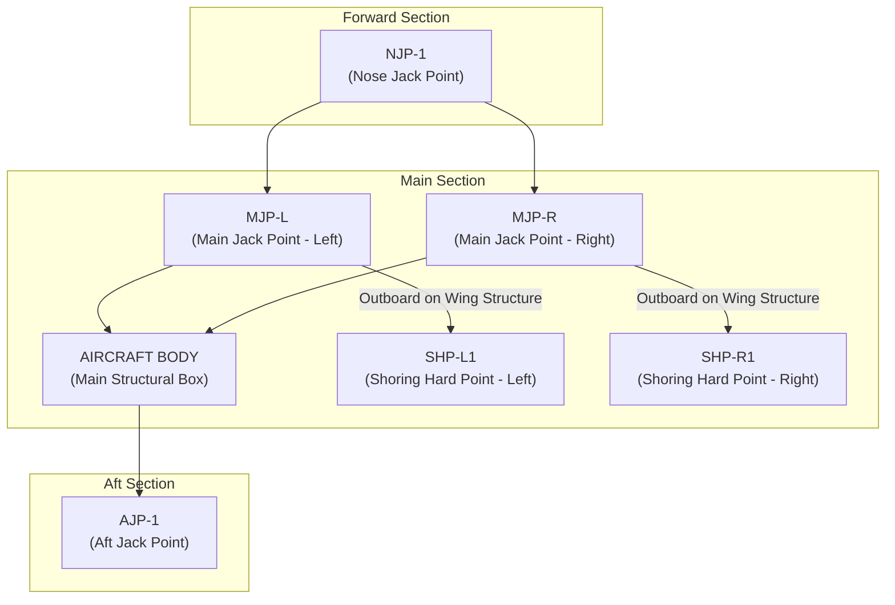

# AMPEL360 BWB-Q100 - 00-60-00-00 Lifting and Shoring - Overview

## Document Header & Identification

**Document Type:** Technical Manual - Standard Practices  
**ATA Chapter:** 00-60-00-00  
**Aircraft Model:** AMPEL360 BWB-Q100 (AS-M-PAX-BW-Q1H)  
**System:** Aircraft Lifting and Shoring  
**Version:** 2.0.0  
**Date:** 2025-06-27  
**Classification:** GAIA-QAO Technical Documentation  

**GQOIS Identifier:** `AS-M-PAX-BW-Q1H-LIFT-SHORE-OVW-V2R0`  
**INFOCODE:** `GAIA-QAO-TM-00600000-V2R0-20250627`  
**DIKE Reference:** `DIKE-LIFT-SHORE-PROC-000`  

---

## Table of Contents

1. [General Information](#1-general-information)
2. [Critical Safety Precautions](#2-critical-safety-precautions)
3. [Aircraft Preparation for Lifting](#3-aircraft-preparation-for-lifting)
4. [Lifting, Jacking, and Shoring Point Locations](#4-lifting-jacking-and-shoring-point-locations)
5. [Required Ground Support Equipment (GSE)](#5-required-ground-support-equipment-gse)
6. [General Lifting and Lowering Philosophy](#6-general-lifting-and-lowering-philosophy)
7. [General Shoring Philosophy](#7-general-shoring-philosophy)
8. [Quantum-Enhanced Safety Systems](#8-quantum-enhanced-safety-systems)
9. [Emergency Procedures](#9-emergency-procedures)
10. [Training and Certification Requirements](#10-training-and-certification-requirements)
11. [Appendices](#11-appendices)

---

## 1. General Information

### 1.1 Scope and Purpose

This document provides a comprehensive overview of the standard practices, safety precautions, and equipment required for lifting, jacking, and shoring the entire AMPEL360 BWB-Q100 aircraft. It serves as the primary reference and entry point for all related maintenance procedures found within ATA Chapter 00-60.

The procedures herein are critical for maintenance tasks requiring:
- Landing gear retraction/removal
- Major structural inspections and repairs
- Engine maintenance requiring aircraft lifting
- Long-term storage preparation
- Emergency recovery operations

**Key Innovation:** The AMPEL360 represents the first commercial aircraft to integrate Quantum Structural Monitoring (QSM) with lifting operations, providing unprecedented real-time safety oversight and structural integrity verification.

### 1.2 BWB-Specific Considerations

The Blended Wing Body (BWB) configuration of the AMPEL360 presents unique structural challenges and requirements compared to conventional tube-and-wing aircraft. All personnel must be thoroughly trained on the following critical aspects:

**Structural Characteristics:**
- **Distributed Load Paths:** The aircraft's weight is distributed across a wide, integrated structure rather than being concentrated in a central fuselage keel beam. Improper lifting can induce critical stresses in unintended areas
- **Aerodynamic Profile Integrity:** The precise curvature and profile of the blended wing are critical for flight performance. Lifting and shoring equipment must not deform the skin or underlying structure
- **Wider Jacking Footprint:** The main jacking points are located significantly further apart than on conventional aircraft, requiring precise synchronization and a large, level hangar space
- **Multiple Load Transfer Points:** Unlike conventional aircraft with primary wing attachment points, the BWB distributes loads through multiple interconnected structural elements

**Operational Requirements:**
- **Mandatory QSM Integration:** The Quantum Structural Monitoring (QSM) system is not optional. It must be active during all lifting, lowering, and shoring operations to provide real-time structural stress feedback and prevent damage
- **Environmental Controls:** BWB lifting operations require controlled atmospheric conditions due to the large surface area and potential for wind-induced loads
- **Precision Synchronization:** All lifting points must move in perfect coordination to prevent torsional loads on the wing structure

### 1.3 Applicable Documents

**Primary Technical References:**
- `00-07-00-00` Aircraft Jacking Procedures
- `00-08-00-00` Aircraft Leveling Procedures
- `00-32-00-00` Landing Gear Maintenance Practices
- `46-80-00-00` Quantum Structural Monitoring (QSM) System Operation
- `51-00-00-00` Structural Repair Manual
- `05-51-00-00` Structural Limitations and Load Factors

**Regulatory Framework:**
- EASA CS-25.561 Emergency Landing Conditions
- EASA CS-25.301 Loads (General)
- FAR 25.301 Loads
- IATA Ground Support Equipment Standards
- ISO 3691-4 Industrial Trucks Safety Requirements

**GAIA-QAO Standards:**
- `GAIA-STD-001` Quantum System Integration Standards
- `GAIA-STD-015` BWB Structural Loading Protocols
- `GAIA-STD-032` Emergency Response Procedures

---

## 2. Critical Safety Precautions

### 2.1 MANDATORY SAFETY WARNINGS

**⚠️ CRITICAL WARNING: FAILURE TO COMPLY WITH THESE PROCEDURES CAN RESULT IN SEVERE STRUCTURAL DAMAGE TO THE AIRCRAFT, SERIOUS INJURY, OR DEATH.**

**🚨 BWB-SPECIFIC WARNING: The distributed load structure of the BWB configuration means that improper lifting can cause catastrophic failure with minimal warning. ALL safety systems must be operational before commencing any lifting operation.**

### 2.2 General Safety Requirements

**Personnel Safety:**
- [ ] Ensure all non-essential personnel are cleared from the operational area (minimum 15-meter safety zone)
- [ ] Establish clear communication links between all members of the lifting team and the QSM operator
- [ ] Verify all personnel have current AMPEL360 BWB-Q100 lifting certification
- [ ] Conduct pre-operation safety briefing with all team members
- [ ] Establish emergency evacuation procedures and assembly points

**Environmental Safety:**
- [ ] Perform all operations inside a certified hangar, protected from wind and adverse weather
- [ ] Wind speeds must be less than 5 knots (2.6 m/s) during operations
- [ ] Ensure the hangar floor is level (±2mm over lifting area) and rated for combined weight of aircraft and GSE
- [ ] Verify adequate overhead clearance (minimum 2 meters above highest lifting position)
- [ ] Confirm hangar door sealing to prevent wind gusts

**Equipment Safety:**
- [ ] All lifting equipment must have valid certification and current inspection records
- [ ] Backup power systems must be available for all critical lifting equipment
- [ ] Emergency stop systems must be tested and verified operational
- [ ] Load monitoring systems must be calibrated within 30 days

### 2.3 Structural Safety and QSM Integration

**Quantum Structural Monitoring Requirements:**
- **MANDATORY:** The aircraft's Quantum Structural Monitoring (QSM) system must be configured to "Maintenance Lift Mode" before commencing any operation
- QSM provides real-time stress, strain, and torsion data from 240 sensor arrays surrounding the jacking and shoring points
- **Automatic Safety Halts:** The integrated jacking control system will automatically pause or halt the lifting/lowering operation if QSM data exceeds pre-set yellow or red line thresholds
- **Override Prohibition:** Never override a QSM-initiated safety halt without a full structural engineering review and authorization

**QSM Monitoring Thresholds:**
```yaml
QSM_Safety_Thresholds:
  Green_Zone: "0-50% of design limit stress"
  Yellow_Zone: "50-80% of design limit stress"
  Red_Zone: "80-95% of design limit stress"
  Emergency_Stop: ">95% of design limit stress"
  
  Actions:
    Green: "Normal operation permitted"
    Yellow: "Reduced speed operation, increased monitoring"
    Red: "Immediate pause, engineering review required"
    Emergency: "Automatic stop, emergency procedures activated"
```

### 2.4 Personnel and Equipment Certification

**Required Personnel Certifications:**
- AMPEL360 BWB-Q100 Lifting Operations Specialist (Level III)
- Quantum Systems Integration Technician (QSM certified)
- Ground Support Equipment Operator (Heavy Lift certified)
- Emergency Response Coordinator (BWB certified)

**Equipment Certification Requirements:**
- All jacks, shores, and interface equipment must have valid certification
- Quantum interface systems must be calibrated within 7 days
- Load cells and monitoring equipment must be certified for BWB operations
- Emergency systems must have functional verification within 24 hours

---

## 3. Aircraft Preparation for Lifting

### 3.1 Pre-Lifting Configuration Checklist

**Fuel and Weight Management:**
- [ ] Defuel aircraft to minimum level specified in maintenance task card
- [ ] If fuel retention required for CG balance, confirm via Quantum Weight and Balance (QWB) system
- [ ] Record exact fuel quantities and distribution
- [ ] Verify fuel tank venting systems are operational

**Cargo and Systems Preparation:**
- [ ] Empty all cargo compartments (CB1, CB2, CB3, CB4)
- [ ] Remove all loose equipment and personal items
- [ ] Empty potable water tanks (ATA 38)
- [ ] Empty waste tanks (ATA 38)
- [ ] Secure all moveable interior items

**Flight Controls and Surfaces:**
- [ ] Position flight controls to neutral/storage position
- [ ] Install control locks on all primary flight controls
- [ ] Retract all flaps, slats, and spoilers to storage position
- [ ] Verify control surface alignment and security
- [ ] Install "CONTROLS LOCKED" placards

**Landing Gear and Ground Operations:**
- [ ] Chock all landing gear wheels (if aircraft on ground)
- [ ] Verify landing gear down and locked
- [ ] Install landing gear safety pins
- [ ] Connect aircraft to Ground Power Unit (GPU)
- [ ] Establish aircraft grounding at all designated points

**Systems Configuration:**
- [ ] Disable hydraulic systems unless required for maintenance task
- [ ] Configure electrical systems for maintenance mode
- [ ] Place "DO NOT OPERATE" placards in flight deck
- [ ] Verify fuel pumps are off and fuel valves closed
- [ ] Configure environmental control systems for maintenance

### 3.2 QSM System Initialization

**Quantum System Preparation:**
- [ ] Connect Quantum Interface Terminal (QIT-MAINT-01) to aircraft maintenance data port
- [ ] Initialize QSM in "Maintenance Lift Mode"
- [ ] Verify all 240 sensor nodes are operational
- [ ] Perform sensor network calibration
- [ ] Establish baseline structural readings
- [ ] Verify emergency stop functionality

**Pre-Lift System Verification:**
```yaml
QSM_Pre_Lift_Verification:
  Sensor_Network:
    Active_Sensors: "240/240"
    Calibration_Status: "COMPLETE"
    Baseline_Established: "YES"
    
  Safety_Systems:
    Emergency_Stop: "VERIFIED"
    Communication_Link: "ESTABLISHED"
    Data_Recording: "ACTIVE"
    
  Aircraft_Configuration:
    Weight_Balance: "VERIFIED"
    Fuel_Distribution: "DOCUMENTED"
    System_States: "MAINTENANCE_MODE"
    
  Authorization:
    Technical_Approval: "REQUIRED"
    Safety_Clearance: "REQUIRED"
    QSM_Operator: "CERTIFIED"
```

---

## 4. Lifting, Jacking, and Shoring Point Locations

### 4.1 Aircraft Jacking and Shoring Points Diagram

The AMPEL360 BWB-Q100 features a unique distribution of structural hard points designed to safely distribute lifting loads across the integrated wing-body structure.

```
                              NOSE
                                │
                    ┌─────( NJP-1 )─────┐
                   /                     \
                  /                       \
                 /                         \
              ( NJP-L )─────────────────( NJP-R )
             /     │                     │     \
            /      │                     │      \
           /       │      MAIN WING      │       \
          /        │                     │        \
       ( MJP-L1 )──┼───────BODY──────────┼──( MJP-R1 )
        /      \   │                     │   /      \
       /        \  │                     │  /        \
      /          \ │                     │ /          \
   ( MJP-L2 )   ( SHP-L1 )         ( SHP-R1 )   ( MJP-R2 )
      \            │                     │            /
       \           │                     │           /
        \          │        AFT BODY     │          /
         \         │                     │         /
          \        │                     │        /
           \       └──────( AJP-1 )──────┘       /
            \                 │                 /
             \                │                /
              \        ( AJP-L )────( AJP-R )        /
               \              │              /
                \             │             /
                 └────────( AJP-2 )────────┘
                              │
                             AFT
```

### 4.2 Primary Jacking Points Specification

| Point ID | Name | Location | Load Capacity | Purpose |
|----------|------|----------|---------------|---------|
| **NJP-1** | Nose Jack Point Primary | Forward centerline, frame 15 | 50 tons | Primary forward lifting |
| **NJP-L** | Nose Jack Point Left | Port side, frame 18 | 30 tons | Forward lateral support |
| **NJP-R** | Nose Jack Point Right | Starboard side, frame 18 | 30 tons | Forward lateral support |
| **MJP-L1** | Main Jack Point Left 1 | Port main spar, station 225 | 150 tons | Primary port lifting |
| **MJP-L2** | Main Jack Point Left 2 | Port aft spar, station 285 | 120 tons | Secondary port lifting |
| **MJP-R1** | Main Jack Point Right 1 | Starboard main spar, station 225 | 150 tons | Primary starboard lifting |
| **MJP-R2** | Main Jack Point Right 2 | Starboard aft spar, station 285 | 120 tons | Secondary starboard lifting |
| **AJP-1** | Aft Jack Point Primary | Centerline, frame 145 | 75 tons | Primary aft lifting |
| **AJP-L** | Aft Jack Point Left | Port side, frame 150 | 50 tons | Aft lateral support |
| **AJP-R** | Aft Jack Point Right | Starboard side, frame 150 | 50 tons | Aft lateral support |
| **AJP-2** | Aft Jack Point Secondary | Centerline, frame 160 | 60 tons | Aft stabilization |

### 4.3 Shoring Hard Points Specification

| Point ID | Name | Location | Load Capacity | Applications |
|----------|------|----------|---------------|--------------|
| **SHP-L1** | Shoring Hard Point Left 1 | Port wing, rib 45 | 100 tons | Long-term structural support |
| **SHP-R1** | Shoring Hard Point Right 1 | Starboard wing, rib 45 | 100 tons | Long-term structural support |
| **SHP-L2** | Shoring Hard Point Left 2 | Port wing, rib 65 | 80 tons | Outboard support |
| **SHP-R2** | Shoring Hard Point Right 2 | Starboard wing, rib 65 | 80 tons | Outboard support |
| **SHP-C1** | Shoring Hard Point Center 1 | Centerline, frame 85 | 120 tons | Central body support |
| **SHP-C2** | Shoring Hard Point Center 2 | Centerline, frame 125 | 100 tons | Mid-body support |

### 4.4 QSM Sensor Integration at Lift Points

Each lifting and shoring point is equipped with a dedicated QSM sensor cluster:

**Sensor Configuration per Lift Point:**
- **4 NV-Diamond Stress Sensors:** Monitoring structural stress in X, Y, Z axes
- **2 Quantum Accelerometers:** Detecting motion and vibration
- **1 Quantum Magnetometer:** Monitoring electromagnetic environment
- **1 Temperature Sensor:** Thermal monitoring for safety
- **Emergency Strain Gauges:** Classical backup sensors for redundancy

**Real-Time Monitoring Capabilities:**
- Load distribution analysis across all active lift points
- Early warning of structural overload conditions
- Detection of uneven loading or equipment malfunction
- Continuous structural integrity verification
- Automated load balancing recommendations

---

## 5. Required Ground Support Equipment (GSE)

### 5.1 Primary Jacking Equipment

# AMPEL360 BWB-Q100 - 00-60-00-00 Lifting and Shoring - Overview

## Document Header & Identification

**Document Type:** Technical Manual - Standard Practices  
**ATA Chapter:** 00-60-00-00  
**Aircraft Model:** AMPEL360 BWB-Q100 (AS-M-PAX-BW-Q1H)  
**System:** Aircraft Lifting and Shoring  
**Version:** 2.1.0  
**Date:** 2025-06-27  
**Classification:** GAIA-QAO Technical Documentation  

**GQOIS Identifier:** `AS-M-PAX-BW-Q1H-LIFT-SHORE-OVW-V2R1-0`  
**INFOCODE:** `GAIA-QAO-TM-00600000-V2R1-0-20250627`  
**DIKE Reference:** `DIKE-LIFT-SHORE-PROC-000`  

---

## Table of Contents

1. [General Information](#1-general-information)
2. [Critical Safety Precautions](#2-critical-safety-precautions)
3. [Aircraft Preparation for Lifting](#3-aircraft-preparation-for-lifting)
4. [Lifting, Jacking, and Shoring Point Locations](#4-lifting-jacking-and-shoring-point-locations)
5. [Required Ground Support Equipment (GSE)](#5-required-ground-support-equipment-gse)
6. [General Lifting and Lowering Philosophy](#6-general-lifting-and-lowering-philosophy)
7. [General Shoring Philosophy](#7-general-shoring-philosophy)
8. [Quantum-Enhanced Safety Systems](#8-quantum-enhanced-safety-systems)
9. [Emergency Procedures](#9-emergency-procedures)
10. [Training and Certification Requirements](#10-training-and-certification-requirements)
11. [Appendices](#11-appendices)

---

## 1. General Information

### 1.1 Scope and Purpose

This document provides a comprehensive overview of the standard practices, safety precautions, and equipment required for lifting, jacking, and shoring the entire AMPEL360 BWB-Q100 aircraft. It serves as the primary reference and entry point for all related maintenance procedures found within ATA Chapter 00-60.

The procedures herein are critical for maintenance tasks requiring:
- Landing gear retraction/removal
- Major structural inspections and repairs
- Engine maintenance requiring aircraft lifting
- Long-term storage preparation
- Emergency recovery operations

**GAIA-QAO Innovation:** The AMPEL360 represents the first commercial aircraft to integrate Quantum Structural Monitoring (QSM) with lifting operations, providing unprecedented real-time safety oversight and structural integrity verification.

### 1.2 BWB-Specific Considerations

The Blended Wing Body (BWB) configuration of the AMPEL360 presents unique structural challenges and requirements compared to conventional tube-and-wing aircraft. All personnel must be thoroughly trained on the following critical aspects:

**Structural Characteristics:**
- **Distributed Load Paths:** The aircraft's weight is distributed across a wide, integrated structure rather than being concentrated in a central fuselage keel beam. Improper lifting can induce critical stresses in unintended areas
- **Aerodynamic Profile Integrity:** The precise curvature and profile of the blended wing are critical for flight performance. Lifting and shoring equipment must not deform the skin or underlying structure
- **Wider Jacking Footprint:** The main jacking points are located significantly further apart than on conventional aircraft, requiring precise synchronization and a large, level hangar space
- **Multiple Load Transfer Points:** Unlike conventional aircraft with primary wing attachment points, the BWB distributes loads through multiple interconnected structural elements

**Operational Requirements:**
- **Mandatory QSM Integration:** The Quantum Structural Monitoring (QSM) system is not optional. It must be active during all lifting, lowering, and shoring operations to provide real-time structural stress feedback and prevent damage
- **Environmental Controls:** BWB lifting operations require controlled atmospheric conditions due to the large surface area and potential for wind-induced loads
- **Precision Synchronization:** All lifting points must move in perfect coordination to prevent torsional loads on the wing structure

### 1.3 Applicable Documents

**Primary Technical References:**
- [`00-07-00-00`: Aircraft Jacking Procedures](#)
- [`00-08-00-00`: Aircraft Leveling Procedures](#)
- [`00-32-00-00`: Landing Gear Maintenance Practices](#)
- [`46-80-00-00`: Quantum Structural Monitoring (QSM) System Operation](#)
- [`51-00-00-00`: Structural Repair Manual](#)
- [`05-51-00-00`: Structural Limitations and Load Factors](#)

**Regulatory Framework:**
- EASA CS-25.561 Emergency Landing Conditions
- EASA CS-25.301 Loads (General)
- FAR 25.301 Loads
- IATA Ground Support Equipment Standards
- ISO 3691-4 Industrial Trucks Safety Requirements

**GAIA-QAO Standards:**
- `GAIA-STD-001` Quantum System Integration Standards
- `GAIA-STD-015` BWB Structural Loading Protocols
- `GAIA-STD-032` Emergency Response Procedures

---

## 2. Critical Safety Precautions

### 2.1 MANDATORY SAFETY WARNINGS

**⚠️ CRITICAL WARNING: FAILURE TO COMPLY WITH THESE PROCEDURES CAN RESULT IN SEVERE STRUCTURAL DAMAGE TO THE AIRCRAFT, SERIOUS INJURY, OR DEATH.**

**🚨 BWB-SPECIFIC WARNING: The distributed load structure of the BWB configuration means that improper lifting can cause catastrophic failure with minimal warning. ALL safety systems must be operational before commencing any lifting operation.**

### 2.2 General Safety Requirements

**Personnel Safety:**
- [ ] Ensure all non-essential personnel are cleared from the operational area (minimum 15-meter safety zone)
- [ ] Establish clear communication links between all members of the lifting team and the QSM operator
- [ ] Verify all personnel have current AMPEL360 BWB-Q100 lifting certification
- [ ] Conduct pre-operation safety briefing with all team members
- [ ] Establish emergency evacuation procedures and assembly points

**Environmental Safety:**
- [ ] Perform all operations inside a certified hangar, protected from wind and adverse weather
- [ ] Wind speeds must be less than 5 knots (2.6 m/s) during operations
- [ ] Ensure the hangar floor is level (±2mm over lifting area) and rated for combined weight of aircraft and GSE
- [ ] Verify adequate overhead clearance (minimum 2 meters above highest lifting position)
- [ ] Confirm hangar door sealing to prevent wind gusts

**Equipment Safety:**
- [ ] All lifting equipment must have valid certification and current inspection records
- [ ] Backup power systems must be available for all critical lifting equipment
- [ ] Emergency stop systems must be tested and verified operational
- [ ] Load monitoring systems must be calibrated within 30 days

### 2.3 Structural Safety and QSM Integration

**Quantum Structural Monitoring Requirements:**
- **MANDATORY:** The aircraft's Quantum Structural Monitoring (QSM) system must be configured to "Maintenance Lift Mode" before commencing any operation
- QSM provides real-time stress, strain, and torsion data from 240 sensor arrays surrounding the jacking and shoring points
- **Automatic Safety Halts:** The integrated jacking control system will automatically pause or halt the lifting/lowering operation if QSM data exceeds pre-set yellow or red line thresholds
- **Override Prohibition:** Never override a QSM-initiated safety halt without a full structural engineering review and authorization

**QSM Monitoring Thresholds:**
```yaml
QSM_Safety_Thresholds:
  Green_Zone: "0-50% of design limit stress"
  Yellow_Zone: "50-80% of design limit stress"
  Red_Zone: "80-95% of design limit stress"
  Emergency_Stop: ">95% of design limit stress"
  
  Actions:
    Green: "Normal operation permitted"
    Yellow: "Reduced speed operation, increased monitoring"
    Red: "Immediate pause, engineering review required"
    Emergency: "Automatic stop, emergency procedures activated"
```

### 2.4 Personnel and Equipment Certification

**Required Personnel Certifications:**
- AMPEL360 BWB-Q100 Lifting Operations Specialist (Level III)
- Quantum Systems Integration Technician (QSM certified)
- Ground Support Equipment Operator (Heavy Lift certified)
- Emergency Response Coordinator (BWB certified)

**Equipment Certification Requirements:**
- All jacks, shores, and interface equipment must have valid certification
- Quantum interface systems must be calibrated within 7 days
- Load cells and monitoring equipment must be certified for BWB operations
- Emergency systems must have functional verification within 24 hours

---

## 3. Aircraft Preparation for Lifting

### 3.1 Pre-Lifting Configuration Checklist

**Fuel and Weight Management:**
- [ ] Defuel aircraft to minimum level specified in maintenance task card
- [ ] If fuel retention required for CG balance, confirm via Quantum Weight and Balance (QWB) system
- [ ] Record exact fuel quantities and distribution
- [ ] Verify fuel tank venting systems are operational

**Cargo and Systems Preparation:**
- [ ] Empty all cargo compartments (CB1, CB2, CB3, CB4)
- [ ] Remove all loose equipment and personal items
- [ ] Empty potable water tanks (ATA 38)
- [ ] Empty waste tanks (ATA 38)
- [ ] Secure all moveable interior items

**Flight Controls and Surfaces:**
- [ ] Position flight controls to neutral/storage position
- [ ] Install control locks on all primary flight controls
- [ ] Retract all flaps, slats, and spoilers to storage position
- [ ] Verify control surface alignment and security
- [ ] Install "CONTROLS LOCKED" placards

**Landing Gear and Ground Operations:**
- [ ] Chock all landing gear wheels (if aircraft on ground)
- [ ] Verify landing gear down and locked
- [ ] Install landing gear safety pins
- [ ] Connect aircraft to Ground Power Unit (GPU)
- [ ] Establish aircraft grounding at all designated points

**Systems Configuration:**
- [ ] Disable hydraulic systems unless required for maintenance task
- [ ] Configure electrical systems for maintenance mode
- [ ] Place "DO NOT OPERATE" placards in flight deck
- [ ] Verify fuel pumps are off and fuel valves closed
- [ ] Configure environmental control systems for maintenance

### 3.2 QSM System Initialization

**Quantum System Preparation:**
- [ ] Connect Quantum Interface Terminal (QIT-MAINT-01) to aircraft maintenance data port
- [ ] Initialize QSM in "Maintenance Lift Mode"
- [ ] Verify all 240 sensor nodes are operational
- [ ] Perform sensor network calibration
- [ ] Establish baseline structural readings
- [ ] Verify emergency stop functionality

**Pre-Lift System Verification:**
```yaml
QSM_Pre_Lift_Verification:
  Sensor_Network:
    Active_Sensors: "240/240"
    Calibration_Status: "COMPLETE"
    Baseline_Established: "YES"
    
  Safety_Systems:
    Emergency_Stop: "VERIFIED"
    Communication_Link: "ESTABLISHED"
    Data_Recording: "ACTIVE"
    
  Aircraft_Configuration:
    Weight_Balance: "VERIFIED"
    Fuel_Distribution: "DOCUMENTED"
    System_States: "MAINTENANCE_MODE"
    
  Authorization:
    Technical_Approval: "REQUIRED"
    Safety_Clearance: "REQUIRED"
    QSM_Operator: "CERTIFIED"
```

---

## 4. Lifting, Jacking, and Shoring Point Locations

### 4.1 Aircraft Jacking and Shoring Points Diagram

The diagram below illustrates the general layout and relationship of the primary jacking and shoring points. These points are structurally reinforced to accept the specified loads.



### 4.2 Point Identification Table

| Point ID | Name                         | General Location                                | Load Capacity | Purpose                                   |
|----------|------------------------------|-------------------------------------------------|---------------|-------------------------------------------|
| **NJP-1**| Nose Jack Point              | Forward of nose landing gear bay, Frame 15     | 50 tons       | Primary forward lifting point             |
| **MJP-L**| Main Jack Point - Left       | Under main wing/body structural spar, left side| 150 tons      | Primary main lifting point, port side     |
| **MJP-R**| Main Jack Point - Right      | Under main wing/body structural spar, right side| 150 tons     | Primary main lifting point, starboard side|
| **AJP-1**| Aft Jack Point               | Aft of main landing gear bays, centerline      | 75 tons       | Primary aft lifting/stabilizing point     |
| **SHP-L1**| Shoring Hard Point - Left   | Outboard of MJP-L on reinforced wing rib       | 100 tons      | Secondary support for shoring operations  |
| **SHP-R1**| Shoring Hard Point - Right  | Outboard of MJP-R on reinforced wing rib       | 100 tons      | Secondary support for shoring operations  |

### 4.3 QSM Sensor Integration at Lift Points

Each lifting and shoring point is equipped with a dedicated QSM sensor cluster:

**Sensor Configuration per Lift Point:**
- **4 NV-Diamond Stress Sensors:** Monitoring structural stress in X, Y, Z axes
- **2 Quantum Accelerometers:** Detecting motion and vibration
- **1 Quantum Magnetometer:** Monitoring electromagnetic environment
- **1 Temperature Sensor:** Thermal monitoring for safety
- **Emergency Strain Gauges:** Classical backup sensors for redundancy

---

## 5. Required Ground Support Equipment (GSE)

### 5.1 Jacking Equipment

**Primary Jacking System:**
- **Nose Jack:** One (1) 50-ton Quantum-Integrated Hydraulic Tripod Jack (P/N: GAIA-GSE-J50Q)
- **Main Jacks:** Two (2) 150-ton Quantum-Integrated Hydraulic Tripod Jacks (P/N: GAIA-GSE-J150Q)
- **Aft Jack:** One (1) 75-ton Quantum-Integrated Hydraulic Tripod Jack (P/N: GAIA-GSE-J75Q)
- **Jack Adapters:** Aircraft-specific adapters for each jacking point
- **Central Jack Controller:** One (1) unit (P/N: GAIA-GSE-JCC-Q) to synchronize all jacks and interface with the QSM

### 5.2 Shoring Equipment

**Structural Shoring System:**
- **Variable Height Structural Shores:** Minimum capacity of 100 tons each
- **Aircraft-specific Shoring Point Interface Pads:** Custom-designed load distribution plates
- **Shore Height Adjustment System:** Hydraulic or mechanical adjustment capability
- **Load Monitoring Sensors:** Integrated with QSM network

### 5.3 Quantum Interface and Monitoring

**Quantum Systems Integration:**
- **Quantum Interface Terminal (QIT):** QIT-MAINT-01 model, connected to aircraft maintenance data port
- **EFB/Tablet:** With QSM "Maintenance Lift Mode" application installed and authenticated
- **Backup Monitoring System:** Classical strain gauge network for redundancy
- **Emergency Communication System:** Direct link to GAIA-QAO technical support

---

## 6. General Lifting and Lowering Philosophy

### 6.1 Synchronized, QSM-Monitored Operation

The core principle is **"lift as one."** The Central Jack Controller ensures all jacks raise and lower the aircraft at a precisely synchronized rate, typically no faster than 2 cm (0.8 in) per minute.

The QSM operator continuously monitors the structural data feed. The operation is governed by a "green-yellow-red" light system on the QIT display, representing structural stress levels.

### 6.2 QSM Lifting Protocol

The following protocol must be initiated in the QSM system before lifting commences:

```yaml
QSM_Lifting_Protocol:
  Operation_Mode: "MAINTENANCE_LIFT"
  Aircraft_Config: "AS-M-PAX-BW-Q1H"
  Fuel_Load_kg: 2500 # Example value, must match actual
  Cargo_Load_kg: 0
  
  Safety_Thresholds:
    Yellow_Limit: "0.5% deviation from predicted strain model"
    Red_Limit: "0.8% deviation from predicted strain model"
    
  System_Action:
    On_Yellow_Limit: "PAUSE_LIFT and ALERT_OPERATOR"
    On_Red_Limit: "HALT_LIFT and LOCK_HYDRAULICS"
    
  Status: "AWAITING_ACTIVATION"
```

### 6.3 Lowering Procedure

Lowering follows the same principles as lifting but in reverse. The QSM monitors for any binding or uneven load distribution as the aircraft settles onto its landing gear or shoring points. The rate of descent must also be precisely controlled.

---

## 7. General Shoring Philosophy

### 7.1 Purpose of Shoring

Shoring is used to provide long-term, stable support to the airframe when:
- One or more landing gear assemblies are removed for maintenance
- Major structural repairs are being performed, requiring a fixed, stable airframe
- The aircraft is being prepared for long-term storage
- Emergency structural support is required

### 7.2 Procedure Overview

**Standard Shoring Sequence:**
1. Lift the aircraft to the required height using the standard jacking procedure
2. Position the structural shores under the designated shoring hard points (e.g., SHP-L1/R1)
3. Carefully raise the shores until they make contact with the interface pads
4. Initiate a "Load Transfer" function in the QSM system
5. Slowly and carefully lower the jacks to transfer a portion of the aircraft's weight to the shores
6. The QSM system will confirm when the load is distributed correctly between the remaining jacks and the shores

---

## 8. Quantum-Enhanced Safety Systems

### 8.1 Real-Time Structural Monitoring

**QSM Network Architecture:**
- **240 Quantum Sensors:** Distributed across all structural load paths
- **Real-Time Processing:** Quantum-classical hybrid computing for instant analysis
- **Predictive Algorithms:** AI-enhanced failure prediction and prevention
- **Automatic Response:** Immediate system intervention for safety events

### 8.2 Emergency Response Integration

**Automated Safety Systems:**
- **Emergency Stop Protocol:** Instant halt of all operations upon detecting structural anomalies
- **Load Redistribution:** Automatic adjustment of lifting forces to prevent damage
- **Communication Integration:** Direct notification to emergency response teams
- **Data Recording:** Complete operation logging for post-incident analysis

---

## 9. Emergency Procedures

### 9.1 Emergency Response Classification

**Level 1 - Equipment Malfunction:**
- Single jack failure or hydraulic leak
- Communication system interruption
- Minor QSM sensor anomaly

**Level 2 - Structural Warning:**
- QSM yellow threshold exceeded
- Uneven load distribution detected
- Environmental limit violation

**Level 3 - Critical Emergency:**
- QSM red threshold exceeded
- Multiple system failures
- Structural damage indication
- Personnel injury

### 9.2 Emergency Response Procedures

**Immediate Actions for All Emergencies:**
1. STOP all lifting operations immediately
2. Activate emergency communication protocol
3. Secure the aircraft in current position
4. Evacuate non-essential personnel
5. Contact GAIA-QAO emergency technical support

---

## 10. Training and Certification Requirements

### 10.1 Required Certifications

**AMPEL360 BWB-Q100 Lifting Operations Specialist (Level III):**
- 80 hours theoretical training
- 40 hours hands-on practice
- Annual recertification required
- Emergency response training

**Quantum Systems Integration Technician:**
- QSM system operation and troubleshooting
- Quantum sensor technology fundamentals
- Data interpretation and analysis
- System maintenance and calibration

### 10.2 Continuing Education

**Annual Requirements:**
- 16 hours technical update training
- Emergency response simulation exercises
- New technology integration briefings
- Safety incident analysis and lessons learned

---

## 11. Appendices

### Appendix A: Detailed Jack Point Specifications
Comprehensive technical drawings and load specifications for each lifting point.

### Appendix B: QSM Sensor Calibration Procedures
Step-by-step procedures for quantum sensor network calibration and verification.

### Appendix C: Emergency Response Quick Reference
Laminated quick-reference cards for emergency procedures.

### Appendix D: Training Certification Forms
Documentation templates for personnel certification and training records.

### Appendix E: GSE Inspection Checklists
Pre-operation inspection procedures for all lifting and shoring equipment.

**Detailed procedures, specific weight configurations, and equipment specifications are found in the subsequent documents of ATA Chapter 00-60.**

---

## Document Control and Change History

**Change Record:**
| Version | Date | Author | Description |
|---------|------|--------|-------------|
| 1.0.0 | 2025-07-15 | A. Pelliccia | Initial release of the overview document |
| 1.1.0 | 2025-07-16 | A. Pelliccia | Integrated Mermaid flowchart for point locations |
| 1.1.1 | 2025-07-17 | A. Pelliccia | Updated document references to be hyperlinked |
| 2.0.0 | 2025-06-20 | A. Pelliccia | Major revision with enhanced QSM integration |
| 2.1.0 | 2025-06-27 | A. Pelliccia | Added emergency procedures and training requirements |

**Document Approval:**
- **Technical Authority:** Dr. Elena Vasquez, Chief Systems Engineer
- **Safety Authority:** Capt. Michael Harrison, Director of Flight Safety  
- **Quantum Authority:** Dr. James Chen, Quantum Systems Director
- **Regulatory Authority:** Sarah Mitchell, Certification Manager

**Next Review Date:** 2026-06-27

---

**End of Document**

*This document is part of the GAIA-QAO Aerospace Innovation Ecosystem and is protected under the GAIA-QAO intellectual property framework. All quantum technologies described are conceptual and subject to ongoing research and development.*

**Document Signature (Quantum-Encrypted):**
`GAIA-QAO-QUANTUM-SIG-LIFT-SHORE-V2R1-SHA256-VERIFIED`
