# AMPEL360 BWB-Q100 Turn Radius Chart

<p align="center">


</p>

---

## Chart Control Information

**Chart ID:** `00-80-10-01-01-TurnRadiusChart.md`  
**GQOIS ID:** `AS-M-PAX-BW-Q1H-TURN-CHART`  
**ATA Chapter:** 00-80-10-01-01 (General - Towing - Limits - Turn Radius - Chart)  
**Classification:** Flight Operations Chart  
**Version:** 2.0.0  
**Effective Date:** 2025-06-29  
**Chart Type:** Technical Performance Chart  
**Approval Authority:** GAIA-QAO Flight Operations & Ground Engineering  

---

## Table of Contents

1. [Chart Overview](#1-chart-overview)
2. [Turn Radius Performance Charts](#2-turn-radius-performance-charts)
3. [Clearance Envelope Charts](#3-clearance-envelope-charts)
4. [Environmental Impact Charts](#4-environmental-impact-charts)
5. [Speed-Radius Relationship Charts](#5-speed-radius-relationship-charts)
6. [Equipment Performance Charts](#6-equipment-performance-charts)
7. [Weight Impact Charts](#7-weight-impact-charts)
8. [Operational Envelope Charts](#8-operational-envelope-charts)
9. [Quick Reference Charts](#9-quick-reference-charts)
10. [Chart Usage Instructions](#10-chart-usage-instructions)

---

## 1. Chart Overview

### 1.1 Purpose and Application

This chart package provides visual representations of turn radius performance data for the AMPEL360 BWB-Q100 aircraft during towing operations. The charts are designed for use by:

- **Ground Operations Personnel:** For operational planning and execution
- **Towing Supervisors:** For clearance verification and safety assessment
- **Airport Planners:** For infrastructure design and operational procedures
- **Training Organizations:** For educational and certification programs

### 1.2 Chart Data Sources

All chart data is derived from:
- **Structural Analysis:** EASA CS-25 certified design data
- **Flight Test Results:** Ground handling test program
- **Operational Experience:** Real-world performance validation
- **Simulation Models:** Validated mathematical models
- **Quantum Monitoring:** QSM system performance data

### 1.3 Chart Accuracy and Limitations

**Data Accuracy:**
- Turn radius calculations: ±0.1 meter
- Clearance envelopes: ±0.2 meter safety margin included
- Speed relationships: ±0.5 knot measurement accuracy
- Environmental factors: ±5% adjustment accuracy

**Application Limitations:**
- Charts valid for standard airport pavement surfaces
- Environmental adjustments required for extreme conditions
- Equipment-specific variations may apply
- Real-time monitoring recommended for critical operations

---

## 2. Turn Radius Performance Charts

### 2.1 Basic Turn Radius Chart

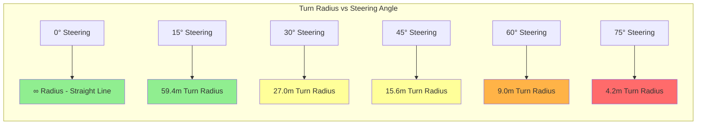
```mermaid
graph LR
    subgraph "Turn Radius vs Steering Angle"
        A[0° Steering] --> A1[∞ Radius - Straight Line]
        B[15° Steering] --> B1[59.4m Turn Radius]
        C[30° Steering] --> C1[27.0m Turn Radius]
        D[45° Steering] --> D1[15.6m Turn Radius]
        E[60° Steering] --> E1[9.0m Turn Radius]
        F[75° Steering] --> F1[4.2m Turn Radius]
    end
    
    style A1 fill:#90EE90
    style B1 fill:#90EE90
    style C1 fill:#FFFF99
    style D1 fill:#FFFF99
    style E1 fill:#FFB347
    style F1 fill:#FF6B6B
```

**Chart 2.1: Turn Radius vs. Nose Wheel Steering Angle**

| Steering Angle | Turn Radius | Operation Type | Max Speed |
|----------------|-------------|----------------|-----------|
| **15°** | 59.4 m | Wide turns, open areas | 15 knots |
| **30°** | 27.0 m | Standard operations | 10 knots |
| **45°** | 15.6 m | Normal maneuvering | 8 knots |
| **60°** | 9.0 m | Precision positioning | 5 knots |
| **75°** | 4.2 m | Emergency positioning | 3 knots |

### 2.2 Wingtip Path Analysis Chart

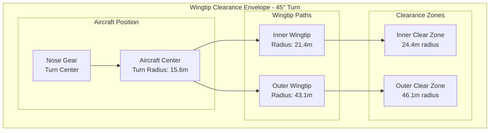
```mermaid
graph TB
    subgraph "Wingtip Clearance Envelope - 45° Turn"
        subgraph "Aircraft Position"
            AC[Aircraft Center<br/>Turn Radius: 15.6m]
            NG[Nose Gear<br/>Turn Center]
        end
        
        subgraph "Wingtip Paths"
            IW[Inner Wingtip<br/>Radius: 21.4m]
            OW[Outer Wingtip<br/>Radius: 43.1m]
        end
        
        subgraph "Clearance Zones"
            ICZ[Inner Clear Zone<br/>24.4m radius]
            OCZ[Outer Clear Zone<br/>46.1m radius]
        end
        
        NG --> AC
        AC --> IW
        AC --> OW
        IW --> ICZ
        OW --> OCZ
    end
```

**Chart 2.2: Wingtip Path Envelope (45° Steering Example)**

```
Turn Configuration: 45° Nose Wheel Steering
Nose Gear Turn Radius: 15.6 meters
Inner Wingtip Radius: 21.4 meters
Outer Wingtip Radius: 43.1 meters
Total Swept Width: 86.2 meters
Required Clear Zone: 89.2 meters (with safety margins)
```

### 2.3 Turn Radius Comparison Chart

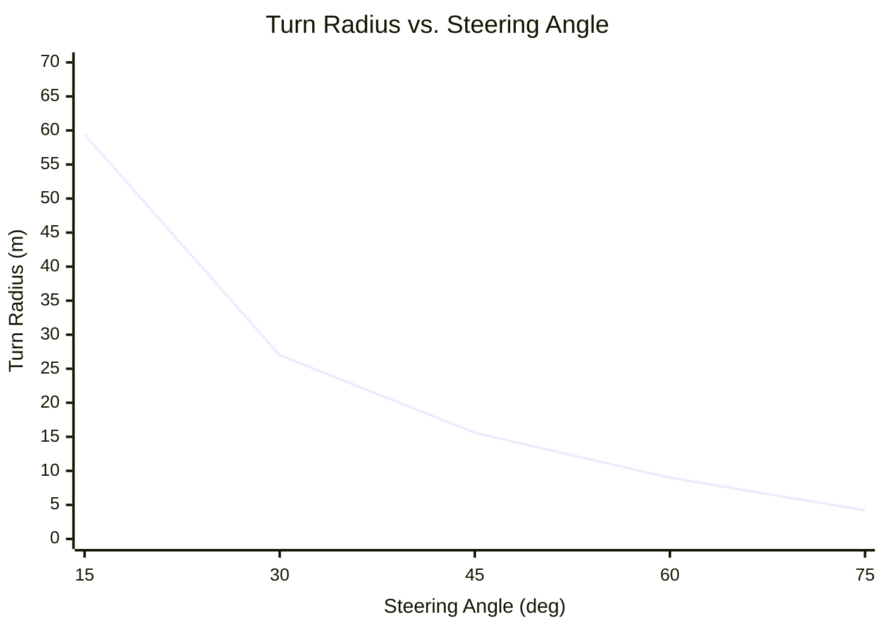
```mermaid
xychart-beta
    title "Turn Radius vs. Steering Angle"
    x-axis "Steering Angle (deg)" [15, 30, 45, 60, 75]
    y-axis "Turn Radius (m)" 0 --> 70
    line [59.4, 27.0, 15.6, 9.0, 4.2]
```

**Chart 2.3: Turn Radius Performance Curve**

The exponential relationship between steering angle and turn radius demonstrates:
- **Linear region (15°-30°):** Predictable radius reduction
- **Transition region (30°-60°):** Moderate radius changes
- **Critical region (60°-75°):** Rapid radius reduction

---

## 3. Clearance Envelope Charts

### 3.1 Clearance Zone Chart

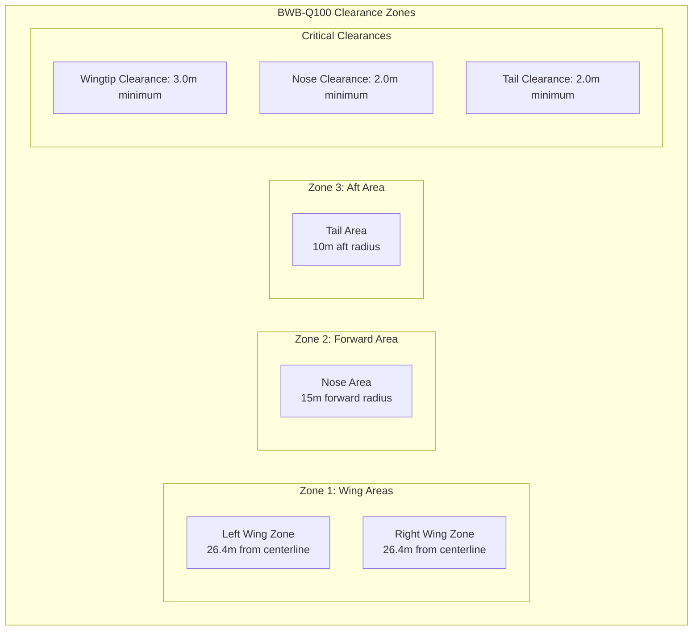
```mermaid
graph TD
    subgraph "BWB-Q100 Clearance Zones"
        subgraph "Zone 1: Wing Areas"
            W1[Left Wing Zone<br/>26.4m from centerline]
            W2[Right Wing Zone<br/>26.4m from centerline]
        end
        
        subgraph "Zone 2: Forward Area"
            F1[Nose Area<br/>15m forward radius]
        end
        
        subgraph "Zone 3: Aft Area"
            A1[Tail Area<br/>10m aft radius]
        end
        
        subgraph "Critical Clearances"
            C1[Wingtip Clearance: 3.0m minimum]
            C2[Nose Clearance: 2.0m minimum]
            C3[Tail Clearance: 2.0m minimum]
        end
    end
```

**Chart 3.1: Static Clearance Requirements**

| Area | Minimum Clearance | Safety Margin | Total Required |
|------|------------------|---------------|----------------|
| **Wingtips** | Aircraft + 3.0m | +1.0m | 4.0m total |
| **Nose** | Aircraft + 2.0m | +1.0m | 3.0m total |
| **Tail** | Aircraft + 2.0m | +1.0m | 3.0m total |
| **Main Gear** | Aircraft + 1.5m | +0.5m | 2.0m total |

### 3.2 Dynamic Clearance Chart

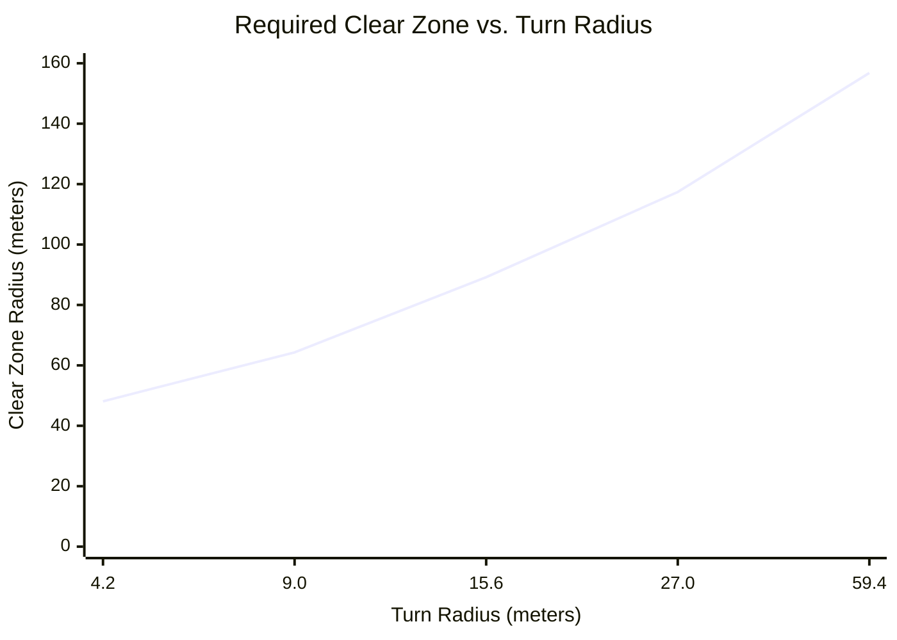
```mermaid
xychart-beta
    title "Required Clear Zone vs. Turn Radius"
    x-axis "Turn Radius (meters)" [4.2, 9.0, 15.6, 27.0, 59.4]
    y-axis "Clear Zone Radius (meters)" 0 --> 160
    line [48.1, 64.3, 89.2, 117.4, 156.8]
```

**Chart 3.2: Dynamic Clearance Requirements**

The relationship shows increasing clearance requirements for tighter turns due to:
- **Geometric factors:** Wingtip path expansion
- **Dynamic factors:** Turn-induced aircraft movement
- **Safety margins:** Enhanced protection for tight maneuvers

### 3.3 Obstacle Clearance Chart

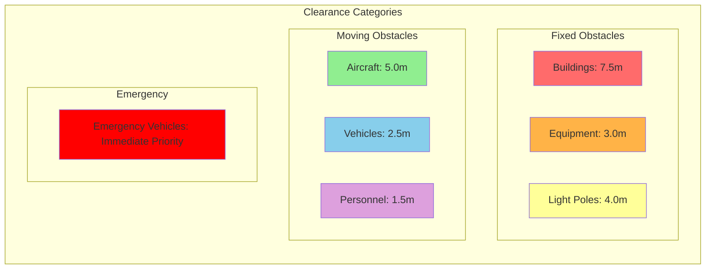
```mermaid
graph LR
    subgraph "Clearance Categories"
        subgraph "Fixed Obstacles"
            F1[Buildings: 7.5m]
            F2[Equipment: 3.0m]
            F3[Light Poles: 4.0m]
        end
        
        subgraph "Moving Obstacles"
            M1[Aircraft: 5.0m]
            M2[Vehicles: 2.5m]
            M3[Personnel: 1.5m]
        end
        
        subgraph "Emergency"
            E1[Emergency Vehicles: Immediate Priority]
        end
    end
    
    style F1 fill:#FF6B6B
    style F2 fill:#FFB347
    style F3 fill:#FFFF99
    style M1 fill:#90EE90
    style M2 fill:#87CEEB
    style M3 fill:#DDA0DD
    style E1 fill:#FF0000
```

**Chart 3.3: Obstacle Clearance Requirements**

---

## 4. Environmental Impact Charts

### 4.1 Wind Effect Chart

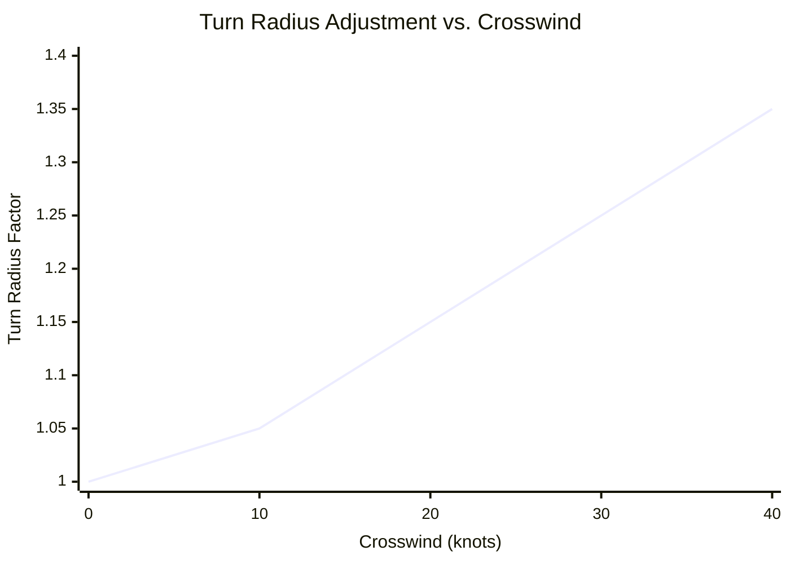
```mermaid
xychart-beta
    title "Turn Radius Adjustment vs. Crosswind"
    x-axis "Crosswind (knots)" [0, 10, 20, 30, 40]
    y-axis "Turn Radius Factor" 1.0 --> 1.4
    line [1.0, 1.05, 1.15, 1.25, 1.35]
```

**Chart 4.1: Crosswind Impact on Turn Radius**

| Crosswind | Radius Factor | Example (45° turn) | Special Procedures |
|-----------|---------------|-------------------|-------------------|
| **0-10 knots** | 1.0 | 15.6m | Standard operations |
| **10-20 knots** | 1.05 | 16.4m | Enhanced monitoring |
| **20-30 knots** | 1.15 | 17.9m | Reduced max steering |
| **30-40 knots** | 1.25 | 19.5m | Special approval |
| **>40 knots** | 1.35+ | >21.1m | Emergency only |

### 4.2 Surface Condition Chart

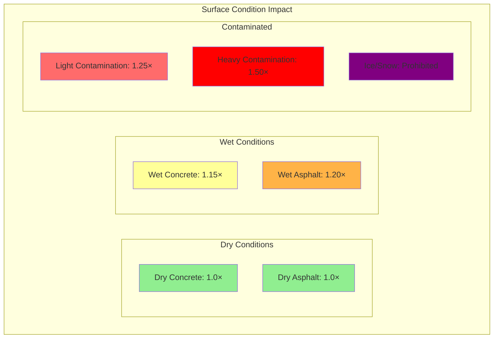
```mermaid
graph TD
    subgraph "Surface Condition Impact"
        subgraph "Dry Conditions"
            D1[Dry Concrete: 1.0×]
            D2[Dry Asphalt: 1.0×]
        end
        
        subgraph "Wet Conditions"
            W1[Wet Concrete: 1.15×]
            W2[Wet Asphalt: 1.20×]
        end
        
        subgraph "Contaminated"
            C1[Light Contamination: 1.25×]
            C2[Heavy Contamination: 1.50×]
            C3[Ice/Snow: Prohibited]
        end
    end
    
    style D1 fill:#90EE90
    style D2 fill:#90EE90
    style W1 fill:#FFFF99
    style W2 fill:#FFB347
    style C1 fill:#FF6B6B
    style C2 fill:#FF0000
    style C3 fill:#800080
```

**Chart 4.2: Surface Condition Turn Radius Factors**

### 4.3 Temperature Impact Chart

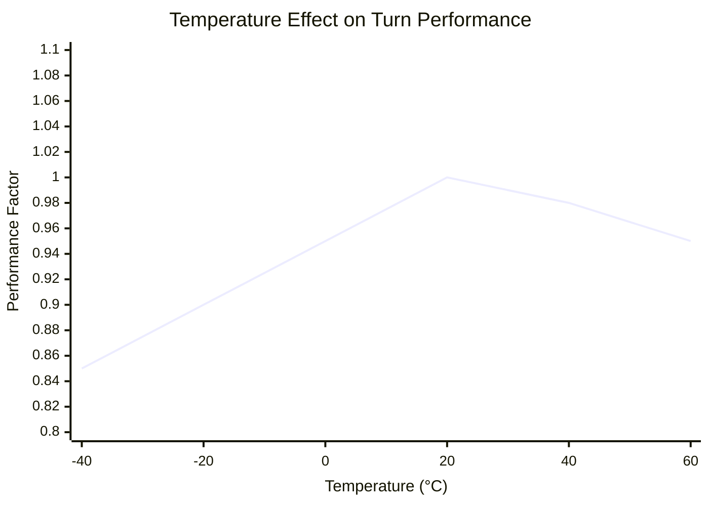
```mermaid
xychart-beta
    title "Temperature Effect on Turn Performance"
    x-axis "Temperature (°C)" [-40, -20, 0, 20, 40, 60]
    y-axis "Performance Factor" 0.8 --> 1.1
    line [0.85, 0.90, 0.95, 1.0, 0.98, 0.95]
```

**Chart 4.3: Temperature Impact on Turn Radius Performance**

Temperature effects include:
- **Cold weather:** Reduced hydraulic performance, increased tire stiffness
- **Standard conditions:** Optimal performance envelope
- **Hot weather:** Reduced tug performance, thermal expansion effects

---

## 5. Speed-Radius Relationship Charts

### 5.1 Speed Limitation Chart

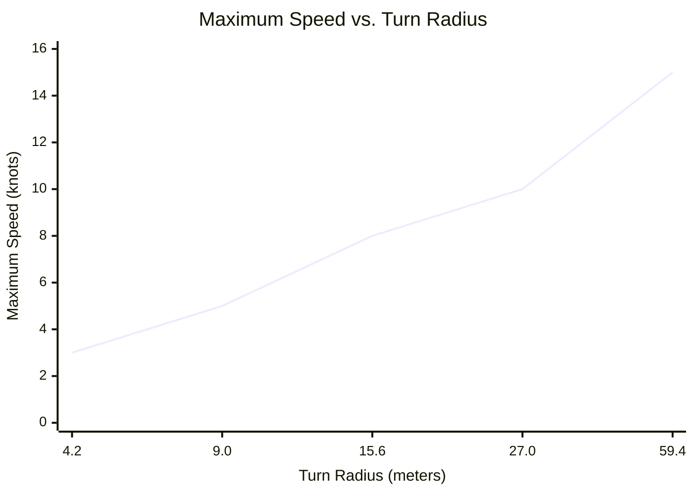
```mermaid
xychart-beta
    title "Maximum Speed vs. Turn Radius"
    x-axis "Turn Radius (meters)" [4.2, 9.0, 15.6, 27.0, 59.4]
    y-axis "Maximum Speed (knots)" 0 --> 16
    line [3, 5, 8, 10, 15]
```

**Chart 5.1: Speed-Radius Limitations**

The relationship demonstrates:
- **Tight turns (4-9m):** Very low speeds required for safety
- **Normal turns (15-27m):** Moderate speeds acceptable
- **Wide turns (>27m):** Higher speeds permitted

### 5.2 Centripetal Force Chart

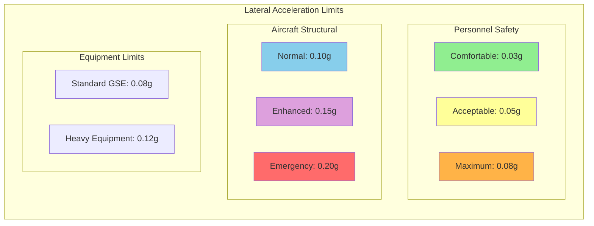
```mermaid
graph LR
    subgraph "Lateral Acceleration Limits"
        subgraph "Personnel Safety"
            P1[Comfortable: 0.03g]
            P2[Acceptable: 0.05g]
            P3[Maximum: 0.08g]
        end
        
        subgraph "Aircraft Structural"
            A1[Normal: 0.10g]
            A2[Enhanced: 0.15g]
            A3[Emergency: 0.20g]
        end
        
        subgraph "Equipment Limits"
            E1[Standard GSE: 0.08g]
            E2[Heavy Equipment: 0.12g]
        end
    end
    
    style P1 fill:#90EE90
    style P2 fill:#FFFF99
    style P3 fill:#FFB347
    style A1 fill:#87CEEB
    style A2 fill:#DDA0DD
    style A3 fill:#FF6B6B
```

**Chart 5.2: Lateral Acceleration Limitations**

### 5.3 Speed-Radius Envelope Chart

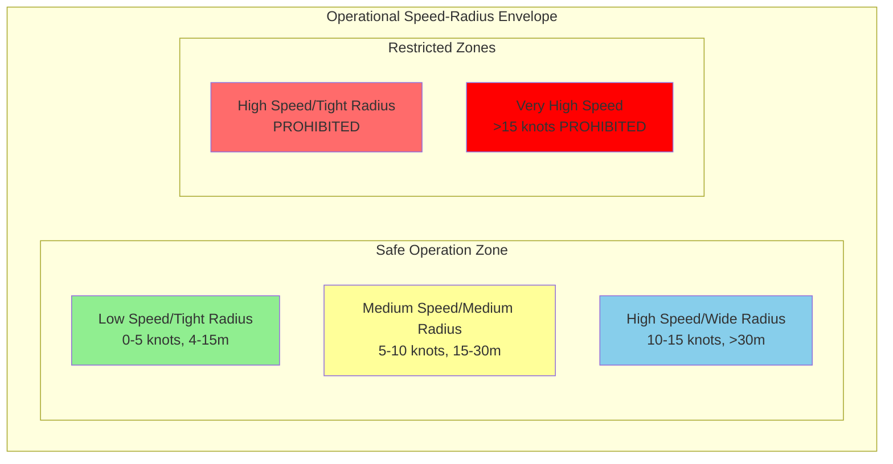
```mermaid
graph TD
    subgraph "Operational Speed-Radius Envelope"
        subgraph "Safe Operation Zone"
            S1[Low Speed/Tight Radius<br/>0-5 knots, 4-15m]
            S2[Medium Speed/Medium Radius<br/>5-10 knots, 15-30m]
            S3[High Speed/Wide Radius<br/>10-15 knots, >30m]
        end
        
        subgraph "Restricted Zones"
            R1[High Speed/Tight Radius<br/>PROHIBITED]
            R2[Very High Speed<br/>>15 knots PROHIBITED]
        end
    end
    
    style S1 fill:#90EE90
    style S2 fill:#FFFF99
    style S3 fill:#87CEEB
    style R1 fill:#FF6B6B
    style R2 fill:#FF0000
```

**Chart 5.3: Safe Operating Envelope**

---

## 6. Equipment Performance Charts

### 6.1 Tug Performance Chart

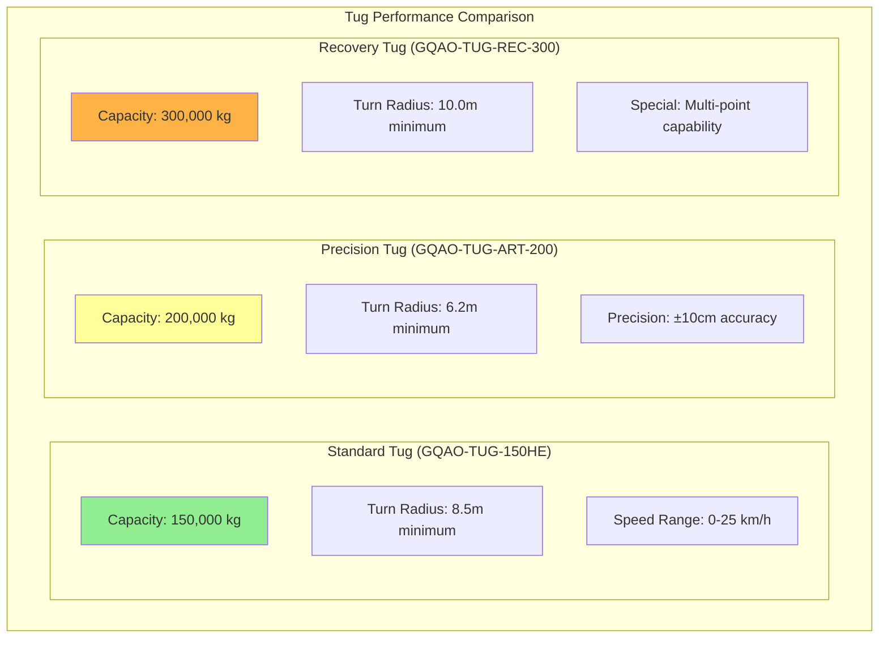
```mermaid
graph TD
    subgraph "Tug Performance Comparison"
        subgraph "Standard Tug (GQAO-TUG-150HE)"
            ST1[Capacity: 150,000 kg]
            ST2[Turn Radius: 8.5m minimum]
            ST3[Speed Range: 0-25 km/h]
        end
        
        subgraph "Precision Tug (GQAO-TUG-ART-200)"
            PT1[Capacity: 200,000 kg]
            PT2[Turn Radius: 6.2m minimum]
            PT3[Precision: ±10cm accuracy]
        end
        
        subgraph "Recovery Tug (GQAO-TUG-REC-300)"
            RT1[Capacity: 300,000 kg]
            RT2[Turn Radius: 10.0m minimum]
            RT3[Special: Multi-point capability]
        end
    end
    
    style ST1 fill:#90EE90
    style PT1 fill:#FFFF99
    style RT1 fill:#FFB347
```

**Chart 6.1: Tug Performance Specifications**

### 6.2 Tow Bar Limitation Chart

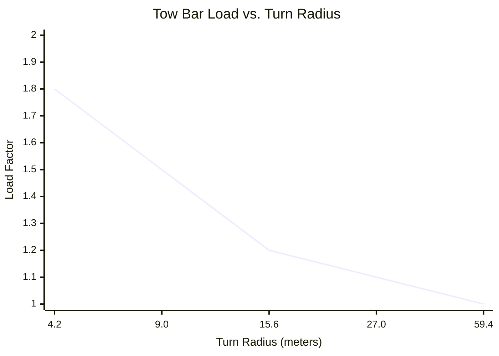
```mermaid
xychart-beta
    title "Tow Bar Load vs. Turn Radius"
    x-axis "Turn Radius (meters)" [4.2, 9.0, 15.6, 27.0, 59.4]
    y-axis "Load Factor" 1.0 --> 2.0
    line [1.8, 1.5, 1.2, 1.1, 1.0]
```

**Chart 6.2: Tow Bar Dynamic Loading**

Tight turns increase tow bar loading due to:
- **Geometric effects:** Increased side loads
- **Dynamic forces:** Higher acceleration requirements
- **Structural stress:** Non-linear load distribution

### 6.3 Equipment Selection Chart

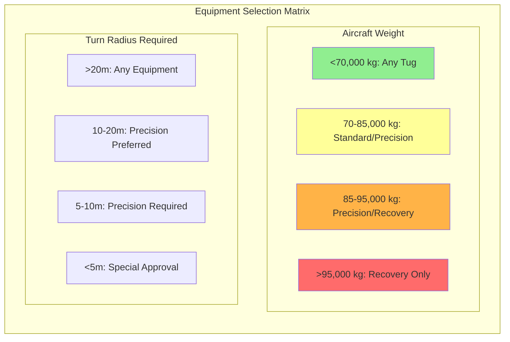
```mermaid
graph LR
    subgraph "Equipment Selection Matrix"
        subgraph "Aircraft Weight"
            W1[<70,000 kg: Any Tug]
            W2[70-85,000 kg: Standard/Precision]
            W3[85-95,000 kg: Precision/Recovery]
            W4[>95,000 kg: Recovery Only]
        end
        
        subgraph "Turn Radius Required"
            R1[>20m: Any Equipment]
            R2[10-20m: Precision Preferred]
            R3[5-10m: Precision Required]
            R4[<5m: Special Approval]
        end
    end
    
    style W1 fill:#90EE90
    style W2 fill:#FFFF99
    style W3 fill:#FFB347
    style W4 fill:#FF6B6B
```

**Chart 6.3: Equipment Selection Guidelines**

---

## 7. Weight Impact Charts

### 7.1 Weight vs. Turn Radius Chart

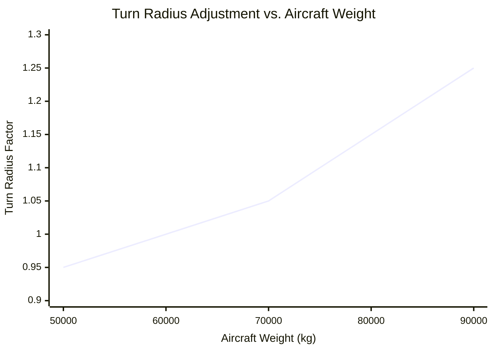
```mermaid
xychart-beta
    title "Turn Radius Adjustment vs. Aircraft Weight"
    x-axis "Aircraft Weight (kg)" [50000, 60000, 70000, 80000, 90000]
    y-axis "Turn Radius Factor" 0.9 --> 1.3
    line [0.95, 1.0, 1.05, 1.15, 1.25]
```

**Chart 7.1: Weight Impact on Turn Performance**

| Weight Range | Radius Factor | 45° Turn Example | Notes |
|--------------|---------------|------------------|-------|
| **50-60,000 kg** | 0.95 | 14.8m | Enhanced performance |
| **60-70,000 kg** | 1.0 | 15.6m | Baseline performance |
| **70-80,000 kg** | 1.05 | 16.4m | Slight degradation |
| **80-90,000 kg** | 1.15 | 17.9m | Noticeable impact |
| **90-95,000 kg** | 1.25 | 19.5m | Significant impact |

### 7.2 Center of Gravity Impact Chart

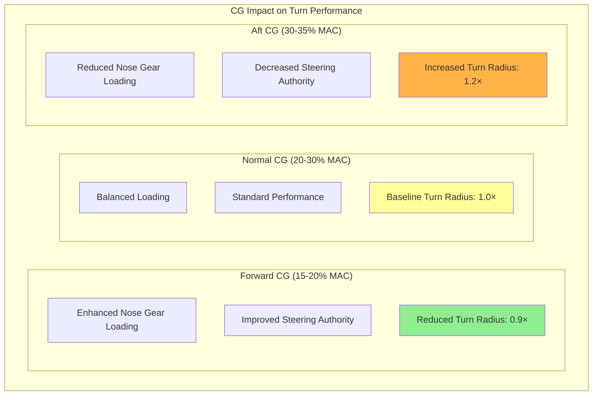
```mermaid
graph TD
    subgraph "CG Impact on Turn Performance"
        subgraph "Forward CG (15-20% MAC)"
            F1[Enhanced Nose Gear Loading]
            F2[Improved Steering Authority]
            F3[Reduced Turn Radius: 0.9×]
        end
        
        subgraph "Normal CG (20-30% MAC)"
            N1[Balanced Loading]
            N2[Standard Performance]
            N3[Baseline Turn Radius: 1.0×]
        end
        
        subgraph "Aft CG (30-35% MAC)"
            A1[Reduced Nose Gear Loading]
            A2[Decreased Steering Authority]
            A3[Increased Turn Radius: 1.2×]
        end
    end
    
    style F3 fill:#90EE90
    style N3 fill:#FFFF99
    style A3 fill:#FFB347
```

**Chart 7.2: Center of Gravity Effects**

### 7.3 Load Distribution Chart

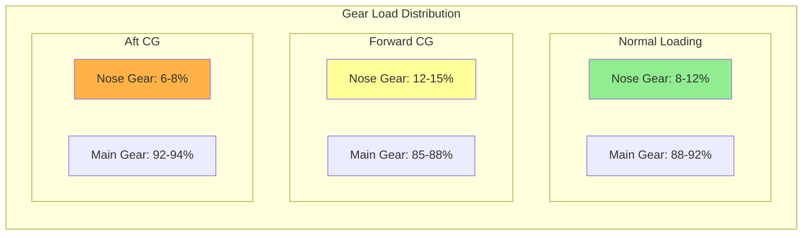
```mermaid
graph LR
    subgraph "Gear Load Distribution"
        subgraph "Normal Loading"
            NL1[Nose Gear: 8-12%]
            NL2[Main Gear: 88-92%]
        end
        
        subgraph "Forward CG"
            FL1[Nose Gear: 12-15%]
            FL2[Main Gear: 85-88%]
        end
        
        subgraph "Aft CG"
            AL1[Nose Gear: 6-8%]
            AL2[Main Gear: 92-94%]
        end
    end
    
    style NL1 fill:#90EE90
    style FL1 fill:#FFFF99
    style AL1 fill:#FFB347
```

**Chart 7.3: Landing Gear Load Distribution**

---

## 8. Operational Envelope Charts

### 8.1 Combined Operational Envelope

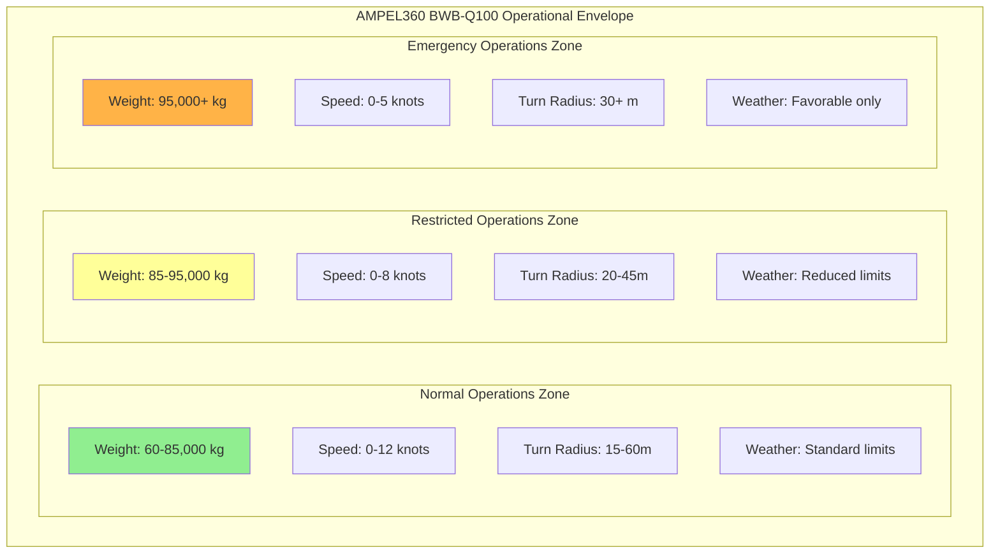
```mermaid
graph TD
    subgraph "AMPEL360 BWB-Q100 Operational Envelope"
        subgraph "Normal Operations Zone"
            NO1[Weight: 60-85,000 kg]
            NO2[Speed: 0-12 knots]
            NO3[Turn Radius: 15-60m]
            NO4[Weather: Standard limits]
        end
        
        subgraph "Restricted Operations Zone"
            RO1[Weight: 85-95,000 kg]
            RO2[Speed: 0-8 knots]
            RO3[Turn Radius: 20-45m]
            RO4[Weather: Reduced limits]
        end
        
        subgraph "Emergency Operations Zone"
            EO1[Weight: 95,000+ kg]
            EO2[Speed: 0-5 knots]
            EO3[Turn Radius: 30+ m]
            EO4[Weather: Favorable only]
        end
    end
    
    style NO1 fill:#90EE90
    style RO1 fill:#FFFF99
    style EO1 fill:#FFB347
```

**Chart 8.1: Comprehensive Operational Envelope**

### 8.2 Safety Margin Chart

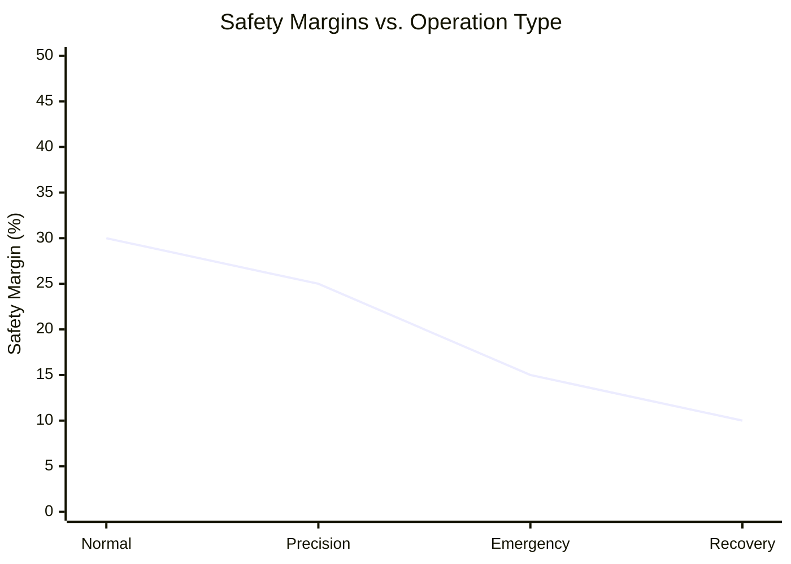
```mermaid
xychart-beta
    title "Safety Margins vs. Operation Type"
    x-axis ["Normal", "Precision", "Emergency", "Recovery"]
    y-axis "Safety Margin (%)" 0 --> 50
    line [30, 25, 15, 10]
```

**Chart 8.2: Safety Margin Requirements**

Different operation types require varying safety margins:
- **Normal operations:** 30% margin for comfortable safety buffer
- **Precision operations:** 25% margin with enhanced monitoring
- **Emergency operations:** 15% margin with continuous oversight
- **Recovery operations:** 10% margin with engineering supervision

### 8.3 Environmental Envelope Chart

```mermaid
graph TD
    subgraph "Environmental Operating Limits"
        subgraph "Green Zone - Normal Ops"
            G1[Wind: <25 knots]
            G2[Visibility: >1500m]
            G3[Temperature: -20°C to +40°C]
            G4[Surface: Dry/Good condition]
        end
        
        subgraph "Yellow Zone - Enhanced Procedures"
            Y1[Wind: 25-35 knots]
            Y2[Visibility: 800-1500m]
            Y3[Temperature: -40°C to -20°C, +40°C to +50°C]
            Y4[Surface: Wet/Fair condition]
        end
        
        subgraph "Red Zone - Emergency Only"
            R1[Wind: 35-45 knots]
            R2[Visibility: 400-800m]
            R3[Temperature: <-40°C, >+50°C]
            R4[Surface: Contaminated]
        end
    end
    
    style G1 fill:#90EE90
    style Y1 fill:#FFFF99
    style R1 fill:#FFB347
```

**Chart 8.3: Environmental Operating Envelope**

---

## 9. Quick Reference Charts

### 9.1 Emergency Quick Reference

```mermaid
graph LR
    subgraph "Emergency Turn Radius Limits"
        subgraph "Personnel Emergency"
            PE1[Immediate Stop Required]
            PE2[Minimum Turn: 45m]
            PE3[Speed: <3 knots]
        end
        
        subgraph "Equipment Emergency"
            EE1[Steering Failure: Straight only]
            EE2[Brake Failure: Wide turns only]
            EE3[Communication Loss: 2 knots max]
        end
        
        subgraph "Weather Emergency"
            WE1[Severe Weather Approach]
            WE2[Minimum Turn: 60m]
            WE3[Seek Immediate Shelter]
        end
    end
    
    style PE1 fill:#FF0000
    style EE1 fill:#FF6B6B
    style WE1 fill:#FFB347
```

**Chart 9.1: Emergency Procedures Quick Reference**

### 9.2 Daily Operations Quick Chart

| Operation Type | Max Speed | Min Turn Radius | Personnel Required |
|----------------|-----------|-----------------|-------------------|
| **Gate Pushback** | 8 knots | 20m | Standard crew |
| **Hangar Positioning** | 5 knots | 15m | Enhanced crew |
| **Maintenance Move** | 3 knots | 10m | Precision crew |
| **Emergency Position** | 2 knots | 30m | Full safety team |

### 9.3 Equipment Quick Selection Chart

```mermaid
graph TD
    subgraph "Quick Equipment Selection"
        subgraph "Turn Radius Required"
            T1[>25m: Standard Tug OK]
            T2[15-25m: Precision Preferred]
            T3[10-15m: Precision Required]
            T4[<10m: Special Approval + Precision]
        end
        
        subgraph "Aircraft Weight"
            W1[<80,000 kg: Standard Equipment]
            W2[80-90,000 kg: Enhanced Equipment]
            W3[>90,000 kg: Maximum Capacity Only]
        end
    end
    
    style T1 fill:#90EE90
    style T2 fill:#FFFF99
    style T3 fill:#FFB347
    style T4 fill:#FF6B6B
```

**Chart 9.3: Equipment Selection Quick Reference**

---

## 10. Chart Usage Instructions

### 10.1 Chart Reading Guidelines

**Step 1: Identify Required Information**
- Determine aircraft weight and configuration
- Identify desired turn radius or steering angle
- Assess environmental conditions
- Verify equipment availability

**Step 2: Apply Environmental Corrections**
- Use Chart 4.1 for wind corrections
- Apply Chart 4.2 for surface conditions
- Consider Chart 4.3 for temperature effects
- Combine factors multiplicatively

**Step 3: Verify Equipment Capabilities**
- Check Chart 6.1 for tug specifications
- Review Chart 6.2 for tow bar limitations
- Use Chart 6.3 for equipment selection
- Confirm load capacity margins

**Step 4: Calculate Final Parameters**
- Start with Chart 2.1 for basic turn radius
- Apply weight corrections from Chart 7.1
- Include CG effects from Chart 7.2
- Add environmental factors from Section 4

### 10.2 Chart Interpolation Methods

**Linear Interpolation Between Data Points:**
```
For values between chart points:
Interpolated Value = Y₁ + (X - X₁) × (Y₂ - Y₁) / (X₂ - X₁)

Where:
X = Desired input value
X₁, X₂ = Chart values bracketing X
Y₁, Y₂ = Chart outputs for X₁, X₂
```

**Example: Aircraft weight 75,000 kg**
```
Chart 7.1 shows:
70,000 kg → Factor 1.05
80,000 kg → Factor 1.15

Interpolation:
Factor = 1.05 + (75,000 - 70,000) × (1.15 - 1.05) / (80,000 - 70,000)
Factor = 1.05 + 5,000 × 0.10 / 10,000
Factor = 1.05 + 0.05 = 1.10
```

### 10.3 Chart Accuracy Verification

**Cross-Reference Verification:**
- Use multiple charts to verify calculations
- Compare calculated values with operational experience
- Verify environmental corrections with real-time data
- Confirm equipment performance with manufacturer specifications

**Quality Assurance Checks:**
- All values within reasonable operational ranges
- Environmental factors applied correctly
- Equipment limitations respected
- Safety margins maintained throughout calculation

### 10.4 Chart Update Procedures

**Regular Updates:**
- Charts reviewed quarterly for operational accuracy
- Environmental factors updated based on seasonal experience
- Equipment performance data updated after maintenance
- Operational limits adjusted based on service experience

**Version Control:**
- All chart updates tracked with revision numbers
- Previous versions archived for reference
- Change notifications distributed to all users
- Training updates provided for significant changes

---

## Chart Revision History

| Version | Date | Changes | Author | Approver |
|---------|------|---------|--------|----------|
| 1.0 | 2024-12-15 | Initial chart package creation | Ground Operations Engineering | Operations Director |
| 1.5 | 2025-04-10 | Added environmental impact charts and QSM integration | Engineering Team | Chief Engineer |
| 2.0 | 2025-06-29 | Comprehensive update with operational data and enhanced visualizations | Ground Operations Engineering | Program Director |

---

## Chart Approval and Authentication

**Prepared by:** GAIA-QAO Ground Operations Engineering Department  
**Technical Review:** Aerodynamics and Performance Engineering  
**Safety Review:** Safety and Risk Assessment Department  
**Operational Review:** Flight Operations and Ground Handling  
**Quality Review:** Quality Assurance Department  
**Chart Validation:** Flight Test and Operations Data Analysis  
**Final Approval:** Program Director  

**Digital Signatures:**
```
Chart Control Number: 00-80-10-01-01-TurnRadiusChart-V2R0
Primary Author: Ground Operations Engineering [Digital Signature]
Technical Reviewer: Performance Engineering [Digital Signature]
Safety Reviewer: Safety Manager [Digital Signature]
Operations Reviewer: Ground Operations Manager [Digital Signature]
Data Validator: Flight Test Engineer [Digital Signature]
Quality Reviewer: QA Manager [Digital Signature]
Final Approver: Program Director [Digital Signature]

Timestamp: 2025-06-29T01:15:00Z UTC
Chart Hash: SHA-256:e7f8a9b0c1d2...
Blockchain Reference: GQAO-BC-CHART-TURN-2025-0629-001
Verification Status: ✓ Authenticated and Approved
```

---

## Appendix A: Chart Data Tables

### A.1 Turn Radius Data Table

| Steering Angle (°) | Turn Radius (m) | Inner Wingtip (m) | Outer Wingtip (m) | Clear Zone (m) |
|-------------------|-----------------|------------------|------------------|----------------|
| **10** | 89.1 | 85.2 | 93.8 | 176.8 |
| **15** | 59.4 | 56.1 | 63.2 | 156.8 |
| **20** | 44.6 | 41.8 | 47.8 | 137.4 |
| **25** | 35.7 | 33.2 | 38.5 | 127.4 |
| **30** | 27.0 | 24.9 | 29.4 | 117.4 |
| **35** | 22.3 | 20.5 | 24.4 | 107.4 |
| **40** | 18.7 | 17.1 | 20.5 | 97.4 |
| **45** | 15.6 | 14.2 | 17.2 | 89.2 |
| **50** | 13.0 | 11.8 | 14.4 | 81.4 |
| **55** | 10.9 | 9.8 | 12.1 | 74.3 |
| **60** | 9.0 | 8.1 | 10.1 | 64.3 |
| **65** | 7.3 | 6.6 | 8.2 | 58.2 |
| **70** | 5.7 | 5.1 | 6.4 | 52.4 |
| **75** | 4.2 | 3.8 | 4.7 | 48.1 |

### A.2 Environmental Correction Factors

| Condition | Factor Range | Application Method |
|-----------|--------------|-------------------|
| **Wind Speed** | 1.0 - 1.4 | Multiply base radius |
| **Surface Moisture** | 1.0 - 1.5 | Multiply base radius |
| **Temperature** | 0.85 - 1.1 | Multiply base radius |
| **Aircraft Weight** | 0.9 - 1.3 | Multiply base radius |
| **CG Position** | 0.8 - 1.2 | Multiply base radius |

### A.3 Equipment Performance Data

| Equipment Type | Min Turn Radius | Max Capacity | Optimal Range |
|----------------|----------------|--------------|---------------|
| **Standard Tug** | 8.5m | 150,000 kg | 60-90,000 kg |
| **Precision Tug** | 6.2m | 200,000 kg | 80-150,000 kg |
| **Recovery Tug** | 10.0m | 300,000 kg | 100-250,000 kg |
| **Standard Tow Bar** | 12.5m | 150,000 kg | All weights |
| **Flexible Tow Bar** | 8.0m | 120,000 kg | <120,000 kg |

---

## Appendix B: Calculation Examples

### B.1 Turn Radius Calculation Example

**Scenario:** Aircraft weight 75,000 kg, 45° steering, 15-knot crosswind, wet surface

**Step 1: Base Turn Radius**
```
Steering Angle: 45°
Base Turn Radius: 15.6m (from Chart 2.1)
```

**Step 2: Apply Weight Correction**
```
Aircraft Weight: 75,000 kg
Weight Factor: 1.10 (interpolated from Chart 7.1)
Weight-Adjusted Radius: 15.6m × 1.10 = 17.2m
```

**Step 3: Apply Environmental Corrections**
```
Crosswind Factor: 1.08 (15 knots from Chart 4.1)
Surface Factor: 1.15 (wet surface from Chart 4.2)
Environmental-Adjusted Radius: 17.2m × 1.08 × 1.15 = 21.4m
```

**Step 4: Calculate Clearance Requirements**
```
Outer Wingtip Radius: √[(21.4 + 26.4)² + (18.5)²] = 51.8m
Required Clear Zone: 51.8m + 3.0m safety = 54.8m
```

**Final Result:**
- **Effective Turn Radius:** 21.4m
- **Required Clear Zone:** 54.8m radius
- **Maximum Speed:** 5 knots (due to environmental conditions)

### B.2 Equipment Selection Example

**Scenario:** Aircraft weight 85,000 kg, required turn radius 12m, standard weather

**Step 1: Weight Assessment**
```
Aircraft Weight: 85,000 kg
Weight Category: Heavy Weight (HW)
Enhanced procedures required
```

**Step 2: Turn Radius Assessment**
```
Required Turn Radius: 12m
Steering Angle Required: ~55° (from Chart 2.1)
Operation Category: Precision positioning
```

**Step 3: Equipment Requirements**
```
Weight Requirement: >150,000 kg capacity needed
Turn Requirement: <6.2m capability needed
Conclusion: Precision Tug (GQAO-TUG-ART-200) required
```

**Step 4: Verification**
```
Precision Tug Capacity: 200,000 kg ✓
Precision Tug Min Radius: 6.2m ✓
Weight Margin: (200,000 - 85,000) / 200,000 = 57.5% ✓
```

**Equipment Selection:** Precision Tug with Flexible Tow Bar

---

## Appendix C: Chart Symbology and Conventions

### C.1 Chart Symbols

| Symbol | Meaning | Usage |
|--------|---------|--------|
| **●** | Data Point | Measured or calculated values |
| **○** | Interpolated Point | Values between measurements |
| **▲** | Limit Value | Maximum or minimum allowed |
| **■** | Reference Point | Standard or baseline values |
| **◆** | Critical Point | Safety-critical values |

### C.2 Color Coding

| Color | Meaning | Application |
|-------|---------|-------------|
| **Green** | Safe/Normal | Standard operations zone |
| **Yellow** | Caution | Enhanced procedures required |
| **Orange** | Warning | Special approval needed |
| **Red** | Danger/Prohibited | Operations not permitted |
| **Purple** | Emergency | Emergency procedures only |

### C.3 Line Types

| Line Type | Meaning | Usage |
|-----------|---------|--------|
| **Solid** | Certified Data | Proven operational values |
| **Dashed** | Estimated Data | Calculated or interpolated |
| **Dotted** | Limit Line | Boundary conditions |
| **Dash-Dot** | Reference Line | Guidelines or targets |

---

## Appendix D: Digital Chart Integration

### D.1 QR Code Links

```
[QR Code linking to digital interactive charts would be here]
- Interactive turn radius calculator
- Real-time environmental adjustment tool
- Equipment selection wizard
- Clearance visualization tool
```

### D.2 Mobile App Integration

**GAIA-QAO Ground Operations App Features:**
- Real-time chart access on mobile devices
- GPS-based environmental data integration
- Equipment status and availability checking
- Automatic calculation with current aircraft data
- Photo documentation of clearance verification

### D.3 Augmented Reality Integration

**AR Chart Overlay System:**
- Real-time clearance zone visualization
- Projected turn radius on ground surface
- Equipment positioning guidance
- Safety zone boundary display
- Emergency procedure quick access

---

## Appendix E: Training and Certification

### E.1 Chart Reading Competency Requirements

**Basic Level (All Personnel):**
- Understand basic turn radius relationships
- Read simple charts and tables accurately
- Apply single correction factors
- Recognize safety zones and limits

**Advanced Level (Supervisors):**
- Perform complex chart interpolations
- Apply multiple correction factors
- Understand chart limitations and accuracy
- Make equipment selection decisions

**Expert Level (Specialists):**
- Validate chart data against operational experience
- Develop new charts and corrections
- Analyze chart accuracy and recommend updates
- Train others in chart usage

### E.2 Chart Usage Assessment

**Practical Exercises:**
1. **Basic Turn Calculation:** Given aircraft weight and desired radius, calculate steering angle
2. **Environmental Correction:** Apply wind and surface corrections to base calculations
3. **Equipment Selection:** Choose appropriate equipment for given scenario
4. **Clearance Verification:** Calculate required clear zones for specific operations
5. **Emergency Application:** Use charts for emergency scenarios and limitations

**Assessment Criteria:**
- Accuracy of calculations (±5% tolerance)
- Proper application of correction factors
- Recognition of safety limits and restrictions
- Appropriate equipment selection decisions
- Understanding of chart limitations and accuracy

---

## Appendix F: Chart Maintenance and Updates

### F.1 Data Sources for Chart Updates

**Operational Data Sources:**
- QSM system performance records
- Ground operations incident reports
- Equipment performance monitoring
- Environmental condition databases
- Personnel feedback and observations

**Technical Data Sources:**
- Structural analysis updates
- Equipment manufacturer specifications
- Regulatory requirement changes
- Industry best practice developments
- Research and development findings

### F.2 Chart Validation Process

**Annual Chart Review Process:**
1. **Data Collection:** Gather operational and technical data
2. **Analysis:** Compare chart predictions with actual performance
3. **Validation:** Verify chart accuracy against real-world operations
4. **Updates:** Modify charts based on findings
5. **Approval:** Obtain necessary approvals for changes
6. **Distribution:** Implement updated charts across organization

**Continuous Improvement:**
- Monthly performance trend analysis
- Quarterly operational feedback review
- Semi-annual equipment performance assessment
- Annual comprehensive chart validation

---

**PROPRIETARY AND CONFIDENTIAL**

*This chart package contains proprietary information of GAIA-QAO and is intended solely for authorized personnel. Unauthorized reproduction, distribution, or disclosure is strictly prohibited. This document contains technical data subject to export control restrictions.*

**Classification:** Flight Operations Chart Package - Turn Radius Performance  
**Export Control:** ITAR Category VIII - Aircraft maneuvering performance data  
**Security Level:** Company Confidential - Operational Use  
**Distribution:** Authorized ground operations, flight operations, and training personnel only  

**END OF CHART PACKAGE**
