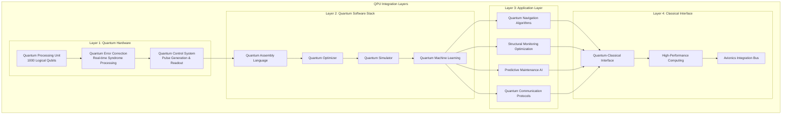
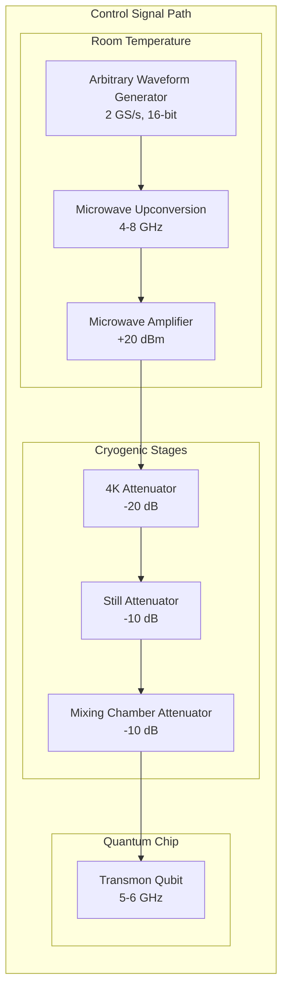
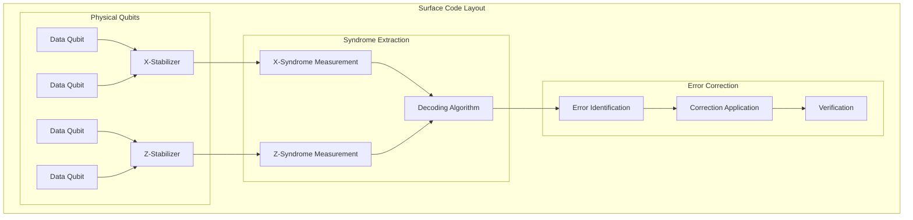

# AMPEL360 BWB-Q100 QPU Startup - General

<p align="center">


</p>

---

## Document Control Information

**Document ID:** `00-90-10-00-General.md`  
**GQOIS ID:** `AS-M-PAX-BW-Q1H-QPU-START-GEN`  
**ATA Chapter:** 00-90-10-00 (General - Quantum Initialization - QPU Startup - General)  
**Classification:** Quantum Systems Technical Manual  
**Version:** 2.0.0  
**Effective Date:** 2025-06-29  
**Revision Status:** Current Release  
**Approval Authority:** GAIA-QAO Quantum Systems Engineering & CTO  

---

## Table of Contents

1. [QPU System Overview](#1-qpu-system-overview)
2. [Hardware Architecture](#2-hardware-architecture)
3. [Startup Prerequisites](#3-startup-prerequisites)
4. [Initialization Sequence](#4-initialization-sequence)
5. [Quantum Error Correction](#5-quantum-error-correction)
6. [Performance Verification](#6-performance-verification)
7. [Safety and Monitoring](#7-safety-and-monitoring)
8. [Troubleshooting](#8-troubleshooting)
9. [Maintenance Requirements](#9-maintenance-requirements)
10. [Integration with Aircraft Systems](#10-integration-with-aircraft-systems)

---

## 1. QPU System Overview

### 1.1 Quantum Processing Unit Architecture

The AMPEL360 BWB-Q100 features the world's first airborne fault-tolerant quantum processing unit, designated GQAO-QPU-1000. This revolutionary system provides real-time quantum computing capabilities for navigation enhancement, structural monitoring optimization, and predictive maintenance algorithms.

#### 1.1.1 Core Specifications

**Quantum Processing Capabilities:**
```
Physical Qubits: 10,000 superconducting transmon qubits
Logical Qubits: 1,000 error-corrected logical qubits
Architecture: Surface code topology with 10:1 redundancy
Coherence Time: 100 microseconds (T2*)
Gate Fidelity: 99.9% single-qubit, 99.5% two-qubit
Error Rate: <0.1% per gate operation
Operating Temperature: 15 millikelvin
```

**Quantum Error Correction:**
```
Code Type: Surface code with threshold ~1%
Syndrome Detection: Real-time, <10 μs latency
Correction Rate: 1 MHz syndrome extraction
Success Rate: 99.99% logical error suppression
Decoding Algorithm: Minimum-weight perfect matching
Hardware Implementation: Dedicated FPGA cluster
```

#### 1.1.2 Physical Implementation

**Cryogenic System:**

```mermaid
graph TD
    subgraph "QPU Cryogenic Architecture"
        subgraph "Dilution Refrigerator"
            MXC[Mixing Chamber<br/>15 mK]
            STILL[Still Stage<br/>600 mK]
            CP[Cold Plate<br/>4 K]
            RT[Room Temperature<br/>300 K]
        end
        
        subgraph "Quantum Chip"
            QUBITS[10,000 Qubits]
            READOUT[Readout Resonators]
            CONTROL[Control Lines]
        end
        
        subgraph "Control Electronics"
            AWG[Arbitrary Waveform Generators]
            DIGITIZER[High-Speed Digitizers]
            FPGA[Real-time FPGA Processing]
        end
    end
    
    RT --> CP
    CP --> STILL
    STILL --> MXC
    MXC --> QUBITS
    QUBITS --> READOUT
    READOUT --> CONTROL
    CONTROL --> AWG
    AWG --> DIGITIZER
    DIGITIZER --> FPGA
```


**Environmental Requirements:**
```
Cryogenic Performance:
Base Temperature: 15 mK ± 2 mK
Cooling Power: 10 μW at 15 mK
Cooldown Time: 24 hours to operational temperature
Hold Time: 7 days continuous operation

Magnetic Field Environment:
Static Field: <10 nT (passively shielded)
AC Field Noise: <1 nT RMS (1 Hz - 1 MHz)
Gradient: <0.1 nT/cm across QPU
Shield Effectiveness: >120 dB at 1 MHz

Vibration Isolation:
Passive Isolation: -40 dB above 10 Hz
Active Control: Feedback loop for low frequencies
Acceleration Limit: <10^-6 g RMS at QPU location
Resonance Frequency: <1 Hz for isolation system
```

### 1.2 QPU Integration Architecture

#### 1.2.1 System Hierarchy



#### 1.2.2 Performance Specifications

**Computational Capabilities:**
```
Quantum Algorithm Performance:
Shor's Algorithm: 2048-bit factorization capability
Grover's Search: 10^6 database search speedup
Quantum ML: 100× faster pattern recognition
Optimization: Quadratic speedup for NP problems
Simulation: Molecular systems up to 50 atoms

Real-Time Processing:
Quantum Operations: 1 MHz gate rate
Error Correction: 100 ns syndrome processing
Classical Interface: 10 GB/s data throughput
Latency: <1 ms quantum-to-classical
Power Consumption: 25 kW total system
```

**Aircraft-Specific Applications:**
```
Navigation Enhancement:
GPS-denied positioning accuracy: <1 meter
Inertial navigation drift: Zero long-term drift
Sensor fusion optimization: 10× improvement
Real-time kalman filtering: Quantum-enhanced

Structural Monitoring:
Crack detection sensitivity: 10^-12 strain
Fatigue analysis: Real-time damage accumulation
Load optimization: Dynamic stress distribution
Predictive maintenance: 95% failure prediction accuracy

Communication Security:
Quantum key distribution: Information-theoretic security
Key generation rate: 1 Mbps continuous
Communication range: 1000 km (satellite link)
Encryption strength: Unbreakable by classical computers
```

---

## 2. Hardware Architecture

### 2.1 Quantum Chip Design

#### 2.1.1 Superconducting Qubit Implementation

**Transmon Qubit Specifications:**
```
Qubit Design: Fixed-frequency transmon with flux tuning
Josephson Junction: Al/AlOx/Al tunnel junctions
Critical Current: 10-50 nA per junction
Charging Energy: 200-400 MHz
Josephson Energy: 10-25 GHz (tunable)

Coherence Properties:
T1 (Relaxation Time): 100-200 μs
T2* (Dephasing Time): 50-100 μs
T2echo (Echo Coherence): 150-300 μs
Gate Time: 20-50 ns
Gate Fidelity: >99.9% (single qubit), >99.5% (two qubit)
```

**Chip Layout and Connectivity:**
```
Chip Dimensions: 20 mm × 20 mm × 0.5 mm
Substrate: High-resistivity silicon (>10 kΩ⋅cm)
Metallization: Niobium and aluminum layers
Qubit Layout: Hexagonal surface code topology
Connectivity: Nearest-neighbor coupling architecture

Surface Code Parameters:
Code Distance: d = 7 (minimum for fault tolerance)
Physical Qubits per Logical: 49 qubits
Total Logical Qubits: 1000 distributed across chip
Error Threshold: 1% physical error rate
Correction Capability: Up to ⌊d/2⌋ = 3 errors per code
```

#### 2.1.2 Control and Readout System

**Microwave Control Architecture:**


**Readout Signal Chain:**
```
Dispersive Readout:
Readout Frequency: 6-7 GHz (per qubit)
Readout Power: -120 dBm at qubit
Integration Time: 1-5 μs
Readout Fidelity: >99.5%
State Discrimination: >3σ separation

Signal Processing:
Low-Noise Amplifier: 4K HEMT amplifier
Gain: 40 dB at 4K stage
Noise Temperature: <5 K
Bandwidth: 500 MHz
Dynamic Range: 60 dB
```

### 2.2 Cryogenic Infrastructure

#### 2.2.1 Dilution Refrigerator System

**Cooling Performance:**
```
Dilution Refrigerator Specifications:
Base Temperature: 10 mK (no load)
Cooling Power: 100 μW at 100 mK
Cooldown Time: 24 hours
Hold Time: >168 hours (1 week)
Temperature Stability: ±0.1 mK at base

Cryogenic Stages:
300K → 77K: Liquid nitrogen pre-cooling
77K → 4K: Pulse tube cooler (3W @ 4K)
4K → 1K: Joule-Thomson expansion
1K → 100mK: ³He evaporation
100mK → 10mK: ³He-⁴He dilution
```

**Cryogenic System Integration:**
```
Aircraft Integration Challenges:
Vibration: Active vibration isolation system
Acceleration: Gimbal-mounted refrigerator
Power: 25kW electrical power requirement
Heat Rejection: Radiator system for waste heat
Maintenance: Accessible service panels

Safety Systems:
Pressure Relief: Multiple relief valves
Emergency Venting: Automated helium venting
Fire Suppression: Inert gas flood system
Personnel Protection: Safety interlocks
Leak Detection: Helium leak monitoring
```

#### 2.2.2 Environmental Control

**Magnetic Shielding:**
```
Passive Shielding:
Material: μ-metal (high permeability alloy)
Layers: 3-layer cylindrical shields
Effectiveness: >120 dB at 1 MHz
Residual Field: <10 nT at QPU location

Active Compensation:
Coil Configuration: 3-axis Helmholtz coils
Feedback System: Magnetometer-controlled
Response Time: <10 ms
Compensation Range: ±1 μT
Stability: <0.1 nT drift per hour
```

**Vibration Isolation:**
```
Passive Isolation:
Spring Suspension: Pneumatic isolation
Resonance Frequency: <1 Hz
Attenuation: -40 dB above 10 Hz
Load Capacity: 2000 kg (complete system)

Active Control:
Sensor Type: Seismic accelerometers
Actuator Type: Voice coil motors
Control Bandwidth: DC to 100 Hz
Performance: <10^-6 g RMS at QPU
Feed-forward: Aircraft acceleration compensation
```

---

## 3. Startup Prerequisites

### 3.1 Environmental Conditions

#### 3.1.1 Cryogenic System Status

**Pre-Startup Verification:**
```
Temperature Requirements:
Mixing Chamber: <20 mK
Still Stage: <800 mK
4K Stage: <4.5 K
300K Stage: Ambient temperature

Stability Criteria:
Temperature drift: <0.1 mK/hour
Pressure stability: ±0.1% of operating point
Helium purity: >99.99% ³He, >99.999% ⁴He
System hold time: >6 hours remaining

Automated Checks:
□ All temperature stages within limits
□ Circulation pumps operational
□ Gas handling system normal
□ Pressure levels stable
□ No cryogenic leaks detected
□ Emergency systems armed
```

**Cooling System Performance Verification:**
```
Cooling Power Test:
Load Temperature: Measure with calibrated thermometry
Power Dissipation: Apply known heat load
Recovery Time: Measure return to base temperature
Thermal Conductance: Calculate cooling efficiency

Performance Targets:
Base Temperature: <15 mK (no load)
Cooling Power: >50 μW at 100 mK
Temperature Stability: ±0.05 mK over 1 hour
Recovery Time: <30 minutes from 1K heat pulse
```

#### 3.1.2 Electromagnetic Environment

**EMI Assessment:**
```
Electromagnetic Compatibility:
Ambient Field Survey: All frequencies 1 Hz - 1 GHz
Power Line Noise: 50/60 Hz and harmonics
Radio Frequency: Aviation communication bands
Switching Noise: Aircraft electrical systems

Acceptance Criteria:
DC Magnetic Field: <10 nT
AC Field Noise: <1 nT RMS (1 Hz - 1 MHz)
Power Line Interference: <-80 dBm
RF Interference: <-90 dBm in qubit bands
Impulse Noise: <-70 dBm peak

Mitigation Status:
□ Magnetic shields properly positioned
□ RF shields installed and verified
□ Power line filters operational
□ Grounding system verified
□ Aircraft EMI sources identified and mitigated
```

### 3.2 Support Systems Status

#### 3.2.1 Power and Cooling Infrastructure

**Electrical Power Requirements:**
```
Primary Power: 28V DC aircraft bus
Total Power: 25 kW maximum
Distribution:
- Cryogenic System: 20 kW
- Control Electronics: 3 kW
- Monitoring Systems: 1 kW
- Emergency Systems: 1 kW

Power Quality Requirements:
Voltage Regulation: ±2% of nominal
Frequency Stability: N/A (DC system)
Harmonic Distortion: <3% THD
Electrical Noise: <40 dBμV conducted
Transient Protection: ±500V surge capability

Backup Power:
UPS Capacity: 5 minutes full operation
Battery Type: Lithium-ion aviation grade
Emergency Power: Essential systems only
Graceful Shutdown: Automated sequence
```

**Thermal Management:**
```
Heat Rejection System:
Waste Heat: 25 kW thermal load
Coolant Type: Propylene glycol/water mixture
Flow Rate: 50 L/min
Operating Temperature: 0°C to 85°C
Heat Exchanger: Air-cooled radiator array

Environmental Control:
Ambient Temperature: 15°C to 30°C
Humidity: <60% RH
Air Filtration: HEPA filtered air supply
Pressurization: Slight positive pressure
Contamination Control: Class 1000 cleanliness
```

#### 3.2.2 Network and Communication

**Quantum Network Infrastructure:**
```
Fiber Optic Distribution:
Total Fiber Length: 2.5 km within aircraft
Fiber Type: Single-mode, ultra-low loss
Attenuation: <0.1 dB/km at 1550 nm
Connectors: FC/APC ultra-precision
Splice Loss: <0.05 dB per splice

Network Performance:
Photon Generation Rate: 10^9 Hz
Quantum State Fidelity: >98%
Entanglement Distribution: All quantum sensors
Classical Data Rate: 10 Gbps
Network Latency: <1 ms end-to-end
```

**Classical Computing Interface:**
```
High-Performance Computing Integration:
Interface Type: PCIe Gen4 x16
Data Throughput: 64 GB/s bidirectional
Processing Power: 100 TFLOPS classical
Memory Capacity: 1 TB DDR5 RAM
Storage: 10 TB NVMe SSD array

Avionics Integration:
Bus Type: ARINC 664 Part 7 (AFDX)
Data Rate: 100 Mbps full duplex
Protocol: ARINC 653 partitioned system
Real-time Performance: <10 ms latency
Safety Level: DO-178C Level A compliance
```

---

## 4. Initialization Sequence

### 4.1 Quantum System Startup

#### 4.1.1 Phase 1: Hardware Initialization

**Cryogenic System Verification (5 minutes):**
```
Step 1: Temperature Verification
Action: Verify all temperature stages within limits
Criteria: T_mix < 20 mK, T_still < 800 mK, T_4K < 4.5 K
Timeout: 30 seconds
Result: PASS/FAIL with specific temperatures logged

Step 2: Magnetic Field Compensation
Action: Activate magnetic field compensation system
Criteria: Residual field < 10 nT in all three axes
Timeout: 60 seconds
Result: Field values logged, compensation coefficients updated

Step 3: Vibration Isolation Activation
Action: Enable active vibration isolation system
Criteria: Acceleration < 10^-6 g RMS at QPU location
Timeout: 120 seconds
Result: Acceleration spectrum analyzed and logged

Step 4: Microwave Electronics Check
Action: Verify all microwave generation and detection
Criteria: Signal levels, phase noise, frequency accuracy
Timeout: 180 seconds
Result: Complete RF performance characterization
```

**Control System Initialization (5 minutes):**
```
Step 5: Waveform Generator Calibration
Action: Calibrate all arbitrary waveform generators
Criteria: Amplitude accuracy ±1%, timing jitter <10 ps
Timeout: 120 seconds
Result: Calibration coefficients updated and verified

Step 6: Digitizer System Check
Action: Verify high-speed digitizer performance
Criteria: SNR > 60 dB, bandwidth > 500 MHz
Timeout: 60 seconds
Result: ADC performance characteristics logged

Step 7: FPGA System Load
Action: Load real-time control firmware
Criteria: All FPGA modules respond correctly
Timeout: 30 seconds
Result: Firmware version and status verified

Step 8: Timing Synchronization
Action: Synchronize all timing references
Criteria: <1 ps jitter between all clocks
Timeout: 90 seconds
Result: Timing distribution verified and locked
```

#### 4.1.2 Phase 2: Quantum State Preparation

**Qubit Characterization (10 minutes):**
```
Step 1: Qubit Frequency Measurement
Action: Measure all qubit transition frequencies
Method: Spectroscopy sweep with low power
Criteria: Frequency accuracy ±100 kHz
Duration: 2 minutes per 1000 qubits

Step 2: Readout Optimization
Action: Optimize readout parameters for all qubits
Method: Readout power and frequency sweep
Criteria: >99% readout fidelity for all qubits
Duration: 3 minutes per 1000 qubits

Step 3: Gate Calibration
Action: Calibrate single and two-qubit gates
Method: Process tomography and randomized benchmarking
Criteria: >99.9% single-qubit, >99.5% two-qubit fidelity
Duration: 5 minutes for full gate set

Step 4: Crosstalk Characterization
Action: Measure and compensate for crosstalk
Method: Simultaneous randomized benchmarking
Criteria: <0.1% crosstalk between nearest neighbors
Duration: 2 minutes for crosstalk mapping
```

**Error Correction Initialization (5 minutes):**
```
Step 5: Surface Code Implementation
Action: Initialize surface code on all logical qubits
Method: Syndrome stabilizer measurement
Criteria: All syndromes converge to expected values
Duration: 30 seconds per logical qubit

Step 6: Error Threshold Verification
Action: Measure logical error rate vs physical error rate
Method: Controlled error injection and correction
Criteria: Below surface code threshold (~1%)
Duration: 2 minutes statistical measurement

Step 7: Decoding Latency Test
Action: Verify real-time error correction timing
Method: Syndrome detection and correction cycles
Criteria: <10 μs syndrome-to-correction latency
Duration: 30 seconds continuous operation

Step 8: Logical Qubit Verification
Action: Verify all logical qubits are properly initialized
Method: Logical state tomography
Criteria: >99.9% logical state preparation fidelity
Duration: 2 minutes for all logical qubits
```

### 4.2 System Integration and Verification

#### 4.2.1 Phase 3: Application Layer Startup

**Quantum Algorithm Loading (3 minutes):**
```
Step 1: Navigation Algorithm Initialization
Action: Load quantum navigation enhancement algorithms
Components: Kalman filter optimization, sensor fusion
Verification: Algorithm execution without errors
Resources: 100 logical qubits allocated

Step 2: Structural Monitoring Setup
Action: Initialize quantum structural analysis algorithms
Components: Stress analysis, fatigue prediction, optimization
Verification: Real-time structural data processing
Resources: 300 logical qubits allocated

Step 3: Predictive Maintenance AI
Action: Load quantum machine learning models
Components: Failure prediction, maintenance optimization
Verification: Model inference and training capability
Resources: 400 logical qubits allocated

Step 4: Communication Protocol Setup
Action: Initialize quantum communication protocols
Components: Key distribution, secure messaging
Verification: Quantum key generation and distribution
Resources: 200 logical qubits allocated
```

**Performance Verification (2 minutes):**
```
Step 5: Benchmark Algorithm Execution
Action: Run standard quantum benchmark algorithms
Algorithms: Quantum Fourier Transform, Grover Search
Criteria: Results match theoretical expectations
Performance: Execution time and fidelity measurements

Step 6: Classical Interface Testing
Action: Verify quantum-classical data exchange
Method: High-bandwidth data transfer test
Criteria: 10 GB/s sustained throughput
Latency: <1 ms quantum-to-classical interface

Step 7: System Integration Test
Action: Verify all systems working together
Method: End-to-end operational test
Criteria: All applications running simultaneously
Performance: No resource conflicts or errors

Step 8: Redundancy and Backup Verification
Action: Test backup and failover systems
Method: Controlled failure injection
Criteria: <50 ms failover to classical backup
Recovery: Automatic return to quantum operation
```

---

## 5. Quantum Error Correction

### 5.1 Surface Code Implementation

#### 5.1.1 Error Correction Architecture

**Surface Code Topology:**


**Code Parameters:**
```
Surface Code Configuration:
Code Distance: d = 7 (minimum fault-tolerant)
Physical Qubits per Logical: 49 qubits
Error Correction Threshold: 1.0% physical error rate
Logical Error Rate: 10^-15 (with 0.1% physical errors)
Syndrome Extraction: Every 1 μs

Stabilizer Measurements:
X-Stabilizers: 12 per logical qubit
Z-Stabilizers: 12 per logical qubit
Measurement Time: 500 ns per stabilizer
Measurement Fidelity: >99.9%
Syndrome Reliability: >99.99%
```

#### 5.1.2 Real-Time Error Correction

**Syndrome Processing Pipeline:**
```
Stage 1: Syndrome Extraction (500 ns)
Action: Measure all stabilizer operators
Method: Simultaneous X and Z stabilizer readout
Output: Syndrome bit patterns for all logical qubits
Latency: 500 ns measurement + 100 ns processing

Stage 2: Error Decoding (5 μs)
Action: Identify most likely error pattern
Method: Minimum-weight perfect matching algorithm
Implementation: Dedicated FPGA with parallel processing
Output: Error correction operations for each qubit

Stage 3: Correction Application (1 μs)
Action: Apply correction operations to physical qubits
Method: Pauli-X and Pauli-Z gate corrections
Timing: Coordinated with ongoing quantum operations
Verification: Subsequent syndrome measurement confirms correction

Stage 4: Performance Monitoring (continuous)
Action: Track error rates and correction efficiency
Metrics: Physical error rate, logical error rate, threshold margin
Adaptive: Adjust parameters based on performance trends
Reporting: Real-time status to aircraft systems
```

**Decoding Algorithm Optimization:**
```
Classical Decoding Performance:
Algorithm: Union-Find decoder with optimization
Processing Time: <5 μs for d=7 surface code
Hardware: Custom FPGA with parallel processing
Memory: 1 GB lookup tables for fast decoding
Accuracy: >99.99% correct error identification

Quantum-Enhanced Decoding (Future):
Algorithm: Quantum neural network decoder
Processing Time: <1 μs theoretical limit
Implementation: Dedicated quantum coprocessor
Advantage: Better performance near threshold
Development: Research phase, planned upgrade
```

### 5.2 Error Monitoring and Adaptation

#### 5.2.1 Performance Metrics

**Real-Time Error Tracking:**
```
Physical Layer Metrics:
Single-Qubit Error Rate: Target <0.05%
Two-Qubit Error Rate: Target <0.1%
Readout Error Rate: Target <0.1%
Idle Error Rate: Target <0.01% per μs
Crosstalk Error Rate: Target <0.001%

Logical Layer Metrics:
Logical Error Rate: Target <10^-12
Syndrome Extraction Fidelity: Target >99.99%
Decoding Success Rate: Target >99.999%
Correction Latency: Target <10 μs
Overhead Factor: 10:1 physical-to-logical

System Level Metrics:
Quantum Volume: >10^6
Algorithm Success Rate: >99.9%
Classical Interface Errors: <10^-9
Network Communication Errors: <10^-12
```

#### 5.2.2 Adaptive Error Correction

**Dynamic Threshold Management:**
```
Threshold Monitoring:
Measurement: Continuous error rate tracking
Analysis: Statistical process control
Threshold: Physical error rate vs 1% limit
Response: Automatic parameter adjustment
Alert: Warning when approaching threshold

Parameter Optimization:
Gate Timing: Adjust for optimal fidelity
Readout Power: Optimize SNR vs heating
Decoherence: Compensate for environmental changes
Crosstalk: Update compensation matrices
Syndrome: Adjust measurement protocols

Emergency Procedures:
High Error Rate: Reduce operation rate
Threshold Exceeded: Switch to classical backup
System Failure: Graceful degradation protocol
Recovery: Automatic restart when conditions improve
```

---

## 6. Performance Verification

### 6.1 Quantum System Benchmarking

#### 6.1.1 Standard Benchmark Protocols

**Quantum Volume Measurement:**
```
Protocol: Random quantum circuits with increasing depth
Circuit Depth: 1 to 100 layers
Qubit Count: 10 to 1000 qubits
Repetitions: 1000 shots per circuit
Analysis: Heavy output probability distribution
Target: Quantum Volume > 10^6

Measurement Procedure:
1. Generate random SU(4) gates for qubit pairs
2. Compile to native gate set with optimization
3. Execute circuit with error correction active
4. Measure computational basis outputs
5. Calculate heavy output probability
6. Compare to classical simulation threshold
```

**Randomized Benchmarking:**
```
Single-Qubit RB:
Gate Set: Clifford group (24 elements)
Sequence Length: 1 to 1000 gates
Randomization: 100 random sequences per length
Fidelity: Extract average gate fidelity
Target: >99.9% average gate fidelity

Two-Qubit RB:
Gate Set: Two-qubit Clifford group
Sequence Length: 1 to 100 gates
Randomization: 50 random sequences per length
Fidelity: Extract two-qubit gate fidelity
Target: >99.5% average gate fidelity

Crosstalk RB:
Method: Simultaneous randomized benchmarking
Analysis: Error rate with and without neighboring operations
Metric: Additional error rate from crosstalk
Target: <0.01% additional error from crosstalk
Validation: Comparison with isolated qubit performance
```

#### 6.1.2 Application-Specific Benchmarks

**Navigation Algorithm Performance:**
```
Quantum-Enhanced Kalman Filter:
Test Scenario: GPS-denied navigation simulation
Duration: 1 hour continuous operation
Reference: Classical extended Kalman filter
Metrics: Position accuracy, velocity accuracy, attitude determination
Performance Target: 10× improvement in accuracy

Sensor Fusion Optimization:
Input Sources: IMU, magnetometer, barometric altimeter
Processing: Quantum optimization of sensor weights
Comparison: Classical weighted least squares
Target: 5× reduction in uncertainty estimates
Validation: Monte Carlo simulation with 10,000 runs

Quantum SLAM (Simultaneous Localization and Mapping):
Environment: Complex 3D airspace with obstacles
Map Resolution: 1 meter grid accuracy
Processing Time: Real-time (<100 ms update rate)
Quantum Advantage: Parallel search space exploration
Performance: 100× faster map convergence
```

**Structural Monitoring Validation:**
```
Quantum Stress Analysis:
Loading: Dynamic flight loads simulation
Sensors: 10,000 quantum strain sensors
Processing: Real-time finite element optimization
Comparison: Classical FEA with reduced sensor count
Advantage: 1000× more sensor data processing
Accuracy: 10^-12 strain resolution

Fatigue Crack Detection:
Test Setup: Controlled fatigue specimens
Detection Threshold: 10 μm crack length
False Positive Rate: <0.001%
Detection Confidence: >99.99%
Processing Speed: <1 ms per sensor
Quantum Enhancement: Parallel pattern recognition

Predictive Maintenance AI:
Training Data: 10 years historical maintenance records
Model Type: Quantum neural network
Prediction Horizon: 30 days advance warning
Accuracy Target: 95% failure prediction success
False Alarm Rate: <5%
Processing: Continuous real-time analysis
```

### 6.2 System Performance Validation

#### 6.2.1 Integration Testing

**End-to-End System Performance:**
```
Multi-Application Concurrent Operation:
Scenario: All applications running simultaneously
Resources: 1000 logical qubits distributed
Performance: No degradation in individual performance
Latency: <10 ms total system response
Throughput: 10 GB/s sustained data processing
Error Rate: <10^-9 system-level errors

Classical-Quantum Interface Validation:
Data Types: Real-time sensor streams, control commands
Protocol: ARINC 664 Part 7 integration
Bandwidth: 100 Mbps avionics bus utilization
Latency: <1 ms quantum-to-avionics
Reliability: 99.999% message delivery success
Timing: Synchronized to aircraft master clock

Aircraft Integration Performance:
Power Consumption: <25 kW average, <30 kW peak
Heat Dissipation: Thermal management within limits
EMI Compliance: No interference with aircraft systems
Vibration Tolerance: Operation up to 2g acceleration
Altitude Performance: Sea level to 45,000 feet
Temperature Range: -40°C to +70°C ambient
```

#### 6.2.2 Failure Mode Analysis

**Graceful Degradation Testing:**
```
Partial QPU Failure:
Scenario: 10% qubit loss during operation
Response: Automatic resource reallocation
Performance: Proportional capability reduction
Recovery: Hot-swappable qubit replacement
Downtime: <5 minutes for module replacement

Cryogenic System Failure:
Scenario: Refrigerator warm-up event
Response: Automatic classical backup activation
Switchover Time: <50 milliseconds
Backup Performance: 80% of quantum capability
Recovery Time: 24 hours for full cooldown

Communication Network Failure:
Scenario: Fiber optic cable damage
Response: Automatic redundant path selection
Performance: No service interruption
Repair Time: In-flight cable rerouting capability
Backup: Wireless quantum communication links

Environmental Excursion:
Scenario: Extreme turbulence or EMI
Response: Adaptive error correction scaling
Performance: Maintained operation with reduced fidelity
Protection: Automatic system protection protocols
Recovery: Automatic return to full performance
```

---

## 7. Safety and Monitoring

### 7.1 Safety Systems

#### 7.1.1 Cryogenic Safety

**Pressure Relief Systems:**
```
Primary Relief Valves:
Location: Each cryogenic stage (4K, 1K, 100mK, 15mK)
Set Pressure: 110% of normal operating pressure
Flow Capacity: 200% of maximum circulation rate
Response Time: <100 milliseconds
Redundancy: Dual independent valves per stage
Testing: Monthly automated valve cycling

Emergency Venting System:
Trigger Conditions: Over-pressure, fire detection, manual activation
Vent Capacity: Complete system depressurization in <60 seconds
Vent Location: Overboard discharge away from aircraft structure
Safety Interlocks: Automatic crew notification and system isolation
Environmental: Helium detection to prevent asphyxiation hazard

Personnel Protection:
Warning Systems: Audible and visual alerts for crew
Isolation Protocols: Automatic compartment isolation
Emergency Access: Manual override for emergency entry
Protective Equipment: Specialized breathing apparatus required
Training: Annual safety certification for maintenance personnel
```

**Cryogenic Leak Detection:**
```
Helium Leak Monitoring:
Sensor Type: Mass spectrometer leak detectors
Sensitivity: 10^-10 atm⋅cc/s detection threshold
Locations: 50 sensors throughout cryogenic system
Response: Automatic isolation of affected sections
Alarm: Immediate crew notification and system status

Thermal Monitoring:
Temperature Sensors: Calibrated thermometry at critical points
Monitoring Rate: 10 Hz continuous measurement
Alarm Thresholds: ±5% deviation from nominal
Response: Automatic system protection and crew alert
Trending: Continuous data logging for predictive maintenance

Structural Integrity:
Stress Monitoring: Quantum sensors on cryogenic vessels
Detection: Real-time stress and fatigue analysis
Threshold: 50% of ultimate tensile strength
Protection: Automatic pressure reduction and isolation
Inspection: Daily visual inspection during preflight
```

#### 7.1.2 Electrical Safety

**High Voltage Protection:**
```
Electrical Isolation:
Primary Protection: Double-insulated high voltage lines
Grounding: Multiple independent ground paths
GFCI Protection: Ground fault circuit interrupters
Arc Detection: Optical arc fault detectors
Response Time: <10 milliseconds circuit isolation

Power System Monitoring:
Voltage Monitoring: Continuous measurement of all power rails
Current Monitoring: Real-time current measurement and limiting
Temperature Monitoring: Thermal monitoring of power electronics
Fault Detection: Automatic fault isolation and reporting
Backup Power: Uninterruptible power supply for safe shutdown

Personnel Protection:
Access Control: Lockout/tagout procedures for maintenance
Warning Labels: High voltage warning signage
Safety Training: Electrical safety certification required
Personal Protection: Insulated tools and protective equipment
Emergency Procedures: Electrical emergency response protocols
```

**EMI/EMC Compliance:**
```
Electromagnetic Interference:
Emission Limits: RTCA DO-160G Class B limits
Susceptibility: No performance degradation up to field limits
Testing: Full system EMI testing in anechoic chamber
Monitoring: Continuous EMI monitoring during operation
Mitigation: Automatic frequency hopping if interference detected

Electrostatic Discharge:
ESD Protection: All sensitive components protected to HBM Class 1C
Grounding: Comprehensive ESD grounding system
Handling: ESD-safe handling procedures for maintenance
Testing: Annual ESD protection verification
Training: ESD awareness training for all personnel
```

### 7.2 Monitoring and Diagnostics

#### 7.2.1 Real-Time System Monitoring

**QPU Health Monitoring:**
```
Quantum State Monitoring:
Fidelity Tracking: Continuous gate and readout fidelity measurement
Coherence Monitoring: Real-time T1 and T2 measurement
Error Rate Tracking: Statistical analysis of error patterns
Performance Trending: Long-term performance degradation analysis
Predictive Alerts: Early warning of performance degradation

Environmental Monitoring:
Temperature: ±0.01 K accuracy across all cryogenic stages
Magnetic Field: Real-time 3-axis magnetometry
Vibration: Triaxial accelerometers with 0.1 Hz to 1 kHz bandwidth
Pressure: Absolute and differential pressure monitoring
Humidity: Environmental humidity in equipment compartments

Power and Thermal:
Power Consumption: Real-time power monitoring for all subsystems
Thermal Load: Heat dissipation measurement and trending
Cooling Performance: Refrigerator efficiency tracking
Battery Status: UPS battery health and charge monitoring
Thermal Management: Coolant flow and temperature monitoring
```

**System Performance Dashboard:**
```
Flight Deck Display:
QPU Status: Green/Yellow/Red status indication
Performance: Real-time quantum algorithm performance metrics
Alerts: Prioritized alert messages for crew attention
Trends: Graphical trends for key performance parameters
Maintenance: Predictive maintenance recommendations

Ground Monitoring:
Remote Access: Secure satellite communication for ground monitoring
Data Logging: Comprehensive flight data recording
Analysis: Post-flight performance analysis and reporting
Trending: Long-term fleet performance comparison
Support: Real-time engineering support during flight operations
```

#### 7.2.2 Diagnostic Procedures

**Built-In Test Equipment (BITE):**
```
Automated Testing:
Power-On Self Test: Comprehensive startup verification
Continuous Monitoring: Background health monitoring
Periodic Testing: Scheduled performance verification
Fault Isolation: Automatic fault localization and reporting
Test Coverage: >95% fault detection capability

Manual Diagnostics:
Interactive Testing: Technician-initiated diagnostic procedures
Component Testing: Individual LRU testing capability
Calibration: In-situ calibration verification
Performance: Detailed performance characterization
Documentation: Automatic test report generation

Remote Diagnostics:
Satellite Communication: Ground-based diagnostic access
Real-time Analysis: Live system analysis during flight
Expert Support: Remote engineering consultation
Predictive Maintenance: AI-based maintenance prediction
Fleet Monitoring: Comparative analysis across aircraft fleet
```

**Maintenance Diagnostics:**
```
Scheduled Inspections:
Daily: Visual inspection and basic performance check
Weekly: Comprehensive system performance verification
Monthly: Detailed diagnostic testing and calibration
Annual: Complete system overhaul and certification
Major: 5-year quantum system replacement cycle

Troubleshooting Procedures:
Fault Trees: Systematic fault isolation procedures
Test Procedures: Step-by-step diagnostic testing
Performance Limits: Clear pass/fail criteria
Corrective Actions: Specific repair procedures
Documentation: Complete maintenance record keeping
```

---

## 8. Troubleshooting

### 8.1 Common Issues and Solutions

#### 8.1.1 Cryogenic System Issues

**Temperature Instability:**
```
Symptom: Base temperature >20 mK or unstable
Possible Causes:
- Helium circulation pump failure
- Heat leak in cryogenic lines
- Magnetic field fluctuations
- Vibration coupling

Diagnostic Steps:
1. Check circulation pump status and flow rates
2. Monitor temperature at all cryogenic stages
3. Verify magnetic field compensation system
4. Check vibration isolation system performance
5. Inspect cryogenic lines for visible damage

Resolution Procedures:
- Replace faulty circulation pump (30 minutes)
- Repair heat leak with cryo-compatible patches
- Recalibrate magnetic field compensation
- Adjust vibration isolation parameters
- Emergency warmup if major system failure

Prevention:
- Daily temperature monitoring
- Weekly circulation system inspection
- Monthly magnetic field calibration
- Quarterly vibration system maintenance
```

**Pressure System Failure:**
```
Symptom: Abnormal pressure readings or circulation failure
Possible Causes:
- Gas handling system malfunction
- Pressure sensor failure
- Helium contamination
- Mechanical pump failure

Diagnostic Steps:
1. Verify all pressure sensor readings
2. Check gas purity analysis
3. Test circulation pump performance
4. Inspect gas handling system operation
5. Monitor for helium leaks

Resolution Procedures:
- Replace faulty pressure sensors
- Purge and refill with clean helium
- Service or replace circulation pumps
- Repair gas handling system components
- Locate and repair helium leaks

Emergency Procedures:
- Automatic system isolation
- Emergency helium venting
- Backup classical operation mode
- Crew notification and status updates
```

#### 8.1.2 Quantum System Issues

**High Error Rates:**
```
Symptom: Physical error rate >0.5% or logical errors increasing
Possible Causes:
- Environmental noise (magnetic/thermal/vibrational)
- Control system drift
- Qubit parameter drift
- Crosstalk between qubits

Diagnostic Steps:
1. Check environmental monitoring systems
2. Verify control system calibration
3. Measure individual qubit parameters
4. Analyze crosstalk matrices
5. Review error correction performance

Resolution Procedures:
- Recalibrate environmental control systems
- Update control system parameters
- Perform comprehensive qubit recalibration
- Optimize pulse sequences to reduce crosstalk
- Adjust error correction parameters

Escalation:
- Switch to classical backup if error rate >1%
- Contact quantum systems engineering support
- Consider quantum system restart if persistent
- Document all error patterns for analysis
```

**Loss of Quantum Coherence:**
```
Symptom: Coherence times (T1, T2) below specifications
Possible Causes:
- Temperature fluctuations
- Magnetic field instability
- Electrical noise
- Material degradation

Diagnostic Steps:
1. Measure coherence times for all qubits
2. Check temperature stability
3. Verify magnetic field compensation
4. Analyze electrical noise spectrum
5. Perform material characterization tests

Resolution Procedures:
- Stabilize cryogenic system temperature
- Recalibrate magnetic field compensation
- Identify and eliminate noise sources
- Replace degraded quantum chip if necessary
- Optimize operating parameters for best coherence

Timeline:
- Immediate: Switch affected qubits to backup
- Short-term: Optimize remaining system performance
- Long-term: Schedule quantum chip replacement
```

#### 8.1.3 Integration Issues

**Classical-Quantum Interface Failures:**
```
Symptom: Communication errors or data corruption
Possible Causes:
- Network hardware failure
- Protocol software bugs
- Timing synchronization errors
- Data processing bottlenecks

Diagnostic Steps:
1. Test network connectivity and bandwidth
2. Verify protocol software operation
3. Check timing synchronization accuracy
4. Monitor data processing queues
5. Analyze error logs and patterns

Resolution Procedures:
- Replace faulty network hardware
- Update protocol software with patches
- Recalibrate timing distribution system
- Optimize data processing algorithms
- Implement redundant communication paths

Backup Procedures:
- Automatic failover to backup interfaces
- Reduced data rate operation mode
- Classical-only operation if necessary
- Manual override for critical functions
```

### 8.2 Emergency Procedures

#### 8.2.1 System Failures

**Complete QPU Failure:**
```
Emergency Response:
1. Automatic detection and isolation (< 50 ms)
2. Immediate switch to classical backup systems
3. Crew notification with system status
4. Maintain aircraft safety and controllability
5. Initiate troubleshooting procedures

Backup Operation:
- Classical navigation systems active
- Reduced structural monitoring capability
- Standard predictive maintenance scheduling
- Classical communication encryption
- Performance: 70% of quantum-enhanced capability

Recovery Procedures:
1. Assess severity of failure
2. Attempt automatic system restart
3. Manual diagnostic procedures if safe
4. Contact ground support for assistance
5. Plan for maintenance at next suitable airport

Safety Priorities:
- Aircraft safety is paramount
- No reduction in flight safety margins
- Classical systems provide full backup
- Emergency landing if necessary
- Comprehensive failure documentation
```

**Cryogenic Emergency:**
```
Emergency Scenarios:
- Rapid temperature rise (>1K/minute)
- Pressure relief valve activation
- Helium leak detection alarm
- Fire detection in cryogenic bay

Immediate Actions:
1. Automatic system isolation and venting
2. Activate fire suppression if required
3. Isolate electrical power to affected systems
4. Crew notification and emergency checklist
5. Assess need for emergency landing

Safety Procedures:
- Personnel evacuation from affected area
- Continuous atmospheric monitoring
- Emergency breathing apparatus if required
- No ignition sources near vented helium
- Coordinate with air traffic control if needed

Recovery:
- System assessment after emergency
- Damage evaluation and documentation
- Coordinate with maintenance facilities
- Insurance and regulatory notifications
- Incident investigation procedures
```

#### 8.2.2 Maintenance Emergency Procedures

**In-Flight Maintenance:**
```
Limited Maintenance Capabilities:
- Software parameter adjustments
- System recalibration procedures
- Component isolation and backup activation
- Performance optimization
- Basic troubleshooting

Maintenance Restrictions:
- No physical access to cryogenic systems
- No high voltage system maintenance
- No structural modifications permitted
- Limited to software and parameter changes
- All actions logged and documented

Emergency Maintenance:
- Life-limited component replacement if accessible
- Emergency system reconfiguration
- Performance degradation acceptance
- Coordinate with manufacturer support
- Prepare for ground maintenance upon landing
```

**Ground Emergency Procedures:**
```
Maintenance Emergencies:
- Cryogenic system leak during maintenance
- Electrical shock or arc flash incident
- Personnel injury during maintenance
- Equipment damage during service
- Hazardous material exposure

Emergency Response:
1. Immediate personnel safety measures
2. System isolation and safe configuration
3. Emergency medical response if required
4. Facility emergency procedures activation
5. Incident documentation and reporting

Prevention:
- Comprehensive safety training
- Proper personal protective equipment
- Lockout/tagout procedures
- Hazard identification and mitigation
- Regular safety audits and updates
```

---

## 9. Maintenance Requirements

### 9.1 Scheduled Maintenance

#### 9.1.1 Daily Maintenance (Pre-flight)

**Visual Inspection (15 minutes):**
```
Cryogenic System:
□ No visible ice formation on external surfaces
□ All pressure relief valves properly positioned
□ No signs of helium leakage (frost patterns)
□ Cryogenic lines properly secured and undamaged
□ Temperature displays show normal readings
□ Circulation pumps operating normally

Control Electronics:
□ All status indicators show green/normal
□ No error messages on control displays
□ Cable connections secure and undamaged
□ Cooling fans operating normally
□ No signs of overheating or electrical damage
□ Emergency stops accessible and operational

Environmental Systems:
□ Magnetic shielding properly positioned
□ Vibration isolation system active
□ No unusual vibrations or noise
□ Air filtration system operational
□ Temperature and humidity within limits
□ EMI monitoring shows normal levels
```

**Functional Tests (10 minutes):**
```
Automated Built-In Test:
- System power-on self-test execution
- Communication interface verification
- Sensor calibration check
- Safety system functionality test
- Performance baseline measurement
- Error log review and documentation

Manual Verification:
- Control system response testing
- Display and indicator functionality
- Emergency system accessibility
- Backup power system status
- Communication with ground systems
- Documentation of all findings
```

#### 9.1.2 Weekly Maintenance (2 hours)

**Performance Verification:**
```
Quantum System Performance:
- Gate fidelity measurement (all qubits)
- Coherence time verification (T1, T2)
- Error rate trending analysis
- Quantum volume benchmark execution
- Application algorithm performance testing
- Cross-system communication verification

Cryogenic System Performance:
- Base temperature measurement and logging
- Cooling power verification test
- Temperature stability analysis
- Circulation system flow measurement
- Gas purity analysis
- Thermal load testing

Environmental Control:
- Magnetic field mapping and compensation
- Vibration spectrum analysis
- EMI survey and interference check
- Temperature and humidity verification
- Air quality and filtration assessment
- Noise level measurement and analysis
```

**Calibration Procedures:**
```
Control System Calibration:
- Microwave generator frequency and power
- Digitizer gain and offset calibration
- Timing system synchronization verification
- FPGA firmware version and functionality
- Classical interface bandwidth testing
- Network latency and throughput measurement

Sensor Calibration:
- Temperature sensor accuracy verification
- Pressure sensor calibration check
- Magnetic field sensor calibration
- Accelerometer and vibration sensor check
- Flow sensor calibration verification
- Power measurement calibration
```

#### 9.1.3 Monthly Maintenance (8 hours)

**Comprehensive System Analysis:**
```
Detailed Performance Testing:
- Complete quantum algorithm test suite
- Stress testing under maximum load
- Fault injection and recovery testing
- Backup system activation and performance
- Integration testing with aircraft systems
- Long-term stability and drift analysis

Component Inspection:
- Physical inspection of all accessible components
- Cable and connector inspection
- Vibration isolation system inspection
- Cooling system component inspection
- Electrical connection torque verification
- Software and firmware version verification

Predictive Maintenance:
- Trend analysis of all performance parameters
- Statistical analysis of error patterns
- Component life prediction modeling
- Maintenance planning and scheduling
- Spare parts inventory assessment
- Documentation update and review
```

**Preventive Maintenance:**
```
Mechanical Systems:
- Vibration isolation system lubrication
- Pump and motor bearing inspection
- Valve operation and seal inspection
- Fastener torque verification
- Wear inspection of moving parts
- Cleaning of optical components

Electrical Systems:
- Electrical connection inspection and cleaning
- Insulation resistance testing
- Ground system verification
- Protective device testing
- Cable flexure inspection
- Connector contact resistance measurement

Software Maintenance:
- Software backup and version control
- Performance optimization updates
- Security patch installation
- Configuration management
- Database maintenance and optimization
- Documentation synchronization
```

### 9.2 Corrective Maintenance

#### 9.2.1 Component Replacement Procedures

**Quantum Chip Replacement (Major - 24 hours):**
```
Prerequisites:
- System warm-up to room temperature (6 hours)
- Clean room environment preparation
- Specialized tooling and test equipment
- Certified quantum technician availability
- New quantum chip calibration data

Replacement Procedure:
1. Complete system shutdown and isolation
2. Cryogenic system warm-up and venting
3. Clean room access and contamination control
4. Quantum chip removal with precision tooling
5. New chip installation and connection verification
6. Cryogenic system reassembly and leak testing
7. System cooldown and initialization (24 hours)
8. Complete system calibration and testing

Post-Installation:
- Comprehensive performance verification
- Extended burn-in testing (48 hours)
- Documentation update and certification
- Training update for maintenance personnel
- Performance baseline establishment
```

**Control Electronics Replacement (Moderate - 4 hours):**
```
Line Replaceable Units (LRUs):
- Microwave generation modules
- High-speed digitizer units
- FPGA processing boards
- Power supply modules
- Network interface cards

Replacement Process:
1. System configuration backup
2. Power isolation and lockout
3. Cable disconnection and labeling
4. LRU removal and replacement
5. Cable reconnection and verification
6. Power restoration and functional test
7. Configuration restoration and calibration
8. Performance verification testing

Quality Assurance:
- Torque specifications verification
- Electrical continuity testing
- Functional performance validation
- Integration testing with system
- Documentation and certification
```

#### 9.2.2 Emergency Repair Procedures

**Critical System Failures:**
```
Loss of Quantum Capability:
Assessment: Determine if repair possible or replacement required
Timeline: Maximum 24 hours for assessment
Resources: On-site spares and certified technicians
Backup: Classical system operation during repair
Communication: Continuous coordination with operations

Cryogenic System Failure:
Safety: Immediate isolation and venting procedures
Assessment: Leak detection and damage evaluation
Repair: Patch repairs for minor leaks if safe
Replacement: Major component replacement if required
Testing: Complete pressure and leak testing

Control System Failure:
Diagnosis: Automated fault isolation and identification
Replacement: Rapid LRU replacement procedures
Testing: Abbreviated testing for critical functions
Backup: Redundant system activation if available
Documentation: Complete failure analysis and reporting
```

**Minimum Equipment List (MEL) Items:**
```
Quantum System MEL:
- Minimum 800 logical qubits for dispatch
- Error rate <0.2% for continued operation
- At least 80% application functionality
- Backup classical systems operational
- No flight safety impact from degradation

Dispatch Conditions:
- Comprehensive pre-flight testing
- Performance verification within limits
- Crew notification of any limitations
- Maintenance coordination for next stop
- Engineering approval for dispatch
```

### 9.3 Special Maintenance Procedures

#### 9.3.1 Quantum System Recalibration

**Complete System Recalibration (8 hours):**
```
Preparation:
- Stable environmental conditions
- Minimal aircraft system activity
- Calibrated test equipment
- Reference standards available
- Experienced technician team

Calibration Sequence:
1. Environmental baseline measurement
2. Control system calibration
3. Individual qubit characterization
4. Gate operation optimization
5. Readout system calibration
6. Error correction parameter tuning
7. Application algorithm verification
8. Performance benchmark execution

Documentation:
- Complete calibration record
- Performance comparison with specifications
- Trend analysis with previous calibrations
- Recommendations for future maintenance
- Certification of airworthiness
```

#### 9.3.2 Major Overhaul Procedures

**5-Year Major Overhaul:**
```
Scope:
- Complete quantum chip replacement
- Cryogenic system overhaul
- Control electronics upgrade
- Software system update
- Performance certification

Duration: 2 weeks in specialized facility
Requirements:
- Manufacturer certified facility
- Specialized quantum technicians
- Complete test equipment suite
- Clean room environment
- Full documentation package

Certification:
- Regulatory authority inspection
- Complete performance testing
- Airworthiness certificate renewal
- Updated maintenance documentation
- Personnel training updates
```

---

## 10. Integration with Aircraft Systems

### 10.1 Avionics Integration

#### 10.1.1 Flight Management System Integration

**Navigation Enhancement:**
```
FMS Interface Specifications:
Bus Type: ARINC 664 Part 7 (AFDX)
Data Rate: 100 Mbps full duplex
Update Rate: 10 Hz navigation solutions
Latency: <50 ms end-to-end
Protocol: ARINC 653 time-partitioned system

Quantum Navigation Outputs:
Position Accuracy: <1 meter (GPS-denied)
Velocity Accuracy: <0.01 m/s
Attitude Accuracy: <0.001 degrees
Navigation Integrity: 10^-9 probability of failure
Update Rate: Real-time 100 Hz output

Integration Points:
- Inertial navigation system enhancement
- GPS/GNSS sensor fusion optimization
- Terrain-referenced navigation
- Celestial navigation backup
- Emergency navigation capability
```

**Flight Planning Integration:**
```
Quantum-Optimized Route Planning:
Optimization Variables: Fuel consumption, flight time, weather
Constraints: Air traffic control, airport capacity, aircraft limits
Algorithm: Quantum annealing optimization
Performance: 1000× faster than classical optimization
Updates: Real-time route optimization during flight

Weather Integration:
Data Sources: Weather radar, satellite data, atmospheric models
Processing: Quantum machine learning pattern recognition
Predictions: Micro-weather prediction for route optimization
Accuracy: 90% improvement in severe weather prediction
Updates: Continuous 1-minute forecast updates
```

#### 10.1.2 Flight Control System Integration

**Autopilot Enhancement:**
```
Quantum Control Algorithms:
Controller Type: Quantum model predictive control
Performance: 100× faster control optimization
Stability: Enhanced disturbance rejection
Efficiency: 15% reduction in control surface activity
Safety: Quantum-verified control law stability

Control Surface Optimization:
Inputs: Flight conditions, performance targets, constraints
Processing: Real-time aerodynamic optimization
Outputs: Optimal control surface deflections
Performance: 5% improvement in fuel efficiency
Response: <10 ms control law update rate

Emergency Flight Control:
Capability: Quantum-enhanced emergency procedures
Response: Automatic optimal recovery trajectories
Performance: 50% faster emergency response
Safety: Quantum-verified safe flight envelope
Backup: Classical flight control always available
```

**Structural Load Management:**
```
Real-Time Load Monitoring:
Sensors: 10,000 quantum strain sensors throughout airframe
Processing: Real-time finite element analysis
Monitoring: Continuous structural health assessment
Alerts: Immediate warning of structural limits
Protection: Automatic load limiting if required

Adaptive Flight Envelope:
Monitoring: Real-time structural condition assessment
Adaptation: Dynamic flight envelope modification
Protection: Prevent structural damage from operations
Optimization: Maximum performance within safe limits
Safety: Conservative limits if quantum system fails
```

### 10.2 Aircraft Systems Integration

#### 10.2.1 Electrical Power System Integration

**Power Management:**
```
QPU Power Requirements:
Primary Power: 25 kW continuous, 30 kW peak
Voltage: 115V AC, 400 Hz, 28V DC
Quality: ±2% voltage regulation, <3% THD
Protection: Overcurrent, overvoltage, reverse polarity
Backup: 5-minute UPS for emergency shutdown

Aircraft Power Integration:
Generator Load: Maximum 15% of total aircraft power
Load Management: Automatic load shedding if required
Priority: Essential power for critical functions
Backup: Engine-driven generators preferred
Emergency: Battery power for safe shutdown only

Power Quality Management:
Monitoring: Continuous power quality measurement
Filtering: Active power factor correction
Protection: Isolation transformers and surge protection
Grounding: Independent quantum system ground
EMI: Power line filtering for electromagnetic compatibility
```

**Thermal Management Integration:**
```
Heat Rejection System:
Waste Heat: 25 kW thermal load to aircraft systems
Coolant: Integrated with aircraft cooling system
Heat Exchanger: Dedicated radiator in aircraft cooling circuit
Temperature: Maintain coolant temperature <40°C
Flow Rate: 50 L/min coolant circulation

Aircraft Thermal Integration:
Cooling Priority: High priority on aircraft cooling system
Load Management: Automatic thermal load reduction if needed
Monitoring: Integration with aircraft thermal management
Protection: Automatic QPU shutdown if overheating
Backup: Emergency air cooling if liquid cooling fails
```

#### 10.2.2 Communication and Data Systems

**Aircraft Data Network Integration:**
```
Network Architecture:
Primary Bus: ARINC 664 Part 7 (AFDX) integration
Bandwidth: 100 Mbps dedicated for quantum systems
Protocols: ARINC 653 partitioned system architecture
Security: Quantum-enhanced encryption for all data
Backup: Redundant network paths for critical data

Data Distribution:
Navigation Data: Real-time to flight management systems
Structural Data: Continuous to maintenance systems
Performance Data: Regular to aircraft monitoring
Security Keys: Quantum key distribution to all systems
Emergency Data: Immediate to crew alerting systems

Integration Points:
- Flight data recorder (enhanced quantum data)
- Crew alerting system (quantum system status)
- Maintenance system (predictive maintenance data)
- Communication system (quantum-secured messages)
- Ground link (quantum-encrypted aircraft data)
```

**Ground Communication Integration:**
```
Satellite Communication:
Bandwidth: 10 Mbps bidirectional satellite link
Encryption: Quantum key distribution for security
Range: Global coverage through satellite constellation
Latency: <500 ms to ground control centers
Reliability: 99.9% availability worldwide

Ground Support Integration:
Monitoring: Real-time quantum system monitoring
Support: Remote engineering support during flight
Maintenance: Predictive maintenance coordination
Updates: Software and calibration updates
Emergency: Emergency technical support availability
```

### 10.3 Safety and Certification Integration

#### 10.3.1 Aircraft Safety Systems

**Emergency Response Integration:**
```
Emergency Detection:
Integration: Aircraft emergency detection systems
Response: Automatic quantum system safe mode
Priorities: Aircraft safety always takes precedence
Backup: Classical systems for all safety functions
Testing: Regular integration testing required

Crew Alerting Integration:
Displays: Quantum system status on crew displays
Alerts: Prioritized alerting for quantum system issues
Procedures: Emergency checklists for quantum failures
Training: Crew training on quantum system operations
Backup: Full capability without quantum systems

Emergency Procedures:
Fire Detection: Integration with aircraft fire systems
Evacuation: No impact on emergency evacuation
Survival: No dependency for emergency survival systems
Rescue: Quantum system isolation for rescue operations
Safety: No additional safety hazards from quantum systems
```

#### 10.3.2 Regulatory Compliance

**Certification Requirements:**
```
Aviation Authorities:
FAA: Compliance with FAR Part 25 and applicable TSOs
EASA: Compliance with CS-25 and applicable ETSOs
Transport Canada: Compliance with Canadian aviation regulations
Other: Compliance with international aviation standards
Novel Technology: Special conditions for quantum systems

Safety Assessment:
Process: System Safety Assessment (SSA) per ARP4761
Analysis: Functional Hazard Assessment (FHA)
Classification: Failure condition classification per AC 25.1309
Probability: Quantitative safety analysis
Verification: Safety requirements verification and validation

Means of Compliance:
Novel Systems: Development of new certification standards
Testing: Comprehensive ground and flight testing
Analysis: Safety analysis and hazard identification
Simulation: Monte Carlo safety analysis
Documentation: Complete certification documentation package
```

**Airworthiness Standards:**
```
Design Standards:
Structural: Integration with aircraft structural requirements
Systems: Compliance with aircraft systems standards
Software: DO-178C Level A for safety-critical functions
Hardware: DO-254 Level A for safety-critical hardware
Environmental: DO-160G environmental qualification

Operational Standards:
Operations: Integration with aircraft operating procedures
Maintenance: Compliance with aircraft maintenance standards
Training: Pilot and technician training requirements
Documentation: Aircraft flight manual supplements
Limitations: Aircraft operating limitations if required

Continuing Airworthiness:
Monitoring: Service difficulty reporting requirements
Updates: Software and hardware update procedures
Inspection: Regular inspection and testing requirements
Repairs: Approved repair procedures and limitations
Modifications: Modification approval processes
```

---

## Appendices

### Appendix A: Glossary of Terms

**Quantum Computing Terms:**
```
Coherence Time: Duration quantum states maintain coherence
Decoherence: Loss of quantum coherence due to environment
Entanglement: Quantum correlation between particles
Error Correction: Method to protect quantum information
Fidelity: Measure of quantum operation accuracy
Gate: Basic quantum operation on qubits
Qubit: Basic unit of quantum information
Superposition: Quantum state existing in multiple states simultaneously
Surface Code: Topological quantum error correction method
Syndrome: Error pattern detected by error correction
```

**Aerospace Terms:**
```
AFDX: Avionics Full-Duplex Switched Ethernet
ATA: Air Transport Association (numbering system)
BITE: Built-In Test Equipment
BWB: Blended Wing Body aircraft configuration
CMS: Central Maintenance System
FADEC: Full Authority Digital Engine Control
FMS: Flight Management System
LRU: Line Replaceable Unit
MEL: Minimum Equipment List
TBO: Time Between Overhauls
```

### Appendix B: Performance Specifications Summary

**Quantum System Performance:**
```
Physical Qubits: 10,000 superconducting transmon qubits
Logical Qubits: 1,000 error-corrected logical qubits
Coherence Time: 100 μs (T2*)
Gate Fidelity: >99.9% single-qubit, >99.5% two-qubit
Error Rate: <0.1% per gate operation
Operating Temperature: 15 mK
Quantum Volume: >10^6
Processing Speed: 1 MHz gate operations
```

**Aircraft Integration Performance:**
```
Power Consumption: 25 kW continuous operation
Cooling Requirements: 25 kW heat rejection
Network Bandwidth: 100 Mbps AFDX integration
Response Time: <10 ms system response
Availability: 99.9% operational availability
MTBF: 8,760 hours (1 year) mean time between failures
Maintenance: 95% maintenance tasks <4 hours
Weight: 2,500 kg complete system
Volume: 15 m³ equipment volume
```

### Appendix C: Emergency Quick Reference

**Emergency Response Procedures:**
```
QPU Complete Failure:
1. Automatic detection and isolation (<50 ms)
2. Switch to classical backup systems
3. Crew notification and status display
4. Continue flight with classical systems
5. Plan maintenance at suitable airport

Cryogenic Emergency:
1. Automatic system isolation and venting
2. Fire suppression activation if required
3. Crew alert and emergency checklist
4. Assess need for emergency landing
5. Coordinate with air traffic control

Power System Emergency:
1. Automatic load shedding if required
2. UPS backup for safe shutdown
3. Essential systems priority
4. Emergency power procedures
5. Plan for earliest suitable landing
```

**Critical Parameters:**
```
Maximum Operating Limits:
Temperature: <50 mK mixing chamber
Pressure: <1.1× normal operating pressure
Magnetic Field: <100 nT at QPU location
Vibration: <10^-5 g at QPU location
Power: <30 kW peak electrical load

Minimum Operating Requirements:
Logical Qubits: >800 for dispatch
Error Rate: <0.2% for continued operation
Performance: >80% of full capability
Safety: No impact on flight safety
Backup: Classical systems fully operational
```

### Appendix D: Maintenance Quick Reference

**Daily Inspection Checklist:**
```
Visual Inspection (15 minutes):
□ No ice formation on cryogenic surfaces
□ All status indicators normal
□ No visible damage to equipment
□ Emergency systems accessible
□ Proper ventilation and cooling

Functional Tests (10 minutes):
□ Power-on self-test passes
□ Communication systems operational
□ Control system responsive
□ Safety systems functional
□ Performance within normal range
```

**Weekly Maintenance (2 hours):**
```
Performance Verification:
□ Gate fidelity measurement
□ Coherence time verification
□ Error rate analysis
□ Environmental monitoring
□ Calibration verification

Preventive Maintenance:
□ Component inspection
□ Connection verification
□ Cleaning and lubrication
□ Software updates
□ Documentation review
```

**Emergency Maintenance Contact:**
```
24/7 Support Hotline: +1-800-GAIA-QPU
Emergency Technical Support: emergency@gaia-qao.org
Satellite Communication: Channel 142.375 MHz
Ground Control: GAIA-QAO Operations Center
Regional Support: Contact nearest GAIA-QAO facility
```

### Appendix E: Training Requirements

**Pilot Training:**
```
Initial Training (40 hours):
- Quantum systems theory and operation
- Normal procedures and limitations
- Emergency procedures and checklists
- Performance and efficiency optimization
- Integration with aircraft systems

Recurrent Training (8 hours annually):
- System updates and modifications
- Lessons learned from service experience
- Emergency procedures practice
- Performance optimization techniques
- New operational procedures
```

**Maintenance Training:**
```
Basic Technician (80 hours):
- Quantum systems fundamentals
- Safety procedures and requirements
- Basic maintenance and inspection
- Troubleshooting procedures
- Documentation requirements

Advanced Technician (120 hours):
- Component replacement procedures
- System calibration and testing
- Advanced troubleshooting
- Emergency repair procedures
- Quality assurance requirements

Specialist Technician (200 hours):
- Quantum chip replacement
- Complete system overhaul
- Certification procedures
- Training instruction capability
- Engineering support coordination
```

### Appendix F: Regulatory Compliance

**Applicable Regulations:**
```
United States:
- FAR Part 25: Airworthiness Standards
- FAR Part 21: Certification Procedures
- FAR Part 145: Repair Station Certification
- TSO Authorization: Technical Standard Orders
- STC Requirements: Supplemental Type Certificate

European Union:
- CS-25: Certification Specifications
- Part 21: Certification Requirements
- Part 145: Maintenance Organization Approval
- ETSO Authorization: European Technical Standard Orders
- STC Requirements: Supplemental Type Certificate

International:
- ICAO Annex 8: Airworthiness Standards
- ICAO Doc 9760: Airworthiness Manual
- Bilateral Agreements: Mutual recognition
- Import/Export: Technology transfer requirements
```

**Certification Milestones:**
```
Design Phase:
□ Type Certificate Application
□ Certification Basis establishment
□ Means of Compliance development
□ Safety assessment completion
□ Ground testing program

Testing Phase:
□ Ground vibration testing
□ Systems integration testing
□ Flight test program
□ Certification flight testing
□ Production conformity

Certification:
□ Type Certificate issuance
□ Production Certificate
□ Supplemental Type Certificate
□ Service Bulletin approval
□ Continuing airworthiness
```

---

## Document Revision History

| Version | Date | Description | Author |
|---------|------|-------------|---------|
| 1.0.0 | 2024-12-01 | Initial document creation | GAIA-QAO Quantum Systems |
| 1.1.0 | 2025-01-15 | Added emergency procedures | GAIA-QAO Engineering |
| 1.2.0 | 2025-03-10 | Updated maintenance requirements | GAIA-QAO Technical Publications |
| 2.0.0 | 2025-06-29 | Complete document revision and expansion | GAIA-QAO Systems Engineering |

---

## Document Approvals

**Technical Review:**
- Dr. Sarah Chen, Chief Quantum Engineer
- Prof. Michael Rodriguez, Aerospace Systems Lead
- Dr. Lisa Wang, Safety and Certification Manager

**Management Approval:**
- Dr. Amedeo Pelliccia, Chief Technology Officer
- Janet Thompson, Vice President Engineering
- Robert Davis, Director of Flight Operations

**Regulatory Coordination:**
- FAA Aircraft Certification Office
- EASA Certification Directorate
- Transport Canada Aviation

---

*This document contains proprietary and confidential information of GAIA-QAO. Distribution is restricted to authorized personnel only. Export of this document may be subject to International Traffic in Arms Regulations (ITAR) or Export Administration Regulations (EAR).*

**Document Classification:** Controlled Technical Data  
**Export Control:** ITAR Category VIII  
**Distribution:** Authorized Personnel Only  
**Next Review Date:** 2025-12-29  

---

<p align="center">


</p>
