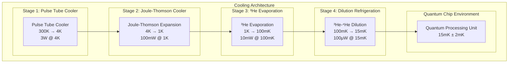

# AMPEL360 BWB-Q100 QPU Cooling Procedure

<p align="center">


</p>

---

## Document Control Information

**Document ID:** `00-90-10-01-CoolingProcedure.md`  
**GQOIS ID:** `AS-M-PAX-BW-Q1H-QPU-COOL-PROC`  
**ATA Chapter:** 00-90-10-01 (General - Quantum Initialization - QPU Startup - Cooling Procedure)  
**Classification:** Quantum Systems Technical Manual  
**Version:** 2.0.0  
**Effective Date:** 2025-06-29  
**Revision Status:** Current Release  
**Approval Authority:** GAIA-QAO Cryogenic Systems Engineering & CTO  

---

## Table of Contents

1. [Overview](#1-overview)
2. [Pre-Cooling Prerequisites](#2-pre-cooling-prerequisites)
3. [Dilution Refrigerator Startup](#3-dilution-refrigerator-startup)
4. [Cooling Sequence Phases](#4-cooling-sequence-phases)
5. [Temperature Monitoring and Control](#5-temperature-monitoring-and-control)
6. [Safety Procedures](#6-safety-procedures)
7. [Emergency Procedures](#7-emergency-procedures)
8. [Performance Verification](#8-performance-verification)
9. [Troubleshooting](#9-troubleshooting)
10. [Maintenance and Calibration](#10-maintenance-and-calibration)

---

## 1. Overview

### 1.1 Purpose

This document provides detailed procedures for cooling the AMPEL360 BWB-Q100 Quantum Processing Unit from ambient temperature to its operational temperature of 15 millikelvin. The cooling process is critical for achieving the quantum coherence required for fault-tolerant quantum computing operations.

### 1.2 Cooling System Architecture

#### 1.2.1 Multi-Stage Cooling Design

**System Overview:**


**Cooling Stages Specifications:**
```
Stage 1 - Pulse Tube Cooler:
Temperature Range: 300K → 4.2K
Cooling Power: 3W at 4K
Cooldown Time: 4 hours
Technology: Gifford-McMahon cycle
Compressor Power: 5 kW
Vibration: <10^-4 g after isolation

Stage 2 - Joule-Thomson Cooler:
Temperature Range: 4.2K → 1.2K
Cooling Power: 100 mW at 1K
Cooldown Time: 2 hours
Technology: ⁴He Joule-Thomson expansion
Flow Rate: 10 mmol/s
Pressure: 2 bar inlet, 20 mbar outlet

Stage 3 - ³He Evaporation:
Temperature Range: 1.2K → 100mK
Cooling Power: 10 mW at 100mK
Cooldown Time: 3 hours
Technology: ³He evaporative cooling
³He Volume: 100 L STP
Pumping Speed: 2000 L/s at ³He pot

Stage 4 - Dilution Refrigeration:
Temperature Range: 100mK → 15mK
Cooling Power: 100 μW at 15mK
Cooldown Time: 15 hours
Technology: ³He-⁴He dilution
³He Flow Rate: 500 μmol/s
Circulation Rate: Continuous
```

#### 1.2.2 Cryogenic Infrastructure

**Gas Handling System:**
```
Helium Supply:
⁴He Volume: 10,000 L liquid equivalent
³He Volume: 1,000 L STP
Purity: >99.999% ⁴He, >99.99% ³He
Storage Pressure: 200 bar
Recovery System: 99.5% helium recovery

Circulation System:
Primary Pumps: Roots blower + scroll pump
Backing Pumps: Turbomolecular pumps
Pumping Speed: 10,000 L/s combined
Ultimate Pressure: 10^-8 mbar
Leak Rate: <10^-10 mbar⋅L/s

Purification System:
Activated Charcoal: 77K adsorption traps
Molecular Sieves: Room temperature purifiers
Cold Traps: 4K condensation traps
Getters: Ti-Zr alloy getters at 400°C
Purity Monitor: Residual gas analyzer
```

**Thermal Architecture:**
```
Heat Exchangers:
Material: OFHC copper and stainless steel
Design: Counter-flow heat exchangers
Effectiveness: >95% thermal efficiency
Thermal Conductivity: Optimized for each stage
Heat Sinking: Multiple thermal anchoring points

Thermal Links:
High-K Links: Copper braids for high conductivity
Low-K Links: Stainless steel for isolation
Thermal Switches: Gas-gap heat switches
Radiation Shields: Multi-layer insulation
Thermal Filtering: RC thermal filters
```

### 1.3 Operating Parameters

**Target Operating Conditions:**
```
Mixing Chamber Temperature: 15 mK ± 2 mK
Still Temperature: 600 mK ± 50 mK
Cold Plate Temperature: 4.2 K ± 0.1 K
Intermediate Stage: 100 mK ± 10 mK

Cooling Power Requirements:
Quantum Chip Load: 50 μW at 15 mK
Electronics Load: 30 μW at 15 mK
Wiring Load: 20 μW at 15 mK
Total Load: 100 μW at 15 mK
Safety Margin: 100% (200 μW capacity)

Stability Requirements:
Temperature Stability: ±0.05 mK over 1 hour
Long-term Drift: <0.1 mK over 24 hours
Noise: <1 μK RMS (0.1-10 Hz)
Recovery Time: <30 minutes from 1K disturbance
Hold Time: >168 hours continuous operation
```

---

## 2. Pre-Cooling Prerequisites

### 2.1 System Status Verification

#### 2.1.1 Safety Systems Check

**Personnel Safety:**
```
Safety Briefing:
□ All personnel briefed on cryogenic hazards
□ Emergency procedures reviewed and understood
□ Personal protective equipment available
□ Emergency contact information posted
□ First aid equipment checked and accessible
□ Oxygen monitoring system operational

Hazard Identification:
□ Asphyxiation hazard from helium release
□ Cold burn hazard from cryogenic surfaces
□ Pressure hazard from high-pressure systems
□ Electrical hazard from high-voltage systems
□ Fire hazard from hydrogen in helium
□ Mechanical hazard from rotating equipment

Personal Protective Equipment:
□ Cryogenic gloves available and inspected
□ Safety glasses or face shields available
□ Closed-toe shoes with slip-resistant soles
□ Long pants and long-sleeved shirts required
□ Emergency breathing apparatus accessible
□ First aid kit stocked and accessible
```

**System Safety Checks:**
```
Pressure Relief Systems:
□ All relief valves tested and operational
□ Relief valve settings verified correct
□ Vent lines clear and properly routed
□ Emergency venting system tested
□ Pressure monitoring systems operational
□ Automatic shutdown systems armed

Electrical Safety:
□ All electrical systems properly grounded
□ GFCI protection tested and operational
□ Emergency power shutoffs accessible
□ Electrical panels properly labeled
□ No exposed high-voltage conductors
□ Emergency lighting operational

Fire Protection:
□ Fire detection system tested
□ Fire suppression system armed
□ Emergency evacuation routes clear
□ No ignition sources near helium vents
□ Emergency shutdown procedures posted
□ Emergency contact numbers available
```

#### 2.1.2 Equipment Status Verification

**Cryogenic System Status:**
```
Vacuum System:
□ Vacuum chamber at <10^-6 mbar
□ All vacuum pumps operational
□ Leak rate <10^-10 mbar⋅L/s
□ Ion gauges operational and calibrated
□ Roughing valves closed and sealed
□ Turbo pumps at full speed

Helium Supply System:
□ ⁴He dewar at >80% capacity
□ ³He cylinder at >90% capacity
□ Gas purity verified >99.99%
□ Supply pressure regulation operational
□ All supply valves operational
□ Gas handling system leak-tight

Temperature Measurement:
□ All thermometry calibrated and operational
□ Temperature readouts show ambient values
□ Thermometry cabling checked for continuity
□ Data acquisition system operational
□ Temperature logging system active
□ Calibration certificates current
```

**Support Systems Status:**
```
Electrical Power:
□ Primary power available and stable
□ UPS system charged and tested
□ Emergency power systems operational
□ Power quality within specifications
□ Electrical load capacity verified
□ Grounding system verified

Cooling Water System:
□ Cooling water flow established
□ Water temperature within limits
□ Water quality acceptable
□ Flow rate sensors operational
□ Temperature sensors calibrated
□ Leak detection system active

Compressed Air:
□ Instrument air pressure adequate
□ Air quality dry and oil-free
□ Pneumatic actuators tested
□ Air consumption within capacity
□ Backup air supply available
□ Pressure regulation operational
```

### 2.2 Environmental Conditions

#### 2.2.1 Ambient Environment

**Environmental Specifications:**
```
Ambient Temperature: 20°C ± 5°C
Relative Humidity: <50% RH
Barometric Pressure: 0.8 - 1.2 atm
Air Quality: Clean, particle-free
Vibration: <10^-3 g background
Acoustic Noise: <70 dB SPL
Electrical Noise: <1% THD on power lines

Environmental Monitoring:
□ Temperature within specification
□ Humidity below 50% RH
□ No condensation on equipment
□ Air filtration system operational
□ Vibration isolation active
□ EMI levels acceptable
□ Lighting adequate for operations
```

**Clean Room Requirements:**
```
Cleanliness Class: ISO 14644-1 Class 1000
Particle Count: <1000 particles/m³ (≥0.5μm)
Air Changes: 20-40 air changes per hour
Personnel Limits: Maximum 4 people
Garment Requirements: Clean room suits required
Entry Procedures: Proper gowning protocol
Contamination Control: Particle monitoring active

Environmental Controls:
□ HEPA filtration operational
□ Positive pressure maintained
□ Temperature control active
□ Humidity control operational
□ Personnel properly gowned
□ Equipment properly cleaned
□ Entry log maintained
```

#### 2.2.2 Electromagnetic Environment

**EMI/EMC Requirements:**
```
Magnetic Field Environment:
DC Field: <100 nT ambient
AC Field: <10 nT RMS (1 MHz - 1 MHz)
Field Gradient: <1 nT/cm
Magnetic Shielding: μ-metal shields installed
Active Compensation: Helmholtz coils operational
Field Monitoring: Continuous magnetometry

RF Environment:
Frequency Range: 1 MHz - 1 GHz survey
Power Density: <1 mW/m² in sensitive bands
Interference: No spurious signals detected
Shielding: RF shielding effectiveness >80 dB
Filtering: Power line filters installed
Grounding: Single-point grounding verified

EMI Survey Results:
□ Ambient magnetic field <100 nT
□ RF interference levels acceptable
□ Power line noise <1% THD
□ No spurious oscillations detected
□ Shielding effectiveness verified
□ Grounding system impedance <0.1Ω
```

---

## 3. Dilution Refrigerator Startup

### 3.1 Pre-Startup Sequence

#### 3.1.1 System Preparation

**Initial System Configuration:**
```
Step 1: Vacuum System Activation (30 minutes)
Action: Start all vacuum pumps in sequence
Procedure:
1. Open backing valve to roughing pump
2. Start scroll pump and achieve <10 mbar
3. Start turbo pumps with soft-start
4. Close backing valve when P < 10^-4 mbar
5. Monitor for stable vacuum <10^-6 mbar

Acceptance Criteria:
□ Vacuum pressure <10^-6 mbar
□ All turbo pumps at 100% speed
□ No vacuum leaks detected
□ Ion gauge readings stable
□ Pumping speed adequate

Step 2: Helium Line Preparation (20 minutes)
Action: Purge and fill helium distribution lines
Procedure:
1. Evacuate all helium lines to <10^-3 mbar
2. Fill lines with ⁴He to 100 mbar
3. Evacuate again to remove impurities
4. Repeat purge cycle 3 times
5. Fill to operating pressure

Acceptance Criteria:
□ All lines purged of air and moisture
□ Helium purity >99.99% verified
□ No leaks in distribution system
□ Pressure regulation operational
□ Flow control valves functional
```

**Gas System Initialization:**
```
Step 3: ³He System Preparation (45 minutes)
Action: Prepare ³He circulation system
Procedure:
1. Evacuate ³He circulation loop
2. Leak-check all ³He connections
3. Fill loop with ³He to test pressure
4. Verify ³He purity with RGA
5. Adjust circulation pump settings

Acceptance Criteria:
□ ³He purity >99.99% verified
□ Circulation system leak-tight
□ Pump settings optimized
□ Flow rates within specification
□ No contamination detected

Step 4: Instrumentation Activation (15 minutes)
Action: Activate monitoring and control systems
Procedure:
1. Power up temperature measurement system
2. Calibrate all pressure transducers
3. Initialize data acquisition system
4. Test all control valve operations
5. Verify interlock systems

Acceptance Criteria:
□ All instruments reading correctly
□ Data logging system active
□ Control loops responsive
□ Safety interlocks operational
□ Alarm systems functional
```

#### 3.1.2 Safety System Verification

**Interlock System Testing:**
```
Primary Safety Interlocks:
□ Over-pressure protection active
□ Over-temperature protection active
□ Vacuum loss protection active
□ Helium leak detection active
□ Emergency stop systems operational
□ Personnel safety systems active

Secondary Protection:
□ Power failure protection active
□ Cooling water loss protection
□ Instrument air loss protection
□ Fire detection system active
□ Emergency evacuation systems
□ Communication systems operational

Testing Procedure:
1. Test each interlock individually
2. Verify proper response to fault conditions
3. Check alarm and notification systems
4. Verify automatic shutdown sequences
5. Test manual emergency stops
6. Document all test results
```

### 3.2 Cooldown Initiation

#### 3.2.1 Stage 1: Pulse Tube Cooler Startup

**Compressor Startup Sequence:**
```
Pre-Start Checks (10 minutes):
□ Compressor oil level adequate
□ Cooling water flow established
□ Electrical power stable
□ Pneumatic systems operational
□ Safety systems armed
□ Remote monitoring active

Startup Procedure:
1. Initialize compressor control system
2. Start cooling water circulation
3. Pressurize helium supply to 20 bar
4. Start compressor with soft-start sequence
5. Gradually increase to operating pressure
6. Monitor vibration and temperature

Operating Parameters:
Pressure: 20 bar ± 1 bar
Flow Rate: 50 g/s ± 5 g/s
Frequency: 1 Hz ± 0.1 Hz
Power: 5 kW ± 0.5 kW
Cooling Water: 15°C ± 5°C
Vibration: <10^-4 g at cold head

Acceptance Criteria:
□ Operating pressure within limits
□ Flow rate stable and adequate
□ Temperature trending downward
□ Vibration within acceptable limits
□ No abnormal noise or operation
□ All safety systems operational
```

**Cold Head Cooldown Monitoring:**
```
Temperature Progression:
Hour 1: 300K → 150K (150K decrease)
Hour 2: 150K → 50K (100K decrease)
Hour 3: 50K → 20K (30K decrease)
Hour 4: 20K → 4.2K (16K decrease)

Monitoring Points:
First Stage: Target 50K ± 5K
Second Stage: Target 4.2K ± 0.2K
Heat Exchanger: Monitor thermal gradient
Radiation Shield: Verify effective shielding
Thermal Links: Monitor heat flow

Performance Verification:
□ Cooldown rate meets specification
□ No thermal oscillations observed
□ Heat leak within acceptable limits
□ Temperature distribution uniform
□ Cooling power adequate for next stage
□ Thermal stability achieved
```

#### 3.2.2 Stage 2: Joule-Thomson Cooler Activation

**JT Cooler Startup (2 hours):**
```
Prerequisites:
□ 4K stage temperature <4.5K
□ 4K stage thermally stable
□ ⁴He supply pressure 2 bar
□ JT circuit evacuated
□ Flow control system operational

Startup Sequence:
1. Slowly introduce ⁴He to JT circuit
2. Adjust flow rate to 10 mmol/s
3. Monitor temperature at JT stage
4. Optimize flow for maximum cooling
5. Achieve 1.2K at JT stage

Temperature Progression:
Minutes 0-30: 4.2K → 2.5K
Minutes 30-60: 2.5K → 1.8K
Minutes 60-90: 1.8K → 1.4K
Minutes 90-120: 1.4K → 1.2K

Performance Targets:
Final Temperature: 1.2K ± 0.1K
Cooling Power: 100 mW available
Flow Stability: ±2% flow variation
Temperature Stability: ±10 mK
Thermal Equilibrium: Achieved in 2 hours
```

### 3.3 Ultra-Low Temperature Stages

#### 3.3.1 Stage 3: ³He System Activation

**³He Pot Cooldown (3 hours):**
```
Prerequisites:
□ 1K stage temperature <1.3K
□ ³He circulation system ready
□ ³He purity verified >99.99%
□ Pumping system at full capacity
□ Heat switch to mixing chamber open

Cooldown Procedure:
1. Introduce ³He to evaporation chamber
2. Start circulation pump at low speed
3. Gradually increase pumping speed
4. Monitor ³He pot temperature
5. Optimize for 100 mK operation

³He System Parameters:
³He Flow Rate: 100 μmol/s
Pumping Speed: 2000 L/s
Pot Pressure: 10^-3 mbar
Still Temperature: 600 mK
Heat Load: 10 mW maximum

Temperature Milestones:
Hour 1: 1.2K → 600 mK
Hour 2: 600 mK → 300 mK
Hour 3: 300 mK → 100 mK

Performance Verification:
□ ³He pot temperature <120 mK
□ Circulation rate stable
□ Pumping system efficient
□ No ³He condensation in lines
□ Heat switch operation verified
```

#### 3.3.2 Stage 4: Dilution Refrigeration

**Dilution Process Initiation:**
```
Prerequisites for Dilution:
□ ³He pot temperature <120 mK
□ Still temperature <700 mK
□ Mixing chamber evacuated
□ ³He circulation established
□ Heat switches configured properly

Dilution Startup Sequence (15 hours):
Phase 1: Initial ³He Introduction (1 hour)
1. Slowly introduce ³He to mixing chamber
2. Monitor for onset of dilution
3. Adjust circulation rate for optimization
4. Verify phase separation in still

Phase 2: Circulation Optimization (2 hours)
1. Gradually increase ³He flow rate
2. Optimize still temperature to 600 mK
3. Monitor mixing chamber temperature
4. Adjust pumping speed for efficiency

Phase 3: Final Cooldown (12 hours)
1. Continue circulation at optimal rate
2. Monitor temperature progression
3. Achieve base temperature 15 mK
4. Verify temperature stability
5. Measure cooling power

Temperature Progression:
Hours 0-1: 100 mK → 80 mK (dilution starts)
Hours 1-3: 80 mK → 50 mK (circulation optimized)
Hours 3-6: 50 mK → 30 mK (steady cooling)
Hours 6-9: 30 mK → 20 mK (approaching base)
Hours 9-12: 20 mK → 17 mK (final approach)
Hours 12-15: 17 mK → 15 mK (base temperature)

Final Operating Parameters:
Mixing Chamber: 15 mK ± 2 mK
Still Temperature: 600 mK ± 50 mK
³He Flow Rate: 500 μmol/s
Cooling Power: 100 μW at 15 mK
Temperature Stability: ±0.05 mK/hour
```

---

## 4. Cooling Sequence Phases

### 4.1 Phase 1: Initial Cooldown (4 hours)

#### 4.1.1 Ambient to 4K Transition

**Pulse Tube Cooler Operation:**
```
Cooldown Timeline:
Hour 0: System startup, compressor start
Hour 1: 300K → 150K (rapid initial cooling)
Hour 2: 150K → 50K (first stage stabilization)
Hour 3: 50K → 20K (second stage activation)
Hour 4: 20K → 4.2K (final 4K achievement)

Critical Monitoring Points:
□ Compressor pressure and flow stability
□ Heat exchanger temperature gradients
□ Thermal contraction stress monitoring
□ Vibration isolation effectiveness
□ Helium purity maintenance

Performance Indicators:
Cooling Rate: 75K/hour average
Power Consumption: 5 kW ± 0.5 kW
Vibration Level: <10^-4 g at cold head
Temperature Uniformity: ±5K across stage
Thermal Stress: Within material limits

Potential Issues and Responses:
Slow Cooldown: Check helium flow and purity
Excessive Vibration: Verify isolation mounts
Uneven Cooling: Inspect thermal connections
High Power: Check compressor efficiency
Contamination: Monitor RGA readings
```

**Thermal Management:**
```
Heat Load Management:
Radiation Load: Minimize with shields
Conduction Load: Optimize thermal links
Gas Load: Maintain high vacuum
Vibration Load: Active isolation system
Electrical Load: Minimize power dissipation

Temperature Distribution:
First Stage (50K): ±5K uniformity
Second Stage (4K): ±0.5K uniformity
Heat Exchangers: Monitor ΔT
Thermal Links: Verify conductivity
Radiation Shields: Temperature mapping

Thermal Stabilization:
Equilibrium Time: <30 minutes per stage
Temperature Drift: <0.1K/hour maximum
Thermal Cycling: Minimize temperature swings
Heat Capacity: Manage thermal mass
Stability Criteria: ±0.1K for 1 hour
```

#### 4.1.2 System Integration During Cooldown

**Instrumentation Activation:**
```
Temperature Measurement:
Calibrated Sensors: Activate in sequence
Data Acquisition: Continuous logging
Alarm Thresholds: Set conservative limits
Trending Analysis: Monitor cooling rates
Calibration Drift: Account for thermal effects

Pressure Monitoring:
Vacuum Pressure: Continuous monitoring
Helium Pressure: Supply and return
Differential Pressure: Across heat exchangers
Leak Detection: Helium mass spectrometer
Pumping Performance: Speed and capacity

Flow Measurement:
Helium Mass Flow: Primary and return
Gas Composition: Purity monitoring
Flow Distribution: Multiple measurement points
Flow Control: Automated valve operation
Flow Optimization: Efficiency maximization
```

### 4.2 Phase 2: Intermediate Cooling (5 hours)

#### 4.2.1 4K to 100mK Transition

**Multi-Stage Coordination:**
```
Joule-Thomson Stage (Hours 4-6):
Prerequisites: 4K stage stable at 4.2K
Target: Achieve 1.2K in 2 hours
Method: ⁴He Joule-Thomson expansion
Flow Rate: 10 mmol/s optimized
Monitoring: Temperature and pressure

³He Evaporation Stage (Hours 6-9):
Prerequisites: JT stage at 1.2K
Target: Achieve 100 mK in 3 hours
Method: ³He evaporative cooling
Pumping: 2000 L/s effective speed
Circulation: Establish steady flow

Stage Interaction Management:
Heat Load Balancing: Optimize between stages
Thermal Coupling: Control heat switches
Flow Coordination: Avoid interference
Temperature Sequencing: Proper staging
Performance Optimization: Maximize efficiency
```

**Critical Control Points:**
```
JT Flow Control:
Flow Rate: 10 mmol/s ± 1 mmol/s
Pressure Drop: 2 bar → 20 mbar
Temperature: Monitor expansion cooling
Efficiency: >90% of ideal JT cooling
Stability: ±5% flow variation maximum

³He Circulation:
Circulation Rate: 100 μmol/s initial
Pumping Speed: Maximum available
Still Temperature: Target 600 mK
Phase Separation: Monitor condensation
Purity: Maintain >99.99% ³He
```

#### 4.2.2 Performance Optimization

**Efficiency Maximization:**
```
Heat Exchanger Optimization:
Effectiveness: Target >95% efficiency
Flow Distribution: Uniform flow patterns
Temperature Profiles: Optimize ΔT
Pressure Drop: Minimize losses
Thermal Contact: Verify connections

Pumping System Optimization:
Pumping Speed: Maximize at each stage
Throughput: Optimize gas handling
Power Efficiency: Minimize energy use
Backing Pressure: Optimize staging
Regeneration: Schedule as needed

Control System Tuning:
PID Parameters: Optimize for stability
Response Time: Minimize lag
Setpoint Tracking: Accurate control
Disturbance Rejection: Minimize impact
Overshoot: Prevent temperature spikes
```

### 4.3 Phase 3: Ultra-Low Temperature (15 hours)

#### 4.3.1 Dilution Refrigeration Process

**Dilution Physics:**
```
Phase Separation Process:
Concentrated Phase: ³He-rich phase
Dilute Phase: ³He in ⁴He solution
Phase Boundary: Temperature dependent
Mixing Process: Cooling mechanism
Entropy Change: Drives cooling effect

Thermodynamic Cycle:
Mixing Chamber: ³He dilution occurs
Still: ³He evaporation and pumping
Heat Exchangers: Pre-cool returning ³He
Circulation: Continuous cycle operation
Cooling Power: Proportional to flow rate

Critical Parameters:
³He Concentration: Monitor carefully
Flow Rate: 500 μmol/s target
Still Temperature: 600 mK optimal
Mixing Chamber: 15 mK final target
Heat Load: <100 μW maximum
```

**Process Control:**
```
Flow Rate Control:
Initial Rate: 100 μmol/s start
Ramp Rate: Gradual increase
Final Rate: 500 μmol/s optimal
Stability: ±2% variation
Response: Minimize disturbances

Temperature Control:
Still Temperature: Maintain 600 mK
Heat Input: Precisely controlled
Feedback Control: PID optimization
Setpoint Changes: Gradual transitions
Stability: ±5 mK precision

Pressure Control:
Still Pressure: Optimize pumping
Backing Pressure: Minimize
Circulation Pressure: Monitor carefully
Leak Rate: Maintain <10^-10 mbar⋅L/s
Pump Performance: Monitor efficiency
```

#### 4.3.2 Base Temperature Achievement

**Final Approach to 15 mK:**
```
Temperature Milestones:
50 mK: Dilution well-established
30 mK: Approaching quantum regime
20 mK: Pre-quantum preparation
17 mK: Near-final temperature
15 mK: Operational base temperature

Optimization Strategy:
Heat Load Minimization: Reduce all sources
Flow Optimization: Fine-tune circulation
Thermal Isolation: Maximize effectiveness
Vibration Reduction: Ultra-low levels
EMI Minimization: Clean environment

Final Verification:
Temperature Accuracy: ±2 mK specification
Stability: ±0.05 mK/hour drift
Cooling Power: 100 μW available
Hold Time: >168 hours capability
Recovery: <30 minutes from disturbance
```

**Quantum Preparation:**
```
Environmental Conditioning:
Magnetic Field: <10 nT at QPU
Vibration: <10^-6 g at QPU
EMI: <1 nT RMS RF field
Thermal Noise: <1 μK RMS
Acoustic Isolation: Complete

System Readiness:
Temperature: 15 mK ± 2 mK stable
Cooling Power: Adequate margin
Environmental: Within specifications
Safety: All systems operational
Monitoring: Continuous surveillance
```

---

## 5. Temperature Monitoring and Control

### 5.1 Thermometry Systems

#### 5.1.1 Temperature Sensor Network

**Sensor Distribution:**
```
Temperature Sensor Network Layout:

300K Stage:
- Ambient Environment: RTD Pt100 sensors
- Room temperature monitoring: ±0.1K accuracy
- Environmental control feedback
- Personnel safety monitoring

77K Stage (LN2 Stage):
- Radiation shield temperature: RTD Pt100 sensors
- Thermal anchoring points: Si diode sensors
- Heat exchanger monitoring: Cernox sensors
- Thermal uniformity verification

50K Stage (First Pulse Tube):
- First stage cold head: Si diode sensors
- Radiation shield anchoring: Cernox sensors
- Heat switch monitoring: RTD sensors
- Thermal gradient measurement

4K Stage (Second Pulse Tube):
- Second stage cold head: Cernox sensors
- Still heat exchanger: RuO2 sensors
- Thermal anchoring: Cernox sensors
- QPU mounting plate: Multiple Cernox

1K Stage (Joule-Thomson):
- JT expansion stage: RuO2 sensors
- Pre-cooling heat exchanger: RuO2 sensors
- Thermal isolation monitoring

100mK Stage (³He Evaporation):
- ³He pot temperature: RuO2 sensors
- Heat exchanger network: RuO2 sensors
- Thermal switching elements

15mK Stage (Dilution):
- Mixing chamber: Coulomb blockade thermometers
- Still temperature: RuO2 sensors
- QPU chip temperature: On-chip thermometry
- Heat load monitoring points
```

#### 5.1.2 Sensor Technologies and Specifications

**Sensor Technology Matrix:**
```
RTD Pt100 (Room Temperature):
Temperature Range: 200K - 400K
Accuracy: ±0.1K
Resolution: 0.01K
Response Time: 5 seconds
Calibration: ITS-90 standard
Applications: Ambient monitoring

Silicon Diode Sensors (Intermediate):
Temperature Range: 1.4K - 300K
Accuracy: ±0.05K (77K), ±0.5K (4K)
Resolution: 0.001K
Response Time: 1 second
Calibration: Lake Shore curves
Applications: 4K-77K range monitoring

Cernox Sensors (Wide Range):
Temperature Range: 0.3K - 420K
Accuracy: ±0.02K (4K), ±0.1K (77K)
Resolution: 0.0001K
Response Time: 0.1 seconds
Calibration: Individual calibration
Applications: Critical temperature points

RuO2 Sensors (Low Temperature):
Temperature Range: 0.05K - 40K
Accuracy: ±0.001K (below 4K)
Resolution: 0.00001K
Response Time: 0.01 seconds
Calibration: Individual calibration
Applications: Sub-kelvin monitoring

Coulomb Blockade Thermometers (Ultra-Low):
Temperature Range: 0.001K - 1K
Accuracy: ±0.0001K (below 100mK)
Resolution: 0.000001K
Response Time: 0.001 seconds
Calibration: Primary thermometry
Applications: Mixing chamber monitoring

On-Chip Thermometry (QPU Integrated):
Temperature Range: 0.010K - 1K
Accuracy: ±0.0005K
Resolution: 0.0001K
Response Time: 0.0001 seconds
Integration: Quantum chip substrate
Applications: Direct QPU monitoring
```

### 5.2 Temperature Control Systems

#### 5.2.1 Multi-Level Control Architecture

**Control System Hierarchy:**
```
Level 1: Primary Cooling Systems
- Pulse tube compressor control
- Helium flow regulation
- Vacuum system control
- Safety interlock systems

Level 2: Intermediate Temperature Control
- JT flow rate control
- ³He circulation control
- Heat switch operation
- Thermal balancing

Level 3: Ultra-Low Temperature Control
- Dilution refrigerator control
- Still temperature regulation
- Mixing chamber optimization
- QPU thermal environment

Level 4: Quantum Environment Control
- Micro-kelvin stability
- Noise minimization
- Disturbance rejection
- Environmental conditioning
```

**Control Loop Specifications:**
```
Primary Control Loops:

Pulse Tube Temperature Control:
Controlled Variable: 4K stage temperature
Setpoint: 4.2K ± 0.1K
Controller: PID with feedforward
Update Rate: 1 Hz
Actuator: Compressor speed control
Disturbance Rejection: >20 dB at 0.1 Hz

Still Temperature Control:
Controlled Variable: Still temperature
Setpoint: 600 mK ± 10 mK
Controller: Cascade PID
Update Rate: 10 Hz
Actuator: Still heater power
Response Time: <10 seconds

Mixing Chamber Control:
Controlled Variable: Mixing chamber temperature
Setpoint: 15 mK ± 0.05 mK
Controller: Model predictive control
Update Rate: 100 Hz
Actuator: ³He circulation rate
Stability: ±0.001 mK over 1 hour

QPU Temperature Control:
Controlled Variable: Quantum chip temperature
Setpoint: 15 mK ± 0.002 mK
Controller: Adaptive PID
Update Rate: 1000 Hz
Actuator: Localized heating elements
Noise: <1 μK RMS (0.1-10 Hz)
```

#### 5.2.2 Advanced Control Strategies

**Model Predictive Control (MPC):**
```
System Model:
State Variables: T_mix, T_still, T_4K, flow rates
Input Variables: Heater powers, flow rates
Output Variables: Temperatures at all stages
Constraints: Power limits, flow limits
Prediction Horizon: 10 minutes
Control Horizon: 2 minutes

Optimization Objective:
Minimize: Temperature deviations + energy consumption
Subject to: Physical constraints, safety limits
Update Rate: 1 Hz for primary control
Adaptation: Online parameter estimation

Disturbance Handling:
Feedforward: Anticipated disturbances
Feedback: Measured disturbances
Prediction: Statistical disturbance models
Compensation: Active disturbance rejection
```

**Adaptive Control Systems:**
```
Parameter Estimation:
Thermal Capacities: Real-time estimation
Heat Transfer Coefficients: Adaptive updates
System Delays: Dynamic compensation
Coupling Effects: Cross-coupling identification

Control Adaptation:
PID Tuning: Self-tuning algorithms
Feedforward: Adaptive compensation
Setpoint Tracking: Optimal trajectories
Disturbance Models: Learning algorithms

Performance Monitoring:
Control Performance: Continuous assessment
System Health: Degradation detection
Predictive Maintenance: Failure prediction
Optimization: Continuous improvement
```

### 5.3 Data Acquisition and Monitoring

#### 5.3.1 Data Acquisition Architecture

**DAQ System Specifications:**
```
Hardware Architecture:
Central DAQ Unit: 24-bit resolution, 1000 channels
Distributed Modules: Field-mounted I/O
Communication: Industrial Ethernet (1 Gbps)
Redundancy: Dual DAQ systems
Power: UPS backup for 8 hours

Channel Configuration:
Temperature Channels: 200 channels
Pressure Channels: 50 channels
Flow Channels: 30 channels
Digital I/O: 100 channels
Analog Control: 50 channels

Sampling Specifications:
Sample Rate: 1000 Hz maximum per channel
Resolution: 24-bit (1 part in 16M)
Accuracy: 0.01% of full scale
Noise: <0.1 LSB RMS
Synchronization: GPS-disciplined timing

Data Storage:
Local Storage: 10 TB SSD arrays
Backup Storage: Network-attached storage
Retention: 5 years minimum
Compression: Lossless algorithms
Archival: Long-term tape storage
```

**Real-Time Monitoring:**
```
Display Systems:
Primary Display: Main control room
Secondary Display: Remote monitoring
Mobile Access: Tablet/smartphone apps
Alarm Display: Dedicated alarm stations
Historical Display: Trend analysis

Alarm Management:
Priority Levels: Critical, high, medium, low
Escalation: Automatic notification
Acknowledgment: Required operator response
Logging: Complete alarm history
Analysis: Alarm pattern analysis

Trending and Analysis:
Real-Time Trends: Live data display
Historical Trends: Long-term analysis
Statistical Analysis: Performance metrics
Predictive Analysis: Trend projection
Correlation Analysis: Multi-variable
```

#### 5.3.2 Data Management and Analysis

**Database Architecture:**
```
Time-Series Database:
Technology: InfluxDB with Grafana
Retention Policy: 1 year high-resolution
Downsampling: Automatic data reduction
Querying: SQL-like query language
Performance: 1M points/second ingestion

Configuration Database:
Technology: PostgreSQL
Content: Calibration data, setpoints
Versioning: Configuration change tracking
Backup: Daily automated backups
Security: Role-based access control

Historical Archive:
Technology: Apache Parquet files
Storage: Distributed file system
Compression: 10:1 typical ratio
Access: Spark-based analytics
Retention: Permanent storage
```

**Analytics and Reporting:**
```
Automated Reports:
Daily Operations: System performance summary
Weekly Performance: Efficiency analysis
Monthly Maintenance: Predictive indicators
Quarterly Review: Long-term trends
Annual Assessment: System optimization

Advanced Analytics:
Machine Learning: Anomaly detection
Pattern Recognition: Failure prediction
Optimization: Energy efficiency
Correlation: Multi-variable analysis
Simulation: Digital twin models

Performance Metrics:
Temperature Stability: Statistical analysis
Cooling Efficiency: Energy per mK
System Availability: Uptime tracking
Maintenance Intervals: MTBF analysis
Cost Analysis: Operational economics
```

---

## 6. Safety Procedures

### 6.1 Cryogenic Safety

#### 6.1.1 Personnel Safety Protocols

**Personal Protective Equipment (PPE):**
```
Mandatory PPE for Cryogenic Work:
□ Cryogenic gloves (insulated to -200°C)
□ Safety glasses with side shields
□ Closed-toe shoes (no sandals/canvas)
□ Long pants (no shorts)
□ Long-sleeved shirt or lab coat
□ Face shield for direct handling
□ Insulated apron for transfer operations

PPE Inspection Requirements:
Daily: Visual inspection before use
Weekly: Detailed condition assessment
Monthly: Formal safety inspection
Quarterly: PPE replacement evaluation
Annual: Complete PPE inventory

Storage and Maintenance:
Dedicated PPE storage area
Clean, dry storage conditions
Regular cleaning schedule
Damage reporting procedures
Replacement authorization process
```

**Safe Work Practices:**
```
General Safety Rules:
□ Never work alone with cryogenic systems
□ Maintain clear evacuation paths
□ Keep oxygen monitors operational
□ Ventilate enclosed spaces adequately
□ Handle cryogenic materials slowly
□ Never touch cold surfaces directly

Pre-Work Safety Briefing:
Hazard identification and assessment
Emergency procedures review
PPE requirements verification
Communication protocols establishment
Escape route identification
Emergency contact information

Work Permits:
Hot work permits for any heating
Confined space permits if applicable
Lock-out/tag-out procedures
Energy isolation verification
Safety system bypass authorization
```

#### 6.1.2 Hazard Identification and Mitigation

**Primary Hazards:**
```
Asphyxiation Hazard:
Source: Helium gas displacement of oxygen
Detection: Oxygen monitors (<19.5% O2)
Mitigation: Ventilation systems
Response: Immediate evacuation
Prevention: Leak detection systems

Cold Burns:
Source: Contact with cryogenic surfaces
Temperature: Down to -269°C (4K)
Protection: Insulated PPE
Treatment: Immediate medical attention
Prevention: Thermal barriers, training

Pressure Hazards:
Source: High-pressure helium systems
Pressure: Up to 200 bar
Protection: Pressure relief systems
Prevention: Regular inspection, testing
Response: Emergency venting procedures

Fire/Explosion:
Source: Hydrogen contamination in helium
Detection: Hydrogen monitors
Prevention: Gas purification systems
Suppression: Inert gas flooding
Response: Emergency shutdown
```

**Mitigation Systems:**
```
Oxygen Monitoring:
Sensor Type: Electrochemical oxygen sensors
Coverage: All enclosed spaces
Alarm Levels: 19.5% (low), 16% (critical)
Response: Audible and visual alarms
Testing: Monthly calibration

Ventilation Systems:
Type: Forced air ventilation
Capacity: 10 air changes per hour minimum
Monitoring: Continuous airflow measurement
Backup: Emergency ventilation fans
Testing: Quarterly performance verification

Emergency Equipment:
Emergency Shower: Deluge shower stations
Eye Wash: Combination eye/face wash
First Aid: Comprehensive first aid kits
Communication: Emergency phones
Escape: Self-contained breathing apparatus
```

### 6.2 System Safety Interlocks

#### 6.2.1 Automated Safety Systems

**Primary Interlock Functions:**
```
Over-Pressure Protection:
Monitored Parameters: All pressure points
Trip Levels: 110% of design pressure
Response Time: <1 second
Action: Automatic pressure relief
Reset: Manual after investigation

Over-Temperature Protection:
Monitored Parameters: All temperature points
Trip Levels: Sensor-specific limits
Response Time: <5 seconds
Action: Heater shutdown, alarm
Reset: Automatic after cooling

Vacuum Loss Protection:
Monitored Parameter: Vacuum chamber pressure
Trip Level: >10^-4 mbar
Response Time: <10 seconds
Action: Emergency helium venting
Reset: Manual after leak repair

Helium Leak Detection:
Detection Method: Mass spectrometer
Sensitivity: 10^-10 mbar⋅L/s
Response Time: <30 seconds
Action: Alarm, optional shutdown
Reset: Manual after leak repair

Power Failure Protection:
Monitored Parameter: Electrical power quality
Conditions: Voltage, frequency, phase
Response: Controlled shutdown sequence
Backup: UPS systems for critical systems
Reset: Manual restart after power restoration
```

**Interlock Logic Architecture:**
```
Interlock Categories:
Category 1: Process shutdown
Category 2: Equipment protection
Category 3: Personnel safety
Category 4: Environmental protection

Logic Implementation:
Technology: Programmable safety systems
Redundancy: Triple modular redundancy
Voting: 2-out-of-3 logic
Testing: Partial trip testing
Documentation: Complete logic diagrams

Safety Integrity Level (SIL):
Personnel Safety: SIL 3 (99.9% reliability)
Equipment Protection: SIL 2 (99% reliability)
Process Protection: SIL 1 (90% reliability)
Testing Frequency: Annual proof testing
Certification: Third-party verification
```

#### 6.2.2 Emergency Response Systems

**Automatic Emergency Actions:**
```
Emergency Shutdown Sequence:
Phase 1: Immediate safety actions (0-10 seconds)
- Stop all helium circulation
- Shut down heating elements
- Activate emergency venting
- Sound evacuation alarms

Phase 2: Equipment protection (10-60 seconds)
- Shut down compressors
- Close isolation valves
- Stop vacuum pumps
- Secure electrical systems

Phase 3: System safing (1-10 minutes)
- Complete helium recovery
- Maintain minimum vacuum
- Monitor system conditions
- Prepare for investigation

Emergency Venting:
Vent Capacity: 100% of stored helium in 15 minutes
Vent Location: Safe outdoor location
Monitoring: Flow rate and pressure
Safety: No ignition sources near vents
Recovery: Helium recovery when possible
```

**Manual Emergency Procedures:**
```
Emergency Stop Buttons:
Locations: Strategic positions throughout facility
Function: Immediate system shutdown
Testing: Monthly operation testing
Access: Clear and unobstructed
Training: All personnel trained on use

Emergency Communication:
Internal: PA system announcements
External: Automatic emergency notifications
Mobile: Text message alerts
Backup: Two-way radio systems
Testing: Monthly communication tests

Evacuation Procedures:
Assembly Point: Designated safe area
Headcount: Personnel accountability
Communication: Emergency coordinator
Re-entry: Only after all-clear given
Training: Quarterly evacuation drills
```

### 6.3 Operational Safety Guidelines

#### 6.3.1 Standard Operating Procedures

**Pre-Operation Safety Checks:**
```
Daily Safety Inspection:
□ PPE availability and condition
□ Emergency equipment functional
□ Ventilation systems operational
□ Oxygen monitors calibrated
□ Communication systems tested
□ Evacuation routes clear

Equipment Safety Verification:
□ Pressure relief valves tested
□ Safety interlocks functional
□ Emergency stops operational
□ Leak detection systems active
□ Fire suppression armed
□ First aid equipment available

Personnel Readiness:
□ Safety training current
□ Medical clearance valid
□ Emergency procedures reviewed
□ Work permits obtained
□ Buddy system assigned
□ Emergency contacts updated
```

**During Operation Safety Monitoring:**
```
Continuous Monitoring:
Operator presence required at all times
Safety parameter trending
Alarm response procedures
Regular safety rounds
Equipment condition assessment
Environmental monitoring

Shift Handover:
Safety status review
Outstanding safety issues
Equipment condition report
Environmental conditions
Emergency equipment status
Training requirements
```

#### 6.3.2 Maintenance Safety

**Maintenance Safety Procedures:**
```
Pre-Maintenance Safety:
□ Work permit obtained
□ Energy isolation verified
□ Lock-out/tag-out applied
□ Safety equipment available
□ Personnel training verified
□ Emergency procedures reviewed

Maintenance Execution:
□ Follow approved procedures
□ Use proper tools and equipment
□ Maintain constant communication
□ Monitor safety parameters
□ Document all activities
□ Report any abnormalities

Post-Maintenance Safety:
□ Remove all tools and equipment
□ Restore all safety systems
□ Remove lock-out/tag-out
□ Test all safety functions
□ Update maintenance records
□ Conduct safety briefing
```

---

## 7. Emergency Procedures

### 7.1 Emergency Response Plan

#### 7.1.1 Emergency Classification

**Emergency Categories:**
```
Category 1: Immediate Life Threat
Examples:
- Oxygen deficiency (<16% O2)
- Massive helium leak
- Fire or explosion
- Personnel injury

Response:
- Immediate evacuation
- Emergency services notification
- Medical response activation
- System emergency shutdown

Category 2: Equipment Damage Risk
Examples:
- Major system malfunction
- Cooling system failure
- Vacuum loss
- Power failure

Response:
- Controlled system shutdown
- Equipment protection measures
- Maintenance team notification
- Investigation initiation

Category 3: Process Deviation
Examples:
- Temperature excursion
- Pressure deviation
- Flow rate anomaly
- Control system fault

Response:
- Process adjustment
- System monitoring increase
- Troubleshooting procedures
- Documentation of event

Category 4: Advisory Condition
Examples:
- Minor equipment alarms
- Routine maintenance alerts
- Performance degradation
- Calibration due

Response:
- Routine maintenance scheduling
- Performance monitoring
- Trend analysis
- Preventive action planning
```

#### 7.1.2 Emergency Response Team

**Team Structure:**
```
Emergency Coordinator:
Responsibilities: Overall emergency response
Authority: System shutdown decision
Training: Emergency management certification
Availability: 24/7 on-call
Communication: Direct line to all teams

Technical Response Team:
Cryogenic Engineer: System expertise
Safety Officer: Safety compliance
Maintenance Supervisor: Equipment knowledge
Operations Manager: Process knowledge
Medical Officer: First aid/medical response

External Support:
Fire Department: Emergency response
Medical Services: Advanced medical care
Utility Companies: Power/gas emergency
Environmental: Spill response
Security: Site access control
```

**Response Activation:**
```
Automatic Activation:
Safety system trips
High-priority alarms
Emergency stop activation
Loss of communication
Environmental excursions

Manual Activation:
Emergency coordinator decision
Operations supervisor request
Safety officer determination
Maintenance emergency
Medical emergency

Notification Sequence:
1. Emergency coordinator (immediate)
2. Technical response team (within 5 minutes)
3. Management team (within 15 minutes)
4. External agencies (as required)
5. Regulatory agencies (within 24 hours)
```

### 7.2 Specific Emergency Scenarios

#### 7.2.1 Helium Leak Emergency

**Major Helium Leak Response:**
```
Immediate Actions (0-2 minutes):
□ Activate emergency alarm
□ Evacuate affected area
□ Stop all helium flow
□ Activate emergency ventilation
□ Check oxygen levels
□ Account for all personnel

Short-term Actions (2-15 minutes):
□ Isolate helium supply
□ Emergency venting if required
□ Secure ignition sources
□ Establish safety perimeter
□ Monitor atmospheric conditions
□ Notify emergency coordinator

Medium-term Actions (15 minutes - 1 hour):
□ Locate and assess leak
□ Estimate helium loss
□ Plan repair strategy
□ Coordinate with suppliers
□ Document incident
□ Prepare investigation

Recovery Actions (1 hour - 24 hours):
□ Repair leak source
□ Purge and test systems
□ Restore helium supply
□ System pressure testing
□ Restart procedures
□ Incident analysis
```

**Oxygen Deficiency Response:**
```
Immediate Response:
Detection: O2 < 19.5%
Action: Immediate evacuation
Alarm: Audible and visual
Ventilation: Emergency fans
Access: Prevent entry
Monitoring: Continuous O2 levels

Severe Deficiency (O2 < 16%):
Response: Emergency services call
Equipment: Self-contained breathing apparatus
Entry: Only trained rescue personnel
Medical: Emergency medical response
Recovery: Extended ventilation required
Investigation: Mandatory investigation

Personnel Rescue:
Assessment: Do not enter without SCBA
Rescue: Use appropriate equipment
Medical: Immediate medical attention
Documentation: Complete incident report
Follow-up: Medical monitoring
Training: Review and update procedures
```

#### 7.2.2 Cryogenic Injury Emergency

**Cold Burn Treatment:**
```
Immediate First Aid:
□ Remove from cold source
□ Do NOT rub affected area
□ Remove constricting items
□ Loosely cover with dry gauze
□ Elevate affected area
□ Seek immediate medical attention

Prohibited Actions:
□ Do not use direct heat
□ Do not rub or massage
□ Do not break blisters
□ Do not use hot water
□ Do not apply ointments
□ Do not give alcohol

Medical Response:
□ Call emergency medical services
□ Monitor for shock
□ Treat for hypothermia
□ Document injury details
□ Follow up with medical care
□ Report to safety officer

Severity Assessment:
First Degree: Skin redness, mild pain
Second Degree: Blistering, severe pain
Third Degree: Deep tissue damage
Fourth Degree: Muscle/bone involvement
Treatment: Severity-dependent protocols
Prognosis: Medical determination required
```

#### 7.2.3 System Failure Emergencies

**Complete Cooling System Failure:**
```
Immediate Response (0-10 minutes):
□ Assess cause of failure
□ Activate backup systems
□ Protect quantum hardware
□ Prevent thermal shock
□ Isolate failed components
□ Alert technical team

Emergency Measures (10-60 minutes):
□ Emergency cooling if available
□ Controlled warm-up procedure
□ Minimize thermal gradients
□ Protect sensitive components
□ Document system conditions
□ Prepare alternative cooling

Recovery Planning (1-24 hours):
□ Repair or replace failed components
□ Test all systems before restart
□ Gradual cooling restart
□ Monitor all parameters
□ Document lessons learned
□ Update procedures as needed

Hardware Protection:
Quantum Chip: Gradual warming only
Superconducting Elements: Prevent quench
Sensors: Temperature limits
Vacuum: Maintain if possible
Contamination: Prevent system exposure
```

**Fire Emergency:**
```
Fire Detection:
Automatic: Smoke/heat detectors
Manual: Visual observation
Verification: Multiple sensors
Classification: Fire type determination
Response: Appropriate suppression

Fire Suppression:
Electrical Fire: CO2 or clean agent
Cryogenic Fire: Special procedures
Structural Fire: Water sprinkler
Gas Fire: Shut off supply first
Response: Fire department notification

Evacuation:
Immediate: All personnel evacuation
Assembly: Designated rally point
Accounting: Personnel headcount
Communication: Emergency services
Re-entry: Only after all-clear
Investigation: Fire cause determination
```

### 7.3 Recovery Procedures

#### 7.3.1 Post-Emergency Assessment

**System Damage Assessment:**
```
Immediate Assessment:
□ Personnel injuries
□ Equipment damage
□ Environmental impact
□ System contamination
□ Structural integrity
□ Utility services

Detailed Inspection:
□ Cryogenic system integrity
□ Vacuum system condition
□ Instrumentation damage
□ Control system status
□ Safety system function
□ Documentation review

Testing Requirements:
□ Pressure testing
□ Leak testing
□ Vacuum testing
□ Electrical testing
□ Calibration verification
□ Performance testing

Repair Planning:
□ Component replacement list
□ Repair procedure development
□ Resource requirement assessment
□ Timeline establishment
□ Risk assessment update
□ Approval process
```

#### 7.3.2 System Restart Procedures

**Restart Authorization:**
```
Prerequisites for Restart:
□ All repairs completed
□ Testing successfully completed
□ Safety systems verified
□ Personnel training updated
□ Procedures revised
□ Management approval

Authorization Process:
Technical Review: Engineering approval
Safety Review: Safety officer approval
Management Review: Operations manager approval
Documentation: Complete restart package
Testing: Pre-restart verification
Sign-off: Formal authorization

Restart Sequence:
Phase 1: Systems preparation
Phase 2: Safety verification
Phase 3: Gradual restart
Phase 4: Performance verification
Phase 5: Normal operation
Phase 6: Incident closure
```

**Lessons Learned Process:**
```
Investigation Requirements:
Root cause analysis
Contributing factor identification
Timeline reconstruction
Decision point analysis
Communication review
Procedure evaluation

Documentation:
Incident report completion
Investigation findings
Corrective action plan
Procedure updates
Training modifications
Performance improvements

Implementation:
Action item assignment
Timeline establishment
Progress monitoring
Effectiveness verification
Closure verification
Knowledge sharing
```

---

## 8. Performance Verification

### 8.1 System Performance Metrics

#### 8.1.1 Temperature Performance

**Temperature Stability Verification:**
```
Measurement Protocol:
Duration: 24-hour continuous measurement
Sampling Rate: 1 Hz for all sensors
Data Analysis: Statistical analysis package
Criteria: Mean, standard deviation, drift

Acceptance Criteria:
Mixing Chamber: 15 mK ± 2 mK absolute
Still Temperature: 600 mK ± 50 mK
4K Stage: 4.2 K ± 0.1 K
Temperature Stability: ±0.05 mK/hour
Long-term Drift: <0.1 mK/24 hours

Performance Metrics:
Temperature Accuracy: Absolute temperature
Temperature Precision: Repeatability
Temperature Stability: Short-term variation
Temperature Drift: Long-term trend
Recovery Time: Return to setpoint
Noise Level: High-frequency variation
```

**Cooling Performance Assessment:**
```
Cooldown Time Verification:
300K to 4K: 4 hours ± 30 minutes
4K to 1K: 2 hours ± 15 minutes
1K to 100mK: 3 hours ± 30 minutes
100mK to 15mK: 15 hours ± 2 hours
Total Cooldown: 24 hours ± 3 hours

Cooling Power Measurement:
Test Method: Calibrated heat load
Measurement Range: 1 μW to 1 mW
Accuracy: ±5% of reading
Conditions: Steady-state operation
Documentation: Complete test report

Efficiency Analysis:
Power Consumption: Total electrical power
Cooling Efficiency: Carnot efficiency ratio
Energy Analysis: Cost per cooling hour
Performance Trend: Long-term efficiency
Optimization: Efficiency improvement
```

#### 8.1.2 Environmental Performance

**Vibration Performance:**
```
Vibration Measurement:
Sensor Type: Accelerometers
Frequency Range: 0.1 Hz to 1 kHz
Sensitivity: 10^-9 g resolution
Locations: QPU mounting, critical points
Duration: 24-hour continuous

Acceptance Criteria:
QPU Location: <10^-6 g RMS
Critical Components: <10^-5 g RMS
Frequency Content: No resonances
Isolation Effectiveness: >40 dB at 1 Hz
Environmental Coupling: <10% transmission

Analysis Methods:
Time Domain: RMS levels, peak values
Frequency Domain: FFT analysis
Statistical: Probability distributions
Correlation: Cross-correlation analysis
Trending: Long-term performance
```

**Electromagnetic Performance:**
```
EMI/EMC Verification:
Magnetic Field: <10 nT at QPU
RF Environment: <1 mW/m² power density
Field Stability: <1 nT variation
Shielding Effectiveness: >80 dB
Grounding: <0.1Ω resistance

Measurement Procedures:
Equipment: Calibrated field meters
Standards: IEEE/FCC regulations
Documentation: Complete test reports
Certification: Third-party verification
Periodic: Annual verification
```

### 8.2 System Integration Testing

#### 8.2.1 End-to-End Performance

**Integrated System Test:**
```
Test Scope:
Complete cooling sequence
All control systems
Safety systems
Data acquisition
Performance monitoring

Test Procedure:
Day 1: Pre-test preparation
Day 2: Cooldown initiation
Day 3-4: Intermediate stages
Day 5-6: Final cooldown
Day 7: Performance verification

Success Criteria:
All temperature targets achieved
All control systems functional
Safety systems operational
Performance within specifications
No significant anomalies
Documentation complete
```

**Operational Scenarios:**
```
Normal Operation:
Standard cooldown sequence
Steady-state operation
Routine maintenance
Performance monitoring
Data collection

Abnormal Operation:
Power interruption recovery
Equipment failure response
Environmental disturbances
Emergency procedures
System restart

Stress Testing:
Maximum heat load
Extreme temperatures
Rapid transients
Extended operation
Worst-case scenarios
```

#### 8.2.2 Reliability and Availability

**Reliability Assessment:**
```
Reliability Metrics:
Mean Time Between Failures (MTBF)
Mean Time To Repair (MTTR)
System Availability
Failure Rate Analysis
Maintenance Intervals

Data Collection:
Failure event logging
Repair time recording
Performance degradation
Preventive maintenance
Component replacement

Analysis Methods:
Statistical analysis
Trend analysis
Weibull analysis
Reliability modeling
Life cycle assessment

Reliability Targets:
System MTBF: >8760 hours (1 year)
Availability: >99.9%
Unplanned Downtime: <8 hours/year
Planned Maintenance: <40 hours/year
Component MTBF: Varies by component
```

**Maintenance Performance:**
```
Preventive Maintenance:
Schedule: Based on manufacturer recommendations
Procedures: Detailed maintenance procedures
Parts: Spare parts inventory
Training: Technician certification
Documentation: Complete maintenance records

Predictive Maintenance:
Condition Monitoring: Continuous monitoring
Trend Analysis: Performance degradation
Failure Prediction: Advance warning
Maintenance Scheduling: Optimized timing
Cost Optimization: Reduced maintenance costs

Maintenance Metrics:
Maintenance Cost: Cost per operating hour
Maintenance Time: Hours per maintenance event
Parts Availability: Spare parts inventory
Technician Training: Certification levels
Maintenance Quality: First-time fix rate
```

### 8.3 Acceptance Testing

#### 8.3.1 Factory Acceptance Testing

**FAT Procedures:**
```
Pre-FAT Requirements:
□ All components installed
□ Initial system testing complete
□ Documentation package ready
□ Test procedures approved
□ Customer representatives present
□ Test equipment calibrated

FAT Test Sequence:
Day 1: System preparation and safety checks
Day 2: Cooldown performance test
Day 3: Temperature stability test
Day 4: Control system verification
Day 5: Safety system testing
Day 6: Performance documentation

FAT Acceptance Criteria:
All specifications met
No critical deficiencies
Minor issues corrected
Complete documentation
Customer approval
Certificate of compliance
```

#### 8.3.2 Site Acceptance Testing

**SAT Procedures:**
```
Installation Verification:
□ Proper equipment installation
□ Utility connections verified
□ Environmental conditions acceptable
□ Safety systems operational
□ Documentation complete
□ Personnel training complete

SAT Testing:
Duration: 2 weeks minimum
Scope: Complete system operation
Conditions: Actual operating environment
Criteria: Same as design specifications
Documentation: Complete test records
Approval: Customer sign-off

Final Acceptance:
Performance verification
Documentation handover
Training completion
Warranty activation
Service agreement
Project closeout

---

## 9. Troubleshooting

### 9.1 Common Issues and Solutions

#### 9.1.1 Temperature Control Problems

**Issue: Mixing Chamber Temperature Too High**
```
Symptoms:
- Temperature >17 mK at base
- Slow cooldown below 100 mK
- Poor temperature stability
- Reduced cooling power

Possible Causes:
1. Insufficient ³He circulation rate
2. Heat leak in mixing chamber
3. Contamination in ³He circuit
4. Blocked heat exchangers
5. Poor thermal contact

Diagnostic Steps:
□ Check ³He flow rate and pressure
□ Verify still temperature (should be ~600 mK)
□ Monitor circulation pump performance
□ Check for vacuum degradation
□ Inspect thermal connections
□ Analyze gas purity

Solutions:
1. Increase ³He circulation rate gradually
2. Locate and eliminate heat leaks
3. Purge and refill ³He circuit
4. Clean or replace heat exchangers
5. Improve thermal contact surfaces
6. Regenerate gas purification system

Prevention:
- Regular gas purity monitoring
- Preventive heat exchanger cleaning
- Thermal contact inspection
- Leak testing schedule
- Proper handling procedures
```

**Issue: 4K Stage Not Reaching Base Temperature**
```
Symptoms:
- Temperature stuck above 4.5K
- Slow cooldown rate
- High compressor power
- Excessive vibration

Possible Causes:
1. Helium contamination
2. Blocked pulse tube
3. Compressor malfunction
4. Heat exchanger fouling
5. Thermal short circuits

Diagnostic Steps:
□ Check helium purity
□ Monitor compressor parameters
□ Measure vibration levels
□ Check pressure drop across pulse tube
□ Inspect heat exchanger effectiveness
□ Verify thermal isolation

Solutions:
1. Purge and refill helium system
2. Clean pulse tube and regenerator
3. Service or replace compressor
4. Clean heat exchangers
5. Eliminate thermal shorts
6. Adjust operating parameters

Maintenance Actions:
- Regular helium purity checks
- Compressor maintenance schedule
- Heat exchanger cleaning
- Vibration monitoring
- Thermal inspection
```

#### 9.1.2 Vacuum System Issues

**Issue: Vacuum Degradation**
```
Symptoms:
- Rising pressure in vacuum space
- Reduced cooling performance
- Increased heat load
- Faster than normal warm-up

Possible Causes:
1. Vacuum leaks
2. Outgassing from materials
3. Virtual leaks
4. Pump degradation
5. Seal failures

Diagnostic Procedures:
□ Helium leak detection
□ Rate of rise test
□ Residual gas analysis
□ Pump performance check
□ Seal inspection
□ Thermal cycling test

Repair Actions:
1. Locate and repair leaks
2. Bake out vacuum chamber
3. Eliminate virtual leaks
4. Service or replace pumps
5. Replace failed seals
6. Improve pumping capacity

Leak Detection Methods:
- Helium mass spectrometer
- Pressure rise testing
- Bubble testing (for gross leaks)
- Thermal imaging
- Acoustic leak detection
```

**Issue: Contamination in Vacuum System**
```
Symptoms:
- High background pressure
- Unusual RGA spectrum
- Reduced pumping efficiency
- Degraded performance

Sources of Contamination:
1. Air leaks
2. Water vapor
3. Hydrocarbon outgassing
4. Particulate matter
5. Chemical reactions

Cleaning Procedures:
□ System evacuation and purging
□ Bakeout at elevated temperature
□ Chemical cleaning if required
□ Filter replacement
□ Pump oil changes
□ Component inspection

Prevention:
- Clean assembly procedures
- Proper material selection
- Regular maintenance
- Contamination monitoring
- Training programs
```

#### 9.1.3 Gas Handling Problems

**Issue: ³He Loss or Contamination**
```
Symptoms:
- Reduced ³He inventory
- Poor dilution performance
- Unusual gas composition
- Higher operating costs

Causes and Solutions:
1. System Leaks:
   - Perform comprehensive leak testing
   - Repair all identified leaks
   - Improve joint designs
   - Regular inspection schedule

2. Pump Oil Contamination:
   - Change pump oil regularly
   - Use appropriate oil grades
   - Install oil traps
   - Monitor oil condition

3. Air Contamination:
   - Improve purging procedures
   - Check for micro-leaks
   - Upgrade sealing systems
   - Use gettering materials

Recovery Procedures:
□ Stop circulation immediately
□ Isolate contaminated sections
□ Purge with clean helium
□ Analyze gas composition
□ Purify or replace gas
□ Test system before restart

Gas Purity Monitoring:
- Continuous RGA monitoring
- Regular gas analysis
- Purity specifications
- Contamination limits
- Purification systems
```

### 9.2 Diagnostic Tools and Techniques

#### 9.2.1 Instrumentation Diagnostics

**Temperature Sensor Diagnostics:**
```
Sensor Validation Tests:
1. Zero Power Resistance Check:
   - Measure sensor resistance at zero power
   - Compare with calibration curve
   - Check for sensor drift
   - Verify electrical connections

2. Self-Heating Check:
   - Measure temperature vs. excitation power
   - Verify minimal self-heating
   - Check for thermal coupling
   - Optimize measurement current

3. Response Time Test:
   - Apply thermal step change
   - Measure response time constant
   - Check for thermal lag
   - Verify sensor mounting

4. Noise Measurement:
   - Record temperature noise spectrum
   - Identify noise sources
   - Check for EMI pickup
   - Verify grounding

Calibration Verification:
□ Compare with reference sensors
□ Check calibration certificates
□ Perform fixed-point checks
□ Document any drift
□ Recalibrate if necessary

Common Sensor Problems:
- Calibration drift
- Electrical noise pickup
- Poor thermal contact
- Mechanical damage
- Contamination
```

**Pressure Measurement Diagnostics:**
```
Gauge Calibration:
1. Zero Check:
   - Measure reading at high vacuum
   - Verify zero stability
   - Check for drift
   - Clean gauge if necessary

2. Span Check:
   - Use calibrated gas source
   - Verify full-scale reading
   - Check linearity
   - Document any errors

3. Cross-Calibration:
   - Compare multiple gauges
   - Identify inconsistencies
   - Determine root cause
   - Repair or replace as needed

Ion Gauge Maintenance:
□ Clean filament and grid
□ Check emission current
□ Verify high voltage
□ Replace gauge if worn
□ Calibrate after service

Capacitance Manometer Service:
□ Zero and span adjustment
□ Diaphragm inspection
□ Electronics calibration
□ Temperature compensation
□ Pressure port cleaning
```

#### 9.2.2 System Performance Analysis

**Thermal Performance Analysis:**
```
Heat Load Analysis:
1. Power Balance:
   - Measure all heat inputs
   - Calculate cooling power required
   - Compare with available cooling
   - Identify heat load sources

2. Thermal Modeling:
   - Create system thermal model
   - Validate with measurements
   - Identify thermal bottlenecks
   - Optimize thermal design

3. Transient Analysis:
   - Measure thermal time constants
   - Analyze cooldown curves
   - Identify thermal masses
   - Optimize cooldown procedures

Heat Leak Detection:
□ Temperature mapping
□ Thermal imaging
□ Heat flow calculations
□ Insulation effectiveness
□ Radiation load analysis

Cooling Power Measurement:
- Calibrated heat loads
- Power dissipation elements
- Thermal equilibrium methods
- Dynamic measurement techniques
- Uncertainty analysis
```

**Flow and Circulation Analysis:**
```
Flow Rate Verification:
1. Mass Flow Measurement:
   - Calibrated flow meters
   - Pressure drop methods
   - Thermal methods
   - Tracer gas techniques

2. Circulation Efficiency:
   - Calculate circulation rate
   - Measure pressure drops
   - Assess pump performance
   - Optimize flow distribution

3. Heat Exchanger Performance:
   - Effectiveness measurement
   - Pressure drop analysis
   - Fouling assessment
   - Cleaning requirements

Pump Performance:
□ Pumping speed curves
□ Ultimate pressure measurement
□ Power consumption analysis
□ Vibration and noise levels
□ Maintenance requirements

System Impedance:
- Flow resistance calculation
- Pressure drop mapping
- Valve characteristics
- Piping optimization
- Performance optimization
```

### 9.3 Preventive Maintenance

#### 9.3.1 Scheduled Maintenance Tasks

**Daily Maintenance (Operations Staff):**
```
System Monitoring:
□ Temperature readings verification
□ Pressure monitoring check
□ Flow rate verification
□ Alarm system test
□ Safety equipment inspection
□ Data logging verification

Visual Inspections:
□ Equipment condition check
□ Leak detection survey
□ Vibration and noise assessment
□ Cleanliness verification
□ Safety equipment availability
□ Documentation updates

Performance Checks:
□ Control system response
□ Setpoint accuracy
□ System stability
□ Energy consumption
□ Environmental conditions
□ Trend analysis
```

**Weekly Maintenance:**
```
Detailed Inspections:
□ Vacuum system performance
□ Gas purity verification
□ Pump performance check
□ Heat exchanger condition
□ Thermal insulation integrity
□ Electrical connections

Calibration Checks:
□ Key sensor verification
□ Pressure gauge accuracy
□ Flow meter calibration
□ Control loop tuning
□ Safety system testing
□ Data acquisition accuracy

System Testing:
□ Emergency stop testing
□ Safety interlock verification
□ Backup system testing
□ Communication system check
□ Alarm system testing
□ Documentation review
```

**Monthly Maintenance:**
```
Comprehensive Inspections:
□ Complete system performance review
□ Trend analysis and optimization
□ Predictive maintenance indicators
□ Spare parts inventory
□ Training requirements
□ Procedure updates

Component Maintenance:
□ Compressor service check
□ Pump oil change/check
□ Filter replacement/cleaning
□ Seal inspection and replacement
□ Valve operation verification
□ Electrical system inspection

Performance Analysis:
□ Efficiency calculations
□ Energy consumption analysis
□ Reliability metrics
□ Maintenance cost analysis
□ Performance trending
□ Optimization opportunities
```

#### 9.3.2 Annual Maintenance

**Major System Service:**
```
Shutdown Procedures:
□ Controlled warm-up sequence
□ System depressurization
□ Gas recovery operations
□ Equipment isolation
□ Safety system verification
□ Documentation preparation

Inspection and Testing:
□ Complete disassembly as required
□ Component inspection and testing
□ Replacement of wear items
□ Calibration of all instruments
□ Performance testing
□ System re-commissioning

Documentation Updates:
□ Maintenance records
□ Performance data analysis
□ Procedure revisions
□ Training material updates
□ Spare parts recommendations
□ Improvement recommendations
```

**Certification and Compliance:**
```
Regulatory Compliance:
□ Safety system certification
□ Pressure vessel inspection
□ Environmental compliance
□ Training certification
□ Documentation audit
□ Regulatory reporting

Quality Assurance:
□ Calibration certificates
□ Performance verification
□ Maintenance quality check
□ Supplier qualifications
□ Process improvements
□ Customer satisfaction
```

---

## 10. Maintenance and Calibration

### 10.1 Preventive Maintenance Program

#### 10.1.1 Maintenance Schedule Matrix

**Equipment-Based Maintenance Schedule:**
```
Pulse Tube Cooler:
Daily: Performance monitoring, visual inspection
Weekly: Vibration check, oil level verification
Monthly: Compressor maintenance, filter service
Quarterly: Complete performance test
Annually: Major overhaul, seal replacement

Dilution Refrigerator:
Daily: Temperature and flow monitoring
Weekly: ³He purity check, leak detection
Monthly: Heat exchanger inspection
Semi-annually: Complete system service
Annually: Thermometry recalibration

Vacuum System:
Daily: Pressure monitoring, pump status
Weekly: Ion gauge cleaning, leak check
Monthly: Pump oil change, filter replacement
Quarterly: Complete vacuum test
Annually: Pump overhaul, seal replacement

Gas Handling System:
Daily: Purity monitoring, flow verification
Weekly: Pressure regulation check
Monthly: Purification system service
Quarterly: Leak testing, valve service
Annually: Complete system overhaul

Control System:
Daily: Alarm testing, data verification
Weekly: Sensor calibration check
Monthly: Control loop tuning
Quarterly: Complete system testing
Annually: Hardware replacement, software updates
```

**Time-Based Maintenance Calendar:**
```
January:
□ Annual system shutdown and inspection
□ Major component overhaul
□ Complete calibration program
□ Documentation review and update
□ Training program review

April:
□ Quarterly performance testing
□ Spring cleaning and inspection
□ Spare parts inventory
□ Preventive replacement program
□ Safety system testing

July:
□ Mid-year performance review
□ Summer maintenance activities
□ Cooling system optimization
□ Energy efficiency analysis
□ Environmental monitoring

October:
□ Pre-winter preparation
□ Quarterly testing program
□ Budget planning for next year
□ Training needs assessment
□ Performance analysis
```

#### 10.1.2 Condition-Based Maintenance

**Performance Indicators:**
```
Trending Parameters:
Temperature Stability: Track drift and noise
Cooling Efficiency: Monitor power consumption
Pump Performance: Track pumping speed
Gas Purity: Monitor contamination levels
Vacuum Quality: Track leak rates

Predictive Indicators:
Compressor Vibration: Bearing wear indication
Temperature Drift: Sensor degradation
Pressure Trends: Leak development
Flow Degradation: Blockage development
Control Response: System degradation

Threshold Limits:
Green Zone: Normal operation
Yellow Zone: Increased monitoring
Red Zone: Immediate action required
Critical Zone: Emergency shutdown
```

**Maintenance Triggers:**
```
Performance-Based Triggers:
Cooling power <80% of design
Temperature stability >±0.1 mK
Vacuum pressure >10^-5 mbar
Gas purity <99.9%
Energy consumption >110% of baseline

Time-Based Triggers:
Operating hours since last service
Calendar time since maintenance
Number of thermal cycles
Total energy consumption
System age and depreciation

Event-Based Triggers:
Equipment alarms or faults
Environmental excursions
Emergency shutdowns
Operator observations
Customer complaints
```

### 10.2 Calibration Program

#### 10.2.1 Instrumentation Calibration

**Temperature Sensor Calibration:**
```
Primary Standards:
ITS-90 Fixed Points: Helium triple point, etc.
Reference Sensors: Calibrated platinum RTDs
Secondary Standards: Laboratory references
Working Standards: Daily calibration checks
Traceability: NIST-traceable standards

Calibration Procedures:
Fixed Point Calibration:
□ Use ITS-90 fixed points where applicable
□ Multi-point calibration curve
□ Interpolation equation development
□ Uncertainty analysis
□ Certificate generation

Comparison Calibration:
□ Compare with reference sensor
□ Multiple temperature points
□ Statistical analysis of data
□ Correction curve development
□ Drift assessment

In-Situ Calibration:
□ Cross-calibration with other sensors
□ Known temperature points
□ System performance verification
□ Minimal system disruption
□ Continuous operation maintenance

Calibration Schedule:
Critical Sensors: Every 6 months
Important Sensors: Annually
Monitoring Sensors: Every 2 years
Reference Sensors: Every 3 years
Emergency Recalibration: As required
```

**Pressure Calibration:**
```
Pressure Standards:
Primary: Dead weight testers
Secondary: Precision pressure gauges
Working: Portable calibrators
Transfer: Stable reference gauges
Traceability: NIST pressure standards

Calibration Methods:
Absolute Pressure:
□ Dead weight tester method
□ Multiple pressure points
□ Linearity verification
□ Hysteresis testing
□ Temperature compensation

Differential Pressure:
□ Precision pressure sources
□ Zero and span calibration
□ Linearity assessment
□ Long-term stability
□ Environmental effects

Vacuum Calibration:
□ Spinning rotor gauge
□ Capacitance manometer
□ Cross-calibration methods
□ Low pressure standards
□ Molecular flow regime

Calibration Frequency:
High-Critical: Every 3 months
Process-Critical: Every 6 months
Monitoring: Annually
Reference: Every 2 years
As-Found/As-Left: Each calibration
```

#### 10.2.2 Flow Calibration

**Flow Measurement Calibration:**
```
Flow Standards:
Gravimetric: Weight-time method
Volumetric: Positive displacement
Master Meter: Calibrated flow meters
Sonic Nozzles: Critical flow devices
Laminar Elements: Viscous flow devices

Calibration Setup:
□ Traceable flow standards
□ Environmental control
□ Fluid property measurement
□ Multiple flow points
□ Uncertainty analysis

Gas Flow Calibration:
Mass Flow Controllers:
□ Multi-point calibration
□ Gas-specific calibration
□ Temperature and pressure effects
□ Linearity verification
□ Response time testing

Thermal Mass Flow:
□ Heat transfer calibration
□ Fluid property effects
□ Installation effects
□ Ambient temperature compensation
□ Calibration curve development

Volumetric Flow:
□ Standard conditions definition
□ Pressure and temperature correction
□ Compressibility effects
□ Viscosity corrections
□ Calibration uncertainty
```

### 10.3 Documentation and Records

#### 10.3.1 Maintenance Documentation

**Maintenance Records System:**
```
Electronic Documentation:
Database: Comprehensive maintenance database
Access: Role-based access control
Backup: Daily automated backups
Archive: Long-term record retention
Security: Encrypted data storage

Record Categories:
Preventive Maintenance: Scheduled activities
Corrective Maintenance: Repair activities
Predictive Maintenance: Condition-based
Emergency Maintenance: Unplanned activities
Calibration Records: Instrument calibration

Documentation Requirements:
Work Orders: Detailed maintenance instructions
Completion Records: As-performed documentation
Parts Usage: Spare parts consumption
Labor Hours: Maintenance labor tracking
Performance Data: Before/after measurements
```

**Quality Control Documentation:**
```
Maintenance Quality:
Procedure Compliance: Step-by-step verification
Quality Checks: Independent verification
Performance Testing: Post-maintenance testing
Documentation Review: Completeness check
Approval Process: Supervisor sign-off

Calibration Quality:
Standards Traceability: NIST traceability
Procedure Compliance: Standard methods
Data Quality: Statistical analysis
Uncertainty Analysis: Measurement uncertainty
Certificate Generation: Formal documentation

Audit Trail:
Change Control: Documentation changes
Version Control: Document versioning
Approval History: Authorization records
Access Logging: User activity tracking
Archive Management: Historical records
```

#### 10.3.2 Performance Trending

**Data Analysis and Trending:**
```
Performance Metrics:
Reliability Metrics: MTBF, MTTR, availability
Efficiency Metrics: Energy consumption, cooling efficiency
Quality Metrics: Temperature stability, purity levels
Cost Metrics: Maintenance costs, operating costs
Safety Metrics: Incident rates, safety performance

Trending Analysis:
Statistical Analysis: Mean, standard deviation, trends
Time Series: Long-term performance trends
Correlation: Multi-variable relationships
Predictive: Failure prediction models
Benchmarking: Performance comparisons

Reporting:
Daily Reports: Operational performance
Weekly Reports: Trend analysis
Monthly Reports: Performance summary
Quarterly Reports: Comprehensive analysis
Annual Reports: Year-end assessment

Key Performance Indicators (KPIs):
System Availability: >99.9% target
Temperature Stability: ±0.05 mK specification
Energy Efficiency: Minimize power consumption
Maintenance Cost: Target cost reduction
Safety Performance: Zero incidents target
```

**Continuous Improvement:**
```
Performance Analysis:
Root Cause: Problem identification
Trend Analysis: Performance degradation
Optimization: Performance improvement
Best Practices: Knowledge sharing
Lessons Learned: Experience capture

Improvement Implementation:
Action Plans: Specific improvement actions
Resource Allocation: Budget and personnel
Timeline: Implementation schedule
Monitoring: Progress tracking
Verification: Improvement validation

Knowledge Management:
Technical Database: Solutions repository
Training Materials: Skill development
Procedure Updates: Continuous improvement
Best Practices: Knowledge sharing
Innovation: Technology advancement
```

---

## Conclusion

This comprehensive QPU Cooling Procedure document provides the essential framework for safe and effective operation of the AMPEL360 BWB-Q100 quantum processing unit cooling system. The procedures outlined ensure reliable achievement of the ultra-low temperatures required for quantum coherence while maintaining the highest standards of safety and performance.

### Key Success Factors

**Technical Excellence:**
The multi-stage cooling approach, from ambient temperature to 15 millikelvin, represents state-of-the-art cryogenic engineering. The integration of pulse tube cooling, Joule-Thomson expansion, ³He evaporation, and dilution refrigeration provides the necessary cooling power and temperature stability for quantum computing applications.

**Safety First:**
The comprehensive safety procedures, emergency response protocols, and personnel protection measures ensure safe operation under all conditions. The multi-layered safety approach protects both personnel and equipment throughout all phases of operation.

**Operational Reliability:**
The detailed monitoring, control, and maintenance procedures provide the foundation for reliable long-term operation. The predictive maintenance approach and comprehensive documentation ensure maximum system availability and performance.

**Continuous Improvement:**
The structured approach to performance monitoring, data analysis, and continuous improvement ensures that the system will evolve and improve over time. The knowledge management system captures lessons learned and best practices for future applications.

### Future Enhancements

This cooling procedure will continue to evolve as technology advances and operational experience is gained. Future enhancements may include advanced control algorithms, improved efficiency measures, and integration with emerging quantum technologies.

The GAIA-QAO commitment to excellence in quantum aerospace technology drives continuous innovation and improvement in all aspects of system design and operation. This cooling procedure represents a critical foundation for the revolutionary quantum capabilities of the AMPEL360 BWB-Q100 aircraft.

---

**Document Control:**
- **Next Review Date:** 2026-06-29
- **Owner:** GAIA-QAO Cryogenic Systems Engineering
- **Approvals:** CTO, Safety Officer, Operations Manager
- **Distribution:** Controlled document - see distribution list
- **Classification:** Technical Manual - Quantum Systems

**Revision History:**
- **v2.0.0:** Complete procedure revision and enhancement
- **v1.0.0:** Initial release
- **Future:** Continuous improvement based on operational experience

---

*End of Document*
```
