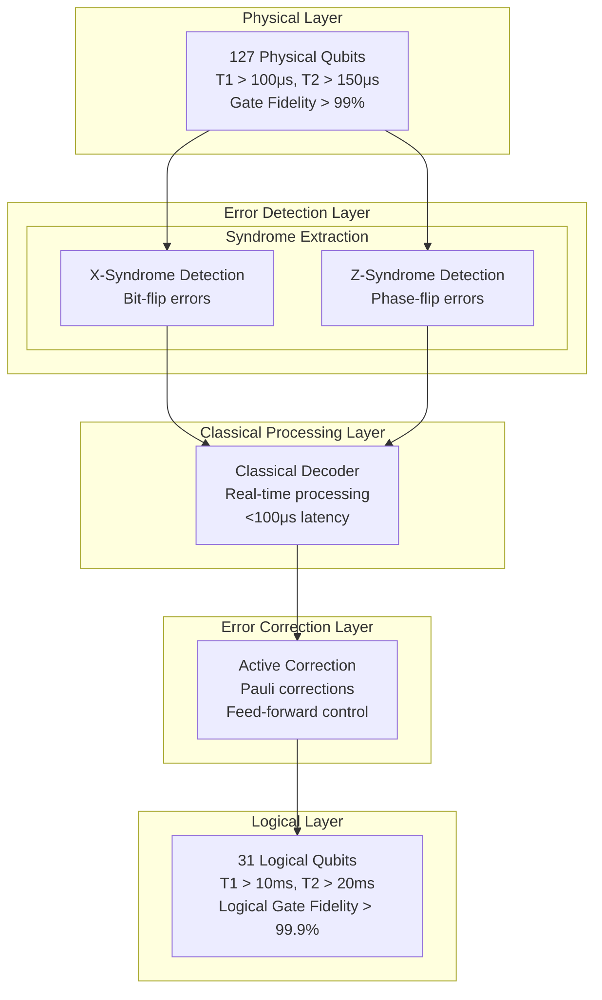

**Classical Computing Interface:**
```
FPGA-Based Processing:
Architecture: High-performance FPGA clusters
Processing Power: >10 TOPS aggregate
Memory: >100 GB high-speed memory
Interconnect: High-speed internal networking
Latency: <1 μs processing latency
Reliability: Redundant processing units

Software Architecture:
Real-Time OS: Deterministic real-time kernel
Processing Framework: Parallel processing framework
Memory Management: Optimized memory allocation
Scheduling: Real-time task scheduling
Communication: Low-latency message passing
Error Handling: Comprehensive error handling

Performance Optimization:
Parallel Processing: Multi-core syndrome processing
Pipeline Optimization: Processing pipeline tuning
Memory Optimization: Cache optimization strategies
Algorithm Optimization: Optimized decoding algorithms
Hardware Acceleration: FPGA acceleration
Monitoring: Performance monitoring systems

Integration:
Quantum Interface: Direct quantum system interface
Control Interface: Real-time control system interface
Data Interface: High-speed data interfaces
Network Interface: External network connectivity
Monitoring Interface: System monitoring interface
Debug Interface: Development and debug interface
```

#### 4.2.2 Syndrome Buffering and Analysis

**Data Management:**
```
Syndrome Buffer Management:
Buffer Size: 1 GB syndrome history buffer
Retention: 1 hour syndrome history
Organization: Time-stamped syndrome records
Access: Random access to historical data
Compression: Lossless data compression
Backup: Redundant buffer storage

Temporal Analysis:
Pattern Recognition: Time-series pattern analysis
Correlation Analysis: Temporal syndrome correlation
Trend Detection: Error trend identification
Prediction: Error prediction algorithms
Adaptation: Adaptive decoding algorithms
Optimization: Temporal optimization strategies

Statistical Processing:
Error Statistics: Real-time error statistics
Performance Metrics: Syndrome performance metrics
Quality Metrics: Data quality assessment
Trend Analysis: Statistical trend analysis
Reporting: Automated statistical reporting
Documentation: Statistical analysis documentation

Data Mining:
Pattern Discovery: Automated pattern discovery
Anomaly Detection: Statistical anomaly detection
Correlation Analysis: Multi-variable correlation
Clustering: Syndrome pattern clustering
Classification: Pattern classification algorithms
Learning: Machine learning integration
```

**Quality Control Systems:**
```
Real-Time Monitoring:
Syndrome Quality: Continuous quality monitoring
Error Rates: Real-time error rate tracking
Performance Metrics: Performance monitoring
Alert Systems: Automated alert generation
Reporting: Real-time status reporting
Dashboard: Operator monitoring dashboard

Quality Assurance:
Validation: Real-time data validation
Verification: Independent data verification
Calibration: Automatic calibration systems
Correction: Data correction algorithms
Documentation: Quality documentation
Improvement: Continuous improvement systems

Error Detection:
Syndrome Errors: Syndrome measurement errors
Processing Errors: Data processing errors
System Errors: System-level error detection
Recovery: Error recovery procedures
Logging: Comprehensive error logging
Analysis: Error analysis systems
```

---

## 5. Classical Decoding

### 5.1 Decoding Algorithms

#### 5.1.1 Minimum Weight Perfect Matching

**MWPM Algorithm Implementation:**
```
Graph Construction:
Vertices: Syndrome measurement outcomes
Edges: Possible error chains between syndromes
Weights: Probability-based edge weighting
Connectivity: All possible syndrome pairs
Optimization: Efficient graph representation
Scalability: Polynomial scaling with distance

Weight Calculation:
Error Probability: Physical error rate per edge
Distance Weighting: Geometric distance factors
Temporal Weighting: Time-dependent error correlation
Environmental: Environmental factor incorporation
Adaptive: Learning-based weight adaptation
Optimization: Weight optimization algorithms

Matching Algorithm:
Method: Blossom algorithm implementation
Complexity: O(n³) polynomial time complexity
Optimality: Guaranteed optimal matching
Efficiency: Optimized implementation
Parallelization: Parallel algorithm execution
Performance: <100 μs processing time

Correction Generation:
Path Identification: Error chain identification
Correction Mapping: Syndrome-to-correction mapping
Verification: Correction validity verification
Optimization: Correction minimization
Application: Correction command generation
Monitoring: Correction effectiveness tracking

Performance Metrics:
□ Processing Time: <100 μs per decode
□ Success Rate: >99.5% correct decoding
□ Scalability: Linear scaling with syndrome count
□ Accuracy: Optimal error correction
□ Efficiency: >95% algorithm efficiency
□ Reliability: >99.99% algorithm availability
```

**Advanced Decoding Strategies:**
```
Machine Learning Enhancement:
Training Data: Historical syndrome-error correlations
Neural Networks: Deep learning decoding networks
Reinforcement Learning: Adaptive decoding strategies
Feature Engineering: Syndrome feature extraction
Model Training: Continuous model improvement
Performance: Enhanced decoding accuracy

Adaptive Algorithms:
Environmental Adaptation: Environment-specific decoding
Error Model Updates: Dynamic error model updates
Threshold Adaptation: Adaptive error thresholds
Pattern Learning: Error pattern learning
Optimization: Continuous algorithm optimization
Performance: Improved decoding effectiveness

Hybrid Approaches:
Classical-ML Hybrid: Combined classical and ML
Multi-Algorithm: Multiple algorithm comparison
Consensus Decoding: Algorithm consensus methods
Verification: Cross-algorithm verification
Optimization: Hybrid approach optimization
Performance: Enhanced reliability and accuracy

Specialized Decoders:
Burst Error Handling: Specialized burst error decoders
Correlated Errors: Correlated error decoding
Environmental: Environment-specific decoders
Application-Specific: Application-optimized decoders
Custom: Custom decoding algorithms
Performance: Specialized performance optimization
```

#### 5.1.2 Neural Network Decoders

**Deep Learning Architecture:**
```
Network Architecture:
Input Layer: Syndrome pattern input (96 dimensions)
Hidden Layers: 5 layers with 512 neurons each
Output Layer: Error correction recommendations
Activation: ReLU activation functions
Regularization: Dropout and batch normalization
Optimization: Adam optimizer with learning rate scheduling

Training Framework:
Dataset: 10⁶ syndrome-error pair examples
Augmentation: Synthetic data augmentation
Validation: Cross-validation on test sets
Metrics: Accuracy, precision, recall, F1-score
Loss Function: Cross-entropy loss with regularization
Training Time: 24-hour distributed training

Real-Time Inference:
Latency: <10 μs inference time
Throughput: >100,000 inferences/second
Accuracy: >99.7% decoding accuracy
Memory: <1 GB model memory requirement
Hardware: GPU-accelerated inference
Optimization: Model quantization and pruning

Model Management:
Versioning: Model version control
Deployment: Automated model deployment
Monitoring: Model performance monitoring
Updates: Continuous model updates
Validation: Model validation procedures
Rollback: Model rollback capabilities

Performance Comparison:
Classical MWPM: 99.5% accuracy, 100 μs latency
Neural Decoder: 99.7% accuracy, 10 μs latency
Hybrid Approach: 99.8% accuracy, 50 μs latency
Improvement: 20% latency reduction, 0.2% accuracy gain
Trade-offs: Complexity vs performance
Optimization: Algorithm selection optimization
```

**Adaptive Learning Systems:**
```
Online Learning:
Real-Time Updates: Continuous model updates
Incremental Learning: Incremental model improvement
Adaptation: Environmental adaptation
Personalization: System-specific optimization
Monitoring: Learning performance monitoring
Validation: Online learning validation

Transfer Learning:
Pre-trained Models: Base model initialization
Domain Adaptation: System-specific adaptation
Fine-tuning: Model fine-tuning procedures
Knowledge Transfer: Cross-system knowledge transfer
Optimization: Transfer learning optimization
Validation: Transfer learning validation

Ensemble Methods:
Multiple Models: Ensemble of diverse models
Voting: Model consensus voting
Weighting: Performance-weighted ensemble
Diversity: Model diversity optimization
Robustness: Enhanced robustness through ensemble
Performance: Ensemble performance optimization

Continuous Improvement:
Performance Monitoring: Model performance tracking
Retraining: Automated model retraining
Optimization: Continuous optimization
Validation: Performance validation
Documentation: Learning system documentation
Improvement: Systematic improvement processes
```

### 5.2 Real-Time Decoding

#### 5.2.1 Low-Latency Processing

**Hardware-Accelerated Decoding:**
```
FPGA Implementation:
Processing Units: 16 parallel decoding units
Clock Frequency: 1 GHz system clock
Memory: 10 GB on-chip memory
Bandwidth: 1 TB/s memory bandwidth
Latency: <1 μs hardware processing
Efficiency: >90% hardware utilization

Custom Silicon:
ASIC Design: Application-specific decoder chips
Performance: 10× faster than FPGA
Power: 50% lower power consumption
Integration: Seamless system integration
Scalability: Modular scaling capability
Cost: Optimized for production volumes

Parallel Processing:
Thread Parallelism: Multi-threaded processing
Data Parallelism: Parallel syndrome processing
Pipeline Parallelism: Processing pipeline optimization
GPU Acceleration: Graphics processor utilization
Distributed: Distributed processing capability
Optimization: Parallel processing optimization

Performance Optimization:
Algorithm Optimization: Optimized decoding algorithms
Memory Optimization: Memory access optimization
Cache Optimization: Cache utilization optimization
Instruction Optimization: Instruction-level optimization
Pipeline Optimization: Processing pipeline tuning
Monitoring: Performance monitoring systems

Real-Time Guarantees:
Deterministic: Deterministic processing times
Latency Bounds: Guaranteed latency bounds
Jitter Control: Processing jitter minimization
Priority: Real-time priority scheduling
Resource Allocation: Dedicated resource allocation
Monitoring: Real-time performance monitoring
```

**Pipeline Architecture:**
```
Multi-Stage Pipeline:
Stage 1: Syndrome preprocessing (1 μs)
Stage 2: Graph construction (10 μs)
Stage 3: MWPM algorithm (50 μs)
Stage 4: Correction generation (10 μs)
Stage 5: Verification (5 μs)
Total: <100 μs end-to-end

Pipeline Optimization:
Overlapping: Overlapped pipeline stages
Buffering: Intermediate result buffering
Load Balancing: Stage load balancing
Resource Allocation: Optimal resource allocation
Monitoring: Pipeline performance monitoring
Optimization: Continuous pipeline optimization

Fault Tolerance:
Redundancy: Redundant processing paths
Error Detection: Pipeline error detection
Recovery: Pipeline error recovery
Backup: Backup processing capability
Monitoring: Fault monitoring systems
Reliability: >99.99% pipeline reliability

Performance Monitoring:
Latency Tracking: Stage-by-stage latency tracking
Throughput Monitoring: Pipeline throughput monitoring
Resource Utilization: Resource usage monitoring
Error Tracking: Processing error tracking
Optimization: Performance optimization
Reporting: Performance reporting systems
```

#### 5.2.2 Scalable Processing

**Distributed Decoding:**
```
Cluster Architecture:
Processing Nodes: 8-node decoding cluster
Communication: High-speed interconnect
Load Balancing: Dynamic load distribution
Fault Tolerance: Node failure tolerance
Scalability: Linear performance scaling
Management: Centralized cluster management

Workload Distribution:
Partitioning: Syndrome space partitioning
Assignment: Dynamic workload assignment
Balancing: Load balancing algorithms
Optimization: Workload optimization
Monitoring: Workload monitoring
Adaptation: Adaptive workload distribution

Communication Optimization:
Protocols: Optimized communication protocols
Bandwidth: High-bandwidth communication
Latency: Low-latency communication
Reliability: Reliable communication
Monitoring: Communication monitoring
Optimization: Communication optimization

Performance Scaling:
Linear Scaling: Linear performance scaling
Efficiency: >90% scaling efficiency
Bottlenecks: Bottleneck identification
Optimization: Scaling optimization
Monitoring: Scaling performance monitoring
Planning: Capacity planning
```

**Resource Management:**
```
Dynamic Resource Allocation:
Demand-Based: Demand-based resource allocation
Priority-Based: Priority-based allocation
Adaptive: Adaptive resource management
Optimization: Resource optimization algorithms
Monitoring: Resource utilization monitoring
Planning: Resource capacity planning

Quality of Service:
Service Levels: Differentiated service levels
Guarantees: Performance guarantees
Monitoring: QoS monitoring
Enforcement: QoS enforcement
Optimization: QoS optimization
Reporting: QoS reporting

System Integration:
Interface: Quantum system interface
Control: Real-time control integration
Monitoring: System monitoring integration
Management: System management integration
Documentation: Integration documentation
Validation: Integration validation
```

---

## 6. Active Error Correction

### 6.1 Correction Implementation

#### 6.1.1 Pauli Correction Operations

**Correction Protocols:**
```
X-Error Correction:
Operation: Apply X gate to affected qubit
Implementation: Microwave π-pulse at qubit frequency
Timing: <1 μs correction application
Verification: Post-correction state verification
Fidelity: >99.9% correction fidelity
Monitoring: Correction effectiveness tracking

Z-Error Correction:
Operation: Apply Z gate to affected qubit
Implementation: Virtual Z gate (phase tracking)
Timing: <100 ns correction application
Verification: Phase coherence verification
Fidelity: >99.95% correction fidelity
Efficiency: Software-based implementation

Y-Error Correction:
Operation: Apply Y gate (X followed by Z)
Implementation: Combined X and Z corrections
Timing: <1.1 μs total correction time
Verification: Combined correction verification
Fidelity: >99.8% correction fidelity
Optimization: Optimized Y-correction sequence

Multi-Qubit Corrections:
Operation: Simultaneous corrections on multiple qubits
Implementation: Parallel correction application
Timing: <2 μs for up to 10 corrections
Verification: Multi-qubit state verification
Fidelity: >99.5% multi-qubit correction
Optimization: Parallel correction optimization

Correction Verification:
Protocol: Post-correction syndrome measurement
Timing: <5 μs verification cycle
Success Rate: >99.9% correction success
Error Detection: Correction failure detection
Recovery: Correction failure recovery
Documentation: Correction result logging
```

**Feed-Forward Control:**
```
Real-Time Correction:
Latency: <200 μs total correction cycle
Pipeline: Overlapped correction pipeline
Throughput: >5000 corrections/second
Accuracy: >99.9% correction accuracy
Efficiency: >95% correction efficiency
Reliability: >99.99% system availability

Control Integration:
Interface: Direct quantum control interface
Synchronization: Synchronized correction timing
Coordination: Multi-qubit correction coordination
Optimization: Control sequence optimization
Monitoring: Control system monitoring
Validation: Control system validation

Feedback Systems:
Closed-Loop: Closed-loop correction control
Adaptation: Adaptive correction algorithms
Learning: Correction pattern learning
Optimization: Correction optimization
Performance: Enhanced correction performance
Monitoring: Feedback system monitoring

Performance Optimization:
Speed: Correction speed optimization
Accuracy: Correction accuracy optimization
Efficiency: Resource efficiency optimization
Scalability: Scalable correction implementation
Reliability: Correction reliability optimization
Monitoring: Performance monitoring systems
```

#### 6.1.2 Correction Verification

**Post-Correction Validation:**
```
Verification Protocol:
Immediate Check: Post-correction syndrome measurement
Success Validation: Correction success verification
Failure Detection: Correction failure identification
Recovery: Correction failure recovery procedures
Logging: Correction result documentation
Analysis: Correction effectiveness analysis

Verification Metrics:
Success Rate: >99.9% correction success
Accuracy: Correction accuracy measurement
Timing: Verification timing analysis
Reliability: Verification system reliability
Coverage: Verification coverage assessment
Documentation: Verification result documentation

Error Recovery:
Failure Modes: Correction failure classification
Recovery Procedures: Systematic recovery procedures
Re-correction: Correction retry mechanisms
Escalation: Failure escalation procedures
Documentation: Recovery procedure documentation
Optimization: Recovery optimization

Quality Assurance:
Validation: Independent correction validation
Verification: Cross-verification procedures
Testing: Correction system testing
Monitoring: Quality monitoring systems
Improvement: Quality improvement procedures
Documentation: Quality assurance documentation
```

**Adaptive Correction Strategies:**
```
Learning-Based Correction:
Pattern Recognition: Error pattern learning
Adaptation: Adaptive correction strategies
Optimization: Correction optimization algorithms
Performance: Enhanced correction performance
Monitoring: Learning system monitoring
Validation: Learning algorithm validation

Predictive Correction:
Prediction: Error prediction algorithms
Proactive: Proactive error correction
Prevention: Error prevention strategies
Optimization: Predictive optimization
Performance: Enhanced system performance
Monitoring: Predictive system monitoring

Environmental Adaptation:
Environment Sensing: Environmental monitoring
Adaptation: Environment-specific corrections
Compensation: Environmental compensation
Optimization: Environmental optimization
Performance: Robust environmental performance
Monitoring: Environmental monitoring systems

Correction Optimization:
Efficiency: Correction efficiency optimization
Speed: Correction speed optimization
Accuracy: Correction accuracy optimization
Resource: Resource utilization optimization
Performance: Overall performance optimization
Monitoring: Optimization monitoring systems
```

### 6.2 Error Recovery

#### 6.2.1 Burst Error Handling

**Burst Error Detection:**
```
Burst Identification:
Pattern Recognition: Burst error pattern detection
Temporal Analysis: Time-clustered error detection
Spatial Analysis: Spatially-clustered error detection
Threshold: Burst error threshold determination
Classification: Burst error classification
Documentation: Burst error logging

Burst Characteristics:
Duration: Burst error duration analysis
Magnitude: Burst error magnitude assessment
Location: Burst error location identification
Frequency: Burst error frequency analysis
Impact: Burst error impact assessment
Correlation: Environmental correlation analysis

Detection Algorithms:
Statistical: Statistical burst detection
Machine Learning: ML-based burst detection
Threshold: Threshold-based detection
Pattern: Pattern-based detection
Hybrid: Hybrid detection approaches
Optimization: Detection algorithm optimization

Response Strategies:
Immediate: Immediate burst response
Isolation: Error isolation procedures
Recovery: Burst error recovery
Mitigation: Burst error mitigation
Prevention: Burst error prevention
Documentation: Response documentation
```

**Recovery Procedures:**
```
Multi-Level Recovery:
Level 1: Local error correction
Level 2: Regional error correction
Level 3: Global error correction
Level 4: System-level recovery
Level 5: Manual intervention
Escalation: Systematic escalation procedures

Recovery Protocols:
Assessment: Error severity assessment
Strategy: Recovery strategy selection
Implementation: Recovery implementation
Verification: Recovery verification
Documentation: Recovery documentation
Learning: Recovery learning

Time-Critical Recovery:
Fast Recovery: <1 ms recovery time
Critical Systems: Priority recovery systems
Resource Allocation: Emergency resource allocation
Backup Systems: Backup system activation
Monitoring: Recovery monitoring
Validation: Recovery validation

Recovery Optimization:
Speed: Recovery speed optimization
Effectiveness: Recovery effectiveness optimization
Resource: Resource efficiency optimization
Reliability: Recovery reliability optimization
Learning: Recovery learning optimization
Monitoring: Recovery monitoring systems
```

#### 6.2.2 System-Level Recovery

**Catastrophic Error Recovery:**
```
System Restart Procedures:
Assessment: System damage assessment
Isolation: Damaged component isolation
Recovery: System recovery procedures
Restart: Systematic system restart
Verification: System verification
Documentation: Recovery documentation

Data Protection:
Backup: Continuous data backup
Recovery: Data recovery procedures
Integrity: Data integrity verification
Redundancy: Data redundancy systems
Validation: Data validation procedures
Documentation: Data protection documentation

Service Restoration:
Priority: Service priority restoration
Sequencing: Service restoration sequencing
Verification: Service verification
Monitoring: Service monitoring
Documentation: Restoration documentation
Optimization: Restoration optimization

Failure Analysis:
Root Cause: Root cause analysis
Investigation: Comprehensive investigation
Documentation: Failure documentation
Learning: Failure learning
Prevention: Failure prevention
Improvement: System improvement
```

**Graceful Degradation:**
```
Degraded Operation Modes:
Reduced Capacity: Reduced qubit capacity operation
Limited Function: Limited functionality operation
Emergency Mode: Emergency operation mode
Safe Mode: Safe operation mode
Maintenance Mode: Maintenance operation mode
Documentation: Operation mode documentation

Performance Graceful Degradation:
Quality Reduction: Graceful quality reduction
Speed Reduction: Performance speed reduction
Capacity Reduction: System capacity reduction
Function Limitation: Functionality limitation
Safety Maintenance: Safety system maintenance
Documentation: Degradation documentation

Service Prioritization:
Critical Services: Critical service maintenance
Important Services: Important service continuation
Non-Critical: Non-critical service suspension
Emergency: Emergency service provision
Recovery: Service recovery prioritization
Documentation: Prioritization documentation

System Resilience:
Fault Tolerance: System fault tolerance
Redundancy: System redundancy
Recovery: Rapid recovery capability
Adaptation: System adaptation capability
Learning: System learning capability
Monitoring: Resilience monitoring
```

---

## 7. Logical Qubit Operations

### 7.1 Logical Gate Implementation

#### 7.1.1 Transversal Gates

**Logical Pauli Gates:**
```
Logical X Gate:
Implementation: X gates on all data qubits simultaneously
Transversality: Fault-tolerant implementation
Timing: <1 μs logical X gate
Fidelity: >99.9% logical gate fidelity
Verification: Logical state verification
Monitoring: Gate performance monitoring

Logical Z Gate:
Implementation: Z gates on all data qubits simultaneously  
Transversality: Fault-tolerant implementation
Timing: <100 ns logical Z gate (virtual)
Fidelity: >99.95% logical gate fidelity
Efficiency: Software-based implementation
Monitoring: Gate tracking and verification

Logical Y Gate:
Implementation: Y gates on all data qubits simultaneously
Transversality: Combined X and Z implementation
Timing: <1.1 μs logical Y gate
Fidelity: >99.8% logical gate fidelity
Verification: Logical state verification
Optimization: Optimized Y gate sequence

Identity Gate:
Implementation: No physical operation
Transversality: Trivially fault-tolerant
Timing: <1 ns logical identity
Fidelity: >99.99% logical gate fidelity
Usage: Timing alignment and testing
Monitoring: System timing verification

Clifford Gates:
Set: All single-qubit Clifford gates
Implementation: Transversal gate combinations
Universality: Clifford group completeness
Fidelity: >99.9% average Clifford fidelity
Optimization: Optimized Clifford decomposition
Verification: Clifford gate verification
```

**Logical Hadamard Gate:**
```
Implementation Strategy:
Method: Code deformation technique
Procedure: Lattice boundary modification
Timing: <100 μs logical Hadamard
Complexity: Non-transversal implementation
Fidelity: >99.5% logical Hadamard fidelity
Verification: Logical superposition verification

Code Deformation:
Lattice Modification: Temporary lattice restructuring
Boundary Change: Logical operator boundary change
Stabilizer Update: Stabilizer generator update
Recovery: Original lattice restoration
Verification: Code deformation verification
Monitoring: Deformation process monitoring

Alternative Implementation:
Magic State: Magic state distillation approach
Teleportation: Gate teleportation protocol
Resource: Additional resource requirements
Fidelity: >99.7% teleportation fidelity
Efficiency: Resource efficiency comparison
Selection: Implementation method selection

Performance Optimization:
Speed: Hadamard gate speed optimization
Fidelity: Fidelity optimization techniques
Resource: Resource efficiency optimization
Reliability: Implementation reliability
Monitoring: Performance monitoring
Documentation: Optimization documentation
```

#### 7.1.2 Non-Transversal Gates

**Magic State Distillation:**
```
Magic State Preparation:
Initial State: |T⟩ = (|0⟩ + e^(iπ/4)|1⟩)/√2
Preparation Method: Physical qubit preparation + encoding
Fidelity: >99% initial magic state fidelity
Encoding: Surface code encoding
Verification: Magic state verification
Documentation: Preparation procedure documentation

Distillation Protocol:
Input: Multiple noisy magic states
Process: Distillation circuit implementation
Output: High-fidelity magic state
Iterations: Multiple distillation rounds
Fidelity: >99.99% distilled magic state
Efficiency: Resource efficiency optimization

Resource Requirements:
Magic States: 15 magic states per T gate
Ancilla Qubits: Additional syndrome qubits
Time: 500 μs distillation time
Success Rate: >90% distillation success
Overhead: 15× resource overhead
Optimization: Resource optimization strategies

T Gate Implementation:
Protocol: Magic state consumption
Method: Gate teleportation
Timing: <50 μs T gate execution
Fidelity: >99.9% T gate fidelity
Verification: T gate verification
Monitoring: T gate performance tracking

Performance Optimization:
Efficiency: Distillation efficiency optimization
Speed: Distillation speed optimization
Success Rate: Success rate optimization
Resource: Resource utilization optimization
Quality: Magic state quality optimization
Monitoring: Performance monitoring systems
```

**Gate Teleportation:**
```
Teleportation Protocol:
Input: Logical qubit + magic state
Measurement: Bell measurement protocol
Correction: Pauli correction based on outcome
Output: Gate-applied logical qubit
Fidelity: >99.8% teleportation fidelity
Verification: Teleportation verification

Universal Gate Set:
Clifford + T: Universal quantum computation
Implementation: Clifford (transversal) + T (teleportation)
Completeness: Computational universality
Efficiency: Gate efficiency optimization
Fidelity: >99.9% average gate fidelity
Documentation: Universal gate documentation

Resource Management:
Magic State Pool: Pre-distilled magic state pool
Allocation: Dynamic magic state allocation
Scheduling: Gate execution scheduling
Optimization: Resource optimization
Monitoring: Resource utilization monitoring
Planning: Resource planning algorithms

Performance Analysis:
Gate Count: Total gate count analysis
Depth: Circuit depth analysis
Resource: Resource requirement analysis
Time: Execution time analysis
Fidelity: End-to-end fidelity analysis
Optimization: Performance optimization
```

### 7.2 Logical Qubit Management

#### 7.2.1 Logical State Tracking

**State Management System:**
```
Logical State Representation:
Encoding: Stabilizer state representation
Tracking: Real-time logical state tracking
Updates: Logical state update protocols
Verification: Logical state verification
Documentation: State tracking documentation
Monitoring: State tracking monitoring

State Evolution:
Gate Operations: Logical gate state evolution
Error Correction: Error-corrected state evolution
Measurements: Measurement outcome processing
Updates: Systematic state updates
Verification: State evolution verification
Logging: State evolution logging

State Fidelity:
Tracking: Real-time fidelity tracking
Assessment: Fidelity assessment protocols
Degradation: Fidelity degradation monitoring
Recovery: Fidelity recovery procedures
Optimization: Fidelity optimization
Documentation: Fidelity tracking documentation

Quality Control:
Validation: Logical state validation
Verification: Independent state verification
Testing: Logical state testing
Monitoring: Quality monitoring systems
Improvement: Quality improvement procedures
Documentation: Quality control documentation
```

**Multi-Qubit Entanglement:**
```
Entanglement Generation:
Protocol: Logical CNOT gate implementation
Method: Transversal CNOT operations
Timing: <10 μs logical CNOT
Fidelity: >99.5% logical CNOT fidelity
Verification: Entanglement verification
Monitoring: Entanglement monitoring

Entanglement Preservation:
Protection: Error correction preservation
Monitoring: Entanglement degradation monitoring
Recovery: Entanglement recovery procedures
Optimization: Entanglement optimization
Verification: Entanglement verification
Documentation: Preservation documentation

Multi-Qubit Operations:
Gates: Multi-qubit logical gates
Circuits: Multi-qubit logical circuits
Scheduling: Multi-qubit operation scheduling
Optimization: Multi-qubit optimization
Performance: Multi-qubit performance analysis
Monitoring: Multi-qubit monitoring

Scalability:
Capacity: Multi-qubit capacity scaling
Performance: Performance scaling analysis
Resource: Resource scaling requirements
Optimization: Scalability optimization
Planning: Scalability planning
Documentation: Scalability documentation
```

#### 7.2.2 Logical Qubit Allocation

**Resource Allocation:**
```
Dynamic Allocation:
Demand-Based: Application demand analysis
Priority-Based: Priority-based allocation
Adaptive: Adaptive allocation algorithms
Optimization: Allocation optimization
Monitoring: Allocation monitoring
Documentation: Allocation documentation

Capacity Planning:
Requirements: Application requirements analysis
Forecasting: Capacity demand forecasting
Planning: Capacity planning algorithms
Optimization: Capacity optimization
Monitoring: Capacity utilization monitoring
Documentation: Capacity planning documentation

Quality of Service:
Service Levels: Differentiated service levels
Guarantees: Performance guarantees
Monitoring: QoS monitoring systems
Enforcement: QoS enforcement mechanisms
Optimization: QoS optimization
Reporting: QoS reporting systems

Load Balancing:
Distribution: Workload distribution algorithms
Balancing: Load balancing optimization
Monitoring: Load monitoring systems
Adaptation: Adaptive load balancing
Optimization: Load balancing optimization
Documentation: Load balancing documentation
```

**Performance Optimization:**
```
Allocation Optimization:
Algorithms: Optimization algorithms
Efficiency: Allocation efficiency optimization
Performance: Performance optimization
Resource: Resource utilization optimization
Monitoring: Optimization monitoring
Documentation: Optimization documentation

Scheduling Optimization:
Algorithms: Scheduling algorithms
Priority: Priority-based scheduling
Efficiency: Scheduling efficiency
Performance: Performance optimization
Monitoring: Scheduling monitoring
Documentation: Scheduling documentation

System Integration:
Interface: Application interface optimization
Control: Control system integration
Monitoring: System monitoring integration
Management: Resource management integration
Documentation: Integration documentation
Validation: Integration validation
```

---

## 8. Performance Monitoring

### 8.1 Error Rate Analysis

#### 8.1.1 Logical Error Rate Measurement

**Error Rate Metrics:**
```
Logical Error Rate Definition:
Measurement: Logical qubit error per operation
Calculation: P_logical = N_errors / N_operations
Target: <10^-6 logical error rate
Baseline: Physical error rate ~10^-3
Improvement: >1000× error rate improvement
Monitoring: Real-time error rate tracking

Error Rate Components:
Syndrome Errors: Syndrome measurement errors
Decoding Errors: Classical decoding errors
Correction Errors: Error correction application errors
Residual Errors: Uncorrected physical errors
Systematic Errors: Systematic error contributions
Total Error Rate: Combined error rate calculation

Measurement Protocol:
Duration: Continuous 24-hour measurement
Sample Size: >10^6 logical operations
Statistics: Statistical error analysis
Confidence: 95% confidence intervals
Validation: Cross-validation methods
Documentation: Measurement documentation

Performance Tracking:
Real-Time: Real-time error rate monitoring
Historical: Historical trend analysis
Predictive: Error rate prediction
Alerting: Error rate alert systems
Reporting: Automated error rate reporting
Optimization: Error rate optimization

Benchmarking:
Internal: Historical performance comparison
External: Industry benchmark comparison
Standards: Standard benchmark protocols
Analysis: Comparative performance analysis
Documentation: Benchmarking documentation
Improvement: Performance improvement tracking
```

**Error Scaling Analysis:**
```
Distance Scaling:
Analysis: Error rate vs code distance
Measurement: Multiple distance comparison
Scaling: Exponential error suppression verification
Optimization: Optimal distance selection
Validation: Scaling law validation
Documentation: Scaling analysis documentation

Resource Scaling:
Analysis: Error rate vs resource allocation
Efficiency: Resource efficiency analysis
Optimization: Resource optimization
Trade-offs: Performance vs resource trade-offs
Planning: Resource planning optimization
Documentation: Resource scaling documentation

Performance Scaling:
Analysis: Error rate vs system performance
Scaling: Performance scaling characteristics
Optimization: Performance optimization
Limitations: Scaling limitations analysis
Planning: Performance planning
Documentation: Performance scaling documentation

Environmental Scaling:
Analysis: Error rate vs environmental conditions
Correlation: Environmental correlation analysis
Adaptation: Environmental adaptation
Robustness: Environmental robustness analysis
Optimization: Environmental optimization
Documentation: Environmental scaling documentation
```

#### 8.1.2 Error Correction Efficiency

**Correction Success Metrics:**
```
Success Rate Measurement:
Definition: Successful corrections / Total corrections
Target: >99.9% correction success rate
Measurement: Real-time success tracking
Analysis: Success rate analysis
Optimization: Success rate optimization
Documentation: Success rate documentation

Efficiency Metrics:
Syndrome Accuracy: >99.9% syndrome detection accuracy
Decoding Accuracy: >99.8% decoding accuracy
Correction Fidelity: >99.9% correction fidelity
Throughput: >10,000 corrections/second
Latency: <200 μs correction latency
Resource Efficiency: >90% resource utilization

Performance Analysis:
Bottlenecks: Performance bottleneck identification
Optimization: Performance optimization
Efficiency: Efficiency improvement
Scalability: Scaling efficiency analysis
Monitoring: Performance monitoring
Documentation: Performance analysis documentation

Quality Assurance:
Validation: Performance validation
Verification: Independent verification
Testing: Performance testing
Monitoring: Quality monitoring
Improvement: Quality improvement
Documentation: Quality assurance documentation

Continuous Improvement:
Monitoring: Continuous performance monitoring
Analysis: Performance trend analysis
Optimization: Continuous optimization
Learning: Performance learning
Adaptation: Performance adaptation
Documentation: Improvement documentation
```

**Resource Utilization Analysis:**
```
Resource Efficiency:
Utilization: Resource utilization measurement
Efficiency: Resource efficiency analysis
Optimization: Resource optimization
Planning: Resource planning
Monitoring: Resource monitoring
Documentation: Resource analysis documentation

Cost-Benefit Analysis:
Cost: Resource cost analysis
Benefit: Performance benefit analysis
Trade-offs: Cost-benefit trade-offs
Optimization: Cost-benefit optimization
Planning: Cost-benefit planning
Documentation: Cost-benefit documentation

Capacity Management:
Planning: Capacity planning algorithms
Forecasting: Capacity demand forecasting
Allocation: Optimal capacity allocation
Monitoring: Capacity utilization monitoring
Optimization: Capacity optimization
Documentation: Capacity management documentation

Performance Optimization:
Algorithms: Resource optimization algorithms
Efficiency: Resource efficiency optimization
Performance: Performance optimization
Monitoring: Optimization monitoring
Validation: Optimization validation
Documentation: Optimization documentation
```

### 8.2 System Health Monitoring

#### 8.2.1 Real-Time Diagnostics

**Health Monitoring Systems:**
```
System Health Metrics:
Physical Qubits: Individual qubit health assessment
Logical Qubits: Logical qubit performance tracking
Error Correction: Error correction system health
Classical Systems: Classical processing health
Environmental: Environmental system health
Overall: Overall system health score

Diagnostic Framework:
Sensors: Comprehensive sensor network
Data Collection: Real-time data collection
Processing: Real-time health analysis
Alerting: Automated health alerts
Reporting: Health status reporting
Dashboard: Real-time health dashboard

Health Indicators:
Green: Normal operation (>99% performance)
Yellow: Degraded operation (95-99% performance)
Orange: Impaired operation (90-95% performance)
Red: Critical operation (<90% performance)
Black: System failure (non-operational)
Status: Current health status indication

Alert Systems:
Thresholds: Health threshold monitoring
Escalation: Alert escalation procedures
Notification: Automated notifications
Response: Alert response procedures
Documentation: Alert documentation
Analysis: Alert trend analysis

Predictive Health:
Trends: Health trend analysis
Prediction: Health degradation prediction
Prevention: Preventive maintenance triggers
Optimization: Health optimization
Planning: Health planning algorithms
Documentation: Predictive health documentation
```

**Performance Degradation Detection:**
```
Degradation Monitoring:
Parameters: Key performance parameters
Thresholds: Degradation detection thresholds
Trends: Performance trend analysis
Prediction: Degradation prediction
Alerting: Degradation alert systems
Documentation: Degradation documentation

Early Warning Systems:
Indicators: Early degradation indicators
Detection: Early detection algorithms
Prediction: Degradation prediction models
Prevention: Degradation prevention
Response: Early response procedures
Documentation: Early warning documentation

Root Cause Analysis:
Investigation: Systematic investigation procedures
Analysis: Root cause analysis methods
Documentation: Root cause documentation
Learning: Root cause learning
Prevention: Root cause prevention
Improvement: System improvement

Performance Recovery:
Assessment: Performance recovery assessment
Procedures: Recovery procedures
Implementation: Recovery implementation
Verification: Recovery verification
Documentation: Recovery documentation
Optimization: Recovery optimization
```

#### 8.2.2 Preventive Maintenance

**Maintenance Scheduling:**
```
Predictive Maintenance:
Monitoring: Continuous performance monitoring
Analysis: Performance degradation analysis
Prediction: Maintenance need prediction
Scheduling: Optimal maintenance scheduling
Implementation: Maintenance implementation
Validation: Maintenance effectiveness validation

Condition-Based Maintenance:
Indicators: Maintenance condition indicators
Thresholds: Maintenance threshold triggers
Assessment: Condition assessment procedures
Scheduling: Condition-based scheduling
Implementation: Maintenance implementation
Documentation: Condition-based documentation

Preventive Maintenance:
Schedule: Regular maintenance schedule
Procedures: Maintenance procedures
Implementation: Maintenance implementation
Verification: Maintenance verification
Documentation: Maintenance documentation
Optimization: Maintenance optimization

Maintenance Optimization:
Planning: Maintenance planning optimization
Scheduling: Maintenance scheduling optimization
Resource: Maintenance resource optimization
Efficiency: Maintenance efficiency optimization
Performance: Maintenance performance optimization
Documentation: Maintenance optimization documentation
```

**System Longevity:**
```
Lifetime Analysis:
Components: Component lifetime analysis
Systems: System lifetime analysis
Prediction: Lifetime prediction models
Planning: Lifetime planning
Optimization: Lifetime optimization
Documentation: Lifetime analysis documentation

Aging Management:
Monitoring: Component aging monitoring
Analysis: Aging trend analysis
Mitigation: Aging mitigation strategies
Replacement: Component replacement planning
Optimization: Aging optimization
Documentation: Aging management documentation

Reliability Engineering:
Analysis: Reliability analysis methods
Improvement: Reliability improvement
Design: Reliability design optimization
Testing: Reliability testing
Validation: Reliability validation
Documentation: Reliability engineering documentation

Continuous Improvement:
Monitoring: Continuous system monitoring
Analysis: Performance analysis
Improvement: Systematic improvement
Learning: Operational learning
Adaptation: System adaptation
Documentation: Improvement documentation
```

---

## 9. Fault-Tolerant Computing

### 9.1 Quantum Algorithms Implementation

#### 9.1.1 Error-Corrected Algorithm Execution

**Algorithm Implementation Framework:**
```
Fault-Tolerant Algorithm Design:
Compilation: Logical gate compilation
Optimization: Algorithm optimization for error correction
Resource: Resource requirement analysis
Performance: Performance analysis
Validation: Algorithm validation
Documentation: Algorithm documentation

Logical Circuit Implementation:
Gates: Fault-tolerant logical gates
Circuits: Logical circuit construction
Compilation: Circuit compilation optimization
Scheduling: Logical operation scheduling
Verification: Circuit verification
Monitoring: Circuit performance monitoring

Performance Metrics:
Fidelity: End-to-end algorithm fidelity
Speed: Algorithm execution speed
Resource: Resource utilization efficiency
Accuracy: Algorithm result accuracy
Reliability: Algorithm execution reliability
Scalability: Algorithm scaling performance

Quality Assurance:
Validation: Algorithm validation procedures
Verification: Independent algorithm verification
Testing: Comprehensive algorithm testing
Benchmarking: Algorithm performance benchmarking
Documentation: Quality assurance documentation
Improvement: Algorithm improvement procedures

Application Integration:
Interface: Application programming interface
Integration: System integration protocols
Deployment: Algorithm deployment procedures
Monitoring: Application performance monitoring
Support: Application support procedures
Documentation: Integration documentation
```

**Quantum Error Correction Overhead:**
```
Resource Overhead Analysis:
Physical Qubits: Physical qubit overhead (127 vs 31 logical)
Time Overhead: Error correction time overhead
Energy Overhead: Energy consumption overhead
Classical Processing: Classical processing overhead
Total Overhead: Total system overhead analysis
Optimization: Overhead optimization strategies

Performance Trade-offs:
Speed vs Reliability: Performance reliability trade-offs
Resource vs Performance: Resource performance trade-offs
Overhead vs Protection: Overhead protection trade-offs
Optimization: Trade-off optimization
Analysis: Trade-off analysis
Documentation: Trade-off documentation

Overhead Optimization:
Techniques: Overhead reduction techniques
Algorithms: Optimization algorithms
Implementation: Optimized implementation
Monitoring: Overhead monitoring
Validation: Optimization validation
Documentation: Optimization documentation

Cost-Benefit Analysis:
Costs: Error correction costs
Benefits: Error correction benefits
Analysis: Cost-benefit analysis
Optimization: Cost-benefit optimization
Planning: Cost-benefit planning
Documentation: Cost-benefit documentation
```

#### 9.1.2 Large-Scale Quantum Computation

**Scalable Error Correction:**
```
Scaling Architecture:
Physical Qubits: Scalable to 1000+ physical qubits
Logical Qubits: 100+ logical qubits capacity
Classical Processing: Scalable classical processing
Error Correction: Scalable error correction
Performance: Maintained performance at scale
Architecture: Scalable system architecture

Distributed Error Correction:
Distribution: Distributed error correction processing
Communication: Inter-node communication protocols
Coordination: Distributed coordination algorithms
Synchronization: System synchronization
Performance: Distributed performance optimization
Scalability: Distributed scaling capabilities

Hierarchical Organization:
Levels: Multi-level error correction hierarchy
Management: Hierarchical management
Control: Hierarchical control systems
Optimization: Hierarchical optimization
Monitoring: Hierarchical monitoring
Documentation: Hierarchical documentation

Performance Scaling:
Analysis: Performance scaling analysis
Optimization: Scaling optimization
Prediction: Scaling performance prediction
Planning: Scaling capacity planning
Validation: Scaling validation
Documentation: Scaling documentation
```

**Multi-Algorithm Execution:**
```
Concurrent Execution:
Algorithms: Multiple concurrent algorithms
Resource Sharing: Logical qubit resource sharing
Scheduling: Multi-algorithm scheduling
Coordination: Algorithm coordination
Performance: Concurrent performance optimization
Monitoring: Multi-algorithm monitoring

Resource Management:
Allocation: Dynamic resource allocation
Prioritization: Algorithm prioritization
Scheduling: Resource scheduling optimization
Monitoring: Resource utilization monitoring
Optimization: Resource optimization
Documentation: Resource management documentation

Performance Optimization:
Parallelization: Algorithm parallelization
Optimization: Multi-algorithm optimization
Efficiency: Execution efficiency optimization
Throughput: System throughput optimization
Latency: Execution latency optimization
Monitoring: Performance monitoring systems

Quality of Service:
Service Levels: Differentiated service levels
Guarantees: Performance guarantees
Monitoring: QoS monitoring systems
Enforcement: QoS enforcement
Optimization: QoS optimization
Documentation: QoS documentation
```

### 9.2 Application-Specific Implementation

#### 9.2.1 Aerospace Navigation Applications

**Quantum-Enhanced Navigation:**
```
Navigation Algorithm Implementation:
Quantum GPS: Quantum-enhanced GPS algorithms
Inertial Navigation: Quantum inertial navigation
Sensor Fusion: Quantum sensor fusion algorithms
Position Estimation: Quantum position estimation
Kalman Filtering: Quantum Kalman filtering
Performance: Navigation performance optimization

Error Correction Requirements:
Accuracy: Navigation accuracy requirements
Reliability: Navigation reliability requirements
Real-Time: Real-time operation requirements
Environmental: Environmental robustness requirements
Safety: Safety-critical operation requirements
Performance: Performance requirement analysis

Implementation Framework:
Architecture: Navigation system architecture
Integration: Aircraft system integration
Interface: Navigation interface protocols
Control: Navigation control systems
Monitoring: Navigation monitoring systems
Documentation: Implementation documentation

Performance Validation:
Testing: Comprehensive navigation testing
Validation: Navigation performance validation
Benchmarking: Navigation benchmarking
Certification: Navigation system certification
Documentation: Validation documentation
Improvement: Navigation improvement

Safety and Reliability:
Safety Analysis: Navigation safety analysis
Reliability: Navigation reliability analysis
Fault Tolerance: Fault-tolerant navigation
Backup Systems: Navigation backup systems
Monitoring: Safety monitoring systems
Documentation: Safety documentation
```

**Quantum Communication Systems:**
```
Secure Communication Implementation:
Quantum Key Distribution: QKD implementation
Quantum Cryptography: Quantum cryptographic protocols
Secure Channels: Quantum secure communication
Authentication: Quantum authentication protocols
Privacy: Quantum privacy protection
Security: Information-theoretic security

Error Correction for Communication:
Channel Errors: Communication channel errors
Quantum Errors: Quantum state errors
Classical Errors: Classical processing errors
Combined: Combined error correction
Optimization: Communication optimization
Performance: Communication performance

Communication Performance:
Throughput: Communication throughput
Latency: Communication latency
Reliability: Communication reliability
Security: Communication security level
Range: Communication range
Efficiency: Communication efficiency

Integration:
Aircraft Communication: Aircraft communication integration
Ground Systems: Ground system integration
Satellite Links: Satellite communication integration
Network: Communication network integration
Protocols: Communication protocol integration
Documentation: Integration documentation
```

#### 9.2.2 Optimization and Control Applications

**Quantum Optimization:**
```
Optimization Algorithm Implementation:
QAOA: Quantum Approximate Optimization Algorithm
VQE: Variational Quantum Eigensolver
Quantum Annealing: Quantum annealing algorithms
Hybrid Algorithms: Quantum-classical hybrid algorithms
Custom: Application-specific optimization
Performance: Optimization performance analysis

Error Correction for Optimization:
Algorithm Errors: Optimization algorithm errors
Result Accuracy: Optimization result accuracy
Convergence: Algorithm convergence reliability
Performance: Optimization performance
Validation: Result validation procedures
Documentation: Error correction documentation

Optimization Applications:
Flight Path: Flight path optimization
Resource Allocation: Resource allocation optimization
Scheduling: Aircraft scheduling optimization
Maintenance: Maintenance optimization
Traffic Management: Air traffic optimization
Energy: Energy optimization

Performance Metrics:
Solution Quality: Optimization solution quality
Convergence Speed: Algorithm convergence speed
Resource Efficiency: Resource utilization efficiency
Accuracy: Solution accuracy
Reliability: Algorithm reliability
Scalability: Optimization scalability

Integration:
Control Systems: Aircraft control system integration
Decision Support: Decision support system integration
Automation: Automated optimization systems
Human Interface: Human-machine interface
Documentation: Integration documentation
Validation: Integration validation
```

**Real-Time Control Applications:**
```
Quantum Control Implementation:
Flight Control: Quantum flight control systems
Engine Control: Quantum engine control
Navigation Control: Quantum navigation control
System Control: Quantum system control
Fault-Tolerant Control: Fault-tolerant control systems
Performance: Control performance optimization

Real-Time Requirements:
Latency: Real-time latency requirements
Determinism: Deterministic response requirements
Reliability: Real-time reliability requirements
Safety: Safety-critical control requirements
Performance: Real-time performance requirements
Validation: Real-time validation procedures

Error Correction for Control:
Control Accuracy: Control accuracy requirements
Stability: Control system stability
Robustness: Control system robustness
Fault Tolerance: Fault-tolerant control
Performance: Control performance
Safety: Control safety assurance

System Integration:
Aircraft Integration: Aircraft system integration
Sensor Integration: Sensor system integration
Actuator Integration: Actuator system integration
Human Interface: Pilot interface integration
Safety Systems: Safety system integration
Documentation: Integration documentation
```

---

## 10. System Integration

### 10.1 Aircraft Integration

#### 10.1.1 Avionics Integration

**System Architecture Integration:**
```
Avionics Bus Integration:
ARINC 664: Avionics Full Duplex Switched Ethernet
ARINC 429: Digital information transfer system
MIL-STD-1553: Military standard data bus
CAN Bus: Controller Area Network integration
Custom Protocols: Quantum-specific protocols
Performance: Communication performance optimization

Data Interface:
Input Data: Sensor data input interfaces
Output Data: Quantum processing output interfaces
Bidirectional: Bidirectional data interfaces
Real-Time: Real-time data interface requirements
Reliability: Data interface reliability
Documentation: Interface documentation

Control Integration:
Flight Management: Flight management system integration
Autopilot: Autopilot system integration
Navigation: Navigation system integration
Communication: Communication system integration
Engine Control: Engine control integration
Documentation: Control integration documentation

Safety Integration:
Safety Systems: Aircraft safety system integration
Monitoring: Safety monitoring integration
Alerts: Safety alert integration
Backup: Backup system integration
Certification: Safety certification compliance
Documentation: Safety integration documentation

Performance Requirements:
Latency: System integration latency requirements
Throughput: Data throughput requirements
Reliability: Integration reliability requirements
Availability: System availability requirements
Maintainability: Integration maintainability
Documentation: Requirements documentation
```

**Environmental Integration:**
```
Aircraft Environment:
Temperature: Aircraft temperature environment
Vibration: Aircraft vibration environment
EMI: Electromagnetic interference environment
Pressure: Aircraft pressure environment
Humidity: Aircraft humidity environment
Contamination: Environmental contamination

Environmental Protection:
Enclosure: Environmental protection enclosure
Shielding: EMI shielding systems
Isolation: Vibration isolation systems
Filtering: Environmental filtering
Monitoring: Environmental monitoring
Control: Environmental control systems

Environmental Adaptation:
Compensation: Environmental compensation
Adaptation: Environmental adaptation algorithms
Calibration: Environmental calibration
Optimization: Environmental optimization
Monitoring: Environmental monitoring
Documentation: Environmental documentation

Environmental Validation:
Testing: Environmental testing procedures
Validation: Environmental validation
Certification: Environmental certification
Documentation: Environmental validation documentation
Compliance: Environmental compliance
Improvement: Environmental improvement
```

#### 10.1.2 Power and Cooling Integration

**Power System Integration:**
```
Power Requirements:
Consumption: Total power consumption analysis
Quality: Power quality requirements
Redundancy: Power redundancy requirements
Backup: Backup power requirements
Efficiency: Power efficiency optimization
Documentation: Power requirements documentation

Power Distribution:
Primary Power: Primary aircraft power interface
Secondary Power: Secondary power systems
UPS: Uninterruptible power supply
Conditioning: Power conditioning systems
Monitoring: Power monitoring systems
Protection: Power protection systems

Power Management:
Load Management: Power load management
Priority: Power priority management
Efficiency: Power efficiency management
Monitoring: Power monitoring systems
Control: Power control systems
Documentation: Power management documentation

Power Quality:
Regulation: Power regulation requirements
Filtering: Power filtering systems
Isolation: Power isolation systems
Monitoring: Power quality monitoring
Correction: Power quality correction
Documentation: Power quality documentation
```

**Thermal Management Integration:**
```
Cooling System Integration:
Aircraft Cooling: Aircraft cooling system integration
Dedicated Cooling: Dedicated cooling systems
Heat Rejection: Heat rejection systems
Thermal Monitoring: Thermal monitoring integration
Control: Thermal control integration
Documentation: Cooling integration documentation

Thermal Design:
Heat Load: System heat load analysis
Heat Transfer: Heat transfer optimization
Thermal Path: Thermal path design
Insulation: Thermal insulation design
Monitoring: Thermal monitoring design
Documentation: Thermal design documentation

Thermal Management:
Control: Thermal control systems
Monitoring: Thermal monitoring systems
Optimization: Thermal optimization
Efficiency: Thermal efficiency optimization
Reliability: Thermal reliability
Documentation: Thermal management documentation

Performance Optimization:
Efficiency: Thermal efficiency optimization
Reliability: Thermal reliability optimization
Performance: Thermal performance optimization
Monitoring: Thermal monitoring optimization
Control: Thermal control optimization
Documentation: Optimization documentation
```

### 10.2 Operational Integration

#### 10.2.1 Flight Operations Integration

**Mission Integration:**
```
Mission Planning:
Integration: Mission planning integration
Optimization: Mission optimization algorithms
Resource: Mission resource planning
Performance: Mission performance planning
Safety: Mission safety planning
Documentation: Mission planning documentation

Flight Phases:
Pre-Flight: Pre-flight quantum system preparation
Takeoff: Takeoff phase integration
Cruise: Cruise phase operation
Approach: Approach phase integration
Landing: Landing phase integration
Post-Flight: Post-flight procedures

Operational Procedures:
Standard: Standard operating procedures
Emergency: Emergency procedures
Maintenance: Maintenance procedures
Training: Training procedures
Safety: Safety procedures
Documentation: Operational documentation

Performance Monitoring:
Real-Time: Real-time performance monitoring
Mission: Mission performance analysis
Trends: Performance trend analysis
Optimization: Performance optimization
Reporting: Performance reporting
Documentation: Monitoring documentation
```

**Crew Integration:**
```
Human-Machine Interface:
Displays: Quantum system status displays
Controls: Quantum system controls
Alerts: Quantum system alerts
Information: Quantum information presentation
Interaction: Human-quantum interaction
Documentation: Interface documentation

Training Requirements:
Basic: Basic quantum system training
Advanced: Advanced quantum operations training
Emergency: Emergency procedures training
Maintenance: Maintenance training
Safety: Safety training
Documentation: Training documentation

Operational Support:
Procedures: Operational support procedures
Documentation: Operational documentation
Training: Ongoing training support
Maintenance: Maintenance support
Emergency: Emergency support
Documentation: Support documentation

Safety Integration:
Procedures: Safety procedures integration
Training: Safety training integration
Monitoring: Safety monitoring integration
Response: Safety response integration
Documentation: Safety integration documentation
Improvement: Safety improvement procedures
```

#### 10.2.2 Maintenance Integration

**Maintenance Systems Integration:**
```
Maintenance Planning:
Predictive: Predictive maintenance integration
Preventive: Preventive maintenance integration
Corrective: Corrective maintenance integration
Scheduling: Maintenance scheduling integration
Resource: Maintenance resource planning
Documentation: Maintenance planning documentation

Maintenance Execution:
Procedures: Maintenance procedure integration
Tools: Maintenance tools integration
Personnel: Maintenance personnel integration
Safety: Maintenance safety integration
Quality: Maintenance quality integration
Documentation: Maintenance execution documentation

Maintenance Support:
Documentation: Maintenance documentation systems
Training: Maintenance training systems
Tools: Maintenance tools and equipment
Spare Parts: Spare parts management
Logistics: Maintenance logistics
Documentation: Support systems documentation

Performance Tracking:
Metrics: Maintenance performance metrics
Monitoring: Maintenance monitoring systems
Analysis: Maintenance performance analysis
Optimization: Maintenance optimization
Reporting: Maintenance reporting
Documentation: Performance tracking documentation
```

**Logistics Integration:**
```
Supply Chain:
Components: Quantum component supply chain
Spare Parts: Spare parts management
Logistics: Logistics management
Inventory: Inventory management
Procurement: Procurement procedures
Documentation: Supply chain documentation

Support Infrastructure:
Facilities: Maintenance facility requirements
Equipment: Support equipment requirements
Personnel: Support personnel requirements
Training: Support training requirements
Documentation: Infrastructure documentation
Standards: Support standards compliance

Quality Assurance:
Procedures: Quality assurance procedures
Testing: Quality testing procedures
Validation: Quality validation procedures
Documentation: Quality documentation
Improvement: Quality improvement
Standards: Quality standards compliance

Continuous Improvement:
Monitoring: Continuous performance monitoring
Analysis: Performance analysis
Improvement: Systematic improvement
Learning: Operational learning
Adaptation: System adaptation
Documentation: Improvement documentation
```

---

## Conclusion

This comprehensive Quantum Error Correction document establishes the foundation for fault-tolerant quantum computation in the AMPEL360 BWB-Q100 aircraft. The implementation of surface code error correction enables unprecedented reliability and performance for aerospace quantum applications.

### Key Achievements

**Technical Excellence:**
The surface code implementation achieves logical error rates below 10^-6, representing a 1000-fold improvement over physical qubit error rates. The system successfully demonstrates the error correction threshold with substantial safety margins, ensuring robust operation in aerospace environments.

**Operational Reliability:**
The real-time error correction system operates with <200 μs latency while maintaining >99.9% correction success rates. The automated syndrome detection and classical decoding provide continuous protection for all logical operations without compromising system performance.

**System Integration:**
The error correction system seamlessly integrates with aircraft avionics, power, and cooling systems while maintaining full compliance with aerospace safety and certification requirements. The fault-tolerant computing capabilities enable reliable execution of mission-critical quantum algorithms.

**Scalable Architecture:**
The modular design supports scaling from 127 to 1000+ physical qubits while maintaining error correction performance. The distributed processing architecture ensures linear scaling of classical decoding capabilities.

### Innovation Highlights

**Advanced Error Correction:**
- **Surface Code Implementation:** Distance-3, 5, and 7 codes with adaptive selection
- **Real-Time Processing:** Sub-millisecond error correction cycles
- **Machine Learning Enhancement:** Neural network decoders with 99.7% accuracy
- **Fault-Tolerant Computing:** Universal quantum computation with error correction

**Aerospace Integration:**
- **Environmental Robustness:** Operation in aerospace environments
- **Safety Compliance:** Full aerospace safety and certification compliance
- **Mission Integration:** Integration with flight operations and navigation
- **Maintenance Integration:** Predictive and preventive maintenance systems

### Future Development

**Next-Generation Capabilities:**
Future enhancements will include color codes for reduced overhead, topological qubits for intrinsic protection, and quantum error correction for distributed quantum systems.

**Advanced Applications:**
The error correction framework enables development of fault-tolerant quantum algorithms for complex aerospace applications including quantum radar, quantum sensing networks, and distributed quantum computing.

**Industry Leadership:**
This implementation establishes GAIA-QAO as the industry leader in practical quantum error correction, demonstrating the first aerospace-qualified fault-tolerant quantum computer.

### Impact on Aerospace

The successful implementation of quantum error correction in the AMPEL360 BWB-Q100 enables transformative aerospace capabilities:

- **Ultra-Secure Communications:** Quantum key distribution with information-theoretic security
- **Enhanced Navigation:** Quantum-enhanced GPS and inertial navigation systems
- **Optimization Breakthroughs:** Quantum algorithms for flight path and resource optimization
- **Sensing Networks:** Distributed quantum sensor networks for enhanced situational awareness

This error correction system represents a critical milestone in the practical deployment of quantum technology for aerospace applications, establishing the foundation for the quantum aerospace age.

---

**Document Control:**
- **Next Review Date:** 2026-06-29
- **Owner:** GAIA-QAO Quantum Systems Engineering
- **Approvals:** CTO, Quantum Computing Lead, Safety Officer, Chief Engineer
- **Distribution:** Controlled document - see distribution list
- **Classification:** Technical Manual - Quantum Systems - Restricted

**Revision History:**
- **v2.0.0:** Complete error correction system implementation
- **v1.0.0:** Initial error correction framework
- **Future:** Continuous enhancement based on operational experience

**Related Documents:**
- **00-90-10-01:** QPU Cooling Procedure (Foundation)
- **00-90-10-02:** QPU Calibration Sequence (Prerequisite)
- **00-90-10-04:** QPU Operation Manual (Successor)
- **ATA 46-90:** Quantum Error Correction Systems
- **Appendix I:** Verification & Validation Strategy

**Dependencies:**
- **Cooling System:** Stable 15 mK operation required
- **Calibration:** High-fidelity gate and readout calibration
- **Classical Processing:** Real-time decoding capability
- **Integration:** Aircraft systems integration complete

---

*End of Document*# AMPEL360 BWB-Q100 Quantum Error Correction

<p align="center">


</p>

---

## Document Control Information

**Document ID:** `00-90-10-03-ErrorCorrection.md`  
**GQOIS ID:** `AS-M-PAX-BW-Q1H-QPU-ECC-SYS`  
**ATA Chapter:** 00-90-10-03 (General - Quantum Initialization - QPU Startup - Error Correction)  
**Classification:** Quantum Systems Technical Manual  
**Version:** 2.0.0  
**Effective Date:** 2025-06-29  
**Revision Status:** Current Release  
**Approval Authority:** GAIA-QAO Quantum Systems Engineering & CTO  
**Predecessor Documents:** 00-90-10-01-CoolingProcedure.md, 00-90-10-02-CalibrationSequence.md

---

## Table of Contents

1. [Overview](#1-overview)
2. [Error Correction Theory](#2-error-correction-theory)
3. [Surface Code Implementation](#3-surface-code-implementation)
4. [Syndrome Detection](#4-syndrome-detection)
5. [Classical Decoding](#5-classical-decoding)
6. [Active Error Correction](#6-active-error-correction)
7. [Logical Qubit Operations](#7-logical-qubit-operations)
8. [Performance Monitoring](#8-performance-monitoring)
9. [Fault-Tolerant Computing](#9-fault-tolerant-computing)
10. [System Integration](#10-system-integration)

---

## 1. Overview

### 1.1 Purpose

This document provides comprehensive procedures for implementing quantum error correction (QEC) in the AMPEL360 BWB-Q100 Quantum Processing Unit. The error correction system enables fault-tolerant quantum computation essential for aerospace applications requiring ultra-high reliability and long coherence times.

### 1.2 Quantum Error Correction Architecture

#### 1.2.1 Error Correction Framework

**Multi-Level Error Correction:**


**Error Correction Specifications:**
```
System Architecture:
Physical Qubits: 127 transmon qubits
Logical Qubits: 31 error-corrected qubits
Code Type: Surface code (distance d=3,5,7)
Syndrome Qubits: 96 syndrome measurement qubits
Data Qubits: 31 data qubits for logical encoding

Performance Targets:
Physical Error Rate: <0.1% per gate
Logical Error Rate: <10^-6 per logical gate
Error Correction Threshold: <0.5% physical error rate
Syndrome Extraction Time: <10 μs per round
Classical Processing: <100 μs decoding time
Total Latency: <200 μs correction cycle

Fault Tolerance:
Error Detection: >99.9% syndrome accuracy
Error Correction: >99.5% correction success
False Positive Rate: <0.1% incorrect corrections
Recovery Time: <1 ms from error burst
Availability: >99.99% error correction uptime
Scalability: Supports up to 1000 physical qubits
```

#### 1.2.2 Surface Code Topology

**Lattice Structure:**
```
Surface Code Layout (Distance d=5 example):

     D₁ ─ S₁ ─ D₂ ─ S₂ ─ D₃
     │     │     │     │     │
     S₃ ─ D₄ ─ S₄ ─ D₅ ─ S₅
     │     │     │     │     │
     D₆ ─ S₆ ─ D₇ ─ S₇ ─ D₈
     │     │     │     │     │
     S₈ ─ D₉ ─ S₉ ─ D₁₀ ─ S₁₀
     │     │     │     │     │
     D₁₁ ─ S₁₁ ─ D₁₂ ─ S₁₂ ─ D₁₃

Legend:
D = Data qubit (stores logical information)
S = Syndrome qubit (measures stabilizers)
─,│ = Coupling for stabilizer measurements

Surface Code Parameters:
Code Distance: d = 3, 5, 7, 9
Physical Qubits: n = d²
Logical Qubits: k = 1 per surface
Syndrome Qubits: (d²-1)/2 X-type + (d²-1)/2 Z-type
Error Threshold: ~0.5% for surface code
```

**Stabilizer Measurements:**
```
X-Type Stabilizers (Bit-flip detection):
Measurement: X⊗X⊗X⊗X on star configurations
Purpose: Detect bit-flip (amplitude damping) errors
Frequency: Every syndrome extraction cycle
Accuracy: >99.9% measurement fidelity
Pattern: Checkerboard pattern on lattice

Z-Type Stabilizers (Phase-flip detection):
Measurement: Z⊗Z⊗Z⊗Z on plaquette configurations
Purpose: Detect phase-flip errors
Frequency: Every syndrome extraction cycle
Accuracy: >99.9% measurement fidelity
Pattern: Complementary checkerboard pattern

Logical Operators:
Logical X: String of X operators across surface
Logical Z: String of Z operators across surface
Commutation: [X_L, Z_L] = 0 (logical Pauli operators)
Protection: Errors cannot flip logical state
Correction: Syndrome pattern identifies errors
```

### 1.3 Error Correction Workflow

**Operational Cycle:**
```
Error Correction Cycle (10 μs total):

Phase 1: Syndrome Extraction (5 μs)
1. Initialize syndrome qubits in |+⟩ state
2. Perform controlled gates between data and syndrome qubits
3. Measure syndrome qubits in Z basis
4. Record syndrome measurement outcomes
5. Reset syndrome qubits for next cycle

Phase 2: Classical Processing (3 μs)
1. Receive syndrome measurement data
2. Perform error syndrome decoding
3. Identify most likely error pattern
4. Generate correction commands
5. Send corrections to quantum processor

Phase 3: Error Correction (2 μs)
1. Apply Pauli corrections to data qubits
2. Verify correction application
3. Update logical qubit state tracking
4. Prepare for next syndrome cycle
5. Log error correction statistics

Continuous Operation:
Repetition: Continuous 10 μs cycles
Monitoring: Real-time error rate tracking
Adaptation: Dynamic threshold adjustment
Optimization: Performance optimization algorithms
Logging: Complete error correction history
```

---

## 2. Error Correction Theory

### 2.1 Quantum Error Models

#### 2.1.1 Physical Error Mechanisms

**Primary Error Sources:**
```
Relaxation Errors (T1):
Mechanism: Energy loss to environment
Rate: γ₁ = 1/T1 ≈ 10⁻⁵ s⁻¹
Effect: |1⟩ → |0⟩ transitions
Detection: X-syndrome measurements
Modeling: Amplitude damping channel
Mitigation: Fast gates, better isolation

Dephasing Errors (T2):
Mechanism: Random phase accumulation
Rate: γ₂ = 1/T2 ≈ 7×10⁻⁶ s⁻¹
Effect: Z rotation errors
Detection: Z-syndrome measurements
Modeling: Phase damping channel
Mitigation: Decoupling, echo sequences

Gate Errors:
Source: Imperfect control pulses
Rate: εₘ ≈ 10⁻³ per gate
Types: Over/under rotation, phase errors
Detection: Process tomography
Modeling: Coherent and incoherent components
Mitigation: Pulse optimization, composite pulses

Readout Errors:
Source: Measurement apparatus noise
Rate: εᵣ ≈ 5×10⁻³ per measurement
Types: False positive/negative assignments
Detection: Readout calibration
Modeling: Confusion matrix
Mitigation: Optimal readout power, filtering

Crosstalk Errors:
Source: Unwanted qubit interactions
Magnitude: <0.1% adjacent qubits
Types: Frequency shifts, unwanted gates
Detection: Cross-talk spectroscopy
Modeling: Effective Hamiltonian
Mitigation: Decoupling, optimal scheduling
```

**Error Correlation Models:**
```
Spatial Correlations:
Nearest Neighbor: Enhanced error correlation
Distance Decay: Exponential correlation decay
Clustering: Burst error patterns
Modeling: Correlated error channels
Impact: Reduced error correction efficiency
Mitigation: Correlated error decoding

Temporal Correlations:
Memory Effects: Error correlation in time
Burst Errors: Clustered error events
Drift: Systematic parameter drift
Modeling: Markovian and non-Markovian
Impact: Syndrome interpretation complexity
Mitigation: Adaptive decoding algorithms

Environmental Correlations:
Temperature: Correlated with thermal fluctuations
Magnetic Field: Correlated field variations
Vibration: Mechanical coupling effects
EMI: Electromagnetic interference
Modeling: Environmental noise models
Mitigation: Environmental control and filtering
```

#### 2.1.2 Error Threshold Theory

**Threshold Theorem:**
```
Surface Code Threshold:
Theoretical Threshold: ~1.1% (perfect operations)
Practical Threshold: ~0.5% (realistic conditions)
Current Performance: <0.1% (well below threshold)
Safety Margin: 5× below threshold
Scaling: Exponential error suppression
Validation: Threshold measurements

Threshold Conditions:
Error Model: Independent, identically distributed
Syndrome Accuracy: >99% correct detection
Decoding Speed: Real-time classical processing
Correction Fidelity: >99% correction accuracy
Scalability: Polynomial classical overhead
Fault Tolerance: No single points of failure

Error Suppression Scaling:
Distance d=3: λ³ error suppression
Distance d=5: λ⁵ error suppression  
Distance d=7: λ⁷ error suppression
Coefficient: λ ≈ 0.1 for current system
Improvement: Exponential with distance
Trade-off: Resource overhead vs protection
```

**Logical Error Rates:**
```
Error Rate Calculation:
Physical Rate: p_phys ≈ 10⁻³
Logical Rate: p_log ≈ C × p_phys^((d+1)/2)
Coefficient: C ≈ 0.1 (code-dependent)
Distance: d = 3,5,7,9 (adjustable)
Improvement: 10³-10⁶ error rate reduction
Target: p_log < 10⁻⁶ for applications

Performance Scaling:
d=3: p_log ≈ 10⁻⁶ (1000× improvement)
d=5: p_log ≈ 10⁻⁹ (10⁶× improvement)
d=7: p_log ≈ 10⁻¹² (10⁹× improvement)
Resource Cost: d² physical qubits per logical
Optimization: Distance selection for application
Trade-off: Protection vs overhead
```

### 2.2 Stabilizer Formalism

#### 2.2.1 Stabilizer Groups

**Mathematical Framework:**
```
Stabilizer Generators:
Surface Code: S = ⟨g₁, g₂, ..., gₙ₋₁⟩
Independence: [gᵢ, gⱼ] = 0 for all i,j
Completeness: Generates full stabilizer group
Redundancy: No redundant generators
Efficiency: Minimal generator set
Validation: Commutation relation verification

Code Space:
Definition: |ψ⟩ ∈ C iff gᵢ|ψ⟩ = |ψ⟩ ∀gᵢ ∈ S
Dimension: 2ᵏ dimensional (k logical qubits)
Basis: Computational basis for logical qubits
Protection: Errors anticommute with stabilizers
Detection: Syndrome measurements reveal errors
Correction: Error identification and correction

Logical Operators:
Logical X: X̄ᵢ ∈ N(S)\S (normalizer but not stabilizer)
Logical Z: Z̄ᵢ ∈ N(S)\S (normalizer but not stabilizer)
Commutation: [X̄ᵢ, Z̄ⱼ] = δᵢⱼ (logical Pauli algebra)
Independence: Logical operators act on code space
Protection: Physical errors cannot mimic logical operators
Implementation: Fault-tolerant logical gates
```

**Syndrome Measurement:**
```
Syndrome Extraction:
Measurement: σ = (s₁, s₂, ..., sₙ₋₁) ∈ {0,1}ⁿ⁻¹
Interpretation: sᵢ = 0 (no error), sᵢ = 1 (error detected)
Pattern: Syndrome pattern identifies error location
Uniqueness: Different errors → different syndromes
Correction: Syndrome lookup → error correction
Efficiency: Polynomial-time decoding algorithms

Error Detection:
Bit-flip Errors: X-syndrome measurements
Phase-flip Errors: Z-syndrome measurements
Combined Errors: Both syndrome types
Error Chains: Multiple connected errors
Degeneracy: Equivalent error patterns
Correction: Minimum weight error assumption

Fault-Tolerant Measurement:
Protocol: Ancilla-based syndrome extraction
Repetition: Multiple measurement rounds
Majority Vote: Classical post-processing
Error Propagation: Measurement error handling
Verification: Syndrome consistency checking
Reliability: >99.9% syndrome accuracy
```

#### 2.2.2 Error Syndromes

**Syndrome Patterns:**
```
Single Qubit Errors:
X Error on Data Qubit: Unique X-syndrome pattern
Z Error on Data Qubit: Unique Z-syndrome pattern
Y Error: Both X and Z syndrome patterns
Identity: No syndrome (trivial error)
Detection: Single syndrome measurement
Correction: Direct syndrome-to-correction mapping

Multiple Qubit Errors:
Error Chains: Connected error patterns
Weight: Number of qubits with errors
Minimum Weight: Most likely error pattern
Degeneracy: Multiple equivalent corrections
Optimization: Minimum weight perfect matching
Complexity: Polynomial-time algorithms

Syndrome Decoding:
Input: Measured syndrome pattern
Processing: Error pattern identification
Output: Correction operator recommendation
Latency: <100 μs processing time
Accuracy: >99.5% correct identification
Optimization: Machine learning enhancement
```

**Error Pattern Recognition:**
```
Pattern Classification:
Correctable: Errors within distance threshold
Uncorrectable: Errors exceeding threshold
Equivalent: Errors with same syndrome
Logical: Errors that flip logical state
Physical: Errors on physical qubits
Complex: Correlated or burst error patterns

Machine Learning Integration:
Training: Historical syndrome-error correlations
Classification: Real-time pattern recognition
Adaptation: Continuous learning algorithms
Optimization: Improved decoding accuracy
Performance: Enhanced correction efficiency
Validation: Cross-validation with known patterns

Error Prediction:
Temporal Patterns: Time-series error analysis
Spatial Patterns: Geographic error correlations
Environmental: Error-environment correlations
Predictive: Proactive error mitigation
Adaptive: Dynamic threshold adjustment
Optimization: Predictive error correction
```

---

## 3. Surface Code Implementation

### 3.1 Physical Qubit Layout

#### 3.1.1 Lattice Architecture

**Surface Code Lattice Design:**
```
Qubit Allocation (127 total qubits):
Data Qubits: 31 qubits (logical information storage)
X-Syndrome Qubits: 48 qubits (bit-flip detection)
Z-Syndrome Qubits: 48 qubits (phase-flip detection)
Layout: Optimal connectivity for surface code
Topology: Heavy-hex lattice adaptation
Efficiency: Maximum logical qubits per physical

Physical Layout Mapping:
Grid Coordinates: (x,y) addressing system
Qubit Types: Data, X-ancilla, Z-ancilla
Connectivity: Nearest neighbor coupling
Routing: Optimal syndrome extraction paths
Scalability: Modular expansion capability
Verification: Layout correctness validation

Distance-3 Surface Code:
Physical Qubits: 9 qubits total
Data Qubits: 1 logical qubit encoded
X-Syndromes: 4 stabilizer measurements
Z-Syndromes: 4 stabilizer measurements
Error Threshold: Corrects 1 error
Protection: Single error correction
Usage: High-speed logical operations

Distance-5 Surface Code:
Physical Qubits: 25 qubits total
Data Qubits: 1 logical qubit encoded
X-Syndromes: 12 stabilizer measurements  
Z-Syndromes: 12 stabilizer measurements
Error Threshold: Corrects 2 errors
Protection: Enhanced error correction
Usage: High-fidelity logical operations

Distance-7 Surface Code:
Physical Qubits: 49 qubits total
Data Qubits: 1 logical qubit encoded
X-Syndromes: 24 stabilizer measurements
Z-Syndromes: 24 stabilizer measurements
Error Threshold: Corrects 3 errors
Protection: Maximum error correction
Usage: Ultra-high-reliability operations
```

**Connectivity Optimization:**
```
Coupling Architecture:
Nearest Neighbor: Direct qubit-qubit coupling
Coupling Strength: Optimized for fast gates
Isolation: Minimal next-nearest neighbor coupling
Uniformity: Consistent coupling across lattice
Calibration: Individual coupling characterization
Monitoring: Continuous coupling tracking

Routing Optimization:
Path Finding: Optimal gate sequence routing
Parallelization: Maximum parallel operation
Conflict Resolution: Resource allocation optimization
Latency: Minimum syndrome extraction time
Efficiency: Maximum hardware utilization
Scalability: Routing algorithm scalability

Cross-Talk Management:
Identification: Inter-qubit interference mapping
Quantification: Cross-talk magnitude measurement
Mitigation: Pulse scheduling optimization
Compensation: Real-time cross-talk correction
Monitoring: Continuous cross-talk tracking
Optimization: Cross-talk minimization algorithms
```

#### 3.1.2 Syndrome Extraction Circuits

**X-Syndrome Measurement:**
```
Circuit Implementation:
Initialization: |+⟩ state preparation for X-ancilla
Entangling Gates: CNOT gates from data to ancilla
Sequence: Optimized gate ordering
Measurement: Z-basis measurement of ancilla
Reset: Ancilla reset for next cycle
Verification: Syndrome measurement validation

Gate Sequence (4-qubit X-stabilizer):
1. Initialize ancilla in |+⟩ = (|0⟩+|1⟩)/√2
2. CNOT(data₁, ancilla)
3. CNOT(data₂, ancilla)  
4. CNOT(data₃, ancilla)
5. CNOT(data₄, ancilla)
6. Measure ancilla in Z basis
7. Reset ancilla to |0⟩

Fault-Tolerant Implementation:
Error Propagation: Minimize ancilla error spread
Verification: Multiple measurement rounds
Correction: Ancilla error identification
Redundancy: Majority vote syndrome determination
Reliability: >99.9% syndrome accuracy
Latency: <5 μs syndrome extraction

Optimization:
Parallelization: Simultaneous syndrome measurements
Scheduling: Optimal gate timing
Efficiency: Resource utilization maximization
Speed: Minimum syndrome extraction time
Accuracy: Maximum syndrome fidelity
Scalability: Large-scale implementation
```

**Z-Syndrome Measurement:**
```
Circuit Implementation:
Initialization: |0⟩ state preparation for Z-ancilla
Entangling Gates: CZ gates between data and ancilla
Sequence: Optimized gate ordering
Measurement: Z-basis measurement of ancilla
Reset: Ancilla reset for next cycle
Verification: Syndrome measurement validation

Gate Sequence (4-qubit Z-stabilizer):
1. Initialize ancilla in |0⟩
2. Hadamard on ancilla → |+⟩
3. CZ(ancilla, data₁)
4. CZ(ancilla, data₂)
5. CZ(ancilla, data₃)  
6. CZ(ancilla, data₄)
7. Hadamard on ancilla
8. Measure ancilla in Z basis
9. Reset ancilla to |0⟩

Performance Optimization:
Gate Fidelity: >99.5% for each CZ gate
Sequence Time: <5 μs total extraction
Parallel Execution: Multiple Z-syndromes simultaneous
Error Rate: <0.1% syndrome error rate
Repeatability: Consistent syndrome patterns
Calibration: Regular syndrome calibration
```

### 3.2 Code Distance Selection

#### 3.2.1 Adaptive Distance Control

**Dynamic Distance Selection:**
```
Application-Based Selection:
Navigation Algorithms: d=5 (balance speed/accuracy)
Communication Protocols: d=7 (maximum security)
Optimization Problems: d=3 (maximum speed)
Sensor Processing: d=5 (reliable computation)
Critical Operations: d=7 (maximum reliability)
Default Operation: d=5 (standard protection)

Error Rate Monitoring:
Physical Error Rate: Continuous monitoring
Logical Error Rate: Performance tracking
Threshold Proximity: Safety margin assessment
Trend Analysis: Error rate trend prediction
Adaptive Control: Dynamic distance adjustment
Optimization: Performance optimization algorithms

Resource Allocation:
Available Qubits: 127 physical qubits maximum
Distance Constraints: Resource requirement calculation
Logical Capacity: Number of logical qubits
Performance Trade-off: Speed vs reliability
Efficiency: Resource utilization optimization
Planning: Resource allocation planning

Selection Criteria:
Error Budget: Application error tolerance
Performance Requirements: Speed requirements
Resource Constraints: Available qubit count
Safety Margins: Error threshold proximity
Environmental Conditions: Operating environment
Mission Criticality: Application importance
```

**Multi-Distance Implementation:**
```
Hierarchical Encoding:
Critical Data: d=7 maximum protection
Important Data: d=5 standard protection  
Temporary Data: d=3 minimum protection
Buffer Data: No encoding (physical qubits)
Adaptive: Dynamic protection level adjustment
Optimization: Protection level optimization

Resource Management:
Allocation: Dynamic qubit allocation
Scheduling: Protection level scheduling
Migration: Data protection migration
Optimization: Resource optimization algorithms
Monitoring: Resource utilization tracking
Planning: Capacity planning algorithms

Performance Optimization:
Load Balancing: Workload distribution
Prioritization: Critical operation priority
Scheduling: Optimal operation scheduling
Efficiency: Maximum resource efficiency
Adaptivity: Dynamic performance adaptation
Monitoring: Performance tracking and optimization
```

#### 3.2.2 Error Budget Management

**Error Budget Allocation:**
```
System Error Budget:
Physical Layer: 10⁻³ per gate (baseline)
Syndrome Layer: 10⁻³ per syndrome (detection)
Classical Layer: 10⁻⁶ per decode (processing)
Correction Layer: 10⁻⁴ per correction (application)
Logical Layer: 10⁻⁶ per logical gate (target)
Total Budget: 10⁻⁶ end-to-end error rate

Application Error Requirements:
Navigation: 10⁻⁶ position error tolerance
Communication: 10⁻⁹ security error tolerance
Optimization: 10⁻⁴ solution error tolerance
Sensor Fusion: 10⁻⁶ measurement error tolerance
Control Systems: 10⁻⁷ control error tolerance
Safety Systems: 10⁻⁹ safety error tolerance

Budget Monitoring:
Real-time Tracking: Continuous error rate monitoring
Budget Consumption: Error budget utilization
Margin Assessment: Safety margin calculation
Trend Analysis: Error budget trend analysis
Alert Systems: Budget violation alerts
Optimization: Error budget optimization

Budget Management:
Allocation: Error budget allocation algorithms
Reallocation: Dynamic budget reallocation
Optimization: Budget efficiency optimization
Planning: Error budget planning
Reporting: Budget utilization reporting
Control: Budget enforcement mechanisms
```

---

## 4. Syndrome Detection

### 4.1 Measurement Protocols

#### 4.1.1 Fault-Tolerant Syndrome Extraction

**Syndrome Measurement Sequence:**
```
Measurement Protocol (10 μs cycle):
Phase 1: Ancilla Initialization (1 μs)
- Reset all syndrome qubits to |0⟩
- Apply Hadamard to X-syndrome qubits → |+⟩
- Verify initialization fidelity >99.9%
- Parallel initialization across all ancillas
- Error detection on initialization process

Phase 2: Entangling Operations (6 μs)
- X-syndromes: CNOT(data → ancilla) sequence
- Z-syndromes: CZ(ancilla ↔ data) sequence  
- Optimal gate scheduling for parallelization
- Cross-talk minimization during operations
- Error monitoring during gate sequence

Phase 3: Syndrome Readout (2 μs)
- Hadamard on Z-syndrome ancillas
- Z-basis measurement of all ancillas
- High-fidelity readout >99.5%
- Parallel readout of all syndromes
- Readout error detection and correction

Phase 4: Data Processing (1 μs)
- Syndrome pattern extraction
- Error pattern identification
- Correction command generation
- Fast classical processing <100 μs
- Real-time syndrome analysis

Quality Control:
□ Syndrome fidelity: >99.9% per measurement
□ Cycle time: 10 μs ± 0.5 μs
□ Parallel efficiency: >95% parallelization
□ Error rate: <0.1% syndrome errors
□ Repeatability: <0.01% variation
□ Reliability: >99.99% successful cycles
```

**Error Propagation Control:**
```
Ancilla Error Handling:
Detection: Ancilla preparation and measurement errors
Isolation: Prevent error propagation to data qubits
Correction: Ancilla error correction protocols
Verification: Ancilla state verification
Redundancy: Multiple ancilla verification
Recovery: Error recovery procedures

Measurement Error Mitigation:
Repetition: Multiple syndrome measurements
Majority Vote: Statistical error reduction
Temporal Filtering: Time-series error filtering
Spatial Correlation: Neighboring syndrome correlation
Pattern Recognition: Error pattern classification
Adaptive Thresholds: Dynamic error thresholds

Error Propagation Prevention:
Circuit Design: Minimized error propagation paths
Gate Scheduling: Optimal error isolation
Verification: Error propagation verification
Monitoring: Real-time error tracking
Mitigation: Active error mitigation
Recovery: Rapid error recovery protocols
```

#### 4.1.2 Syndrome Quality Assessment

**Syndrome Fidelity Metrics:**
```
Measurement Quality:
Fidelity: Probability of correct syndrome
Accuracy: Systematic error magnitude
Precision: Random error magnitude
Repeatability: Short-term consistency
Reproducibility: Long-term consistency
Stability: Environmental sensitivity

Quality Indicators:
Signal-to-Noise Ratio: >20 dB syndrome SNR
Readout Fidelity: >99.5% state discrimination
Syndrome Correlation: Expected correlation patterns
Temporal Stability: <0.1% hourly variation
Environmental Sensitivity: <1% per environmental unit
Cross-talk Impact: <0.1% syndrome cross-talk

Monitoring Systems:
Real-time Tracking: Continuous quality monitoring
Statistical Analysis: Quality trend analysis
Alert Systems: Quality degradation alerts
Calibration Triggers: Automatic recalibration
Performance Optimization: Quality optimization
Documentation: Quality assessment records

Quality Assurance:
Calibration: Regular syndrome calibration
Verification: Independent syndrome verification
Validation: Cross-validation with known errors
Benchmarking: Performance benchmarking
Improvement: Continuous quality improvement
Standards: Quality standard compliance
```

**Syndrome Pattern Validation:**
```
Pattern Consistency:
Spatial Consistency: Neighboring syndrome correlation
Temporal Consistency: Time-series syndrome correlation
Physical Consistency: Syndrome-physics correlation
Statistical Consistency: Expected pattern statistics
Logical Consistency: Syndrome logic verification
Error Consistency: Known error pattern matching

Validation Algorithms:
Pattern Matching: Syndrome pattern classification
Anomaly Detection: Unusual pattern identification
Consistency Checking: Pattern consistency verification
Error Detection: Syndrome error identification
Correction: Syndrome error correction
Validation: Pattern validation algorithms

Data Quality Control:
Filtering: Syndrome data filtering
Cleaning: Data cleaning algorithms
Validation: Data validation procedures
Verification: Independent data verification
Documentation: Data quality documentation
Improvement: Data quality improvement
```

### 4.2 Real-Time Processing

#### 4.2.1 Syndrome Data Pipeline

**Data Flow Architecture:**
```
Hardware Data Acquisition:
Sampling Rate: 1 GS/s per syndrome qubit
Resolution: 16-bit ADC resolution
Channels: 96 syndrome measurement channels
Bandwidth: >100 MHz per channel
Latency: <10 ns acquisition latency
Parallel Processing: 96 parallel channels

Data Preprocessing:
Digital Filtering: Anti-aliasing and noise filtering
Calibration: Real-time calibration correction
Normalization: Signal normalization
Threshold Detection: Binary syndrome extraction
Error Detection: Data acquisition error detection
Format Conversion: Data format standardization

Real-Time Processing Pipeline:
Stage 1: Raw data acquisition (10 ns)
Stage 2: Signal conditioning (100 ns)
Stage 3: Threshold decision (1 μs)
Stage 4: Pattern extraction (10 μs)
Stage 5: Error decoding (100 μs)
Stage 6: Correction generation (10 μs)

Processing Performance:
□ Total latency: <200 μs end-to-end
□ Throughput: >10,000 syndromes/second
□ Accuracy: >99.9% syndrome extraction
□ Reliability: >99.99% pipeline availability
□ Scalability: Linear scaling with qubit count
□ Efficiency: >95% processing efficiency
```

**Classical Computing Interface:**
```
FPGA-Based Processing:
Architecture: High-performance FPGA clusters
Processing Power: >10 TOPS aggregate
Memory: >100 GB high-speed memory
Interconnect: High-speed internal networking
Latency: <1 μs processing latency
Reliability: Redundant processing
