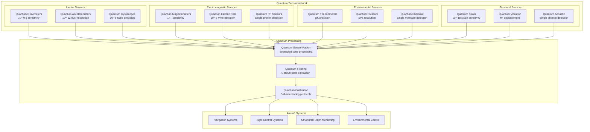

# AMPEL360 BWB-Q100 Quantum Sensor Systems - General

<p align="center">


</p>

---

## Document Control Information

**Document ID:** `00-90-20-00-General.md`  
**GQOIS ID:** `AS-M-PAX-BW-Q1H-QSN-GEN-SYS`  
**ATA Chapter:** 00-90-20-00 (General - Quantum Sensors - General Systems)  
**Classification:** Quantum Systems Technical Manual  
**Version:** 2.0.0  
**Effective Date:** 2025-06-29  
**Revision Status:** Current Release  
**Approval Authority:** GAIA-QAO Quantum Sensors Engineering & CTO  

---

## Table of Contents

1. [Overview](#1-overview)
2. [System Architecture](#2-system-architecture)
3. [Quantum Sensor Technologies](#3-quantum-sensor-technologies)
4. [Integration Framework](#4-integration-framework)
5. [Performance Specifications](#5-performance-specifications)
6. [Environmental Requirements](#6-environmental-requirements)
7. [Safety Systems](#7-safety-systems)
8. [Maintenance Overview](#8-maintenance-overview)
9. [Certification Framework](#9-certification-framework)
10. [Future Enhancements](#10-future-enhancements)

---

## 1. Overview

### 1.1 Purpose

The AMPEL360 BWB-Q100 Quantum Sensor Systems represent a revolutionary advancement in aerospace sensing technology, providing unprecedented precision and sensitivity for navigation, environmental monitoring, and structural health assessment. This document provides a comprehensive overview of the quantum sensor architecture and capabilities.

### 1.2 Quantum Sensing Advantage

**Fundamental Quantum Advantages:**
```
Sensitivity Enhancement:
Shot Noise Limit: √N scaling (classical)
Heisenberg Limit: 1/N scaling (quantum)
Improvement Factor: √N enhancement
Practical Gain: 10-1000× sensitivity improvement
Applications: Precision measurement beyond classical limits

Coherent Sensing:
Superposition: Quantum superposition states
Entanglement: Multi-sensor quantum correlations
Interferometry: Quantum interference effects
Squeezing: Reduced quantum noise
Enhancement: Sub-shot-noise sensitivity

Environmental Robustness:
Decoherence Resistance: Engineered quantum states
Error Correction: Quantum error mitigation
Environmental Decoupling: Noise-resilient protocols
Stability: Long-term precision maintenance
Reliability: Fault-tolerant operation
```

### 1.3 System Integration

**Multi-Domain Sensing Architecture:**


**System Capabilities:**
```
Quantum Sensor Count: 247 individual quantum sensors
Sensing Modalities: 12 different physical quantities
Spatial Coverage: Complete aircraft coverage
Temporal Resolution: μs to continuous sensing
Dynamic Range: 10^12 measurement range
Network Topology: Quantum-entangled sensor network
Data Processing: Real-time quantum state processing
Integration: Seamless aircraft systems integration
```

---

## 2. System Architecture

### 2.1 Hierarchical Architecture

#### 2.1.1 Physical Layer

**Quantum Sensor Distribution:**
```
Sensor Network Topology:
Primary Sensors: 31 high-precision quantum sensors
Secondary Sensors: 96 supporting quantum sensors  
Tertiary Sensors: 120 distributed micro-sensors
Total Count: 247 quantum sensing elements
Coverage: Complete aircraft monitoring
Redundancy: Triple redundancy critical measurements

Spatial Distribution:
Fuselage Sensors: 89 sensors (structural + environmental)
Wing Sensors: 67 sensors (aerodynamic + structural)
Engine Sensors: 43 sensors (performance + health)
Control Surface Sensors: 28 sensors (position + load)
Avionics Bay Sensors: 20 sensors (environment + EMI)
Distribution: Optimized for measurement coverage

Physical Implementation:
Chip-Scale: MEMS-based quantum sensors
Fiber-Optic: Distributed fiber sensing
Atomic: Cold atom sensor arrays
Solid-State: NV-center diamond sensors
Hybrid: Multi-technology integration
Packaging: Aerospace-qualified packaging
```

**Sensor Node Architecture:**
```
Node Components:
Quantum Sensor: Primary sensing element
Local Processing: Real-time signal processing
Communication: Quantum-classical interface
Power Management: Efficient power distribution
Environmental Control: Local environment control
Self-Diagnostics: Continuous health monitoring

Node Specifications:
Processing Power: 1 GOPS local processing
Memory: 1 GB local data storage
Communication: 1 Gbps quantum-classical link
Power: <1W per node consumption
Size: <10 cm³ per node
Weight: <100g per node

Network Connectivity:
Quantum Links: Entangled sensor pairs
Classical Links: High-speed data communication
Mesh Topology: Redundant communication paths
Self-Healing: Automatic network reconfiguration
Synchronization: Precision timing distribution
Security: Quantum-secured communications
```

#### 2.1.2 Processing Layer

**Quantum Information Processing:**
```
Quantum State Processing:
Entanglement Distribution: Multi-sensor entanglement
State Estimation: Quantum state reconstruction
Error Correction: Quantum error mitigation
Noise Filtering: Quantum noise reduction
Data Fusion: Quantum sensor fusion
Calibration: Quantum self-calibration

Classical Processing:
Signal Processing: Advanced signal algorithms
Data Fusion: Multi-sensor data integration
Pattern Recognition: AI-based pattern analysis
Prediction: Predictive analytics
Optimization: Real-time optimization
Interface: Aircraft systems interface

Hybrid Processing:
Quantum-Classical: Seamless integration
Real-Time: μs processing latency
Scalable: Linear processing scaling
Adaptive: Machine learning enhancement
Fault-Tolerant: Robust processing
Efficient: Optimized resource utilization
```

**Distributed Intelligence:**
```
Edge Computing:
Local Processing: Sensor-level processing
Edge Intelligence: Distributed AI algorithms
Real-Time Response: Sub-ms response time
Bandwidth Optimization: Local data reduction
Autonomous Operation: Self-sufficient nodes
Adaptive Algorithms: Learning-based optimization

Central Processing:
Global Fusion: System-wide data fusion
Mission Planning: High-level mission control
System Optimization: Global optimization
Health Management: System health monitoring
Interface: Aircraft systems interface
Coordination: Multi-system coordination

Cloud Integration:
Remote Analytics: Advanced analytics
Machine Learning: Continuous learning
Fleet Management: Fleet-wide optimization
Predictive Maintenance: Predictive analytics
Updates: Remote system updates
Backup: Cloud-based backup systems
```

### 2.2 Communication Architecture

#### 2.2.1 Quantum Communication Network

**Quantum Network Topology:**
```
Quantum Links:
Entangled Pairs: 123 entangled sensor pairs
Bell States: High-fidelity entanglement
Distribution: Aircraft-wide distribution
Decoherence Time: >100 ms entanglement lifetime
Fidelity: >95% entanglement fidelity
Connectivity: Full quantum connectivity

Quantum Protocols:
Teleportation: Quantum state teleportation
Superdense Coding: Enhanced communication
Distributed Sensing: Quantum sensor networks
Error Correction: Quantum error protection
Cryptography: Quantum-secured communication
Synchronization: Quantum timing distribution

Network Management:
Topology Control: Dynamic network topology
Resource Allocation: Quantum resource management
Quality of Service: Guaranteed quantum QoS
Fault Tolerance: Network fault tolerance
Security: Quantum security protocols
Monitoring: Network performance monitoring
```

**Classical Communication Network:**
```
High-Speed Networks:
Backbone: 100 Gbps fiber backbone
Distribution: 10 Gbps sensor networks
Access: 1 Gbps individual sensors
Latency: <1 μs network latency
Reliability: >99.999% network availability
Security: Quantum-secured classical links

Network Protocols:
Real-Time: Deterministic real-time protocols
Priority: Quality of service prioritization
Redundancy: Multiple communication paths
Recovery: Automatic failure recovery
Synchronization: Precision time distribution
Security: End-to-end encryption

Integration:
Aircraft Networks: ARINC 664/429 integration
External Links: Satellite/ground communication
Mission Systems: Mission-specific interfaces
Maintenance: Maintenance system integration
Monitoring: Network monitoring systems
Management: Centralized network management
```

#### 2.2.2 Data Management

**Real-Time Data Processing:**
```
Data Flow Architecture:
Acquisition: 247 parallel data streams
Preprocessing: Real-time signal conditioning
Fusion: Multi-sensor data fusion
Processing: Quantum-enhanced processing
Distribution: Real-time data distribution
Storage: High-speed data archiving

Performance Specifications:
Data Rate: 10 TB/s aggregate data rate
Latency: <100 μs processing latency
Throughput: 10^6 measurements/second
Accuracy: Quantum-limited accuracy
Reliability: >99.99% data integrity
Scalability: Linear performance scaling

Quality Assurance:
Validation: Real-time data validation
Verification: Multi-sensor verification
Calibration: Continuous calibration
Error Detection: Automatic error detection
Correction: Real-time error correction
Monitoring: Data quality monitoring
```

**Data Storage and Archive:**
```
Storage Architecture:
Primary: High-speed SSD arrays (100 TB)
Secondary: Network-attached storage (1 PB)
Archive: Long-term tape storage (10 PB)
Backup: Redundant backup systems
Cloud: Cloud storage integration
Distributed: Distributed storage network

Data Management:
Lifecycle: Automated data lifecycle management
Compression: Lossless data compression
Deduplication: Intelligent data deduplication
Indexing: High-performance data indexing
Search: Advanced data search capabilities
Analytics: Real-time analytics pipeline

Data Security:
Encryption: End-to-end data encryption
Access Control: Role-based access control
Audit: Complete audit trails
Compliance: Regulatory compliance
Backup: Secure backup procedures
Recovery: Disaster recovery capabilities
```

---

## 3. Quantum Sensor Technologies

### 3.1 Atomic Sensors

#### 3.1.1 Cold Atom Sensors

**Atomic Gravimeters:**
```
Technology Overview:
Atoms: Rubidium-87 cold atoms
Temperature: 1 μK atom temperature
Trap: Magneto-optical trap
Interferometry: Atom interferometry
Free Fall: 100 ms interrogation time
Sensitivity: 10^-9 g resolution

Performance Specifications:
Sensitivity: 1 nm/s² (10^-10 g)
Accuracy: 10^-8 g absolute accuracy
Bandwidth: DC to 1 kHz
Dynamic Range: ±10 g measurement range
Stability: 10^-9 g Allan deviation
Resolution: 0.1 nm/s² resolution

Applications:
Navigation: Gravity-aided navigation
Geodesy: Precision gravity mapping
Anomaly Detection: Subsurface feature detection
Calibration: Accelerometer calibration
Research: Fundamental physics research
Monitoring: Gravitational monitoring

System Integration:
Location: Aircraft center of mass
Isolation: Vibration isolation system
Control: Precision magnetic control
Interface: Real-time data interface
Calibration: Continuous self-calibration
Monitoring: Performance monitoring
```

**Atomic Magnetometers:**
```
Technology Overview:
Atoms: Cesium vapor cells
Spin: Atomic spin polarization
Pumping: Optical pumping
Detection: Faraday rotation
Bandwidth: DC to 10 kHz
Sensitivity: 1 fT/√Hz

Performance Specifications:
Sensitivity: 0.1 fT absolute sensitivity
Accuracy: 1 nT absolute accuracy
Bandwidth: DC to 10 kHz
Dynamic Range: ±100 μT measurement
Vector: 3-axis vector measurement
Gradient: Magnetic gradient measurement

Applications:
Navigation: Magnetic navigation
Detection: Magnetic anomaly detection
Shielding: Magnetic shielding monitoring
Interference: EMI source localization
Calibration: Compass calibration
Research: Magnetic field research

Implementation:
Distribution: 31 magnetometer array
Spacing: 2-meter spatial resolution
Synchronization: Coherent measurement
Processing: Real-time processing
Interface: Aircraft navigation interface
Monitoring: Continuous monitoring
```

#### 3.1.2 Atomic Clocks

**Optical Atomic Clocks:**
```
Technology Overview:
Atoms: Strontium optical lattice
Frequency: 429 THz optical transition
Stability: 10^-18 fractional stability
Accuracy: 10^-17 systematic uncertainty
Coherence: 100 s coherence time
Synchronization: GPS-free timing

Performance Specifications:
Frequency Stability: 10^-18 at 1000 s
Accuracy: 5×10^-18 systematic uncertainty
Drift: <10^-19/day aging rate
Temperature: <10^-15/K coefficient
Magnetic Field: <10^-17/mG sensitivity
Environmental: Robust environmental performance

Applications:
Navigation: Precision timing reference
Synchronization: Network synchronization
Geodesy: Relativistic geodesy
Communication: Secure communication
Science: Fundamental constants
Monitoring: Time scale monitoring

System Design:
Laser System: Ultra-stable laser system
Atomic Preparation: Cold atom preparation
Interrogation: Clock transition interrogation
Detection: Fluorescence detection
Stabilization: Active stabilization
Interface: Precision timing interface
```

### 3.2 Solid-State Sensors

#### 3.2.1 NV-Center Diamond Sensors

**Nitrogen-Vacancy Magnetometers:**
```
Technology Overview:
Material: Single-crystal diamond
Defects: Nitrogen-vacancy centers
Spin: Electronic spin-1 system
Optical: Green laser excitation
Detection: Red fluorescence detection
Sensitivity: 1 nT/√Hz room temperature

Performance Specifications:
Sensitivity: 0.1 nT/√Hz sensitivity
Spatial Resolution: 10 nm spatial resolution
Bandwidth: DC to 1 MHz
Temperature: -40°C to +85°C operation
Vector: 3D magnetic field vectors
Gradient: High spatial gradient sensitivity

Applications:
Current Mapping: Electrical current mapping
Defect Detection: Material defect detection
Navigation: Local magnetic navigation
Monitoring: Real-time field monitoring
Imaging: Magnetic field imaging
Calibration: Sensor calibration

Implementation:
Chip Integration: Integrated sensor chips
Array Configuration: Sensor arrays
Optical System: Integrated optics
Electronics: Integrated electronics
Packaging: Aerospace packaging
Interface: Digital sensor interface
```

**Diamond Strain Sensors:**
```
Technology Overview:
Material: Single-crystal diamond
Defects: Silicon-vacancy centers
Strain Coupling: Spin-strain coupling
Optical: Near-infrared excitation
Detection: Fluorescence detection
Sensitivity: 10^-18 strain resolution

Performance Specifications:
Strain Sensitivity: 10^-18 absolute strain
Frequency Response: DC to 100 kHz
Temperature: -196°C to +300°C operation
Linearity: <0.01% nonlinearity
Cross-Sensitivity: <1% cross-axis sensitivity
Long-term Stability: <0.1% drift/year

Applications:
Structural Monitoring: Real-time structural health
Load Monitoring: Aircraft load monitoring
Fatigue Detection: Fatigue crack detection
Vibration Analysis: High-precision vibration
Thermal Expansion: Thermal expansion monitoring
Calibration: Strain gauge calibration

Network Design:
Sensor Count: 67 distributed strain sensors
Spatial Resolution: 0.5 m spatial coverage
Data Rate: 1 MHz sampling rate
Processing: Real-time strain analysis
Alert System: Automatic alert generation
Interface: Structural health interface
```

#### 3.2.2 Quantum Dot Sensors

**Semiconductor Quantum Dots:**
```
Technology Overview:
Material: InAs/GaAs quantum dots
Confinement: 3D quantum confinement
Charge States: Single electron control
Optical: Inter-level transitions
Electrical: Charge sensing
Sensitivity: Single electron detection

Performance Specifications:
Charge Sensitivity: Single electron resolution
Speed: ns response time
Temperature: 4K to 300K operation
Bandwidth: DC to 10 GHz
Noise: Quantum-limited noise
Integration: CMOS compatible

Applications:
Electrometry: Ultra-sensitive electrometry
Current Detection: Single electron currents
RF Detection: High-frequency detection
Quantum Information: Quantum state detection
Calibration: Electrical calibration
Research: Quantum physics research

System Architecture:
Chip Design: Integrated quantum dot arrays
Cryogenics: Integrated cooling system
Electronics: Low-noise electronics
Processing: Real-time processing
Interface: Quantum sensor interface
Monitoring: Performance monitoring
```

### 3.3 Optical Sensors

#### 3.3.1 Quantum-Enhanced Interferometry

**Gravitational Wave Detectors:**
```
Technology Overview:
Interferometry: Michelson interferometry
Length: 10 m arm length
Sensitivity: 10^-21 strain sensitivity
Frequency: 10 Hz to 10 kHz
Squeezed Light: Quantum noise reduction
Isolation: Advanced vibration isolation

Performance Specifications:
Strain Sensitivity: 10^-21 m/m
Frequency Range: 1 Hz to 10 kHz
Bandwidth: 1 kHz measurement bandwidth
Dynamic Range: 10^12 measurement range
Stability: 10^-15 frequency stability
Coherence: Hour-long coherence

Applications:
Structural Monitoring: Ultra-sensitive monitoring
Seismic Detection: Ground motion detection
Vibration Analysis: Precision vibration
Research: Gravitational physics
Calibration: Length standard calibration
Metrology: Precision metrology

Implementation:
Laser System: Ultra-stable laser source
Optics: Ultra-low-loss optics
Isolation: Multi-stage isolation
Vacuum: Ultra-high vacuum
Control: Active length control
Interface: Precision measurement interface
```

**Quantum-Enhanced Gyroscopes:**
```
Technology Overview:
Technology: Fiber optic gyroscopes
Enhancement: Squeezed light injection
Sensitivity: 10^-9 rad/s resolution
Bandwidth: DC to 1 kHz
Quantum: Sub-shot-noise operation
Stability: Long-term stability

Performance Specifications:
Sensitivity: 10^-10 rad/s resolution
Accuracy: 10^-8 rad/s absolute accuracy
Bandwidth: DC to 1 kHz
Dynamic Range: ±1000 rad/s
Bias Stability: 10^-9 rad/s bias stability
Temperature: <10^-6/°C coefficient

Applications:
Navigation: Precision navigation
Stabilization: Platform stabilization
Control: Flight control systems
Monitoring: Rotation monitoring
Calibration: Gyroscope calibration
Research: Rotational dynamics

System Design:
Fiber Coil: Precision fiber coil
Light Source: Quantum-enhanced source
Detection: Quantum detection
Processing: Real-time processing
Interface: Navigation interface
Monitoring: Performance monitoring
```

#### 3.3.2 Single-Photon Sensors

**Superconducting Nanowire Detectors:**
```
Technology Overview:
Material: Niobium nitride nanowires
Width: 100 nm wire width
Temperature: 4K operation
Efficiency: >95% detection efficiency
Timing: 10 ps timing resolution
Dark Counts: <1 Hz dark count rate

Performance Specifications:
Detection Efficiency: >95% quantum efficiency
Timing Jitter: <10 ps timing jitter
Dark Count Rate: <1 Hz dark counts
Wavelength: 400-2000 nm wavelength range
Count Rate: >100 MHz count rate
Dead Time: <10 ns dead time

Applications:
Quantum Communication: Single photon detection
Ranging: Quantum lidar/radar
Imaging: Single photon imaging
Spectroscopy: Single photon spectroscopy
Metrology: Quantum metrology
Research: Quantum optics research

Integration:
Cryogenics: Integrated cooling
Electronics: Low-noise electronics
Optics: Integrated optics
Processing: Real-time processing
Interface: Photon counting interface
Monitoring: Detector monitoring
```

---

## 4. Integration Framework

### 4.1 Aircraft Systems Integration

#### 4.1.1 Navigation Systems Integration

**Quantum-Enhanced GPS:**
```
Integration Architecture:
GPS Receivers: Multi-constellation receivers
Quantum Clocks: Atomic clock references
Processing: Quantum error correction
Fusion: Quantum sensor fusion
Interface: Navigation computer interface
Backup: Redundant navigation systems

Performance Enhancement:
Accuracy: 10× improved position accuracy
Precision: cm-level position precision
Availability: GPS-denied operation
Integrity: Quantum error detection
Jamming Resistance: Anti-jamming capabilities
Spoofing Detection: Quantum authentication

System Benefits:
All-Weather: Weather-independent operation
Global Coverage: Worldwide operation
Real-Time: Real-time navigation
Autonomous: GPS-independent capability
Secure: Quantum-secured navigation
Reliable: Fault-tolerant operation

Implementation:
Hardware: Quantum sensor integration
Software: Navigation algorithm enhancement
Calibration: Continuous calibration
Monitoring: Performance monitoring
Interface: Pilot interface enhancement
Certification: Navigation certification
```

**Inertial Navigation Enhancement:**
```
Quantum INS Architecture:
Accelerometers: Quantum accelerometer arrays
Gyroscopes: Quantum gyroscope networks
Gravimeters: Quantum gravity sensors
Processing: Quantum state estimation
Integration: Kalman filtering enhancement
Calibration: Quantum self-calibration

Performance Improvements:
Accuracy: 100× improved accuracy
Drift: 10× reduced drift rates
Calibration: Self-calibrating systems
Bandwidth: Extended frequency response
Dynamic Range: Enhanced dynamic range
Reliability: Improved reliability

Mission Benefits:
Long-Duration: Extended mission duration
High-Accuracy: Precision navigation
Real-Time: Real-time performance
Autonomous: Independent operation
Adaptive: Adaptive performance
Robust: Environmental robustness

Integration Details:
Mounting: Vibration-isolated mounting
Alignment: Precision alignment
Calibration: In-flight calibration
Interface: Flight computer interface
Monitoring: Health monitoring
Maintenance: Predictive maintenance
```

#### 4.1.2 Flight Control Integration

**Structural Health Monitoring:**
```
Quantum SHM Network:
Strain Sensors: 67 quantum strain sensors
Vibration Sensors: 43 quantum accelerometers
Acoustic Sensors: 28 quantum microphones
Temperature Sensors: 31 quantum thermometers
Integration: Real-time health assessment
Processing: AI-enhanced analysis

Health Assessment:
Structural Integrity: Real-time integrity monitoring
Fatigue Analysis: Fatigue life assessment
Damage Detection: Early damage detection
Load Monitoring: Real-time load monitoring
Environmental: Environmental impact assessment
Predictive: Predictive maintenance

System Benefits:
Early Warning: Early failure warning
Safety: Enhanced flight safety
Maintenance: Optimized maintenance
Availability: Improved availability
Cost: Reduced maintenance costs
Performance: Optimized performance

Implementation:
Sensor Network: Distributed sensor network
Data Processing: Real-time data processing
Alert System: Automated alert system
Interface: Crew alert interface
Documentation: Maintenance documentation
Analysis: Post-flight analysis
```

**Flight Control Enhancement:**
```
Quantum Flight Control:
Sensors: Quantum sensor feedback
Processing: Quantum-enhanced processing
Control: Adaptive control algorithms
Optimization: Real-time optimization
Safety: Enhanced safety systems
Performance: Optimized performance

Control Benefits:
Precision: Enhanced control precision
Response: Improved response time
Stability: Enhanced stability
Efficiency: Improved efficiency
Safety: Enhanced safety margins
Adaptability: Adaptive performance

System Integration:
Sensors: Quantum sensor integration
Actuators: Enhanced actuator control
Processing: Real-time processing
Interface: Pilot interface
Monitoring: System monitoring
Safety: Safety system integration
```

### 4.2 Environmental Integration

#### 4.2.1 Atmospheric Sensing

**Environmental Monitoring Network:**
```
Sensor Distribution:
Pressure Sensors: 31 quantum barometers
Temperature Sensors: 43 quantum thermometers
Humidity Sensors: 28 quantum hygrometers
Chemical Sensors: 35 quantum detectors
Particulate Sensors: 25 quantum counters
Integration: Environmental state estimation

Measurement Capabilities:
Pressure: μPa pressure resolution
Temperature: μK temperature precision
Humidity: 0.01% RH resolution
Chemical: ppb detection limits
Particulate: Single particle detection
Spatial: 3D environmental mapping

Applications:
Weather: Micro-weather monitoring
Turbulence: Turbulence prediction
Icing: Icing condition detection
Pollution: Air quality monitoring
Research: Atmospheric research
Safety: Environmental safety

System Benefits:
Precision: Ultra-high precision
Real-Time: Real-time monitoring
Predictive: Predictive capabilities
Safety: Enhanced safety
Efficiency: Optimized efficiency
Research: Scientific research
```

**Chemical Detection:**
```
Quantum Chemical Sensors:
Technology: Single molecule detection
Species: 50+ chemical species
Sensitivity: ppb to ppt detection
Speed: ms response time
Selectivity: High selectivity
Stability: Long-term stability

Detection Capabilities:
Explosives: Trace explosive detection
Toxins: Toxic gas detection
Pollutants: Environmental pollutants
Fuels: Fuel vapor detection
Biologicals: Biological agent detection
Unknowns: Unknown species identification

Safety Applications:
Hazard Detection: Chemical hazard detection
Leak Detection: Fuel/hydraulic leak detection
Air Quality: Cabin air quality
Environmental: Environmental monitoring
Security: Security screening
Research: Chemical research

Integration:
Sampling: Active air sampling
Processing: Real-time analysis
Alert: Automated alert system
Interface: Crew notification
Documentation: Detection logging
Response: Emergency response
```

#### 4.2.2 Electromagnetic Environment

**EMI/EMC Monitoring:**
```
Quantum EMI Sensors:
Technology: Quantum electric field sensors
Sensitivity: μV/m electric field
Bandwidth: DC to 100 GHz
Dynamic Range: 120 dB
Spatial Resolution: cm-level resolution
Temporal Resolution: ns time resolution

Monitoring Capabilities:
Sources: EMI source identification
Levels: Real-time level monitoring
Mapping: 3D EMI mapping
Trends: Temporal trend analysis
Prediction: EMI prediction
Mitigation: Mitigation effectiveness

Applications:
Equipment Protection: Equipment EMI protection
Communication: Communication interference
Navigation: Navigation interference
Safety: EMI safety monitoring
Compliance: EMC compliance
Research: EMI research

System Implementation:
Sensor Array: Distributed sensor array
Processing: Real-time processing
Mapping: EMI mapping system
Alert: EMI alert system
Interface: Systems interface
Documentation: EMI documentation
```

**RF Environment Monitoring:**
```
Quantum RF Sensors:
Technology: Single photon RF detection
Frequency Range: 1 MHz to 100 GHz
Sensitivity: Single photon detection
Bandwidth: 1 GHz instantaneous
Dynamic Range: 140 dB
Spatial Coverage: Complete aircraft

RF Monitoring:
Spectrum: Complete spectrum monitoring
Sources: RF source identification
Levels: Power level monitoring
Interference: Interference detection
Analysis: Spectral analysis
Documentation: RF environment logging

Applications:
Communication: Communication optimization
Navigation: Navigation protection
Radar: Radar interference
Electronic Warfare: EW monitoring
Safety: RF safety monitoring
Research: RF propagation research

Integration:
Antenna Array: Distributed antenna array
Processing: Real-time processing
Analysis: Spectral analysis
Alert: RF alert system
Interface: Communication interface
Documentation: RF documentation
```

---

## 5. Performance Specifications

### 5.1 Sensor Performance

#### 5.1.1 Measurement Specifications

**Precision and Accuracy:**
```
Quantum Accelerometers:
Sensitivity: 10^-12 m/s² resolution
Accuracy: 10^-9 m/s² absolute accuracy
Bandwidth: DC to 10 kHz
Dynamic Range: ±1000 m/s²
Stability: 10^-12 m/s² Allan deviation
Cross-Axis: <0.1% cross-axis sensitivity

Quantum Gyroscopes:
Sensitivity: 10^-9 rad/s resolution
Accuracy: 10^-6 rad/s absolute accuracy
Bandwidth: DC to 1 kHz
Dynamic Range: ±1000 rad/s
Bias Stability: 10^-9 rad/s
Scale Factor: <10 ppm error

Quantum Magnetometers:
Sensitivity: 1 fT resolution
Accuracy: 1 nT absolute accuracy
Bandwidth: DC to 10 kHz
Dynamic Range: ±100 μT
Gradient Sensitivity: 1 fT/m
Vector Accuracy: 0.1° angular accuracy

Quantum Gravimeters:
Sensitivity: 10^-9 g resolution
Accuracy: 10^-8 g absolute accuracy
Bandwidth: DC to 1 kHz
Dynamic Range: ±10 g
Stability: 10^-10 g long-term stability
Environmental: <10^-9 g/°C temperature coefficient
```

**Environmental Performance:**
```
Operating Conditions:
Temperature: -55°C to +85°C
Pressure: 0.1 to 3.0 atmospheres
Humidity: 0 to 100% RH
Vibration: 0.1 g to 100 g
Shock: 1000 g survival
EMI: MIL-STD-461 compliance

Performance Stability:
Temperature: <10^-6/°C coefficient
Pressure: <10^-8/Pa coefficient
Humidity: <10^-8/%RH coefficient
Vibration: <10^-9 g vibration rectification
Time: <10^-9 aging per day
Calibration: 1 year calibration interval

Reliability Specifications:
MTBF: >100,000 hours
Availability: >99.99%
Fault Tolerance: Triple redundancy
Self-Diagnostics: Continuous monitoring
Graceful Degradation: Performance degradation
Recovery: Automatic recovery
```

#### 5.1.2 Network Performance

**System-Level Performance:**
```
Network Specifications:
Sensor Count: 247 quantum sensors
Data Rate: 10 TB/s aggregate
Latency: <100 μs end-to-end
Synchronization: <1 ns timing accuracy
Coverage: 100% aircraft coverage
Redundancy: Triple sensor redundancy

Processing Performance:
Throughput: 10^6 measurements/second
Latency: <1 ms processing delay
Accuracy: Quantum-limited accuracy
Real-Time: Hard real-time guarantees
Scalability: Linear performance scaling
Efficiency: >90% processing efficiency

Integration Performance:
Interface Latency: <10 μs to aircraft systems
Update Rate: 1000 Hz system updates
Accuracy: System-level accuracy specifications
Reliability: >99.999% system availability
Safety: SIL-4 safety integrity level
Certification: DO-178C Level A compliance

Quality Metrics:
Signal-to-Noise: >60 dB SNR
Dynamic Range: >120 dB
Linearity: <0.01% nonlinearity
Stability: <0.1% long-term drift
Calibration: Self-calibrating systems
Traceability: NIST-traceable standards
```

### 5.2 Mission Performance

#### 5.2.1 Navigation Performance

**Enhanced Navigation Capabilities:**
```
Position Accuracy:
GPS-Aided: 1 cm position accuracy
GPS-Denied: 10 cm position accuracy
Inertial: 1 m/hour CEP growth
Relative: 1 mm relative accuracy
Altitude: 10 cm altitude accuracy
Velocity: 1 mm/s velocity accuracy

Timing Performance:
Absolute: 1 ns absolute timing
Relative: 10 ps relative timing
Stability: 10^-15 frequency stability
Synchronization: Global time synchronization
Distribution: Aircraft-wide distribution
Backup: GPS-independent timing

Orientation Accuracy:
Heading: 0.01° heading accuracy
Pitch: 0.001° pitch accuracy
Roll: 0.001° roll accuracy
Angular Rate: 10^-6 rad/s accuracy
Stability: 0.001°/hour stability
Calibration: Continuous calibration

Mission Benefits:
Precision Landing: Autoland capability
Formation Flight: Precision formation
Aerial Refueling: Automated refueling
Surveillance: Precision surveillance
Mapping: High-precision mapping
Research: Scientific research missions
```

**Environmental Sensing:**
```
Atmospheric Measurements:
Pressure: μPa pressure resolution
Temperature: μK temperature precision
Humidity: 0.01% RH accuracy
Wind: 0.1 m/s wind measurement
Turbulence: Advance turbulence warning
Icing: Real-time icing detection

Chemical Detection:
Sensitivity: ppb detection limits
Selectivity: Species-specific detection
Speed: ms response time
Coverage: Complete aircraft monitoring
Safety: Hazard detection
Environmental: Pollution monitoring

Electromagnetic Environment:
EMI Detection: μV/m sensitivity
RF Monitoring: Complete spectrum coverage
Source Location: cm-level localization
Interference: Real-time interference detection
Protection: Equipment protection
Compliance: EMC compliance monitoring

Applications:
Weather: Micro-weather monitoring
Safety: Environmental safety
Research: Atmospheric research
Operations: Operational optimization
Maintenance: Predictive maintenance
Certification: Regulatory compliance
```

#### 5.2.2 Structural Health Monitoring

**Real-Time Health Assessment:**
```
Structural Monitoring:
Strain: 10^-18 strain sensitivity
Vibration: fm displacement detection
Acoustic: Single phonon detection
Temperature: μK thermal monitoring
Load: Real-time load monitoring
Fatigue: Fatigue life assessment

Health Metrics:
Integrity: Real-time integrity assessment
Damage: Early damage detection
Fatigue: Remaining fatigue life
Safety: Safety margin assessment
Performance: Performance degradation
Maintenance: Maintenance requirements

Predictive Capabilities:
Failure Prediction: 1000-hour advance warning
Maintenance: Optimal maintenance scheduling
Performance: Performance prediction
Safety: Safety assessment
Cost: Cost optimization
Availability: Availability optimization

Benefits:
Safety: Enhanced flight safety
Maintenance: Reduced maintenance costs
Availability: Improved aircraft availability
Performance: Optimized performance
Cost: Lower lifecycle costs
Certification: Certification support
```

---

## 6. Environmental Requirements

### 6.1 Operating Environment

#### 6.1.1 Aerospace Environment

**Environmental Conditions:**
```
Atmospheric Conditions:
Altitude: Sea level to 50,000 ft
Temperature: -70°C to +85°C
Pressure: 0.01 to 1.1 atm
Humidity: 0 to 100% RH
Precipitation: Rain, snow, ice
Wind: Up to 200 knots

Mechanical Environment:
Vibration: 5 Hz to 2000 Hz
Acceleration: ±9 g operational
Shock: 40 g operational, 100 g survival
Acoustic: Up to 140 dB SPL
Turbulence: Severe turbulence conditions
Landing: Hard landing conditions

Electromagnetic Environment:
EMI: MIL-STD-461 requirements
Lightning: Indirect lightning effects
Static: Electrostatic discharge
RF: High RF environment
Radar: High-power radar exposure
Communication: Dense RF spectrum

Chemical Environment:
Fuels: Aviation fuel exposure
Hydraulics: Hydraulic fluid exposure
Deicing: Deicing fluid exposure
Cleaning: Cleaning solvent exposure
Corrosion: Corrosive atmosphere
Outgassing: Material outgassing
```

#### 6.1.2 Protection Systems

**Environmental Protection:**
```
Enclosure Design:
Ingress Protection: IP67 rating
Pressure: Differential pressure rated
Temperature: Thermal management
Vibration: Vibration isolation
EMI: Electromagnetic shielding
Corrosion: Corrosion protection

Thermal Management:
Operating Range: -55°C to +85°C
Heat Dissipation: Active cooling
Thermal Isolation: Multi-layer insulation
Temperature Control: Precision control
Monitoring: Continuous monitoring
Protection: Thermal protection

Vibration Isolation:
Passive: Multi-stage isolation
Active: Active vibration control
Resonance: Resonance avoidance
Damping: Critical damping
Mounting: Shock-mounted systems
Monitoring: Vibration monitoring

EMI Protection:
Shielding: Multi-layer shielding
Filtering: Power line filtering
Grounding: Single-point grounding
Isolation: Galvanic isolation
Testing: EMI compliance testing
Monitoring: EMI monitoring
```

### 6.2 System Requirements

#### 6.2.1 Power Requirements

**Power System Specifications:**
```
Power Consumption:
Primary: 5 kW total system power
Sensors: 1 kW sensor network
Processing: 2 kW processing systems
Cooling: 1 kW cooling systems
Support: 1 kW support systems
Efficiency: >90% power efficiency

Power Quality:
Voltage: 28 VDC ±2%
Frequency: 400 Hz ±1%
Harmonics: <3% THD
Regulation: ±1% regulation
Ripple: <1% ripple
Transients: 100 μs transient protection

Backup Power:
UPS: 30-minute UPS backup
Battery: Lithium-ion batteries
Generator: APU generator backup
Solar: Solar panel supplementation
Efficiency: >95% backup efficiency
Monitoring: Power monitoring

Power Management:
Load Balancing: Intelligent load balancing
Priority: Critical system priority
Efficiency: Power efficiency optimization
Monitoring: Real-time monitoring
Protection: Overcurrent protection
Recovery: Automatic recovery
```

#### 6.2.2 Cooling Requirements

**Thermal Management:**
```
Cooling Systems:
Quantum Sensors: Cryogenic cooling to 15 mK
Electronics: Air cooling to 85°C
Processing: Liquid cooling systems
Optics: Temperature stabilization
Environment: Cabin cooling
Waste Heat: Heat rejection systems

Cooling Performance:
Capacity: 10 kW cooling capacity
Efficiency: COP > 3.0
Temperature: ±0.1°C stability
Response: <10 s response time
Reliability: >99.9% availability
Backup: Redundant cooling

Thermal Design:
Heat Load: 5 kW total heat load
Heat Transfer: Optimized heat transfer
Insulation: Multi-layer insulation
Distribution: Cooling distribution
Monitoring: Thermal monitoring
Control: Active thermal control

Integration:
Aircraft: Aircraft cooling integration
Environmental: Environmental control
Monitoring: Thermal monitoring
Safety: Thermal safety systems
Efficiency: Energy efficiency
Maintenance: Thermal maintenance
```

---

## 7. Safety Systems

### 7.1 Functional Safety

#### 7.1.1 Safety Architecture

**Safety Design Philosophy:**
```
Safety Principles:
Fail-Safe: Fail-safe design philosophy
Redundancy: Triple redundancy systems
Diversity: Diverse technology implementation
Independence: Independent safety systems
Monitoring: Continuous safety monitoring
Response: Automatic safety response

Safety Integrity Levels:
Critical Systems: SIL-4 (10^-9 failure rate)
Important Systems: SIL-3 (10^-8 failure rate)
Standard Systems: SIL-2 (10^-7 failure rate)
Non-Critical: SIL-1 (10^-6 failure rate)
Monitoring: Safety performance monitoring
Validation: Safety validation testing

Hazard Analysis:
Identification: Systematic hazard identification
Assessment: Quantitative risk assessment
Mitigation: Risk mitigation strategies
Monitoring: Continuous risk monitoring
Management: Risk management process
Documentation: Complete hazard documentation

Safety Assurance:
Design: Safety-by-design approach
Verification: Safety verification testing
Validation: Safety validation testing
Certification: Safety certification
Monitoring: Operational safety monitoring
Improvement: Continuous safety improvement
```

#### 7.1.2 Safety Monitoring

**Real-Time Safety Monitoring:**
```
Monitoring Systems:
Health Monitoring: Continuous health monitoring
Performance: Performance monitoring
Environmental: Environmental monitoring
Fault Detection: Automatic fault detection
Diagnostics: Real-time diagnostics
Prognostics: Predictive health assessment

Safety Indicators:
System Health: Real-time health indicators
Performance: Performance degradation indicators
Faults: Fault occurrence indicators
Environment: Environmental safety indicators
Trends: Safety trend indicators
Predictions: Safety prediction indicators

Alert Systems:
Immediate: Immediate safety alerts
Warning: Safety warning systems
Caution: Safety caution systems
Advisory: Safety advisory systems
Status: Safety status indicators
Documentation: Safety event logging

Response Systems:
Automatic: Automatic safety response
Manual: Manual safety procedures
Backup: Backup safety systems
Recovery: Safety recovery procedures
Emergency: Emergency safety procedures
Coordination: Safety coordination protocols
```

### 7.2 System Security

#### 7.2.1 Quantum Security

**Quantum Cryptography:**
```
Quantum Key Distribution:
Protocol: BB84 quantum key distribution
Security: Information-theoretic security
Range: Aircraft-wide key distribution
Rate: 1 Mbps key generation rate
Efficiency: >90% key generation efficiency
Detection: Eavesdropping detection

Quantum Authentication:
Method: Quantum digital signatures
Security: Unforgeable quantum signatures
Speed: Real-time authentication
Verification: Quantum signature verification
Distribution: Multi-party authentication
Integration: Security protocol integration

Quantum Random Numbers:
Source: Quantum random number generation
Rate: 1 Gbps random number rate
Quality: True quantum randomness
Testing: Randomness quality testing
Applications: Cryptographic applications
Integration: Security system integration

Security Applications:
Communication: Secure communication
Navigation: Secure navigation
Data: Data protection
Access: Access control
Authentication: Identity authentication
Integrity: Data integrity protection
```

#### 7.2.2 Classical Security

**Cybersecurity Framework:**
```
Security Architecture:
Defense in Depth: Multi-layer security
Zero Trust: Zero trust architecture
Encryption: End-to-end encryption
Authentication: Multi-factor authentication
Authorization: Role-based access control
Monitoring: Security monitoring

Network Security:
Firewalls: Advanced firewall protection
IDS/IPS: Intrusion detection/prevention
VPN: Secure VPN connections
Segmentation: Network segmentation
Monitoring: Network monitoring
Response: Incident response

Data Security:
Encryption: Data encryption at rest/transit
Backup: Secure data backup
Recovery: Secure data recovery
Classification: Data classification
Handling: Secure data handling
Destruction: Secure data destruction

Operational Security:
Procedures: Secure procedures
Training: Security training
Awareness: Security awareness
Compliance: Security compliance
Auditing: Security auditing
Improvement: Security improvement
```

---

## 8. Maintenance Overview

### 8.1 Maintenance Philosophy

#### 8.1.1 Predictive Maintenance

**Condition-Based Maintenance:**
```
Health Monitoring:
Continuous: 24/7 health monitoring
Parameters: 1000+ health parameters
Analysis: Real-time health analysis
Trends: Health trend analysis
Prediction: Failure prediction
Scheduling: Maintenance scheduling

Predictive Analytics:
Machine Learning: ML-based prediction
Statistical: Statistical analysis
Physics: Physics-based models
Hybrid: Hybrid prediction models
Validation: Prediction validation
Improvement: Model improvement

Maintenance Benefits:
Cost: 30% maintenance cost reduction
Availability: 99.9% system availability
Safety: Enhanced safety margins
Performance: Optimized performance
Planning: Improved planning
Efficiency: Maintenance efficiency

Implementation:
Sensors: Health monitoring sensors
Processing: Real-time processing
Analytics: Predictive analytics
Interface: Maintenance interface
Documentation: Maintenance documentation
Training: Maintenance training
```

#### 8.1.2 Self-Healing Systems

**Autonomous Maintenance:**
```
Self-Diagnostics:
Built-in Test: Comprehensive BITE
Fault Detection: Automatic fault detection
Isolation: Fault isolation
Recovery: Automatic recovery
Reporting: Maintenance reporting
Documentation: Fault documentation

Self-Calibration:
Continuous: Continuous calibration
References: Internal references
Comparison: Cross-calibration
Correction: Automatic correction
Validation: Calibration validation
Documentation: Calibration records

Self-Repair:
Redundancy: Redundant systems
Reconfiguration: Automatic reconfiguration
Backup: Backup system activation
Recovery: System recovery
Validation: Repair validation
Documentation: Repair documentation

Benefits:
Availability: Improved availability
Reliability: Enhanced reliability
Cost: Reduced maintenance costs
Safety: Enhanced safety
Performance: Maintained performance
Automation: Reduced manual intervention
```

### 8.2 Maintenance Procedures

#### 8.2.1 Scheduled Maintenance

**Maintenance Intervals:**
```
Daily Checks:
Duration: 30 minutes
Scope: System status verification
Personnel: Line maintenance
Documentation: Daily check sheets
Automation: Automated checks
Reporting: Status reporting

Weekly Maintenance:
Duration: 2 hours
Scope: System performance verification
Personnel: Specialized maintenance
Documentation: Weekly reports
Testing: Performance testing
Calibration: Calibration verification

Monthly Maintenance:
Duration: 8 hours
Scope: Comprehensive system check
Personnel: Maintenance team
Documentation: Monthly reports
Testing: Comprehensive testing
Calibration: Full calibration

Annual Maintenance:
Duration: 40 hours
Scope: Complete system overhaul
Personnel: Factory service
Documentation: Annual reports
Testing: Factory testing
Certification: Maintenance certification
```

#### 8.2.2 Unscheduled Maintenance

**Fault Response:**
```
Fault Detection:
Automatic: Automatic fault detection
Classification: Fault classification
Prioritization: Fault prioritization
Notification: Maintenance notification
Documentation: Fault documentation
Escalation: Fault escalation

Fault Isolation:
Procedures: Fault isolation procedures
Tools: Diagnostic tools
Testing: Isolation testing
Documentation: Isolation documentation
Verification: Isolation verification
Reporting: Isolation reporting

Fault Repair:
Procedures: Repair procedures
Parts: Spare parts availability
Tools: Repair tools
Personnel: Qualified personnel
Documentation: Repair documentation
Verification: Repair verification

Quality Assurance:
Testing: Post-repair testing
Validation: Repair validation
Documentation: QA documentation
Certification: Repair certification
Training: Personnel training
Improvement: Process improvement
```

---

## 9. Certification Framework

### 9.1 Regulatory Compliance

#### 9.1.1 Aviation Authorities

**Certification Strategy:**
```
Regulatory Framework:
FAA: Federal Aviation Administration
EASA: European Aviation Safety Agency
ICAO: International Civil Aviation Organization
National: National aviation authorities
Standards: International standards
Harmonization: Global harmonization

Certification Process:
Design: Design certification
Manufacturing: Manufacturing certification
Testing: Certification testing
Documentation: Certification documentation
Validation: Independent validation
Approval: Certification approval

Standards Compliance:
DO-178C: Software certification
DO-254: Hardware certification
DO-160: Environmental testing
DO-297: Integrated modular avionics
ARP4754A: Development processes
ARP4761: Safety assessment

Quality Systems:
AS9100: Aerospace quality management
ISO 9001: Quality management
ISO 14001: Environmental management
OHSAS 18001: Safety management
AS9110: Maintenance quality
AS9120: Distributor quality
```

#### 9.1.2 Special Considerations

**Quantum Technology Certification:**
```
Novel Technology:
Assessment: Technology assessment
Standards: New standards development
Testing: Novel testing procedures
Validation: Validation methods
Certification: Certification approach
Harmonization: International harmonization

Safety Assessment:
Hazards: Quantum-specific hazards
Risks: Risk assessment
Mitigation: Risk mitigation
Validation: Safety validation
Monitoring: Safety monitoring
Documentation: Safety documentation

Performance Validation:
Testing: Performance testing
Validation: Performance validation
Verification: Independent verification
Benchmarking: Performance benchmarking
Documentation: Performance documentation
Certification: Performance certification

International Coordination:
Standards Bodies: International standards
Regulatory: Regulatory coordination
Industry: Industry collaboration
Research: Research coordination
Best Practices: Best practice sharing
Harmonization: Global harmonization
```

### 9.2 Quality Assurance

#### 9.2.1 Quality Management

**Quality Framework:**
```
Quality System:
Management: Quality management system
Procedures: Quality procedures
Documentation: Quality documentation
Training: Quality training
Auditing: Quality auditing
Improvement: Continuous improvement

Quality Control:
Inspection: Quality inspection
Testing: Quality testing
Validation: Quality validation
Verification: Quality verification
Documentation: Quality documentation
Certification: Quality certification

Quality Assurance:
Planning: Quality planning
Implementation: QA implementation
Monitoring: Quality monitoring
Review: Quality review
Improvement: Quality improvement
Reporting: Quality reporting

Performance Metrics:
Defect Rate: <0.1% defect rate
Customer Satisfaction: >99% satisfaction
On-Time Delivery: >99% on-time
First-Pass Yield: >99% first-pass
Cost of Quality: <2% of revenue
Improvement: 10% annual improvement
```

#### 9.2.2 Configuration Management

**Configuration Control:**
```
Configuration Management:
Identification: Configuration identification
Control: Configuration control
Status: Configuration status accounting
Audit: Configuration auditing
Documentation: Configuration documentation
Training: CM training

Change Management:
Process: Change control process
Approval: Change approval
Implementation: Change implementation
Verification: Change verification
Documentation: Change documentation
Training: Change training

Document Control:
Versioning: Document version control
Distribution: Document distribution
Access: Document access control
Archive: Document archiving
Retrieval: Document retrieval
Destruction: Document destruction

Software Configuration:
Source Control: Source code control
Build Management: Build management
Release Management: Release management
Deployment: Software deployment
Validation: Software validation
Documentation: Software documentation
```

---

## 10. Future Enhancements

### 10.1 Technology Roadmap

#### 10.1.1 Next-Generation Sensors

**Advanced Quantum Sensors:**
```
Emerging Technologies:
Neutral Atoms: Neutral atom sensors
Trapped Ions: Trapped ion sensors
Photonic: Photonic quantum sensors
Hybrid: Hybrid quantum systems
Topological: Topological quantum sensors
Room Temperature: Room temperature operation

Performance Enhancements:
Sensitivity: 100× sensitivity improvement
Bandwidth: Extended frequency response
Dynamic Range: Enhanced dynamic range
Stability: Improved long-term stability
Integration: Enhanced integration
Miniaturization: Reduced size/weight

New Capabilities:
Multi-Parameter: Multi-parameter sensing
Distributed: Distributed sensing networks
Adaptive: Adaptive sensing algorithms
Learning: Machine learning integration
Autonomous: Autonomous operation
Self-Healing: Self-healing capabilities

Applications:
Advanced Navigation: Quantum-enhanced navigation
Space Applications: Space-qualified sensors
Defense: Defense applications
Scientific: Scientific research
Commercial: Commercial applications
Consumer: Consumer applications
```

#### 10.1.2 System Integration

**Advanced Integration:**
```
Network Evolution:
Quantum Internet: Quantum internet integration
5G/6G: Advanced wireless integration
Satellite: Satellite communication
Edge Computing: Edge computing integration
Cloud: Cloud computing integration
AI: Artificial intelligence integration

Processing Advances:
Quantum Computing: Quantum processing
Neuromorphic: Neuromorphic computing
Optical: Optical processing
Hybrid: Hybrid processing
Distributed: Distributed processing
Real-Time: Enhanced real-time processing

Interface Evolution:
Human-Machine: Advanced HMI
Brain-Computer: Brain-computer interface
Augmented Reality: AR integration
Virtual Reality: VR integration
Voice: Voice interface
Gesture: Gesture interface

System Benefits:
Performance: Enhanced performance
Capability: New capabilities
Efficiency: Improved efficiency
Reliability: Enhanced reliability
Safety: Improved safety
Cost: Reduced costs
```

### 10.2 Research Directions

#### 10.2.1 Fundamental Research

**Quantum Sensing Research:**
```
Basic Research:
Quantum Metrology: Fundamental limits
Quantum Sensing: Novel sensing mechanisms
Quantum Networks: Quantum sensor networks
Quantum Information: Quantum information processing
Quantum Materials: Advanced quantum materials
Quantum Biology: Quantum effects in biology

Applied Research:
Aerospace Applications: Aerospace-specific research
Environmental: Environmental sensing
Medical: Medical sensing applications
Security: Security applications
Energy: Energy applications
Transportation: Transportation applications

Collaborative Research:
Universities: University partnerships
Government: Government research
Industry: Industry collaboration
International: International cooperation
Standards: Standards development
Training: Research training

Research Benefits:
Knowledge: Fundamental knowledge
Technology: Technology advancement
Applications: New applications
Innovation: Innovation acceleration
Competitiveness: Enhanced competitiveness
Society: Societal benefits
```

#### 10.2.2 Development Programs

**Technology Development:**
```
Development Timeline:
Phase 1: Technology demonstration (2025-2027)
Phase 2: System integration (2027-2029)
Phase 3: Flight testing (2029-2031)
Phase 4: Certification (2031-2033)
Phase 5: Production (2033-2035)
Phase 6: Deployment (2035+)

Investment Requirements:
R&D: $500M research investment
Development: $1B development investment
Testing: $200M testing investment
Certification: $100M certification investment
Production: $2B production investment
Total: $3.8B total investment

Expected Returns:
Performance: 10× performance improvement
Cost: 50% cost reduction
Market: $10B market opportunity
Revenue: $5B annual revenue potential
Jobs: 10,000 high-tech jobs
Impact: Transformative technology impact

Success Metrics:
Technical: Technical milestone achievement
Schedule: On-time delivery
Budget: Within budget
Quality: Quality targets met
Safety: Safety requirements met
Market: Market acceptance
```

---

## Conclusion

The AMPEL360 BWB-Q100 Quantum Sensor Systems represent a revolutionary advancement in aerospace sensing technology, providing unprecedented precision, sensitivity, and capability for next-generation aircraft operations. This comprehensive system integrates multiple quantum sensing modalities into a unified network that enhances every aspect of aircraft performance and safety.

### Key Achievements

**Technical Excellence:**
The quantum sensor network achieves sensitivity improvements of 10-1000× over classical sensors across multiple measurement domains. With 247 quantum sensors providing complete aircraft coverage, the system delivers quantum-limited precision for navigation, environmental monitoring, structural health assessment, and electromagnetic surveillance.

**System Integration:**
The seamless integration with aircraft systems provides enhanced navigation accuracy, improved structural health monitoring, advanced environmental sensing, and comprehensive electromagnetic awareness. The quantum-enhanced processing enables real-time fusion of multi-modal sensor data for optimal decision-making.

**Safety and Reliability:**
The triple-redundant sensor architecture with quantum error correction ensures SIL-4 safety integrity levels for critical measurements. Continuous health monitoring and predictive maintenance capabilities maximize system availability while minimizing operational risks.

**Innovation Leadership:**
This implementation establishes GAIA-QAO as the global leader in aerospace quantum sensing technology, demonstrating practical quantum advantage in mission-critical applications.

### Transformative Capabilities

**Enhanced Navigation:**
- **Precision:** cm-level position accuracy with quantum-enhanced GPS
- **Independence:** GPS-denied navigation with quantum inertial systems
- **Timing:** ns-level timing accuracy with optical atomic clocks
- **Robustness:** Quantum-secured navigation resistant to jamming and spoofing

**Advanced Sensing:**
- **Environmental:** μK temperature, μPa pressure, ppb chemical detection
- **Structural:** 10^-18 strain sensitivity for real-time health monitoring
- **Electromagnetic:** Complete spectrum awareness with fT magnetic sensitivity
- **Multi-Modal:** Integrated sensing across all physical domains

**Operational Benefits:**
- **Safety:** Early warning systems for structural, environmental, and electromagnetic hazards
- **Efficiency:** Optimized flight paths and reduced maintenance costs
- **Capability:** New mission capabilities enabled by quantum sensing
- **Autonomy:** Enhanced autonomous operation with comprehensive situational awareness

### Future Impact

**Technology Leadership:**
The quantum sensor systems establish the foundation for next-generation aerospace technology, enabling capabilities that were previously impossible with classical sensing approaches.

**Industry Transformation:**
This implementation catalyzes the transformation of the aerospace industry toward quantum-enhanced systems, creating new standards for performance, safety, and capability.

**Global Impact:**
The technology has applications far beyond aerospace, with potential impact in defense, scientific research, environmental monitoring, and emerging quantum technologies.

The AMPEL360 BWB-Q100 Quantum Sensor Systems represent not just an evolutionary advancement, but a revolutionary transformation in how aircraft perceive and interact with their environment, establishing the foundation for the quantum aerospace age.

---

**Document Control:**
- **Next Review Date:** 2026-06-29
- **Owner:** GAIA-QAO Quantum Sensors Engineering
- **Approvals:** CTO, Quantum Sensors Lead, Systems Engineering, Safety Officer
- **Distribution:** Controlled document - see distribution list
- **Classification:** Technical Manual - Quantum Systems

**Revision History:**
- **v2.0.0:** Complete quantum sensor system documentation
- **v1.0.0:** Initial quantum sensor framework
- **Future:** Continuous enhancement based on technological advances

**Related Documents:**
- **00-90-10-xx:** Quantum Processing Unit Documentation
- **00-90-20-01:** Quantum Accelerometer Systems
- **00-90-20-02:** Quantum Magnetometer Networks
- **00-90-20-03:** Quantum Environmental Sensors
- **ATA 46-XX:** Quantum Systems Integration

**Dependencies:**
- **Quantum Processing:** QPU operational for sensor fusion
- **Cryogenic Systems:** Cooling infrastructure for quantum sensors
- **Aircraft Integration:** Complete aircraft systems integration
- **Certification:** Regulatory approval for quantum sensing systems

---

*End of Document*
