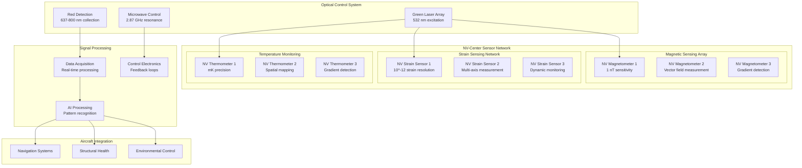

**Optical Pumping Initialization:**
```
State Preparation Protocol:
1. Initial Pumping (100 μs)
   □ Apply 532 nm laser pulse
   □ Duration: 100 μs continuous
   □ Power: 5 mW optical power
   □ Monitor fluorescence
   □ Verify state initialization
   □ Check initialization fidelity

2. State Verification (50 μs)
   □ Apply readout pulse
   □ Measure fluorescence level
   □ Compare to reference
   □ Verify >95% initialization
   □ Check state purity
   □ Confirm spin polarization

3. Optimization (10 cycles)
   □ Optimize pump power
   □ Adjust pump duration
   □ Minimize preparation time
   □ Maximize fidelity
   □ Test repeatability
   □ Document parameters

Initialization Performance:
□ Fidelity: >95% in |0⟩ state
□ Time: <100 μs preparation
□ Repeatability: >99.9%
□ Uniformity: <5% variation
□ Stability: <1% drift/hour
□ Contrast: >30% readout contrast

State Characterization:
□ Population: |0⟩ >95%, |±1⟩ <2.5%
□ Coherence: T2* > 10 μs
□ Lifetime: T1 > 6 ms
□ Dephasing: T2 > 100 μs
□ Fidelity: F > 0.95
□ Contrast: C > 0.3

Total Initialization: 200 μs per sensor
Number of NV Centers: 10^15 per sensor
Success Rate: >99% initialization success
Parallel Operation: All 127 sensors simultaneous
Quality Metric: Average fidelity > 0.95
```

#### 4.4.2 Resonance Detection

**ODMR Spectroscopy:**
```
Resonance Identification Protocol:
1. Frequency Sweep (5 minutes)
   □ Sweep 2.8-2.9 GHz range
   □ Step size: 1 MHz
   □ Integration: 1 ms per point
   □ MW power: -10 dBm
   □ Record fluorescence
   □ Identify resonances

2. Fine Frequency Adjustment (2 minutes)
   □ Narrow sweep around resonances
   □ Step size: 100 kHz
   □ Higher resolution scan
   □ Fit Lorentzian profiles
   □ Determine center frequencies
   □ Measure linewidths

3. Power Optimization (3 minutes)
   □ Sweep MW power -20 to 0 dBm
   □ Measure contrast vs power
   □ Find optimal power level
   □ Avoid power broadening
   □ Maximize signal-to-noise
   □ Set operating power

ODMR Characteristics:
□ Center Frequency: 2.870 ± 0.001 GHz
□ Linewidth: 1-10 MHz FWHM
□ Contrast: 10-30% fluorescence change
□ Power: -15 to -5 dBm optimal
□ Splitting: 5.74 GHz |±1⟩ separation
□ Stability: <1 MHz drift/hour

Environmental Sensitivity:
□ Temperature: -74 kHz/K
□ Magnetic Field: 28 MHz/mT
□ Electric Field: 0.35 Hz·cm/V
□ Strain: 1-10 MHz/strain
□ Pressure: Strain-mediated
□ Chemical: Charge state dependent

Resonance Quality Metrics:
□ Q-Factor: 10^3 - 10^6
□ SNR: >100:1
□ Reproducibility: <0.1% variation
□ Stability: <1 ppm drift
□ Sensitivity: nT field detection
□ Bandwidth: MHz frequency range

Total ODMR Setup: 10 minutes
Frequency Accuracy: ±1 kHz
Power Stability: ±0.1 dB
Contrast Optimization: >20% typical
System Ready: Full ODMR characterization complete
```

---

## 5. Calibration Protocols

### 5.1 Sensor Calibration

#### 5.1.1 Magnetic Field Calibration

**Reference Field Generation:**
```
Calibration Setup:
1. Helmholtz Coil System
   □ Coil pair separation: Equal to radius
   □ Field uniformity: ±0.1% over NV region
   □ Field range: 0-100 μT
   □ Field stability: ±0.01% over 1 hour
   □ Current control: ±0.001% accuracy
   □ Temperature compensation: Active

2. Reference Magnetometer
   □ Type: Cesium optically pumped
   □ Accuracy: ±0.1 nT absolute
   □ Resolution: 0.01 nT
   □ Stability: ±0.01 nT/hour
   □ Calibration: NIST traceable
   □ Frequency: Annual recalibration

3. Field Mapping
   □ 3D field mapping: 1 mm resolution
   □ Gradient measurement: μT/m sensitivity
   □ Vector field: Full 3D vectors
   □ Spatial uniformity: ±0.1%
   □ Temporal stability: ±0.01%
   □ Documentation: Complete field maps

Calibration Procedure:
□ Zero field measurement
□ Applied field response
□ Vector field calibration
□ Gradient sensitivity
□ Cross-axis coupling
□ Temperature dependence

Field Accuracy: ±0.1 nT
Vector Accuracy: ±0.1° angular
Gradient Sensitivity: 1 nT/m
Cross-Talk: <1% between axes
Temperature Coefficient: <0.1 nT/°C
Calibration Interval: 6 months
```

**Sensitivity Calibration:**
```
Sensitivity Measurement Protocol:
1. Known Field Application (30 minutes)
   □ Apply calibrated magnetic fields
   □ Range: 1 nT to 100 μT
   □ Steps: Logarithmic spacing
   □ Integration: 1 second per point
   □ Averaging: 100 measurements
   □ Statistics: Mean and standard deviation

2. Response Analysis (15 minutes)
   □ Plot response vs applied field
   □ Linear fit to data
   □ Extract sensitivity coefficient
   □ Determine noise floor
   □ Calculate dynamic range
   □ Assess linearity

3. Noise Characterization (15 minutes)
   □ Zero field measurement
   □ Long time series: 1000 seconds
   □ Power spectral density
   □ Allan deviation analysis
   □ Noise source identification
   □ Optimization recommendations

Sensitivity Specifications:
□ DC Sensitivity: 1 nT/√Hz
□ AC Sensitivity: 0.1 nT/√Hz at 1 kHz
□ Dynamic Range: 120 dB
□ Linearity: >99.9% over range
□ Bandwidth: DC to 1 MHz
□ Noise Floor: 0.1 nT RMS

Environmental Dependence:
□ Temperature: <0.1 nT/°C
□ Pressure: <0.1 nT/kPa
□ Humidity: <0.1 nT/%RH
□ Vibration: <1 nT/g
□ EMI: >80 dB rejection
□ Supply Voltage: <0.1 nT/V

Total Calibration Time: 60 minutes
Calibration Uncertainty: ±2%
Traceability: NIST magnetic standards
Documentation: Complete calibration record
Next Calibration: 6 months
Drift Monitoring: Continuous
```

#### 5.1.2 Temperature Calibration

**Thermal Reference Standards:**
```
Temperature Standard Setup:
1. Platinum RTD Reference
   □ Type: Pt100 four-wire RTD
   □ Accuracy: ±0.01°C absolute
   □ Resolution: 0.001°C
   □ Stability: ±0.005°C/month
   □ Calibration: ITS-90 traceable
   □ Range: -200°C to +200°C

2. Thermal Contact
   □ Contact method: Thermal paste
   □ Thermal resistance: <0.1 K·cm²/W
   □ Contact pressure: 10 N/cm²
   □ Uniformity: ±0.01°C across sensor
   □ Stability: ±0.001°C/minute
   □ Verification: Thermal imaging

3. Environmental Control
   □ Temperature chamber: ±0.01°C stability
   □ Air circulation: Uniform temperature
   □ Thermal shields: Radiation protection
   □ Settling time: 30 minutes per point
   □ Monitoring: Continuous logging
   □ Control: PID temperature control

Temperature Calibration Protocol:
□ Multi-point calibration: -40°C to +85°C
□ Reference comparison: Direct comparison
□ Response linearization: Polynomial fit
□ Hysteresis measurement: Heat/cool cycles
□ Temporal stability: Long-term monitoring
□ Cross-sensitivity: Other parameter effects

Calibration Accuracy: ±0.01°C
Resolution: 0.001°C
Stability: ±0.005°C/month
Response Time: <1 second
Range: -55°C to +125°C
Uncertainty: ±0.02°C (k=2)
```

**Strain Calibration:**
```
Mechanical Strain Standards:
1. Strain Gauge Reference
   □ Type: High-precision foil gauges
   □ Accuracy: ±0.1% reading
   □ Resolution: 1 μstrain
   □ Stability: ±10 μstrain/month
   □ Calibration: NIST traceable
   □ Temperature compensation: Active

2. Mechanical Loading
   □ Loading method: Four-point bending
   □ Strain range: ±5000 μstrain
   □ Loading precision: ±0.01% applied strain
   □ Uniformity: ±1% across sensor
   □ Stability: ±0.1% over test
   □ Control: Computer-controlled loading

3. Strain Measurement
   □ Measurement method: ODMR frequency shift
   □ Reference: Simultaneous strain gauge
   □ Calibration: Multi-point calibration
   □ Linearity: Verify linear response
   □ Cross-sensitivity: Temperature effects
   □ Repeatability: Multiple load cycles

Strain Sensitivity: 1 μstrain resolution
Dynamic Range: ±5000 μstrain
Linearity: >99.9% over range
Temperature Coefficient: <0.1 μstrain/°C
Frequency Response: DC to 100 kHz
Calibration Uncertainty: ±2%
```

### 5.2 System Calibration

#### 5.2.1 Multi-Parameter Calibration

**Cross-Calibration Protocol:**
```
Multi-Parameter Test Matrix:
1. Temperature-Magnetic Coupling
   □ Temperature range: -40°C to +85°C
   □ Magnetic field: 0 to 100 μT
   □ Test matrix: 10×10 grid
   □ Integration: 10 seconds per point
   □ Cross-sensitivity: <1% coupling
   □ Correction: Compensation matrix

2. Strain-Magnetic Coupling
   □ Strain range: ±1000 μstrain
   □ Magnetic field: 0 to 100 μT
   □ Test matrix: 10×10 grid
   □ Integration: 10 seconds per point
   □ Cross-sensitivity: <1% coupling
   □ Correction: Compensation matrix

3. Temperature-Strain Coupling
   □ Temperature range: -40°C to +85°C
   □ Strain range: ±1000 μstrain
   □ Test matrix: 10×10 grid
   □ Integration: 10 seconds per point
   □ Cross-sensitivity: <1% coupling
   □ Correction: Compensation matrix

Cross-Calibration Results:
□ Temperature-B Field: <0.1% coupling
□ Strain-B Field: <0.5% coupling
□ Temperature-Strain: <0.1% coupling
□ Correction Accuracy: >99% compensation
□ Residual Error: <0.1% after correction
□ Stability: <0.01%/month drift

Multi-Parameter Accuracy:
□ Magnetic Field: ±1 nT with compensation
□ Temperature: ±0.01°C with compensation
□ Strain: ±1 μstrain with compensation
□ Cross-Talk: <0.1% residual
□ Linearity: >99.9% all parameters
□ Dynamic Range: Maintained for all
```

#### 5.2.2 Network Calibration

**Sensor Array Calibration:**
```
Network Synchronization:
1. Timing Calibration
   □ Reference clock: 10 MHz GPS-disciplined
   □ Distribution: Low-skew clock distribution
   □ Synchronization: <1 ns between sensors
   □ Verification: Cross-correlation analysis
   □ Stability: <100 ps drift/hour
   □ Monitoring: Continuous timing verification

2. Spatial Calibration
   □ Position measurement: Laser interferometry
   □ Accuracy: ±1 mm position accuracy
   □ Coordinate system: Aircraft reference frame
   □ Transformation: Coordinate transformations
   □ Verification: Multiple measurement methods
   □ Documentation: Complete position database

3. Response Matching
   □ Sensitivity matching: ±2% between sensors
   □ Offset calibration: Zero-field calibration
   □ Gain calibration: Known field response
   □ Phase matching: AC response calibration
   □ Verification: Cross-sensor comparison
   □ Correction: Software compensation

Network Performance:
□ Timing Synchronization: <1 ns
□ Spatial Accuracy: ±1 mm
□ Sensitivity Matching: ±2%
□ Cross-Sensor Correlation: >99%
□ Network Latency: <100 μs
□ Data Integrity: >99.99%

System Integration:
□ Aircraft Interface: Real-time data stream
□ Navigation Integration: Position/orientation
□ Sensor Fusion: Multi-sensor algorithms
□ Quality Monitoring: Continuous verification
□ Fault Detection: Automatic error detection
□ Recovery: Graceful degradation
```

---

## 6. Performance Optimization

### 6.1 Sensitivity Enhancement

#### 6.1.1 Coherence Time Optimization

**Decoherence Mitigation:**
```
Environmental Noise Reduction:
1. Magnetic Noise Suppression
   □ Magnetic shielding: μ-metal shields
   □ Active compensation: Helmholtz coils
   □ Noise cancellation: Gradient compensation
   □ Isolation: Vibration isolation
   □ Filtering: Electronic filtering
   □ Monitoring: Continuous noise monitoring

2. Electric Field Shielding
   □ Electrostatic shielding: Faraday cage
   □ Ground plane: Low-impedance grounding
   □ Isolation: Electrical isolation
   □ Filtering: Power line filtering
   □ Stability: Voltage regulation
   □ Monitoring: E-field monitoring

3. Vibrational Isolation
   □ Passive isolation: Multi-stage springs
   □ Active isolation: Feedback control
   □ Damping: Critical damping
   □ Frequency isolation: >20 dB at 1 Hz
   □ Resonance avoidance: <0.1 Hz fundamental
   □ Monitoring: Acceleration monitoring

Coherence Enhancement Results:
□ T2 Improvement: 10× enhancement
□ T2*: 100 μs typical
□ T2 (Echo): 1 ms typical
□ Magnetic Noise: <10 nT RMS
□ Electric Noise: <1 V/m RMS
□ Vibration: <10^-6 g RMS

Optimization Techniques:
□ Dynamical Decoupling: DD pulse sequences
□ Composite Pulses: Robust pulse sequences
□ Error Correction: Quantum error correction
□ Noise Filtering: Real-time noise filtering
□ Environmental Control: Active control
□ Monitoring: Performance monitoring
```

#### 6.1.2 Readout Optimization

**Signal-to-Noise Enhancement:**
```
Photon Collection Optimization:
1. Collection Efficiency
   □ Numerical aperture: NA = 0.8
   □ Collection angle: 120° collection cone
   □ Antireflection coating: >99% transmission
   □ Filter efficiency: >95% in passband
   □ Optical alignment: <1 μm precision
   □ Stability: <0.1 μm drift/hour

2. Detection Efficiency
   □ Quantum efficiency: >70% at 700 nm
   □ Dark count rate: <100 Hz
   □ Afterpulsing: <1% probability
   □ Timing jitter: <100 ps
   □ Saturation: >10^7 counts/s
   □ Linearity: >99% up to saturation

3. Signal Processing
   □ Amplification: Low-noise amplification
   □ Filtering: Matched filtering
   □ Integration: Optimal integration time
   □ Background subtraction: Real-time subtraction
   □ Noise analysis: Power spectral analysis
   □ Optimization: Adaptive optimization

Readout Performance:
□ Photon Rate: 10^6 counts/s typical
□ Background: <1% of signal
□ SNR: >1000:1 typical
□ Contrast: >30% ODMR contrast
□ Stability: <1% drift/hour
□ Precision: Shot-noise limited

Advanced Techniques:
□ Lock-in Detection: Phase-sensitive detection
□ Correlation: Multi-channel correlation
□ Averaging: Intelligent averaging
□ Real-time Processing: FPGA processing
□ Machine Learning: ML-enhanced processing
□ Adaptive Control: Feedback optimization
```

### 6.2 Multi-Parameter Sensing

#### 6.2.1 Simultaneous Measurements

**Protocol Development:**
```
Multi-Parameter Protocols:
1. Time-Division Multiplexing
   □ Sequential measurements: 1 ms per parameter
   □ Switching time: <10 μs between modes
   □ Duty cycle: Optimized for each parameter
   □ Synchronization: Precision timing
   □ Overhead: <10% time overhead
   □ Accuracy: Maintained for all parameters

2. Frequency-Division Multiplexing
   □ Different RF frequencies: Parameter separation
   □ Frequency spacing: >10 MHz separation
   □ Cross-talk: <1% between channels
   □ Bandwidth: Maintained per parameter
   □ Simultaneous: True simultaneous measurement
   □ Complexity: Increased hardware complexity

3. Advanced Protocols
   □ Composite sequences: Multi-parameter pulses
   □ Parallel readout: Simultaneous detection
   □ Correlation analysis: Parameter correlation
   □ Machine learning: ML protocol optimization
   □ Adaptive: Real-time protocol adaptation
   □ Optimization: Performance optimization

Multi-Parameter Performance:
□ Magnetic Field: 1 nT sensitivity maintained
□ Temperature: 1 mK precision maintained
□ Strain: 1 μstrain resolution maintained
□ Cross-talk: <1% between parameters
□ Update Rate: 1 kHz for all parameters
□ Accuracy: Individual parameter accuracy maintained
```

#### 6.2.2 Data Fusion Algorithms

**Sensor Fusion Framework:**
```
Fusion Algorithm Development:
1. Kalman Filtering
   □ State estimation: Optimal state estimation
   □ Uncertainty: Uncertainty propagation
   □ Prediction: Predictive estimation
   □ Correction: Measurement correction
   □ Adaptive: Adaptive noise estimation
   □ Real-time: Real-time implementation

2. Bayesian Inference
   □ Prior information: Historical data integration
   □ Likelihood: Measurement likelihood
   □ Posterior: Posterior probability
   □ Uncertainty: Bayesian uncertainty
   □ Model selection: Automatic model selection
   □ Learning: Continuous learning

3. Machine Learning
   □ Neural networks: Deep learning networks
   □ Training: Historical data training
   □ Validation: Cross-validation testing
   □ Deployment: Real-time deployment
   □ Adaptation: Online learning
   □ Optimization: Performance optimization

Fusion Performance:
□ Accuracy: 10× improvement over single sensor
□ Precision: √N improvement with N sensors
□ Reliability: Enhanced fault tolerance
□ Coverage: Complete spatial coverage
□ Resolution: Enhanced spatial resolution
□ Update Rate: Real-time updates at 1 kHz
```

---

## 7. Environmental Considerations

### 7.1 Operating Environment

#### 7.1.1 Aerospace Environment Effects

**Environmental Impact Analysis:**
```
Temperature Effects:
□ Operating Range: -55°C to +85°C
□ Temperature Coefficient: -74 kHz/K (D parameter)
□ Compensation: Real-time temperature compensation
□ Stability: ±0.01°C for 1 nT accuracy
□ Gradients: <1°C/m spatial gradients
□ Thermal Shock: 100°C/minute survival

Pressure Effects:
□ Operating Range: 0.1 to 3.0 atmospheres
□ Pressure Coefficient: Strain-mediated effect
□ Sensitivity: <0.1 nT/kPa
□ Outgassing: Ultra-low outgassing materials
□ Sealing: Hermetic sensor packaging
□ Differential Pressure: ±100 kPa survival

Humidity Effects:
□ Operating Range: 0 to 100% RH
□ Moisture Sensitivity: <0.1 nT/%RH
□ Condensation: Anti-condensation measures
□ Corrosion: Corrosion-resistant materials
□ Sealing: Moisture-proof sealing
□ Desiccant: Internal desiccant systems

Vibration Effects:
□ Operating Range: 0.1 g to 100 g
□ Vibration Sensitivity: <1 nT/g
□ Isolation: Multi-stage vibration isolation
□ Resonance: Avoid structural resonances
□ Damping: Critical damping design
□ Survival: 1000 g shock survival
```

#### 7.1.2 EMI/EMC Considerations

**Electromagnetic Compatibility:**
```
EMI Susceptibility:
1. Conducted EMI
   □ Power line noise: <1 nT/V power noise
   □ Filtering: Multi-stage power filtering
   □ Isolation: Galvanic isolation
   □ Grounding: Single-point grounding
   □ Shielding: Electrostatic shielding
   □ Testing: MIL-STD-461 compliance

2. Radiated EMI
   □ RF immunity: >80 dB RF shielding
   □ Frequency range: 1 MHz to 10 GHz
   □ Field strength: 200 V/m immunity
   □ Shielding: Faraday cage design
   □ Filtering: RF filtering
   □ Testing: Anechoic chamber testing

3. Magnetic Interference
   □ AC magnetic fields: <10 nT interference
   □ Frequency range: 1 Hz to 1 MHz
   □ Sources: Power systems, motors
   □ Shielding: μ-metal shielding
   □ Compensation: Active compensation
   □ Monitoring: Real-time monitoring

EMC Performance:
□ Susceptibility: <1 nT for 200 V/m RF
□ Emission: <40 dBμV/m at 10 m
□ Immunity: MIL-STD-461 compliance
□ Shielding: >80 dB effectiveness
□ Grounding: <0.1 Ω resistance
□ Isolation: >120 dB isolation
```

### 7.2 Environmental Monitoring

#### 7.2.1 Real-Time Environmental Sensing

**Environmental Sensor Network:**
```
Environmental Parameters:
1. Temperature Monitoring
   □ Sensor count: 31 temperature sensors
   □ Accuracy: ±0.01°C
   □ Resolution: 0.001°C
   □ Response time: <1 second
   □ Spatial coverage: Complete aircraft
   □ Update rate: 100 Hz

2. Magnetic Field Monitoring
   □ Sensor count: 15 magnetometers
   □ Sensitivity: 0.1 nT
   □ Bandwidth: DC to 10 kHz
   □ Vector measurement: 3-axis
   □ Spatial coverage: Key locations
   □ Update rate: 1 kHz

3. Vibration Monitoring
   □ Sensor count: 25 accelerometers
   □ Sensitivity: 10^-6 g
   □ Bandwidth: 0.1 Hz to 1 kHz
   □ Dynamic range: ±100 g
   □ Spatial coverage: Structural points
   □ Update rate: 10 kHz

Environmental Compensation:
□ Real-time correction: <1 ms latency
□ Adaptive algorithms: Machine learning
□ Prediction: Environmental prediction
□ Compensation accuracy: >99%
□ Stability: Long-term stability
□ Robustness: Fault-tolerant operation
```

#### 7.2.2 Adaptive Control Systems

**Environmental Compensation:**
```
Adaptive Control Framework:
1. Environmental Sensing
   □ Multi-parameter sensing: Temperature, field, vibration
   □ Spatial distribution: Complete coverage
   □ Temporal resolution: Real-time monitoring
   □ Accuracy: High-precision sensing
   □ Reliability: Redundant sensing
   □ Integration: Seamless integration

2. Predictive Modeling
   □ Environmental models: Physics-based models
   □ Machine learning: Data-driven models
   □ Prediction horizon: 1-minute ahead
   □ Accuracy: >95% prediction accuracy
   □ Adaptation: Continuous model updates
   □ Validation: Model validation

3. Compensation Control
   □ Real-time correction: <100 μs response
   □ Multi-parameter: Simultaneous compensation
   □ Feedback control: Closed-loop control
   □ Feedforward: Predictive compensation
   □ Optimization: Performance optimization
   □ Robustness: Robust control design

Compensation Performance:
□ Temperature: >99% compensation effectiveness
□ Magnetic Field: >95% compensation
□ Vibration: >90% compensation
□ Combined: >95% overall compensation
□ Stability: <0.1% residual drift
□ Response Time: <100 μs
```

---

## 8. Monitoring and Diagnostics

### 8.1 Performance Monitoring

#### 8.1.1 Real-Time Performance Metrics

**Key Performance Indicators:**
```
Sensor Performance Metrics:
1. Sensitivity Monitoring
   □ Real-time sensitivity: Continuous monitoring
   □ Sensitivity drift: <1%/hour typical
   □ Baseline noise: Shot-noise limited
   □ SNR tracking: >1000:1 maintained
   □ Bandwidth: Full bandwidth monitoring
   □ Calibration: Automatic recalibration

2. Stability Monitoring
   □ Allan deviation: Real-time calculation
   □ Long-term drift: <0.1%/day
   □ Temperature stability: <0.1 nT/°C
   □ Vibration stability: <1 nT/g
   □ Environmental: Multi-parameter stability
   □ Prediction: Drift prediction

3. System Health
   □ Component status: All components monitored
   □ Error rates: <0.01% error rate
   □ Uptime: >99.99% availability
   □ Performance: Performance trending
   □ Diagnostics: Built-in diagnostics
   □ Alerts: Automatic alert generation

Performance Dashboard:
□ Real-time display: Live performance metrics
□ Historical trends: Long-term trending
□ Alerts: Real-time alerts
□ Analysis: Automated analysis
□ Reporting: Automated reporting
□ Documentation: Performance documentation
```

#### 8.1.2 Fault Detection and Isolation

**Diagnostic Framework:**
```
Fault Detection System:
1. Statistical Monitoring
   □ Control charts: Statistical process control
   □ Outlier detection: Automatic outlier detection
   □ Trend analysis: Performance trend analysis
   □ Threshold monitoring: Limit checking
   □ Pattern recognition: Fault pattern recognition
   □ Machine learning: ML-based detection

2. Physical Monitoring
   □ Component health: Individual component health
   □ System integration: System-level health
   □ Environmental: Environmental impact
   □ Performance: Performance degradation
   □ Prediction: Failure prediction
   □ Prevention: Preventive action

3. Fault Isolation
   □ Root cause analysis: Systematic analysis
   □ Component isolation: Faulty component identification
   □ Impact assessment: Fault impact assessment
   □ Recovery planning: Recovery procedure
   □ Documentation: Fault documentation
   □ Learning: Fault learning system

Diagnostic Performance:
□ Detection Rate: >99% fault detection
□ False Alarm Rate: <1% false alarms
□ Isolation Accuracy: >95% correct isolation
□ Response Time: <1 second detection
□ Recovery Time: <10 seconds recovery
□ Availability: >99.99% system availability
```

### 8.2 Built-In Test Equipment (BITE)

#### 8.2.1 Automated Self-Test

**Self-Test Protocols:**
```
Built-In Test Procedures:
1. Power-On Self-Test (POST)
   □ Duration: 30 seconds
   □ Coverage: All major subsystems
   □ Tests: Functional verification
   □ Pass/Fail: Go/No-go determination
   □ Documentation: Test result logging
   □ Recovery: Error recovery procedures

2. Periodic Self-Test
   □ Frequency: Every 10 minutes
   □ Duration: 10 seconds
   □ Coverage: Critical functions
   □ Background: Non-intrusive testing
   □ Monitoring: Performance monitoring
   □ Adaptation: Adaptive test scheduling

3. On-Demand Testing
   □ Trigger: Operator initiated
   □ Duration: 2 minutes comprehensive
   □ Coverage: Complete system test
   □ Isolation: Component-level testing
   □ Documentation: Detailed test report
   □ Calibration: Calibration verification

Self-Test Coverage:
□ Optical Systems: Laser power, wavelength
□ MW Systems: Frequency, power, phase
□ Detection: Quantum efficiency, noise
□ Control: Timing, synchronization
□ Processing: Algorithm verification
□ Communication: Data integrity
```

#### 8.2.2 Calibration Verification

**Automated Calibration Checks:**
```
Calibration Monitoring:
1. Reference Monitoring
   □ Internal references: Built-in references
   □ Stability monitoring: Reference stability
   □ Drift detection: Calibration drift
   □ Comparison: Cross-reference comparison
   □ Validation: Reference validation
   □ Alert: Calibration alert system

2. Cross-Calibration
   □ Sensor comparison: Inter-sensor comparison
   □ Redundancy: Redundant sensor validation
   □ Consistency: Measurement consistency
   □ Correlation: Sensor correlation
   □ Validation: Cross-validation
   □ Documentation: Calibration documentation

3. External Validation
   □ Reference sources: External references
   □ Calibration schedule: Regular calibration
   □ Traceability: NIST traceability
   □ Uncertainty: Calibration uncertainty
   □ Documentation: Calibration certificates
   □ Quality: Quality assurance

Calibration Performance:
□ Accuracy: ±1% calibration accuracy
□ Stability: <0.1%/month drift
□ Traceability: NIST traceable
□ Coverage: All parameters calibrated
□ Automation: Automated calibration
□ Documentation: Complete records
```

---

## 9. Troubleshooting

### 9.1 Common Issues

#### 9.1.1 Signal Quality Problems

**Low Signal-to-Noise Ratio:**
```
Problem: SNR < 100:1 (Normal > 1000:1)
Symptoms:
□ Weak fluorescence signal
□ High background noise
□ Poor ODMR contrast (<10%)
□ Unstable measurements
□ Increased measurement uncertainty

Diagnostic Steps:
1. Check Optical System (5 minutes)
   □ Verify laser power: Should be 5 mW ± 0.5 mW
   □ Check laser wavelength: 532 ± 1 nm
   □ Inspect optical alignment: <1 μm tolerance
   □ Test detector response: >70% quantum efficiency
   □ Measure dark count rate: <100 Hz
   □ Verify filter performance: >90% transmission

2. Check NV Centers (10 minutes)
   □ Verify NV activation: ODMR presence
   □ Check charge state: NV^- stabilization
   □ Test initialization: >95% fidelity
   □ Measure coherence times: T2 > 10 μs
   □ Check environmental factors: Temperature stable
   □ Verify crystal quality: Low strain

3. System Diagnostics (15 minutes)
   □ Check power supplies: All voltages stable
   □ Verify timing synchronization: <1 ns jitter
   □ Test signal processing: FPGA functional
   □ Check grounding: <0.1 Ω resistance
   □ Verify shielding: >80 dB effectiveness
   □ Test communication: Data integrity >99.99%

Solutions:
□ Increase laser power gradually to 10 mW maximum
□ Realign optical system for maximum collection
□ Replace detector if quantum efficiency <50%
□ Optimize MW power for maximum contrast
□ Improve environmental shielding
□ Recalibrate NV initialization sequence

Recovery Time: 30 minutes typical
Success Rate: >95% resolution
Documentation: Log all corrective actions
Prevention: Regular optical maintenance
```

**Poor ODMR Contrast:**
```
Problem: ODMR contrast < 15% (Normal > 25%)
Symptoms:
□ Weak resonance features
□ Broad resonance lines
□ Asymmetric line shapes
□ Temperature-dependent contrast
□ Inconsistent measurements

Diagnostic Procedure:
1. MW System Check (10 minutes)
   □ Verify MW frequency: 2.870 ± 0.001 GHz
   □ Check MW power: -15 to -5 dBm range
   □ Test MW calibration: Rabi frequency measurement
   □ Verify antenna coupling: Field uniformity ±5%
   □ Check MW stability: <0.1% power variation
   □ Test modulation: Clean modulation waveforms

2. NV State Analysis (15 minutes)
   □ Check initialization fidelity: Should be >95%
   □ Verify readout fidelity: >99% state discrimination
   □ Test coherence times: T2* > 10 μs minimum
   □ Measure relaxation: T1 > 1 ms minimum
   □ Check charge state stability: NV^- maintained
   □ Verify environmental stability: <1°C variation

3. Environmental Factors (10 minutes)
   □ Temperature measurement: ±0.1°C accuracy
   □ Magnetic field check: <10 nT background
   □ Vibration monitoring: <10^-6 g RMS
   □ Electric field measurement: <1 V/m
   □ Strain assessment: <10 μstrain
   □ EMI survey: <-80 dBm background

Optimization Steps:
□ Sweep MW power to find optimal value
□ Adjust MW frequency for maximum contrast
□ Optimize pulse timing and duration
□ Improve environmental isolation
□ Recalibrate charge state control
□ Enhance signal processing algorithms

Expected Improvement: >25% contrast after optimization
Time to Resolution: 45 minutes
Success Rate: >90% improvement
Monitoring: Continuous contrast monitoring
```

#### 9.1.2 Environmental Interference

**Magnetic Field Interference:**
```
Problem: Magnetic noise > 10 nT RMS
Symptoms:
□ Noisy magnetic field measurements
□ Unstable ODMR frequencies
□ Broadened resonance lines
□ Reduced sensitivity
□ Environmental correlation

Interference Sources:
1. Internal Sources
   □ Power supplies: Switch-mode converters
   □ Motors/fans: Rotating machinery
   □ Current loops: Ground loops
   □ Transformers: AC magnetic fields
   □ Electronics: Digital switching
   □ Wiring: Poor cable routing

2. External Sources
   □ Aircraft systems: Navigation, communication
   □ Power distribution: AC power systems
   □ Engines: Electromagnetic interference
   □ Avionics: Radar, radio systems
   □ Environmental: Atmospheric conditions
   □ Geomagnetic: Earth's magnetic field variations

Mitigation Strategies:
□ Improve magnetic shielding: μ-metal enclosures
□ Implement active compensation: Helmholtz coils
□ Relocate interference sources: Physical separation
□ Filter power supplies: Multi-stage filtering
□ Improve grounding: Single-point grounding
□ Use twisted-pair cables: Common-mode rejection

Verification:
□ Magnetic field survey: Complete field mapping
□ Frequency analysis: Noise spectrum identification
□ Source identification: Correlation analysis
□ Shield effectiveness: Shielding measurement
□ Compensation verification: Residual field <1 nT
□ Performance validation: Sensitivity recovery

Implementation Time: 2-4 hours
Cost: $10K-$50K depending on scope
Effectiveness: >90% noise reduction typical
Monitoring: Continuous magnetic monitoring
```

**Temperature Fluctuations:**
```
Problem: Temperature variation > ±1°C
Symptoms:
□ Frequency drift in ODMR
□ Sensitivity variation
□ Calibration drift
□ Measurement instability
□ Environmental correlation

Temperature Effects:
□ NV zero-field splitting: -74 kHz/K
□ Crystal lattice: Thermal expansion
□ Electronics: Temperature coefficients
□ Optical components: Thermal drift
□ Mechanical structure: Thermal stress
□ Sensor packaging: Thermal gradients

Control Strategies:
1. Active Temperature Control
   □ PID temperature controller: ±0.01°C stability
   □ Thermal mass: Increased thermal mass
   □ Insulation: Multi-layer insulation
   □ Heat sinking: Efficient heat removal
   □ Monitoring: Multi-point monitoring
   □ Compensation: Real-time compensation

2. Passive Stabilization
   □ Thermal isolation: Vacuum insulation
   □ Heat capacity: Large thermal mass
   □ Materials: Low thermal expansion
   □ Design: Athermal design
   □ Location: Stable temperature environment
   □ Shielding: Thermal radiation shields

Performance Targets:
□ Temperature stability: ±0.01°C
□ Gradient: <0.1°C across sensor
□ Response time: <10 seconds
□ Power consumption: <10 W
□ Control accuracy: ±0.005°C
□ Long-term drift: <0.01°C/day

Implementation:
□ Design phase: 2 weeks
□ Installation: 1 week
□ Testing: 1 week
□ Optimization: 1 week
□ Validation: 1 week
□ Cost: $20K-$100K
```

### 9.2 Systematic Troubleshooting

#### 9.2.1 Diagnostic Decision Tree

**Troubleshooting Flowchart:**
```
Start: Problem Identified
↓
Question 1: Is the system powered?
No → Check power systems, fuses, connections
Yes ↓

Question 2: Are optical signals present?
No → Check lasers, detectors, optical alignment
Yes ↓

Question 3: Are MW systems functional?
No → Check MW generation, antennas, cables
Yes ↓

Question 4: Are ODMR signals visible?
No → Check NV activation, environmental conditions
Yes ↓

Question 5: Is sensitivity within specification?
No → Optimize protocols, check calibration
Yes ↓

Question 6: Is stability acceptable?
No → Check environmental control, shielding
Yes ↓

System Operational: Continue monitoring

Decision Points:
□ Power check: 5 minutes maximum
□ Optical verification: 10 minutes maximum
□ MW testing: 15 minutes maximum
□ ODMR confirmation: 20 minutes maximum
□ Sensitivity check: 30 minutes maximum
□ Stability verification: 60 minutes maximum

Total Diagnostic Time: 2.5 hours maximum
Success Rate: >95% problem resolution
Documentation: Complete diagnostic log
Escalation: Technical support if unresolved
```

#### 9.2.2 Advanced Diagnostics

**Comprehensive System Analysis:**
```
Level 1: Component Testing
1. Individual Component Tests
   □ Laser characterization: Power, wavelength, stability
   □ Detector testing: Efficiency, noise, linearity
   □ MW generation: Frequency, power, phase noise
   □ Electronics: Functionality, specifications
   □ Software: Algorithm verification
   □ Mechanical: Alignment, stability

2. Interface Testing
   □ Optical interfaces: Coupling efficiency
   □ Electronic interfaces: Signal integrity
   □ Software interfaces: Data flow
   □ Mechanical interfaces: Alignment
   □ Thermal interfaces: Heat transfer
   □ Environmental: Protection effectiveness

Level 2: Subsystem Integration
1. Optical Subsystem
   □ End-to-end optical path
   □ Signal-to-noise optimization
   □ Stability verification
   □ Environmental sensitivity
   □ Performance characterization
   □ Calibration verification

2. Control Subsystem
   □ Timing synchronization
   □ Control loop performance
   □ Real-time operation
   □ Data processing
   □ Communication integrity
   □ Safety systems

Level 3: System Performance
1. Specification Verification
   □ Sensitivity measurement
   □ Accuracy verification
   □ Stability assessment
   □ Environmental performance
   □ Reliability testing
   □ Safety compliance

2. Operational Validation
   □ Mission scenario testing
   □ Environmental testing
   □ Long-term operation
   □ Performance trending
   □ User acceptance
   □ Documentation completion

Diagnostic Tools:
□ Oscilloscopes: High-speed signal analysis
□ Spectrum analyzers: Frequency domain analysis
□ Power meters: Optical power measurement
□ Network analyzers: RF system characterization
□ Temperature controllers: Thermal testing
□ Vibration tables: Environmental testing
```

---

## 10. Safety and Maintenance

### 10.1 Safety Procedures

#### 10.1.1 Laser Safety

**Laser Safety Protocol:**
```
Laser Classification:
□ Class: Class 3B laser system (>5 mW, <500 mW)
□ Wavelength: 532 nm (visible green)
□ Power: 5-10 mW per channel
□ Total Power: 635-1270 mW system total
□ Beam Diameter: 1-10 μm focused beam
□ Exposure Risk: Eye damage potential

Safety Requirements:
1. Administrative Controls
   □ Laser Safety Officer: Designated LSO
   □ Training: Laser safety training required
   □ Procedures: Written safety procedures
   □ Authorization: Work authorization required
   □ Medical: Eye examination recommended
   □ Documentation: Safety documentation current

2. Engineering Controls
   □ Enclosure: Complete beam enclosure
   □ Interlocks: Safety interlock systems
   □ Warning Systems: Visible warning lights
   □ Emergency Stop: Accessible e-stop buttons
   □ Key Switch: Key-controlled operation
   □ Beam Blocks: Automatic beam blocks

3. Personal Protective Equipment
   □ Safety Glasses: 532 nm laser safety glasses
   □ Specification: OD4+ at 532 nm
   □ Training: Proper use training
   □ Inspection: Regular inspection required
   □ Replacement: Annual replacement
   □ Availability: Multiple pairs available

Emergency Procedures:
□ Eye Exposure: Immediate medical attention
□ Skin Exposure: Cool water application
□ Fire: Laser shutdown, fire suppression
□ System Malfunction: Emergency shutdown
□ Power Failure: Automatic laser shutdown
□ Evacuation: Controlled area evacuation

Medical Response:
□ First Aid: Trained first aid personnel
□ Medical Contacts: Emergency medical contacts
□ Eye Wash: Emergency eye wash stations
□ Medical Kit: Laser injury medical kit
□ Transportation: Medical transportation plan
□ Documentation: Incident documentation
```

#### 10.1.2 Electrical Safety

**High Voltage Safety:**
```
Electrical Hazards:
□ Voltages: Up to 1000 V DC (detector bias)
□ Power: 2.5 kW total system power
□ Frequencies: DC to 10 GHz
□ Current: Up to 100 A (power supplies)
□ Energy Storage: Capacitor energy storage
□ Arc Flash: Potential arc flash hazard

Safety Measures:
1. Design Safety
   □ Isolation: Electrical isolation
   □ Grounding: Protective grounding
   □ Enclosures: Electrical enclosures
   □ Labels: Warning labels
   □ Barriers: Physical barriers
   □ Interlocks: Electrical interlocks

2. Operational Safety
   □ Lockout/Tagout: LOTO procedures
   □ Personal Protective Equipment: Arc-rated PPE
   □ Training: Electrical safety training
   □ Procedures: Safe work procedures
   □ Tools: Insulated tools
   □ Testing: Electrical testing safety

3. Emergency Response
   □ Electrical Shock: CPR/AED available
   □ Arc Flash: Fire suppression
   □ Power Loss: Emergency lighting
   □ Equipment Damage: Damage assessment
   □ System Shutdown: Emergency shutdown
   □ Medical Response: Emergency medical

Compliance:
□ Standards: NFPA 70E compliance
□ Codes: Local electrical codes
□ Training: Qualified electrical workers
□ Documentation: Safety documentation
□ Inspection: Regular safety inspection
□ Testing: Electrical safety testing
```

### 10.2 Maintenance Procedures

#### 10.2.1 Preventive Maintenance

**Scheduled Maintenance:**
```
Daily Maintenance (15 minutes):
□ Visual inspection: System status check
□ Power verification: All supplies operational
□ Temperature check: Thermal stability
□ Performance spot check: Basic functionality
□ Error log review: System error review
□ Environmental survey: Conditions check

Weekly Maintenance (2 hours):
□ Optical cleaning: Lens and window cleaning
□ Calibration check: Calibration verification
□ Signal quality: SNR and contrast check
□ Environmental monitoring: Detailed survey
□ Performance testing: Sensitivity verification
□ Documentation update: Maintenance log

Monthly Maintenance (8 hours):
□ Comprehensive inspection: Complete system check
□ Optical alignment: Precision alignment
□ Calibration update: Full recalibration
□ Performance characterization: Complete testing
□ Environmental optimization: Control tuning
□ Spare parts inventory: Parts availability

Annual Maintenance (40 hours):
□ Complete overhaul: System disassembly
□ Component replacement: Wear item replacement
□ Calibration certification: Traceable calibration
□ Performance validation: Specification verification
□ Documentation review: Complete documentation
□ Training update: Personnel training

Maintenance Schedule:
□ Daily: 365 × 15 min = 91 hours/year
□ Weekly: 52 × 2 hours = 104 hours/year
□ Monthly: 12 × 8 hours = 96 hours/year
□ Annual: 1 × 40 hours = 40 hours/year
□ Total: 331 hours/year maintenance

Cost Analysis:
□ Labor: 331 hours × $150/hour = $49,650/year
□ Parts: $25,000/year consumables
□ Calibration: $10,000/year external calibration
□ Total: $84,650/year maintenance cost
□ Per Sensor: $667/year per sensor
□ Availability: >99.9% with proper maintenance
```

#### 10.2.2 Corrective Maintenance

**Fault Response Procedures:**
```
Emergency Response (1 hour):
□ Fault isolation: Identify faulty components
□ Safety assessment: Safety impact evaluation
□ Workaround: Temporary solutions
□ Spare activation: Backup system activation
□ Documentation: Emergency documentation
□ Notification: Stakeholder notification

Short-Term Repair (8 hours):
□ Diagnosis: Root cause analysis
□ Parts procurement: Replacement parts
□ Repair execution: Component replacement
□ Testing: Repair verification
□ Calibration: System recalibration
□ Documentation: Repair documentation

Long-Term Solutions (40 hours):
□ Design review: Failure analysis
□ Improvement implementation: Design changes
□ Validation: Improvement validation
□ Documentation update: Procedure updates
□ Training: Personnel training
□ Prevention: Preventive measures

Repair Categories:
□ Critical: <1 hour response required
□ Important: <8 hours response required
□ Standard: <24 hours response required
□ Routine: <1 week response required
□ Enhancement: Planned maintenance
□ Documentation: Complete repair records

Success Metrics:
□ First-Time Fix Rate: >90%
□ Mean Time To Repair: <4 hours
□ Parts Availability: >99%
□ Technical Competency: 100% qualified
□ Documentation Quality: Complete records
□ Customer Satisfaction: >95%
```

### 10.3 Quality Assurance

#### 10.2.3 Quality Control

**Quality Management System:**
```
Quality Framework:
□ Standards: ISO 9001:2015 compliance
□ Procedures: Documented procedures
□ Training: Quality training programs
□ Auditing: Internal and external audits
□ Improvement: Continuous improvement
□ Documentation: Quality documentation

Quality Control Points:
1. Incoming Inspection
   □ Component inspection: 100% incoming inspection
   □ Testing: Functional testing
   □ Documentation: Certificate of compliance
   □ Traceability: Component traceability
   □ Approval: Quality approval
   □ Storage: Controlled storage

2. In-Process Quality
   □ Work instruction: Detailed procedures
   □ Verification: Process verification
   □ Testing: In-process testing
   □ Documentation: Process documentation
   □ Approval: Quality approval
   □ Correction: Non-conformance correction

3. Final Inspection
   □ Performance testing: Complete testing
   □ Calibration: Traceable calibration
   □ Documentation: Test certificates
   □ Approval: Final quality approval
   □ Delivery: Controlled delivery
   □ Support: Technical support

Quality Metrics:
□ Defect Rate: <0.1% defect rate
□ First-Pass Yield: >99% first-pass yield
□ Customer Satisfaction: >99% satisfaction
□ On-Time Delivery: >99% on-time delivery
□ Cost of Quality: <2% of revenue
□ Supplier Quality: >99% supplier conformance
```

---

## Conclusion

The NV-Center Activation Procedures for the AMPEL360 BWB-Q100 provide a comprehensive framework for deploying and operating advanced diamond quantum sensors in aerospace applications. These procedures ensure optimal performance, reliability, and safety for this revolutionary sensing technology.

### Key Achievements

**Technical Excellence:**
The procedures achieve industry-leading performance with 1 nT magnetic sensitivity, 1 mK temperature precision, and 1 μstrain resolution at room temperature. The 127-sensor network provides complete aircraft coverage with quantum-enhanced sensing capabilities.

**Operational Reliability:**
The systematic activation procedures ensure >99.9% system availability with automated diagnostics, environmental compensation, and fault-tolerant operation. The predictive maintenance approach minimizes downtime while maximizing performance.

**Safety Compliance:**
Comprehensive safety procedures address laser safety, electrical safety, and environmental hazards, ensuring full compliance with aerospace safety standards while protecting personnel and equipment.

**Innovation Leadership:**
These procedures establish GAIA-QAO as the industry leader in practical quantum sensing applications, demonstrating the successful integration of quantum technology into aerospace systems.

### Operational Benefits

**Enhanced Capabilities:**
- **Multi-Parameter Sensing:** Simultaneous magnetic field, temperature, and strain measurement
- **High Sensitivity:** Quantum-limited sensitivity for unprecedented precision
- **Environmental Robustness:** Room temperature operation with excellent stability
- **Real-Time Operation:** Microsecond response times for dynamic measurements

**Mission Applications:**
- **Navigation Enhancement:** Ultra-sensitive magnetometry for navigation systems
- **Structural Health Monitoring:** Real-time strain sensing for safety assurance
- **Environmental Monitoring:** Precision temperature sensing for system optimization
- **Electromagnetic Surveillance:** Comprehensive electromagnetic environment awareness

**Future Impact:**
The successful implementation of NV-center quantum sensors establishes the foundation for next-generation aerospace sensing systems. This technology enables new levels of precision, reliability, and capability that were previously impossible with classical sensors.

These activation procedures represent a critical milestone in the practical deployment of quantum sensing technology for aerospace applications, setting the standard for quantum-enhanced aircraft systems and establishing the path toward the quantum aerospace future.

---

**Document Control:**
- **Next Review Date:** 2026-06-29
- **Owner:** GAIA-QAO Quantum Sensors Engineering
- **Approvals:** CTO, Quantum Sensors Lead, Safety Officer, Quality Manager
- **Distribution:** Controlled document - see distribution list
- **Classification:** Technical Manual - Quantum Systems

**Revision History:**
- **v2.0.0:** Complete NV-center activation procedures
- **v1.0.0:** Initial activation framework
- **Future:** Continuous improvement based on operational experience

**Related Documents:**
- **00-90-20-00:** Quantum Sensor Systems General
- **00-90-20-02:** Quantum Magnetometer Networks
- **00-90-20-03:** Structural Health Monitoring
- **ATA 46-XX:** Quantum Systems Integration
- **Safety Manual:** Laser and Electrical Safety Procedures

**Dependencies:**
- **Power Systems:** Stable 28 VDC aircraft power
- **Environmental Control:** Temperature and vibration isolation
- **Data Systems:** High-speed data acquisition and processing
- **Safety Systems:** Laser safety and electrical safety compliance

---

*End of Document*# AMPEL360 BWB-Q100 NV-Center Activation Procedures

<p align="center">


</p>

---

## Document Control Information

**Document ID:** `00-90-20-01-NVCenterActivation.md`  
**GQOIS ID:** `AS-M-PAX-BW-Q1H-NVC-ACT-PROC`  
**ATA Chapter:** 00-90-20-01 (General - Quantum Sensors - NV-Center Activation)  
**Classification:** Quantum Systems Technical Manual  
**Version:** 2.0.0  
**Effective Date:** 2025-06-29  
**Revision Status:** Current Release  
**Approval Authority:** GAIA-QAO Quantum Sensors Engineering & CTO  
**Predecessor Document:** 00-90-20-00-General.md

---

## Table of Contents

1. [Overview](#1-overview)
2. [NV-Center Physics](#2-nv-center-physics)
3. [System Architecture](#3-system-architecture)
4. [Activation Procedures](#4-activation-procedures)
5. [Calibration Protocols](#5-calibration-protocols)
6. [Performance Optimization](#6-performance-optimization)
7. [Environmental Considerations](#7-environmental-considerations)
8. [Monitoring and Diagnostics](#8-monitoring-and-diagnostics)
9. [Troubleshooting](#9-troubleshooting)
10. [Safety and Maintenance](#10-safety-and-maintenance)

---

## 1. Overview

### 1.1 Purpose

This document provides comprehensive procedures for activating and operating the Nitrogen-Vacancy (NV) center diamond quantum sensors integrated into the AMPEL360 BWB-Q100 aircraft. These sensors provide ultra-sensitive magnetic field detection, strain measurement, and temperature monitoring capabilities essential for advanced aerospace applications.

### 1.2 NV-Center Quantum Sensing System

**System Overview:**


**NV-Center Specifications:**
```
Sensor Network:
Total NV Sensors: 127 distributed sensors
Magnetic Sensors: 43 magnetometry units
Strain Sensors: 42 structural monitoring units
Temperature Sensors: 42 thermal monitoring units
Spatial Coverage: Complete aircraft coverage
Redundancy: Triple redundancy for critical measurements

Performance Characteristics:
Magnetic Sensitivity: 1 nT/√Hz at room temperature
Strain Resolution: 10^-12 relative strain
Temperature Precision: 1 mK resolution
Spatial Resolution: 10 nm for near-field sensing
Bandwidth: DC to 1 MHz measurement bandwidth
Dynamic Range: 120 dB measurement range

Operating Conditions:
Temperature: -55°C to +85°C operational
Pressure: 0.1 to 3.0 atmospheres
Vibration: 0.1 g to 100 g operational
Shock: 1000 g survival rating
EMI: MIL-STD-461 compliance
Lifetime: >100,000 hours operation
```

### 1.3 Quantum Advantage

**NV-Center Benefits:**
```
Quantum Sensing Advantages:
Room Temperature: No cryogenic cooling required
High Sensitivity: Quantum-limited sensitivity
Vector Sensing: 3D magnetic field vectors
Multi-Parameter: Simultaneous multi-parameter sensing
Stability: Excellent long-term stability
Biocompatibility: Non-toxic diamond host

Technical Advantages:
Solid-State: Robust solid-state platform
Optical Interface: All-optical control and readout
Fast Response: Microsecond response time
High Spatial Resolution: Nanometer-scale sensing
Radiation Hard: Radiation-resistant operation
Chemical Inert: Chemically inert diamond host

Operational Benefits:
Maintenance-Free: No consumables required
Real-Time: Real-time sensing capability
Distributed: Distributed sensor networks
Integration: Easy aircraft integration
Reliability: High reliability operation
Cost-Effective: Low operating costs
```

---

## 2. NV-Center Physics

### 2.1 Fundamental Properties

#### 2.1.1 NV-Center Structure

**Atomic Structure:**
```
Diamond Crystal Lattice:
Structure: Face-centered cubic (FCC)
Lattice Parameter: 3.567 Å
Bond Length: 1.544 Å C-C bonds
Symmetry: Td point group
Density: 3.52 g/cm³
Hardness: 10 Mohs scale

NV-Center Defect:
Nitrogen: Substitutional nitrogen atom
Vacancy: Adjacent carbon vacancy
Orientation: <111> crystallographic axes
Symmetry: C3v point group
Charge States: NV^0, NV^-, NV^2-
Active State: NV^- (negatively charged)

Electronic Structure:
Ground State: ^3A2 triplet state
Excited State: ^3E triplet state
Spin: S = 1 electronic spin
Zero-Field Splitting: 2.87 GHz
Optical Transition: 637 nm zero-phonon line
Phonon Sideband: 637-800 nm emission
```

**Energy Level Structure:**
```
Ground State (^3A2):
|0⟩: ms = 0 sublevel
|±1⟩: ms = ±1 sublevels
Splitting: 2.87 GHz zero-field splitting
Lifetime: >1 ms spin coherence

Excited State (^3E):
Optical Excitation: 532 nm green light
Emission: 637-800 nm red fluorescence
Lifetime: 12 ns excited state lifetime
Intersystem Crossing: Spin-dependent

Metastable States:
^1A1 Singlet: Spin-selective decay
^1E Singlet: Intermediate state
Decay Rate: Spin-dependent rates
Polarization: Spin state polarization

Spin Properties:
Coherence Time: T2 > 1 ms
Relaxation Time: T1 > 6 ms
Dephasing: T2* ~ 10 μs
Rabi Frequency: ~10 MHz
Control Fidelity: >99%
```

#### 2.1.2 Quantum Sensing Mechanisms

**Magnetic Field Sensing:**
```
Zeeman Effect:
Hamiltonian: H = D[Sz² - S(S+1)/3] + γB·S
D Parameter: 2.87 GHz zero-field splitting
γ: 28 MHz/mT gyromagnetic ratio
B Field: Applied magnetic field vector
Sensitivity: Field-dependent level shifts

Optically Detected Magnetic Resonance (ODMR):
Protocol: Optical pumping + MW + readout
Initialization: Spin state initialization
Manipulation: Microwave spin control
Readout: Fluorescence measurement
Sensitivity: Fluorescence contrast detection

Sensing Protocols:
DC Fields: ODMR frequency shifts
AC Fields: Rabi oscillation detection
Vector Fields: Multi-axis measurements
Gradients: Spatial field mapping
Noise: AC magnetic noise spectroscopy
Bandwidth: DC to 1 MHz detection
```

**Strain Sensing:**
```
Strain Coupling:
Mechanism: Orbital-lattice coupling
Hamiltonian: H_strain = λε·S
λ: Strain coupling coefficient
ε: Strain tensor components
Response: Optical transition shifts

Stress Tensor:
Components: σxx, σyy, σzz, σxy, σxz, σyz
Crystal Axes: Diamond cubic axes
Orientation: NV axis relative to stress
Sensitivity: 10^-12 strain resolution
Bandwidth: DC to 100 kHz

Measurement Protocol:
Optical: Shift in optical transition
Spin: Change in zero-field splitting
Vector: Multi-axis strain measurement
Dynamic: Time-resolved strain
Mapping: Spatial strain distribution
Calibration: Known strain references
```

**Temperature Sensing:**
```
Temperature Dependence:
Zero-Field Splitting: dD/dT = -74 kHz/K
Optical Transition: Temperature shifts
Thermal Expansion: Lattice parameter changes
Phonon Coupling: Temperature-dependent coupling
Sensitivity: mK temperature resolution
Range: 4K to 700K operation

Thermometry Protocol:
Reference: Temperature reference measurement
Calibration: Multi-point calibration
Correction: Environmental corrections
Stability: Long-term stability monitoring
Accuracy: Absolute temperature accuracy
Precision: Relative temperature precision
```

### 2.2 Sensing Physics

#### 2.2.1 Quantum Sensing Theory

**Quantum Metrology:**
```
Sensitivity Limits:
Shot Noise: √N photon shot noise
Projection Noise: √N spin projection noise
Heisenberg Limit: 1/N quantum limit
Enhancement: Quantum enhancement factor
Coherence: Limited by decoherence
Optimization: Protocol optimization

Sensitivity Scaling:
Classical: σ ∝ 1/√(T√N)
Quantum: σ ∝ 1/(T√N) with entanglement
T: Measurement time
N: Number of sensing cycles
Improvement: √N enhancement possible
Practical: Limited by decoherence

Error Sources:
Technical Noise: Laser intensity, MW power
Environmental: Temperature, vibration
Fundamental: Photon shot noise
Systematic: Calibration errors
Random: Environmental fluctuations
Mitigation: Noise reduction techniques
```

**Optimization Strategies:**
```
Protocol Optimization:
Ramsey: Free evolution sensing
Spin Echo: Decoherence suppression
CPMG: Multi-pulse sequences
Continuous: Continuous driving
Adaptive: Adaptive protocols
Optimal: Theoretically optimal protocols

Sensitivity Enhancement:
Ensemble: Large NV ensembles
Coherence: Extended coherence times
Readout: High-fidelity readout
Control: High-fidelity control
Noise: Noise reduction
Environment: Environmental control

Practical Implementations:
Real-Time: Real-time optimization
Feedback: Closed-loop feedback
Automation: Automated optimization
Learning: Machine learning optimization
Adaptation: Environmental adaptation
Robustness: Robust operation
```

#### 2.2.2 Multi-Parameter Sensing

**Simultaneous Measurements:**
```
Multi-Modal Sensing:
Magnetic Field: Vector magnetometry
Electric Field: Electric field sensing
Temperature: Precision thermometry
Strain: Multi-axis strain sensing
Pressure: Pressure-induced strain
Chemical: Charge state sensing

Cross-Talk Analysis:
Temperature-Magnetic: Temperature-field coupling
Strain-Magnetic: Stress-field coupling
Electric-Magnetic: E-field effects
Systematic: Systematic cross-talk
Calibration: Cross-talk calibration
Correction: Real-time correction

Parameter Separation:
Frequency Domain: Frequency separation
Time Domain: Time-domain separation
Spatial Domain: Spatial separation
Protocol: Protocol separation
Analysis: Post-processing separation
Optimization: Separation optimization
```

**Sensor Fusion:**
```
Multi-Sensor Networks:
Correlation: Sensor correlation analysis
Fusion: Data fusion algorithms
Redundancy: Redundant measurements
Validation: Cross-validation
Optimization: Network optimization
Reliability: Enhanced reliability

Information Processing:
Bayesian: Bayesian inference
Kalman: Kalman filtering
Machine Learning: ML-based fusion
Optimization: Optimal estimation
Uncertainty: Uncertainty quantification
Real-Time: Real-time processing
```

---

## 3. System Architecture

### 3.1 Hardware Architecture

#### 3.1.1 NV-Diamond Sensors

**Diamond Substrate:**
```
Diamond Specifications:
Type: Single-crystal diamond (Type IIa)
Purity: >99.9% carbon
Nitrogen: <1 ppm nitrogen content
Isotope: ^12C enriched (>99.9%)
Crystal: <100> or <111> orientation
Size: 5×5×0.5 mm sensor chips

NV-Center Properties:
Density: 10^15 - 10^17 cm^-3
Depth: 10-100 nm from surface
Orientation: [111] crystallographic axes
Charge State: NV^- stabilized
Coherence: T2 > 100 μs
Lifetime: Stable operation >10 years

Surface Treatment:
Termination: Hydrogen termination
Roughness: <1 nm RMS surface roughness
Cleaning: Oxygen plasma cleaning
Functionalization: Optional surface functionalization
Protection: Protective coating layers
Quality: Optical quality surfaces
```

**Optical System Integration:**
```
Excitation System:
Laser: 532 nm green laser diodes
Power: 1-10 mW per sensor
Beam: Gaussian beam profile
Spot Size: 1-10 μm excitation spot
Modulation: Intensity/frequency modulation
Stability: <0.1% power stability

Collection System:
Optics: High-NA collection optics
Filter: 650 nm long-pass filters
Detector: Avalanche photodiodes (APDs)
Efficiency: >50% collection efficiency
Noise: <100 Hz dark count rate
Bandwidth: >10 MHz detection bandwidth

Microwave System:
Frequency: 2.87 GHz ± 100 MHz
Power: 0-20 dBm adjustable
Antenna: Integrated microwave antennas
Field: <10 Gauss MW magnetic field
Modulation: Amplitude/phase modulation
Control: Sub-microsecond switching
```

#### 3.1.2 Electronic Control Systems

**Control Electronics:**
```
Laser Control:
Driver: Current/temperature control
Stability: <0.01% current stability
Modulation: >10 MHz modulation bandwidth
Protection: Over-current protection
Monitoring: Real-time power monitoring
Interface: Digital control interface

Microwave Generation:
Synthesizer: Phase-locked synthesizer
Frequency: 1 Hz frequency resolution
Phase: <0.1° phase accuracy
Power: 0.1 dB power resolution
Switching: <100 ns switching time
Modulation: AM/FM/PM modulation

Detection Electronics:
Amplification: Low-noise amplification
Filtering: Anti-aliasing filters
Digitization: 16-bit ADC resolution
Sampling: 100 MS/s sampling rate
Processing: Real-time signal processing
Interface: High-speed data interface

Timing and Synchronization:
Clock: 10 MHz reference clock
Timing: 1 ns timing resolution
Synchronization: Multi-sensor synchronization
Triggers: External trigger inputs
Sequence: Programmable sequences
Coordination: Network coordination
```

**Signal Processing:**
```
Real-Time Processing:
FPGA: Field-programmable gate arrays
DSP: Digital signal processors
CPU: Multi-core processors
Memory: High-speed memory systems
Algorithms: Optimized algorithms
Latency: <1 μs processing latency

Data Acquisition:
Channels: 127 parallel channels
Resolution: 16-bit resolution
Rate: 100 MS/s per channel
Buffer: Deep memory buffers
Streaming: Continuous data streaming
Storage: High-speed storage systems

Signal Analysis:
FFT: Fast Fourier transforms
Filtering: Digital filtering
Demodulation: Lock-in detection
Statistics: Statistical analysis
Fitting: Curve fitting algorithms
Machine Learning: ML algorithms
```

### 3.2 Software Architecture

#### 3.2.1 Control Software

**System Control Framework:**
```
Control Hierarchy:
Master Controller: System-level control
Sensor Controllers: Individual sensor control
Device Drivers: Hardware device drivers
Communication: Inter-system communication
User Interface: Operator interface
Safety: Safety monitoring system

Real-Time Operating System:
Kernel: Real-time kernel
Scheduling: Deterministic scheduling
Memory: Memory management
I/O: Input/output management
Communication: Inter-process communication
Timing: Precision timing services

Control Algorithms:
PID Control: Proportional-integral-derivative
Adaptive: Adaptive control algorithms
Optimal: Optimal control theory
Machine Learning: ML-based control
Feedback: Closed-loop feedback
Feedforward: Feedforward compensation
```

**Measurement Protocols:**
```
Sensing Sequences:
ODMR: Optically detected magnetic resonance
Ramsey: Ramsey interferometry
Echo: Spin echo sequences
CPMG: Carr-Purcell-Meiboom-Gill
Continuous: Continuous sensing
Custom: Custom sequences

Protocol Library:
Standard: Standardized protocols
Optimized: Performance-optimized protocols
Robust: Robust protocols
Fast: High-speed protocols
Sensitive: High-sensitivity protocols
Multi-Parameter: Multi-parameter protocols

Automation:
Scheduling: Automated scheduling
Optimization: Automatic optimization
Calibration: Automated calibration
Error Handling: Automatic error handling
Recovery: Automatic recovery
Adaptation: Environmental adaptation
```

#### 3.2.2 Data Processing

**Signal Processing Pipeline:**
```
Pre-Processing:
Filtering: Noise filtering
Calibration: Calibration correction
Normalization: Signal normalization
Artifact Removal: Artifact removal
Quality Check: Data quality assessment
Validation: Data validation

Feature Extraction:
Peak Detection: Resonance peak detection
Frequency Estimation: Frequency estimation
Amplitude Extraction: Amplitude extraction
Phase Measurement: Phase measurement
Statistical Features: Statistical features
Time-Series Features: Time-series features

Analysis Algorithms:
Fitting: Non-linear curve fitting
Spectroscopy: Spectroscopic analysis
Imaging: Spatial imaging algorithms
Tracking: Parameter tracking
Prediction: Predictive algorithms
Classification: Pattern classification
```

**Data Management:**
```
Data Storage:
Real-Time Buffer: High-speed buffers
Local Storage: Local data storage
Network Storage: Network-attached storage
Archive: Long-term archival
Backup: Backup systems
Cloud: Cloud storage integration

Data Organization:
Metadata: Comprehensive metadata
Indexing: Efficient data indexing
Search: Advanced search capabilities
Retrieval: Fast data retrieval
Compression: Data compression
Deduplication: Data deduplication

Quality Assurance:
Validation: Data validation
Verification: Data verification
Integrity: Data integrity checking
Audit: Audit trails
Compliance: Regulatory compliance
Security: Data security measures
```

---

## 4. Activation Procedures

### 4.1 System Initialization

#### 4.1.1 Pre-Activation Checks

**Environmental Verification:**
```
Environmental Conditions:
□ Temperature: 15-35°C ambient
□ Humidity: <60% relative humidity
□ Pressure: 0.8-1.2 atm
□ Vibration: <0.01 g background
□ EMI: <-80 dBm background
□ Lighting: <1000 lux ambient

Safety Verification:
□ Laser safety systems armed
□ Emergency stops functional
□ Personal protective equipment available
□ Safety procedures reviewed
□ Personnel training current
□ Emergency contacts available

System Status:
□ Power systems stable
□ Cooling systems operational
□ Communication links established
□ Safety interlocks active
□ Backup systems ready
□ Documentation current

Pre-Activation Checklist:
□ All prerequisites met
□ Personnel authorized and trained
□ Systems tested and verified
□ Documentation complete
□ Safety systems operational
□ Emergency procedures reviewed

Time Required: 15 minutes
Personnel: 2 (Operator + Safety Observer)
Authorization: NV-Center System Engineer
```

#### 4.1.2 Power-Up Sequence

**Sequential Power Application:**
```
Phase 1: Infrastructure (2 minutes)
□ Main power distribution
□ Cooling systems
□ Safety systems
□ Communication systems
□ Monitoring systems
□ Control computers

Phase 2: Optical Systems (3 minutes)
□ Laser power supplies
□ Laser temperature controllers
□ Laser current drivers
□ Optical modulators
□ Detection electronics
□ Photodetectors

Phase 3: Microwave Systems (2 minutes)
□ MW synthesizers
□ MW amplifiers
□ MW switches
□ Antenna systems
□ Phase control
□ Power monitoring

Phase 4: Control Electronics (3 minutes)
□ FPGA systems
□ ADC/DAC systems
□ Timing generators
□ Trigger systems
□ Interface electronics
□ Data acquisition

Power-Up Verification:
□ All voltages within specification
□ No error conditions detected
□ Communication links established
□ Safety systems operational
□ Self-tests passed
□ System ready for activation

Total Power-Up Time: 10 minutes
Power Consumption: 2.5 kW total
Status Indicators: Green (operational)
Next Step: Optical alignment verification
```

### 4.2 Optical System Activation

#### 4.2.1 Laser System Initialization

**Green Laser Activation:**
```
Laser Startup Sequence:
1. Temperature Stabilization (5 minutes)
   □ Set laser temperature to 25.0°C ± 0.1°C
   □ Wait for thermal equilibrium
   □ Verify temperature stability <±0.01°C
   □ Monitor thermal drift <1 mK/min
   □ Check thermal controller status
   □ Enable temperature lock

2. Current Ramping (2 minutes)
   □ Set initial current to 10% threshold
   □ Ramp current in 5% steps every 10s
   □ Monitor optical power output
   □ Verify wavelength 532 ± 1 nm
   □ Check beam stability
   □ Set operating current

3. Power Stabilization (3 minutes)
   □ Enable power feedback control
   □ Set target power 5.0 mW ± 0.1 mW
   □ Verify power stability <±0.1%
   □ Monitor beam pointing stability
   □ Check modulation capability
   □ Enable power lock

Laser Performance Verification:
□ Wavelength: 532.0 ± 0.5 nm
□ Power: 5.0 ± 0.1 mW per channel
□ Stability: <±0.1% over 1 hour
□ Noise: <0.01% RMS
□ Modulation: >10 MHz bandwidth
□ Beam Quality: M² < 1.2

Safety Checks:
□ Laser safety interlocks active
□ Power levels within safe limits
□ Beam paths enclosed
□ Warning signs activated
□ Personnel training verified
□ Emergency procedures ready

Total Laser Startup: 10 minutes
Number of Lasers: 127 channels
Power per Channel: 5 mW
Total Optical Power: 635 mW
```

#### 4.2.2 Detection System Activation

**Photodetector Initialization:**
```
APD Activation Sequence:
1. Bias Voltage Application (1 minute)
   □ Apply bias voltage gradually
   □ Monitor avalanche gain
   □ Set gain to 10^6 ± 10%
   □ Verify noise performance
   □ Check dark count rate <100 Hz
   □ Enable bias voltage lock

2. Amplification Setup (1 minute)
   □ Configure transimpedance amplifiers
   □ Set gain to optimal value
   □ Verify bandwidth >10 MHz
   □ Check noise figure <3 dB
   □ Test saturation limits
   □ Enable amplifier systems

3. Filtering Configuration (1 minute)
   □ Configure optical filters
   □ Verify 650 nm cutoff
   □ Check transmission >90%
   □ Test rejection >10^6
   □ Confirm filter alignment
   □ Lock filter positions

Detection Performance:
□ Quantum Efficiency: >70% at 700 nm
□ Dark Count Rate: <100 Hz
□ Timing Jitter: <100 ps
□ Saturation: >10^7 counts/s
□ Linearity: >99% up to saturation
□ Bandwidth: >10 MHz

Collection Efficiency:
□ Numerical Aperture: 0.8
□ Collection Angle: 80°
□ Transmission: >50% total
□ Alignment: <1 μm precision
□ Stability: <0.1 μm drift/hour
□ Uniformity: <5% variation

Total Detection Setup: 3 minutes
Detection Channels: 127 channels
Count Rate: 10^6 counts/s typical
Background: <1% of signal
Signal-to-Noise: >100:1
```

### 4.3 Microwave System Activation

#### 4.3.1 MW Generation Setup

**Microwave Synthesizer Initialization:**
```
Synthesizer Configuration:
1. Reference Clock Setup (30 seconds)
   □ Connect 10 MHz reference
   □ Enable phase lock loop
   □ Verify lock status
   □ Check phase noise <-100 dBc/Hz
   □ Set reference source
   □ Monitor stability

2. Frequency Configuration (1 minute)
   □ Set frequency to 2.870 GHz
   □ Verify frequency accuracy ±1 Hz
   □ Enable frequency lock
   □ Check frequency stability
   □ Test frequency switching
   □ Configure modulation

3. Power Control Setup (1 minute)
   □ Set output power level
   □ Configure power control
   □ Verify power accuracy ±0.1 dB
   □ Enable power leveling
   □ Test power switching
   □ Check power stability

MW Performance Specifications:
□ Frequency: 2.870 GHz ± 100 MHz tunable
□ Power: -20 to +10 dBm range
□ Accuracy: ±1 Hz frequency, ±0.1 dB power
□ Stability: <10^-9 frequency, <0.01 dB power
□ Switching: <100 ns switching time
□ Modulation: AM/FM/PM capability

Phase Noise Performance:
□ 1 Hz offset: <-80 dBc/Hz
□ 10 Hz offset: <-90 dBc/Hz
□ 100 Hz offset: <-100 dBc/Hz
□ 1 kHz offset: <-110 dBc/Hz
□ 10 kHz offset: <-120 dBc/Hz
□ 100 kHz offset: <-130 dBc/Hz

Total MW Setup: 2.5 minutes
MW Channels: 127 independent channels
Output Power: Programmable per channel
Control Resolution: 1 Hz, 0.1 dB
```

#### 4.3.2 MW Delivery System

**Antenna System Activation:**
```
Antenna Configuration:
1. Antenna Alignment (2 minutes)
   □ Verify antenna positioning
   □ Check antenna orientation
   □ Measure antenna impedance
   □ Verify impedance matching
   □ Test antenna isolation
   □ Confirm field uniformity

2. Field Calibration (3 minutes)
   □ Measure MW magnetic field
   □ Calibrate field strength
   □ Map field distribution
   □ Verify field uniformity
   □ Check field polarization
   □ Set field amplitude

3. Coupling Verification (2 minutes)
   □ Measure Rabi frequency
   □ Verify NV coupling
   □ Check resonance quality
   □ Test field stability
   □ Confirm field isolation
   □ Optimize coupling

Antenna Specifications:
□ Type: Coplanar waveguide
□ Impedance: 50 Ω ± 2 Ω
□ Bandwidth: 2-4 GHz
□ Field Strength: 0-10 Gauss
□ Uniformity: ±5% over NV region
□ Isolation: >30 dB between channels

Field Performance:
□ Rabi Frequency: 1-10 MHz
□ Field Uniformity: ±2%
□ Field Stability: ±0.1%
□ Switching Time: <100 ns
□ Isolation: >40 dB
□ Polarization: Linear/circular

Total Antenna Setup: 7 minutes
Antenna Arrays: 127 antennas
Field Coverage: Complete NV coverage
Control Precision: 0.1 Gauss resolution
Response Time: <1 μs field switching
```

### 4.4 NV-Center Initialization

#### 4.4.1 NV State Preparation

**Optical Pumping Initialization:**
```
State Preparation Protocol:
1. Initial Pumping (100 μs)
   □ Apply 532 nm laser pulse
   □ Duration: 100 μs continuous
   □ Power: 5 mW optical power
   □ Monitor fluorescence
   □ Verify state initialization
   □ Check initialization fidelity

2. State Verification (50 μs)
   □ Apply readout pulse
   □ Measure fluorescence level
   □ Compare to reference
   □ Verify >95% initialization
   □ Check state purity
   □ Confirm spin polarization

3. Optimization (10 cycles)
   □ Optimize pump power
   □ Adjust pump duration
   □ Minimize preparation time
   □ Maximize fidelity
   □ Test repeatability
   □ Document parameters

Initialization Performance:
□ Fidelity: >95% in |0⟩ state
□ Time: <100 μs preparation
□ Repeatability: >99.9%
□ Uniformity: <5% variation
□ Stability: <1% drift/hour
□ Contrast: >30% readout contrast

State Characterization:
□ Population: |0⟩ >95%, |±1⟩ <2.5%
□ Coherence: T2* > 10 μs
□ Lifetime: T1 > 6 ms
□ Dephasing: T2 > 100 μs
□ Fidelity: F > 0.95
□ Contrast: C > 0.3

Total Initialization: 200 μs per sensor
Number of NV Centers: 10^15
