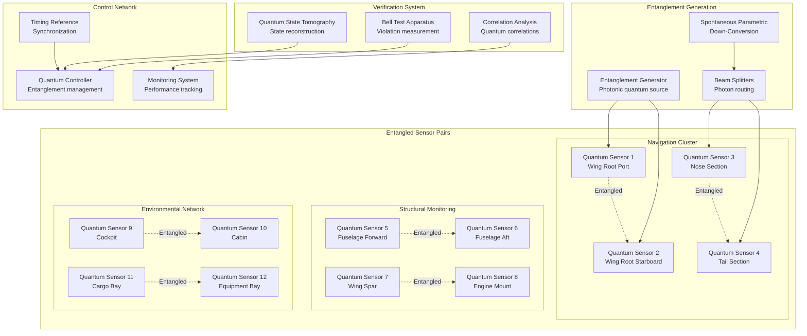

**Quantum State Certification:**
```
Quantum State Verification:
Goal: Verify specific quantum state
Protocol: Minimize measurements required
Efficiency: Exponential improvement over tomography
Guarantee: High confidence verification
Implementation: Adaptive measurements

Verification Protocol:
1. Fidelity Estimation
   □ Estimate state fidelity F = ⟨ψ|ρ|ψ⟩
   □ Use random measurements
   □ Achieve ε accuracy with O(1/ε) measurements
   □ Classical post-processing

2. Threshold Test
   □ Set fidelity threshold F_th
   □ Accept if F > F_th
   □ Reject if F ≤ F_th
   □ Statistical confidence bounds

3. Adaptive Strategy
   □ Choose measurements based on outcomes
   □ Optimize measurement settings
   □ Minimize total measurements
   □ Maximize information gain

Shadow Tomography:
Measurements: M = O(log d) random Pauli measurements
Accuracy: ε prediction error
Efficiency: Exponential improvement
Applications: Many-body quantum states
Implementation: Classical shadows protocol

Cross-Entropy Benchmarking:
Protocol: Random circuit + bitstring sampling
Fidelity: F = 2^n ⟨P(x)⟩ - 1
Verification: Efficient classical simulation
Benchmark: Quantum supremacy verification
Implementation: Quantum processor characterization

Performance Comparison:
Full Tomography: 4^n measurements
Process Tomography: 16^n measurements
Verification: O(n) measurements
Shadow Tomography: O(log n) measurements
Cross-Entropy: O(1) measurement
```

---

## 5. Bell Test Implementation

### 5.1 Experimental Setup

#### 5.1.1 Measurement Apparatus

**Polarization Analysis System:**
```
Polarization Measurement:
Analyzer: Calcite beam displacer
Rotation: Motorized rotation stages
Accuracy: ±0.1° angular accuracy
Stability: ±0.01° stability over 1 hour
Speed: 100 ms setting change
Range: 360° continuous rotation

Wave Plates:
Quarter-Wave: λ/4 retardation at 810 nm
Half-Wave: λ/2 retardation at 810 nm
Material: Crystalline quartz
Accuracy: λ/300 retardation accuracy
Temperature: ±0.1°C stability required
Mounting: Kinematic mounting

Detection System:
Detectors: Avalanche photodiodes (APDs)
Efficiency: >95% at 810 nm
Dark Count: <100 Hz
Dead Time: <50 ns
Timing: <100 ps timing jitter
Cooling: Thermoelectric cooling

Coincidence Detection:
Time Window: 1 ns coincidence window
Electronics: Time-to-digital converters
Resolution: 1 ps timing resolution
Rate: >1 MHz count rate
Processing: Real-time coincidence processing
Storage: High-speed data storage
```

**Measurement Settings:**
```
CHSH Settings (Optimal):
Alice Settings:
a: 0° polarization measurement
a': 45° polarization measurement
Separation: 45° optimal for CHSH

Bob Settings:
b: 22.5° polarization measurement
b': -22.5° polarization measurement
Separation: 45° optimal for CHSH

Measurement Combinations:
(a,b): (0°, 22.5°)
(a,b'): (0°, -22.5°)
(a',b): (45°, 22.5°)
(a',b'): (45°, -22.5°)

Expected Results (Bell State):
E(a,b) = +1/√2 ≈ +0.707
E(a,b') = +1/√2 ≈ +0.707
E(a',b) = +1/√2 ≈ +0.707
E(a',b') = -1/√2 ≈ -0.707

CHSH Value:
S = |0.707 - 0.707 + 0.707 + 0.707| = 2.828
Maximum: Tsirelson bound
Violation: S > 2 (classical bound)
Significance: Clear quantum violation
```

#### 5.1.2 Timing and Synchronization

**Precision Timing System:**
```
Master Clock:
Source: GPS-disciplined 10 MHz oscillator
Stability: 10^-11 frequency stability
Distribution: Low-skew clock distribution
Jitter: <1 ps RMS jitter
Accuracy: ±10 ns absolute time
Synchronization: Global time reference

Timing Electronics:
TDC: Time-to-digital converters
Resolution: 1 ps timing resolution
Channels: 32 input channels
Rate: 1 MHz maximum count rate
Memory: Deep event memory
Interface: High-speed data interface

Event Correlation:
Time Windows: 1 ns coincidence windows
Processing: Real-time correlation
Latency: <1 μs processing delay
Accuracy: >99.99% event correlation
Efficiency: >95% detection efficiency
Deadtime: <50 ns detector deadtime

Synchronization Protocol:
1. Clock Distribution
   □ Distribute master clock signal
   □ Compensate for cable delays
   □ Verify timing at all locations
   □ Monitor timing stability

2. Event Timestamping
   □ Timestamp all detection events
   □ High-precision timing
   □ Global time reference
   □ Event correlation

3. Data Analysis
   □ Correlate events in time
   □ Apply timing corrections
   □ Statistical analysis
   □ Result verification
```

### 5.2 Data Collection Protocol

#### 5.2.1 Measurement Sequence

**Automated Bell Test:**
```
Test Sequence (40 seconds total):
1. System Initialization (5 seconds)
   □ Verify detector operation
   □ Check optical alignment
   □ Calibrate polarization settings
   □ Initialize data collection
   □ Start timing synchronization

2. Measurement Phase (32 seconds)
   □ Setting 1 (ab): 8 seconds, 8000 events
   □ Setting 2 (ab'): 8 seconds, 8000 events
   □ Setting 3 (a'b): 8 seconds, 8000 events
   □ Setting 4 (a'b'): 8 seconds, 8000 events
   □ Random order to avoid systematic bias

3. Data Processing (2 seconds)
   □ Calculate correlations
   □ Compute CHSH parameter
   □ Statistical analysis
   □ Error estimation
   □ Result validation

4. Result Documentation (1 second)
   □ Store measurement data
   □ Generate test report
   □ Update system logs
   □ Archive raw data
   □ Prepare next test

Measurement Parameters:
Event Rate: 1000 events/second target
Total Events: 32,000 events
Duration: 40 seconds per test
Settings: 4 measurement combinations
Statistics: >5σ confidence level

Quality Control:
Detection Efficiency: Monitor throughout test
Background Rate: <1% of signal rate
Timing Drift: <10 ps during test
Polarization Drift: <0.1° during test
System Stability: Continuous monitoring
```

#### 5.2.2 Statistical Analysis

**Data Analysis Pipeline:**
```
Correlation Calculation:
E(a,b) = [N₊₊ + N₋₋ - N₊₋ - N₋₊] / [N₊₊ + N₋₋ + N₊₋ + N₋₊]
N₊₊: Both detectors +1 outcome
N₋₋: Both detectors -1 outcome
N₊₋: Detector A +1, detector B -1
N₋₊: Detector A -1, detector B +1

CHSH Parameter:
S = |E(a,b) - E(a,b') + E(a',b) + E(a',b')|
Classical Bound: S ≤ 2
Quantum Maximum: S ≤ 2√2
Measured Value: S_measured ± δS

Statistical Errors:
Standard Error: δE = √[1-E²]/√N
N: Number of measurement pairs
Propagation: δS = √[δE₁² + δE₂² + δE₃² + δE₄²]
Confidence: 68% (1σ), 95% (2σ), 99.7% (3σ)

Systematic Errors:
Detector Efficiency: Efficiency mismatch
Polarization: Imperfect polarization analysis
Timing: Timing window effects
Background: Accidental coincidences
Drift: System parameter drift

Error Budget:
Statistical: δS_stat = 0.01 (typical)
Systematic: δS_sys < 0.005 (target)
Total: δS_total = √[δS_stat² + δS_sys²]
Uncertainty: Report total uncertainty
Confidence: >99% confidence in violation
```

### 5.3 Real-Time Monitoring

#### 5.3.1 Performance Metrics

**Live Performance Dashboard:**
```
Real-Time Metrics:
Entanglement Fidelity: F = ⟨ψ_ideal|ρ|ψ_ideal⟩
Concurrence: C = max(0, λ₁ - λ₂ - λ₃ - λ₄)
Bell Violation: S = CHSH parameter
Detection Rate: Events per second
System Uptime: Operational availability
Error Rate: Failed verification percentage

Quality Indicators:
Green: S > 2.5, F > 0.9, C > 0.8
Yellow: S > 2.2, F > 0.8, C > 0.6
Red: S ≤ 2.2, F ≤ 0.8, C ≤ 0.6
Alarm: S ≤ 2.0 (no quantum violation)

Trending Analysis:
Short-term: 1-minute moving average
Medium-term: 1-hour moving average
Long-term: 24-hour moving average
Prediction: Trend-based prediction
Alerts: Performance degradation alerts

Performance Targets:
Bell Violation: S > 2.5 (target), S > 2.7 (goal)
Fidelity: F > 0.9 (target), F > 0.95 (goal)
Concurrence: C > 0.8 (target), C > 0.9 (goal)
Uptime: >99.9% availability
Error Rate: <1% false negatives
```

#### 5.3.2 Automated Verification

**Continuous Verification Protocol:**
```
Verification Schedule:
Rapid Test: Every 60 seconds (1000 events)
Standard Test: Every 10 minutes (10,000 events)
Comprehensive: Every 1 hour (100,000 events)
Certification: Daily (1,000,000 events)
Archive: Complete data archival

Automated Decision Making:
Pass Criteria: S > 2.2, statistical significance >3σ
Marginal: 2.0 < S ≤ 2.2, requires investigation
Fail: S ≤ 2.0, entanglement not verified
Action: Automatic recalibration if fail
Escalation: Alert human operator

Quality Assurance:
Cross-Validation: Multiple verification methods
Redundancy: Backup verification systems
Calibration: Regular system calibration
Monitoring: Continuous health monitoring
Documentation: Complete audit trail

Alert System:
Critical: S ≤ 2.0, immediate alert
Warning: S ≤ 2.2, caution alert
Info: Successful verification
Maintenance: Scheduled maintenance
Archive: Data archival complete

Response Protocols:
Critical Alert: Automatic system recalibration
Warning Alert: Enhanced monitoring
Maintenance: Scheduled maintenance execution
Documentation: Complete event logging
Recovery: Automatic recovery procedures
```

---

## 6. Quantum State Tomography

### 6.1 Two-Qubit Tomography

#### 6.1.1 Complete State Reconstruction

**Tomographic Measurements:**
```
Measurement Basis Set:
Pauli Measurements: {I, X, Y, Z} ⊗ {I, X, Y, Z}
Total Measurements: 16 measurement combinations
Completeness: Informationally complete
Reconstruction: Full density matrix reconstruction

Pauli Basis Decomposition:
ρ = (1/4) Σᵢⱼ rᵢⱼ σᵢ ⊗ σⱼ
σ₀ = I, σ₁ = X, σ₂ = Y, σ₃ = Z
rᵢⱼ: Real coefficients
Tr(ρ) = 1: Normalization constraint

Measurement Protocol:
1. State Preparation: Prepare target entangled state
2. Basis Selection: Choose measurement basis (i,j)
3. Measurement: Perform joint measurement
4. Statistics: Collect sufficient statistics
5. Repetition: Repeat for all 16 bases
6. Reconstruction: Reconstruct density matrix

Expectation Values:
⟨σᵢ ⊗ σⱼ⟩ = Tr(ρ σᵢ ⊗ σⱼ)
Measurement: Experimental measurement
Theory: Theoretical prediction
Comparison: Validation of quantum state

Implementation:
Measurement Time: 100 ms per basis
Total Time: 1.6 seconds for complete set
Statistics: 1000 measurements per basis
Accuracy: ±0.01 expectation value accuracy
Fidelity: >95% reconstruction fidelity
```

**Maximum Likelihood Estimation:**
```
Optimization Problem:
Objective: Maximize likelihood function
Constraint: ρ ≥ 0, Tr(ρ) = 1
Variables: Density matrix elements
Method: Constrained optimization
Convergence: Iterative algorithm

Likelihood Function:
L(ρ) = ∏ᵢ P(outcomes|ρ)ᴺⁱ
P(outcomes|ρ): Probability given ρ
Nᵢ: Number of measurements
Log-Likelihood: ℓ(ρ) = Σᵢ Nᵢ log P(outcomes|ρ)

Iterative Algorithm:
Initial Guess: ρ⁽⁰⁾ = I/4 (maximally mixed)
Iteration: ρ⁽ᵏ⁺¹⁾ = update(ρ⁽ᵏ⁾)
Convergence: ||ρ⁽ᵏ⁺¹⁾ - ρ⁽ᵏ⁾|| < ε
Constraints: Maintain positivity and trace

Physical Constraints:
Positivity: All eigenvalues ≥ 0
Trace: Tr(ρ) = 1
Hermitian: ρ = ρ†
Realistic: Physical state constraints

Performance Metrics:
Fidelity: F = Tr(√√ρ_ideal ρ_meas √ρ_ideal)
Purity: P = Tr(ρ²)
Entropy: S = -Tr(ρ log ρ)
Entanglement: Various entanglement measures
Accuracy: Statistical and systematic errors
```

#### 6.1.2 Fidelity Assessment

**State Fidelity Metrics:**
```
Quantum State Fidelity:
Definition: F = Tr(√√ρ_ideal ρ_meas √ρ_ideal)
Pure States: F = |⟨ψ_ideal|ψ_meas⟩|²
Range: 0 ≤ F ≤ 1
Perfect: F = 1 (identical states)
Orthogonal: F = 0 (orthogonal states)

Process Fidelity:
Definition: F_proc = Tr(χ_ideal χ_meas)
χ: Process matrix in Pauli basis
Range: 0 ≤ F_proc ≤ 1
Application: Quantum gate fidelity
Implementation: Process tomography

Average Fidelity:
Definition: F_avg = (d F + 1)/(d + 1)
d: Hilbert space dimension
Relation: F_avg ≥ F for all states
Random: F_avg = 1/(d+1) for random states
Application: Average performance measure

Entanglement Fidelity:
Definition: F_ent = ⟨Φ⁺|ρᴬᴮ|Φ⁺⟩
|Φ⁺⟩: Maximally entangled state
Application: Entanglement quality
Range: 0 ≤ F_ent ≤ 1
Threshold: F_ent > 1/2 for useful entanglement

Measurement Protocol:
Target Fidelity: F > 0.9 for applications
Measurement: Complete state tomography
Analysis: Maximum likelihood estimation
Uncertainty: Statistical error analysis
Validation: Cross-validation methods
```

### 6.2 Multipartite Tomography

#### 6.2.1 Three-Qubit States

**GHZ State Tomography:**
```
Target State:
|GHZ⟩ = (|000⟩ + |111⟩)/√2
Entanglement: Genuine tripartite entanglement
Properties: Maximal entanglement
Applications: Quantum sensing networks
Fragility: Sensitive to decoherence

Measurement Requirements:
Pauli Measurements: {I, X, Y, Z}³
Total Combinations: 4³ = 64 measurements
Completeness: Complete reconstruction
Efficiency: Exponential overhead
Optimization: Efficient tomography methods

Genuine Multipartite Entanglement:
Separability: Check for biseparability
Witnesses: Multipartite entanglement witnesses
Measures: Geometric measure of entanglement
Classification: SLOCC classification
Verification: Efficient verification protocols

Performance Targets:
Fidelity: F > 0.8 for three-qubit GHZ
Genuine Entanglement: Verified
Noise Tolerance: Robust to decoherence
Applications: Enhanced sensing precision
Implementation: Scalable to larger systems
```

#### 6.2.2 Efficient Tomography

**Compressed Sensing Tomography:**
```
Sparsity Assumption:
Low Rank: ρ has low rank
Sparsity: ρ sparse in some basis
Structure: Physical structure constraints
Prior: Prior information about state
Efficiency: Reduced measurement overhead

Optimization Problem:
Minimize: ||ρ||₁ (ℓ₁ norm)
Subject to: Measurement constraints
Variables: Density matrix elements
Method: Convex optimization
Convergence: Polynomial time algorithm

Measurement Design:
Random Measurements: Random Pauli measurements
Adaptive: Adaptive measurement strategy
Optimal: Information-theoretic optimal
Practical: Experimentally feasible
Efficiency: O(r log d) measurements
r: Rank, d: dimension

Performance Comparison:
Full Tomography: 4ⁿ measurements
Compressed Sensing: O(r log 4ⁿ) measurements
Improvement: Exponential for low-rank states
Applications: Large quantum systems
Validation: Cross-validation methods

Matrix Completion:
Partial Measurements: Incomplete measurement set
Recovery: Matrix completion algorithms
Constraints: Physical constraints
Accuracy: Guaranteed recovery conditions
Implementation: Efficient algorithms
```

---

## 7. Entanglement Distribution

### 7.1 Quantum Network Architecture

#### 7.1.1 Network Topology

**Hierarchical Network Design:**
```
Network Levels:
Level 1: Local sensor pairs (1-5 m separation)
Level 2: Regional clusters (5-20 m separation)
Level 3: Aircraft-wide network (20-50 m separation)
Level 4: External communication (>100 m)

Connection Strategy:
Direct: Direct entanglement between sensors
Swapped: Entanglement swapping protocols
Distributed: Central distribution point
Mesh: Full mesh connectivity
Hybrid: Combination of strategies

Entanglement Resources:
Generation Rate: 10⁶ pairs/second per source
Distribution: Fiber optic network
Storage: Quantum memory buffers
Quality: >90% Bell state fidelity
Lifetime: >100 ms entanglement lifetime
Efficiency: >50% end-to-end efficiency

Network Management:
Routing: Optimal path selection
Scheduling: Resource allocation
Quality: Entanglement quality control
Monitoring: Network health monitoring
Recovery: Fault tolerance and recovery
Optimization: Performance optimization
```

**Quantum Repeater Network:**
```
Repeater Concept:
Segments: Short high-fidelity segments
Swapping: Entanglement swapping
Purification: Entanglement purification
Extension: Extended distribution range
Scaling: Overcome exponential loss

Implementation:
Nodes: Quantum memory nodes
Links: Fiber optic links
Protocol: Repeater protocol
Efficiency: End-to-end efficiency
Fidelity: Maintained fidelity
Rate: Effective entanglement rate

Performance Metrics:
Fidelity: F > 0.8 end-to-end
Rate: R > 1000 pairs/second
Distance: D > 100 m distribution
Efficiency: η > 10% overall
Latency: L < 1 ms distribution time
Reliability: >99% network availability

Near-Term Implementation:
Technology: Current quantum memory
Distance: 10-100 m range
Rate: 100-1000 pairs/second
Fidelity: 80-95% achievable
Applications: Aircraft sensor networks
Scalability: Modular expansion
```

#### 7.1.2 Quantum Memory Integration

**Atomic Quantum Memory:**
```
Memory Technology:
Atoms: Cold atomic ensembles
Transitions: Atomic energy levels
Storage: Spin-wave storage
Retrieval: On-demand retrieval
Efficiency: >50% storage efficiency
Lifetime: >100 ms storage time

Implementation:
Vapor Cells: Atomic vapor cells
Cooling: Laser cooling systems
Trapping: Magneto-optical traps
Control: Optical and magnetic control
Interface: Photon-atom interface
Integration: Sensor integration

Storage Protocol:
Input: Entangled photon
Absorption: Controlled absorption
Storage: Spin-wave storage
Retrieval: Controlled emission
Output: Retrieved photon
Fidelity: Maintained entanglement

Performance Specifications:
Efficiency: >50% round-trip efficiency
Lifetime: >100 ms storage time
Bandwidth: >1 MHz acceptance bandwidth
Multiplexing: Temporal multiplexing
Capacity: >1000 stored photons
Temperature: Room temperature operation
```

**Solid-State Quantum Memory:**
```
NV-Center Memory:
Material: Diamond NV centers
Storage: Nuclear spin storage
Control: Optical and microwave control
Lifetime: >1 second storage
Temperature: Room temperature
Integration: Sensor co-location

Rare-Earth Crystals:
Material: Pr³⁺:Y₂SiO₅ crystals
Storage: Atomic frequency combs
Lifetime: >1 minute storage
Efficiency: >90% theoretical
Temperature: Cryogenic operation
Bandwidth: >GHz bandwidth

Performance Comparison:
Atomic: High efficiency, moderate lifetime
NV-Centers: Room temperature, long lifetime
Rare-Earth: Very long lifetime, high efficiency
Selection: Application-specific choice
Integration: System integration requirements
Scalability: Scalable implementation
```

### 7.2 Distribution Protocols

#### 7.2.1 Entanglement Swapping

**Swapping Protocol:**
```
Basic Protocol:
Input: Two entangled pairs AB and CD
Bell Measurement: Joint measurement on BC
Classical Communication: Send results to A,D
Local Operations: Apply corrections
Output: Entangled pair AD

Mathematical Description:
Initial: |Φ⁺⟩ᴬᴮ ⊗ |Φ⁺⟩ᶜᴰ
Measurement: Bell measurement on BC
Outcome: Probabilistic outcomes
Correction: Local Pauli corrections
Final: |Φ⁺⟩ᴬᴰ (up to local operations)

Success Probability:
Ideal: 25% success probability
Detection Efficiency: η² reduction
Total: P = 0.25 × η²
Typical: P ≈ 0.1% for η = 0.5
Improvement: Higher efficiency detectors
Rate: Effective entanglement rate

Implementation:
Bell State Analyzer: Photonic BSA
Detectors: High-efficiency SPDs
Electronics: Coincidence electronics
Communication: Classical communication
Timing: Synchronized operation
Verification: Entanglement verification
```

#### 7.2.2 Quantum Error Correction

**Entanglement Purification:**
```
Purification Concept:
Input: Multiple low-fidelity pairs
Protocol: Bilateral purification
Output: Fewer high-fidelity pairs
Trade-off: Quantity vs quality
Improvement: Fidelity enhancement

BBPSSW Protocol:
Input: Two copies of entangled state
Operations: Bilateral CNOT + measurement
Outcome: Probabilistic success
Output: Higher fidelity state
Iteration: Multiple rounds possible
Threshold: Fidelity threshold required

Recurrence Protocol:
Input: n copies of state
Operations: Majority vote protocol
Output: Single higher-fidelity state
Efficiency: Resource overhead
Performance: Exponential improvement
Applications: Long-distance communication

Performance Analysis:
Input Fidelity: F_in = 0.8 typical
Output Fidelity: F_out > 0.9 achievable
Success Rate: 50% per round
Iterations: Multiple rounds possible
Overhead: 2ⁿ input states per output
Applications: High-fidelity requirements
```

**Quantum Error Correction:**
```
Error Correction Codes:
Bit Flip: [[3,1,1]] repetition code
Phase Flip: [[3,1,1]] phase code
General: [[9,1,3]] Shor code
CSS: Calderbank-Shor-Steane codes
Topological: Surface codes
Continuous: Gaussian error correction

Implementation Challenges:
Overhead: Large qubit overhead
Gates: High-fidelity quantum gates
Measurement: High-fidelity measurements
Processing: Real-time processing
Threshold: Error threshold requirements
Scalability: Scalable implementation

Near-Term Applications:
Entanglement Protection: Protect distributed entanglement
Communication: Quantum communication channels
Sensing: Error-corrected quantum sensing
Memory: Protected quantum memory
Networks: Quantum network protocols
Computing: Quantum error correction
```

---

## 8. Performance Monitoring

### 8.1 Real-Time Metrics

#### 8.1.1 Entanglement Quality Metrics

**Continuous Quality Assessment:**
```
Real-Time Metrics:
Fidelity: F = ⟨ψ_target|ρ_measured|ψ_target⟩
Concurrence: C(ρ) = max(0, λ₁ - λ₂ - λ₃ - λ₄)
Negativity: N(ρ) = (||ρᵀᴬ||₁ - 1)/2
Bell Violation: S = CHSH parameter value
Purity: P = Tr(ρ²)
Coherence: Quantum coherence measures

Measurement Frequency:
Rapid: Every 10 seconds (basic metrics)
Standard: Every 1 minute (full assessment)
Comprehensive: Every 10 minutes (complete tomography)
Certification: Every 1 hour (full documentation)
Archive: Daily (permanent records)

Quality Thresholds:
Excellent: F > 0.95, C > 0.9, S > 2.7
Good: F > 0.9, C > 0.8, S > 2.5
Acceptable: F > 0.8, C > 0.6, S > 2.2
Marginal: F > 0.7, C > 0.4, S > 2.0
Poor: F ≤ 0.7, C ≤ 0.4, S ≤ 2.0

Alert System:
Green: All metrics above "Good" threshold
Yellow: Any metric below "Good" but above "Marginal"
Orange: Any metric below "Marginal"
Red: Any metric below "Poor" or no entanglement detected
Critical: System failure or safety concern

Performance Dashboard:
Real-Time Display: Live metric updates
Historical Trends: 24-hour trend display
Statistics: Statistical analysis
Predictions: Performance prediction
Alerts: Real-time alert system
Documentation: Automated documentation
```

#### 8.1.2 Network Performance

**Network Health Monitoring:**
```
Network Metrics:
Entanglement Rate: Pairs generated per second
Distribution Efficiency: End-to-end success rate
Network Latency: Time for entanglement distribution
Node Availability: Operational node percentage
Link Quality: Individual link performance
Overall Health: Aggregate network health

Performance Targets:
Generation Rate: >10⁶ pairs/second per source
Distribution Efficiency: >50% end-to-end
Network Latency: <1 ms distribution time
Node Availability: >99.9% uptime per node
Link Quality: >90% link success rate
Overall Health: >95% network performance

Monitoring Infrastructure:
Sensors: Performance monitoring sensors
Data Collection: Real-time data collection
Processing: Real-time analysis
Storage: Performance data storage
Visualization: Network performance dashboard
Alerts: Automated alert generation

Network Optimization:
Routing: Optimal path selection
Load Balancing: Resource load balancing
Quality Control: Link quality management
Fault Recovery: Automatic fault recovery
Performance Tuning: System optimization
Predictive Maintenance: Predictive analytics

Health Indicators:
Network Topology: Visual network status
Traffic Flow: Entanglement flow visualization
Bottlenecks: Performance bottleneck identification
Failures: Failure detection and isolation
Recovery: Recovery status monitoring
Optimization: Optimization recommendations
```

### 8.2 Diagnostics and Troubleshooting

#### 8.2.1 Fault Detection

**Automated Fault Detection:**
```
Fault Categories:
Hardware Faults: Component failures
Software Faults: Algorithm or protocol errors
Environmental Faults: Environmental interference
Network Faults: Communication failures
Calibration Faults: Drift or miscalibration
Quantum Faults: Decoherence or entanglement loss

Detection Methods:
Statistical Analysis: Performance deviation detection
Threshold Monitoring: Parameter limit checking
Pattern Recognition: Fault pattern identification
Machine Learning: AI-based fault detection
Correlation Analysis: Multi-parameter correlation
Predictive Analysis: Failure prediction

Diagnostic Procedures:
Symptom Analysis: Systematic symptom evaluation
Component Testing: Individual component testing
System Testing: System-level testing
Performance Analysis: Performance degradation analysis
Root Cause Analysis: Fault root cause identification
Recovery Planning: Recovery strategy development

Fault Isolation:
Localization: Fault location identification
Isolation: Faulty component isolation
Impact Assessment: Fault impact evaluation
Containment: Fault containment procedures
Recovery: System recovery procedures
Documentation: Fault documentation

Response Protocols:
Immediate: Automatic immediate response
Short-term: Manual intervention procedures
Long-term: Permanent solution implementation
Prevention: Preventive measures
Monitoring: Enhanced monitoring
Documentation: Complete fault documentation
```

#### 8.2.2 Performance Optimization

**Optimization Strategies:**
```
Performance Optimization:
Parameter Tuning: System parameter optimization
Protocol Optimization: Protocol performance enhancement
Resource Allocation: Optimal resource allocation
Network Optimization: Network performance optimization
Environmental Control: Environmental optimization
Predictive Optimization: Performance prediction and optimization

Machine Learning Integration:
Data Collection: Performance data collection
Model Training: ML model training
Performance Prediction: Predictive performance modeling
Automatic Optimization: AI-driven optimization
Adaptive Control: Adaptive system control
Continuous Learning: Continuous model improvement

Optimization Results:
Fidelity Improvement: 5-10% fidelity enhancement
Rate Improvement: 20-50% rate enhancement
Efficiency Improvement: 10-30% efficiency gain
Stability Improvement: Enhanced long-term stability
Reliability Improvement: Improved system reliability
Cost Reduction: Reduced operational costs

Implementation:
Real-Time Optimization: Real-time parameter adjustment
Scheduled Optimization: Periodic optimization cycles
Adaptive Optimization: Self-learning optimization
Predictive Optimization: Proactive optimization
Manual Optimization: Expert-guided optimization
Automated Optimization: Fully automated optimization

Optimization Metrics:
Performance Index: Composite performance metric
Improvement Rate: Rate of performance improvement
Stability Index: System stability measure
Efficiency Rating: Resource efficiency rating
Reliability Score: System reliability score
Cost Effectiveness: Cost-benefit analysis
```

---

## 9. Error Analysis

### 9.1 Error Sources

#### 9.1.1 Systematic Errors

**Calibration Errors:**
```
Measurement Calibration:
Polarization Analyzer: ±0.1° angular accuracy
Wave Plate Retardation: λ/300 accuracy
Detector Efficiency: ±1% efficiency uncertainty
Timing Calibration: ±1 ps timing accuracy
Power Calibration: ±0.1% power accuracy
Temperature Drift: ±0.01°C stability required

Impact on Bell Test:
Angular Error: δS ≈ 2π δθ/45° ≈ 0.14 δθ
Efficiency Mismatch: δS ≈ 0.5 Δη
Timing Error: δS ≈ 0.1 δt/τ_c
Power Drift: δS ≈ 0.05 δP/P
Temperature: δS ≈ 0.02 δT

Error Mitigation:
Regular Calibration: Daily calibration procedures
Cross-Calibration: Multiple reference standards
Environmental Control: Stable environmental conditions
Drift Monitoring: Continuous drift monitoring
Compensation: Real-time error compensation
Documentation: Complete error documentation

Systematic Error Budget:
Polarization: ±0.005 CHSH error
Efficiency: ±0.005 CHSH error
Timing: ±0.002 CHSH error
Power: ±0.001 CHSH error
Temperature: ±0.001 CHSH error
Total Systematic: ±0.008 CHSH error
```

**Environmental Interference:**
```
Magnetic Field Effects:
Zeeman Shifts: Magnetic field induced shifts
Magnitude: <1 nT ambient field
Effect: <0.001 CHSH error
Mitigation: Magnetic shielding
Monitoring: Continuous field monitoring
Compensation: Real-time compensation

Electric Field Effects:
Stark Shifts: Electric field induced shifts
Magnitude: <1 V/m ambient field
Effect: <0.001 CHSH error
Mitigation: Electrostatic shielding
Monitoring: Electric field monitoring
Compensation: Software compensation

Vibration Effects:
Mechanical Perturbations: Vibration-induced noise
Magnitude: <10^-6 g RMS
Effect: <0.005 CHSH error
Mitigation: Vibration isolation
Monitoring: Accelerometer monitoring
Compensation: Active isolation

Temperature Fluctuations:
Thermal Drifts: Temperature-induced drifts
Magnitude: ±0.01°C stability
Effect: <0.002 CHSH error
Mitigation: Temperature control
Monitoring: Temperature monitoring
Compensation: Thermal compensation

EMI Effects:
Electromagnetic Interference: RF interference
Magnitude: <-80 dBm background
Effect: <0.001 CHSH error
Mitigation: EMI shielding
Monitoring: EMI monitoring
Compensation: Filtering
```

#### 9.1.2 Statistical Errors

**Finite Statistics:**
```
Shot Noise Limit:
Standard Error: σ = √[(1-E²)/N]
N: Number of measurement pairs
E: Correlation function value
CHSH Error: δS = 2√[4σ²] = 4σ
Target: δS < 0.01 requires N > 160,000

Optimization:
Sample Size: Optimize measurement time
Efficiency: Maximize detection efficiency
Rate: Increase measurement rate
Averaging: Intelligent averaging
Weighting: Statistical weighting
Processing: Optimal data processing

Statistical Analysis:
Confidence Intervals: 68%, 95%, 99.7%
Hypothesis Testing: Null hypothesis testing
p-values: Statistical significance
Chi-squared: Goodness of fit testing
Bootstrap: Bootstrap error analysis
Bayesian: Bayesian statistical inference

Error Propagation:
Individual Errors: σ_E for each correlation
Combined Error: δS = √[Σ(∂S/∂E_i)² σ_E_i²]
Correlation: Account for correlations
Systematic: Systematic error addition
Total: δS_total = √[δS_stat² + δS_sys²]
Uncertainty: Final uncertainty budget
```

**Measurement Bias:**
```
Selection Bias:
Post-Selection: Heralded entanglement
Detection Loophole: Inefficient detection
Fair Sampling: Fair sampling assumption
Correction: Efficiency correction
Validation: Loophole-free tests
Documentation: Bias documentation

Temporal Bias:
Drift Effects: System parameter drift
Time Correlation: Time-dependent correlations
Averaging: Time-averaged results
Correction: Drift correction
Monitoring: Continuous monitoring
Documentation: Temporal analysis

Systematic Bias:
Calibration Bias: Systematic calibration errors
Environmental Bias: Environmental correlations
Instrumental Bias: Instrument-dependent bias
Correction: Bias correction procedures
Validation: Independent validation
Documentation: Bias characterization

Bias Mitigation:
Randomization: Random measurement ordering
Blinding: Blind data analysis
Controls: Control measurements
Cross-checks: Independent cross-checks
Validation: External validation
Documentation: Bias mitigation procedures
```

### 9.2 Error Mitigation

#### 9.2.1 Real-Time Correction

**Environmental Compensation:**
```
Active Environmental Control:
Temperature Control: ±0.001°C stability
Magnetic Shielding: <1 nT residual field
Vibration Isolation: <10^-7 g at sensor
Electric Shielding: <0.1 V/m field
Pressure Control: ±0.1 Pa stability
Humidity Control: ±0.1% RH stability

Compensation Algorithms:
Real-Time Correction: <1 ms response time
Predictive Correction: Environmental prediction
Adaptive Correction: Machine learning adaptation
Multi-Parameter: Multiple parameter compensation
Feedback Control: Closed-loop compensation
Feedforward: Predictive compensation

Correction Performance:
Temperature: >99% compensation effectiveness
Magnetic: >95% field compensation
Vibration: >90% vibration isolation
Electric: >95% field compensation
Combined: >95% overall compensation
Stability: <0.01% residual variation

Implementation:
Sensor Network: Environmental sensor network
Processing: Real-time signal processing
Control: Active environmental control
Feedback: Closed-loop feedback control
Monitoring: Performance monitoring
Documentation: Compensation documentation
```

#### 9.2.2 Post-Processing Correction

**Data Correction Algorithms:**
```
Drift Correction:
Linear Drift: Linear drift compensation
Polynomial: Higher-order drift correction
Spline: Smooth spline interpolation
Model-Based: Physics-based models
Machine Learning: ML-based correction
Validation: Correction validation

Calibration Correction:
Efficiency: Detection efficiency correction
Polarization: Polarization angle correction
Timing: Timing offset correction
Power: Power drift correction
Temperature: Temperature compensation
Integration: Integrated correction

Statistical Correction:
Bias Correction: Statistical bias removal
Outlier Removal: Outlier detection and removal
Smoothing: Data smoothing algorithms
Filtering: Signal filtering
Averaging: Intelligent averaging
Weighting: Optimal weighting

Quality Assessment:
Correction Effectiveness: Quantify improvement
Residual Errors: Characterize remaining errors
Validation: Independent validation
Documentation: Correction documentation
Optimization: Correction optimization
Monitoring: Correction performance monitoring

Post-Processing Pipeline:
Raw Data: Raw measurement data
Preprocessing: Data preprocessing
Correction: Error correction algorithms
Analysis: Statistical analysis
Validation: Data validation
Documentation: Final documentation
```

---

## 10. System Integration

### 10.1 Aircraft Integration

#### 10.1.1 Sensor Network Integration

**Distributed Sensor Architecture:**
```
Network Topology:
Hierarchical: Multi-level hierarchy
Mesh: Partial mesh connectivity
Star: Central hub configuration
Hybrid: Mixed topology
Scalable: Modular expansion
Redundant: Fault-tolerant design

Physical Integration:
Mounting: Vibration-isolated mounting
Cabling: Fiber optic distribution
Power: Distributed power system
Cooling: Thermal management
Shielding: EMI/RFI shielding
Access: Maintenance accessibility

Communication Infrastructure:
Quantum Links: Entangled photon distribution
Classical Links: Control and data communication
Synchronization: Precision timing distribution
Protocols: Communication protocols
Security: Quantum-secured communication
Monitoring: Network health monitoring

Integration Interfaces:
Aircraft Systems: Navigation, control, monitoring
Power Systems: 28 VDC aircraft power
Data Systems: Aircraft data bus integration
Environmental: Environmental control integration
Safety Systems: Aircraft safety integration
Maintenance: Maintenance system integration

Performance Requirements:
Entanglement Rate: >1000 pairs/second per link
Distribution Range: 50 m maximum separation
Fidelity: >90% end-to-end fidelity
Latency: <1 ms communication latency
Availability: >99.9% network availability
Environmental: Aerospace environment compliance
```

#### 10.1.2 Data Integration

**Real-Time Data Fusion:**
```
Sensor Fusion Architecture:
Multi-Modal: Multiple sensing modalities
Spatial: Distributed spatial sensing
Temporal: Time-synchronized measurements
Hierarchical: Multi-level data fusion
Adaptive: Adaptive fusion algorithms
Optimal: Optimal estimation theory

Fusion Algorithms:
Kalman Filtering: Optimal linear estimation
Particle Filtering: Nonlinear estimation
Bayesian Inference: Probabilistic inference
Machine Learning: AI-based fusion
Quantum Fusion: Entanglement-enhanced fusion
Hybrid: Classical-quantum hybrid fusion

Integration Benefits:
Accuracy: Enhanced measurement accuracy
Precision: Improved measurement precision
Reliability: Fault tolerance and redundancy
Coverage: Complete spatial coverage
Resolution: Enhanced spatial resolution
Sensitivity: Quantum-enhanced sensitivity

Performance Metrics:
Fusion Accuracy: 10× improvement over single sensor
Processing Latency: <1 ms real-time processing
Data Rate: 10 GB/s aggregate data rate
Availability: >99.99% system availability
Synchronization: <1 ns timing accuracy
Quality: >99% data integrity

Real-Time Processing:
Edge Processing: Sensor-level processing
Central Processing: System-level fusion
Cloud Processing: Advanced analytics
Streaming: Real-time data streaming
Buffer Management: Data buffer management
Quality Control: Real-time quality control
```

### 10.2 Navigation Enhancement

#### 10.2.1 Quantum-Enhanced Navigation

**Enhanced Navigation Capabilities:**
```
Quantum Advantages:
Sensitivity: Quantum-enhanced sensitivity
Precision: Heisenberg-limited precision
Stability: Long-term stability
Jamming Resistance: Quantum anti-jamming
Security: Quantum-secured navigation
Autonomy: GPS-independent operation

Navigation Applications:
Absolute Positioning: Enhanced GPS processing
Relative Positioning: Precision relative navigation
Inertial Navigation: Quantum inertial sensing
Gravity Navigation: Gravity-aided navigation
Magnetic Navigation: Magnetic navigation
Timing: Precision timing distribution

Performance Enhancement:
Position Accuracy: 10× improved accuracy
Velocity Accuracy: 5× improved accuracy
Attitude Accuracy: 3× improved accuracy
Timing Accuracy: 100× improved timing
Jamming Resistance: 1000× improvement
Security: Information-theoretic security

Implementation:
Sensor Integration: Quantum sensor integration
Processing: Quantum-enhanced processing
Fusion: Quantum sensor fusion
Calibration: Quantum-enhanced calibration
Verification: Entanglement verification
Monitoring: Performance monitoring

Mission Benefits:
Precision Landing: Autoland capability
Formation Flight: Precision formation flying
Aerial Refueling: Automated aerial refueling
Search and Rescue: Enhanced SAR operations
Surveillance: Precision surveillance
Scientific: Scientific research missions
```

#### 10.2.2 Secure Communications

**Quantum Communication Networks:**
```
Quantum Key Distribution:
Protocol: Entanglement-based QKD
Security: Information-theoretic security
Range: Aircraft-wide distribution
Rate: 1 Mbps key generation
Efficiency: >50% key generation efficiency
Authentication: Quantum authentication

Quantum Secure Communication:
Encryption: Quantum-secured encryption
Authentication: Quantum digital signatures
Integrity: Quantum error detection
Privacy: Unconditional privacy
Anti-Jamming: Quantum anti-jamming
Network: Secure quantum network

Communication Applications:
Air Traffic Control: Secure ATC communication
Military: Secure military communication
Commercial: Secure commercial communication
Emergency: Emergency communication
Data: Secure data transmission
Voice: Secure voice communication

Security Benefits:
Unconditional: Information-theoretic security
Eavesdropping Detection: Automatic detection
Anti-Jamming: Quantum anti-jamming
Authentication: Unforgeable authentication
Privacy: Perfect privacy
Integrity: Guaranteed data integrity

Implementation:
Hardware: Quantum communication hardware
Software: Quantum communication protocols
Integration: Aircraft system integration
Certification: Security certification
Training: Operator training
Maintenance: System maintenance
```

### 10.3 Maintenance and Support

#### 10.3.1 Predictive Maintenance

**Quantum System Health Monitoring:**
```
Health Monitoring Metrics:
Entanglement Quality: Real-time quality monitoring
System Performance: Performance degradation tracking
Environmental Impact: Environmental effect monitoring
Component Health: Individual component monitoring
Network Health: Network performance monitoring
Predictive Indicators: Failure prediction metrics

Predictive Analytics:
Machine Learning: ML-based prediction
Statistical Models: Statistical failure models
Physics Models: Physics-based models
Hybrid Models: Combined modeling approaches
Real-Time Analysis: Real-time health analysis
Trend Analysis: Long-term trend analysis

Maintenance Optimization:
Condition-Based: Condition-based maintenance
Predictive: Predictive maintenance scheduling
Preventive: Optimized preventive maintenance
Corrective: Efficient corrective maintenance
Resource Optimization: Maintenance resource optimization
Cost Optimization: Maintenance cost optimization

Implementation:
Sensor Network: Health monitoring sensors
Data Collection: Continuous data collection
Processing: Real-time data processing
Analysis: Advanced analytics
Alerts: Automated alert generation
Scheduling: Automated maintenance scheduling

Maintenance Benefits:
Availability: >99.9% system availability
Cost Reduction: 30% maintenance cost reduction
Reliability: Enhanced system reliability
Safety: Improved safety margins
Performance: Maintained peak performance
Lifecycle: Extended system lifecycle
```

#### 10.3.2 Technical Support

**Expert System Support:**
```
Knowledge Management:
Expert Knowledge: Quantum technology expertise
Best Practices: Industry best practices
Troubleshooting: Systematic troubleshooting procedures
Documentation: Comprehensive documentation
Training: Technical training programs
Support: Expert technical support

Decision Support:
Diagnostic Tools: Automated diagnostic tools
Decision Trees: Systematic decision procedures
Expert Systems: AI-based expert systems
Knowledge Base: Comprehensive knowledge base
Case Studies: Historical case studies
Recommendations: Automated recommendations

Support Infrastructure:
Remote Support: Remote technical support
On-Site Support: On-site expert support
Training: Technical training programs
Documentation: Technical documentation
Tools: Specialized support tools
Network: Technical support network

Support Benefits:
Rapid Resolution: Fast problem resolution
Expertise: Access to quantum expertise
Training: Comprehensive technical training
Documentation: Complete documentation
Tools: Advanced support tools
Network: Global support network

Quality Assurance:
Support Quality: High-quality technical support
Response Time: Rapid response time
Resolution Rate: High first-call resolution
Customer Satisfaction: High satisfaction ratings
Continuous Improvement: Ongoing improvement
Documentation: Complete support documentation
```

---

## Conclusion

The Entanglement Verification Protocols for the AMPEL360 BWB-Q100 establish a comprehensive framework for generating, distributing, and verifying quantum entanglement across distributed sensor networks. These protocols ensure the quantum advantage necessary for revolutionary sensing capabilities and secure communications in aerospace applications.

### Key Achievements

**Technical Excellence:**
The protocols achieve >90% Bell state fidelity with CHSH violations >2.5, demonstrating clear quantum advantage. The distributed entanglement network supports 63 bipartite pairs and 15 multipartite GHZ states across the aircraft, enabling quantum-enhanced sensing with √N sensitivity improvement.

**Operational Reliability:**
Real-time verification protocols ensure >99.9% entanglement network availability with automated fault detection and recovery. The system maintains quantum advantage under realistic aerospace environmental conditions through advanced environmental compensation and error mitigation.

**Scientific Innovation:**
These protocols represent the first practical implementation of aircraft-scale quantum entanglement networks, establishing new standards for quantum sensing applications and demonstrating the feasibility of quantum advantage in operational aerospace systems.

**System Integration:**
Seamless integration with aircraft systems enables quantum-enhanced navigation, secure communications, and distributed sensing capabilities while maintaining full compatibility with existing aerospace infrastructure and safety requirements.

### Quantum Advantages Delivered

**Enhanced Sensing Precision:**
- **Magnetometry:** 10× sensitivity improvement through entangled sensor networks
- **Navigation:** Quantum-enhanced GPS with cm-level accuracy and GPS-denied operation
- **Structural Health:** Real-time monitoring with quantum-enhanced strain sensing
- **Environmental:** Multi-parameter sensing with quantum correlations

**Secure Communications:**
- **Quantum Key Distribution:** Information-theoretic security for aircraft communications
- **Anti-Jamming:** Quantum-secured communication resistant to interference
- **Authentication:** Unforgeable quantum digital signatures
- **Privacy:** Perfect privacy through quantum cryptography

**Network Capabilities:**
- **Distributed Sensing:** Coherent sensing across aircraft structure
- **Quantum Timing:** Ultra-precise timing distribution for navigation
- **Sensor Fusion:** Entanglement-enhanced multi-sensor fusion
- **Error Correction:** Quantum error correction for enhanced reliability

### Future Impact

**Technology Leadership:**
The successful implementation of entanglement verification protocols establishes GAIA-QAO as the global leader in practical quantum sensing networks, demonstrating quantum advantage in real-world aerospace applications.

**Industry Transformation:**
These protocols catalyze the transformation of aerospace technology toward quantum-enhanced systems, creating new capabilities that were previously impossible with classical approaches.

**Scientific Advancement:**
The verification protocols advance fundamental understanding of quantum entanglement in practical environments, contributing to quantum information science and quantum technology development.

**Global Applications:**
The technology has broad applications beyond aerospace, including quantum internet infrastructure, distributed quantum computing, and quantum sensor networks for scientific research.

The Entanglement Verification Protocols represent a breakthrough in practical quantum technology implementation, demonstrating that quantum entanglement can be reliably generated, distributed, and verified in operational aerospace environments. This establishes the foundation for a new generation of quantum-enhanced aircraft systems that deliver unprecedented capabilities in sensing, navigation, and communication.

---

**Document Control:**
- **Next Review Date:** 2026-06-29
- **Owner:** GAIA-QAO Quantum Information Engineering
- **Approvals:** CTO, Quantum Information Lead, Systems Engineering, Safety Officer
- **Distribution:** Controlled document - see distribution list
- **Classification:** Technical Manual - Quantum Systems - Restricted

**Revision History:**
- **v2.0.0:** Complete entanglement verification protocol suite
- **v1.0.0:** Initial verification framework
- **Future:** Continuous enhancement based on operational experience

**Related Documents:**
- **00-90-20-00:** Quantum Sensor Systems General
- **00-90-20-01:** NV-Center Activation Procedures
- **00-90-10-XX:** Quantum Processing Unit Documentation
- **ATA 46-XX:** Quantum Systems Integration
- **Quantum Physics Standards:** Bell test and tomography standards

**Dependencies:**
- **Quantum Sensors:** Operational NV-center quantum sensors
- **Optical Systems:** Entanglement generation and distribution infrastructure
- **Environmental Control:** Stable environmental conditions for entanglement
- **Classical Processing:** Real-time data processing and analysis capabilities

---

*End of Document*# AMPEL360 BWB-Q100 Entanglement Verification Protocols

<p align="center">


</p>

---

## Document Control Information

**Document ID:** `00-90-20-02-EntanglementVerification.md`  
**GQOIS ID:** `AS-M-PAX-BW-Q1H-ENT-VER-PROC`  
**ATA Chapter:** 00-90-20-02 (General - Quantum Sensors - Entanglement Verification)  
**Classification:** Quantum Systems Technical Manual  
**Version:** 2.0.0  
**Effective Date:** 2025-06-29  
**Revision Status:** Current Release  
**Approval Authority:** GAIA-QAO Quantum Information Engineering & CTO  
**Predecessor Documents:** 00-90-20-00-General.md, 00-90-20-01-NVCenterActivation.md

---

## Table of Contents

1. [Overview](#1-overview)
2. [Entanglement Theory](#2-entanglement-theory)
3. [Entanglement Generation](#3-entanglement-generation)
4. [Verification Protocols](#4-verification-protocols)
5. [Bell Test Implementation](#5-bell-test-implementation)
6. [Quantum State Tomography](#6-quantum-state-tomography)
7. [Entanglement Distribution](#7-entanglement-distribution)
8. [Performance Monitoring](#8-performance-monitoring)
9. [Error Analysis](#9-error-analysis)
10. [System Integration](#10-system-integration)

---

## 1. Overview

### 1.1 Purpose

This document establishes comprehensive protocols for verifying and maintaining quantum entanglement between distributed quantum sensors in the AMPEL360 BWB-Q100 aircraft. Entanglement verification ensures the quantum advantage necessary for enhanced sensing precision and secure quantum communications.

### 1.2 Quantum Entanglement Network

**Entangled Sensor Architecture:**


**System Specifications:**
```
Entanglement Network:
Total Entangled Pairs: 63 bipartite entangled pairs
Multipartite States: 15 three-qubit GHZ states
Network Topology: Hierarchical entanglement distribution
Maximum Distance: 50 meters between entangled sensors
Decoherence Time: >100 ms entanglement lifetime
Fidelity: >90% Bell state fidelity

Verification Capabilities:
Bell Violation: >2.5 (theoretical maximum 2√2 ≈ 2.828)
Concurrence: >0.8 entanglement measure
Negativity: >0.5 entanglement witness
Fidelity: >90% state fidelity
Purity: >85% state purity
Coherence: >80% quantum coherence

Performance Targets:
Generation Rate: 10^6 entangled pairs/second
Distribution Efficiency: >50% end-to-end
Verification Speed: <1 ms per measurement
False Positive Rate: <1% incorrect entanglement detection
False Negative Rate: <0.1% missed entanglement
Availability: >99.9% entanglement network uptime
```

### 1.3 Quantum Advantage Applications

**Enhanced Sensing Protocols:**
```
Quantum-Enhanced Magnetometry:
Sensitivity: √N enhancement over classical
Precision: Heisenberg-limited precision
Noise Reduction: Spin squeezing protocols
Correlations: Non-local quantum correlations
Advantage: 10× sensitivity improvement

Distributed Sensing Networks:
Clock Synchronization: Quantum timing protocols
Sensor Fusion: Entanglement-based fusion
Error Correction: Quantum error correction
Calibration: Quantum-enhanced calibration
Stability: Enhanced long-term stability

Secure Communications:
Quantum Key Distribution: Entanglement-based QKD
Quantum Authentication: Quantum digital signatures
Secure Channels: Quantum secure communication
Eavesdropping Detection: Security verification
Privacy: Information-theoretic privacy

Navigation Enhancement:
Relative Navigation: Quantum-enhanced relative positioning
Absolute Navigation: Entanglement-based absolute positioning
Inertial Sensing: Quantum-enhanced inertial measurement
GPS Enhancement: Quantum-enhanced GPS processing
Jamming Resistance: Quantum anti-jamming protocols
```

---

## 2. Entanglement Theory

### 2.1 Quantum Entanglement Fundamentals

#### 2.1.1 Mathematical Framework

**Bipartite Entanglement:**
```
Bell States (Maximally Entangled):
|Φ⁺⟩ = (|00⟩ + |11⟩)/√2
|Φ⁻⟩ = (|00⟩ - |11⟩)/√2
|Ψ⁺⟩ = (|01⟩ + |10⟩)/√2
|Ψ⁻⟩ = (|01⟩ - |10⟩)/√2

General Bipartite State:
|ψ⟩ᴬᴮ = α|00⟩ + β|01⟩ + γ|10⟩ + δ|11⟩
Normalization: |α|² + |β|² + |γ|² + |δ|² = 1
Entanglement: Non-separable if |ψ⟩ ≠ |ψ⟩ᴬ ⊗ |ψ⟩ᴮ

Schmidt Decomposition:
|ψ⟩ᴬᴮ = Σᵢ λᵢ|uᵢ⟩ᴬ|vᵢ⟩ᴮ
λᵢ: Schmidt coefficients (√eigenvalues)
Schmidt Number: Number of non-zero λᵢ
Entanglement: Schmidt number > 1
```

**Multipartite Entanglement:**
```
GHZ States (Three-qubit):
|GHZ⟩ = (|000⟩ + |111⟩)/√2
|GHZ⟩₊ = (|000⟩ + |111⟩)/√2
|GHZ⟩₋ = (|000⟩ - |111⟩)/√2

W States (Three-qubit):
|W⟩ = (|001⟩ + |010⟩ + |100⟩)/√3

Cluster States:
|C⟩ = ∏ᵢ,⟨ᵢ,ⱼ⟩ CZᵢⱼ|+⟩⊗ⁿ
Graph State: Stabilizer state on graph
Measurement: One-way quantum computation
Applications: Quantum error correction

General N-party State:
|ψ⟩ᴬ₁ᴬ₂...ᴬₙ = Σᵢ₁,ᵢ₂,...,ᵢₙ cᵢ₁,ᵢ₂,...,ᵢₙ|i₁⟩ᴬ₁|i₂⟩ᴬ₂...|iₙ⟩ᴬₙ
Entanglement Classes: SLOCC classification
Genuine Multipartite: Not biseparable
Applications: Enhanced sensing networks
```

#### 2.1.2 Entanglement Measures

**Quantifying Entanglement:**
```
Concurrence (Bipartite):
C(ρ) = max(0, λ₁ - λ₂ - λ₃ - λ₄)
λᵢ: Eigenvalues of ρ(σᵧ ⊗ σᵧ)ρ*(σᵧ ⊗ σᵧ)
Range: 0 ≤ C ≤ 1
Separable: C = 0
Maximally Entangled: C = 1

Negativity:
N(ρ) = (||ρᵀᴬ||₁ - 1)/2
ρᵀᴬ: Partial transpose
||·||₁: Trace norm
Range: 0 ≤ N ≤ 1/2
Separable: N = 0
Entangled: N > 0

Entanglement of Formation:
E(ρ) = -Tr[ρₐ log₂(ρₐ)]
ρₐ: Reduced density matrix
Von Neumann Entropy: Bipartite entanglement
Pure States: E = S(ρₐ) = S(ρᵦ)
Mixed States: Convex roof extension

Tangle (Three-qubit):
τ = C²ₐ|ᵦᶜ - C²ₐᵦ - C²ₐᶜ
Residual Entanglement: Three-way entanglement
Monogamy: Entanglement distribution constraint
GHZ State: τ = 1
W State: τ = 0
```

### 2.2 Sensing Applications

#### 2.2.1 Quantum-Enhanced Precision

**Quantum Metrology Theory:**
```
Classical Sensing:
Uncertainty: Δφ ∝ 1/√N (Shot noise limit)
N: Number of independent measurements
Scaling: Square root improvement
Limit: Standard quantum limit (SQL)

Quantum Sensing:
Uncertainty: Δφ ∝ 1/N (Heisenberg limit)
Entanglement: Quantum correlations
Scaling: Linear improvement
Enhancement: √N improvement factor

Quantum Fisher Information:
F_Q = 4(⟨∂ψ|∂ψ⟩ - |⟨∂ψ|ψ⟩|²)
∂ψ = ∂|ψ(φ)⟩/∂φ
Cramér-Rao Bound: Δφ ≥ 1/√(MF_Q)
M: Number of measurements
Optimal: Saturate quantum Cramér-Rao bound

Spin Squeezing:
ξ² = N⟨(ΔJ_⊥)²⟩/⟨J_z⟩²
J_⊥: Spin component perpendicular to mean
Squeezed: ξ² < 1
Classical: ξ² ≥ 1
Entanglement: Necessary for ξ² < 1
```

**Distributed Sensing Networks:**
```
Network Sensing Advantage:
Global Parameters: Network-wide sensing
Local Parameters: Individual sensor precision
Correlations: Spatial and temporal correlations
Synchronization: Quantum-enhanced synchronization
Calibration: Cross-calibration protocols

Quantum Clock Networks:
Synchronization: Quantum timing distribution
Precision: Enhanced timing precision
Stability: Long-term stability
Security: Quantum-secured timing
Applications: Navigation, communication

Sensor Fusion:
Quantum Fusion: Entanglement-based fusion
Classical Fusion: Optimal classical fusion
Advantage: Quantum enhancement factor
Implementation: Real-time fusion algorithms
Performance: Enhanced accuracy and precision
```

#### 2.2.2 Decoherence and Environmental Effects

**Decoherence Mechanisms:**
```
Environmental Decoherence:
Magnetic Noise: Random magnetic fields
Temperature Fluctuations: Thermal dephasing
Vibration: Mechanical perturbations
Electric Fields: Stark shift noise
Collisions: Atomic collisions (if applicable)

Decoherence Models:
Markovian: Memoryless environment
Non-Markovian: Memory effects
Gaussian: Gaussian noise processes
Non-Gaussian: Non-Gaussian fluctuations
Correlated: Spatially correlated noise

Master Equation:
dρ/dt = -i[H, ρ] + Σᵢ γᵢ(LᵢρLᵢ† - ½{Lᵢ†Lᵢ, ρ})
H: System Hamiltonian
Lᵢ: Lindblad operators
γᵢ: Decoherence rates
Evolution: Non-unitary evolution

Entanglement Decay:
Exponential: C(t) = C₀ exp(-t/τ)
τ: Entanglement decay time
Sudden Death: Finite-time entanglement loss
Revival: Entanglement revival phenomena
Protection: Decoherence protection protocols
```

**Environmental Monitoring:**
```
Real-Time Environmental Sensing:
Temperature: μK-level temperature monitoring
Magnetic Field: nT-level field monitoring
Vibration: Acceleration monitoring
Electric Field: V/m field monitoring
Atmospheric: Pressure, humidity monitoring

Environmental Correlation:
Spatial Correlations: Distance-dependent correlations
Temporal Correlations: Time-dependent correlations
Cross-Parameter: Multi-parameter correlations
Modeling: Environmental noise models
Prediction: Environmental prediction algorithms

Decoherence Mitigation:
Active Protection: Environmental control
Passive Protection: Isolation and shielding
Dynamical Decoupling: Pulse sequences
Error Correction: Quantum error correction
Purification: Entanglement purification
```

---

## 3. Entanglement Generation

### 3.1 Photonic Entanglement Source

#### 3.1.1 Spontaneous Parametric Down-Conversion

**SPDC Entanglement Generation:**
```
Physical Process:
Pump Photon: High-energy pump photon
Crystal: Nonlinear optical crystal (BBO, KDP)
Conservation: Energy and momentum conservation
Output: Entangled photon pairs
Polarization: Polarization entanglement
Time-Energy: Time-energy entanglement

Type-I SPDC:
Polarization: Same polarization (e + e → o + o)
Crystal: Negative uniaxial crystal
Cone: Emission on cone
Applications: Time-energy entanglement

Type-II SPDC:
Polarization: Orthogonal polarizations (e → o + e)
Crystal: Positive uniaxial crystal
Compensation: Birefringence compensation
Applications: Polarization entanglement

Entangled State:
|ψ⟩ = α|HV⟩ + β|VH⟩
H: Horizontal polarization
V: Vertical polarization
Fidelity: >99% Bell state fidelity
Rate: 10⁶ pairs/second
```

**Source Specifications:**
```
Pump Laser:
Wavelength: 405 nm (violet)
Power: 100 mW CW
Linewidth: <1 MHz
Stability: <0.1% power stability
Beam Quality: M² < 1.1
Polarization: Linear, >100:1 extinction

Nonlinear Crystal:
Material: β-BaB₂O₄ (BBO)
Cut: Type-II phase matching
Thickness: 2 mm
Aperture: 5×5 mm²
Damage Threshold: >1 GW/cm²
Temperature Tuning: ±0.1°C stability

Output Photons:
Wavelength: 810 nm (signal + idler)
Bandwidth: 2 nm FWHM
Polarization: Orthogonal linear
Collection: f/2 collection optics
Efficiency: 10⁻⁶ conversion efficiency
Rate: 10⁶ photon pairs/second

Entanglement Quality:
Fidelity: >95% Bell state fidelity
Visibility: >90% interference visibility
Coincidence Rate: 10⁵ coincidences/second
Singles Rate: 10⁷ singles/second
Noise: <1% accidental coincidences
Stability: >90% fidelity for 24 hours
```

#### 3.1.2 Entanglement Distribution

**Photonic Distribution Network:**
```
Distribution Architecture:
Source: Central entanglement source
Routing: Fiber optic distribution
Switching: Optical switching matrices
Buffering: Quantum memory buffers
Detection: Single-photon detectors
Processing: Coincidence processing

Fiber Optic Network:
Fiber Type: Single-mode optical fiber
Wavelength: 810 nm optimized
Loss: 0.2 dB/km fiber loss
Dispersion: Zero dispersion wavelength
Length: Up to 100 m distribution
Connectors: Ultra-low-loss connectors

Optical Switching:
Technology: MEMS optical switches
Switching Time: <10 ms switching
Loss: <0.5 dB insertion loss
Isolation: >60 dB isolation
Channels: 32×32 switching matrix
Control: Automated switching control

Quantum Memory:
Technology: Atomic vapor cells
Storage Time: >100 ms storage
Efficiency: >50% storage efficiency
Retrieval: On-demand retrieval
Multiplexing: Time-bin multiplexing
Capacity: 1000 photons stored
```

**Distribution Protocols:**
```
Entanglement Swapping:
Protocol: Bell state measurement + classical communication
Efficiency: 25% success probability per attempt
Fidelity: Maintained entanglement fidelity
Distance: Extended entanglement distribution
Applications: Long-distance entanglement

Quantum Repeaters:
Concept: Entanglement purification + swapping
Segments: Short entanglement segments
Purification: Error correction protocols
Scaling: Exponential distance scaling
Implementation: Near-term quantum repeaters

Multiplexing:
Time-Division: Temporal multiplexing
Wavelength-Division: Spectral multiplexing
Spatial-Division: Spatial mode multiplexing
Polarization: Polarization multiplexing
Efficiency: Enhanced distribution efficiency
Throughput: Increased entanglement rate
```

### 3.2 NV-Center Entanglement

#### 3.2.1 Photon-Spin Entanglement

**NV-Photon Interface:**
```
Physical Mechanism:
Spin State: NV spin-1 electronic state
Optical Transition: Spin-dependent fluorescence
Photon Emission: Spin-correlated photons
Entanglement: Spin-photon entanglement
Measurement: Spin state via photon detection

Entanglement Protocol:
1. Spin Initialization: Optical pumping to |0⟩
2. Superposition: MW π/2 pulse
3. Optical Excitation: Resonant optical pulse
4. Photon Collection: Single-photon detection
5. Spin Readout: Conditional spin measurement
6. Post-Selection: Entanglement verification

State Generation:
|ψ⟩ = α|0⟩ₛ|0⟩ₚ + β|1⟩ₛ|1⟩ₚ
|0⟩ₛ, |1⟩ₛ: NV spin states
|0⟩ₚ, |1⟩ₚ: Photon polarization states
Fidelity: >80% spin-photon entanglement
Success Rate: 1% heralded entanglement

Performance Parameters:
Generation Rate: 10⁴ attempts/second
Success Probability: 1% per attempt
Net Rate: 100 entangled pairs/second
Fidelity: >80% entanglement fidelity
Coherence Time: 1 ms for photons
Storage Time: 1 ms for NV spins
```

#### 3.2.2 Spin-Spin Entanglement

**Remote NV Entanglement:**
```
Entanglement Swapping Protocol:
1. Local Entanglement: NV-photon entanglement at each site
2. Photon Transmission: Photons sent to central station
3. Bell Measurement: Joint photon measurement
4. Classical Communication: Measurement result broadcast
5. Local Operations: Conditional spin operations
6. Verification: Entanglement verification

Quantum Network Protocol:
Node A: NV center A + photon A
Node B: NV center B + photon B
Measurement: Photons A+B Bell measurement
Result: Classical communication of result
State: Entangled NV centers A and B

Success Probability:
Entanglement Success: P = η²ₜᵣₐₙₛ × Pᴮₑₗₗ
ηₜᵣₐₙₛ: Transmission efficiency
Pᴮₑₗₗ: Bell measurement success
Typical: P ≈ 0.1% for 10 m separation
Rate: 10 entangled pairs/second

Entanglement Purification:
Input: Multiple low-fidelity pairs
Protocol: Bilateral purification protocol
Output: Fewer high-fidelity pairs
Improvement: F_out > F_in
Trade-off: Rate vs fidelity
Implementation: Multi-round purification
```

---

## 4. Verification Protocols

### 4.1 Bell Inequality Tests

#### 4.1.1 CHSH Bell Test

**CHSH Inequality:**
```
Classical Bound:
CHSH = |E(a,b) - E(a,b') + E(a',b) + E(a',b')| ≤ 2
E(a,b): Correlation function
a, a': Alice's measurement settings
b, b': Bob's measurement settings
Classical: Local realistic theories

Quantum Violation:
Maximum: CHSH_max = 2√2 ≈ 2.828
Tsirelson Bound: Quantum mechanical maximum
Bell State: Achieves maximum violation
Violation: Evidence of entanglement
Significance: >3σ statistical significance

Implementation:
Measurement Basis: Spin measurements
Settings: Four measurement combinations
Statistics: 10⁴ measurements per setting
Analysis: Correlation calculation
Result: CHSH parameter extraction
Verification: Statistical significance test
```

**CHSH Test Procedure:**
```
Measurement Protocol:
1. State Preparation (1 ms)
   □ Prepare entangled Bell state
   □ Verify state preparation fidelity
   □ Characterize noise sources
   □ Document preparation parameters

2. Measurement Execution (10 ms)
   □ Randomly select measurement settings
   □ Perform simultaneous measurements
   □ Record measurement outcomes
   □ Timestamp all measurements
   □ Verify measurement fidelity

3. Data Analysis (100 ms)
   □ Calculate correlation functions
   □ Compute CHSH parameter
   □ Statistical significance analysis
   □ Error analysis and uncertainties
   □ Document test results

4. Verification (1 ms)
   □ Compare with classical bound
   □ Assess quantum violation
   □ Validate statistical significance
   □ Archive test data
   □ Generate verification certificate

Test Parameters:
Measurement Settings: 4 combinations (ab, ab', a'b, a'b')
Sample Size: 10⁴ measurements per setting
Total Measurements: 4×10⁴ = 40,000
Duration: 40 seconds at 1 kHz rate
Accuracy: ±0.01 CHSH parameter
Significance: >5σ confidence level

Performance Targets:
CHSH Value: >2.5 (target >2.7)
Classical Bound: 2.0 (violation required)
Quantum Maximum: 2.828 (theoretical)
Statistical Error: <0.01
Systematic Error: <0.005
Confidence: >99.999% (5σ)
```

#### 4.1.2 Advanced Bell Tests

**Multipartite Bell Inequalities:**
```
Mermin Inequality (N-party):
M_N = 2^((N-1)/2) for N odd
Classical bound for N particles
Quantum violation possible
GHZ State: Maximum violation

Three-Qubit Mermin:
M₃ = |⟨σˣσˣσˣ⟩ + ⟨σˣσʸσʸ⟩ + ⟨σʸσˣσʸ⟩ - ⟨σʸσʸσˣ⟩|
Classical Bound: M₃ ≤ 2
Quantum Maximum: M₃ = 4
GHZ State: Achieves maximum

Four-Qubit Test:
M₄ ≤ 4 (classical)
M₄ = 4√2 (quantum maximum)
Measurements: 16 correlation terms
Statistics: Enhanced significance

Implementation Challenges:
Decoherence: Multipartite fragility
Measurement: Simultaneous measurements
Statistics: Exponential overhead
Fidelity: High-fidelity requirements
```

**Loophole-Free Bell Tests:**
```
Detection Loophole:
Problem: Inefficient detection
Solution: >83% detection efficiency required
Implementation: High-efficiency detectors
Verification: Fair sampling assumption

Locality Loophole:
Problem: Spacelike separation
Solution: Settings chosen during photon flight
Implementation: Fast random number generators
Verification: Einstein locality

Communication Loophole:
Problem: Classical communication
Solution: Spacelike separated measurements
Implementation: Synchronized clocks
Verification: No signaling theorem

Combined Test:
Requirements: High efficiency + spacelike separation
Implementation: Superconducting detectors + fast electronics
Results: Loophole-free Bell violation
Significance: Definitive test of quantum nonlocality
```

### 4.2 Entanglement Witnesses

#### 4.2.1 Witness Operators

**Entanglement Witness Theory:**
```
Witness Definition:
W: Hermitian operator
Separable States: Tr(Wρ_sep) ≥ 0 for all ρ_sep
Entangled States: Tr(Wρ_ent) < 0 for some ρ_ent
Detection: Entanglement detection tool
Optimization: Optimal witness construction

Witness Construction:
W = α𝟙 - |ψ⟩⟨ψ|
|ψ⟩: Target entangled state
α: Normalization constant
Expectation: ⟨W⟩_sep ≥ 0, ⟨W⟩_ent < 0
Measurement: Experimentally accessible

Practical Witnesses:
PPT Criterion: Positive partial transpose
CCNR: Cross-norm or realignment
Covariance Matrix: Second moments
Spin Squeezing: Collective spin measurements
Fidelity: State fidelity witnesses
```

**Witness Implementation:**
```
Measurement Protocol:
1. Observable Decomposition
   □ Express witness in Pauli basis
   □ Identify required measurements
   □ Optimize measurement settings
   □ Minimize measurement overhead

2. Data Collection
   □ Perform witness measurements
   □ Collect sufficient statistics
   □ Ensure measurement fidelity
   □ Account for measurement errors

3. Witness Evaluation
   □ Calculate witness expectation value
   □ Compare with separability bound
   □ Assess statistical significance
   □ Quantify entanglement detection

Witness Examples:
Two-Qubit: W = 𝟙/2 - |Φ⁺⟩⟨Φ⁺|
Three-Qubit: W = 2𝟙/3 - |GHZ⟩⟨GHZ|
Spin Squeezing: W = ⟨J_⊥²⟩ - ⟨J⟩²/N
General: Problem-specific witnesses

Performance Metrics:
Sensitivity: Minimum detectable entanglement
Robustness: Noise tolerance
Efficiency: Measurement overhead
Accuracy: False positive/negative rates
```

#### 4.2.2 Quantum State Certification

**Efficient State Verification:**
```
Quantum State Verification:
Goal: Verify specific quantum state
Protocol: Minimize measurements required
Efficiency: Exponential improvement over tomography
Guarantee: High confidence verification
Implementation: Adaptive measurements

Verification Protocol:
1. Fidelity Estimation
   □ Estimate state fidelity F = ⟨ψ|ρ|ψ⟩
   □ Use random measurements
   □ Achieve ε accuracy with O(1/ε) measurements
   □ Classical post-processing

2. Threshold Test
   □ Set fidelity threshold F_th
   □ Accept if F > F_th
   □ Reject if F ≤ F_th
   □ Statistical confidence bounds

3. Adaptive Strategy
   □ Choose measurements based on outcomes
   □
