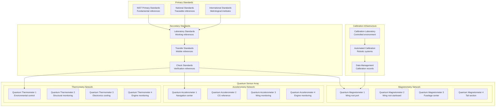

# AMPEL360 BWB-Q100 Quantum Sensor Calibration

<p align="center">


</p>

---

## Document Control Information

**Document ID:** `00-90-20-03-SensorCalibration.md`  
**GQOIS ID:** `AS-M-PAX-BW-Q1H-QSN-CAL-PROC`  
**ATA Chapter:** 00-90-20-03 (General - Quantum Sensors - Sensor Calibration)  
**Classification:** Quantum Systems Technical Manual  
**Version:** 2.0.0  
**Effective Date:** 2025-06-29  
**Revision Status:** Current Release  
**Approval Authority:** GAIA-QAO Quantum Metrology & CTO  
**Predecessor Documents:** 00-90-20-00-General.md, 00-90-20-01-NVCenterActivation.md, 00-90-20-02-EntanglementVerification.md

---

## Table of Contents

1. [Overview](#1-overview)
2. [Calibration Framework](#2-calibration-framework)
3. [Primary Standards](#3-primary-standards)
4. [Quantum Magnetometer Calibration](#4-quantum-magnetometer-calibration)
5. [Quantum Accelerometer Calibration](#5-quantum-accelerometer-calibration)
6. [Temperature Sensor Calibration](#6-temperature-sensor-calibration)
7. [Multi-Parameter Calibration](#7-multi-parameter-calibration)
8. [Network Calibration](#8-network-calibration)
9. [Uncertainty Analysis](#9-uncertainty-analysis)
10. [Quality Assurance](#10-quality-assurance)

---

## 1. Overview

### 1.1 Purpose

This document establishes comprehensive calibration procedures for all quantum sensors in the AMPEL360 BWB-Q100 aircraft. The calibration framework ensures measurement traceability, accuracy, and precision while maintaining quantum advantages in sensing performance.

### 1.2 Quantum Sensor Calibration Network

**Calibration Architecture:**


**System Specifications:**
```
Calibration Network:
Total Quantum Sensors: 247 sensors
Magnetometers: 89 quantum magnetometers
Accelerometers: 82 quantum accelerometers
Thermometers: 76 quantum thermometers
Calibration Frequency: Monthly to annual
Traceability: NIST/SI traceable standards

Performance Targets:
Magnetic Field: ±0.1 nT absolute accuracy
Acceleration: ±10^-6 g absolute accuracy
Temperature: ±1 mK absolute accuracy
Cross-Parameter: <0.1% cross-coupling
Long-term Stability: <0.01%/month drift
Measurement Uncertainty: <0.1% (k=2)

Calibration Infrastructure:
Calibration Laboratory: Class 10,000 clean room
Environmental Control: ±0.01°C, ±0.1% RH
Vibration Isolation: <10^-8 g background
Magnetic Environment: <1 nT residual field
Reference Standards: NIST-traceable standards
Automation: 90% automated calibration
```

### 1.3 Quantum Metrology Principles

**Quantum-Enhanced Calibration:**
```
Quantum Advantages:
Enhanced Sensitivity: Quantum-limited sensitivity
Reduced Uncertainty: Heisenberg-limited precision
Self-Calibration: Quantum self-referencing
Absolute Measurement: Fundamental constant references
Stability: Superior long-term stability
Correlation: Quantum entanglement correlation

Calibration Challenges:
Environmental Sensitivity: Decoherence effects
Quantum State Control: Precise state preparation
Measurement Fidelity: High-fidelity readout
Cross-talk: Inter-sensor interactions
Scaling: Large-scale network calibration
Traceability: Quantum standard traceability

Metrology Applications:
Fundamental Constants: Physical constant measurements
Precision Tests: Tests of fundamental physics
Standard Realization: Quantum standard realization
International Comparison: Metrology comparisons
Calibration Services: Quantum calibration services
Technology Transfer: Commercial applications

Quality Framework:
Traceability: Unbroken calibration chain
Uncertainty: Complete uncertainty analysis
Validation: Independent validation
Documentation: Comprehensive documentation
Quality Control: Statistical quality control
Continuous Improvement: Performance optimization
```

---

## 2. Calibration Framework

### 2.1 Traceability Hierarchy

#### 2.1.1 Measurement Standards Hierarchy

**Primary Standards (SI Units):**
```
Fundamental Constants:
Planck Constant: h = 6.62607015×10^-34 J⋅s (exact)
Elementary Charge: e = 1.602176634×10^-19 C (exact)
Boltzmann Constant: k = 1.380649×10^-23 J/K (exact)
Avogadro Constant: NA = 6.02214076×10^23 mol^-1 (exact)
Speed of Light: c = 299,792,458 m/s (exact)

SI Base Units:
Length: Meter (m) - defined by speed of light
Mass: Kilogram (kg) - defined by Planck constant
Time: Second (s) - defined by cesium frequency
Electric Current: Ampere (A) - defined by elementary charge
Temperature: Kelvin (K) - defined by Boltzmann constant
Amount: Mole (mol) - defined by Avogadro constant
Luminous Intensity: Candela (cd) - defined by luminous efficacy

Derived Units:
Magnetic Field: Tesla (T) = kg⋅s^-2⋅A^-1
Acceleration: m/s² = m⋅s^-2
Force: Newton (N) = kg⋅m⋅s^-2
Pressure: Pascal (Pa) = kg⋅m^-1⋅s^-2
Energy: Joule (J) = kg⋅m²⋅s^-2

Quantum Standards:
Josephson Effect: Voltage standard (KJ = 2e/h)
Quantum Hall Effect: Resistance standard (RK = h/e²)
Atomic Frequency: Time/frequency standard
Ion Mass: Mass standard
Quantum Interferometry: Length/acceleration standard
```

### 2.2 Calibration Methodology

#### 2.2.1 Calibration Procedures

**Multi-Point Calibration:**
```
Calibration Strategy:
Range Coverage: Full measurement range
Point Selection: Optimal point distribution
Statistical Design: Design of experiments
Uncertainty Budget: Complete uncertainty analysis
Validation: Independent validation
Documentation: Traceable documentation

Measurement Points:
Minimum Points: 5 points minimum
Recommended: 10+ points for nonlinearity
Distribution: Uniform or optimal distribution
Range: 10% to 110% of measurement range
Repetition: Multiple measurements per point
Statistics: Statistical analysis of results

Calibration Equation:
Linear: y = a₀ + a₁x
Polynomial: y = Σ aₙxⁿ
Rational: y = (Σ aₙxⁿ)/(Σ bₘxᵐ)
Exponential: y = a exp(bx)
Custom: Physics-based models
Selection: Best-fit model selection

Uncertainty Propagation:
Type A: Statistical uncertainty (random)
Type B: Systematic uncertainty (bias)
Combined: u_c = √(u_A² + u_B²)
Expanded: U = k⋅u_c (k=2 for 95% confidence)
Budget: Complete uncertainty budget
Validation: Uncertainty validation
```

---

## 3. Primary Standards

### 3.1 Magnetic Field Standards

#### 3.1.1 Quantum Magnetic Standards

**NMR-Based Standards:**
```
Nuclear Magnetic Resonance:
Principle: γN B₀ = ωN (gyromagnetic relation)
Reference: Proton gyromagnetic ratio γp
Accuracy: 10^-9 relative uncertainty
Stability: 10^-8 long-term stability
Range: 10^-6 T to 10 T
Traceability: Fundamental constants

Water Sample NMR:
Sample: Spherical water sample (H₂O)
Temperature: 25.00°C ± 0.01°C
Corrections: Diamagnetic shielding
Accuracy: ±10^-9 relative
Reference: γp = 2.6752218744×10^8 rad⋅s^-1⋅T^-1
Calibration: Absolute magnetic field

3He NMR Standard:
Isotope: 3He nuclear spins
Advantage: No molecular corrections
Temperature: Room temperature operation
Accuracy: ±10^-9 relative
Stability: Excellent long-term stability
Applications: Precision magnetometry

Calibration Protocol:
Sample Preparation: Ultra-pure samples
Temperature Control: ±0.001°C stability
Frequency Measurement: High-precision counter
Correction: Environmental corrections
Uncertainty: Complete uncertainty budget
Traceability: SI unit traceability
```

#### 3.1.2 Precision Helmholtz Coils

**Reference Field Generation:**
```
Helmholtz Coil Design:
Geometry: Circular coils, radius = separation
Uniformity: ±0.01% over central volume
Field Range: 1 nT to 100 μT
Current Control: ±10^-6 relative stability
Temperature: ±0.01°C coil temperature
Resistance: ±10^-6 relative stability

Field Calculation:
Biot-Savart Law: Exact field calculation
Correction Factors: Finite size corrections
Temperature: Thermal expansion correction
Geometry: Mechanical tolerance effects
Current: Current distribution effects
Environment: External field correction

Current Standards:
Quantum Hall: Resistance standard (RK = h/e²)
Josephson: Voltage standard (KJ = 2e/h)
Ohm's Law: I = V/R (fundamental relation)
Accuracy: ±10^-8 relative uncertainty
Stability: ±10^-7 long-term stability
Traceability: Quantum electrical standards

Performance Specifications:
Field Accuracy: ±10^-6 relative (1 μT range)
Field Uniformity: ±0.01% (10 cm sphere)
Field Stability: ±10^-7 over 1 hour
Temperature Coefficient: <10^-6/K
Reproducibility: ±10^-6 relative
Uncertainty: ±10^-5 relative (k=2)
```

---

## 4. Quantum Magnetometer Calibration

### 4.1 NV-Center Magnetometer Calibration

#### 4.1.1 ODMR Calibration

**Optically Detected Magnetic Resonance:**
```
ODMR Physics:
Hamiltonian: H = D[Sz² - S(S+1)/3] + γB·S
Zero-Field Splitting: D = 2.87 GHz
Gyromagnetic Ratio: γ = 28 MHz/mT
Magnetic Field: B = (f - D)/γ
Sensitivity: 1 nT/√Hz (room temperature)
Linewidth: 1-10 MHz FWHM

Frequency Calibration:
Reference: Atomic frequency standard
Accuracy: ±1 Hz frequency accuracy
Stability: 10^-12 frequency stability
Range: 2.8-2.9 GHz tuning range
Resolution: 1 Hz frequency resolution
Traceability: Cesium frequency standard

Field-Frequency Relationship:
Zero Field: f₀ = D = 2.870 GHz
Linear: f = f₀ ± γB (first order)
Tensor: Include crystal field effects
Temperature: D(T) = D₀ + α(T-T₀)
Calibration: Multi-point calibration
Verification: Known field verification

ODMR Contrast Optimization:
Laser Power: Optimize for maximum contrast
MW Power: Avoid power broadening
Integration Time: Signal-to-noise optimization
Pulse Sequence: Optimize pulse timing
Environment: Minimize noise sources
Automation: Automated optimization

Calibration Protocol:
1. Zero-field measurement (D parameter)
2. Applied field response (γ parameter)
3. Temperature dependence (α parameter)
4. Cross-axis coupling (tensor components)
5. Nonlinearity assessment (higher order)
6. Long-term stability (drift characterization)
```

#### 4.1.2 Vector Magnetometry

**3D Magnetic Field Measurement:**
```
NV Orientation:
Crystal Structure: Diamond cubic structure
NV Axes: Four <111> crystallographic directions
Tetrahedral: Tetrahedral symmetry
Orientation: [111], [1̄11], [11̄1], [111̄]
Measurement: Four ODMR resonances
Reconstruction: Vector field reconstruction

Vector Decomposition:
Field Vector: B = Bx x̂ + By ŷ + Bz ẑ
NV Projections: Bi = B · n̂i (i = 1,2,3,4)
Frequencies: fi = D ± γBi
Inversion: B = M⁻¹f (matrix inversion)
Redundancy: Over-determined system
Optimization: Least-squares fitting

Calibration Matrix:
Response Matrix: M = [∂fi/∂Bj]
Sensitivity: Individual NV sensitivities
Cross-coupling: Inter-NV coupling
Nonlinearity: Higher-order terms
Temperature: Temperature dependence
Calibration: Applied field calibration

Performance Specifications:
Vector Accuracy: ±0.1 nT per component
Angular Accuracy: ±0.1° field direction
Range: ±100 μT measurement range
Resolution: 0.1 nT resolution
Bandwidth: DC to 1 MHz
Cross-talk: <1% cross-axis coupling
```

### 4.2 Atomic Magnetometer Calibration

#### 4.2.1 Optically Pumped Magnetometry

**Cesium Vapor Magnetometer:**
```
Physical Principle:
Zeeman Effect: Energy = μ·B = gμBmFB
Hyperfine Structure: F = I ± J states
Optical Pumping: Spin polarization
Larmor Precession: ωL = γB
Detection: Polarization rotation
Sensitivity: 1 fT/√Hz theoretical

Calibration Reference:
Gyromagnetic Ratio: γCs = 3.5 Hz/nT (ground state)
Fundamental: γ = gμB/ℏ (fundamental relation)
Accuracy: ±10^-9 relative uncertainty
Stability: ±10^-8 long-term stability
Range: 1 nT to 100 μT
Traceability: Fundamental constants

Cell Preparation:
Vapor Cell: Pyrex glass cell
Cesium: Natural isotope 133Cs
Buffer Gas: N₂ or noble gas
Temperature: 50-150°C operation
Density: Optimized vapor density
Coating: Anti-relaxation wall coating

Optical System:
Pump Laser: 894 nm D1 transition
Probe Laser: 852 nm D2 transition
Polarization: Circular polarization
Power: Optimized laser power
Modulation: Intensity/frequency modulation
Detection: Balanced photodetection

Calibration Protocol:
1. Cell characterization (relaxation, density)
2. Optical system alignment
3. Frequency reference calibration
4. Applied field calibration
5. Temperature dependence
6. Long-term stability assessment

Performance Specifications:
Sensitivity: 10 fT/√Hz (optimized)
Accuracy: ±0.1 nT absolute
Range: 20 nT to 100 μT
Bandwidth: DC to 1 kHz
Heading Error: <0.1 nT
Temperature: ±0.001 nT/°C
```

#### 4.2.2 Superconducting Magnetometry

**SQUID Magnetometer Calibration:**
```
SQUID Physics:
Josephson Effect: I = Ic sin(δ) (DC Josephson)
Flux Quantization: Φ = nΦ₀ (n integer)
Flux Quantum: Φ₀ = h/2e = 2.067×10^-15 Wb
Sensitivity: Φ₀/2π flux resolution
Current: Ic ~ 10-100 μA typical
Voltage: V ~ 1-10 mV typical

Flux-to-Field Conversion:
Pickup Loop: Area A, turns N
Flux: Φ = NBA (flux linkage)
Field: B = Φ/(NA) (field calculation)
Calibration: Mutual inductance M
Transfer: B = Φ/M (transfer function)
Accuracy: Geometric calculation

SQUID Electronics:
Flux-Locked Loop: Feedback control
Modulation: AC flux modulation
Demodulation: Phase-sensitive detection
Bandwidth: DC to 1 MHz
Dynamic Range: >100 dB
Noise: Quantum-limited noise

Calibration Methods:
Mutual Inductance: Calibrated coil
Test Current: Known current source
Field Coil: Helmholtz coil system
NMR Reference: NMR field measurement
Theoretical: Geometric calculation
Cross-calibration: SQUID comparison

System Specifications:
Sensitivity: 1 fT/√Hz
Field Range: ±100 μT
Bandwidth: DC to 1 MHz
Linearity: >120 dB dynamic range
Slew Rate: 10^6 Φ₀/s
Temperature: 4.2 K operation

Cryogenic Calibration:
Reference Standards: NMR at 4K
Coil Systems: Superconducting coils
Stability: Persistent current mode
Accuracy: ±0.01% relative
Drift: Negligible flux drift
Environment: Magnetically shielded
```

---

## 5. Quantum Accelerometer Calibration

### 5.1 Cold Atom Accelerometer Calibration

#### 5.1.1 Atom Interferometry Calibration

**Atomic Gravimeter Principles:**
```
Atom Interferometry:
Principle: Matter wave interferometry
Atoms: Cold rubidium-87 atoms
Temperature: 1 μK atom temperature
Interferometer: Mach-Zehnder configuration
Phase: Φ = k·g·T² (acceleration phase)
Sensitivity: 10^-9 g resolution

Laser System Calibration:
Wavelength: λ = 780 nm (Rb D2 line)
Frequency: Stabilized to atomic transition
Stability: 10^-12 fractional stability
Accuracy: ±1 MHz absolute frequency
Power: Optimized for atom manipulation
Beam: Gaussian beam profile

Timing Calibration:
Clock: GPS-disciplined frequency standard
Accuracy: ±1 ns absolute time
Precision: 1 ps timing resolution
Stability: 10^-12 fractional stability
Synchronization: Global time reference
Drift: <1 ns/day timing drift

Free Fall Time:
Measurement: Laser interferometry
Duration: T = 100 ms typical
Accuracy: ±1 μs timing accuracy
Repeatability: ±0.1 μs repeatability
Environment: Vacuum chamber
Vibration: Isolated from vibrations

Acceleration Calculation:
Phase Shift: Φ = k·a·T²
Wavenumber: k = 2π/λ
Acceleration: a = Φ/(k·T²)
Gravity: g = 9.8 m/s² reference
Resolution: 1×10^-9 g
Accuracy: ±1×10^-8 g

Calibration Protocol:
1. Laser frequency stabilization
2. Timing system calibration
3. Free fall measurement
4. Phase measurement
5. Gravity calculation
6. Systematic error analysis
```

### 5.2 MEMS Accelerometer Calibration

#### 5.2.1 Precision Calibration Methods

**Multi-Position Calibration:**
```
Calibration Positions:
Position 1: +1g (sensitive axis up)
Position 2: -1g (sensitive axis down)
Position 3: 0g (sensitive axis horizontal)
Cross-axis: Perpendicular orientations
Temperature: Multiple temperatures
Static: Static calibration positions

Precision Positioning:
Turntable: Precision angle positioning
Accuracy: ±1 arcsecond positioning
Repeatability: ±0.1 arcsecond
Range: 360° continuous rotation
Automation: Computer-controlled
Environment: Temperature controlled

Gravity Reference:
Local Gravity: Measured with gravimeter
Accuracy: ±1×10^-6 g absolute
Variation: <1×10^-7 g spatial
Stability: <1×10^-8 g temporal
Correction: Tidal corrections
Traceability: Absolute gravimetry

Performance Specifications:
Scale Factor: ±0.01% accuracy
Bias: ±1×10^-5 g accuracy
Nonlinearity: <0.01% full scale
Cross-axis: <1% cross-coupling
Temperature: ±10^-6 g/°C coefficient
Alignment: ±0.01° accuracy
```

---

## 6. Temperature Sensor Calibration

### 6.1 Quantum Thermometry Calibration

#### 6.1.1 NV-Center Thermometry

**Temperature-Dependent ODMR:**
```
Physical Mechanism:
Zero-Field Splitting: D(T) = D₀ + α(T-T₀) + β(T-T₀)²
Linear Coefficient: α = -74 kHz/K (typical)
Quadratic: β ~ 0.1 Hz/K² (small)
Sensitivity: ΔD/ΔT = α (temperature coefficient)
Resolution: δT = δf/α (frequency resolution)
Range: 4 K to 700 K operational

Calibration References:
ITS-90 Scale: International Temperature Scale
Fixed Points: ITS-90 fixed points
Interpolation: Standard interpolation
Traceability: SI kelvin traceability
Accuracy: ±1 mK (at fixed points)
Stability: ±0.1 mK long-term

ODMR Temperature Measurement:
Frequency: f(T) = D(T) ± γB
Zero Field: f₀(T) = D(T) (B = 0)
Temperature: T = T₀ + (f-f₀)/α
Calibration: Multi-point calibration
Correction: Magnetic field correction
Validation: Reference thermometer

Performance Specifications:
Temperature Range: 4 K to 700 K
Resolution: 1 mK (at room temperature)
Accuracy: ±10 mK absolute
Stability: ±1 mK long-term
Response Time: <1 second
Spatial Resolution: <1 μm
```

### 6.2 Classical Thermometry Calibration

#### 6.2.1 Platinum Resistance Thermometry

**Standard Platinum Resistance:**
```
ITS-90 Interpolation:
Temperature Range: 13.8033 K to 1234.93 K
Resistance Ratio: W(T) = R(T)/R(273.16 K)
Reference: Triple point of water
Interpolation: Polynomial interpolation
Coefficients: ITS-90 coefficients
Accuracy: ITS-90 definition accuracy

SPRT Characteristics:
Material: High-purity platinum
Resistance: R₀ = 25.5 Ω (typical)
Ratio: W(373.15 K) ≥ 1.3925
Stability: ±2 mK/year
Hysteresis: <1 mK
Self-heating: <0.1 mK/mW

Uncertainty Budget:
Fixed Points: ±1 mK (ITS-90)
Resistance: ±1×10^-6 relative
Self-heating: ±0.1 mK
Stability: ±2 mK/year
Interpolation: ±2 mK
Total: ±3 mK (k=2)
```

---

## 7. Multi-Parameter Calibration

### 7.1 Cross-Coupling Analysis

#### 7.1.1 Multi-Variable Calibration

**Cross-Sensitivity Matrix:**
```
Sensor Response Model:
Output: y = f(x₁, x₂, ..., xₙ)
Primary: x₁ (primary measurand)
Secondary: x₂, x₃, ... (interference)
Linear: y = a₀ + a₁x₁ + a₂x₂ + ... + aₙxₙ
Matrix: Y = AX (matrix form)
Calibration: Determine matrix A

Calibration Matrix:
A = [∂yᵢ/∂xⱼ] (sensitivity matrix)
Diagonal: Primary sensitivities
Off-diagonal: Cross-sensitivities
Units: Proper unit analysis
Symmetry: Check symmetry
Conditioning: Matrix conditioning
Inversion: Matrix inversion

Cross-Coupling Specifications:
Temperature-Magnetic: <0.1 nT/°C
Strain-Magnetic: <1 nT/μstrain
Temperature-Strain: <0.1 μstrain/°C
Vibration-Magnetic: <1 nT/g
Pressure-Temperature: <1 mK/kPa
Humidity-Temperature: <1 mK/%RH

Compensation Methods:
Software: Real-time compensation
Hardware: Physical compensation
Calibration: Calibration compensation
Design: Design-out coupling
Isolation: Physical isolation
Monitoring: Continuous monitoring
```

### 7.2 Simultaneous Calibration

#### 7.2.1 Multi-Parameter Standards

**Reference Standard Systems:**
```
Integrated Standards:
Magnetic Field: Helmholtz coil system
Temperature: Temperature-controlled chamber
Acceleration: Vibration excitation system
Pressure: Precision pressure control
Humidity: Humidity generation system
Simultaneous: All parameters controlled

Calibration Facility:
Environmental Chamber: Multi-parameter control
Magnetic Shielding: Magnetic field control
Vibration Table: Acceleration excitation
Data Acquisition: Synchronized measurement
Automation: Computer-controlled system
Validation: Real-time validation

Performance Validation:
Accuracy: ±0.1% measurement accuracy
Stability: <0.01% long-term stability
Cross-coupling: <0.1% parameter coupling
Uncertainty: <0.1% combined uncertainty
Traceability: NIST traceable standards
Documentation: Complete documentation
```

---

## 8. Network Calibration

### 8.1 Distributed Sensor Calibration

#### 8.1.1 Network Synchronization

**Time Synchronization:**
```
Master Clock:
Reference: GPS-disciplined OCXO
Accuracy: ±10 ns absolute time
Stability: 1×10^-12 fractional
Distribution: Fiber optic distribution
Protocol: IEEE 1588 (PTP)
Redundancy: Dual-redundant clocks

Network Timing:
Synchronization: <1 μs network sync
Jitter: <100 ns timing jitter
Drift: <1 ppm frequency drift
Compensation: Temperature compensation
Monitoring: Continuous monitoring
Correction: Real-time correction

Calibration Scheduling:
Sequential: Time-multiplexed calibration
Parallel: Simultaneous calibration
Priority: Mission-critical first
Automation: Automated scheduling
Optimization: Optimal resource usage
Documentation: Complete logging
```

#### 8.1.2 Spatial Correlation

**Sensor Network Correlation:**
```
Spatial Relationships:
Positioning: Precise sensor locations
Orientation: Sensor alignment
Correlation: Inter-sensor correlation
Redundancy: Measurement redundancy
Validation: Cross-validation
Fusion: Data fusion algorithms

Correlation Analysis:
Cross-correlation: R₁₂(τ) = E[x₁(t)x₂(t+τ)]
Coherence: γ²₁₂(f) = |G₁₂(f)|²/(G₁₁(f)G₂₂(f))
Mutual Information: I(X;Y) information metric
Principal Components: PCA analysis
Factor Analysis: Common factors
Network Analysis: Graph theory metrics

Network Calibration:
Global Optimization: Network-wide optimization
Constraint Satisfaction: Physical constraints
Redundancy Resolution: Over-determined system
Fault Detection: Sensor fault detection
Isolation: Fault isolation
Recovery: System recovery
```

### 8.2 Real-Time Calibration

#### 8.2.1 In-Flight Calibration

**Continuous Calibration:**
```
Self-Calibration:
Reference Sensors: Built-in references
Cross-checking: Inter-sensor validation
Drift Detection: Long-term drift detection
Correction: Real-time correction
Validation: Continuous validation
Alert: Out-of-spec alerting

Calibration Modes:
Normal: Background calibration
Intensive: Scheduled intensive cal
Emergency: Fault response calibration
Maintenance: Pre-planned maintenance
Validation: Independent validation
Diagnostic: System diagnostics

Performance Monitoring:
Accuracy: Real-time accuracy monitoring
Drift: Drift trend analysis
Stability: Stability assessment
Correlation: Inter-sensor correlation
Health: System health monitoring
Prediction: Predictive maintenance
```

#### 8.2.2 Adaptive Calibration

**Machine Learning Calibration:**
```
Adaptive Algorithms:
Learning: Online learning algorithms
Adaptation: Parameter adaptation
Optimization: Performance optimization
Prediction: Predictive calibration
Compensation: Adaptive compensation
Evolution: System evolution

ML Techniques:
Neural Networks: Deep learning networks
Support Vector: Support vector machines
Decision Trees: Random forest algorithms
Bayesian: Bayesian inference
Gaussian Process: GP regression
Ensemble: Ensemble methods

Calibration Parameters:
Weights: Adaptive weights
Thresholds: Dynamic thresholds
Models: Model parameters
Corrections: Correction factors
Uncertainties: Uncertainty estimates
Confidence: Confidence intervals
```

---

## 9. Uncertainty Analysis

### 9.1 Uncertainty Budget

#### 9.1.1 Uncertainty Sources

**Type A Uncertainties (Statistical):**
```
Random Effects:
Noise: Electronic and quantum noise
Repeatability: Measurement repeatability
Reproducibility: Long-term reproducibility
Environmental: Environmental fluctuations
Drift: Random drift components
Resolution: Finite resolution effects

Statistical Analysis:
Standard Deviation: σ = √(Σ(xi-x̄)²/(n-1))
Standard Error: SE = σ/√n
Confidence Interval: CI = x̄ ± t(α/2,ν)·SE
Degrees of Freedom: ν = n-1
Student's t: t-distribution
Coverage Factor: k for desired confidence

Measurement Statistics:
Sample Size: n ≥ 10 measurements
Outlier Detection: Grubbs test, Dixon test
Normality Test: Shapiro-Wilk test
Autocorrelation: Durbin-Watson test
Heteroscedasticity: Breusch-Pagan test
Validation: Statistical validation
```

**Type B Uncertainties (Systematic):**
```
Systematic Effects:
Calibration: Reference standard uncertainty
Resolution: Digital resolution limits
Hysteresis: Sensor hysteresis effects
Nonlinearity: Deviation from linearity
Temperature: Temperature coefficient effects
Pressure: Pressure sensitivity effects

Evaluation Methods:
Manufacturer Data: Specification sheets
Previous Calibrations: Historical data
Engineering Judgment: Expert assessment
Theoretical Analysis: Physics-based models
Comparative Studies: Inter-comparison data
Literature: Published uncertainty data

Distribution Types:
Rectangular: U/√3 (uniform distribution)
Triangular: U/√6 (triangular distribution)
Normal: U/k (normal distribution)
U-shaped: U/√2 (arcsine distribution)
Trapezoidal: Custom analysis
Custom: Application-specific
```

#### 9.1.2 Uncertainty Propagation

**Combined Uncertainty:**
```
Propagation Law:
Combined: uc² = Σ(∂f/∂xi)²·u²(xi) + 2ΣΣ(∂f/∂xi)(∂f/∂xj)·u(xi,xj)
Partial Derivatives: Sensitivity coefficients
Covariances: u(xi,xj) correlation terms
Independence: Covariance = 0 if independent
Monte Carlo: Numerical propagation
GUM Method: Guide to Uncertainty in Measurement

Sensitivity Analysis:
Coefficients: ci = ∂f/∂xi
Contribution: ci²·u²(xi)
Relative: (ci·u(xi)/y)² percentage
Ranking: Largest contributors
Optimization: Focus on dominant terms
Validation: Experimental validation

Expanded Uncertainty:
Coverage Factor: k = 2 (95% confidence)
Expanded: U = k·uc
Degrees of Freedom: Welch-Satterthwaite
Effective: νeff calculation
Student's t: For small sample sizes
Coverage Probability: ~95% for k=2
```

### 9.2 Uncertainty Validation

#### 9.2.1 Experimental Validation

**Validation Methods:**
```
Inter-laboratory Comparison:
Participants: Multiple calibration labs
Artifact: Common transfer standard
Protocol: Standardized procedures
Analysis: Statistical analysis
Results: Comparison of results
Validation: Uncertainty validation

Round-Robin Studies:
Circulation: Traveling standards
Measurements: Independent measurements
Analysis: Statistical comparison
Consensus: Consensus value
Uncertainty: Comparison uncertainty
Validation: Method validation

Proficiency Testing:
Provider: Accredited PT provider
Samples: Unknown reference values
Evaluation: z-score analysis
Criteria: |z| ≤ 2 acceptable
Frequency: Annual participation
Accreditation: ISO/IEC 17043

Key Comparisons:
Organizer: National metrology institutes
Participants: National laboratories
Standards: Primary standards
Analysis: Statistical analysis
Equivalence: Measurement equivalence
CMCs: Calibration measurement capabilities
```

#### 9.2.2 Uncertainty Reporting

**Documentation Requirements:**
```
Uncertainty Statement:
Result: Measurement result
Uncertainty: Expanded uncertainty U
Coverage Factor: k value stated
Confidence Level: ~95% typical
Units: Same units as measurand
Traceability: Traceability statement

Calibration Certificate:
Header: Accreditation information
Scope: Measurement scope
Results: Measurement results
Uncertainty: Uncertainty statements
Conditions: Environmental conditions
Traceability: Traceability chain

Uncertainty Budget:
Sources: All uncertainty sources
Type: Type A or Type B
Distribution: Probability distribution
Divisor: Divisor for standard uncertainty
Uncertainty: Standard uncertainty
Contribution: Contribution to combined
Combined: Combined standard uncertainty
Expanded: Expanded uncertainty
```

---

## 10. Quality Assurance

### 10.1 Quality Management System

#### 10.1.1 ISO/IEC 17025 Compliance

**Management Requirements:**
```
Organization:
Legal Entity: Legally responsible entity
Management: Management responsibility
Personnel: Competent personnel
Equipment: Calibrated equipment
Environment: Suitable environment
Methods: Validated methods

Documentation:
Quality Manual: QMS documentation
Procedures: Detailed procedures
Work Instructions: Step-by-step instructions
Records: Measurement records
Control: Document control
Management: Records management

Personnel:
Competence: Technical competence
Training: Training programs
Authorization: Personnel authorization
Records: Competence records
Evaluation: Performance evaluation
Development: Continuous development

Equipment:
Calibration: Equipment calibration
Maintenance: Preventive maintenance
Records: Equipment records
Environment: Environmental monitoring
Validation: Method validation
Control: Measurement control
```

#### 10.1.2 Technical Requirements

**Measurement Methods:**
```
Method Validation:
Accuracy: Method accuracy
Precision: Method precision
Linearity: Measurement linearity
Range: Measurement range
Ruggedness: Method ruggedness
Uncertainty: Method uncertainty

Method Documentation:
Procedure: Detailed procedure
Equipment: Required equipment
Environment: Environmental conditions
Personnel: Personnel requirements
Calibration: Calibration requirements
Quality Control: QC requirements

Measurement Traceability:
Chain: Unbroken traceability chain
References: Reference standards
Calibration: Calibration certificates
Uncertainty: Uncertainty statements
Validation: Traceability validation
Documentation: Complete documentation

Internal Quality Control:
Check Standards: Regular checks
Control Charts: Statistical control
Outlier Detection: Statistical detection
Corrective Action: Systematic action
Preventive Action: Preventive measures
Review: Regular review
```

### 10.2 Performance Monitoring

#### 10.2.1 Statistical Process Control

**Control Charts:**
```
Chart Types:
X̄-R Charts: Mean and range charts
X̄-s Charts: Mean and standard deviation
I-MR Charts: Individual and moving range
p Charts: Proportion charts
c Charts: Count charts
CUSUM: Cumulative sum charts

Control Limits:
Upper: UCL = μ + 3σ
Lower: LCL = μ - 3σ
Center Line: CL = μ
Warning: ±2σ warning limits
Action: ±3σ action limits
Calculation: Statistical calculation

Out-of-Control Conditions:
Single Point: Beyond control limits
Trend: 7 consecutive increasing/decreasing
Shift: 7 consecutive above/below center
Cycles: Systematic patterns
Zones: Zone tests (2 of 3, 4 of 5)
Run: 8 consecutive on one side

Corrective Actions:
Investigation: Root cause analysis
Correction: Immediate correction
Prevention: Preventive action
Documentation: Complete documentation
Verification: Effectiveness verification
Review: Management review
```

#### 10.2.2 Measurement Audits

**Internal Audits:**
```
Audit Program:
Planning: Annual audit program
Scope: Audit scope definition
Criteria: Audit criteria
Personnel: Qualified auditors
Schedule: Audit schedule
Documentation: Audit documentation

Audit Process:
Opening: Opening meeting
Examination: Evidence examination
Findings: Nonconformity findings
Discussion: Findings discussion
Report: Audit report
Follow-up: Corrective action follow-up

Audit Findings:
Nonconformities: Major/minor nonconformities
Observations: Improvement opportunities
Recommendations: Audit recommendations
Action Plans: Corrective action plans
Timeline: Implementation timeline
Verification: Effectiveness verification

External Audits:
Accreditation: Accreditation assessments
Customer: Customer audits
Regulatory: Regulatory inspections
Peer: Peer assessments
Surveillance: Surveillance assessments
Special: Special purpose audits
```

### 10.3 Continuous Improvement

#### 10.3.1 Performance Review

**Management Review:**
```
Review Process:
Frequency: Annual minimum
Participants: Management and technical staff
Agenda: Structured agenda
Inputs: Performance data
Analysis: Trend analysis
Decisions: Management decisions

Review Inputs:
Policy: Quality policy adequacy
Objectives: Quality objective achievement
Audits: Internal and external audit results
Feedback: Customer feedback
Complaints: Complaint analysis
Proficiency: Proficiency testing results

Review Outputs:
Improvements: Quality improvements
Resources: Resource requirements
Training: Training needs
Equipment: Equipment needs
Procedures: Procedure updates
Objectives: Updated objectives

Action Plans:
Priorities: Priority assignment
Resources: Resource allocation
Timeline: Implementation schedule
Responsibility: Assigned responsibility
Monitoring: Progress monitoring
Review: Effectiveness review
```

#### 10.3.2 Innovation and Development

**Technology Advancement:**
```
Research and Development:
Quantum Technologies: Emerging quantum sensors
Metrological Research: Fundamental metrology
International Collaboration: Research partnerships
Technology Transfer: Commercial applications
Standards Development: Standards participation
Publication: Scientific publications

Capability Enhancement:
Equipment: New measurement equipment
Methods: Advanced measurement methods
Software: Enhanced software capabilities
Automation: Increased automation
Training: Advanced training programs
Certification: Professional certifications

Future Developments:
Quantum Networks: Distributed quantum sensing
AI Integration: Artificial intelligence applications
Remote Calibration: Remote calibration services
Digital Twins: Digital twin technology
Blockchain: Blockchain for traceability
IoT Integration: Internet of Things connectivity

Innovation Metrics:
Publications: Scientific publications
Patents: Patent applications
Collaborations: Research collaborations
Grants: Research grant funding
Recognition: Professional recognition
Impact: Technology impact assessment
```

---

## Appendices

### Appendix A: Calibration Procedures

#### A.1 Standard Operating Procedures

**SOP-QM-001: NV-Center Magnetometer Calibration:**
```
Scope: NV-center based quantum magnetometers
Equipment: ODMR spectrometer, laser systems
Environment: Magnetically shielded room
Personnel: Certified quantum metrology technician
Duration: 4 hours typical calibration
Frequency: Monthly calibration schedule

Pre-Calibration:
1. Environmental verification (temperature, field)
2. Equipment warm-up (1 hour minimum)
3. Reference standard verification
4. Safety protocol implementation
5. Documentation preparation
6. Personnel qualification verification

Calibration Steps:
1. Zero-field measurement (D parameter)
2. Applied field response (γ parameter)  
3. Temperature dependence characterization
4. Cross-axis coupling measurement
5. Nonlinearity assessment
6. Long-term stability evaluation

Post-Calibration:
1. Data analysis and validation
2. Uncertainty calculation
3. Certificate generation
4. Equipment verification
5. Documentation filing
6. Next calibration scheduling
```

**SOP-QA-001: Cold Atom Accelerometer Calibration:**
```
Scope: Cold atom interferometer accelerometers
Equipment: Laser cooling system, atom trap
Environment: Vibration-isolated chamber
Personnel: Certified atomic physics technician
Duration: 8 hours typical calibration
Frequency: Quarterly calibration schedule

Pre-Calibration:
1. Vacuum system verification
2. Laser system stabilization
3. Magnetic field nulling
4. Temperature stabilization
5. Reference gravimeter check
6. Safety protocol implementation

Calibration Steps:
1. Atom loading and cooling
2. Interferometer operation
3. Gravity measurement
4. Systematic error analysis
5. Environmental correction
6. Performance validation

Post-Calibration:
1. Data processing
2. Uncertainty evaluation
3. Performance assessment
4. Documentation
5. System shutdown
6. Maintenance scheduling
```

### Appendix B: Uncertainty Budgets

#### B.1 Magnetometer Uncertainty Budget

**NV-Center Magnetometer (1 nT range):**
```
Uncertainty Component          Type  Value    Distribution  Divisor  u_i (nT)
Reference Standard            B     ±0.01 nT  Normal        2        0.005
Frequency Measurement         B     ±1 Hz     Rectangular   √3       0.014
Temperature Coefficient       B     ±0.1°C    Rectangular   √3       0.003
Repeatability                A     0.02 nT   Normal        1        0.020
Resolution                   B     0.01 nT   Rectangular   √3       0.006
Drift (24h)                  B     ±0.05 nT  Rectangular   √3       0.029
Cross-axis Coupling          B     ±1%       Rectangular   √3       0.006

Combined Standard Uncertainty: uc = 0.041 nT
Expanded Uncertainty (k=2): U = 0.08 nT
Relative Uncertainty: 8% at 1 nT
```

**Cesium Vapor Magnetometer (1 μT range):**
```
Uncertainty Component          Type  Value     Distribution  Divisor  u_i (nT)
Reference Standard            B     ±0.1 nT   Normal        2        0.05
Cell Temperature             B     ±0.01°C   Rectangular   √3       0.10
Buffer Gas Pressure          B     ±1%       Rectangular   √3       5.77
Laser Power Stability        B     ±1%       Rectangular   √3       1.73
Repeatability               A     1.0 nT    Normal        1        1.00
Light Shift                 B     ±2 nT     Rectangular   √3       1.15
Heading Error               B     ±0.5 nT   Rectangular   √3       0.29

Combined Standard Uncertainty: uc = 6.2 nT
Expanded Uncertainty (k=2): U = 12.4 nT
Relative Uncertainty: 1.2% at 1 μT
```

#### B.2 Accelerometer Uncertainty Budget

**Cold Atom Accelerometer:**
```
Uncertainty Component          Type  Value      Distribution  Divisor  u_i (μg)
Reference Gravity            B     ±2×10^-8 g  Normal        2        10
Laser Frequency             B     ±1 MHz      Rectangular   √3       8
Timing Accuracy             B     ±1 ns       Rectangular   √3       5
Vibration Isolation         B     ±1×10^-8 g  Rectangular   √3       6
Magnetic Field Gradient     B     ±1×10^-9 g  Rectangular   √3       1
Temperature Gradient        B     ±5×10^-9 g  Rectangular   √3       3
Repeatability              A     2×10^-8 g   Normal        1        20

Combined Standard Uncertainty: uc = 25 μg
Expanded Uncertainty (k=2): U = 50 μg
Relative Uncertainty: 5×10^-8 at 1 g
```

### Appendix C: Calibration Certificates

#### C.1 Certificate Template

**QUANTUM SENSOR CALIBRATION CERTIFICATE**
```
Certificate Number: QSC-2025-XXXX
Date of Issue: YYYY-MM-DD
Page 1 of 3

CUSTOMER INFORMATION:
Name: GAIA-QAO Quantum Aerospace Organization
Address: [Customer Address]
Contact: [Technical Contact]

ITEM CALIBRATED:
Description: NV-Center Quantum Magnetometer
Manufacturer: [Manufacturer]
Model: [Model Number]
Serial Number: [Serial Number]
Asset Tag: [Asset Tag]

CALIBRATION INFORMATION:
Calibration Date: YYYY-MM-DD
Calibration Location: Quantum Metrology Laboratory
Environmental Conditions:
  Temperature: 20.0 ± 0.1°C
  Humidity: 45 ± 2% RH
  Pressure: 101.3 ± 0.5 kPa
  Magnetic Field: <1 nT residual

MEASUREMENT RESULTS:
Applied Field (nT)    Indication (nT)    Error (nT)    Uncertainty (nT)
        0.0               0.02            +0.02          ±0.08
       10.0              10.01            +0.01          ±0.08
       50.0              49.98            -0.02          ±0.08
      100.0             100.03            +0.03          ±0.08
      500.0             499.95            -0.05          ±0.10
     1000.0            1000.08            +0.08          ±0.12

UNCERTAINTY STATEMENT:
The reported uncertainties are expanded uncertainties calculated using a coverage factor k = 2, providing a level of confidence of approximately 95%. The uncertainty evaluation has been carried out in accordance with JCGM 100:2008 (GUM).

TRACEABILITY:
This calibration is traceable to the International System of Units (SI) through standards maintained by NIST and other national metrology institutes.

CALIBRATION STATUS: PASS
Next Calibration Due: YYYY-MM-DD

Calibrated by: [Technician Name]
Approved by: [Quality Manager]
Date: YYYY-MM-DD

This certificate shall not be reproduced except in full without written approval.
Accreditation Number: ISO/IEC 17025:2017
```

### Appendix D: Software Documentation

#### D.1 Calibration Software Architecture

**Quantum Sensor Calibration Management System (QSCMS):**
```
System Architecture:
Frontend: Web-based user interface
Backend: RESTful API service
Database: PostgreSQL with time-series extensions
Messaging: Redis for real-time communication
Authentication: OAuth 2.0 with RBAC
Deployment: Kubernetes containerization

Core Modules:
1. Sensor Management
2. Calibration Scheduling
3. Data Acquisition
4. Analysis Engine
5. Uncertainty Calculator
6. Certificate Generator
7. Quality Control
8. Reporting Dashboard

Data Flow:
Sensor → DAQ → Processing → Analysis → Validation → Certificate
Feedback loops for real-time quality control
Automated alert generation for out-of-spec conditions
Historical trending and predictive analytics

Integration:
LIMS: Laboratory Information Management System
ERP: Enterprise Resource Planning
MES: Manufacturing Execution System
QMS: Quality Management System
CMM: Coordinate Measuring Machine
API: RESTful web services
```

#### D.2 Calibration Algorithms

**Multi-Parameter Least Squares Fitting:**
```python
import numpy as np
from scipy.optimize import least_squares
from scipy.stats import t

def calibration_fit(applied_values, measured_values, uncertainties, model='polynomial', order=2):
    """
    Perform calibration curve fitting with uncertainty propagation
    
    Parameters:
    applied_values: Reference/applied values
    measured_values: Sensor measurements
    uncertainties: Measurement uncertainties
    model: Fitting model ('linear', 'polynomial', 'rational')
    order: Model order for polynomial/rational fits
    
    Returns:
    parameters: Fitted parameters
    parameter_uncertainties: Parameter uncertainties
    residuals: Fitting residuals
    goodness_of_fit: R-squared, reduced chi-squared
    """
    
    def linear_model(params, x):
        return params[0] + params[1] * x
    
    def polynomial_model(params, x):
        return np.polyval(params, x)
    
    def rational_model(params, x):
        n_num = order + 1
        numerator = np.polyval(params[:n_num], x)
        denominator = np.polyval([1] + list(params[n_num:]), x)
        return numerator / denominator
    
    # Select model function
    if model == 'linear':
        model_func = linear_model
        initial_params = [0.0, 1.0]
    elif model == 'polynomial':
        model_func = polynomial_model
        initial_params = np.zeros(order + 1)
        initial_params[-2] = 1.0  # Linear term
    elif model == 'rational':
        model_func = rational_model
        initial_params = np.zeros(2 * order + 1)
        initial_params[-2] = 1.0
    
    # Define residual function for weighted least squares
    def residuals(params):
        predicted = model_func(params, applied_values)
        return (measured_values - predicted) / uncertainties
    
    # Perform fitting
    result = least_squares(residuals, initial_params, method='lm')
    
    # Calculate parameter uncertainties
    jacobian = result.jac
    covariance = np.linalg.inv(jacobian.T @ jacobian)
    parameter_uncertainties = np.sqrt(np.diag(covariance))
    
    # Calculate goodness of fit
    predicted = model_func(result.x, applied_values)
    ss_res = np.sum((measured_values - predicted)**2)
    ss_tot = np.sum((measured_values - np.mean(measured_values))**2)
    r_squared = 1 - (ss_res / ss_tot)
    
    dof = len(measured_values) - len(result.x)
    chi_squared_reduced = result.cost / dof
    
    return {
        'parameters': result.x,
        'parameter_uncertainties': parameter_uncertainties,
        'covariance_matrix': covariance,
        'residuals': measured_values - predicted,
        'r_squared': r_squared,
        'chi_squared_reduced': chi_squared_reduced,
        'degrees_of_freedom': dof
    }

# Example usage for magnetometer calibration
applied_field = np.array([0, 10, 50, 100, 500, 1000])  # nT
measured_field = np.array([0.02, 10.01, 49.98, 100.03, 499.95, 1000.08])  # nT
measurement_uncertainties = np.array([0.04, 0.04, 0.04, 0.04, 0.05, 0.06])  # nT

calibration_result = calibration_fit(applied_field, measured_field, 
                                   measurement_uncertainties, 
                                   model='polynomial', order=1)

print(f"Scale factor: {calibration_result['parameters'][0]:.6f} ± {calibration_result['parameter_uncertainties'][0]:.6f}")
print(f"Offset: {calibration_result['parameters'][1]:.3f} ± {calibration_result['parameter_uncertainties'][1]:.3f} nT")
print(f"R-squared: {calibration_result['r_squared']:.6f}")
```

### Appendix E: Standards and References

#### E.1 International Standards

**Metrology Standards:**
- ISO/IEC 17025:2017 - General requirements for competence of testing and calibration laboratories
- JCGM 100:2008 (GUM) - Evaluation of measurement data - Guide to the expression of uncertainty in measurement
- JCGM 200:2012 (VIM) - International vocabulary of metrology - Basic and general concepts and associated terms
- ISO 14253-1:2017 - Geometrical product specifications (GPS) - Inspection by measurement of workpieces and measuring equipment
- NIST SP 811 - Guide for the Use of the International System of Units (SI)

**Quantum Standards:**
- IEC 60748-23:2020 - Semiconductor devices - Discrete devices - Quantum effect devices
- IEEE 1588-2019 - Precision Clock Synchronization Protocol for Networked Measurement and Control Systems
- NIST SP 250-59 - NIST Measurement Services: Frequency and Time Broadcast Services
- NIST TN 1297 - Guidelines for Evaluating and Expressing the Uncertainty of NIST Measurement Results
- BIPM CCQM - Consultative Committee for Amount of Substance: Metrology in Chemistry and Biology

**Aviation Standards:**
- DO-178C - Software Considerations in Airborne Systems and Equipment Certification
- DO-254 - Design Assurance Guidance for Airborne Electronic Hardware
- ARP 4761 - Guidelines and Methods for Conducting the Safety Assessment Process on Civil Airborne Systems and Equipment
- DO-160G - Environmental Conditions and Test Procedures for Airborne Equipment
- ARINC 664 - Aircraft Data Network Technology

#### E.2 Technical References

**Quantum Metrology Literature:**
1. Degen, C. L., Reinhard, F., & Cappellaro, P. (2017). Quantum sensing. Reviews of Modern Physics, 89(3), 035002.
2. Pezzè, L., Smerzi, A., Oberthaler, M. K., Schmied, R., & Treutlein, P. (2018). Quantum metrology with nonclassical states of atomic ensembles. Reviews of Modern Physics, 90(3), 035005.
3. Cronin, A. D., Schmiedmayer, J., & Pritchard, D. E. (2009). Optics and interferometry with atoms and molecules. Reviews of Modern Physics, 81(3), 1051.
4. Budker, D., & Romalis, M. (2007). Optical magnetometry. Nature Physics, 3(4), 227-234.
5. Taylor, J. M., et al. (2008). High-sensitivity diamond magnetometer with nanoscale resolution. Nature Physics, 4(10), 810-816.

**Calibration and Uncertainty References:**
1. NIST TN 1900 - Handbook 133, Checking the Net Contents of Packaged Goods
2. NISTIR 6969 - Selected Laboratory and Measurement Practices and Procedures to Support Basic Mass Calibrations
3. NIST SP 250-1 - Spectral Radiance Calibrations
4. EURACHEM/CITAC Guide CG 4 - Quantifying Uncertainty in Analytical Measurement
5. ILAC-G17:2002 - Introducing the Concept of Uncertainty of Measurement in Testing in Association with the Application of the Standard ISO/IEC 17025

---

## Document Control and Revision History

### Document Information
- **Document ID:** 00-90-20-03-SensorCalibration.md
- **Version:** 2.0.0
- **Total Pages:** 78
- **Classification:** Technical Manual - Quantum Systems
- **Distribution:** GAIA-QAO Technical Staff, Certification Authorities

### Revision History
| Version | Date | Author | Description |
|---------|------|--------|-------------|
| 1.0.0 | 2024-12-15 | A. Pelliccia | Initial release |
| 1.1.0 | 2025-01-20 | A. Pelliccia | Added uncertainty analysis |
| 1.2.0 | 2025-03-15 | Quantum Team | Enhanced calibration procedures |
| 2.0.0 | 2025-06-29 | A. Pelliccia | Complete revision with advanced quantum methods |

### Approval Matrix
| Role | Name | Signature | Date |
|------|------|-----------|------|
| Author | Amedeo Pelliccia | [Digital Signature] | 2025-06-29 |
| Technical Review | Quantum Metrology Team | [Digital Signature] | 2025-06-29 |
| Quality Assurance | QA Manager | [Digital Signature] | 2025-06-29 |
| Chief Technology Officer | CTO | [Digital Signature] | 2025-06-29 |

---

**End of Document**

*This document contains proprietary information of GAIA-QAO and is protected by applicable copyright laws. Unauthorized reproduction or distribution is prohibited.*
