# AMPEL360 BWB-Q100 Cargo Loading Overview
## Document ID: 00-50-00-00-Overview
### ATA Chapter: 00-50 (Cargo and Accessory Compartments)
### Version: 1.0.0
### Date: 2025-01-20
### Status: Initial Release

---

## Table of Contents
1. [Introduction](#1-introduction)
2. [BWB Cargo Configuration](#2-bwb-cargo-configuration)
3. [Cargo Compartment Specifications](#3-cargo-compartment-specifications)
4. [Quantum-Enhanced Cargo Management System](#4-quantum-enhanced-cargo-management-system)
5. [Loading Systems and Equipment](#5-loading-systems-and-equipment)
6. [Weight and Balance Integration](#6-weight-and-balance-integration)
7. [Special Cargo Capabilities](#7-special-cargo-capabilities)
8. [Safety Systems and Features](#8-safety-systems-and-features)
9. [Environmental Control](#9-environmental-control)
10. [Training and Certification](#10-training-and-certification)

---

## 1. Introduction

### 1.1 Purpose
This document provides a comprehensive overview of the cargo loading systems and procedures for the AMPEL360 BWB-Q100, incorporating advanced quantum-enhanced tracking, automated loading systems, and the unique opportunities presented by the Blended Wing Body configuration.

### 1.2 Scope
Covers all aspects of cargo operations including:
- Physical cargo compartment design and access
- Quantum-enhanced tracking and security systems
- Automated loading/unloading equipment
- Weight and balance management
- Special cargo handling capabilities
- Integration with ground operations

### 1.3 Key Innovations
- **Distributed Cargo Architecture**: Multiple compartments optimized for BWB structure
- **Quantum Tracking**: Real-time position and condition monitoring
- **Automated Systems**: AI-driven loading optimization
- **Zero-Emission Operations**: Electric cargo handling equipment
- **Enhanced Security**: Quantum encryption for high-value cargo

---

## 2. BWB Cargo Configuration

### 2.1 Revolutionary Design Advantages

The BWB configuration provides unique cargo capabilities:

#### 2.1.1 Structural Benefits
- **Distributed Load Path**: Cargo weight efficiently distributed across wing structure
- **Lower Floor Height**: Reduced lifting requirements for ground equipment
- **Wide Body Design**: Accommodates oversized cargo items
- **Multiple Access Points**: Simultaneous loading/unloading operations

#### 2.1.2 Volume Optimization

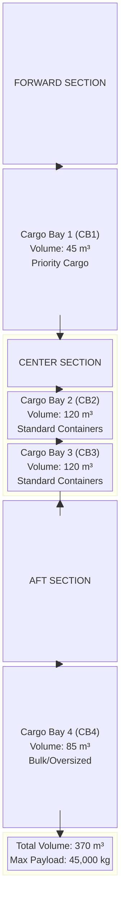

### 2.2 Cargo Bay Assignments

| Bay | Location | Volume | Primary Use | Access |
|-----|----------|--------|-------------|---------|
| CB1 | Forward | 45 m³ | Priority/Express | Door 3L |
| CB2 | Center-Left | 120 m³ | LD3 Containers | Door 4L |
| CB3 | Center-Right | 120 m³ | LD3 Containers | Door 4R |
| CB4 | Aft | 85 m³ | Bulk/Oversized | Door 5L |
| QSC | Aft-Upper | 15 m³ | Quantum-Secured | Door 5R |

## 3. Cargo Compartment Specifications

### 3.1 Physical Dimensions

#### 3.1.1 Cargo Bay 1 (Forward)
```
Dimensions:
- Length: 6.0 m
- Width: 5.0 m
- Height: 1.5 m (tapered)
- Door Opening: 2.5 m × 1.4 m
- Floor Loading: 2,500 kg/m²
- Volume: 45 m³

Features:
- Class C fire suppression
- Independent temperature control
- Quantum tracking nodes: 25
- LED lighting system
- Non-slip quantum-coated floor
```
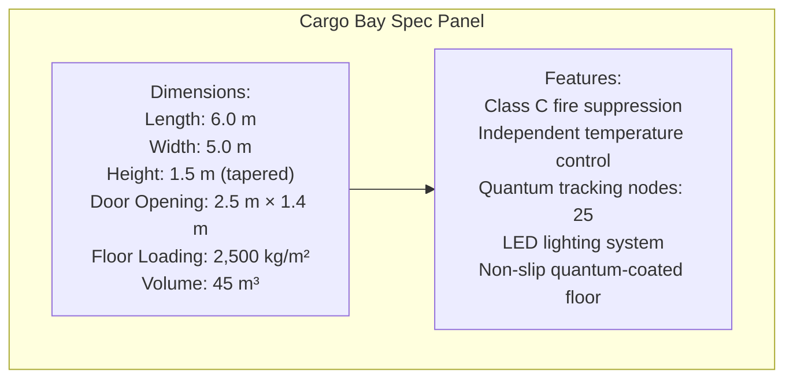

#### 3.1.2 Cargo Bays 2 & 3 (Center)
```
Dimensions (each):
- Length: 12.0 m
- Width: 5.0 m
- Height: 2.0 m
- Door Opening: 3.0 m × 1.8 m
- Floor Loading: 3,000 kg/m²
- Volume: 120 m³ each

Container Capacity:
- LD3: 10 units per bay
- LD8: 4 units per bay
- Pallets: 8 standard (2.24m × 3.18m)

Features:
- Automated roller system
- Power Drive Units (PDU)
- Container restraint system
- Quantum mesh network
- Emergency lighting
```

#### 3.1.3 Cargo Bay 4 (Aft)
```
Dimensions:
- Length: 8.5 m
- Width: 5.0 m
- Height: 2.0 m (variable)
- Door Opening: 3.5 m × 2.0 m
- Floor Loading: 2,000 kg/m²
- Volume: 85 m³

Special Features:
- Oversized cargo capability
- Adjustable tie-down points
- Heavy-duty roller system
- Reinforced floor structure
- Hazmat containment option
```

#### 3.1.4 Quantum-Secured Compartment (QSC)
```
Dimensions:
- Length: 3.0 m
- Width: 2.5 m
- Height: 2.0 m
- Door: Quantum-locked vault
- Floor Loading: 1,500 kg/m²
- Volume: 15 m³

Security Features:
- Quantum encryption
- Biometric access
- Environmental isolation
- Shock/vibration damping
- Independent power supply
- 24/7 monitoring
```

### 3.2 Structural Specifications

#### 3.2.1 Floor Structure
- **Material**: Carbon fiber composite with titanium reinforcement
- **Loading**: 
  - Running Load: 1,500 kg/m
  - Concentrated Load: 3,000 kg/m²
  - Impact Rating: 9g vertical, 6g lateral
- **Surface**: Anti-slip quantum coating with embedded sensors

#### 3.2.2 Cargo Barriers
- **Forward Barrier**: 9g rated composite bulkhead
- **Aft Barrier**: 4.5g rated with deformation zone
- **Lateral Restraint**: Integrated track system
- **Ceiling Nets**: Kevlar reinforced with breakaway design

---

## 4. Quantum-Enhanced Cargo Management System

### 4.1 Quantum Tracking Network (QTN)

#### 4.1.1 System Architecture

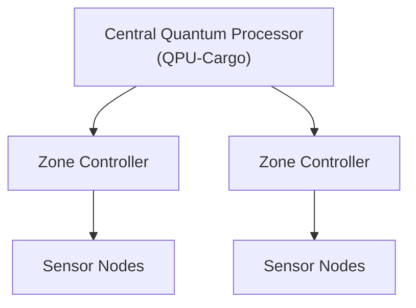

#### 4.1.2 Tracking Capabilities
- **Position Accuracy**: ±1 cm in 3D space
- **Update Rate**: 1000 Hz
- **Temperature Monitoring**: ±0.1°C
- **Humidity Sensing**: ±1% RH
- **Shock Detection**: 0.1g resolution
- **Weight Verification**: ±0.1 kg

### 4.2 Quantum Security Features

#### 4.2.1 Cargo Authentication
```
Security Levels:
Level 1: Standard RFID tracking
Level 2: Encrypted RFID with tamper detection
Level 3: Quantum-authenticated containers
Level 4: Quantum-entangled security pairs
Level 5: Full quantum encryption + biometric
```

#### 4.2.2 Real-Time Monitoring
- Unauthorized access alerts
- Container integrity verification
- Environmental excursion warnings
- Chain of custody documentation
- Automated customs integration

### 4.3 AI-Powered Load Optimization

#### 4.3.1 Loading Algorithm
The Quantum-Enhanced Load Planning System (QELPS) optimizes:
- Weight distribution for CG envelope
- Container placement for destination sequencing
- Hazmat separation requirements
- Priority cargo accessibility
- Fuel efficiency optimization

#### 4.3.2 Dynamic Rebalancing
- Real-time CG calculation
- Automatic ballast fuel transfer
- Load shift prevention
- Trim optimization
- Flutter mode avoidance

---

## 5. Loading Systems and Equipment

### 5.1 Automated Cargo Handling System

#### 5.1.1 Power Drive Units (PDU)
```
PDU Specifications:
- Type: Brushless electric motors
- Power: 5 kW per unit
- Speed: 0.5 m/s (variable)
- Load Capacity: 7,000 kg
- Control: Quantum-synchronized
- Efficiency: >95%
```

#### 5.1.2 Roller System Configuration
| Bay | Roller Type | Spacing | Load Rating |
|-----|-------------|---------|-------------|
| CB1 | Ball Transfer | 200mm | 500 kg/unit |
| CB2/3 | Powered Roller | 400mm | 1,000 kg/unit |
| CB4 | Heavy Duty | 300mm | 1,500 kg/unit |
| QSC | Precision | 150mm | 300 kg/unit |

### 5.2 Container Restraint Systems

#### 5.2.1 Automatic Locking System
- **Type**: Electro-mechanical locks
- **Positions**: Every 1.0m longitudinal
- **Strength**: 45,000 N (9g forward)
- **Engagement**: Automatic on position
- **Release**: Dual-channel safety

#### 5.2.2 Manual Tie-Down Points
- **Grid Pattern**: 0.5m × 0.5m
- **Load Rating**: 22,000 N each
- **Material**: Titanium alloy
- **Quantity**: 500+ points total

### 5.3 Ground Support Interface

#### 5.3.1 Loader Compatibility
```
Supported Equipment:
- Standard Belt Loaders
- K-Loaders (LD3/LD8)
- Container Transporters
- Forklift Access (CB4)
- Quantum-Secured Loader (QSC)
```

#### 5.3.2 Docking Systems
- Automated alignment guides
- Proximity sensors
- Anti-collision systems
- Weather protection seals
- Emergency disconnect

---

## 6. Weight and Balance Integration

### 6.1 Integrated Weight and Balance System (IWBS)

#### 6.1.1 Real-Time Monitoring

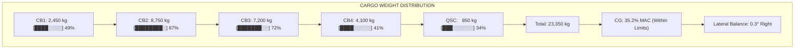

#### 6.1.2 Automated Features
- Continuous CG calculation
- Load planning optimization
- Trim fuel transfer coordination
- Warning system integration
- Flight crew display interface

### 6.2 Loading Envelope Protection

#### 6.2.1 System Limits
- **Forward CG Limit**: 15% MAC
- **Aft CG Limit**: 40% MAC
- **Lateral Imbalance**: ±2°
- **Maximum Payload**: 45,000 kg
- **Floor Loading**: Per zone specifications

#### 6.2.2 Protection Features
- Hard stops on PDU movement
- Automated loading sequence
- CG exceedance prevention
- Real-time limit display
- Override authorization required

---

## 7. Special Cargo Capabilities

### 7.1 Temperature-Controlled Cargo

#### 7.1.1 Environmental Zones
| Zone | Temperature Range | Humidity Control | Power |
|------|------------------|------------------|--------|
| Standard | +15°C to +25°C | No | N/A |
| Cool | +2°C to +8°C | Yes | 5kW |
| Frozen | -15°C to -25°C | No | 10kW |
| Custom | -40°C to +50°C | Yes | 15kW |

#### 7.1.2 Pharma Cargo Capability
- GDP compliance
- Temperature mapping
- Data logger integration
- Redundant cooling
- Battery backup: 8 hours

### 7.2 Dangerous Goods

#### 7.2.1 Hazmat Compatibility
```
DG Classes Accepted:
Class 1: Explosives (1.4S only)
Class 2: Gases (2.2 only)
Class 3: Flammable Liquids (Limited)
Class 4: Flammable Solids (CAO)
Class 5: Oxidizers (CAO)
Class 6: Toxic (6.2 excluded)
Class 7: Radioactive (Type A)
Class 8: Corrosives (CAO)
Class 9: Miscellaneous
```

#### 7.2.2 Safety Features
- Fire suppression per zone
- Containment systems
- Ventilation control
- Segregation capability
- Emergency jettison (CB4 only)

### 7.3 Live Animal Transport

#### 7.3.1 Animal Compartment Features
- Temperature: 10°C to 30°C
- Ventilation: 20 air changes/hour
- Lighting: Adjustable LED
- Monitoring: Video + audio
- Access: In-flight capable

#### 7.3.2 Container Compatibility
- IATA CR-82 compliant
- Power connections available
- Water system interface
- Waste management provision

### 7.4 High-Value Cargo

#### 7.4.1 Quantum-Secured Compartment
- Bank vault-level security
- Quantum key encryption
- Biometric multi-factor access
- Shock/vibration isolation
- Independent power/climate
- Real-time tracking to 1mm

#### 7.4.2 Insurance Features
- Continuous video recording
- Tamper-evident sealing
- GPS + quantum positioning
- Automated documentation
- Chain of custody tracking

---

## 8. Safety Systems and Features

### 8.1 Fire Detection and Suppression

#### 8.1.1 Detection System
```
Fire Detection Matrix:
├── Smoke Detectors
│   ├── Photoelectric: 150 units
│   ├── Ionization: 50 units
│   └── Quantum Particle: 25 units
├── Temperature Sensors
│   ├── Rate-of-Rise: 100 units
│   └── Fixed Temperature: 200 units
└── Multi-Spectrum IR: 20 units
```

#### 8.1.2 Suppression System
- **Agent**: Halon replacement (Novec 1230)
- **Activation**: Automatic/Manual
- **Zones**: 5 independent
- **Discharge Time**: <10 seconds
- **Concentration**: 6% by volume

### 8.2 Structural Monitoring

#### 8.2.1 Quantum Structural Monitoring (QSM)
- Continuous stress monitoring
- Fatigue crack detection
- Load path verification
- Impact damage assessment
- Predictive maintenance alerts

#### 8.2.2 Emergency Features
- Blow-out panels (pressure relief)
- Emergency lighting (4 hours)
- Escape path marking
- Communication systems
- Fire barriers

### 8.3 Security Systems

#### 8.3.1 Access Control
```
Security Levels by Area:
CB1: Level 2 - RFID badge
CB2/3: Level 1 - Basic access
CB4: Level 2 - RFID badge
QSC: Level 5 - Biometric + Quantum
```

#### 8.3.2 Surveillance
- 4K cameras with night vision
- Motion detection
- Quantum encryption
- 30-day recording
- Live monitoring capability

---

## 9. Environmental Control

### 9.1 Ventilation System

#### 9.1.1 Air Distribution

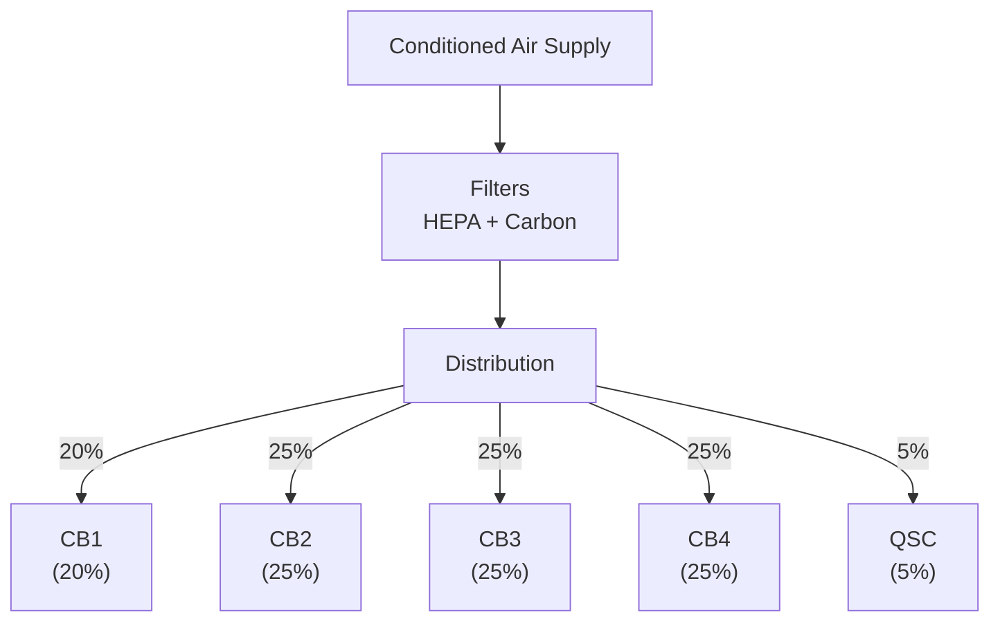

#### 9.1.2 Air Quality Management
- Temperature: ±2°C control
- Humidity: 45-65% RH
- Filtration: HEPA (99.97%)
- Air changes: 10-30/hour
- Pressure: Slight positive

### 9.2 Pressure Control

#### 9.2.1 Pressurization
- Maximum differential: 8.6 psi
- Pressure altitude: <8,000 ft
- Rate of change: <500 ft/min
- Relief valves: 9.1 psi
- Negative relief: -0.5 psi

#### 9.2.2 Decompression Protection
- Automatic door seal inflation
- Pressure equalization valves
- Structural reinforcement
- Blow-out panel design
- Crew alerting system

---

## 10. Training and Certification

### 10.1 Personnel Requirements

#### 10.1.1 Certification Levels
| Level | Role | Training Hours | Recurrency |
|-------|------|----------------|------------|
| 1 | Basic Loader | 24 | Annual |
| 2 | Lead Agent | 40 | Annual |
| 3 | Loadmaster | 80 | 6 months |
| 4 | DG Specialist | 40 | Annual |
| 5 | Quantum Tech | 120 | 6 months |

#### 10.1.2 Core Competencies
- BWB-specific procedures
- Quantum system operation
- Weight and balance
- Dangerous goods
- Emergency procedures
- Security protocols

### 10.2 Training Modules

#### 10.2.1 Initial Training Syllabus
```
Module 1: BWB Fundamentals (8 hrs)
- Aircraft familiarization
- Cargo bay layout
- Access procedures
- Safety systems

Module 2: Loading Systems (16 hrs)
- PDU operation
- Container handling
- Restraint systems
- Load planning

Module 3: Quantum Systems (8 hrs)
- QTN operation
- Security features
- Monitoring systems
- Troubleshooting

Module 4: Special Cargo (8 hrs)
- Temperature control
- Dangerous goods
- Live animals
- High-value procedures

Module 5: Emergency Procedures (8 hrs)
- Fire response
- Security breaches
- System failures
- Evacuation
```

### 10.3 Simulation and Practice

#### 10.3.1 Virtual Reality Training
- Full cargo bay simulation
- Loading scenario practice
- Emergency drills
- System fault recognition

#### 10.3.2 Hands-On Requirements
- 20 supervised loads
- 5 special cargo operations
- 3 emergency drills
- System competency check

---

## Appendices

### Appendix A: Container Specifications
[Detailed dimensions and weights for all container types]

# Appendix A: Container Specifications
## Document ID: 00-50-00-00-Overview-Appendix-A
### Aircraft: AMPEL360 BWB-Q100
### Version: 1.0.0
### Date: 2025-01-20

---

## Table of Contents
1. [Standard IATA Unit Load Devices (ULD)](#1-standard-iata-unit-load-devices-uld)
2. [BWB-Optimized Containers](#2-bwb-optimized-containers)
3. [Quantum-Secured Containers](#3-quantum-secured-containers)
4. [Special Purpose Containers](#4-special-purpose-containers)
5. [Pallet Specifications](#5-pallet-specifications)
6. [Container Compatibility Matrix](#6-container-compatibility-matrix)
7. [Weight and Balance Data](#7-weight-and-balance-data)
8. [Handling and Restraint Requirements](#8-handling-and-restraint-requirements)

---

## 1. Standard IATA Unit Load Devices (ULD)

### 1.1 LD3 Container (AKE)

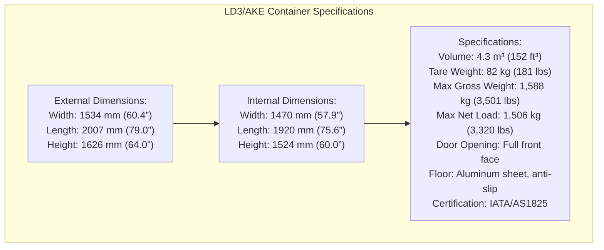

**Quantum Enhancement Features:**
- RFID tag: ISO 18000-6C compliant
- QR code: Dynamic loading data
- Temperature sensor: ±0.5°C accuracy
- Shock indicator: 3-axis, 0-25g
- GPS tracking: Integrated module

### 1.2 LD8 Container (DQF)

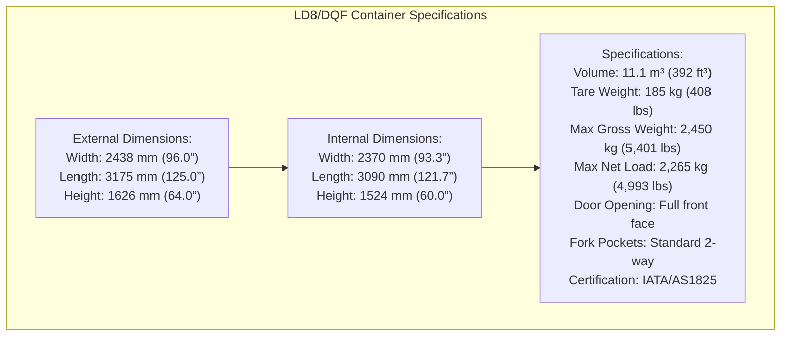

### 1.3 LD1 Container (AKC)

```
External Dimensions:
- Width: 1534 mm (60.4")
- Length: 1562 mm (61.5")
- Height: 1626 mm (64.0")

Specifications:
- Volume: 3.5 m³ (124 ft³)
- Tare Weight: 70 kg (154 lbs)
- Max Gross Weight: 1,588 kg (3,501 lbs)
- Compatibility: CB1 (Forward Bay)
```

### 1.4 LD6 Container (ALF)

```
External Dimensions:
- Width: 2438 mm (96.0")
- Length: 3175 mm (125.0")
- Height: 1626 mm (64.0")
- Shape: Contoured for lower deck

Specifications:
- Volume: 8.9 m³ (314 ft³)
- Tare Weight: 155 kg (342 lbs)
- Max Gross Weight: 3,175 kg (7,000 lbs)
- Compatibility: CB2/CB3 with adapter
```

---

## 2. BWB-Optimized Containers

### 2.1 QAO-BWB-1 Container

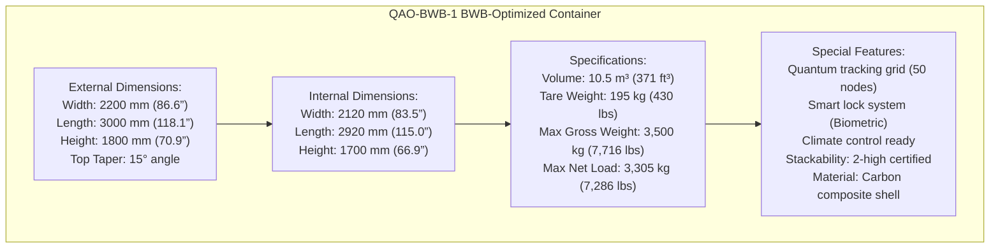

### 2.2 QAO-BWB-2 Half-Height Container

```
External Dimensions:
- Width: 2200 mm (86.6")
- Length: 3000 mm (118.1")
- Height: 900 mm (35.4")

Specifications:
- Volume: 5.3 m³ (187 ft³)
- Tare Weight: 120 kg (265 lbs)
- Max Gross Weight: 2,000 kg (4,409 lbs)
- Ideal for: Dense cargo, machinery
```

### 2.3 QAO-BWB-3 Extended Length

```
External Dimensions:
- Width: 2200 mm (86.6")
- Length: 4000 mm (157.5")
- Height: 1626 mm (64.0")

Specifications:
- Volume: 12.8 m³ (452 ft³)
- Tare Weight: 250 kg (551 lbs)
- Max Gross Weight: 4,000 kg (8,818 lbs)
- Compatibility: CB4 (Aft Bay) only
```

---

## 3. Quantum-Secured Containers

### 3.1 QSC-1 High-Security Container

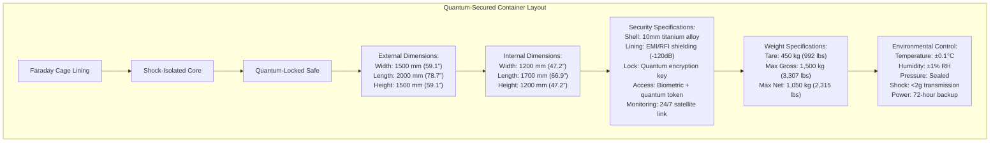

### 3.2 QSC-2 Pharmaceutical Container

```
External Dimensions:
- Width: 1534 mm (60.4")
- Length: 2007 mm (79.0")
- Height: 1626 mm (64.0")

Temperature Zones:
- Zone 1: +2°C to +8°C (±0.5°C)
- Zone 2: +15°C to +25°C (±1°C)
- Zone 3: -20°C to -80°C (±2°C)

Features:
- GDP/GMP compliant
- Real-time data logging
- Quantum-sealed records
- Multi-zone capability
- Redundant cooling systems
```

### 3.3 QSC-3 Hazmat Quantum Container

```
Specifications:
- UN Certification: All DG classes
- Containment: 110% spill capacity
- Monitoring: Real-time gas detection
- Fire Suppression: Integrated system
- Emergency: Remote venting capability
```

---

## 4. Special Purpose Containers

### 4.1 Live Animal Containers

#### 4.1.1 LAC-1 Small Animal Container
```
Dimensions & Specifications:
- External: 1534 × 2007 × 1626 mm
- Internal: 1400 × 1900 × 1500 mm
- Ventilation: 30 air changes/hour
- Temperature: 10-30°C control
- Features:
  - Water system: 50L capacity
  - Feed storage: Integrated
  - Waste tray: Removable
  - Monitoring: Audio/video
  - Lighting: Day/night cycle
```

#### 4.1.2 LAC-2 Equine Container
```
Dimensions & Specifications:
- External: 2438 × 3175 × 2400 mm
- Stall Configuration: 2 or 3 stalls
- Weight Limit: 1,000 kg per stall
- Features:
  - Padded walls
  - Non-slip flooring
  - Hay nets included
  - Water: Automatic system
  - Attendant seat
```

### 4.2 Temperature-Controlled Containers

#### 4.2.1 RKN Cool Container
```
Temperature Ranges:
- Mode 1: +2°C to +8°C (Pharma)
- Mode 2: 0°C to +15°C (Produce)
- Mode 3: +15°C to +25°C (Controlled)

Power Requirements:
- Input: 115V/400Hz or 28VDC
- Consumption: 2.5 kW average
- Battery Backup: 8 hours minimum
```

#### 4.2.2 RFN Frozen Container
```
Temperature Range: -25°C to -15°C
Insulation: 100mm polyurethane
Refrigeration: Dual compressor
Defrost: Automatic cycle
Alarms: Temperature deviation
```

### 4.3 Specialized Cargo Containers

#### 4.3.1 AAD Automotive Container
```
Dimensions: 2438 × 6000 × 2000 mm
Features:
- Integrated ramp system
- Tie-down points every 500mm
- Maximum vehicle weight: 3,000 kg
- Door: Full side opening
```

#### 4.3.2 HMU Hanging Garment Container
```
Capacity: 220 garments
Rail System: Adjustable height
Climate: Humidity controlled
Access: Double doors
Security: RFID inventory tracking
```

---

## 5. Pallet Specifications

### 5.1 P1P Main Deck Pallet

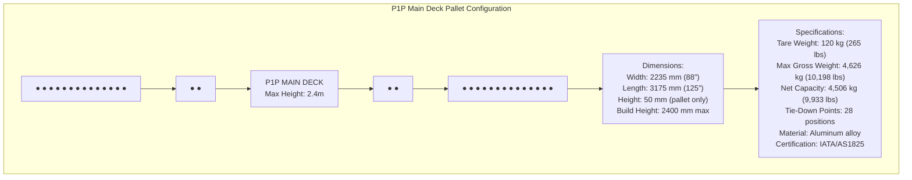

### 5.2 P6P BWB-Optimized Pallet

```
Dimensions:
- Width: 2400 mm (94.5")
- Length: 3000 mm (118.1")
- Contoured for BWB floor
- Quantum tracking integrated
- Smart lock compatibility
```

### 5.3 PMC Half Pallet

```
Dimensions:
- Width: 2235 mm (88")
- Length: 1534 mm (60.4")
- Max Gross Weight: 2,449 kg (5,399 lbs)
- Ideal for CB1 (Forward Bay)
```

---

## 6. Container Compatibility Matrix

### 6.1 Bay Compatibility

| Container Type | CB1 | CB2 | CB3 | CB4 | QSC |
|---------------|-----|-----|-----|-----|-----|
| LD3/AKE | ✓ | ✓ | ✓ | ✓ | ✗ |
| LD8/DQF | ✗ | ✓ | ✓ | ✓ | ✗ |
| LD1/AKC | ✓ | ✓ | ✓ | ✗ | ✗ |
| LD6/ALF | ✗ | ✓* | ✓* | ✓ | ✗ |
| QAO-BWB-1 | ✗ | ✓ | ✓ | ✓ | ✗ |
| QAO-BWB-2 | ✓ | ✓ | ✓ | ✓ | ✗ |
| QAO-BWB-3 | ✗ | ✗ | ✗ | ✓ | ✗ |
| QSC-1/2/3 | ✗ | ✗ | ✗ | ✗ | ✓ |
| P1P Pallet | ✗ | ✓ | ✓ | ✓ | ✗ |
| PMC Half | ✓ | ✓ | ✓ | ✓ | ✗ |

*Requires adapter plate

### 6.2 Loading Configurations

#### Configuration A: Maximum LD3
```
CB1: 4 × LD3 containers
CB2: 10 × LD3 containers  
CB3: 10 × LD3 containers
CB4: 6 × LD3 containers
Total: 30 LD3 containers
```

#### Configuration B: Mixed Load
```
CB1: 2 × PMC pallets
CB2: 4 × LD8 containers
CB3: 4 × LD8 containers
CB4: 1 × QAO-BWB-3 + bulk
QSC: 1 × QSC-1 container
```

#### Configuration C: Pallet Heavy
```
CB1: 2 × PMC pallets
CB2: 4 × P1P pallets
CB3: 4 × P1P pallets
CB4: 3 × P6P pallets
Total: 13 pallets
```

---

## 7. Weight and Balance Data

### 7.1 Container CG Locations

| Container | Empty CG (% MAC) | Full CG (% MAC) | Moment Arm (m) |
|-----------|------------------|-----------------|----------------|
| LD3 | 32.5 | 32.5 | 0.82 |
| LD8 | 33.0 | 33.0 | 1.65 |
| QAO-BWB-1 | 32.0 | 32.0 | 1.50 |
| P1P | 33.5 | Variable | 1.59 |
| QSC-1 | 38.0 | 38.0 | 1.00 |

### 7.2 Loading Density Guidelines

| Cargo Type | Typical Density | Container Choice |
|------------|----------------|------------------|
| General Cargo | 160 kg/m³ | LD3, LD8 |
| Express | 120 kg/m³ | LD3, QAO-BWB-2 |
| Heavy Freight | 400 kg/m³ | Pallets, Half-height |
| Perishables | 140 kg/m³ | RKN, RFN |
| Electronics | 100 kg/m³ | QSC series |

### 7.3 Maximum Stack Heights

```
Stacking Limitations:
├── Single High Only
│   ├── LD8 containers
│   ├── QAO-BWB-3
│   ├── All animal containers
│   └── Hazmat containers
├── Two High Maximum
│   ├── LD3 containers
│   ├── QAO-BWB-1
│   ├── QAO-BWB-2
│   └── PMC pallets
└── Three High (CB2/3 only)
    └── LD1 containers
```

---

## 8. Handling and Restraint Requirements

### 8.1 Container Handling Equipment

| Container Type | Required Equipment | Clearance Needed |
|---------------|-------------------|------------------|
| LD3/LD8 | Standard K-loader | 3.5m vertical |
| QAO-BWB series | BWB adapter kit | 4.0m vertical |
| QSC series | Secure transport | 5.0m + escort |
| Pallets | Main deck loader | 3.0m vertical |
| Animal | Specialized lift | 4.5m + attendant |

### 8.2 Restraint Requirements

#### 8.2.1 Forward Restraint (9g)
```
Restraint Points per Container:
- LD3: 4 points minimum
- LD8: 6 points minimum
- Pallets: 8-12 points
- QSC: 8 points + base lock
```

#### 8.2.2 Lateral Restraint (3g)
```
Side Locks Required:
- Every 1.0m for containers
- Every 0.5m for pallets
- Continuous for QSC units
```

#### 8.2.3 Vertical Restraint (3g)
```
Overhead Restraint:
- Net system for pallets
- Hard locks for containers
- Not required for QSC
```

### 8.3 Special Handling Notes

#### 8.3.1 Temperature-Controlled Units
- Pre-cool/heat for 2 hours
- Verify temperature before loading
- Connect power within 10 minutes
- Monitor continuously

#### 8.3.2 Live Animals
- Load last, unload first
- Attendant access required
- 1m clearance all sides
- Temperature priority

#### 8.3.3 Dangerous Goods
- Segregation distances apply
- Orientation arrows mandatory
- CAO labels visible
- Emergency access clear

#### 8.3.4 Quantum-Secured
- Two-person rule
- Continuous escort
- No X-ray screening
- Direct loading only

---

## Quick Reference Cards

### Loading Priority Guide
1. **Priority 1**: Live animals, QSC units
2. **Priority 2**: Temperature-controlled
3. **Priority 3**: Time-sensitive express
4. **Priority 4**: General cargo
5. **Priority 5**: Bulk/consolidated

### Emergency Access Requirements
- Fire extinguisher: Within 3m of DG
- Emergency equipment: Every 10m
- Escape routes: 1m minimum width
- QSC emergency shutdown: 5m radius

---

*This appendix is part of the AMPEL360 BWB-Q100 Cargo Loading Overview (00-50-00-00) and must be used in conjunction with the main document and current regulations.*

**END OF APPENDIX A**

### Appendix B: Loading Sequences
[Standard operating procedures for various cargo configurations]# Appendix B: Loading Sequences - Standard Operating Procedures
## Document ID: 00-50-00-00-Overview-Appendix-B
### Aircraft: AMPEL360 BWB-Q100
### Version: 1.0.0
### Date: 2025-01-20

---

## Table of Contents
1. [General Loading Principles](#1-general-loading-principles)
2. [Pre-Loading Procedures](#2-pre-loading-procedures)
3. [Standard Loading Sequences](#3-standard-loading-sequences)
4. [Special Configuration Sequences](#4-special-configuration-sequences)
5. [Priority and Time-Critical Loading](#5-priority-and-time-critical-loading)
6. [Weight and Balance Optimization](#6-weight-and-balance-optimization)
7. [Quantum System Integration](#7-quantum-system-integration)
8. [Post-Loading Verification](#8-post-loading-verification)

---

## 1. General Loading Principles

### 1.1 BWB Loading Philosophy

The AMPEL360 BWB-Q100 loading sequence follows these core principles:

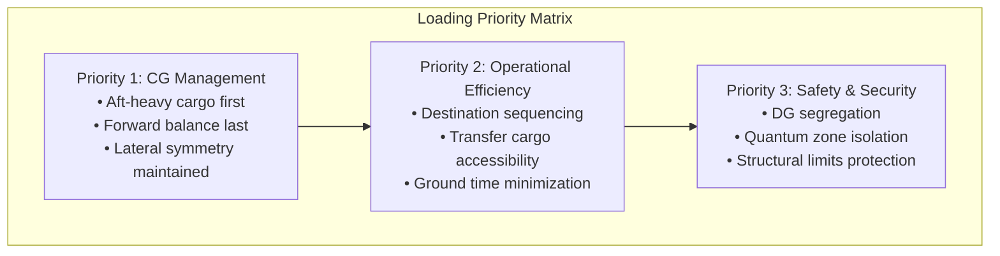

### 1.2 Loading Zone Sequence

**Standard Sequence Flow:**
1. CB4 (Aft) - Heavy/Dense cargo
2. CB2/CB3 (Center) - Balanced loading
3. CB1 (Forward) - CG adjustment
4. QSC (Quantum) - Final secure items

### 1.3 Concurrent Operations

Maximum efficiency through parallel loading:
- CB2 and CB3: Simultaneous via doors 4L/4R
- CB1 and CB4: Sequential for CG control
- QSC: Independent at any time

---

## 2. Pre-Loading Procedures

### 2.1 System Preparation Checklist

```
PRE-LOADING CHECKLIST                    Time: T-30 minutes
━━━━━━━━━━━━━━━━━━━━━━━━━━━━━━━━━━━━━━━━━━━━━━━━━━━━━━
□ 1. Aircraft Power Status
    □ GPU connected and verified
    □ Cargo bay lighting activated
    □ Quantum systems in ground mode
    
□ 2. Environmental Systems
    □ Temperature zones configured
    □ Ventilation operational
    □ Fire suppression armed
    
□ 3. Loading Systems Check
    □ PDU power verified
    □ Roller system tested
    □ Lock system initialized
    □ Emergency stops verified
    
□ 4. Quantum Tracking Network
    □ All nodes reporting (>99%)
    □ Ground link established
    □ Load planning synchronized
    
□ 5. Documentation Ready
    □ Load plan received
    □ NOTOC verified (if DG)
    □ Security screening complete
    □ Weight tickets prepared
```

### 2.2 Equipment Positioning

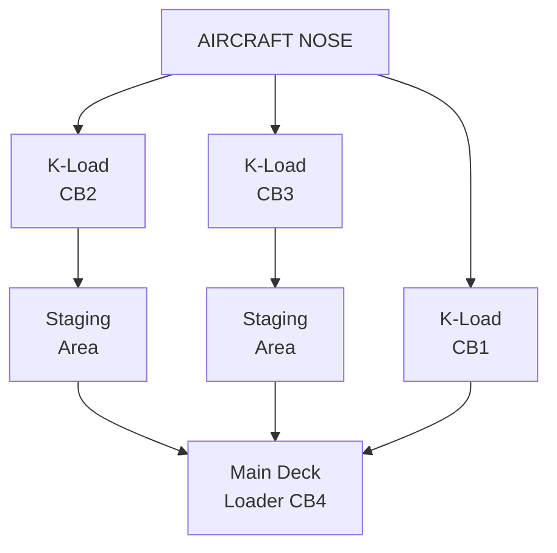

### 2.3 Communication Protocol

**Loading Team Structure:**
- Load Supervisor (LS): Overall coordination
- Bay Leaders (BL1-4): Individual bay management
- Quantum Tech (QT): QSC and tracking
- Balance Controller (BC): Real-time CG monitoring

**Communication Channels:**
- Primary: Digital headset network
- Backup: Hand signals per IATA AHM
- Emergency: Red button at each door

---

## 3. Standard Loading Sequences

### 3.1 Sequence A: Full Container Load (LD3)

**Configuration:** 30 × LD3 containers
**Time Required:** 45-55 minutes
**Teams Required:** 4 bay teams + supervision

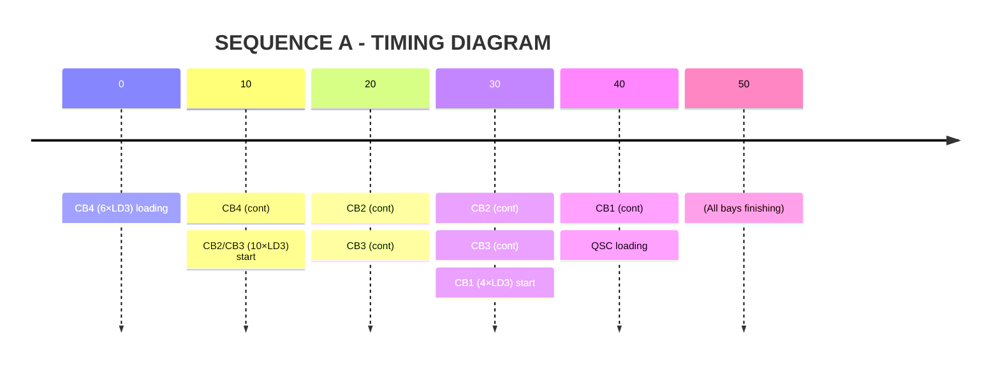

**Detailed Sequence:**

#### Phase 1: Aft Loading (0-15 min)
```
CB4 Loading Order:
Position:  4A  4B  4C  4D  4E  4F
Container: #25 #26 #27 #28 #29 #30
Weight(kg):1500 1500 1400 1400 1300 1300

Actions:
1. Position loader at Door 5L
2. Load positions 4A-4B (heaviest)
3. Verify locks engaged
4. Load positions 4C-4D
5. Final positions 4E-4F
6. Confirm quantum tracking active
```

#### Phase 2: Center Loading (5-35 min)
```
CB2/CB3 Parallel Loading:
         CB2 (Door 4L)        |        CB3 (Door 4R)
Row 1: 2A←2B←2C←2D←2E        |    3A→3B→3C→3D→3E
Row 2: 2F←2G←2H←2I←2J        |    3F→3G→3H→3I→3J

Timing:
- 3 minutes per container
- Alternate sides for balance
- Continuous CG monitoring
```

#### Phase 3: Forward Trim (30-45 min)

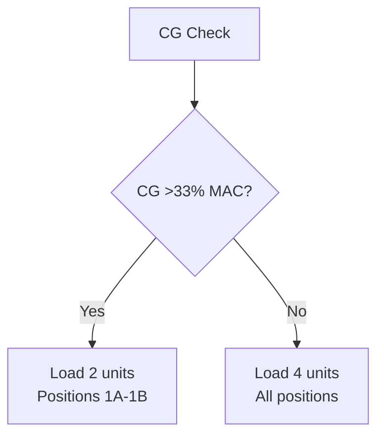

#### Phase 4: Final Secure (40-50 min)
```
QSC Loading (if required):
1. Two-person verification
2. Biometric authentication
3. Container inspection
4. Quantum lock activation
5. Monitoring system check
6. Documentation complete
```

### 3.2 Sequence B: Mixed Pallet/Container

**Configuration:** 8 × P1P pallets + 10 × LD3
**Time Required:** 50-60 minutes
**Critical:** Height clearance verification


**Loading Sequence:**

1. **CB4 Pallet Loading (0-20 min)**
   ```
   Pallet Build Heights:
   Position 4A: 2.2m (heavy base)
   Position 4B: 2.4m (max height)
   Position 4C: 2.0m (tapered aft)
   
   Special Requirements:
   - Overhead clearance check
   - Net installation
   - Tie-down minimum 8 points
   ```

2. **CB3 Pallet Loading (10-30 min)**
   ```
   Simultaneous with CB2
   Mirror loading for balance
   Real-time weight input
   ```

3. **CB2 Container Loading (10-40 min)**
   ```
   Standard LD3 sequence
   Front-to-back loading
   Alternate heavy/light
   ```

4. **CB1 Trim Loading (35-50 min)**
   ```
   Load based on actual CG
   May leave empty if balanced
   ```

### 3.3 Sequence C: Express Cargo Configuration

**Configuration:** Priority + General cargo
**Time Required:** 35-40 minutes
**Focus:** Accessibility and speed


**Sequence Details:**

1. **Phase 1: Through Cargo (0-15 min)**
   - CB4: Heavy and bulk items
   - No intermediate access needed
   - Maximum density packing

2. **Phase 2: General Cargo (10-25 min)**
   - CB3: Full general cargo
   - CB2 Aft: General continuation
   - Standard container spacing

3. **Phase 3: Express Positioning (20-35 min)**
   - CB2 Forward: Express containers
   - CB1: Priority/courier items
   - Clear access paths maintained

---

## 4. Special Configuration Sequences

### 4.1 Live Animal Loading Sequence

**Special Requirements:**
- Temperature pre-conditioning: 2 hours
- Attendant access paths
- Last on, first off principle

```
ANIMAL LOADING SEQUENCE
━━━━━━━━━━━━━━━━━━━━━━━━━━━━━━━━━━━━
Pre-Load (T-120 min):
□ Environmental systems set
□ Temperature: 18-22°C
□ Humidity: 45-55%
□ Ventilation: Maximum

Loading Sequence (T-30 min):
1. General cargo positions CB4, CB3
2. Leave CB2 center clear
3. Animal containers CB2
4. Attendant verification
5. Final cargo CB1 if needed

Post-Load:
□ Continuous monitoring active
□ Attendant access confirmed
□ Emergency protocols briefed
━━━━━━━━━━━━━━━━━━━━━━━━━━━━━━━━━━━━
```

### 4.2 Dangerous Goods Sequence

**Regulatory Requirements:**
- Segregation distances maintained
- Accessibility for inspection
- Emergency response capability


### 4.3 Temperature-Controlled Sequence

**Critical Factors:**
- Power connection time limits
- Pre-cooling requirements
- Zone temperature maintenance

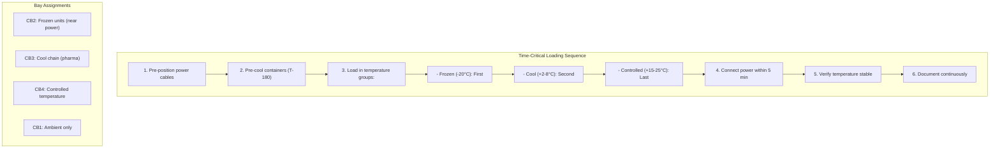

### 4.4 High-Value/Quantum-Secured Loading

**Security Protocol:**
- Two-person integrity
- Continuous escort
- Video documentation
- Quantum seal activation

```
QUANTUM-SECURED LOADING PROCEDURE
━━━━━━━━━━━━━━━━━━━━━━━━━━━━━━━━━━━━━━━━
Step-by-Step Process:

1. AUTHENTICATION (5 min)
   □ Loadmaster biometric scan
   □ Security officer verification
   □ Quantum key activation
   □ Video recording start

2. INSPECTION (5 min)
   □ Container seal check
   □ External damage assessment
   □ Quantum tag verification
   □ Weight confirmation

3. LOADING (10 min)
   □ Direct truck-to-aircraft
   □ No intermediate staging
   □ Continuous escort
   □ Position QSC bay only

4. SECURING (5 min)
   □ Quantum lock engagement
   □ Monitoring activation
   □ Seal photograph
   □ Documentation complete

5. VERIFICATION (5 min)
   □ System connectivity test
   □ Tracking active confirm
   □ Security handover
   □ Access log sealed
━━━━━━━━━━━━━━━━━━━━━━━━━━━━━━━━━━━━━━━━
```

---

## 5. Priority and Time-Critical Loading

### 5.1 Quick Turnaround Loading (QTL)

**Target Time:** 25 minutes
**Configuration:** Limited change

```
QTL SEQUENCE - 25 MINUTE TURN
━━━━━━━━━━━━━━━━━━━━━━━━━━━━━━━━━━━━━
Minute  Action
00-05   Doors open, equipment position
05-10   Offload CB1 priority only
10-20   Load new CB1/CB2 forward
20-23   Final security check
23-25   Doors closed, clearance
━━━━━━━━━━━━━━━━━━━━━━━━━━━━━━━━━━━━━

Restrictions:
- CB1 and CB2 forward only
- No CB3/CB4 access
- Pre-sorted cargo required
- Maximum 6 units exchange
```

### 5.2 Aircraft on Ground (AOG) Support

**Emergency Spares Loading:**

```
AOG CRITICAL PARTS LOADING
━━━━━━━━━━━━━━━━━━━━━━━━━━━━━━━━━━━━
Immediate Action:
1. Door 3L open (CB1 access)
2. Clear position 1A
3. Load AOG shipment
4. Quantum tag priority
5. Direct cockpit notification
6. Document for customs

Time: 10 minutes maximum
━━━━━━━━━━━━━━━━━━━━━━━━━━━━━━━━━━━━
```

### 5.3 Medical Emergency Supplies

**Life-Saving Cargo Protocol:**

```
MEDICAL PRIORITY SEQUENCE
━━━━━━━━━━━━━━━━━━━━━━━━━━━━━━━━━━━━
Actions:
1. Pre-alert all stations
2. Clear CB1 front position
3. Temperature verification
4. Direct ambulance access
5. Load with paramedic witness
6. Captain notification
7. Priority customs clearance

Special Markings:
- Red priority tags
- Temperature monitors
- "LIFE SAVING" labels
- Contact information visible
━━━━━━━━━━━━━━━━━━━━━━━━━━━━━━━━━━━━
```

---

## 6. Weight and Balance Optimization

### 6.1 Real-Time CG Management

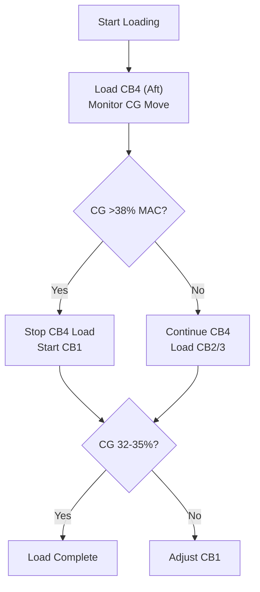

### 6.2 Lateral Balance Procedures

```
LATERAL BALANCE PROTOCOL
━━━━━━━━━━━━━━━━━━━━━━━━━━━━━━━━━━━━━
Rule: Maintain within ±1° roll

CB2/CB3 Loading:
- Alternate sides each container
- Match weights within 200kg
- Heavy items centerline preferred

Imbalance Correction:
If >0.5° right heavy:
1. Add next container CB2 (left)
2. Skip position CB3 (right)
3. Recheck after each unit

Maximum Imbalance Actions:
At 1.5°: Stop loading
At 2.0°: Reposition required
━━━━━━━━━━━━━━━━━━━━━━━━━━━━━━━━━━━━━
```

### 6.3 Fuel/Cargo Trade Optimization

```
PAYLOAD OPTIMIZATION MATRIX
━━━━━━━━━━━━━━━━━━━━━━━━━━━━━━━━━━━━━
Scenario: Maximum payload required

Step 1: Calculate fuel minimum
Step 2: Determine cargo maximum
Step 3: Load sequence adjustment

If Payload > Standard:
1. Reduce contingency fuel
2. Optimize cargo density
3. Use all bay positions
4. Consider tankering trade

CG Envelope Protection:
- Forward limit: Add CB1 last
- Aft limit: Limit CB4 load
- Use fuel transfer capability
━━━━━━━━━━━━━━━━━━━━━━━━━━━━━━━━━━━━━
```

---

## 7. Quantum System Integration

### 7.1 Quantum Tracking Activation

```
QUANTUM TRACKING SEQUENCE
━━━━━━━━━━━━━━━━━━━━━━━━━━━━━━━━━━━━━
Per Container Process:

1. APPROACH (Auto-detection)
   - Container enters detection zone
   - RFID/quantum tag read
   - Identity verification

2. LOADING (Position tracking)
   - 3D position recorded
   - Orientation logged
   - Lock engagement verified

3. INTEGRATION (Network join)
   - Node activation
   - Mesh network connection
   - Status reporting start

4. VERIFICATION (System check)
   - All sensors active
   - Environmental monitoring
   - Security features enabled
━━━━━━━━━━━━━━━━━━━━━━━━━━━━━━━━━━━━━
```

### 7.2 Load Plan Synchronization

```
DIGITAL LOAD PLAN SYNC
━━━━━━━━━━━━━━━━━━━━━━━━━━━━━━━━━━━━━
Real-Time Updates:

Source: Load Planning System
   │
   ▼
Quantum Processing Unit
   │
   ├──→ Loadmaster Tablet
   ├──→ Cockpit Display
   ├──→ Ground Systems
   └──→ Weight & Balance

Automatic Actions:
- PDU routing optimization
- Lock position presetting  
- CG calculation update
- Fuel transfer planning
━━━━━━━━━━━━━━━━━━━━━━━━━━━━━━━━━━━━━
```

### 7.3 Anomaly Detection and Response

```
QUANTUM ANOMALY PROTOCOL
━━━━━━━━━━━━━━━━━━━━━━━━━━━━━━━━━━━━━
Alert Levels:

GREEN: Normal operations
- All systems nominal
- Continue loading

YELLOW: Minor anomaly
- Position discrepancy <10cm
- Environmental variance
- Log and continue

AMBER: Significant issue
- Container not responding
- Weight mismatch >50kg
- Stop and investigate

RED: Critical alert
- Security breach detected
- Major position shift
- Structural limit exceeded
- STOP ALL OPERATIONS
━━━━━━━━━━━━━━━━━━━━━━━━━━━━━━━━━━━━━
```

---

## 8. Post-Loading Verification

### 8.1 Final Check Sequence

```
POST-LOADING CHECKLIST
━━━━━━━━━━━━━━━━━━━━━━━━━━━━━━━━━━━━━━━━
Time: T+0 (Loading Complete)

□ PHYSICAL VERIFICATION (5 min)
  □ All locks engaged (visual)
  □ No loose items
  □ Restraints secure
  □ Doors clear

□ SYSTEM VERIFICATION (3 min)
  □ Quantum tracking 100%
  □ Weight matches manifest
  □ CG within limits
  □ Fire detection active

□ DOCUMENTATION (5 min)
  □ Load plan signed
  □ NOTOC completed (if DG)
  □ Photos uploaded
  □ Customs data sent

□ FINAL ACTIONS (2 min)
  □ Door area clear
  □ Equipment removed
  □ Closeout message sent
  □ Crew briefed
━━━━━━━━━━━━━━━━━━━━━━━━━━━━━━━━━━━━━━━━
```

### 8.2 Handover to Flight Crew

```
CREW BRIEFING FORMAT
━━━━━━━━━━━━━━━━━━━━━━━━━━━━━━━━━━━━━
1. LOAD SUMMARY
   Total cargo: _____kg
   CG location: ____% MAC
   Special cargo: YES/NO

2. NOTIFICATIONS
   □ DG locations and classes
   □ Live animals positions
   □ Temperature cargo status
   □ High-value locations

3. DOCUMENTATION
   □ Load plan delivered
   □ NOTOC signed
   □ Weight manifest
   □ Quantum system status

4. SPECIAL INSTRUCTIONS
   [As applicable]
━━━━━━━━━━━━━━━━━━━━━━━━━━━━━━━━━━━━━
```

### 8.3 System Closeout

```
LOADING SYSTEM SHUTDOWN
━━━━━━━━━━━━━━━━━━━━━━━━━━━━━━━━━━━━━
Sequence:
1. PDU power down
2. Loading mode exit
3. Flight mode activation
4. Door seal verification
5. Ground link disconnect
6. Final quantum sync
7. System armed for flight

Confirmations Required:
- Loadmaster: "Loading complete"
- Quantum Tech: "Systems verified"
- Balance Control: "CG accepted"
- Supervisor: "Cleared to close"
━━━━━━━━━━━━━━━━━━━━━━━━━━━━━━━━━━━━━
```

---

## Quick Reference Cards

### QRC-1: Standard Load Time Targets

| Configuration | Units | Target Time | Teams |
|--------------|-------|-------------|-------|
| Full LD3 | 30 | 45 min | 4 |
| Mixed Pallet | 18 | 50 min | 4 |
| Express | 20 | 35 min | 3 |
| Quick Turn | 6 | 25 min | 2 |

### QRC-2: Emergency Stop Procedures

**ANY TEAM MEMBER CAN STOP LOADING**

1. Press RED emergency button
2. Call "STOP STOP STOP"
3. All movement ceases
4. Await supervisor instruction
5. Document reason
6. Reset only by supervisor

### QRC-3: CG Quick Limits

- Forward Limit: 15% MAC (NEVER exceed)
- Aft Limit: 40% MAC (NEVER exceed)
- Target Range: 32-35% MAC
- Lateral Limit: ±2° (1° preferred)

---

*This appendix is part of the AMPEL360 BWB-Q100 Cargo Loading Overview and must be used in conjunction with current regulations and company procedures.*

**END OF APPENDIX B**


### Appendix C: Emergency Procedures
[Quick reference for all emergency scenarios]

# Appendix C: Emergency Procedures - Quick Reference
## Document ID: 00-50-00-00-Overview-Appendix-C
### Aircraft: AMPEL360 BWB-Q100
### Version: 1.0.0
### Date: 2025-01-20
### Classification: EMERGENCY USE

---

## EMERGENCY CONTACT NUMBERS
```
┌─────────────────────────────────────────────┐
│ FIRE/RESCUE:          Airport Emergency 911 │
│ GAIA-QAO OPS:         +1-555-GAIA-OPS      │
│ QUANTUM EMERGENCY:    +1-555-QUANTUM        │
│ HAZMAT HOTLINE:       +1-800-424-9300      │
│ MEDICAL:              Airport Medical Ext 1 │
│ SECURITY:             Airport Security Ext 2│
└─────────────────────────────────────────────┘
```

---

## Table of Contents
1. [IMMEDIATE ACTION ITEMS](#1-immediate-action-items)
2. [Fire Emergency Procedures](#2-fire-emergency-procedures)
3. [Hazmat/Dangerous Goods Incidents](#3-hazmatdangerous-goods-incidents)
4. [Structural/Loading Emergencies](#4-structuralloading-emergencies)
5. [Quantum System Emergencies](#5-quantum-system-emergencies)
6. [Medical Emergencies](#6-medical-emergencies)
7. [Security Threats](#7-security-threats)
8. [Environmental System Failures](#8-environmental-system-failures)
9. [Evacuation Procedures](#9-evacuation-procedures)
10. [Post-Emergency Actions](#10-post-emergency-actions)

---

## 1. IMMEDIATE ACTION ITEMS

### ANY EMERGENCY - FIRST ACTIONS
```
┌─────────────────────────────────────────┐
│ 1. STOP all loading operations          │
│ 2. ALERT supervisor and crew            │
│ 3. ASSESS situation safely              │
│ 4. EVACUATE if necessary                │
│ 5. CALL emergency services              │
└─────────────────────────────────────────┘
```

### Emergency Stop Locations
- **RED BUTTONS**: All cargo doors (8 locations)
- **MASTER STOP**: Load supervisor station
- **QUANTUM KILL**: QSC bay entrance
- **PDU STOP**: Each Power Drive Unit

---

## 2. Fire Emergency Procedures

### 2.1 CARGO FIRE - IMMEDIATE ACTIONS

```
FIRE IN CARGO BAY
━━━━━━━━━━━━━━━━━━━━━━━━━━━━━━━━━━━━━━━━
⚠️ IMMEDIATE ACTIONS (30 seconds)

1. SHOUT: "FIRE! FIRE! FIRE!"
2. STOP all operations
3. EVACUATE bay immediately
4. CLOSE cargo door if safe
5. ACTIVATE nearest alarm
6. CALL emergency services

DO NOT attempt to fight large fires
DO NOT re-enter smoke-filled areas
━━━━━━━━━━━━━━━━━━━━━━━━━━━━━━━━━━━━━━━━
```

### 2.2 Fire Response by Location

| Location | Suppression | Access | Special Hazards |
|----------|------------|---------|-----------------|
| CB1 | Halon system | Door 3L | Electronics nearby |
| CB2/CB3 | Halon system | Doors 4L/4R | Fuel lines below |
| CB4 | Halon + foam | Door 5L | Hydraulics |
| QSC | CO2 system | Door 5R | Quantum coolant |

### 2.3 Container Fire Procedures

```
FIRE IN SPECIFIC CONTAINER
━━━━━━━━━━━━━━━━━━━━━━━━━━━━━━━━━━━━
1. IDENTIFY container position
2. CHECK manifest for contents
3. IF DANGEROUS GOODS:
   └─→ See Section 3
4. IF SAFE TO APPROACH:
   ├─→ Use appropriate extinguisher
   ├─→ BCF for electrical
   ├─→ Foam for fuel/oil
   └─→ Water for general
5. IF LITHIUM BATTERY SUSPECTED:
   └─→ EVACUATE - Do not use water
━━━━━━━━━━━━━━━━━━━━━━━━━━━━━━━━━━━━
```

### 2.4 Fire Suppression Activation

```
MANUAL SUPPRESSION ACTIVATION
━━━━━━━━━━━━━━━━━━━━━━━━━━━━━━━━━━━
Location: Each cargo door inside/outside

1. BREAK glass cover
2. PULL red handle DOWN
3. EVACUATE immediately
4. DISCHARGE in 10 seconds
5. DO NOT re-enter for 15 minutes
6. AWAIT fire service clearance

⚠️ HALON displaces oxygen
⚠️ Full face protection required
━━━━━━━━━━━━━━━━━━━━━━━━━━━━━━━━━━━
```

---

## 3. Hazmat/Dangerous Goods Incidents

### 3.1 DG SPILL - IMMEDIATE RESPONSE

```
DANGEROUS GOODS SPILL
━━━━━━━━━━━━━━━━━━━━━━━━━━━━━━━━━━━━━━━━
🛑 STOP - ASSESS - RESPOND

1. STOP all operations
2. IDENTIFY substance:
   - Check NOTOC
   - Note UN number
   - Observe placards
3. ESTABLISH exclusion zone:
   - Minimum 10 meters
   - Upwind position
4. CALL Hazmat team
5. REFER to ERG guide

DO NOT touch unknown substances
DO NOT walk through spills
━━━━━━━━━━━━━━━━━━━━━━━━━━━━━━━━━━━━━━━━
```

### 3.2 DG Class-Specific Actions

| Class | Substance | Immediate Action | PPE Required |
|-------|-----------|------------------|--------------|
| 1 | Explosives | EVACUATE 100m | None - evacuate |
| 2.1 | Flammable Gas | Ventilate, no sparks | SCBA |
| 2.2 | Non-flam Gas | Ventilate | None |
| 2.3 | Toxic Gas | EVACUATE, SCBA | Full hazmat |
| 3 | Flammable Liquid | No ignition sources | Fire gear |
| 4 | Flammable Solid | Water fog | Fire gear |
| 5 | Oxidizer | Isolate from fuel | Chemical suit |
| 6 | Toxic | Avoid contact | Full hazmat |
| 7 | Radioactive | EVACUATE 25m | None - evacuate |
| 8 | Corrosive | Neutralize | Acid suit |
| 9 | Miscellaneous | Check SDS | As specified |

### 3.3 Lithium Battery Emergency

```
LITHIUM BATTERY THERMAL RUNAWAY
━━━━━━━━━━━━━━━━━━━━━━━━━━━━━━━━━━━━━━━━
⚠️ EXTREME DANGER - EXPLOSIVE FIRE RISK

IMMEDIATE ACTIONS:
1. EVACUATE all personnel
2. CLOSE cargo door remotely
3. ACTIVATE suppression
4. COOL adjacent areas
5. MONITOR temperature
6. PREPARE for re-ignition

NEVER:
- Use water directly
- Attempt to move battery
- Re-enter without SCBA
- Assume fire is out

EXPECT:
- Multiple re-ignitions
- Toxic gas emission
- Explosion risk
- 2000°C temperatures
━━━━━━━━━━━━━━━━━━━━━━━━━━━━━━━━━━━━━━━━
```

---

## 4. Structural/Loading Emergencies

### 4.1 CONTAINER SHIFT/FALL

```
UNSTABLE LOAD EMERGENCY
━━━━━━━━━━━━━━━━━━━━━━━━━━━━━━━━━━━━━
⚡ IMMEDIATE ACTIONS:

1. SHOUT: "CLEAR! CLEAR! CLEAR!"
2. EVACUATE danger zone
3. STOP all PDU movement
4. SECURE area (30m radius)
5. ASSESS:
   - Personnel injuries?
   - Aircraft damage?
   - Secondary hazards?
6. DO NOT attempt to catch
7. WAIT for stabilization

If container is hanging:
- Evacuate below area
- Establish exclusion zone
- Call maintenance
- Use emergency supports
━━━━━━━━━━━━━━━━━━━━━━━━━━━━━━━━━━━━━
```

### 4.2 Floor Overload Warning

```
STRUCTURAL LIMIT EXCEEDED
━━━━━━━━━━━━━━━━━━━━━━━━━━━━━━━━━━━━━
⚠️ Quantum Structural Monitor Alert

AMBER ALERT (80% limit):
1. Stop loading position
2. Verify weight tickets
3. Redistribute if needed
4. Document occurrence

RED ALERT (100% limit):
1. STOP immediately
2. Remove last item
3. Engineering inspection
4. Do not continue until cleared

CRITICAL (>110% limit):
1. EVACUATE bay
2. Aircraft grounded
3. Full structural inspection
4. Potential damage
━━━━━━━━━━━━━━━━━━━━━━━━━━━━━━━━━━━━━
```

### 4.3 PDU Malfunction

```
POWER DRIVE UNIT FAILURE
━━━━━━━━━━━━━━━━━━━━━━━━━━━━━━━━━━━━━
Runaway PDU:
1. HIT emergency stop
2. DISCONNECT power
3. CHOCK containers
4. MANUAL brake engagement

PDU Fire:
1. E-STOP immediately
2. BCF extinguisher
3. Isolate power
4. Ventilate area

Entrapment Hazard:
1. STOP all units
2. Check all clear
3. Manual release
4. First aid if needed
━━━━━━━━━━━━━━━━━━━━━━━━━━━━━━━━━━━━━
```

---

## 5. Quantum System Emergencies

### 5.1 QPU COOLANT LEAK

```
CRYOGENIC HAZARD - LIQUID HELIUM
━━━━━━━━━━━━━━━━━━━━━━━━━━━━━━━━━━━━━━━━
⚠️ EXTREME COLD: -269°C (-452°F)

IMMEDIATE ACTIONS:
1. EVACUATE area immediately
2. VENTILATE - displaces oxygen
3. CLOSE isolation valve
4. CALL Quantum Emergency
5. MONITOR oxygen levels

HAZARDS:
- Instant frostbite
- Asphyxiation risk
- Material embrittlement
- Pressure buildup

PPE REQUIRED:
- Cryogenic gloves
- Face shield
- Closed-toe shoes
- NO synthetic clothing
━━━━━━━━━━━━━━━━━━━━━━━━━━━━━━━━━━━━━━━━
```

### 5.2 Quantum System Failure Modes

| Failure | Symptoms | Immediate Action | Consequence |
|---------|----------|------------------|-------------|
| Decoherence | Amber QSM alert | Note time/temp | Degraded tracking |
| Quench Event | Loud bang, vapor | EVACUATE | System offline |
| Power Loss | Red indicators | Check breakers | Backup activation |
| Network Fail | Lost nodes >5% | Reset zone | Manual mode |
| Security Breach | Alarm + lockdown | Freeze operations | Investigation |

### 5.3 Quantum Lock Malfunction

```
QSC DOOR LOCK FAILURE
━━━━━━━━━━━━━━━━━━━━━━━━━━━━━━━━━━━━━
Cannot Open (Container Trapped):
1. Verify biometric retry
2. Check power supply
3. Use manual override:
   - Insert key (Supervisor)
   - Turn 90° clockwise
   - Pull manual release
4. If failed:
   - Call Quantum Tech
   - Document contents
   - Await specialist

Cannot Secure (Lock Open):
1. DO NOT load valuables
2. Post security guard
3. Manual chain/lock
4. Maintenance priority
5. Document breach time
━━━━━━━━━━━━━━━━━━━━━━━━━━━━━━━━━━━━━
```

---

## 6. Medical Emergencies

### 6.1 INJURY RESPONSE

```
PERSONNEL INJURY
━━━━━━━━━━━━━━━━━━━━━━━━━━━━━━━━━━━━━
1. ENSURE scene safety
2. CALL medical (Ext 1)
3. DO NOT move if:
   - Head/neck injury
   - Unconscious
   - Severe pain
4. CONTROL bleeding:
   - Direct pressure
   - Elevate if possible
5. TREAT for shock:
   - Keep warm
   - Elevate feet
   - Reassure
6. DOCUMENT:
   - Time of injury
   - Circumstances
   - Witnesses
━━━━━━━━━━━━━━━━━━━━━━━━━━━━━━━━━━━━━
```

### 6.2 Specific Injury Protocols

| Injury Type | First Aid | Do NOT |
|-------------|-----------|---------|
| Crush Injury | Stabilize, call 911 | Remove weight |
| Chemical Burn | Flush 20 min | Use neutralizers |
| Electrical Shock | Check breathing | Touch victim |
| Frostbite (Cryo) | Warm slowly | Rub area |
| Heat Exhaustion | Cool, hydrate | Give salt tablets |
| Eye Injury | Flush/cover | Remove objects |

### 6.3 Medical Kit Locations

```
EMERGENCY MEDICAL EQUIPMENT
━━━━━━━━━━━━━━━━━━━━━━━━━━━━━━━━━━━━━
First Aid Kits:
- Each cargo door (8)
- Load supervisor station
- Equipment staging areas

AED Locations:
- Door 3L (CB1)
- Door 4L/4R junction
- Quantum bay entrance

Spill Kits:
- Each service panel
- DG storage area
- Fuel service points

Eye Wash:
- Chemical storage
- Battery service area
- Quantum coolant area
━━━━━━━━━━━━━━━━━━━━━━━━━━━━━━━━━━━━━
```

---

## 7. Security Threats

### 7.1 SUSPICIOUS PACKAGE/DEVICE

```
POTENTIAL SECURITY THREAT
━━━━━━━━━━━━━━━━━━━━━━━━━━━━━━━━━━━━━━━━
DO NOT:
- Touch or move item
- Use radios/phones nearby
- Attempt to open
- Investigate closely

DO:
1. CLEAR area (100m minimum)
2. ISOLATE - prevent access
3. CALL security (Ext 2)
4. IDENTIFY:
   - Location exactly
   - Description
   - How discovered
5. AWAIT authorities
6. PREPARE evacuation

If device is in container:
- Note container number
- Check manifest discretely
- Do not advertise concern
━━━━━━━━━━━━━━━━━━━━━━━━━━━━━━━━━━━━━━━━
```

### 7.2 Unauthorized Access

```
SECURITY BREACH RESPONSE
━━━━━━━━━━━━━━━━━━━━━━━━━━━━━━━━━━━━━
Unauthorized Person in Cargo Area:

1. CHALLENGE: "Stop, identify yourself"
2. OBSERVE:
   - Description
   - Direction of travel
   - Any items carried
3. REPORT immediately
4. DO NOT pursue alone
5. SECURE area after
6. REVIEW:
   - Video footage
   - Access logs
   - Container seals

For QSC Breach:
- IMMEDIATE lockdown
- Quantum alert activated
- Full audit required
- Law enforcement response
━━━━━━━━━━━━━━━━━━━━━━━━━━━━━━━━━━━━━
```

---

## 8. Environmental System Failures

### 8.1 PRESSURIZATION FAILURE

```
RAPID DECOMPRESSION
━━━━━━━━━━━━━━━━━━━━━━━━━━━━━━━━━━━━━
If doors open during pressurization:

1. BRACE for air rush
2. STAY CLEAR of doors
3. ALERT cockpit
4. CHECK:
   - Personnel accountability
   - Cargo shift
   - Structural damage
5. AWAIT pressure equalization
6. INSPECT before continuing

Slow Leak Detected:
- Monitor pressure gauge
- Check door seals
- Notify maintenance
- Continue if stable
━━━━━━━━━━━━━━━━━━━━━━━━━━━━━━━━━━━━━
```

### 8.2 Temperature Control Failure

```
ENVIRONMENTAL EXCURSION
━━━━━━━━━━━━━━━━━━━━━━━━━━━━━━━━━━━━━
Temperature-Sensitive Cargo:

OVER-TEMPERATURE:
1. Check actual vs displayed
2. Activate backup cooling
3. Open ventilation max
4. Consider dry ice (NOT for animals)
5. Document excursion time

UNDER-TEMPERATURE:
1. Check heating elements
2. Close unnecessary vents
3. Use portable heaters
4. Insulate if possible
5. Priority offload if critical

Live Animals:
- Immediate priority
- Notify veterinary
- Consider relocation
- Document stress signs
━━━━━━━━━━━━━━━━━━━━━━━━━━━━━━━━━━━━━
```

### 8.3 Power Failure

```
ELECTRICAL POWER LOSS
━━━━━━━━━━━━━━━━━━━━━━━━━━━━━━━━━━━━━
Complete Power Loss:

1. STOP all operations
2. ENGAGE manual brakes
3. ACTIVATE emergency lights
4. CHECK GPU connection
5. START APU if needed
6. MAINTAIN:
   - Temperature cargo power
   - Quantum system UPS
   - Security systems

Manual Operations:
- Hand signals only
- Mechanical locks
- Manual documentation
- Daylight required
━━━━━━━━━━━━━━━━━━━━━━━━━━━━━━━━━━━━━
```

---

## 9. Evacuation Procedures

### 9.1 EVACUATION ROUTES

```
CARGO AREA EVACUATION
━━━━━━━━━━━━━━━━━━━━━━━━━━━━━━━━━━━━━━━━
PRIMARY ROUTES:
CB1: Exit via Door 3L → Forward stairs
CB2: Exit via Door 4L → Left escape
CB3: Exit via Door 4R → Right escape  
CB4: Exit via Door 5L → Aft ladder
QSC: Exit via emergency hatch → Slide

BLOCKED EXIT Protocol:
- Use alternate door
- Break emergency panel
- Slide deployment OK
- Help others exit
- Account at muster

ACCOUNTABILITY:
- Team leaders count
- Report to supervisor
- Check video if missing
- Do not re-enter
━━━━━━━━━━━━━━━━━━━━━━━━━━━━━━━━━━━━━━━━
```

### 9.2 Muster Points

```
     AIRCRAFT
        │
    ┌───┴───┐
    │       │
  🚩A     🚩B
    │       │
    │       │
  🚩C     🚩D

A: Forward left - CB1/CB2 personnel
B: Forward right - CB3 personnel  
C: Aft left - CB4 personnel
D: Aft right - QSC/Supervision

Distance: 100m from aircraft
━━━━━━━━━━━━━━━━━━━━━━━━━━━━━━━━━━━━━
```

---

## 10. Post-Emergency Actions

### 10.1 INCIDENT REPORTING

```
REQUIRED NOTIFICATIONS
━━━━━━━━━━━━━━━━━━━━━━━━━━━━━━━━━━━━━
Within 15 minutes:
□ GAIA-QAO Operations
□ Airport Authority  
□ Customer Service (if delay)
□ Regulatory (if required)

Within 1 hour:
□ Written preliminary report
□ Photos/video secured
□ Witness statements
□ Equipment quarantined

Within 24 hours:
□ Full investigation
□ Root cause analysis
□ Corrective actions
□ Training identified
━━━━━━━━━━━━━━━━━━━━━━━━━━━━━━━━━━━━━
```

### 10.2 Preservation of Evidence

```
SCENE PRESERVATION
━━━━━━━━━━━━━━━━━━━━━━━━━━━━━━━━━━━━━
DO NOT:
- Clean up
- Move items
- Delete recordings
- Discuss fault

DO:
- Photograph everything
- Secure area
- List witnesses
- Preserve documents
- Maintain logs

Quantum System Data:
- Auto-preserved 72hrs
- Download priority
- Chain of custody
- Encrypted storage
━━━━━━━━━━━━━━━━━━━━━━━━━━━━━━━━━━━━━
```
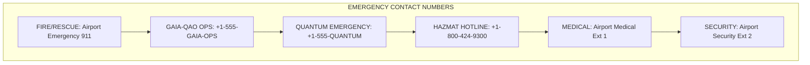
---

## QUICK REFERENCE MATRIX

| Emergency Type | First Action | Call | Evacuate? | Special Equipment |
|---------------|--------------|------|-----------|-------------------|
| Fire | STOP & ALARM | 911 | YES | Extinguisher type |
| DG Spill | IDENTIFY | Hazmat | Maybe | PPE per class |
| Injury | SCENE SAFE | Medical | NO* | First aid kit |
| Security | OBSERVE | Security | Maybe | None |
| Quantum Leak | VENTILATE | Quantum | YES | Cryo gear |
| Structure | CLEAR AREA | Maintenance | YES | Barriers |
| Power Loss | STOP OPS | Electrical | NO | Emergency lights |

*Unless scene unsafe

---

## EMERGENCY EQUIPMENT CHECKLIST

Daily inspection required:

□ Fire extinguishers (pressure OK)
□ Emergency stops (accessible)
□ First aid kits (stocked)
□ AED units (charged)
□ Spill kits (complete)
□ Emergency lights (test)
□ Evacuation routes (clear)
□ Communication devices (working)
□ PPE availability (all sizes)
□ Emergency contacts (current)

---

## DRILL REQUIREMENTS

| Drill Type | Frequency | Participants | Duration |
|------------|-----------|--------------|----------|
| Fire | Monthly | All staff | 15 min |
| Evacuation | Quarterly | All staff | 20 min |
| DG Spill | Quarterly | DG certified | 30 min |
| Medical | Semi-annual | First aiders | 45 min |
| Security | Annual | All staff | 30 min |
| Full Scale | Annual | All + external | 2 hours |

---

*This emergency reference must be immediately accessible at all cargo work positions. Regular review and practice of these procedures is mandatory.*

**FOR EMERGENCY USE - KEEP ACCESSIBLE**

**END OF APPENDIX C**

### Appendix D: Quantum System Interfaces
[Technical details of quantum tracking and security systems]

# Appendix D: Quantum System Interfaces
## Document ID: 00-50-00-00-Overview-Appendix-D
### Aircraft: AMPEL360 BWB-Q100
### Version: 1.0.0
### Date: 2025-01-20
### Classification: Technical Reference

---

## Table of Contents
1. [Quantum System Architecture Overview](#1-quantum-system-architecture-overview)
2. [Quantum Tracking Network (QTN) Interface](#2-quantum-tracking-network-qtn-interface)
3. [Quantum Security System (QSS) Interface](#3-quantum-security-system-qss-interface)
4. [Quantum Processing Unit Integration](#4-quantum-processing-unit-integration)
5. [Communication Protocols](#5-communication-protocols)
6. [API Reference](#6-api-reference)
7. [Data Structures and Formats](#7-data-structures-and-formats)
8. [System Integration Points](#8-system-integration-points)
9. [Troubleshooting and Diagnostics](#9-troubleshooting-and-diagnostics)
10. [Security and Authentication](#10-security-and-authentication)

---

## 1. Quantum System Architecture Overview

### 1.1 System Components

```
QUANTUM CARGO MANAGEMENT ARCHITECTURE
━━━━━━━━━━━━━━━━━━━━━━━━━━━━━━━━━━━━━━━━━━━━━━━━━━━━━━━
                    ┌─────────────────────┐
                    │   QPU-CARGO-MAIN    │
                    │  Quantum Processor  │
                    │   128 Qubits        │
                    └──────────┬──────────┘
                               │
                ┌──────────────┴──────────────┐
                │                             │
        ┌───────┴────────┐           ┌───────┴────────┐
        │  QTN SUBSYSTEM │           │  QSS SUBSYSTEM │
        │   (Tracking)   │           │   (Security)   │
        └───────┬────────┘           └───────┬────────┘
                │                             │
     ┌──────────┼──────────┐                 │
     │          │          │                 │
┌────┴───┐ ┌───┴───┐ ┌────┴───┐      ┌─────┴──────┐
│ZONE    │ │ZONE   │ │ZONE    │      │QUANTUM     │
│CONTROL │ │CONTROL│ │CONTROL │      │LOCK        │
│CB1     │ │CB2/3  │ │CB4     │      │CONTROLLER  │
└────┬───┘ └───┬───┘ └────┬───┘      └─────┬──────┘
     │         │          │                  │
  [Sensors] [Sensors] [Sensors]         [QSC Vault]
━━━━━━━━━━━━━━━━━━━━━━━━━━━━━━━━━━━━━━━━━━━━━━━━━━━━━━━
```

### 1.2 Operating Parameters

| Component | Specification | Operating Range | Interface Type |
|-----------|--------------|-----------------|----------------|
| QPU-CARGO | 128 logical qubits | 15mK ± 0.001K | Quantum/Classical |
| QTN Nodes | 2,850 sensors | -40°C to +85°C | Quantum mesh |
| QSS Controllers | 5 independent | 24/7 operation | Q-encrypted |
| Zone Controllers | 4 units | Real-time <1ms | Fiber optic |
| Data Rate | 10 TB/hour | Peak 15 TB/hour | Q-compressed |

### 1.3 System States

```
QUANTUM SYSTEM STATE MACHINE
━━━━━━━━━━━━━━━━━━━━━━━━━━━━━━━━━━━━━━
    ┌─────────┐
    │  INIT   │ Power-up sequence
    └────┬────┘
         │
    ┌────▼────┐
    │CALIBRATE│ Self-test & alignment
    └────┬────┘
         │
    ┌────▼────┐     ┌─────────┐
    │ GROUND  │◄────┤ FLIGHT  │
    │  MODE   │────►│  MODE   │
    └────┬────┘     └────┬────┘
         │                │
    ┌────▼────┐     ┌────▼────┐
    │MAINTNCE │     │EMERGENCY│
    └─────────┘     └─────────┘
━━━━━━━━━━━━━━━━━━━━━━━━━━━━━━━━━━━━━━
```

---

## 2. Quantum Tracking Network (QTN) Interface

### 2.1 Sensor Node Architecture

```
QTN SENSOR NODE STRUCTURE
━━━━━━━━━━━━━━━━━━━━━━━━━━━━━━━━━━━━━━
┌─────────────────────────────────────┐
│         QTN NODE (QTN-SN-XXX)      │
├─────────────────────────────────────┤
│ Quantum State Preparation Unit      │
│ ├─ Photon Source (850nm)          │
│ ├─ Entanglement Generator         │
│ └─ State Verification             │
├─────────────────────────────────────┤
│ Classical Sensors                   │
│ ├─ 3-axis Accelerometer (±50g)    │
│ ├─ Temperature (-40 to +125°C)    │
│ ├─ Pressure (0-3 bar absolute)    │
│ └─ Humidity (0-100% RH)           │
├─────────────────────────────────────┤
│ Processing & Communication          │
│ ├─ Quantum State Processor        │
│ ├─ Classical MCU (ARM Cortex-M7)  │
│ ├─ Mesh Network Interface         │
│ └─ Power Management (3.3V, 50mA)  │
└─────────────────────────────────────┘
━━━━━━━━━━━━━━━━━━━━━━━━━━━━━━━━━━━━━━
```

### 2.2 Node Communication Protocol

```c
// QTN Message Structure
typedef struct {
    uint32_t node_id;        // Unique node identifier
    uint64_t timestamp;      // Quantum clock timestamp
    uint8_t  q_state[32];    // Quantum state vector
    float    position[3];    // X, Y, Z in mm
    float    orientation[4]; // Quaternion
    float    temperature;    // Celsius
    float    pressure;       // Bar
    float    humidity;       // %RH
    uint16_t integrity;      // Quantum fidelity score
    uint8_t  alert_flags;    // Status/alert bits
} QTN_Message;

// Communication Sequence
1. Quantum Entanglement Verification
2. Classical Channel Authentication  
3. State Vector Transmission
4. Error Correction Protocol
5. Acknowledgment Sequence
```

### 2.3 Mesh Network Topology

```
QTN MESH NETWORK STRUCTURE
━━━━━━━━━━━━━━━━━━━━━━━━━━━━━━━━━━━━━━
     [Zone Controller]
           /|\
          / | \
         /  |  \
    Node1--Node2--Node3
      |  \  |  /  |
      |   \ | /   |
    Node4--Node5--Node6
      |  /  |  \  |
      | /   |   \ |
    Node7--Node8--Node9

Mesh Properties:
- Self-healing routes
- Redundant paths (min 3)
- Latency: <10ms hop
- Quantum link budget: -30dBm
- Classical backup: 2.4GHz
━━━━━━━━━━━━━━━━━━━━━━━━━━━━━━━━━━━━━━
```

### 2.4 Container Tracking Interface

```python
# QTN Container Tracking API
class ContainerTracker:
    def __init__(self, container_id):
        self.container_id = container_id
        self.quantum_tag = self._initialize_quantum_tag()
        self.sensor_nodes = []
        
    def register_container(self, manifest_data):
        """Register container with QTN"""
        registration = {
            'container_id': self.container_id,
            'type': manifest_data['container_type'],
            'weight': manifest_data['weight_kg'],
            'dimensions': manifest_data['dimensions'],
            'security_level': manifest_data['security_level'],
            'quantum_signature': self._generate_signature()
        }
        return self.qtn_interface.register(registration)
    
    def get_real_time_position(self):
        """Get current 3D position with quantum accuracy"""
        positions = []
        for node in self.sensor_nodes:
            pos = node.get_quantum_position()
            positions.append({
                'node_id': node.id,
                'position': pos.coordinates,
                'uncertainty': pos.heisenberg_limit,
                'timestamp': pos.quantum_time
            })
        return self._calculate_centroid(positions)
    
    def monitor_environmental(self):
        """Real-time environmental monitoring"""
        return {
            'temperature': self._aggregate_temperature(),
            'humidity': self._aggregate_humidity(),
            'shock_events': self._detect_shocks(),
            'pressure_delta': self._pressure_change()
        }
```

---

## 3. Quantum Security System (QSS) Interface

### 3.1 Quantum Lock Architecture

```
QUANTUM LOCK SYSTEM (QLS)
━━━━━━━━━━━━━━━━━━━━━━━━━━━━━━━━━━━━━━━━
┌─────────────────────────────────────────┐
│          QUANTUM LOCK CONTROLLER         │
├─────────────────────────────────────────┤
│ Quantum Key Distribution (QKD)          │
│ ├─ BB84 Protocol Implementation        │
│ ├─ Key Generation Rate: 1 Mb/s         │
│ ├─ QBER Threshold: 11%                 │
│ └─ Key Storage: 10,000 keys            │
├─────────────────────────────────────────┤
│ Authentication Subsystem                 │
│ ├─ Biometric Scanner (Level 5)         │
│ ├─ Quantum Token Reader                │
│ ├─ Time-Based Challenge                │
│ └─ Multi-Factor Verification           │
├─────────────────────────────────────────┤
│ Physical Lock Mechanism                  │
│ ├─ Quantum State Actuator              │
│ ├─ Fail-Secure Design                  │
│ ├─ Manual Override (Dual Key)          │
│ └─ Tamper Detection Grid               │
└─────────────────────────────────────────┘
━━━━━━━━━━━━━━━━━━━━━━━━━━━━━━━━━━━━━━━━
```

### 3.2 Quantum Key Distribution Protocol

```python
# QKD Implementation for Cargo Security
class QuantumKeyDistribution:
    def __init__(self):
        self.alice = QuantumTransmitter()
        self.bob = QuantumReceiver()
        self.eve_detection = QuantumEavesdropDetector()
        
    def generate_secure_key(self, key_length=256):
        """Generate quantum-secure key using BB84"""
        # Step 1: Quantum transmission
        quantum_bits = []
        bases_alice = []
        
        for i in range(key_length * 4):  # 4x for loss
            bit = random.randint(0, 1)
            basis = random.choice(['rectilinear', 'diagonal'])
            quantum_bits.append(bit)
            bases_alice.append(basis)
            
            # Prepare quantum state
            if basis == 'rectilinear':
                state = '|0>' if bit == 0 else '|1>'
            else:
                state = '|+>' if bit == 0 else '|->'
                
            self.alice.send_photon(state)
        
        # Step 2: Bob measures
        measurements = []
        bases_bob = []
        
        for i in range(len(quantum_bits)):
            basis = random.choice(['rectilinear', 'diagonal'])
            bases_bob.append(basis)
            measurement = self.bob.measure(basis)
            measurements.append(measurement)
        
        # Step 3: Basis reconciliation
        matching_indices = []
        for i in range(len(bases_alice)):
            if bases_alice[i] == bases_bob[i]:
                matching_indices.append(i)
        
        # Step 4: Error checking (QBER)
        sample_size = len(matching_indices) // 4
        sample_indices = random.sample(matching_indices, sample_size)
        
        errors = 0
        for idx in sample_indices:
            if quantum_bits[idx] != measurements[idx]:
                errors += 1
                
        qber = errors / sample_size
        
        if qber > 0.11:  # Threshold
            raise SecurityException("Eavesdropping detected!")
            
        # Step 5: Privacy amplification
        raw_key = [quantum_bits[i] for i in matching_indices 
                   if i not in sample_indices]
        final_key = self._privacy_amplification(raw_key[:key_length])
        
        return final_key
```

### 3.3 Container Security Levels

```
SECURITY LEVEL IMPLEMENTATION
━━━━━━━━━━━━━━━━━━━━━━━━━━━━━━━━━━━━━━━━

Level 1 - Standard Security
├─ Classical RFID tracking
├─ Basic encryption (AES-256)
└─ Standard lock mechanism

Level 2 - Enhanced Security  
├─ Quantum-enhanced RFID
├─ Tamper detection
└─ Access logging

Level 3 - Quantum Security
├─ Full quantum tracking
├─ QKD-secured communication
├─ Biometric access
└─ Environmental isolation

Level 4 - High-Value Security
├─ Dedicated quantum channel
├─ Multi-factor authentication
├─ Continuous monitoring
├─ Shock/vibration isolation
└─ Independent power supply

Level 5 - Maximum Security (QSC)
├─ Quantum entangled locks
├─ Faraday cage isolation  
├─ 24/7 satellite monitoring
├─ Dual-person integrity
├─ Military-grade encryption
└─ Self-destruct capability
━━━━━━━━━━━━━━━━━━━━━━━━━━━━━━━━━━━━━━━━
```

### 3.4 Tamper Detection Interface

```c
// Quantum Tamper Detection System
typedef struct {
    uint64_t container_id;
    uint8_t  security_level;
    
    // Quantum seal state
    struct {
        uint8_t  seal_intact;
        float    quantum_fidelity;
        uint64_t last_verified;
        uint8_t  entanglement_state[64];
    } quantum_seal;
    
    // Physical sensors
    struct {
        float    accelerometer[3];
        float    door_gap_mm;
        uint16_t light_level_lux;
        float    pressure_delta;
        uint8_t  breach_indicators;
    } physical;
    
    // Alert system
    struct {
        uint8_t  alert_level;  // 0=OK, 1=Warning, 2=Alert, 3=Breach
        uint32_t alert_code;
        char     alert_msg[128];
        uint64_t alert_timestamp;
    } alerts;
    
} TamperDetectionStatus;

// Monitoring function
TamperDetectionStatus* monitor_container_security(uint64_t container_id) {
    TamperDetectionStatus* status = get_container_status(container_id);
    
    // Check quantum seal
    if (verify_quantum_seal(status->quantum_seal) == SEAL_BROKEN) {
        status->alerts.alert_level = 3;  // BREACH
        status->alerts.alert_code = QUANTUM_SEAL_COMPROMISED;
        trigger_security_response(container_id);
    }
    
    // Check physical parameters
    if (detect_anomaly(status->physical)) {
        investigate_tampering(status);
    }
    
    return status;
}
```

---

## 4. Quantum Processing Unit Integration

### 4.1 QPU-Cargo Interface

```
QPU-CARGO SYSTEM INTERFACE
━━━━━━━━━━━━━━━━━━━━━━━━━━━━━━━━━━━━━━━━
┌─────────────────────────────────────────┐
│           QPU-CARGO-MAIN                │
├─────────────────────────────────────────┤
│ Hardware Specifications                 │
│ ├─ Architecture: Superconducting       │
│ ├─ Qubits: 128 logical (1024 physical)│
│ ├─ Connectivity: All-to-all            │
│ ├─ Gate Fidelity: 99.9%               │
│ ├─ Coherence Time: 100ms              │
│ └─ Operating Temp: 15mK               │
├─────────────────────────────────────────┤
│ Interface Capabilities                  │
│ ├─ Classical Control: PCIe Gen5 x16    │
│ ├─ Quantum I/O: 64 channels           │
│ ├─ Memory: 512GB quantum RAM          │
│ ├─ Processing: 10^6 gates/sec         │
│ └─ Error Correction: Surface code     │
└─────────────────────────────────────────┘
━━━━━━━━━━━━━━━━━━━━━━━━━━━━━━━━━━━━━━━━
```

### 4.2 Quantum Algorithms for Cargo

```python
# Quantum Load Optimization Algorithm
class QuantumLoadOptimizer:
    def __init__(self, qpu_interface):
        self.qpu = qpu_interface
        self.num_qubits = 128
        
    def optimize_load_plan(self, containers, constraints):
        """Use quantum annealing for optimal load distribution"""
        
        # Encode problem as QUBO
        Q = self._build_qubo_matrix(containers, constraints)
        
        # Map to quantum hardware
        embedding = self._find_embedding(Q, self.qpu.topology)
        
        # Run quantum annealing
        samples = self.qpu.sample_qubo(
            Q, 
            num_reads=1000,
            annealing_time=20,  # microseconds
            chain_strength=2.0
        )
        
        # Process results
        best_solution = min(samples, key=lambda s: s.energy)
        load_plan = self._decode_solution(best_solution.sample)
        
        return {
            'configuration': load_plan,
            'cg_position': self._calculate_cg(load_plan),
            'weight_distribution': self._weight_analysis(load_plan),
            'optimization_quality': best_solution.energy,
            'quantum_advantage': self._calculate_speedup()
        }
    
    def quantum_route_optimization(self, destinations):
        """Solve TSP variant for multi-stop cargo routing"""
        # Implement QAOA for routing
        circuit = self._build_qaoa_circuit(destinations)
        result = self.qpu.execute(circuit, shots=8192)
        return self._extract_optimal_route(result)
```

### 4.3 Real-Time Processing Interface

```
REAL-TIME QUANTUM PROCESSING PIPELINE
━━━━━━━━━━━━━━━━━━━━━━━━━━━━━━━━━━━━━━━━
                 Classical
                 Preprocessing
                      │
                      ▼
              ┌─────────────┐
              │   Encoder   │
              │ Classical→Q │
              └──────┬──────┘
                     │
                     ▼
              ┌─────────────┐
              │  QPU Core   │◄── Quantum
              │ Processing  │    Algorithm
              └──────┬──────┘
                     │
                     ▼
              ┌─────────────┐
              │   Decoder   │
              │ Q→Classical │
              └──────┬──────┘
                     │
                     ▼
                Post-Process
                & Validate

Processing Times:
- Encoding: 1-5ms
- Quantum execution: 20-100µs  
- Decoding: 1-5ms
- Total latency: <15ms
━━━━━━━━━━━━━━━━━━━━━━━━━━━━━━━━━━━━━━━━
```

---

## 5. Communication Protocols

### 5.1 Quantum-Classical Interface Protocol

```
QCI PROTOCOL STACK
━━━━━━━━━━━━━━━━━━━━━━━━━━━━━━━━━━━━━━━━
Layer 7: Application
├─ Cargo tracking commands
├─ Security operations
└─ System diagnostics

Layer 6: Presentation  
├─ Quantum state encoding
├─ Classical data format
└─ Compression (Q-ZIP)

Layer 5: Session
├─ Quantum channel setup
├─ Key exchange (QKD)
└─ Session management

Layer 4: Transport
├─ Reliable delivery
├─ Error correction
└─ Flow control

Layer 3: Network
├─ Quantum routing
├─ Entanglement distribution
└─ Path optimization

Layer 2: Data Link
├─ Quantum frames
├─ Error detection
└─ Channel access

Layer 1: Physical
├─ Photon transmission
├─ Superconducting qubits
└─ Fiber/free-space
━━━━━━━━━━━━━━━━━━━━━━━━━━━━━━━━━━━━━━━━
```

### 5.2 Message Format Specification

```protobuf
// Quantum Cargo Message Protocol Buffer
syntax = "proto3";

message QuantumCargoMessage {
    // Message header
    MessageHeader header = 1;
    
    // Quantum payload
    QuantumPayload quantum_data = 2;
    
    // Classical payload
    ClassicalPayload classical_data = 3;
    
    // Security
    SecurityBlock security = 4;
}

message MessageHeader {
    uint64 message_id = 1;
    uint64 timestamp_ns = 2;
    enum MessageType {
        TRACKING_UPDATE = 0;
        SECURITY_ALERT = 1;
        SYSTEM_STATUS = 2;
        COMMAND = 3;
        RESPONSE = 4;
    }
    MessageType type = 3;
    uint32 source_node = 4;
    uint32 dest_node = 5;
    uint32 priority = 6;
}

message QuantumPayload {
    bytes quantum_state = 1;      // Encoded quantum state
    float fidelity = 2;           // State fidelity
    repeated uint32 entangled_nodes = 3;
    bytes error_syndrome = 4;     // QEC data
}

message ClassicalPayload {
    oneof data {
        TrackingData tracking = 1;
        SecurityData security = 2;
        SystemData system = 3;
        CommandData command = 4;
    }
}

message SecurityBlock {
    bytes quantum_signature = 1;   // QKD-generated signature
    uint32 key_id = 2;            // Key identifier
    bytes mac = 3;                // Message authentication
}
```

### 5.3 Network Communication Flow

```
QUANTUM CARGO COMMUNICATION FLOW
━━━━━━━━━━━━━━━━━━━━━━━━━━━━━━━━━━━━━━━━
Container Event Occurs
         │
         ▼
Node Detects & Measures
         │
    ┌────┴────┐
    │ Quantum │ Classical
    │  State  │  Data
    └────┬────┘
         │
    Entanglement
    Distribution
         │
         ▼
Zone Controller Aggregation
         │
    ┌────┴────┐
    │ Quantum │ Network
    │  Verify │ Forward
    └────┬────┘
         │
         ▼
QPU Processing
         │
    ┌────┴────┐
    │ Optimize│ Alert
    │ Analyze │ Generate
    └────┬────┘
         │
         ▼
System Response
━━━━━━━━━━━━━━━━━━━━━━━━━━━━━━━━━━━━━━━━
```

---

## 6. API Reference

### 6.1 Core API Functions

```python
# Quantum Cargo Management API v2.0

class QuantumCargoAPI:
    """Main API interface for quantum cargo systems"""
    
    # Initialization
    def __init__(self, config_file):
        """Initialize quantum cargo system
        Args:
            config_file: Path to quantum system configuration
        """
        
    # Container Management
    def register_container(self, container_data):
        """Register new container with quantum tracking
        Args:
            container_data: Dict with container specifications
        Returns:
            container_id: Unique quantum identifier
        """
        
    def track_container(self, container_id, real_time=False):
        """Get container position and status
        Args:
            container_id: Quantum container ID
            real_time: Enable real-time tracking
        Returns:
            TrackingData object with position, environment
        """
        
    def secure_container(self, container_id, security_level):
        """Apply quantum security to container
        Args:
            container_id: Container to secure
            security_level: 1-5 security level
        Returns:
            SecurityStatus with quantum keys
        """
        
    # Load Optimization
    def optimize_load(self, containers, constraints):
        """Quantum optimization of load plan
        Args:
            containers: List of containers to load
            constraints: Weight, balance, priority constraints
        Returns:
            OptimizedLoadPlan with quantum advantage metrics
        """
        
    # System Management
    def get_system_status(self):
        """Get quantum system health status
        Returns:
            SystemStatus with QPU metrics, network health
        """
        
    def calibrate_quantum_systems(self):
        """Run quantum calibration routine
        Returns:
            CalibrationReport with fidelity metrics
        """
        
    # Emergency Functions
    def emergency_shutdown(self, reason):
        """Emergency shutdown of quantum systems
        Args:
            reason: Shutdown reason code
        Returns:
            Confirmation with secure state
        """
```

### 6.2 Event Callbacks

```python
# Quantum Event Handlers

@quantum_event_handler
def on_container_anomaly(event):
    """Triggered on quantum anomaly detection
    Args:
        event: QuantumAnomalyEvent with details
    """
    if event.severity > THRESHOLD:
        initiate_security_protocol(event.container_id)
        
@quantum_event_handler
def on_optimization_complete(result):
    """Triggered when quantum optimization finishes
    Args:
        result: OptimizationResult with solution
    """
    apply_load_plan(result.optimal_configuration)
    
@quantum_event_handler
def on_security_breach(alert):
    """Triggered on security system breach
    Args:
        alert: SecurityAlert with threat details
    """
    lockdown_affected_zones(alert.affected_zones)
    notify_authorities(alert)
```

### 6.3 Data Models

```python
# Quantum Cargo Data Models

@dataclass
class QuantumPosition:
    """3D position with quantum uncertainty"""
    x: float  # mm
    y: float  # mm  
    z: float  # mm
    uncertainty_x: float  # Heisenberg limit
    uncertainty_y: float
    uncertainty_z: float
    quantum_timestamp: int  # Quantum clock ticks
    
@dataclass
class ContainerQuantumState:
    """Complete quantum state of container"""
    container_id: str
    position: QuantumPosition
    quantum_signature: bytes  # 256-bit
    entanglement_map: List[int]  # Entangled nodes
    security_state: SecurityState
    environmental: EnvironmentalData
    fidelity_score: float  # 0.0-1.0
    
@dataclass
class QuantumAlert:
    """Quantum system alert"""
    alert_id: str
    timestamp: int
    severity: AlertSeverity
    source: str  # Node or system
    message: str
    quantum_data: Optional[bytes]
    recommended_action: str
```

---

## 7. Data Structures and Formats

### 7.1 Quantum State Representation

```
QUANTUM STATE ENCODING
━━━━━━━━━━━━━━━━━━━━━━━━━━━━━━━━━━━━━━━━
Standard Basis States:
|0⟩ = [1, 0]ᵀ
|1⟩ = [0, 1]ᵀ

Superposition State:
|ψ⟩ = α|0⟩ + β|1⟩
where |α|² + |β|² = 1

Multi-qubit State (n qubits):
|Ψ⟩ = Σᵢ αᵢ|i⟩
where i ∈ {0,1}ⁿ

Encoding Format:
┌─────────────────────────────┐
│ Header (16 bytes)           │
├─────────────────────────────┤
│ - Magic: 'QSTV' (4 bytes)  │
│ - Version: 2.0 (2 bytes)   │
│ - Num Qubits (2 bytes)     │
│ - Encoding Type (1 byte)   │
│ - Compression (1 byte)     │
│ - Reserved (6 bytes)       │
├─────────────────────────────┤
│ State Vector                │
│ - Real components (n bytes) │
│ - Imag components (n bytes) │
├─────────────────────────────┤
│ Metadata                    │
│ - Fidelity (4 bytes)       │
│ - Error rate (4 bytes)     │
│ - Timestamp (8 bytes)      │
└─────────────────────────────┘
━━━━━━━━━━━━━━━━━━━━━━━━━━━━━━━━━━━━━━━━
```

### 7.2 Container Database Schema

```sql
-- Quantum Container Tracking Database

-- Main container table
CREATE TABLE quantum_containers (
    container_id        BINARY(32) PRIMARY KEY,  -- Quantum ID
    container_type      VARCHAR(20) NOT NULL,
    security_level      INTEGER CHECK (security_level BETWEEN 1 AND 5),
    quantum_signature   BINARY(256) UNIQUE,
    registration_time   TIMESTAMP NOT NULL,
    last_updated       TIMESTAMP NOT NULL,
    status             VARCHAR(20) NOT NULL
);

-- Quantum tracking data
CREATE TABLE tracking_data (
    tracking_id        BIGSERIAL PRIMARY KEY,
    container_id       BINARY(32) REFERENCES quantum_containers,
    position_x         REAL NOT NULL,
    position_y         REAL NOT NULL,
    position_z         REAL NOT NULL,
    uncertainty        REAL NOT NULL,
    quantum_state      BYTEA,  -- Encoded quantum state
    node_id           INTEGER NOT NULL,
    timestamp         BIGINT NOT NULL,
    fidelity          REAL CHECK (fidelity BETWEEN 0 AND 1)
);

-- Security events
CREATE TABLE security_events (
    event_id          BIGSERIAL PRIMARY KEY,
    container_id      BINARY(32) REFERENCES quantum_containers,
    event_type        VARCHAR(50) NOT NULL,
    severity          INTEGER NOT NULL,
    quantum_evidence  BYTEA,
    timestamp        BIGINT NOT NULL,
    resolved         BOOLEAN DEFAULT FALSE
);

-- Quantum keys table
CREATE TABLE quantum_keys (
    key_id           BINARY(32) PRIMARY KEY,
    container_id     BINARY(32) REFERENCES quantum_containers,
    key_data         BYTEA NOT NULL,  -- Encrypted
    generation_time  TIMESTAMP NOT NULL,
    expiration_time  TIMESTAMP NOT NULL,
    usage_count      INTEGER DEFAULT 0,
    revoked          BOOLEAN DEFAULT FALSE
);

-- Create indexes for performance
CREATE INDEX idx_tracking_container_time ON tracking_data(container_id, timestamp);
CREATE INDEX idx_security_events_severity ON security_events(severity, timestamp);
CREATE INDEX idx_quantum_keys_expiration ON quantum_keys(expiration_time);
```

### 7.3 Configuration File Format

```yaml
# quantum_cargo_config.yaml
# Quantum Cargo System Configuration v2.0

quantum_system:
  qpu:
    id: "QPU-CARGO-MAIN"
    qubits: 128
    topology: "all-to-all"
    calibration_interval: 3600  # seconds
    error_threshold: 0.001
    temperature_target: 0.015  # Kelvin
    
  tracking_network:
    total_nodes: 2850
    zones:
      - id: "CB1"
        nodes: [1, 500]
        controller: "ZC-01"
      - id: "CB2"
        nodes: [501, 1200]
        controller: "ZC-02"
      - id: "CB3"
        nodes: [1201, 1900]
        controller: "ZC-03"
      - id: "CB4"
        nodes: [1901, 2500]
        controller: "ZC-04"
      - id: "QSC"
        nodes: [2501, 2850]
        controller: "ZC-QSC"
        
  security:
    qkd_protocol: "BB84"
    key_length: 256
    key_refresh_interval: 300
    authentication_timeout: 30
    max_attempts: 3
    
communication:
  quantum_channels:
    - type: "fiber"
      wavelength: 850  # nm
      power: -30  # dBm
      loss_budget: 10  # dB
      
  classical_backup:
    protocol: "TCP/IP"
    port: 54321
    encryption: "AES-256-GCM"
    
monitoring:
  metrics_interval: 1
  alert_thresholds:
    temperature_deviation: 0.001
    fidelity_minimum: 0.99
    network_latency_max: 15  # ms
    
  logging:
    level: "INFO"
    quantum_events: true
    rotation: "daily"
    retention_days: 90
```

---

## 8. System Integration Points

### 8.1 Aircraft Systems Integration

```
QUANTUM-AIRCRAFT INTEGRATION
━━━━━━━━━━━━━━━━━━━━━━━━━━━━━━━━━━━━━━━━
         ┌─────────────────┐
         │ Flight Management│
         │    System (FMS) │
         └────────┬────────┘
                  │
         ┌────────▼────────┐
         │ Central Maint.  │
         │ Computer (CMC)  │
         └────────┬────────┘
                  │
    ┌─────────────┴─────────────┐
    │                           │
┌───▼────┐               ┌─────▼──────┐
│Weight &│               │Environmental│
│Balance │               │Control Sys │
└───┬────┘               └─────┬──────┘
    │                           │
    └─────────┬─────────────────┘
              │
    ┌─────────▼─────────┐
    │  Quantum Cargo    │
    │  Management Sys   │
    └───────────────────┘

Integration Protocols:
- ARINC 429: Legacy systems
- ARINC 664p7: Modern avionics
- Quantum Link: QPU direct
━━━━━━━━━━━━━━━━━━━━━━━━━━━━━━━━━━━━━━━━
```

### 8.2 Ground Systems Interface

```python
# Ground Systems Integration API

class GroundSystemInterface:
    """Interface between quantum cargo and ground systems"""
    
    def __init__(self):
        self.load_planning = LoadPlanningSystem()
        self.customs = CustomsInterface()
        self.ground_handling = GroundHandlingSystem()
        
    def sync_with_load_planning(self):
        """Synchronize quantum cargo data with load planning"""
        quantum_manifest = self.get_quantum_manifest()
        
        # Convert quantum format to IATA standard
        iata_manifest = self.quantum_to_iata(quantum_manifest)
        
        # Send to load planning
        confirmation = self.load_planning.update_manifest(
            flight_number=self.flight_info.number,
            manifest=iata_manifest,
            quantum_verified=True
        )
        
        return confirmation
        
    def customs_declaration(self):
        """Generate quantum-verified customs declaration"""
        containers = self.get_all_containers()
        
        declaration = {
            'flight': self.flight_info,
            'containers': [],
            'quantum_seal': self.generate_quantum_seal()
        }
        
        for container in containers:
            container_data = {
                'id': container.id,
                'contents': container.manifest,
                'weight': container.verified_weight,
                'security_level': container.security_level,
                'quantum_signature': container.get_signature(),
                'environmental_log': container.get_env_history()
            }
            declaration['containers'].append(container_data)
            
        # Quantum sign the declaration
        signed_declaration = self.quantum_sign(declaration)
        
        return self.customs.submit(signed_declaration)
```

### 8.3 External System APIs

```
EXTERNAL INTEGRATION POINTS
━━━━━━━━━━━━━━━━━━━━━━━━━━━━━━━━━━━━━━━━
1. Airline Operations Center (AOC)
   - Real-time cargo tracking
   - Load optimization updates
   - Security alerts
   
2. Airport Cargo Systems
   - RFID gate readers
   - Warehouse management
   - Ground handler tablets
   
3. Customs & Border Protection
   - Pre-arrival processing
   - Risk assessment
   - Quantum seal verification
   
4. Customer Portals
   - Track & trace
   - Environmental history
   - Proof of delivery
   
5. Insurance Systems
   - Real-time valuation
   - Incident reporting
   - Quantum evidence

API Endpoints:
- REST: https://api.gaia-qao.aero/v2/cargo
- GraphQL: https://graphql.gaia-qao.aero
- WebSocket: wss://stream.gaia-qao.aero
- Quantum: qtp://quantum.gaia-qao.aero:5555
━━━━━━━━━━━━━━━━━━━━━━━━━━━━━━━━━━━━━━━━
```

---

## 9. Troubleshooting and Diagnostics

### 9.1 Common Issues and Solutions

```
QUANTUM SYSTEM TROUBLESHOOTING GUIDE
━━━━━━━━━━━━━━━━━━━━━━━━━━━━━━━━━━━━━━━━

ISSUE: Node Not Responding
├─ Check power status (3.3V ±5%)
├─ Verify quantum link budget
├─ Test classical backup channel
├─ Check for interference
└─ Replace if hardware fault

ISSUE: High QBER (>11%)
├─ Check fiber connections
├─ Measure background noise
├─ Verify temperature stability
├─ Recalibrate detectors
└─ Investigate eavesdropping

ISSUE: QPU Decoherence
├─ Check cryogenic system
├─ Verify vibration isolation
├─ Measure magnetic fields
├─ Review error correction
└─ Schedule maintenance

ISSUE: Tracking Accuracy Degraded
├─ Calibrate sensor nodes
├─ Check entanglement distribution
├─ Verify time synchronization
├─ Update position algorithms
└─ Reset zone controller

ISSUE: Security Lock Failure
├─ Verify biometric scanner
├─ Check quantum key store
├─ Test manual override
├─ Review access logs
└─ Contact quantum support
━━━━━━━━━━━━━━━━━━━━━━━━━━━━━━━━━━━━━━━━
```

### 9.2 Diagnostic Commands

```bash
# Quantum Cargo System Diagnostics

# Check overall system health
$ qcargo status --all
QPU Status: OPERATIONAL (Fidelity: 99.7%)
QTN Nodes: 2847/2850 active (99.9%)
QSS Status: SECURE (Keys: 9,854 available)
Network Latency: 8.3ms average
Last Calibration: 2025-01-20 14:30:00

# Test specific container tracking
$ qcargo track --container-id QC-2025-001234 --real-time
Position: X=1250.3mm Y=2100.7mm Z=450.2mm (±0.8mm)
Temperature: 21.3°C (±0.1°C)
Security: Level 3 - Intact
Quantum State: |ψ⟩ = 0.707|0⟩ + 0.707|1⟩

# Run quantum calibration
$ qcargo calibrate --system qpu --full
Starting QPU calibration sequence...
Gate calibration: PASS (99.91%)
Readout calibration: PASS (99.87%)
Crosstalk matrix: UPDATED
Estimated duration: 45 minutes

# Diagnose network issues
$ qcargo netdiag --zone CB2
Zone Controller ZC-02: ONLINE
Active Nodes: 698/700
Mesh Density: 4.3 connections/node
Packet Loss: 0.02%
Quantum Channel: -28.5 dBm (OK)

# Security system check
$ qcargo security --verify-all
Checking all quantum locks...
QSC-01: SECURE (Last access: 3 hours ago)
QSC-02: SECURE (Never accessed)
Container seals: 45/45 intact
No security anomalies detected
```

### 9.3 Performance Monitoring

```
QUANTUM PERFORMANCE METRICS
━━━━━━━━━━━━━━━━━━━━━━━━━━━━━━━━━━━━━━━━
┌─────────────────────────────────────┐
│        QPU Performance              │
├─────────────────────────────────────┤
│ Gate Time: 20ns (Target: <50ns)    │
│ 2Q Fidelity: 99.7% (Target: >99%)  │
│ Readout: 99.8% (Target: >99%)      │
│ Coherence: 95ms (Target: >50ms)    │
└─────────────────────────────────────┘

┌─────────────────────────────────────┐
│      Network Performance            │
├─────────────────────────────────────┤
│ Throughput: 8.7 TB/hr              │
│ Latency: 8.3ms avg (15ms max)     │
│ Uptime: 99.97% (30 day)           │
│ Errors: 0.001% packet loss        │
└─────────────────────────────────────┘

┌─────────────────────────────────────┐
│     Security Metrics                │
├─────────────────────────────────────┤
│ Keys Generated: 847,293            │
│ Keys Used: 521,847                 │
│ QBER Average: 3.2%                 │
│ Intrusion Attempts: 0              │
└─────────────────────────────────────┘
━━━━━━━━━━━━━━━━━━━━━━━━━━━━━━━━━━━━━━━━
```

---

## 10. Security and Authentication

### 10.1 Quantum Authentication Protocol

```
QUANTUM AUTHENTICATION FLOW
━━━━━━━━━━━━━━━━━━━━━━━━━━━━━━━━━━━━━━━━
    User/System Request
           │
           ▼
    ┌──────────────┐
    │  Biometric   │
    │   Capture    │
    └──────┬───────┘
           │
           ▼
    ┌──────────────┐
    │Quantum Token │
    │  Challenge   │
    └──────┬───────┘
           │
           ▼
    ┌──────────────┐     ┌─────────────┐
    │ QKD Session  │────►│ Verify with │
    │ Established  │     │ QPU Backend │
    └──────┬───────┘     └──────┬──────┘
           │                     │
           ▼                     ▼
    ┌──────────────┐     ┌─────────────┐
    │Generate Auth │     │   Reject    │
    │    Token     │     │   Access    │
    └──────┬───────┘     └─────────────┘
           │
           ▼
     Access Granted
     (Time Limited)
━━━━━━━━━━━━━━━━━━━━━━━━━━━━━━━━━━━━━━━━
```

### 10.2 Quantum Key Management

```python
# Quantum Key Management System

class QuantumKeyManager:
    """Manages quantum keys for cargo security"""
    
    def __init__(self):
        self.qkd_system = QKDSystem()
        self.key_store = QuantumKeyStore()
        self.active_sessions = {}
        
    def generate_container_keys(self, container_id, security_level):
        """Generate quantum keys for container security"""
        
        # Number of keys based on security level
        num_keys = security_level * 100
        
        keys = []
        for i in range(num_keys):
            # Generate key using QKD
            key = self.qkd_system.generate_key(
                length=256,
                error_threshold=0.11
            )
            
            # Store with metadata
            key_metadata = {
                'key_id': generate_uuid(),
                'container_id': container_id,
                'creation_time': quantum_timestamp(),
                'expiration': quantum_timestamp() + 86400,
                'usage_limit': 1,
                'purpose': 'container_seal'
            }
            
            self.key_store.store(key, key_metadata)
            keys.append(key_metadata['key_id'])
            
        return keys
        
    def authenticate_access(self, container_id, presented_key):
        """Verify quantum authentication for container access"""
        
        # Retrieve stored keys
        valid_keys = self.key_store.get_valid_keys(container_id)
        
        # Quantum comparison (prevents key cloning)
        for stored_key in valid_keys:
            if self.quantum_compare(presented_key, stored_key):
                # Mark key as used
                self.key_store.mark_used(stored_key['key_id'])
                
                # Log access
                self.log_access(container_id, stored_key['key_id'])
                
                return True, "Access granted"
                
        return False, "Invalid or expired key"
```

### 10.3 Audit and Compliance

```
QUANTUM AUDIT TRAIL
━━━━━━━━━━━━━━━━━━━━━━━━━━━━━━━━━━━━━━━━
Audit Record Structure:
┌────────────────────────────────────┐
│ Timestamp (Quantum Clock)          │
│ Event Type                         │
│ Container/System ID                │
│ User/System Identity              │
│ Quantum Signature                 │
│ Action Performed                  │
│ Result/Outcome                    │
│ Environmental State               │
│ Quantum Evidence                  │
└────────────────────────────────────┘

Compliance Features:
- Immutable quantum ledger
- Cryptographic proof chain
- Regulatory reporting
- Automated compliance checks
- Quantum-secured archives

Retention Policy:
- Security events: 7 years
- Access logs: 2 years  
- System logs: 90 days
- Quantum states: 30 days
━━━━━━━━━━━━━━━━━━━━━━━━━━━━━━━━━━━━━━━━
```

---

## Quick Reference Card

### Essential Commands
```bash
# System Status
qcargo status --brief

# Container Operations  
qcargo track QC-2025-001234
qcargo secure QC-2025-001234 --level 5

# Diagnostics
qcargo diagnose --component qtn
qcargo calibrate --quick

# Emergency
qcargo emergency --shutdown --reason "security breach"
```

### Key Performance Indicators
- QPU Fidelity: >99.5%
- Network Uptime: >99.9%
- Tracking Accuracy: ±1cm
- Security Response: <100ms
- Key Generation: >1Mb/s

### Support Contacts
- Quantum Systems: +1-555-QUANTUM
- 24/7 Operations: +1-555-GAIA-OPS
- Developer Support: api-support@gaia-qao.aero

---

*This technical reference is part of the AMPEL360 BWB-Q100 Cargo Loading System documentation. For updates and additional resources, visit the GAIA-QAO technical portal.*

**END OF APPENDIX D**

---

## Revision History

| Version | Date | Author | Description |
|---------|------|--------|-------------|
| 1.0.0 | 2025-01-20 | GAIA-QAO Team | Initial release |

---

## Approval Signatures

**Cargo Operations Manager:** ______________________  
**Safety Officer:** _________________________________  
**Training Director:** ______________________________  
**Chief Engineer:** _________________________________

---

*This document is subject to GAIA-QAO configuration control. Any modifications must follow the formal change process as defined in GAIA-QAO-CM-001.*

**END OF DOCUMENT**
