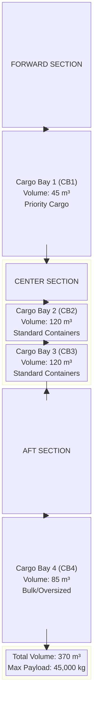
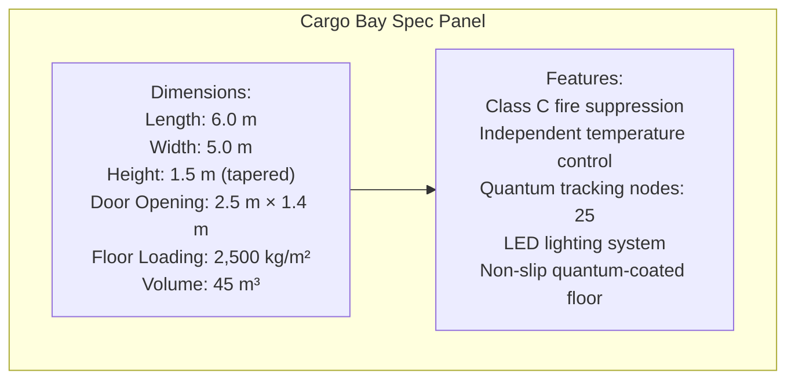
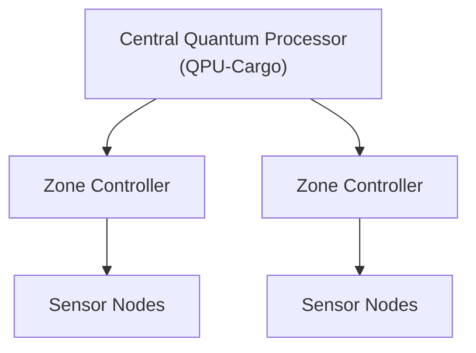
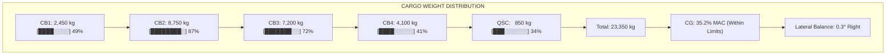
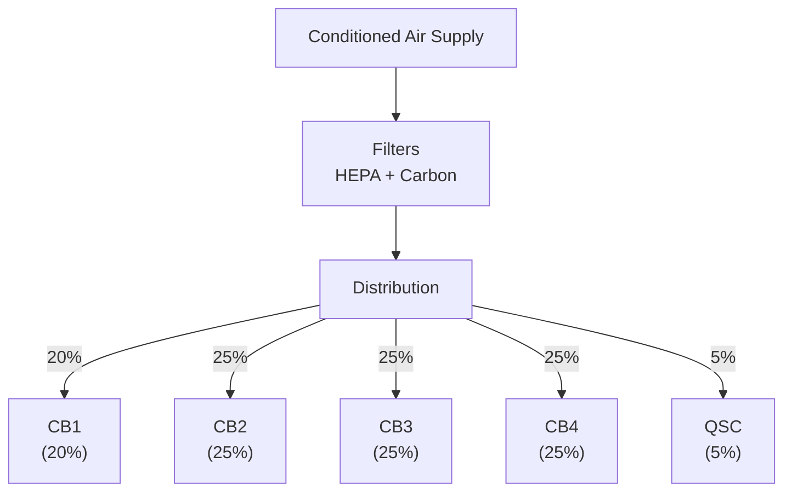

# AMPEL360 BWB-Q100 Cargo Loading Overview
## Document ID: 00-50-00-00-Overview
### ATA Chapter: 00-50 (Cargo and Accessory Compartments)
### Version: 1.0.0
### Date: 2025-01-20
### Status: Initial Release

---

## Table of Contents
1. [Introduction](#1-introduction)
2. [BWB Cargo Configuration](#2-bwb-cargo-configuration)
3. [Cargo Compartment Specifications](#3-cargo-compartment-specifications)
4. [Quantum-Enhanced Cargo Management System](#4-quantum-enhanced-cargo-management-system)
5. [Loading Systems and Equipment](#5-loading-systems-and-equipment)
6. [Weight and Balance Integration](#6-weight-and-balance-integration)
7. [Special Cargo Capabilities](#7-special-cargo-capabilities)
8. [Safety Systems and Features](#8-safety-systems-and-features)
9. [Environmental Control](#9-environmental-control)
10. [Training and Certification](#10-training-and-certification)

---

## 1. Introduction

### 1.1 Purpose
This document provides a comprehensive overview of the cargo loading systems and procedures for the AMPEL360 BWB-Q100, incorporating advanced quantum-enhanced tracking, automated loading systems, and the unique opportunities presented by the Blended Wing Body configuration.

### 1.2 Scope
Covers all aspects of cargo operations including:
- Physical cargo compartment design and access
- Quantum-enhanced tracking and security systems
- Automated loading/unloading equipment
- Weight and balance management
- Special cargo handling capabilities
- Integration with ground operations

### 1.3 Key Innovations
- **Distributed Cargo Architecture**: Multiple compartments optimized for BWB structure
- **Quantum Tracking**: Real-time position and condition monitoring
- **Automated Systems**: AI-driven loading optimization
- **Zero-Emission Operations**: Electric cargo handling equipment
- **Enhanced Security**: Quantum encryption for high-value cargo

---

## 2. BWB Cargo Configuration

### 2.1 Revolutionary Design Advantages

The BWB configuration provides unique cargo capabilities:

#### 2.1.1 Structural Benefits
- **Distributed Load Path**: Cargo weight efficiently distributed across wing structure
- **Lower Floor Height**: Reduced lifting requirements for ground equipment
- **Wide Body Design**: Accommodates oversized cargo items
- **Multiple Access Points**: Simultaneous loading/unloading operations

#### 2.1.2 Volume Optimization



### 2.2 Cargo Bay Assignments

| Bay | Location | Volume | Primary Use | Access |
|-----|----------|--------|-------------|---------|
| CB1 | Forward | 45 m³ | Priority/Express | Door 3L |
| CB2 | Center-Left | 120 m³ | LD3 Containers | Door 4L |
| CB3 | Center-Right | 120 m³ | LD3 Containers | Door 4R |
| CB4 | Aft | 85 m³ | Bulk/Oversized | Door 5L |
| QSC | Aft-Upper | 15 m³ | Quantum-Secured | Door 5R |

## 3. Cargo Compartment Specifications

### 3.1 Physical Dimensions

#### 3.1.1 Cargo Bay 1 (Forward)
```
Dimensions:
- Length: 6.0 m
- Width: 5.0 m
- Height: 1.5 m (tapered)
- Door Opening: 2.5 m × 1.4 m
- Floor Loading: 2,500 kg/m²
- Volume: 45 m³

Features:
- Class C fire suppression
- Independent temperature control
- Quantum tracking nodes: 25
- LED lighting system
- Non-slip quantum-coated floor
```


#### 3.1.2 Cargo Bays 2 & 3 (Center)
```
Dimensions (each):
- Length: 12.0 m
- Width: 5.0 m
- Height: 2.0 m
- Door Opening: 3.0 m × 1.8 m
- Floor Loading: 3,000 kg/m²
- Volume: 120 m³ each

Container Capacity:
- LD3: 10 units per bay
- LD8: 4 units per bay
- Pallets: 8 standard (2.24m × 3.18m)

Features:
- Automated roller system
- Power Drive Units (PDU)
- Container restraint system
- Quantum mesh network
- Emergency lighting
```

#### 3.1.3 Cargo Bay 4 (Aft)
```
Dimensions:
- Length: 8.5 m
- Width: 5.0 m
- Height: 2.0 m (variable)
- Door Opening: 3.5 m × 2.0 m
- Floor Loading: 2,000 kg/m²
- Volume: 85 m³

Special Features:
- Oversized cargo capability
- Adjustable tie-down points
- Heavy-duty roller system
- Reinforced floor structure
- Hazmat containment option
```

#### 3.1.4 Quantum-Secured Compartment (QSC)
```
Dimensions:
- Length: 3.0 m
- Width: 2.5 m
- Height: 2.0 m
- Door: Quantum-locked vault
- Floor Loading: 1,500 kg/m²
- Volume: 15 m³

Security Features:
- Quantum encryption
- Biometric access
- Environmental isolation
- Shock/vibration damping
- Independent power supply
- 24/7 monitoring
```

### 3.2 Structural Specifications

#### 3.2.1 Floor Structure
- **Material**: Carbon fiber composite with titanium reinforcement
- **Loading**: 
  - Running Load: 1,500 kg/m
  - Concentrated Load: 3,000 kg/m²
  - Impact Rating: 9g vertical, 6g lateral
- **Surface**: Anti-slip quantum coating with embedded sensors

#### 3.2.2 Cargo Barriers
- **Forward Barrier**: 9g rated composite bulkhead
- **Aft Barrier**: 4.5g rated with deformation zone
- **Lateral Restraint**: Integrated track system
- **Ceiling Nets**: Kevlar reinforced with breakaway design

---

## 4. Quantum-Enhanced Cargo Management System

### 4.1 Quantum Tracking Network (QTN)

#### 4.1.1 System Architecture



#### 4.1.2 Tracking Capabilities
- **Position Accuracy**: ±1 cm in 3D space
- **Update Rate**: 1000 Hz
- **Temperature Monitoring**: ±0.1°C
- **Humidity Sensing**: ±1% RH
- **Shock Detection**: 0.1g resolution
- **Weight Verification**: ±0.1 kg

### 4.2 Quantum Security Features

#### 4.2.1 Cargo Authentication
```
Security Levels:
Level 1: Standard RFID tracking
Level 2: Encrypted RFID with tamper detection
Level 3: Quantum-authenticated containers
Level 4: Quantum-entangled security pairs
Level 5: Full quantum encryption + biometric
```

#### 4.2.2 Real-Time Monitoring
- Unauthorized access alerts
- Container integrity verification
- Environmental excursion warnings
- Chain of custody documentation
- Automated customs integration

### 4.3 AI-Powered Load Optimization

#### 4.3.1 Loading Algorithm
The Quantum-Enhanced Load Planning System (QELPS) optimizes:
- Weight distribution for CG envelope
- Container placement for destination sequencing
- Hazmat separation requirements
- Priority cargo accessibility
- Fuel efficiency optimization

#### 4.3.2 Dynamic Rebalancing
- Real-time CG calculation
- Automatic ballast fuel transfer
- Load shift prevention
- Trim optimization
- Flutter mode avoidance

---

## 5. Loading Systems and Equipment

### 5.1 Automated Cargo Handling System

#### 5.1.1 Power Drive Units (PDU)
```
PDU Specifications:
- Type: Brushless electric motors
- Power: 5 kW per unit
- Speed: 0.5 m/s (variable)
- Load Capacity: 7,000 kg
- Control: Quantum-synchronized
- Efficiency: >95%
```

#### 5.1.2 Roller System Configuration
| Bay | Roller Type | Spacing | Load Rating |
|-----|-------------|---------|-------------|
| CB1 | Ball Transfer | 200mm | 500 kg/unit |
| CB2/3 | Powered Roller | 400mm | 1,000 kg/unit |
| CB4 | Heavy Duty | 300mm | 1,500 kg/unit |
| QSC | Precision | 150mm | 300 kg/unit |

### 5.2 Container Restraint Systems

#### 5.2.1 Automatic Locking System
- **Type**: Electro-mechanical locks
- **Positions**: Every 1.0m longitudinal
- **Strength**: 45,000 N (9g forward)
- **Engagement**: Automatic on position
- **Release**: Dual-channel safety

#### 5.2.2 Manual Tie-Down Points
- **Grid Pattern**: 0.5m × 0.5m
- **Load Rating**: 22,000 N each
- **Material**: Titanium alloy
- **Quantity**: 500+ points total

### 5.3 Ground Support Interface

#### 5.3.1 Loader Compatibility
```
Supported Equipment:
- Standard Belt Loaders
- K-Loaders (LD3/LD8)
- Container Transporters
- Forklift Access (CB4)
- Quantum-Secured Loader (QSC)
```

#### 5.3.2 Docking Systems
- Automated alignment guides
- Proximity sensors
- Anti-collision systems
- Weather protection seals
- Emergency disconnect

---

## 6. Weight and Balance Integration

### 6.1 Integrated Weight and Balance System (IWBS)

#### 6.1.1 Real-Time Monitoring



#### 6.1.2 Automated Features
- Continuous CG calculation
- Load planning optimization
- Trim fuel transfer coordination
- Warning system integration
- Flight crew display interface

### 6.2 Loading Envelope Protection

#### 6.2.1 System Limits
- **Forward CG Limit**: 15% MAC
- **Aft CG Limit**: 40% MAC
- **Lateral Imbalance**: ±2°
- **Maximum Payload**: 45,000 kg
- **Floor Loading**: Per zone specifications

#### 6.2.2 Protection Features
- Hard stops on PDU movement
- Automated loading sequence
- CG exceedance prevention
- Real-time limit display
- Override authorization required

---

## 7. Special Cargo Capabilities

### 7.1 Temperature-Controlled Cargo

#### 7.1.1 Environmental Zones
| Zone | Temperature Range | Humidity Control | Power |
|------|------------------|------------------|--------|
| Standard | +15°C to +25°C | No | N/A |
| Cool | +2°C to +8°C | Yes | 5kW |
| Frozen | -15°C to -25°C | No | 10kW |
| Custom | -40°C to +50°C | Yes | 15kW |

#### 7.1.2 Pharma Cargo Capability
- GDP compliance
- Temperature mapping
- Data logger integration
- Redundant cooling
- Battery backup: 8 hours

### 7.2 Dangerous Goods

#### 7.2.1 Hazmat Compatibility
```
DG Classes Accepted:
Class 1: Explosives (1.4S only)
Class 2: Gases (2.2 only)
Class 3: Flammable Liquids (Limited)
Class 4: Flammable Solids (CAO)
Class 5: Oxidizers (CAO)
Class 6: Toxic (6.2 excluded)
Class 7: Radioactive (Type A)
Class 8: Corrosives (CAO)
Class 9: Miscellaneous
```

#### 7.2.2 Safety Features
- Fire suppression per zone
- Containment systems
- Ventilation control
- Segregation capability
- Emergency jettison (CB4 only)

### 7.3 Live Animal Transport

#### 7.3.1 Animal Compartment Features
- Temperature: 10°C to 30°C
- Ventilation: 20 air changes/hour
- Lighting: Adjustable LED
- Monitoring: Video + audio
- Access: In-flight capable

#### 7.3.2 Container Compatibility
- IATA CR-82 compliant
- Power connections available
- Water system interface
- Waste management provision

### 7.4 High-Value Cargo

#### 7.4.1 Quantum-Secured Compartment
- Bank vault-level security
- Quantum key encryption
- Biometric multi-factor access
- Shock/vibration isolation
- Independent power/climate
- Real-time tracking to 1mm

#### 7.4.2 Insurance Features
- Continuous video recording
- Tamper-evident sealing
- GPS + quantum positioning
- Automated documentation
- Chain of custody tracking

---

## 8. Safety Systems and Features

### 8.1 Fire Detection and Suppression

#### 8.1.1 Detection System
```
Fire Detection Matrix:
├── Smoke Detectors
│   ├── Photoelectric: 150 units
│   ├── Ionization: 50 units
│   └── Quantum Particle: 25 units
├── Temperature Sensors
│   ├── Rate-of-Rise: 100 units
│   └── Fixed Temperature: 200 units
└── Multi-Spectrum IR: 20 units
```

#### 8.1.2 Suppression System
- **Agent**: Halon replacement (Novec 1230)
- **Activation**: Automatic/Manual
- **Zones**: 5 independent
- **Discharge Time**: <10 seconds
- **Concentration**: 6% by volume

### 8.2 Structural Monitoring

#### 8.2.1 Quantum Structural Monitoring (QSM)
- Continuous stress monitoring
- Fatigue crack detection
- Load path verification
- Impact damage assessment
- Predictive maintenance alerts

#### 8.2.2 Emergency Features
- Blow-out panels (pressure relief)
- Emergency lighting (4 hours)
- Escape path marking
- Communication systems
- Fire barriers

### 8.3 Security Systems

#### 8.3.1 Access Control
```
Security Levels by Area:
CB1: Level 2 - RFID badge
CB2/3: Level 1 - Basic access
CB4: Level 2 - RFID badge
QSC: Level 5 - Biometric + Quantum
```

#### 8.3.2 Surveillance
- 4K cameras with night vision
- Motion detection
- Quantum encryption
- 30-day recording
- Live monitoring capability

---

## 9. Environmental Control

### 9.1 Ventilation System

#### 9.1.1 Air Distribution



#### 9.1.2 Air Quality Management
- Temperature: ±2°C control
- Humidity: 45-65% RH
- Filtration: HEPA (99.97%)
- Air changes: 10-30/hour
- Pressure: Slight positive

### 9.2 Pressure Control

#### 9.2.1 Pressurization
- Maximum differential: 8.6 psi
- Pressure altitude: <8,000 ft
- Rate of change: <500 ft/min
- Relief valves: 9.1 psi
- Negative relief: -0.5 psi

#### 9.2.2 Decompression Protection
- Automatic door seal inflation
- Pressure equalization valves
- Structural reinforcement
- Blow-out panel design
- Crew alerting system

---

## 10. Training and Certification

### 10.1 Personnel Requirements

#### 10.1.1 Certification Levels
| Level | Role | Training Hours | Recurrency |
|-------|------|----------------|------------|
| 1 | Basic Loader | 24 | Annual |
| 2 | Lead Agent | 40 | Annual |
| 3 | Loadmaster | 80 | 6 months |
| 4 | DG Specialist | 40 | Annual |
| 5 | Quantum Tech | 120 | 6 months |

#### 10.1.2 Core Competencies
- BWB-specific procedures
- Quantum system operation
- Weight and balance
- Dangerous goods
- Emergency procedures
- Security protocols

### 10.2 Training Modules

#### 10.2.1 Initial Training Syllabus
```
Module 1: BWB Fundamentals (8 hrs)
- Aircraft familiarization
- Cargo bay layout
- Access procedures
- Safety systems

Module 2: Loading Systems (16 hrs)
- PDU operation
- Container handling
- Restraint systems
- Load planning

Module 3: Quantum Systems (8 hrs)
- QTN operation
- Security features
- Monitoring systems
- Troubleshooting

Module 4: Special Cargo (8 hrs)
- Temperature control
- Dangerous goods
- Live animals
- High-value procedures

Module 5: Emergency Procedures (8 hrs)
- Fire response
- Security breaches
- System failures
- Evacuation
```

### 10.3 Simulation and Practice

#### 10.3.1 Virtual Reality Training
- Full cargo bay simulation
- Loading scenario practice
- Emergency drills
- System fault recognition

#### 10.3.2 Hands-On Requirements
- 20 supervised loads
- 5 special cargo operations
- 3 emergency drills
- System competency check

---

## Appendices

### Appendix A: Container Specifications
[Detailed dimensions and weights for all container types]

### Appendix B: Loading Sequences
[Standard operating procedures for various cargo configurations]

### Appendix C: Emergency Procedures
[Quick reference for all emergency scenarios]

### Appendix D: Quantum System Interfaces
[Technical details of quantum tracking and security systems]

---

## Revision History

| Version | Date | Author | Description |
|---------|------|--------|-------------|
| 1.0.0 | 2025-01-20 | GAIA-QAO Team | Initial release |

---

## Approval Signatures

**Cargo Operations Manager:** ______________________  
**Safety Officer:** _________________________________  
**Training Director:** ______________________________  
**Chief Engineer:** _________________________________

---

*This document is subject to GAIA-QAO configuration control. Any modifications must follow the formal change process as defined in GAIA-QAO-CM-001.*

**END OF DOCUMENT**
