# Forward Cargo Loading Procedures - AMPEL360 BWB-Q100
## Document ID: 00-50-10-01-ForwardCargo
### ATA Chapter: 00-50-10 (Cargo Loading Procedures)
### Version: 1.0.0
### Date: 2025-01-20
### Status: Initial Release

---

## Table of Contents
1. [Introduction](#1-introduction)
2. [CB1 Forward Bay Specifications](#2-cb1-forward-bay-specifications)
3. [Loading Principles for Forward Cargo](#3-loading-principles-for-forward-cargo)
4. [Priority Cargo Procedures](#4-priority-cargo-procedures)
5. [Quick Turnaround Operations](#5-quick-turnaround-operations)
6. [CG Management Strategies](#6-cg-management-strategies)
7. [Special Handling Requirements](#7-special-handling-requirements)
8. [Weight and Loading Restrictions](#8-weight-and-loading-restrictions)
9. [Integration with Quantum Systems](#9-integration-with-quantum-systems)
10. [Safety and Emergency Procedures](#10-safety-and-emergency-procedures)

---

## 1. Introduction

### 1.1 Purpose
This document provides specific procedures for loading cargo in the forward bay (CB1) of the AMPEL360 BWB-Q100 aircraft, emphasizing priority cargo handling, CG management, and quick turnaround capabilities.

### 1.2 Scope
These procedures apply to:
- All CB1 loading operations
- Priority and express cargo
- Time-sensitive shipments
- Forward CG adjustment loads
- Quick turnaround scenarios

### 1.3 Reference Documents
- 00-50-10-00-General.md (General Loading Procedures)
- 00-50-00-00-Overview.md (Cargo Loading Overview)
- Weight and Balance Manual
- Quantum System Operating Manual

### 1.4 CB1 Strategic Importance
```
CB1 OPERATIONAL ROLE
━━━━━━━━━━━━━━━━━━━━━━━━━━━━━━━━━━━━━
Primary Functions:
├── Priority cargo access
├── CG fine-tuning
├── Quick turnaround capability
└── Express shipment handling

Secondary Functions:
├── Live animal positioning
├── Temperature-sensitive cargo
├── Crew baggage storage
└── AOG parts accessibility
━━━━━━━━━━━━━━━━━━━━━━━━━━━━━━━━━━━━━
```

---

## 2. CB1 Forward Bay Specifications

### 2.1 Physical Dimensions

#### 2.1.1 Bay Configuration
```
CB1 FORWARD BAY LAYOUT
━━━━━━━━━━━━━━━━━━━━━━━━━━━━━━━━━━━━━
           Door 3L Access
                │
    ┌───────────▼───────────┐
    │   ┌─┬─┬─┬─┬─┬─┬─┐    │
    │   │1│2│3│4│5│6│7│    │  Length: 6.0m
    │   ├─┼─┼─┼─┼─┼─┼─┤    │  Width: 5.0m
    │   │A│B│C│D│E│F│G│    │  Height: 1.5m (tapered)
    │   └─┴─┴─┴─┴─┴─┴─┘    │  Volume: 45 m³
    │                       │
    │   Priority Zone: 1-3  │
    │   Standard Zone: 4-7  │
    └───────────────────────┘
         ← FWD    AFT →
━━━━━━━━━━━━━━━━━━━━━━━━━━━━━━━━━━━━━
```

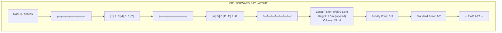

#### 2.1.2 Capacity Specifications
| Parameter | Specification | Notes |
|-----------|--------------|-------|
| Total Volume | 45 m³ | Includes tapered sections |
| Usable Volume | 42 m³ | Accounting for structure |
| Floor Area | 30 m² | Level loading surface |
| Max Gross Weight | 5,000 kg | Structural limit |
| Floor Loading | 2,500 kg/m² | Maximum point load |
| Door Opening | 2.5m × 1.4m | Height restriction |

### 2.2 Container Compatibility

#### 2.2.1 Approved Container Types
```
CB1 CONTAINER COMPATIBILITY
━━━━━━━━━━━━━━━━━━━━━━━━━━━━━━━━━━━━━
Container    Capacity    Preferred Position
─────────────────────────────────────────
LD3 (AKE)      4          Positions 1-4
LD1 (AKC)      4          Any position
LD2 (APE)      2          Positions 1-2
PMC Half       2          Positions 5-7
QAO-BWB-2      6          Optimized fit
━━━━━━━━━━━━━━━━━━━━━━━━━━━━━━━━━━━━━
```

#### 2.2.2 Loading Configuration Examples

```mermaid
block-beta
  columns 7

  %% CONFIGURATION A: MAXIMUM LD3
  block
    columns 7
    TitleA[":::header[Configuration A: Maximum LD3]"]
  end

  block
    columns 7
    LD3A1[":::ld3[[LD3]]"] LD3A2[":::ld3[[LD3]]"] LD3A3[":::ld3[[LD3]]"] LD3A4[":::ld3[[LD3]]"]
    EMPTYA1[":::empty[ ]"] EMPTYA2[":::empty[ ]"] EMPTYA3[":::empty[ ]"]
  end

  block
    columns 7
    TotA[":::total[Total: 4 × LD3 = 17.2 m³]"]
  end

  %% CONFIGURATION B: MIXED PRIORITY
  block
    columns 7
    TitleB[":::header[Configuration B: Mixed Priority]"]
  end

  block
    columns 7
    LD1B1[":::pri[[LD1]]"] LD1B2[":::pri[[LD1]]"] PMC1[":::pmc[[PMC]]"] PMC2[":::pmc[[PMC]]"]
    EMPTYB1[":::empty[ ]"] EMPTYB2[":::empty[ ]"] EMPTYB3[":::empty[ ]"]
  end

  block
    columns 7
    TotB[":::total[Total: 2 × LD1 + 2 × PMC = 18 m³]"]
  end

  %% CONFIGURATION C: QUICK TURN
  block
    columns 7
    TitleC[":::header[Configuration C: Quick Turn]"]
  end

  block
    columns 7
    LD3C1[":::ld3[[LD3]]"] LD3C2[":::ld3[[LD3]]"] EMPTYC1[":::empty[ ]"] EMPTYC2[":::empty[ ]"]
    EMPTYC3[":::empty[ ]"] EMPTYC4[":::empty[ ]"] EMPTYC5[":::empty[ ]"]
  end

  block
    columns 7
    TotC[":::total[Total: 2 × LD3 = 8.6 m³ (Fast access)]"]
  end

%% ---------------- STYLES -----------------
classDef header fill:#e6f7ff,stroke:#07c,stroke-width:2px,font-weight:bold,font-size:18px;
classDef ld3 fill:#caeaff,stroke:#139,stroke-width:1.5px;
classDef pri fill:#ffd7d7,stroke:#a44,stroke-width:1.5px;
classDef pmc fill:#dfffca,stroke:#495e2b,stroke-width:1.5px;
classDef empty fill:#f9f9f9,stroke:#ccc,stroke-width:1.2px;
classDef total fill:#ffffcc,stroke:#c9c900,stroke-width:2px,font-weight:bold;
```

### 2.3 Access Features

#### 2.3.1 Door 3L Specifications
- **Type**: Outward opening, powered
- **Opening Time**: 45 seconds
- **Clear Height**: 1.4m (critical limitation)
- **Sill Height**: 2.8m from ground
- **Emergency Operation**: Manual override available

#### 2.3.2 Ground Equipment Interface

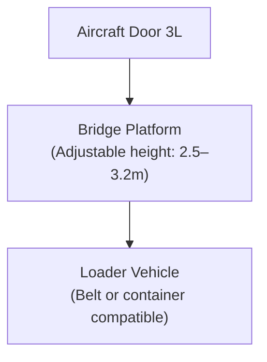

---

## 3. Loading Principles for Forward Cargo

### 3.1 CB1 Loading Philosophy

#### 3.1.1 Primary Considerations
1. **CG Impact**: Each container moves CG forward ~0.5-1.0%
2. **Accessibility**: First-off cargo for short transits
3. **Weight Sensitivity**: Light cargo preferred
4. **Time Efficiency**: Quick load/unload capability

#### 3.1.2 Loading Priority Matrix
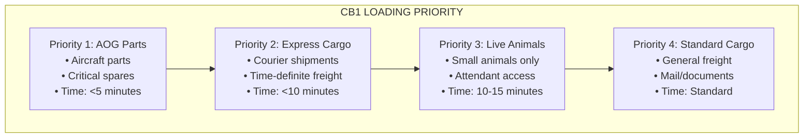

### 3.2 Sequencing Rules

#### 3.2.1 Loading Sequence Principles
1. **Destination Sequence**: First stop cargo in positions 1-3
2. **Weight Distribution**: Heavier items aft (positions 5-7)
3. **Access Requirements**: Priority items near door
4. **Balance Consideration**: Center heavy items

#### 3.2.2 Standard Loading Pattern
```mermaid
block-beta
  columns 7

  %% Step 1: Priority Positions (1-3)
  S1["Step 1: Priority Positions (1-3)"]
  P1["[PRI]"] P2["[PRI]"] P3["[PRI]"] E1["[---]"] E2["[---]"] E3["[---]"] E4["[---]"]

  block
    columns 7
    %% Step 2: Standard Fill (4-7)
    S2["Step 2: Standard Fill (4-7)"]
    P1b["[PRI]"] P2b["[PRI]"] P3b["[PRI]"] S4["[STD]"] S5["[STD]"] E3b["[---]"] E4b["[---]"]
  end

  block
    columns 7
    %% Step 3: Weight Balance
    S3["Step 3: Weight Balance"]
    P1c["[PRI]"] P2c["[PRI]"] P3c["[PRI]"] S4b["[STD]"] S5b["[STD]"] H6["[HVY]"] H7["[HVY]"]
  end
```

---

## 4. Priority Cargo Procedures

### 4.1 Priority Cargo Definition

#### 4.1.1 Classification Criteria
| Category | Examples | Handling Code |
|----------|----------|---------------|
| AOG Critical | Aircraft parts | PRI-1 |
| Medical Emergency | Organs, blood | PRI-2 |
| Express Commercial | Next-flight-out | PRI-3 |
| High Value | Jewelry, art | PRI-4 |
| Perishable | Fresh seafood | PRI-5 |

#### 4.1.2 Identification and Tracking
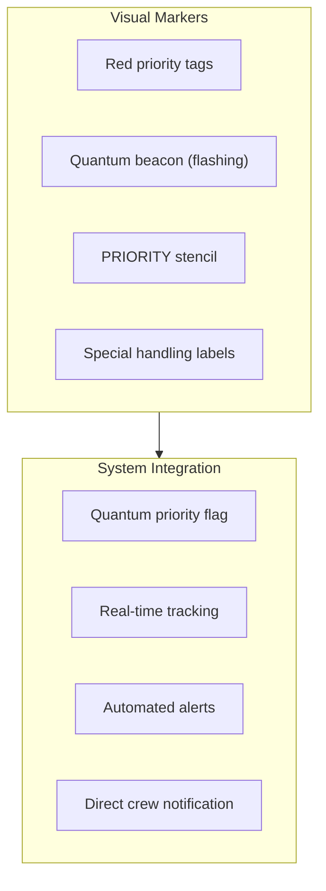

### 4.2 Priority Loading Procedures

#### 4.2.1 Pre-Arrival Preparation
```
PRIORITY CARGO PRE-STAGING
━━━━━━━━━━━━━━━━━━━━━━━━━━━━━━━━━━━━━
T-30 minutes:
□ Identify priority shipments
□ Pre-position at gate
□ Verify documentation
□ Alert loading crew

T-15 minutes:
□ Stage on loader/dolly
□ Confirm CB1 space
□ Brief crew on positions
□ Test quantum tracking

T-5 minutes:
□ Final security check
□ Position equipment
□ Open cargo nets
□ Stand by for aircraft
━━━━━━━━━━━━━━━━━━━━━━━━━━━━━━━━━━━━━
```

#### 4.2.2 Loading Execution
```
PRIORITY LOADING SEQUENCE
━━━━━━━━━━━━━━━━━━━━━━━━━━━━━━━━━━━━━
1. Door Opening (0:00-0:45)
   - Safety check complete
   - Bridge positioned
   - Clearance verified

2. First Priority (0:45-2:00)
   - Position 1A loaded
   - Quantum scan confirmed
   - Lock engaged

3. Sequential Load (2:00-5:00)
   - Positions 2A, 3A filled
   - Each item scanned
   - Progressive securing

4. Documentation (5:00-6:00)
   - Positions recorded
   - Captain notified
   - System updated
━━━━━━━━━━━━━━━━━━━━━━━━━━━━━━━━━━━━━
```

### 4.3 Special Priority Procedures

#### 4.3.1 AOG Parts Handling
```
AOG PARTS FAST-TRACK PROCEDURE
━━━━━━━━━━━━━━━━━━━━━━━━━━━━━━━━━━━━━
Identification:
- AOG label prominent
- Part number visible
- Destination confirmed
- Criticality verified

Loading:
- Direct to Position 1A
- Bypass standard checks
- Immediate lock
- Instant notification

Documentation:
- Photo evidence
- Electronic signature
- Real-time update
- Captain briefing
━━━━━━━━━━━━━━━━━━━━━━━━━━━━━━━━━━━━━
```

#### 4.3.2 Medical Shipments
```
MEDICAL PRIORITY PROTOCOL
━━━━━━━━━━━━━━━━━━━━━━━━━━━━━━━━━━━━━
Temperature-Controlled:
□ Verify temperature log
□ Check battery status
□ Position near power
□ Monitor continuously

Time-Critical:
□ Load last
□ Unload first
□ Direct ground transport
□ Medical team standby

Documentation:
□ Chain of custody
□ Temperature record
□ Time stamps
□ Recipient confirmation
━━━━━━━━━━━━━━━━━━━━━━━━━━━━━━━━━━━━━
```

---

## 5. Quick Turnaround Operations

### 5.1 Quick Turn Definition

#### 5.1.1 Operational Parameters
- **Ground Time**: ≤45 minutes
- **CB1 Access**: Priority only
- **Container Exchange**: Maximum 4 units
- **Documentation**: Streamlined

#### 5.1.2 Quick Turn Triggers
```
QUICK TURN DECISION MATRIX
━━━━━━━━━━━━━━━━━━━━━━━━━━━━━━━━━━━━━
Scheduled Turn <45 min → Quick Turn Mode
Delay Recovery → Quick Turn Authorized
Crew Duty Limit → Consider Quick Turn
Medical Emergency → Auto Quick Turn
━━━━━━━━━━━━━━━━━━━━━━━━━━━━━━━━━━━━━
```

### 5.2 Streamlined Procedures

#### 5.2.1 25-Minute Quick Turn Timeline
```
CB1 QUICK TURN TIMELINE
━━━━━━━━━━━━━━━━━━━━━━━━━━━━━━━━━━━━━
00:00 │ Aircraft on blocks
00:30 │ GPU connected
01:00 │ Door 3L open
02:00 │ First container out
      │
05:00 │ Unload complete (2 units)
06:00 │ Clean/inspect
08:00 │ First container in
      │
11:00 │ Load complete (2 units)
12:00 │ Documentation
13:00 │ Door closed
      │
20:00 │ All clear
25:00 │ Ready for pushback
━━━━━━━━━━━━━━━━━━━━━━━━━━━━━━━━━━━━━
```

#### 5.2.2 Restricted Operations
During quick turns, the following are NOT permitted:
- CB4 access (aft bay)
- CB2/CB3 major changes
- Bulk cargo handling
- Live animal loading
- Dangerous goods changes

### 5.3 Quick Turn Optimization

#### 5.3.1 Pre-Positioning Strategy
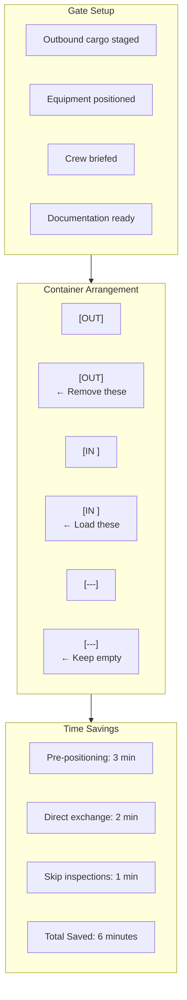

#### 5.3.2 Crew Coordination
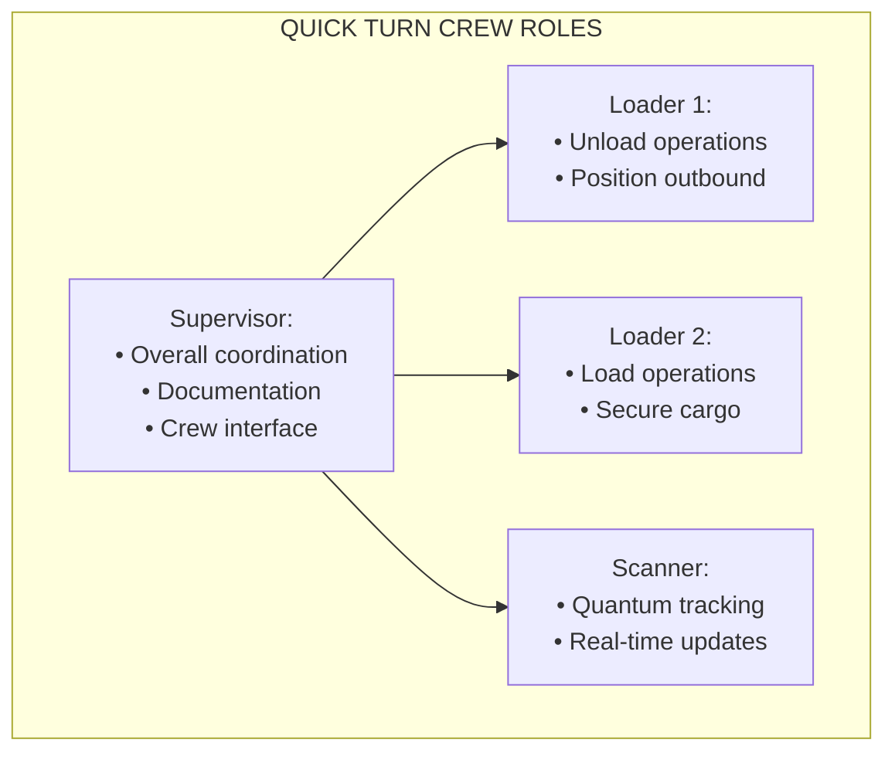

---

## 6. CG Management Strategies

### 6.1 CB1 Impact on CG

#### 6.1.1 CG Shift Calculations
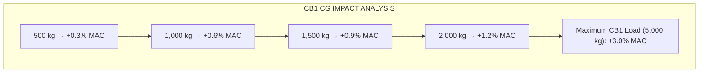

#### 6.1.2 Loading Decision Tree
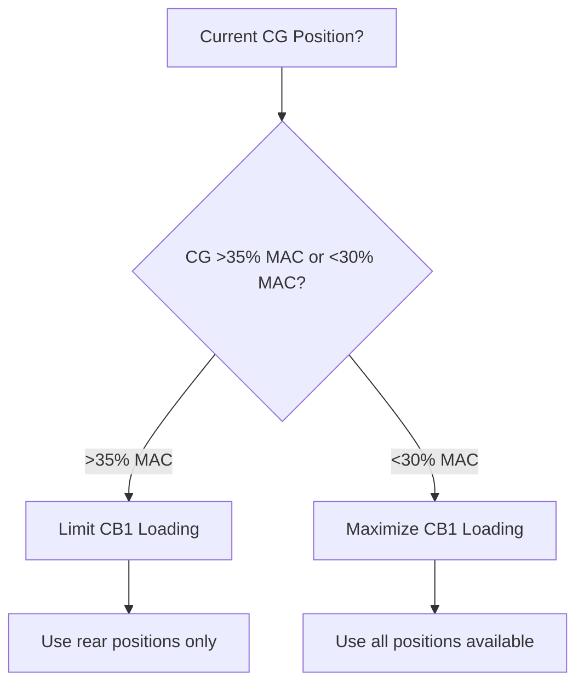

### 6.2 Trim Optimization

#### 6.2.1 Fine-Tuning Procedures
```
CB1 TRIM ADJUSTMENT GUIDE
━━━━━━━━━━━━━━━━━━━━━━━━━━━━━━━━━━━━━
CG Too Far Aft (>37% MAC):
1. Add containers to CB1
2. Start with positions 1-3
3. Use heavier items if available
4. Monitor CG change real-time

CG Too Far Forward (<25% MAC):
1. Remove/relocate CB1 cargo
2. Start with positions 1-3
3. Move to CB4 if possible
4. Consider fuel transfer

Optimal Range (32-35% MAC):
1. Maintain current loading
2. Document for reference
3. Note configuration
━━━━━━━━━━━━━━━━━━━━━━━━━━━━━━━━━━━━━
```

#### 6.2.2 Progressive Loading Strategy
```
PROGRESSIVE CB1 LOADING
━━━━━━━━━━━━━━━━━━━━━━━━━━━━━━━━━━━━━
Phase 1: Initial Load
[###][###][---][---][---][---][---]
Check CG → Continue if OK

Phase 2: Standard Fill
[###][###][###][###][---][---][---]
Check CG → Adjust if needed

Phase 3: Final Trim
[###][###][###][###][###][#--][---]
Fine-tune to target CG
━━━━━━━━━━━━━━━━━━━━━━━━━━━━━━━━━━━━━
```

---

## 7. Special Handling Requirements

### 7.1 Live Animal Loading

#### 7.1.1 CB1 Animal Restrictions
```
APPROVED ANIMALS FOR CB1
━━━━━━━━━━━━━━━━━━━━━━━━━━━━━━━━━━━━━
Permitted:
├── Cats/dogs in carriers
├── Service animals
├── Small mammals
└── Birds (caged)

Not Permitted:
├── Large animals
├── Livestock
├── Reptiles >1m
└── Aggressive species

Container Limits:
- Maximum 2 animal containers
- Positions 1-2 only
- Temperature zone required
━━━━━━━━━━━━━━━━━━━━━━━━━━━━━━━━━━━━━
```

#### 7.1.2 Animal Loading Procedure
```
CB1 ANIMAL LOADING PROTOCOL
━━━━━━━━━━━━━━━━━━━━━━━━━━━━━━━━━━━━━
Pre-Load:
□ Verify health certificates
□ Check container integrity
□ Confirm temperature setting
□ Brief crew on handling

Loading:
□ Load last (minimize time)
□ Position 1A preferred
□ Secure with extra care
□ Verify ventilation

Post-Load:
□ Visual check
□ Temperature confirmation
□ Document position
□ Notify crew
━━━━━━━━━━━━━━━━━━━━━━━━━━━━━━━━━━━━━
```

### 7.2 Temperature-Sensitive Cargo

#### 7.2.1 CB1 Temperature Capabilities
| Zone | Temperature Range | Power Available |
|------|------------------|-----------------|
| Positions 1-2 | +2°C to +25°C | Yes (115V) |
| Positions 3-4 | +15°C to +25°C | Limited |
| Positions 5-7 | Ambient only | No |

#### 7.2.2 Cool Chain Management
```
TEMPERATURE-SENSITIVE LOADING
━━━━━━━━━━━━━━━━━━━━━━━━━━━━━━━━━━━━━
Pre-Cool Requirements:
- Container pre-cooled 2 hours
- Temperature logged
- Battery backup verified

Loading Sequence:
1. Power cable ready
2. Load container
3. Connect power <30 sec
4. Verify operation
5. Seal and document

Monitoring:
- Real-time temperature
- Quantum sensor active
- Alert thresholds set
- Backup plan ready
━━━━━━━━━━━━━━━━━━━━━━━━━━━━━━━━━━━━━
```

### 7.3 High-Value Cargo

#### 7.3.1 Security Procedures
```
CB1 HIGH-VALUE PROTOCOL
━━━━━━━━━━━━━━━━━━━━━━━━━━━━━━━━━━━━━
Pre-Load Security:
□ Two-person verification
□ Seal inspection
□ Photo documentation
□ Quantum tag activation

Loading:
□ Continuous escort
□ Position 1A only
□ Extra restraints
□ Video recording

Post-Load:
□ Seal photograph
□ Double lock verification
□ Quantum encryption active
□ Crew notification
━━━━━━━━━━━━━━━━━━━━━━━━━━━━━━━━━━━━━
```

---

## 8. Weight and Loading Restrictions

### 8.1 Structural Limitations

#### 8.1.1 CB1 Weight Limits
```
CB1 STRUCTURAL LIMITS
━━━━━━━━━━━━━━━━━━━━━━━━━━━━━━━━━━━━━
Maximum Gross Weight: 5,000 kg

Zone Limits:
├── Positions 1-3: 2,500 kg
├── Positions 4-5: 1,500 kg
└── Positions 6-7: 1,000 kg

Floor Loading:
├── Running Load: 750 kg/m
├── Point Load: 2,500 kg/m²
└── Impact Factor: 1.5

Never Exceed:
- Single container: 1,600 kg
- Total weight: 5,000 kg
- CG forward of 15% MAC
━━━━━━━━━━━━━━━━━━━━━━━━━━━━━━━━━━━━━
```

#### 8.1.2 Height Restrictions
```
CB1 HEIGHT CLEARANCE
━━━━━━━━━━━━━━━━━━━━━━━━━━━━━━━━━━━━━
Door Opening: 1.4m (critical)

Internal Heights:
Position 1-2: 1.5m
Position 3-4: 1.4m
Position 5-6: 1.3m
Position 7:   1.2m

Container Height Limits:
LD3: OK all positions
LD1: OK positions 1-4
LD8: NOT PERMITTED
Pallets: 1.2m maximum
━━━━━━━━━━━━━━━━━━━━━━━━━━━━━━━━━━━━━
```

### 8.2 Loading Combinations

#### 8.2.1 Approved Combinations
```
VALID CB1 LOADING COMBINATIONS
━━━━━━━━━━━━━━━━━━━━━━━━━━━━━━━━━━━━━
Configuration A: Standard
[LD3][LD3][LD3][LD3][---][---][---]
Weight: 4,800 kg ✓

Configuration B: Mixed
[LD1][LD1][PMC][PMC][---][---][---]
Weight: 3,200 kg ✓

Configuration C: Priority
[PRI][PRI][---][---][---][---][---]
Weight: 2,000 kg ✓

Configuration D: Maximum
[LD3][LD3][LD1][LD1][BGE][BGE][---]
Weight: 4,950 kg ✓
━━━━━━━━━━━━━━━━━━━━━━━━━━━━━━━━━━━━━
```

#### 8.2.2 Prohibited Combinations
- Oversized containers (LD8, LD11)
- Heavy machinery >1,600 kg
- Hazmat incompatible classes
- Livestock with other cargo

---

## 9. Integration with Quantum Systems

### 9.1 CB1 Quantum Features

#### 9.1.1 Quantum Node Distribution
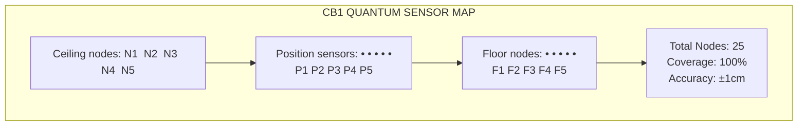

#### 9.1.2 Priority Cargo Quantum Features
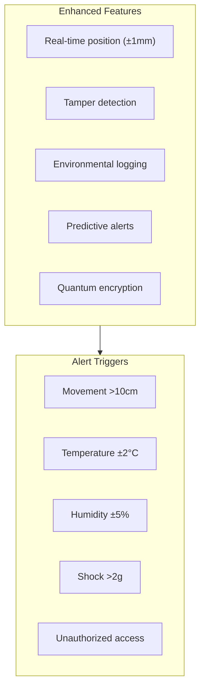

### 9.2 Data Integration

#### 9.2.1 CB1 Load Optimization
```
QUANTUM LOAD OPTIMIZATION
━━━━━━━━━━━━━━━━━━━━━━━━━━━━━━━━━━━━━
Input Parameters:
- Current CG position
- Available cargo
- Priority requirements
- Weight restrictions
- Time constraints

Quantum Processing:
- 10⁶ combinations analyzed
- Optimal sequence determined
- CG prediction calculated
- Risk factors assessed

Output:
- Loading sequence
- Position assignments
- Time estimates
- CG projection
━━━━━━━━━━━━━━━━━━━━━━━━━━━━━━━━━━━━━
```

#### 9.2.2 Real-Time Monitoring
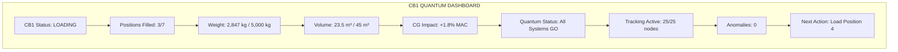

---

## 10. Safety and Emergency Procedures

### 10.1 CB1-Specific Safety Concerns

#### 10.1.1 Unique Hazards
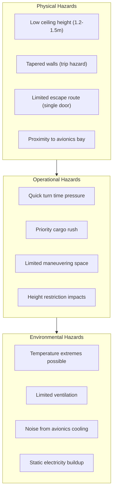

#### 10.1.2 PPE Requirements
```
CB1-SPECIFIC PPE
━━━━━━━━━━━━━━━━━━━━━━━━━━━━━━━━━━━━━
Mandatory:
□ Hard hat (low profile)
□ Steel toe shoes
□ High-vis vest
□ Cut-resistant gloves

Additional for CB1:
□ Knee pads (low clearance)
□ Head lamp (dark corners)
□ Anti-static wrist strap
□ Bump cap option

Special Cargo:
□ Thermal gloves (cold cargo)
□ Chemical gloves (DG)
□ Face shield (batteries)
□ Respirator (animals)
━━━━━━━━━━━━━━━━━━━━━━━━━━━━━━━━━━━━━
```

### 10.2 Emergency Procedures

#### 10.2.1 Fire Emergency in CB1
```
CB1 FIRE RESPONSE PROCEDURE
━━━━━━━━━━━━━━━━━━━━━━━━━━━━━━━━━━━━━
IMMEDIATE ACTIONS (30 seconds):
1. SHOUT: "FIRE CB1! EVACUATE!"
2. EXIT via Door 3L immediately
3. ACTIVATE nearest fire alarm
4. CLOSE Door 3L if safe

SECONDARY ACTIONS:
5. Account for all personnel
6. Notify cockpit/fire service
7. Isolate electrical power
8. Stand by with extinguisher

DO NOT:
- Re-enter CB1
- Attempt to fight large fire
- Move burning containers
- Use water on electrical
━━━━━━━━━━━━━━━━━━━━━━━━━━━━━━━━━━━━━
```

#### 10.2.2 Injury in Confined Space
```
CB1 INJURY RESPONSE
━━━━━━━━━━━━━━━━━━━━━━━━━━━━━━━━━━━━━
Assessment:
1. Call out to injured person
2. Do NOT move if head/neck injury
3. Check for hazards
4. Call medical assistance

Extraction (if required):
1. Minimum 2 rescuers
2. Use spine board if available
3. Clear path to door
4. Coordinate movement
5. Extract feet first

Communication:
- Radio: "Medical emergency CB1"
- Location: Position number
- Nature: Type of injury
- Assistance: What's needed
━━━━━━━━━━━━━━━━━━━━━━━━━━━━━━━━━━━━━
```

#### 10.2.3 Container Shift/Fall
```
CONTAINER INSTABILITY RESPONSE
━━━━━━━━━━━━━━━━━━━━━━━━━━━━━━━━━━━━━
Immediate:
1. "STAND CLEAR!" warning
2. Exit danger zone
3. Stop all operations
4. Assess stability

Containment:
1. Do NOT attempt to catch
2. Establish safety perimeter
3. Check for damage
4. Verify other containers

Recovery:
1. Engineering inspection
2. Remove unstable items
3. Check floor integrity
4. Document incident
━━━━━━━━━━━━━━━━━━━━━━━━━━━━━━━━━━━━━
```

### 10.3 Emergency Equipment Locations

#### 10.3.1 CB1 Emergency Equipment
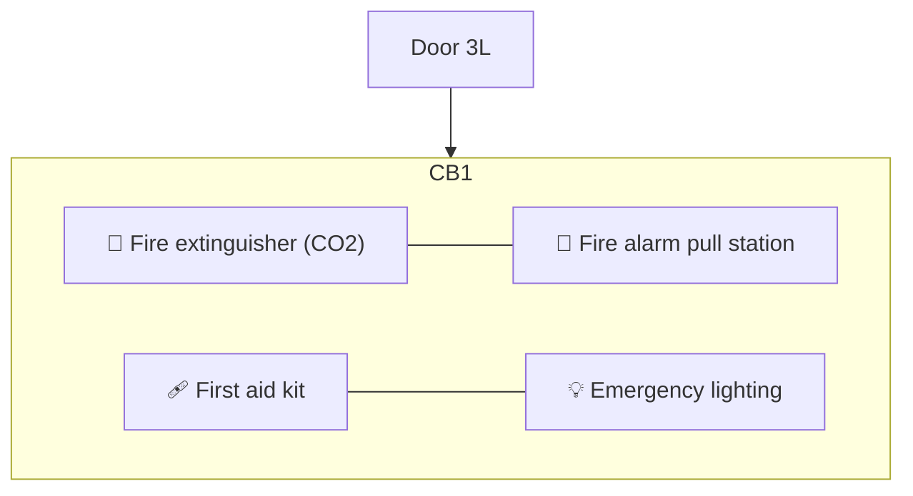

#### 10.3.2 Evacuation Routes
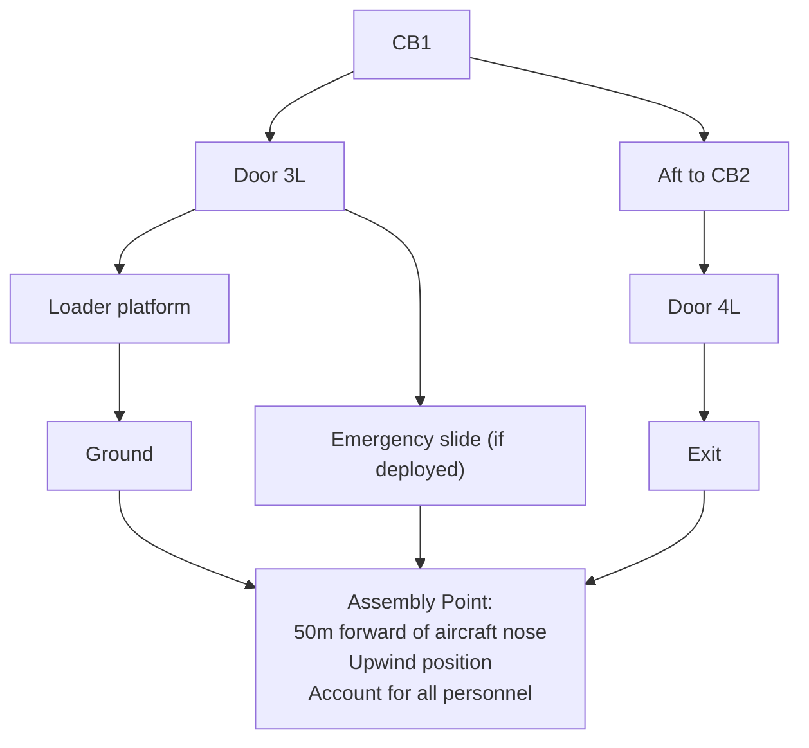

---

## Appendices

### Appendix A: CB1 Quick Reference

#### A.1 Loading Checklist
```
CB1 QUICK LOADING CHECKLIST
━━━━━━━━━━━━━━━━━━━━━━━━━━━━━━━━━━━━━
Pre-Load:
□ Check CG position
□ Review priority cargo
□ Verify space available
□ Position equipment

During Load:
□ Priority items first
□ Scan each container
□ Progressive securing
□ Monitor weight total

Post-Load:
□ Final count verification
□ Documentation complete
□ Quantum tracking active
□ Crew notification sent
━━━━━━━━━━━━━━━━━━━━━━━━━━━━━━━━━━━━━
```

#### A.2 Weight Quick Reference
| Cargo Type | Typical Weight | Max Position |
|------------|---------------|--------------|
| LD3 empty | 82 kg | Any |
| LD3 average | 1,200 kg | 1-5 |
| LD3 heavy | 1,588 kg | 1-3 only |
| LD1 average | 800 kg | Any |
| Priority pkg | 50-500 kg | 1-3 |

#### A.3 Common Error Codes
| Code | Meaning | Action |
|------|---------|--------|
| CB1-01 | Overweight | Remove cargo |
| CB1-02 | Door obstruction | Clear path |
| CB1-03 | Quantum node offline | Reset zone |
| CB1-04 | Position mismatch | Verify location |
| CB1-05 | Unauthorized access | Security check |

### Appendix B: Priority Cargo Codes

#### B.1 Handling Codes
```
PRIORITY HANDLING CODES
━━━━━━━━━━━━━━━━━━━━━━━━━━━━━━━━━━━━━
PRI-1: AOG Critical
- Load first/unload first
- Direct to position 1
- Immediate notification

PRI-2: Medical
- Temperature critical
- Time stamps required
- Special documentation

PRI-3: Express Commercial
- Next flight guarantee
- Standard priority
- Track continuously

PRI-4: High Value
- Security protocol
- Two-person rule
- Extra restraints

PRI-5: Perishable
- Temperature monitor
- Limited time window
- Quality checks
━━━━━━━━━━━━━━━━━━━━━━━━━━━━━━━━━━━━━
```

### Appendix C: CG Calculation Examples

#### C.1 Sample Calculations
```
CB1 CG IMPACT EXAMPLES
━━━━━━━━━━━━━━━━━━━━━━━━━━━━━━━━━━━━━
Example 1: Light Load
2 × LD3 @ 1,000 kg = 2,000 kg
CG shift: +1.2% MAC

Example 2: Heavy Load
4 × LD3 @ 1,200 kg = 4,800 kg
CG shift: +2.9% MAC

Example 3: Mixed Load
2 × LD3 @ 1,200 kg = 2,400 kg
2 × LD1 @ 600 kg = 1,200 kg
Total: 3,600 kg
CG shift: +2.2% MAC
━━━━━━━━━━━━━━━━━━━━━━━━━━━━━━━━━━━━━
```

### Appendix D: Training Requirements

#### D.1 CB1 Certification
```
CB1 LOADING CERTIFICATION
━━━━━━━━━━━━━━━━━━━━━━━━━━━━━━━━━━━━━
Initial Training:
- Classroom: 4 hours
- Hands-on: 8 hours
- Evaluation: 2 hours
- Total: 14 hours

Topics Covered:
1. CB1 specifications
2. Priority procedures
3. CG management
4. Quick turn ops
5. Safety protocols
6. Emergency response

Recurrent Training:
- Annual: 4 hours
- Updates: As required
- Emergency drills: Quarterly
━━━━━━━━━━━━━━━━━━━━━━━━━━━━━━━━━━━━━
```

---

## Forms and Documents

### F.1 CB1 Load Planning Form
```mermaid
flowchart TB
    subgraph CB1_WS["CB1 LOAD PLANNING WORKSHEET"]
        FLIGHT["Flight: _______    Date: _______"]

        POS1["1A   | _________ | ___kg | ________"]
        POS2["2A   | _________ | ___kg | ________"]
        POS3["3A   | _________ | ___kg | ________"]
        POS4["4A   | _________ | ___kg | ________"]
        POS5["5A   | _________ | ___kg | ________"]
        POS6["6A   | _________ | ___kg | ________"]
        POS7["7A   | _________ | ___kg | ________"]

        TOTAL["Total Weight: ______kg"]
        CG["CG Impact: +____% MAC"]
    end

    FLIGHT --> POS1 --> POS2 --> POS3 --> POS4 --> POS5 --> POS6 --> POS7 --> TOTAL --> CG
```

### F.2 Priority Cargo Notification
```mermaid
flowchart TB
    subgraph ALERTFORM["PRIORITY CARGO ALERT FORM"]
        TO["To: Captain / Load Control"]
        FROM["From: CB1 Loading Team"]

        LEVEL["Priority Level: PRI-___"]
        DESC["Description: _____________________"]
        WEIGHT["Weight: ______kg"]
        POS["Position: _______"]
        SPECIAL1["Special Requirements: _____________"]
        SPECIAL2["________________________________"]

        LOADED["Loaded by: _________    Time: ______"]
        VERIFIED["Verified by: _______    Time: ______"]
    end

    TO --> FROM --> LEVEL --> DESC --> WEIGHT --> POS --> SPECIAL1 --> SPECIAL2 --> LOADED --> VERIFIED
```

---

## Revision History

| Version | Date | Author | Changes |
|---------|------|--------|---------|
| 1.0.0 | 2025-01-20 | GAIA-QAO Team | Initial release |

---

## Approval Signatures

**Cargo Operations Manager:** _______________________  
**Safety Officer:** _________________________________  
**Training Manager:** _______________________________  
**Chief Loadmaster:** _______________________________

---

*This document is part of the AMPEL360 BWB-Q100 Cargo Loading Procedures suite. Always verify you have the current version before conducting operations.*

**END OF DOCUMENT**
