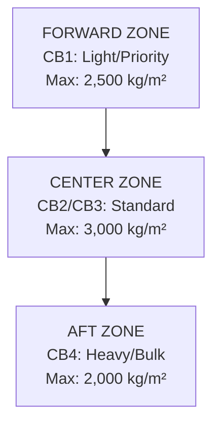
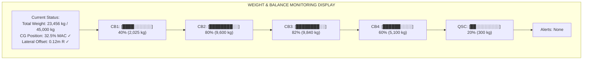
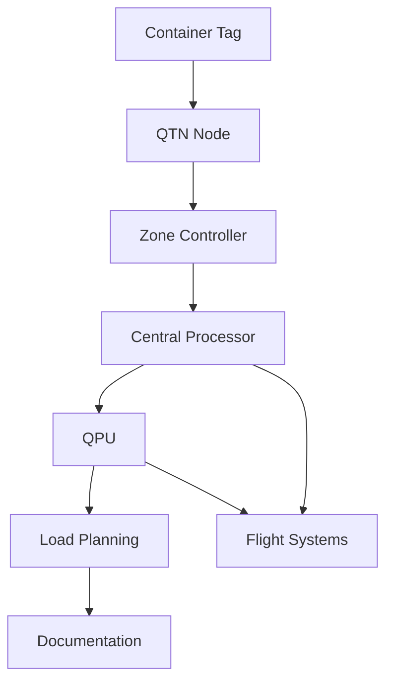
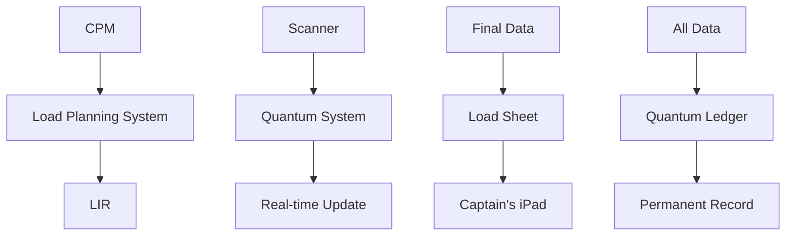
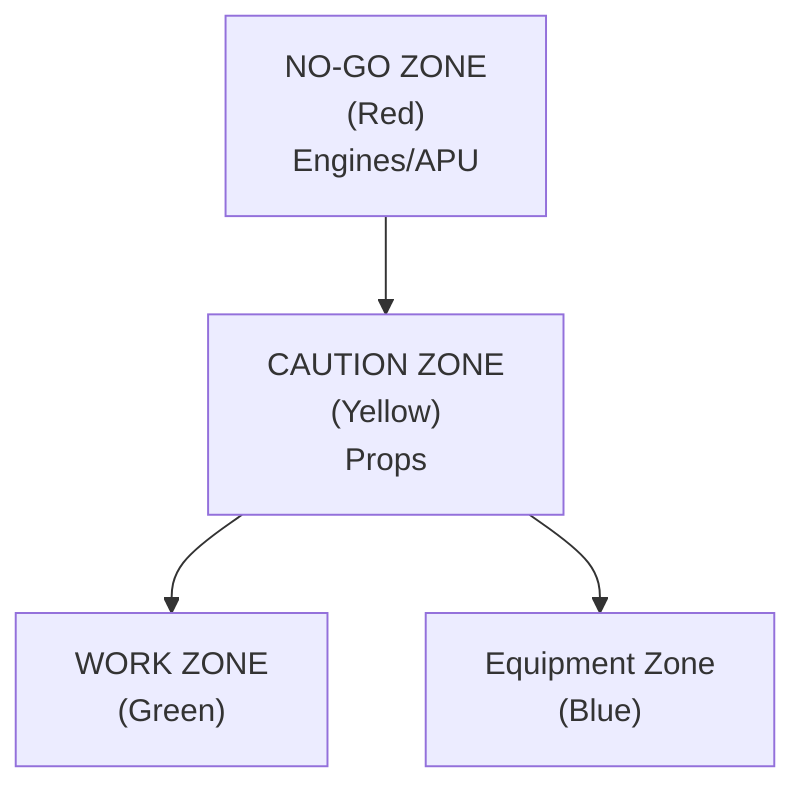
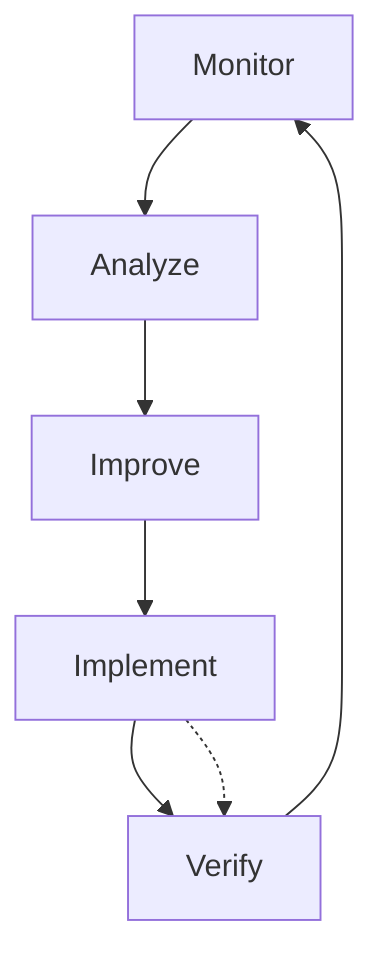

# General Loading Procedures - AMPEL360 BWB-Q100
## Document ID: 00-50-10-00-General
### ATA Chapter: 00-50-10 (Cargo Loading Procedures)
### Version: 1.0.0
### Date: 2025-01-20
### Status: Initial Release

---

## Table of Contents
1. [Introduction and Scope](#1-introduction-and-scope)
2. [General Loading Principles](#2-general-loading-principles)
3. [Pre-Loading Requirements](#3-pre-loading-requirements)
4. [BWB-Specific Loading Considerations](#4-bwb-specific-loading-considerations)
5. [Standard Loading Sequence](#5-standard-loading-sequence)
6. [Weight and Balance Procedures](#6-weight-and-balance-procedures)
7. [Quantum System Integration](#7-quantum-system-integration)
8. [Documentation Requirements](#8-documentation-requirements)
9. [Safety Procedures](#9-safety-procedures)
10. [Quality Control and Verification](#10-quality-control-and-verification)

---

## 1. Introduction and Scope

### 1.1 Purpose
This document establishes the general loading procedures for the AMPEL360 BWB-Q100 aircraft, incorporating quantum-enhanced cargo management systems and the unique characteristics of the Blended Wing Body configuration.

### 1.2 Applicability
These procedures apply to:
- All cargo loading operations
- All AMPEL360 BWB-Q100 aircraft variants
- All certified loading personnel
- Both manual and automated loading systems

### 1.3 Regulatory Compliance
All procedures comply with:
- IATA Airport Handling Manual (AHM)
- ICAO Annex 18 (Dangerous Goods)
- EASA/FAA cargo loading regulations
- GAIA-QAO quantum system standards

### 1.4 Document Hierarchy
```
00-50-10-00-LoadingProcedures/
├── 📄 00-50-10-00-General.md (Current document)
├── 📄 00-50-10-01-ForwardCargo.md
├── 📄 00-50-10-02-AftCargo.md
├── 📄 00-50-10-03-BulkCargo.md
└── 📁 equipment/
    └── 📄 00-50-10-00-01-LoaderSpecs.pdf
```

---

## 2. General Loading Principles

### 2.1 Fundamental Rules

#### 2.1.1 The Five Pillars of Safe Loading
1. **Weight Distribution**: Maintain CG within limits at all times
2. **Structural Integrity**: Never exceed floor loading limits
3. **Cargo Security**: All items properly restrained
4. **System Integration**: Quantum tracking active for all cargo
5. **Documentation**: Complete and accurate records

#### 2.1.2 Loading Priority Hierarchy
```
Priority Level 1: Aircraft Safety
├── CG limits compliance
├── Structural limit protection
└── Emergency access maintenance

Priority Level 2: Operational Efficiency
├── Destination sequencing
├── Transfer cargo accessibility
└── Ground time optimization

Priority Level 3: Service Quality
├── Special cargo requirements
├── Temperature maintenance
└── Security compliance

Priority Level 4: Revenue Optimization
├── Maximum payload utilization
├── Premium service accommodation
└── Fuel efficiency consideration
```

### 2.2 BWB-Specific Principles

#### 2.2.1 Distributed Loading Philosophy
The BWB configuration requires:
- Simultaneous multi-bay loading capability
- Enhanced lateral balance attention
- Continuous structural monitoring
- Integrated load distribution

#### 2.2.2 Quantum-Enhanced Operations
- Real-time position tracking for all cargo
- Predictive CG management
- Automated anomaly detection
- Continuous optimization capability

---

## 3. Pre-Loading Requirements

### 3.1 Documentation Review

#### 3.1.1 Required Documents Checklist
```
PRE-LOADING DOCUMENTATION
━━━━━━━━━━━━━━━━━━━━━━━━━━━━━━━━━━━━━
□ Load Plan (CPM/LDM format)
□ Special Load Notification (NOTOC)
□ Dangerous Goods Declaration (if applicable)
□ Live Animal Certification (if applicable)
□ Weight and Balance Preliminary
□ Quantum Security Clearances
□ Customs Documentation
□ Temperature Requirements Log
━━━━━━━━━━━━━━━━━━━━━━━━━━━━━━━━━━━━━
```

#### 3.1.2 Load Plan Verification
1. Verify aircraft registration and configuration
2. Confirm bay capacities match aircraft variant
3. Check special loading instructions
4. Validate weight distribution plan
5. Review destination sequence requirements

### 3.2 Equipment Preparation

#### 3.2.1 Ground Support Equipment
| Equipment Type | BWB-Specific Model | Check Required |
|---------------|-------------------|----------------|
| Container Loader | K-Loader BWB-3000 | Hydraulic, height limits |
| Pallet Transporter | PT-Q100 | Roller locks, brakes |
| Belt Loader | BL-BWB-Extended | Belt tension, speed |
| Forklift | Quantum-Safe FL20 | Load capacity, forks |
| Pushback Tug | TowBot-BWB | Connection adapter |

#### 3.2.2 Quantum System Readiness
```
QUANTUM SYSTEM PRE-LOAD CHECK
━━━━━━━━━━━━━━━━━━━━━━━━━━━━━━━━━━━━━
System Component    Status    Required Action
────────────────────────────────────────
QTN Nodes          >99%      Verify all active
QPU Processor      Online    Check coherence
QSS Security       Armed     Verify credentials
Zone Controllers   Ready     Test communication
Data Link          Active    Confirm bandwidth
━━━━━━━━━━━━━━━━━━━━━━━━━━━━━━━━━━━━━
```

### 3.3 Personnel Requirements

#### 3.3.1 Minimum Crew Composition
- Load Supervisor (Level 3+): 1
- Bay Leaders: 1 per active bay
- Certified Loaders: 2 per bay minimum
- Quantum System Operator: 1
- Documentation Specialist: 1

#### 3.3.2 Certification Verification
All personnel must have:
- Valid GAIA-QAO loading certificate
- BWB-specific endorsement
- Quantum system authorization (Level 2+)
- Current dangerous goods certification (if handling DG)

---

## 4. BWB-Specific Loading Considerations

### 4.1 Structural Considerations

#### 4.1.1 Load Distribution Requirements



#### 4.1.2 Lateral Balance Requirements
- Maximum lateral CG offset: ±0.5m
- Container placement: Alternate sides when loading CB2/CB3
- Real-time monitoring via QSM network
- Automatic alerts for imbalance >0.3m

### 4.2 Access Management

#### 4.2.1 Multi-Door Coordination
```
DOOR ASSIGNMENT MATRIX
━━━━━━━━━━━━━━━━━━━━━━━━━━━━━━━━━━━━━
Door   Primary Use        Secondary      Restrictions
────────────────────────────────────────────────────
3L     CB1 access        Priority cargo  Height 2.5m
4L     CB2 access        Containers      Standard
4R     CB3 access        Containers      Standard  
5L     CB4 access        Bulk/oversize   Height 3.0m
5R     QSC access        Secure only     Biometric
━━━━━━━━━━━━━━━━━━━━━━━━━━━━━━━━━━━━━━━━━━━━━━━━━
```

#### 4.2.2 Simultaneous Operations Rules
- Maximum 3 doors active simultaneously
- CB2/CB3 parallel loading permitted
- CB1/CB4 sequential only (CG management)
- QSC independent operation allowed

### 4.3 Environmental Considerations

#### 4.3.1 Weather Limitations
| Condition | Limit | Action Required |
|-----------|-------|-----------------|
| Wind | >40 kph | Suspend operations |
| Rain | Heavy | Cover cargo, reduce speed |
| Lightning | <10km | Stop, ground equipment |
| Snow/Ice | Present | De-ice rollers, extra care |
| Temperature | <-25°C | Hydraulic pre-heat |

#### 4.3.2 BWB Aerodynamic Effects
- Increased wind sensitivity due to large surface area
- Vortex zones near wing roots
- Ground effect considerations
- Tie-down requirements during loading

---

## 5. Standard Loading Sequence

### 5.1 Loading Sequence Overview

#### 5.1.1 Standard Sequence Flow
```
STANDARD LOADING SEQUENCE
━━━━━━━━━━━━━━━━━━━━━━━━━━━━━━━━━━━━━
Phase 1: CB4 Aft Loading (Heavy First)
    ├── Door 5L open
    ├── Heavy/dense cargo
    ├── CG moves aft
    └── Duration: 15-20 min

Phase 2: CB2/CB3 Center Loading (Parallel)
    ├── Doors 4L/4R open
    ├── Standard containers
    ├── Maintain lateral balance
    └── Duration: 25-30 min

Phase 3: CB1 Forward Loading (Trim)
    ├── Door 3L open
    ├── Light/priority cargo
    ├── Fine CG adjustment
    └── Duration: 10-15 min

Phase 4: QSC Secure Loading (Final)
    ├── Door 5R open
    ├── High-value items
    ├── Biometric verification
    └── Duration: 5-10 min
━━━━━━━━━━━━━━━━━━━━━━━━━━━━━━━━━━━━━
```

### 5.2 Detailed Phase Procedures

#### 5.2.1 Phase 1: CB4 Aft Loading
```
PROCEDURE: CB4 AFT BAY LOADING
━━━━━━━━━━━━━━━━━━━━━━━━━━━━━━━━━━━━━
1. PREPARATION
   □ Open door 5L
   □ Position main deck loader
   □ Verify quantum tracking active
   □ Check floor condition

2. LOADING SEQUENCE
   □ Position 1-2: Heaviest items (>1,500kg)
   □ Position 3-4: Dense cargo
   □ Position 5-6: Standard weight
   □ Monitor CG continuously

3. SECURING
   □ Engage all locks
   □ Verify restraint system
   □ Check quantum tag status
   □ Update load sheet

4. VERIFICATION
   □ Visual inspection complete
   □ Weight within limits
   □ CG movement acceptable
   □ Quantum tracking confirmed
━━━━━━━━━━━━━━━━━━━━━━━━━━━━━━━━━━━━━
```

#### 5.2.2 Phase 2: CB2/CB3 Parallel Loading
```
PARALLEL LOADING COORDINATION
━━━━━━━━━━━━━━━━━━━━━━━━━━━━━━━━━━━━━
CB2 Team (Left)         CB3 Team (Right)
─────────────────────────────────────────
Container #1      ←→    Container #1
   ↓ 3 min              ↓ 3 min
Container #2      ←→    Container #2
   ↓ 3 min              ↓ 3 min
Container #3      ←→    Container #3

Synchronization Points:
- Start together
- Match weights within 500kg
- Communicate delays
- Monitor lateral CG
━━━━━━━━━━━━━━━━━━━━━━━━━━━━━━━━━━━━━
```

### 5.3 Loading Variations

#### 5.3.1 Quick Turnaround Sequence
For transits under 45 minutes:
1. CB1 only - Priority exchange
2. No CB4 access
3. Limited CB2/CB3 changes
4. QSC remains sealed

#### 5.3.2 Heavy Cargo Configuration
When CG requires aft loading:
1. Start with CB4 maximum capacity
2. Limit CB1 to minimum
3. Balance with CB2/CB3
4. Use ballast fuel if needed

---

## 6. Weight and Balance Procedures

### 6.1 Real-Time Monitoring

#### 6.1.1 Quantum-Enhanced W&B System



#### 6.1.2 CG Envelope Protection
- Forward Limit: 15% MAC (Never Exceed)
- Aft Limit: 40% MAC (Never Exceed)
- Target Range: 30-35% MAC
- Warning Zone: <20% or >38% MAC

### 6.2 Weight Verification Procedures

#### 6.2.1 Three-Stage Verification
1. **Pre-Load**: Verify declared weights
2. **During Load**: Monitor actual vs declared
3. **Post-Load**: Final reconciliation

#### 6.2.2 Discrepancy Management
| Discrepancy | Action | Authority |
|-------------|--------|-----------|
| <50 kg | Note and continue | Loader |
| 50-200 kg | Verify and adjust | Supervisor |
| >200 kg | Stop and investigate | Load Control |

### 6.3 Balance Calculations

#### 6.3.1 CG Calculation Formula
```
CG = Σ(Weight × Arm) / Total Weight

Where:
- Weight = Individual item weight (kg)
- Arm = Distance from reference (m)
- Reference = 25% MAC station
```

#### 6.3.2 Lateral Balance Check
```
Lateral CG Offset = Σ(Weight × Lateral Arm) / Total Weight

Limits:
- Maximum offset: ±0.5m
- Warning level: ±0.3m
- Target: 0.0m ±0.1m
```

---

## 7. Quantum System Integration

### 7.1 Quantum Tracking Activation

#### 7.1.1 Container Registration Process
```
QUANTUM TRACKING ACTIVATION
━━━━━━━━━━━━━━━━━━━━━━━━━━━━━━━━━━━━━
1. APPROACH: Container enters detection zone
   └─→ RFID pre-read
   └─→ Quantum tag activation
   
2. REGISTRATION: System assigns quantum ID
   └─→ Unique quantum signature
   └─→ Entanglement with zone controller
   
3. TRACKING: Continuous monitoring begins
   └─→ Position accuracy ±1cm
   └─→ Environmental sensors active
   └─→ Security monitoring enabled
   
4. VERIFICATION: Loading confirmed
   └─→ Final position locked
   └─→ Weight verified
   └─→ Documentation updated
━━━━━━━━━━━━━━━━━━━━━━━━━━━━━━━━━━━━━
```

### 7.2 Security Features

#### 7.2.1 Quantum Security Levels
| Level | Application | Features |
|-------|-------------|----------|
| 1 | Standard cargo | Basic tracking |
| 2 | Priority items | Enhanced monitoring |
| 3 | Valuable goods | Tamper detection |
| 4 | Sensitive cargo | Continuous surveillance |
| 5 | QSC items | Full quantum encryption |

#### 7.2.2 Access Control Integration
- Biometric verification for Level 3+
- Quantum key distribution for QSC
- Audit trail maintenance
- Real-time alert system

### 7.3 Data Integration

#### 7.3.1 System Interfaces



---

## 8. Documentation Requirements

### 8.1 Loading Documentation

#### 8.1.1 Required Documents
1. **Load Instruction Report (LIR)**
   - Container positions
   - Weight distribution
   - Special instructions

2. **Notification to Captain (NOTOC)**
   - Dangerous goods details
   - Special cargo information
   - Loading anomalies

3. **Load Sheet**
   - Final weights
   - CG calculation
   - Fuel figures
   - Signature blocks

### 8.2 Electronic Documentation

#### 8.2.1 Digital Load Management


### 8.3 Special Cargo Documentation

#### 8.3.1 Documentation by Cargo Type
| Cargo Type | Additional Docs | Retention |
|------------|----------------|-----------|
| Dangerous Goods | DGD, NOTOC | 3 months |
| Live Animals | Health cert, welfare | 1 month |
| Perishables | Temperature log | 2 weeks |
| Valuable | Security form | 6 months |
| Human Remains | Permits, sealed | 1 year |

---

## 9. Safety Procedures

### 9.1 Personal Safety

#### 9.1.1 Required PPE
```
PERSONAL PROTECTIVE EQUIPMENT
━━━━━━━━━━━━━━━━━━━━━━━━━━━━━━━━━━━━━
Standard Requirements:
□ High-visibility vest (quantum-enhanced)
□ Safety shoes (steel toe, anti-static)
□ Work gloves (cut-resistant)
□ Hearing protection (>85dB areas)

Special Requirements:
□ Quantum zone badge (restricted areas)
□ Cold weather gear (<0°C)
□ Chemical gloves (DG handling)
□ Fall protection (height >2m)
━━━━━━━━━━━━━━━━━━━━━━━━━━━━━━━━━━━━━
```

### 9.2 Operational Safety

#### 9.2.1 Safety Zones


### 9.3 Emergency Procedures

#### 9.3.1 Emergency Response Matrix
| Emergency | Immediate Action | Alert |
|-----------|-----------------|-------|
| Fire | Evacuate, alarm | 🔴 All stop |
| Injury | First aid, secure scene | 🟡 Supervisor |
| Spill | Contain, identify | 🟡 Hazmat |
| Structural | Stop loading, clear | 🔴 Engineering |
| Security | Freeze ops, report | 🔴 Security |

---

## 10. Quality Control and Verification

### 10.1 Loading Quality Standards

#### 10.1.1 Quality Checkpoints
```
QUALITY CONTROL TIMELINE
━━━━━━━━━━━━━━━━━━━━━━━━━━━━━━━━━━━━━
Pre-Load:
□ Documentation review complete
□ Equipment inspection passed
□ Personnel briefing conducted

During Load (Every 10 containers):
□ Position verification
□ Weight reconciliation  
□ Restraint inspection
□ Quantum tracking active

Post-Load:
□ Final walk-through
□ Documentation complete
□ System verification
□ Crew handover
━━━━━━━━━━━━━━━━━━━━━━━━━━━━━━━━━━━━━
```

### 10.2 Performance Metrics

#### 10.2.1 Key Performance Indicators
| KPI | Target | Measurement |
|-----|--------|-------------|
| Loading Rate | 15 cont/hour | Quantum tracking |
| Accuracy | >99.5% | Position variance |
| Damage Rate | <0.01% | Incident reports |
| On-time | >95% | Departure ready |
| Documentation | 100% | Audit compliance |

### 10.3 Continuous Improvement

#### 10.3.1 Feedback Loop


---

## Appendices

### Appendix A: Quick Reference Cards
- Loading sequence checklist
- CG limit chart
- Emergency contacts

### Appendix B: Quantum System Codes
- Error messages
- Alert definitions
- Troubleshooting guide

### Appendix C: Forms and Templates
- Load planning worksheet
- Discrepancy report
- Incident form

---

## Revision History

| Version | Date | Author | Changes |
|---------|------|--------|---------|
| 1.0.0 | 2025-01-20 | GAIA-QAO Team | Initial release |

---

## Approval Signatures

**Operations Manager:** _______________________  
**Safety Manager:** __________________________  
**Training Director:** _______________________  
**Quality Assurance:** _______________________

---

*This document is part of the AMPEL360 BWB-Q100 operational documentation suite. Ensure you have the latest version before conducting operations.*

**END OF DOCUMENT**
