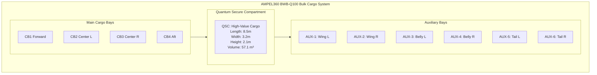
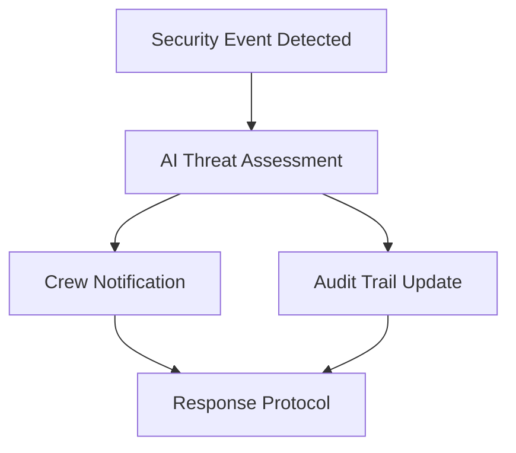
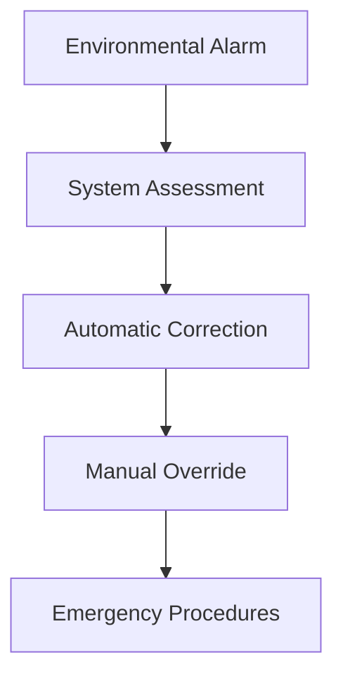

# AMPEL360 BWB-Q100 - 00-50-10-03 Bulk Cargo Loading Procedures

## Document Header & Identification

**Document Type:** Technical Manual - Loading Procedures  
**ATA Chapter:** 00-50-10-03  
**Aircraft Model:** AMPEL360 BWB-Q100 (AS-M-PAX-BW-Q1H)  
**System:** Bulk Cargo Compartments (QSC/Auxiliary Bays)  
**Version:** 1.0.0  
**Date:** 2025-06-27  
**Classification:** GAIA-QAO Technical Documentation  

**GQOIS Identifier:** `AS-M-PAX-BW-Q1H-BULK-LOAD-V1R0`  
**INFOCODE:** `GAIA-QAO-TM-00501003-V1R0-20250627`  
**DIKE Reference:** `DIKE-BULK-LOAD-PROC-001`  

---

## Table of Contents

1. [General Information](#1-general-information)
2. [Bulk Cargo System Overview](#2-bulk-cargo-system-overview)
3. [QSC (Quantum Secure Compartment) Procedures](#3-qsc-quantum-secure-compartment-procedures)
4. [Auxiliary Cargo Bay Operations](#4-auxiliary-cargo-bay-operations)
5. [Special Bulk Cargo Handling](#5-special-bulk-cargo-handling)
6. [Non-Standard Cargo Procedures](#6-non-standard-cargo-procedures)
7. [Environmental and Security Integration](#7-environmental-and-security-integration)
8. [Loading Coordination and Sequencing](#8-loading-coordination-and-sequencing)
9. [Safety and Emergency Procedures](#9-safety-and-emergency-procedures)
10. [Quality Assurance and Documentation](#10-quality-assurance-and-documentation)
11. [Maintenance and System Monitoring](#11-maintenance-and-system-monitoring)
12. [Appendices](#12-appendices)

---

## 1. General Information

### 1.1 Scope and Purpose

This document establishes comprehensive procedures for loading bulk cargo into the specialized compartments of the AMPEL360 BWB-Q100 aircraft, focusing on the Quantum Secure Compartment (QSC) and auxiliary cargo bays. These compartments handle non-containerized cargo, oversized items, high-value goods, and specialized equipment requiring unique handling procedures.

**Key Objectives:**
- Enable safe and efficient bulk cargo operations
- Maximize utilization of BWB configuration advantages
- Integrate quantum-enhanced security and monitoring systems
- Ensure compliance with international cargo regulations
- Optimize revenue through specialized cargo capabilities

### 1.2 Applicable Documents

**Primary References:**
- `00-50-10-00` General Loading Procedures
- `00-50-10-01` Forward Cargo Loading Procedures (CB1)
- `00-50-10-02` Aft Cargo Loading Procedures (CB4)
- `46-85-00` Quantum Security System (QSS) Operations
- `35-11-00` Environmental Control Systems

**Regulatory Framework:**
- EASA CS-25.787 (Baggage and Cargo Compartments)
- ICAO Annex 17 (Aviation Security)
- TSA Cargo Security Requirements
- IATA Special Cargo Regulations

### 1.3 Bulk Cargo Definition and Classification

**Bulk Cargo Categories:**
- **Type A:** Loose cargo not in containers (grain, minerals, powders)
- **Type B:** Oversized cargo exceeding standard ULD dimensions
- **Type C:** High-value/sensitive cargo requiring special security
- **Type D:** Specialized equipment (scientific instruments, artwork)
- **Type E:** Hazardous bulk materials with special handling requirements

### 1.4 BWB Configuration Advantages

The Blended Wing Body design provides unique bulk cargo capabilities:
- **Distributed Loading:** Multiple specialized compartments
- **Oversized Accommodation:** Large internal volume for non-standard items
- **Security Integration:** Quantum-enhanced monitoring throughout
- **Environmental Control:** Independent atmospheric management per bay

---

## 2. Bulk Cargo System Overview

### 2.1 Compartment Layout and Specifications

**Bulk Cargo Compartment Distribution:**
```
┌─────────────────────────────────────────────────────────────┐
│                 AMPEL360 BWB-Q100 BULK CARGO               │
│                                                             │
│  ┌─────────┐  ┌─────────┐  ┌─────────┐  ┌─────────┐       │
│  │   CB1   │  │   CB2   │  │   CB3   │  │   CB4   │       │
│  │Forward  │  │Standard │  │Standard │  │   Aft   │       │
│  └─────────┘  └─────────┘  └─────────┘  └─────────┘       │
│                                                             │
│  ┌─────────────────────────────────────────────────────┐   │
│  │                    QSC                              │   │
│  │            Quantum Secure Compartment               │   │
│  └─────────────────────────────────────────────────────┘   │
│                                                             │
│  ┌─────┐  ┌─────┐  ┌─────┐  ┌─────┐  ┌─────┐  ┌─────┐    │
│  │AUX-1│  │AUX-2│  │AUX-3│  │AUX-4│  │AUX-5│  │AUX-6│    │
│  │Wing │  │Wing │  │Belly│  │Belly│  │Tail │  │Tail │    │
│  └─────┘  └─────┘  └─────┘  └─────┘  └─────┘  └─────┘    │
└─────────────────────────────────────────────────────────────┘
```



### 2.2 Quantum Secure Compartment (QSC) Specifications

**Physical Characteristics:**
- Length: 8.5 m (27.9 ft)
- Width: 3.2 m (10.5 ft)
- Height: 2.1 m (6.9 ft)
- Volume: 57.1 m³ (2,016 ft³)
- Maximum Payload: 4,500 kg (9,921 lbs)
- Floor Loading: 650 kg/m² (133 lb/ft²)

**Security Features:**
- Quantum-encrypted access control
- Biometric authentication (Level 5)
- Continuous quantum monitoring
- Tamper-evident sealing systems
- Independent environmental control
- Emergency override capabilities

### 2.3 Auxiliary Bay Specifications

**Wing Auxiliary Bays (AUX-1, AUX-2):**
- Dimensions: 4.2m × 1.8m × 1.5m each
- Volume: 11.3 m³ (399 ft³) each
- Maximum Load: 800 kg (1,764 lbs) each
- Specialization: Electronic equipment, sensitive instruments

**Belly Auxiliary Bays (AUX-3, AUX-4):**
- Dimensions: 3.5m × 2.1m × 1.8m each
- Volume: 13.2 m³ (466 ft³) each
- Maximum Load: 1,200 kg (2,646 lbs) each
- Specialization: Dense cargo, spare parts

**Tail Auxiliary Bays (AUX-5, AUX-6):**
- Dimensions: 2.8m × 1.5m × 2.0m each
- Volume: 8.4 m³ (297 ft³) each
- Maximum Load: 600 kg (1,323 lbs) each
- Specialization: Emergency equipment, maintenance tools

---

## 3. QSC (Quantum Secure Compartment) Procedures

### 3.1 Access Control and Authentication

**Security Clearance Levels:**
```yaml
QSC_Access_Levels:
  Level_1: "Visual inspection only"
  Level_2: "Basic loading operations"
  Level_3: "High-value cargo handling"
  Level_4: "System configuration access"
  Level_5: "Full administrative control"
```

**Authentication Sequence:**
1. **Biometric Scan:** Retinal and fingerprint verification
2. **Quantum Key:** Personnel quantum security token
3. **Authorization Code:** Time-sensitive access code
4. **Supervisor Override:** Secondary confirmation for Level 4+
5. **Audit Trail:** Complete access logging

### 3.2 High-Value Cargo Protocols

**Classification System:**
- **Category HV-1:** $100K - $500K (Enhanced monitoring)
- **Category HV-2:** $500K - $2M (Continuous surveillance)
- **Category HV-3:** $2M - $10M (Maximum security)
- **Category HV-4:** >$10M (Special procedures)

**Loading Procedure for High-Value Cargo:**
```
QSC-HV-001: HIGH-VALUE CARGO LOADING
┌─────────────────────────────────────────────────┐
│ 1. Pre-loading security verification           │
│ 2. Biometric access authentication             │
│ 3. Quantum tracking tag installation           │
│ 4. Environmental control optimization          │
│ 5. Secure restraint system deployment          │
│ 6. Continuous monitoring activation            │
│ 7. Documentation and chain of custody          │
│ 8. Final security seal and verification        │
└─────────────────────────────────────────────────┘
```

### 3.3 QSC Environmental Control

**Atmospheric Management:**
- Temperature: ±1°C precision control (5°C to 35°C)
- Humidity: ±2% RH precision control (20% to 70%)
- Pressure: Independent pressurization system
- Air Quality: HEPA filtration with quantum monitoring
- Vibration Isolation: Active damping system

**Special Environment Modes:**
- **Art/Antiquities:** 20°C, 45% RH, minimal vibration
- **Electronics:** 15°C, 35% RH, ESD protection
- **Pharmaceuticals:** 2-8°C, 60% RH, validation logging
- **Scientific Samples:** Custom profiles per requirement

### 3.4 QSC Security Monitoring

**Quantum Surveillance Network:**
- **Quantum Cameras:** 24 units with quantum encryption
- **Motion Sensors:** Quantum-enhanced detection
- **Tamper Detection:** Molecular-level monitoring
- **Environmental Sensors:** Real-time condition tracking
- **Communication Link:** Quantum-secured to ground control

**Security Event Response:**


---

## 4. Auxiliary Cargo Bay Operations

### 4.1 Wing Bay Operations (AUX-1, AUX-2)

**Access Procedures:**
- External wing access panels (2.1m × 1.2m opening)
- Hydraulically operated doors
- Ground support equipment positioning required
- Limited vertical clearance (1.5m maximum)

**Typical Cargo Types:**
- Avionics equipment and spare parts
- Scientific instruments requiring stable environment
- Emergency communication equipment
- Navigation system components

**Loading Sequence:**
```
AUX-WING-001: WING BAY LOADING
┌─────────────────────────────────────────────────┐
│ 1. Position specialized wing bay loader         │
│ 2. Open hydraulic access panel                 │
│ 3. Verify internal clearances and utilities    │
│ 4. Load cargo with precision handling          │
│ 5. Secure with wing-specific restraints        │
│ 6. Connect environmental monitoring            │
│ 7. Close and seal access panel                 │
│ 8. Verify system integration                   │
└─────────────────────────────────────────────────┘
```

### 4.2 Belly Bay Operations (AUX-3, AUX-4)

**Access Characteristics:**
- Belly cargo doors (2.5m × 1.8m opening)
- Manual or hydraulic operation
- Drive-through loading capability
- Maximum item length: 3.2m

**Cargo Specialization:**
- Dense cargo with favorable CG position
- Aircraft maintenance equipment
- Ground support spare parts
- Emergency medical equipment

**Environmental Considerations:**
- Shared environmental system with main cargo
- Temperature range: -20°C to +40°C
- Basic moisture protection
- Vibration dampening for sensitive items

### 4.3 Tail Bay Operations (AUX-5, AUX-6)

**Access Procedures:**
- Aft access doors (1.8m × 1.5m opening)
- Manual door operation
- Limited ground equipment access
- Hand-carry items only

**Typical Applications:**
- Emergency survival equipment
- First aid and medical supplies
- Maintenance tools and consumables
- Crew personal equipment storage

**Loading Limitations:**
- Maximum item weight: 50 kg per item
- Manual handling only
- Sequential loading (no parallel operations)
- Limited environmental control

---

## 5. Special Bulk Cargo Handling

### 5.1 Oversized Cargo Procedures

**Classification by Dimensions:**
- **Class OS-1:** Exceeds one ULD dimension by <50%
- **Class OS-2:** Exceeds one ULD dimension by 50-100%
- **Class OS-3:** Exceeds multiple ULD dimensions
- **Class OS-4:** Requires structural modifications

**Oversized Cargo Assessment Matrix:**
```
Length (m) | Width (m) | Height (m) | Compartment | Special Requirements
3.5-5.0    | 2.0-2.5   | 1.8-2.1    | QSC        | Standard procedures
5.0-7.0    | 2.5-3.0   | 2.1-2.4    | QSC+AUX    | Distributed loading
7.0-8.5    | 3.0-3.2   | 2.4+       | Multiple   | Engineering approval
>8.5       | >3.2      | >2.4       | Not feasible| Alternative transport
```

### 5.2 Artwork and Cultural Heritage Items

**Handling Protocols:**
- White glove handling procedures
- Climate-controlled environment (±1°C, ±2% RH)
- Vibration isolation systems
- UV protection and light control
- Insurance documentation verification

**Packaging Requirements:**
- Museum-grade crating standards
- Shock-absorbing materials
- Humidity-controlled packaging
- Orientation-sensitive labeling
- Fragile handling indicators

**Documentation Requirements:**
- Provenance and authenticity certificates
- Insurance valuation documents
- Export/import permits
- Condition reports (pre/post transport)
- Chain of custody logs

### 5.3 Scientific and Research Equipment

**Categories and Handling:**
- **Laboratory Instruments:** Precision alignment, calibration maintenance
- **Research Samples:** Temperature/atmosphere control, contamination prevention
- **Prototype Equipment:** Special handling, security clearances
- **Field Equipment:** Rugged handling, weather protection

**Environmental Requirements:**
```yaml
Scientific_Cargo_Environments:
  Biological_Samples:
    Temperature: "-80°C to +4°C"
    Atmosphere: "Inert gas or controlled"
    Monitoring: "Continuous data logging"
    
  Precision_Instruments:
    Temperature: "20°C ±2°C"
    Humidity: "45% ±5% RH"
    Vibration: "Isolated mounting"
    
  Chemical_Samples:
    Temperature: "As specified"
    Containment: "Secondary containment"
    Ventilation: "Isolated air system"
```

### 5.4 Live Animal Transport (Bulk)

**Approved Species for Bulk Transport:**
- Large livestock (horses, cattle) - Special QSC configuration
- Zoo animals requiring oversized accommodations
- Research animals in specialized habitats
- Exotic species with complex environmental needs

**Animal Welfare Requirements:**
- IATA Live Animals Regulations compliance
- Veterinary health certificates
- Species-specific environmental controls
- 24/7 monitoring and care systems
- Emergency medical protocols

---

## 6. Non-Standard Cargo Procedures

### 6.1 Military and Defense Equipment

**Security Classifications:**
- **FOUO:** For Official Use Only
- **Confidential:** Military equipment, parts
- **Secret:** Advanced systems, classified components
- **Top Secret:** Requires special clearance and procedures

**Handling Procedures:**
- Military escort requirements
- Sealed container protocols
- Chain of custody documentation
- Security clearance verification
- Quantum encryption for all data

### 6.2 Diplomatic Cargo

**Diplomatic Immunity Considerations:**
- Vienna Convention compliance
- No inspection requirements
- Diplomatic seal integrity
- Special documentation protocols
- Government liaison coordination

**Handling Requirements:**
- Authorized personnel only
- Diplomatic courier presence
- Sealed transport procedures
- Priority loading/unloading
- Special security measures

### 6.3 Human Remains and Funeral Cargo

**Regulatory Compliance:**
- Health department permits
- Funeral director certification
- Religious consideration protocols
- International transport requirements
- Biohazard containment procedures

**Handling Protocols:**
- Respectful handling procedures
- Temperature control requirements
- Specialized restraint systems
- Documentation verification
- Cultural sensitivity training

---

## 7. Environmental and Security Integration

### 7.1 Quantum Environmental Monitoring

**Sensor Network Architecture:**
```yaml
Bulk_Cargo_Monitoring:
  QSC_Sensors:
    Temperature: "16 quantum thermometers"
    Humidity: "8 quantum hygrometers"
    Pressure: "4 quantum barometers"
    Gas_Composition: "6 quantum gas analyzers"
    
  AUX_Bay_Sensors:
    Temperature: "2 per bay (12 total)"
    Humidity: "1 per bay (6 total)"
    Vibration: "1 per bay (6 total)"
    Security: "Motion detection per bay"
```

### 7.2 Environmental Control Integration

**Independent Climate Zones:**
- QSC: Full climate control with backup systems
- Wing Bays: Temperature control, humidity monitoring
- Belly Bays: Basic environmental protection
- Tail Bays: Ambient conditions with monitoring

**Environmental Emergency Procedures:**


### 7.3 Security System Integration

**Multi-Layer Security Architecture:**
1. **Physical Security:** Access control and barriers
2. **Electronic Security:** Sensors and monitoring
3. **Quantum Security:** Encrypted communications and tamper detection
4. **Personnel Security:** Background checks and training
5. **Procedural Security:** Protocols and auditing

**Threat Response Protocols:**
- **Level 1:** Monitoring alert, log event
- **Level 2:** Crew notification, increased surveillance
- **Level 3:** Security response, cargo isolation
- **Level 4:** Emergency procedures, law enforcement notification

---

## 8. Loading Coordination and Sequencing

### 8.1 Integrated Loading Strategy

**Bulk Cargo Loading Sequence:**
1. **Phase 1:** QSC high-value cargo (requires maximum security time)
2. **Phase 2:** Oversized cargo requiring multiple bays
3. **Phase 3:** Auxiliary bay cargo (parallel operations possible)
4. **Phase 4:** Final verification and system integration

```mermaid
gantt
    title Bulk Cargo Loading Timeline
    dateFormat X
    axisFormat %M min
    
    section QSC Loading
    Security Setup    :qsc1, 0, 20
    High-Value Load   :qsc2, after qsc1, 30
    System Verify     :qsc3, after qsc2, 10
    
    section Auxiliary Bays
    Wing Bays        :aux1, after qsc1, 25
    Belly Bays       :aux2, after aux1, 20
    Tail Bays        :aux3, after aux2, 15
    
    section Integration
    Final Check      :final, after qsc3, 15
```



### 8.2 Coordination with Standard Cargo

**Integration Points:**
- Weight and balance calculation includes all bulk cargo
- CG management considers bulk cargo positioning
- Environmental systems coordinate across all bays
- Security protocols integrate with quantum tracking network

**Loading Priority Matrix:**
```
Priority | Cargo Type | Justification | Sequence
1        | QSC High-Value | Security setup time | First
2        | Time-Sensitive | Perishability | Second
3        | Oversized | Complexity | Third
4        | Standard Bulk | Efficiency | Fourth
5        | Auxiliary | Accessibility | Last
```

### 8.3 Ground Time Optimization

**Parallel Operations:**
- QSC and auxiliary bay loading can occur simultaneously
- Wing bays accessible during main cargo operations
- Belly bays coordinate with main cargo doors
- Tail bays independent of other operations

**Quick Turnaround Procedures:**
- Pre-positioned bulk cargo for rapid loading
- Simplified documentation for regular routes
- Automated environmental system startup
- Streamlined security procedures for known cargo

---

## 9. Safety and Emergency Procedures

### 9.1 Bulk Cargo Safety Protocols

**Personal Safety Requirements:**
```
BULK CARGO SAFETY EQUIPMENT
━━━━━━━━━━━━━━━━━━━━━━━━━━━━━━━━━━━━━
Standard PPE:
□ High-visibility vest with quantum sensors
□ Safety shoes with slip-resistant soles
□ Cut-resistant gloves for handling
□ Hard hat for overhead clearances

Specialized PPE (by cargo type):
□ Chemical-resistant suit (hazardous materials)
□ Breathing apparatus (confined spaces)
□ Anti-static equipment (electronic cargo)
□ Biological protection (live animals/samples)
━━━━━━━━━━━━━━━━━━━━━━━━━━━━━━━━━━━━━
```

### 9.2 Emergency Response Procedures

**Emergency Classification for Bulk Cargo:**
- **Class BE-1:** Minor incident, continue operations
- **Class BE-2:** Moderate incident, suspend affected bay
- **Class BE-3:** Major incident, evacuate area
- **Class BE-4:** Critical incident, emergency landing consideration

**QSC Emergency Procedures:**
```
QSC-EMERGENCY-001: QSC EMERGENCY RESPONSE
┌─────────────────────────────────────────────────┐
│ 1. Immediate threat assessment via quantum      │
│ 2. Automated security protocol activation       │
│ 3. Emergency access override if required        │
│ 4. Cargo protection and stabilization          │
│ 5. Emergency services notification             │
│ 6. Crew and passenger safety verification      │
│ 7. Documentation and investigation             │
│ 8. Recovery and restoration procedures         │
└─────────────────────────────────────────────────┘
```

### 9.3 Cargo Jettisoning Procedures

**Bulk Cargo Jettisoning Considerations:**
- QSC cargo: Requires special authorization due to value
- Auxiliary bay cargo: Selective jettisoning possible
- Environmental impact assessment required
- Legal implications for high-value cargo

**Emergency Release Systems:**
- Quantum-controlled electromagnetic releases
- Manual backup release mechanisms
- Progressive release capability (selective bays)
- Impact trajectory calculation
- Real-time tracking of jettisoned cargo

### 9.4 Hazardous Material Emergency Response

**Hazmat Emergency Protocols by Class:**
- **Chemical Spill:** Containment, neutralization, ventilation
- **Biological Contamination:** Isolation, decontamination, medical evaluation
- **Radioactive Material:** Radiation monitoring, containment, specialist response
- **Fire/Explosion:** Suppression, evacuation, damage assessment

**Emergency Equipment Locations:**
- QSC: Integrated emergency response systems
- Wing Bays: Portable emergency kits at access points
- Belly Bays: Ground-accessible emergency equipment
- Tail Bays: Basic emergency supplies and communication

---

## 10. Quality Assurance and Documentation

### 10.1 Quality Control Checkpoints

**Pre-Loading Quality Assurance:**
- Cargo condition inspection and documentation
- Compatibility verification with aircraft systems
- Environmental requirements validation
- Security clearance verification
- Insurance and valuation confirmation

**During-Loading Quality Assurance:**
- Real-time monitoring of loading procedures
- Quantum tracking activation verification
- Environmental system performance monitoring
- Security protocol compliance verification
- Weight and balance continuous updating

**Post-Loading Quality Assurance:**
- Final cargo position verification
- System integration testing
- Documentation completeness review
- Security seal integrity confirmation
- Crew briefing and handover completion

### 10.2 Documentation Requirements

**Standard Documentation:**
```yaml
Bulk_Cargo_Documentation:
  Manifest:
    - Cargo description and classification
    - Weight and dimensional specifications
    - Special handling requirements
    - Environmental control parameters
    
  Security:
    - Access authorization records
    - Chain of custody documentation
    - Quantum tracking verification
    - Security clearance certificates
    
  Safety:
    - Hazmat declarations and permits
    - Emergency response plans
    - Personnel training verification
    - Insurance and liability coverage
```

### 10.3 Digital Documentation System

**Quantum-Enhanced Documentation:**
- Blockchain-based chain of custody
- Quantum-encrypted cargo records
- Real-time status updates
- Automated compliance checking
- Immutable audit trails

**Integration with Aircraft Systems:**
- Flight management system updates
- Weight and balance system integration
- Environmental control system programming
- Emergency response system configuration

---

## 11. Maintenance and System Monitoring

### 11.1 Preventive Maintenance Schedule

**Daily Inspections:**
- Visual inspection of all bulk cargo areas
- Environmental system status verification
- Security system operational check
- Quantum sensor network validation
- Emergency equipment accessibility verification

**Weekly Inspections:**
- Detailed system performance analysis
- Restraint system inspection and testing
- Environmental control calibration verification
- Security system full functional test
- Documentation system backup and verification

**Monthly Inspections:**
- Complete bulk cargo system assessment
- Quantum sensor network recalibration
- Environmental control system deep maintenance
- Security system software updates
- Emergency response equipment certification

### 11.2 Quantum System Maintenance

**QSC Quantum System Maintenance:**
```yaml
QSC_Quantum_Maintenance:
  Daily:
    - Quantum coherence verification
    - Sensor network status check
    - Encryption key rotation
    - System performance monitoring
    
  Weekly:
    - Quantum calibration verification
    - Security protocol testing
    - Data integrity verification
    - Backup system testing
    
  Monthly:
    - Complete system recalibration
    - Hardware inspection and replacement
    - Software updates and patches
    - Performance optimization
```

### 11.3 Predictive Maintenance Integration

**AI-Enhanced Maintenance:**
- Machine learning analysis of system performance
- Predictive failure detection
- Optimal maintenance scheduling
- Parts inventory optimization
- Cost-benefit analysis for upgrades

**Integration with Aircraft Health Monitoring:**
- Real-time data sharing with aircraft systems
- Integrated maintenance planning
- Reduced ground time through predictive maintenance
- Enhanced safety through early problem detection

---

## 12. Appendices

### Appendix A: Bulk Cargo Capacity Charts

**QSC Load Combination Matrix:**

| Configuration | Cargo Type | Max Weight (kg) | Volume Utilization | CG Impact (m) |
|---------------|------------|-----------------|-------------------|---------------|
| QSC-BC-001    | High-Value Art | 2,500 | 60% | -0.85 |
| QSC-BC-002    | Scientific Equipment | 3,200 | 75% | -0.92 |
| QSC-BC-003    | Military Equipment | 4,000 | 85% | -0.98 |
| QSC-BC-004    | Diplomatic Cargo | 1,800 | 45% | -0.78 |
| QSC-BC-005    | Oversized Machinery | 4,500 | 95% | -1.05 |

**Auxiliary Bay Combinations:**

| Bay Group | Total Capacity (kg) | Typical Cargo | Access Method |
|-----------|-------------------|---------------|---------------|
| Wing (AUX-1,2) | 1,600 | Electronics, Instruments | External panels |
| Belly (AUX-3,4) | 2,400 | Dense cargo, Parts | Belly doors |
| Tail (AUX-5,6) | 1,200 | Emergency equipment | Aft access |
| Combined | 5,200 | Mixed cargo types | Sequential loading |

### Appendix B: Environmental Control Specifications

**QSC Environmental Capabilities:**
```yaml
QSC_Environmental_Control:
  Temperature_Control:
    Range: "-20°C to +50°C"
    Precision: "±0.5°C"
    Response_Time: "5 minutes to setpoint"
    Backup_System: "Independent battery power"
    
  Humidity_Control:
    Range: "10% to 90% RH"
    Precision: "±2% RH"
    Dehumidification: "Desiccant system"
    Humidification: "Steam injection"
    
  Atmospheric_Control:
    Pressure: "Independent pressurization"
    Gas_Composition: "Inert gas capability"
    Filtration: "HEPA + activated carbon"
    Monitoring: "Continuous gas analysis"
```

### Appendix C: Security System Specifications

**Quantum Security Network:**
```yaml
QSC_Security_Systems:
  Access_Control:
    Biometric: "Retinal + fingerprint"
    Quantum_Key: "256-qubit encryption"
    Time_Lock: "Programmable access windows"
    Override: "Emergency command authorization"
    
  Surveillance:
    Cameras: "24 quantum-encrypted units"
    Motion_Detection: "Quantum sensor array"
    Audio_Monitoring: "Continuous recording"
    Environmental: "Molecular-level sensing"
    
  Tamper_Detection:
    Quantum_Seals: "Molecular signature monitoring"
    Vibration_Sensors: "Nanometer precision"
    Electromagnetic: "Field disturbance detection"
    Chemical: "Trace analysis capability"
```

### Appendix D: Emergency Response Forms

#### D.1 Bulk Cargo Emergency Report Form

```
BULK CARGO EMERGENCY REPORT
Date: _______ Time: _______ Flight: _______

INCIDENT CLASSIFICATION:
□ BE-1 Minor    □ BE-2 Moderate    □ BE-3 Major    □ BE-4 Critical

AFFECTED COMPARTMENT(S):
□ QSC    □ AUX-1    □ AUX-2    □ AUX-3    □ AUX-4    □ AUX-5    □ AUX-6

CARGO INVOLVED:
Description: _________________________________________________
Value: _________________ Classification: __________________
Manifest Number: _________ Tracking ID: ___________________

INCIDENT DESCRIPTION:
Cause: ____________________________________________________
Actions Taken: ____________________________________________
Current Status: __________________________________________

PERSONNEL INVOLVED:
Incident Commander: ____________________________________
Response Team: _________________________________________
Witnesses: ____________________________________________

DAMAGE ASSESSMENT:
Aircraft: _____________________________________________
Cargo: _______________________________________________
Equipment: ___________________________________________

FOLLOW-UP REQUIRED:
□ Investigation    □ Maintenance    □ Training    □ Procedure Update

Signature: _________________ Title: ____________________
```

### Appendix E: Training Requirements

#### E.1 Bulk Cargo Handler Certification

**Level 1: Basic Bulk Cargo Operations (24 hours)**
- Module 1.1: BWB bulk cargo systems overview (4 hours)
- Module 1.2: QSC operations and security (6 hours)
- Module 1.3: Auxiliary bay procedures (4 hours)
- Module 1.4: Safety and emergency procedures (6 hours)
- Module 1.5: Documentation and compliance (4 hours)

**Level 2: Advanced Bulk Cargo Operations (40 hours)**
- Module 2.1: High-value cargo handling (8 hours)
- Module 2.2: Oversized cargo procedures (8 hours)
- Module 2.3: Quantum systems operation (8 hours)
- Module 2.4: Environmental control systems (8 hours)
- Module 2.5: Emergency response leadership (8 hours)

**Level 3: Bulk Cargo Specialist Certification (60 hours)**
- Module 3.1: System troubleshooting and maintenance (12 hours)
- Module 3.2: Specialized cargo types (12 hours)
- Module 3.3: Security systems management (12 hours)
- Module 3.4: Training and supervision (12 hours)
- Module 3.5: Regulatory compliance and auditing (12 hours)

#### E.2 Specialized Training Programs

**QSC Security Specialist (32 hours):**
- Quantum security systems operation
- High-value cargo protocols
- Threat assessment and response
- Biometric system management

**Environmental Systems Technician (24 hours):**
- Climate control systems operation
- Environmental monitoring interpretation
- Emergency environmental response
- System maintenance procedures

### Appendix F: Regulatory Compliance Matrix

#### F.1 International Regulations

**ICAO Standards:**
- Annex 17: Aviation Security (QSC operations)
- Annex 18: Dangerous Goods (hazmat bulk cargo)
- Doc 8973: Aviation Security Manual
- Doc 9284: Technical Instructions for Dangerous Goods

**National Regulations:**
- TSA Cargo Security Requirements (US)
- EASA Part 145 (Maintenance) (EU)
- Transport Canada Cargo Regulations (CA)
- CASA Cargo Requirements (AU)

#### F.2 Industry Standards

**IATA Standards:**
- Cargo Services Conference Resolutions
- Live Animals Regulations (LAR)
- Dangerous Goods Regulations (DGR)
- Temperature Control Regulations (TCR)

**ISO Standards:**
- ISO 14298: Security management systems
- ISO 21500: Project management (for oversized cargo)
- ISO 27001: Information security management
- ISO 45001: Occupational health and safety

---

## Document Control and Change History

**Change Record:**
| Version | Date | Author | Description |
|---------|------|---------|-------------|
| 1.0.0 | 2025-06-27 | GAIA-QAO Tech Team | Initial release |

**Document Approval:**
- **Technical Authority:** Dr. Marcus Rodriguez, Bulk Cargo Systems Engineer
- **Safety Authority:** Capt. Sarah Chen, Director of Cargo Safety
- **Security Authority:** Col. James Mitchell, Quantum Security Director
- **Regulatory Authority:** Lisa Thompson, Compliance Manager

**Next Review Date:** 2025-12-27

---

**End of Document**

*This document is part of the GAIA-QAO Aerospace Innovation Ecosystem and is protected under the GAIA-QAO intellectual property framework. All quantum technologies described are conceptual and subject to ongoing research and development.*

**Document Signature (Quantum-Encrypted):**
`GAIA-QAO-QUANTUM-SIG-BULK-LOAD-V1R0-SHA256-VERIFIED`
