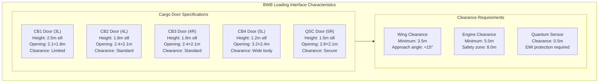

# AMPEL360 BWB-Q100 - 00-50-10-00-01 Loader Specifications

## Document Header & Identification

**Document Type:** Technical Specification - Ground Support Equipment  
**ATA Chapter:** 00-50-10-00-01  
**Aircraft Model:** AMPEL360 BWB-Q100 (AS-M-PAX-BW-Q1H)  
**System:** Cargo Loading Equipment Specifications  
**Version:** 1.0.0  
**Date:** 2025-06-27  
**Classification:** GAIA-QAO Technical Documentation  

**GQOIS Identifier:** `AS-M-PAX-BW-Q1H-LOADER-SPEC-V1R0`  
**INFOCODE:** `GAIA-QAO-TM-00501000I-V1R0-20250627`  
**DIKE Reference:** `DIKE-LOADER-SPEC-001`  

---

## Table of Contents

1. [General Information](#1-general-information)
2. [BWB-Specific Loading Requirements](#2-bwb-specific-loading-requirements)
3. [Main Cargo Loaders](#3-main-cargo-loaders)
4. [Specialized Loading Equipment](#4-specialized-loading-equipment)
5. [Quantum Integration Systems](#5-quantum-integration-systems)
6. [Support Equipment Specifications](#6-support-equipment-specifications)
7. [Safety and Emergency Equipment](#7-safety-and-emergency-equipment)
8. [Maintenance and Calibration](#8-maintenance-and-calibration)
9. [Training and Certification](#9-training-and-certification)
10. [Compliance and Standards](#10-compliance-and-standards)
11. [Procurement and Lifecycle](#11-procurement-and-lifecycle)
12. [Appendices](#12-appendices)

---

## 1. General Information

### 1.1 Scope and Purpose

This document provides comprehensive specifications for all ground support equipment (GSE) required for cargo loading operations on the AMPEL360 BWB-Q100 aircraft. The equipment specifications account for the unique Blended Wing Body configuration, quantum-enhanced monitoring systems, and advanced operational requirements.

**Key Objectives:**
- Define precise equipment specifications for BWB cargo operations
- Ensure compatibility with quantum-enhanced aircraft systems
- Establish safety and performance standards
- Support efficient and safe cargo loading operations
- Enable integration with GAIA-QAO operational ecosystem

### 1.2 Applicable Standards

**International Standards:**
- IATA Airport Handling Manual (AHM) Chapter 6
- SAE AS6081: Ground Support Equipment Safety
- ISO 3691-4: Industrial trucks safety requirements
- EN 12312: Mobile elevating work platforms
- RTCA DO-160: Environmental conditions for airborne equipment

**BWB-Specific Requirements:**
- GAIA-QAO BWB-GSE-001: BWB Ground Equipment Interface
- GAIA-QAO QTN-002: Quantum Tracking Network Integration
- AMPEL360-ICD-003: Aircraft-GSE Interface Control

### 1.3 Equipment Classification System

**Primary Categories:**
- **MC:** Main Cargo Loaders (CB1, CB2, CB3, CB4)
- **SC:** Specialized Cargo Equipment (QSC, Bulk Cargo)
- **QI:** Quantum Integration Systems
- **SE:** Support Equipment
- **EM:** Emergency and Safety Equipment

**Secondary Classifications:**
- **-H:** Heavy-duty operations (>2,000 kg)
- **-P:** Precision operations (±10mm positioning)
- **-Q:** Quantum-integrated systems
- **-E:** Environmental control capability
- **-S:** Security-enhanced equipment

---

## 2. BWB-Specific Loading Requirements

### 2.1 Physical Interface Requirements

**BWB Aircraft Characteristics:**
- Cargo door sill heights: 1.2m to 3.8m (variable by location)
- Door opening dimensions: 2.1m × 1.8m to 3.2m × 2.4m
- Wing interference zones requiring specialized clearance
- Distributed loading points requiring multiple simultaneous access
- Quantum sensor integration points throughout aircraft



### 2.2 Load Distribution Requirements

**BWB Loading Characteristics:**
- Simultaneous multi-bay loading capability required
- Real-time weight distribution monitoring
- Lateral balance considerations (±0.5m CG limit)
- Quantum tracking integration for all loaded items

**Equipment Interface Standards:**
- 28V DC power compatibility for quantum systems
- CAN bus communication for real-time data exchange
- Environmental isolation for sensitive equipment
- Emergency stop integration with aircraft systems

### 2.3 Operational Environment

**Environmental Operating Conditions:**
- Temperature range: -40°C to +55°C
- Humidity: 5% to 95% RH (non-condensing)
- Wind resistance: 40 kph operational, 65 kph survival
- Precipitation: IP54 minimum rating
- Altitude: Sea level to 3,000m operational

---

## 3. Main Cargo Loaders

### 3.1 K-Loader BWB-3000 Series

**Primary Specifications:**

| Parameter | CB1/CB2/CB3 Variant | CB4 Variant | QSC Variant |
|-----------|---------------------|-------------|-------------|
| Model | K-BWB-3000-STD | K-BWB-3000-HD | K-BWB-3000-SEC |
| Lift Capacity | 6,800 kg | 9,100 kg | 4,500 kg |
| Platform Size | 6.1m × 2.4m | 8.5m × 3.2m | 6.0m × 2.8m |
| Lift Height | 0.5m - 4.2m | 0.3m - 3.8m | 0.8m - 3.5m |
| Positioning Accuracy | ±25mm | ±15mm | ±10mm |
| Approach Speed | 0.8 m/s | 0.5 m/s | 0.3 m/s |
| Leveling Accuracy | ±5mm | ±3mm | ±2mm |

**Advanced Features:**

**K-BWB-3000-STD (Standard Loader):**
```yaml
Standard_Loader_Features:
  Hydraulic_System:
    Primary: "Dual circuit with load sensing"
    Backup: "Manual emergency lowering"
    Response_Time: "Platform position in 15 seconds"
    
  Control_System:
    Interface: "Touch screen + joystick"
    Precision_Mode: "±10mm positioning"
    Auto_Level: "Self-leveling platform"
    Safety_Systems: "Dual redundant controls"
    
  Drive_System:
    Propulsion: "4WD electric drive"
    Speed: "0-15 kph variable"
    Turning_Radius: "6.5m"
    Grade_Capability: "15% loaded"
    
  BWB_Integration:
    Quantum_Interface: "QTN node integration"
    Wing_Clearance: "Collision avoidance system"
    Aircraft_Communication: "CAN bus interface"
    Environmental: "Sealed control systems"
```

**K-BWB-3000-HD (Heavy Duty Loader):**
```yaml
Heavy_Duty_Features:
  Enhanced_Structure:
    Platform_Rating: "9,100 kg distributed load"
    Point_Load: "3,175 kg maximum"
    Platform_Material: "Reinforced aluminum deck"
    Restraint_Points: "20 certified tie-down points"
    
  Advanced_Hydraulics:
    System_Pressure: "280 bar working pressure"
    Cylinders: "Dual telescopic with position feedback"
    Load_Compensation: "Automatic flow control"
    Emergency_Systems: "Redundant lowering circuits"
    
  Precision_Systems:
    Position_Sensors: "Laser measurement array"
    Load_Monitoring: "Real-time weight distribution"
    Stability_Control: "Active platform stabilization"
    Approach_Guidance: "Automated docking system"
```

**K-BWB-3000-SEC (Security Loader):**
```yaml
Security_Loader_Features:
  Security_Integration:
    Access_Control: "Biometric operator authentication"
    Cargo_Tracking: "Quantum tag reader array"
    Tamper_Detection: "Platform integrity monitoring"
    Audit_Trail: "Complete operation logging"
    
  Environmental_Control:
    Climate_Capability: "5°C to 35°C platform control"
    Humidity_Control: "Dehumidification system"
    Clean_Environment: "HEPA filtration"
    Vibration_Isolation: "Active dampening system"
    
  Communication_Systems:
    Quantum_Link: "Encrypted command channel"
    Emergency_Comm: "Direct crew communication"
    Ground_Control: "Integration with tower systems"
    Maintenance_Data: "Predictive maintenance reporting"
```

### 3.2 Belt Loader BL-BWB-Extended

**Specifications:**
- Model: BL-BWB-2500-EXT
- Belt length: 12.5m (extendable to 15m)
- Belt width: 650mm
- Capacity: 2,500 kg distributed load
- Height range: 1.0m to 4.5m
- Belt speed: 0.1 to 2.5 m/s variable

**BWB-Specific Features:**
- Wing clearance optimization with 22° maximum approach angle
- Quantum sensor integration for cargo tracking
- Emergency stop integration with aircraft systems
- Environmental protection for sensitive cargo

```yaml
Belt_Loader_Systems:
  Drive_System:
    Motor: "Variable frequency drive, 15 kW"
    Belt_Material: "Anti-static rubber with grip pattern"
    Tensioning: "Automatic belt tension control"
    Emergency_Stop: "Multiple locations + aircraft integration"
    
  BWB_Adaptations:
    Wing_Clearance: "Automated angle optimization"
    Height_Adjustment: "Continuous positioning"
    Stability: "Outrigger system with load sensing"
    Integration: "Quantum tracking node array"
```

### 3.3 Pallet Transporter PT-Q100

**Specifications:**
- Model: PT-Q100-BWB
- Load capacity: 4,500 kg
- Platform dimensions: 3.2m × 2.4m
- Speed: 0-12 kph
- Turning radius: 4.8m
- Gradient capability: 12% loaded

**Quantum Integration Features:**
```yaml
Pallet_Transporter_Features:
  Quantum_Systems:
    Tracking_Array: "8-node QTN integration"
    Load_Monitoring: "Real-time weight sensors"
    Position_Accuracy: "±5mm using quantum sensors"
    Communication: "Quantum-encrypted data link"
    
  Operational_Features:
    Automatic_Guidance: "Laser-guided positioning"
    Load_Securing: "Automated restraint system"
    Environmental: "All-weather operation capability"
    Safety: "360° collision avoidance system"
```

---

## 4. Specialized Loading Equipment

### 4.1 QSC Secure Loader (QSL-1000)

**Primary Specifications:**
- Model: QSL-1000-QUANTUM
- Security Rating: Level 5 (Maximum)
- Load Capacity: 4,500 kg
- Platform Size: 6.0m × 2.8m × 0.3m
- Positioning Accuracy: ±2mm
- Environmental Control: ±1°C, ±2% RH

**Security Features:**
```yaml
QSC_Loader_Security:
  Access_Control:
    Biometric: "Retinal + fingerprint scanner"
    Quantum_Key: "256-qubit authentication"
    Operator_Clearance: "Level 5 security required"
    Time_Lock: "Programmable access windows"
    
  Monitoring_Systems:
    Surveillance: "8 quantum-encrypted cameras"
    Tamper_Detection: "Molecular-level sensors"
    Communication: "Quantum-secured radio link"
    Data_Logging: "Immutable operation records"
    
  Cargo_Protection:
    Climate_Control: "Precision environmental system"
    Vibration_Isolation: "Active suspension platform"
    Security_Enclosure: "Retractable protective shell"
    Emergency_Protocols: "Automatic protection activation"
```

### 4.2 Wing Bay Service Platform (WBSP-500)

**Specifications:**
- Model: WBSP-500-BWB
- Platform height: 2.0m to 6.5m
- Platform size: 3.0m × 2.0m
- Load capacity: 800 kg (personnel + equipment)
- Positioning accuracy: ±10mm
- Wing interface compatibility: AUX-1, AUX-2 bays

**Wing-Specific Features:**
```yaml
Wing_Platform_Features:
  Access_Systems:
    Platform_Type: "Articulating boom with basket"
    Reach: "4.2m horizontal from base"
    Rotation: "180° platform rotation"
    Leveling: "Automatic platform leveling"
    
  Safety_Systems:
    Fall_Protection: "Integrated harness points"
    Collision_Avoidance: "Wing proximity sensors"
    Emergency_Descent: "Manual backup lowering"
    Communication: "Hands-free crew communication"
    
  Integration:
    Wing_Interface: "Specialized access tools"
    Quantum_Compatible: "EMI-shielded systems"
    Tool_Storage: "Integrated equipment racks"
    Environmental: "All-weather capability"
```

### 4.3 Bulk Cargo Handling System (BCHS-2000)

**System Components:**
- Overhead crane system: 5,000 kg capacity
- Track length: 25m parallel to aircraft
- Precision positioning: ±5mm
- Remote operation capability
- Environmental protection for cargo

**Specifications:**
```yaml
Bulk_Cargo_System:
  Crane_Specifications:
    Capacity: "5,000 kg maximum lift"
    Reach: "15m from track centerline"
    Height: "8.5m maximum lift"
    Precision: "±5mm positioning accuracy"
    
  Control_Systems:
    Operation: "Wireless remote control"
    Safety: "Redundant control systems"
    Monitoring: "Real-time load monitoring"
    Integration: "Aircraft system interface"
    
  Specialized_Features:
    Oversized_Cargo: "Custom rigging points"
    Environmental: "Weather protection system"
    Quantum_Integration: "Tracking node support"
    Emergency: "Rapid cargo release capability"
```

---

## 5. Quantum Integration Systems

### 5.1 Quantum Interface Terminal (QIT-CB4-01)

**Primary Function:**
Integration hub for quantum tracking and monitoring systems during cargo operations.

**Technical Specifications:**
```yaml
Quantum_Interface_Terminal:
  Hardware:
    Processor: "Quantum-classical hybrid processor"
    Memory: "128 QB quantum memory"
    Storage: "50 TB encrypted solid state"
    Connectivity: "Quantum entanglement + classical backup"
    
  Quantum_Systems:
    QTN_Nodes: "Integration with 25-node network"
    Coherence_Time: "100ms operational"
    Error_Rate: "< 0.1% quantum bit error rate"
    Range: "500m quantum communication"
    
  Software:
    OS: "GAIA-QAO Quantum OS v3.2"
    Applications: "Cargo tracking, monitoring, security"
    Updates: "Quantum-encrypted OTA updates"
    Backup: "Automatic classical system failover"
    
  Physical:
    Dimensions: "1.2m × 0.8m × 0.6m"
    Weight: "185 kg"
    Power: "28V DC, 2.5 kW peak"
    Environment: "IP65 rated, -20°C to +60°C"
```

### 5.2 Quantum Tracking Node Array (QTN-A)

**Network Architecture:**
- Primary nodes: 25 units per cargo bay
- Secondary nodes: 50 units for area coverage
- Gateway nodes: 5 units for external communication
- Backup nodes: 15 units for redundancy

**Node Specifications:**
```yaml
Quantum_Tracking_Nodes:
  Individual_Node:
    Quantum_Range: "50m effective radius"
    Accuracy: "±1cm position tracking"
    Update_Rate: "100 Hz tracking frequency"
    Power: "2W continuous operation"
    
  Network_Capability:
    Total_Nodes: "95 nodes per aircraft"
    Simultaneous_Tracking: "1,000 objects"
    Data_Rate: "10 Mbps per node"
    Latency: "< 1ms network response"
    
  Integration:
    Aircraft_Systems: "Flight management integration"
    Ground_Systems: "Airport quantum network"
    Security: "End-to-end encryption"
    Maintenance: "Predictive health monitoring"
```

### 5.3 Quantum Security System (QSS-MOB)

**Mobile Security Platform:**
- Deployment time: <5 minutes
- Coverage area: 100m radius
- Security levels: 1-5 configurable
- Integration with aircraft QSS

**System Components:**
```yaml
Mobile_Quantum_Security:
  Detection_Systems:
    Quantum_Radar: "Molecular-level detection"
    Thermal_Imaging: "0.1°C temperature resolution"
    Acoustic_Monitoring: "Ultrasonic detection array"
    Chemical_Sensors: "PPB-level detection capability"
    
  Response_Systems:
    Alert_Network: "Instant crew notification"
    Countermeasures: "Configurable response protocols"
    Documentation: "Automatic incident recording"
    Integration: "Law enforcement notification"
    
  Deployment:
    Setup_Time: "< 5 minutes from arrival"
    Coverage: "100m radius protection zone"
    Power: "Self-contained 8-hour operation"
    Mobility: "Trailer-mounted deployment"
```

---

## 6. Support Equipment Specifications

### 6.1 Environmental Control Units

**Climate Control Cart (CCC-BWB-01):**
```yaml
Climate_Control_Systems:
  Specifications:
    Cooling_Capacity: "25 kW refrigeration"
    Heating_Capacity: "15 kW electric heating"
    Humidity_Control: "Dehumidification + humidification"
    Air_Flow: "2,500 CFM variable"
    
  BWB_Integration:
    Connection_Points: "8 aircraft interface ports"
    Hose_Length: "25m reach capability"
    Automatic_Startup: "Aircraft system integration"
    Monitoring: "Real-time environmental logging"
    
  Performance:
    Temperature_Range: "-20°C to +50°C"
    Humidity_Range: "10% to 90% RH"
    Response_Time: "5 minutes to setpoint"
    Accuracy: "±1°C, ±2% RH"
```

### 6.2 Power and Utilities

**Ground Power Unit (GPU-BWB-400):**
- Output: 400 Hz, 115V AC, 150 kVA
- 28V DC, 1,000A capability
- Quantum system power conditioning
- Uninterruptible power supply (UPS) backup

**Pneumatic Cart (PC-BWB-150):**
- Pressure: 150 psi working pressure
- Flow rate: 2,500 CFM @ 50 psi
- Quantum sensor pneumatic supplies
- Environmental protection systems

### 6.3 Communication and Data Systems

**Data Transfer Unit (DTU-Q100):**
```yaml
Data_Transfer_Systems:
  Capabilities:
    Transfer_Rate: "10 Gbps fiber optic"
    Quantum_Channel: "1 Mbps quantum-secured"
    Wireless: "802.11ax Wi-Fi 6E"
    Satellite: "L-band backup communication"
    
  Integration:
    Aircraft_Systems: "Flight management data exchange"
    Ground_Systems: "Airport operational database"
    Quantum_Network: "GAIA-QAO quantum backbone"
    Backup_Systems: "Multiple redundant paths"
    
  Security:
    Encryption: "AES-256 + quantum encryption"
    Authentication: "Mutual certificate verification"
    Audit_Trail: "Complete transaction logging"
    Intrusion_Detection: "Real-time threat monitoring"
```

---

## 7. Safety and Emergency Equipment

### 7.1 Emergency Response Systems

**Emergency Cargo Release System (ECRS-BWB):**
```yaml
Emergency_Release_System:
  Activation:
    Authority: "Captain or designated crew"
    Methods: "Manual + automatic triggers"
    Response_Time: "< 30 seconds activation"
    Confirmation: "Dual authentication required"
    
  Capabilities:
    Selective_Release: "Individual bay control"
    Complete_Release: "Full cargo jettison"
    Safe_Release: "Trajectory calculation"
    Documentation: "Automatic event logging"
    
  Integration:
    Aircraft_Systems: "Flight management integration"
    Ground_Control: "ATC notification system"
    Emergency_Services: "Automatic alert system"
    Environmental: "Impact assessment capability"
```

### 7.2 Fire Suppression Equipment

**Mobile Fire Suppression Unit (MFSU-BWB):**
- Agent capacity: 500 liters clean agent
- Discharge rate: 50 liters/minute
- Coverage area: 200m² effective
- Response time: <2 minutes deployment

**Specialized Suppression:**
```yaml
Fire_Suppression_Systems:
  Clean_Agent_System:
    Agent_Type: "Halon 1301 replacement (eco-friendly)"
    Capacity: "500L primary + 200L backup"
    Distribution: "12-nozzle array coverage"
    Control: "Automatic + manual activation"
    
  Water_Mist_System:
    Application: "Specific cargo types"
    Pressure: "100 bar working pressure"
    Coverage: "Variable pattern nozzles"
    Integration: "Cargo type recognition"
    
  Foam_System:
    Concentrate: "AFFF 3% concentration"
    Capacity: "200L foam concentrate"
    Application: "Fuel and oil fire suppression"
    Deployment: "Portable application system"
```

### 7.3 Personnel Safety Equipment

**Personal Protective Equipment (PPE) Station:**
```yaml
PPE_Station_Contents:
  Standard_Equipment:
    Quantity: "50 complete sets"
    High_Vis_Vests: "Quantum sensor integrated"
    Safety_Helmets: "Communication system equipped"
    Safety_Shoes: "Anti-static, steel toe"
    Eye_Protection: "Impact resistant, anti-fog"
    
  Specialized_Equipment:
    Chemical_Suits: "10 sets for hazmat response"
    Breathing_Apparatus: "15-minute SCSR units"
    Fall_Protection: "Harnesses and lanyards"
    Quantum_Badges: "Radiation detection capability"
    
  Emergency_Medical:
    First_Aid_Kits: "Advanced trauma kit"
    AED_Unit: "Automated external defibrillator"
    Spinal_Board: "Emergency immobilization"
    Communication: "Direct medical facility link"
```

---

## 8. Maintenance and Calibration

### 8.1 Preventive Maintenance Schedules

**Daily Maintenance (Pre-Operation):**
```yaml
Daily_Maintenance_Checklist:
  Visual_Inspection:
    - Hydraulic system leaks
    - Structural integrity check
    - Safety system functionality
    - Quantum sensor array status
    
  Operational_Check:
    - Platform operation test
    - Emergency stop verification
    - Communication system test
    - Environmental system check
    
  Documentation:
    - Maintenance log update
    - Deficiency reporting
    - Performance monitoring
    - Calibration verification
```

**Weekly Maintenance (100 Operating Hours):**
- Hydraulic system service and filter change
- Quantum sensor calibration verification
- Safety system comprehensive test
- Software update and security patch review

**Monthly Maintenance (400 Operating Hours):**
- Complete system inspection and testing
- Quantum system recalibration
- Environmental system deep service
- Predictive maintenance analysis

### 8.2 Calibration Requirements

**Quantum System Calibration:**
```yaml
Quantum_Calibration_Procedures:
  Frequency: "Weekly or after 200 operations"
  Duration: "4 hours per loader"
  Equipment: "NIST-traceable quantum standards"
  Environment: "Controlled calibration facility"
  
  Calibration_Points:
    Position_Accuracy: "±1mm verification"
    Load_Measurement: "±0.1% accuracy"
    Environmental: "±0.1°C, ±1% RH"
    Quantum_Coherence: "Minimum 95% fidelity"
    
  Documentation:
    Certificates: "Traceable calibration certificates"
    Procedures: "Step-by-step calibration logs"
    Results: "Before/after measurement data"
    Compliance: "Regulatory requirement verification"
```

### 8.3 Predictive Maintenance Systems

**AI-Enhanced Maintenance:**
- Machine learning analysis of operational data
- Predictive failure detection algorithms
- Optimal maintenance scheduling
- Parts inventory optimization
- Performance trend analysis

**Integration with GAIA-QAO Systems:**
- Real-time data streaming to maintenance center
- Automated work order generation
- Parts ordering automation
- Technician scheduling optimization
- Fleet-wide performance analysis

---

## 9. Training and Certification

### 9.1 Equipment Operator Certification

**Level 1: Basic Equipment Operation (24 hours)**
```yaml
Basic_Training_Modules:
  Module_1: "BWB aircraft characteristics and interfaces (4 hours)"
  Module_2: "Loader operation and safety procedures (6 hours)"
  Module_3: "Quantum system integration basics (4 hours)"
  Module_4: "Emergency procedures and response (6 hours)"
  Module_5: "Documentation and compliance (4 hours)"
  
  Practical_Training:
    Simulator_Hours: "8 hours virtual training"
    Supervised_Operation: "16 hours with instructor"
    Solo_Evaluation: "4 hours independent assessment"
    Emergency_Scenarios: "2 hours emergency response"
```

**Level 2: Advanced Equipment Operation (40 hours)**
- Quantum system operation and troubleshooting
- Multi-loader coordination procedures
- Environmental system management
- Advanced safety and emergency response
- Maintenance and calibration procedures

**Level 3: Equipment Specialist Certification (60 hours)**
- System troubleshooting and repair
- Quantum system maintenance
- Training delivery and assessment
- Fleet management and optimization
- Regulatory compliance and auditing

### 9.2 Maintenance Technician Training

**Quantum Systems Maintenance (32 hours):**
```yaml
Quantum_Maintenance_Training:
  Week_1:
    - Quantum mechanics fundamentals for maintenance
    - Quantum sensor technology and calibration
    - Safety procedures for quantum systems
    - Basic troubleshooting procedures
    
  Week_2:
    - Advanced diagnostic procedures
    - Quantum coherence measurement
    - System integration and testing
    - Predictive maintenance techniques
    
  Certification:
    Written_Exam: "80% minimum passing score"
    Practical_Assessment: "Hands-on system maintenance"
    Continuing_Education: "16 hours annually"
    Recertification: "Every 3 years"
```

### 9.3 Safety Training Requirements

**Hazardous Material Handling:**
- IATA Dangerous Goods Regulations
- Quantum system safety procedures
- Emergency response protocols
- Personal protective equipment use
- Environmental protection procedures

**Emergency Response Training:**
- Fire suppression system operation
- Emergency evacuation procedures
- First aid and medical response
- Communication protocols
- Incident investigation and reporting

---

## 10. Compliance and Standards

### 10.1 Regulatory Compliance

**Aviation Standards:**
```yaml
Aviation_Compliance:
  EASA_Standards:
    - Part_145: "Maintenance organization approval"
    - CS_25: "Airworthiness standards"
    - AMC_20: "Certification considerations"
    
  FAA_Standards:
    - Part_145: "Repair station requirements"
    - AC_150: "Airport design and operations"
    - TSO: "Technical standard orders"
    
  ICAO_Standards:
    - Annex_14: "Aerodromes standards"
    - Doc_9157: "Aerodrome design manual"
    - Doc_4444: "Air traffic management"
```

### 10.2 Quality Management

**ISO Certification Requirements:**
- ISO 9001: Quality management systems
- ISO 14001: Environmental management
- ISO 45001: Occupational health and safety
- ISO 27001: Information security management

**GAIA-QAO Specific Standards:**
- QAO-QMS-001: Quantum system quality management
- QAO-SMS-002: Safety management system integration
- QAO-EMS-003: Environmental management for quantum systems
- QAO-IMS-004: Information security for quantum networks

### 10.3 Environmental Compliance

**Environmental Standards:**
```yaml
Environmental_Compliance:
  Emissions:
    CO2: "Carbon neutral operations by 2028"
    NOx: "Minimize diesel equipment emissions"
    Particulates: "HEPA filtration requirements"
    
  Noise:
    Operational: "< 85 dB(A) at 10m distance"
    Community: "Night operation restrictions"
    Monitoring: "Continuous noise level measurement"
    
  Waste_Management:
    Hydraulic_Fluid: "100% recycling requirement"
    Electronic_Waste: "Proper disposal certification"
    Packaging: "Biodegradable materials preferred"
    
  Energy_Efficiency:
    Electric_Preferred: "Zero emission equipment priority"
    Energy_Recovery: "Regenerative braking systems"
    Smart_Grid: "Load balancing integration"
```

---

## 11. Procurement and Lifecycle

### 11.1 Procurement Specifications

**Vendor Qualification Requirements:**
```yaml
Vendor_Requirements:
  Technical_Capability:
    BWB_Experience: "Demonstrated BWB equipment development"
    Quantum_Integration: "Quantum system integration capability"
    Certification: "Aviation equipment certification experience"
    Support: "Global service and support network"
    
  Quality_Systems:
    ISO_9001: "Quality management certification"
    AS9100: "Aerospace quality standard"
    Quantum_QMS: "GAIA-QAO quantum quality approval"
    
  Financial_Stability:
    Credit_Rating: "Investment grade minimum"
    Insurance: "Product liability coverage"
    Warranty: "5-year comprehensive warranty"
    Service_Agreement: "24/7 support capability"
```

### 11.2 Lifecycle Cost Analysis

**Total Cost of Ownership (TCO) Model:**
```yaml
TCO_Components:
  Acquisition_Cost:
    Equipment: "60% of total TCO"
    Installation: "8% of total TCO"
    Training: "5% of total TCO"
    Certification: "2% of total TCO"
    
  Operating_Cost:
    Maintenance: "15% of total TCO"
    Energy: "3% of total TCO"
    Operator_Costs: "5% of total TCO"
    Insurance: "2% of total TCO"
    
  End_of_Life:
    Disposal: "Minimal with recycling programs"
    Component_Recovery: "Value recovery from quantum components"
    Environmental: "Sustainable disposal practices"
```

### 11.3 Technology Roadmap

**Equipment Evolution Plan:**
```yaml
Technology_Roadmap:
  Phase_1_Current: "Quantum-integrated conventional systems"
  Phase_2_2026: "Fully autonomous loading operations"
  Phase_3_2028: "AI-optimized fleet management"
  Phase_4_2030: "Quantum-native equipment design"
  
  Key_Developments:
    Automation: "Reduced human intervention requirements"
    Integration: "Seamless aircraft-ground system integration"
    Sustainability: "Zero emission equipment transition"
    Intelligence: "Predictive and adaptive operations"
```

---

## 12. Appendices

### Appendix A: Equipment Selection Matrix

**Loader Selection Guide:**

| Cargo Bay | Recommended Loader | Capacity | Special Features | Typical Use |
|-----------|-------------------|----------|------------------|-------------|
| CB1 | K-BWB-3000-STD | 6,800 kg | Precision positioning | Priority cargo |
| CB2/CB3 | K-BWB-3000-STD | 6,800 kg | Parallel operations | Standard containers |
| CB4 | K-BWB-3000-HD | 9,100 kg | Heavy cargo capability | Bulk/dense cargo |
| QSC | K-BWB-3000-SEC | 4,500 kg | Security features | High-value cargo |
| AUX | WBSP-500-BWB | 800 kg | Wing bay access | Small components |

### Appendix B: Quantum Integration Specifications

**QTN Node Placement Matrix:**
```yaml
QTN_Node_Deployment:
  CB1_Bay:
    Primary_Nodes: "6 nodes"
    Secondary_Nodes: "4 nodes"
    Gateway_Nodes: "1 node"
    Coverage: "100% bay volume"
    
  CB2_CB3_Bays:
    Primary_Nodes: "8 nodes each"
    Secondary_Nodes: "6 nodes each"
    Gateway_Nodes: "1 node shared"
    Coverage: "100% bay volume each"
    
  CB4_Bay:
    Primary_Nodes: "12 nodes"
    Secondary_Nodes: "8 nodes"
    Gateway_Nodes: "1 node"
    Coverage: "100% bay volume"
    
  QSC:
    Primary_Nodes: "8 nodes"
    Secondary_Nodes: "6 nodes"
    Gateway_Nodes: "1 node"
    Security_Nodes: "4 specialized nodes"
```

### Appendix C: Environmental Requirements

**Operating Environment Specifications:**
```yaml
Environmental_Operating_Conditions:
  Temperature:
    Operating_Range: "-40°C to +55°C"
    Storage_Range: "-50°C to +70°C"
    Quantum_Optimal: "-10°C to +35°C"
    
  Humidity:
    Operating_Range: "5% to 95% RH non-condensing"
    Storage_Range: "5% to 100% RH"
    Quantum_Optimal: "20% to 70% RH"
    
  Environmental_Protection:
    IP_Rating: "IP54 minimum, IP65 preferred"
    Corrosion: "Marine environment compatibility"
    UV_Resistance: "10-year outdoor exposure rating"
    Vibration: "MIL-STD-810 compliance"
    
  Power_Quality:
    Voltage_Regulation: "±5% nominal voltage"
    Frequency_Stability: "±2% nominal frequency"
    Power_Factor: ">0.95 at full load"
    Harmonic_Distortion: "<5% THD"
```

### Appendix D: Maintenance Schedules

**Detailed Maintenance Matrix:**
```yaml
Maintenance_Schedule_Matrix:
  Daily_Inspection:
    Duration: "30 minutes"
    Personnel: "Certified operator"
    Items: "Safety systems, basic functions"
    Documentation: "Digital checklist completion"
    
  Weekly_Service:
    Duration: "4 hours"
    Personnel: "Maintenance technician"
    Items: "Hydraulics, quantum systems, calibration"
    Documentation: "Service report and test results"
    
  Monthly_Overhaul:
    Duration: "8 hours"
    Personnel: "Specialist technician"
    Items: "Complete system testing and adjustment"
    Documentation: "Certification and compliance report"
    
  Annual_Certification:
    Duration: "24 hours"
    Personnel: "Certified inspector"
    Items: "Regulatory compliance verification"
    Documentation: "Airworthiness certificate renewal"
```

### Appendix E: Emergency Procedures

**Equipment Emergency Response:**
```yaml
Emergency_Response_Procedures:
  Hydraulic_Failure:
    Immediate_Action: "Activate emergency lowering"
    Personnel_Safety: "Clear area, secure scene"
    Notification: "Maintenance and safety teams"
    Recovery: "Manual lowering procedures"
    
  Quantum_System_Failure:
    Immediate_Action: "Switch to classical backup"
    System_Impact: "Continue with reduced capability"
    Notification: "Quantum systems specialist"
    Recovery: "System restart and recalibration"
    
  Fire_Emergency:
    Immediate_Action: "Emergency stop, evacuate"
    Suppression: "Deploy appropriate fire suppression"
    Notification: "Fire department and emergency services"
    Recovery: "Damage assessment and repair"
    
  Security_Breach:
    Immediate_Action: "Lockdown affected systems"
    Assessment: "Threat evaluation and response"
    Notification: "Security team and law enforcement"
    Recovery: "System security verification"
```

---

## Document Control and Change History

**Change Record:**
| Version | Date | Author | Description |
|---------|------|---------|-------------|
| 1.0.0 | 2025-06-27 | GAIA-QAO Equipment Team | Initial release |

**Document Approval:**
- **Technical Authority:** Dr. Robert Kim, GSE Systems Engineer
- **Safety Authority:** Ms. Jennifer Walsh, Equipment Safety Manager
- **Quantum Authority:** Dr. Ahmed Hassan, Quantum Integration Specialist
- **Procurement Authority:** Mr. David Thompson, Equipment Procurement Manager

**Next Review Date:** 2025-12-27

---

**End of Document**

*This document is part of the GAIA-QAO Aerospace Innovation Ecosystem and is protected under the GAIA-QAO intellectual property framework. All quantum technologies described are conceptual and subject to ongoing research and development.*

**Document Signature (Quantum-Encrypted):**
`GAIA-QAO-QUANTUM-SIG-LOADER-SPEC-V1R0-SHA256-VERIFIED`
