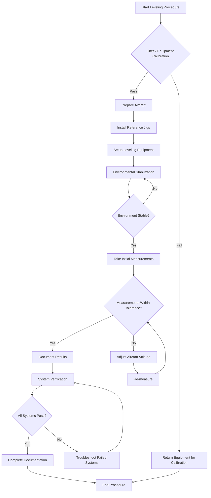
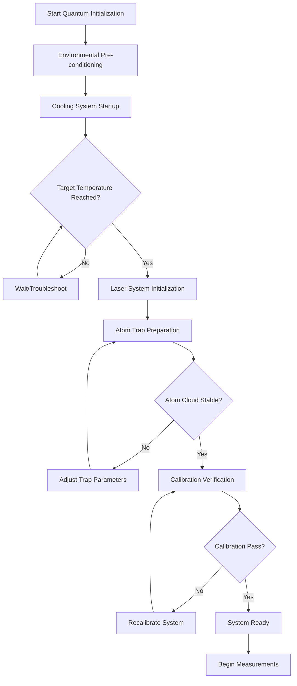

# AMPEL360 BWB-Q100 Leveling Procedures

<p align="center">


</p>

---

## Document Control Information

**Document ID:** `00-70-10-03-Procedure.md`  
**GQOIS ID:** `AS-M-PAX-BW-Q1H-LEV-PROC`  
**ATA Chapter:** 00-70-10-03 (General - Standard Practices - Leveling - Procedures)  
**Classification:** Technical Maintenance Procedures  
**Version:** 2.0.0  
**Effective Date:** 2025-06-28  
**Revision Status:** Initial Release  
**Approval Authority:** GAIA-QAO Maintenance Engineering  

---

## Table of Contents

1. [General Information](#1-general-information)
2. [Safety Requirements](#2-safety-requirements)
3. [Equipment Requirements](#3-equipment-requirements)
4. [Pre-Leveling Preparation](#4-pre-leveling-preparation)
5. [Standard Leveling Procedures](#5-standard-leveling-procedures)
6. [Quantum-Enhanced Precision Leveling](#6-quantum-enhanced-precision-leveling)
7. [BWB-Specific Leveling Methods](#7-bwb-specific-leveling-methods)
8. [System-Specific Leveling Requirements](#8-system-specific-leveling-requirements)
9. [Post-Leveling Verification](#9-post-leveling-verification)
10. [Documentation and Records](#10-documentation-and-records)
11. [Troubleshooting](#11-troubleshooting)
12. [Appendices](#12-appendices)

---

## 1. General Information

### 1.1 Purpose and Scope

This document provides detailed step-by-step procedures for leveling the AMPEL360 BWB-Q100 aircraft for various maintenance, inspection, and calibration activities. The procedures account for the unique Blended Wing Body configuration and integrated quantum systems requiring ultra-high precision leveling.

### 1.2 Applicable Operations

These procedures apply to:
- **Routine Maintenance:** Line and base maintenance leveling
- **System Calibration:** Quantum sensor alignment and calibration
- **Structural Inspection:** Precise aircraft positioning for NDT
- **Component Installation:** Critical system installation and rigging
- **Flight Test Preparation:** Pre-flight configuration verification
- **Manufacturing Assembly:** Production line leveling operations

### 1.3 Leveling Accuracy Classifications

| Classification | Accuracy | Typical Applications |
|----------------|----------|---------------------|
| **Class A - Standard** | ±0.1° | Routine maintenance, general inspection |
| **Class B - Precision** | ±0.02° | Engine rigging, flight control calibration |
| **Class C - Ultra-Precision** | ±0.01° | Antenna alignment, navigation system setup |
| **Class Q - Quantum** | ±0.001° | Quantum sensor calibration, research operations |

### 1.4 Environmental Requirements

**Minimum Environmental Conditions:**
- **Temperature:** 15°C to 30°C (stable ±2°C during procedure)
- **Humidity:** 30% to 70% RH (stable ±5% during procedure)
- **Wind:** <10 knots for outdoor operations, <2 knots for quantum work
- **Vibration:** <0.1g RMS for standard work, <0.01g RMS for quantum
- **Lighting:** Minimum 500 lux, shadow-free illumination

---

## 2. Safety Requirements

### 2.1 Personnel Safety

#### 2.1.1 General Safety Precautions

**⚠️ WARNING**
- Always verify aircraft electrical systems are de-energized before beginning leveling operations
- Ensure proper fall protection when working at elevated positions
- Maintain awareness of moving equipment and other maintenance activities
- Never work alone when using quantum-enhanced leveling systems

**⚠️ CAUTION**
- Quantum systems contain cryogenic fluids - avoid direct contact
- Laser leveling systems require appropriate eye protection
- Heavy leveling equipment requires proper lifting techniques
- Magnetic fields near quantum sensors may affect pacemakers

#### 2.1.2 Personal Protective Equipment (PPE)

**Required PPE:**
- Safety glasses or face shield
- Steel-toed safety shoes
- Hard hat (when working near overhead hazards)
- Cut-resistant gloves for handling tools
- Fall protection harness (when working above 6 feet)

**Additional PPE for Quantum Operations:**
- Cryogenic protection gloves (loose-fitting)
- Anti-static clothing and grounding straps
- Laser safety glasses (appropriate wavelength)
- Magnetic field warning badges

### 2.2 Aircraft Safety

#### 2.2.1 Aircraft Configuration

**Required Aircraft State:**
- Parking brake set and gear pins installed
- Electrical power OFF unless specifically required
- Hydraulic systems depressurized
- Fuel system isolated (if applicable to procedure)
- Flight controls secured in neutral position
- All access panels properly secured

#### 2.2.2 Environmental Protection

**Aircraft Protection Measures:**
- Install protective covers on sensitive surfaces
- Secure all loose items inside aircraft
- Verify hangar door positions (prevent wind effects)
- Establish controlled access zone around aircraft
- Monitor environmental conditions continuously

---

## 3. Equipment Requirements

### 3.1 Standard Leveling Equipment

#### 3.1.1 Basic Tool Set

**Required for All Leveling Operations:**
- Digital inclinometer (±0.02° accuracy) - Part No. GQAO-LEV-D200
- Electronic bubble level set - Part No. GQAO-LEV-E100
- Mechanical spirit level (1m) - Part No. GQAO-LEV-M500
- BWB reference jig set - Part No. GQAO-LEV-BWB-001
- Cleaning supplies (IPA, lint-free cloths)
- Documentation clipboard and forms

#### 3.1.2 Precision Equipment (Class B/C Operations)

**Additional Equipment Required:**
- Laser leveling system - Part No. GQAO-LEV-L500
- Precision digital inclinometer - Part No. GQAO-LEV-D200P
- Environmental monitoring station
- Vibration isolation pads
- Reference target boards

#### 3.1.3 Quantum-Enhanced Equipment (Class Q Operations)

**Specialized Quantum Equipment:**
- Quantum-Enhanced Precision Leveling System (QEPLS) - Part No. GQAO-LEV-Q1000
- Cryogenic cooling support equipment
- Environmental control chamber
- Quantum sensor alignment kit - Part No. GQAO-LEV-QSA-001
- Shielded power distribution unit

### 3.2 Support Equipment

#### 3.2.1 Power and Utilities

**Electrical Requirements:**
- Ground power unit (28V DC, 200A capability)
- Uninterruptible power supply (UPS) for quantum systems
- Ground fault circuit interrupter (GFCI) protection
- Grounding straps and static discharge equipment

**Environmental Control:**
- Portable air conditioning unit (for quantum operations)
- Dehumidification equipment
- Air filtration system (Class 100 for quantum work)
- Temperature and humidity monitoring systems

#### 3.2.2 Documentation and Communication

**Required Documentation:**
- Aircraft maintenance records
- Previous leveling data (for reference)
- System calibration certificates
- Environmental monitoring logs
- Digital camera for documentation

**Communication Equipment:**
- Two-way radios for team coordination
- Emergency communication system
- Connection to maintenance control center
- Computer/tablet for data entry and analysis

---

## 4. Pre-Leveling Preparation

### 4.1 Work Planning and Coordination

#### 4.1.1 Work Order Review

**Step 1: Documentation Review**
1. Review work order and applicable maintenance manual sections
2. Verify required leveling accuracy classification
3. Check for special requirements or precautions
4. Confirm personnel qualifications and certifications
5. Review previous leveling data for reference baselines

**Step 2: Resource Allocation**
1. Verify availability of required equipment
2. Check calibration status of all leveling tools
3. Confirm environmental conditions forecast
4. Schedule coordination with other maintenance activities
5. Arrange for specialized support personnel if required

#### 4.1.2 Safety Briefing

**Pre-Work Safety Meeting:**
1. Review hazards specific to the leveling operation
2. Discuss emergency procedures and evacuation routes
3. Assign safety responsibilities to team members
4. Verify PPE requirements and availability
5. Establish communication protocols
6. Review aircraft-specific safety considerations

### 4.2 Aircraft Preparation

#### 4.2.1 Initial Aircraft Survey

**Step 1: External Inspection**
1. **Visual Survey:** Complete walk-around inspection
   - Check for obvious damage or deformation
   - Verify landing gear extension and condition
   - Inspect for fluid leaks or contamination
   - Note any external equipment or installations

2. **Landing Gear Verification:**
   - Confirm proper gear extension and lock
   - Check tire pressure and condition
   - Verify gear pins are installed
   - Check strut extension for proper aircraft attitude

3. **Surface Preparation:**
   - Clean reference point areas with IPA
   - Remove any protective covers from reference points
   - Verify access to all required mounting locations
   - Check for magnetic interference sources

#### 4.2.2 Aircraft Systems Configuration

**Step 1: Electrical Systems**
```
⚠️ WARNING: Verify electrical isolation before proceeding
```

1. **Main Electrical Power:**
   - Verify external power disconnected
   - Confirm battery master switches OFF
   - Check that all circuit breakers are in normal position
   - Install "DO NOT OPERATE" tags as required

2. **Avionics Systems:**
   - Verify all avionics power switches OFF
   - Confirm navigation systems are shut down
   - Check that autopilot is disengaged
   - Ensure flight management computers are powered down

**Step 2: Hydraulic Systems**
1. Verify hydraulic pumps are OFF
2. Confirm system pressure is relieved
3. Check accumulator pressure (should be nominal)
4. Verify hydraulic fluid levels are adequate
5. Confirm no active hydraulic leaks

**Step 3: Environmental Systems**
1. Set cabin pressure to ambient
2. Verify air conditioning systems are OFF
3. Check cabin temperature is stable
4. Confirm pressurization system is isolated

### 4.3 Equipment Setup and Verification

#### 4.3.1 Standard Equipment Checkout

**Step 1: Digital Inclinometer Verification**
1. **Power-On Test:**
   ```
   - Press power button and wait for initialization (30 seconds)
   - Verify display shows all segments during self-test
   - Check battery level indicator (must be >50%)
   - Confirm temperature compensation is active
   ```

2. **Accuracy Verification:**
   ```
   - Place on certified reference surface (±0.001° known level)
   - Allow 2-minute stabilization period
   - Record reading and compare to reference
   - Deviation must be within ±0.01° for acceptance
   ```

3. **Function Test:**
   ```
   - Test all measurement modes (single-axis, dual-axis)
   - Verify data logging functionality
   - Check communication interface operation
   - Test audible and visual alarms
   ```

#### 4.3.2 Laser Leveling System Setup

**Step 1: System Initialization**
1. **Physical Setup:**
   - Mount on stable tripod at designated position
   - Ensure 360° clear line of sight to aircraft
   - Verify minimum 3m distance from aircraft structure
   - Check for reflective surfaces that could cause interference

2. **Self-Leveling Sequence:**
   ```
   - Power on and initiate self-leveling sequence
   - Wait for completion indicator (typically 60-90 seconds)
   - Verify green status light indicates successful leveling
   - Check level accuracy with independent reference
   ```

3. **Laser Configuration:**
   ```
   - Select appropriate laser mode for operation:
     * Horizontal line: General leveling reference
     * Vertical line: Structural alignment
     * Cross pattern: Complex alignments
     * Rotating beam: 360° reference
   ```

4. **Safety Verification:**
   ```
   - Confirm Class 2 laser operation (power <1mW)
   - Post laser safety signs at entrances
   - Verify beam terminates at safe target
   - Brief all personnel on laser safety procedures
   ```

#### 4.3.3 Quantum System Preparation (Class Q Operations)

**Step 1: Environmental Pre-Conditioning**
1. **Temperature Control:**
   - Establish environmental control zone around aircraft
   - Target temperature: 20°C ±0.5°C
   - Allow 2-hour stabilization period
   - Monitor continuously during operation

2. **Vibration Isolation:**
   - Install vibration isolation platforms
   - Verify background vibration <0.01g RMS
   - Isolate from hangar operations and traffic
   - Monitor with accelerometers during setup

3. **Electromagnetic Environment:**
   - Survey for EMI sources (radios, welders, motors)
   - Establish minimum 10m exclusion zone
   - Turn off non-essential electrical equipment
   - Monitor magnetic field stability

**Step 2: Quantum System Initialization**
1. **Cooling System Startup:**
   ```
   ⚠️ CAUTION: Cryogenic hazards present
   
   - Verify cooling system integrity and connections
   - Initiate cooling sequence (15-minute process)
   - Monitor cooling progress and stability
   - Verify achievement of operating temperature (15mK)
   ```

2. **Laser System Stabilization:**
   ```
   - Power on laser systems and optical components
   - Allow 5-minute frequency stabilization period
   - Verify laser frequency lock indicators
   - Check beam alignment and power levels
   ```

3. **Atom Trap Preparation:**
   ```
   - Load atomic vapor cell and verify pressure
   - Initiate magnetic trap configuration
   - Begin atomic cooling sequence
   - Verify atom cloud formation and stability
   ```

4. **System Self-Test:**
   ```
   - Execute comprehensive system diagnostic
   - Verify all subsystems report "READY" status
   - Check measurement repeatability (10 consecutive readings)
   - Confirm system accuracy meets specification (±0.001°)
   ```

---

## 5. Standard Leveling Procedures

### 5.1 Class A - Standard Leveling (±0.1° Accuracy)

#### 5.1.1 Three-Point Basic Leveling

**Application:** Routine maintenance, general inspections

**Procedure:**
1. **Reference Point Selection:**
   - **Point A:** BWB-REF-01 (center body reference)
   - **Point B:** BWB-REF-02 (left wing reference)  
   - **Point C:** BWB-REF-03 (right wing reference)

2. **Equipment Placement:**
   ```
   Step 1: Clean all reference surfaces with IPA
   Step 2: Install BWB reference jigs at Points A, B, and C
   Step 3: Verify jig contact with all reference points
   Step 4: Place electronic bubble levels on each jig
   Step 5: Allow 2-minute temperature stabilization
   ```

3. **Initial Measurements:**
   ```
   Step 1: Record level reading at Point A (center)
   Step 2: Record level reading at Point B (left wing)
   Step 3: Record level reading at Point C (right wing)
   Step 4: Calculate preliminary aircraft attitude
   ```

4. **Attitude Calculations:**
   ```
   Longitudinal Attitude (Pitch):
   Pitch_Angle = arctan((Reading_A - (Reading_B + Reading_C)/2) / L_ref)
   
   Lateral Attitude (Roll):
   Roll_Angle = arctan((Reading_B - Reading_C) / W_ref)
   
   Where:
   L_ref = Longitudinal reference distance = 15.6m
   W_ref = Lateral reference distance = 17.5m
   ```

5. **Acceptance Criteria:**
   ```
   Pitch: 0° ±0.1° (or as specified in work order)
   Roll: 0° ±0.1° (or as specified in work order)
   Repeatability: ±0.05° between measurements
   ```

#### 5.1.2 Level Adjustment Procedure

**When aircraft attitude is outside tolerance:**

1. **Determine Required Adjustment:**
   ```
   Required_Pitch_Correction = Target_Pitch - Measured_Pitch
   Required_Roll_Correction = Target_Roll - Measured_Roll
   ```

2. **Jack Point Selection:**
   - **Primary Jack Points:** Main landing gear positions
   - **Secondary Jack Points:** Nose gear and tail support
   - **Load Limits:** Verify weight distribution within limits

3. **Adjustment Sequence:**
   ```
   Step 1: Calculate required jack extension/retraction
   Step 2: Adjust main gear jacks for roll correction (equal and opposite)
   Step 3: Adjust nose/tail jacks for pitch correction
   Step 4: Make adjustments in 0.05° increments
   Step 5: Allow 30-second settling time between adjustments
   Step 6: Verify attitude after each adjustment
   ```

4. **Final Verification:**
   ```
   Step 1: Remove jacking equipment
   Step 2: Allow aircraft to settle for 5 minutes
   Step 3: Re-measure attitude at all three points
   Step 4: Verify final attitude within tolerance
   Step 5: Document final measurements
   ```

### 5.2 Class B - Precision Leveling (±0.02° Accuracy)

#### 5.2.1 Five-Point Precision Method

**Application:** Engine rigging, flight control calibration

**Enhanced Procedure:**
1. **Extended Reference Points:**
   - **Point A:** BWB-REF-01 (center body)
   - **Point B:** BWB-REF-02 (left wing)
   - **Point C:** BWB-REF-03 (right wing)
   - **Point D:** BWB-REF-04 (aft section)
   - **Point E:** BWB-REF-05 (nose section)

2. **Precision Equipment Setup:**
   ```
   Equipment Required:
   - Digital inclinometers (±0.02° accuracy) at all 5 points
   - Laser leveling system for reference verification
   - Environmental monitoring station
   - Data logging computer
   ```

3. **Environmental Stabilization:**
   ```
   Step 1: Monitor temperature for 30 minutes (must be stable ±1°C)
   Step 2: Verify humidity is stable ±3% RH
   Step 3: Confirm vibration levels <0.1g RMS
   Step 4: Check for air currents <0.5 m/s
   ```

4. **Measurement Protocol:**
   ```
   Step 1: Allow all instruments 5-minute stabilization
   Step 2: Record simultaneous readings from all 5 points
   Step 3: Repeat measurements at 1-minute intervals (5 readings total)
   Step 4: Calculate statistical averages and standard deviations
   Step 5: Verify repeatability within ±0.01°
   ```

5. **Advanced Attitude Calculations:**
   ```
   Using least-squares best-fit plane through all 5 points:
   
   Plane Equation: Z = A*X + B*Y + C
   
   Where:
   Pitch = arctan(A) * (180/π)
   Roll = arctan(B) * (180/π)
   Twist = Additional twist calculation using point deviations
   ```

#### 5.2.2 Laser-Referenced Leveling

**For Critical Precision Applications:**

1. **Laser System Setup:**
   ```
   Step 1: Position laser system 5m from aircraft centerline
   Step 2: Establish horizontal reference plane
   Step 3: Verify laser plane accuracy with certified level
   Step 4: Set up laser detectors at all reference points
   ```

2. **Measurement Process:**
   ```
   Step 1: Position laser detectors at each BWB reference point
   Step 2: Record height deviations from laser plane
   Step 3: Calculate aircraft attitude relative to laser reference
   Step 4: Cross-verify with digital inclinometer readings
   ```

3. **Verification Protocol:**
   ```
   Step 1: Compare laser and inclinometer measurements
   Step 2: Difference must be within ±0.005°
   Step 3: If disagreement >0.005°, investigate and resolve
   Step 4: Document both measurement methods in records
   ```

### 5.3 Class C - Ultra-Precision Leveling (±0.01° Accuracy)

#### 5.3.1 Multi-Sensor Fusion Method

**Application:** Antenna alignment, navigation system calibration

**Advanced Sensor Integration:**
1. **Sensor Array Deployment:**
   ```
   Primary Sensors:
   - High-precision digital inclinometers (±0.005° accuracy)
   - Laser interferometric sensors
   - Electronic tilt meters with temperature compensation
   
   Secondary Sensors:
   - Mechanical precision levels for reference
   - Accelerometer arrays for vibration monitoring
   - Environmental sensors for correction factors
   ```

2. **Data Fusion Algorithm:**
   ```
   Weighted Average Calculation:
   
   Final_Attitude = Σ(Wi × Measurement_i) / Σ(Wi)
   
   Where:
   Wi = Weight factor based on sensor accuracy and reliability
   
   Typical Weights:
   W_digital = 0.6 (highest accuracy sensors)
   W_laser = 0.3 (interferometric measurements)
   W_mechanical = 0.1 (reference verification)
   ```

3. **Environmental Compensation:**
   ```
   Temperature Correction:
   Corrected_Reading = Raw_Reading + (Temp_Coeff × ΔT)
   
   Humidity Correction:
   Corrected_Reading = Raw_Reading + (Humidity_Coeff × ΔRH)
   
   Pressure Correction:
   Corrected_Reading = Raw_Reading + (Pressure_Coeff × ΔP)
   ```

#### 5.3.2 Statistical Validation Protocol

**Ensuring Measurement Confidence:**

1. **Repeated Measurements:**
   ```
   Step 1: Take 20 consecutive measurements at 30-second intervals
   Step 2: Calculate mean, standard deviation, and confidence interval
   Step 3: Identify and investigate any outliers (>2σ)
   Step 4: Verify measurement stability over time
   ```

2. **Statistical Analysis:**
   ```
   Required Statistics:
   - Mean value (primary result)
   - Standard deviation (σ < 0.003°)
   - 95% confidence interval (±0.006°)
   - Maximum range (max - min < 0.01°)
   ```

3. **Acceptance Criteria:**
   ```
   Measurement Validity Requirements:
   - Standard deviation < 0.003°
   - No systematic drift > 0.001°/hour
   - All individual measurements within ±0.01° of mean
   - Environmental conditions stable throughout measurement period
   ```

---

## 6. Quantum-Enhanced Precision Leveling

### 6.1 Class Q - Quantum Precision (±0.001° Accuracy)

#### 6.1.1 Quantum System Operation Protocol

**Application:** Quantum sensor calibration, research operations

**⚠️ WARNING: Specialized training required for quantum operations**

**Pre-Operation Verification:**
1. **System Readiness Check:**
   ```
   Quantum System Status Verification:
   ✓ Atom trap temperature: 15 ±1 mK
   ✓ Laser frequency stability: ±1 Hz
   ✓ Magnetic field stability: ±0.1 nT
   ✓ Vibration isolation: <0.01g RMS
   ✓ Environmental chamber: 20.0 ±0.1°C
   ```

2. **Calibration Verification:**
   ```
   Step 1: Execute system self-calibration routine
   Step 2: Verify against NIST-traceable reference standard
   Step 3: Confirm measurement uncertainty ±0.0005°
   Step 4: Document calibration verification results
   ```

#### 6.1.2 Quantum Measurement Process

**Measurement Sequence:**
1. **Atom Cloud Preparation:**
   ```
   Step 1: Load cesium atoms into magnetic trap
   Step 2: Cool atoms to quantum degeneracy (1 μK)
   Step 3: Verify atom cloud stability and density
   Step 4: Initialize quantum state preparation
   ```

2. **Interferometric Measurement:**
   ```
   Step 1: Split atom cloud using laser pulses
   Step 2: Allow interferometer evolution (10 ms)
   Step 3: Recombine atom clouds with final laser pulse
   Step 4: Measure quantum interference pattern
   Step 5: Extract tilt angle from phase information
   ```

3. **Statistical Ensemble:**
   ```
   Step 1: Repeat measurement cycle 1000 times
   Step 2: Calculate statistical average and uncertainty
   Step 3: Verify quantum projection noise limit
   Step 4: Validate measurement consistency
   ```

#### 6.1.3 Quantum Error Correction

**Systematic Error Mitigation:**
1. **Environmental Correction:**
   ```
   Gravity Gradient Correction:
   Corrected_Angle = Raw_Angle - (Gradient × Height_Offset)
   
   Magnetic Field Correction:
   Corrected_Angle = Raw_Angle - (B_field × Sensitivity_Coeff)
   
   Temperature Correction:
   Corrected_Angle = Raw_Angle - (Temp_Drift × ΔT)
   ```

2. **Quantum Decoherence Compensation:**
   ```
   Step 1: Monitor quantum coherence time during measurement
   Step 2: Apply decoherence correction based on decay rate
   Step 3: Verify correction effectiveness through repeated measurements
   Step 4: Document coherence parameters for future reference
   ```

#### 6.1.4 Quantum-Classical Verification

**Cross-Validation Protocol:**
1. **Independent Measurement:**
   ```
   Step 1: Simultaneously operate quantum and precision classical systems
   Step 2: Compare results within expected uncertainty limits
   Step 3: Investigate any discrepancies >0.002°
   Step 4: Document comparative analysis results
   ```

2. **Consensus Validation:**
   ```
   Acceptance Criteria:
   - Quantum measurement uncertainty: ±0.001°
   - Classical measurement uncertainty: ±0.005°
   - Agreement between methods: ±0.003°
   - Environmental stability maintained throughout
   ```

### 6.2 Quantum Sensor Alignment Procedures

#### 6.2.1 Individual Quantum Sensor Calibration

**For Quantum Navigation System (QNS) Components:**

1. **Sensor Preparation:**
   ```
   Step 1: Verify sensor environmental chamber conditions
   Step 2: Establish magnetic field null (±10 nT)
   Step 3: Initialize quantum sensor cold atom trap
   Step 4: Verify laser frequency lock and stability
   ```

2. **Reference Frame Establishment:**
   ```
   Step 1: Use QEPLS to establish ultra-precise aircraft attitude
   Step 2: Record reference attitude for each sensor location
   Step 3: Calculate required sensor orientation matrix
   Step 4: Program sensor alignment parameters
   ```

3. **Alignment Verification:**
   ```
   Step 1: Execute sensor self-alignment routine
   Step 2: Compare sensor output to QEPLS reference
   Step 3: Verify alignment accuracy within ±0.0005°
   Step 4: Document sensor alignment parameters
   ```

#### 6.2.2 Quantum Structural Monitoring (QSM) Network

**For Distributed Sensor Network Calibration:**

1. **Network Initialization:**
   ```
   Step 1: Power up all QSM sensors in sequence
   Step 2: Verify network communication integrity
   Step 3: Synchronize sensor measurement timing
   Step 4: Establish common reference frame
   ```

2. **Spatial Calibration:**
   ```
   Step 1: Use QEPLS to measure each sensor location precisely
   Step 2: Create 3D coordinate map of sensor network
   Step 3: Calculate structural geometry reference
   Step 4: Program spatial parameters into network controller
   ```

3. **Baseline Establishment:**
   ```
   Step 1: Record stress-free baseline measurements
   Step 2: Document thermal reference state
   Step 3: Establish normal operational parameters
   Step 4: Set alarm thresholds for anomaly detection
   ```

---

## 7. BWB-Specific Leveling Methods

### 7.1 Complex Geometry Considerations

#### 7.1.1 Non-Linear Reference Systems

**Challenge:** BWB geometry requires specialized reference methods

**Solution Approach:**
1. **Curved Surface Compensation:**
   ```
   Step 1: Map actual BWB surface geometry using 3D scanning
   Step 2: Calculate deviation from theoretical design surface
   Step 3: Apply surface correction factors to level measurements
   Step 4: Verify corrected measurements against design data
   ```

2. **Multi-Plane Reference System:**
   ```
   Primary Plane: Center body waterline reference
   Secondary Plane: Wing chord reference plane  
   Tertiary Plane: Vertical reference plane
   
   Transform between planes using rotation matrices:
   [X'] = [R] × [X] + [T]
   
   Where [R] = rotation matrix, [T] = translation vector
   ```

#### 7.1.2 Variable Center of Gravity Effects

**Fuel and Payload Considerations:**

1. **Weight Distribution Analysis:**
   ```
   Step 1: Document aircraft loading condition
   Step 2: Calculate actual center of gravity location
   Step 3: Determine structural deflection effects
   Step 4: Apply deflection corrections to level measurements
   ```

2. **Loading-Specific Procedures:**
   ```
   Empty Aircraft (OEW):
   - Use standard reference points
   - Minimal structural deflection
   - Highest measurement accuracy
   
   Loaded Aircraft (MTOW):
   - Account for wing deflection (+2.3° typical)
   - Apply fuselage bend corrections
   - Use load-compensated reference points
   ```

### 7.2 Integrated System Considerations

#### 7.2.1 Quantum System Interference

**Minimizing Quantum Decoherence:**

1. **Magnetic Environment Control:**
   ```
   Step 1: Survey magnetic field around aircraft
   Step 2: Identify and mitigate magnetic sources
   Step 3: Establish magnetic field map
   Step 4: Position quantum sensors in optimal locations
   ```

2. **Vibration Isolation:**
   ```
   Step 1: Install vibration isolation platforms
   Step 2: Monitor background vibration spectrum
   Step 3: Active vibration cancellation if required
   Step 4: Verify quantum coherence maintenance
   ```

#### 7.2.2 Multi-System Coordination

**Coordinated Leveling for Multiple Systems:**

1. **System Priority Matrix:**
   ```
   Priority 1: Quantum Navigation System (±0.001°)
   Priority 2: Quantum Structural Monitoring (±0.002°)
   Priority 3: Flight Control System (±0.02°)
   Priority 4: Engine Management (±0.02°)
   Priority 5: General Systems (±0.1°)
   ```

2. **Sequential Calibration Protocol:**
   ```
   Step 1: Establish ultra-precise aircraft attitude (QEPLS)
   Step 2: Calibrate highest priority systems first
   Step 3: Verify system interactions and cross-coupling
   Step 4: Adjust lower priority systems as needed
   Step 5: Final verification of all systems
   ```

---

## 8. System-Specific Leveling Requirements

### 8.1 Quantum Navigation System (QNS) Calibration

#### 8.1.1 QNS Component Alignment

**Quantum Inertial Measurement Unit (QIMU):**

1. **Preparation Phase:**
   ```
   Environmental Requirements:
   - Temperature: 20.0 ±0.1°C
   - Vibration: <0.005g RMS
   - Magnetic field: <50 nT variation
   - Duration: 4-hour stabilization period
   ```

2. **Atom Trap Alignment:**
   ```
   Step 1: Initialize cold atom trap system
   Step 2: Verify atom cloud formation and stability
   Step 3: Align trap magnetic field with aircraft reference frame
   Step 4: Calibrate atom interferometer baseline
   ```

3. **Inertial Reference Establishment:**
   ```
   Step 1: Use QEPLS to establish precise aircraft attitude
   Step 2: Record QIMU output in aircraft reference frame
   Step 3: Calculate transformation matrix between systems
   Step 4: Program transformation into navigation computer
   ```

**Quantum Clock Network Synchronization:**

1. **Master Clock Setup:**
   ```
   Step 1: Identify primary quantum clock (cesium fountain)
   Step 2: Verify clock frequency stability (±1×10⁻¹⁵)
   Step 3: Establish time reference for network
   Step 4: Synchronize all secondary clocks
   ```

2. **Network Time Distribution:**
   ```
   Step 1: Configure optical fiber distribution network
   Step 2: Measure propagation delays to each clock
   Step 3: Apply delay corrections for synchronization
   Step 4: Verify network synchronization accuracy (<1 ps)
   ```

#### 8.1.2 QNS Integration Testing

**System-Level Verification:**

1. **Static Alignment Test:**
   ```
   Test Duration: 8 hours continuous
   
   Step 1: Record QNS position output vs. known aircraft position
   Step 2: Calculate position drift rate (must be <1 cm/hour)
   Step 3: Verify attitude accuracy vs. QEPLS reference
   Step 4: Document long-term stability characteristics
   ```

2. **Dynamic Response Test:**
   ```
   Step 1: Apply known attitude changes using aircraft jacks
   Step 2: Record QNS response time and accuracy
   Step 3: Verify system settling time <30 seconds
   Step 4: Test system response to vibration inputs
   ```

### 8.2 Flight Control System Calibration

#### 8.2.1 Control Surface Rigging

**Primary Flight Controls:**

1. **Elevator/Elevon Alignment:**
   ```
   Required Accuracy: ±0.02°
   Reference: Aircraft longitudinal axis
   
   Step 1: Level aircraft to ±0.01° pitch accuracy
   Step 2: Set control surface to neutral position
   Step 3: Measure surface angle with precision inclinometer
   Step 4: Adjust rigging to achieve 0° ±0.02°
   ```

2. **Rudder Alignment:**
   ```
   Required Accuracy: ±0.02°
   Reference: Aircraft centerline
   
   Step 1: Verify aircraft lateral level ±0.01°
   Step 2: Position rudder to neutral detent
   Step 3: Measure rudder angle relative to vertical reference
   Step 4: Adjust to achieve 0° ±0.02° from centerline
   ```

3. **Spoiler/Speed Brake Rigging:**
   ```
   Required Accuracy: ±0.05°
   Reference: Local wing surface
   
   Step 1: Level wing section to local design angle
   Step 2: Retract spoilers to flush position
   Step 3: Measure spoiler angle relative to wing surface
   Step 4: Adjust for flush alignment ±0.05°
   ```

#### 8.2.2 Sensor Alignment

**Angle of Attack (AOA) Sensors:**

1. **Sensor Mount Verification:**
   ```
   Step 1: Use laser leveling to verify sensor mount angle
   Step 2: Compare to aircraft design waterline reference
   Step 3: Calculate local airflow angle corrections
   Step 4: Program corrections into air data computer
   ```

2. **Cross-Channel Verification:**
   ```
   Step 1: Compare left and right AOA sensor readings
   Step 2: Verify agreement within ±0.1°
   Step 3: Check center sensor (if installed) agreement
   Step 4: Document sensor correlation data
   ```

**Air Data System Calibration:**

1. **Pitot-Static System:**
   ```
   Step 1: Level aircraft for accurate static pressure reference
   Step 2: Connect precision pressure standards
   Step 3: Verify system accuracy across operating range
   Step 4: Calibrate pressure altitude corrections
   ```

### 8.3 Engine System Alignment

#### 8.3.1 Hybrid-Electric Propulsion Alignment

**Electric Motor Alignment:**

1. **Motor Mount Verification:**
   ```
   Required Accuracy: ±0.02°
   Reference: Aircraft thrust line
   
   Step 1: Establish aircraft thrust line using laser
   Step 2: Measure motor centerline alignment
   Step 3: Check for angular misalignment in all axes
   Step 4: Adjust mount bolts to achieve alignment
   ```

2. **Propeller Installation:**
   ```
   Step 1: Verify motor shaft alignment ±0.01°
   Step 2: Install propeller with tracking gauge
   Step 3: Check propeller track and balance
   Step 4: Verify blade angle settings
   ```

**Conventional Engine Alignment:**

1. **Engine Mount Verification:**
   ```
   Step 1: Level aircraft to reference attitude
   Step 2: Use optical alignment tools for engine centerline
   Step 3: Check engine mount deflection under load
   Step 4: Verify thrust line alignment ±0.02°
   ```

2. **Accessory Drive Alignment:**
   ```
   Step 1: Check generator/alternator alignment
   Step 2: Verify hydraulic pump alignment
   Step 3: Check accessory gearbox mounting
   Step 4: Test for excessive vibration or wear
   ```

#### 8.3.2 Engine Control System Calibration

**FADEC System Setup:**

1. **Sensor Calibration:**
   ```
   Step 1: Level aircraft for accurate sensor reference
   Step 2: Calibrate engine position sensors
   Step 3: Verify throttle position sensor accuracy
   Step 4: Check fuel flow sensor calibration
   ```

2. **Control Logic Verification:**
   ```
   Step 1: Execute engine control system self-test
   Step 2: Verify control surface response times
   Step 3: Check emergency shutdown sequences
   Step 4: Test backup control modes
   ```

### 8.4 Communication and Navigation Systems

#### 8.4.1 Antenna Alignment

**VHF Communication Antennas:**

1. **Antenna Positioning:**
   ```
   Required Accuracy: ±1.0°
   Reference: Aircraft horizontal plane
   
   Step 1: Level aircraft to ±0.05° accuracy
   Step 2: Verify antenna mount orientation
   Step 3: Check antenna polarization alignment
   Step 4: Test radiation pattern integrity
   ```

**GPS/GNSS Antenna Array:**

1. **Precision Positioning:**
   ```
   Required Accuracy: ±0.1°
   Reference: Aircraft navigation frame
   
   Step 1: Use precision survey techniques for antenna positions
   Step 2: Measure antenna phase center locations
   Step 3: Calculate baseline vectors between antennas
   Step 4: Program geometry into navigation computer
   ```

2. **Multi-Path Mitigation:**
   ```
   Step 1: Analyze antenna installation for reflective surfaces
   Step 2: Verify ground plane effectiveness
   Step 3: Check for electromagnetic interference
   Step 4: Optimize antenna orientation for signal quality
   ```

#### 8.4.2 Quantum Communication System

**Quantum Key Distribution (QKD) Setup:**

1. **Optical Alignment:**
   ```
   Required Accuracy: ±0.001°
   Reference: Quantum navigation system
   
   Step 1: Align QKD transmitter/receiver optics
   Step 2: Verify quantum state polarization
   Step 3: Check photon detection efficiency
   Step 4: Test secure key generation rate
   ```

2. **Security Verification:**
   ```
   Step 1: Test quantum bit error rate (QBER <5%)
   Step 2: Verify eavesdropping detection capability
   Step 3: Check key distribution protocols
   Step 4: Validate encryption key quality
   ```

---

## 9. Post-Leveling Verification

### 9.1 Measurement Validation

#### 9.1.1 Independent Verification

**Cross-Check Protocol:**

1. **Multiple Method Verification:**
   ```
   Step 1: Compare quantum, laser, and electronic measurements
   Step 2: Calculate measurement agreement statistics
   Step 3: Investigate any discrepancies >measurement uncertainty
   Step 4: Document measurement correlation analysis
   ```

2. **Temporal Stability Check:**
   ```
   Step 1: Repeat measurements after 1-hour interval
   Step 2: Verify measurement drift <0.001°/hour (quantum)
   Step 3: Check environmental stability during period
   Step 4: Document long-term measurement stability
   ```

#### 9.1.2 System Function Verification

**Integrated System Testing:**

1. **Navigation System Check:**
   ```
   Step 1: Verify QNS initialization and self-test pass
   Step 2: Check position accuracy vs. known reference
   Step 3: Test attitude determination accuracy
   Step 4: Verify time synchronization across network
   ```

2. **Flight Control System Check:**
   ```
   Step 1: Execute flight control system self-test
   Step 2: Verify control surface position accuracy
   Step 3: Check sensor correlation and agreement
   Step 4: Test emergency backup modes
   ```

3. **Structural Monitoring Check:**
   ```
   Step 1: Verify all QSM sensors online and functional
   Step 2: Check sensor network communication integrity
   Step 3: Test anomaly detection algorithms
   Step 4: Verify data logging and analysis systems
   ```

### 9.2 Documentation Requirements

#### 9.2.1 Measurement Records

**Required Documentation:**

1. **Primary Data:**
   ```
   - Aircraft identification and configuration
   - Date, time, and duration of leveling operation
   - Environmental conditions throughout procedure
   - Personnel qualifications and certifications
   - Equipment used with calibration status
   ```

2. **Measurement Results:**
   ```
   - Final aircraft attitude (pitch, roll, yaw)
   - Measurement uncertainty and confidence intervals
   - Comparison with previous leveling data
   - Any deviations from standard procedures
   - Corrective actions taken if applicable
   ```

#### 9.2.2 Digital Documentation

**Electronic Record Keeping:**

1. **Data File Format:**
   ```json
   {
     "aircraft_id": "AS-M-PAX-BW-Q1H-001",
     "leveling_date": "2025-06-28T14:30:00Z",
     "procedure_type": "Class Q - Quantum Precision",
     "environmental_conditions": {
       "temperature": "20.1°C ±0.1°C",
       "humidity": "45% ±2% RH",
       "pressure": "1013.2 mbar ±0.5 mbar",
       "vibration": "0.008g RMS"
     },
     "measurements": {
       "pitch": "0.001° ±0.001°",
       "roll": "-0.002° ±0.001°",
       "yaw": "0.000° ±0.001°"
     },
     "equipment_used": [
       "QEPLS-001 (Cal: 2025-03-15)",
       "LLS-003 (Cal: 2025-01-20)",
       "DIG-INCL-007 (Cal: 2025-05-10)"
     ],
     "technician_id": "QS-TECH-001",
     "verification_signature": "digital_signature_hash"
   }
   ```

2. **Blockchain Verification:**
   ```
   Step 1: Generate cryptographic hash of measurement data
   Step 2: Submit hash to GAIA-QAO blockchain network
   Step 3: Receive blockchain confirmation and timestamp
   Step 4: Store blockchain reference with measurement record
   ```

#### 9.2.3 Quality Assurance Review

**Review Process:**

1. **Technical Review:**
   ```
   Reviewer: Senior Maintenance Engineer
   
   Check Items:
   - Procedure compliance verification
   - Measurement accuracy assessment
   - Equipment calibration status
   - Environmental condition adequacy
   - Safety requirement compliance
   ```

2. **Quality Approval:**
   ```
   Approver: Quality Assurance Manager
   
   Final Check:
   - Complete documentation package
   - Measurement traceability verification
   - Procedure deviation justification
   - Personnel qualification confirmation
   - Ready for operational use approval
   ```

---

## 10. Documentation and Records

### 10.1 Record Keeping Requirements

#### 10.1.1 Mandatory Records

**Aircraft Maintenance Log Entry:**
```
Date: 2025-06-28
Aircraft: AS-M-PAX-BW-Q1H-001
Work Order: WO-LEV-2025-0628-001
Task: Quantum-Enhanced Precision Leveling for QNS Calibration

Procedure: 00-70-10-03 Class Q Leveling
Personnel: QS-TECH-001 (Quantum Systems Specialist)
Equipment: QEPLS-001, LLS-003, DIG-INCL-007

Results:
- Pitch: 0.001° ±0.001° (within tolerance)
- Roll: -0.002° ±0.001° (within tolerance)
- Yaw: 0.000° ±0.001° (within tolerance)

All systems functional and within specification.
Aircraft returned to service.

Technician: [Digital Signature]
Inspector: [Digital Signature]
Date: 2025-06-28T16:45:00Z
```

#### 10.1.2 Supplementary Documentation

**Detailed Measurement Report:**

1. **Executive Summary:**
   - Purpose and scope of leveling operation
   - Summary of results and compliance status
   - Any deviations or anomalies noted
   - Recommendations for future operations

2. **Methodology Section:**
   - Detailed procedure description
   - Equipment specifications and calibration status
   - Environmental conditions and controls
   - Personnel qualifications and training

3. **Results and Analysis:**
   - Complete measurement data set
   - Statistical analysis and uncertainty calculation
   - Trend analysis compared to historical data
   - System performance verification results

4. **Conclusions and Recommendations:**
   - Compliance with requirements assessment
   - System performance evaluation
   - Maintenance recommendations
   - Future leveling interval recommendations

### 10.2 Data Management

#### 10.2.1 Digital Data Storage

**Primary Storage System:**
```
Storage Location: GAIA-QAO Maintenance Database
Backup Location: Quantum-Encrypted Cloud Storage
Retention Period: Aircraft Lifetime + 10 years
Access Control: Role-Based Authentication
```

**Data Format Standards:**
- **Measurement Data:** IEEE 754 double precision
- **Timestamps:** ISO 8601 format with UTC
- **Environmental Data:** SI units with specified precision
- **Images/Videos:** Lossless compression for archival

#### 10.2.2 Data Analytics

**Trend Analysis:**
1. **Statistical Process Control:**
   ```
   Step 1: Collect leveling data over time
   Step 2: Calculate control limits (±3σ)
   Step 3: Identify trends or shifts in data
   Step 4: Generate alerts for out-of-control conditions
   ```

2. **Predictive Maintenance:**
   ```
   Step 1: Analyze structural deformation trends
   Step 2: Correlate with flight hours and loading
   Step 3: Predict future maintenance requirements
   Step 4: Optimize maintenance scheduling
   ```

**Machine Learning Integration:**
1. **Pattern Recognition:**
   - Identify optimal leveling procedures for specific conditions
   - Predict measurement accuracy based on environmental factors
   - Optimize equipment selection for given requirements
   - Detect anomalous measurements automatically

2. **Continuous Improvement:**
   - Analyze procedure effectiveness over time
   - Identify opportunities for efficiency improvement
   - Optimize tool calibration intervals
   - Enhance measurement uncertainty models

---

## 11. Troubleshooting

### 11.1 Common Problems and Solutions

#### 11.1.1 Measurement Inconsistencies

**Problem: Large variation between measurement methods**

**Symptoms:**
- Quantum vs. classical measurements differ by >0.005°
- Electronic instruments show erratic readings
- Laser leveling system indicates different results

**Troubleshooting Steps:**
1. **Environmental Check:**
   ```
   Step 1: Verify temperature stability (±1°C)
   Step 2: Check for air currents >0.5 m/s
   Step 3: Monitor vibration levels
   Step 4: Survey for electromagnetic interference
   ```

2. **Equipment Verification:**
   ```
   Step 1: Perform instrument self-tests
   Step 2: Check calibration status and dates
   Step 3: Verify proper instrument setup
   Step 4: Cross-check with reference standards
   ```

3. **Systematic Error Analysis:**
   ```
   Step 1: Check for instrument mounting issues
   Step 2: Verify reference point cleanliness
   Step 3: Look for thermal gradient effects
   Step 4: Check for magnetic field interference
   ```

#### 11.1.2 Quantum System Issues

**Problem: Quantum sensors fail to initialize**

**Symptoms:**
- Atom trap fails to form stable cloud
- Laser frequency lock failure
- Coherence time shorter than specification

**Troubleshooting Steps:**
1. **Cooling System Check:**
   ```
   Step 1: Verify cryogenic system operation
   Step 2: Check cooling fluid levels and purity
   Step 3: Monitor cooling system temperatures
   Step 4: Inspect for vacuum leaks
   ```

2. **Laser System Diagnosis:**
   ```
   Step 1: Check laser power and frequency stability
   Step 2: Verify optical alignment and beam quality
   Step 3: Inspect optical components for contamination
   Step 4: Test laser frequency lock servo loops
   ```

3. **Environmental Isolation:**
   ```
   Step 1: Survey magnetic field environment
   Step 2: Check vibration isolation effectiveness
   Step 3: Verify electromagnetic shielding integrity
   Step 4: Monitor acoustic noise levels
   ```

#### 11.1.3 Aircraft-Specific Issues

**Problem: BWB reference jigs do not seat properly**

**Symptoms:**
- Gaps >0.1mm between jig and aircraft
- Jig rocks or moves during measurement
- Inconsistent readings between reference points

**Troubleshooting Steps:**
1. **Reference Point Inspection:**
   ```
   Step 1: Clean reference surfaces thoroughly
   Step 2: Inspect for damage or wear
   Step 3: Check for foreign object debris
   Step 4: Verify reference point marking visibility
   ```

2. **Jig Condition Check:**
   ```
   Step 1: Inspect jig surfaces for damage
   Step 2: Check magnetic mount strength
   Step 3: Verify jig calibration status
   Step 4: Test jig on known reference surface
   ```

3. **Installation Verification:**
   ```
   Step 1: Follow installation procedure exactly
   Step 2: Check jig orientation and positioning
   Step 3: Verify all contact points engaged
   Step 4: Use feeler gauges to check gaps
   ```

### 11.2 Emergency Procedures

#### 11.2.1 Quantum System Emergency Shutdown

**Emergency Conditions:**
- Cryogenic fluid leak detected
- Laser safety system alarm
- Personnel injury or exposure
- Fire or smoke from quantum equipment

**Emergency Response:**
1. **Immediate Actions:**
   ```
   Step 1: Press emergency stop button (red mushroom button)
   Step 2: Evacuate personnel from immediate area
   Step 3: Call emergency services if required
   Step 4: Isolate electrical power to equipment
   ```

2. **System Safing:**
   ```
   Step 1: Allow cryogenic systems to warm up safely
   Step 2: Vent any pressurized systems
   Step 3: Secure all laser systems
   Step 4: Document emergency conditions
   ```

3. **Post-Emergency Actions:**
   ```
   Step 1: Conduct safety assessment before re-entry
   Step 2: Investigate root cause of emergency
   Step 3: Repair or replace damaged components
   Step 4: Perform full system checkout before restart
   ```

#### 11.2.2 Aircraft Emergency During Leveling

**Emergency Conditions:**
- Aircraft structural failure during leveling
- Jack failure or instability
- Fire or hazardous material spill
- Severe weather approaching

**Emergency Response:**
1. **Personnel Safety:**
   ```
   Step 1: Account for all personnel
   Step 2: Evacuate to safe area
   Step 3: Establish communication with emergency services
   Step 4: Provide first aid if required
   ```

2. **Aircraft Safing:**
   ```
   Step 1: Secure aircraft in stable configuration
   Step 2: Disconnect all external power and equipment
   Step 3: Install safety devices (gear pins, control locks)
   Step 4: Clear area of personnel and equipment
   ```

### 11.3 Diagnostic Tools and Procedures

#### 11.3.1 Measurement System Diagnostics

**Built-In Test Equipment (BITE):**
1. **Quantum System BITE:**
   ```
   Test Sequence:
   - Cooling system performance test
   - Laser frequency stability test
   - Atom trap efficiency measurement
   - Coherence time verification
   - Environmental sensor calibration
   ```

2. **Electronic Instrument BITE:**
   ```
   Test Sequence:
   - Power supply voltage verification
   - Sensor calibration check
   - Communication interface test
   - Memory integrity verification
   - Display and control functionality
   ```

#### 11.3.2 External Test Equipment

**Required Test Equipment:**
- Digital multimeter (±0.1% accuracy)
- Oscilloscope (>1 GHz bandwidth)
- Spectrum analyzer (DC to 40 GHz)
- Laser power meter (±1% accuracy)
- Vibration analyzer (DC to 10 kHz)
- Environmental monitoring station

**Diagnostic Procedures:**
1. **Signal Integrity Testing:**
   ```
   Step 1: Monitor sensor output signals
   Step 2: Check for noise and interference
   Step 3: Verify signal processing chain
   Step 4: Test communication protocols
   ```

2. **Performance Characterization:**
   ```
   Step 1: Measure system response time
   Step 2: Characterize measurement noise floor
   Step 3: Test environmental sensitivity
   Step 4: Verify accuracy across operating range
   ```

---

## 12. Appendices

### Appendix A: Procedure Flowcharts

#### A.1 Standard Leveling Procedure Flowchart



#### A.2 Quantum System Initialization Flowchart



### Appendix B: Environmental Control Specifications

#### B.1 Temperature Control Requirements

**Standard Operations (Class A/B):**
- **Target Temperature:** 20°C ±5°C
- **Stability:** ±2°C over measurement period
- **Gradient:** <1°C/meter spatial gradient
- **Control Method:** Hangar HVAC system

**Precision Operations (Class C):**
- **Target Temperature:** 20°C ±2°C
- **Stability:** ±1°C over measurement period
- **Gradient:** <0.5°C/meter spatial gradient
- **Control Method:** Localized temperature control

**Quantum Operations (Class Q):**
- **Target Temperature:** 20.0°C ±0.1°C
- **Stability:** ±0.1°C over measurement period
- **Gradient:** <0.1°C/meter spatial gradient
- **Control Method:** Environmental chamber with active control

#### B.2 Vibration Control Requirements

**Background Vibration Limits:**
- **Standard Operations:** <0.1g RMS (1-1000 Hz)
- **Precision Operations:** <0.05g RMS (1-1000 Hz)
- **Quantum Operations:** <0.01g RMS (1-1000 Hz)

**Vibration Sources to Control:**
- Hangar equipment (HVAC, cranes, vehicles)
- External traffic and construction
- Aircraft ground equipment
- Personnel movement

**Control Methods:**
- Vibration isolation platforms
- Scheduling of noisy operations
- Active vibration cancellation
- Structural decoupling

### Appendix C: Calibration Certificates Template

#### C.1 Quantum System Calibration Certificate

```
GAIA-QAO CALIBRATION CERTIFICATE

Certificate Number: GQAO-CAL-Q1000-2025-001
Equipment: Quantum-Enhanced Precision Leveling System
Model: QEPLS-Q1000
Serial Number: QS-2025-001
Calibration Date: 2025-06-15
Due Date: 2025-12-15

Calibration Standard: NIST-Traceable Angle Block Set
Standard Accuracy: ±0.0005° (k=2)
Environmental Conditions: 20.0°C ±0.1°C, 45% ±2% RH

Calibration Results:
Angle Setting    Measured Value    Deviation    Uncertainty
0.000°          0.0001°           +0.0001°     ±0.0005°
±0.100°         ±0.1001°          +0.0001°     ±0.0005°
±0.500°         ±0.5000°          0.0000°      ±0.0005°
±1.000°         ±0.9999°          -0.0001°     ±0.0005°
±5.000°         ±5.0002°          +0.0002°     ±0.0005°

Maximum Deviation: +0.0002°
System Accuracy: ±0.001° (k=2)
Linearity: R² = 0.999999
Hysteresis: <0.0003°

Result: PASS - Equipment meets specification

Calibrated by: [Quantum Metrologist Name]
Certified by: [Quality Manager Name]
Date: 2025-06-15

Digital Signature Hash: SHA-256:a1b2c3d4e5f6...
Blockchain Reference: GQAO-BC-2025-0615-001
```

### Appendix D: Safety Data and Emergency Contacts

#### D.1 Emergency Contact Information

**Internal Emergency Contacts:**
```
GAIA-QAO Emergency Coordinator: +1-555-GQAO-911
Quantum Safety Officer: +1-555-GQAO-QSO
Maintenance Manager: +1-555-GQAO-MNT
Facility Manager: +1-555-GQAO-FAC
Security Office: +1-555-GQAO-SEC
```

**External Emergency Services:**
```
Local Emergency Services: 911 (US) / 112 (EU)
Poison Control: +1-800-222-1222
Cryogenic Emergency: +1-800-CRYO-HELP
Laser Safety Hotline: +1-800-LASER-SAFE
```

#### D.2 Hazardous Material Information

**Cryogenic Liquids (Quantum Systems):**
- **Liquid Helium (He):** MSDS-GQAO-001
- **Liquid Nitrogen (N₂):** MSDS-GQAO-002
- **Storage Location:** Building 3, Room Q-101
- **Emergency Procedures:** SOP-GQAO-CRYO-001

**Cleaning Solvents:**
- **Isopropyl Alcohol (IPA):** MSDS-GQAO-003
- **Acetone:** MSDS-GQAO-004
- **Storage Location:** Building 1, Room CHM-001
- **Emergency Procedures:** SOP-GQAO-SOLV-001

#### D.3 Personal Protective Equipment Specifications

**Standard PPE Requirements:**
```
Safety Glasses: ANSI Z87.1, side shields required
Hard Hat: ANSI Z89.1 Type I, Class C
Safety Shoes: ANSI Z41, steel toe, electrical hazard rated
Gloves: Cut-resistant Level A2 minimum
High-Visibility Vest: ANSI 107 Class 2
```

**Quantum Operations Additional PPE:**
```
Cryogenic Gloves: Loose-fitting, easy removal
Face Shield: Full face protection for cryogenic work
Anti-Static Garments: Dissipative materials only
Laser Safety Glasses: Wavelength-specific (635nm)
Magnetic Field Indicator: Pacemaker warning device
```

### Appendix E: Training Record Template

#### E.1 Personnel Qualification Record

```
GAIA-QAO PERSONNEL QUALIFICATION RECORD

Employee Information:
Name: [Employee Name]
ID Number: [Employee ID]
Department: Maintenance Engineering
Position: Quantum Systems Technician

Qualification Level: Level 3 - Quantum Systems Specialist
Initial Certification Date: 2025-01-15
Current Certification Date: 2025-06-15
Expiration Date: 2026-06-15

Training History:
Course                          Date        Hours    Result
Basic Leveling Procedures      2025-01-02    12      Pass (95%)
Advanced BWB Methods           2025-01-08    24      Pass (88%)
Quantum Systems Fundamentals  2025-01-15    40      Pass (92%)
Quantum Safety Training        2025-01-20     8      Pass (100%)
Annual Recertification        2025-06-15    16      Pass (90%)

Practical Assessments:
Assessment                     Date        Result    Assessor
Standard Leveling Procedure   2025-01-22   Pass      Senior Tech
Quantum System Operation      2025-02-01   Pass      QS Specialist
Emergency Procedures          2025-02-05   Pass      Safety Officer

Continuing Education Credits: 24 hours (current year)
Special Authorizations: Quantum System Calibration, Cryogenic Operations

Record Maintained by: Training Department
Last Updated: 2025-06-28
Next Review Due: 2026-06-15
```

### Appendix F: Quality Control Checklists

#### F.1 Pre-Leveling Quality Checklist

**Aircraft Preparation Verification:**
```
☐ Aircraft properly positioned and secured
☐ Landing gear pins installed and verified
☐ Electrical systems de-energized (except as required)
☐ Hydraulic systems depressurized
☐ Access to all reference points confirmed
☐ Reference surfaces cleaned and inspected
☐ Environmental conditions within specifications
☐ Safety equipment and PPE available
☐ Personnel qualifications verified
☐ Work order and procedures reviewed
```

**Equipment Verification:**
```
☐ All required equipment present and accounted for
☐ Equipment calibration certificates current
☐ Equipment function tests completed successfully
☐ Environmental monitoring systems operational
☐ Communication systems tested and functional
☐ Emergency equipment readily available
☐ Documentation materials prepared
☐ Digital systems backed up and secured
```

#### F.2 During-Leveling Quality Checklist

**Measurement Quality Control:**
```
☐ Environmental conditions stable throughout procedure
☐ All measurements within expected uncertainty limits
☐ Cross-verification between measurement methods completed
☐ Statistical analysis performed where required
☐ Any anomalies investigated and resolved
☐ Measurement traceability maintained
☐ Data logging systems functioning properly
☐ Real-time quality monitoring active
```

**Safety Monitoring:**
```
☐ Personnel safety protocols followed continuously
☐ Equipment operating within safe parameters
☐ Environmental hazards monitored and controlled
☐ Emergency procedures readily accessible
☐ Communication maintained with support personnel
☐ Work area security maintained
☐ Aircraft protection measures in place
☐ No unauthorized personnel in work area
```

#### F.3 Post-Leveling Quality Checklist

**Results Verification:**
```
☐ All measurements recorded accurately
☐ Calculations verified and double-checked
☐ Results within specification tolerances
☐ System function tests completed successfully
☐ Independent verification performed where required
☐ Any deviations properly documented and approved
☐ Measurement uncertainty analysis completed
☐ Long-term stability verification performed
```

**Documentation Completion:**
```
☐ All required forms completed accurately
☐ Digital records uploaded to database
☐ Signatures obtained from required personnel
☐ Quality review completed and approved
☐ Aircraft maintenance log updated
☐ Equipment usage logged and updated
☐ Any follow-up actions identified and scheduled
☐ Lessons learned documented for future reference
```

### Appendix G: Measurement Uncertainty Analysis

#### G.1 Uncertainty Budget Template

**Quantum-Enhanced Precision Leveling System (QEPLS):**

| Uncertainty Source | Type | Value | Distribution | Divisor | Standard Uncertainty |
|-------------------|------|--------|--------------|---------|---------------------|
| Quantum measurement | A | 0.0005° | Normal | 1 | 0.0005° |
| Environmental drift | B | 0.0003° | Rectangular | √3 | 0.0002° |
| Calibration reference | B | 0.0002° | Normal | 2 | 0.0001° |
| Resolution | B | 0.0001° | Rectangular | √3 | 0.00006° |
| Vibration effects | B | 0.0002° | Rectangular | √3 | 0.0001° |
| Temperature effects | B | 0.0001° | Rectangular | √3 | 0.00006° |

**Combined Standard Uncertainty:**
```
u_c = √(0.0005² + 0.0002² + 0.0001² + 0.00006² + 0.0001² + 0.00006²)
u_c = √(0.00000031) = 0.00056°
```

**Expanded Uncertainty (k=2, 95% confidence):**
```
U = k × u_c = 2 × 0.00056° = 0.001°
```

#### G.2 Uncertainty Calculation Procedures

**Step-by-Step Uncertainty Analysis:**

1. **Identify Uncertainty Sources:**
   ```
   Step 1: List all known sources of measurement uncertainty
   Step 2: Classify each source as Type A (statistical) or Type B (systematic)
   Step 3: Determine probability distribution for each source
   Step 4: Estimate magnitude of each uncertainty component
   ```

2. **Calculate Standard Uncertainties:**
   ```
   Type A (Statistical):
   u_A = s/√n
   where s = sample standard deviation, n = number of measurements
   
   Type B (Systematic):
   u_B = a/k
   where a = half-width of distribution, k = coverage factor
   ```

3. **Combine Uncertainties:**
   ```
   Combined Standard Uncertainty:
   u_c = √(Σu_i²)
   
   Expanded Uncertainty:
   U = k × u_c
   where k = coverage factor (typically 2 for 95% confidence)
   ```

### Appendix H: Advanced Measurement Techniques

#### H.1 Multi-Sensor Data Fusion

**Kalman Filter Implementation:**

For combining multiple sensor inputs with different accuracies and update rates:

```python
# Simplified Kalman Filter for Attitude Estimation
import numpy as np

class AttitudeKalmanFilter:
    def __init__(self):
        # State vector: [pitch, roll, yaw, pitch_rate, roll_rate, yaw_rate]
        self.x = np.zeros(6)
        
        # State covariance matrix
        self.P = np.eye(6) * 0.01
        
        # Process noise covariance
        self.Q = np.eye(6) * 0.001
        
        # Measurement noise covariance (sensor dependent)
        self.R_quantum = 0.001**2  # Quantum sensor noise
        self.R_electronic = 0.02**2  # Electronic sensor noise
        
    def predict(self, dt):
        # State transition matrix
        F = np.eye(6)
        F[0:3, 3:6] = np.eye(3) * dt
        
        # Predict state and covariance
        self.x = F @ self.x
        self.P = F @ self.P @ F.T + self.Q
        
    def update_quantum(self, measurement):
        # Measurement matrix for quantum sensor
        H = np.zeros((3, 6))
        H[0:3, 0:3] = np.eye(3)
        
        # Kalman gain
        K = self.P @ H.T @ np.linalg.inv(H @ self.P @ H.T + np.eye(3) * self.R_quantum)
        
        # Update state and covariance
        y = measurement - H @ self.x  # Innovation
        self.x = self.x + K @ y
        self.P = (np.eye(6) - K @ H) @ self.P
        
    def update_electronic(self, measurement):
        # Similar update for electronic sensors with different noise characteristics
        H = np.zeros((3, 6))
        H[0:3, 0:3] = np.eye(3)
        
        K = self.P @ H.T @ np.linalg.inv(H @ self.P @ H.T + np.eye(3) * self.R_electronic)
        
        y = measurement - H @ self.x
        self.x = self.x + K @ y
        self.P = (np.eye(6) - K @ H) @ self.P
```

#### H.2 Machine Learning-Enhanced Calibration

**Neural Network for Environmental Compensation:**

```python
import tensorflow as tf
import numpy as np

class EnvironmentalCompensationNetwork:
    def __init__(self):
        # Create neural network for environmental compensation
        self.model = tf.keras.Sequential([
            tf.keras.layers.Dense(64, activation='relu', input_shape=(5,)),
            tf.keras.layers.Dense(32, activation='relu'),
            tf.keras.layers.Dense(16, activation='relu'),
            tf.keras.layers.Dense(3, activation='linear')  # Output: pitch, roll, yaw corrections
        ])
        
        self.model.compile(optimizer='adam', loss='mse', metrics=['mae'])
        
    def prepare_features(self, temperature, humidity, pressure, vibration, magnetic_field):
        # Normalize environmental parameters
        features = np.array([
            (temperature - 20.0) / 10.0,  # Normalized temperature
            (humidity - 50.0) / 50.0,     # Normalized humidity
            (pressure - 1013.25) / 50.0,  # Normalized pressure
            vibration / 0.1,              # Normalized vibration
            magnetic_field / 100.0        # Normalized magnetic field
        ])
        return features.reshape(1, -1)
        
    def predict_corrections(self, environmental_data):
        features = self.prepare_features(*environmental_data)
        corrections = self.model.predict(features)
        return corrections[0]  # Return pitch, roll, yaw corrections
        
    def train_model(self, training_data, validation_data):
        # Train the model on historical calibration data
        X_train, y_train = training_data
        X_val, y_val = validation_data
        
        history = self.model.fit(
            X_train, y_train,
            validation_data=(X_val, y_val),
            epochs=100,
            batch_size=32,
            verbose=1
        )
        
        return history
```

### Appendix I: Automated Measurement Procedures

#### I.1 Robotic Leveling System Integration

**Automated Precision Positioning:**

For future implementations with robotic positioning systems:

```python
class RoboticLevelingSystem:
    def __init__(self):
        self.robot_controller = RobotController()
        self.measurement_system = MeasurementSystem()
        self.target_accuracy = 0.001  # degrees
        
    def automated_leveling_sequence(self, target_attitude):
        """
        Automated leveling sequence using robotic positioning
        """
        max_iterations = 10
        iteration = 0
        
        while iteration < max_iterations:
            # Measure current attitude
            current_attitude = self.measurement_system.get_current_attitude()
            
            # Calculate error
            error = target_attitude - current_attitude
            
            # Check if within tolerance
            if np.all(np.abs(error) < self.target_accuracy):
                print(f"Leveling completed in {iteration} iterations")
                return True
                
            # Calculate required adjustments
            adjustments = self.calculate_adjustments(error)
            
            # Execute robotic adjustments
            self.robot_controller.adjust_aircraft_attitude(adjustments)
            
            # Wait for settling
            time.sleep(30)  # 30-second settling time
            
            iteration += 1
            
        print(f"Leveling failed to converge after {max_iterations} iterations")
        return False
        
    def calculate_adjustments(self, attitude_error):
        """
        Calculate required jack adjustments based on attitude error
        """
        # Geometric transformation from attitude error to jack adjustments
        # This is specific to aircraft geometry and jack configuration
        
        # Simplified calculation for BWB configuration
        L_main = 15.6  # Distance between main jacks (meters)
        L_nose = 8.2   # Distance from main to nose jack (meters)
        
        # Calculate required jack movements
        main_left_delta = -attitude_error[1] * L_main / 2  # Roll correction
        main_right_delta = attitude_error[1] * L_main / 2
        nose_delta = attitude_error[0] * L_nose  # Pitch correction
        
        return {
            'main_left': main_left_delta,
            'main_right': main_right_delta,
            'nose': nose_delta
        }
```

#### I.2 Continuous Monitoring Integration

**Real-Time Structural Health Monitoring:**

```python
class ContinuousLevelingMonitor:
    def __init__(self):
        self.qsm_network = QuantumStructuralMonitoring()
        self.baseline_attitude = None
        self.alert_thresholds = {
            'pitch': 0.1,  # degrees
            'roll': 0.1,   # degrees
            'twist': 0.05  # degrees
        }
        
    def establish_baseline(self):
        """
        Establish baseline attitude for continuous monitoring
        """
        measurements = []
        for i in range(100):  # 100 measurements over 10 minutes
            attitude = self.qsm_network.get_network_attitude()
            measurements.append(attitude)
            time.sleep(6)  # 6-second intervals
            
        self.baseline_attitude = np.mean(measurements, axis=0)
        baseline_std = np.std(measurements, axis=0)
        
        print(f"Baseline established: {self.baseline_attitude}")
        print(f"Baseline std dev: {baseline_std}")
        
    def continuous_monitoring(self):
        """
        Continuous monitoring of aircraft attitude
        """
        while True:
            current_attitude = self.qsm_network.get_network_attitude()
            deviation = current_attitude - self.baseline_attitude
            
            # Check for significant deviations
            alerts = []
            if abs(deviation[0]) > self.alert_thresholds['pitch']:
                alerts.append(f"Pitch deviation: {deviation[0]:.3f}°")
                
            if abs(deviation[1]) > self.alert_thresholds['roll']:
                alerts.append(f"Roll deviation: {deviation[1]:.3f}°")
                
            if abs(deviation[2]) > self.alert_thresholds['twist']:
                alerts.append(f"Twist deviation: {deviation[2]:.3f}°")
                
            if alerts:
                self.send_alerts(alerts)
                
            # Log data for trend analysis
            self.log_measurement(current_attitude, deviation)
            
            time.sleep(60)  # Check every minute
            
    def send_alerts(self, alerts):
        """
        Send alerts to maintenance personnel
        """
        for alert in alerts:
            print(f"ALERT: {alert}")
            # Send to maintenance management system
            # Send email/SMS notifications
            # Update aircraft status in database
```

### Appendix J: Regulatory Compliance Documentation

#### J.1 Certification Compliance Matrix

**EASA CS-25 Compliance for Leveling Procedures:**

| Regulation | Requirement | Compliance Method | Evidence |
|------------|-------------|-------------------|----------|
| CS 25.1309 | Equipment, systems, and installations | Design and test evidence | Test reports, analysis |
| CS 25.1431 | Electronic equipment | Environmental testing | DO-160 compliance |
| CS 25.1501 | General information | Flight manual supplements | AFM Section 9 |
| CS 25.1581 | General information | Maintenance instructions | This document |
| CS 25.1529 | Instructions for continued airworthiness | Maintenance procedures | Chapter 9 procedures |

**Novel Technology Compliance (Quantum Systems):**

| Aspect | Requirement | Proposed Means of Compliance |
|--------|-------------|----------------------------|
| Quantum sensor reliability | Demonstrate safe failure modes | Fault tree analysis, FMEA |
| Environmental qualification | Prove operation in flight environment | Environmental testing per DO-160 |
| Software assurance | Verify quantum-classical interfaces | DO-178C Level A for critical functions |
| Electromagnetic compatibility | Show no interference with aircraft systems | EMC testing per DO-160 |
| Maintenance procedures | Provide qualified maintenance instructions | This document and training program |

#### J.2 Safety Case Structure

**High-Level Safety Argument:**

```
Top-Level Claim: AMPEL360 BWB-Q100 leveling procedures are acceptably safe

Sub-Claims:
├── C1: Leveling equipment is safe to operate
│   ├── C1.1: Quantum systems have adequate safety measures
│   ├── C1.2: Laser systems meet safety standards
│   └── C1.3: Mechanical systems are properly designed
├── C2: Procedures minimize risk to personnel
│   ├── C2.1: Training requirements are adequate
│   ├── C2.2: PPE requirements are sufficient
│   └── C2.3: Emergency procedures are effective
├── C3: Aircraft safety is maintained during leveling
│   ├── C3.1: Structural loads are within limits
│   ├── C3.2: System configurations are safe
│   └── C3.3: Environmental controls are adequate
└── C4: Measurement accuracy supports safe operations
    ├── C4.1: Quantum sensors meet accuracy requirements
    ├── C4.2: Classical sensors provide adequate backup
    └── C4.3: Cross-verification ensures reliability
```

### Appendix K: Future Technology Integration

#### K.1 Artificial Intelligence Integration

**AI-Enhanced Procedure Optimization:**

```python
class AILevelingOptimizer:
    def __init__(self):
        self.optimization_model = None
        self.historical_data = []
        
    def train_optimization_model(self, historical_leveling_data):
        """
        Train AI model to optimize leveling procedures
        """
        # Features: environmental conditions, aircraft configuration, equipment used
        # Target: procedure efficiency, accuracy achieved, time required
        
        import sklearn.ensemble as ensemble
        
        # Extract features and targets from historical data
        X, y = self.prepare_training_data(historical_leveling_data)
        
        # Train random forest model for procedure optimization
        self.optimization_model = ensemble.RandomForestRegressor(
            n_estimators=100,
            max_depth=10,
            random_state=42
        )
        
        self.optimization_model.fit(X, y)
        
    def recommend_optimal_procedure(self, current_conditions):
        """
        Recommend optimal leveling procedure based on current conditions
        """
        if self.optimization_model is None:
            return "Standard procedure - no optimization model trained"
            
        features = self.extract_features(current_conditions)
        prediction = self.optimization_model.predict([features])
        
        # Interpret prediction to provide procedure recommendations
        recommendations = self.interpret_prediction(prediction[0])
        
        return recommendations
        
    def extract_features(self, conditions):
        """
        Extract relevant features from current conditions
        """
        return [
            conditions['temperature'],
            conditions['humidity'],
            conditions['wind_speed'],
            conditions['required_accuracy'],
            conditions['aircraft_weight'],
            conditions['fuel_loading'],
            conditions['time_available']
        ]
```

#### K.2 Digital Twin Integration

**Real-Time Digital Twin Updates:**

```python
class LevelingDigitalTwin:
    def __init__(self, aircraft_id):
        self.aircraft_id = aircraft_id
        self.digital_model = AircraftStructuralModel()
        self.real_time_data = {}
        
    def update_from_leveling_data(self, leveling_results):
        """
        Update digital twin based on leveling measurement results
        """
        # Update structural model with actual measurements
        self.digital_model.update_geometry(leveling_results['attitude'])
        
        # Update material properties based on load history
        self.digital_model.update_material_properties(
            leveling_results['loading_history']
        )
        
        # Update sensor network calibration
        self.digital_model.update_sensor_calibration(
            leveling_results['sensor_data']
        )
        
    def predict_future_leveling_requirements(self, flight_schedule):
        """
        Predict future leveling requirements based on planned operations
        """
        # Simulate structural response to planned flight loads
        predicted_deformation = self.digital_model.simulate_flight_loads(
            flight_schedule
        )
        
        # Predict sensor drift based on usage patterns
        predicted_drift = self.digital_model.predict_sensor_drift(
            flight_schedule
        )
        
        # Calculate recommended leveling intervals
        leveling_schedule = self.calculate_leveling_schedule(
            predicted_deformation,
            predicted_drift
        )
        
        return leveling_schedule
        
    def optimize_maintenance_scheduling(self):
        """
        Optimize maintenance scheduling based on digital twin predictions
        """
        # Use digital twin to predict optimal maintenance windows
        # Consider aircraft utilization, weather patterns, facility availability
        # Minimize operational disruption while maintaining safety margins
        
        pass  # Implementation specific to maintenance management system
```

---

## Document Revision History

| Version | Date | Changes | Author | Approver |
|---------|------|---------|--------|----------|
| 1.0 | 2024-11-30 | Initial document creation | Maintenance Engineering | Technical Review Board |
| 1.1 | 2025-02-15 | Added quantum system procedures | Quantum Systems Team | Chief Engineer |
| 1.2 | 2025-04-20 | Updated safety requirements | Safety Department | Safety Manager |
| 2.0 | 2025-06-28 | Comprehensive revision with field experience | Maintenance Engineering | Program Director |

---

## Document Approval

**Prepared by:** GAIA-QAO Maintenance Engineering Department  
**Technical Review:** GAIA-QAO Systems Engineering Review Board  
**Safety Review:** GAIA-QAO Safety and Risk Assessment Team  
**Regulatory Review:** Certification Authority Liaison Office  
**Quality Review:** GAIA-QAO Quality Assurance Department  
**Final Approval:** GAIA-QAO Program Director  

**Digital Signatures:**
```
Document Control Number: 00-70-10-03-Procedure-V2R0
Primary Author: Senior Maintenance Engineer [Digital Signature]
Technical Reviewer: Chief Systems Engineer [Digital Signature]
Safety Reviewer: Safety Manager [Digital Signature]
Quality Reviewer: QA Manager [Digital Signature]
Final Approver: Program Director [Digital Signature]

Timestamp: 2025-06-28T18:00:00Z UTC
Document Hash: SHA-256:d4e5f6c7b8a9...
Approval Chain Verified: ✓ Complete
Blockchain Reference: GQAO-BC-PROC-2025-0628-003
```

---

**PROPRIETARY AND CONFIDENTIAL**

*This document contains proprietary information of GAIA-QAO and is intended solely for authorized personnel. Unauthorized reproduction, distribution, or disclosure is strictly prohibited. This document contains export-controlled technical data subject to ITAR/EAR restrictions.*

**Classification:** Technical Manual - Controlled Distribution  
**Export Control:** ITAR Category VIII(h) - Quantum navigation systems  
**Distribution:** Authorized maintenance personnel only  

**END OF DOCUMENT**
