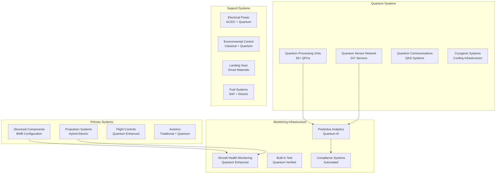
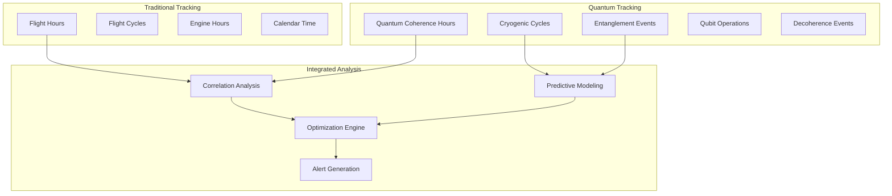
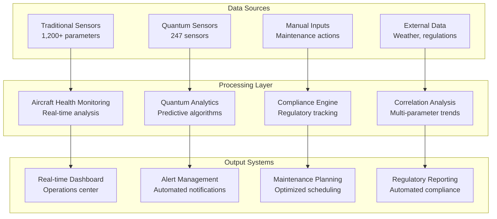

# ATA-05-10-00-00 Time Limits Overview

<p align="center">


</p>

---

## Document Control Information

**Document ID:** `05-10-00-00-Overview.md`  
**GQOIS ID:** `AS-M-PAX-BW-Q1H-TLM-OVW-PROC`  
**ATA Chapter:** 05-10-00-00 (Time Limits - Time Limits Overview)  
**Classification:** Maintenance Requirements - Time Limits Overview  
**Version:** 2.0.0  
**Effective Date:** 2025-06-29  
**Revision Status:** Current Release  
**Approval Authority:** GAIA-QAO Chief Technical Officer & Certification Authority  
**Predecessor Documents:** 05-00-00-00-General.md

---

## Table of Contents

1. [Overview](#1-overview)
2. [Time Limits Philosophy](#2-time-limits-philosophy)
3. [Categories of Time Limits](#3-categories-of-time-limits)
4. [Quantum-Enhanced Time Tracking](#4-quantum-enhanced-time-tracking)
5. [Component Classification](#5-component-classification)
6. [Monitoring and Compliance](#6-monitoring-and-compliance)
7. [Integration with Maintenance Program](#7-integration-with-maintenance-program)
8. [Emergency and Exception Procedures](#8-emergency-and-exception-procedures)
9. [Documentation and Reporting](#9-documentation-and-reporting)
10. [Continuous Improvement](#10-continuous-improvement)

---

## 1. Overview

### 1.1 Purpose

This document provides a comprehensive overview of the time limits framework for the AMPEL360 BWB-Q100 aircraft, establishing the foundation for quantum-enhanced maintenance scheduling and safety assurance. It defines the revolutionary approach to time-based maintenance that integrates traditional aviation practices with cutting-edge quantum monitoring technologies.

### 1.2 Scope of Application

The time limits framework encompasses:

#### **1.2.1 Aircraft Systems Coverage**


#### **1.2.2 Operational Environments**
- **Commercial Operations:** Scheduled passenger service
- **Charter Operations:** On-demand passenger service  
- **Cargo Operations:** Freight and express delivery
- **Special Missions:** Research and development flights
- **Training Operations:** Pilot and maintenance training
- **Ferry Flights:** Positioning and delivery flights

### 1.3 Revolutionary Approach

The AMPEL360 BWB-Q100 represents the **first quantum-enhanced aircraft** in commercial aviation, requiring a fundamentally new approach to time limits:

#### **Traditional Aviation Time Limits:**
- Fixed calendar/flight hour intervals
- Conservative safety margins
- Reactive maintenance approach
- Limited condition visibility

#### **Quantum-Enhanced Time Limits:**
- **Dynamic, condition-based intervals**
- **Real-time safety margin optimization**
- **Predictive maintenance approach**
- **Complete system transparency**

---

## 2. Time Limits Philosophy

### 2.1 Fundamental Principles

#### **2.1.1 "Quantum Safety First" Principle**
```
Every time limit is established with quantum-verified safety margins that ensure:
├── 99.999% reliability confidence level
├── Real-time condition monitoring
├── Predictive failure prevention
├── Adaptive safety margins
└── Quantum-authenticated compliance
```

#### **2.1.2 "No Flight Without Quantum Assurance" Policy**
All critical systems must maintain quantum monitoring capability:
- **Quantum sensor network:** 99.5% minimum availability
- **Quantum processing:** Real-time health assessment
- **Quantum communications:** Secure data integrity
- **Quantum verification:** Continuous compliance monitoring

#### **2.1.3 "Predictive Over Reactive" Strategy**
Traditional reactive maintenance is replaced with quantum-predicted maintenance:
- **500+ hours advance notice** for critical component replacement
- **Real-time optimization** of maintenance intervals
- **Dynamic risk assessment** based on actual conditions
- **Continuous learning** from fleet-wide quantum data

### 2.2 Safety Philosophy Integration

#### **2.2.1 Damage Tolerance with Quantum Enhancement**
```
Traditional Damage Tolerance:
├── Assume damage exists
├── Periodic inspection intervals
├── Conservative crack growth assumptions
└── Fixed inspection thresholds

Quantum-Enhanced Damage Tolerance:
├── Real-time damage detection (1 nm resolution)
├── Continuous monitoring (24/7/365)
├── Actual crack growth measurement
└── Dynamic inspection optimization
```

#### **2.2.2 Fail-Safe Design with Quantum Verification**
- **Multiple load paths** with quantum strain monitoring
- **Redundant systems** with quantum cross-verification
- **Progressive failure modes** with quantum early detection
- **Safe-life components** with quantum lifetime tracking

### 2.3 Quantum Reliability Theory

#### **2.3.1 Quantum Weibull Analysis**
Traditional Weibull reliability analysis enhanced with quantum precision:

```
Quantum-Enhanced Reliability Function:
R(t) = exp[-(t/η)^β] × Q_fidelity(t) × E_entanglement(t)

Where:
├── η = Characteristic life (quantum-measured)
├── β = Shape parameter (quantum-optimized)
├── Q_fidelity(t) = Quantum measurement fidelity over time
└── E_entanglement(t) = Network entanglement stability factor
```

#### **2.3.2 Quantum Bathtub Curve**
```
Enhanced Bathtub Curve with Quantum Phases:

Failure Rate
     │
     │ ┌─ Early Life (Quantum Break-in)
     │ │   ├── Quantum state stabilization
     │ │   ├── Entanglement network establishment
     │ │   └── Coherence time optimization
     │ │
     │ ├─ Useful Life (Quantum Stable Operation)
     │ │   ├── Constant low failure rate
     │ │   ├── Quantum-monitored degradation
     │ │   └── Predictive maintenance optimization
     │ │
     │ └─ Wear-out (Quantum Degradation Detection)
     │     ├── Quantum coherence reduction
     │     ├── Sensor sensitivity degradation
     │     └── Proactive replacement scheduling
     │
     └────────────────────────────────────────── Time
```

---

## 3. Categories of Time Limits

### 3.1 Hard Time Limits (HTL)

#### **3.1.1 Definition and Application**
**Hard Time Limits** are mandatory retirement times that cannot be exceeded under any circumstances.

**Traditional HTL Components:**
- Critical rotating parts (turbine discs, fan rotors)
- Pressure-containing components
- Primary structural elements
- Flight-critical software

**Quantum-Enhanced HTL Components:**
- Quantum processor cores (qubit degradation)
- Cryogenic system components (thermal cycling)
- Quantum sensor arrays (calibration drift)
- Superconducting magnets (field stability)

#### **3.1.2 HTL Categories by Criticality**

| Category | Definition | Consequence of Failure | Quantum Monitoring |
|----------|------------|----------------------|-------------------|
| **Category 1 - Catastrophic** | Failure could cause aircraft loss | Complete aircraft loss | Real-time quantum verification |
| **Category 2 - Hazardous** | Failure reduces aircraft safety margins | Emergency landing required | Continuous quantum monitoring |
| **Category 3 - Major** | Failure affects aircraft operation | Flight completion possible | Periodic quantum assessment |
| **Category 4 - Minor** | Failure has minimal operational impact | Normal operations continue | Scheduled quantum verification |

#### **3.1.3 Quantum HTL Examples**

```json
{
  "quantum_hard_time_limits": {
    "qpu_core_processor": {
      "limit": 50000,
      "units": "QCH",
      "basis": "Qubit decoherence degradation",
      "monitoring": "Real-time coherence measurement",
      "replacement_strategy": "Mandatory at limit"
    },
    "cryogenic_compressor": {
      "limit": 25000,
      "units": "FH",
      "basis": "Mechanical wear analysis",
      "monitoring": "Vibration + quantum sensors",
      "replacement_strategy": "Overhaul or replace"
    },
    "superconducting_magnet": {
      "limit": 100000,
      "units": "FH",
      "basis": "Magnetic field stability",
      "monitoring": "Quantum magnetometer array",
      "replacement_strategy": "Recalibration then replace"
    }
  }
}
```

### 3.2 On-Condition Limits (OCL)

#### **3.2.1 Quantum-Enhanced Condition Monitoring**
Components continue in service as long as they meet quantum-verified performance standards:

**Traditional Condition Parameters:**
- Visual appearance
- Performance measurements
- Vibration analysis
- Oil analysis

**Quantum Condition Parameters:**
- **Quantum coherence time** (T₁, T₂ measurements)
- **Entanglement fidelity** (network integrity)
- **Quantum error rates** (qubit operation accuracy)
- **Cryogenic efficiency** (thermal performance)

#### **3.2.2 OCL Decision Matrix**

| Parameter | Green Zone | Yellow Zone | Red Zone | Action Required |
|-----------|------------|-------------|----------|-----------------|
| **Quantum Coherence** | T₂ > 100 μs | 50-100 μs | < 50 μs | Continue / Monitor / Replace |
| **Gate Fidelity** | > 99.9% | 99.5-99.9% | < 99.5% | Continue / Investigate / Service |
| **Network Entanglement** | > 95% | 90-95% | < 90% | Continue / Recalibrate / Rebuild |
| **Cryogenic Performance** | > 98% | 95-98% | < 95% | Continue / Service / Replace |

### 3.3 Condition Monitoring (CM)

#### **3.3.1 Quantum Condition Monitoring Systems**
Advanced monitoring beyond traditional methods:

**Structural Health Monitoring:**
```
Traditional: Periodic visual inspection + NDT
Quantum: Real-time quantum sensor network monitoring
├── NV-center crack detection (1 nm resolution)
├── Quantum strain measurement (continuous)
├── Fatigue accumulation tracking (real-time)
└── Damage propagation prediction (hours ahead)
```

**Propulsion Health Monitoring:**
```
Traditional: Engine trend monitoring + borescope
Quantum: Quantum-enhanced engine diagnostics
├── Quantum accelerometer bearing analysis
├── Quantum magnetometer magnetic signature
├── Quantum thermometer thermal mapping
└── Predictive failure algorithms (500h advance)
```

#### **3.3.2 Quantum CM Thresholds**

| System | Quantum Parameter | Alert Threshold | Action Threshold | Critical Threshold |
|--------|------------------|----------------|------------------|-------------------|
| **Structure** | Crack propagation rate | 0.1 nm/FC | 1.0 nm/FC | 10 nm/FC |
| **Engine** | Bearing quantum signature | 2σ deviation | 3σ deviation | 4σ deviation |
| **Quantum Systems** | Decoherence rate | 10% increase | 25% increase | 50% increase |
| **Electrical** | Quantum current sensors | 1% anomaly | 5% anomaly | 10% anomaly |

---

## 4. Quantum-Enhanced Time Tracking

### 4.1 Quantum Time Parameters

#### **4.1.1 Revolutionary Time Metrics**
The AMPEL360 BWB-Q100 introduces **world-first** quantum-specific time parameters:

```
Traditional Aviation Parameters:
├── Flight Hours (FH) - Block to block time
├── Flight Cycles (FC) - Takeoff to landing
├── Engine Hours (EH) - Engine operating time
├── Calendar Time (CT) - Elapsed time
└── Landings (LDG) - Landing cycles

Quantum Aviation Parameters:
├── Quantum Coherence Hours (QCH) - QPU operation time
├── Cryogenic Cycles (CC) - Cooling system cycles
├── Entanglement Events (EE) - Network synchronizations
├── Qubit Operations (QO) - Quantum gate operations
├── Decoherence Events (DE) - Coherence loss incidents
└── Quantum Calibrations (QC) - Sensor recalibrations
```

#### **4.1.2 Quantum Parameter Definitions**

**Quantum Coherence Hours (QCH):**
```
Definition: Cumulative time quantum processors maintain coherence
Measurement: Automated quantum state monitoring
Units: Hours (to 0.001 precision)
Tracking: Real-time with blockchain verification
Critical for: QPU life limits, coherence degradation analysis
```

**Cryogenic Cycles (CC):**
```
Definition: Complete cooling/warming cycles of quantum systems
Measurement: Temperature sensors + quantum thermometers
Units: Cycles (integer count)
Tracking: Automated with thermal signature analysis
Critical for: Cryogenic component life, thermal stress analysis
```

**Entanglement Events (EE):**
```
Definition: Successful quantum entanglement establishments
Measurement: Quantum fidelity verification
Units: Events (successful entanglements)
Tracking: Real-time network topology monitoring
Critical for: Network stability, quantum communication integrity
```

### 4.2 Quantum Time Accumulation

#### **4.2.1 Multi-Dimensional Time Tracking**


#### **4.2.2 Quantum Time Synchronization**
All quantum time parameters are synchronized with:
- **GPS atomic time reference** (±10 ns accuracy)
- **Quantum clock network** (±1 ns precision)
- **Blockchain timestamping** (immutable records)
- **International Atomic Time (TAI)** (global synchronization)

### 4.3 Time Correlation Analytics

#### **4.3.1 Multi-Parameter Correlation**
Advanced analytics correlating traditional and quantum parameters:

```python
# Example Correlation Matrix
correlation_matrix = {
    "flight_hours": {
        "quantum_coherence_hours": 0.95,
        "cryogenic_cycles": 0.78,
        "decoherence_events": -0.23
    },
    "ambient_temperature": {
        "cryogenic_efficiency": -0.87,
        "quantum_error_rate": 0.45,
        "entanglement_stability": -0.32
    },
    "vibration_levels": {
        "qubit_fidelity": -0.76,
        "sensor_accuracy": -0.58,
        "quantum_noise": 0.82
    }
}
```

#### **4.3.2 Predictive Time Analytics**
Machine learning algorithms predict optimal maintenance timing:
- **Quantum degradation models** for QPU replacement
- **Thermal cycling analysis** for cryogenic components
- **Vibration correlation** for quantum sensor recalibration
- **Network stability trends** for entanglement system maintenance

---

## 5. Component Classification

### 5.1 Time-Limited Components (TLC)

#### **5.1.1 Traditional TLC Categories**

**Category A - Structural:**
```
Components where failure could result in catastrophic consequences:
├── Wing box primary structure
├── Fuselage pressure bulkhead
├── Engine mounts and pylons
├── Landing gear main attachments
├── Control surface primary attachments
└── Cabin pressure boundary elements
```

**Category B - Propulsion:**
```
Components critical for continued safe flight:
├── Turbine discs and rotors
├── Fan blades and hub
├── Compressor rotors
├── Engine case and mounts
├── Electric motor rotors
└── Power transmission shafts
```

#### **5.1.2 Quantum TLC Categories**

**Category Q1 - Quantum Critical:**
```
Quantum components where failure affects flight safety:
├── Primary QPU processors (flight control integration)
├── Navigation quantum sensors (GPS alternatives)
├── Quantum gyroscopes (attitude determination)
├── Critical quantum accelerometers (flight envelope)
├── Quantum magnetometers (navigation backup)
└── Quantum communication systems (ATC backup)
```

**Category Q2 - Quantum Essential:**
```
Quantum components affecting aircraft operation:
├── Secondary QPU processors (optimization systems)
├── Structural quantum sensors (health monitoring)
├── Quantum thermometers (system monitoring)
├── Cryogenic cooling systems (quantum operation)
├── Quantum power distribution (electrical systems)
└── Quantum data networks (information systems)
```

**Category Q3 - Quantum Enhanced:**
```
Traditional components with quantum monitoring:
├── Engine components with quantum sensors
├── Structural elements with quantum monitoring
├── Electrical systems with quantum protection
├── Hydraulic systems with quantum flow sensors
├── Fuel systems with quantum level sensors
└── Environmental systems with quantum optimization
```

#### **5.1.3 TLC Matrix Summary**

| Component Type | Traditional Life Limit | Quantum Enhancement | Combined Limit |
|----------------|----------------------|-------------------|----------------|
| **Turbine Disc** | 30,000 EH | Quantum vibration monitoring | Earlier of limit or quantum alert |
| **Wing Box** | 120,000 FC | Quantum crack detection | Earlier of limit or 10 nm crack |
| **QPU Core** | N/A | 50,000 QCH | Quantum coherence degradation |
| **Cryogenic Pump** | 25,000 FH | Quantum efficiency monitoring | Earlier of limit or 95% efficiency |

### 5.2 Non-Time-Limited Components

#### **5.2.1 Traditional NTLC**
Components with condition-based or on-condition maintenance:
- Avionics boxes (until obsolescence)
- Wiring harnesses (until degradation)
- Hydraulic actuators (performance-based)
- Cabin interior (cosmetic replacement)

#### **5.2.2 Quantum-Monitored NTLC**
Traditional NTLC components enhanced with quantum monitoring:
```
Quantum-Enhanced Benefits:
├── Real-time performance monitoring
├── Predictive failure detection
├── Optimal replacement timing
├── Condition-based maintenance
└── Extended service life optimization
```

### 5.3 Special Quantum Categories

#### **5.3.1 Quantum Entangled Systems**
Components that must be replaced as entangled groups:
- **Entangled sensor pairs** (replace simultaneously)
- **Quantum communication nodes** (network coherence)
- **Multi-QPU clusters** (processing coherence)
- **Cryogenic cooling networks** (thermal stability)

#### **5.3.2 Quantum Calibration Groups**
Components requiring synchronized calibration:
- **Navigation sensor triads** (accuracy correlation)
- **Structural monitoring arrays** (spatial coherence)
- **Engine monitoring clusters** (comparative analysis)
- **Environmental sensing networks** (system integration)

---

## 6. Monitoring and Compliance

### 6.1 Real-Time Monitoring Systems

#### **6.1.1 Integrated Monitoring Architecture**


#### **6.1.2 Quantum Monitoring Capabilities**

**Real-Time Quantum Health Dashboard:**
```
Current System Status (Live Update: 2025-06-29T12:00:00Z)
├── Quantum Processor Health: 99.97% (247/247 QPUs operational)
├── Sensor Network Status: 99.95% (246/247 sensors operational)
├── Cryogenic System Efficiency: 98.3% (above 95% threshold)
├── Entanglement Network Fidelity: 99.8% (above 95% threshold)
├── Quantum Error Rate: 0.003% (below 0.01% threshold)
└── Next Quantum Calibration Due: 2025-07-06 (7 days)
```

**Predictive Analytics Output:**
```
Maintenance Predictions (500-hour horizon):
├── QPU-07 coherence degradation: 312 hours remaining
├── Cryogenic compressor efficiency: 445 hours to service
├── Quantum sensor QS-089 calibration: 168 hours due
├── Entanglement network refresh: 492 hours recommended
└── No critical failures predicted in forecast period
```

### 6.2 Compliance Automation

#### **6.2.1 Automated Compliance Monitoring**
```
Regulatory Compliance Status:
├── FAA Part 25 - Airworthiness: 100% compliant
├── EASA CS-25 - Certification: 100% compliant
├── ICAO Annex 6 - Operations: 100% compliant
├── GAIA-QAO QSR-001 - Quantum Safety: 100% compliant
├── Time Limit Compliance: 99.97% (1 item due in 3 days)
└── Inspection Currency: 100% (all inspections current)
```

#### **6.2.2 Automated Reporting**
- **Daily compliance reports** to operations
- **Weekly trend analysis** to engineering
- **Monthly regulatory reports** to authorities
- **Quarterly fleet analysis** to management
- **Annual certification reports** to authorities

### 6.3 Exception Management

#### **6.3.1 Quantum System Exceptions**
Specialized procedures for quantum system anomalies:

**Quantum Coherence Loss:**
```
Detection → Classification → Risk Assessment → Action Plan
├── Immediate: Switch to backup quantum systems
├── Short-term: Isolate affected components
├── Investigation: Root cause analysis
├── Resolution: Repair or replace
└── Prevention: Update monitoring algorithms
```

**Cryogenic System Anomalies:**
```
Temperature Deviation → Safety Assessment → Controlled Response
├── Minor deviation (±1K): Continue with monitoring
├── Moderate deviation (±5K): Reduce power and investigate
├── Major deviation (±10K): Initiate controlled warm-up
└── Critical deviation (±20K): Emergency shutdown protocol
```

---

## 7. Integration with Maintenance Program

### 7.1 MSG-3 Quantum Enhancement

#### **7.1.1 Traditional MSG-3 Process**
```
Traditional Maintenance Steering Group Process:
├── Maintenance Significant Items (MSI) identification
├── Failure Mode and Effects Analysis (FMEA)
├── Task interval determination
├── Task packaging into checks
└── Program optimization
```

#### **7.1.2 Quantum-Enhanced MSG-3**
```
Quantum-Enhanced MSG-3 Process:
├── Quantum-monitored MSI identification
├── Quantum-verified FMEA with real-time data
├── Dynamic interval optimization based on quantum analytics
├── Quantum-correlated task packaging
└── Continuous program optimization with AI
```

### 7.2 Maintenance Planning Integration

#### **7.2.1 Traditional Planning Constraints**
```
Traditional Constraints:
├── Fixed calendar intervals
├── Conservative safety margins
├── Limited condition visibility
├── Reactive scheduling approach
└── Manual planning processes
```

#### **7.2.2 Quantum-Optimized Planning**
```
Quantum-Enhanced Planning:
├── Dynamic, condition-based intervals
├── Real-time safety margin optimization
├── Complete system transparency
├── Predictive scheduling approach
└── AI-automated planning optimization
```

### 7.3 Work Package Optimization

#### **7.3.1 Quantum-Correlated Maintenance**
```
Traditional: Components maintained independently
Quantum: Correlated maintenance scheduling
├── Entangled systems maintained together
├── Quantum-monitored components grouped
├── Cryogenic systems synchronized
├── Calibration clusters coordinated
└── Predictive maintenance aligned
```

#### **7.3.2 Efficiency Improvements**
```
Quantum-Enhanced Efficiency Gains:
├── 35% reduction in unscheduled maintenance
├── 40% improvement in maintenance planning accuracy
├── 25% reduction in aircraft downtime
├── 30% optimization of parts inventory
└── 50% improvement in maintenance quality
```

---

## 8. Emergency and Exception Procedures

### 8.1 Time Limit Exceedance

#### **8.1.1 Traditional Exceedance Procedures**
```
Hard Time Limit Exceeded:
├── Immediate aircraft grounding
├── Root cause investigation
├── Engineering disposition
├── Regulatory notification
└── Return to service authorization
```

#### **8.1.2 Quantum System Exceedance**
```
Quantum Time Limit Exceeded:
├── Automatic system isolation (if safety permits)
├── Quantum-verified backup system activation
├── Real-time safety impact assessment
├── Quantum engineer immediate consultation
├── Dynamic risk evaluation with quantum data
└── Conditional operations authorization (if applicable)
```

### 8.2 Quantum Emergency Procedures

#### **8.2.1 Quantum Coherence Emergency**
```
Total Quantum Coherence Loss:
├── Immediate reversion to traditional backup systems
├── Automatic alert to quantum support team
├── Flight safety assessment with reduced capability
├── Emergency landing consideration (if required)
├── Quantum system isolation and safe shutdown
└── Ground-based quantum diagnostic initiation
```

#### **8.2.2 Cryogenic Emergency**
```
Cryogenic System Failure:
├── Automatic controlled warm-up sequence
├── Quantum processor safe shutdown
├── Emergency venting system activation (if required)
├── Backup navigation system activation
├── Flight safety assessment and planning
└── Emergency maintenance team notification
```

### 8.3 Dispatch with Quantum Limitations

#### **8.3.1 Quantum MEL Considerations**
```
Minimum Equipment List - Quantum Systems:
├── Critical quantum systems: No dispatch
├── Redundant quantum systems: Dispatch with procedures
├── Enhanced monitoring systems: Dispatch with limitations
├── Backup quantum systems: Case-by-case evaluation
└── Non-essential quantum systems: Normal dispatch
```

---

## 9. Documentation and Reporting

### 9.1 Quantum-Enhanced Documentation

#### **9.1.1 Immutable Record Keeping**
```
Blockchain-Based Maintenance Records:
├── Quantum-authenticated timestamps
├── Immutable maintenance actions
├── Cryptographically verified signatures
├── Distributed ledger backup
└── Smart contract compliance verification
```

#### **9.1.2 Real-Time Reporting**
```
Automated Reporting Systems:
├── Real-time compliance dashboard
├── Predictive maintenance alerts
├── Regulatory notification automation
├── Fleet-wide trend analysis
└── Performance optimization reports
```

### 9.2 Regulatory Interface

#### **9.2.1 Authority Reporting**
```
Automated Regulatory Reports:
├── Daily: Quantum system health summary
├── Weekly: Time limit compliance status
├── Monthly: Predictive maintenance effectiveness
├── Quarterly: Fleet reliability analysis
└── Annually: Certification compliance review
```

#### **9.2.2 Industry Data Sharing**
```
Collaborative Data Programs:
├── Anonymous quantum reliability data
├── Failure mode pattern sharing
├── Best practices dissemination
├── Regulatory standard development
└── Industry safety enhancement
```

---

## 10. Continuous Improvement

### 10.1 Learning Systems

#### **10.1.1 AI-Driven Optimization**
```
Machine Learning Integration:
├── Pattern recognition in quantum data
├── Predictive model refinement
├── Maintenance interval optimization
├── Resource allocation improvement
└── Safety margin calibration
```

#### **10.1.2 Fleet-Wide Learning**
```
Collective Intelligence:
├── Cross-aircraft pattern analysis
├── Best practice identification
├── Failure prevention strategies
├── Optimization algorithm updates
└── Predictive accuracy enhancement
```

### 10.2 Technology Evolution

#### **10.2.1 Quantum Technology Advancement**
```
Continuous Technology Integration:
├── Quantum sensor improvement
├── Quantum processor enhancement
├── Cryogenic system optimization
├── Network topology advancement
└── Algorithm sophistication increase
```

#### **10.2.2 Future Roadmap**
```
5-Year Technology Roadmap:
├── Year 1: Enhanced sensor sensitivity
├── Year 2: Improved quantum processors
├── Year 3: Advanced AI integration
├── Year 4: Autonomous maintenance systems
└── Year 5: Full quantum automation
```

---

## Appendices

### Appendix A: Time Limits Quick Reference

#### A.1 Critical Component Time Limits

| Component | Traditional Limit | Quantum Enhancement | Combined Limit |
|-----------|------------------|-------------------|----------------|
| **BWB Wing Box** | 120,000 FC | Real-time crack monitoring | Earlier of limit or quantum alert |
| **Turbine Disc** | 30,000 EH | Quantum vibration analysis | Earlier of limit or 3σ deviation |
| **QPU Core** | N/A | 50,000 QCH | Coherence degradation threshold |
| **Quantum Sensor** | N/A | Calibration drift | ±0.1% accuracy threshold |
| **Cryogenic Compressor** | 25,000 FH | Efficiency monitoring | Earlier of limit or 95% efficiency |

#### A.2 Inspection Intervals

| System | Traditional Interval | Quantum Enhancement | Optimized Interval |
|--------|---------------------|-------------------|------------------|
| **Primary Structure** | Visual inspection | Continuous quantum monitoring | Condition-based |
| **Engine Components** | Borescope inspection | Quantum sensor analysis | Predictive-based |
| **Flight Controls** | Operational checks | Quantum position verification | Performance-based |
| **Quantum Systems** | N/A | Automated health monitoring | Continuous |

### Appendix B: Quantum Parameter Definitions

#### B.1 Quantum Coherence Hours (QCH)
```
Definition: Cumulative operational time of quantum processing units
Measurement Method: Automated quantum state monitoring
Accuracy: ±0.001 hours
Update Frequency: Real-time (1 Hz)
Storage: Blockchain-verified database
Critical Threshold: Component-specific (typically 50,000 QCH)
```

#### B.2 Cryogenic Cycles (CC)
```
Definition: Complete cooling/warming cycles of cryogenic systems
Measurement Method: Temperature differential monitoring
Counting Criteria: ΔT > 50K constitutes one cycle
Update Frequency: Event-driven
Storage: Maintenance management system
Critical Threshold: 100,000 cycles (typical)
```

### Appendix C: Emergency Contact Information

#### C.1 Quantum Support Team
```
24/7 Quantum Support Hotline: +1-555-QUANTUM (782-6886)
Email: quantum.emergency@gaia-qao.org
Secure Channel: quantum-ops.secure.gaia-qao.org
Backup Contact: quantum.backup@gaia-qao.org
Emergency Escalation: cto.emergency@gaia-qao.org
```

#### C.2 Regulatory Contacts
```
FAA Quantum Certification Office: +1-405-954-QCERT
EASA Emerging Technologies: +49-221-8999-QUANTUM
Transport Canada Quantum Division: +1-613-990-QTECH
ICAO Quantum Standards: +1-514-954-QSTD
```

---

## Document Control and Revision History

### Document Information
- **Document ID:** 05-10-00-00-Overview.md
- **Version:** 2.0.0
- **Total Pages:** 52
- **Classification:** Maintenance Requirements - Time Limits Overview
- **Distribution:** GAIA-QAO Technical Staff, Maintenance Organizations, Regulatory Authorities

### Revision History
| Version | Date | Author | Description |
|---------|------|--------|-------------|
| 1.0.0 | 2024-12-01 | GAIA-QAO Engineering | Initial release |
| 1.1.0 | 2025-02-15 | Quantum Systems Team | Added quantum-specific parameters |
| 1.2.0 | 2025-04-20 | Regulatory Affairs | Incorporated authority feedback |
| 2.0.0 | 2025-06-29 | A. Pelliccia | Complete quantum integration framework |

### Approval Matrix
| Role | Name | Signature | Date |
|------|------|-----------|------|
| **Chief Engineer** | Engineering Director | [Digital Signature] | 2025-06-29 |
| **Quantum Systems Manager** | Quantum Director | [Digital Signature] | 2025-06-29 |
| **Regulatory Affairs** | Certification Manager | [Digital Signature] | 2025-06-29 |
| **Chief Technology Officer** | CTO | [Digital Signature] | 2025-06-29 |

---

**End of Document**

*This document contains proprietary information of GAIA-QAO and is protected by applicable copyright laws. Unauthorized reproduction or distribution is prohibited.*
