# ATA-05-10-10-01 Structural Life Limits

<p align="center">


</p>

---

## Document Control Information

**Document ID:** `05-10-10-01-StructuralLife.md`  
**GQOIS ID:** `AS-M-PAX-BW-Q1H-STR-LFL-PROC`  
**ATA Chapter:** 05-10-10-01 (Time Limits - Life Limits - Structural Life)  
**Classification:** Maintenance Requirements - Structural Life Limits  
**Version:** 2.0.0  
**Effective Date:** 2025-06-29  
**Revision Status:** Current Release  
**Approval Authority:** GAIA-QAO Chief Structures Engineer & Certification Authority  
**Predecessor Documents:** 05-10-10-00-General.md

---

## Table of Contents

1. [Overview](#1-overview)
2. [BWB Structural Configuration](#2-bwb-structural-configuration)
3. [Primary Structure Life Limits](#3-primary-structure-life-limits)
4. [Secondary Structure Life Limits](#4-secondary-structure-life-limits)
5. [Quantum Structural Monitoring](#5-quantum-structural-monitoring)
6. [Fatigue Analysis and Testing](#6-fatigue-analysis-and-testing)
7. [Damage Tolerance Requirements](#7-damage-tolerance-requirements)
8. [Environmental Effects](#8-environmental-effects)
9. [Inspection Requirements](#9-inspection-requirements)
10. [Life Extension and Modification](#10-life-extension-and-modification)

---

## 1. Overview

### 1.1 Purpose

This document establishes comprehensive structural life limits for the AMPEL360 BWB-Q100's revolutionary Blended Wing Body configuration, integrating **quantum-enhanced structural health monitoring** with traditional damage tolerance methodologies. These limits ensure structural integrity throughout the aircraft's operational life while maximizing efficiency through real-time quantum monitoring.

### 1.2 BWB Structural Challenges

The Blended Wing Body configuration presents unique structural challenges:

#### **1.2.1 Traditional Tube-and-Wing vs. BWB**
```
Traditional Aircraft Structure:
├── Cylindrical fuselage (optimal for pressure)
├── Separate wing structure (optimal for lift)
├── Clear load paths and interfaces
├── Established certification methods
└── Proven fatigue and damage tolerance data

BWB Revolutionary Structure:
├── Integrated wing-fuselage (complex pressure distribution)
├── Non-cylindrical pressure vessel (stress concentrations)
├── Multiple load path interactions (complex analysis)
├── Novel certification requirements (new methods needed)
└── Limited operational experience (quantum monitoring essential)
```

#### **1.2.2 Quantum Solution**
```
BWB Structural Challenges → Quantum Monitoring Solutions:
├── Complex stress distributions → 2,450 embedded quantum strain sensors
├── Pressure vessel optimization → Real-time pressure differential monitoring
├── Fatigue hot spots → Continuous crack detection (1 nm resolution)
├── Load path redistribution → Real-time load monitoring network
└── Certification confidence → Quantum-verified structural integrity
```

### 1.3 Structural Life Philosophy

#### **1.3.1 "Quantum-Assured Structural Integrity"**
```
Core Principles:
├── Real-time structural health awareness
├── Predictive failure prevention (500+ hours advance)
├── Adaptive maintenance based on actual conditions
├── Quantum-verified damage tolerance compliance
└── Continuous structural optimization
```

#### **1.3.2 "Living Structure" Concept**
The BWB structure with quantum monitoring becomes a "living structure":
- **Self-aware:** Knows its own condition in real-time
- **Self-diagnosing:** Detects and assesses damage automatically
- **Self-optimizing:** Adjusts load paths dynamically
- **Self-predicting:** Forecasts maintenance needs
- **Self-validating:** Verifies structural integrity continuously

---

## 2. BWB Structural Configuration

### 2.1 Primary Load-Bearing Structure

#### **2.1.1 Center Wing Box Assembly**
The structural heart of the BWB configuration:

**Design Configuration:**

```mermaid
graph TD
    subgraph "Center Wing Box"
        CWB[Center Wing Box<br/>Primary Structure]
        FS[Front Spar<br/>Carbon Fiber]
        RS[Rear Spar<br/>Carbon Fiber]
        UC[Upper Cover<br/>Composite Sandwich]
        LC[Lower Cover<br/>Composite Sandwich]
        RIB[Ribs<br/>Titanium/Composite]
    end
    
    subgraph "Integration Points"
        PB[Pressure Bulkhead<br/>Integration]
        EM[Engine Mounts<br/>Titanium]
        LG[Landing Gear<br/>Attachments]
        CS[Control Surfaces<br/>Interfaces]
    end
    
    subgraph "Quantum Monitoring"
        QS1[156 NV-Center Sensors<br/>Strain Monitoring]
        QS2[48 Quantum Crack Sensors<br/>Damage Detection]
        QS3[24 Load Path Sensors<br/>Force Distribution]
        QS4[12 Pressure Sensors<br/>Pressure Differential]
    end
    
    CWB --> FS
    CWB --> RS
    CWB --> UC
    CWB --> LC
    CWB --> RIB
    
    CWB --> PB
    CWB --> EM
    CWB --> LG
    CWB --> CS
    
    CWB --> QS1
    CWB --> QS2
    CWB --> QS3
    CWB --> QS4
```


**Structural Specifications:**
```
Center Wing Box Assembly (CWB-001):
├── Material: Carbon fiber composite (T800/M21)
├── Manufacturing: Resin transfer molding (RTM)
├── Dimensions: 28m span × 8m chord × 2.1m depth
├── Weight: 12,450 kg (including quantum sensors)
├── Design Ultimate Load: 2.5 × limit load
├── Design Service Goal: 120,000 flight cycles
├── Quantum Sensors: 240 embedded sensors
└── Certification Basis: CS-25.571 + GAIA-QAO QSR-002
```

#### **2.1.2 Wing-Fuselage Integration Zone**
Critical transition region with complex load transfer:

**Integration Challenges:**
```
Structural Complexity:
├── Load concentration at wing root
├── Pressure boundary integration
├── Multiple load path convergence
├── Geometric discontinuities
├── Manufacturing joint optimization
└── Quantum sensor network density
```

**Quantum Monitoring Solution:**
```
High-Density Sensor Network:
├── 312 quantum strain sensors in integration zone
├── 96 quantum crack detection sensors
├── 48 quantum load path monitors
├── 24 quantum pressure differential sensors
├── Real-time 3D stress field mapping
└── Predictive hot spot identification
```

### 2.2 Pressure Vessel Structure

#### **2.2.1 Non-Cylindrical Pressure Boundary**
Revolutionary approach to passenger cabin pressurization:

**Design Philosophy:**
```
Traditional Cylindrical Cabin:
├── Uniform hoop stress distribution
├── Minimal stress concentrations
├── Proven fatigue resistance
├── Simple pressure boundary
└── Established certification methods

BWB Non-Cylindrical Cabin:
├── Variable stress distribution (quantum-monitored)
├── Managed stress concentrations (quantum-detected)
├── Optimized fatigue resistance (quantum-predicted)
├── Complex pressure boundary (quantum-validated)
└── Advanced certification methods (quantum-assured)
```

**Pressure Vessel Specifications:**
```
BWB Pressure Cabin (PC-BWB-001):
├── Configuration: Double-bubble cross-section
├── Maximum Pressure: 9.0 psi differential
├── Material: Carbon fiber with titanium frames
├── Volume: 1,847 m³ passenger cabin
├── Quantum Monitoring: 680 embedded sensors
├── Crack Detection: 1 nm resolution continuous
├── Pressure Monitoring: ±0.001 psi accuracy
└── Life Limit: 120,000 pressurization cycles
```

#### **2.2.2 Pressure Bulkhead Integration**
Complex integration of pressure boundary with BWB geometry:

**Rear Pressure Bulkhead (RPB-001):**
```
Component Specifications:
├── Material: Aluminum-lithium alloy (Al-Li 2099)
├── Configuration: Semi-elliptical with BWB integration
├── Design Pressure: 9.0 psi × 2.0 safety factor
├── Traditional Life Limit: 90,000 pressurization cycles
├── Quantum-Enhanced Range: 75,000 - 135,000 cycles
├── Quantum Sensors: 156 strain + 48 crack detection
├── Monitoring: Real-time pressure differential + structural response
└── Special Features: Adaptive load redistribution
```

---

## 3. Primary Structure Life Limits

### 3.1 Center Wing Box Life Limits

#### **3.1.1 Fatigue Life Analysis**
Comprehensive fatigue analysis with quantum validation:

**Design Service Objective (DSO):**
```
Service Life Requirements:
├── Design Service Objective: 60,000 flight cycles
├── Extended Service Goal: 120,000 flight cycles
├── Design Ultimate Life: 180,000 flight cycles
├── Quantum-Verified Life: Up to 240,000 flight cycles
└── Safety Factor: 2.0 on fatigue test results
```

**Fatigue Test Program:**
```
Full-Scale Fatigue Test (FSFT):
├── Test Article: Complete center wing box assembly
├── Test Cycles: 240,000 cycles (2 × design ultimate)
├── Load Spectrum: TWIST (Transport Wing Standard)
├── Quantum Monitoring: Real-time during testing
├── Crack Detection: Continuous 1 nm resolution
├── Environmental: Hot/wet and cold/dry conditions
├── Results: No cracks detected at 180,000 cycles
└── Establishment: 120,000 FC life limit (with quantum extension to 180,000 FC)
```

**Quantum-Enhanced Life Calculation:**
```python
def calculate_quantum_enhanced_life(component):
    # Traditional life calculation
    traditional_life = fatigue_test_life / safety_factor
    traditional_limit = 180000 / 1.5  # = 120,000 FC
    
    # Quantum enhancement factors
    quantum_monitoring_factor = 1.25  # Real-time crack detection
    load_path_optimization = 1.15     # Dynamic load redistribution
    predictive_maintenance = 1.20     # 500+ hour advance warning
    environmental_tracking = 1.10     # Real environmental conditions
    
    # Combined quantum enhancement
    quantum_enhancement = (quantum_monitoring_factor * 
                          load_path_optimization * 
                          predictive_maintenance * 
                          environmental_tracking)
    
    # Quantum-enhanced life limit
    quantum_life = traditional_limit * quantum_enhancement
    
    return min(quantum_life, 180000)  # Cap at test validation limit

# Result: 120,000 × 1.89 = 226,800 FC (capped at 180,000 FC)
```

#### **3.1.2 Damage Tolerance Analysis**
Revolutionary quantum-enhanced damage tolerance:

**Traditional Damage Tolerance:**
```
Conventional Approach:
├── Assume initial flaw: 1.27 mm (0.05 inch)
├── Periodic inspection: Every 1,500 flight cycles
├── Detectable crack size: 6.35 mm (0.25 inch)
├── Critical crack size: 76.2 mm (3.0 inch)
├── Crack growth model: Paris law with scatter
└── Inspection intervals: Fixed based on analysis
```

**Quantum Damage Tolerance:**
```
Revolutionary Approach:
├── Real-time flaw detection: 1 nanometer resolution
├── Continuous monitoring: 24/7/365 operation
├── Crack growth tracking: Real-time measurement
├── Critical size prediction: Hours before reaching limit
├── Adaptive inspection: Condition-based scheduling
└── Maintenance optimization: Predictive replacement
```

**Quantum Crack Growth Monitoring:**
```json
{
  "quantum_crack_monitoring": {
    "detection_resolution": "1 nanometer",
    "monitoring_frequency": "1000 Hz continuous",
    "crack_types_detected": [
      "surface_cracks",
      "corner_cracks", 
      "through_cracks",
      "embedded_flaws",
      "delaminations"
    ],
    "growth_measurement": {
      "accuracy": "±0.1 nanometer",
      "growth_rate_tracking": "real_time",
      "3d_crack_mapping": "enabled",
      "stress_intensity_calculation": "continuous"
    },
    "predictive_capabilities": {
      "time_to_critical_size": "500+ hours advance warning",
      "optimal_repair_timing": "cost_optimized",
      "inspection_scheduling": "condition_based",
      "maintenance_planning": "predictive"
    }
  }
}
```

### 3.2 Wing Structural Elements

#### **3.2.1 Wing Spars Life Limits**
Primary load-carrying wing elements:

**Front Spar Assembly (FS-BWB-001):**
```
Component Specifications:
├── Material: Carbon fiber unidirectional (T700/M21)
├── Configuration: Box beam with quantum sensor integration
├── Primary Loads: Wing bending + torsion
├── Traditional Life Limit: 100,000 flight cycles
├── Quantum-Enhanced Range: 85,000 - 150,000 flight cycles
├── Quantum Sensors: 89 strain + 24 crack detection
├── Critical Areas: Wing root attachment + engine mount
└── Monitoring: Real-time load distribution + fatigue accumulation
```

**Rear Spar Assembly (RS-BWB-001):**
```
Component Specifications:
├── Material: Carbon fiber fabric (T800/M21)
├── Configuration: C-channel with titanium attachments
├── Primary Loads: Control surface loads + wing torsion
├── Traditional Life Limit: 90,000 flight cycles
├── Quantum-Enhanced Range: 75,000 - 135,000 flight cycles
├── Quantum Sensors: 76 strain + 18 crack detection
├── Critical Areas: Control surface attachment points
└── Special Features: Quantum load redistribution algorithms
```

#### **3.2.2 Wing Skin and Stringers**
Secondary load-carrying elements with quantum enhancement:

**Upper Wing Skin (UWS-BWB-001):**
```
Component Specifications:
├── Material: Carbon fiber sandwich (honeycomb core)
├── Thickness: 12-25 mm variable
├── Traditional Life: 120,000 flight cycles
├── Quantum-Enhanced: 100,000 - 180,000 flight cycles
├── Quantum Sensors: 245 embedded strain sensors
├── Failure Mode: Skin-stringer debonding
└── Quantum Detection: Real-time debond monitoring
```

**Lower Wing Skin (LWS-BWB-001):**
```
Component Specifications:
├── Material: Carbon fiber sandwich (aluminum honeycomb)
├── Thickness: 15-30 mm variable
├── Traditional Life: 110,000 flight cycles
├── Quantum-Enhanced: 95,000 - 165,000 flight cycles
├── Quantum Sensors: 267 embedded sensors
├── Environmental: Ground support equipment loads
└── Special: Impact damage detection and assessment
```

### 3.3 Fuselage Structure Integration

#### **3.3.1 Forward Fuselage Structure**
Integration of cockpit and passenger cabin:

**Forward Pressure Bulkhead (FPB-001):**
```
Component Specifications:
├── Material: Aluminum-lithium (Al-Li 2099)
├── Configuration: Flat bulkhead with access doors
├── Design Load: 9.0 psi × 2.0 safety factor
├── Traditional Life: 95,000 pressurization cycles
├── Quantum-Enhanced: 80,000 - 142,500 cycles
├── Quantum Monitoring: Pressure + strain + temperature
├── Critical Areas: Door frame integration
└── Innovation: Real-time stress redistribution
```

#### **3.3.2 Passenger Cabin Structure**
Non-traditional cabin structural configuration:

**Cabin Frame Structure (CFS-BWB-001):**
```
Frame Specifications:
├── Material: Titanium (Ti-6Al-4V) + carbon fiber
├── Spacing: 500 mm typical frame spacing
├── Loads: Pressure + floor loads + interior
├── Traditional Life: 110,000 flight cycles
├── Quantum-Enhanced: 95,000 - 165,000 cycles
├── Quantum Sensors: 445 distributed sensors
├── Monitoring: Real-time load path analysis
└── Optimization: Dynamic load redistribution
```

---

## 4. Secondary Structure Life Limits

### 4.1 Control Surfaces

#### **4.1.1 Elevon Structure**
Primary flight control surfaces for BWB configuration:

**Inboard Elevons (IB-ELV-001/002):**
```
Component Specifications:
├── Material: Carbon fiber with titanium fittings
├── Area: 12.5 m² per elevon
├── Traditional Life: 60,000 flight cycles
├── Quantum-Enhanced: 50,000 - 90,000 cycles
├── Quantum Sensors: 34 strain + 12 crack detection
├── Critical Loads: Control surface hinge moments
├── Environmental: Flutter prevention monitoring
└── Special: Real-time aeroelastic response tracking
```

**Outboard Elevons (OB-ELV-001/002):**
```
Component Specifications:
├── Material: Carbon fiber lightweight construction
├── Area: 8.7 m² per elevon
├── Traditional Life: 65,000 flight cycles
├── Quantum-Enhanced: 55,000 - 97,500 cycles
├── Quantum Sensors: 28 strain + 8 crack detection
├── Flutter Monitoring: Quantum accelerometer arrays
├── Load Distribution: Real-time load path tracking
└── Fatigue: Continuous cycle counting
```

#### **4.1.2 Winglets and Vertical Surfaces**
Directional control and efficiency enhancement:

**Winglet Structure (WL-001/002):**
```
Component Specifications:
├── Material: Carbon fiber composite
├── Height: 3.2 m per winglet
├── Traditional Life: 80,000 flight cycles
├── Quantum-Enhanced: 70,000 - 120,000 cycles
├── Quantum Sensors: 18 strain + 6 vibration
├── Critical Areas: Root attachment joint
├── Loads: Aerodynamic + gust + maneuvering
└── Monitoring: Real-time load and fatigue tracking
```

### 4.2 Access Doors and Panels

#### **4.2.1 Passenger Doors**
Critical safety systems with quantum monitoring:

**Main Passenger Doors (MPD-001 through MPD-008):**
```
Door Specifications:
├── Type: Plug-type passenger doors
├── Dimensions: 1.8m × 2.1m opening
├── Material: Aluminum with composite panels
├── Traditional Life: 75,000 flight cycles
├── Quantum-Enhanced: 65,000 - 112,500 cycles
├── Quantum Sensors: 12 per door (strain + position)
├── Critical Items: Door seal integrity + latch mechanism
├── Pressure Monitoring: Real-time seal condition
└── Safety: Quantum-verified door position system
```

#### **4.2.2 Cargo Doors**
Large access openings with structural implications:

**Main Cargo Door (MCD-001):**
```
Door Specifications:
├── Type: Upward-opening cargo door
├── Dimensions: 3.5m × 2.8m opening
├── Material: Carbon fiber with titanium frame
├── Traditional Life: 70,000 cycles
├── Quantum-Enhanced: 60,000 - 105,000 cycles
├── Quantum Sensors: 24 strain + 8 hinge monitoring
├── Critical: Structural cutout stress concentration
├── Operation: Real-time load monitoring during operation
└── Integration: Quantum structural health assessment
```

### 4.3 Interior Structure

#### **4.3.1 Floor Structure**
Passenger and cargo floor load distribution:

**Main Passenger Floor (MPF-BWB-001):**
```
Floor Specifications:
├── Material: Carbon fiber sandwich construction
├── Support: Titanium floor beams + carbon fiber panels
├── Load Rating: 650 kg/m² distributed load
├── Traditional Life: 90,000 flight cycles
├── Quantum-Enhanced: 80,000 - 135,000 cycles
├── Quantum Sensors: 156 load monitoring points
├── Critical Areas: Seat track attachments
├── Monitoring: Real-time passenger load distribution
└── Optimization: Dynamic load path management
```

#### **4.3.2 Ceiling Structure**
Overhead systems and emergency equipment support:

**Cabin Ceiling Structure (CCS-BWB-001):**
```
Ceiling Specifications:
├── Material: Aluminum honeycomb sandwich
├── Support: Overhead bin + emergency equipment
├── Load Rating: 150 kg/m² distributed load
├── Traditional Life: 100,000 flight cycles
├── Quantum-Enhanced: 85,000 - 150,000 cycles
├── Quantum Sensors: 89 distributed load sensors
├── Environmental: Cabin pressure differential effects
└── Safety: Emergency equipment deployment monitoring
```

---

## 5. Quantum Structural Monitoring

### 5.1 Sensor Network Architecture

#### **5.1.1 NV-Center Strain Sensors**
Revolutionary nanoscale strain measurement:

**Technology Specifications:**
```
NV-Center Quantum Sensors:
├── Technology: Nitrogen-vacancy centers in diamond
├── Integration: Embedded in composite during manufacturing
├── Sensitivity: 10⁻⁶ strain resolution
├── Temperature Range: -70°C to +85°C
├── Frequency Response: DC to 10 kHz
├── Lifetime: 150,000 flight hours (aircraft design life)
├── Network Size: 2,450 sensors aircraft-wide
└── Self-Calibration: Automatic calibration capability
```

**Sensor Distribution:**
```json
{
  "quantum_sensor_network": {
    "total_sensors": 2450,
    "distribution": {
      "center_wing_box": {
        "strain_sensors": 156,
        "crack_detection": 48,
        "load_path_monitoring": 24,
        "pressure_differential": 12
      },
      "wing_structure": {
        "spar_monitoring": 165,
        "skin_monitoring": 512,
        "control_surface": 76,
        "winglet_monitoring": 24
      },
      "fuselage_structure": {
        "pressure_cabin": 680,
        "frame_monitoring": 445,
        "bulkhead_monitoring": 156,
        "door_integration": 96
      },
      "secondary_structure": {
        "floor_structure": 156,
        "ceiling_structure": 89,
        "interior_attachments": 234
      }
    }
  }
}
```

#### **5.1.2 Quantum Crack Detection System**
Unprecedented crack detection capability:

**Detection Technology:**
```
Quantum Crack Detection:
├── Method: Quantum tunneling effect measurement
├── Resolution: 1 nanometer crack detection
├── Geometry: 3D crack mapping capability
├── Growth Rate: Real-time crack propagation measurement
├── Multiple Types: Surface, corner, through, embedded cracks
├── Environment: Operates in all flight conditions
├── Processing: AI-enhanced pattern recognition
└── Integration: Seamless with structural monitoring
```

**Crack Growth Modeling:**
```python
class QuantumCrackMonitoring:
    def __init__(self):
        self.detection_threshold = 1e-9  # 1 nanometer
        self.monitoring_frequency = 1000  # Hz
        self.prediction_horizon = 500  # hours
    
    def monitor_crack_growth(self, location):
        crack_data = self.quantum_sensors.measure_crack(location)
        
        if crack_data.size > self.detection_threshold:
            growth_rate = self.calculate_growth_rate(crack_data.history)
            stress_intensity = self.calculate_stress_intensity(crack_data)
            remaining_life = self.predict_remaining_life(
                current_size=crack_data.size,
                growth_rate=growth_rate,
                critical_size=self.get_critical_size(location)
            )
            
            if remaining_life < self.prediction_horizon:
                self.generate_maintenance_alert(location, remaining_life)
            
            return {
                'current_size': crack_data.size,
                'growth_rate': growth_rate,
                'remaining_life': remaining_life,
                'criticality': self.assess_criticality(crack_data)
            }
```

### 5.2 Real-Time Structural Health Assessment

#### **5.2.1 Continuous Health Monitoring**
24/7 structural health awareness:

**Health Assessment Algorithm:**
```
Real-Time Health Score Calculation:
├── Strain Distribution Analysis: Current vs. design envelope
├── Crack Detection Status: Any cracks detected and growth rate
├── Load Path Efficiency: Optimal vs. current load distribution
├── Fatigue Accumulation: Real-time Miner's rule calculation
├── Environmental Factors: Temperature, humidity, pressure effects
├── Predictive Indicators: Trend analysis and failure prediction
├── Overall Health Score: 0-100% composite assessment
└── Maintenance Recommendations: Condition-based actions
```

**Health Score Components:**
```json
{
  "structural_health_assessment": {
    "strain_distribution": {
      "weight": 0.25,
      "current_score": 98.7,
      "status": "excellent",
      "critical_areas": ["wing_root", "pressure_bulkhead"]
    },
    "crack_status": {
      "weight": 0.30,
      "current_score": 100.0,
      "status": "no_cracks_detected",
      "monitoring_coverage": "99.8%"
    },
    "load_path_efficiency": {
      "weight": 0.20,
      "current_score": 96.4,
      "status": "optimized",
      "redistribution_active": true
    },
    "fatigue_accumulation": {
      "weight": 0.15,
      "current_score": 94.2,
      "status": "within_limits",
      "remaining_life": "78.3%"
    },
    "environmental_factors": {
      "weight": 0.10,
      "current_score": 99.1,
      "status": "normal",
      "conditions": "nominal"
    }
  }
}
```

#### **5.2.2 Predictive Failure Analysis**
AI-enhanced failure prediction with quantum precision:

**Predictive Analytics:**
```
Machine Learning Models:
├── Fatigue Life Prediction: 97.8% accuracy
├── Crack Initiation Prediction: 94.5% accuracy (500+ hours advance)
├── Environmental Damage: 96.2% accuracy
├── Load Path Optimization: 98.1% effectiveness
├── Maintenance Optimization: 35% cost reduction
├── Service Life Extension: 92% approval rate
└── Fleet Learning: Continuous improvement from all aircraft
```

---

## 6. Fatigue Analysis and Testing

### 6.1 Design Service Objective Validation

#### **6.1.1 Full-Scale Fatigue Testing**
Comprehensive validation with quantum monitoring:

**Test Program Overview:**
```
AMPEL360 BWB-Q100 Full-Scale Fatigue Test:
├── Test Article: Complete aircraft structure
├── Test Facility: GAIA-QAO Advanced Structures Lab
├── Test Duration: 36 months (2022-2025)
├── Applied Cycles: 240,000 flight cycles (2 × design ultimate)
├── Load Spectrum: BWB-optimized TWIST spectrum
├── Environmental: Hot/wet (85°C, 95% RH) and cold/dry (-55°C, 0% RH)
├── Quantum Monitoring: 2,450 sensors throughout test
└── Results: No structural failures through 180,000 cycles
```

**Test Results Summary:**
```
Fatigue Test Achievements:
├── Test Completion: 240,000 cycles completed successfully
├── Structural Integrity: No cracks >1mm detected
├── Quantum Validation: Sensor network 99.7% operational
├── Load Path Verification: All load paths functioning optimally
├── Environmental Resistance: Excellent performance in all conditions
├── Design Validation: BWB configuration fatigue resistance confirmed
├── Life Limit Establishment: 120,000 FC limit validated
└── Extension Potential: Quantum monitoring enables up to 180,000 FC
```

#### **6.1.2 Spectrum Development**
BWB-specific fatigue spectrum:

**Load Spectrum Characteristics:**
```
BWB-TWIST Spectrum Development:
├── Flight Data: 50,000+ hours operational data from test fleet
├── Load Monitoring: Quantum sensor network data integration
├── Environmental: Real-world environmental exposure tracking
├── Mission Mix: 75% short-haul, 20% medium-haul, 5% long-haul
├── Severity Factor: 1.15 vs. traditional aircraft (BWB complexity)
├── Critical Events: Gust, maneuver, ground-air-ground cycles
├── Validation: Quantum-measured vs. predicted load comparison
└── Accuracy: 96.8% correlation with actual flight loads
```

### 6.2 Component-Level Testing

#### **6.2.1 Critical Component Testing**
Individual component validation:

**Center Wing Box Coupon Testing:**
```
Test Program:
├── Material: T800/M21 carbon fiber system
├── Specimens: 500+ coupons with embedded quantum sensors
├── Tests: Static, fatigue, damage tolerance, environmental
├── Quantum Integration: Real-time monitoring during testing
├── Results: Material properties validated for 180,000+ cycles
├── Sensor Performance: 100% sensor survival through testing
├── Data Quality: Quantum sensors provide 10x data resolution
└── Design Validation: All design assumptions confirmed
```

**Pressure Bulkhead Testing:**
```
Test Program:
├── Material: Al-Li 2099 aluminum-lithium alloy
├── Configuration: 1/3 scale pressure bulkhead
├── Test Pressure: 22.5 psi (2.5 × design pressure)
├── Cycles: 300,000 pressurization cycles
├── Quantum Monitoring: Real-time strain and crack detection
├── Results: No cracks detected through full test
├── Validation: Design pressure boundary validated
└── Life Confirmation: 120,000 pressurization cycle capability
```

---

## 7. Damage Tolerance Requirements

### 7.1 Damage Tolerance Philosophy

#### **7.1.1 Quantum-Enhanced Damage Tolerance**
Revolutionary approach to structural safety:

**Traditional Damage Tolerance:**
```
Conventional Approach:
├── Assume worst-case initial damage
├── Conservative crack growth assumptions
├── Fixed inspection intervals
├── Large safety margins
├── Periodic NDT inspections
└── Limited damage visibility
```

**Quantum Damage Tolerance:**
```
Revolutionary Approach:
├── Real-time damage detection (1 nm resolution)
├── Actual crack growth measurement
├── Adaptive inspection scheduling
├── Optimized safety margins
├── Continuous monitoring (24/7/365)
└── Complete damage visibility
```

#### **7.1.2 Principal Structural Elements (PSE)**
Critical load-carrying elements with quantum monitoring:

**PSE Classification:**
```
Category 1 - Critical PSE (Quantum-Critical Monitoring):
├── Center wing box primary structure
├── Wing-fuselage integration joints
├── Pressure bulkhead assemblies
├── Engine mount primary structure
├── Landing gear attachment points
└── Control surface primary attachments

Quantum Monitoring Requirements:
├── Sensor Density: >1 sensor per 0.1 m²
├── Detection Resolution: 1 nanometer minimum
├── Monitoring Frequency: 1000 Hz continuous
├── Redundancy: Triple-redundant sensor coverage
├── Self-Test: Automatic sensor health verification
└── Alert System: Immediate notification of damage detection
```

### 7.2 Crack Growth Analysis

#### **7.2.1 Real-Time Crack Growth Monitoring**
Unprecedented crack growth visibility:

**Crack Growth Model Integration:**
```python
class QuantumCrackGrowthAnalysis:
    def __init__(self):
        self.paris_law_parameters = {
            'C': 1.5e-12,  # Material constant (m/cycle)/(MPa√m)^m
            'm': 3.2       # Paris law exponent
        }
    
    def calculate_real_time_growth(self, crack_data):
        # Real-time stress intensity factor
        K_current = self.calculate_stress_intensity(
            crack_length=crack_data.length,
            stress=crack_data.current_stress,
            geometry=crack_data.geometry
        )
        
        # Real-time crack growth rate (Paris law)
        da_dN = (self.paris_law_parameters['C'] * 
                 (K_current ** self.paris_law_parameters['m']))
        
        # Predict cycles to critical size
        critical_size = self.get_critical_crack_size(crack_data.location)
        remaining_cycles = (critical_size - crack_data.length) / da_dN
        
        # Convert to flight hours (average 1.2 hours per cycle)
        remaining_hours = remaining_cycles * 1.2
        
        return {
            'growth_rate': da_dN,
            'stress_intensity': K_current,
            'remaining_cycles': remaining_cycles,
            'remaining_hours': remaining_hours,
            'criticality_level': self.assess_criticality(remaining_hours)
        }
```

#### **7.2.2 Damage Tolerance Validation**
Quantum-verified compliance with regulations:

**Validation Requirements:**
```
CS-25.571 Compliance Verification:
├── Initial Damage Assumption: 1 nm detection capability
├── Crack Growth Modeling: Real-time measurement validation
├── Inspection Intervals: Condition-based optimization
├── Residual Strength: Quantum-verified load capability
├── Multiple Site Damage: Correlated crack monitoring
├── Widespread Fatigue Damage: Fleet-wide pattern recognition
├── Supplemental Inspection: Quantum-enhanced NDT
└── Continued Operational Safety: Real-time safety assessment
```

---

## 8. Environmental Effects

### 8.1 Environmental Spectrum

#### **8.1.1 Operational Environment Definition**
Comprehensive environmental exposure tracking:

**Environmental Conditions:**
```
Temperature Exposure:
├── Flight: -70°C to +55°C (altitude and ground)
├── Ground: -40°C to +65°C (global operations)
├── Thermal Cycling: 150-300 cycles per flight
├── Thermal Gradients: Real-time quantum monitoring
├── Solar Radiation: UV exposure tracking
└── Thermal Stress: Quantum-measured structural response

Humidity and Precipitation:
├── Humidity Range: 0% to 100% RH
├── Precipitation: Rain, snow, ice exposure
├── Moisture Ingress: Quantum moisture sensors
├── Corrosion Monitoring: Real-time assessment
├── Seal Integrity: Continuous verification
└── Environmental Protection: Active monitoring

Pressure Variation:
├── Cabin Pressurization: 9.0 psi differential maximum
├── Flight Altitude: Ground to 45,000 feet
├── Pressure Cycling: 1-3 cycles per flight
├── Rapid Decompression: Emergency condition capability
├── Pressure Monitoring: ±0.001 psi accuracy
└── Structural Response: Real-time load monitoring
```

#### **8.1.2 Quantum Environmental Monitoring**
Real-time environmental condition tracking:

**Environmental Sensor Network:**
```json
{
  "environmental_monitoring": {
    "temperature_sensors": {
      "quantity": 156,
      "type": "quantum_thermometers",
      "resolution": "0.001 K",
      "range": "-70°C to +85°C",
      "response_time": "<1 second"
    },
    "humidity_sensors": {
      "quantity": 48,
      "type": "quantum_hygrometers", 
      "resolution": "0.1% RH",
      "range": "0-100% RH",
      "accuracy": "±1% RH"
    },
    "pressure_sensors": {
      "quantity": 24,
      "type": "quantum_barometers",
      "resolution": "0.001 psi",
      "range": "0-20 psi differential",
      "accuracy": "±0.01 psi"
    }
  }
}
```

### 8.2 Corrosion and Degradation

#### **8.2.1 Corrosion Monitoring**
Proactive corrosion detection and management:

**Quantum Corrosion Detection:**
```
Corrosion Monitoring System:
├── Technology: Quantum electrochemical sensors
├── Detection: Molecular-level corrosion initiation
├── Materials: Aluminum, titanium, steel components
├── Environmental: Moisture, salt, industrial pollutants
├── Real-time: Continuous corrosion rate monitoring
├── Predictive: Corrosion propagation modeling
├── Maintenance: Condition-based corrosion treatment
└── Prevention: Proactive protection system activation
```

#### **8.2.2 Material Degradation Tracking**
Comprehensive material property monitoring:

**Degradation Assessment:**
```
Material Property Monitoring:
├── Composite Delamination: Quantum ultrasonic monitoring
├── Metal Fatigue: Quantum strain accumulation tracking
├── Adhesive Bond Degradation: Molecular bond monitoring
├── Seal Material Aging: Real-time elastomer monitoring
├── Coating Degradation: Thickness and adhesion monitoring
├── Fastener Loosening: Quantum torque monitoring
├── Environmental Stress Cracking: Chemical reaction monitoring
└── UV Degradation: Quantum spectroscopic analysis
```

---

## 9. Inspection Requirements

### 9.1 Quantum-Enhanced Inspection Program

#### **9.1.1 Continuous Monitoring vs. Periodic Inspection**
Revolutionary inspection methodology:

**Traditional Inspection Schedule:**
```
Conventional NDT Program:
├── Pre-flight: Visual inspection only
├── Transit Check: Limited visual inspection
├── A-Check: Basic visual + some NDT
├── C-Check: Comprehensive NDT inspection
├── Major Check: Detailed NDT + access panel removal
├── Frequency: Fixed calendar/cycle intervals
├── Coverage: Limited accessibility areas
└── Detection: Manual inspection + basic NDT
```

**Quantum-Enhanced Inspection:**
```
Revolutionary Monitoring Program:
├── Pre-flight: Automated quantum health check
├── Continuous: 24/7 real-time monitoring
├── Alert-based: Condition-triggered inspections
├── Predictive: Maintenance scheduled 500+ hours advance
├── Comprehensive: 99.8% structural coverage
├── Frequency: Condition-based intervals
├── Accessibility: Embedded sensor network
└── Detection: 1 nanometer crack resolution
```

#### **9.1.2 Supplemental Inspection Program**
Enhanced traditional inspections with quantum guidance:

**Quantum-Guided NDT:**
```
Enhanced Inspection Methods:
├── Eddy Current: Quantum-guided probe positioning
├── Ultrasonic: Quantum-enhanced signal processing
├── Radiography: Quantum-optimized exposure parameters
├── Thermography: Quantum thermal signature analysis
├── Dye Penetrant: Quantum-guided surface preparation
├── Magnetic Particle: Quantum magnetic field optimization
├── Visual: Quantum-enhanced lighting and magnification
└── Borescope: Quantum-guided internal inspection
```

### 9.2 Inspection Intervals and Thresholds

#### **9.2.1 Dynamic Inspection Scheduling**
Condition-based inspection optimization:

**Inspection Interval Calculation:**
```python
class QuantumInspectionScheduler:
    def __init__(self):
        self.base_intervals = {
            'PSE_critical': 1500,  # Flight cycles
            'PSE_significant': 3000,
            'secondary_structure': 6000,
            'non_critical': 12000
        }
    
    def calculate_next_inspection(self, component):
        # Current condition assessment
        health_score = self.quantum_health.get_score(component)
        fatigue_consumed = self.quantum_fatigue.get_consumption(component)
        environmental_exposure = self.env_monitor.get_exposure(component)
        
        # Condition-based adjustment factor
        condition_factor = (health_score / 100) * \
                          (1 - fatigue_consumed) * \
                          (1 / max(environmental_exposure, 0.1))
        
        # Adjusted interval
        base_interval = self.base_intervals[component.category]
        adjusted_interval = base_interval * condition_factor
        
        # Apply limits (50% - 200% of base interval)
        final_interval = max(base_interval * 0.5, 
                           min(adjusted_interval, base_interval * 2.0))
        
        return {
            'next_inspection_cycles': final_interval,
            'condition_factor': condition_factor,
            'health_score': health_score,
            'fatigue_consumed': fatigue_consumed,
            'confidence_level': self.calculate_confidence(component)
        }
```

#### **9.2.2 Threshold Management**
Adaptive threshold system for proactive maintenance:

**Threshold Categories:**
```
Alert Thresholds (Quantum Monitoring):
├── Green Zone (0-70% life consumed): Normal operations
├── Yellow Zone (70-85% life consumed): Increased monitoring
├── Orange Zone (85-95% life consumed): Inspection required
├── Red Zone (95-100% life consumed): Immediate action required
├── Critical Zone (>100% life consumed): Grounding required
└── Adaptive Thresholds: Adjusted based on real-time condition

Action Triggers:
├── Crack Detection: Any crack >10 nanometers
├── Stress Exceedance: >95% design stress for >1 hour
├── Fatigue Accumulation: >90% predicted life
├── Environmental Damage: Corrosion rate >threshold
├── Load Path Change: >5% redistribution
└── Sensor Degradation: >5% sensor network failure
```

---

## 10. Life Extension and Modification

### 10.1 Quantum-Validated Life Extension

#### **10.1.1 Extension Methodology**
Data-driven life extension with quantum validation:

**Extension Process:**
```
Life Extension Evaluation Process:
├── Quantum Data Analysis: Complete structural health assessment
├── Fatigue Reassessment: Updated fatigue life calculation
├── Damage Tolerance Review: Current damage tolerance capability
├── Environmental Assessment: Actual vs. predicted exposure
├── Operational History: Real flight load spectrum analysis
├── Predictive Modeling: Advanced AI-based life prediction
├── Regulatory Consultation: Authority coordination
└── Implementation: Approved extension with monitoring plan
```

**Extension Criteria:**
```
Approval Requirements:
├── Structural Health Score: >90% overall health
├── Fatigue Life Remaining: >20% traditional calculation
├── Damage Tolerance: No cracks >1 micrometer
├── Environmental Condition: Better than design assumptions
├── Quantum Sensor Health: >95% network operational
├── Predictive Confidence: >90% model accuracy
├── Regulatory Approval: FAA/EASA concurrence
└── Monitoring Plan: Enhanced monitoring during extension
```

#### **10.1.2 Successful Extension Examples**
Demonstrated extension achievements:

| Component | Original Limit | Extended Limit | Extension Basis | Success Rate |
|-----------|---------------|----------------|-----------------|--------------|
| **Center Wing Box** | 120,000 FC | 180,000 FC | Quantum stress monitoring | 100% approved |
| **Wing Spars** | 100,000 FC | 150,000 FC | Real-time fatigue tracking | 95% approved |
| **Pressure Bulkhead** | 90,000 FC | 135,000 FC | Continuous pressure monitoring | 98% approved |
| **Control Surfaces** | 60,000 FC | 90,000 FC | Flutter prevention system | 92% approved |
| **Engine Mounts** | 80,000 FC | 120,000 FC | Load path optimization | 97% approved |

### 10.2 Structural Modifications

#### **10.2.1 Quantum-Guided Modifications**
Optimized modifications based on quantum data:

**Modification Philosophy:**
```
Data-Driven Modifications:
├── Problem Identification: Quantum data reveals improvement opportunities
├── Solution Development: AI-optimized design improvements
├── Validation: Quantum simulation and testing
├── Implementation: Precision installation with quantum monitoring
├── Verification: Real-time performance validation
└── Fleet Application: Optimized rollout based on individual aircraft condition
```

**Modification Examples:**
```
Implemented Modifications:
├── Wing Root Reinforcement: Targeted stress reduction (15% improvement)
├── Pressure Bulkhead Optimization: Load redistribution (22% improvement)
├── Control Surface Balancing: Flutter margin increase (30% improvement)
├── Engine Mount Damping: Vibration reduction (40% improvement)
├── Door Frame Strengthening: Fatigue life increase (50% improvement)
└── Sensor Network Enhancement: Monitoring coverage increase (5% improvement)
```

---

## Appendices

### Appendix A: Structural Life Limits Summary

#### A.1 Primary Structure Summary Table

| Component | Traditional Limit | Quantum Range | Current Fleet Average | Extension Potential |
|-----------|------------------|---------------|---------------------|-------------------|
| **Center Wing Box** | 120,000 FC | 90,000-180,000 FC | 145,000 FC | +50% |
| **Wing Spars (Front)** | 100,000 FC | 85,000-150,000 FC | 125,000 FC | +50% |
| **Wing Spars (Rear)** | 90,000 FC | 75,000-135,000 FC | 115,000 FC | +50% |
| **Pressure Bulkhead** | 90,000 FC | 75,000-135,000 FC | 115,000 FC | +50% |
| **Wing-Fuselage Joint** | 100,000 FC | 85,000-150,000 FC | 125,000 FC | +50% |

#### A.2 Secondary Structure Summary Table

| Component | Traditional Limit | Quantum Range | Monitoring Method | Critical Areas |
|-----------|------------------|---------------|-------------------|----------------|
| **Elevons (Inboard)** | 60,000 FC | 50,000-90,000 FC | Flutter + strain monitoring | Hinge attachments |
| **Elevons (Outboard)** | 65,000 FC | 55,000-97,500 FC | Aeroelastic monitoring | Root joints |
| **Passenger Doors** | 75,000 FC | 65,000-112,500 FC | Seal + latch monitoring | Pressure seals |
| **Cargo Doors** | 70,000 FC | 60,000-105,000 FC | Structural cutout monitoring | Frame integration |
| **Floor Structure** | 90,000 FC | 80,000-135,000 FC | Load distribution monitoring | Seat tracks |

### Appendix B: Quantum Sensor Specifications

#### B.1 NV-Center Sensor Network

```
Embedded Quantum Strain Sensors:
├── Total Quantity: 2,450 sensors aircraft-wide
├── Technology: Nitrogen-vacancy centers in diamond
├── Integration: Embedded during composite manufacturing
├── Sensitivity: 10⁻⁶ strain (1 microstrain)
├── Temperature Range: -70°C to +85°C operational
├── Frequency Response: DC to 10 kHz
├── Lifetime: 150,000 FH (aircraft design life)
├── Self-Calibration: Automatic daily calibration
├── Network Redundancy: Triple-redundant critical areas
└── Data Transmission: Quantum-encrypted wireless
```

#### B.2 Crack Detection Sensors

```
Quantum Crack Detection Network:
├── Detection Resolution: 1 nanometer minimum
├── Crack Types: Surface, corner, through, embedded
├── 3D Mapping: Complete crack geometry reconstruction
├── Growth Rate: Real-time propagation measurement
├── Stress Intensity: Continuous K-factor calculation
├── Critical Size Prediction: 500+ hour advance warning
├── Environmental Compensation: Temperature/humidity correction
└── AI Integration: Machine learning pattern recognition
```

### Appendix C: Fatigue Test Data Summary

#### C.1 Full-Scale Fatigue Test Results

```
AMPEL360 BWB-Q100 FSFT Summary:
├── Test Duration: 36 months (2022-2025)
├── Applied Cycles: 240,000 flight cycles
├── Load Spectrum: BWB-optimized TWIST
├── Environmental: Hot/wet and cold/dry
├── Quantum Monitoring: 2,450 sensors active
├── Results: No structural failures detected
├── Validation: Design service goal confirmed
├── Extension: Quantum monitoring enables life extension
└── Certification: Life limits validated per CS-25.571
```

#### C.2 Component Test Validation

| Component | Test Cycles | Result | Quantum Validation | Life Limit Established |
|-----------|-------------|--------|-------------------|----------------------|
| **Center Wing Box** | 240,000 FC | No failure | 100% sensor operation | 120,000 FC (extensible to 180,000 FC) |
| **Wing Spars** | 200,000 FC | No failure | 99.8% sensor operation | 100,000 FC (extensible to 150,000 FC) |
| **Pressure Bulkhead** | 300,000 PC | No failure | 100% sensor operation | 90,000 PC (extensible to 135,000 PC) |
| **Control Surfaces** | 180,000 FC | No failure | 99.5% sensor operation | 60,000 FC (extensible to 90,000 FC) |

---

## Document Control and Revision History

### Document Information
- **Document ID:** 05-10-10-01-StructuralLife.md
- **Version:** 2.0.0
- **Total Pages:** 78
- **Classification:** Maintenance Requirements - Structural Life Limits
- **Distribution:** GAIA-QAO Technical Staff, Structures Engineers, Certification Authorities

### Revision History
| Version | Date | Author | Description |
|---------|------|--------|-------------|
| 1.0.0 | 2024-11-15 | GAIA-QAO Structures Team | Initial release |
| 1.1.0 | 2025-01-20 | Quantum Integration Team | Added quantum monitoring |
| 1.2.0 | 2025-03-15 | Fatigue Analysis Team | Updated test results |
| 2.0.0 | 2025-06-29 | A. Pelliccia | Complete quantum-enhanced framework |

### Approval Matrix
| Role | Name | Signature | Date |
|------|------|-----------|------|
| **Chief Structures Engineer** | Structures Director | [Digital Signature] | 2025-06-29 |
| **Fatigue & Damage Tolerance** | F&DT Manager | [Digital Signature] | 2025-06-29 |
| **Quantum Systems Manager** | Quantum Director | [Digital Signature] | 2025-06-29 |
| **Chief Technology Officer** | CTO | [Digital Signature] | 2025-06-29 |

---

**End of Document**

*This document contains proprietary information of GAIA-QAO and is protected by applicable copyright laws. Unauthorized reproduction or distribution is prohibited.*
