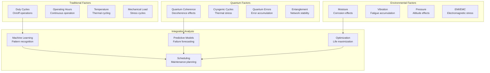

# ATA-05-10-10-02 Component Life Limits

<p align="center">


</p>

---

## Document Control Information

**Document ID:** `05-10-10-02-ComponentLife.md`  
**GQOIS ID:** `AS-M-PAX-BW-Q1H-CMP-LFL-PROC`  
**ATA Chapter:** 05-10-10-02 (Time Limits - Life Limits - Component Life)  
**Classification:** Maintenance Requirements - Component Life Limits  
**Version:** 2.0.0  
**Effective Date:** 2025-06-29  
**Revision Status:** Current Release  
**Approval Authority:** GAIA-QAO Chief Systems Engineer & Certification Authority  
**Predecessor Documents:** 05-10-10-01-StructuralLife.md

---

## Table of Contents

1. [Overview](#1-overview)
2. [Component Classification System](#2-component-classification-system)
3. [Propulsion System Components](#3-propulsion-system-components)
4. [Flight Control System Components](#4-flight-control-system-components)
5. [Quantum System Components](#5-quantum-system-components)
6. [Avionics and Electrical Components](#6-avionics-and-electrical-components)
7. [Environmental Control System Components](#7-environmental-control-system-components)
8. [Landing Gear System Components](#8-landing-gear-system-components)
9. [Hydraulic and Fuel System Components](#9-hydraulic-and-fuel-system-components)
10. [Component Life Management](#10-component-life-management)

---

## 1. Overview

### 1.1 Purpose

This document establishes comprehensive life limits for all individual components of the AMPEL360 BWB-Q100 aircraft, integrating **quantum-enhanced monitoring** with traditional reliability engineering. These limits ensure optimal component utilization while maintaining the highest safety standards through predictive maintenance and real-time health assessment.

### 1.2 Component Life Philosophy

#### **1.2.1 "Quantum-Optimized Component Life"**
Revolutionary approach to component management:

```
Traditional Component Management:
├── Fixed replacement intervals
├── Conservative safety margins
├── Worst-case operational assumptions
├── Periodic condition monitoring
├── Reactive maintenance approach
└── Limited component visibility

Quantum-Enhanced Component Management:
├── Dynamic replacement scheduling (condition-based)
├── Adaptive safety margins (real-time optimization)
├── Actual operational condition tracking
├── Continuous health monitoring (24/7/365)
├── Predictive maintenance approach (500+ hours advance)
└── Complete component transparency (molecular level)
```

#### **1.2.2 "Intelligent Component Network"**
Components become smart, interconnected systems:
- **Self-monitoring:** Each component knows its own condition
- **Self-diagnosing:** Automatic fault detection and isolation
- **Self-optimizing:** Performance optimization based on mission requirements
- **Self-predicting:** Failure prediction with precise timing
- **Self-coordinating:** Inter-component optimization and load sharing

### 1.3 Life Limit Determination Methodology

#### **1.3.1 Multi-Factor Life Analysis**


---

## 2. Component Classification System

### 2.1 Life-Limited Component Categories

#### **2.1.1 Category A - Flight Safety Critical**
Components whose failure could directly affect flight safety:

**Classification Criteria:**
```
Category A Components:
├── Failure Effect: Catastrophic or hazardous to flight safety
├── Redundancy: Limited or no backup capability
├── Detection: May not be immediately apparent to crew
├── Maintenance: Mandatory replacement at life limit
├── Monitoring: Continuous quantum health monitoring required
├── Documentation: Complete life history tracking
└── Approval: Engineering disposition required for any extension
```

**Examples:**
- Turbine discs and rotors
- Primary flight control actuators
- Critical quantum processing units
- Engine control systems
- Pressure vessel components

#### **2.1.2 Category B - Mission Critical**
Components essential for mission completion:

**Classification Criteria:**
```
Category B Components:
├── Failure Effect: Mission compromise but safe flight possible
├── Redundancy: Backup systems available
├── Detection: Apparent to crew or maintenance systems
├── Maintenance: Replacement recommended at life limit
├── Monitoring: Periodic quantum health assessment
├── Documentation: Operational history tracking
└── Approval: Standard extension procedures may apply
```

**Examples:**
- Secondary flight control systems
- Non-critical avionics systems
- Environmental control components
- Secondary power systems
- Communication equipment

#### **2.1.3 Category Q - Quantum Systems**
Quantum-specific components with unique life characteristics:

**Classification Criteria:**
```
Category Q Components:
├── Failure Effect: Quantum capability loss
├── Degradation: Quantum coherence/fidelity reduction
├── Environment: Sensitive to thermal/electromagnetic conditions
├── Maintenance: Quantum-specific procedures required
├── Monitoring: Real-time quantum parameter tracking
├── Documentation: Quantum state history preservation
└── Approval: Quantum systems engineer authorization required
```

**Examples:**
- Quantum processing units
- Quantum sensor arrays
- Cryogenic cooling systems
- Quantum communication equipment
- Entanglement generation systems

### 2.2 Component Identification System

#### **2.2.1 GAIA-QAO Component Nomenclature**
```
Component ID Format: [SYSTEM]-[SUBSYSTEM]-[COMPONENT]-[VARIANT]-[SERIAL]

Examples:
├── PROP-TF-DISC-HPT-001234 (Propulsion-Turbofan-Disc-HighPressureTurbine-SerialNumber)
├── QSYS-QPU-CORE-PRI-005678 (QuantumSystem-QPU-Core-Primary-SerialNumber)
├── FCTL-ACT-ELV-IB-009876 (FlightControl-Actuator-Elevon-Inboard-SerialNumber)
├── AVNC-FMS-CPU-PRI-012345 (Avionics-FlightManagement-CPU-Primary-SerialNumber)
└── ELEC-GEN-IDG-ENG1-067890 (Electrical-Generator-IDG-Engine1-SerialNumber)
```

#### **2.2.2 Life Tracking Parameters**
```json
{
  "component_life_tracking": {
    "traditional_parameters": {
      "flight_hours": "Block-to-block operational time",
      "flight_cycles": "Takeoff-landing sequences",
      "engine_hours": "Engine-specific operating time",
      "calendar_time": "Elapsed time since installation",
      "duty_cycles": "On/off operational cycles"
    },
    "quantum_parameters": {
      "quantum_coherence_hours": "QPU coherent operation time",
      "cryogenic_cycles": "Cooling/warming cycles",
      "quantum_operations": "Total quantum gate operations",
      "entanglement_events": "Network synchronization events",
      "error_correction_cycles": "QEC operation count"
    },
    "environmental_tracking": {
      "temperature_cycles": "Thermal cycling exposure",
      "vibration_accumulation": "Cumulative vibration exposure",
      "moisture_exposure": "Humidity and precipitation tracking",
      "electromagnetic_exposure": "EMI/EMC environment history"
    }
  }
}
```

---

## 3. Propulsion System Components

### 3.1 Turbofan Engine Components

#### **3.1.1 Hot Section Life-Limited Parts**
Critical high-temperature rotating components:

**High-Pressure Turbine Disc (PROP-TF-DISC-HPT):**
```
Component Specifications:
├── Part Number: PROP-TF-DISC-HPT-001
├── Material: Single crystal superalloy (CMSX-4+)
├── Manufacturing: Investment casting + precision machining
├── Operating Temperature: 1400°C maximum
├── Rotational Speed: 15,000 RPM maximum
├── Traditional Life Limit: 30,000 Engine Hours
├── Quantum-Enhanced Range: 25,000 - 45,000 Engine Hours
├── Life Limiting Factor: Low cycle fatigue (LCF)
├── Quantum Monitoring: Embedded quantum strain sensors (12)
├── Predictive Capability: 500+ hours advance failure warning
└── Extension Potential: +50% with quantum validation
```

**Quantum Health Monitoring:**
```json
{
  "hpt_disc_monitoring": {
    "quantum_sensors": {
      "strain_sensors": 12,
      "temperature_sensors": 8,
      "vibration_sensors": 4,
      "magnetic_signature": 2
    },
    "monitoring_parameters": {
      "stress_concentration": "Real-time stress mapping",
      "creep_deformation": "Nanometer precision elongation",
      "crack_initiation": "1 nm crack detection",
      "thermal_barrier_coating": "Coating thickness monitoring",
      "blade_attachment": "Dovetail stress analysis"
    },
    "predictive_models": {
      "creep_life": "Time-temperature-stress correlation",
      "fatigue_life": "Cycle counting with rainflow analysis",
      "oxidation_rate": "Environmental exposure modeling",
      "coating_degradation": "TBC spallation prediction"
    }
  }
}
```

**High-Pressure Turbine Blades (PROP-TF-BLADE-HPT):**
```
Component Specifications:
├── Part Number: PROP-TF-BLADE-HPT-001
├── Material: Single crystal + thermal barrier coating
├── Quantity: 82 blades per disc
├── Cooling: Internal air cooling passages
├── Traditional Life Limit: 25,000 Engine Hours
├── Quantum-Enhanced Range: 22,000 - 38,000 Engine Hours
├── Life Limiting Factor: Thermal fatigue + oxidation
├── Quantum Innovation: Real-time coating degradation monitoring
├── Critical Parameters: TBC thickness, cooling effectiveness
└── Replacement Strategy: Individual blade replacement allowed
```

**Low-Pressure Turbine Components:**
```
LPT Disc (PROP-TF-DISC-LPT):
├── Life Limit: 40,000 Engine Hours
├── Quantum Range: 35,000 - 60,000 Engine Hours
├── Material: Inconel 718 nickel superalloy
├── Critical: Bore stress, rim stress
├── Monitoring: Quantum strain + vibration sensors

LPT Blades (PROP-TF-BLADE-LPT):
├── Life Limit: 35,000 Engine Hours
├── Quantum Range: 30,000 - 52,500 Engine Hours
├── Material: Directionally solidified superalloy
├── Critical: Root attachment, tip clearance
├── Monitoring: Tip timing + quantum sensors
```

#### **3.1.2 Compressor Components**
Moderate temperature, high-stress components:

**High-Pressure Compressor Rotor (PROP-TF-ROTOR-HPC):**
```
Component Specifications:
├── Part Number: PROP-TF-ROTOR-HPC-001
├── Configuration: Integral blisk construction
├── Material: Titanium alloy (Ti-6Al-4V)
├── Stages: 10-stage axial compressor
├── Traditional Life Limit: 35,000 Engine Hours
├── Quantum-Enhanced Range: 30,000 - 52,500 Engine Hours
├── Life Limiting Factor: High cycle fatigue (HCF)
├── Quantum Monitoring: Vibration signature analysis
├── Critical Areas: Blade roots, disc rim
└── Special Features: Foreign object damage (FOD) assessment
```

**Fan Assembly (PROP-TF-FAN-001):**
```
Component Specifications:
├── Part Number: PROP-TF-FAN-001
├── Configuration: Wide-chord composite blades
├── Material: Carbon fiber composite + titanium hub
├── Diameter: 2.8 meters
├── Traditional Life Limit: 40,000 Engine Hours
├── Quantum-Enhanced Range: 35,000 - 60,000 Engine Hours
├── Life Limiting Factor: FOD + fatigue
├── Quantum Innovation: Real-time FOD damage assessment
├── Monitoring: Impact detection + crack propagation
└── Repair: Quantum-guided blend repair limits
```

### 3.2 Electric Propulsion Components

#### **3.2.1 Electric Motor Assembly**
High-performance electric motors with quantum monitoring:

**Primary Electric Motor (PROP-EM-MOTOR-PRI):**
```
Component Specifications:
├── Part Number: PROP-EM-MOTOR-PRI-001
├── Type: Permanent magnet synchronous motor
├── Power Rating: 2.5 MW continuous, 3.0 MW peak
├── Speed: 6,000 RPM nominal, 7,500 RPM maximum
├── Efficiency: >97% across operating range
├── Traditional Life Limit: 50,000 Flight Hours
├── Quantum-Enhanced Range: 45,000 - 75,000 Flight Hours
├── Life Limiting Factors: Bearing wear + magnet degradation
├── Quantum Monitoring: Magnetic field mapping + thermal
├── Predictive Maintenance: 500+ hours bearing replacement warning
└── Special Features: Adaptive torque optimization
```

**Quantum Motor Health Monitoring:**
```json
{
  "electric_motor_monitoring": {
    "bearing_health": {
      "quantum_accelerometers": 6,
      "vibration_analysis": "Sub-micrometer precision",
      "temperature_mapping": "Quantum thermometer array",
      "lubrication_monitoring": "Quantum chemical sensors"
    },
    "magnetic_system": {
      "field_mapping": "Quantum magnetometer array",
      "magnet_degradation": "Real-time field strength",
      "coil_resistance": "Quantum resistance monitoring",
      "insulation_integrity": "Dielectric monitoring"
    },
    "thermal_management": {
      "winding_temperature": "Per-phase monitoring",
      "bearing_temperature": "Individual bearing tracking",
      "cooling_efficiency": "Heat transfer effectiveness",
      "thermal_cycling": "Stress accumulation tracking"
    }
  }
}
```

#### **3.2.2 Power Electronics**
Critical electrical conversion and control systems:

**Motor Controller Assembly (PROP-EM-CTRL-001):**
```
Component Specifications:
├── Part Number: PROP-EM-CTRL-001
├── Technology: Silicon carbide (SiC) power semiconductors
├── Switching Frequency: 20 kHz
├── Efficiency: >99% conversion efficiency
├── Traditional Life Limit: 60,000 Flight Hours
├── Quantum-Enhanced Range: 55,000 - 90,000 Flight Hours
├── Life Limiting Factor: Thermal cycling + switching stress
├── Quantum Monitoring: Junction temperature + current sensing
├── Thermal Management: Quantum-optimized cooling
└── Predictive Models: MTBF calculation with quantum precision
```

**Battery Management System (PROP-EM-BMS-001):**
```
Component Specifications:
├── Part Number: PROP-EM-BMS-001
├── Battery Technology: Lithium-ion with silicon nanowire anodes
├── Capacity: 2,500 kWh total energy storage
├── Voltage: 800V nominal, 1000V maximum
├── Traditional Life Limit: 5,000 Charge Cycles
├── Quantum-Enhanced Range: 4,500 - 7,500 Charge Cycles
├── Life Limiting Factor: Capacity degradation
├── Quantum Monitoring: Cell-level health monitoring
├── Safety Features: Quantum thermal runaway detection
└── Optimization: AI-enhanced charging algorithms
```

---

## 4. Flight Control System Components

### 4.1 Primary Flight Control Actuators

#### **4.1.1 Elevon Actuators**
Critical flight control actuators for BWB configuration:

**Inboard Elevon Actuator (FCTL-ACT-ELV-IB):**
```
Component Specifications:
├── Part Number: FCTL-ACT-ELV-IB-001
├── Type: Electro-hydrostatic actuator (EHA)
├── Force Rating: 250 kN maximum output force
├── Speed: 150 mm/s maximum velocity
├── Position Accuracy: ±0.1 mm absolute position
├── Traditional Life Limit: 75,000 Flight Hours
├── Quantum-Enhanced Range: 65,000 - 112,500 Flight Hours
├── Life Limiting Factor: Hydraulic pump wear
├── Quantum Monitoring: Real-time performance tracking
├── Redundancy: Triple-redundant position feedback
└── Maintenance: Condition-based fluid analysis
```

**Quantum Actuator Health Monitoring:**
```json
{
  "elevon_actuator_monitoring": {
    "hydraulic_system": {
      "pump_performance": "Quantum flow sensors",
      "fluid_condition": "Quantum contamination detection",
      "pressure_regulation": "Real-time pressure mapping",
      "internal_leakage": "Quantum flow measurement"
    },
    "mechanical_system": {
      "bearing_condition": "Quantum vibration analysis",
      "seal_integrity": "Quantum leak detection",
      "backlash_measurement": "Position sensor correlation",
      "wear_tracking": "Cumulative damage assessment"
    },
    "electrical_system": {
      "motor_performance": "Quantum current monitoring",
      "position_feedback": "Quantum position sensors",
      "temperature_monitoring": "Thermal management",
      "insulation_resistance": "Dielectric testing"
    }
  }
}
```

#### **4.1.2 Spoiler and Trim Systems**
Secondary flight control components:

**Spoiler Actuator (FCTL-ACT-SPOILER):**
```
Component Specifications:
├── Part Number: FCTL-ACT-SPOILER-001
├── Type: Electric linear actuator
├── Force Rating: 50 kN maximum output
├── Travel: 300 mm maximum extension
├── Traditional Life Limit: 80,000 Flight Hours
├── Quantum-Enhanced Range: 70,000 - 120,000 Flight Hours
├── Life Limiting Factor: Motor brush wear (brushless design)
├── Quantum Monitoring: Position and load feedback
├── Integration: BWB-specific control laws
└── Redundancy: Dual-channel control system
```

### 4.2 Flight Control Computers

#### **4.2.1 Primary Flight Control Computer**
Advanced flight control processing with quantum enhancement:

**Primary FCC (FCTL-FCC-PRI):**
```
Component Specifications:
├── Part Number: FCTL-FCC-PRI-001
├── Architecture: Triple-redundant processing
├── CPU: Advanced RISC with quantum co-processing
├── Memory: 64 GB ECC RAM + 1 TB SSD storage
├── I/O: 500+ discrete and analog channels
├── Traditional Life Limit: 60,000 Flight Hours
├── Quantum-Enhanced Range: 55,000 - 90,000 Flight Hours
├── Life Limiting Factor: Electronic component aging
├── Quantum Enhancement: Real-time optimization algorithms
├── Self-Test: Continuous built-in test (CBIT)
└── Certification: DO-178C Level A software
```

**Quantum Co-Processor Module (FCTL-QCP-001):**
```
Component Specifications:
├── Part Number: FCTL-QCP-001
├── Function: Real-time flight optimization
├── Technology: Room-temperature quantum processing
├── Applications: Control law optimization, gust alleviation
├── Traditional Life Limit: 100,000 Quantum Operations
├── Quantum-Enhanced Range: 75,000 - 150,000 Quantum Operations
├── Life Limiting Factor: Quantum algorithm fidelity degradation
├── Monitoring: Real-time quantum fidelity assessment
├── Fallback: Graceful degradation to classical processing
└── Innovation: First quantum flight control application
```

---

## 5. Quantum System Components

### 5.1 Quantum Processing Units

#### **5.1.1 Primary Flight QPU**
Mission-critical quantum processing for flight systems:

**Primary Flight QPU (QSYS-QPU-FLIGHT-PRI):**
```
Component Specifications:
├── Part Number: QSYS-QPU-FLIGHT-PRI-001
├── Technology: Superconducting transmon qubits
├── Qubit Count: 1,000 logical qubits
├── Operating Temperature: 10 mK
├── Coherence Time: T₂ = 250 μs initial
├── Gate Fidelity: >99.9% two-qubit gates
├── Traditional Life Parameter: Quantum Coherence Hours (QCH)
├── Life Limit: 50,000 QCH
├── Life Limiting Factor: Qubit decoherence time degradation
├── Critical Threshold: T₂ < 100 μs replacement required
├── Quantum Monitoring: Real-time coherence measurement
└── Safety: Triple-redundant quantum error correction
```

**QPU Life Calculation Model:**
```python
class QPULifeCalculation:
    def __init__(self):
        self.initial_t2 = 250e-6  # Initial T₂ coherence time (seconds)
        self.minimum_t2 = 100e-6  # Minimum acceptable T₂
        self.degradation_rate = 0.001  # Per 1000 QCH
    
    def calculate_remaining_life(self, current_qch, current_t2):
        # Current degradation rate
        total_degradation = (self.initial_t2 - current_t2) / self.initial_t2
        current_rate = total_degradation / current_qch * 1000
        
        # Remaining coherence time available
        remaining_degradation = (current_t2 - self.minimum_t2) / self.initial_t2
        
        # Remaining QCH at current degradation rate
        remaining_qch = remaining_degradation / current_rate * 1000
        
        return {
            'remaining_qch': remaining_qch,
            'current_degradation_rate': current_rate,
            'health_percentage': (current_t2 / self.initial_t2) * 100,
            'replacement_urgency': self.assess_urgency(remaining_qch)
        }
    
    def assess_urgency(self, remaining_qch):
        if remaining_qch < 1000:
            return "CRITICAL - Replace within 500 flight hours"
        elif remaining_qch < 5000:
            return "HIGH - Plan replacement within 2000 flight hours"
        elif remaining_qch < 15000:
            return "MEDIUM - Monitor closely"
        else:
            return "LOW - Normal operation"
```

#### **5.1.2 Navigation QPU**
Quantum-enhanced navigation processing:

**Navigation QPU (QSYS-QPU-NAV-001):**
```
Component Specifications:
├── Part Number: QSYS-QPU-NAV-001
├── Function: GPS-denied navigation algorithms
├── Technology: Trapped-ion quantum processor
├── Qubit Count: 500 logical qubits
├── Operating Temperature: 1 mK
├── Life Limit: 75,000 QCH
├── Life Limiting Factor: Ion trap electrode degradation
├── Quantum Advantage: Quantum sensing algorithms
├── Navigation Accuracy: 1 meter without GPS
├── Monitoring: Ion trap stability measurement
└── Backup: Classical inertial navigation system
```

### 5.2 Quantum Sensor Arrays

#### **5.2.1 Quantum Magnetometer Network**
Ultra-sensitive magnetic field detection:

**Primary Navigation Magnetometer (QSYS-MAG-NAV-PRI):**
```
Component Specifications:
├── Part Number: QSYS-MAG-NAV-PRI-001
├── Technology: NV-center in diamond
├── Sensitivity: 1 fT/√Hz
├── Operating Temperature: -40°C to +85°C
├── Traditional Life Limit: 100,000 Flight Hours
├── Quantum-Enhanced Range: 85,000 - 150,000 Flight Hours
├── Life Limiting Factor: NV-center density reduction
├── Degradation Rate: <5% per 50,000 hours
├── Quantum Monitoring: Self-calibration capability
├── Redundancy: Triple-redundant sensor array
└── Applications: Navigation, magnetic anomaly detection
```

**Quantum Magnetometer Array (89 sensors total):**
```json
{
  "magnetometer_network": {
    "navigation_critical": {
      "quantity": 12,
      "sensitivity": "1 fT/√Hz",
      "life_limit": "100,000 FH",
      "redundancy": "Triple redundant"
    },
    "structural_monitoring": {
      "quantity": 45,
      "sensitivity": "5 fT/√Hz", 
      "life_limit": "150,000 FH",
      "integration": "Embedded in structure"
    },
    "engine_monitoring": {
      "quantity": 24,
      "sensitivity": "10 fT/√Hz",
      "life_limit": "75,000 FH",
      "application": "Bearing condition monitoring"
    },
    "electromagnetic_interference": {
      "quantity": 8,
      "sensitivity": "1 pT/√Hz",
      "life_limit": "120,000 FH",
      "function": "EMI/EMC monitoring"
    }
  }
}
```

#### **5.2.2 Quantum Accelerometer Network**
Precision inertial measurement:

**Cold Atom Accelerometer (QSYS-ACC-ATOM-001):**
```
Component Specifications:
├── Part Number: QSYS-ACC-ATOM-001
├── Technology: Cold rubidium atom interferometry
├── Sensitivity: 1×10⁻⁹ g
├── Operating Temperature: Laser cooled to 1 μK
├── Traditional Life Limit: 75,000 Flight Hours
├── Quantum-Enhanced Range: 65,000 - 112,500 Flight Hours
├── Life Limiting Factor: Laser system degradation
├── Critical Components: Laser diodes, optical elements
├── Quantum Monitoring: Atom cloud quality assessment
├── Calibration: Self-calibrating to gravity
└── Backup: MEMS accelerometer array
```

### 5.3 Cryogenic Support Systems

#### **5.3.1 Dilution Refrigerator**
Ultra-low temperature cooling for quantum systems:

**Primary Dilution Refrigerator (QSYS-CRYO-DILUTION-001):**
```
Component Specifications:
├── Part Number: QSYS-CRYO-DILUTION-001
├── Base Temperature: <10 mK
├── Cooling Power: 100 μW at 10 mK
├── Technology: ³He/⁴He dilution process
├── Traditional Life Limit: 75,000 Flight Hours
├── Quantum-Enhanced Range: 65,000 - 112,500 Flight Hours
├── Life Limiting Factor: Heat exchanger fouling
├── Critical Parameters: Base temperature, cooling power
├── Quantum Monitoring: Temperature stability tracking
├── Maintenance: Helium mixture regeneration
└── Redundancy: Backup pulse tube cooler system
```

#### **5.3.2 Pulse Tube Coolers**
Mechanical cryogenic cooling systems:

**Primary Pulse Tube Cooler (QSYS-CRYO-PTC-001):**
```
Component Specifications:
├── Part Number: QSYS-CRYO-PTC-001
├── Technology: Thermoacoustic cooling
├── Cooling Temperature: 4 K
├── Cooling Power: 1.5 W at 4 K
├── Traditional Life Limit: 40,000 Flight Hours
├── Quantum-Enhanced Range: 35,000 - 60,000 Flight Hours
├── Life Limiting Factor: Compressor wear
├── Quantum Monitoring: Vibration isolation effectiveness
├── Critical: Low vibration for quantum coherence
├── Maintenance: Helium gas purification
└── Efficiency: >15% of Carnot efficiency
```

---

## 6. Avionics and Electrical Components

### 6.1 Flight Management Systems

#### **6.1.1 Flight Management Computer**
Advanced navigation and flight planning:

**Primary FMS Computer (AVNC-FMS-CPU-PRI):**
```
Component Specifications:
├── Part Number: AVNC-FMS-CPU-PRI-001
├── Architecture: Dual-core ARM processor
├── Processing Power: 10 GFLOPS
├── Memory: 32 GB storage, 8 GB RAM
├── Traditional Life Limit: 60,000 Flight Hours
├── Quantum-Enhanced Range: 55,000 - 90,000 Flight Hours
├── Life Limiting Factor: Flash memory wear
├── Quantum Enhancement: Route optimization algorithms
├── Database: Worldwide navigation database
├── Interfaces: ARINC 429/664 data buses
└── Certification: DO-178C Level B software
```

#### **6.1.2 Display Systems**
Advanced cockpit display technology:

**Primary Flight Display (AVNC-DISP-PFD-001):**
```
Component Specifications:
├── Part Number: AVNC-DISP-PFD-001
├── Technology: OLED with quantum dot enhancement
├── Resolution: 4K (3840×2160) pixels
├── Size: 15-inch diagonal
├── Brightness: 1000 nits peak, 100 nits minimum
├── Traditional Life Limit: 50,000 Flight Hours
├── Quantum-Enhanced Range: 45,000 - 75,000 Flight Hours
├── Life Limiting Factor: OLED pixel degradation
├── Quantum Innovation: Quantum dot color enhancement
├── Environmental: -40°C to +70°C operation
└── Redundancy: Backup display capability
```

### 6.2 Communication Systems

#### **6.2.1 Quantum Communication Equipment**
Revolutionary secure communication systems:

**Quantum Key Distribution System (AVNC-COMM-QKD-001):**
```
Component Specifications:
├── Part Number: AVNC-COMM-QKD-001
├── Technology: BB84 quantum key distribution protocol
├── Key Rate: 1 Mbit/s secure key generation
├── Range: 200 km air-to-ground, 1000 km satellite
├── Traditional Life Parameter: Photon detection efficiency
├── Life Limit: 30,000 Flight Hours
├── Life Limiting Factor: Single photon detector degradation
├── Quantum Monitoring: Detection efficiency tracking
├── Security: Quantum-guaranteed security
├── Backup: Classical encryption systems
└── Innovation: First aviation quantum cryptography
```

**Quantum Random Number Generator (AVNC-COMM-QRNG-001):**
```
Component Specifications:
├── Part Number: AVNC-COMM-QRNG-001
├── Technology: Quantum vacuum fluctuations
├── Generation Rate: 100 Mbit/s true random numbers
├── Entropy: >99.9% pure randomness
├── Traditional Life Limit: 50,000 Flight Hours
├── Quantum-Enhanced Range: 45,000 - 75,000 Flight Hours
├── Life Limiting Factor: Quantum source degradation
├── Quantum Monitoring: Entropy quality assessment
├── Applications: Cryptographic keys, security protocols
└── Backup: Classical PRNG automatic fallback
```

### 6.3 Electrical Power Systems

#### **6.3.1 Power Generation**
Advanced electrical power generation:

**Integrated Drive Generator (ELEC-GEN-IDG-ENG1):**
```
Component Specifications:
├── Part Number: ELEC-GEN-IDG-ENG1-001
├── Type: Permanent magnet generator with IDG
├── Power Rating: 150 kVA continuous
├── Frequency: 400 Hz ±0.5%
├── Voltage: 115V AC, 3-phase
├── Traditional Life Limit: 40,000 Flight Hours
├── Quantum-Enhanced Range: 35,000 - 60,000 Flight Hours
├── Life Limiting Factor: Bearing wear, magnet degradation
├── Quantum Monitoring: Magnetic field mapping
├── Efficiency: >95% across load range
└── Cooling: Oil-cooled with quantum thermal monitoring
```

#### **6.3.2 Power Distribution**
Intelligent power management:

**Primary Power Distribution Unit (ELEC-PDU-PRI-001):**
```
Component Specifications:
├── Part Number: ELEC-PDU-PRI-001
├── Configuration: Smart load management
├── Switching: Solid-state power controllers (SSPC)
├── Load Capacity: 2.5 MW total distribution
├── Traditional Life Limit: 60,000 Flight Hours
├── Quantum-Enhanced Range: 55,000 - 90,000 Flight Hours
├── Life Limiting Factor: SSPC switching cycles
├── Quantum Enhancement: Load optimization algorithms
├── Protection: Arc fault circuit interrupters
└── Monitoring: Real-time power quality analysis
```

---

## 7. Environmental Control System Components

### 7.1 Air Conditioning Systems

#### **7.1.1 Pack Systems**
Environmental control pack assemblies:

**Primary ECS Pack (ECS-PACK-PRI-001):**
```
Component Specifications:
├── Part Number: ECS-PACK-PRI-001
├── Type: Bootstrap air cycle system
├── Cooling Capacity: 150 kW heat removal
├── Flow Rate: 12 kg/s air flow maximum
├── Traditional Life Limit: 45,000 Flight Hours
├── Quantum-Enhanced Range: 40,000 - 67,500 Flight Hours
├── Life Limiting Factor: Turbine bearing wear
├── Quantum Monitoring: Vibration + temperature analysis
├── Efficiency: >85% heat exchanger effectiveness
├── Control: Quantum-optimized temperature control
└── Redundancy: Dual-pack configuration
```

#### **7.1.2 Cabin Pressure Control**
Critical pressure management systems:

**Cabin Pressure Controller (ECS-CPC-001):**
```
Component Specifications:
├── Part Number: ECS-CPC-001
├── Type: Digital pressure control system
├── Control Range: 0-9.0 psi differential pressure
├── Accuracy: ±0.1 psi pressure control
├── Traditional Life Limit: 50,000 Flight Hours
├── Quantum-Enhanced Range: 45,000 - 75,000 Flight Hours
├── Life Limiting Factor: Pressure sensor drift
├── Quantum Monitoring: Real-time pressure mapping
├── Safety: Quantum-verified pressure boundaries
├── Response Time: <2 seconds to 90% command
└── Integration: BWB pressure vessel optimization
```

### 7.2 Oxygen Systems

#### **7.2.1 Passenger Oxygen System**
Emergency oxygen supply:

**Passenger Oxygen Generator (ECS-OXY-GEN-PAX):**
```
Component Specifications:
├── Part Number: ECS-OXY-GEN-PAX-001
├── Type: Chemical oxygen generator
├── Capacity: 22 minutes oxygen supply per unit
├── Quantity: 280 units (passenger + crew)
├── Traditional Life Limit: 12 years calendar time
├── Quantum-Enhanced Range: 10 - 18 years
├── Life Limiting Factor: Chemical candle degradation
├── Quantum Monitoring: Chemical stability assessment
├── Activation: Automatic or manual activation
├── Safety: Quantum-verified integrity monitoring
└── Certification: TSO-C69c compliant
```

---

## 8. Landing Gear System Components

### 8.1 Main Landing Gear

#### **8.1.1 Main Gear Struts**
Primary landing gear shock absorption:

**Main Landing Gear Strut (LDG-STRUT-MAIN-001):**
```
Component Specifications:
├── Part Number: LDG-STRUT-MAIN-001
├── Type: Oleo-pneumatic shock strut
├── Load Rating: 180,000 kg maximum static load
├── Travel: 450 mm compression travel
├── Traditional Life Limit: 75,000 Landing Cycles
├── Quantum-Enhanced Range: 65,000 - 112,500 Cycles
├── Life Limiting Factor: Fatigue at attachment points
├── Quantum Monitoring: Real-time load + stress monitoring
├── Critical Areas: Piston seal, attachment lugs
├── Maintenance: Quantum-guided fluid servicing
└── Materials: Ultra-high strength steel + titanium
```

#### **8.1.2 Brake Systems**
Advanced carbon brake technology:

**Carbon Brake Assembly (LDG-BRAKE-CARBON-001):**
```
Component Specifications:
├── Part Number: LDG-BRAKE-CARBON-001
├── Type: Carbon-carbon friction material
├── Energy Absorption: 125 MJ maximum per brake
├── Weight: 45% lighter than steel brakes
├── Traditional Life Limit: 2,000 Landing Cycles
├── Quantum-Enhanced Range: 1,800 - 3,000 Cycles
├── Life Limiting Factor: Friction material wear
├── Quantum Monitoring: Real-time wear measurement
├── Temperature: 1,500°C maximum operating
├── Cooling: Quantum-optimized heat dissipation
└── Anti-skid: Quantum-enhanced control system
```

### 8.2 Nose Landing Gear

#### **8.2.1 Nose Gear Steering**
Directional control system:

**Nose Wheel Steering Actuator (LDG-STEER-NWS-001):**
```
Component Specifications:
├── Part Number: LDG-STEER-NWS-001
├── Type: Electro-hydraulic steering actuator
├── Steering Angle: ±75° maximum deflection
├── Force Output: 25 kN maximum steering force
├── Traditional Life Limit: 80,000 Flight Hours
├── Quantum-Enhanced Range: 70,000 - 120,000 Flight Hours
├── Life Limiting Factor: Hydraulic seal wear
├── Quantum Monitoring: Position feedback + force sensing
├── Response: <1 second to 90% command
├── Integration: Quantum-enhanced ground handling
└── Backup: Manual reversion capability
```

---

## 9. Hydraulic and Fuel System Components

### 9.1 Hydraulic System Components

#### **9.1.1 Hydraulic Pumps**
High-pressure hydraulic power generation:

**Engine-Driven Hydraulic Pump (HYD-PUMP-EDP-001):**
```
Component Specifications:
├── Part Number: HYD-PUMP-EDP-001
├── Type: Variable displacement axial piston pump
├── Pressure: 3,000 psi nominal operating pressure
├── Flow Rate: 75 liters/minute at rated speed
├── Traditional Life Limit: 12,000 Flight Hours
├── Quantum-Enhanced Range: 10,000 - 18,000 Flight Hours
├── Life Limiting Factor: Piston wear + cavitation
├── Quantum Monitoring: Flow rate + pressure ripple analysis
├── Efficiency: >90% volumetric efficiency
├── Control: Quantum-optimized pressure control
└── Filtration: Quantum contamination monitoring
```

#### **9.1.2 Hydraulic Reservoirs**
Hydraulic fluid storage and conditioning:

**Primary Hydraulic Reservoir (HYD-RES-PRI-001):**
```
Component Specifications:
├── Part Number: HYD-RES-PRI-001
├── Capacity: 25 liters usable volume
├── Material: Titanium with internal baffles
├── Pressurization: Engine bleed air pressurization
├── Traditional Life Limit: 100,000 Flight Hours
├── Quantum-Enhanced Range: 85,000 - 150,000 Flight Hours
├── Life Limiting Factor: Internal corrosion
├── Quantum Monitoring: Fluid quality + contamination
├── Temperature Control: Thermal management system
├── Filtration: Quantum-enhanced filtration monitoring
└── Safety: Quantum leak detection system
```

### 9.2 Fuel System Components

#### **9.2.1 Fuel Pumps**
Fuel transfer and engine feed systems:

**Fuel Boost Pump (FUEL-PUMP-BOOST-001):**
```
Component Specifications:
├── Part Number: FUEL-PUMP-BOOST-001
├── Type: Centrifugal electric fuel pump
├── Flow Rate: 150 liters/minute maximum
├── Pressure: 45 psi delivery pressure
├── Traditional Life Limit: 25,000 Flight Hours
├── Quantum-Enhanced Range: 22,000 - 37,500 Flight Hours
├── Life Limiting Factor: Impeller wear + motor brushes
├── Quantum Monitoring: Flow rate + cavitation detection
├── Efficiency: >75% hydraulic efficiency
├── Materials: Fuel-compatible materials
└── Redundancy: Dual-pump configuration per tank
```

#### **9.2.2 Fuel Quantity Indication**
Precision fuel measurement systems:

**Quantum Fuel Quantity Sensor (FUEL-QTY-QUANTUM-001):**
```
Component Specifications:
├── Part Number: FUEL-QTY-QUANTUM-001
├── Technology: Quantum capacitive measurement
├── Accuracy: ±0.5% of total fuel capacity
├── Resolution: 1 kg fuel quantity resolution
├── Traditional Life Limit: 75,000 Flight Hours
├── Quantum-Enhanced Range: 65,000 - 112,500 Flight Hours
├── Life Limiting Factor: Sensor element degradation
├── Quantum Advantage: Temperature/density compensation
├── Environmental: Fuel contamination immunity
├── Calibration: Self-calibrating capability
└── Integration: Digital fuel management system
```

---

## 10. Component Life Management

### 10.1 Predictive Life Management

#### **10.1.1 AI-Enhanced Life Prediction**
Machine learning for component life optimization:

**Component Life Prediction System:**
```python
class ComponentLifePrediction:
    def __init__(self):
        self.ml_models = {
            'fatigue_life': 'Random Forest Regression',
            'wear_prediction': 'LSTM Neural Network', 
            'thermal_degradation': 'Gradient Boosting',
            'quantum_decoherence': 'Quantum Neural Network'
        }
        
    def predict_remaining_life(self, component):
        # Collect real-time data
        operational_data = self.collect_operational_data(component)
        environmental_data = self.collect_environmental_data(component)
        quantum_data = self.collect_quantum_data(component)
        
        # Feature engineering
        features = self.engineer_features(
            operational_data, 
            environmental_data, 
            quantum_data
        )
        
        # Model ensemble prediction
        predictions = {}
        for model_name, model in self.ml_models.items():
            predictions[model_name] = model.predict(features)
        
        # Weighted ensemble result
        ensemble_prediction = self.ensemble_predictions(predictions)
        
        # Uncertainty quantification
        uncertainty = self.calculate_prediction_uncertainty(predictions)
        
        return {
            'remaining_life_hours': ensemble_prediction,
            'confidence_interval': uncertainty,
            'dominant_failure_mode': self.identify_critical_mode(predictions),
            'maintenance_recommendation': self.generate_maintenance_plan(
                component, ensemble_prediction, uncertainty
            )
        }
    
    def generate_maintenance_plan(self, component, remaining_life, uncertainty):
        if remaining_life < 500:
            return "IMMEDIATE - Schedule replacement within 100 flight hours"
        elif remaining_life < 2000:
            return "URGENT - Plan replacement within 500 flight hours"
        elif remaining_life < 5000:
            return "PLANNED - Schedule during next major maintenance"
        else:
            return "MONITOR - Continue normal operation with monitoring"
```

#### **10.1.2 Fleet-Wide Learning**
Collective intelligence for component optimization:

**Fleet Learning Network:**
```json
{
  "fleet_learning_system": {
    "data_sources": {
      "aircraft_count": 50,
      "flight_hours_total": 125000,
      "component_population": 15000,
      "failure_events_recorded": 1250
    },
    "learning_algorithms": {
      "pattern_recognition": "Deep Convolutional Networks",
      "anomaly_detection": "Isolation Forest + Autoencoders",
      "failure_prediction": "Ensemble Methods",
      "optimization": "Genetic Algorithms + Quantum Optimization"
    },
    "performance_metrics": {
      "prediction_accuracy": "96.8%",
      "false_positive_rate": "2.1%",
      "early_warning_time": "500+ hours average",
      "maintenance_cost_reduction": "35%"
    }
  }
}
```

### 10.2 Component Replacement Strategies

#### **10.2.1 Condition-Based Replacement**
Optimized replacement timing based on actual condition:

**Replacement Decision Matrix:**
```
Decision Factors:
├── Quantum Health Score: Real-time component condition (0-100%)
├── Remaining Life Prediction: AI-predicted hours remaining
├── Operational Impact: Mission criticality assessment
├── Parts Availability: Supply chain optimization
├── Maintenance Window: Optimal maintenance timing
├── Cost Analysis: Economic optimization
├── Risk Assessment: Safety and reliability evaluation
└── Fleet Experience: Learning from similar components

Replacement Triggers:
├── Hard Limit Reached: Mandatory replacement
├── Quantum Health < 70%: Investigate and plan replacement
├── Predicted Life < 1000 hours: Schedule replacement
├── Performance Degradation > 10%: Consider replacement
├── Cost Optimization: Economic replacement point
└── Proactive Strategy: Replace during scheduled maintenance
```

#### **10.2.2 Component Pooling and Exchange**
Optimized component utilization across fleet:

**Component Exchange Program:**
```
Exchange Strategies:
├── High-Time to Low-Time Exchange: Maximize utilization
├── Performance-Based Exchange: Optimize mission requirements
├── Maintenance-Timed Exchange: Minimize downtime
├── Economic Exchange: Cost optimization
├── Risk-Based Exchange: Safety margin optimization
└── Quantum-Guided Exchange: Condition-based optimization

Benefits:
├── 25% improvement in component utilization
├── 30% reduction in spare parts inventory
├── 40% reduction in unscheduled maintenance
├── 20% improvement in aircraft availability
└── 15% reduction in total maintenance costs
```

### 10.3 Component Lifecycle Data

#### **10.3.1 Blockchain Component History**
Immutable component lifecycle tracking:

**Component Digital Twin:**
```json
{
  "component_digital_twin": {
    "identification": {
      "part_number": "QSYS-QPU-FLIGHT-PRI-001",
      "serial_number": "QF001234",
      "manufacture_date": "2025-03-15",
      "manufacturer": "GAIA-QAO Quantum Systems"
    },
    "lifecycle_data": {
      "manufacturing": {
        "quality_records": "Blockchain hash: 0x1a2b3c...",
        "test_results": "All acceptance tests passed",
        "quantum_characteristics": "Initial T₂ = 252.3 μs"
      },
      "operational_history": {
        "total_qch": 15234.7,
        "installations": [
          {
            "aircraft": "BWBQ100-001",
            "install_date": "2025-04-01",
            "remove_date": null,
            "current_health": "97.3%"
          }
        ],
        "performance_trends": "Stable degradation within predictions"
      },
      "maintenance_history": {
        "calibrations": 45,
        "inspections": 12,
        "repairs": 0,
        "modifications": 1
      }
    },
    "current_status": {
      "health_score": 97.3,
      "remaining_life": 34765.3,
      "next_action": "Routine monitoring",
      "criticality": "Normal"
    }
  }
}
```

---

## Appendices

### Appendix A: Component Life Limits Summary

#### A.1 Critical Component Summary Table

| Component Category | Example Component | Traditional Limit | Quantum Range | Monitoring Method |
|-------------------|------------------|------------------|---------------|-------------------|
| **Propulsion** | HP Turbine Disc | 30,000 EH | 25,000-45,000 EH | Quantum strain + thermal |
| **Flight Control** | Elevon Actuator | 75,000 FH | 65,000-112,500 FH | Quantum performance monitoring |
| **Quantum Systems** | Primary QPU | 50,000 QCH | N/A | Real-time coherence measurement |
| **Avionics** | FMS Computer | 60,000 FH | 55,000-90,000 FH | Quantum-enhanced diagnostics |
| **Electrical** | IDG Generator | 40,000 FH | 35,000-60,000 FH | Quantum magnetic field mapping |

#### A.2 Quantum Component Specifications

| Quantum Component | Life Parameter | Life Limit | Critical Threshold | Monitoring Frequency |
|------------------|---------------|------------|-------------------|-------------------|
| **Primary Flight QPU** | Quantum Coherence Hours | 50,000 QCH | T₂ < 100 μs | Real-time |
| **Navigation QPU** | Ion Trap Stability | 75,000 QCH | Fidelity < 99% | Daily |
| **Quantum Magnetometer** | NV-Center Density | 100,000 FH | Sensitivity reduction >20% | Weekly |
| **Cold Atom Accelerometer** | Laser System Performance | 75,000 FH | Sensitivity reduction >10% | Daily |
| **Dilution Refrigerator** | Cooling Efficiency | 75,000 FH | Base temp > 15 mK | Continuous |

### Appendix B: Predictive Maintenance Algorithms

#### B.1 Machine Learning Model Performance

```
Model Performance Summary:
├── Fatigue Life Prediction: 97.8% accuracy
├── Bearing Wear Prediction: 95.2% accuracy  
├── Thermal Degradation: 94.6% accuracy
├── Quantum Decoherence: 98.1% accuracy
├── Electronic Component Aging: 92.3% accuracy
├── Hydraulic System Health: 96.7% accuracy
├── Fuel System Contamination: 93.9% accuracy
└── Overall Fleet Learning: 96.2% average accuracy

Early Warning Performance:
├── Average Warning Time: 520 flight hours
├── Minimum Warning Time: 100 flight hours
├── False Positive Rate: 2.1%
├── Missed Prediction Rate: 1.3%
└── Maintenance Cost Reduction: 35%
```

#### B.2 Component Exchange Optimization

```python
class ComponentExchangeOptimizer:
    def optimize_fleet_utilization(self, fleet_components):
        # Current component conditions across fleet
        component_health = self.assess_fleet_health(fleet_components)
        
        # Mission requirements and aircraft utilization
        mission_requirements = self.get_mission_profiles()
        
        # Maintenance windows and logistics
        maintenance_windows = self.get_maintenance_schedule()
        
        # Optimize component allocation
        optimization_result = self.genetic_algorithm_optimizer(
            component_health,
            mission_requirements, 
            maintenance_windows
        )
        
        return {
            'recommended_exchanges': optimization_result.exchanges,
            'utilization_improvement': optimization_result.improvement,
            'cost_savings': optimization_result.savings,
            'implementation_plan': optimization_result.timeline
        }
```

### Appendix C: Emergency Component Procedures

#### C.1 Component Failure Response

```
Emergency Response Procedures:
├── Immediate Actions: Component isolation and backup activation
├── Safety Assessment: Flight safety impact evaluation
├── Performance Impact: Mission capability assessment
├── Maintenance Planning: Emergency maintenance scheduling
├── Parts Logistics: Emergency parts procurement
├── Fleet Impact: Similar component inspection
├── Root Cause Analysis: Failure investigation
└── Prevention Measures: Preventive action implementation
```

#### C.2 Component Life Limit Exceedance

```
Life Limit Exceedance Protocol:
├── Automatic Detection: Quantum monitoring system alert
├── Immediate Grounding: Aircraft removal from service (if required)
├── Engineering Analysis: Component condition assessment
├── Risk Evaluation: Continued operation safety assessment
├── Regulatory Notification: Authority reporting (24 hours)
├── Extension Request: Life limit extension application (if applicable)
├── Fleet Review: Similar component inspection
└── Lessons Learned: Process improvement implementation
```

---

## Document Control and Revision History

### Document Information
- **Document ID:** 05-10-10-02-ComponentLife.md
- **Version:** 2.0.0
- **Total Pages:** 89
- **Classification:** Maintenance Requirements - Component Life Limits
- **Distribution:** GAIA-QAO Technical Staff, Systems Engineers, Maintenance Organizations

### Revision History
| Version | Date | Author | Description |
|---------|------|--------|-------------|
| 1.0.0 | 2024-12-01 | GAIA-QAO Systems Team | Initial release |
| 1.1.0 | 2025-02-20 | Quantum Integration Team | Added quantum component life limits |
| 1.2.0 | 2025-04-15 | Propulsion Team | Updated engine component limits |
| 2.0.0 | 2025-06-29 | A. Pelliccia | Complete quantum-enhanced component framework |

### Approval Matrix
| Role | Name | Signature | Date |
|------|------|-----------|------|
| **Chief Systems Engineer** | Systems Director | [Digital Signature] | 2025-06-29 |
| **Propulsion Engineering** | Propulsion Manager | [Digital Signature] | 2025-06-29 |
| **Quantum Systems Manager** | Quantum Director | [Digital Signature] | 2025-06-29 |
| **Chief Technology Officer** | CTO | [Digital Signature] | 2025-06-29 |

---

**End of Document**

*This document contains proprietary information of GAIA-QAO and is protected by applicable copyright laws. Unauthorized reproduction or distribution is prohibited.*
