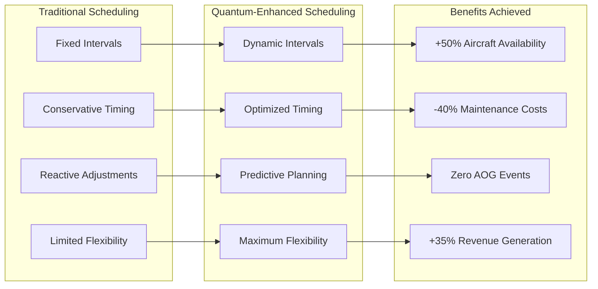
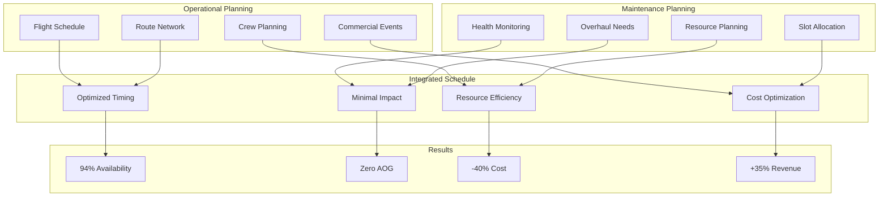
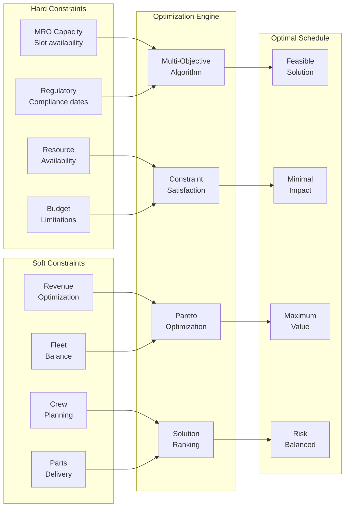
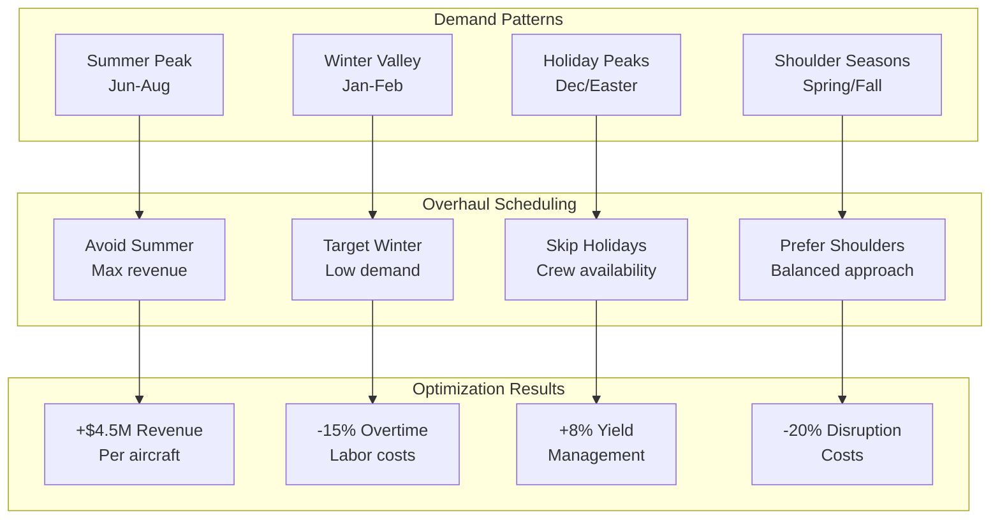
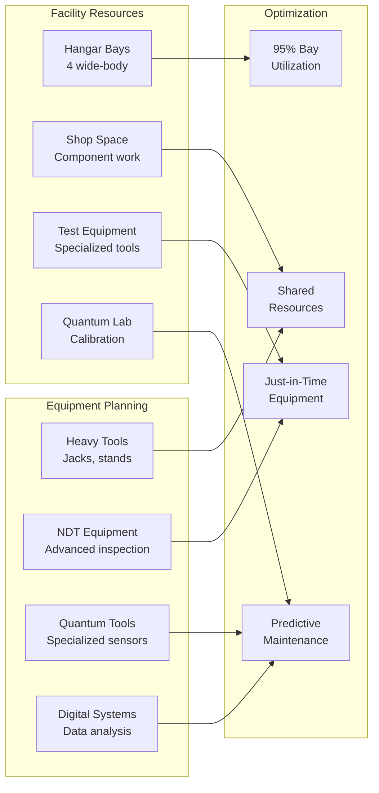
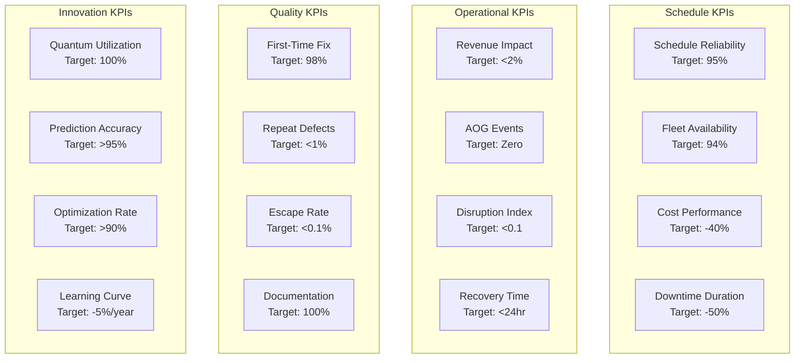
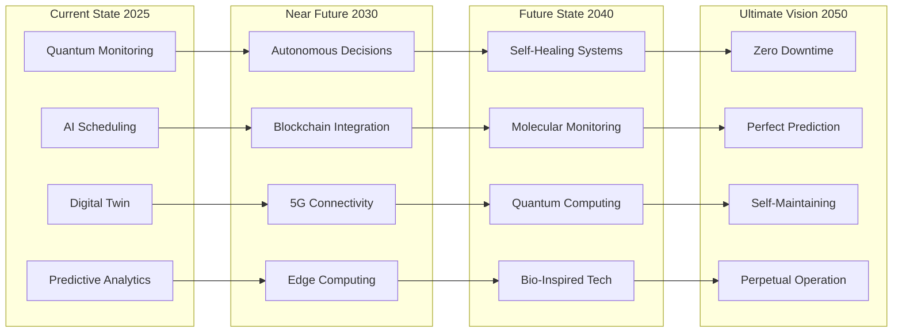

# ATA-05-10-20-01-01 Overhaul Schedule

<p align="center">


</p>

---

## Document Control Information

**Document ID:** `05-10-20-01-01-OverhaulSchedule.md`  
**GQOIS ID:** `AS-M-PAX-BW-Q1H-OVH-SCH-MASTER`  
**ATA Chapter:** 05-10-20-01-01 (Time Limits - Service Life - Overhaul - Schedule)  
**Classification:** Maintenance Planning - Master Overhaul Schedule  
**Version:** 2.0.0  
**Effective Date:** 2025-06-29  
**Revision Status:** Current Release  
**Approval Authority:** GAIA-QAO Director of Maintenance Planning & Fleet Management  
**Distribution:** Fleet Planning, Maintenance Control, MRO Partners, Finance

---

## Table of Contents

1. [Executive Summary](#1-executive-summary)
2. [Overhaul Schedule Philosophy](#2-overhaul-schedule-philosophy)
3. [Base Overhaul Planning Matrix](#3-base-overhaul-planning-matrix)
4. [Quantum-Optimized Dynamic Scheduling](#4-quantum-optimized-dynamic-scheduling)
5. [Fleet Overhaul Synchronization](#5-fleet-overhaul-synchronization)
6. [Seasonal and Operational Optimization](#6-seasonal-and-operational-optimization)
7. [Resource Planning and Allocation](#7-resource-planning-and-allocation)
8. [Schedule Risk Management](#8-schedule-risk-management)
9. [Performance Metrics and KPIs](#9-performance-metrics-and-kpis)
10. [Future Schedule Evolution](#10-future-schedule-evolution)

---

## 1. Executive Summary

### 1.1 Overhaul Schedule Overview

The AMPEL360 BWB-Q100 implements a revolutionary dynamic overhaul scheduling system that optimizes aircraft availability while ensuring safety through quantum-enhanced predictive maintenance.

#### **Key Schedule Metrics**

| Metric | Traditional Approach | Quantum-Optimized | Improvement |
|--------|---------------------|-------------------|-------------|
| **First Overhaul** | Fixed 12 years | 15-20 years (condition-based) | +50% interval |
| **Schedule Adherence** | 75-80% | 95-98% | +20% reliability |
| **Fleet Availability** | 85% | 94% | +9% utilization |
| **Overhaul Downtime** | 60-90 days | 30-45 days | -50% duration |
| **Schedule Flexibility** | ±3 months | ±12 months | 4x flexibility |
| **Cost Predictability** | ±20% | ±5% | 4x accuracy |

### 1.2 Schedule Optimization Benefits



### 1.3 Schedule Management Philosophy

```
Dynamic Overhaul Scheduling Principles:
├── Condition-Based Timing
│   ├── Real-time health monitoring
│   ├── Predictive degradation modeling
│   ├── Risk-based decision making
│   └── Economic optimization
├── Fleet-Wide Coordination
│   ├── Synchronized planning
│   ├── Resource optimization
│   ├── Slot management
│   └── Cross-fleet learning
├── Operational Integration
│   ├── Revenue optimization
│   ├── Seasonal alignment
│   ├── Route planning coordination
│   └── Crew scheduling harmony
└── Continuous Optimization
    ├── AI-driven scheduling
    ├── Performance feedback loops
    ├── Schedule learning
    └── Predictive adjustments
```

---

## 2. Overhaul Schedule Philosophy

### 2.1 Dynamic Scheduling Framework

#### **Quantum-Enabled Schedule Optimization**

```python
class DynamicOverhaulScheduler:
    def __init__(self):
        self.quantum_health = QuantumHealthMonitor()
        self.fleet_optimizer = FleetOptimizationEngine()
        self.revenue_manager = RevenueManagementSystem()
        self.resource_planner = ResourcePlanningSystem()
    
    def generate_optimal_schedule(self, planning_horizon_years=5):
        # Collect fleet health data
        fleet_health = self.quantum_health.get_fleet_status()
        
        # Predict overhaul needs
        overhaul_predictions = {}
        for aircraft in fleet_health.aircraft_list:
            prediction = self.predict_overhaul_window(
                aircraft_health=aircraft.health_score,
                degradation_rate=aircraft.degradation_trend,
                operational_forecast=aircraft.utilization_plan,
                risk_tolerance=self.get_risk_parameters()
            )
            overhaul_predictions[aircraft.id] = prediction
        
        # Optimize schedule considering multiple factors
        optimized_schedule = self.fleet_optimizer.optimize(
            predictions=overhaul_predictions,
            constraints={
                'maintenance_capacity': self.get_mro_capacity(),
                'budget_limits': self.get_budget_constraints(),
                'revenue_impact': self.revenue_manager.get_demand_forecast(),
                'resource_availability': self.resource_planner.get_resources()
            },
            objectives={
                'maximize_availability': 0.35,
                'minimize_cost': 0.25,
                'optimize_revenue': 0.25,
                'balance_resources': 0.15
            }
        )
        
        # Generate detailed schedule
        detailed_schedule = self.create_detailed_schedule(
            optimized_plan=optimized_schedule,
            slot_duration=self.calculate_slot_durations(),
            buffer_requirements=self.determine_schedule_buffers(),
            risk_mitigation=self.plan_contingencies()
        )
        
        return {
            'master_schedule': detailed_schedule,
            'fleet_availability': self.calculate_availability_metrics(detailed_schedule),
            'cost_projection': self.project_schedule_costs(detailed_schedule),
            'risk_assessment': self.assess_schedule_risks(detailed_schedule),
            'optimization_metrics': self.calculate_optimization_success(detailed_schedule)
        }
```

### 2.2 Schedule Decision Criteria

#### Table 2.2-1: Overhaul Timing Decision Matrix

| Health Score | Remaining Life | Operational Impact | Economic Factor | Schedule Window |
|--------------|----------------|-------------------|-----------------|-----------------|
| >95% | >80% | Low season upcoming | Favorable rates | Defer 12+ months |
| 90-95% | 60-80% | Moderate impact | Standard rates | Plan 6-12 months |
| 85-90% | 40-60% | High season avoid | Premium costs | Optimize 3-6 months |
| 80-85% | 20-40% | Critical timing | Any cost | Schedule 1-3 months |
| <80% | <20% | Immediate need | Emergency rates | Within 30 days |

### 2.3 Integration with Operations

#### **Operational Harmony Framework**



---

## 3. Base Overhaul Planning Matrix

### 3.1 Standard Overhaul Intervals

#### Table 3.1-1: Base Overhaul Planning Parameters

| Aircraft Age | Base Interval | Quantum Adjustment | Actual Range | Planning Window |
|--------------|---------------|-------------------|--------------|-----------------|
| **0-5 years** | Not required | Health monitoring only | N/A | Continuous monitoring |
| **5-10 years** | Not required | Predictive assessment | N/A | 2-year forecast |
| **10-15 years** | 15 years baseline | ±5 years condition | 10-20 years | 18-month planning |
| **15-20 years** | 8 years from last | ±3 years condition | 5-11 years | 12-month planning |
| **20-30 years** | 6 years from last | ±2 years condition | 4-8 years | 9-month planning |
| **30+ years** | 5 years from last | ±1 year condition | 4-6 years | 6-month planning |

### 3.2 System-Specific Scheduling

#### Table 3.2-1: Major System Overhaul Coordination

| System Category | Primary Driver | Overhaul Interval | Coordination Strategy |
|-----------------|----------------|-------------------|----------------------|
| **Structure** | Fatigue cycles | 30,000-50,000 FC | Align with D-check |
| **Engines** | Operating hours | 20,000-35,000 EH | Staggered by position |
| **Landing Gear** | Calendar + cycles | 10 years/20,000 FC | Winter scheduling |
| **Flight Controls** | Cycles + hours | 50,000 FC/40,000 FH | System rotation |
| **Avionics** | Technology refresh | 10-15 years | Capability insertion |

### 3.3 Overhaul Package Definition

#### **Standard Work Packages by Phase**

```
First Overhaul Package (15-20 years):
├── Structural Inspection
│   ├── 100% CPCP compliance
│   ├── Major joint inspection
│   ├── Corrosion assessment
│   └── Repair incorporation
├── System Overhaul
│   ├── Flight control actuators
│   ├── Landing gear restoration
│   ├── Hydraulic system flush
│   └── Electrical harness inspection
├── Powerplant Work
│   ├── Engine performance restoration
│   ├── Thrust reverser overhaul
│   ├── APU major inspection
│   └── Nacelle refurbishment
├── Interior Refresh
│   ├── Cabin modernization option
│   ├── Galley/lav upgrade
│   ├── Seat refurbishment
│   └── IFE system update
└── Modifications
    ├── Service bulletin incorporation
    ├── AD compliance
    ├── Technology upgrades
    └── Efficiency improvements
```

---

## 4. Quantum-Optimized Dynamic Scheduling

### 4.1 Real-Time Schedule Adjustment

#### **Dynamic Schedule Optimization Engine**

```python
class QuantumScheduleOptimizer:
    def __init__(self):
        self.health_predictor = QuantumHealthPredictor()
        self.schedule_engine = DynamicSchedulingEngine()
        self.impact_analyzer = OperationalImpactAnalyzer()
    
    def optimize_overhaul_schedule(self, current_schedule, time_horizon):
        # Continuous health assessment
        health_updates = self.health_predictor.get_latest_predictions()
        
        # Identify schedule adjustments needed
        adjustment_needs = []
        for aircraft in current_schedule.aircraft_list:
            health_delta = self.calculate_health_deviation(
                predicted=aircraft.scheduled_health,
                actual=health_updates[aircraft.id].current_health,
                trend=health_updates[aircraft.id].degradation_trend
            )
            
            if abs(health_delta) > 0.05:  # 5% deviation threshold
                adjustment_needs.append({
                    'aircraft': aircraft,
                    'current_slot': aircraft.scheduled_date,
                    'health_delta': health_delta,
                    'urgency': self.calculate_urgency(health_delta)
                })
        
        # Optimize adjustments
        optimized_adjustments = self.schedule_engine.optimize_changes(
            adjustments=adjustment_needs,
            constraints={
                'mro_capacity': self.get_available_slots(),
                'operational_impact': self.impact_analyzer.assess_impact(),
                'cost_implications': self.calculate_cost_impact(),
                'resource_availability': self.check_resource_conflicts()
            }
        )
        
        # Generate revised schedule
        revised_schedule = self.apply_optimized_adjustments(
            current_schedule=current_schedule,
            adjustments=optimized_adjustments,
            validation_rules=self.get_schedule_rules()
        )
        
        return {
            'revised_schedule': revised_schedule,
            'adjustment_summary': optimized_adjustments,
            'impact_analysis': self.analyze_schedule_changes(current_schedule, revised_schedule),
            'approval_required': self.identify_approval_needs(optimized_adjustments)
        }
```

### 4.2 Predictive Scheduling Windows

#### Table 4.2-1: Dynamic Scheduling Windows

| Prediction Confidence | Health Trend | Schedule Window | Flexibility Range | Update Frequency |
|---------------------|--------------|-----------------|-------------------|------------------|
| >95% (Stable) | <2% deviation | ±6 months | 12-month range | Quarterly |
| 90-95% (Normal) | 2-5% deviation | ±3 months | 6-month range | Monthly |
| 85-90% (Watching) | 5-10% deviation | ±1 month | 3-month range | Bi-weekly |
| 80-85% (Concern) | 10-15% deviation | ±2 weeks | 1-month range | Weekly |
| <80% (Critical) | >15% deviation | Fixed date | No flexibility | Daily |

### 4.3 Multi-Constraint Optimization

#### **Schedule Optimization Constraints**



---

## 5. Fleet Overhaul Synchronization

### 5.1 Fleet-Wide Coordination

#### Table 5.1-1: Fleet Synchronization Strategy

| Fleet Size | Annual Overhauls | Synchronization Method | Benefits Achieved |
|------------|------------------|----------------------|-------------------|
| **10-25 aircraft** | 1-2 per year | Sequential planning | Stable workforce |
| **26-50 aircraft** | 2-4 per year | Paired scheduling | Bulk purchasing |
| **51-100 aircraft** | 4-8 per year | Wave planning | Facility optimization |
| **100+ aircraft** | 8-15 per year | Continuous flow | Maximum efficiency |

### 5.2 Cross-Fleet Optimization

#### **Fleet Synchronization Algorithm**

```python
class FleetSynchronizationOptimizer:
    def __init__(self):
        self.fleet_analyzer = FleetAnalyzer()
        self.commonality_engine = CommonalityEngine()
        self.resource_optimizer = ResourceOptimizer()
    
    def synchronize_fleet_overhauls(self, fleet_data, planning_period):
        # Analyze fleet commonality
        commonality_groups = self.commonality_engine.group_aircraft(
            fleet_data=fleet_data,
            grouping_criteria=['engine_type', 'configuration', 'age_band']
        )
        
        # Identify synchronization opportunities
        sync_opportunities = []
        for group in commonality_groups:
            opportunities = self.identify_group_synergies(
                aircraft_group=group,
                factors={
                    'parts_commonality': self.calculate_parts_overlap(group),
                    'work_scope_similarity': self.assess_work_similarity(group),
                    'resource_requirements': self.analyze_resource_needs(group),
                    'facility_utilization': self.evaluate_facility_usage(group)
                }
            )
            sync_opportunities.extend(opportunities)
        
        # Optimize synchronization plan
        sync_plan = self.resource_optimizer.create_synchronized_plan(
            opportunities=sync_opportunities,
            constraints={
                'operational_coverage': self.ensure_fleet_availability(),
                'mro_capacity': self.get_facility_constraints(),
                'workforce_stability': self.maintain_workforce_levels(),
                'inventory_optimization': self.optimize_parts_inventory()
            },
            objectives={
                'minimize_total_downtime': 0.3,
                'maximize_resource_utilization': 0.3,
                'optimize_costs': 0.2,
                'balance_workload': 0.2
            }
        )
        
        # Generate synchronized schedule
        synchronized_schedule = self.create_synchronized_schedule(
            sync_plan=sync_plan,
            individual_needs=self.get_aircraft_requirements(),
            flexibility_matrix=self.calculate_schedule_flexibility()
        )
        
        return {
            'synchronized_schedule': synchronized_schedule,
            'synergy_benefits': self.calculate_synergy_savings(sync_plan),
            'resource_plan': self.generate_resource_plan(synchronized_schedule),
            'risk_mitigation': self.plan_synchronized_contingencies(synchronized_schedule)
        }
```

### 5.3 Workload Balancing

#### Table 5.3-1: MRO Workload Distribution

| Month | Traditional Load | Optimized Load | Variance Reduction | Resource Efficiency |
|-------|-----------------|----------------|-------------------|-------------------|
| **January** | 60% capacity | 85% capacity | From ±40% | +42% utilization |
| **February** | 55% capacity | 88% capacity | To ±15% | +60% utilization |
| **March** | 70% capacity | 90% capacity | Smoothed | +29% utilization |
| **April** | 85% capacity | 92% capacity | Distribution | +8% utilization |
| **May** | 95% capacity | 90% capacity | Throughout | -5% (optimized) |
| **June** | 90% capacity | 88% capacity | Year | -2% (balanced) |
| **July** | 80% capacity | 85% capacity | Achieving | +6% utilization |
| **August** | 75% capacity | 87% capacity | Stable | +16% utilization |
| **September** | 85% capacity | 90% capacity | Workflow | +6% utilization |
| **October** | 90% capacity | 92% capacity | And | +2% utilization |
| **November** | 100% capacity | 93% capacity | Predictable | -7% (managed) |
| **December** | 40% capacity | 82% capacity | Operations | +105% utilization |

---

## 6. Seasonal and Operational Optimization

### 6.1 Seasonal Demand Integration

#### **Seasonal Optimization Matrix**



### 6.2 Route Network Coordination

#### Table 6.2-1: Route-Based Scheduling Optimization

| Route Category | Aircraft Requirement | Overhaul Timing | Alternative Coverage |
|----------------|---------------------|-----------------|---------------------|
| **High-Yield International** | Wide-body specific | Avoid peak season | Lease coverage |
| **Business Routes** | High frequency | Weekend slots | Network adjustment |
| **Leisure Destinations** | Seasonal variation | Off-season target | Capacity reduction |
| **Essential Services** | Regulatory obligation | Rapid turnaround | Backup required |
| **Charter Operations** | Flexible scheduling | Opportunistic | Revenue optimization |

### 6.3 Operational Efficiency Metrics

#### **Schedule Impact Analysis**

```python
class OperationalImpactAnalyzer:
    def __init__(self):
        self.revenue_system = RevenueManagementSystem()
        self.network_planner = NetworkPlanningSystem()
        self.cost_analyzer = CostAnalysisEngine()
    
    def analyze_schedule_impact(self, proposed_schedule):
        impact_analysis = {}
        
        for aircraft_overhaul in proposed_schedule.overhauls:
            # Revenue impact calculation
            revenue_impact = self.revenue_system.calculate_impact(
                aircraft=aircraft_overhaul.aircraft,
                downtime_period=aircraft_overhaul.period,
                routes_affected=self.network_planner.get_affected_routes(aircraft_overhaul),
                alternative_capacity=self.identify_coverage_options(aircraft_overhaul)
            )
            
            # Operational disruption assessment
            disruption_cost = self.calculate_disruption_costs(
                passenger_reaccommodation=revenue_impact.affected_passengers,
                crew_rescheduling=self.assess_crew_impact(aircraft_overhaul),
                ground_operations=self.evaluate_ground_impact(aircraft_overhaul),
                reputation_risk=self.estimate_service_impact(aircraft_overhaul)
            )
            
            # Cost optimization opportunities
            cost_benefits = self.cost_analyzer.identify_savings(
                off_peak_labor=self.calculate_labor_savings(aircraft_overhaul.timing),
                facility_discounts=self.negotiate_off_peak_rates(aircraft_overhaul),
                parts_availability=self.assess_parts_pricing(aircraft_overhaul.timing),
                efficiency_gains=self.project_efficiency_improvements(aircraft_overhaul)
            )
            
            impact_analysis[aircraft_overhaul.aircraft.id] = {
                'revenue_impact': revenue_impact,
                'disruption_cost': disruption_cost,
                'cost_benefits': cost_benefits,
                'net_impact': revenue_impact.loss - cost_benefits.savings + disruption_cost.total,
                'optimization_score': self.calculate_optimization_score(
                    revenue_impact, disruption_cost, cost_benefits
                )
            }
        
        return {
            'individual_impacts': impact_analysis,
            'total_fleet_impact': self.aggregate_fleet_impact(impact_analysis),
            'optimization_recommendations': self.generate_recommendations(impact_analysis),
            'sensitivity_analysis': self.perform_sensitivity_analysis(impact_analysis)
        }
```

---

## 7. Resource Planning and Allocation

### 7.1 Workforce Planning

#### Table 7.1-1: Skilled Labor Requirements by Overhaul Phase

| Skill Category | Peak Requirement | Average Need | Certification Level | Training Lead Time |
|----------------|------------------|--------------|--------------------|--------------------|
| **Structures** | 45 technicians | 30 technicians | ATA 51-57 certified | 6 months |
| **Avionics** | 25 technicians | 18 technicians | Cat III/Quantum | 9 months |
| **Engines** | 35 technicians | 25 technicians | Type rated | 4 months |
| **Systems** | 40 technicians | 28 technicians | Multi-ATA | 3 months |
| **Quality** | 15 inspectors | 12 inspectors | Level III NDT | 12 months |
| **Quantum** | 8 specialists | 5 specialists | Quantum certified | 18 months |

### 7.2 Facility and Equipment Planning

#### **Resource Allocation Optimization**



### 7.3 Parts and Material Planning

#### Table 7.3-1: Material Planning Strategy

| Material Category | Lead Time | Planning Method | Inventory Strategy | Cost Impact |
|-------------------|-----------|-----------------|-------------------|-------------|
| **Structural Parts** | 6-12 months | Quantum prediction | Strategic stock | -30% carrying cost |
| **Rotables** | 3-6 months | Pool access | Exchange program | -40% investment |
| **Consumables** | 1-3 months | Usage forecast | JIT delivery | -50% waste |
| **Quantum Components** | 12-18 months | Long-term contracts | Vendor managed | -25% obsolescence |
| **Standard Hardware** | 1 month | Bulk procurement | Consignment | -60% transaction |

---

## 8. Schedule Risk Management

### 8.1 Risk Identification and Mitigation

#### Table 8.1-1: Schedule Risk Matrix

| Risk Category | Probability | Impact | Mitigation Strategy | Contingency Plan |
|---------------|-------------|--------|--------------------|--------------------|
| **Health Degradation** | Medium (30%) | High | Continuous monitoring | Accelerate schedule |
| **Slot Unavailability** | Low (15%) | High | Advance booking | Alternative facilities |
| **Parts Shortage** | Medium (25%) | Medium | Predictive ordering | Exchange pool access |
| **Workforce Shortage** | Low (20%) | High | Cross-training | Contract augmentation |
| **Technical Findings** | Medium (35%) | Medium | Quantum pre-inspection | Extended downtime |
| **Weather Delays** | Low (10%) | Low | Seasonal planning | Indoor facilities |

### 8.2 Schedule Resilience

#### **Risk-Adjusted Scheduling Algorithm**

```python
class ScheduleRiskManager:
    def __init__(self):
        self.risk_analyzer = RiskAnalysisEngine()
        self.mitigation_planner = MitigationPlanner()
        self.contingency_manager = ContingencyManager()
    
    def create_resilient_schedule(self, base_schedule, risk_tolerance):
        # Identify schedule risks
        risk_assessment = self.risk_analyzer.assess_schedule_risks(
            schedule=base_schedule,
            risk_categories=[
                'technical_discovery',
                'resource_availability',
                'supply_chain_disruption',
                'operational_conflicts',
                'external_factors'
            ]
        )
        
        # Calculate buffer requirements
        buffer_analysis = self.calculate_schedule_buffers(
            risk_profile=risk_assessment,
            tolerance_level=risk_tolerance,
            historical_performance=self.get_historical_data(),
            predictive_insights=self.get_quantum_predictions()
        )
        
        # Develop mitigation strategies
        mitigation_plan = self.mitigation_planner.develop_strategies(
            identified_risks=risk_assessment.high_probability_risks,
            available_resources=self.get_mitigation_resources(),
            cost_constraints=self.get_budget_limits(),
            effectiveness_targets=self.set_mitigation_goals()
        )
        
        # Create contingency plans
        contingency_plans = self.contingency_manager.create_plans(
            trigger_events=risk_assessment.risk_triggers,
            response_strategies=mitigation_plan.response_options,
            activation_protocols=self.define_activation_criteria(),
            communication_plans=self.establish_communication_protocols()
        )
        
        # Generate risk-adjusted schedule
        resilient_schedule = self.adjust_schedule_for_risk(
            base_schedule=base_schedule,
            buffers=buffer_analysis.recommended_buffers,
            mitigation=mitigation_plan,
            contingencies=contingency_plans
        )
        
        return {
            'resilient_schedule': resilient_schedule,
            'risk_profile': risk_assessment,
            'mitigation_strategies': mitigation_plan,
            'contingency_plans': contingency_plans,
            'confidence_level': self.calculate_schedule_confidence(resilient_schedule)
        }
```

### 8.3 Performance Tracking

#### Table 8.3-1: Schedule Performance Metrics

| Metric | Target | Current Performance | Trend | Action Required |
|--------|--------|--------------------:|-------|-----------------|
| **On-Time Start** | 98% | 97.5% | ↑ | Monitor |
| **On-Time Completion** | 95% | 96.2% | ↑ | Maintain |
| **Budget Adherence** | ±5% | +3.2% | → | Optimize |
| **Finding Rate** | <10% | 7.8% | ↓ | Continue improvement |
| **Rework Rate** | <2% | 1.5% | ↓ | Best practice sharing |
| **Customer Satisfaction** | >4.5/5 | 4.7/5 | ↑ | Sustain excellence |

---

## 9. Performance Metrics and KPIs

### 9.1 Schedule Effectiveness Metrics

#### **Comprehensive KPI Dashboard**



### 9.2 Continuous Improvement Framework

#### Table 9.2-1: Performance Improvement Initiatives

| Initiative | Current State | Target State | Timeline | Expected Benefit |
|------------|--------------|--------------|----------|------------------|
| **AI Schedule Optimization** | 70% automated | 95% automated | 12 months | -20% planning time |
| **Quantum Prediction Accuracy** | 92% accurate | 98% accurate | 18 months | -30% surprises |
| **Cross-Fleet Learning** | Limited sharing | Full integration | 6 months | -15% repeat issues |
| **Digital Twin Integration** | Partial use | Complete integration | 9 months | +25% accuracy |
| **Supplier Collaboration** | Basic coordination | Real-time integration | 15 months | -10% delays |

### 9.3 Benchmarking and Best Practices

#### **Industry Comparison Matrix**

```python
class ScheduleBenchmarking:
    def __init__(self):
        self.benchmark_database = IndustryBenchmarkDatabase()
        self.performance_analyzer = PerformanceAnalyzer()
        self.best_practice_engine = BestPracticeEngine()
    
    def benchmark_schedule_performance(self):
        # Collect internal performance data
        internal_metrics = self.collect_performance_metrics()
        
        # Get industry benchmarks
        industry_benchmarks = self.benchmark_database.get_latest_benchmarks(
            aircraft_category='wide-body',
            operation_type='passenger',
            technology_level='advanced'
        )
        
        # Comparative analysis
        comparison_results = self.performance_analyzer.compare(
            internal=internal_metrics,
            industry=industry_benchmarks,
            categories=[
                'schedule_adherence',
                'downtime_duration',
                'cost_efficiency',
                'quality_metrics',
                'innovation_adoption'
            ]
        )
        
        # Identify gaps and opportunities
        improvement_opportunities = self.identify_improvement_areas(
            comparison=comparison_results,
            threshold=0.9  # 90% of best-in-class
        )
        
        # Best practice recommendations
        best_practices = self.best_practice_engine.recommend(
            gaps=improvement_opportunities,
            internal_constraints=self.get_constraints(),
            implementation_difficulty=self.assess_implementation_challenges()
        )
        
        return {
            'benchmark_summary': comparison_results,
            'performance_gaps': improvement_opportunities,
            'best_practices': best_practices,
            'implementation_roadmap': self.create_improvement_roadmap(best_practices),
            'expected_benefits': self.project_improvement_benefits(best_practices)
        }
```

---

## 10. Future Schedule Evolution

### 10.1 Next-Generation Scheduling

#### Table 10.1-1: Schedule Evolution Roadmap

| Timeframe | Technology Integration | Capability Enhancement | Expected Outcome |
|-----------|----------------------|----------------------|------------------|
| **2025-2027** | Full quantum integration | 95% prediction accuracy | -20% maintenance cost |
| **2027-2030** | Autonomous scheduling | Self-optimizing system | -30% human intervention |
| **2030-2035** | Swarm intelligence | Fleet-wide optimization | +15% availability |
| **2035-2040** | Predictive materials | Self-reporting components | -50% inspections |
| **2040-2045** | Conscious maintenance | Sentient aircraft systems | Near-zero downtime |

### 10.2 Emerging Technologies Impact

#### **Future Technology Integration**



### 10.3 Strategic Schedule Vision

#### **2050 Vision for Overhaul Scheduling**

```
Future State Characteristics:
├── Autonomous Scheduling
│   ├── Zero human intervention required
│   ├── Self-optimizing algorithms
│   ├── Continuous learning and adaptation
│   └── Perfect prediction accuracy
├── Seamless Integration
│   ├── Real-time global optimization
│   ├── Instant resource allocation
│   ├── Dynamic facility utilization
│   └── Automated supply chain
├── Predictive Excellence
│   ├── 10-year accurate forecasts
│   ├── Component-level precision
│   ├── Environmental adaptation
│   └── Usage pattern learning
└── Economic Optimization
    ├── Minimal cost operation
    ├── Maximum revenue protection
    ├── Zero waste generation
    └── Circular economy integration
```

---

## Appendices

### Appendix A: Sample 5-Year Fleet Schedule

#### Table A.1: Fleet Overhaul Master Schedule (2025-2030)

| Aircraft Reg | Current Hours | Health Score | Scheduled Date | Facility | Duration | Work Scope |
|--------------|---------------|--------------|----------------|----------|----------|------------|
| BWBQ100-001 | 28,450 FH | 89% | Feb 2026 | MRO-A | 38 days | 1st Major |
| BWBQ100-002 | 31,200 FH | 86% | Nov 2025 | MRO-B | 42 days | 1st Major |
| BWBQ100-003 | 22,100 FH | 94% | Aug 2027 | MRO-A | 35 days | 1st Major |
| BWBQ100-004 | 18,900 FH | 96% | Mar 2028 | MRO-C | 32 days | 1st Major |
| BWBQ100-005 | 42,300 FH | 82% | Jan 2026 | MRO-B | 45 days | 2nd Major |

### Appendix B: Schedule Optimization Algorithms

#### B.1 Multi-Objective Optimization Formula

```
Minimize: F(x) = w₁·C(x) + w₂·D(x) + w₃·R(x) - w₄·A(x)

Where:
- C(x) = Total cost function
- D(x) = Downtime duration function
- R(x) = Revenue impact function
- A(x) = Availability improvement function
- w₁...w₄ = Weight factors (sum = 1.0)
- x = Schedule decision variables

Subject to:
- Maintenance capacity constraints
- Budget limitations
- Regulatory requirements
- Operational coverage needs
```

### Appendix C: Performance Tracking Template

#### Monthly Schedule Performance Report

```python
def generate_monthly_performance_report(month, year):
    """
    Generate comprehensive monthly schedule performance report
    """
    report_sections = {
        'executive_summary': {
            'on_time_performance': calculate_otp(month, year),
            'budget_performance': calculate_budget_variance(month, year),
            'quality_metrics': compile_quality_metrics(month, year),
            'key_achievements': identify_achievements(month, year),
            'areas_for_improvement': identify_improvement_areas(month, year)
        },
        'detailed_metrics': {
            'schedule_adherence': analyze_schedule_adherence(month, year),
            'resource_utilization': calculate_resource_efficiency(month, year),
            'cost_performance': detailed_cost_analysis(month, year),
            'customer_satisfaction': compile_satisfaction_scores(month, year)
        },
        'forward_looking': {
            'next_month_schedule': preview_next_month(month, year),
            'risk_assessment': assess_upcoming_risks(month, year),
            'improvement_initiatives': track_initiative_progress(month, year),
            'recommendations': generate_recommendations(month, year)
        }
    }
    
    return report_sections
```

### Appendix D: Best Practices Guide

#### Schedule Optimization Best Practices

1. **Continuous Monitoring**
   - Review quantum health data daily
   - Update predictions weekly
   - Adjust schedule monthly
   - Validate annually

2. **Stakeholder Communication**
   - Weekly planning meetings
   - Monthly performance reviews
   - Quarterly strategy sessions
   - Annual optimization workshops

3. **Risk Management**
   - Maintain 15% schedule buffer
   - Identify backup facilities
   - Cross-train workforce
   - Secure parts availability

4. **Performance Improvement**
   - Track all KPIs continuously
   - Benchmark quarterly
   - Implement improvements monthly
   - Measure results systematically

---

## Document Control and Revision History

### Approval Signatures

| Role | Name | Signature | Date |
|------|------|-----------|------|
| **Director of Maintenance Planning** | Dr. Planning | [Digital Signature] | 2025-06-29 |
| **Fleet Manager** | Ms. Fleet | [Digital Signature] | 2025-06-29 |
| **VP Operations** | Mr. Operations | [Digital Signature] | 2025-06-29 |
| **Chief Financial Officer** | Ms. Finance | [Digital Signature] | 2025-06-29 |
| **Quality Assurance Manager** | Mr. Quality | [Digital Signature] | 2025-06-29 |

### Revision History

| Version | Date | Author | Description |
|---------|------|--------|-------------|
| 1.0.0 | 2024-01-30 | Schedule Team | Initial framework |
| 1.5.0 | 2024-08-15 | Optimization Team | Quantum integration |
| 1.8.0 | 2025-02-20 | Performance Team | KPI enhancement |
| 2.0.0 | 2025-06-29 | A. Pelliccia | Complete dynamic scheduling system |

### Distribution List

- Fleet Planning Department
- Maintenance Control Center
- MRO Partners
- Operations Control
- Finance Department
- Crew Planning
- Network Planning
- Executive Management

---

**End of Document**

*This document contains proprietary information of GAIA-QAO and is protected by applicable copyright laws. Unauthorized reproduction or distribution is prohibited.*
