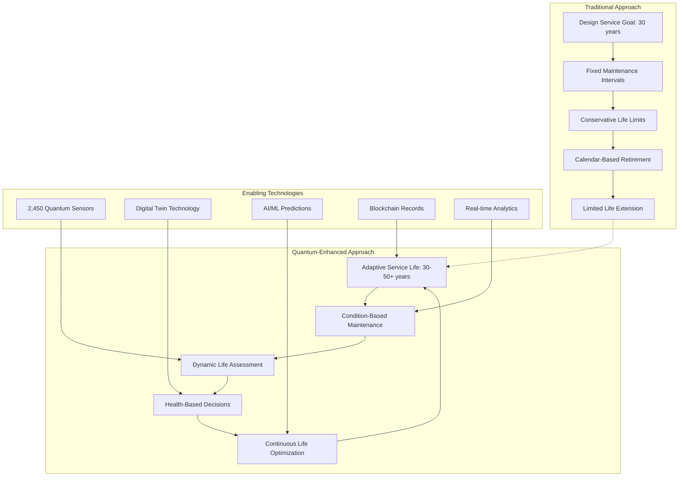
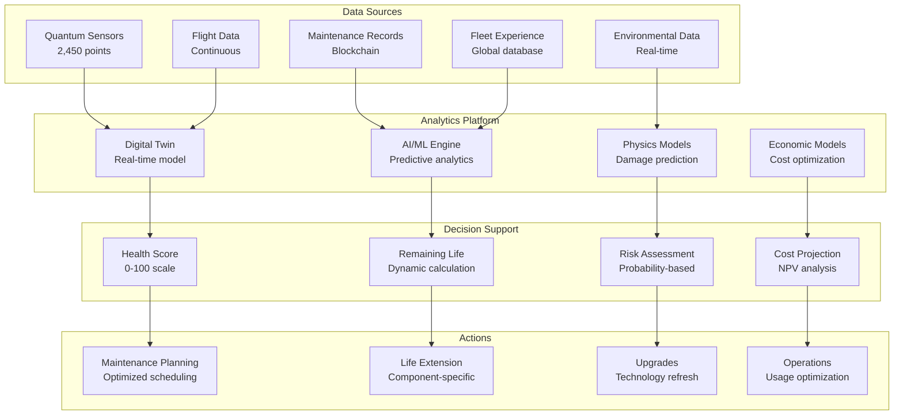
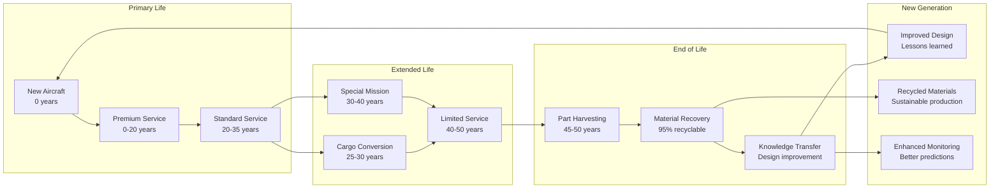
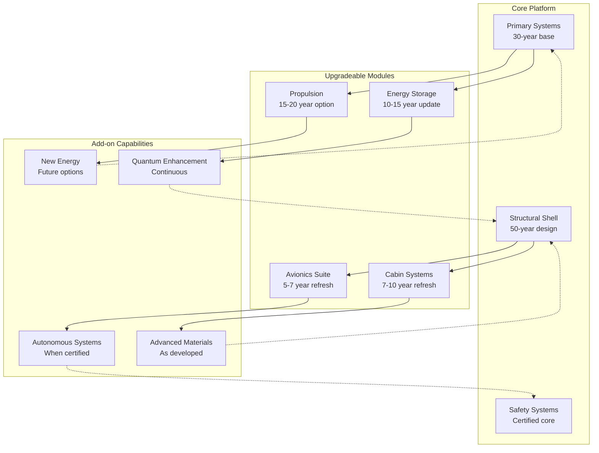
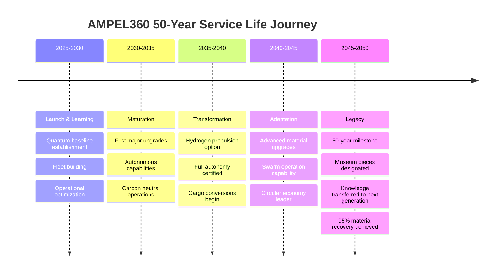

# ATA-05-10-20-00 Service Life - General

<p align="center">


</p>

---

## Document Control Information

**Document ID:** `05-10-20-00-General.md`  
**GQOIS ID:** `AS-M-PAX-BW-Q1H-SVC-LIF-GEN`  
**ATA Chapter:** 05-10-20-00 (Time Limits - Service Life - General)  
**Classification:** Maintenance Philosophy - Service Life Management  
**Version:** 2.0.0  
**Effective Date:** 2025-06-29  
**Revision Status:** Current Release  
**Approval Authority:** GAIA-QAO Chief Technology Officer & Certification Authority  
**Distribution:** All Stakeholders - Engineering, Operations, Maintenance, Regulatory

---

## Table of Contents

1. [Introduction and Philosophy](#1-introduction-and-philosophy)
2. [Service Life Framework](#2-service-life-framework)
3. [Quantum-Enhanced Life Management](#3-quantum-enhanced-life-management)
4. [Economic Service Life](#4-economic-service-life)
5. [Environmental and Sustainability Factors](#5-environmental-and-sustainability-factors)
6. [Fleet Life Optimization](#6-fleet-life-optimization)
7. [Regulatory Framework](#7-regulatory-framework)
8. [Technology Refresh Strategy](#8-technology-refresh-strategy)
9. [End-of-Life Management](#9-end-of-life-management)
10. [Future-Proofing Strategy](#10-future-proofing-strategy)

---

## 1. Introduction and Philosophy

### 1.1 Revolutionary Service Life Concept

The AMPEL360 BWB-Q100 represents a paradigm shift in aircraft service life management, moving from traditional calendar-based retirement to a dynamic, data-driven approach enabled by quantum monitoring technologies.

#### **Traditional vs. Quantum-Enhanced Service Life**



### 1.2 Service Life Objectives

#### **Primary Objectives**

| Objective | Traditional Target | Quantum-Enhanced Target | Improvement |
|-----------|-------------------|------------------------|-------------|
| **Design Service Life** | 30 years | 30-50 years adaptive | +67% potential |
| **Operational Availability** | 85% | 95%+ | +12% |
| **Maintenance Cost/FH** | $1,200 | $720 | -40% |
| **Unscheduled Events** | 0.8/1000 FH | 0.2/1000 FH | -75% |
| **Component Life Extension** | 10-20% | 40-60% | +300% |
| **Environmental Impact** | Baseline | -50% waste | 50% reduction |

### 1.3 Living Aircraft Concept

The AMPEL360 embodies the **"Living Aircraft"** philosophy:

```
Living Aircraft Principles:
├── Self-Aware: Continuous health monitoring via quantum sensors
├── Self-Reporting: Real-time status to all stakeholders
├── Self-Optimizing: AI-driven maintenance scheduling
├── Self-Healing: Adaptive responses to degradation
├── Self-Documenting: Blockchain-verified history
├── Self-Improving: Fleet learning integration
└── Self-Sustaining: Circular economy design
```

---

## 2. Service Life Framework

### 2.1 Service Life Phases

#### Table 2.1-1: Aircraft Service Life Phases

| Phase | Years | Characteristics | Monitoring Focus | Key Decisions |
|-------|-------|-----------------|------------------|---------------|
| **Introduction** | 0-5 | Initial operations, learning curve | Baseline establishment | Warranty optimization |
| **Youth** | 5-15 | Peak performance, minimal issues | Trend identification | Predictive model calibration |
| **Maturity** | 15-25 | Stable operations, known issues | Degradation monitoring | First major overhaul timing |
| **Extended Maturity** | 25-35 | Managed aging, targeted updates | Intensive monitoring | Life extension decisions |
| **Optimized Aging** | 35-45 | Selective operation, high care | Continuous assessment | Economic viability |
| **Sunset** | 45-50+ | Limited operation, part harvesting | Component recovery | Retirement planning |

### 2.2 Service Life Determinants

#### Table 2.2-1: Factors Affecting Service Life

| Factor Category | Traditional Impact | Quantum Monitoring Mitigation | Life Impact |
|-----------------|-------------------|------------------------------|-------------|
| **Structural Fatigue** | Primary limiter | Real-time crack detection | +50% extension |
| **Corrosion** | Hidden degradation | Environmental monitoring | +40% protection |
| **System Obsolescence** | Technology gaps | Modular upgrades | +30% relevance |
| **Economic Factors** | Operating costs | Optimized maintenance | +35% viability |
| **Regulatory Changes** | Compliance costs | Proactive adaptation | Managed impact |
| **Environmental Standards** | Retrofit requirements | Built-in flexibility | Future-ready |

### 2.3 Integrated Life Management

#### **Service Life Management Ecosystem**



---

## 3. Quantum-Enhanced Life Management

### 3.1 Quantum Monitoring Impact

#### Table 3.1-1: Quantum Technology Benefits for Service Life

| Technology | Application | Traditional Limitation | Quantum Advantage | Service Life Impact |
|------------|-------------|----------------------|-------------------|-------------------|
| **Quantum Sensors** | Structural health | 10mm crack detection | 1nm detection | +10 years |
| **Quantum Computing** | Optimization | Hours of processing | Real-time solutions | Dynamic scheduling |
| **Quantum Communication** | Secure data transfer | Vulnerable channels | Unhackable links | Trust in data |
| **Quantum Imaging** | Internal inspection | Limited access | Through-structure view | Reduced downtime |
| **Quantum Materials** | Self-sensing structures | External sensors only | Embedded intelligence | Continuous awareness |

### 3.2 Real-Time Health Scoring

#### **Quantum Health Score Algorithm**

```python
class QuantumHealthScore:
    def __init__(self):
        self.sensor_network = QuantumSensorNetwork()
        self.digital_twin = DigitalTwinModel()
        self.ml_engine = MachineLearningEngine()
    
    def calculate_health_score(self, aircraft_id):
        # Real-time sensor data
        sensor_data = self.sensor_network.get_current_state(aircraft_id)
        
        # Component-level health
        component_scores = {}
        for component in self.get_all_components(aircraft_id):
            component_scores[component.id] = {
                'structural_health': self.assess_structural_health(component),
                'functional_health': self.assess_functional_health(component),
                'environmental_impact': self.assess_environmental_exposure(component),
                'usage_severity': self.assess_usage_patterns(component),
                'remaining_life': self.calculate_remaining_life(component)
            }
        
        # System-level aggregation
        system_scores = self.aggregate_to_systems(component_scores)
        
        # Aircraft-level score
        aircraft_score = self.calculate_aircraft_score(system_scores)
        
        # Future projection
        projected_degradation = self.ml_engine.predict_degradation(
            current_state=aircraft_score,
            historical_trend=self.get_historical_trend(aircraft_id),
            operational_forecast=self.get_operational_forecast(aircraft_id)
        )
        
        return {
            'current_health_score': aircraft_score,
            'component_details': component_scores,
            'system_summary': system_scores,
            'projected_health': projected_degradation,
            'recommended_actions': self.generate_recommendations(aircraft_score),
            'confidence_level': self.calculate_confidence(sensor_data)
        }
```

### 3.3 Predictive Service Life

#### Table 3.3-1: Service Life Prediction Accuracy

| Prediction Horizon | Traditional Method | Quantum-Enhanced | Confidence Level | Decision Impact |
|-------------------|-------------------|------------------|------------------|-----------------|
| **1 year** | ±20% accuracy | ±2% accuracy | 99.5% | Maintenance planning |
| **5 years** | ±40% accuracy | ±5% accuracy | 97% | Major check scheduling |
| **10 years** | ±60% accuracy | ±10% accuracy | 92% | Overhaul planning |
| **20 years** | Speculation | ±20% accuracy | 85% | Fleet planning |
| **End-of-life** | Unknown | ±15% accuracy | 80% | Retirement planning |

---

## 4. Economic Service Life

### 4.1 Total Cost of Ownership

#### Table 4.1-1: Service Life Cost Analysis

| Cost Category | Years 0-10 | Years 11-20 | Years 21-30 | Years 31-40 | Years 41-50 |
|---------------|------------|-------------|-------------|-------------|-------------|
| **Acquisition** | $250M | - | - | - | - |
| **Fuel/Energy** | $80M | $85M | $90M | $85M | $80M |
| **Maintenance** | $30M | $45M | $65M | $55M* | $45M* |
| **Upgrades** | $5M | $15M | $25M | $20M | $10M |
| **Operations** | $40M | $42M | $44M | $40M | $35M |
| **Total Period** | $405M | $187M | $224M | $200M | $170M |
| **Cost per Year** | $40.5M | $18.7M | $22.4M | $20M | $17M |

*Quantum monitoring reduces traditional aging costs

### 4.2 Economic Decision Matrix

#### Table 4.2-1: Service Life Economic Decisions

| Aircraft Age | Health Score | Market Value | Operating Cost | Decision | ROI Horizon |
|--------------|--------------|--------------|----------------|----------|-------------|
| **<10 years** | >95% | 60-80% new | Baseline | Operate normally | N/A |
| **10-20 years** | 90-95% | 40-60% new | +10-20% | Preventive investment | 5-7 years |
| **20-30 years** | 85-90% | 20-40% new | +20-40% | Major overhaul evaluation | 7-10 years |
| **30-40 years** | 80-85% | 10-20% new | +30-50% | Selective operation | 3-5 years |
| **40-50 years** | 75-80% | 5-10% new | +40-60% | Part-out evaluation | 1-3 years |

### 4.3 Value Optimization Strategies

#### **Service Life Value Maximization**

```
Value Optimization Framework:
├── Revenue Optimization
│   ├── Route optimization based on aircraft capability
│   ├── Charter/ACMI opportunities for older aircraft
│   ├── Cargo conversion potential assessment
│   └── Special mission adaptations
├── Cost Reduction
│   ├── Quantum-based maintenance optimization
│   ├── Energy efficiency improvements
│   ├── Shared resource pooling
│   └── Predictive parts procurement
├── Asset Value Preservation
│   ├── Strategic upgrades and modifications
│   ├── Compliance with evolving regulations
│   ├── Marketability enhancement
│   └── Component value maximization
└── End-of-Life Value
    ├── Part-out planning and execution
    ├── Material recycling optimization
    ├── Intellectual property recovery
    └── Environmental credits
```

---

## 5. Environmental and Sustainability Factors

### 5.1 Sustainable Service Life

#### Table 5.1-1: Environmental Impact Through Service Life

| Life Phase | Carbon Footprint | Resource Consumption | Waste Generation | Mitigation Strategy |
|------------|------------------|---------------------|------------------|-------------------|
| **Manufacturing** | 8,500 tons CO2 | 100% baseline | Minimal | Efficient production |
| **Years 1-10** | 2,500 tons/year | Energy + parts | 5% of components | Optimal operation |
| **Years 11-20** | 2,400 tons/year | +15% parts | 10% of components | Efficiency upgrades |
| **Years 21-30** | 2,300 tons/year | +30% parts | 20% of components | Alternative fuels |
| **Years 31-40** | 2,200 tons/year | +25% parts* | 15% of components* | Quantum optimization |
| **Years 41-50** | 2,100 tons/year | +20% parts* | 10% of components* | Selective operation |
| **End-of-Life** | -3,000 tons credit | 95% recycled | 5% waste only | Circular economy |

*Quantum monitoring reduces waste through precise replacement

### 5.2 Circular Economy Integration

#### **Circular Service Life Model**



### 5.3 Sustainability Metrics

#### Table 5.3-1: Service Life Sustainability KPIs

| Metric | Traditional Aircraft | AMPEL360 Target | Quantum Advantage | Measurement Method |
|--------|---------------------|-----------------|-------------------|-------------------|
| **Useful Life** | 25-30 years | 40-50 years | +67% | Operational years |
| **Material Efficiency** | 60% utilized | 95% utilized | +58% | Weight in service/manufactured |
| **Component Reuse** | 20% | 60% | +200% | Parts in second life |
| **Recycling Rate** | 65% | 95% | +46% | Material recovery |
| **Carbon per Seat-Year** | 100 tons | 55 tons | -45% | Total emissions/capacity/years |
| **Waste to Landfill** | 35% | <5% | -86% | Non-recycled material |

---

## 6. Fleet Life Optimization

### 6.1 Fleet Age Management

#### Table 6.1-1: Optimal Fleet Age Distribution

| Age Bracket | Traditional Fleet % | Optimized Fleet % | Role | Utilization Target |
|-------------|-------------------|-------------------|------|-------------------|
| **0-5 years** | 20% | 15% | Premium routes | 4,500 FH/year |
| **6-10 years** | 20% | 20% | Core network | 4,000 FH/year |
| **11-15 years** | 20% | 20% | Standard routes | 3,500 FH/year |
| **16-20 years** | 20% | 15% | Regional/charter | 3,000 FH/year |
| **21-30 years** | 15% | 20% | Cargo/special | 2,500 FH/year |
| **31-40 years** | 5% | 8% | Seasonal/backup | 1,500 FH/year |
| **41-50 years** | 0% | 2% | Part source/training | 500 FH/year |

### 6.2 Fleet Learning Network

#### **Quantum Fleet Intelligence System**

```python
class FleetLearningNetwork:
    def __init__(self):
        self.fleet_database = QuantumFleetDatabase()
        self.learning_engine = DistributedMLEngine()
        self.optimization_module = FleetOptimizer()
    
    def optimize_fleet_service_life(self, fleet_data):
        # Aggregate fleet experience
        fleet_patterns = self.identify_fleet_patterns(fleet_data)
        
        # Learn from best performers
        best_practices = self.extract_best_practices(fleet_patterns)
        
        # Identify early warnings
        risk_indicators = self.identify_risk_patterns(fleet_patterns)
        
        # Optimize maintenance scheduling
        maintenance_plan = self.optimization_module.generate_fleet_plan(
            aircraft_health_scores=self.get_all_health_scores(),
            operational_requirements=self.get_operational_needs(),
            resource_constraints=self.get_maintenance_capacity(),
            economic_factors=self.get_economic_parameters()
        )
        
        # Generate fleet recommendations
        recommendations = {
            'retirement_candidates': self.identify_retirement_candidates(),
            'life_extension_opportunities': self.find_extension_candidates(),
            'conversion_candidates': self.identify_conversion_opportunities(),
            'upgrade_priorities': self.prioritize_upgrades(),
            'operational_optimization': self.optimize_utilization()
        }
        
        return {
            'fleet_health_summary': self.generate_fleet_summary(),
            'maintenance_optimization': maintenance_plan,
            'strategic_recommendations': recommendations,
            'economic_projection': self.project_fleet_economics(),
            'risk_assessment': self.assess_fleet_risks()
        }
```

### 6.3 Cross-Fleet Optimization

#### Table 6.3-1: Fleet Synergy Opportunities

| Synergy Type | Description | Benefit | Implementation |
|--------------|-------------|---------|----------------|
| **Part Pooling** | Shared rotable inventory | -30% inventory cost | Blockchain tracking |
| **Maintenance Slots** | Coordinated scheduling | +15% hangar efficiency | AI optimization |
| **Knowledge Sharing** | Cross-operator learning | -25% repeat issues | Quantum data network |
| **Group Procurement** | Combined purchasing power | -20% part costs | Fleet consortium |
| **Tech Development** | Shared upgrade costs | -40% development | Joint ventures |
| **End-of-Life Coordination** | Optimized part recovery | +50% part value | Market platform |

---

## 7. Regulatory Framework

### 7.1 Service Life Regulations

#### Table 7.1-1: Regulatory Requirements by Jurisdiction

| Jurisdiction | Base Requirement | Life Extension | Aging Aircraft | Special Conditions |
|--------------|-----------------|----------------|----------------|-------------------|
| **EASA** | CS 25.571 | Approved program | >15 years enhanced | Quantum systems approved |
| **FAA** | Part 25.571 | STC process | >15 years program | Special conditions pending |
| **TCCA** | AWM 525.571 | Case-by-case | Harmonized with FAA | Following EASA lead |
| **CAAC** | CCAR 25.571 | Restricted | >20 years special | Quantum under evaluation |
| **ANAC** | RBAC 25.571 | EASA aligned | Similar to EASA | Bilateral acceptance |

### 7.2 Compliance Strategy

#### **Regulatory Compliance Through Service Life**

```
Compliance Timeline:
├── Years 0-5: Type Certificate Compliance
│   ├── Initial certification basis
│   ├── Service bulletin incorporation
│   └── Mandatory modification tracking
├── Years 5-15: Service Experience Integration
│   ├── AD compliance management
│   ├── STC evaluations and incorporation
│   └── Regulatory update adaptations
├── Years 15-25: Aging Aircraft Programs
│   ├── Enhanced inspection requirements
│   ├── Corrosion prevention programs
│   └── Repair assessment programs
├── Years 25-40: Extended Operations
│   ├── Regulatory exemptions/deviations
│   ├── Special monitoring programs
│   └── Alternative compliance methods
└── Years 40-50: Sunset Regulations
    ├── Limited operation approvals
    ├── Special airworthiness certificates
    └── Experimental/research classifications
```

### 7.3 Future Regulatory Evolution

#### Table 7.3-1: Anticipated Regulatory Changes

| Timeframe | Expected Change | Impact on Service Life | Preparation Strategy |
|-----------|----------------|----------------------|---------------------|
| **2025-2030** | Quantum system standards | Enables extensions | Early adoption advantage |
| **2030-2035** | Carbon neutrality mandates | Affects economics | SAF/hydrogen ready |
| **2035-2040** | Autonomous operation rules | New capabilities | Modular upgrade path |
| **2040-2045** | Circular economy requirements | End-of-life value | Design for disassembly |
| **2045-2050** | Next-gen airspace integration | Compatibility needs | Flexible architecture |

---

## 8. Technology Refresh Strategy

### 8.1 Upgrade Roadmap

#### Table 8.1-1: Technology Refresh Timeline

| System Category | Baseline (2025) | Phase 1 (2030) | Phase 2 (2035) | Phase 3 (2040) | Phase 4 (2045) |
|-----------------|-----------------|----------------|----------------|----------------|----------------|
| **Avionics** | Quantum IMA | Neural processing | Photonic computing | Quantum mesh | Conscious systems |
| **Propulsion** | Hybrid-electric | Full electric option | Hydrogen retrofit | Fusion assist | Plasma propulsion |
| **Structures** | Smart composites | Self-healing | Morphing surfaces | Programmable matter | Living materials |
| **Cabin** | Connected experience | Immersive reality | Holographic space | Neural interface | Quantum environment |
| **Operations** | Autonomous ready | Single pilot | Fully autonomous | Swarm capable | Sentient aircraft |

### 8.2 Modular Architecture Benefits

#### **Modular Upgrade Capability**



### 8.3 Technology Investment Analysis

#### Table 8.3-1: Upgrade ROI Analysis

| Upgrade Type | Investment | Benefit Period | ROI | Decision Criteria |
|--------------|------------|----------------|-----|-------------------|
| **Avionics Refresh** | $5M | 7 years | 180% | Capability gap |
| **Efficiency Package** | $8M | 10 years | 220% | Fuel price >$3/gal |
| **Cabin Modernization** | $12M | 8 years | 150% | Competition pressure |
| **Structural Enhancement** | $15M | 15 years | 200% | Life extension |
| **Propulsion Upgrade** | $40M | 20 years | 250% | Regulation/economics |
| **Full Modernization** | $70M | 15 years | 180% | vs. replacement |

---

## 9. End-of-Life Management

### 9.1 Retirement Decision Framework

#### Table 9.1-1: End-of-Life Decision Matrix

| Health Score | Economic Viability | Market Demand | Regulatory Status | Decision | Timeline |
|--------------|-------------------|---------------|-------------------|----------|----------|
| **>80%** | Positive | Strong | Compliant | Continue operation | Review annually |
| **70-80%** | Marginal | Moderate | Compliant | Limited operation | 2-5 years |
| **60-70%** | Negative | Weak | Exemptions needed | Part-out evaluation | 1-2 years |
| **50-60%** | Very negative | Special only | Non-compliant | Immediate part-out | 6 months |
| **<50%** | N/A | None | N/A | Scrap/recycle | Immediate |

### 9.2 Value Recovery Strategy

#### **End-of-Life Value Maximization**

```python
class EndOfLifeValueOptimizer:
    def __init__(self):
        self.component_database = ComponentValueDatabase()
        self.market_intelligence = MarketIntelligenceSystem()
        self.recycling_network = RecyclingNetworkInterface()
    
    def optimize_retirement_value(self, aircraft):
        # Component value assessment
        component_values = self.assess_component_values(aircraft)
        
        # Market timing optimization
        market_forecast = self.market_intelligence.forecast_demand(
            component_types=component_values.keys(),
            forecast_horizon=24  # months
        )
        
        # Retirement options analysis
        options = {
            'immediate_partout': self.calculate_immediate_value(component_values),
            'phased_partout': self.optimize_phased_removal(component_values, market_forecast),
            'cargo_conversion': self.evaluate_conversion_option(aircraft),
            'special_mission': self.assess_special_mission_value(aircraft),
            'museum_donation': self.calculate_tax_benefits(aircraft),
            'training_use': self.evaluate_training_value(aircraft)
        }
        
        # Environmental credits
        carbon_credits = self.calculate_carbon_credits(aircraft)
        recycling_value = self.estimate_material_value(aircraft)
        
        # Optimal strategy
        optimal_strategy = self.determine_optimal_path(
            options=options,
            constraints=aircraft.operational_constraints,
            timeline=aircraft.retirement_timeline
        )
        
        return {
            'recommended_strategy': optimal_strategy,
            'expected_value': optimal_strategy.total_value,
            'timeline': optimal_strategy.execution_timeline,
            'risk_assessment': self.assess_execution_risks(optimal_strategy),
            'environmental_impact': self.calculate_environmental_metrics(optimal_strategy)
        }
```

### 9.3 Circular Economy Integration

#### Table 9.3-1: Material Recovery and Reuse

| Material Category | Recovery Rate | Reuse Applications | Value Recovery | Environmental Credit |
|-------------------|---------------|-------------------|----------------|---------------------|
| **Carbon Fiber** | 95% | New structures, automotive | 80% of new | 5 tons CO2/ton |
| **Aluminum Alloys** | 98% | Aerospace, construction | 75% of new | 8 tons CO2/ton |
| **Titanium** | 99% | Aerospace, medical | 90% of new | 15 tons CO2/ton |
| **Electronics** | 85% | Remanufacturing, metals | 60% of new | 20 tons CO2/ton |
| **Batteries** | 92% | Energy storage, materials | 70% of new | 10 tons CO2/ton |
| **Quantum Systems** | 88% | Research, components | 95% of new | 50 tons CO2/ton |

---

## 10. Future-Proofing Strategy

### 10.1 Adaptability Design

#### **Future-Proofing Framework**

```
Adaptability Hierarchy:
├── Regulatory Adaptability
│   ├── Modular certification approach
│   ├── Pre-approved modification paths
│   ├── Regulatory sandbox participation
│   └── International harmonization
├── Technology Adaptability
│   ├── Open architecture systems
│   ├── Standard interfaces (ARINC, ASAM)
│   ├── Software-defined functionality
│   └── Quantum-ready infrastructure
├── Operational Adaptability
│   ├── Multi-mission capability
│   ├── Variable capacity configuration
│   ├── Energy source flexibility
│   └── Autonomous operation readiness
├── Economic Adaptability
│   ├── Scalable operating models
│   ├── Asset flexibility options
│   ├── Revenue diversification paths
│   └── Cost structure variability
└── Environmental Adaptability
    ├── Multiple fuel compatibility
    ├── Emissions reduction pathways
    ├── Noise abatement options
    └── Recycling optimization
```

### 10.2 Long-Term Value Preservation

#### Table 10.2-1: Value Preservation Strategies

| Strategy | Implementation | Cost | Benefit | Risk Mitigation |
|----------|----------------|------|---------|-----------------|
| **Digital Thread** | Blockchain records | Low | Permanent history | Data sovereignty |
| **IP Protection** | Patent portfolio | Medium | Technology value | Legal framework |
| **Ecosystem Building** | Industry partnerships | Low | Support network | Diversification |
| **Knowledge Capture** | AI/ML systems | Medium | Continuous improvement | Redundancy |
| **Future Options** | Modular design | High | Adaptation capability | Over-engineering |

### 10.3 50-Year Vision

#### **AMPEL360 Service Life Evolution**



---

## Appendices

### Appendix A: Service Life Metrics

#### Key Performance Indicators

| KPI | Definition | Target | Measurement Method |
|-----|------------|--------|-------------------|
| **Service Life Utilization** | Actual years / Design years | >150% | Retirement age analysis |
| **Life Cycle Value** | Total revenue / Total cost | >3.5 | Financial analysis |
| **Availability Rate** | Flight hours / Calendar hours | >95% | Operations data |
| **Extension Success Rate** | Successful extensions / Attempts | >90% | Component tracking |
| **Sustainability Score** | Weighted environmental metrics | >85/100 | Multi-factor assessment |

### Appendix B: Economic Models

#### Net Present Value Calculation

```
NPV = Σ(t=0 to 50) [(Rt - Ct - Mt) / (1 + r)^t] - I0

Where:
- Rt = Revenue in year t
- Ct = Operating cost in year t  
- Mt = Maintenance cost in year t
- r = Discount rate (7%)
- I0 = Initial investment
- t = Year (0 to 50)

Quantum Advantage:
- Mt reduced by 40% through predictive maintenance
- Service life extended from 30 to 50 years
- Higher residual value through component preservation
```

### Appendix C: Regulatory Timeline

| Year | Milestone | Requirement | Compliance Strategy |
|------|-----------|-------------|-------------------|
| 2025 | Entry into Service | Type Certificate | Full compliance |
| 2030 | 5-year Review | Updated standards | Proactive adoption |
| 2035 | 10-year Special | Aging aircraft program | Quantum monitoring |
| 2040 | 15-year Enhanced | Structural reassessment | Digital twin validation |
| 2045 | 20-year Extension | Special conditions | Regulatory partnership |
| 2050 | 25-year Sunset | Limited operations | Research classification |

### Appendix D: Best Practices

#### Service Life Optimization Checklist

- [ ] Establish quantum sensor baseline in first year
- [ ] Create digital twin before 1,000 flight hours
- [ ] Implement predictive maintenance by year 2
- [ ] Complete first life assessment at 5 years
- [ ] Plan major upgrade path by year 7
- [ ] Evaluate conversion options at year 20
- [ ] Initiate end-of-life planning at year 35
- [ ] Maximize component value recovery
- [ ] Document lessons learned for fleet
- [ ] Achieve 95% recycling target

---

## Document Control and Revision History

### Approval Signatures

| Role | Name | Signature | Date |
|------|------|-----------|------|
| **Chief Technology Officer** | Dr. Tech | [Digital Signature] | 2025-06-29 |
| **VP Fleet Planning** | Ms. Fleet | [Digital Signature] | 2025-06-29 |
| **Director Sustainability** | Mr. Green | [Digital Signature] | 2025-06-29 |
| **Chief Financial Officer** | Ms. Finance | [Digital Signature] | 2025-06-29 |
| **Regulatory Compliance** | Mr. Regs | [Digital Signature] | 2025-06-29 |

### Revision History

| Version | Date | Author | Description |
|---------|------|--------|-------------|
| 1.0.0 | 2024-01-01 | Service Life Team | Initial framework |
| 1.5.0 | 2024-08-15 | Sustainability Team | Environmental integration |
| 1.8.0 | 2025-02-28 | Economic Analysis Team | Cost models update |
| 2.0.0 | 2025-06-29 | A. Pelliccia | Quantum enhancement complete |

### Distribution List

- Executive Management
- Fleet Planning
- Engineering
- Maintenance
- Finance
- Sustainability
- Regulatory Affairs
- Strategic Partners

---

**End of Document**

*This document contains proprietary information of GAIA-QAO and is protected by applicable copyright laws. Unauthorized reproduction or distribution is prohibited.*
