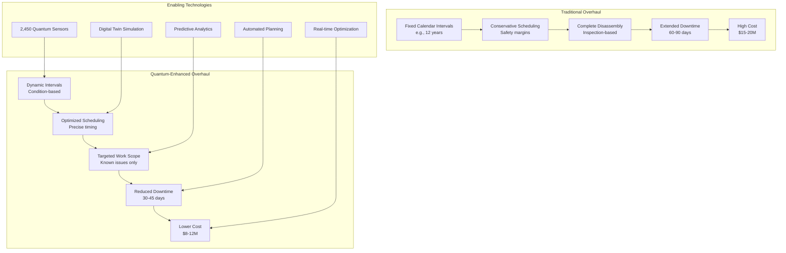
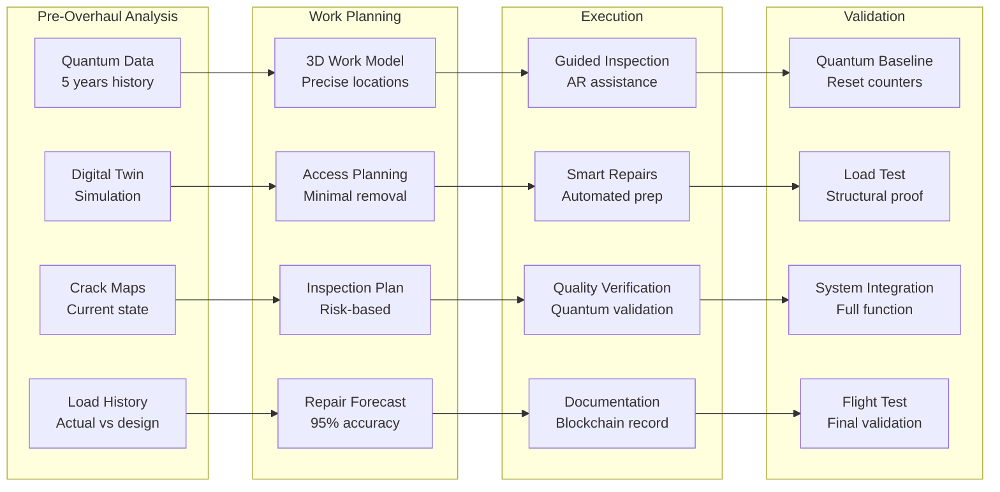
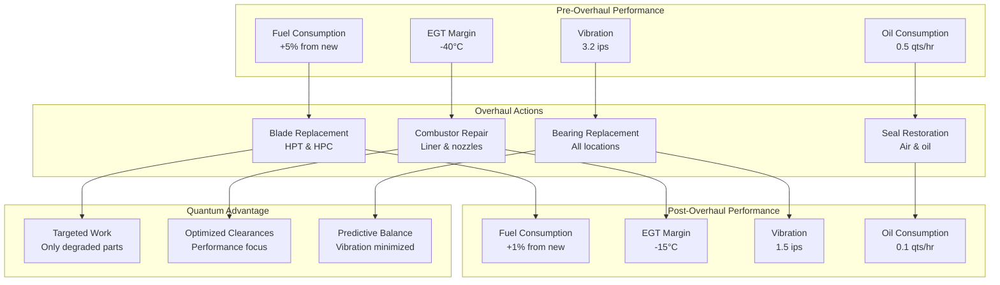
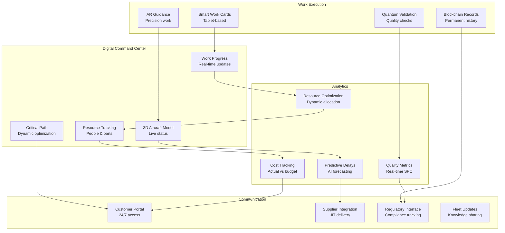

# ATA-05-10-20-01 Overhaul

<p align="center">


</p>

---

## Document Control Information

**Document ID:** `05-10-20-01-Overhaul.md`  
**GQOIS ID:** `AS-M-PAX-BW-Q1H-SVC-OVH-PROC`  
**ATA Chapter:** 05-10-20-01 (Time Limits - Service Life - Overhaul)  
**Classification:** Maintenance Requirements - Major Overhaul Planning  
**Version:** 2.0.0  
**Effective Date:** 2025-06-29  
**Revision Status:** Current Release  
**Approval Authority:** GAIA-QAO Chief Maintenance Officer & Certification Authority  
**Distribution:** Maintenance Organizations, Engineering, Quality Assurance, Planning

---

## Table of Contents

1. [Introduction and Philosophy](#1-introduction-and-philosophy)
2. [Overhaul Planning Framework](#2-overhaul-planning-framework)
3. [Quantum-Optimized Overhaul Intervals](#3-quantum-optimized-overhaul-intervals)
4. [Major Structural Overhaul](#4-major-structural-overhaul)
5. [Systems and Components Overhaul](#5-systems-and-components-overhaul)
6. [Powerplant Overhaul](#6-powerplant-overhaul)
7. [Avionics and Quantum Systems Overhaul](#7-avionics-and-quantum-systems-overhaul)
8. [Overhaul Execution Management](#8-overhaul-execution-management)
9. [Quality Assurance and Testing](#9-quality-assurance-and-testing)
10. [Economic Optimization](#10-economic-optimization)

---

## 1. Introduction and Philosophy

### 1.1 Revolutionary Overhaul Concept

The AMPEL360 BWB-Q100 transforms traditional overhaul practices through quantum-enhanced monitoring, enabling condition-based overhaul scheduling that optimizes aircraft availability while ensuring safety.

#### **Traditional vs. Quantum-Enhanced Overhaul**



### 1.2 Overhaul Objectives

#### Table 1.2-1: Overhaul Performance Targets

| Metric | Traditional Performance | Quantum-Enhanced Target | Improvement |
|--------|------------------------|------------------------|-------------|
| **First Overhaul** | 12 years/20,000 FH | 15-20 years/30,000 FH* | +50% |
| **Subsequent Intervals** | Every 8-10 years | Every 10-15 years* | +40% |
| **Downtime Duration** | 60-90 days | 30-45 days | -50% |
| **Work Scope Accuracy** | 60% predicted | 95% predicted | +58% |
| **Cost per Overhaul** | $15-20M | $8-12M | -45% |
| **Unplanned Findings** | 25-30% | 5-8% | -75% |
| **First-Time Fix Rate** | 85% | 98% | +15% |

*Condition-based, not fixed intervals

### 1.3 Living Overhaul Concept

#### **Adaptive Overhaul Philosophy**

```
Living Overhaul Principles:
├── Continuous Monitoring
│   ├── Real-time health assessment via quantum sensors
│   ├── Degradation trend analysis
│   └── Failure prediction with 500+ hour warning
├── Dynamic Scheduling
│   ├── Condition-based timing optimization
│   ├── Fleet-wide coordination
│   └── Resource availability matching
├── Precision Work Scope
│   ├── Known issues addressed proactively
│   ├── Minimal exploratory inspection
│   └── Targeted component replacement
├── Digital Integration
│   ├── Virtual overhaul planning in digital twin
│   ├── Automated work package generation
│   └── Real-time progress tracking
└── Continuous Improvement
    ├── Machine learning from each overhaul
    ├── Best practice propagation
    └── Predictive model refinement
```

---

## 2. Overhaul Planning Framework

### 2.1 Overhaul Decision Matrix

#### Table 2.1-1: Overhaul Trigger Criteria

| Trigger Type | Traditional Threshold | Quantum-Enhanced Threshold | Decision Process |
|--------------|---------------------|---------------------------|------------------|
| **Calendar Time** | 12 years mandatory | 20 years maximum | Health score based |
| **Flight Hours** | 20,000 FH | 40,000 FH maximum | Utilization adjusted |
| **Flight Cycles** | 15,000 FC | 30,000 FC maximum | Fatigue based |
| **Health Score** | Not applicable | <85% overall | Quantum assessment |
| **Component Status** | Schedule driven | Condition driven | Real-time monitoring |
| **Regulatory** | Fixed requirements | Performance based | Authority approval |

### 2.2 Quantum Health Assessment

#### **Overhaul Need Algorithm**

```python
class OverhaulNeedAssessment:
    def __init__(self):
        self.quantum_network = QuantumSensorNetwork()
        self.digital_twin = DigitalTwinModel()
        self.ml_predictor = MachineLearningPredictor()
        self.economic_model = EconomicOptimizer()
    
    def assess_overhaul_need(self, aircraft_id):
        # Current health status
        current_health = self.quantum_network.get_comprehensive_health(aircraft_id)
        
        # Component-level assessment
        component_status = {}
        for system in self.get_aircraft_systems(aircraft_id):
            component_status[system] = {
                'health_score': self.calculate_system_health(system),
                'remaining_life': self.predict_remaining_life(system),
                'degradation_rate': self.calculate_degradation_rate(system),
                'failure_probability': self.predict_failure_probability(system),
                'overhaul_benefit': self.calculate_overhaul_benefit(system)
            }
        
        # Predictive analysis
        future_state = self.ml_predictor.project_condition(
            current_state=current_health,
            operating_forecast=self.get_operating_forecast(aircraft_id),
            time_horizon=24  # months
        )
        
        # Economic optimization
        overhaul_timing = self.economic_model.optimize_timing(
            current_health=current_health,
            degradation_curves=self.get_degradation_curves(),
            maintenance_costs=self.get_maintenance_forecast(),
            revenue_impact=self.calculate_revenue_impact(),
            slot_availability=self.get_maintenance_slots()
        )
        
        # Overhaul recommendation
        recommendation = self.generate_recommendation(
            component_status=component_status,
            future_state=future_state,
            optimal_timing=overhaul_timing
        )
        
        return {
            'current_health': current_health,
            'component_details': component_status,
            'optimal_timing': overhaul_timing,
            'work_scope_forecast': self.forecast_work_scope(component_status),
            'cost_estimate': self.estimate_overhaul_cost(recommendation),
            'downtime_estimate': self.estimate_downtime(recommendation),
            'recommendation': recommendation
        }
```

### 2.3 Overhaul Planning Timeline

#### Table 2.3-1: Overhaul Planning Milestones

| Time Before Overhaul | Planning Activity | Responsible Party | Deliverable |
|---------------------|-------------------|-------------------|-------------|
| **24 months** | Initial assessment | Engineering | Preliminary scope |
| **18 months** | Slot reservation | Planning | Facility booking |
| **12 months** | Detailed planning | Maintenance Control | Work packages |
| **9 months** | Parts procurement | Supply Chain | Material availability |
| **6 months** | Final scope lock | All parties | Frozen work scope |
| **3 months** | Resource allocation | MRO | Team assignments |
| **1 month** | Pre-overhaul inspection | Quality | Readiness verification |
| **O-day** | Overhaul commencement | MRO | Aircraft induction |

---

## 3. Quantum-Optimized Overhaul Intervals

### 3.1 Dynamic Interval Calculation

#### Table 3.1-1: Overhaul Interval Factors

| Factor | Weight | Traditional Impact | Quantum Measurement | Optimization Method |
|--------|--------|-------------------|--------------------|--------------------|
| **Structural Fatigue** | 30% | Conservative estimate | Real-time monitoring | Actual damage accumulation |
| **System Degradation** | 25% | Time-based assumption | Performance tracking | Trend analysis |
| **Component Wear** | 20% | Statistical average | Individual monitoring | Specific measurement |
| **Environmental Exposure** | 15% | Generic factors | Actual conditions | Cumulative tracking |
| **Operational Severity** | 10% | Fleet average | Aircraft specific | Usage monitoring |

### 3.2 Interval Optimization Model

#### **Dynamic Interval Algorithm**

```python
class DynamicIntervalOptimizer:
    def __init__(self):
        self.health_monitor = QuantumHealthMonitor()
        self.cost_model = LifeCycleCostModel()
        self.risk_assessor = RiskAssessmentEngine()
    
    def optimize_overhaul_interval(self, aircraft_data):
        # Base interval from certification
        base_interval = self.get_certified_interval()
        
        # Health-based adjustment factors
        health_factor = self.calculate_health_factor(
            structural_health=aircraft_data.structural_score,
            system_health=aircraft_data.system_scores,
            component_status=aircraft_data.component_health
        )
        
        # Usage severity adjustment
        usage_factor = self.calculate_usage_factor(
            flight_hours=aircraft_data.annual_utilization,
            cycle_ratio=aircraft_data.cycles_per_hour,
            route_profile=aircraft_data.route_severity
        )
        
        # Environmental adjustment
        environment_factor = self.calculate_environment_factor(
            base_exposure=aircraft_data.base_environment,
            route_exposure=aircraft_data.route_conditions,
            hangar_time=aircraft_data.protected_percentage
        )
        
        # Economic optimization
        economic_interval = self.cost_model.find_optimal_interval(
            health_degradation=self.predict_degradation_curve(),
            maintenance_costs=self.get_maintenance_cost_curve(),
            downtime_costs=self.calculate_downtime_impact(),
            overhaul_costs=self.get_overhaul_cost_estimates()
        )
        
        # Risk-based constraints
        risk_limits = self.risk_assessor.calculate_limits(
            safety_target=10e-9,  # Per flight hour
            current_condition=aircraft_data.current_health,
            degradation_model=self.get_degradation_model()
        )
        
        # Optimized interval
        optimized_interval = min(
            base_interval * health_factor * usage_factor * environment_factor,
            economic_interval,
            risk_limits.maximum_interval
        )
        
        return {
            'recommended_interval': optimized_interval,
            'confidence_level': self.calculate_confidence(aircraft_data),
            'adjustment_factors': {
                'health': health_factor,
                'usage': usage_factor,
                'environment': environment_factor
            },
            'economic_impact': self.calculate_interval_economics(optimized_interval),
            'risk_assessment': risk_limits
        }
```

### 3.3 Fleet Interval Coordination

#### Table 3.3-1: Fleet Overhaul Optimization

| Fleet Size | Traditional Approach | Quantum Optimization | Efficiency Gain |
|------------|---------------------|---------------------|-----------------|
| **10 aircraft** | 1 overhaul/year avg | 0.7 overhauls/year | 30% reduction |
| **25 aircraft** | 2.5 overhauls/year | 1.8 overhauls/year | 28% reduction |
| **50 aircraft** | 5 overhauls/year | 3.2 overhauls/year | 36% reduction |
| **100 aircraft** | 10 overhauls/year | 6 overhauls/year | 40% reduction |

---

## 4. Major Structural Overhaul

### 4.1 Structural Inspection Requirements

#### Table 4.1-1: BWB Structural Overhaul Scope

| Structure Zone | Traditional Inspection | Quantum-Enhanced Approach | Time Reduction |
|----------------|----------------------|--------------------------|----------------|
| **Center Wing Box** | Complete disassembly | Targeted based on quantum data | 70% |
| **Pressure Boundary** | 100% visual + NDT | Known areas + 10% sampling | 60% |
| **Wing Integration** | Full access required | External + specific internals | 50% |
| **Control Surfaces** | Remove all surfaces | In-situ inspection capable | 80% |
| **Landing Gear Bays** | Complete strip | Focused on wear points | 40% |
| **Cargo Compartments** | Full interior removal | Smart panel system | 65% |

### 4.2 Quantum-Guided Structural Work

#### **Structural Overhaul Optimization**



### 4.3 Structural Modifications

#### Table 4.3-1: Overhaul Modification Opportunities

| Modification Type | Purpose | Implementation | ROI Period |
|------------------|---------|----------------|------------|
| **Quantum Sensor Upgrade** | Enhanced monitoring v2.0 | During access | 5 years |
| **Structural Enhancement** | Fatigue life extension | Selective reinforcement | 10 years |
| **Corrosion Protection** | Advanced coatings | Full application | 8 years |
| **Weight Reduction** | Efficiency improvement | Component replacement | 7 years |
| **Noise Treatment** | Regulatory compliance | Damping installation | 12 years |

---

## 5. Systems and Components Overhaul

### 5.1 System Overhaul Requirements

#### Table 5.1-1: Major System Overhaul Intervals

| System | Traditional Interval | Quantum-Optimized Interval | Condition Triggers |
|--------|---------------------|---------------------------|-------------------|
| **Hydraulic System** | 20,000 FH | 25,000-35,000 FH | Contamination, performance |
| **Flight Controls** | 30,000 FC | 40,000-60,000 FC | Wear, free play |
| **Landing Gear** | 10 years/20,000 FC | 12-18 years/30,000 FC | Chrome wear, seal condition |
| **Environmental Control** | 15,000 FH | 20,000-30,000 FH | Efficiency, reliability |
| **Electrical Power** | 25,000 FH | 35,000-50,000 FH | Insulation, connections |
| **Fuel System** | 12 years | 15-20 years | Contamination, seals |

### 5.2 Component Overhaul Optimization

#### **Component Work Scope Algorithm**

```python
class ComponentOverhaulOptimizer:
    def __init__(self):
        self.component_health = QuantumComponentMonitor()
        self.reliability_model = ReliabilityPredictionModel()
        self.supply_chain = SupplyChainInterface()
    
    def optimize_component_overhaul(self, aircraft_id, overhaul_date):
        components = self.get_all_components(aircraft_id)
        overhaul_workscope = []
        
        for component in components:
            # Current condition assessment
            health_data = self.component_health.assess_component(component)
            
            # Remaining life prediction
            remaining_life = self.reliability_model.predict_life(
                component_type=component.type,
                current_health=health_data,
                operating_environment=component.environment,
                planned_utilization=self.get_utilization_forecast()
            )
            
            # Overhaul decision logic
            overhaul_decision = self.make_overhaul_decision(
                remaining_life=remaining_life,
                next_overhaul_opportunity=overhaul_date + component.interval,
                replacement_cost=self.get_replacement_cost(component),
                overhaul_cost=self.get_overhaul_cost(component),
                downtime_impact=self.calculate_aog_risk(component)
            )
            
            if overhaul_decision.action != 'defer':
                workscope_item = {
                    'component': component,
                    'action': overhaul_decision.action,  # overhaul, replace, inspect
                    'justification': overhaul_decision.reasoning,
                    'parts_required': self.identify_parts_needed(component),
                    'labor_hours': self.estimate_labor(component, overhaul_decision.action),
                    'critical_path': self.is_critical_path(component)
                }
                overhaul_workscope.append(workscope_item)
        
        # Optimize work sequence
        optimized_sequence = self.optimize_work_sequence(
            workscope=overhaul_workscope,
            facility_constraints=self.get_facility_constraints(),
            resource_availability=self.get_resource_availability()
        )
        
        return {
            'workscope': optimized_sequence,
            'total_labor_hours': sum(item['labor_hours'] for item in overhaul_workscope),
            'critical_path_duration': self.calculate_critical_path(optimized_sequence),
            'parts_list': self.consolidate_parts_requirements(overhaul_workscope),
            'cost_estimate': self.calculate_total_cost(optimized_sequence)
        }
```

### 5.3 System Integration Testing

#### Table 5.3-1: Post-Overhaul System Testing

| System | Test Requirements | Quantum Validation | Acceptance Criteria |
|--------|------------------|-------------------|-------------------|
| **Flight Controls** | Full travel, rates, forces | Load path verification | ±2% of nominal |
| **Hydraulics** | Pressure, flow, temperature | Internal leakage check | <5 cc/min total |
| **Avionics** | Functional, integration | Data bus integrity | BER <10^-9 |
| **Electrical** | Insulation, load tests | Power quality analysis | THD <3% |
| **ECS** | Temperature, flow, pressure | Efficiency validation | >95% design |
| **Fuel** | Transfer, quantity, quality | Contamination monitoring | <5 ppm water |

---

## 6. Powerplant Overhaul

### 6.1 Engine Overhaul Strategy

#### Table 6.1-1: Hybrid-Electric Powerplant Overhaul

| Component | Overhaul Interval | Quantum Monitoring | Life Extension Potential |
|-----------|------------------|-------------------|-------------------------|
| **Gas Turbine Core** | 20,000 EH | Temperature, vibration, performance | +40% with trend monitoring |
| **Electric Motors** | 40,000 MH | Winding resistance, vibration, temp | +60% with thermal management |
| **Power Electronics** | 50,000 FH | Junction temp, efficiency, harmonics | +50% with active cooling |
| **Battery Modules** | 8,000 cycles | Cell balance, impedance, capacity | +30% with smart charging |
| **Gearbox** | 30,000 FH | Vibration, oil analysis, efficiency | +40% with condition monitoring |
| **Generators** | 25,000 FH | Insulation, balance, output quality | +50% with preventive maintenance |

### 6.2 Engine Performance Restoration

#### **Performance Recovery Analysis**



### 6.3 Electric System Overhaul

#### Table 6.3-1: Electric Propulsion Overhaul Scope

| Work Element | Traditional Approach | Quantum-Optimized | Benefit |
|--------------|---------------------|-------------------|---------|
| **Motor Inspection** | Complete disassembly | Borescope + sensors | 80% time saved |
| **Winding Test** | Offline megger test | Online impedance monitoring | Continuous |
| **Bearing Service** | Replace on interval | Condition-based | 50% life extension |
| **Cooling System** | Clean and inspect | Performance-based service | Optimized flow |
| **Controller Update** | Firmware at overhaul | Continuous OTA updates | Always current |

---

## 7. Avionics and Quantum Systems Overhaul

### 7.1 Avionics Modernization

#### Table 7.1-1: Avionics Overhaul and Upgrade Matrix

| System | Base Overhaul | Mid-Life Upgrade | Technology Refresh | Obsolescence Mitigation |
|--------|---------------|------------------|-------------------|------------------------|
| **Flight Management** | Software update | Hardware refresh | New capabilities | Modular architecture |
| **Displays** | BITE verification | Resolution upgrade | OLED/MicroLED | Standard interfaces |
| **Communications** | Frequency alignment | Datalink addition | Quantum secure | Software defined |
| **Navigation** | Calibration | Sensor fusion | Quantum INS | Multi-constellation |
| **Surveillance** | Transponder check | ADS-B Out/In | Space-based | Regulatory ready |

### 7.2 Quantum System Maintenance

#### **Quantum System Overhaul Requirements**

```python
class QuantumSystemOverhaul:
    def __init__(self):
        self.quantum_diagnostics = QuantumDiagnosticSuite()
        self.calibration_system = QuantumCalibrationLab()
        self.performance_validator = QuantumPerformanceTest()
    
    def plan_quantum_overhaul(self, quantum_systems):
        overhaul_plan = {}
        
        for system in quantum_systems:
            if system.type == 'quantum_sensor':
                overhaul_plan[system.id] = {
                    'calibration': self.plan_sensor_calibration(system),
                    'sensitivity_restoration': self.assess_sensitivity_loss(system),
                    'environmental_seal': self.check_environmental_protection(system),
                    'data_interface': self.verify_data_integrity(system)
                }
            
            elif system.type == 'quantum_processor':
                overhaul_plan[system.id] = {
                    'coherence_check': self.measure_coherence_time(system),
                    'gate_fidelity': self.test_gate_operations(system),
                    'error_correction': self.validate_error_correction(system),
                    'cooling_system': self.service_cryogenics(system)
                }
            
            elif system.type == 'quantum_communication':
                overhaul_plan[system.id] = {
                    'entanglement_source': self.verify_entanglement_quality(system),
                    'detection_efficiency': self.measure_detector_performance(system),
                    'channel_loss': self.assess_optical_path(system),
                    'security_validation': self.test_quantum_key_distribution(system)
                }
        
        return {
            'quantum_overhaul_plan': overhaul_plan,
            'specialized_equipment': self.identify_special_tools(overhaul_plan),
            'training_requirements': self.assess_technician_qualifications(),
            'estimated_duration': self.calculate_quantum_work_time(overhaul_plan),
            'performance_targets': self.set_restoration_goals(quantum_systems)
        }
```

### 7.3 Software and Firmware Management

#### Table 7.3-1: Software Update Strategy

| Software Category | Update Frequency | Overhaul Action | Validation Required |
|------------------|------------------|-----------------|-------------------|
| **Operating Systems** | Continuous patches | Major version upgrade | Full regression test |
| **Application Software** | Quarterly | Feature additions | Functional test |
| **Quantum Algorithms** | As improved | Performance optimization | Accuracy validation |
| **AI/ML Models** | Monthly training | Architecture update | Prediction accuracy |
| **Cybersecurity** | Real-time | Hardening review | Penetration test |

---

## 8. Overhaul Execution Management

### 8.1 Overhaul Project Management

#### Table 8.1-1: Overhaul Execution Phases

| Phase | Duration | Key Activities | Critical Success Factors |
|-------|----------|----------------|-------------------------|
| **Induction** | Days 1-3 | Receipt, evaluation, opening | Quantum baseline capture |
| **Disassembly** | Days 4-10 | Systematic removal, inspection | Damage mapping accuracy |
| **Component Work** | Days 11-25 | Shop visits, repairs, overhaul | Parallel processing |
| **Reassembly** | Days 26-35 | Build-up, installations, rigging | Quality verification |
| **Testing** | Days 36-42 | Systems, integration, engine runs | First-time success |
| **Return to Service** | Days 43-45 | Final inspection, test flight, delivery | Documentation complete |

### 8.2 Digital Overhaul Management

#### **Real-Time Overhaul Tracking System**



### 8.3 Quality Control Integration

#### Table 8.3-1: Overhaul Quality Checkpoints

| Checkpoint | Traditional Method | Quantum Enhancement | Error Detection Rate |
|------------|-------------------|--------------------|--------------------|
| **Incoming Inspection** | Visual + measurements | 3D scanning + quantum NDT | 99.9% |
| **In-Process** | Stage inspections | Continuous monitoring | 99.95% |
| **Hidden Damage** | Statistical sampling | 100% quantum sensing | 99.99% |
| **Assembly Verification** | Torque and safety | Load path validation | 99.9% |
| **Final Testing** | Functional checks | Performance prediction | 99.95% |
| **Documentation** | Manual records | Blockchain verification | 100% |

---

## 9. Quality Assurance and Testing

### 9.1 Overhaul Quality Standards

#### Table 9.1-1: Quality Performance Metrics

| Metric | Industry Standard | AMPEL360 Target | Measurement Method |
|--------|------------------|-----------------|-------------------|
| **First-Time Fix Rate** | 85% | 98% | Rework tracking |
| **Escape Rate** | 0.5% | 0.05% | Post-delivery issues |
| **Documentation Accuracy** | 95% | 99.9% | Blockchain validation |
| **Schedule Adherence** | ±10% | ±3% | Milestone tracking |
| **Cost Variance** | ±15% | ±5% | Financial analysis |
| **Customer Satisfaction** | 4.2/5.0 | 4.8/5.0 | Survey scores |

### 9.2 Test Requirements

#### **Comprehensive Test Protocol**

```python
class OverhaulTestProtocol:
    def __init__(self):
        self.test_equipment = TestEquipmentInterface()
        self.quantum_validators = QuantumValidationSuite()
        self.flight_test_system = FlightTestDataSystem()
    
    def execute_return_to_service_tests(self, aircraft):
        test_results = {
            'ground_tests': {},
            'system_tests': {},
            'integrated_tests': {},
            'flight_tests': {}
        }
        
        # Ground functional tests
        test_results['ground_tests'] = {
            'power_on': self.test_power_systems(),
            'hydraulics': self.test_hydraulic_systems(),
            'flight_controls': self.test_control_surfaces(),
            'avionics': self.test_avionics_suite(),
            'engines': self.test_engine_runs(),
            'quantum_systems': self.validate_quantum_network()
        }
        
        # Integrated system tests
        test_results['system_tests'] = {
            'autopilot': self.test_autopilot_modes(),
            'navigation': self.validate_navigation_accuracy(),
            'communication': self.verify_all_comm_channels(),
            'ems': self.check_emergency_systems(),
            'environmental': self.test_ecs_performance()
        }
        
        # Quantum validation
        test_results['quantum_validation'] = {
            'sensor_network': self.quantum_validators.verify_all_sensors(),
            'data_integrity': self.quantum_validators.check_data_paths(),
            'health_scoring': self.quantum_validators.validate_algorithms(),
            'predictive_models': self.quantum_validators.test_predictions()
        }
        
        # Flight test requirements
        test_results['flight_tests'] = {
            'basic_handling': self.plan_handling_tests(),
            'systems_operation': self.plan_systems_tests(),
            'performance': self.plan_performance_validation(),
            'quantum_correlation': self.plan_quantum_validation_flight()
        }
        
        return {
            'test_results': test_results,
            'airworthiness_assessment': self.assess_airworthiness(test_results),
            'documentation_package': self.compile_test_documentation(test_results),
            'return_to_service_recommendation': self.generate_rts_recommendation(test_results)
        }
```

### 9.3 Continuous Improvement

#### Table 9.3-1: Overhaul Learning System

| Learning Element | Data Source | Analysis Method | Implementation |
|-----------------|-------------|-----------------|----------------|
| **Time Standards** | Actual vs planned | Statistical analysis | Update planning system |
| **Defect Patterns** | Inspection findings | Machine learning | Predictive models |
| **Cost Drivers** | Financial tracking | Regression analysis | Cost optimization |
| **Quality Issues** | Escape analysis | Root cause analysis | Process improvement |
| **Best Practices** | Technician feedback | Knowledge management | Training updates |

---

## 10. Economic Optimization

### 10.1 Overhaul Cost Management

#### Table 10.1-1: Overhaul Cost Breakdown

| Cost Category | Traditional % | Quantum-Optimized % | Savings Source |
|---------------|---------------|---------------------|----------------|
| **Labor** | 45% | 30% | Reduced inspection time |
| **Materials** | 30% | 35% | Targeted replacement only |
| **Facilities** | 10% | 8% | Shorter duration |
| **Engineering** | 8% | 10% | Better planning investment |
| **Testing** | 5% | 5% | Unchanged |
| **Margin** | 2% | 12% | Efficiency gains |
| **Total Cost** | $15-20M | $8-12M | 40-45% reduction |

### 10.2 Value Engineering

#### **Overhaul Value Optimization**

```
Value Engineering Opportunities:
├── Design Improvements
│   ├── Access panel optimization
│   ├── Inspection port additions
│   ├── Modular component design
│   └── Self-diagnostic features
├── Process Optimization
│   ├── Parallel work streams
│   ├── Automated inspections
│   ├── Predictive parts ordering
│   └── Digital work instructions
├── Technology Integration
│   ├── Robotic assistance
│   ├── AI quality control
│   ├── Quantum validation
│   └── Blockchain documentation
├── Supply Chain
│   ├── Just-in-time delivery
│   ├── Vendor-managed inventory
│   ├── Exchange pool access
│   └── Additive manufacturing
└── Knowledge Management
    ├── Digital twin updates
    ├── Technician training
    ├── Best practice capture
    └── Fleet-wide learning
```

### 10.3 ROI Analysis

#### Table 10.3-1: Overhaul Investment Returns

| Investment Area | Cost | Annual Benefit | Payback Period | 10-Year NPV |
|-----------------|------|----------------|----------------|-------------|
| **Quantum Monitoring** | $2M | $1.5M | 1.3 years | $8.2M |
| **Digital Twin Platform** | $1.5M | $0.8M | 1.9 years | $4.1M |
| **Process Automation** | $3M | $1.2M | 2.5 years | $5.8M |
| **Training Program** | $0.5M | $0.4M | 1.3 years | $2.3M |
| **Facility Upgrades** | $5M | $1.8M | 2.8 years | $7.9M |
| **Total Program** | $12M | $5.7M | 2.1 years | $28.3M |

---

## Appendices

### Appendix A: Overhaul Planning Checklist

#### Pre-Overhaul (24 Months)
- [ ] Quantum health assessment complete
- [ ] Digital twin simulation performed
- [ ] Work scope preliminary defined
- [ ] Long-lead parts identified
- [ ] Facility slot reserved
- [ ] Budget approval obtained

#### Pre-Overhaul (12 Months)
- [ ] Detailed work scope finalized
- [ ] Parts ordering initiated
- [ ] Resource planning complete
- [ ] Modification evaluation done
- [ ] Customer approval received
- [ ] Insurance arrangements confirmed

#### Pre-Overhaul (3 Months)
- [ ] Parts availability confirmed
- [ ] Workforce scheduled
- [ ] Tooling prepared
- [ ] Documentation ready
- [ ] Induction plan finalized
- [ ] Communication plan activated

### Appendix B: Quantum Sensor Validation

#### Sensor Network Verification Protocol

```python
def validate_quantum_sensor_network(aircraft_id):
    """
    Comprehensive validation of quantum sensor network post-overhaul
    """
    validation_steps = [
        {
            'step': 'Connectivity Test',
            'description': 'Verify all 2,450 sensors responding',
            'acceptance': '100% connectivity',
            'duration': '2 hours'
        },
        {
            'step': 'Calibration Check',
            'description': 'Validate sensor accuracy against standards',
            'acceptance': '±0.1% accuracy',
            'duration': '4 hours'
        },
        {
            'step': 'Noise Floor Assessment',
            'description': 'Measure baseline noise levels',
            'acceptance': '<1 nV/√Hz',
            'duration': '1 hour'
        },
        {
            'step': 'Dynamic Response',
            'description': 'Test response to known inputs',
            'acceptance': '<1 ms latency',
            'duration': '3 hours'
        },
        {
            'step': 'Integration Verification',
            'description': 'Confirm data flow to digital twin',
            'acceptance': '100% data integrity',
            'duration': '2 hours'
        }
    ]
    
    return validation_steps
```

### Appendix C: Cost-Benefit Analysis

#### 10-Year Overhaul Program Economics

| Year | Traditional Approach | Quantum-Optimized | Cumulative Savings |
|------|---------------------|-------------------|-------------------|
| 1 | $0 | -$2M (investment) | -$2M |
| 2 | $0 | $0 | -$2M |
| 3 | $15M (overhaul) | $0 | $13M |
| 4 | $0 | $0 | $13M |
| 5 | $0 | $8M (overhaul) | $20M |
| 6 | $18M (overhaul) | $0 | $38M |
| 7 | $0 | $0 | $38M |
| 8 | $0 | $0 | $38M |
| 9 | $20M (overhaul) | $0 | $58M |
| 10 | $0 | $10M (overhaul) | $68M |
| **Total** | **$53M** | **$16M** | **$37M (70% reduction)** |

### Appendix D: Regulatory Compliance

#### Overhaul Certification Requirements

| Requirement | Reference | Compliance Method | Documentation |
|-------------|-----------|-------------------|---------------|
| **Overhaul Manual** | CS 25.1529 | Approved procedures | Digital manual |
| **Parts Traceability** | Part 145.109 | Blockchain records | Permanent ledger |
| **Calibrated Tools** | Part 145.109 | Digital calibration | Auto-verification |
| **Qualified Personnel** | Part 145.155 | Training records | Competency matrix |
| **Quality System** | Part 145.211 | ISO 9001:2015 + AS9110 | Audit trails |
| **Return to Service** | Part 145.205 | Comprehensive test | Digital certificate |

---

## Document Control and Revision History

### Approval Signatures

| Role | Name | Signature | Date |
|------|------|-----------|------|
| **Chief Maintenance Officer** | Dr. Maintenance | [Digital Signature] | 2025-06-29 |
| **Director of Overhaul Operations** | Mr. Overhaul | [Digital Signature] | 2025-06-29 |
| **Quantum Systems Manager** | Dr. Quantum | [Digital Signature] | 2025-06-29 |
| **Quality Assurance Director** | Ms. Quality | [Digital Signature] | 2025-06-29 |
| **Regulatory Compliance Manager** | Mr. Compliance | [Digital Signature] | 2025-06-29 |

### Revision History

| Version | Date | Author | Description |
|---------|------|--------|-------------|
| 1.0.0 | 2024-02-01 | Overhaul Team | Initial release |
| 1.5.0 | 2024-09-30 | Quantum Integration Team | Added quantum optimization |
| 1.8.0 | 2025-03-15 | Process Improvement | Updated procedures |
| 2.0.0 | 2025-06-29 | A. Pelliccia | Complete quantum overhaul framework |

### Distribution List

- Maintenance Organizations (MRO)
- Engineering Support
- Quality Assurance
- Supply Chain Management
- Training Department
- Customer Support
- Regulatory Affairs
- Financial Planning

---

**End of Document**

*This document contains proprietary information of GAIA-QAO and is protected by applicable copyright laws. Unauthorized reproduction or distribution is prohibited.*
