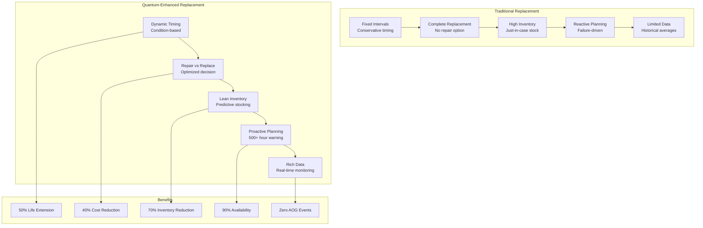
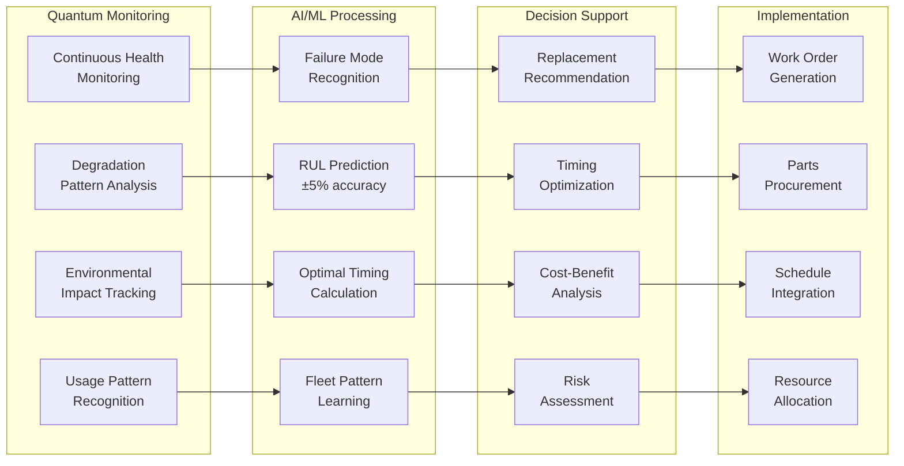
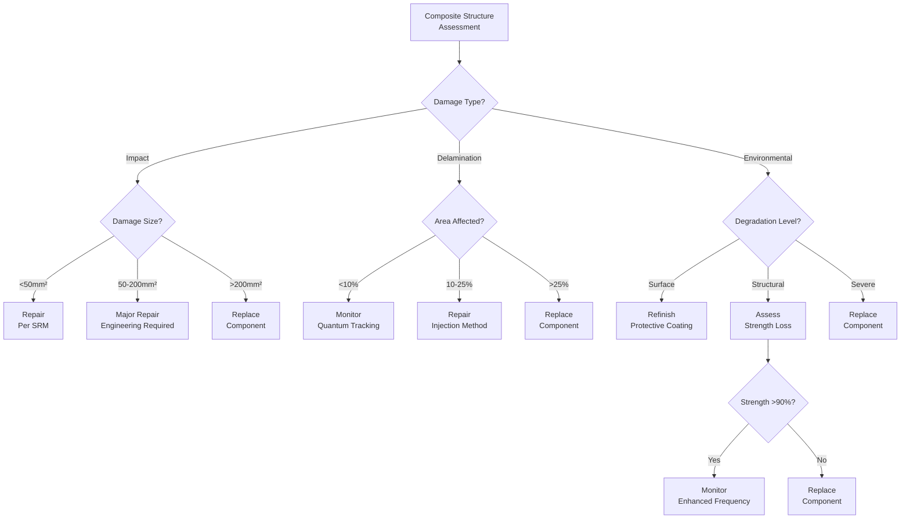
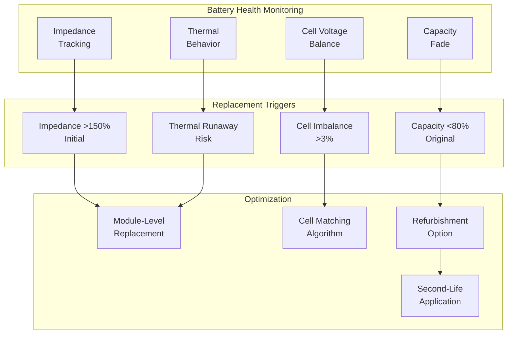
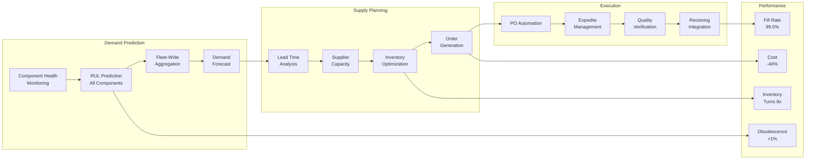
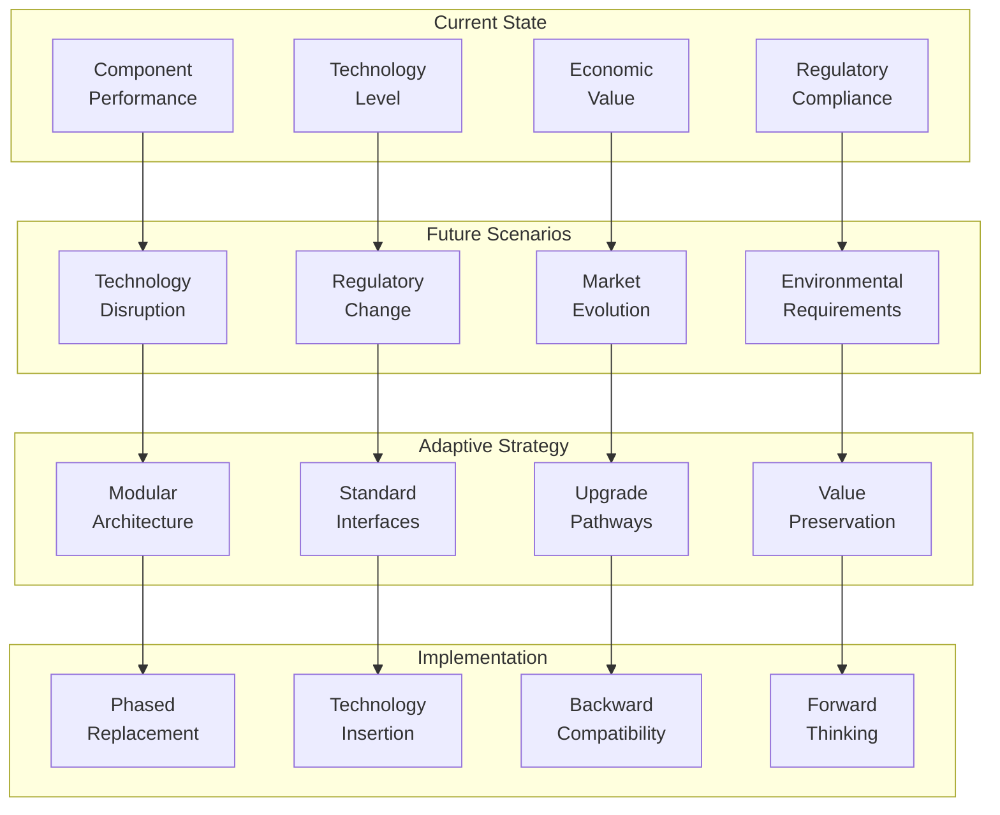

# ATA-05-10-20-02 Replacement

<p align="center">


</p>

---

## Document Control Information

**Document ID:** `05-10-20-02-Replacement.md`  
**GQOIS ID:** `AS-M-PAX-BW-Q1H-SVC-RPL-PROC`  
**ATA Chapter:** 05-10-20-02 (Time Limits - Service Life - Replacement)  
**Classification:** Maintenance Requirements - Component Replacement Management  
**Version:** 2.0.0  
**Effective Date:** 2025-06-29  
**Revision Status:** Current Release  
**Approval Authority:** GAIA-QAO Chief Engineering Officer & Certification Authority  
**Distribution:** Maintenance Planning, Supply Chain, Engineering, Finance

---

## Table of Contents

1. [Introduction and Philosophy](#1-introduction-and-philosophy)
2. [Replacement Decision Framework](#2-replacement-decision-framework)
3. [Quantum-Enhanced Replacement Optimization](#3-quantum-enhanced-replacement-optimization)
4. [Structural Replacement Criteria](#4-structural-replacement-criteria)
5. [System Component Replacement](#5-system-component-replacement)
6. [Powerplant Replacement Strategy](#6-powerplant-replacement-strategy)
7. [Avionics and Technology Refresh](#7-avionics-and-technology-refresh)
8. [Economic Replacement Analysis](#8-economic-replacement-analysis)
9. [Supply Chain Integration](#9-supply-chain-integration)
10. [Future-Proofing Replacement Decisions](#10-future-proofing-replacement-decisions)

---

## 1. Introduction and Philosophy

### 1.1 Revolutionary Replacement Concept

The AMPEL360 BWB-Q100 implements a paradigm shift in component replacement philosophy, moving from calendar-based or hard-time replacement to intelligent, condition-based decisions enabled by quantum monitoring.

#### **Traditional vs. Quantum-Enhanced Replacement**



### 1.2 Replacement Objectives

#### Table 1.2-1: Replacement Strategy Performance Targets

| Metric | Traditional Performance | Quantum-Enhanced Target | Improvement |
|--------|------------------------|------------------------|-------------|
| **Component Utilization** | 60-70% of potential | 95%+ of safe life | +40% |
| **Unscheduled Removals** | 25% of replacements | <5% of replacements | -80% |
| **No Fault Found** | 15% of removals | <1% of removals | -93% |
| **Inventory Turns** | 2-3 per year | 6-8 per year | +200% |
| **AOG Events** | 0.8 per 1000 FH | <0.05 per 1000 FH | -94% |
| **Replacement Cost/FH** | $450 | $270 | -40% |

### 1.3 Intelligent Replacement Philosophy

#### **Adaptive Replacement Framework**

```
Intelligent Replacement Principles:
├── Condition-Based Decisions
│   ├── Real-time health monitoring
│   ├── Remaining useful life prediction
│   ├── Failure probability assessment
│   └── Economic optimization
├── Predictive Planning
│   ├── 500+ hour advance warning
│   ├── Maintenance opportunity alignment
│   ├── Supply chain coordination
│   └── Resource optimization
├── Value Maximization
│   ├── Core exchange programs
│   ├── Repair vs replace analysis
│   ├── Upgrade opportunity integration
│   └── End-of-life value recovery
├── Knowledge Integration
│   ├── Fleet-wide learning
│   ├── Supplier collaboration
│   ├── Digital twin updates
│   └── Continuous improvement
└── Sustainability Focus
    ├── Circular economy principles
    ├── Remanufacturing priority
    ├── Material recovery optimization
    └── Waste minimization
```

---

## 2. Replacement Decision Framework

### 2.1 Decision Hierarchy

#### Table 2.1-1: Replacement Decision Matrix

| Health Score | Remaining Life | Repair Feasibility | Economic Analysis | Decision |
|--------------|----------------|-------------------|-------------------|----------|
| >90% | >50% | N/A | N/A | Continue operation |
| 80-90% | 30-50% | Feasible | Repair < 50% replace | Schedule repair |
| 70-80% | 20-30% | Feasible | Repair < 70% replace | Evaluate options |
| 60-70% | 10-20% | Limited | Any | Plan replacement |
| <60% | <10% | Not feasible | Any | Immediate replacement |

### 2.2 Quantum Assessment Algorithm

#### **Replacement Decision Engine**

```python
class ReplacementDecisionEngine:
    def __init__(self):
        self.quantum_monitor = QuantumHealthMonitor()
        self.reliability_model = ReliabilityPredictionModel()
        self.economic_analyzer = EconomicAnalyzer()
        self.supply_chain = SupplyChainInterface()
    
    def evaluate_replacement_need(self, component):
        # Current condition assessment
        health_data = self.quantum_monitor.get_component_health(component)
        
        # Remaining useful life prediction
        rul_prediction = self.reliability_model.predict_remaining_life(
            component_type=component.type,
            current_health=health_data,
            operating_conditions=component.environment,
            historical_degradation=component.history
        )
        
        # Failure risk assessment
        failure_risk = self.calculate_failure_risk(
            remaining_life=rul_prediction,
            criticality=component.criticality,
            redundancy=component.redundancy_level,
            operational_impact=component.aog_risk
        )
        
        # Economic analysis
        economic_assessment = self.economic_analyzer.analyze_options(
            replacement_cost=self.get_replacement_cost(component),
            repair_cost=self.get_repair_estimate(component),
            downtime_cost=self.calculate_downtime_impact(component),
            remaining_value=self.calculate_residual_value(component),
            upgrade_opportunity=self.identify_upgrade_options(component)
        )
        
        # Supply chain factors
        supply_factors = self.supply_chain.assess_availability(
            part_number=component.part_number,
            lead_time=self.get_lead_time(component),
            inventory_status=self.check_inventory(),
            alternative_sources=self.identify_alternatives()
        )
        
        # Optimal timing calculation
        optimal_timing = self.calculate_optimal_timing(
            health_trajectory=rul_prediction.degradation_curve,
            maintenance_opportunities=self.get_maintenance_schedule(),
            economic_factors=economic_assessment,
            risk_tolerance=self.get_risk_parameters()
        )
        
        # Generate recommendation
        recommendation = self.generate_recommendation(
            health_data=health_data,
            rul_prediction=rul_prediction,
            failure_risk=failure_risk,
            economic_assessment=economic_assessment,
            supply_factors=supply_factors,
            optimal_timing=optimal_timing
        )
        
        return {
            'decision': recommendation.action,  # continue, monitor, repair, replace
            'timing': recommendation.timing,
            'confidence': recommendation.confidence_level,
            'economic_impact': recommendation.cost_benefit,
            'risk_assessment': failure_risk,
            'alternatives': recommendation.alternatives,
            'implementation_plan': recommendation.execution_plan
        }
```

### 2.3 Multi-Criteria Optimization

#### Table 2.3-1: Replacement Decision Factors

| Factor Category | Weight | Key Metrics | Data Source |
|-----------------|--------|-------------|-------------|
| **Safety** | 35% | Failure probability, criticality | Quantum monitoring |
| **Reliability** | 25% | MTBF, failure history | Digital twin |
| **Economics** | 20% | TCO, replacement cost | Financial systems |
| **Availability** | 10% | Lead time, stock levels | Supply chain |
| **Performance** | 10% | Efficiency, capability | Performance monitoring |

---

## 3. Quantum-Enhanced Replacement Optimization

### 3.1 Predictive Replacement Planning

#### **Quantum Prediction Capabilities**



### 3.2 Failure Prediction Accuracy

#### Table 3.2-1: Quantum Prediction Performance

| Prediction Horizon | Traditional Accuracy | Quantum-Enhanced Accuracy | Confidence Level |
|-------------------|---------------------|--------------------------|------------------|
| **100 hours** | ±50% | ±2% | 99.9% |
| **500 hours** | ±70% | ±5% | 99.5% |
| **1000 hours** | Unknown | ±10% | 98% |
| **2000 hours** | Unknown | ±15% | 95% |
| **5000 hours** | Unknown | ±25% | 90% |

### 3.3 Fleet Learning Integration

#### **Fleet-Wide Optimization System**

```python
class FleetReplacementOptimizer:
    def __init__(self):
        self.fleet_database = QuantumFleetDatabase()
        self.pattern_analyzer = PatternRecognitionEngine()
        self.optimization_engine = FleetOptimizer()
    
    def optimize_fleet_replacements(self, planning_horizon=24):  # months
        fleet_data = self.fleet_database.get_all_aircraft_data()
        
        # Identify common patterns
        failure_patterns = self.pattern_analyzer.identify_patterns(
            component_histories=fleet_data.component_histories,
            environmental_factors=fleet_data.operating_environments,
            usage_patterns=fleet_data.utilization_profiles
        )
        
        # Predict fleet-wide needs
        fleet_predictions = {}
        for aircraft in fleet_data.aircraft_list:
            fleet_predictions[aircraft.id] = self.predict_replacement_needs(
                aircraft=aircraft,
                patterns=failure_patterns,
                horizon=planning_horizon
            )
        
        # Optimize replacement scheduling
        optimized_schedule = self.optimization_engine.create_schedule(
            predictions=fleet_predictions,
            maintenance_slots=self.get_maintenance_capacity(),
            inventory_constraints=self.get_inventory_status(),
            budget_constraints=self.get_budget_parameters(),
            operational_requirements=self.get_flight_schedule()
        )
        
        # Bulk procurement optimization
        procurement_plan = self.optimize_procurement(
            replacement_schedule=optimized_schedule,
            lead_times=self.get_supplier_lead_times(),
            volume_discounts=self.get_pricing_tiers(),
            storage_capacity=self.get_warehouse_limits()
        )
        
        # Generate implementation plan
        implementation = self.create_implementation_plan(
            schedule=optimized_schedule,
            procurement=procurement_plan,
            resource_requirements=self.calculate_resource_needs(),
            risk_mitigation=self.identify_schedule_risks()
        )
        
        return {
            'fleet_schedule': optimized_schedule,
            'procurement_plan': procurement_plan,
            'cost_projection': self.calculate_total_costs(implementation),
            'risk_analysis': self.assess_implementation_risks(implementation),
            'kpi_forecast': self.project_performance_metrics(implementation)
        }
```

---

## 4. Structural Replacement Criteria

### 4.1 Primary Structure Replacement

#### Table 4.1-1: Structural Component Replacement Criteria

| Component | Replacement Triggers | Quantum Indicators | Decision Timeline |
|-----------|---------------------|-------------------|-------------------|
| **Wing Spars** | Crack >50mm, corrosion Level 3 | Strain >4000 μs, crack growth >0.1mm/1000FC | 1000 FH warning |
| **Pressure Bulkhead** | Crack any length, dent >5mm | Pressure cycling anomaly, strain deviation | 500 FH warning |
| **Wing Skins** | Multiple repairs, widespread fatigue | Stiffness loss >5%, multi-site damage | 2000 FH warning |
| **Fuselage Frames** | Crack >25mm, corrosion Level 2 | Load path change >10%, strain redistribution | 1500 FH warning |
| **Door Surrounds** | Crack at stop holes, distortion | Stress concentration >3x nominal | 800 FH warning |

### 4.2 Composite Structure Considerations

#### **Composite Replacement Decision Tree**



### 4.3 Structural Life Extension

#### Table 4.3-1: Structural Replacement Deferral Options

| Deferral Method | Application | Life Extension | Cost Impact |
|-----------------|-------------|----------------|-------------|
| **Reinforcement** | Doubler installation | +5,000-10,000 FC | 20% of replacement |
| **Blend Repair** | Crack stop drilling | +2,000-5,000 FC | 5% of replacement |
| **Cold Working** | Fastener holes | +10,000-20,000 FC | 15% of replacement |
| **Composite Patch** | Metal structure | +8,000-15,000 FC | 25% of replacement |
| **Monitoring** | Enhanced inspection | Condition-based | 2% annually |

---

## 5. System Component Replacement

### 5.1 Hydraulic System Components

#### Table 5.1-1: Hydraulic Component Replacement Strategy

| Component | Traditional Life | Quantum-Enhanced Life | Replacement Indicators |
|-----------|-----------------|---------------------|----------------------|
| **Engine Pump** | 20,000 FH | 25,000-35,000 FH | Flow degradation >15%, case drain >50 cc/min |
| **Actuators** | 50,000 FC | 60,000-80,000 FC | Internal leakage >5 cc/min, response time >110% |
| **Reservoirs** | On-condition | Monitored condition | Contamination trend, seal degradation |
| **Filters** | 8,000 FH | Performance-based | ΔP trend, contamination analysis |
| **Valves** | 40,000 FH | 50,000-70,000 FH | Leakage rate, response characteristics |

### 5.2 Electrical System Components

#### **Electrical Component Health Monitoring**

```python
class ElectricalComponentMonitor:
    def __init__(self):
        self.quantum_sensors = QuantumElectricalSensors()
        self.degradation_models = ElectricalDegradationModels()
        self.thermal_analyzer = ThermalAnalysisEngine()
    
    def assess_replacement_need(self, component):
        # Real-time monitoring data
        monitoring_data = {
            'insulation_resistance': self.quantum_sensors.measure_insulation(component),
            'contact_resistance': self.quantum_sensors.measure_contacts(component),
            'thermal_profile': self.thermal_analyzer.get_thermal_map(component),
            'harmonic_distortion': self.quantum_sensors.measure_harmonics(component),
            'efficiency': self.calculate_efficiency(component)
        }
        
        # Degradation analysis
        degradation_assessment = self.degradation_models.analyze(
            current_state=monitoring_data,
            historical_data=component.history,
            environmental_factors=component.environment
        )
        
        # Replacement decision factors
        decision_factors = {
            'safety_margin': self.calculate_safety_margin(degradation_assessment),
            'performance_impact': self.assess_performance_degradation(monitoring_data),
            'failure_probability': self.predict_failure_probability(degradation_assessment),
            'economic_factors': self.calculate_replacement_economics(component)
        }
        
        # Generate recommendation
        if decision_factors['safety_margin'] < 1.5:
            return {'action': 'immediate_replacement', 'urgency': 'high'}
        elif decision_factors['performance_impact'] > 0.15:
            return {'action': 'planned_replacement', 'timing': 'next_maintenance'}
        elif decision_factors['failure_probability'] > 0.01:
            return {'action': 'enhanced_monitoring', 'interval': 'daily'}
        else:
            return {'action': 'continue_operation', 'next_review': '1000_hours'}
```

### 5.3 Environmental Control Components

#### Table 5.3-1: ECS Component Replacement Optimization

| Component | Replacement Trigger | Quantum Monitoring | Cost Avoidance |
|-----------|-------------------|-------------------|----------------|
| **Air Cycle Machine** | Efficiency <85% | Bearing vibration, thermal profile | $50K/year fuel |
| **Heat Exchangers** | Effectiveness <90% | Pressure drop, thermal imaging | $30K/year fuel |
| **Compressors** | Flow <95% rated | Vibration spectrum, current draw | $40K/year operation |
| **Valves** | Leakage >spec | Position accuracy, response time | $20K/year comfort |
| **Fans** | Vibration >limit | Balance quality, bearing temp | $15K/year reliability |

---

## 6. Powerplant Replacement Strategy

### 6.1 Engine Module Replacement

#### Table 6.1-1: Engine Module Replacement Economics

| Module | Traditional Practice | Quantum-Optimized | Economic Benefit |
|--------|---------------------|-------------------|------------------|
| **Fan Module** | Replace at 25,000 FC | Blend repairs until 35,000 FC | $1.2M deferred |
| **HPC Module** | Replace at 20,000 FC | Selective blade replacement | $800K saved |
| **Combustor** | Replace at 15,000 FC | Liner repair to 22,000 FC | $600K saved |
| **HPT Module** | Replace at 18,000 FC | Coating refresh to 25,000 FC | $2.5M deferred |
| **LPT Module** | Replace at 30,000 FC | Selective replacement 40,000 FC | $1.5M deferred |

### 6.2 Electric Propulsion Components

#### **Battery Module Replacement Strategy**



### 6.3 Propulsion System Upgrade Path

#### Table 6.3-1: Technology Replacement Opportunities

| Current Technology | Replacement Option | Timeline | Benefits |
|-------------------|-------------------|----------|----------|
| **Turbofan Core** | Next-gen high-BPR | 15-20 years | 15% fuel reduction |
| **Electric Motors** | Superconducting | 10-15 years | 98% efficiency |
| **Batteries** | Solid-state | 5-10 years | 2x energy density |
| **Power Electronics** | Wide-bandgap | 5-8 years | 99% efficiency |
| **Hybrid System** | Full electric | 20-25 years | Zero emissions |

---

## 7. Avionics and Technology Refresh

### 7.1 Avionics Replacement Strategy

#### Table 7.1-1: Avionics Obsolescence Management

| System | Typical Obsolescence | Mitigation Strategy | Replacement Planning |
|--------|---------------------|--------------------|--------------------|
| **Flight Management** | 8-10 years | Software updates, modular hardware | 12-15 year refresh |
| **Displays** | 10-12 years | Technology insertion | 15-year replacement |
| **Communications** | 5-8 years | Software-defined radio | 20-year hardware |
| **Navigation** | 12-15 years | Sensor fusion updates | Incremental upgrade |
| **Surveillance** | 8-10 years | Mandate compliance | Regulatory driven |

### 7.2 Quantum System Evolution

#### **Quantum Technology Refresh Planning**

```python
class QuantumSystemRefresh:
    def __init__(self):
        self.technology_tracker = TechnologyEvolutionTracker()
        self.performance_monitor = QuantumPerformanceMonitor()
        self.cost_analyzer = TechnologyCostAnalyzer()
    
    def plan_quantum_refresh(self, current_systems, planning_horizon=10):
        refresh_plan = {}
        
        for system in current_systems:
            # Track technology evolution
            tech_evolution = self.technology_tracker.project_advancement(
                technology_type=system.technology,
                current_generation=system.generation,
                horizon_years=planning_horizon
            )
            
            # Assess current performance
            performance_gap = self.performance_monitor.compare_to_state_of_art(
                current_performance=system.performance_metrics,
                available_technology=tech_evolution.current_best,
                future_technology=tech_evolution.projected
            )
            
            # Economic analysis
            refresh_economics = self.cost_analyzer.analyze_refresh(
                replacement_cost=tech_evolution.cost_projection,
                performance_benefit=performance_gap.improvement_potential,
                integration_cost=self.estimate_integration_cost(system),
                operational_savings=self.calculate_operational_benefit(performance_gap)
            )
            
            # Optimal refresh timing
            optimal_timing = self.calculate_optimal_refresh(
                technology_availability=tech_evolution.availability_timeline,
                economic_factors=refresh_economics,
                operational_requirements=system.criticality,
                regulatory_factors=self.check_regulatory_requirements()
            )
            
            refresh_plan[system.id] = {
                'current_technology': system.technology,
                'recommended_upgrade': tech_evolution.recommended_path,
                'optimal_timing': optimal_timing,
                'investment_required': refresh_economics.total_investment,
                'expected_benefits': refresh_economics.benefit_summary,
                'implementation_strategy': self.develop_implementation_strategy(system)
            }
        
        return {
            'refresh_roadmap': refresh_plan,
            'total_investment': sum(plan['investment_required'] for plan in refresh_plan.values()),
            'technology_risk': self.assess_technology_risks(refresh_plan),
            'competitive_advantage': self.project_competitive_position(refresh_plan)
        }
```

### 7.3 Software Lifecycle Management

#### Table 7.3-1: Software Replacement Strategy

| Software Category | Update Cycle | Replacement Trigger | Management Method |
|------------------|--------------|--------------------|--------------------|
| **Operating Systems** | 3-5 years | Security EOL | Virtualization layers |
| **Flight Software** | 2-3 years | Capability gaps | Modular architecture |
| **Quantum Algorithms** | 6-12 months | Performance improvement | OTA updates |
| **AI/ML Models** | Monthly | Accuracy degradation | Continuous learning |
| **Maintenance Apps** | Quarterly | Feature requests | Agile development |

---

## 8. Economic Replacement Analysis

### 8.1 Total Cost of Ownership

#### Table 8.1-1: Component TCO Analysis Framework

| Cost Element | Traditional Weight | Quantum-Optimized Weight | Impact Factor |
|--------------|-------------------|-------------------------|---------------|
| **Acquisition Cost** | 40% | 25% | Better utilization |
| **Installation Cost** | 10% | 8% | Predictive scheduling |
| **Operating Cost** | 20% | 15% | Efficiency optimization |
| **Maintenance Cost** | 20% | 12% | Condition-based |
| **Downtime Cost** | 5% | 2% | Proactive replacement |
| **Disposal Value** | -5% | -12% | Enhanced recovery |
| **Risk Cost** | 10% | 5% | Reduced uncertainty |
| **Data Value** | 0% | -5% | Knowledge asset |

### 8.2 Replacement vs. Repair Decision

#### **Economic Decision Algorithm**

```python
class RepairReplaceOptimizer:
    def __init__(self):
        self.cost_models = CostModelingEngine()
        self.reliability_predictor = ReliabilityPredictor()
        self.value_assessor = ValueAssessmentEngine()
    
    def optimize_decision(self, component, planning_horizon=5):
        # Repair option analysis
        repair_option = {
            'immediate_cost': self.cost_models.estimate_repair_cost(component),
            'downtime': self.estimate_repair_time(component),
            'reliability_impact': self.reliability_predictor.post_repair_mtbf(component),
            'warranty': self.get_repair_warranty(component),
            'life_extension': self.predict_repair_life_extension(component)
        }
        
        # Replacement option analysis
        replacement_option = {
            'immediate_cost': self.cost_models.get_replacement_cost(component),
            'downtime': self.estimate_replacement_time(component),
            'reliability_impact': self.reliability_predictor.new_component_mtbf(component),
            'warranty': self.get_new_component_warranty(component),
            'technology_benefit': self.assess_technology_improvement(component)
        }
        
        # Lifecycle cost comparison
        repair_lcco = self.calculate_lifecycle_cost(
            initial_cost=repair_option['immediate_cost'],
            operating_profile=component.utilization_forecast,
            reliability=repair_option['reliability_impact'],
            horizon=planning_horizon
        )
        
        replacement_lcco = self.calculate_lifecycle_cost(
            initial_cost=replacement_option['immediate_cost'],
            operating_profile=component.utilization_forecast,
            reliability=replacement_option['reliability_impact'],
            horizon=planning_horizon
        )
        
        # Strategic factors
        strategic_factors = {
            'fleet_commonality': self.assess_fleet_impact(component),
            'obsolescence_risk': self.evaluate_obsolescence(component),
            'upgrade_opportunity': self.identify_upgrade_potential(component),
            'sustainability_impact': self.calculate_environmental_impact(component)
        }
        
        # Decision optimization
        optimal_decision = self.optimize_decision_criteria(
            repair_economics=repair_lcco,
            replacement_economics=replacement_lcco,
            strategic_factors=strategic_factors,
            risk_tolerance=self.get_risk_parameters(),
            constraints=self.get_operational_constraints()
        )
        
        return {
            'recommendation': optimal_decision.action,
            'economic_advantage': optimal_decision.cost_benefit,
            'implementation_timing': optimal_decision.timing,
            'sensitivity_analysis': self.perform_sensitivity_analysis(optimal_decision),
            'risk_mitigation': optimal_decision.risk_plan
        }
```

### 8.3 Fleet-Wide Economic Impact

#### Table 8.3-1: Fleet Replacement Optimization Results

| Metric | Traditional Approach | Quantum-Optimized | Annual Savings |
|--------|---------------------|-------------------|----------------|
| **Component Replacements** | 850 per year | 510 per year | $8.5M |
| **Inventory Investment** | $45M | $18M | $2.7M carrying cost |
| **AOG Events** | 15 per year | 1 per year | $4.2M |
| **Unscheduled Removals** | 180 per year | 25 per year | $3.1M |
| **Total Replacement Cost** | $65M | $39M | $26M |

---

## 9. Supply Chain Integration

### 9.1 Predictive Procurement

#### **Quantum-Enabled Supply Chain**



### 9.2 Vendor Partnership Model

#### Table 9.2-1: Strategic Supplier Integration

| Partnership Level | Traditional Model | Quantum-Enhanced Model | Benefits |
|------------------|------------------|----------------------|----------|
| **Transactional** | Purchase orders | Automated ordering | -20% transaction cost |
| **Preferred** | Annual contracts | Demand sharing | -15% unit cost |
| **Strategic** | Long-term agreements | Real-time integration | -25% total cost |
| **Innovation** | Joint development | Quantum data sharing | New capabilities |

### 9.3 Circular Supply Chain

#### **Component Lifecycle Value Chain**

```python
class CircularSupplyChain:
    def __init__(self):
        self.component_tracker = BlockchainComponentTracker()
        self.value_calculator = ResidualValueCalculator()
        self.remanufacturing = RemanufacturingNetwork()
    
    def manage_component_lifecycle(self, component):
        lifecycle_stages = {
            'new_component': self.track_new_installation(component),
            'in_service': self.monitor_service_life(component),
            'removal': self.plan_removal_value(component),
            'evaluation': self.assess_post_removal_options(component),
            'remanufacturing': self.execute_remanufacturing(component),
            'second_life': self.manage_second_installation(component),
            'end_of_life': self.maximize_material_recovery(component)
        }
        
        # Value optimization at each stage
        value_optimization = {}
        for stage, data in lifecycle_stages.items():
            value_optimization[stage] = self.optimize_stage_value(
                component=component,
                stage_data=data,
                market_conditions=self.get_market_data(),
                technical_capability=self.assess_repair_capability()
            )
        
        # Circular economy metrics
        circular_metrics = {
            'lifecycle_extensions': self.count_service_lives(component),
            'material_recovery_rate': self.calculate_recovery_rate(component),
            'value_retention': self.calculate_value_retention(component),
            'carbon_avoidance': self.calculate_carbon_savings(component)
        }
        
        return {
            'lifecycle_plan': lifecycle_stages,
            'value_optimization': value_optimization,
            'circular_metrics': circular_metrics,
            'blockchain_record': self.component_tracker.create_permanent_record(component)
        }
```

---

## 10. Future-Proofing Replacement Decisions

### 10.1 Technology Evolution Planning

#### Table 10.1-1: Technology Horizon Scanning

| Technology Area | Current Generation | 5-Year Outlook | 10-Year Outlook | Replacement Strategy |
|-----------------|-------------------|----------------|-----------------|---------------------|
| **Structures** | CFRP Gen 4 | Self-healing composites | Smart materials | Modular design |
| **Propulsion** | Hybrid-electric | Full electric regional | Hydrogen/electric | Flexible architecture |
| **Avionics** | IMA Gen 3 | Quantum computing | Neuromorphic | Open standards |
| **Sensors** | MEMS/Quantum | Nano-sensors | Bio-inspired | Universal interfaces |
| **Energy** | Li-ion batteries | Solid-state | Ultra-capacitors | Swappable modules |

### 10.2 Adaptive Replacement Framework

#### **Future-Proof Decision Architecture**



### 10.3 Sustainability Integration

#### Table 10.3-1: Sustainable Replacement Metrics

| Sustainability Factor | Traditional Impact | Quantum-Optimized Impact | Improvement |
|----------------------|-------------------|-------------------------|-------------|
| **Material Usage** | 100% new materials | 60% new, 40% recycled | -40% virgin material |
| **Component Lifespan** | Design life only | 1.5-2x design life | +75% utilization |
| **Waste Generation** | 35% to landfill | <5% to landfill | -86% waste |
| **Carbon Footprint** | Baseline | -45% through optimization | 45% reduction |
| **Circular Economy** | 20% circular | 80% circular | 4x improvement |

---

## Appendices

### Appendix A: Replacement Decision Checklist

#### Component Evaluation Checklist

**Health Assessment**
- [ ] Quantum sensor data reviewed
- [ ] Digital twin analysis completed
- [ ] Degradation trend analyzed
- [ ] RUL prediction validated
- [ ] Failure risk assessed

**Economic Analysis**
- [ ] Repair cost estimated
- [ ] Replacement cost confirmed
- [ ] Downtime impact calculated
- [ ] TCO comparison completed
- [ ] Budget availability verified

**Supply Chain**
- [ ] Part availability checked
- [ ] Lead time confirmed
- [ ] Alternative sources identified
- [ ] Exchange options evaluated
- [ ] Warranty terms reviewed

**Implementation Planning**
- [ ] Maintenance slot identified
- [ ] Resources allocated
- [ ] Documentation prepared
- [ ] Quality requirements defined
- [ ] Risk mitigation planned

### Appendix B: Quantum Monitoring Thresholds

#### Critical Component Monitoring Parameters

```python
# Quantum monitoring thresholds for replacement decisions
REPLACEMENT_THRESHOLDS = {
    'structural_components': {
        'crack_growth_rate': 0.1,  # mm/1000 cycles
        'strain_limit': 4000,      # microstrain
        'stiffness_loss': 5,       # percent
        'corrosion_rate': 0.025    # mm/year
    },
    'rotating_machinery': {
        'vibration_amplitude': 5.0,  # mm/s
        'bearing_temperature': 95,   # celsius
        'efficiency_loss': 10,       # percent
        'oil_contamination': 100     # ppm
    },
    'electrical_systems': {
        'insulation_resistance': 10,  # megohms
        'contact_resistance': 50,     # micro-ohms
        'temperature_rise': 40,       # celsius
        'harmonic_distortion': 5      # percent
    },
    'hydraulic_components': {
        'internal_leakage': 50,      # cc/min
        'pressure_drop': 10,         # percent
        'contamination_level': 18,   # ISO code
        'response_time': 110         # percent of nominal
    }
}
```

### Appendix C: Economic Models

#### Net Present Value Calculation for Replacement

```
NPV = -C₀ + Σ(t=1 to n) [(Bt - Ct - Mt) / (1 + r)ᵗ] + Sn / (1 + r)ⁿ

Where:
- C₀ = Initial replacement cost
- Bt = Operational benefit in year t
- Ct = Operating cost in year t
- Mt = Maintenance cost in year t
- r = Discount rate (7%)
- Sn = Salvage value at year n
- n = Planning horizon (years)

Quantum Enhancement:
- Mt reduced by 40% through predictive maintenance
- n extended by 50% through condition monitoring
- Sn increased by 30% through value preservation
```

### Appendix D: Regulatory Compliance

#### Replacement Documentation Requirements

| Document Type | Regulatory Reference | Retention Period | Format |
|---------------|---------------------|------------------|--------|
| **Replacement Authorization** | Part 145.215 | Life of aircraft | Digital + blockchain |
| **Component History** | Part 145.109 | Life of component + 2 years | Blockchain permanent |
| **Test Documentation** | Part 145.205 | 5 years minimum | Digital archive |
| **Traceability Records** | Part 21.50 | Permanent | Blockchain verified |
| **Warranty Documentation** | Commercial law | Warranty period + 2 years | Digital contract |

---

## Document Control and Revision History

### Approval Signatures

| Role | Name | Signature | Date |
|------|------|-----------|------|
| **Chief Engineering Officer** | Dr. Engineering | [Digital Signature] | 2025-06-29 |
| **Supply Chain Director** | Ms. Supply | [Digital Signature] | 2025-06-29 |
| **Maintenance Director** | Mr. Maintenance | [Digital Signature] | 2025-06-29 |
| **Financial Controller** | Ms. Finance | [Digital Signature] | 2025-06-29 |
| **Sustainability Officer** | Dr. Green | [Digital Signature] | 2025-06-29 |

### Revision History

| Version | Date | Author | Description |
|---------|------|--------|-------------|
| 1.0.0 | 2024-03-15 | Replacement Team | Initial framework |
| 1.5.0 | 2024-10-20 | Quantum Team | Quantum integration |
| 1.8.0 | 2025-04-10 | Supply Chain Team | Circular economy |
| 2.0.0 | 2025-06-29 | A. Pelliccia | Complete quantum-enhanced system |

### Distribution List

- Engineering
- Maintenance Planning
- Supply Chain Management
- Finance
- Quality Assurance
- Sustainability
- Fleet Management
- MRO Partners

---

**End of Document**

*This document contains proprietary information of GAIA-QAO and is protected by applicable copyright laws. Unauthorized reproduction or distribution is prohibited.*
