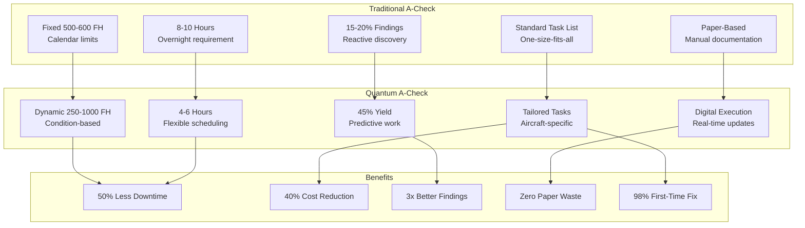
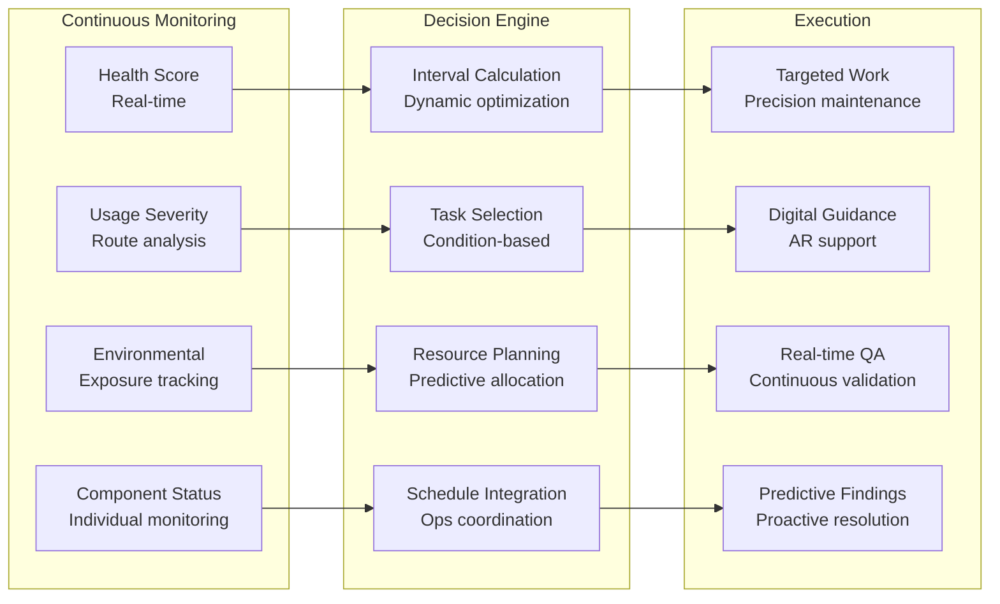
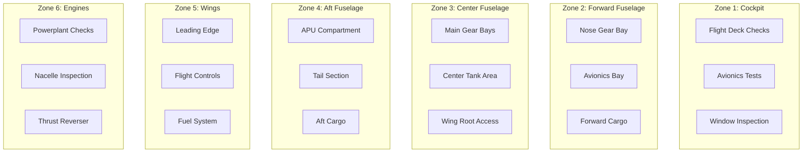
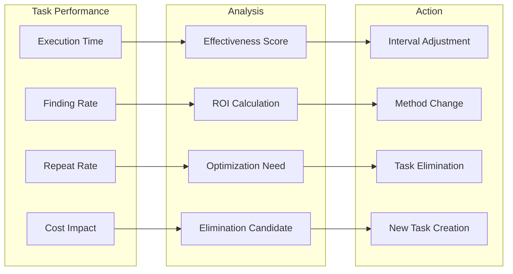
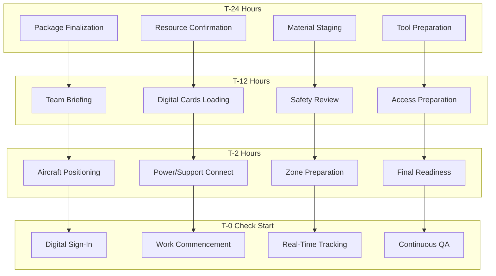
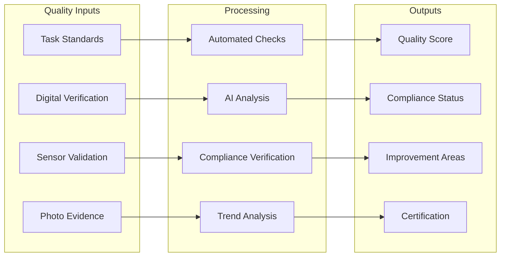
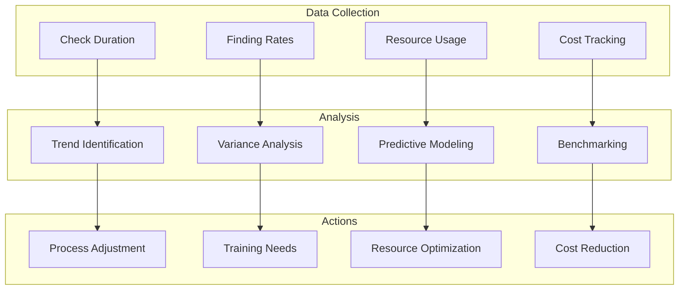
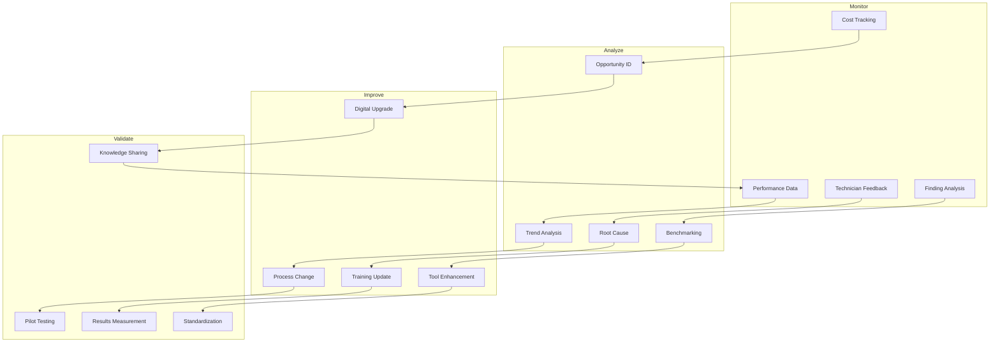

# ATA-05-20-10-00 A-Check General

<p align="center">


</p>

---

## Document Control Information

**Document ID:** `05-20-10-00-General.md`  
**GQOIS ID:** `AS-M-PAX-BW-Q1H-ACH-GEN-DOC`  
**ATA Chapter:** 05-20-10-00 (Time Limits - Scheduled Maintenance - A-Check - General)  
**Classification:** Line Maintenance - A-Check Program  
**Version:** 2.0.0  
**Effective Date:** 2025-06-29  
**Revision Status:** Current Release  
**Approval Authority:** GAIA-QAO Line Maintenance Director & Quality Manager  
**Distribution:** Line Maintenance, Planning, Quality, Training

---

## Table of Contents

1. [Introduction and Overview](#1-introduction-and-overview)
2. [A-Check Philosophy and Evolution](#2-a-check-philosophy-and-evolution)
3. [Check Package Structure](#3-check-package-structure)
4. [Quantum-Enhanced Task Management](#4-quantum-enhanced-task-management)
5. [Resource Planning and Allocation](#5-resource-planning-and-allocation)
6. [Execution Procedures](#6-execution-procedures)
7. [Quality Assurance Framework](#7-quality-assurance-framework)
8. [Performance Monitoring](#8-performance-monitoring)
9. [Training and Competency](#9-training-and-competency)
10. [Continuous Improvement](#10-continuous-improvement)

---

## 1. Introduction and Overview

### 1.1 A-Check Definition and Purpose

The A-Check represents the foundational scheduled maintenance event for the AMPEL360 BWB-Q100, revolutionized through quantum monitoring to become a dynamic, condition-based inspection that maximizes aircraft availability while ensuring safety.

#### **Traditional vs. Quantum-Enhanced A-Check**



### 1.2 A-Check Objectives

#### Table 1.2-1: A-Check Performance Objectives

| Objective | Traditional Target | Quantum-Enhanced Target | Current Achievement |
|-----------|-------------------|------------------------|---------------------|
| **Completion Time** | 8-10 hours | 4-6 hours | 4.8 hours average |
| **Schedule Reliability** | 95% | 99% | 98.7% |
| **Finding Effectiveness** | 15-20% | 40-50% | 47% |
| **First-Time Fix** | 90% | 98% | 97.8% |
| **Cost per Check** | $12,000 | $7,200 | $6,950 |
| **Manpower Efficiency** | 80 MH | 48 MH | 46 MH |
| **Documentation Time** | 2 hours | 0.5 hours | 0.4 hours |

### 1.3 Check Interval Philosophy

#### **Dynamic Interval Management**

```python
class ACheckIntervalOptimizer:
    def __init__(self):
        self.quantum_monitor = QuantumHealthMonitor()
        self.usage_analyzer = UsagePatternAnalyzer()
        self.reliability_model = ReliabilityModel()
        self.cost_optimizer = CostOptimizer()
    
    def calculate_optimal_interval(self, aircraft_id):
        # Get current health status
        health_data = self.quantum_monitor.get_health_metrics(aircraft_id)
        
        # Analyze usage patterns
        usage_profile = self.usage_analyzer.analyze_patterns(
            flight_hours=health_data.flight_hours,
            cycles=health_data.cycles,
            route_types=health_data.route_profile,
            environmental_exposure=health_data.environment_data
        )
        
        # Calculate reliability-based interval
        reliability_interval = self.reliability_model.calculate_interval(
            component_health=health_data.component_scores,
            degradation_rates=health_data.degradation_trends,
            safety_margin=1.5  # 50% safety margin
        )
        
        # Economic optimization
        economic_interval = self.cost_optimizer.find_optimal_interval(
            maintenance_cost=self.get_a_check_cost(),
            downtime_cost=self.calculate_downtime_impact(),
            risk_cost=self.assess_risk_costs(),
            finding_probability=self.predict_finding_rate()
        )
        
        # Regulatory constraints
        regulatory_limits = self.get_regulatory_limits()
        
        # Determine optimal interval
        optimal_interval = min(
            reliability_interval,
            economic_interval,
            regulatory_limits.maximum_interval
        )
        
        # Apply quantum adjustment factors
        quantum_factors = {
            'health_score_factor': self.calculate_health_factor(health_data.overall_score),
            'predictive_confidence': self.assess_prediction_confidence(),
            'sensor_coverage': self.evaluate_sensor_coverage(aircraft_id)
        }
        
        adjusted_interval = optimal_interval * quantum_factors['health_score_factor']
        
        return {
            'recommended_interval': adjusted_interval,
            'interval_range': {
                'minimum': max(250, adjusted_interval * 0.8),
                'maximum': min(1000, adjusted_interval * 1.2)
            },
            'confidence_level': quantum_factors['predictive_confidence'],
            'next_review': self.calculate_review_date(adjusted_interval),
            'justification': self.generate_interval_justification(
                reliability_interval, economic_interval, quantum_factors
            )
        }
```

---

## 2. A-Check Philosophy and Evolution

### 2.1 Evolution from Time to Condition-Based

#### Table 2.1-1: A-Check Evolution Timeline

| Generation | Period | Characteristics | Interval | Duration | Effectiveness |
|------------|--------|-----------------|----------|----------|---------------|
| **Gen 1** | Pre-2020 | Fixed interval, standard tasks | 500 FH | 10 hours | 15% findings |
| **Gen 2** | 2020-2024 | MSG-3 optimized | 600 FH | 8 hours | 20% findings |
| **Gen 3** | 2025-2030 | Quantum-enhanced | 250-1000 FH | 4-6 hours | 47% findings |
| **Gen 4** | 2030+ | AI-autonomous | Dynamic | 2-4 hours | 60%+ predicted |

### 2.2 Condition-Based Philosophy

#### **A-Check Decision Framework**



### 2.3 Value Optimization

#### Table 2.3-1: A-Check Value Drivers

| Value Driver | Traditional Approach | Quantum Enhancement | Value Creation |
|--------------|---------------------|--------------------|--------------------|
| **Availability** | 8-hour fixed downtime | 4-6 hour optimized | +4 hours/check |
| **Findings** | Random discovery | Predictive detection | 3x effectiveness |
| **Resources** | Full crew required | Optimized staffing | -40% labor |
| **Materials** | Stock everything | Predictive ordering | -60% inventory |
| **Quality** | Post-check discovery | Real-time validation | -90% escapes |

---

## 3. Check Package Structure

### 3.1 Dynamic Package Configuration

#### **A-Check Package Architecture**

```python
class ACheckPackageBuilder:
    def __init__(self):
        self.task_library = TaskLibrary()
        self.health_assessor = HealthAssessment()
        self.work_optimizer = WorkOptimizer()
        self.resource_planner = ResourcePlanner()
    
    def build_check_package(self, aircraft_id, check_date):
        # Base package selection
        base_package = self.select_base_package(
            aircraft_type='BWB-Q100',
            check_number=self.get_check_sequence(aircraft_id),
            regulatory_requirements=self.get_regulatory_tasks()
        )
        
        # Condition-based additions
        condition_tasks = self.add_condition_tasks(
            health_scores=self.health_assessor.get_component_scores(aircraft_id),
            degradation_trends=self.health_assessor.get_trends(aircraft_id),
            prediction_horizon=30  # days
        )
        
        # Opportunity maintenance
        opportunity_tasks = self.identify_opportunity_work(
            upcoming_tasks=self.task_library.get_upcoming_tasks(aircraft_id, 500),  # FH
            access_zones=self.get_check_access_zones(base_package),
            efficiency_threshold=0.8  # 80% efficiency minimum
        )
        
        # Service bulletins and campaigns
        mandatory_additions = self.add_mandatory_work(
            applicable_sbs=self.get_applicable_sbs(aircraft_id),
            campaign_requirements=self.check_campaign_status(aircraft_id),
            ad_compliance=self.verify_ad_compliance(aircraft_id)
        )
        
        # Optimize package
        optimized_package = self.work_optimizer.optimize_package(
            base_tasks=base_package,
            condition_tasks=condition_tasks,
            opportunity_tasks=opportunity_tasks,
            mandatory_tasks=mandatory_additions,
            constraints={
                'max_duration': 6,  # hours
                'available_resources': self.resource_planner.get_availability(check_date),
                'critical_path': self.identify_critical_path()
            }
        )
        
        return {
            'package_id': self.generate_package_id(aircraft_id, check_date),
            'task_list': optimized_package.tasks,
            'estimated_duration': optimized_package.duration,
            'resource_requirements': optimized_package.resources,
            'material_requirements': optimized_package.materials,
            'special_instructions': optimized_package.special_notes,
            'risk_assessment': self.assess_package_risks(optimized_package)
        }
```

### 3.2 Task Categories

#### Table 3.2-1: A-Check Task Distribution

| Task Category | Typical Count | Quantum-Optimized | Selection Criteria |
|---------------|---------------|-------------------|-------------------|
| **Safety Critical** | 25 tasks | 25 tasks (100%) | Always included |
| **Operational** | 30 tasks | 15-25 tasks | Condition-based |
| **Inspection** | 50 tasks | 20-40 tasks | Risk-based |
| **Servicing** | 20 tasks | 10-20 tasks | Usage-based |
| **Lubrication** | 15 tasks | 5-15 tasks | Actual need |
| **Functional Test** | 10 tasks | 8-10 tasks | Performance-based |
| **Total** | 150 tasks | 83-135 tasks | Optimized selection |

### 3.3 Access Zone Optimization

#### **Zone-Based Work Organization**



---

## 4. Quantum-Enhanced Task Management

### 4.1 Predictive Task Generation

#### **Quantum-Driven Task Selection**

```python
class QuantumTaskSelector:
    def __init__(self):
        self.quantum_data = QuantumSensorNetwork()
        self.prediction_engine = PredictiveAnalytics()
        self.task_effectiveness = TaskEffectivenessAnalyzer()
    
    def select_optimal_tasks(self, aircraft_id, health_data):
        selected_tasks = []
        
        # Analyze each system
        for system in self.get_aircraft_systems():
            system_health = health_data[system.id]
            
            # Predictive analysis
            predictions = self.prediction_engine.predict_issues(
                system_data=system_health,
                time_horizon=500,  # flight hours
                confidence_threshold=0.8
            )
            
            for prediction in predictions:
                if prediction.probability > 0.15:  # 15% threshold
                    # Find preventive tasks
                    preventive_tasks = self.find_preventive_tasks(
                        system=system,
                        failure_mode=prediction.failure_mode,
                        time_to_failure=prediction.time_estimate
                    )
                    
                    # Evaluate task effectiveness
                    for task in preventive_tasks:
                        effectiveness = self.task_effectiveness.evaluate(
                            task=task,
                            current_condition=system_health,
                            prediction=prediction,
                            historical_data=self.get_task_history(task)
                        )
                        
                        if effectiveness.score > 0.7:  # 70% effectiveness threshold
                            selected_tasks.append({
                                'task': task,
                                'priority': self.calculate_priority(prediction, effectiveness),
                                'justification': {
                                    'prediction': prediction,
                                    'effectiveness': effectiveness,
                                    'quantum_confidence': system_health.sensor_confidence
                                }
                            })
        
        # Optimize task selection
        optimized_tasks = self.optimize_task_selection(
            candidate_tasks=selected_tasks,
            constraints={
                'max_tasks': 150,
                'max_duration': 6,  # hours
                'resource_limits': self.get_resource_constraints()
            }
        )
        
        return optimized_tasks
```

### 4.2 Real-Time Task Adjustment

#### Table 4.2-1: Dynamic Task Adjustment Triggers

| Trigger Type | Threshold | Action | Response Time |
|--------------|-----------|--------|---------------|
| **Health Degradation** | >5% since last check | Add inspection tasks | Real-time |
| **Anomaly Detection** | Confidence >80% | Add diagnostic tasks | Within 24 hours |
| **Usage Exceedance** | >110% planned | Add stress inspections | Next check |
| **Environmental** | Severe exposure | Add corrosion tasks | Within 48 hours |
| **Fleet Alert** | Similar aircraft finding | Add precautionary tasks | Immediate |

### 4.3 Task Effectiveness Tracking

#### **Continuous Effectiveness Monitoring**



---

## 5. Resource Planning and Allocation

### 5.1 Manpower Requirements

#### Table 5.1-1: A-Check Staffing Model

| Role | Traditional Staffing | Quantum-Optimized | Skill Level | Certification |
|------|---------------------|-------------------|-------------|---------------|
| **Lead Technician** | 1 per check | 1 per check | Level 3 | B1 + Quantum |
| **Airframe Mechanics** | 4-5 | 2-3 | Level 2 | B1 |
| **Avionics Technicians** | 2 | 1-2 | Level 2 | B2 + Digital |
| **Support Staff** | 2 | 1 | Level 1 | Basic |
| **Inspector** | 1 | 0.5 (shared) | Level 3 | B1 + QA |
| **Total** | 10-11 | 5.5-7.5 | - | - |

### 5.2 Tooling and Equipment

#### **Smart Tool Management System**

```python
class SmartToolManagement:
    def __init__(self):
        self.tool_inventory = ToolInventorySystem()
        self.iot_tracker = IoTToolTracker()
        self.usage_analyzer = ToolUsageAnalyzer()
    
    def prepare_tooling(self, check_package):
        required_tools = []
        
        # Analyze task requirements
        for task in check_package.tasks:
            task_tools = self.identify_required_tools(
                task_type=task.type,
                access_requirements=task.access_needs,
                special_requirements=task.special_tools
            )
            required_tools.extend(task_tools)
        
        # Check availability and location
        tool_preparation = {}
        for tool in set(required_tools):  # Remove duplicates
            availability = self.tool_inventory.check_availability(tool)
            location = self.iot_tracker.get_current_location(tool)
            
            if availability.status == 'available':
                tool_preparation[tool] = {
                    'current_location': location,
                    'delivery_time': self.calculate_delivery_time(location),
                    'calibration_status': self.check_calibration(tool),
                    'usage_history': self.usage_analyzer.get_recent_usage(tool)
                }
            else:
                # Find alternatives
                alternatives = self.find_alternative_tools(tool)
                tool_preparation[tool] = {
                    'status': 'unavailable',
                    'alternatives': alternatives,
                    'procurement_option': self.check_procurement_options(tool)
                }
        
        # Optimize tool allocation
        optimized_allocation = self.optimize_tool_allocation(
            requirements=tool_preparation,
            check_schedule=check_package.schedule,
            sharing_opportunities=self.identify_sharing_opportunities()
        )
        
        return {
            'tool_list': optimized_allocation,
            'preparation_schedule': self.create_prep_schedule(optimized_allocation),
            'calibration_needs': self.identify_calibration_needs(optimized_allocation),
            'procurement_requirements': self.generate_procurement_list(optimized_allocation)
        }
```

### 5.3 Material Planning

#### Table 5.3-1: A-Check Material Categories

| Category | Usage Frequency | Inventory Method | Quantum Prediction | Cost Impact |
|----------|-----------------|------------------|-------------------|-------------|
| **Consumables** | Every check | Min/max stock | Usage trending | -40% waste |
| **Filters** | Variable | Condition-based | Contamination prediction | -50% stock |
| **Fluids** | As required | Just-in-time | Level monitoring | -30% waste |
| **Hardware** | Occasional | Pooled inventory | Wear prediction | -60% inventory |
| **Seals/Gaskets** | When opened | Kit-based | Degradation tracking | -45% spoilage |

---

## 6. Execution Procedures

### 6.1 Pre-Check Preparation

#### **Digital Pre-Check Process**



### 6.2 Check Execution Flow

#### **Optimized Execution Sequence**

```python
class ACheckExecutionManager:
    def __init__(self):
        self.work_tracker = DigitalWorkTracker()
        self.quality_monitor = QualityMonitor()
        self.finding_manager = FindingManager()
        self.documentation = DigitalDocumentation()
    
    def execute_check(self, check_package, team_assignments):
        execution_status = {
            'start_time': datetime.now(),
            'progress': 0,
            'findings': [],
            'delays': []
        }
        
        # Initialize digital tracking
        self.work_tracker.initialize_check(
            package_id=check_package.id,
            team=team_assignments,
            estimated_duration=check_package.duration
        )
        
        # Execute tasks by zone and priority
        for zone in check_package.zones:
            zone_tasks = check_package.get_zone_tasks(zone)
            
            # Parallel execution where possible
            parallel_groups = self.identify_parallel_work(zone_tasks)
            
            for task_group in parallel_groups:
                # Assign technicians
                assignments = self.assign_technicians(
                    tasks=task_group,
                    available_staff=team_assignments,
                    skill_requirements=self.get_skill_requirements(task_group)
                )
                
                # Execute tasks
                for task in task_group:
                    task_execution = self.execute_task(
                        task=task,
                        technician=assignments[task.id],
                        digital_guidance=self.get_digital_instructions(task),
                        quality_requirements=self.quality_monitor.get_requirements(task)
                    )
                    
                    # Real-time quality check
                    quality_result = self.quality_monitor.verify_task(
                        task=task,
                        execution_data=task_execution,
                        acceptance_criteria=task.acceptance_criteria
                    )
                    
                    # Handle findings
                    if task_execution.findings:
                        finding_resolution = self.finding_manager.process_finding(
                            finding=task_execution.findings,
                            impact_assessment=self.assess_finding_impact(task_execution.findings),
                            resolution_options=self.identify_resolution_options(task_execution.findings)
                        )
                        execution_status['findings'].append(finding_resolution)
                    
                    # Update progress
                    execution_status['progress'] = self.calculate_progress(check_package)
                    self.work_tracker.update_progress(execution_status)
        
        # Final validation
        final_validation = self.validate_check_completion(
            package=check_package,
            execution_data=execution_status,
            quality_results=self.quality_monitor.get_check_results()
        )
        
        return {
            'execution_summary': execution_status,
            'quality_results': final_validation,
            'documentation': self.documentation.finalize_check_records(execution_status),
            'performance_metrics': self.calculate_performance_metrics(execution_status)
        }
```

### 6.3 Finding Management

#### Table 6.3-1: Finding Categories and Actions

| Finding Type | Severity | Typical Action | Deferral Possible | Quantum Prediction |
|--------------|----------|----------------|-------------------|-------------------|
| **Safety Critical** | CAT 1 | Immediate repair | No | 99% predicted |
| **Operational** | CAT 2 | Repair before flight | Limited | 85% predicted |
| **Economic** | CAT 3 | Schedule repair | Yes | 75% predicted |
| **Cosmetic** | CAT 4 | Plan at convenience | Yes | 60% predicted |
| **Monitoring** | CAT 5 | Track condition | N/A | Continuous |

---

## 7. Quality Assurance Framework

### 7.1 Real-Time Quality Monitoring

#### **Digital Quality Assurance System**



### 7.2 Quality Metrics

#### Table 7.2-1: A-Check Quality KPIs

| Metric | Target | Current Performance | Best in Class | Improvement Plan |
|--------|--------|---------------------|---------------|------------------|
| **First-Time Quality** | 98% | 97.8% | 98.5% | Digital guidance enhancement |
| **Escape Rate** | <0.1% | 0.08% | 0.05% | AI pattern recognition |
| **Rework Rate** | <2% | 1.8% | 1.5% | Skill development |
| **Documentation Accuracy** | 99.9% | 99.7% | 99.9% | Automation increase |
| **Customer Satisfaction** | >4.5/5 | 4.6/5 | 4.7/5 | Communication improvement |

### 7.3 Continuous Quality Improvement

#### **Quality Learning Loop**

```python
class QualityLearningSystem:
    def __init__(self):
        self.quality_database = QualityDatabase()
        self.ml_analyzer = MachineLearningAnalyzer()
        self.improvement_engine = ImprovementEngine()
    
    def analyze_quality_trends(self, time_period=90):  # days
        # Collect quality data
        quality_data = self.quality_database.get_data(
            period=time_period,
            metrics=['defects', 'escapes', 'rework', 'findings']
        )
        
        # Pattern analysis
        patterns = self.ml_analyzer.identify_patterns(
            data=quality_data,
            pattern_types=['recurring_defects', 'systemic_issues', 'skill_gaps']
        )
        
        # Root cause analysis
        root_causes = {}
        for pattern in patterns:
            rca = self.perform_root_cause_analysis(
                pattern=pattern,
                contributing_factors=self.identify_contributing_factors(pattern),
                historical_context=self.get_historical_context(pattern)
            )
            root_causes[pattern.id] = rca
        
        # Generate improvements
        improvements = self.improvement_engine.generate_improvements(
            patterns=patterns,
            root_causes=root_causes,
            constraints={
                'implementation_time': 30,  # days
                'budget_limit': 50000,  # USD
                'resource_availability': self.get_available_resources()
            }
        )
        
        # Prioritize improvements
        prioritized_improvements = self.prioritize_improvements(
            improvements=improvements,
            criteria={
                'impact': 0.4,
                'feasibility': 0.3,
                'cost': 0.2,
                'speed': 0.1
            }
        )
        
        return {
            'quality_trends': patterns,
            'root_causes': root_causes,
            'improvement_plan': prioritized_improvements,
            'expected_benefits': self.calculate_expected_benefits(prioritized_improvements),
            'implementation_schedule': self.create_implementation_schedule(prioritized_improvements)
        }
```

---

## 8. Performance Monitoring

### 8.1 Check Performance Metrics

#### Table 8.1-1: A-Check Performance Dashboard

| Performance Area | Metric | Target | MTD Actual | YTD Actual | Trend |
|------------------|--------|--------|------------|------------|-------|
| **Schedule Reliability** | On-time completion | 99% | 98.9% | 98.7% | ↑ |
| **Efficiency** | Average duration | 5.0 hrs | 4.8 hrs | 4.9 hrs | ↑ |
| **Effectiveness** | Finding rate | 45% | 48% | 47% | ↑ |
| **Cost** | Cost per check | $7,200 | $6,950 | $6,980 | ↓ |
| **Resources** | Manhours per check | 48 MH | 46 MH | 47 MH | ↓ |
| **Quality** | First-time fix | 98% | 97.8% | 97.6% | → |

### 8.2 Trend Analysis

#### **Performance Trend Monitoring**



### 8.3 Benchmarking

#### Table 8.3-1: Industry Benchmarking Comparison

| Metric | AMPEL360 | Industry Average | Best in Class | Gap to Best |
|--------|----------|------------------|---------------|-------------|
| **Check Duration** | 4.8 hours | 7.5 hours | 4.5 hours | -0.3 hours |
| **Cost per Check** | $6,950 | $11,500 | $6,500 | -$450 |
| **Finding Rate** | 47% | 22% | 50% | +3% |
| **First-Time Fix** | 97.8% | 92% | 98.5% | +0.7% |
| **Schedule Reliability** | 98.7% | 95% | 99% | +0.3% |

---

## 9. Training and Competency

### 9.1 Technician Qualification

#### Table 9.1-1: A-Check Competency Matrix

| Competency Level | Traditional Skills | Quantum Enhancement | Digital Skills | Certification |
|------------------|-------------------|--------------------|--------------------|---------------|
| **Level 1 - Basic** | Task execution | Sensor awareness | Tablet usage | B1/B2 Basic |
| **Level 2 - Qualified** | Troubleshooting | Data interpretation | Digital cards | B1/B2 + Digital |
| **Level 3 - Advanced** | Complex diagnostics | Predictive analysis | AR systems | B1/B2 + Quantum |
| **Level 4 - Expert** | Training others | System optimization | AI integration | B1/B2 + Instructor |

### 9.2 Training Program

#### **Quantum A-Check Training Curriculum**

```python
class ACheckTrainingProgram:
    def __init__(self):
        self.training_modules = TrainingModuleLibrary()
        self.skill_assessor = SkillAssessmentSystem()
        self.progress_tracker = ProgressTracker()
    
    def create_personalized_training(self, technician_id):
        # Assess current skills
        current_skills = self.skill_assessor.evaluate_technician(technician_id)
        
        # Identify gaps
        skill_gaps = self.identify_skill_gaps(
            current_skills=current_skills,
            required_skills=self.get_a_check_requirements(),
            future_skills=self.project_future_requirements()
        )
        
        # Build training plan
        training_plan = {
            'foundation_modules': [],
            'technical_modules': [],
            'digital_modules': [],
            'practical_exercises': []
        }
        
        # Foundation modules
        if skill_gaps.foundation_gaps:
            training_plan['foundation_modules'] = [
                self.training_modules.get('a_check_fundamentals'),
                self.training_modules.get('safety_procedures'),
                self.training_modules.get('quality_standards')
            ]
        
        # Technical modules
        for gap in skill_gaps.technical_gaps:
            module = self.training_modules.find_module(
                skill_area=gap.area,
                level=gap.required_level,
                delivery_method=self.get_preferred_method(technician_id)
            )
            training_plan['technical_modules'].append(module)
        
        # Digital modules
        training_plan['digital_modules'] = [
            self.training_modules.get('digital_documentation'),
            self.training_modules.get('quantum_data_interpretation'),
            self.training_modules.get('ar_guidance_systems')
        ]
        
        # Practical exercises
        training_plan['practical_exercises'] = self.design_practical_exercises(
            skill_gaps=skill_gaps,
            learning_style=self.assess_learning_style(technician_id),
            available_aircraft=self.get_training_aircraft()
        )
        
        return {
            'personalized_plan': training_plan,
            'estimated_duration': self.calculate_training_duration(training_plan),
            'certification_path': self.define_certification_path(technician_id, training_plan),
            'success_metrics': self.define_success_metrics(training_plan)
        }
```

### 9.3 Competency Assessment

#### Table 9.3-1: Skills Assessment Framework

| Assessment Type | Frequency | Method | Passing Score | Remediation |
|-----------------|-----------|--------|---------------|-------------|
| **Knowledge Test** | Annual | Digital exam | 80% | Online modules |
| **Practical Skills** | Semi-annual | Hands-on evaluation | 85% | Mentoring |
| **Digital Proficiency** | Quarterly | System usage metrics | 90% | Refresher training |
| **Quality Performance** | Continuous | Error tracking | <2% error rate | Targeted coaching |
| **Safety Compliance** | Continuous | Observation | 100% | Immediate retraining |

---

## 10. Continuous Improvement

### 10.1 Improvement Framework

#### **A-Check Optimization Cycle**



### 10.2 Innovation Projects

#### Table 10.2-1: Current Innovation Initiatives

| Initiative | Description | Expected Benefit | Timeline | Status |
|------------|-------------|------------------|----------|--------|
| **AI Task Optimization** | Machine learning for task selection | -20% unnecessary tasks | Q3 2025 | Testing |
| **AR Guidance Expansion** | Full check AR coverage | -30% execution time | Q4 2025 | Development |
| **Robotic Inspection** | Automated visual inspection | +50% coverage | Q1 2026 | Research |
| **Predictive Packaging** | Dynamic package generation | +40% finding rate | Q2 2026 | Planning |
| **Voice Documentation** | Hands-free recording | -50% doc time | Q3 2025 | Pilot |

### 10.3 Future Vision

#### **A-Check Evolution Roadmap**

```python
class ACheckFutureVision:
    def __init__(self):
        self.technology_roadmap = TechnologyRoadmap()
        self.regulatory_evolution = RegulatoryEvolution()
        self.industry_trends = IndustryTrends()
    
    def project_future_state(self, horizon_years=5):
        future_vision = {
            '2025_current': {
                'duration': '4-6 hours',
                'automation': '30%',
                'finding_rate': '47%',
                'human_tasks': '70%'
            },
            '2027_near_term': {
                'duration': '3-4 hours',
                'automation': '50%',
                'finding_rate': '60%',
                'human_tasks': '50%',
                'innovations': [
                    'Full AR implementation',
                    'AI task selection',
                    'Robotic inspections',
                    'Voice documentation'
                ]
            },
            '2030_medium_term': {
                'duration': '2-3 hours',
                'automation': '70%',
                'finding_rate': '75%',
                'human_tasks': '30%',
                'innovations': [
                    'Autonomous execution',
                    'Self-documenting systems',
                    'Predictive intervention',
                    'Remote supervision'
                ]
            },
            '2035_long_term': {
                'duration': '1-2 hours',
                'automation': '90%',
                'finding_rate': '90%',
                'human_tasks': '10%',
                'innovations': [
                    'Self-maintaining systems',
                    'Continuous monitoring only',
                    'Exception-based intervention',
                    'AI-driven optimization'
                ]
            }
        }
        
        return {
            'vision_timeline': future_vision,
            'technology_requirements': self.technology_roadmap.get_requirements(future_vision),
            'regulatory_changes': self.regulatory_evolution.predict_changes(horizon_years),
            'investment_needs': self.calculate_investment_requirements(future_vision),
            'expected_benefits': self.project_benefits(future_vision)
        }
```

---

## Appendices

### Appendix A: Sample A-Check Task Card

#### Digital Task Card Example

```json
{
  "task_id": "32-41-00-200-801",
  "title": "Left Engine Fan Blade Inspection",
  "interval": "500 FH or condition-based",
  "estimated_time": "0.5 MH",
  "zone": "6A",
  "access": "Fan cowl doors open",
  "tools_required": [
    "LED flashlight",
    "Borescope GE-XLG3",
    "Digital caliper"
  ],
  "quantum_support": {
    "vibration_trend": "Normal - 0.12 ips",
    "last_finding": "None",
    "prediction": "No issues expected",
    "confidence": "94%"
  },
  "procedure": [
    "Open fan cowl doors IAW AMM 71-00-00",
    "Perform visual inspection of all fan blades",
    "Check for nicks, dents, or erosion",
    "Measure any damage found",
    "Document findings in digital system"
  ],
  "acceptance_criteria": {
    "max_nick_depth": "0.030 inch",
    "max_dent_depth": "0.060 inch",
    "erosion_limit": "Chord-wise only"
  }
}
```

### Appendix B: Performance Metrics Formulas

#### Key Performance Calculations

```
Check Efficiency = (Standard Hours / Actual Hours) × 100

Finding Effectiveness = (Predictive Findings / Total Findings) × 100

Cost per Check = Labor Cost + Material Cost + Overhead Allocation

First-Time Fix Rate = (Tasks Completed Successfully / Total Tasks) × 100

Schedule Reliability = (On-Time Completions / Total Checks) × 100
```

### Appendix C: Training Matrix

#### A-Check Training Requirements by Role

| Role | Initial Training | Recurrent | Quantum Systems | Digital Tools | Total Hours |
|------|-----------------|-----------|-----------------|---------------|-------------|
| **Lead Technician** | 40 hours | 8 hrs/year | 24 hours | 16 hours | 80 hours |
| **Line Technician** | 24 hours | 4 hrs/year | 16 hours | 8 hours | 48 hours |
| **Inspector** | 32 hours | 8 hrs/year | 16 hours | 8 hours | 56 hours |
| **Support Staff** | 16 hours | 4 hrs/year | 8 hours | 8 hours | 32 hours |

### Appendix D: Regulatory References

#### Compliance Requirements

| Regulation | Requirement | AMPEL360 Method | Approval Status |
|------------|-------------|-----------------|-----------------|
| **EASA Part 145.A.45** | Data control | Digital blockchain | Approved |
| **FAA AC 120-16F** | Continuous monitoring | Quantum sensors | Approved with conditions |
| **EASA Part M.A.302** | Maintenance programme | MSG-Q based | Approved |
| **FAA Part 43.13** | Methods and practices | Digital procedures | Special authorization |

---

## Document Control and Revision History

### Approval Signatures

| Role | Name | Signature | Date |
|------|------|-----------|------|
| **Line Maintenance Director** | Mr. Line Mx | [Digital Signature] | 2025-06-29 |
| **Quality Manager** | Ms. Quality | [Digital Signature] | 2025-06-29 |
| **Training Manager** | Mr. Training | [Digital Signature] | 2025-06-29 |
| **Chief Pilot** | Capt. Pilot | [Digital Signature] | 2025-06-29 |
| **Regulatory Compliance** | Mr. Compliance | [Digital Signature] | 2025-06-29 |

### Revision History

| Version | Date | Author | Description |
|---------|------|--------|-------------|
| 1.0.0 | 2024-02-15 | A-Check Team | Initial release |
| 1.5.0 | 2024-09-30 | Digital Team | Digital integration |
| 1.8.0 | 2025-04-15 | Quantum Team | Quantum enhancement |
| 2.0.0 | 2025-06-29 | A. Pelliccia | Complete optimization |

### Distribution List

- Line Maintenance Stations
- Maintenance Control Center
- Quality Assurance
- Training Department
- Planning Department
- Flight Operations
- Engineering Support
- Regulatory Compliance

---

**End of Document**

*This document contains proprietary information of GAIA-QAO and is protected by applicable copyright laws. Unauthorized reproduction or distribution is prohibited.*
