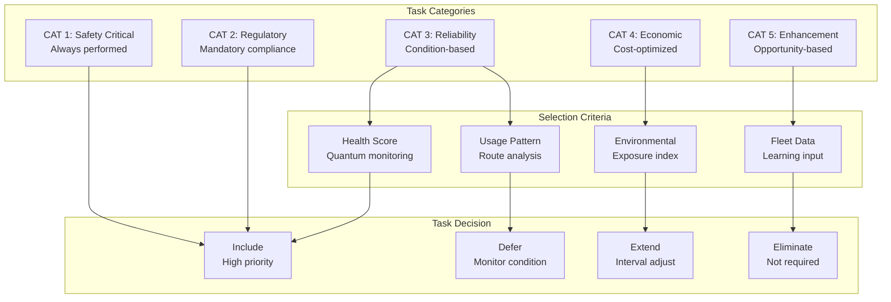
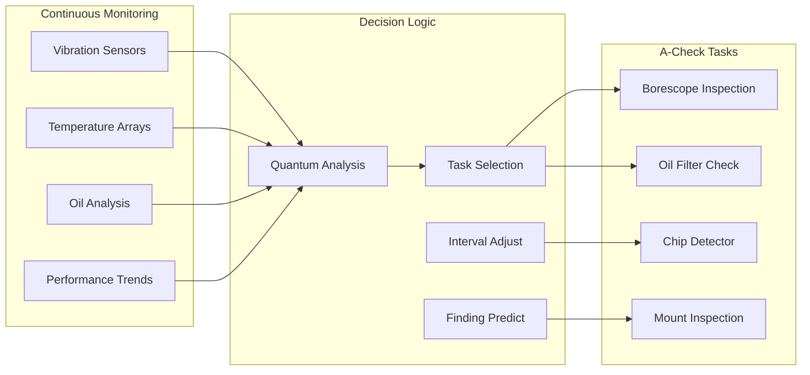
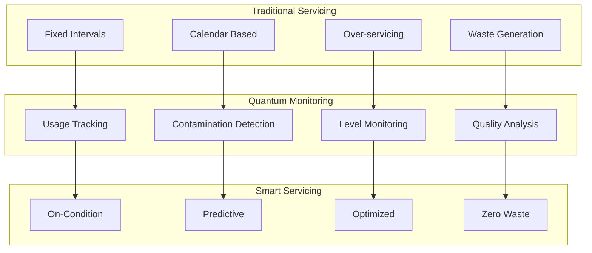
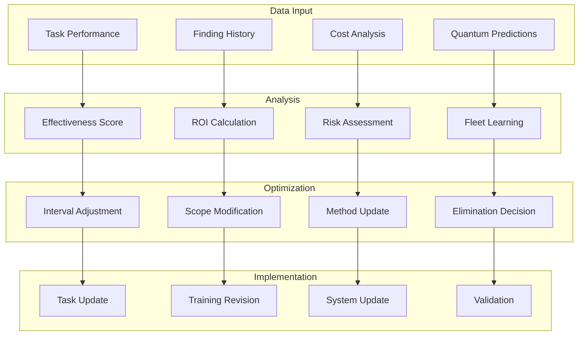

# ATA-05-20-10-01 A-Check Tasks

<p align="center">


</p>

---

## Document Control Information

**Document ID:** `05-20-10-01-ACheckTasks.md`  
**GQOIS ID:** `AS-M-PAX-BW-Q1H-ACH-TSK-MASTER`  
**ATA Chapter:** 05-20-10-01 (Time Limits - Scheduled Maintenance - A-Check - Tasks)  
**Classification:** Line Maintenance - A-Check Task Library  
**Version:** 2.0.0  
**Effective Date:** 2025-06-29  
**Revision Status:** Current Release  
**Approval Authority:** GAIA-QAO Chief Engineer & Line Maintenance Director  
**Distribution:** Line Maintenance, Engineering, Planning, Training

---

## Table of Contents

1. [Task Overview and Classification](#1-task-overview-and-classification)
2. [Systems Inspection Tasks](#2-systems-inspection-tasks)
3. [Structural Inspection Tasks](#3-structural-inspection-tasks)
4. [Powerplant Tasks](#4-powerplant-tasks)
5. [Avionics and Electrical Tasks](#5-avionics-and-electrical-tasks)
6. [Hydraulic and Pneumatic Tasks](#6-hydraulic-and-pneumatic-tasks)
7. [Servicing and Lubrication Tasks](#7-servicing-and-lubrication-tasks)
8. [Functional Check Tasks](#8-functional-check-tasks)
9. [Quantum-Specific Tasks](#9-quantum-specific-tasks)
10. [Task Optimization and Updates](#10-task-optimization-and-updates)

---

## 1. Task Overview and Classification

### 1.1 Task Classification System

The AMPEL360 A-Check tasks are classified using a quantum-enhanced priority system that dynamically adjusts based on real-time health monitoring data.

#### **Task Priority Matrix**



### 1.2 Task Numbering System

#### Table 1.2-1: Task Identification Structure

| Position | Digits | Meaning | Example |
|----------|--------|---------|---------|
| 1-2 | XX | ATA Chapter | 32 (Landing Gear) |
| 3-4 | XX | Section | 41 (Wheels) |
| 5-6 | XX | Subject | 00 (General) |
| 7-9 | XXX | Task Sequence | 200 (Inspection) |
| 10-12 | XXX | Check Code | 801 (A-Check) |

Example: 32-41-00-200-801 = Landing Gear Wheel Inspection A-Check Task

### 1.3 Task Effectiveness Tracking

#### **Dynamic Task Effectiveness Algorithm**

```python
class TaskEffectivenessTracker:
    def __init__(self):
        self.task_database = TaskDatabase()
        self.finding_analyzer = FindingAnalyzer()
        self.quantum_correlator = QuantumDataCorrelator()
        self.cost_calculator = CostCalculator()
    
    def evaluate_task_effectiveness(self, task_id, evaluation_period=365):  # days
        task_data = self.task_database.get_task_history(task_id, evaluation_period)
        
        # Calculate key metrics
        effectiveness_metrics = {
            'finding_rate': self.calculate_finding_rate(task_data),
            'false_positive_rate': self.calculate_false_positives(task_data),
            'prevention_success': self.measure_prevention_success(task_data),
            'cost_per_finding': self.calculate_cost_effectiveness(task_data),
            'quantum_correlation': self.quantum_correlator.correlate_predictions(task_data)
        }
        
        # Determine effectiveness score
        effectiveness_score = self.calculate_composite_score(effectiveness_metrics)
        
        # Generate recommendations
        if effectiveness_score < 0.3:
            recommendation = 'ELIMINATE - Task shows minimal value'
        elif effectiveness_score < 0.5:
            recommendation = 'EXTEND - Increase interval by 50%'
        elif effectiveness_score < 0.7:
            recommendation = 'OPTIMIZE - Adjust scope or method'
        elif effectiveness_score < 0.85:
            recommendation = 'MAINTAIN - Current approach effective'
        else:
            recommendation = 'ENHANCE - High-value task, consider expansion'
        
        return {
            'task_id': task_id,
            'effectiveness_score': effectiveness_score,
            'metrics': effectiveness_metrics,
            'recommendation': recommendation,
            'optimization_suggestions': self.generate_optimization_suggestions(effectiveness_metrics)
        }
```

---

## 2. Systems Inspection Tasks

### 2.1 Air Conditioning and Pressurization

#### Table 2.1-1: ECS A-Check Tasks

| Task Number | Description | Interval | Duration | Quantum Support |
|-------------|-------------|----------|----------|-----------------|
| **21-00-00-200-801** | Pack performance check | 500 FH* | 0.3 MH | Temperature trending |
| **21-31-00-210-801** | Outflow valve operation | 400 FH* | 0.2 MH | Position monitoring |
| **21-51-00-220-801** | Cabin pressure controller test | 600 FH* | 0.4 MH | Pressure profiles |
| **21-62-00-230-801** | Temperature sensor calibration | 800 FH* | 0.5 MH | Auto-calibration verify |

*Dynamic interval based on quantum monitoring

#### **ECS Inspection Procedure Example**

```markdown
### Task 21-00-00-200-801: Pack Performance Check

**Prerequisites:**
- Aircraft powered (APU or GPU)
- ECS control panel accessible
- Quantum data terminal available

**Procedure:**
1. Access quantum monitoring system for pack performance history
   - Review last 500 FH temperature/flow data
   - Note any anomalies or trends
   
2. Select PACK 1 on ECS panel
   - Monitor outlet temperature: Target 3°C ±2°C
   - Verify flow rate via quantum sensors: >0.8 kg/s
   - Check for unusual sounds or vibrations
   
3. Repeat for PACK 2

4. Compare actual vs. quantum predicted performance
   - Variance should be <5%
   - Document any discrepancies

5. If performance degradation detected:
   - Perform detailed pack inspection per AMM 21-00-00
   - Consider heat exchanger cleaning

**Quantum Enhancement:**
- Real-time performance tracking reduces inspection time by 60%
- Predictive alerts prevent in-flight pack failures
- Trend analysis optimizes maintenance intervals
```

### 2.2 Auto Flight Systems

#### Table 2.2-1: Autopilot A-Check Tasks

| Task Number | Description | Interval | Duration | Finding Rate |
|-------------|-------------|----------|----------|--------------|
| **22-11-00-200-801** | Autopilot engagement test | 600 FH | 0.4 MH | 2% |
| **22-13-00-210-801** | Flight director verification | 500 FH | 0.3 MH | 1% |
| **22-20-00-220-801** | Autothrottle response check | 700 FH | 0.3 MH | 3% |
| **22-83-00-230-801** | AFCS BITE test | 400 FH | 0.2 MH | 5% |

### 2.3 Communications

#### Table 2.3-1: Communication System Tasks

| Task Number | Description | Interval | Duration | Criticality |
|-------------|-------------|----------|----------|-------------|
| **23-11-00-200-801** | VHF radio check (all units) | 500 FH | 0.3 MH | CAT 2 |
| **23-21-00-210-801** | HF radio operational test | 800 FH | 0.4 MH | CAT 3 |
| **23-51-00-220-801** | SATCOM data link verify | 600 FH | 0.2 MH | CAT 3 |
| **23-71-00-230-801** | CVR test and battery check | 400 FH | 0.5 MH | CAT 1 |

---

## 3. Structural Inspection Tasks

### 3.1 Fuselage Structure

#### **Quantum-Enhanced Structural Inspections**

```python
class StructuralInspectionTask:
    def __init__(self, task_id):
        self.task_id = task_id
        self.quantum_monitor = QuantumStructuralMonitor()
        self.inspection_guide = InspectionGuideSystem()
        self.finding_processor = FindingProcessor()
    
    def execute_inspection(self, zone, technician_id):
        # Pre-inspection quantum analysis
        quantum_data = self.quantum_monitor.get_zone_health(zone)
        high_risk_areas = self.identify_high_risk_areas(quantum_data)
        
        # Generate targeted inspection plan
        inspection_plan = self.inspection_guide.generate_plan(
            zone=zone,
            risk_areas=high_risk_areas,
            historical_findings=self.get_zone_history(zone),
            technician_skill=self.get_technician_level(technician_id)
        )
        
        # AR-guided inspection
        ar_guidance = self.create_ar_guidance(
            inspection_plan=inspection_plan,
            quantum_predictions=quantum_data.predictions,
            inspection_sequence=self.optimize_inspection_path(zone)
        )
        
        # Execute inspection
        inspection_results = {
            'zone': zone,
            'start_time': datetime.now(),
            'quantum_predictions': len(quantum_data.predictions),
            'findings': []
        }
        
        for area in inspection_plan.areas:
            finding = self.inspect_area(
                area=area,
                method=inspection_plan.get_method(area),
                acceptance_criteria=self.get_criteria(area),
                quantum_baseline=quantum_data.get_baseline(area)
            )
            
            if finding:
                processed_finding = self.finding_processor.process(
                    finding=finding,
                    quantum_correlation=self.correlate_with_quantum(finding, quantum_data),
                    severity_assessment=self.assess_severity(finding)
                )
                inspection_results['findings'].append(processed_finding)
        
        inspection_results['end_time'] = datetime.now()
        inspection_results['effectiveness'] = self.calculate_effectiveness(
            predictions=quantum_data.predictions,
            actual_findings=inspection_results['findings']
        )
        
        return inspection_results
```

#### Table 3.1-1: Fuselage Inspection Tasks

| Task Number | Description | Zone | Interval | Duration | Quantum Enhancement |
|-------------|-------------|------|----------|----------|-------------------|
| **53-30-01-200-801** | Crown area inspection | 200 | 800 FH* | 0.8 MH | Strain monitoring |
| **53-30-02-210-801** | Belly fairing check | 300 | 600 FH* | 0.6 MH | Corrosion sensors |
| **53-50-00-220-801** | Door surround inspection | 400 | 500 FH | 1.0 MH | Stress concentration |
| **53-80-00-230-801** | Pressure bulkhead visual | 500 | 1000 FH* | 0.5 MH | Continuous monitoring |

### 3.2 Wing Structure

#### Table 3.2-1: Wing Inspection Tasks

| Task Number | Description | Access | Interval | Duration | Finding Rate |
|-------------|-------------|--------|----------|----------|--------------|
| **57-40-00-200-801** | Wing root joint inspection | Panel 145L/R | 600 FH | 1.2 MH | 8% |
| **57-50-00-210-801** | Wing lower surface scan | External | 500 FH | 0.8 MH | 3% |
| **57-70-00-220-801** | Fuel tank entry inspection | Tank access | 2000 FH* | 4.0 MH | 12% |
| **57-80-00-230-801** | Wing tip attachment check | External | 800 FH | 0.3 MH | 2% |

---

## 4. Powerplant Tasks

### 4.1 Engine Inspection Tasks

#### **Engine Health Monitoring Integration**



#### Table 4.1-1: Engine A-Check Tasks

| Task Number | Description | Interval | Duration | Equipment | Quantum Data |
|-------------|-------------|----------|----------|-----------|--------------|
| **71-00-00-200-801** | Engine ground run | 1000 FH* | 1.0 MH | GPU required | Performance validation |
| **72-00-00-210-801** | Borescope inspection | 750 FH* | 2.0 MH | Borescope set | Blade monitoring |
| **72-31-01-220-801** | Fan blade detailed | 500 FH | 0.8 MH | LED light | Vibration correlation |
| **79-31-00-230-801** | Oil filter inspection | 400 FH | 0.5 MH | Filter cutter | Debris analysis |

### 4.2 APU Tasks

#### Table 4.2-1: APU Inspection Tasks

| Task Number | Description | Interval | Duration | Access Required |
|-------------|-------------|----------|----------|-----------------|
| **49-20-00-200-801** | APU operational test | 500 FH | 0.4 MH | APU compartment |
| **49-50-00-210-801** | APU oil level check | 300 FH | 0.2 MH | Service panel |
| **49-90-00-220-801** | APU BITE test | 600 FH | 0.3 MH | Cockpit |

---

## 5. Avionics and Electrical Tasks

### 5.1 Avionics Systems

#### Table 5.1-1: Avionics A-Check Tasks

| Task Number | Description | System | Interval | Duration | Test Equipment |
|-------------|-------------|--------|----------|----------|----------------|
| **31-21-00-200-801** | FMS database verify | Navigation | 500 FH | 0.3 MH | Data loader |
| **31-31-00-210-801** | TCAS test | Surveillance | 600 FH | 0.4 MH | Test set |
| **31-60-00-220-801** | Weather radar test | Weather | 800 FH | 0.5 MH | Ramp area |
| **34-11-00-230-801** | ILS self-test | Landing | 400 FH | 0.3 MH | BITE check |

### 5.2 Electrical Power

#### **Quantum-Enhanced Electrical Monitoring**

```python
class ElectricalInspectionTask:
    def __init__(self):
        self.power_monitor = QuantumPowerMonitor()
        self.thermal_scanner = ThermalImagingSystem()
        self.resistance_tester = MicroOhmMeter()
    
    def perform_electrical_inspection(self, system_id):
        inspection_data = {
            'system': system_id,
            'timestamp': datetime.now(),
            'measurements': {},
            'anomalies': []
        }
        
        # Quantum baseline comparison
        quantum_baseline = self.power_monitor.get_system_baseline(system_id)
        current_state = self.power_monitor.get_current_state(system_id)
        
        # Identify degradation
        degradation_points = self.identify_degradation(
            baseline=quantum_baseline,
            current=current_state,
            threshold=0.05  # 5% degradation
        )
        
        # Targeted inspection
        for point in degradation_points:
            # Thermal imaging
            thermal_result = self.thermal_scanner.scan_connection(point)
            if thermal_result.temperature_rise > 10:  # °C above ambient
                inspection_data['anomalies'].append({
                    'location': point,
                    'type': 'thermal',
                    'severity': self.calculate_severity(thermal_result),
                    'action': 'Investigate connection'
                })
            
            # Resistance measurement
            resistance = self.resistance_tester.measure(point)
            inspection_data['measurements'][point] = resistance
            
            if resistance > point.specification * 1.2:  # 20% above spec
                inspection_data['anomalies'].append({
                    'location': point,
                    'type': 'resistance',
                    'value': resistance,
                    'action': 'Clean and retorque'
                })
        
        # Generate recommendations
        inspection_data['recommendations'] = self.generate_recommendations(
            anomalies=inspection_data['anomalies'],
            quantum_predictions=self.power_monitor.predict_failures(system_id)
        )
        
        return inspection_data
```

#### Table 5.2-1: Electrical Power Tasks

| Task Number | Description | Interval | Duration | Special Tools |
|-------------|-------------|----------|----------|---------------|
| **24-21-00-200-801** | Generator control unit test | 600 FH | 0.5 MH | Multimeter |
| **24-31-00-210-801** | Battery capacity check | 800 FH | 0.8 MH | Load bank |
| **24-41-00-220-801** | Bus tie operation | 500 FH | 0.3 MH | None |
| **24-52-00-230-801** | Ground power receptacle | 400 FH | 0.2 MH | Visual only |

---

## 6. Hydraulic and Pneumatic Tasks

### 6.1 Hydraulic System

#### Table 6.1-1: Hydraulic System A-Check Tasks

| Task Number | Description | System | Interval | Duration | Quantum Monitoring |
|-------------|-------------|--------|----------|----------|-------------------|
| **29-11-00-200-801** | Reservoir quantity check | All | 300 FH | 0.3 MH | Level trending |
| **29-12-00-210-801** | Filter differential pressure | All | 500 FH | 0.4 MH | ΔP monitoring |
| **29-13-00-220-801** | System pressure test | All | 600 FH | 0.6 MH | Pressure profiles |
| **29-20-00-230-801** | Accumulator precharge | All | 800 FH* | 0.5 MH | Pressure decay |

### 6.2 Pneumatic System

#### Table 6.2-1: Pneumatic System Tasks

| Task Number | Description | Interval | Duration | Test Required |
|-------------|-------------|----------|----------|---------------|
| **36-11-00-200-801** | Bleed leak detection | 600 FH | 0.8 MH | Leak detector |
| **36-13-00-210-801** | Precooler efficiency | 800 FH* | 0.5 MH | Temperature check |
| **36-15-00-220-801** | Isolation valve function | 500 FH | 0.4 MH | Operational test |

---

## 7. Servicing and Lubrication Tasks

### 7.1 Servicing Requirements

#### **Condition-Based Servicing Matrix**



#### Table 7.1-1: Fluid Servicing Tasks

| Task Number | Description | Traditional | Quantum-Based | Savings |
|-------------|-------------|-------------|---------------|---------|
| **12-10-00-200-801** | Engine oil servicing | 100 FH | On-condition* | 60% |
| **12-20-00-210-801** | Hydraulic fluid check | 200 FH | Level monitor* | 70% |
| **12-30-00-220-801** | Fuel sample test | 500 FH | Contamination sensor* | 40% |
| **24-30-00-230-801** | Battery electrolyte | 400 FH | Specific gravity monitor* | 50% |

*Performed only when quantum monitoring indicates need

### 7.2 Lubrication Tasks

#### Table 7.2-1: A-Check Lubrication Requirements

| Task Number | Description | Points | Interval | Duration | Lubricant |
|-------------|-------------|--------|----------|----------|-----------|
| **12-10-01-200-801** | Flight control bearings | 24 | 1000 FH* | 1.5 MH | MIL-PRF-81322 |
| **12-10-02-210-801** | Landing gear pivots | 18 | 800 FH* | 1.0 MH | MIL-PRF-81322 |
| **12-10-03-220-801** | Door hinges | 32 | 600 FH | 0.8 MH | MIL-PRF-81309 |
| **12-10-04-230-801** | Cargo door rollers | 16 | 500 FH | 0.5 MH | MIL-G-25760 |

---

## 8. Functional Check Tasks

### 8.1 System Functional Tests

#### **Automated Functional Testing**

```python
class FunctionalTestAutomation:
    def __init__(self):
        self.test_sequencer = AutomatedTestSequencer()
        self.data_recorder = TestDataRecorder()
        self.pass_fail_analyzer = PassFailAnalyzer()
        self.quantum_validator = QuantumSystemValidator()
    
    def execute_functional_test(self, system, test_id):
        # Initialize test
        test_session = {
            'test_id': test_id,
            'system': system,
            'start_time': datetime.now(),
            'quantum_baseline': self.quantum_validator.get_baseline(system)
        }
        
        # Load test sequence
        test_sequence = self.test_sequencer.load_sequence(test_id)
        
        # Execute automated tests
        test_results = []
        for step in test_sequence.steps:
            # Send test command
            response = self.send_test_command(
                system=system,
                command=step.command,
                parameters=step.parameters
            )
            
            # Record response
            result = self.data_recorder.record(
                step=step,
                response=response,
                quantum_state=self.quantum_validator.get_current_state(system)
            )
            
            # Analyze pass/fail
            analysis = self.pass_fail_analyzer.analyze(
                expected=step.expected_response,
                actual=response,
                tolerance=step.tolerance,
                quantum_correlation=self.quantum_validator.correlate(response)
            )
            
            result['analysis'] = analysis
            test_results.append(result)
            
            # Break on critical failure
            if analysis.severity == 'critical':
                break
        
        # Generate test report
        test_report = self.generate_test_report(
            session=test_session,
            results=test_results,
            quantum_validation=self.quantum_validator.validate_test(test_results)
        )
        
        return test_report
```

#### Table 8.1-1: Functional Check Tasks

| Task Number | Description | System | Duration | Automated | Success Rate |
|-------------|-------------|--------|----------|-----------|--------------|
| **27-51-00-200-801** | Flight control check | FCS | 0.8 MH | Yes | 99.2% |
| **32-41-00-210-801** | Landing gear swing | LG | 1.5 MH | Partial | 98.5% |
| **52-31-00-220-801** | Door operation test | Doors | 1.0 MH | Yes | 99.8% |
| **30-31-00-230-801** | Ice detection test | Ice | 0.4 MH | Yes | 97.5% |

### 8.2 Warning System Tests

#### Table 8.2-1: Warning and Caution System Tasks

| Task Number | Description | Interval | Duration | Test Method |
|-------------|-------------|----------|----------|-------------|
| **31-51-00-200-801** | Master warning test | 400 FH | 0.3 MH | Automated sequence |
| **31-52-00-210-801** | Fire warning test | 600 FH | 0.5 MH | Loop resistance |
| **31-53-00-220-801** | Stall warning test | 800 FH | 0.4 MH | AOA simulation |
| **31-54-00-230-801** | GPWS test | 500 FH | 0.6 MH | Self-test |

---

## 9. Quantum-Specific Tasks

### 9.1 Quantum System Validation

#### Table 9.1-1: Quantum System A-Check Tasks

| Task Number | Description | Interval | Duration | Specialized Equipment |
|-------------|-------------|----------|----------|---------------------|
| **99-10-00-200-801** | Quantum sensor network test | 1000 FH | 1.0 MH | Quantum diagnostic unit |
| **99-20-00-210-801** | Data integrity verification | 800 FH | 0.5 MH | Blockchain validator |
| **99-30-00-220-801** | Predictive model validation | 600 FH | 0.8 MH | AI test suite |
| **99-40-00-230-801** | Sensor calibration check | 1200 FH | 1.5 MH | Calibration standards |

### 9.2 Quantum Data Analysis Tasks

#### **Quantum System Health Verification**

```python
class QuantumSystemHealthCheck:
    def __init__(self):
        self.sensor_network = QuantumSensorNetwork()
        self.data_validator = QuantumDataValidator()
        self.prediction_engine = PredictionEngine()
        self.calibration_system = CalibrationSystem()
    
    def perform_quantum_health_check(self):
        health_report = {
            'check_date': datetime.now(),
            'sensor_status': {},
            'data_quality': {},
            'prediction_accuracy': {},
            'calibration_status': {}
        }
        
        # Check all quantum sensors
        all_sensors = self.sensor_network.get_all_sensors()
        for sensor in all_sensors:
            # Sensor operational status
            status = self.sensor_network.check_sensor_health(sensor)
            health_report['sensor_status'][sensor.id] = {
                'operational': status.is_operational,
                'sensitivity': status.sensitivity_percentage,
                'noise_level': status.noise_level,
                'last_calibration': status.last_calibration_date
            }
            
            # Data quality assessment
            data_quality = self.data_validator.assess_quality(
                sensor_id=sensor.id,
                time_period=168  # hours (1 week)
            )
            health_report['data_quality'][sensor.id] = {
                'completeness': data_quality.completeness,
                'accuracy': data_quality.accuracy,
                'anomalies': data_quality.anomaly_count
            }
        
        # Validate prediction accuracy
        predictions = self.prediction_engine.get_recent_predictions(days=30)
        for prediction in predictions:
            accuracy = self.calculate_prediction_accuracy(
                predicted=prediction.predicted_value,
                actual=prediction.actual_value,
                confidence=prediction.confidence_interval
            )
            health_report['prediction_accuracy'][prediction.id] = accuracy
        
        # Calibration requirements
        calibration_needs = self.calibration_system.identify_calibration_needs(
            all_sensors=all_sensors,
            threshold_drift=0.02  # 2% drift threshold
        )
        health_report['calibration_status'] = {
            'sensors_needing_calibration': len(calibration_needs),
            'scheduled_calibrations': self.schedule_calibrations(calibration_needs)
        }
        
        return health_report
```

---

## 10. Task Optimization and Updates

### 10.1 Dynamic Task Management

#### **Task Optimization Engine**



### 10.2 Task Evolution Tracking

#### Table 10.2-1: Recent Task Optimizations

| Task Number | Original Interval | Optimized Interval | Change Basis | Annual Savings |
|-------------|------------------|-------------------|--------------|----------------|
| **21-00-00-200-801** | 400 FH | 500 FH (+25%) | Low finding rate | $2,400 |
| **29-12-00-210-801** | 300 FH | 500 FH (+67%) | Quantum monitoring | $3,600 |
| **53-30-01-200-801** | 600 FH | 800 FH (+33%) | Strain sensor coverage | $4,200 |
| **71-00-00-200-801** | 800 FH | 1000 FH (+25%) | Performance trending | $5,500 |

### 10.3 Future Task Development

#### **Next-Generation Task Concepts**

```python
class FutureTaskDevelopment:
    def __init__(self):
        self.innovation_lab = InnovationLab()
        self.simulation_engine = SimulationEngine()
        self.regulatory_liaison = RegulatoryLiaison()
    
    def develop_future_tasks(self):
        future_concepts = {
            'autonomous_inspection': {
                'description': 'Drone-based external inspection',
                'target_implementation': '2026 Q2',
                'expected_benefit': '80% reduction in inspection time',
                'technology_requirements': ['Inspection drones', 'AI image analysis', '5G connectivity'],
                'regulatory_status': 'In discussion with authorities'
            },
            'molecular_monitoring': {
                'description': 'Real-time material degradation at molecular level',
                'target_implementation': '2027 Q4',
                'expected_benefit': 'Eliminate 90% of structural inspections',
                'technology_requirements': ['Nano-sensors', 'Quantum computing', 'ML algorithms'],
                'regulatory_status': 'Research phase'
            },
            'self_healing_validation': {
                'description': 'Verify self-healing material effectiveness',
                'target_implementation': '2028 Q1',
                'expected_benefit': 'Extend component life 200%',
                'technology_requirements': ['Self-healing materials', 'Healing monitors', 'Validation protocols'],
                'regulatory_status': 'Standards development'
            },
            'holographic_maintenance': {
                'description': 'Remote expert guidance via hologram',
                'target_implementation': '2026 Q4',
                'expected_benefit': 'Reduce training time 60%',
                'technology_requirements': ['AR/VR systems', 'Holographic projectors', 'High-bandwidth network'],
                'regulatory_status': 'Pilot program approved'
            }
        }
        
        # Validate concepts through simulation
        for concept_name, concept_data in future_concepts.items():
            simulation_results = self.simulation_engine.simulate_implementation(
                concept=concept_data,
                fleet_size=50,
                implementation_period=365  # days
            )
            
            concept_data['simulation_results'] = simulation_results
            concept_data['feasibility_score'] = self.calculate_feasibility(
                technical=simulation_results.technical_feasibility,
                economic=simulation_results.economic_viability,
                regulatory=self.regulatory_liaison.assess_compliance(concept_data)
            )
        
        return future_concepts
```

---

## Appendices

### Appendix A: Task Interval Adjustment Matrix

#### Dynamic Interval Calculation

| Base Interval | Health Score >95% | Health Score 90-95% | Health Score 85-90% | Health Score <85% |
|---------------|-------------------|---------------------|---------------------|-------------------|
| 300 FH | 450 FH (+50%) | 300 FH (0%) | 225 FH (-25%) | 150 FH (-50%) |
| 500 FH | 750 FH (+50%) | 500 FH (0%) | 375 FH (-25%) | 250 FH (-50%) |
| 800 FH | 1200 FH (+50%) | 800 FH (0%) | 600 FH (-25%) | 400 FH (-50%) |
| 1000 FH | 1500 FH (+50%) | 1000 FH (0%) | 750 FH (-25%) | 500 FH (-50%) |

### Appendix B: Task Code Reference

#### Standard Task Codes

```
-200- : General visual inspection
-210- : Detailed visual inspection
-220- : Functional/operational check
-230- : Special detailed inspection
-240- : Borescope inspection
-250- : NDT inspection
-260- : Measurement/dimension check
-270- : Servicing task
-280- : Lubrication task
-290- : Cleaning task
```

### Appendix C: Finding Classification

#### Finding Severity Matrix

| Category | Safety Impact | Operational Impact | Deferral Allowed | Typical Action |
|----------|--------------|-------------------|------------------|----------------|
| CAT 1 | Immediate | AOG | No | Repair before flight |
| CAT 2 | Flight safety | Operational limitation | Conditional | Repair within 10 FC |
| CAT 3 | Long-term | Performance degradation | Yes | Schedule repair |
| CAT 4 | None | Economic only | Yes | Monitor trend |
| CAT 5 | None | None | N/A | Document only |

### Appendix D: Quantum Sensor Coverage Map

#### A-Check Quantum Monitoring Points

```
Zone 1 (Cockpit): 45 sensors
- Structural: 12
- Environmental: 8
- Electrical: 15
- Avionics: 10

Zone 2 (Forward Fuselage): 156 sensors
- Structural: 67
- Pressure: 34
- Systems: 55

Zone 3 (Center Fuselage): 289 sensors
- Wing attachment: 124
- Fuel system: 78
- Landing gear: 87

Zone 4 (Aft Fuselage): 178 sensors
- Structural: 89
- APU: 34
- Control surfaces: 55

Zone 5 (Wings): 467 sensors
- Structural: 234
- Fuel: 123
- Flight controls: 110

Zone 6 (Engines): 198 sensors
- Vibration: 67
- Temperature: 78
- Performance: 53
```

---

## Document Control and Revision History

### Approval Signatures

| Role | Name | Signature | Date |
|------|------|-----------|------|
| **Chief Engineer** | Dr. Engineering | [Digital Signature] | 2025-06-29 |
| **Line Maintenance Director** | Mr. Line Mx | [Digital Signature] | 2025-06-29 |
| **Quality Manager** | Ms. Quality | [Digital Signature] | 2025-06-29 |
| **Training Manager** | Mr. Training | [Digital Signature] | 2025-06-29 |
| **Regulatory Compliance** | Mr. Compliance | [Digital Signature] | 2025-06-29 |

### Revision History

| Version | Date | Author | Description |
|---------|------|--------|-------------|
| 1.0.0 | 2024-03-01 | Task Team | Initial task library |
| 1.5.0 | 2024-10-15 | Optimization Team | Interval adjustments |
| 1.8.0 | 2025-05-01 | Quantum Team | Quantum integration |
| 2.0.0 | 2025-06-29 | A. Pelliccia | Complete task optimization |

### Distribution List

- Line Maintenance (All Stations)
- Engineering Task Group
- Planning Department
- Training Department
- Quality Assurance
- Regulatory Compliance
- Technical Publications
- Digital Systems Team

---

**End of Document**

*This document contains proprietary information of GAIA-QAO and is protected by applicable copyright laws. Unauthorized reproduction or distribution is prohibited.*
