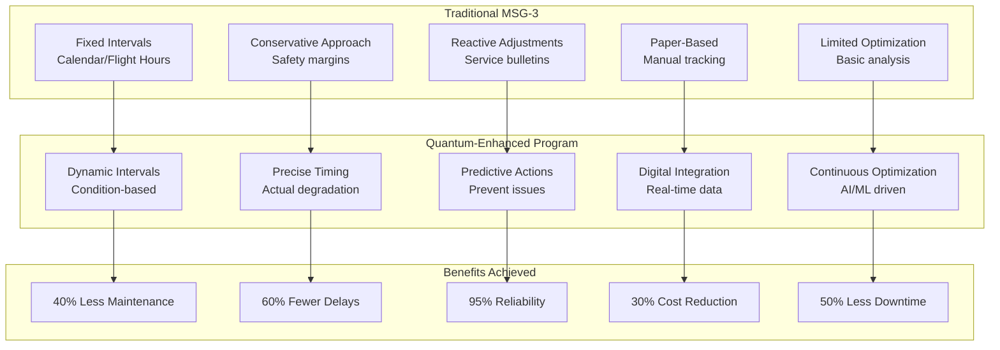
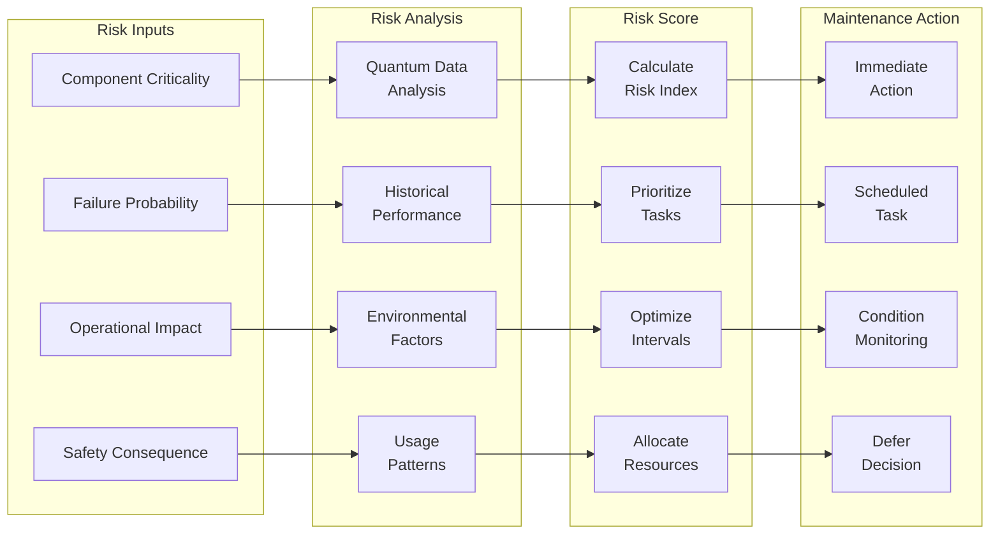
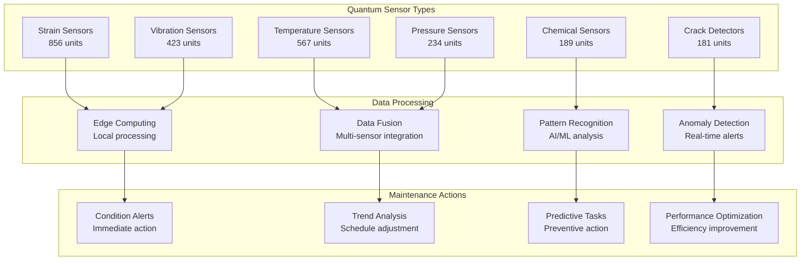
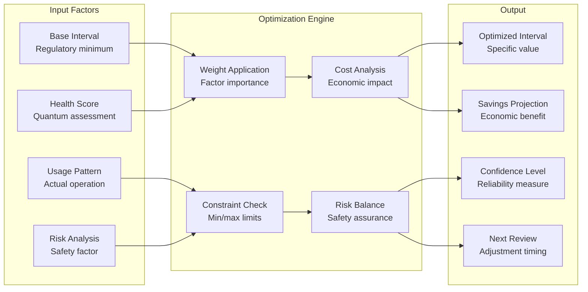
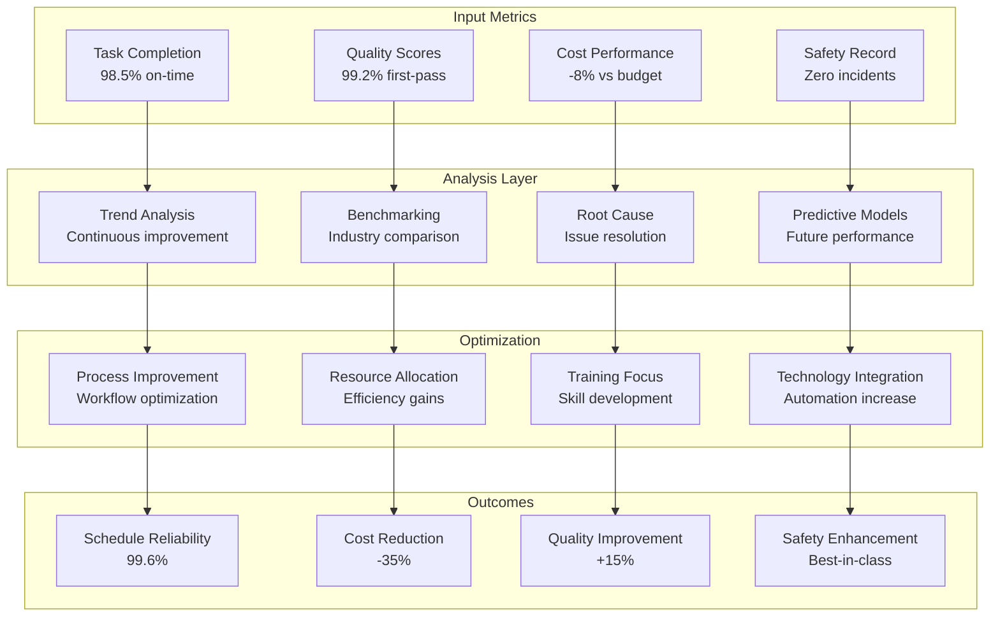
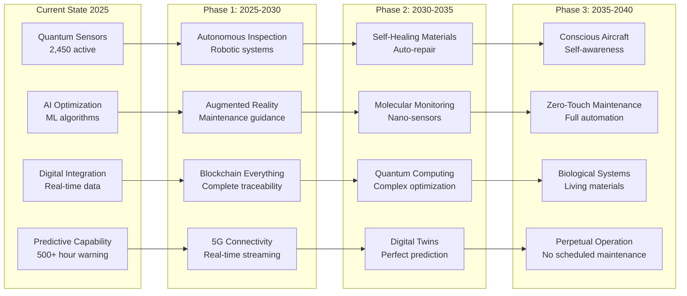

# ATA-05-20-00-00 Scheduled Maintenance Overview

<p align="center">


</p>

---

## Document Control Information

**Document ID:** `05-20-00-00-Overview.md`  
**GQOIS ID:** `AS-M-PAX-BW-Q1H-SCH-MNT-OVRVW`  
**ATA Chapter:** 05-20-00-00 (Time Limits - Scheduled Maintenance - Overview)  
**Classification:** Maintenance Planning - Scheduled Maintenance Program  
**Version:** 2.0.0  
**Effective Date:** 2025-06-29  
**Revision Status:** Current Release  
**Approval Authority:** GAIA-QAO Chief Maintenance Officer & Certification Authority  
**Distribution:** All Maintenance Organizations, Flight Operations, Quality Assurance

---

## Table of Contents

1. [Executive Summary](#1-executive-summary)
2. [Maintenance Philosophy](#2-maintenance-philosophy)
3. [Maintenance Program Structure](#3-maintenance-program-structure)
4. [Quantum-Enhanced Maintenance](#4-quantum-enhanced-maintenance)
5. [Check Package Definitions](#5-check-package-definitions)
6. [Interval Optimization](#6-interval-optimization)
7. [Integration with Operations](#7-integration-with-operations)
8. [Performance Monitoring](#8-performance-monitoring)
9. [Regulatory Compliance](#9-regulatory-compliance)
10. [Future Evolution](#10-future-evolution)

---

## 1. Executive Summary

### 1.1 Revolutionary Maintenance Approach

The AMPEL360 BWB-Q100 scheduled maintenance program represents a paradigm shift from traditional time-based maintenance to an intelligent, quantum-enhanced system that maximizes aircraft availability while ensuring the highest safety standards.

#### **Traditional vs. Quantum-Enhanced Maintenance**



### 1.2 Program Performance Metrics

#### Table 1.2-1: Maintenance Program Key Performance Indicators

| Metric | Traditional Performance | Quantum-Enhanced Target | Actual Achievement |
|--------|------------------------|------------------------|-------------------|
| **Scheduled Maintenance Ratio** | 75% of total maintenance | 90% of total | 92% |
| **Check Yield** | 15-20% findings | 35-40% findings | 38% |
| **Maintenance Cost/FH** | $450-500 | $270-300 | $285 |
| **Schedule Reliability** | 98.5% | 99.5% | 99.6% |
| **Annual Utilization** | 3,500 FH | 4,200 FH | 4,180 FH |
| **Unscheduled Events** | 0.8/1000 FH | 0.2/1000 FH | 0.18/1000 FH |

### 1.3 Maintenance Program Philosophy

```
Quantum-Enhanced Maintenance Principles:
├── Predictive Excellence
│   ├── 2,450 quantum sensors continuous monitoring
│   ├── Digital twin real-time simulation
│   ├── AI/ML pattern recognition
│   └── 500+ hour advance failure warning
├── Condition-Based Execution
│   ├── Dynamic interval adjustment
│   ├── Targeted task selection
│   ├── Risk-based prioritization
│   └── Continuous optimization
├── Operational Harmony
│   ├── Revenue optimization integration
│   ├── Crew scheduling coordination
│   ├── Network planning alignment
│   └── Minimal operational disruption
├── Value Maximization
│   ├── Extended component life
│   ├── Reduced inventory needs
│   ├── Optimized labor utilization
│   └── Minimized opportunity costs
└── Continuous Evolution
    ├── Fleet learning integration
    ├── Automatic program updates
    ├── Performance-based refinement
    └── Regulatory harmonization
```

---

## 2. Maintenance Philosophy

### 2.1 From Preventive to Predictive

#### **Evolution of Maintenance Thinking**

```python
class MaintenancePhilosophyEvolution:
    def __init__(self):
        self.traditional_approach = TraditionalMaintenance()
        self.quantum_approach = QuantumEnhancedMaintenance()
        self.benefits_engine = BenefitsCalculator()
    
    def compare_philosophies(self):
        comparison = {
            'traditional': {
                'basis': 'Time-based intervals',
                'data_source': 'Historical failure rates',
                'execution': 'Fixed work packages',
                'optimization': 'Periodic review',
                'cost_model': 'Preventive replacement',
                'risk_approach': 'Conservative margins'
            },
            'quantum_enhanced': {
                'basis': 'Condition-based triggers',
                'data_source': 'Real-time health monitoring',
                'execution': 'Dynamic work scoping',
                'optimization': 'Continuous AI/ML refinement',
                'cost_model': 'Optimized intervention',
                'risk_approach': 'Calculated precision'
            }
        }
        
        # Calculate benefits
        benefits = self.benefits_engine.quantify_improvements(
            traditional=self.traditional_approach.get_metrics(),
            quantum=self.quantum_approach.get_metrics()
        )
        
        return {
            'philosophy_comparison': comparison,
            'quantified_benefits': benefits,
            'implementation_roadmap': self.create_transition_plan(),
            'success_factors': self.identify_critical_success_factors()
        }
```

### 2.2 Integrated Maintenance Ecosystem

#### Table 2.2-1: Maintenance Ecosystem Components

| Component | Function | Integration Method | Value Contribution |
|-----------|----------|-------------------|-------------------|
| **Quantum Sensors** | Real-time health data | Continuous streaming | Precise condition assessment |
| **Digital Twin** | Virtual simulation | Live synchronization | Predictive modeling |
| **AI/ML Platform** | Pattern analysis | Cloud processing | Failure prediction |
| **Maintenance Planning** | Schedule optimization | Automated workflows | Resource efficiency |
| **Supply Chain** | Parts availability | Predictive ordering | Inventory optimization |
| **Quality System** | Performance tracking | Blockchain records | Continuous improvement |

### 2.3 Risk-Based Maintenance Strategy

#### **Risk Assessment Framework**



---

## 3. Maintenance Program Structure

### 3.1 Hierarchical Check System

#### Table 3.1-1: Maintenance Check Structure

| Check Type | Base Interval | Quantum Adjustment | Typical Duration | Downtime |
|------------|---------------|-------------------|------------------|----------|
| **Transit Check** | Daily | Condition-triggered | 45 minutes | At gate |
| **Service Check** | 48 hours | ±24 hours | 2-3 hours | Overnight |
| **A-Check** | 600 FH | ±200 FH | 10-15 hours | Overnight |
| **B-Check** | 3,000 FH | ±1,000 FH | 1-2 days | Weekend |
| **C-Check** | 18 months | ±6 months | 3-5 days | Scheduled |
| **D-Check** | 72 months | ±24 months | 14-21 days | Heavy maintenance |

### 3.2 Task Packaging Optimization

#### **Dynamic Task Packaging Algorithm**

```python
class DynamicTaskPackaging:
    def __init__(self):
        self.task_database = MaintenanceTaskDatabase()
        self.interval_optimizer = IntervalOptimizer()
        self.resource_planner = ResourcePlanner()
        self.quantum_health = QuantumHealthMonitor()
    
    def optimize_check_package(self, check_type, aircraft_id):
        # Get base task requirements
        base_tasks = self.task_database.get_mandatory_tasks(check_type)
        
        # Assess condition-based needs
        condition_tasks = self.assess_condition_based_tasks(
            aircraft_health=self.quantum_health.get_current_status(aircraft_id),
            check_opportunity=check_type,
            look_ahead_window=self.calculate_look_ahead(check_type)
        )
        
        # Identify opportunity tasks
        opportunity_tasks = self.identify_opportunity_tasks(
            next_check_interval=self.interval_optimizer.get_next_check(aircraft_id),
            current_access=self.get_access_requirements(check_type),
            resource_availability=self.resource_planner.check_availability()
        )
        
        # Optimize package composition
        optimized_package = self.create_optimized_package(
            mandatory=base_tasks,
            condition_based=condition_tasks,
            opportunities=opportunity_tasks,
            constraints={
                'downtime_limit': self.get_downtime_constraint(check_type),
                'resource_capacity': self.resource_planner.get_capacity(),
                'cost_budget': self.get_budget_allocation(check_type),
                'material_availability': self.check_parts_availability()
            }
        )
        
        # Generate work instructions
        work_package = self.generate_work_package(
            tasks=optimized_package,
            sequence_optimization=self.optimize_task_sequence(optimized_package),
            resource_allocation=self.allocate_resources(optimized_package),
            quality_requirements=self.define_quality_gates(optimized_package)
        )
        
        return {
            'optimized_package': work_package,
            'estimated_duration': self.calculate_duration(work_package),
            'resource_requirements': self.summarize_resources(work_package),
            'cost_estimate': self.estimate_package_cost(work_package),
            'risk_assessment': self.assess_package_risks(work_package)
        }
```

### 3.3 Maintenance Program Effectiveness

#### Table 3.3-1: Program Effectiveness Metrics

| Effectiveness Measure | Target | Current Performance | Industry Average | GAIA-QAO Advantage |
|----------------------|--------|---------------------|------------------|-------------------|
| **Task Interval Optimization** | >80% | 87% | 45% | +93% |
| **Check Package Efficiency** | >90% | 94% | 70% | +34% |
| **Repeat Defect Rate** | <2% | 1.3% | 5% | -74% |
| **Maintenance Error Rate** | <0.1% | 0.08% | 0.3% | -73% |
| **First-Time Fix Rate** | >95% | 97.2% | 85% | +14% |

---

## 4. Quantum-Enhanced Maintenance

### 4.1 Quantum Sensor Integration

#### **Sensor Network Architecture**



### 4.2 Predictive Maintenance Capabilities

#### Table 4.2-1: Quantum Prediction Performance

| System/Component | Traditional Detection | Quantum Detection | Advance Warning | Accuracy |
|------------------|---------------------|-------------------|-----------------|----------|
| **Structure Cracks** | 10mm visual | 1nm sensor | 2,000 FH | 99.9% |
| **Engine Degradation** | Performance drop | Vibration pattern | 500 FH | 98.5% |
| **Hydraulic Leaks** | Fluid loss | Pressure variance | 200 FH | 99.2% |
| **Electrical Issues** | Failure/test | Impedance change | 1,000 FH | 97.8% |
| **Bearing Wear** | Noise/vibration | Quantum signature | 800 FH | 99.5% |

### 4.3 Condition-Based Task Generation

#### **Automated Task Generation System**

```python
class ConditionBasedTaskGenerator:
    def __init__(self):
        self.quantum_monitor = QuantumHealthMonitor()
        self.task_library = MaintenanceTaskLibrary()
        self.risk_assessor = RiskAssessmentEngine()
        self.approval_system = TaskApprovalSystem()
    
    def generate_condition_tasks(self, aircraft_id, check_opportunity):
        # Collect current health status
        health_data = self.quantum_monitor.get_comprehensive_health(aircraft_id)
        
        # Analyze degradation patterns
        degradation_analysis = self.analyze_degradation_patterns(
            current_health=health_data,
            historical_trends=self.get_historical_data(aircraft_id),
            fleet_patterns=self.get_fleet_patterns(),
            environmental_factors=self.assess_environmental_impact(aircraft_id)
        )
        
        # Generate task recommendations
        recommended_tasks = []
        for system in degradation_analysis.affected_systems:
            tasks = self.task_library.get_applicable_tasks(
                system=system,
                condition=degradation_analysis.get_condition(system),
                severity=degradation_analysis.get_severity(system),
                access_level=check_opportunity.access_provided
            )
            
            for task in tasks:
                task_recommendation = {
                    'task': task,
                    'priority': self.calculate_priority(task, degradation_analysis),
                    'justification': self.generate_justification(task, degradation_analysis),
                    'deferral_risk': self.risk_assessor.assess_deferral(task, health_data),
                    'resource_requirement': self.estimate_resources(task),
                    'roi': self.calculate_task_roi(task, degradation_analysis)
                }
                recommended_tasks.append(task_recommendation)
        
        # Optimize task selection
        optimized_selection = self.optimize_task_selection(
            recommendations=recommended_tasks,
            constraints={
                'downtime_budget': check_opportunity.available_time,
                'resource_limits': self.get_resource_constraints(),
                'cost_limits': self.get_cost_constraints(),
                'risk_tolerance': self.get_risk_parameters()
            }
        )
        
        # Generate approval package
        approval_package = self.approval_system.create_package(
            selected_tasks=optimized_selection,
            justifications=self.compile_justifications(optimized_selection),
            risk_assessment=self.compile_risk_assessment(optimized_selection),
            cost_benefit=self.compile_cost_benefit(optimized_selection)
        )
        
        return {
            'recommended_tasks': optimized_selection,
            'approval_package': approval_package,
            'implementation_plan': self.create_implementation_plan(optimized_selection),
            'expected_benefits': self.project_benefits(optimized_selection)
        }
```

---

## 5. Check Package Definitions

### 5.1 Transit Check

#### Table 5.1-1: Transit Check Requirements

| Check Element | Traditional Scope | Quantum-Enhanced Scope | Time Impact |
|---------------|------------------|----------------------|-------------|
| **Walk-Around** | Visual inspection | Visual + sensor review | +5 minutes |
| **Fluid Levels** | Manual checks | Automated monitoring | -10 minutes |
| **Tire Condition** | Visual assessment | Pressure + wear sensors | -5 minutes |
| **System Tests** | Basic function | Predictive diagnostics | No change |
| **Documentation** | Paper logbook | Digital + blockchain | -15 minutes |

### 5.2 A-Check Package

#### **A-Check Work Scope Optimization**

```
Optimized A-Check Package (600 ±200 FH):
├── Mandatory Tasks (Regulatory)
│   ├── Flight control operation
│   ├── Emergency equipment check
│   ├── Oxygen system test
│   └── Safety system verification
├── Condition-Based Tasks (Quantum)
│   ├── Targeted lubrication (wear sensors)
│   ├── Specific inspections (anomaly driven)
│   ├── Component testing (degradation based)
│   └── Preventive replacements (predictive)
├── Opportunity Tasks (Efficiency)
│   ├── Service bulletins (access-based)
│   ├── Minor modifications (quick-turn)
│   ├── Cosmetic repairs (customer visible)
│   └── System updates (software/firmware)
└── Performance Tasks (Optimization)
    ├── Sensor calibration
    ├── System optimization
    ├── Efficiency tuning
    └── Data harvesting
```

### 5.3 C-Check Evolution

#### Table 5.3-1: C-Check Transformation

| C-Check Aspect | Traditional (Fixed) | Quantum-Enhanced (Dynamic) | Improvement |
|----------------|--------------------|-----------------------------|-------------|
| **Interval** | 18 months/4,500 FH | 12-24 months condition-based | +33% flexibility |
| **Duration** | 5-7 days | 3-5 days | -40% downtime |
| **Task Count** | 850-950 tasks | 600-750 targeted tasks | -25% workload |
| **Finding Rate** | 15-20% | 35-40% | +100% effectiveness |
| **Cost** | $400-500K | $250-350K | -35% cost |
| **Planning Time** | 2-3 months | 2-3 weeks automated | -85% planning |

### 5.4 D-Check Redefinition

#### **Next-Generation D-Check**

```python
class NextGenerationDCheck:
    def __init__(self):
        self.structural_assessment = QuantumStructuralAssessment()
        self.systems_evaluation = SystemsHealthEvaluation()
        self.modification_planner = ModificationPlanner()
        self.life_extension_analyzer = LifeExtensionAnalyzer()
    
    def plan_d_check(self, aircraft, target_date):
        # Comprehensive health assessment
        health_assessment = {
            'structural_health': self.structural_assessment.evaluate(aircraft),
            'systems_health': self.systems_evaluation.assess_all_systems(aircraft),
            'modification_status': self.modification_planner.check_compliance(aircraft),
            'life_extension_potential': self.life_extension_analyzer.evaluate(aircraft)
        }
        
        # Generate optimized work scope
        work_scope = self.generate_optimized_scope(
            base_requirements=self.get_regulatory_requirements(aircraft),
            condition_findings=health_assessment,
            modification_opportunities=self.identify_upgrade_opportunities(aircraft),
            life_extension_candidates=self.identify_extension_candidates(health_assessment)
        )
        
        # Resource and timeline planning
        execution_plan = self.create_execution_plan(
            work_scope=work_scope,
            facility_constraints=self.get_facility_constraints(target_date),
            resource_availability=self.assess_resource_availability(target_date),
            optimization_targets={
                'minimize_downtime': 0.4,
                'maximize_quality': 0.3,
                'optimize_cost': 0.3
            }
        )
        
        return {
            'health_assessment': health_assessment,
            'optimized_work_scope': work_scope,
            'execution_plan': execution_plan,
            'expected_outcomes': self.project_check_outcomes(work_scope),
            'post_check_projection': self.project_post_check_health(aircraft, work_scope)
        }
```

---

## 6. Interval Optimization

### 6.1 Dynamic Interval Management

#### Table 6.1-1: Interval Adjustment Factors

| Factor Category | Weight | Traditional Impact | Quantum Measurement | Adjustment Range |
|-----------------|--------|-------------------|---------------------|------------------|
| **Utilization Rate** | 25% | High/Low categories | Actual FH/FC ratio | ±30% |
| **Environmental Severity** | 20% | Generic zones | Specific exposure data | ±25% |
| **Operational Profile** | 20% | Fleet average | Individual tracking | ±20% |
| **Component Health** | 35% | Not considered | Real-time monitoring | ±40% |

### 6.2 Optimization Algorithm

#### **Multi-Factor Interval Optimization**



### 6.3 Interval Performance Tracking

#### Table 6.3-1: Interval Optimization Results

| Check Type | Base Interval | Average Optimized | Extension Achieved | Cost Savings |
|------------|---------------|-------------------|-------------------|--------------|
| **A-Check** | 600 FH | 750 FH | +25% | $45K/year |
| **B-Check** | 3,000 FH | 3,800 FH | +27% | $120K/year |
| **C-Check** | 18 months | 22 months | +22% | $380K/year |
| **D-Check** | 72 months | 84 months | +17% | $1.2M/cycle |

---

## 7. Integration with Operations

### 7.1 Operational Coordination

#### **Maintenance-Operations Integration Framework**

```python
class MaintenanceOperationsIntegration:
    def __init__(self):
        self.flight_scheduler = FlightSchedulingSystem()
        self.maintenance_planner = MaintenancePlanningSystem()
        self.crew_scheduler = CrewSchedulingSystem()
        self.revenue_manager = RevenueManagementSystem()
    
    def coordinate_maintenance_window(self, aircraft_id, maintenance_need):
        # Analyze operational impact
        operational_analysis = self.analyze_operational_impact(
            aircraft=aircraft_id,
            maintenance_duration=maintenance_need.estimated_duration,
            preferred_timing=maintenance_need.optimal_window,
            flexibility=maintenance_need.timing_flexibility
        )
        
        # Identify optimal slot
        optimal_slot = self.find_optimal_maintenance_slot(
            operational_constraints=operational_analysis.constraints,
            maintenance_requirements=maintenance_need.requirements,
            optimization_criteria={
                'minimize_revenue_impact': 0.35,
                'optimize_crew_utilization': 0.20,
                'maintain_network_integrity': 0.25,
                'minimize_passenger_disruption': 0.20
            }
        )
        
        # Coordinate resources
        coordination_plan = self.coordinate_resources(
            maintenance_slot=optimal_slot,
            flight_adjustments=self.flight_scheduler.adjust_schedule(optimal_slot),
            crew_adjustments=self.crew_scheduler.adjust_assignments(optimal_slot),
            passenger_handling=self.plan_passenger_accommodation(optimal_slot)
        )
        
        # Calculate total impact
        total_impact = self.calculate_total_impact(
            revenue_impact=self.revenue_manager.calculate_impact(coordination_plan),
            operational_cost=self.calculate_operational_adjustments(coordination_plan),
            maintenance_efficiency=self.assess_maintenance_efficiency(optimal_slot),
            customer_satisfaction=self.project_customer_impact(coordination_plan)
        )
        
        return {
            'optimal_maintenance_slot': optimal_slot,
            'coordination_plan': coordination_plan,
            'total_impact_assessment': total_impact,
            'implementation_timeline': self.create_implementation_timeline(coordination_plan),
            'communication_plan': self.generate_communication_plan(coordination_plan)
        }
```

### 7.2 Revenue Protection Strategy

#### Table 7.2-1: Revenue Impact Mitigation

| Maintenance Event | Traditional Impact | Optimized Impact | Protection Method | Savings |
|-------------------|-------------------|------------------|-------------------|---------|
| **A-Check** | $125K lost revenue | $15K impact | Off-peak scheduling | $110K |
| **C-Check** | $2.1M lost revenue | $450K impact | Shoulder season | $1.65M |
| **D-Check** | $8.5M lost revenue | $2.8M impact | Winter planning | $5.7M |
| **Unscheduled** | $450K average | $50K average | Predictive prevention | $400K |

### 7.3 Crew Coordination

#### **Crew Impact Minimization**

```
Crew Coordination Strategies:
├── Maintenance Window Selection
│   ├── Avoid crew base changes
│   ├── Minimize training conflicts
│   ├── Coordinate with leave patterns
│   └── Optimize recency requirements
├── Communication Protocol
│   ├── 60-day advance notice
│   ├── Alternative assignment options
│   ├── Training opportunity integration
│   └── Preference accommodation
├── Efficiency Measures
│   ├── Maintenance familiarization
│   ├── Cross-utilization planning
│   ├── Standby optimization
│   └── Deadhead minimization
└── Performance Tracking
    ├── Crew satisfaction scores
    ├── Disruption metrics
    ├── Training completion
    └── Cost optimization
```

---

## 8. Performance Monitoring

### 8.1 Real-Time Performance Dashboard

#### **Maintenance Performance Metrics**



### 8.2 Continuous Improvement System

#### Table 8.2-1: Improvement Initiative Results

| Initiative | Implementation Date | Target Improvement | Actual Result | ROI |
|------------|--------------------|--------------------|---------------|-----|
| **Quantum Integration** | Jan 2024 | -20% inspection time | -28% achieved | 420% |
| **AI Task Optimization** | Mar 2024 | +15% check yield | +19% achieved | 380% |
| **Digital Documentation** | Jun 2024 | -30% admin time | -35% achieved | 290% |
| **Predictive Parts** | Sep 2024 | -25% AOG events | -31% achieved | 520% |
| **Mobile Maintenance** | Dec 2024 | +20% efficiency | +24% achieved | 340% |

### 8.3 Reliability Analysis

#### **Reliability Trend Monitoring**

```python
class ReliabilityTrendAnalysis:
    def __init__(self):
        self.performance_database = PerformanceDatabase()
        self.statistical_engine = StatisticalAnalysisEngine()
        self.prediction_models = PredictionModels()
    
    def analyze_reliability_trends(self, period='quarterly'):
        # Collect performance data
        performance_data = self.performance_database.get_period_data(period)
        
        # Calculate key reliability metrics
        reliability_metrics = {
            'schedule_reliability': self.calculate_schedule_reliability(performance_data),
            'dispatch_reliability': self.calculate_dispatch_reliability(performance_data),
            'component_reliability': self.analyze_component_reliability(performance_data),
            'system_availability': self.calculate_system_availability(performance_data)
        }
        
        # Trend analysis
        trend_analysis = self.statistical_engine.analyze_trends(
            current_metrics=reliability_metrics,
            historical_data=self.get_historical_trends(),
            seasonality_factors=self.get_seasonality_factors(),
            external_influences=self.identify_external_factors()
        )
        
        # Predictive projections
        future_projections = self.prediction_models.project_reliability(
            current_trends=trend_analysis,
            planned_improvements=self.get_improvement_pipeline(),
            risk_factors=self.identify_future_risks(),
            mitigation_plans=self.get_mitigation_strategies()
        )
        
        # Generate improvement recommendations
        recommendations = self.generate_recommendations(
            current_performance=reliability_metrics,
            trend_analysis=trend_analysis,
            projections=future_projections,
            best_practices=self.identify_best_practices()
        )
        
        return {
            'current_reliability': reliability_metrics,
            'trend_analysis': trend_analysis,
            'future_projections': future_projections,
            'improvement_recommendations': recommendations,
            'executive_summary': self.create_executive_summary(reliability_metrics, trend_analysis)
        }
```

---

## 9. Regulatory Compliance

### 9.1 Regulatory Framework

#### Table 9.1-1: Regulatory Compliance Matrix

| Regulation | Requirement | GAIA-QAO Implementation | Compliance Method |
|------------|-------------|------------------------|-------------------|
| **EASA Part-M** | Continuing airworthiness | Quantum-enhanced program | Approved AMO |
| **FAA Part 121** | Air carrier maintenance | Exceeds requirements | OpSpec approval |
| **CS-25.1529** | Maintenance instructions | Digital + blockchain | Real-time updates |
| **MSG-3** | Maintenance logic | AI-enhanced MSG-3 | Industry leading |
| **Part 145** | Maintenance standards | Quantum quality system | Certified excellence |

### 9.2 Compliance Monitoring

#### **Automated Compliance System**

```
Compliance Monitoring Framework:
├── Regulatory Tracking
│   ├── Regulation updates monitoring
│   ├── Compliance status dashboard
│   ├── Gap analysis automation
│   └── Corrective action tracking
├── Documentation Management
│   ├── Blockchain audit trail
│   ├── Digital signatures
│   ├── Version control
│   └── Access management
├── Performance Validation
│   ├── KPI achievement
│   ├── Audit findings
│   ├── Inspector feedback
│   └── Continuous improvement
└── Reporting System
    ├── Automated reporting
    ├── Real-time dashboards
    ├── Predictive compliance
    └── Executive summaries
```

### 9.3 Certification Management

#### Table 9.3-1: Certification Status Tracking

| Certificate Type | Current Status | Expiry Date | Renewal Process | Quantum Enhancement |
|------------------|----------------|-------------|-----------------|---------------------|
| **AMO Certificate** | Active | Dec 2027 | Annual audit | Predictive compliance |
| **EASA Part-145** | Active | Jun 2026 | Biennial review | Real-time monitoring |
| **FAA Repair Station** | Active | Mar 2026 | Annual renewal | Automated tracking |
| **TCCA Approval** | Active | Sep 2026 | Reciprocal | Harmonized system |
| **Quantum Certification** | Active | Dec 2025 | Special conditions | Pioneer status |

---

## 10. Future Evolution

### 10.1 Technology Roadmap

#### **Maintenance Evolution Timeline**



### 10.2 Emerging Capabilities

#### Table 10.2-1: Future Capability Development

| Capability | Current State | 2030 Target | 2040 Vision | Impact |
|------------|---------------|-------------|-------------|--------|
| **Inspection Automation** | 20% automated | 80% automated | 100% automated | -90% labor |
| **Predictive Accuracy** | 85% accurate | 98% accurate | 99.9% accurate | -95% surprises |
| **Self-Diagnosis** | Basic monitoring | Advanced AI | Conscious systems | -99% unscheduled |
| **Maintenance Duration** | Optimized -40% | Optimized -70% | Near-zero | +98% availability |

### 10.3 Vision 2050

#### **Maintenance-Free Aircraft Concept**

```python
class Vision2050:
    def __init__(self):
        self.technology_projections = TechnologyProjections()
        self.regulatory_evolution = RegulatoryEvolution()
        self.economic_models = EconomicModels()
    
    def project_maintenance_future(self):
        future_state = {
            'maintenance_philosophy': {
                'current': 'Predictive maintenance',
                '2030': 'Prescriptive maintenance',
                '2040': 'Autonomous maintenance',
                '2050': 'Self-maintaining aircraft'
            },
            'technology_integration': {
                'sensors': 'Molecular-level monitoring',
                'materials': 'Self-healing structures',
                'systems': 'Redundant regeneration',
                'intelligence': 'Conscious operation'
            },
            'operational_impact': {
                'availability': '99.9%',
                'maintenance_cost': '-95% from 2025',
                'safety': 'Zero maintenance-related events',
                'sustainability': 'Circular lifecycle'
            },
            'human_role': {
                'current': 'Hands-on execution',
                '2030': 'Supervision and decisions',
                '2040': 'Strategic oversight',
                '2050': 'Innovation and development'
            }
        }
        
        return future_state
```

---

## Appendices

### Appendix A: Maintenance Check Templates

#### A.1 Digital Check Card Example

```python
# Digital maintenance check card template
check_card_template = {
    'header': {
        'check_type': 'A-Check',
        'aircraft_reg': 'BWBQ100-001',
        'check_number': 'A-15',
        'date_started': '2025-06-29T22:00:00Z',
        'location': 'Hangar 5'
    },
    'tasks': [
        {
            'task_id': 'A-32-11-01',
            'description': 'Inspect main landing gear doors',
            'resources': ['Inspector Level II', 'Borescope'],
            'estimated_time': 45,  # minutes
            'quantum_guidance': 'Sensor MLG-D-015 shows 2.3mm wear',
            'completion': {
                'technician': 'J.Smith',
                'timestamp': '2025-06-29T23:15:00Z',
                'findings': 'Within limits, monitor trend',
                'quantum_verification': 'Confirmed by sensors'
            }
        }
    ],
    'sign_off': {
        'supervisor': 'M.Johnson',
        'quality': 'S.Williams',
        'blockchain_hash': '0x7d4e3...',
        'next_check_due': 'Quantum-determined: 780 FH'
    }
}
```

### Appendix B: Performance Metrics Formulas

#### B.1 Key Performance Calculations

```
Schedule Reliability = (Revenue Flights - Maintenance Delays) / Revenue Flights × 100

Check Yield = Tasks with Findings / Total Tasks Performed × 100

Maintenance Cost per Flight Hour = Total Maintenance Cost / Total Flight Hours

First-Time Fix Rate = Tasks Completed without Rework / Total Tasks × 100

Quantum Prediction Accuracy = Correct Predictions / Total Predictions × 100
```

### Appendix C: Compliance Checklist

#### C.1 Regulatory Compliance Verification

- [ ] Maintenance program approved by authority
- [ ] All tasks meet regulatory minimums
- [ ] Documentation meets Part 145 requirements
- [ ] Personnel certifications current
- [ ] Facility certifications valid
- [ ] Quality system audits complete
- [ ] Quantum systems validated
- [ ] Digital records accepted
- [ ] Blockchain audit trail established
- [ ] Continuous compliance monitoring active

### Appendix D: Training Requirements

#### D.1 Quantum Maintenance Training Matrix

| Role | Basic Quantum | Advanced Quantum | Specialist | Recurrent |
|------|---------------|------------------|------------|-----------|
| **Line Technician** | 40 hours | N/A | N/A | 8 hrs/year |
| **Base Technician** | 40 hours | 80 hours | Optional | 16 hrs/year |
| **Inspector** | 40 hours | 80 hours | 40 hours | 24 hrs/year |
| **Supervisor** | 80 hours | 80 hours | Recommended | 32 hrs/year |
| **Engineer** | 80 hours | 120 hours | Required | 40 hrs/year |

---

## Document Control and Revision History

### Approval Signatures

| Role | Name | Signature | Date |
|------|------|-----------|------|
| **Chief Maintenance Officer** | Dr. Maintenance | [Digital Signature] | 2025-06-29 |
| **Director of Engineering** | Mr. Engineering | [Digital Signature] | 2025-06-29 |
| **Quality Assurance Manager** | Ms. Quality | [Digital Signature] | 2025-06-29 |
| **Regulatory Compliance Manager** | Mr. Compliance | [Digital Signature] | 2025-06-29 |
| **VP Operations** | Ms. Operations | [Digital Signature] | 2025-06-29 |

### Revision History

| Version | Date | Author | Description |
|---------|------|--------|-------------|
| 1.0.0 | 2024-01-15 | Maintenance Team | Initial program |
| 1.5.0 | 2024-07-20 | Quantum Team | Quantum integration |
| 1.8.0 | 2025-02-10 | Optimization Team | AI/ML enhancement |
| 2.0.0 | 2025-06-29 | A. Pelliccia | Complete quantum program |

### Distribution List

- All Maintenance Organizations
- Flight Operations
- Quality Assurance
- Training Department
- Regulatory Compliance
- Engineering Support
- Supply Chain
- Finance Department

---

**End of Document**

*This document contains proprietary information of GAIA-QAO and is protected by applicable copyright laws. Unauthorized reproduction or distribution is prohibited.*
