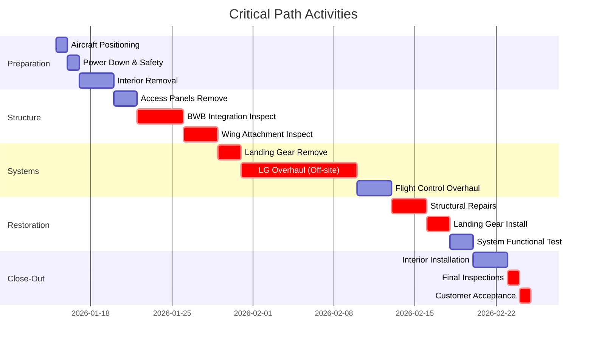

# 05-20-30-00-01 C-Check Planning - AMPEL360 BWB-Q100
## Master Planning Document

### Document Information
- **Document ID**: 05-20-30-00-01-CCheckPlanning
- **Format**: Planning Document (MPP equivalent)
- **Aircraft Type**: AMPEL360 BWB-Q100
- **Check Type**: C-Check Heavy Maintenance
- **Planning Horizon**: 12 months pre-check to 1 month post-check
- **Version**: 1.0.0
- **Date**: 2025-01-20

---

## 1. C-Check Planning Overview

### 1.1 Project Summary
```
Project Name: AMPEL360 C-Check MSN 025
Planned Start: 2026-01-15
Planned Finish: 2026-02-07
Duration: 23 days
Total Work: 20,400 manhours
Total Cost: $2,850,000
Resources: 111 peak / 75 average
```

### 1.2 Key Milestones

| Milestone | Date | Predecessor | Impact |
|-----------|------|-------------|--------|
| **M1: Planning Kickoff** | 2025-01-15 | - | 12 months before |
| **M2: Long Lead Orders** | 2025-04-01 | M1 | 9 months before |
| **M3: Work Scope Freeze** | 2025-10-15 | M2 | 3 months before |
| **M4: Resource Confirmation** | 2025-12-15 | M3 | 1 month before |
| **M5: Aircraft Arrival** | 2026-01-15 | M4 | Day 0 |
| **M6: Major Inspections Complete** | 2026-01-27 | M5 | Day 12 |
| **M7: Systems Restoration Complete** | 2026-02-03 | M6 | Day 19 |
| **M8: Aircraft Delivery** | 2026-02-07 | M7 | Day 23 |

---

## 2. Work Breakdown Structure (WBS)

### 2.1 Level 1 WBS
```
1.0 C-Check Project Management
2.0 Pre-Check Preparation
3.0 Aircraft Receipt & Opening
4.0 Structural Inspections
5.0 Systems Maintenance
6.0 Powerplant Maintenance
7.0 Landing Gear Overhaul
8.0 Avionics & Electrical
9.0 Interior Refurbishment
10.0 Quantum Systems
11.0 Modifications
12.0 Testing & Close-Out
13.0 Quality Assurance
14.0 Aircraft Delivery
```

### 2.2 Detailed WBS (Selected Branches)

```
4.0 Structural Inspections
    4.1 Fuselage Structure
        4.1.1 Crown inspection (160 MH)
        4.1.2 Pressure vessel check (240 MH)
        4.1.3 Frame/stringer detail (320 MH)
        4.1.4 Door cutouts (180 MH)
        4.1.5 BWB integration (400 MH)
    4.2 Wing Structure
        4.2.1 Wing box inspection (480 MH)
        4.2.2 Spar cap inspection (160 MH)
        4.2.3 Wing attachment (240 MH)
        4.2.4 Control attachments (120 MH)
    4.3 Empennage
        4.3.1 Horizontal stabilizer (160 MH)
        4.3.2 Vertical stabilizer (120 MH)
        4.3.3 Control surfaces (80 MH)
```

---

## 3. Critical Path Network

### 3.1 Critical Path Activities



### 3.2 Critical Path Analysis

| Activity ID | Activity Name | Duration | Early Start | Early Finish | Late Start | Late Finish | Float |
|-------------|---------------|----------|-------------|--------------|------------|-------------|-------|
| CP-001 | Aircraft positioning | 4h | Day 1 00:00 | Day 1 04:00 | Day 1 00:00 | Day 1 04:00 | 0 |
| CP-002 | Interior removal | 24h | Day 1 04:00 | Day 2 04:00 | Day 1 04:00 | Day 2 04:00 | 0 |
| CP-003 | BWB zone access | 16h | Day 2 04:00 | Day 2 20:00 | Day 2 04:00 | Day 2 20:00 | 0 |
| CP-004 | BWB inspection | 32h | Day 2 20:00 | Day 4 04:00 | Day 2 20:00 | Day 4 04:00 | 0 |
| CP-005 | Landing gear removal | 16h | Day 4 04:00 | Day 4 20:00 | Day 4 04:00 | Day 4 20:00 | 0 |
| CP-006 | LG overhaul | 240h | Day 4 20:00 | Day 14 20:00 | Day 4 20:00 | Day 14 20:00 | 0 |
| CP-007 | Structural repairs | 24h | Day 14 20:00 | Day 15 20:00 | Day 14 20:00 | Day 15 20:00 | 0 |
| CP-008 | Landing gear install | 16h | Day 15 20:00 | Day 16 12:00 | Day 15 20:00 | Day 16 12:00 | 0 |
| CP-009 | Functional tests | 48h | Day 16 12:00 | Day 18 12:00 | Day 16 12:00 | Day 18 12:00 | 0 |
| CP-010 | Final inspection | 8h | Day 18 12:00 | Day 18 20:00 | Day 18 12:00 | Day 18 20:00 | 0 |

**Critical Path Duration**: 456 hours (19 days)

---

## 4. Resource Planning

### 4.1 Resource Loading Chart

```
Week 1 (Days 1-5): Access and Opening
- Structures: 16 persons
- Systems: 8 persons  
- Support: 8 persons
- Quality: 4 persons
Total: 36 persons

Week 2 (Days 6-10): Major Inspections
- Structures: 32 persons
- Systems: 16 persons
- Avionics: 12 persons
- Powerplant: 8 persons
- Quantum: 8 persons
- Quality: 8 persons
Total: 84 persons

Week 3 (Days 11-15): Peak Activity
- Structures: 24 persons
- Systems: 20 persons
- Avionics: 16 persons
- Interior: 16 persons
- Powerplant: 12 persons
- Quantum: 12 persons
- Quality: 11 persons
Total: 111 persons (PEAK)

Week 4 (Days 16-20): Build-Up
- Structures: 8 persons
- Systems: 16 persons
- Interior: 20 persons
- Testing: 12 persons
- Quality: 8 persons
Total: 64 persons

Days 21-23: Close-Out
- Systems: 8 persons
- Testing: 8 persons
- Quality: 6 persons
- Support: 6 persons
Total: 28 persons
```

### 4.2 Skill Matrix Requirements

| Skill Category | Peak Required | Available | Gap | Mitigation |
|----------------|---------------|-----------|-----|------------|
| **Structures B1** | 32 | 28 | -4 | Overtime/contract |
| **Avionics B2** | 16 | 16 | 0 | Adequate |
| **NDT Level II** | 8 | 6 | -2 | Schedule overlap |
| **Composite Repair** | 6 | 5 | -1 | Cross-training |
| **Quantum Specialist** | 12 | 10 | -2 | OEM support |
| **Interior Certified** | 20 | 22 | +2 | Available |
| **QA/QC RII** | 11 | 12 | +1 | Available |

### 4.3 Resource Leveling Strategy

```python
class ResourceLeveling:
    def __init__(self):
        self.resource_pool = ResourcePool()
        self.task_scheduler = TaskScheduler()
        self.optimization_engine = OptimizationEngine()
        
    def level_c_check_resources(self, project_plan):
        # Define resource constraints
        constraints = {
            'max_total_resources': 111,
            'max_overtime_percent': 20,
            'skill_availability': self.resource_pool.get_availability(),
            'shift_patterns': ['day', 'evening', 'weekend']
        }
        
        # Identify resource conflicts
        conflicts = self.identify_conflicts(
            project_plan.resource_requirements,
            constraints
        )
        
        # Apply leveling strategies
        leveling_strategies = [
            self.shift_non_critical_tasks,
            self.split_large_tasks,
            self.adjust_task_durations,
            self.utilize_overtime,
            self.bring_in_contractors
        ]
        
        optimized_plan = project_plan
        for strategy in leveling_strategies:
            if self.has_conflicts(optimized_plan):
                optimized_plan = strategy(optimized_plan, conflicts)
        
        return {
            'leveled_plan': optimized_plan,
            'resource_utilization': self.calculate_utilization(optimized_plan),
            'cost_impact': self.calculate_cost_impact(project_plan, optimized_plan),
            'schedule_impact': self.calculate_schedule_impact(project_plan, optimized_plan)
        }
```

---

## 5. Schedule Details

### 5.1 Daily Schedule Overview

#### Days 1-5: Opening Phase
```
Day 1: Aircraft Positioning & Safety
- 00:00-04:00: Aircraft tow-in and positioning
- 04:00-08:00: Power down, safety setup
- 08:00-16:00: Begin interior removal
- 16:00-24:00: Continue removal (2nd shift)

Day 2: Access Creation
- All shifts: Interior removal continues
- Day shift: Begin panel removal
- Evening: Fuel system preparation

Day 3-4: Major Access
- Complete interior strip
- Open major access panels
- Prepare inspection zones
- Begin preliminary inspections

Day 5: Inspection Preparation
- NDT equipment setup
- Quantum system preparation
- Zone cleaning
- Team briefings
```

#### Days 6-15: Inspection & Repair Phase
```
Day 6-8: Structural Inspections
- Fuselage zones 100-500
- Wing primary structure
- Empennage detailed
- NDT of critical areas

Day 9-11: Component Removal
- Landing gear removal
- Engine accessories
- Flight control components
- Major LRUs

Day 12-14: Deep Inspections
- BWB integration zones
- Fuel tank entries
- Wire bundle inspection
- Hidden areas

Day 15: Repair Execution
- Structural repairs
- Component changes
- Modification starts
```

#### Days 16-20: Build-Up Phase
```
Day 16-17: Component Installation
- Landing gear installation
- Overhauled components
- New/modified systems

Day 18-19: System Build
- Wire bundle restoration
- Hydraulic/fuel systems
- Interior structure

Day 20: Pre-Test Prep
- System servicing
- Software uploads
- Pre-functional checks
```

#### Days 21-23: Test & Delivery
```
Day 21: Functional Testing
- Power-on tests
- System functionals
- Quantum calibration

Day 22: Final Items
- Interior completion
- Cosmetic items
- Documentation

Day 23: Delivery
- Final inspection
- Customer acceptance
- Aircraft release
```

### 5.2 Shift Patterns

| Shift | Hours | Days | Focus | Staffing |
|-------|-------|------|-------|----------|
| **Day** | 06:00-14:00 | Mon-Sat | Primary work | 60% |
| **Evening** | 14:00-22:00 | Mon-Sat | Continuation | 30% |
| **Night** | 22:00-06:00 | As required | Critical path | 10% |
| **Weekend** | 06:00-18:00 | Sat-Sun | Catch-up | 25% |

---

## 6. Material Planning

### 6.1 Long Lead Items (Order by M2)

| Item Category | Lead Time | Order Date | Required Date | Cost |
|---------------|-----------|------------|---------------|------|
| **Landing Gear Seals** | 6 months | 2025-04-01 | 2025-10-01 | $45,000 |
| **Quantum Cooling Units** | 8 months | 2025-04-01 | 2025-12-01 | $125,000 |
| **Wire Bundles** | 5 months | 2025-05-01 | 2025-10-01 | $85,000 |
| **Structural Fasteners** | 4 months | 2025-06-01 | 2025-10-01 | $35,000 |
| **Interior Materials** | 6 months | 2025-04-01 | 2025-10-01 | $225,000 |

### 6.2 Rotable Management

```
Pool Requirements:
- Actuators: 24 units (12 on aircraft)
- Computers: 36 units (18 on aircraft)  
- Valves: 48 units (24 on aircraft)
- Quantum modules: 8 units (4 on aircraft)

Exchange Strategy:
- Week 1: Remove and send for overhaul
- Week 2-3: Shop processing time
- Week 3-4: Receive and install overhauled units
```

### 6.3 Consumables Forecast

| Category | Quantity | Unit Cost | Total Cost | Order Date |
|----------|----------|-----------|------------|------------|
| **Sealants** | 200 kg | $150/kg | $30,000 | C-60 days |
| **Lubricants** | 500 L | $50/L | $25,000 | C-30 days |
| **Wipes/Solvents** | Lot | - | $15,000 | C-30 days |
| **NDT Materials** | Lot | - | $20,000 | C-14 days |
| **Quantum Coolants** | 100 L | $500/L | $50,000 | C-7 days |

---

## 7. Risk Management

### 7.1 Risk Register

| Risk ID | Description | Probability | Impact | Mitigation | Owner |
|---------|-------------|-------------|---------|------------|-------|
| **R-01** | Hidden corrosion found | Medium | High | Pre-input inspection, contingency time | Structures Lead |
| **R-02** | LG overhaul delayed | Low | Very High | Backup gear set, expedite capability | Supply Chain |
| **R-03** | Quantum system failure | Low | High | OEM support on standby | Quantum Lead |
| **R-04** | Manpower shortage | Medium | Medium | Cross-training, contractor backup | HR Manager |
| **R-05** | Modification parts late | Medium | High | Early ordering, alternative suppliers | Planning |

### 7.2 Contingency Planning

```python
class ContingencyManager:
    def __init__(self):
        self.risk_monitor = RiskMonitor()
        self.contingency_plans = ContingencyPlans()
        self.decision_engine = DecisionEngine()
        
    def manage_c_check_contingencies(self, project_status):
        active_risks = self.risk_monitor.identify_active_risks(
            project_status,
            threshold='medium'
        )
        
        contingency_actions = []
        
        for risk in active_risks:
            if risk.id == 'R-01':  # Hidden corrosion
                if risk.severity > 0.7:
                    contingency_actions.append({
                        'action': 'activate_structures_tiger_team',
                        'resources': 8,
                        'duration': 48,  # hours
                        'cost_impact': 45000
                    })
                    
            elif risk.id == 'R-02':  # LG delay
                if risk.days_delayed > 2:
                    contingency_actions.append({
                        'action': 'install_backup_gear_set',
                        'impact': 'adds_50_flight_hour_restriction',
                        'cost': 125000,
                        'schedule_recovery': 3  # days
                    })
                    
            elif risk.id == 'R-03':  # Quantum failure
                contingency_actions.append({
                    'action': 'fly_in_oem_specialist',
                    'response_time': 24,  # hours
                    'cost': 15000,
                    'success_probability': 0.95
                })
        
        return self.decision_engine.optimize_contingencies(
            contingency_actions,
            project_constraints={
                'max_schedule_slip': 3,  # days
                'max_cost_overrun': 200000,
                'min_quality_score': 0.95
            }
        )
```

---

## 8. Cost Planning

### 8.1 Cost Breakdown Structure

```
Total Project Cost: $2,850,000

1.0 Labor Costs: $1,450,000 (51%)
    1.1 Direct Labor: $1,160,000
    1.2 Overtime Premium: $145,000
    1.3 Contract Labor: $145,000

2.0 Material Costs: $875,000 (31%)
    2.1 Rotables Exchange: $425,000
    2.2 Consumables: $140,000
    2.3 Life-Limited Parts: $310,000

3.0 Subcontract Costs: $285,000 (10%)
    3.1 NDT Services: $45,000
    3.2 Component Overhaul: $180,000
    3.3 Specialized Services: $60,000

4.0 Overhead & Facilities: $240,000 (8%)
    4.1 Hangar Costs: $120,000
    4.2 Utilities & Support: $60,000
    4.3 Equipment Rental: $60,000
```

### 8.2 Cost Control Measures

| Measure | Target Saving | Implementation | Tracking |
|---------|---------------|----------------|----------|
| **Overtime optimization** | $50,000 | Shift planning | Daily |
| **Material waste reduction** | $25,000 | Precise ordering | Weekly |
| **Efficiency improvement** | $75,000 | Task bundling | Daily |
| **Early completion bonus** | $100,000 | Schedule focus | Milestone |

---

## 9. Quality Planning

### 9.1 Quality Gates

| Gate | Timing | Scope | Authority | Duration |
|------|--------|-------|-----------|----------|
| **QG1** | Day 3 | Access/opening | Lead Inspector | 4 hours |
| **QG2** | Day 8 | Structural findings | Chief Inspector | 8 hours |
| **QG3** | Day 12 | Component condition | Systems Chief | 6 hours |
| **QG4** | Day 17 | Build quality | QA Manager | 8 hours |
| **QG5** | Day 21 | Functional test | Chief + Customer | 8 hours |
| **QG6** | Day 23 | Final release | Director + Customer | 4 hours |

### 9.2 Quality Metrics

```python
class QualityMetrics:
    def __init__(self):
        self.inspection_db = InspectionDatabase()
        self.defect_tracker = DefectTracker()
        self.customer_standards = CustomerStandards()
        
    def track_c_check_quality(self, check_id):
        quality_metrics = {
            'first_time_quality': self.calculate_ftq(),
            'defect_rate': self.calculate_defect_rate(),
            'rework_percentage': self.calculate_rework(),
            'customer_findings': self.track_customer_findings(),
            'escape_rate': self.calculate_escape_rate()
        }
        
        quality_score = (
            quality_metrics['first_time_quality'] * 0.3 +
            (1 - quality_metrics['defect_rate']) * 0.2 +
            (1 - quality_metrics['rework_percentage']) * 0.2 +
            (1 - quality_metrics['customer_findings']) * 0.2 +
            (1 - quality_metrics['escape_rate']) * 0.1
        )
        
        return {
            'overall_score': quality_score,
            'metrics': quality_metrics,
            'trend': self.calculate_trend(check_id),
            'actions_required': self.determine_actions(quality_score)
        }
```

---

## 10. Communication Plan

### 10.1 Stakeholder Communications

| Stakeholder | Frequency | Method | Content | Owner |
|-------------|-----------|---------|---------|-------|
| **Customer** | Daily | Dashboard + Call | Progress, issues | Project Manager |
| **Senior Management** | Weekly | Report | KPIs, risks | Program Director |
| **Team Leads** | Daily | Stand-up meeting | Tasks, resources | Planning Manager |
| **Regulatory** | Milestone | Formal report | Compliance | Quality Manager |
| **OEM** | As needed | Tech portal | Technical issues | Engineering |

### 10.2 Meeting Schedule

```
Daily Meetings:
- 06:00: Shift handover (all shifts)
- 07:00: Team lead standup
- 14:00: Shift handover
- 16:00: Management update

Weekly Meetings:
- Monday 09:00: Week planning
- Wednesday 14:00: Technical review
- Friday 13:00: Progress review

Milestone Meetings:
- Quality gates (as scheduled)
- Customer reviews (weekly)
- Executive briefing (mid-point)
```

---

## 11. Project Controls

### 11.1 Earned Value Management

```python
class EarnedValueTracking:
    def __init__(self):
        self.baseline = ProjectBaseline()
        self.actuals = ActualProgress()
        self.forecaster = Forecaster()
        
    def calculate_evm_metrics(self, date):
        # Basic EVM calculations
        pv = self.baseline.get_planned_value(date)  # Planned Value
        ev = self.actuals.get_earned_value(date)    # Earned Value
        ac = self.actuals.get_actual_cost(date)     # Actual Cost
        
        # Performance indices
        spi = ev / pv if pv > 0 else 0  # Schedule Performance Index
        cpi = ev / ac if ac > 0 else 0  # Cost Performance Index
        
        # Variance analysis
        sv = ev - pv  # Schedule Variance
        cv = ev - ac  # Cost Variance
        
        # Forecasting
        bac = self.baseline.total_budget  # Budget at Completion
        etc = (bac - ev) / cpi if cpi > 0 else bac - ev  # Estimate to Complete
        eac = ac + etc  # Estimate at Completion
        
        return {
            'date': date,
            'pv': pv,
            'ev': ev,
            'ac': ac,
            'spi': spi,
            'cpi': cpi,
            'sv': sv,
            'cv': cv,
            'eac': eac,
            'variance_at_completion': bac - eac,
            'performance_status': self.interpret_status(spi, cpi)
        }
```

### 11.2 Change Control

| Change Type | Approval Level | Impact Threshold | Process Time |
|-------------|----------------|------------------|--------------|
| **Scope addition** | Customer + PM | Any | 24 hours |
| **Schedule change** | PM | >1 day | 4 hours |
| **Resource change** | Team Lead | <10% | 2 hours |
| **Cost change** | Director | >$50k | 24 hours |
| **Quality standard** | QA Manager | Any | 8 hours |

---

## 12. Close-Out Planning

### 12.1 Completion Criteria

- [ ] All work cards signed off
- [ ] All findings cleared or deferred with approval
- [ ] All tests completed satisfactorily
- [ ] All documentation complete and verified
- [ ] Customer acceptance obtained
- [ ] Regulatory compliance confirmed
- [ ] Financial reconciliation complete
- [ ] Lessons learned documented

### 12.2 Delivery Checklist

```
Pre-Delivery (Day 22):
□ Complete all physical work
□ Final cleaning completed
□ Tool control verification
□ FOD check completed
□ Documentation package ready

Delivery Day (Day 23):
□ Final walk-around with customer
□ Demonstration of modifications
□ Documentation handover
□ Logbook entries complete
□ Keys and manuals transferred
□ Release to service signed
□ Aircraft departed
```

---

## Appendices

### Appendix A: Task Dependencies Network
[Detailed PERT network diagram showing all task dependencies]

### Appendix B: Resource Histograms
[Graphical representation of resource loading over time]

### Appendix C: Cost Tracking Templates
[Forms and spreadsheets for cost monitoring]

### Appendix D: Quality Checklists
[Detailed inspection and buyback checklists]

---

## Document Control

### Planning Approval

| Role | Name | Signature | Date |
|------|------|-----------|------|
| **Program Manager** | [Name] | [Digital Signature] | 2025-01-20 |
| **Planning Manager** | [Name] | [Digital Signature] | 2025-01-20 |
| **Maintenance Director** | [Name] | [Digital Signature] | 2025-01-20 |
| **Customer Representative** | [Name] | [Digital Signature] | 2025-01-20 |

### Revision History

| Version | Date | Author | Description |
|---------|------|--------|-------------|
| 1.0.0 | 2025-01-20 | Planning Team | Initial C-Check plan |

---

**END OF PLANNING DOCUMENT**

*This document represents the master planning framework for C-Check execution. Actual project files would include interactive Gantt charts, resource assignments, and real-time tracking capabilities.*
