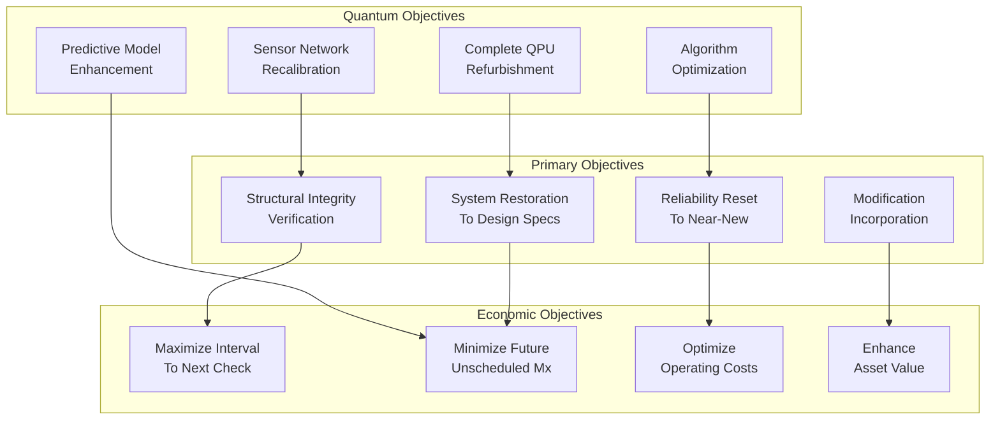
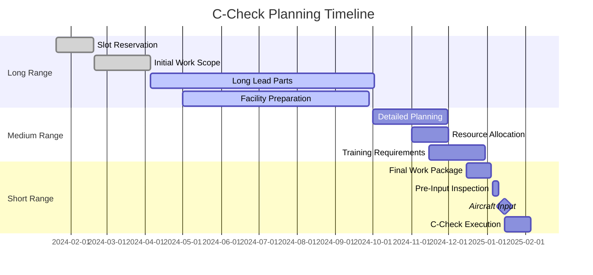
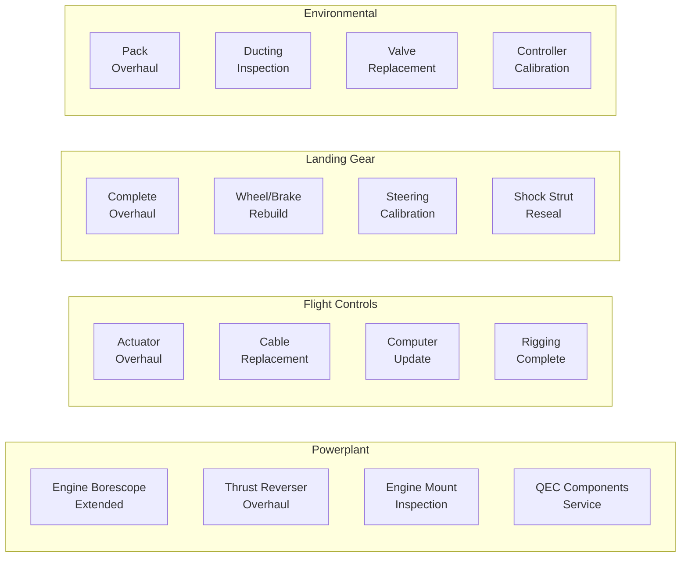
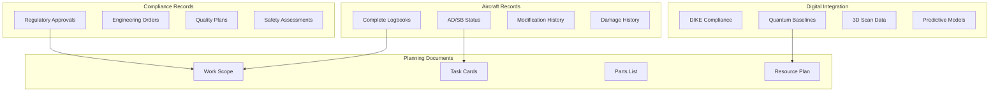
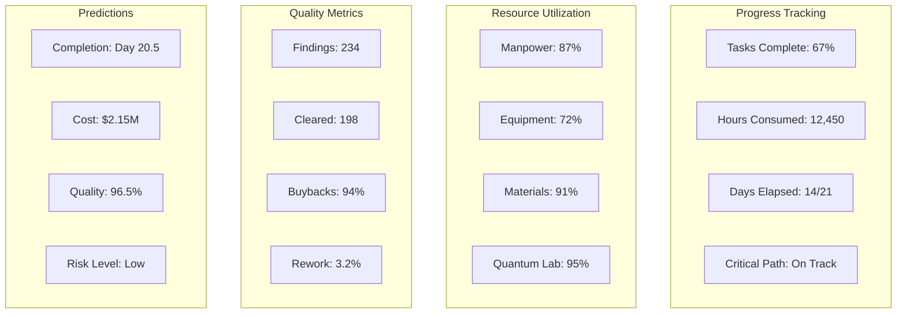

# 05-20-30-00 C-Check General Requirements - AMPEL360 BWB-Q100

## Document Information
- **ATA Chapter**: 05 - Time Limits/Maintenance Checks
- **Section**: 20 - Scheduled Maintenance Checks
- **Subsection**: 30 - C-Check
- **Document Type**: 00 - General Requirements
- **Version**: 1.0.0
- **Date**: 2025-01-20
- **Effectivity**: AMPEL360 BWB-Q100 MSN ALL
- **GAIA-QAO Reference**: AS-M-PAX-BW-Q1H

## Table of Contents
1. [Executive Overview](#1-executive-overview)
2. [C-Check Definition and Scope](#2-c-check-definition-and-scope)
3. [Interval Requirements](#3-interval-requirements)
4. [Planning and Preparation](#4-planning-and-preparation)
5. [Resource Requirements](#5-resource-requirements)
6. [Major Task Categories](#6-major-task-categories)
7. [Quantum System Deep Maintenance](#7-quantum-system-deep-maintenance)
8. [Documentation and Compliance](#8-documentation-and-compliance)
9. [Quality Assurance Framework](#9-quality-assurance-framework)
10. [Performance Metrics and Optimization](#10-performance-metrics-and-optimization)

## 1. Executive Overview

### 1.1 Purpose
This document establishes the comprehensive requirements for C-Check heavy maintenance on the AMPEL360 BWB-Q100 aircraft. The C-Check represents the most extensive scheduled maintenance event short of D-Check, requiring significant aircraft downtime and resources.

### 1.2 C-Check Philosophy
The AMPEL360 C-Check philosophy integrates:
- **Deep Inspection**: Access to normally hidden structure
- **Major Component Overhaul**: Time-limited component replacement
- **System Restoration**: Return systems to near-new performance
- **Quantum Optimization**: Complete recalibration of quantum systems
- **Modification Incorporation**: Major upgrades and improvements

### 1.3 DIKE Reference
- **DIKE ID**: DIKE-05-20-30-00-CCHECK-GEN-001
- **Traceability**: Links to structural inspection programs, MSG-3 analysis, and quantum system lifecycle management

## 2. C-Check Definition and Scope

### 2.1 C-Check Characteristics

#### 2.1.1 Core Elements
The C-Check includes:
- All B-Check items plus extensive additional tasks
- Major structural inspections requiring significant disassembly
- Component overhauls reaching time limits
- Deep system restoration and testing
- Quantum system major maintenance
- Incorporation of major modifications
- Interior reconfiguration if required
- Paint and appearance restoration

#### 2.1.2 Typical Metrics
- **Hangar Time**: 21-28 days
- **Total Manhours**: 18,000-24,000
- **Elapsed Time**: 3-4 weeks
- **Quantum System Hours**: 800-1,200
- **Materials Cost**: $1.2-1.8M
- **Component Exchange**: 200-300 items

### 2.2 Maintenance Classification
- **Category**: Heavy Maintenance
- **Location**: Certified Heavy Maintenance Facility
- **Special Requirements**: 
  - Quantum clean rooms
  - Composite repair capability
  - Major component shops
  - Extensive GSE inventory

### 2.3 C-Check Objectives



## 3. Interval Requirements

### 3.1 Standard C-Check Intervals

#### Table 3.1-1: C-Check Base Intervals

| Operating Profile | Flight Hours | Flight Cycles | Calendar Months | Controlling Factor |
|-------------------|--------------|---------------|-----------------|-------------------|
| **Long-Haul Heavy** | 18,000 FH | 3,000 FC | 72 months | FH typical |
| **Standard Mixed** | 15,000 FH | 7,500 FC | 60 months | Calendar typical |
| **Short-Haul Intensive** | 12,000 FH | 12,000 FC | 48 months | FC typical |
| **Low Utilization** | 10,000 FH | 5,000 FC | 84 months | Calendar limit |
| **Quantum-Intensive** | 12,000 FH | 6,000 FC | 48 months | Quantum systems |

### 3.2 Interval Determination Factors

#### 3.2.1 Primary Drivers
```python
class CCheckIntervalOptimizer:
    def __init__(self):
        self.structural_analyzer = StructuralLifeAnalyzer()
        self.system_degradation = SystemDegradationModel()
        self.quantum_lifecycle = QuantumLifecycleManager()
        self.economic_model = MaintenanceEconomicsModel()
        
    def calculate_optimal_c_check_interval(self, aircraft_id):
        # Structural life limitations
        structural_limit = self.structural_analyzer.calculate_inspection_interval(
            aircraft_id=aircraft_id,
            inspection_type='C-CHECK',
            safety_factor=2.5,
            confidence_level=0.95
        )
        
        # System degradation limits
        system_limits = {}
        for system in self.get_critical_systems():
            degradation_curve = self.system_degradation.model_degradation(
                system_type=system,
                operating_environment=self.get_environment_profile(aircraft_id),
                maintenance_history=self.get_maintenance_quality(aircraft_id)
            )
            system_limits[system] = degradation_curve.get_restoration_point(
                performance_threshold=0.85  # 85% of new performance
            )
        
        # Quantum system requirements
        quantum_limit = self.quantum_lifecycle.calculate_major_maintenance(
            qpu_degradation=self.get_qpu_degradation_rate(aircraft_id),
            sensor_drift=self.get_sensor_drift_profile(aircraft_id),
            algorithm_evolution=self.get_software_update_cycle()
        )
        
        # Economic optimization
        economic_optimum = self.economic_model.optimize_interval(
            structural_constraint=structural_limit,
            system_constraints=system_limits,
            quantum_constraint=quantum_limit,
            downtime_cost=self.get_downtime_cost_per_day(),
            maintenance_cost=self.get_c_check_cost_profile()
        )
        
        # Apply regulatory constraints
        regulatory_maximum = self.get_regulatory_limits('C-CHECK')
        
        # Final interval is minimum of all constraints
        final_interval = min(
            structural_limit,
            min(system_limits.values()),
            quantum_limit,
            economic_optimum,
            regulatory_maximum
        )
        
        return {
            'recommended_interval': final_interval,
            'limiting_factor': self.identify_limiting_factor(final_interval, all_limits),
            'confidence_level': self.calculate_confidence(aircraft_id),
            'economic_impact': self.calculate_economic_impact(final_interval),
            'risk_assessment': self.perform_risk_assessment(final_interval)
        }
```

### 3.3 Adjustment Criteria

#### Table 3.3-1: C-Check Interval Adjustments

| Condition | Adjustment Factor | Approval Required | Documentation |
|-----------|-------------------|-------------------|---------------|
| Excellent maintenance history | +10% | Engineering Manager | Reliability data |
| Harsh environment operation | -15% | Chief Engineer | Environmental exposure |
| Low utilization (<500 FH/year) | Calendar becomes primary | Program Manager | Utilization analysis |
| Quantum system degradation | -20% | Quantum Lead + Chief | Performance metrics |
| Fleet leader program | +500 FH | Regulatory + OEM | Special inspection |

## 4. Planning and Preparation

### 4.1 Long-Range Planning (C-12 Months)

#### 4.1.1 Initial Planning Phase


### 4.2 Work Scope Development

#### 4.2.1 Scope Categories
1. **Mandatory Tasks**
   - Regulatory requirements (ADs, SBs)
   - Life-limited parts reaching limits
   - Structural inspection program
   - Quantum system mandatory updates

2. **Routine Tasks**
   - Standard C-Check card deck
   - System overhauls due
   - Component time changes
   - Deep cleaning and preservation

3. **Condition-Based Tasks**
   - Based on B-Check findings
   - Quantum predictive maintenance
   - Reliability trending
   - Customer requests

4. **Opportunity Tasks**
   - Modifications and upgrades
   - Cabin refurbishment
   - Avionics updates
   - Efficiency improvements

### 4.3 Pre-Input Requirements

#### Table 4.3-1: Pre-Input Checklist

| Category | Requirement | Timeline | Responsible |
|----------|-------------|----------|-------------|
| **Documentation** | Complete work package | C-30 days | Planning |
| **Parts** | 95% availability confirmed | C-14 days | Supply Chain |
| **Resources** | Team assignments complete | C-7 days | HR/Planning |
| **Facilities** | Hangar/shops prepared | C-3 days | Facilities |
| **Aircraft** | Pre-input inspection | C-1 day | Engineering |

## 5. Resource Requirements

### 5.1 Facility Requirements

#### 5.1.1 Hangar Specifications
- **Size**: Minimum 120m × 120m × 35m height
- **Temperature Control**: 18-25°C ±2°C
- **Humidity Control**: 40-60% RH
- **Crane Capacity**: 50-ton minimum
- **Docking System**: Full surround, adjustable
- **Clean Areas**: 
  - Class 10,000 for avionics
  - Class 1,000 for quantum systems

#### 5.1.2 Support Shops
```
Required Shop Capabilities:
- Composite Repair: Autoclave, NDT suite
- Machine Shop: 5-axis CNC, EDM
- Avionics Shop: Environmental testing
- Hydraulic Shop: Test stands to 5000 PSI
- Wheel & Brake: Dynamometer capable
- Battery Shop: Explosion-proof, ventilated
- Quantum Lab: Cryogenic capable, EM shielded
```

### 5.2 Manpower Requirements

#### Table 5.2-1: C-Check Staffing Model

| Specialty | Minimum Staff | Peak Staff | Certification Requirements |
|-----------|---------------|------------|---------------------------|
| **Structures** | 12 | 20 | Composite qualified, NDT |
| **Systems** | 8 | 14 | Type rated, hydraulics/fuel |
| **Avionics** | 6 | 10 | Cat III ILS, RVSM, quantum |
| **Powerplant** | 4 | 8 | Engine type certified |
| **Interior** | 8 | 16 | Cabin safety systems |
| **Paint** | 6 | 12 | Aerospace coatings |
| **Quantum** | 4 | 6 | QSE Level III minimum |
| **QA/QC** | 6 | 10 | RII, stage inspection |
| **Support** | 10 | 15 | Various trades |
| **TOTAL** | **64** | **111** | **Multi-disciplinary** |

### 5.3 Special Equipment and Tools

#### 5.3.1 Major Ground Support Equipment
- Aircraft jacks (450-ton capacity)
- Engine handling system (bootstrap capable)
- Hydraulic test units (5000 PSI)
- Fuel system test cart (explosion-proof)
- Avionics test equipment (IFR-6000 or equivalent)
- Quantum diagnostic suite (QDS-5000)
- Environmental control units

#### 5.3.2 Specialized Tools
```python
class CCheckToolRequirements:
    def __init__(self):
        self.tool_database = ToolDatabase()
        self.task_analyzer = TaskAnalyzer()
        
    def generate_tool_requirements(self, work_scope):
        required_tools = {
            'standard_tools': [],
            'special_tools': [],
            'quantum_tools': [],
            'calibrated_equipment': [],
            'rental_equipment': []
        }
        
        # Analyze each task for tool requirements
        for task in work_scope.get_all_tasks():
            task_tools = self.task_analyzer.get_required_tools(task)
            
            for tool in task_tools:
                if tool.is_standard():
                    required_tools['standard_tools'].append(tool)
                elif tool.is_quantum_specific():
                    required_tools['quantum_tools'].append({
                        'tool': tool,
                        'certification': tool.required_certification,
                        'calibration': tool.calibration_due_date,
                        'availability': self.check_availability(tool)
                    })
                elif tool.requires_calibration():
                    required_tools['calibrated_equipment'].append({
                        'tool': tool,
                        'calibration_due': tool.next_calibration,
                        'accuracy': tool.required_accuracy,
                        'backup_available': self.check_backup(tool)
                    })
                elif tool.is_specialized():
                    if self.should_rent(tool, work_scope.duration):
                        required_tools['rental_equipment'].append(tool)
                    else:
                        required_tools['special_tools'].append(tool)
        
        return self.optimize_tool_allocation(required_tools)
```

## 6. Major Task Categories

### 6.1 Structural Inspections

#### Table 6.1-1: Major C-Check Structural Tasks

| Zone | Task Description | Access Required | Duration | NDT Required |
|------|------------------|-----------------|----------|--------------|
| **100** | Forward pressure bulkhead | Full interior strip | 40 MH | UT, EC |
| **200** | Crown/floor beam intersections | Floor removal | 120 MH | UT, X-ray |
| **300** | Wing attachment fittings | Fuel tank entry | 160 MH | UT, EC, PT |
| **400** | Aft pressure bulkhead | Tail cone access | 60 MH | UT, EC |
| **500** | BWB integration structure | Special platforms | 200 MH | Advanced NDT |

### 6.2 System Overhauls

#### 6.2.1 Major System Tasks


### 6.3 Component Time Changes

#### Table 6.3-1: Typical C-Check Component Replacements

| Component | Quantity | Life Limit | Shop Visit | Exchange Time |
|-----------|----------|------------|------------|---------------|
| **Oxygen Generators** | 156 | 15 years | No | 24 MH |
| **Escape Slides** | 8 | 15 years | Yes | 16 MH |
| **Fire Bottles** | 12 | 10 years | Yes | 8 MH |
| **Batteries** | 4 | 5 years | No | 6 MH |
| **QPU Cooling Units** | 2 | 20,000 FH | Yes | 40 MH |

### 6.4 Interior Restoration

#### 6.4.1 Cabin Work Scope
- Seat removal and shop visit
- Carpet and soft furnishing replacement
- Galley and lavatory deep maintenance
- Emergency equipment overhaul
- Monument refurbishment
- IFE system update
- LED lighting conversion

## 7. Quantum System Deep Maintenance

### 7.1 Quantum Processing Unit Major Service

#### 7.1.1 QPU Refurbishment Process
```python
class QPUMajorService:
    def __init__(self):
        self.diagnostic_system = QPUDiagnosticSystem()
        self.refurbishment_lab = QuantumRefurbishmentLab()
        self.calibration_suite = QuantumCalibrationSuite()
        
    def perform_major_service(self, qpu_serial):
        service_report = {
            'qpu_serial': qpu_serial,
            'service_level': 'C-CHECK MAJOR',
            'pre_service_state': {},
            'refurbishment_actions': [],
            'post_service_state': {},
            'performance_improvement': {}
        }
        
        # Complete system removal and assessment
        pre_service = self.diagnostic_system.complete_assessment(
            qpu_serial=qpu_serial,
            test_suite='comprehensive',
            duration_hours=24
        )
        
        service_report['pre_service_state'] = {
            'coherence_times': pre_service.coherence_times,
            'gate_fidelities': pre_service.gate_fidelities,
            'error_rates': pre_service.error_rates,
            'qubit_connectivity': pre_service.connectivity_map,
            'cryogenic_performance': pre_service.cryo_stats
        }
        
        # Refurbishment actions
        refurb_plan = self.plan_refurbishment(pre_service)
        
        for action in refurb_plan:
            if action.type == 'cryo_service':
                result = self.refurbishment_lab.service_cryogenics(
                    clean_cold_head=True,
                    replace_filters=True,
                    recalibrate_sensors=True,
                    leak_test_spec='<1e-10 mbar-l/s'
                )
            elif action.type == 'qubit_tuning':
                result = self.refurbishment_lab.retune_qubits(
                    target_frequency_spread='<50 MHz',
                    crosstalk_target='<-40 dB',
                    anharmonicity_target='>200 MHz'
                )
            elif action.type == 'control_electronics':
                result = self.refurbishment_lab.upgrade_controls(
                    firmware_version='latest_stable',
                    hardware_updates=action.hardware_list,
                    calibration_level='factory'
                )
            
            service_report['refurbishment_actions'].append({
                'action': action.type,
                'result': result,
                'duration': action.duration
            })
        
        # Complete recalibration
        post_calibration = self.calibration_suite.full_system_calibration(
            calibration_depth='C-CHECK',
            target_metrics={
                'T1': '>150 μs',
                'T2': '>120 μs',
                'single_gate_fidelity': '>99.95%',
                'two_gate_fidelity': '>99.5%',
                'readout_fidelity': '>99%'
            }
        )
        
        service_report['post_service_state'] = post_calibration
        service_report['performance_improvement'] = self.calculate_improvement(
            pre_service, 
            post_calibration
        )
        
        return service_report
```

### 7.2 Quantum Sensor Network Overhaul

#### Table 7.2-1: Sensor Network C-Check Tasks

| System | Components | Service Level | Duration | Success Criteria |
|--------|------------|---------------|----------|-----------------|
| **Structural Monitoring** | 2,456 sensors | Recalibration + 10% replacement | 120 MH | ±0.01% accuracy |
| **Environmental** | 543 sensors | Clean + recalibrate | 40 MH | Drift <0.1%/year |
| **Vibration Array** | 867 sensors | Rebalance + align | 60 MH | Noise floor -160 dB |
| **Thermal Grid** | 1,234 sensors | Replace optical fibers | 80 MH | Response <10 ms |

### 7.3 Quantum Algorithm Updates

#### 7.3.1 Predictive Model Enhancement
- Historical data analysis (3 years)
- Model retraining with latest data
- Algorithm optimization for new patterns
- Validation against known failures
- Performance benchmarking
- Fleet-wide learning integration

## 8. Documentation and Compliance

### 8.1 Documentation Requirements

#### 8.1.1 Pre-Check Documentation


### 8.2 During Check Documentation

#### Table 8.2-1: Real-Time Documentation Requirements

| Document Type | Update Frequency | System | Retention |
|---------------|------------------|---------|-----------|
| **Daily Progress** | Every shift | Digital dashboard | 7 years |
| **Findings Log** | As discovered | Blockchain ledger | Aircraft life |
| **Parts Tracking** | Real-time | RFID system | 10 years |
| **Quality Buybacks** | At completion | Digital signatures | Aircraft life |
| **Quantum Metrics** | Continuous | Quantum database | Permanent |

### 8.3 Compliance Verification

#### 8.3.1 Regulatory Compliance Matrix
- EASA Part-145 requirements
- FAA repair station compliance
- National aviation authority
- Environmental regulations
- Quantum technology standards
- Cybersecurity protocols

## 9. Quality Assurance Framework

### 9.1 Stage Inspection Program

#### Table 9.1-1: C-Check Stage Inspections

| Stage | Timing | Focus Areas | Inspector Level | Duration |
|-------|--------|-------------|-----------------|----------|
| **Stage 1** | Day 3 | Access and findings | Lead Inspector | 4 hours |
| **Stage 2** | Day 7 | Structural inspections | Chief Inspector | 8 hours |
| **Stage 3** | Day 14 | System installations | System Specialist | 8 hours |
| **Stage 4** | Day 19 | Quantum systems | Quantum + QA Lead | 6 hours |
| **Stage 5** | Day 21 | Final buyback | Chief + Customer | 8 hours |

### 9.2 Critical Point Inspections

#### 9.2.1 Mandatory Inspection Points
```python
class CriticalPointInspection:
    def __init__(self):
        self.inspection_database = InspectionDatabase()
        self.qualification_manager = QualificationManager()
        self.digital_twin = DigitalTwinSystem()
        
    def schedule_critical_inspections(self, c_check_id):
        critical_points = []
        
        # Define critical inspection requirements
        critical_tasks = [
            {
                'task': 'Wing attachment torque',
                'inspector_level': 'Chief Inspector',
                'witness': 'Customer Rep',
                'documentation': 'Photo + torque values',
                'digital_twin_update': True
            },
            {
                'task': 'Pressure test witnessed',
                'inspector_level': 'Structures Chief',
                'witness': 'QA Manager',
                'documentation': 'Pressure graphs',
                'acceptance': '1.5x operating pressure'
            },
            {
                'task': 'Flight control rigging',
                'inspector_level': 'RII qualified',
                'witness': 'Second RII',
                'documentation': 'Travel measurements',
                'functional_test': 'Required'
            },
            {
                'task': 'QPU final calibration',
                'inspector_level': 'Quantum Chief',
                'witness': 'Engineering',
                'documentation': 'Calibration certificate',
                'performance_criteria': 'Exceeds baseline'
            }
        ]
        
        for task in critical_tasks:
            # Verify inspector availability and qualification
            inspector = self.qualification_manager.assign_inspector(
                level_required=task['inspector_level'],
                date_needed=self.calculate_task_date(task),
                special_quals=task.get('special_requirements', [])
            )
            
            # Schedule witness if required
            witness = None
            if task.get('witness'):
                witness = self.qualification_manager.assign_witness(
                    role=task['witness'],
                    avoid_conflict=inspector.id
                )
            
            # Create inspection record
            inspection_point = {
                'task_id': task['task'],
                'scheduled_date': self.calculate_task_date(task),
                'inspector': inspector,
                'witness': witness,
                'documentation_requirements': task['documentation'],
                'digital_twin_integration': task.get('digital_twin_update', False),
                'blockchain_record': True,
                'customer_visibility': True
            }
            
            critical_points.append(inspection_point)
        
        return self.optimize_inspection_schedule(critical_points)
```

### 9.3 Quality Metrics

#### Table 9.3-1: C-Check Quality KPIs

| Metric | Target | Measurement Method | Action Threshold |
|--------|--------|-------------------|------------------|
| **First-Time Quality** | >95% | Buyback pass rate | <90% triggers review |
| **Finding Escape Rate** | <2% | Post-delivery findings | >3% root cause |
| **Rework Hours** | <5% | Rework / total hours | >8% process review |
| **Documentation Accuracy** | >99% | Audit findings | <98% retraining |
| **Schedule Adherence** | ±2 days | Actual vs planned | >3 days analysis |

## 10. Performance Metrics and Optimization

### 10.1 C-Check Performance Dashboard

#### 10.1.1 Real-Time Metrics


### 10.2 Continuous Improvement

#### 10.2.1 Improvement Initiatives
1. **Digital Thread Implementation**
   - 3D scanning before/after
   - Digital work instructions
   - AR-guided inspections
   - Automated documentation

2. **Quantum Enhancement**
   - Predictive finding accuracy
   - Optimized task sequencing
   - Resource optimization
   - Quality prediction

3. **Process Optimization**
   - Lean principles application
   - Waste elimination
   - Parallel work increase
   - Automation opportunities

### 10.3 Benchmarking

#### Table 10.3-1: Industry Comparison

| Metric | AMPEL360 Target | Industry Average | Best in Class |
|--------|-----------------|------------------|---------------|
| **TAT** (Turn-around time) | 21 days | 28 days | 18 days |
| **Cost per FH** | $140 | $165 | $125 |
| **Manhours** | 18,000 | 22,000 | 16,000 |
| **Digital Integration** | 95% | 60% | 85% |
| **Quantum Utilization** | 100% | 0% | 5% |

---

## Appendices

### Appendix A: C-Check Planning Checklist

#### A.1 12-Month Checklist
- [ ] Maintenance slot reservation
- [ ] Initial work scope definition
- [ ] Long-lead part identification
- [ ] Modification evaluation
- [ ] Resource planning initiated

#### A.2 6-Month Checklist
- [ ] Detailed work scope finalized
- [ ] Parts ordering complete
- [ ] Manpower assignments
- [ ] Training requirements identified
- [ ] Facility preparations started

#### A.3 3-Month Checklist
- [ ] Work package development
- [ ] Tool and equipment verification
- [ ] Subcontractor agreements
- [ ] Quality plan finalized
- [ ] Customer communication plan

#### A.4 1-Month Checklist
- [ ] Final work scope freeze
- [ ] Parts availability confirmed
- [ ] Team briefings scheduled
- [ ] Facility readiness verified
- [ ] Pre-input inspection planned

### Appendix B: Typical C-Check Task Distribution

```
Task Category Distribution:
- Structural Inspections: 35%
- System Overhauls: 25%
- Component Changes: 15%
- Modifications: 10%
- Quantum Systems: 10%
- Cosmetic/Interior: 5%

Resource Allocation:
- Direct Labor: 65%
- Support Labor: 20%
- Quality/Inspection: 10%
- Management/Admin: 5%
```

### Appendix C: Risk Management

#### C.1 Common C-Check Risks

| Risk | Probability | Impact | Mitigation |
|------|-------------|---------|------------|
| **Hidden Damage** | Medium | High | Pre-input inspection, contingency |
| **Parts Shortage** | Low | High | Early ordering, alternatives |
| **Resource Conflicts** | Medium | Medium | Cross-training, overtime plan |
| **Quantum System Issues** | Low | Very High | Expert support, backup systems |
| **Schedule Overrun** | Medium | High | Critical path management |

---

## Document Control and Revision History

### Approval Signatures

| Role | Name | Signature | Date |
|------|------|-----------|------|
| **Chief Engineer** | [Name] | [Digital Signature] | 2025-01-20 |
| **Heavy Maintenance Director** | [Name] | [Digital Signature] | 2025-01-20 |
| **Quality Assurance Manager** | [Name] | [Digital Signature] | 2025-01-20 |
| **Quantum Systems Manager** | [Name] | [Digital Signature] | 2025-01-20 |
| **Regulatory Compliance** | [Name] | [Digital Signature] | 2025-01-20 |

### Revision History

| Version | Date | Author | Description |
|---------|------|--------|-------------|
| 1.0.0 | 2025-01-20 | GAIA-QAO Tech Team | Initial C-Check Requirements |

### Distribution List

- Heavy Maintenance Facilities (All)
- Engineering Department
- Planning Department
- Quality Assurance
- Supply Chain Management
- Training Department
- Regulatory Compliance
- Customer Support

---

**END OF DOCUMENT**

**GAIA-QAO Certification**: This document is certified for use in the AMPEL360 BWB-Q100 program under the "No Flight Without Assurance" principle.

**Digital Signature**: [Blockchain-verified signature block]

**DIKE Traceability**: Full lineage available in GAIA-QAO Master Database
