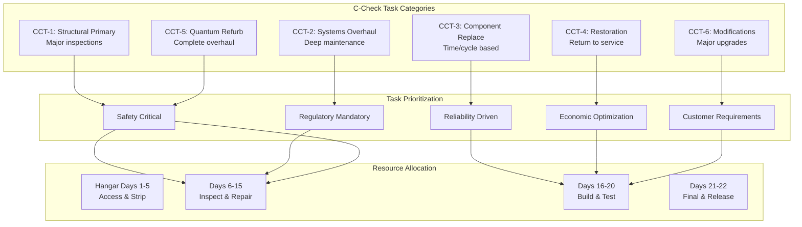

# 05-20-30-01 C-Check Tasks - AMPEL360 BWB-Q100

<p align="center">


</p>

---

## Document Control Information

**Document ID:** `05-20-30-01-CCheckTasks.md`  
**GQOIS ID:** `AS-M-PAX-BW-Q1H-CCH-TSK-MASTER`  
**ATA Chapter:** 05-20-30-01 (Time Limits - Scheduled Maintenance - C-Check - Tasks)  
**Classification:** Heavy Maintenance - C-Check Task Library  
**Version:** 1.0.0  
**Effective Date:** 2025-01-20  
**Revision Status:** Current Release  
**Approval Authority:** GAIA-QAO Chief Engineer & Heavy Maintenance Director  
**Distribution:** Heavy Maintenance Facilities, Engineering, Planning, Training  
**DIKE ID:** DIKE-05-20-30-01-CCHECK-TSK-001

---

## Table of Contents

1. [C-Check Task Overview](#1-c-check-task-overview)
2. [Major Structural Inspection Tasks](#2-major-structural-inspection-tasks)
3. [System Restoration Tasks](#3-system-restoration-tasks)
4. [Powerplant Deep Maintenance](#4-powerplant-deep-maintenance)
5. [Landing Gear Overhaul Tasks](#5-landing-gear-overhaul-tasks)
6. [Avionics and Electrical Major Tasks](#6-avionics-and-electrical-major-tasks)
7. [Interior Refurbishment Tasks](#7-interior-refurbishment-tasks)
8. [Quantum System Refurbishment](#8-quantum-system-refurbishment)
9. [Modification and Upgrade Tasks](#9-modification-and-upgrade-tasks)
10. [Task Integration and Optimization](#10-task-integration-and-optimization)

---

## 1. C-Check Task Overview

### 1.1 C-Check Task Philosophy

The C-Check represents the most comprehensive scheduled maintenance event, requiring:
- Complete access to primary structure
- Major component removal and overhaul
- Deep system restoration
- Life-limited part replacement
- Quantum system refurbishment
- Significant modifications incorporation

### 1.2 Task Classification Framework



### 1.3 Task Numbering System

#### Table 1.3-1: C-Check Task Identification

| Position | Digits | Meaning | Example |
|----------|--------|---------|---------|
| 1-2 | XX | ATA Chapter | 53 (Fuselage) |
| 3-4 | XX | Section | 10 (General) |
| 5-6 | XX | Subject | 00 (All) |
| 7-9 | XXX | Task Type | 600 (Major Inspection) |
| 10-12 | XXX | Check Code | 803 (C-Check) |

Example: 53-10-00-600-803 = Fuselage General Major Inspection C-Check

### 1.4 Task Duration Planning

```python
class CCheckTaskOptimizer:
    def __init__(self):
        self.task_database = CCheckTaskDatabase()
        self.resource_planner = ResourcePlanner()
        self.critical_path = CriticalPathAnalyzer()
        self.quantum_optimizer = QuantumTaskOptimizer()
        
    def optimize_c_check_schedule(self, aircraft_msn):
        # Get all applicable tasks
        all_tasks = self.task_database.get_c_check_tasks(
            aircraft_msn=aircraft_msn,
            include_deferrals=True,
            include_modifications=True,
            include_customer_requests=True
        )
        
        # Apply quantum optimization
        quantum_analysis = self.quantum_optimizer.analyze_tasks(
            tasks=all_tasks,
            historical_data=self.get_historical_performance(),
            resource_constraints=self.get_resource_constraints(),
            target_tat=21  # days
        )
        
        # Build task network
        task_network = self.build_dependency_network(all_tasks)
        
        # Calculate critical path
        critical_path = self.critical_path.calculate(
            network=task_network,
            resource_limits=self.resource_planner.get_limits(),
            shift_pattern='2_shift_6_day'
        )
        
        # Optimize resource allocation
        optimized_schedule = self.resource_planner.optimize(
            tasks=all_tasks,
            critical_path=critical_path,
            constraints={
                'max_concurrent_workers': 111,
                'hangar_days': 21,
                'budget_limit': 2500000,
                'quality_requirements': 'maximum'
            }
        )
        
        return {
            'total_tasks': len(all_tasks),
            'critical_path_days': critical_path.duration_days,
            'total_manhours': sum(t.manhours for t in all_tasks),
            'peak_manpower': optimized_schedule.peak_resources,
            'estimated_cost': optimized_schedule.total_cost,
            'risk_assessment': self.assess_schedule_risk(optimized_schedule),
            'optimization_savings': quantum_analysis.savings_achieved
        }
```

---

## 2. Major Structural Inspection Tasks

### 2.1 Primary Structure Access and Inspection

#### Table 2.1-1: Major Structural Access Requirements

| Task Number | Description | Access Level | Duration | Resources |
|-------------|-------------|--------------|----------|-----------|
| **53-10-00-600-803** | Complete fuselage survey | Full interior strip | 160 MH | 8 persons |
| **53-20-00-610-803** | Pressure vessel inspection | Floor/ceiling removal | 240 MH | 12 persons |
| **53-30-00-620-803** | Frame/stringer detail | Panel removal | 320 MH | 16 persons |
| **53-40-00-630-803** | Door cutout structure | Door removal | 180 MH | 8 persons |
| **53-90-00-640-803** | BWB integration zone | Special access | 400 MH | 20 persons |

#### 2.1.1 BWB Integration Zone Inspection

```python
class BWBIntegrationInspection:
    def __init__(self):
        self.structural_analyzer = StructuralAnalyzer()
        self.quantum_strain_system = QuantumStrainMonitoring()
        self.ndt_suite = AdvancedNDTSuite()
        self.digital_twin = DigitalTwinSystem()
        
    def perform_bwb_integration_inspection(self, aircraft_msn):
        inspection_plan = {
            'zones': self.define_bwb_zones(),
            'total_area': 450,  # square meters
            'critical_points': 156,
            'quantum_sensors': 234,
            'inspection_phases': []
        }
        
        # Phase 1: Quantum data analysis
        quantum_analysis = self.quantum_strain_system.analyze_c_check_data(
            aircraft_msn=aircraft_msn,
            flight_hours_since_last=15000,
            load_cycles=self.get_load_history(aircraft_msn)
        )
        
        high_stress_areas = quantum_analysis.identify_hotspots(
            threshold_percentile=95,
            growth_rate_concern=0.001  # mm/1000FH
        )
        
        # Phase 2: Access and visual inspection
        visual_phase = {
            'duration': 80,  # manhours
            'team_size': 4,
            'findings': []
        }
        
        for zone in inspection_plan['zones']:
            visual_findings = self.perform_visual_inspection(
                zone=zone,
                illumination='LED_1000_lumen',
                magnification='10x',
                reference_photos=self.digital_twin.get_reference_images(zone)
            )
            visual_phase['findings'].extend(visual_findings)
        
        # Phase 3: Advanced NDT
        ndt_phase = {
            'duration': 240,  # manhours
            'methods': ['phased_array_ut', 'computed_radiography', 'thermography'],
            'findings': []
        }
        
        for critical_point in high_stress_areas:
            ndt_result = self.ndt_suite.inspect_critical_area(
                location=critical_point,
                primary_method='phased_array_ut',
                sensitivity='maximum',
                reference_standard=self.get_calibration_standard(critical_point)
            )
            
            if ndt_result.indication_found:
                detailed_assessment = self.assess_indication(
                    indication=ndt_result,
                    stress_history=quantum_analysis.get_stress_history(critical_point),
                    material_properties=self.get_material_data(critical_point),
                    criticality_factor=self.calculate_criticality(critical_point)
                )
                ndt_phase['findings'].append(detailed_assessment)
        
        # Phase 4: Digital twin update
        digital_update = self.digital_twin.update_structural_model(
            visual_findings=visual_phase['findings'],
            ndt_findings=ndt_phase['findings'],
            quantum_data=quantum_analysis,
            as_found_dimensions=self.measure_critical_dimensions()
        )
        
        inspection_plan['inspection_phases'] = [
            quantum_analysis,
            visual_phase,
            ndt_phase,
            digital_update
        ]
        
        return self.generate_inspection_report(inspection_plan)
```

### 2.2 Wing Structure Deep Inspection

#### Table 2.2-1: Wing Structure C-Check Tasks

| Task Number | Description | Special Requirements | Duration | NDT Method |
|-------------|-------------|---------------------|----------|------------|
| **57-10-00-600-803** | Wing box primary structure | Fuel tank entry | 480 MH | UT phased array |
| **57-20-00-610-803** | Spar cap inspection | Borescope access | 160 MH | Eddy current |
| **57-30-00-620-803** | Wing-fuselage attachment | Load transfer check | 240 MH | UT + radiography |
| **57-40-00-630-803** | Control surface attachments | Bearing inspection | 120 MH | Magnetic particle |
| **57-50-00-640-803** | Fuel boundary integrity | Pressure decay test | 200 MH | Leak detection |

### 2.3 Empennage Major Inspection

#### Table 2.3-1: Tail Section C-Check Requirements

| Task Number | Description | Critical Nature | Duration | Team Size |
|-------------|-------------|-----------------|----------|-----------|
| **55-10-00-600-803** | Horizontal stabilizer box | Primary structure | 160 MH | 6 persons |
| **55-20-00-610-803** | Vertical stabilizer attachment | Major load path | 120 MH | 4 persons |
| **55-30-00-620-803** | Elevator/rudder hinges | Flight critical | 80 MH | 4 persons |
| **55-40-00-630-803** | Tail cone structure | Pressure boundary | 60 MH | 3 persons |

---

## 3. System Restoration Tasks

### 3.1 Flight Control System Overhaul

#### Table 3.1-1: Flight Control C-Check Tasks

| Task Number | Description | Component Action | Duration | Test Required |
|-------------|-------------|------------------|----------|---------------|
| **27-10-00-600-803** | Primary actuator overhaul | Remove/bench test | 160 MH | Acceptance test |
| **27-20-00-610-803** | Cable system replacement | Complete renewal | 240 MH | Tension/rigging |
| **27-30-00-620-803** | FBW computer upgrade | Hardware/software | 80 MH | Integration test |
| **27-40-00-630-803** | Feel system overhaul | Rebuild feel units | 120 MH | Force calibration |
| **27-50-00-640-803** | Spoiler system refurb | Actuator overhaul | 140 MH | Sequencing test |

#### 3.1.1 Fly-By-Wire System Major Update

```python
class FBWSystemUpdate:
    def __init__(self):
        self.fbw_system = FlyByWireSystem()
        self.test_system = FBWTestSystem()
        self.quantum_monitor = QuantumControlMonitor()
        self.safety_assessor = SafetyAssessment()
        
    def perform_fbw_major_update(self, aircraft_msn):
        update_process = {
            'aircraft': aircraft_msn,
            'current_version': self.fbw_system.get_current_version(aircraft_msn),
            'target_version': 'v5.0.0',
            'phases': [],
            'validation_results': {}
        }
        
        # Phase 1: System backup and preparation
        backup_phase = self.create_system_backup(
            computers=['FCC1', 'FCC2', 'FCC3'],
            include_calibration=True,
            include_flight_history=True,
            quantum_snapshots=True
        )
        
        # Phase 2: Hardware updates
        hardware_updates = []
        for computer in ['FCC1', 'FCC2', 'FCC3']:
            hw_update = {
                'computer': computer,
                'actions': []
            }
            
            # Processor module upgrade
            if self.requires_processor_upgrade(computer):
                hw_update['actions'].append({
                    'type': 'processor_upgrade',
                    'from': 'PROC-4.0',
                    'to': 'PROC-5.0',
                    'duration': 4.0,  # hours
                    'verification': 'POST + burn-in'
                })
            
            # Memory expansion
            hw_update['actions'].append({
                'type': 'memory_upgrade',
                'from': '32GB',
                'to': '64GB',
                'duration': 2.0,
                'verification': 'Memory test suite'
            })
            
            # Quantum interface module
            hw_update['actions'].append({
                'type': 'quantum_interface',
                'module': 'QIM-2.0',
                'duration': 3.0,
                'calibration': 'Required'
            })
            
            hardware_updates.append(hw_update)
        
        # Phase 3: Software installation
        software_update = self.install_software_update(
            version='v5.0.0',
            features=[
                'Enhanced envelope protection',
                'Quantum predictive control',
                'Advanced gust alleviation',
                'Autonomous emergency response'
            ],
            installation_time=6.0,  # hours
            verification_level='DO-178C_Level_A'
        )
        
        # Phase 4: Integration testing
        integration_tests = self.test_system.comprehensive_test_suite(
            test_categories=[
                'Normal_operation',
                'Failure_modes',
                'Quantum_integration',
                'Performance_limits'
            ],
            test_duration=16.0,  # hours
            acceptance_criteria=self.get_acceptance_criteria()
        )
        
        # Phase 5: Quantum optimization
        quantum_optimization = self.quantum_monitor.optimize_control_laws(
            flight_history=self.get_flight_history(aircraft_msn),
            current_performance=integration_tests.performance_metrics,
            optimization_targets={
                'response_time': '<50ms',
                'prediction_accuracy': '>95%',
                'efficiency_gain': '>15%'
            }
        )
        
        # Phase 6: Safety validation
        safety_validation = self.safety_assessor.validate_update(
            failure_modes=self.analyze_failure_modes(),
            mitigation_strategies=self.get_mitigation_strategies(),
            certification_requirements='EASA_CS-25'
        )
        
        update_process['phases'] = [
            backup_phase,
            hardware_updates,
            software_update,
            integration_tests,
            quantum_optimization,
            safety_validation
        ]
        
        return update_process
```

### 3.2 Environmental Control System Overhaul

#### Table 3.2-1: ECS C-Check Tasks

| Task Number | Description | Work Scope | Duration | Special Tools |
|-------------|-------------|------------|----------|---------------|
| **21-10-00-600-803** | Pack complete overhaul | Remove/shop visit | 320 MH | Pack test stand |
| **21-20-00-610-803** | Heat exchanger service | Clean/pressure test | 160 MH | Ultrasonic clean |
| **21-30-00-620-803** | Duct system inspection | Borescope/repair | 200 MH | Duct crawler |
| **21-40-00-630-803** | Valve actuator rebuild | Overhaul all valves | 180 MH | Valve test box |

### 3.3 Hydraulic System Restoration

#### Table 3.3-1: Hydraulic System C-Check

| Task Number | Description | System | Duration | Fluid Change |
|-------------|-------------|--------|----------|--------------|
| **29-10-00-600-803** | Pump overhaul | All systems | 240 MH | Yes |
| **29-20-00-610-803** | Reservoir deep clean | All systems | 120 MH | Yes |
| **29-30-00-620-803** | Filter housing inspect | All systems | 80 MH | New filters |
| **29-40-00-630-803** | Accumulator overhaul | All systems | 160 MH | Recharge |
| **29-50-00-640-803** | Line/hose replacement | Age-based | 200 MH | As required |

---

## 4. Powerplant Deep Maintenance

### 4.1 Engine Major Inspection

#### Table 4.1-1: Engine C-Check Requirements

| Task Number | Description | Scope | Duration | Borescope |
|-------------|-------------|-------|----------|-----------|
| **71-00-00-600-803** | Engine comprehensive inspection | All modules | 320 MH | 100% stages |
| **72-00-00-610-803** | Hot section detailed | HPT/LPT | 240 MH | Video record |
| **72-30-00-620-803** | Fan blade detailed | Each blade | 180 MH | Eddy current |
| **75-00-00-630-803** | Accessory gearbox | Overhaul | 160 MH | Bench test |
| **78-00-00-640-803** | Exhaust system | Complete inspect | 120 MH | Thermal image |

#### 4.1.1 Quantum-Enhanced Engine Assessment

```python
class EngineHealthAssessment:
    def __init__(self):
        self.vibration_history = VibrationDatabase()
        self.performance_tracker = PerformanceTracker()
        self.oil_analysis = OilAnalysisSystem()
        self.quantum_predictor = QuantumEnginePredictor()
        
    def perform_c_check_assessment(self, engine_sn):
        assessment = {
            'engine_sn': engine_sn,
            'operating_hours': self.get_engine_hours(engine_sn),
            'cycles': self.get_engine_cycles(engine_sn),
            'health_assessment': {},
            'maintenance_requirements': []
        }
        
        # Historical data analysis
        vibration_trends = self.vibration_history.analyze_trends(
            engine_sn=engine_sn,
            parameters=['N1', 'N2', 'broadband'],
            time_window=5000  # hours
        )
        
        performance_degradation = self.performance_tracker.calculate_degradation(
            engine_sn=engine_sn,
            metrics=['EGT_margin', 'fuel_flow', 'thrust_specific_fuel_consumption'],
            baseline='new_engine'
        )
        
        oil_analysis_results = self.oil_analysis.get_trend_analysis(
            engine_sn=engine_sn,
            elements=['Fe', 'Cu', 'Ag', 'Cr', 'Al'],
            particle_counts=True,
            filter_debris=True
        )
        
        # Quantum prediction integration
        quantum_assessment = self.quantum_predictor.predict_component_condition(
            vibration_data=vibration_trends,
            performance_data=performance_degradation,
            oil_data=oil_analysis_results,
            operating_profile=self.get_operating_profile(engine_sn)
        )
        
        # Component-specific assessments
        component_assessments = {}
        
        # Fan section
        component_assessments['fan'] = {
            'blade_condition': quantum_assessment.fan_blade_predictions,
            'bearing_health': vibration_trends.fan_bearing_signature,
            'recommended_action': self.determine_fan_maintenance(
                quantum_assessment.fan_blade_predictions
            )
        }
        
        # Compressor section
        component_assessments['compressor'] = {
            'blade_erosion': performance_degradation.compressor_efficiency,
            'clearances': quantum_assessment.clearance_predictions,
            'fouling_level': self.calculate_fouling_index(performance_degradation),
            'recommended_action': 'Compressor wash + blend repair'
        }
        
        # Hot section
        component_assessments['hot_section'] = {
            'remaining_life': quantum_assessment.hot_section_life,
            'coating_condition': quantum_assessment.coating_degradation,
            'cooling_effectiveness': performance_degradation.cooling_efficiency,
            'recommended_action': self.determine_hot_section_work(
                quantum_assessment.hot_section_life
            )
        }
        
        assessment['health_assessment'] = component_assessments
        assessment['overall_health_score'] = self.calculate_overall_health(
            component_assessments
        )
        
        # Generate maintenance plan
        assessment['maintenance_requirements'] = self.generate_maintenance_plan(
            component_assessments,
            quantum_assessment,
            cost_optimization=True
        )
        
        return assessment
```

### 4.2 Thrust Reverser Overhaul

#### Table 4.2-1: Thrust Reverser C-Check Tasks

| Task Number | Description | Action | Duration | Testing |
|-------------|-------------|--------|----------|---------|
| **78-30-00-600-803** | Reverser mechanism | Complete overhaul | 160 MH | Deploy test |
| **78-31-00-610-803** | Actuator rebuild | Shop overhaul | 120 MH | Bench test |
| **78-32-00-620-803** | Door seal replacement | New seals | 80 MH | Leak test |
| **78-35-00-630-803** | Control system cal | Full calibration | 60 MH | Response time |

### 4.3 APU Major Maintenance

#### Table 4.3-1: APU C-Check Requirements

| Task Number | Description | Interval Override | Duration |
|-------------|-------------|-------------------|----------|
| **49-00-00-600-803** | APU hot section inspection | None | 120 MH |
| **49-20-00-610-803** | Generator overhaul | 8000 hrs | 80 MH |
| **49-50-00-620-803** | Gearbox inspection | None | 60 MH |
| **49-60-00-630-803** | Control unit update | Software | 40 MH |

---

## 5. Landing Gear Overhaul Tasks

### 5.1 Complete Landing Gear Overhaul

#### Table 5.1-1: Landing Gear C-Check Overhaul

| Task Number | Description | Component | Duration | Shop Time |
|-------------|-------------|-----------|----------|-----------|
| **32-10-00-600-803** | MLG complete overhaul | Both MLG | 640 MH | 10 days |
| **32-20-00-610-803** | NLG complete overhaul | Nose gear | 320 MH | 7 days |
| **32-30-00-620-803** | Wheel/brake overhaul | All units | 480 MH | In-house |
| **32-40-00-630-803** | Steering system rebuild | NLG | 160 MH | 5 days |
| **32-50-00-640-803** | Retraction actuator OH | All | 240 MH | 7 days |

#### 5.1.1 Landing Gear Overhaul Process

```python
class LandingGearOverhaul:
    def __init__(self):
        self.gear_database = LandingGearDatabase()
        self.overhaul_facility = OverhaulFacility()
        self.quantum_monitor = QuantumGearMonitor()
        self.certification = CertificationSystem()
        
    def execute_mlg_overhaul(self, gear_sn):
        overhaul_record = {
            'gear_sn': gear_sn,
            'start_date': datetime.now(),
            'incoming_inspection': {},
            'overhaul_actions': [],
            'final_testing': {},
            'certification': {}
        }
        
        # Incoming inspection
        incoming = self.perform_incoming_inspection(
            gear_sn=gear_sn,
            includes=[
                'dimensional_check',
                'ndt_inspection',
                'chrome_thickness',
                'bearing_play',
                'actuator_internal'
            ]
        )
        
        overhaul_record['incoming_inspection'] = {
            'total_cycles': incoming.cycles,
            'total_hours': incoming.hours,
            'findings': incoming.discrepancies,
            'quantum_wear_analysis': self.quantum_monitor.analyze_wear_pattern(
                gear_sn, 
                incoming.measurements
            )
        }
        
        # Disassembly and cleaning
        disassembly = self.overhaul_facility.disassemble_gear(
            gear_sn=gear_sn,
            level='complete',
            documentation='video_photo',
            part_tracking='rfid'
        )
        
        # Component overhaul actions
        components_overhauled = []
        
        # Shock strut overhaul
        shock_strut = self.overhaul_shock_strut(
            strut_sn=disassembly.strut_sn,
            actions=[
                'chrome_strip_rechrome',
                'seal_replacement',
                'bearing_replacement',
                'dimensional_restoration'
            ],
            quantum_specs=self.quantum_monitor.get_optimal_specs(gear_sn)
        )
        components_overhauled.append(shock_strut)
        
        # Actuator overhaul
        actuators = []
        for actuator in disassembly.actuators:
            actuator_oh = self.overhaul_actuator(
                actuator_sn=actuator.sn,
                actions=[
                    'complete_reseal',
                    'rod_rechrome',
                    'valve_replacement',
                    'proof_pressure_test'
                ]
            )
            actuators.append(actuator_oh)
        components_overhauled.extend(actuators)
        
        # Structural components
        structural = self.inspect_structural_components(
            components=disassembly.structural_parts,
            ndt_methods=['magnetic_particle', 'fluorescent_penetrant'],
            repair_limits=self.get_repair_limits(),
            quantum_fatigue_analysis=True
        )
        
        # Reassembly
        reassembly = self.overhaul_facility.reassemble_gear(
            gear_sn=gear_sn,
            components=components_overhauled,
            torque_specs='latest_revision',
            quality_checks='stage_inspection'
        )
        
        # Final testing
        final_tests = self.perform_final_testing(
            gear_sn=gear_sn,
            test_sequence=[
                'proof_pressure_test',
                'functional_test',
                'retraction_test',
                'endurance_test',
                'quantum_signature_baseline'
            ],
            acceptance_criteria=self.get_acceptance_criteria()
        )
        
        overhaul_record['final_testing'] = final_tests
        
        # Certification
        overhaul_record['certification'] = self.certification.certify_overhaul(
            gear_sn=gear_sn,
            overhaul_data=overhaul_record,
            regulatory_requirements='EASA_Part_145',
            quantum_baseline=self.quantum_monitor.establish_baseline(gear_sn)
        )
        
        return overhaul_record
```

### 5.2 Brake System Overhaul

#### Table 5.2-1: Brake System C-Check Tasks

| Task Number | Description | Units | Duration | New Parts |
|-------------|-------------|-------|----------|-----------|
| **32-41-00-600-803** | Brake unit overhaul | All | 240 MH | Wear pins |
| **32-42-00-610-803** | Carbon disk inspection | All | 160 MH | As required |
| **32-43-00-620-803** | Anti-skid valve OH | All | 120 MH | Seals/filters |
| **32-44-00-630-803** | BSCU software update | System | 80 MH | Latest version |

---

## 6. Avionics and Electrical Major Tasks

### 6.1 Integrated Modular Avionics Upgrade

#### Table 6.1-1: IMA C-Check Tasks

| Task Number | Description | Scope | Duration | Downtime |
|-------------|-------------|-------|----------|----------|
| **42-10-00-600-803** | Core module upgrade | Hardware | 160 MH | 24 hours |
| **42-20-00-610-803** | Network infrastructure | Wiring/switches | 240 MH | 48 hours |
| **42-30-00-620-803** | Display unit refurb | All displays | 200 MH | Parallel |
| **42-40-00-630-803** | Software major update | Complete | 120 MH | 16 hours |
| **42-50-00-640-803** | Cybersecurity hardening | All systems | 80 MH | 8 hours |

### 6.2 Electrical Power System Overhaul

#### Table 6.2-1: Electrical System C-Check

| Task Number | Description | Components | Duration | Testing |
|-------------|-------------|------------|----------|---------|
| **24-10-00-600-803** | Generator overhaul | All units | 320 MH | Load bank |
| **24-20-00-610-803** | Wire bundle inspection | 100% accessible | 480 MH | Megger test |
| **24-30-00-620-803** | Power center rebuild | All buses | 240 MH | Hi-pot test |
| **24-40-00-630-803** | Battery system upgrade | New technology | 160 MH | Capacity test |

### 6.3 Communication/Navigation Upgrade

#### Table 6.3-1: Comm/Nav C-Check Tasks

| Task Number | Description | System | Duration | Certification |
|-------------|-------------|--------|----------|---------------|
| **23-10-00-600-803** | SATCOM major update | Hardware/software | 120 MH | FANS-C/D |
| **34-10-00-610-803** | ILS CAT IIIB upgrade | Autoland enhance | 160 MH | Flight test |
| **34-20-00-620-803** | GPS/GNSS upgrade | Multi-constellation | 80 MH | SBAS/GBAS |
| **34-50-00-630-803** | Weather radar upgrade | Predictive WX | 100 MH | Calibration |

---

## 7. Interior Refurbishment Tasks

### 7.1 Passenger Cabin Refurbishment

#### Table 7.1-1: Cabin Interior C-Check Tasks

| Task Number | Description | Scope | Duration | Coordination |
|-------------|-------------|-------|----------|--------------|
| **25-10-00-600-803** | Seat removal/refurb | All seats | 480 MH | Shop support |
| **25-20-00-610-803** | Carpet/soft furnishing | Complete replace | 320 MH | Material lead |
| **25-30-00-620-803** | PSU overhaul | All units | 240 MH | Parallel work |
| **25-40-00-630-803** | Sidewall/ceiling | Deep clean/repair | 360 MH | Multiple teams |
| **25-60-00-640-803** | Emergency equipment | Overhaul/replace | 160 MH | Certification |

### 7.2 Galley/Lavatory Deep Maintenance

#### Table 7.2-1: Galley/Lav C-Check Requirements

| Task Number | Description | Units | Duration | Compliance |
|-------------|-------------|-------|----------|------------|
| **25-50-01-600-803** | Galley deep maintenance | All | 240 MH | Health regs |
| **25-50-02-610-803** | Lavatory refurbishment | All | 200 MH | Accessibility |
| **38-10-00-620-803** | Water system sanitize | Complete | 80 MH | Potable cert |
| **38-20-00-630-803** | Waste system overhaul | All tanks | 120 MH | Environmental |

---

## 8. Quantum System Refurbishment

### 8.1 Quantum Processing Unit Complete Service

#### Table 8.1-1: QPU C-Check Refurbishment

| Task Number | Description | Scope | Duration | Clean Room |
|-------------|-------------|-------|----------|------------|
| **99-10-01-600-803** | QPU complete refurb | All modules | 320 MH | Class 100 |
| **99-10-02-610-803** | Cryogenic system OH | Complete | 240 MH | Specialized |
| **99-10-03-620-803** | Control electronics | Upgrade/replace | 160 MH | ESD required |
| **99-10-04-630-803** | Quantum memory | Refresh/expand | 120 MH | Ultra-clean |
| **99-10-05-640-803** | Algorithm optimization | Major update | 180 MH | Remote capable |

#### 8.1.1 QPU Refurbishment Process

```python
class QPURefurbishment:
    def __init__(self):
        self.qpu_facility = QuantumRefurbishmentFacility()
        self.cryo_specialist = CryogenicSpecialist()
        self.quantum_engineer = QuantumEngineer()
        self.performance_validator = PerformanceValidator()
        
    def execute_qpu_refurbishment(self, qpu_id):
        refurb_plan = {
            'qpu_id': qpu_id,
            'initial_state': self.assess_initial_state(qpu_id),
            'refurb_phases': [],
            'final_performance': {},
            'total_duration': 0
        }
        
        # Phase 1: Complete system removal
        removal_phase = {
            'phase': 'removal',
            'duration': 24,  # hours
            'actions': []
        }
        
        # Warm up from operating temperature
        warmup = self.cryo_specialist.controlled_warmup(
            from_temp=0.015,  # Kelvin
            to_temp=300,  # Kelvin
            rate=10,  # K/hour
            monitor_stress=True
        )
        removal_phase['actions'].append(warmup)
        
        # Disconnect and remove
        removal = self.qpu_facility.remove_qpu(
            qpu_id=qpu_id,
            maintain_vacuum=True,
            protect_connections=True
        )
        removal_phase['actions'].append(removal)
        
        # Phase 2: Component refurbishment
        component_phase = {
            'phase': 'component_refurb',
            'duration': 240,  # hours
            'components': []
        }
        
        # Qubit chip service
        qubit_service = self.quantum_engineer.service_qubit_chip(
            chip_id=removal.qubit_chip_id,
            actions=[
                'surface_cleaning',
                'junction_analysis',
                'frequency_mapping',
                'coherence_optimization'
            ],
            target_specs={
                'T1': '>200 μs',
                'T2': '>150 μs',
                'frequency_spread': '<30 MHz'
            }
        )
        component_phase['components'].append(qubit_service)
        
        # Cryogenic system overhaul
        cryo_overhaul = self.cryo_specialist.overhaul_cryogenics(
            system_id=removal.cryo_system_id,
            services=[
                'cold_head_rebuild',
                'filter_replacement',
                'vacuum_restoration',
                'thermal_link_optimization'
            ],
            performance_targets={
                'base_temp': '<10 mK',
                'stability': '±0.1 mK',
                'cooldown_time': '<24 hours'
            }
        )
        component_phase['components'].append(cryo_overhaul)
        
        # Control electronics upgrade
        electronics_upgrade = self.quantum_engineer.upgrade_electronics(
            current_version='4.0',
            target_version='5.0',
            improvements=[
                'lower_noise_amplifiers',
                'faster_arbitrary_waveform_generators',
                'improved_readout_chain',
                'enhanced_error_correction'
            ]
        )
        component_phase['components'].append(electronics_upgrade)
        
        # Phase 3: Reassembly and calibration
        assembly_phase = {
            'phase': 'reassembly',
            'duration': 120,  # hours
            'steps': []
        }
        
        # Clean room assembly
        assembly = self.qpu_facility.reassemble_qpu(
            qpu_id=qpu_id,
            components=component_phase['components'],
            clean_room_class=100,
            documentation='complete'
        )
        
        # Cooldown and stabilization
        cooldown = self.cryo_specialist.controlled_cooldown(
            target_temp=0.015,  # Kelvin
            duration=24,  # hours
            monitor_uniformity=True
        )
        
        # Complete calibration
        calibration = self.quantum_engineer.full_calibration(
            qpu_id=qpu_id,
            calibration_depth='complete',
            optimization_targets={
                'gate_fidelity': '>99.95%',
                'readout_fidelity': '>99.5%',
                'crosstalk': '<-45 dB'
            }
        )
        
        assembly_phase['steps'] = [assembly, cooldown, calibration]
        
        # Phase 4: Performance validation
        validation_phase = {
            'phase': 'validation',
            'duration': 48,  # hours
            'tests': []
        }
        
        # Run comprehensive benchmarks
        benchmarks = self.performance_validator.run_benchmarks(
            qpu_id=qpu_id,
            test_suite=[
                'quantum_volume',
                'randomized_benchmarking',
                'quantum_supremacy_circuits',
                'application_benchmarks'
            ]
        )
        
        validation_phase['tests'] = benchmarks
        
        refurb_plan['refurb_phases'] = [
            removal_phase,
            component_phase,
            assembly_phase,
            validation_phase
        ]
        
        refurb_plan['total_duration'] = sum(
            phase['duration'] for phase in refurb_plan['refurb_phases']
        )
        
        return refurb_plan
```

### 8.2 Quantum Sensor Network Overhaul

#### Table 8.2-1: Sensor Network C-Check Tasks

| Task Number | Description | Quantity | Duration | Replacement % |
|-------------|-------------|----------|----------|---------------|
| **99-20-01-600-803** | Structural sensors | 2,456 | 480 MH | 15% |
| **99-20-02-610-803** | Environmental sensors | 543 | 120 MH | 20% |
| **99-20-03-620-803** | Vibration sensors | 867 | 200 MH | 10% |
| **99-20-04-630-803** | Thermal sensors | 1,234 | 240 MH | 25% |
| **99-20-05-640-803** | Network infrastructure | Fiber/routers | 160 MH | As required |

### 8.3 Quantum Communication System

#### Table 8.3-1: QKD System C-Check

| Task Number | Description | Components | Duration | Security |
|-------------|-------------|------------|----------|----------|
| **99-30-01-600-803** | QKD complete overhaul | All modules | 240 MH | Quantum-safe |
| **99-30-02-610-803** | Photon source replace | Entangled pairs | 120 MH | Calibrated |
| **99-30-03-620-803** | Detector array refurb | Single photon | 160 MH | Efficiency >95% |
| **99-30-04-630-803** | Quantum repeater | Network nodes | 200 MH | Range >1000km |

---

## 9. Modification and Upgrade Tasks

### 9.1 Major Modifications

#### Table 9.1-1: C-Check Modification Opportunities

| Task Number | Description | Benefit | Duration | ROI Period |
|-------------|-------------|---------|----------|------------|
| **MOD-001-600-803** | Winglet upgrade | 4% fuel savings | 480 MH | 2.5 years |
| **MOD-002-610-803** | Avionics modernization | Capability/safety | 640 MH | Immediate |
| **MOD-003-620-803** | Cabin densification | +12 seats | 800 MH | 1.5 years |
| **MOD-004-630-803** | Quantum nav system | GPS independence | 320 MH | 3 years |
| **MOD-005-640-803** | Cargo conversion | Flexibility | 2400 MH | 2 years |

### 9.2 Service Bulletin Incorporation

#### Table 9.2-1: Mandatory Service Bulletins

| SB Number | Title | Compliance | Duration | Critical |
|-----------|-------|------------|----------|----------|
| **SB-53-045** | Fuselage reinforcement | Before 20,000 FC | 160 MH | Yes |
| **SB-71-023** | Engine mount upgrade | Next C-Check | 120 MH | Yes |
| **SB-32-067** | Landing gear actuator | Within 2 years | 80 MH | No |
| **SB-99-012** | Quantum cooling upgrade | Immediate | 200 MH | Yes |

---

## 10. Task Integration and Optimization

### 10.1 Critical Path Optimization

```python
class CCheckCriticalPath:
    def __init__(self):
        self.task_network = TaskNetworkBuilder()
        self.resource_optimizer = ResourceOptimizer()
        self.quantum_scheduler = QuantumSchedulingEngine()
        
    def optimize_c_check_execution(self, task_list):
        # Build task dependency network
        network = self.task_network.build_network(
            tasks=task_list,
            constraints=self.get_constraints(),
            resources=self.get_resource_availability()
        )
        
        # Identify critical path
        critical_path = self.calculate_critical_path(network)
        
        # Quantum optimization
        quantum_schedule = self.quantum_scheduler.optimize_schedule(
            network=network,
            objectives={
                'minimize_tat': 0.4,
                'minimize_cost': 0.3,
                'maximize_quality': 0.3
            },
            constraints={
                'max_duration': 22,  # days
                'max_concurrent_workers': 111,
                'hangar_availability': 'confirmed',
                'shift_pattern': '2_shift_6_day'
            }
        )
        
        # Resource leveling
        leveled_schedule = self.resource_optimizer.level_resources(
            schedule=quantum_schedule,
            priority_rules=[
                'critical_path_first',
                'safety_critical_priority',
                'skill_availability',
                'tool_availability'
            ]
        )
        
        return {
            'optimized_schedule': leveled_schedule,
            'critical_path_duration': critical_path.duration,
            'resource_utilization': leveled_schedule.resource_efficiency,
            'cost_estimate': leveled_schedule.total_cost,
            'risk_mitigation': self.identify_schedule_risks(leveled_schedule)
        }
```

### 10.2 Performance Metrics

#### Table 10.2-1: C-Check Task Performance KPIs

| Metric | Target | Current | Industry Best | Action |
|--------|--------|---------|---------------|--------|
| **Task Completion Rate** | 98% | 96.5% | 97% | Process review |
| **First-Time Quality** | 95% | 93.8% | 94% | Training focus |
| **Schedule Adherence** | 95% | 92.1% | 93% | Better planning |
| **Finding Prediction** | 80% | 77.3% | N/A | Quantum improve |
| **Cost per Task** | -5% YoY | -3.2% | -4% | Efficiency drive |

### 10.3 Continuous Improvement

#### 10.3.1 Improvement Initiatives

1. **Digital Twin Integration**
   - Pre/post 3D scanning
   - Predictive modeling validation
   - Virtual inspection capability
   - Historical comparison

2. **Robotic Assistance**
   - Automated inspections
   - Repetitive task automation
   - Hazardous area access
   - Quality consistency

3. **AI-Powered Planning**
   - Dynamic task scheduling
   - Resource optimization
   - Risk prediction
   - Cost minimization

---

## Appendices

### Appendix A: C-Check Task Codes

```
C-Check Specific Task Codes:
-600-: Major structural inspection
-610-: System overhaul/restoration  
-620-: Component replacement (time-based)
-630-: Deep cleaning/refurbishment
-640-: Major modification/upgrade
-650-: Quantum system refurbishment
-660-: Interior reconfiguration
-670-: Paint and appearance
-680-: Special campaign tasks
-690-: Customer-requested items
```

### Appendix B: Resource Loading Profile

```
Typical C-Check Resource Loading:
Week 1: 40 persons (access/removal)
Week 2: 85 persons (peak inspection)
Week 3: 111 persons (peak work)
Week 4: 60 persons (reassembly/test)

Shift Distribution:
Day Shift: 60% of workforce
Evening Shift: 30% of workforce
Night Shift: 10% (critical path only)
```

### Appendix C: Critical Success Factors

1. **Pre-Check Planning** - 35% impact
2. **Parts Availability** - 25% impact
3. **Skilled Resources** - 20% impact
4. **Finding Management** - 15% impact
5. **Test Equipment** - 5% impact

---

## Document Control and Revision History

### Approval Signatures

| Role | Name | Signature | Date |
|------|------|-----------|------|
| **Chief Engineer** | [Name] | [Digital Signature] | 2025-01-20 |
| **Heavy Maintenance Director** | [Name] | [Digital Signature] | 2025-01-20 |
| **Quality Manager** | [Name] | [Digital Signature] | 2025-01-20 |
| **Quantum Systems Lead** | [Name] | [Digital Signature] | 2025-01-20 |

### Revision History

| Version | Date | Author | Description |
|---------|------|--------|-------------|
| 1.0.0 | 2025-01-20 | GAIA-QAO Tech Team | Initial C-Check task library |

### Distribution List

- Heavy Maintenance Facilities (All)
- Engineering Task Group
- Planning Department
- Training Department
- Quality Assurance
- Supply Chain Management
- Quantum Systems Division

---

**End of Document**

*This document contains proprietary information of GAIA-QAO and is protected by applicable copyright laws. Unauthorized reproduction or distribution is prohibited.*
