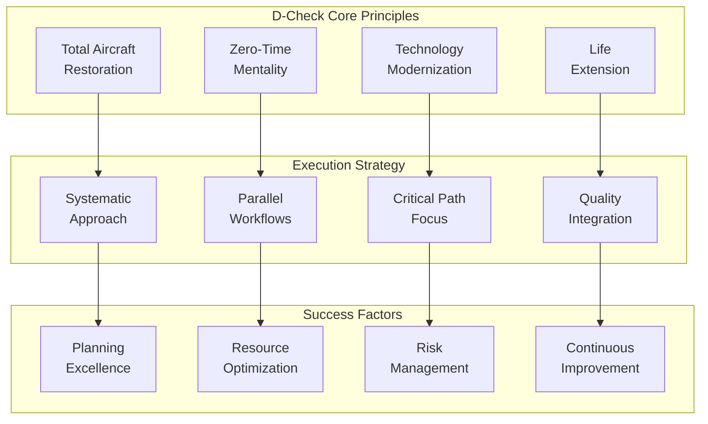

# 05-20-40-01-01 D-Check Manual - AMPEL360 BWB-Q100
## Heavy Maintenance Execution Guide

<p align="center">


</p>

---

## Document Control Information

**Document ID:** `05-20-40-01-01-DCheckManual.md`  
**Manual Type:** D-Check Heavy Maintenance Execution Guide  
**Aircraft Type:** AMPEL360 BWB-Q100  
**ATA Chapter:** 05-20-40 (Time Limits - D-Check)  
**Version:** 1.0.0  
**Effective Date:** 2025-01-20  
**Review Cycle:** Annual or as required  
**Distribution:** D-Check Facilities, Program Management, Quality Assurance  
**Classification:** Proprietary - GAIA-QAO  
**DIKE ID:** DIKE-05-20-40-01-01-DCHECK-MAN-001

---

## Table of Contents

1. [Introduction and Overview](#1-introduction-and-overview)
2. [Pre-Check Phase (T-60 to T-0)](#2-pre-check-phase-t-60-to-t-0)
3. [Aircraft Receipt and Opening (Days 1-5)](#3-aircraft-receipt-and-opening-days-1-5)
4. [Disassembly Phase (Days 6-10)](#4-disassembly-phase-days-6-10)
5. [Inspection Phase (Days 11-20)](#5-inspection-phase-days-11-20)
6. [Repair and Modification Phase (Days 21-35)](#6-repair-and-modification-phase-days-21-35)
7. [Assembly Phase (Days 36-45)](#7-assembly-phase-days-36-45)
8. [Testing and Validation Phase (Days 46-50)](#8-testing-and-validation-phase-days-46-50)
9. [Close-Out and Delivery (Days 51-55)](#9-close-out-and-delivery-days-51-55)
10. [Quality Assurance and Documentation](#10-quality-assurance-and-documentation)

---

## 1. Introduction and Overview

### 1.1 Purpose

This manual provides comprehensive guidance for executing D-Check heavy maintenance on the AMPEL360 BWB-Q100 aircraft. It serves as the primary reference for planning, executing, and documenting all aspects of the D-Check process.

### 1.2 Scope

This manual covers:
- Complete D-Check execution procedures
- Phase-by-phase workflow management
- Resource allocation and optimization
- Quality assurance requirements
- Documentation standards
- Safety protocols
- Quantum system special procedures

### 1.3 D-Check Philosophy



### 1.4 Manual Usage

#### 1.4.1 Navigation
- Each phase includes detailed procedures
- Critical tasks are highlighted with ⚠️
- Quantum-specific procedures marked with ⚛️
- Safety requirements marked with 🛡️
- Quality gates marked with ✓

#### 1.4.2 Document Integration
This manual references:
- Task cards (05-20-40-01-XX-XXX)
- Work instructions (WI-XXXX)
- Engineering orders (EO-XXXX)
- Quality procedures (QP-XXXX)

---

## 2. Pre-Check Phase (T-60 to T-0)

### 2.1 T-60 Days: Initial Planning

#### 2.1.1 Work Scope Finalization
```python
class DCheckWorkScope:
    def __init__(self):
        self.scope_manager = ScopeManager()
        self.task_generator = TaskGenerator()
        self.resource_planner = ResourcePlanner()
        
    def finalize_work_scope(self, aircraft_msn, input_date):
        work_scope = {
            'base_requirements': self.generate_base_tasks(aircraft_msn),
            'additional_findings': self.estimate_findings_allowance(),
            'modifications': self.identify_modifications(),
            'customer_requests': self.gather_customer_requests(),
            'total_scope': {}
        }
        
        # Generate comprehensive task list
        all_tasks = self.compile_all_tasks(work_scope)
        
        # Validate resource availability
        resource_validation = self.resource_planner.validate_resources(
            tasks=all_tasks,
            start_date=input_date,
            duration_estimate=55  # days
        )
        
        # Critical path analysis
        critical_path = self.analyze_critical_path(all_tasks)
        
        work_scope['total_scope'] = {
            'task_count': len(all_tasks),
            'manhour_estimate': sum(task.manhours for task in all_tasks),
            'critical_path_days': critical_path.duration,
            'resource_peaks': resource_validation.peak_requirements,
            'material_requirements': self.calculate_materials(all_tasks)
        }
        
        return work_scope
```

#### 2.1.2 Long-Lead Material Status

| Material Category | Required Date | Status Check | Action Required |
|-------------------|---------------|--------------|-----------------|
| **Structural Materials** | T-30 | Verify delivery | Expedite if needed |
| **Quantum Components** | T-45 | In transit | Track daily |
| **Interior Materials** | T-20 | On order | Confirm specs |
| **Rotable Pool** | T-10 | Reserved | Final check |

### 2.2 T-30 Days: Facility Preparation

#### 2.2.1 Hangar Configuration
- **Zone Allocation**
  ```
  Zone A: Fuselage/structural work
  Zone B: Component storage/staging
  Zone C: Shops and support areas
  Zone D: Clean rooms (avionics/quantum)
  Zone E: Testing areas
  ```

#### 2.2.2 Equipment Readiness
- [ ] Docking system installation and testing
- [ ] Crane load testing and certification
- [ ] GSE positioning and verification
- [ ] Tool calibration status check
- [ ] NDT equipment certification

### 2.3 T-14 Days: Team Preparation

#### 2.3.1 Resource Allocation

| Team | Core Staff | Peak Staff | Training Status |
|------|------------|------------|-----------------|
| **Structures** | 20 | 40 | D-Check certified |
| **Systems** | 15 | 30 | Type trained |
| **Avionics** | 10 | 20 | Quantum qualified |
| **Powerplant** | 8 | 12 | Engine certified |
| **Interior** | 12 | 35 | Current |
| **Quality** | 10 | 18 | RII authorized |

#### 2.3.2 Training Requirements
```
Critical Training Completion:
□ D-Check procedures refresher - All teams
□ Quantum system safety - Required personnel
□ New modification procedures - Affected teams
□ Quality gate requirements - QA team
□ Safety protocols - All personnel
```

### 2.4 T-7 Days: Final Preparations

#### 2.4.1 Pre-Input Meeting Agenda
1. **Work Scope Review** (2 hours)
   - Final task list confirmation
   - Critical path review
   - Resource allocation confirmation

2. **Safety Briefing** (1 hour)
   - Hazard identification
   - Emergency procedures
   - PPE requirements

3. **Quality Requirements** (1 hour)
   - Gate schedule
   - Documentation standards
   - Customer touchpoints

4. **Logistics Review** (1 hour)
   - Material availability
   - Tool allocation
   - Shift patterns

### 2.5 T-1 Day: Aircraft Pre-Input

#### 2.5.1 Pre-Input Inspection

🛡️ **Safety Requirements**
- Aircraft grounded and secured
- All systems powered down
- Fuel quantity minimized
- Quantum systems in maintenance mode

**Inspection Checklist:**
- [ ] Complete walk-around
- [ ] Document existing damage
- [ ] Verify configuration
- [ ] Review aircraft logs
- [ ] Quantum system status download

---

## 3. Aircraft Receipt and Opening (Days 1-5)

### 3.1 Day 1: Aircraft Positioning

#### 3.1.1 Morning Shift (0600-1400)

**0600-0800: Aircraft Receipt**
```
Actions:
1. Customer handover documentation
2. Aircraft positioning in hangar
3. Grounding and safety barriers
4. Initial photography (all angles)
5. Quantum system shutdown verification
```

**0800-1200: Power Down Procedures**
- Electrical system isolation
- Hydraulic depressurization
- Fuel system isolation
- Pneumatic system venting
- ⚛️ Quantum system safe mode

**1200-1400: Access Preparation**
- Docking positioning
- Access platform installation
- Safety net installation
- Tool and equipment staging

#### 3.1.2 Evening Shift (1400-2200)

**1400-1800: Interior Access**
- Cabin door opening procedures
- Cargo compartment access
- Avionics bay access
- ⚛️ Quantum clean room setup

**1800-2200: Documentation**
- Digital work card activation
- Team assignments confirmation
- First shift handover preparation

### 3.2 Days 2-3: Interior Removal

#### 3.2.1 Systematic Removal Process

```python
class InteriorRemovalProcess:
    def __init__(self):
        self.removal_sequencer = RemovalSequencer()
        self.asset_tracker = AssetTracker()
        self.damage_mapper = DamageMapper()
        
    def execute_interior_removal(self, zones):
        removal_tracking = {
            'components_removed': [],
            'damage_found': [],
            'storage_locations': {},
            'refurb_requirements': []
        }
        
        for zone in zones:
            # Define removal sequence
            sequence = self.removal_sequencer.get_sequence(zone)
            
            for item in sequence:
                # Pre-removal documentation
                pre_condition = self.document_condition(item)
                
                # Execute removal
                removal_data = {
                    'item': item,
                    'removal_time': datetime.now(),
                    'technician': self.get_assigned_tech(item),
                    'findings': []
                }
                
                # Damage assessment
                if pre_condition.damage_noted:
                    damage_record = self.damage_mapper.record_damage(
                        item=item,
                        damage=pre_condition.damage_details,
                        photos=pre_condition.photos,
                        disposition='Evaluate for repair/replace'
                    )
                    removal_data['findings'].append(damage_record)
                
                # Asset tracking
                storage_location = self.asset_tracker.assign_storage(
                    item=item,
                    condition=pre_condition,
                    refurb_required=self.needs_refurbishment(item)
                )
                
                removal_tracking['components_removed'].append(removal_data)
                removal_tracking['storage_locations'][item.id] = storage_location
                
        return removal_tracking
```

#### 3.2.2 Removal Priority Matrix

| Priority | Components | Reason | Duration |
|----------|------------|--------|----------|
| **1** | Seats | Access to structure | 16 MH/row |
| **2** | Overhead bins | Ceiling access | 8 MH/bin |
| **3** | Galleys/Lavs | Major items | 24 MH each |
| **4** | Sidewalls | Structure access | 4 MH/panel |
| **5** | Floor panels | System access | 2 MH/panel |

### 3.3 Days 4-5: System Preparation

#### 3.3.1 System Isolation Procedures

✓ **Quality Gate 1: System Isolation Verification**

| System | Isolation Method | Verification | Sign-off |
|--------|------------------|--------------|----------|
| **Electrical** | Breakers pulled/tagged | Multimeter check | QA |
| **Hydraulic** | Pumps disabled, pressure relieved | Gauge reading | QA |
| **Fuel** | Valves closed/blanked | No flow test | QA |
| **Pneumatic** | Isolated and vented | Pressure check | QA |
| **⚛️ Quantum** | Safe mode verified | Diagnostic check | Specialist |

#### 3.3.2 Component Removal Preparation

**Major Components Schedule:**
- Landing gear jacking and securing
- Engine fan blade locks installation  
- Flight control gust locks
- Door removal preparation
- ⚛️ Quantum system cooling maintenance

---

## 4. Disassembly Phase (Days 6-10)

### 4.1 Day 6-7: Major Component Removal

#### 4.1.1 Landing Gear Removal

⚠️ **Critical Task: Landing Gear Removal**

```
Procedure:
1. Aircraft on jacks - verify level (±0.5°)
2. Landing gear pins removed
3. Hydraulic power for retraction
4. Gear retraction to 45° position
5. Support installation
6. Disconnect sequence:
   - Hydraulic lines (cap immediately)
   - Electrical harnesses (protect connectors)
   - Mechanical linkages
   - Attachment bolts (in sequence)
7. Gear removal with crane
8. Transport to overhaul shop
```

#### 4.1.2 Engine Removal

**Engine Removal Sequence:**
1. Thrust reverser removal
2. Engine controls disconnect
3. Fuel/hydraulic/pneumatic disconnects
4. Electrical harness separation
5. Mount bolt removal (specific sequence)
6. Engine lowering with bootstrap
7. QEC components removal
8. Transport to engine shop

### 4.2 Days 8-9: Flight Control Removal

#### 4.2.1 Control Surface Removal Matrix

| Surface | Sequence | Special Tools | Duration | Storage |
|---------|----------|---------------|----------|---------|
| **Ailerons** | 1st | Hinge pin tools | 8 MH each | Vertical racks |
| **Elevators** | 2nd | Balance fixture | 12 MH each | Horizontal |
| **Rudder** | 3rd | Sling set | 16 MH | Vertical |
| **Spoilers** | 4th | Standard | 4 MH each | Bins |
| **Flaps** | 5th | Track tools | 20 MH set | Horizontal |

### 4.3 Day 10: Access Maximization

#### 4.3.1 Structural Access Requirements

```python
class StructuralAccessPlanning:
    def __init__(self):
        self.access_planner = AccessPlanner()
        self.safety_validator = SafetyValidator()
        self.inspection_coordinator = InspectionCoordinator()
        
    def create_access_plan(self, inspection_zones):
        access_plan = {}
        
        for zone in inspection_zones:
            zone_access = {
                'panels_to_remove': self.identify_panels(zone),
                'platforms_required': self.calculate_platforms(zone),
                'safety_equipment': self.determine_safety_needs(zone),
                'inspection_methods': self.assign_inspection_methods(zone),
                'estimated_duration': self.estimate_duration(zone)
            }
            
            # Validate safety compliance
            safety_check = self.safety_validator.validate_access_plan(
                zone=zone,
                access_method=zone_access['platforms_required'],
                concurrent_work=self.check_adjacent_work(zone)
            )
            
            if not safety_check.approved:
                zone_access['modifications'] = safety_check.required_changes
            
            access_plan[zone] = zone_access
            
        return self.optimize_access_sequence(access_plan)
```

✓ **Quality Gate 2: Disassembly Complete**
- All components removed per plan
- Damage documented
- Access verified for all zones
- Safety compliance confirmed

---

## 5. Inspection Phase (Days 11-20)

### 5.1 Days 11-13: Primary Structure Inspection

#### 5.1.1 Fuselage Inspection Zones

**Zone-by-Zone Progression:**

```
ZONE 100 (Forward Fuselage) - Day 11
├── Crown: 4 inspectors, 8 hours
├── Sides: 4 inspectors, 8 hours  
├── Belly: 4 inspectors, 8 hours
└── Pressure Bulkhead: 2 specialists, 4 hours

ZONE 200 (Center Fuselage) - Day 12
├── Crown: 6 inspectors, 8 hours
├── Sides: 6 inspectors, 8 hours
├── Belly: 4 inspectors, 8 hours
└── Floor Beams: 4 inspectors, 8 hours

ZONE 300 (Aft Fuselage) - Day 13
├── Crown: 4 inspectors, 8 hours
├── Sides: 4 inspectors, 8 hours
├── Belly: 4 inspectors, 8 hours
└── Rear Bulkhead: 2 specialists, 4 hours
```

#### 5.1.2 NDT Inspection Matrix

| Method | Application | Coverage | Duration | Findings Rate |
|--------|------------|----------|----------|---------------|
| **Visual** | All surfaces | 100% | Continuous | 5-8% |
| **Eddy Current** | Lap joints | 100% | 2 m²/hour | 2-3% |
| **Ultrasonic** | Thickness | Spot check | 50 points/hour | 1-2% |
| **Penetrant** | Fittings | Selected | 10 items/hour | 3-5% |
| **⚛️ Quantum** | Strain correlation | Continuous | Real-time | Validation |

### 5.2 Days 14-16: Wing Structure Inspection

#### 5.2.1 Wing Box Entry Procedures

🛡️ **Safety Critical: Fuel Tank Entry**

```
Fuel Tank Entry Protocol:
1. Atmosphere testing (every 30 min)
   - Oxygen: 20.5-21.5%
   - LEL: <10%
   - VOCs: <50 ppm
2. Ventilation: Continuous 10 air changes/hour
3. Attendant: Always present at entry point
4. Communication: Continuous
5. Emergency equipment: Ready
6. Entry permit: Valid and posted
```

#### 5.2.2 Wing Inspection Focus Areas

```python
class WingStructureInspection:
    def __init__(self):
        self.inspection_system = InspectionSystem()
        self.quantum_analyzer = QuantumStrainAnalyzer()
        self.finding_processor = FindingProcessor()
        
    def perform_wing_inspection(self, wing_side):
        inspection_data = {
            'wing': wing_side,
            'zones_inspected': [],
            'findings': [],
            'quantum_correlations': [],
            'repair_requirements': []
        }
        
        # Critical inspection points
        critical_areas = [
            'wing_root_joint',
            'spar_caps',
            'rib_attachments',
            'skin_fasteners',
            'fuel_boundary_sealing',
            'control_surface_attachments'
        ]
        
        for area in critical_areas:
            # Quantum prediction
            quantum_prediction = self.quantum_analyzer.predict_condition(
                area=area,
                historical_strain=self.get_strain_history(area),
                cycles=self.get_area_cycles(area)
            )
            
            # Physical inspection
            inspection_result = self.inspection_system.inspect_area(
                area=area,
                methods=['visual', 'eddy_current', 'ultrasonic'],
                acceptance_criteria=self.get_criteria(area),
                quantum_guidance=quantum_prediction.focus_points
            )
            
            # Process findings
            if inspection_result.indications:
                for indication in inspection_result.indications:
                    finding = self.finding_processor.process(
                        indication=indication,
                        area=area,
                        quantum_correlation=quantum_prediction.correlation_score,
                        criticality=self.assess_criticality(indication, area)
                    )
                    inspection_data['findings'].append(finding)
                    
                    # Determine repair
                    if finding.requires_repair:
                        repair_spec = self.specify_repair(finding)
                        inspection_data['repair_requirements'].append(repair_spec)
            
            inspection_data['zones_inspected'].append(area)
            inspection_data['quantum_correlations'].append({
                'area': area,
                'prediction_accuracy': self.calculate_accuracy(
                    quantum_prediction, 
                    inspection_result
                )
            })
            
        return inspection_data
```

### 5.3 Days 17-18: Systems Inspection

#### 5.3.1 System Inspection Schedule

| Day | Shift | System | Team Size | Focus Areas |
|-----|-------|--------|-----------|-------------|
| **17** | Day | Hydraulic | 6 | Lines, pumps, reservoirs |
| **17** | Evening | Fuel | 8 | Tanks, pumps, valves |
| **18** | Day | Electrical | 10 | Wiring, panels, grounds |
| **18** | Evening | ECS | 6 | Ducts, packs, valves |

### 5.4 Days 19-20: Specialized Inspections

#### 5.4.1 Quantum System Inspection

⚛️ **Quantum System Deep Inspection**

```
Quantum Inspection Requirements:
1. Environmental conditions
   - Temperature: 20°C ±1°C
   - Humidity: <50%
   - Vibration: <0.01g
   - EM interference: Minimal

2. Inspection scope
   - QPU physical condition
   - Cryogenic system integrity
   - Quantum sensor calibration
   - Network connectivity
   - Error rate baseline

3. Special tools
   - Quantum state analyzer
   - Cryogenic leak detector
   - Magnetic field mapper
   - Vibration analyzer
```

✓ **Quality Gate 3: Inspection Phase Complete**
- All zones inspected
- Findings documented and classified
- Repair requirements defined
- Quantum correlations validated

---

## 6. Repair and Modification Phase (Days 21-35)

### 6.1 Days 21-25: Structural Repairs

#### 6.1.1 Repair Prioritization

```python
class RepairPrioritization:
    def __init__(self):
        self.repair_planner = RepairPlanner()
        self.resource_allocator = ResourceAllocator()
        self.critical_path_analyzer = CriticalPathAnalyzer()
        
    def prioritize_repairs(self, all_findings):
        prioritized_repairs = {
            'immediate': [],    # Safety critical
            'high': [],        # Affects other work
            'medium': [],      # Standard repairs
            'low': [],         # Cosmetic/minor
            'deferred': []     # Next check
        }
        
        for finding in all_findings:
            # Assess criticality
            criticality = self.assess_criticality(
                finding=finding,
                location_factor=self.get_location_criticality(finding.location),
                size_factor=self.get_size_criticality(finding.dimensions),
                growth_potential=self.predict_growth(finding)
            )
            
            # Check critical path impact
            cp_impact = self.critical_path_analyzer.assess_impact(
                repair_location=finding.location,
                repair_duration=self.estimate_repair_duration(finding),
                dependencies=self.get_repair_dependencies(finding)
            )
            
            # Resource availability
            resource_available = self.resource_allocator.check_availability(
                skill_required=self.determine_skill_level(finding),
                duration=self.estimate_repair_duration(finding),
                special_tools=self.identify_special_tools(finding)
            )
            
            # Assign priority
            if criticality.safety_impact == 'immediate':
                prioritized_repairs['immediate'].append(finding)
            elif cp_impact.days_impact > 2:
                prioritized_repairs['high'].append(finding)
            elif resource_available.immediate:
                prioritized_repairs['medium'].append(finding)
            else:
                prioritized_repairs['low'].append(finding)
                
        return self.optimize_repair_sequence(prioritized_repairs)
```

#### 6.1.2 Major Repair Execution

**BWB Integration Zone Repair Example:**

```
Repair ID: SR-BWB-001
Finding: Disbond at frame intersection
Size: 150mm x 50mm

Repair Procedure:
1. Damage removal
   - Grind out affected area
   - NDT verify complete removal
   - Clean and prepare surface

2. Repair buildup
   - Apply approved adhesive
   - Layer composite plies per design
   - Vacuum bag installation
   - Heat cure cycle (4 hours)

3. Finish work  
   - Contour to match
   - Surface preparation
   - Protective coating application

4. Inspection
   - NDT verification
   - Quantum sensor reinstallation
   - Load test if required
```

### 6.2 Days 26-30: System Overhauls

#### 6.2.1 System Overhaul Schedule

| System | Start Day | Duration | Key Activities |
|--------|-----------|----------|----------------|
| **Flight Controls** | 26 | 4 days | Actuator rebuild, cable replacement |
| **Hydraulics** | 27 | 3 days | Pump overhaul, line replacement |
| **Electrical** | 28 | 4 days | Rewiring zones, panel upgrade |
| **ECS** | 29 | 3 days | Pack replacement, duct repair |
| **Fuel** | 30 | 2 days | Pump replacement, resealing |

### 6.3 Days 31-35: Modifications

#### 6.3.1 Major Modification Incorporation

⚠️ **Critical: Modification Coordination**

```python
class ModificationExecution:
    def __init__(self):
        self.mod_controller = ModificationController()
        self.config_manager = ConfigurationManager()
        self.cert_tracker = CertificationTracker()
        
    def execute_modification_package(self, aircraft_msn, mod_list):
        mod_execution = {
            'aircraft': aircraft_msn,
            'modifications': [],
            'configuration_changes': [],
            'certification_impact': [],
            'testing_requirements': []
        }
        
        for mod in mod_list:
            # Pre-mod configuration
            pre_config = self.config_manager.capture_configuration(
                aircraft=aircraft_msn,
                affected_systems=mod.affected_systems
            )
            
            # Execute modification
            execution_data = {
                'mod_number': mod.number,
                'start_time': datetime.now(),
                'steps_completed': [],
                'issues_encountered': [],
                'configuration_deltas': []
            }
            
            # Step-by-step execution
            for step in mod.installation_steps:
                step_result = self.execute_mod_step(
                    step=step,
                    quality_requirements=mod.quality_requirements,
                    safety_precautions=mod.safety_precautions
                )
                
                execution_data['steps_completed'].append(step_result)
                
                # Configuration tracking
                if step.changes_configuration:
                    config_delta = self.config_manager.track_change(
                        component=step.affected_component,
                        from_state=step.initial_state,
                        to_state=step.final_state
                    )
                    execution_data['configuration_deltas'].append(config_delta)
            
            # Post-mod validation
            validation = self.validate_modification(
                mod=mod,
                execution_data=execution_data,
                acceptance_criteria=mod.acceptance_criteria
            )
            
            # Certification impact
            cert_impact = self.cert_tracker.assess_impact(
                modification=mod,
                validation_results=validation,
                current_certification=self.get_current_certs(aircraft_msn)
            )
            
            mod_execution['modifications'].append(execution_data)
            mod_execution['certification_impact'].append(cert_impact)
            
            # Testing requirements
            if mod.requires_testing:
                test_spec = self.generate_test_requirements(mod, validation)
                mod_execution['testing_requirements'].append(test_spec)
                
        return mod_execution
```

#### 6.3.2 Modification Priority List

| Priority | Modification | Impact | Duration | Certification |
|----------|--------------|--------|----------|---------------|
| **1** | Quantum system Gen 3 | Performance | 5 days | Major change |
| **2** | Winglet upgrade | Fuel efficiency | 3 days | STC required |
| **3** | Avionics Gen 4 | Capability | 4 days | Software approval |
| **4** | Interior refresh | Passenger experience | 5 days | Minor change |

✓ **Quality Gate 4: Repair/Modification Complete**
- All structural repairs completed and inspected
- System overhauls finished
- Modifications incorporated
- Configuration documented

---

## 7. Assembly Phase (Days 36-45)

### 7.1 Days 36-38: System Installation

#### 7.1.1 Installation Sequence Planning

```
Optimal Installation Sequence:
1. Electrical harnesses (no interference)
2. Hydraulic lines (pressure test access)
3. Fuel system components (leak test access)
4. ECS ducting (fit verification)
5. Control cables (tension access)
6. ⚛️ Quantum systems (clean environment)
```

#### 7.1.2 System Integration Checklist

- [ ] **Electrical System**
  - [ ] Harness routing verification
  - [ ] Connector security and sealing
  - [ ] Bonding and grounding (<5 mΩ)
  - [ ] Insulation resistance (>100 MΩ)

- [ ] **Hydraulic System**
  - [ ] Line installation and support
  - [ ] Pressure test (1.5x operating)
  - [ ] Leak test (30 minutes hold)
  - [ ] Fluid servicing and bleeding

- [ ] **⚛️ Quantum Systems**
  - [ ] Clean room protocol maintained
  - [ ] Cryogenic connections verified
  - [ ] Vacuum integrity confirmed
  - [ ] Initial diagnostics passed

### 7.2 Days 39-41: Major Component Installation

#### 7.2.1 Landing Gear Installation

⚠️ **Critical: Landing Gear Installation**

```
Installation Procedure:
1. Pre-installation inspection
   - Verify overhaul completion
   - Check documentation
   - Confirm configuration

2. Installation sequence
   - Position with crane
   - Align attachment points
   - Install bolts (specific torque/sequence)
   - Connect hydraulic lines
   - Connect electrical harnesses
   - Remove support equipment

3. Initial testing
   - Leak check (static)
   - Retraction test (on jacks)
   - Downlock verification
   - Indication system check

Quality Hold Points:
- After positioning (QA verify alignment)
- After bolt installation (QA verify torque)
- After connection (QA leak test witness)
- After test (QA functional buyoff)
```

#### 7.2.2 Engine Installation

**Engine Installation Coordination:**

| Step | Action | Team | Duration | Verification |
|------|--------|------|----------|--------------|
| 1 | QEC preparation | Powerplant | 4 hours | Documentation |
| 2 | Engine positioning | Powerplant + Crane | 2 hours | Alignment |
| 3 | Mount attachment | Powerplant | 3 hours | Torque values |
| 4 | Systems connection | Multi-discipline | 6 hours | Leak tests |
| 5 | Control rigging | Powerplant + QA | 4 hours | Travel/force |

### 7.3 Days 42-43: Flight Control Installation

#### 7.3.1 Control Surface Installation Matrix

```python
class FlightControlInstallation:
    def __init__(self):
        self.installation_controller = InstallationController()
        self.rigging_system = RiggingSystem()
        self.quantum_fbw = QuantumFBWInterface()
        
    def install_flight_controls(self, aircraft_msn):
        installation_tracking = {
            'surfaces_installed': [],
            'rigging_data': {},
            'fbw_calibration': {},
            'quantum_integration': {}
        }
        
        # Define installation sequence
        surface_sequence = [
            'rudder',      # Vertical stability first
            'elevators',   # Pitch control
            'ailerons',    # Roll control
            'spoilers',    # Roll augmentation
            'flaps',       # High lift
            'slats'        # Leading edge
        ]
        
        for surface in surface_sequence:
            # Pre-installation checks
            pre_install = self.verify_component_ready(
                component=surface,
                documentation='complete',
                physical_condition='inspected',
                modifications='incorporated'
            )
            
            # Installation execution
            install_data = self.installation_controller.install_surface(
                surface_type=surface,
                alignment_tolerance=0.1,  # degrees
                torque_specification=self.get_torque_spec(surface),
                safety_requirements=self.get_safety_requirements(surface)
            )
            
            # Rigging process
            rigging_result = self.rigging_system.perform_rigging(
                surface=surface,
                travel_requirements=self.get_travel_spec(surface),
                force_requirements=self.get_force_spec(surface),
                symmetry_tolerance=0.5  # degrees between sides
            )
            
            # Quantum FBW integration
            quantum_cal = self.quantum_fbw.calibrate_surface(
                surface=surface,
                physical_rigging=rigging_result,
                control_laws='Gen4_Quantum',
                optimization_targets={
                    'response_time': '<50ms',
                    'accuracy': '±0.1°',
                    'force_feedback': 'Linear'
                }
            )
            
            installation_tracking['surfaces_installed'].append(surface)
            installation_tracking['rigging_data'][surface] = rigging_result
            installation_tracking['quantum_integration'][surface] = quantum_cal
            
        return installation_tracking
```

### 7.4 Days 44-45: Interior Installation

#### 7.4.1 Interior Installation Sequence

| Phase | Components | Duration | Team Size | Constraints |
|-------|------------|----------|-----------|-------------|
| **1** | Floor panels | 8 hours | 8 | Complete before sidewalls |
| **2** | Sidewalls | 16 hours | 12 | Electrical complete |
| **3** | Overhead bins | 12 hours | 10 | After sidewalls |
| **4** | Monuments | 16 hours | 8 | Utility connections ready |
| **5** | Seats | 20 hours | 16 | IFE testing parallel |

✓ **Quality Gate 5: Assembly Complete**
- All systems installed and connected
- Major components mounted
- Flight controls rigged
- Interior installation complete

---

## 8. Testing and Validation Phase (Days 46-50)

### 8.1 Days 46-47: System Functional Testing

#### 8.1.1 Integrated System Test Plan

```
Test Sequence Optimization:
1. Electrical power-on (prerequisite for all)
2. Hydraulic system operation
3. Flight control functionality  
4. Fuel system integrity
5. ECS performance
6. ⚛️ Quantum system initialization
7. Avionics integration
8. Emergency systems
```

#### 8.1.2 Test Execution Matrix

```python
class SystemTestExecution:
    def __init__(self):
        self.test_controller = TestController()
        self.data_acquisition = DataAcquisitionSystem()
        self.quantum_validator = QuantumSystemValidator()
        self.anomaly_detector = AnomalyDetector()
        
    def execute_system_tests(self, aircraft_msn):
        test_results = {
            'aircraft': aircraft_msn,
            'test_date': datetime.now(),
            'systems_tested': {},
            'anomalies': [],
            'quantum_validation': {},
            'overall_status': 'IN_PROGRESS'
        }
        
        # System test sequence
        test_sequence = [
            {
                'system': 'electrical',
                'tests': ['power_distribution', 'emergency_power', 
                         'load_analysis', 'bonding_verification'],
                'duration': 4.0,
                'acceptance_criteria': self.get_electrical_criteria()
            },
            {
                'system': 'hydraulic',
                'tests': ['pressure_test', 'flow_test', 
                         'temperature_test', 'filtration_check'],
                'duration': 3.0,
                'acceptance_criteria': self.get_hydraulic_criteria()
            },
            {
                'system': 'flight_controls',
                'tests': ['travel_check', 'force_measurement', 
                         'fbw_response', 'failure_modes'],
                'duration': 6.0,
                'acceptance_criteria': self.get_flight_control_criteria()
            },
            {
                'system': 'quantum_systems',
                'tests': ['coherence_verification', 'entanglement_test',
                         'error_rate_measurement', 'integration_validation'],
                'duration': 8.0,
                'acceptance_criteria': self.get_quantum_criteria()
            }
        ]
        
        for system_test in test_sequence:
            system = system_test['system']
            
            # Pre-test setup
            self.prepare_system_for_test(system)
            
            # Execute each test
            system_results = {
                'test_results': {},
                'data_collected': {},
                'pass_fail': {}
            }
            
            for test in system_test['tests']:
                # Run test
                test_data = self.test_controller.execute_test(
                    system=system,
                    test_type=test,
                    data_channels=self.get_data_channels(system, test),
                    duration=self.get_test_duration(test)
                )
                
                # Analyze results
                analysis = self.analyze_test_results(
                    test_data=test_data,
                    acceptance_criteria=system_test['acceptance_criteria'][test],
                    historical_baseline=self.get_baseline_data(aircraft_msn, system, test)
                )
                
                # Quantum validation for applicable systems
                if system in ['flight_controls', 'quantum_systems']:
                    quantum_val = self.quantum_validator.validate_performance(
                        system=system,
                        test_data=test_data,
                        expected_performance=self.get_quantum_targets(system)
                    )
                    test_results['quantum_validation'][f"{system}_{test}"] = quantum_val
                
                system_results['test_results'][test] = test_data
                system_results['pass_fail'][test] = analysis.passed
                
                # Anomaly detection
                anomalies = self.anomaly_detector.detect_anomalies(
                    current_data=test_data,
                    baseline_data=self.get_baseline_data(aircraft_msn, system, test),
                    sensitivity=0.95
                )
                
                if anomalies:
                    test_results['anomalies'].extend(anomalies)
            
            test_results['systems_tested'][system] = system_results
            
        # Overall assessment
        test_results['overall_status'] = self.assess_overall_status(test_results)
        
        return test_results
```

### 8.2 Day 48: Engine Run Testing

#### 8.2.1 Engine Run Test Profile

⚠️ **Critical: Engine Run Procedures**

```
Engine Run Profile:
1. Pre-run inspection (1 hour)
   - Fluid levels
   - Panel security  
   - FOD check
   - Fire protection ready

2. Engine start sequence (30 min)
   - APU start
   - Engine 1 dry motor
   - Engine 1 start (idle)
   - Engine 2 dry motor
   - Engine 2 start (idle)
   - Stabilization (5 min)

3. Test points
   - Idle: Record all parameters
   - 40% N1: Vibration check
   - 60% N1: Performance check
   - 80% N1: Max continuous
   - Reverse thrust: Functional check
   - Return to idle
   - Shutdown sequence

4. Post-run (30 min)
   - Cool down period
   - Leak inspection
   - Data analysis
   - Borescope if required
```

### 8.3 Day 49: Operational Testing

#### 8.3.1 Operational Test Requirements

| Test Category | Tests Included | Duration | Success Criteria |
|---------------|----------------|----------|------------------|
| **Avionics** | All systems integration | 4 hours | No faults, all modes |
| **Autopilot** | Ground engagement test | 2 hours | All modes verified |
| **Communications** | All radios, SATCOM | 2 hours | Clear comms, no interference |
| **Navigation** | IRS align, GPS, ⚛️ QNS | 3 hours | Accuracy within limits |
| **Cabin Systems** | All passenger systems | 4 hours | Full functionality |

### 8.4 Day 50: Final Testing

#### 8.4.1 Quantum System Final Validation

⚛️ **Quantum System Performance Validation**

```
Quantum Validation Protocol:
1. QPU Performance Benchmarks
   - Quantum volume: >2^20
   - Gate fidelity: >99.9%
   - Coherence time: >1ms
   - Error rate: <0.1%

2. Integration Tests
   - FMS optimization: 15% improvement verified
   - Predictive maintenance: 90% accuracy
   - Secure communications: QKD functional
   - Navigation backup: GPS-free operation confirmed

3. Operational Readiness
   - Crew interface: Intuitive operation
   - Failure modes: Graceful degradation
   - Classical fallback: Seamless transition
   - Performance monitoring: Real-time dashboard
```

✓ **Quality Gate 6: Testing Complete**
- All systems tested satisfactorily
- Engine runs completed
- Quantum systems validated
- Discrepancies resolved

---

## 9. Close-Out and Delivery (Days 51-55)

### 9.1 Days 51-52: Final Assembly

#### 9.1.1 Close-Out Items Checklist

```python
class FinalAssemblyCloseOut:
    def __init__(self):
        self.closeout_tracker = CloseOutTracker()
        self.documentation_system = DocumentationSystem()
        self.quality_validator = QualityValidator()
        
    def execute_final_closeout(self, aircraft_msn):
        closeout_status = {
            'aircraft': aircraft_msn,
            'open_items': self.get_open_items(aircraft_msn),
            'completed_items': [],
            'deferred_items': [],
            'documentation_status': {},
            'ready_for_delivery': False
        }
        
        # Process each open item
        for item in closeout_status['open_items']:
            # Determine disposition
            disposition = self.determine_disposition(
                item=item,
                criticality=item.criticality,
                customer_requirements=self.get_customer_requirements(),
                regulatory_requirements=self.get_regulatory_requirements()
            )
            
            if disposition == 'complete_now':
                # Execute close-out
                completion_data = self.complete_item(
                    item=item,
                    resources_available=self.check_resource_availability(),
                    time_remaining=self.calculate_time_remaining()
                )
                
                # Quality verification
                qc_result = self.quality_validator.verify_completion(
                    item=item,
                    completion_data=completion_data,
                    acceptance_criteria=item.acceptance_criteria
                )
                
                if qc_result.passed:
                    closeout_status['completed_items'].append(item)
                else:
                    item.rework_required = qc_result.findings
                    closeout_status['open_items'].append(item)
                    
            elif disposition == 'defer':
                # Process deferral
                deferral_data = self.process_deferral(
                    item=item,
                    justification=self.create_deferral_justification(item),
                    customer_approval=self.get_customer_approval(item),
                    limitations=self.determine_limitations(item)
                )
                
                closeout_status['deferred_items'].append({
                    'item': item,
                    'deferral': deferral_data
                })
        
        # Documentation completion
        doc_requirements = [
            'work_cards',
            'modification_records',
            'test_results',
            'quantum_baseline',
            'configuration_data',
            'regulatory_compliance'
        ]
        
        for doc_type in doc_requirements:
            doc_status = self.documentation_system.verify_completion(
                doc_type=doc_type,
                aircraft=aircraft_msn,
                completeness_threshold=1.0  # 100% required
            )
            closeout_status['documentation_status'][doc_type] = doc_status
        
        # Final assessment
        closeout_status['ready_for_delivery'] = self.assess_delivery_readiness(
            closeout_status
        )
        
        return closeout_status
```

#### 9.1.2 Final Configuration

| System | Configuration Item | Verification Method | Status |
|--------|-------------------|---------------------|---------|
| **Avionics** | Software versions | Electronic verification | Current |
| **Weight/Balance** | Equipment list | Physical audit | Updated |
| **Placards** | All required labels | Visual inspection | Complete |
| **Manuals** | Aircraft documentation | Revision check | Current |

### 9.2 Day 53: Customer Inspection

#### 9.2.1 Customer Walk-Through Preparation

**Pre-Inspection Checklist:**
- [ ] Aircraft cleaned inside and out
- [ ] All panels and access doors secured
- [ ] Protective coverings removed
- [ ] Lighting operational
- [ ] Documentation package prepared
- [ ] Open items list with dispositions
- [ ] Key personnel available

#### 9.2.2 Customer Inspection Route

```
Standard Inspection Route:
1. Exterior walk-around
   - Overall appearance
   - Paint and markings
   - Structural repairs
   - System installations

2. Interior inspection
   - Cockpit configuration
   - Cabin appearance
   - Galley/lavatory condition
   - Emergency equipment

3. Document review
   - Work accomplished
   - Modifications incorporated
   - Test results
   - Open/deferred items

4. Demonstration
   - System operation
   - ⚛️ Quantum system features
   - New capabilities
```

### 9.3 Day 54: Final Documentation

#### 9.3.1 Documentation Package Contents

✓ **Quality Gate 7: Documentation Complete**

**Required Documents:**
1. **Certificate of Release to Service**
   - Authorized signature
   - Statement of airworthiness
   - Limitations (if any)

2. **Work Package**
   - All task cards completed
   - Inspection buybacks
   - Non-routine cards
   - Engineering dispositions

3. **Modification Records**
   - Service bulletins incorporated
   - STCs installed
   - Configuration changes
   - ICAs updated

4. **Test Documentation**
   - Functional test results
   - Engine run data
   - Quantum system validation
   - Calibration certificates

5. **Weight and Balance**
   - Updated equipment list
   - New empty weight
   - CG calculation
   - Loading instructions

### 9.4 Day 55: Aircraft Delivery

#### 9.4.1 Delivery Checklist

**Final Delivery Requirements:**
- [ ] All documentation signed and delivered
- [ ] Aircraft logbooks updated
- [ ] Spare parts accountability
- [ ] Tool control verification
- [ ] Facility cleaned and cleared
- [ ] Keys and manuals transferred
- [ ] Customer acceptance signature
- [ ] Insurance/registration verified

#### 9.4.2 Post-Delivery Actions

```python
class PostDeliveryActions:
    def __init__(self):
        self.metrics_analyzer = MetricsAnalyzer()
        self.lessons_learned = LessonsLearnedSystem()
        self.continuous_improvement = ContinuousImprovement()
        
    def process_post_delivery(self, d_check_data):
        post_delivery = {
            'performance_metrics': {},
            'lessons_learned': [],
            'improvement_opportunities': [],
            'knowledge_updates': []
        }
        
        # Calculate performance metrics
        metrics = self.metrics_analyzer.calculate_metrics(
            planned=d_check_data.planned_performance,
            actual=d_check_data.actual_performance,
            kpis=[
                'schedule_adherence',
                'budget_performance',
                'quality_metrics',
                'safety_record',
                'customer_satisfaction'
            ]
        )
        
        post_delivery['performance_metrics'] = metrics
        
        # Capture lessons learned
        lessons = self.lessons_learned.capture_lessons(
            successes=self.identify_successes(d_check_data),
            challenges=self.identify_challenges(d_check_data),
            innovations=self.identify_innovations(d_check_data)
        )
        
        post_delivery['lessons_learned'] = lessons
        
        # Identify improvements
        improvements = self.continuous_improvement.identify_improvements(
            performance_data=metrics,
            lessons_learned=lessons,
            industry_benchmarks=self.get_benchmarks(),
            customer_feedback=d_check_data.customer_feedback
        )
        
        post_delivery['improvement_opportunities'] = improvements
        
        # Update knowledge base
        knowledge_updates = self.update_knowledge_base(
            new_procedures=d_check_data.new_procedures_developed,
            best_practices=self.extract_best_practices(d_check_data),
            quantum_insights=d_check_data.quantum_system_learnings
        )
        
        post_delivery['knowledge_updates'] = knowledge_updates
        
        return post_delivery
```

---

## 10. Quality Assurance and Documentation

### 10.1 Quality Gate Summary

#### 10.1.1 Quality Gate Performance

| Gate | Description | Timing | Key Metrics | Typical Pass Rate |
|------|-------------|--------|-------------|-------------------|
| **QG1** | System isolation | Day 5 | 100% compliance | 98% |
| **QG2** | Disassembly complete | Day 10 | Access achieved | 95% |
| **QG3** | Inspection complete | Day 20 | Findings documented | 97% |
| **QG4** | Repairs complete | Day 35 | All work finished | 96% |
| **QG5** | Assembly complete | Day 45 | Systems connected | 98% |
| **QG6** | Testing complete | Day 50 | All tests passed | 95% |
| **QG7** | Documentation | Day 54 | 100% complete | 99% |

### 10.2 Documentation Standards

#### 10.2.1 Digital Documentation System

```
Documentation Architecture:
├── Work Management System
│   ├── Task cards (digital signatures)
│   ├── Non-routines (linked to routines)
│   ├── Engineering orders (approved)
│   └── Time tracking (real-time)
│
├── Quality Records
│   ├── Inspection records (blockchain)
│   ├── Test results (automated capture)
│   ├── Calibration certificates (linked)
│   └── Training records (current)
│
├── Configuration Management
│   ├── As-delivered configuration
│   ├── Modification status
│   ├── Software versions
│   └── ⚛️ Quantum baselines
│
└── Regulatory Compliance
    ├── AD compliance (verified)
    ├── SB incorporation (documented)
    ├── Certification status (current)
    └── Approval records (archived)
```

### 10.3 Performance Metrics

#### 10.3.1 D-Check KPI Dashboard

```python
class DCheckKPIDashboard:
    def __init__(self):
        self.kpi_calculator = KPICalculator()
        self.trend_analyzer = TrendAnalyzer()
        self.benchmark_comparator = BenchmarkComparator()
        
    def generate_kpi_dashboard(self, d_check_data):
        dashboard = {
            'overall_performance': {},
            'phase_metrics': {},
            'system_metrics': {},
            'trends': {},
            'benchmarks': {}
        }
        
        # Overall performance
        overall_kpis = {
            'schedule_performance': self.calculate_schedule_performance(
                planned_days=50,
                actual_days=d_check_data.actual_duration
            ),
            'cost_performance': self.calculate_cost_performance(
                budget=10000000,
                actual=d_check_data.total_cost
            ),
            'quality_performance': self.calculate_quality_metrics(
                first_time_quality=d_check_data.ftq_rate,
                rework_percentage=d_check_data.rework_rate,
                customer_findings=d_check_data.customer_findings
            ),
            'safety_performance': self.calculate_safety_metrics(
                incidents=d_check_data.safety_incidents,
                near_misses=d_check_data.near_misses,
                observations=d_check_data.safety_observations
            ),
            'productivity': self.calculate_productivity(
                planned_hours=85000,
                actual_hours=d_check_data.total_manhours,
                value_added_ratio=d_check_data.value_added_time
            )
        }
        
        dashboard['overall_performance'] = overall_kpis
        
        # Phase-specific metrics
        for phase in ['disassembly', 'inspection', 'repair', 'assembly', 'testing']:
            phase_metrics = self.calculate_phase_metrics(
                phase_data=d_check_data.get_phase_data(phase),
                planned_performance=self.get_planned_performance(phase)
            )
            dashboard['phase_metrics'][phase] = phase_metrics
        
        # System-specific metrics (including quantum)
        system_performance = {
            'structural': d_check_data.structural_metrics,
            'systems': d_check_data.systems_metrics,
            'powerplant': d_check_data.powerplant_metrics,
            'quantum': {
                'upgrade_success': d_check_data.quantum_upgrade_success,
                'performance_gain': d_check_data.quantum_performance_improvement,
                'integration_quality': d_check_data.quantum_integration_score
            }
        }
        
        dashboard['system_metrics'] = system_performance
        
        # Trend analysis
        trends = self.trend_analyzer.analyze_trends(
            current_check=d_check_data,
            historical_data=self.get_historical_d_checks(),
            metrics_to_trend=['duration', 'cost', 'quality', 'findings']
        )
        
        dashboard['trends'] = trends
        
        # Benchmark comparison
        benchmarks = self.benchmark_comparator.compare_performance(
            actual_performance=overall_kpis,
            industry_benchmarks=self.get_industry_benchmarks(),
            best_in_class=self.get_best_in_class_metrics()
        )
        
        dashboard['benchmarks'] = benchmarks
        
        return dashboard
```

### 10.4 Continuous Improvement

#### 10.4.1 Improvement Implementation Process

1. **Data Collection**
   - Real-time metrics capture
   - Automated analysis
   - Exception reporting
   - Trend identification

2. **Analysis**
   - Root cause analysis
   - Process mapping
   - Waste identification
   - Opportunity assessment

3. **Implementation**
   - Process updates
   - Training revision
   - Tool development
   - System enhancement

4. **Validation**
   - Performance monitoring
   - Benefit realization
   - Stakeholder feedback
   - Adjustment as needed

---

## Appendices

### Appendix A: Critical Contact Information

```
D-Check Support Contacts:
- Program Manager: [24/7 Contact]
- Engineering Support: [24/7 Contact]
- Quality Manager: [24/7 Contact]
- Quantum Specialist: [24/7 Contact]
- Customer Representative: [Business Hours]
- Regulatory Liaison: [Business Hours]
```

### Appendix B: Emergency Procedures

```
Emergency Response Matrix:
- Fire: Hangar suppression system + Emergency response team
- Medical: On-site medical + Emergency services
- Fuel Spill: Spill team + Environmental response
- Quantum System: Specialist team + OEM support
- Structural Damage: Engineering + Stop work
```

### Appendix C: Tool and Equipment List

```
Critical D-Check Equipment:
- 100-ton crane system
- Aircraft jacking system (500-ton)
- Quantum diagnostic suite
- Advanced NDT equipment
- Engine bootstrap equipment
- Hydraulic test stands
- Electrical load banks
- Environmental control units
```

### Appendix D: Acronym List

```
Common D-Check Acronyms:
CRS - Certificate of Release to Service
FTQ - First Time Quality
NDT - Non-Destructive Testing
QPU - Quantum Processing Unit
QKD - Quantum Key Distribution
TAT - Turn-Around Time
STC - Supplemental Type Certificate
ICA - Instructions for Continued Airworthiness
```

---

## Document Control and Revision

### Manual Approval

| Role | Name | Signature | Date |
|------|------|-----------|------|
| **D-Check Program Director** | [Name] | [Digital Signature] | 2025-01-20 |
| **Chief Engineer** | [Name] | [Digital Signature] | 2025-01-20 |
| **Quality Director** | [Name] | [Digital Signature] | 2025-01-20 |
| **Operations Director** | [Name] | [Digital Signature] | 2025-01-20 |

### Revision History

| Version | Date | Author | Description |
|---------|------|--------|-------------|
| 1.0.0 | 2025-01-20 | D-Check Team | Initial manual release |

### Distribution

- All D-Check Facilities
- Program Management
- Engineering
- Quality Assurance
- Training Department
- Customer Support

---

**END OF MANUAL**

*This manual is proprietary to GAIA-QAO and contains confidential information. Unauthorized distribution is prohibited.*

**Manual Feedback**: Please submit any feedback or improvement suggestions through the continuous improvement system.
