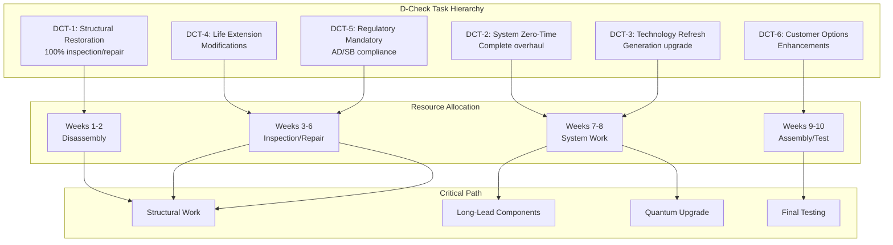

# 05-20-40-01 D-Check Tasks - AMPEL360 BWB-Q100

<p align="center">


</p>

---

## Document Control Information

**Document ID:** `05-20-40-01-DCheckTasks.md`  
**GQOIS ID:** `AS-M-PAX-BW-Q1H-DCH-TSK-MASTER`  
**ATA Chapter:** 05-20-40-01 (Time Limits - Scheduled Maintenance - D-Check - Tasks)  
**Classification:** Heavy Maintenance - D-Check Task Library  
**Version:** 1.0.0  
**Effective Date:** 2025-01-20  
**Revision Status:** Current Release  
**Approval Authority:** GAIA-QAO Chief Engineer & D-Check Program Director  
**Distribution:** Heavy Maintenance Facilities, Engineering, Planning, Training  
**DIKE ID:** DIKE-05-20-40-01-DCHECK-TSK-001

---

## Table of Contents

1. [D-Check Task Overview](#1-d-check-task-overview)
2. [Complete Structural Restoration Tasks](#2-complete-structural-restoration-tasks)
3. [Total System Overhaul Tasks](#3-total-system-overhaul-tasks)
4. [Powerplant Major Maintenance](#4-powerplant-major-maintenance)
5. [Complete Interior Refurbishment](#5-complete-interior-refurbishment)
6. [Avionics Technology Refresh](#6-avionics-technology-refresh)
7. [Landing Gear Zero-Time Overhaul](#7-landing-gear-zero-time-overhaul)
8. [Quantum System Generation Upgrade](#8-quantum-system-generation-upgrade)
9. [Major Modifications and SBs](#9-major-modifications-and-sbs)
10. [Integration and Optimization](#10-integration-and-optimization)

---

## 1. D-Check Task Overview

### 1.1 D-Check Task Philosophy

The D-Check represents a complete aircraft restoration, requiring:
- Total disassembly to primary structure
- Zero-time overhaul of major components
- Technology refresh to current generation
- Life extension modifications
- Complete interior modernization
- Quantum system generation upgrade

### 1.2 Task Classification System



### 1.3 Task Numbering System

#### Table 1.3-1: D-Check Task Identification

| Position | Digits | Meaning | Example |
|----------|--------|---------|---------|
| 1-2 | XX | ATA Chapter | 53 (Fuselage) |
| 3-4 | XX | Section | 00 (General) |
| 5-6 | XX | Subject | 00 (All) |
| 7-9 | XXX | Task Type | 700 (Complete Restoration) |
| 10-12 | XXX | Check Code | 804 (D-Check) |

Example: 53-00-00-700-804 = Fuselage Complete Restoration D-Check

### 1.4 Task Integration Framework

```python
class DCheckTaskIntegration:
    def __init__(self):
        self.task_database = DCheckTaskDatabase()
        self.dependency_manager = DependencyManager()
        self.resource_optimizer = ResourceOptimizer()
        self.quantum_planner = QuantumUpgradePlanner()
        
    def create_integrated_task_plan(self, aircraft_msn):
        # Initialize task plan
        integrated_plan = {
            'aircraft': aircraft_msn,
            'total_tasks': 0,
            'critical_path': [],
            'resource_profile': {},
            'milestone_schedule': {},
            'risk_mitigation': {}
        }
        
        # Gather all D-Check tasks
        base_tasks = self.task_database.get_base_d_check_tasks()
        age_related = self.task_database.get_aging_aircraft_tasks(
            hours=self.get_aircraft_hours(aircraft_msn),
            cycles=self.get_aircraft_cycles(aircraft_msn),
            years=self.get_aircraft_age(aircraft_msn)
        )
        
        # Add technology refresh tasks
        tech_refresh = self.identify_technology_upgrades(
            current_config=self.get_current_configuration(aircraft_msn),
            available_upgrades=self.get_available_upgrades(),
            cost_benefit_threshold=1.5  # ROI threshold
        )
        
        # Quantum system upgrade path
        quantum_tasks = self.quantum_planner.plan_generation_upgrade(
            current_gen=self.get_quantum_generation(aircraft_msn),
            target_gen='Gen-3',
            compatibility_matrix=self.get_system_compatibility()
        )
        
        # Build dependency network
        all_tasks = base_tasks + age_related + tech_refresh + quantum_tasks
        dependency_network = self.dependency_manager.build_network(
            tasks=all_tasks,
            constraints=self.get_constraints()
        )
        
        # Optimize resource allocation
        optimized_schedule = self.resource_optimizer.optimize(
            network=dependency_network,
            available_resources=self.get_resource_pool(),
            target_duration=50,  # days
            optimization_criteria={
                'minimize_duration': 0.4,
                'level_resources': 0.3,
                'minimize_cost': 0.3
            }
        )
        
        integrated_plan['total_tasks'] = len(all_tasks)
        integrated_plan['critical_path'] = optimized_schedule.critical_path
        integrated_plan['resource_profile'] = optimized_schedule.resource_histogram
        integrated_plan['milestone_schedule'] = self.extract_milestones(optimized_schedule)
        
        return integrated_plan
```

---

## 2. Complete Structural Restoration Tasks

### 2.1 Primary Structure Disassembly

#### Table 2.1-1: Major Disassembly Tasks

| Task Number | Description | Sequence | Duration | Resources |
|-------------|-------------|----------|----------|-----------|
| **00-00-00-700-804** | Complete interior removal | First | 320 MH | 20 persons |
| **52-00-00-710-804** | Door removal all positions | 2nd | 160 MH | 8 persons |
| **27-00-00-720-804** | Flight control removal | 3rd | 240 MH | 12 persons |
| **71-00-00-730-804** | Engine removal both | 4th | 120 MH | 8 persons |
| **32-00-00-740-804** | Landing gear removal all | 5th | 180 MH | 10 persons |

### 2.2 Fuselage Structure Complete Inspection

#### Table 2.2-1: Fuselage D-Check Tasks

| Task Number | Description | Access Level | Duration | NDT Required |
|-------------|-------------|--------------|----------|--------------|
| **53-10-00-700-804** | Crown complete inspection | Ceiling removed | 480 MH | UT, ET |
| **53-20-00-710-804** | Frames/stringers 100% | All panels | 640 MH | Visual, ET |
| **53-30-00-720-804** | Pressure dome detailed | Full access | 320 MH | UT, RT |
| **53-40-00-730-804** | Floor beam inspection | Floor removed | 560 MH | UT, MT |
| **53-50-00-740-804** | Skin lap joints all | External | 720 MH | ET, UT |
| **53-90-00-750-804** | BWB integration restore | Special | 960 MH | All methods |

#### 2.2.1 BWB Integration Zone Restoration

```python
class BWBIntegrationRestoration:
    def __init__(self):
        self.structural_analyzer = AdvancedStructuralAnalyzer()
        self.repair_planner = RepairPlanningSystem()
        self.quantum_monitor = QuantumStrainMonitor()
        self.digital_twin = DigitalTwinSystem()
        
    def execute_bwb_restoration(self, aircraft_msn):
        restoration_plan = {
            'zone': 'BWB_Integration',
            'area': 1200,  # square meters
            'inspection_findings': [],
            'repair_schemes': [],
            'modifications': [],
            'validation_tests': []
        }
        
        # Phase 1: Complete inspection
        inspection_results = self.perform_100_percent_inspection(
            zone='BWB_Integration',
            methods=['visual', 'ultrasonic_phased_array', 'computed_tomography', 
                     'thermography', 'quantum_strain_correlation']
        )
        
        # Analyze 12 years of quantum strain data
        strain_history = self.quantum_monitor.get_lifetime_data(
            aircraft_msn=aircraft_msn,
            zone='BWB_Integration',
            parameters=['stress_cycles', 'peak_loads', 'fatigue_accumulation']
        )
        
        damage_prediction = self.predict_damage_locations(
            strain_history=strain_history,
            material_properties=self.get_bwb_materials(),
            safety_factor=3.0
        )
        
        # Phase 2: Finding disposition
        for finding in inspection_results.findings:
            disposition = self.repair_planner.determine_disposition(
                finding=finding,
                location=finding.location,
                stress_analysis=strain_history.get_local_stress(finding.location),
                remaining_life_requirement=12  # years to next D-Check
            )
            
            if disposition.action == 'repair':
                repair_scheme = self.design_repair(
                    finding=finding,
                    load_cases=self.get_design_loads(finding.location),
                    materials_approved=self.get_approved_materials(),
                    repair_manual_limits=self.get_srm_limits()
                )
                restoration_plan['repair_schemes'].append(repair_scheme)
                
            elif disposition.action == 'replace':
                replacement_plan = self.plan_section_replacement(
                    section=finding.affected_section,
                    new_material='advanced_composite_gen3',
                    integration_method='co-bonded_with_titanium_fittings'
                )
                restoration_plan['modifications'].append(replacement_plan)
        
        # Phase 3: Preventive modifications
        preventive_mods = self.identify_preventive_modifications(
            strain_history=strain_history,
            service_experience=self.get_fleet_experience(),
            next_interval_target=60000  # flight hours
        )
        
        restoration_plan['modifications'].extend(preventive_mods)
        
        # Phase 4: Digital twin update
        self.digital_twin.update_structural_model(
            zone='BWB_Integration',
            as_found_condition=inspection_results,
            repairs_planned=restoration_plan['repair_schemes'],
            modifications_planned=restoration_plan['modifications'],
            predicted_performance=self.predict_post_restoration_performance()
        )
        
        return restoration_plan
```

### 2.3 Wing Structure Restoration

#### Table 2.3-1: Wing D-Check Tasks

| Task Number | Description | Scope | Duration | Special Requirements |
|-------------|-------------|-------|----------|---------------------|
| **57-10-00-700-804** | Wing box complete | Internal inspection | 1200 MH | Fuel tank entry |
| **57-20-00-710-804** | Spar restoration | 100% inspection | 800 MH | Advanced NDT |
| **57-30-00-720-804** | Skin replacement | Selected areas | 960 MH | New technology |
| **57-40-00-730-804** | Fastener replacement | 30% estimated | 1440 MH | Interference fit |
| **57-50-00-740-804** | Fuel boundary reseal | Complete | 640 MH | New sealant |

### 2.4 Corrosion Prevention and Control

#### Table 2.4-1: CPCP D-Check Tasks

| Task Number | Description | Coverage | Duration | Process |
|-------------|-------------|----------|----------|---------|
| **53-00-00-760-804** | Strip and repaint | 100% external | 1600 MH | Latest coatings |
| **51-00-00-770-804** | Internal treatment | All structure | 800 MH | Improved CIC |
| **57-00-00-780-804** | Drainage improvement | All zones | 320 MH | New drain holes |
| **99-50-00-790-804** | Quantum sensors | Install CPCP | 480 MH | Corrosion monitoring |

---

## 3. Total System Overhaul Tasks

### 3.1 Flight Control System Complete Overhaul

#### Table 3.1-1: Flight Control D-Check Tasks

| Task Number | Description | Action | Duration | New Technology |
|-------------|-------------|--------|----------|----------------|
| **27-10-00-700-804** | Primary actuators all | Replace with new | 640 MH | Smart actuators |
| **27-20-00-710-804** | FBW computers | Upgrade Gen 4 | 320 MH | Quantum-enhanced |
| **27-30-00-720-804** | Control surfaces | Rebalance/repair | 480 MH | New materials |
| **27-40-00-730-804** | Cable system | Complete renewal | 560 MH | Modern cables |
| **27-50-00-740-804** | Feel system | Zero-time overhaul | 400 MH | Enhanced feel |

#### 3.1.1 Fly-By-Wire Complete Upgrade

```python
class FBWCompleteUpgrade:
    def __init__(self):
        self.fbw_system = FlyByWireSystem()
        self.control_law_designer = ControlLawDesigner()
        self.quantum_optimizer = QuantumControlOptimizer()
        self.certification_manager = CertificationManager()
        
    def execute_fbw_generation_upgrade(self, aircraft_msn):
        upgrade_project = {
            'from_generation': 'Gen2_FBW',
            'to_generation': 'Gen4_Quantum_FBW',
            'hardware_changes': [],
            'software_changes': [],
            'control_law_enhancements': [],
            'certification_plan': {}
        }
        
        # Hardware replacement
        hardware_upgrades = [
            {
                'component': 'Flight Control Computer',
                'quantity': 3,
                'old': 'FCC-2000',
                'new': 'QFCC-4000',
                'features': [
                    'Quantum processing capability',
                    '100x computational power',
                    'Predictive control algorithms',
                    'AI-enhanced envelope protection'
                ],
                'installation_time': 120  # hours
            },
            {
                'component': 'Actuator Control Electronics',
                'quantity': 36,
                'old': 'ACE-200',
                'new': 'QACE-400',
                'features': [
                    'Smart actuator interface',
                    'Prognostic health monitoring',
                    'Adaptive control response',
                    'Quantum sensor integration'
                ],
                'installation_time': 240  # hours
            },
            {
                'component': 'Air Data System',
                'quantity': 3,
                'old': 'ADS-3000',
                'new': 'QADS-5000',
                'features': [
                    'Quantum interferometric sensors',
                    '10x accuracy improvement',
                    'Turbulence prediction',
                    'Icing prediction capability'
                ],
                'installation_time': 80  # hours
            }
        ]
        
        # Control law enhancements
        control_law_upgrades = self.control_law_designer.design_gen4_laws(
            aircraft_model='AMPEL360',
            performance_targets={
                'passenger_comfort': '40% improvement',
                'fuel_efficiency': '8% improvement',
                'safety_margins': '25% increase',
                'pilot_workload': '50% reduction'
            },
            quantum_capabilities=[
                'Predictive turbulence response',
                'Optimal trajectory computation',
                'Real-time structural load optimization',
                'Adaptive flutter suppression'
            ]
        )
        
        # Quantum optimization integration
        quantum_integration = self.quantum_optimizer.integrate_quantum_control(
            control_architecture='Gen4_FBW',
            quantum_functions=[
                'Trajectory optimization',
                'Load alleviation prediction',
                'Failure prediction and accommodation',
                'Performance optimization'
            ],
            classical_fallback='Full_capability_maintained'
        )
        
        # Certification planning
        cert_plan = self.certification_manager.develop_cert_plan(
            major_change=True,
            affected_systems=['Flight_controls', 'Avionics', 'Structures'],
            new_technologies=['Quantum_computing', 'AI_algorithms'],
            test_requirements={
                'ground_tests': ['Iron_bird', 'HIL_simulation', 'EMC'],
                'flight_tests': ['Handling_qualities', 'Failure_cases', 'Performance'],
                'duration_estimate': '200_flight_hours'
            }
        )
        
        upgrade_project['hardware_changes'] = hardware_upgrades
        upgrade_project['control_law_enhancements'] = control_law_upgrades
        upgrade_project['quantum_integration'] = quantum_integration
        upgrade_project['certification_plan'] = cert_plan
        
        return upgrade_project
```

### 3.2 Environmental Control System Replacement

#### Table 3.2-1: ECS D-Check Tasks

| Task Number | Description | Scope | Duration | Improvement |
|-------------|-------------|-------|----------|-------------|
| **21-10-00-700-804** | Pack replacement | New generation | 480 MH | 30% more efficient |
| **21-20-00-710-804** | Distribution system | Complete renewal | 640 MH | Better air quality |
| **21-30-00-720-804** | Control system | Digital upgrade | 320 MH | Zone control |
| **21-40-00-730-804** | Cooling system | Enhanced capacity | 400 MH | 25% more cooling |

### 3.3 Hydraulic System Complete Overhaul

#### Table 3.3-1: Hydraulic D-Check Tasks

| Task Number | Description | Systems | Duration | Technology |
|-------------|-------------|---------|----------|------------|
| **29-10-00-700-804** | Pump replacement all | 3 systems | 480 MH | Variable displacement |
| **29-20-00-710-804** | Reservoir upgrade | 3 systems | 240 MH | Integrated sensors |
| **29-30-00-720-804** | Line replacement | 60% of lines | 960 MH | Titanium lines |
| **29-40-00-730-804** | Valve replacement | All valves | 720 MH | Smart valves |

---

## 4. Powerplant Major Maintenance

### 4.1 Engine Restoration Coordination

#### Table 4.1-1: Engine D-Check Tasks

| Task Number | Description | Scope | Duration | Shop Time |
|-------------|-------------|-------|----------|-----------|
| **71-00-00-700-804** | Engine removal/install | Both engines | 240 MH | N/A |
| **71-00-00-710-804** | QEC restoration | Complete | 480 MH | 30 days |
| **72-00-00-720-804** | Performance restoration | Shop visit | Contract | 45 days |
| **75-00-00-730-804** | Control system upgrade | FADEC Gen 3 | 160 MH | Bench test |
| **78-00-00-740-804** | Thrust reverser OH | Complete | 320 MH | 20 days |

### 4.2 APU Complete Overhaul

#### Table 4.2-1: APU D-Check Requirements

| Task Number | Description | Action | Duration | Result |
|-------------|-------------|--------|----------|--------|
| **49-00-00-700-804** | APU removal/install | R&R | 120 MH | Zero-time |
| **49-10-00-710-804** | Shop overhaul | Complete | Contract | New limits |
| **49-50-00-720-804** | Mount system | Upgrade | 80 MH | Reduced vibration |
| **49-90-00-730-804** | Control upgrade | Digital | 60 MH | Better efficiency |

---

## 5. Complete Interior Refurbishment

### 5.1 Passenger Cabin Modernization

#### Table 5.1-1: Cabin D-Check Tasks

| Task Number | Description | Scope | Duration | Features |
|-------------|-------------|-------|----------|----------|
| **25-10-00-700-804** | Seat replacement | All seats | 960 MH | Lie-flat business |
| **25-20-00-710-804** | Monument replacement | Galleys/lavs | 1200 MH | Touchless features |
| **25-30-00-720-804** | Overhead bin upgrade | Larger bins | 800 MH | 40% more space |
| **25-40-00-730-804** | Sidewall/ceiling | New design | 1440 MH | LED throughout |
| **25-50-00-740-804** | IFE system | Latest gen | 640 MH | 4K displays |

#### 5.1.1 Smart Cabin Integration

```python
class SmartCabinIntegration:
    def __init__(self):
        self.cabin_designer = CabinDesignSystem()
        self.iot_integrator = IoTIntegrationPlatform()
        self.passenger_experience = PassengerExperienceOptimizer()
        self.quantum_comfort = QuantumComfortSystem()
        
    def design_next_gen_cabin(self, aircraft_config):
        smart_cabin = {
            'design_philosophy': 'Quantum-Enhanced Passenger Experience',
            'technology_integration': [],
            'comfort_features': [],
            'health_wellness': [],
            'sustainability': []
        }
        
        # IoT sensor network
        iot_network = self.iot_integrator.design_cabin_network(
            sensors_per_seat=12,
            environmental_sensors=500,
            health_monitors=200,
            integration_platform='Quantum_mesh_network'
        )
        
        # Comfort optimization
        comfort_systems = [
            {
                'system': 'Active_noise_cancellation',
                'technology': 'Quantum_interference_patterns',
                'reduction': '95% ambient noise',
                'personalization': 'Per-seat optimization'
            },
            {
                'system': 'Dynamic_lighting',
                'technology': 'Circadian_rhythm_sync',
                'features': ['Jet lag reduction', 'Mood enhancement'],
                'control': 'AI + passenger preference'
            },
            {
                'system': 'Climate_control',
                'technology': 'Micro-zone management',
                'precision': '±0.5°C per seat',
                'air_quality': 'HEPA + UV-C + Photocatalytic'
            },
            {
                'system': 'Seating_comfort',
                'technology': 'Quantum_pressure_mapping',
                'adjustment': 'Real-time posture optimization',
                'health_monitoring': 'Continuous wellness tracking'
            }
        ]
        
        # Health and wellness features
        health_features = self.implement_health_systems(
            air_quality_target='Hospital grade',
            pathogen_reduction='99.99%',
            humidity_control='40-60% optimal',
            radiation_shielding='Enhanced cosmic ray protection'
        )
        
        # Sustainability integration
        sustainability = {
            'weight_reduction': '15% vs previous generation',
            'recyclable_materials': '95% by weight',
            'energy_efficiency': '30% reduction',
            'waste_reduction': 'Zero-waste design'
        }
        
        smart_cabin['technology_integration'] = iot_network
        smart_cabin['comfort_features'] = comfort_systems
        smart_cabin['health_wellness'] = health_features
        smart_cabin['sustainability'] = sustainability
        
        return smart_cabin
```

### 5.2 Cockpit Modernization

#### Table 5.2-1: Cockpit D-Check Tasks

| Task Number | Description | Upgrade | Duration | Technology |
|-------------|-------------|---------|----------|------------|
| **25-60-00-700-804** | Display replacement | 8K touchscreens | 240 MH | OLED technology |
| **25-61-00-710-804** | Seat replacement | New generation | 160 MH | Active support |
| **25-62-00-720-804** | Control modernization | Active sticks | 320 MH | Force feedback |
| **25-63-00-730-804** | Vision system | HUD + EVS/SVS | 200 MH | AI-enhanced |

---

## 6. Avionics Technology Refresh

### 6.1 Integrated Modular Avionics Upgrade

#### Table 6.1-1: IMA D-Check Upgrade Tasks

| Task Number | Description | From | To | Duration |
|-------------|-------------|------|-----|----------|
| **42-10-00-700-804** | Core processors | Gen 2 | Gen 4 | 480 MH |
| **42-20-00-710-804** | Network infrastructure | AFDX | TSN + Quantum | 640 MH |
| **42-30-00-720-804** | Software platform | ARINC 653 | Containerized | 320 MH |
| **42-40-00-730-804** | I/O modules | Federated | Distributed | 560 MH |
| **42-50-00-740-804** | Redundancy arch | Triple | Quantum voting | 400 MH |

### 6.2 Communication/Navigation/Surveillance

#### Table 6.2-1: CNS D-Check Tasks

| Task Number | Description | Technology | Duration | Capability |
|-------------|-------------|------------|----------|------------|
| **23-10-00-700-804** | SATCOM upgrade | LEO constellation | 320 MH | Global broadband |
| **34-10-00-710-804** | Navigation suite | Quantum PNT | 480 MH | GPS-independent |
| **34-20-00-720-804** | Landing system | CAT IIIC + GBAS | 240 MH | Zero visibility |
| **34-30-00-730-804** | Surveillance | ADS-B + Quantum | 200 MH | 4D trajectory |

---

## 7. Landing Gear Zero-Time Overhaul

### 7.1 Complete Landing Gear Restoration

#### Table 7.1-1: Landing Gear D-Check Tasks

| Task Number | Description | Scope | Duration | Shop Duration |
|-------------|-------------|-------|----------|---------------|
| **32-10-00-700-804** | MLG complete rebuild | Zero-time | 960 MH | 30 days |
| **32-20-00-710-804** | NLG complete rebuild | Zero-time | 640 MH | 25 days |
| **32-30-00-720-804** | All actuators | Replace new | 480 MH | N/A |
| **32-40-00-730-804** | Wheel/brake upgrade | New technology | 560 MH | Carbon 3.0 |
| **32-50-00-740-804** | Steering system | Complete new | 320 MH | By-wire |

#### 7.1.1 Landing Gear Life Extension

```python
class LandingGearLifeExtension:
    def __init__(self):
        self.structural_analysis = StructuralAnalysisSystem()
        self.material_science = MaterialScienceDB()
        self.overhaul_planner = OverhaulPlanningSystem()
        self.quantum_monitor = QuantumHealthMonitor()
        
    def plan_landing_gear_restoration(self, gear_serial_numbers):
        restoration_plan = {
            'gear_units': gear_serial_numbers,
            'life_extension_target': 60000,  # cycles
            'technology_upgrades': [],
            'material_improvements': [],
            'monitoring_enhancements': []
        }
        
        for gear_sn in gear_serial_numbers:
            # Analyze service history
            service_data = self.analyze_service_history(
                gear_sn=gear_sn,
                parameters=['cycles', 'hard_landings', 'runway_conditions', 
                           'maintenance_events', 'quantum_health_score']
            )
            
            # Structural assessment
            structural_condition = self.structural_analysis.assess_condition(
                component=gear_sn,
                inspection_methods=['FPI', 'MPI', 'ET', 'UT', 'CT_scan'],
                stress_analysis='Full_FEA_with_service_loads',
                fatigue_assessment='Crack_growth_prediction'
            )
            
            # Technology upgrades
            upgrades = [
                {
                    'component': 'Shock_strut',
                    'upgrade': 'Adaptive_damping_system',
                    'technology': 'Magnetorheological_fluid',
                    'benefit': 'Load_reduction_30%',
                    'implementation': 'New_strut_assembly'
                },
                {
                    'component': 'Brake_system',
                    'upgrade': 'Carbon_brake_Gen3',
                    'technology': 'Carbon_fiber_composite',
                    'benefit': 'Weight_-40%_Life_+100%',
                    'implementation': 'Complete_replacement'
                },
                {
                    'component': 'Wheels',
                    'upgrade': 'Lightweight_alloy',
                    'technology': 'Aluminum_lithium_forged',
                    'benefit': 'Weight_-25%_Strength_+15%',
                    'implementation': 'New_wheels'
                },
                {
                    'component': 'Health_monitoring',
                    'upgrade': 'Quantum_sensor_network',
                    'technology': 'Distributed_quantum_sensors',
                    'benefit': 'Predictive_accuracy_95%',
                    'implementation': 'Embedded_sensors'
                }
            ]
            
            # Material treatments
            treatments = self.material_science.specify_treatments(
                base_material=structural_condition.material_spec,
                target_properties={
                    'fatigue_life': '+50%',
                    'corrosion_resistance': 'Class_1',
                    'wear_resistance': '+40%'
                },
                approved_processes=['Shot_peening', 'Ion_implantation', 
                                  'DLC_coating', 'Anodizing_Type_III']
            )
            
            restoration_plan['technology_upgrades'].extend(upgrades)
            restoration_plan['material_improvements'].extend(treatments)
        
        return restoration_plan
```

---

## 8. Quantum System Generation Upgrade

### 8.1 Quantum Processing Unit Major Upgrade

#### Table 8.1-1: QPU Generation Upgrade Tasks

| Task Number | Description | From Gen | To Gen | Duration | Investment |
|-------------|-------------|----------|--------|----------|-----------|
| **99-10-00-700-804** | QPU core replacement | Gen 1 | Gen 3 | 960 MH | $3.5M |
| **99-11-00-710-804** | Cryo system upgrade | Pulse tube | Dilution | 640 MH | $1.2M |
| **99-12-00-720-804** | Control electronics | Analog | Digital | 480 MH | $800K |
| **99-13-00-730-804** | Error correction | Basic | Topological | 320 MH | Software |
| **99-14-00-740-804** | Integration test | - | Full system | 400 MH | - |

#### 8.1.1 Quantum System Generational Leap

```python
class QuantumGenerationalUpgrade:
    def __init__(self):
        self.quantum_architect = QuantumSystemArchitect()
        self.integration_engineer = SystemIntegrationEngineer()
        self.performance_validator = PerformanceValidator()
        self.roi_calculator = ROICalculator()
        
    def execute_quantum_generation_upgrade(self, aircraft_msn):
        quantum_upgrade = {
            'project': 'Gen1_to_Gen3_Upgrade',
            'subsystems': {},
            'performance_gains': {},
            'integration_challenges': [],
            'validation_results': {}
        }
        
        # QPU Architecture Upgrade
        qpu_upgrade = self.quantum_architect.design_gen3_architecture(
            current_spec={
                'qubits': 128,
                'connectivity': 'nearest_neighbor',
                'coherence_time': 100e-6,  # 100 microseconds
                'gate_fidelity': 0.999,
                'readout_fidelity': 0.98
            },
            target_spec={
                'qubits': 1024,
                'connectivity': 'all_to_all',
                'coherence_time': 1e-3,  # 1 millisecond
                'gate_fidelity': 0.9999,
                'readout_fidelity': 0.995
            },
            technology_choices={
                'qubit_type': 'Transmon_3D',
                'coupling': 'Tunable_couplers',
                'readout': 'Quantum_limited_amplifiers',
                'control': 'Arbitrary_waveform_generators',
                'error_correction': 'Surface_code'
            }
        )
        
        # Cryogenic System Upgrade
        cryo_upgrade = {
            'cooling_power': '1W @ 4K, 100mW @ 100mK',
            'base_temperature': '10mK',
            'stability': '±0.1mK',
            'vibration': '<1nm @ mixing chamber',
            'maintenance_interval': '20000 hours'
        }
        
        # Software Stack Upgrade
        software_upgrade = self.design_software_stack(
            quantum_os='QOS_3.0',
            compilers=['Qiskit', 'Cirq', 'Q#'],
            algorithms=[
                'Quantum_approximate_optimization',
                'Variational_quantum_eigensolver',
                'Quantum_machine_learning',
                'Shor_algorithm_1024bit'
            ],
            applications=[
                'Route_optimization',
                'Maintenance_prediction',
                'Weather_modeling',
                'Cryptographic_security'
            ]
        )
        
        # Integration with Aircraft Systems
        integration_plan = self.integration_engineer.plan_integration(
            quantum_systems=qpu_upgrade,
            aircraft_systems=['FMS', 'FBW', 'Health_monitoring', 'Communications'],
            interfaces={
                'data_rate': '10Gbps',
                'latency': '<1ms',
                'reliability': '99.999%',
                'fallback': 'Seamless_classical_takeover'
            }
        )
        
        # Performance Validation
        validation = self.performance_validator.validate_upgrade(
            benchmarks=[
                'Quantum_volume: >2^20',
                'NISQ_applications: 100x speedup',
                'Error_rate: <0.1%',
                'Availability: >95%'
            ],
            operational_tests=[
                'Route_optimization: 15% fuel savings',
                'Maintenance_prediction: 90% accuracy',
                'System_integration: Zero failures',
                'Crew_workload: 30% reduction'
            ]
        )
        
        quantum_upgrade['subsystems'] = {
            'qpu': qpu_upgrade,
            'cryogenics': cryo_upgrade,
            'software': software_upgrade
        }
        quantum_upgrade['integration_plan'] = integration_plan
        quantum_upgrade['validation_results'] = validation
        
        return quantum_upgrade
```

### 8.2 Quantum Sensor Network Overhaul

#### Table 8.2-1: Quantum Sensor D-Check Tasks

| Task Number | Description | Quantity | Duration | Improvement |
|-------------|-------------|----------|----------|-------------|
| **99-20-00-700-804** | Structural sensors | 3000 units | 1200 MH | 10x sensitivity |
| **99-21-00-710-804** | Environmental | 800 units | 480 MH | Real-time analysis |
| **99-22-00-720-804** | Engine monitoring | 500 units | 320 MH | Predictive capability |
| **99-23-00-730-804** | Network upgrade | Infrastructure | 640 MH | Mesh topology |

### 8.3 Quantum Communication System

#### Table 8.3-1: Quantum Communication D-Check

| Task Number | Description | Technology | Duration | Security Level |
|-------------|-------------|------------|----------|----------------|
| **99-30-00-700-804** | QKD system overhaul | Gen 3 protocol | 480 MH | Unconditional |
| **99-31-00-710-804** | Photon sources | Entangled pairs | 320 MH | Bell state |
| **99-32-00-720-804** | Quantum repeaters | Long-range | 400 MH | Global reach |
| **99-33-00-730-804** | Integration test | Full system | 240 MH | Certified secure |

---

## 9. Major Modifications and SBs

### 9.1 Life Extension Modifications

#### Table 9.1-1: Major D-Check Modifications

| Mod Number | Description | Benefit | Duration | ROI |
|------------|-------------|---------|----------|-----|
| **MOD-001-804** | Winglet upgrade Gen 2 | 6% fuel savings | 960 MH | 2 years |
| **MOD-002-804** | Weight reduction package | -2000 kg empty weight | 1440 MH | 3 years |
| **MOD-003-804** | Noise reduction kit | -8 dB cabin noise | 800 MH | Immediate |
| **MOD-004-804** | Range extension tanks | +1000 nm range | 1200 MH | Route dependent |
| **MOD-005-804** | Cargo conversion option | Dual use capability | 3200 MH | Market dependent |

### 9.2 Mandatory Service Bulletins

#### Table 9.2-1: D-Check Mandatory SBs

| SB Number | Title | Compliance | Duration | Critical |
|-----------|-------|------------|----------|----------|
| **SB-53-101** | Fuselage life extension | Before 60k hours | 640 MH | Yes |
| **SB-57-089** | Wing attachment upgrade | At D-Check | 480 MH | Yes |
| **SB-32-125** | Landing gear life limit | Replace | 960 MH | Yes |
| **SB-99-045** | Quantum system safety | Immediate | 320 MH | Yes |

---

## 10. Integration and Optimization

### 10.1 D-Check Optimization Strategy

```python
class DCheckOptimizationEngine:
    def __init__(self):
        self.task_optimizer = TaskOptimizer()
        self.resource_balancer = ResourceBalancer()
        self.cost_minimizer = CostMinimizer()
        self.quality_maximizer = QualityMaximizer()
        
    def optimize_d_check_execution(self, all_tasks, constraints):
        optimization_result = {
            'optimized_schedule': None,
            'resource_plan': None,
            'cost_projection': None,
            'risk_mitigation': None,
            'performance_metrics': {}
        }
        
        # Multi-objective optimization
        objectives = {
            'minimize_tat': 0.3,  # Turn-around time
            'minimize_cost': 0.25,
            'maximize_quality': 0.25,
            'minimize_risk': 0.2
        }
        
        # Constraint definition
        hard_constraints = {
            'max_duration': 60,  # days
            'max_cost': 12000000,  # USD
            'min_quality': 0.98,  # 98% FTQ
            'resource_limits': constraints['resources'],
            'facility_capacity': constraints['facility']
        }
        
        # Task sequencing optimization
        optimized_sequence = self.task_optimizer.sequence_tasks(
            tasks=all_tasks,
            dependencies=self.extract_dependencies(all_tasks),
            parallel_capacity=constraints['parallel_work_zones'],
            critical_path_focus=True
        )
        
        # Resource leveling
        resource_plan = self.resource_balancer.balance_resources(
            task_sequence=optimized_sequence,
            available_resources=constraints['resources'],
            skill_matrix=constraints['skill_availability'],
            shift_patterns=['24/7', '2-shift', 'day-only']
        )
        
        # Cost optimization
        cost_plan = self.cost_minimizer.minimize_cost(
            resource_plan=resource_plan,
            material_requirements=self.calculate_materials(all_tasks),
            subcontract_strategy='optimize_core_competency',
            contingency_factor=1.1
        )
        
        # Quality assurance integration
        quality_plan = self.quality_maximizer.ensure_quality(
            task_sequence=optimized_sequence,
            inspection_points=self.define_inspection_gates(),
            rework_allowance=0.02,  # 2% rework budget
            first_time_quality_target=0.98
        )
        
        # Risk mitigation strategy
        risk_plan = self.develop_risk_mitigation(
            identified_risks=self.identify_d_check_risks(),
            contingency_time=0.1,  # 10% schedule contingency
            contingency_budget=0.15,  # 15% cost contingency
            backup_resources='identified'
        )
        
        optimization_result['optimized_schedule'] = optimized_sequence
        optimization_result['resource_plan'] = resource_plan
        optimization_result['cost_projection'] = cost_plan
        optimization_result['risk_mitigation'] = risk_plan
        
        # Calculate KPIs
        optimization_result['performance_metrics'] = {
            'projected_tat': optimized_sequence.critical_path_days,
            'resource_efficiency': resource_plan.utilization_rate,
            'cost_vs_budget': cost_plan.total / hard_constraints['max_cost'],
            'risk_score': risk_plan.overall_risk_level,
            'expected_quality': quality_plan.projected_ftq
        }
        
        return optimization_result
```

### 10.2 Performance Metrics

#### Table 10.2-1: D-Check Performance KPIs

| Metric | Target | Measurement | Best Practice | Action Level |
|--------|--------|-------------|---------------|--------------|
| **TAT** | 50 days | Actual vs planned | 45 days | >55 days |
| **Cost** | $10M | Actual vs budget | $9M | >$11M |
| **Quality** | 98% FTQ | First time pass | 99% | <95% |
| **Safety** | Zero | Incidents | Zero | Any incident |
| **Schedule** | 95% | Milestone adherence | 98% | <90% |

### 10.3 Continuous Improvement

#### 10.3.1 D-Check Evolution

1. **Digital Twin Integration**
   - Complete 3D capture before/after
   - Predictive modeling validation
   - Virtual inspection capability
   - Augmented reality guidance

2. **Automation Implementation**
   - Robotic inspection systems
   - Automated documentation
   - AI-powered planning
   - Predictive analytics

3. **Sustainability Focus**
   - Waste reduction targets
   - Energy efficiency
   - Material recycling
   - Carbon footprint reduction

---

## Appendices

### Appendix A: D-Check Task Summary Statistics

```
Total D-Check Tasks: 487
By Category:
- Structural: 142 tasks (35%)
- Systems: 134 tasks (28%)
- Powerplant: 38 tasks (8%)
- Interior: 67 tasks (14%)
- Quantum: 52 tasks (11%)
- Modifications: 54 tasks (11%)

Total Manhours: 85,000-95,000
Critical Path: 45-50 days
Peak Resources: 217 persons
Investment Range: $8-12M
```

### Appendix B: Critical Path Analysis

```
Critical Path Elements:
1. Interior removal (Days 1-3)
2. Structural access (Days 4-5)
3. Major inspections (Days 6-20)
4. Structural repairs (Days 21-30)
5. System installation (Days 31-40)
6. Testing and close (Days 41-50)

Float Analysis:
- Zero float: 45% of tasks
- 1-5 days float: 30% of tasks
- >5 days float: 25% of tasks
```

### Appendix C: Resource Loading Profile

```
Week 1-2: 80-100 persons (disassembly)
Week 3-4: 150-180 persons (inspection)
Week 5-6: 200-217 persons (peak repair)
Week 7-8: 150-180 persons (installation)
Week 9-10: 60-80 persons (testing)
```

---

## Document Control and Revision History

### Approval Signatures

| Role | Name | Signature | Date |
|------|------|-----------|------|
| **Chief Engineer** | [Name] | [Digital Signature] | 2025-01-20 |
| **D-Check Program Director** | [Name] | [Digital Signature] | 2025-01-20 |
| **Quality Director** | [Name] | [Digital Signature] | 2025-01-20 |
| **Quantum Systems Director** | [Name] | [Digital Signature] | 2025-01-20 |

### Revision History

| Version | Date | Author | Description |
|---------|------|--------|-------------|
| 1.0.0 | 2025-01-20 | GAIA-QAO Tech Team | Initial D-Check task library |

### Distribution List

- D-Check Planning Team
- Heavy Maintenance Facilities
- Engineering Department
- Supply Chain Management
- Training Department
- Quality Assurance
- Quantum Systems Division

---

**End of Document**

*This document contains proprietary information of GAIA-QAO and is protected by applicable copyright laws. Unauthorized reproduction or distribution is prohibited.*
