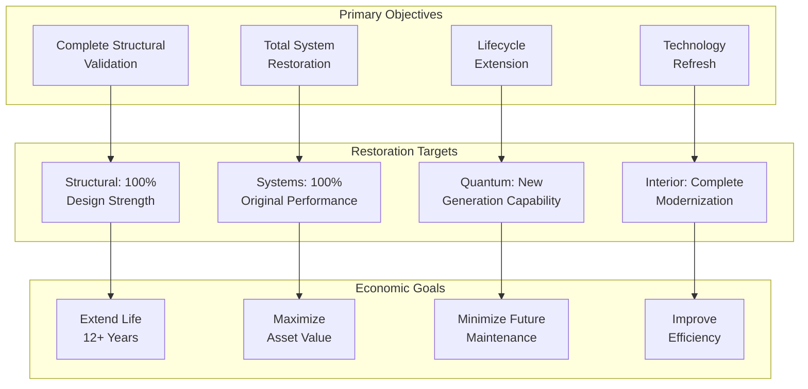
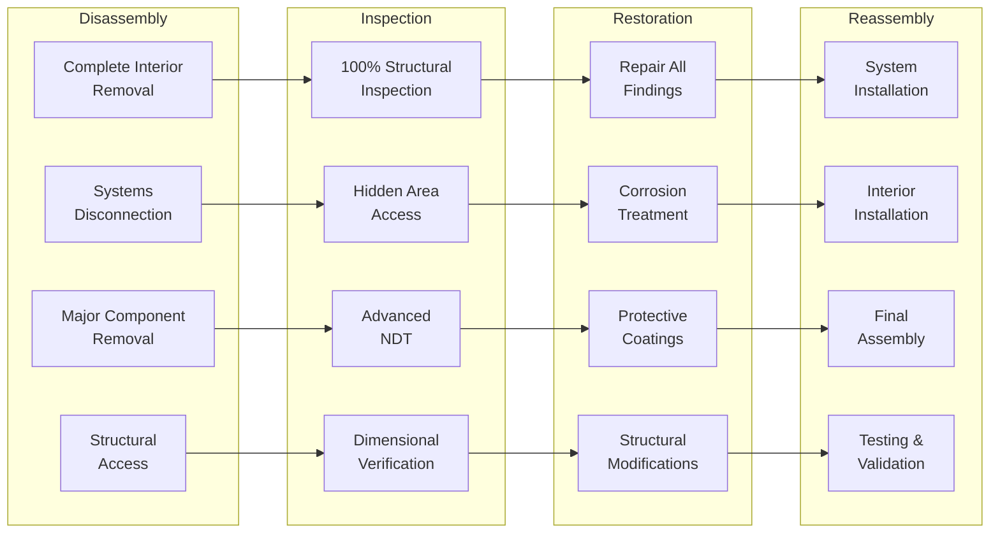
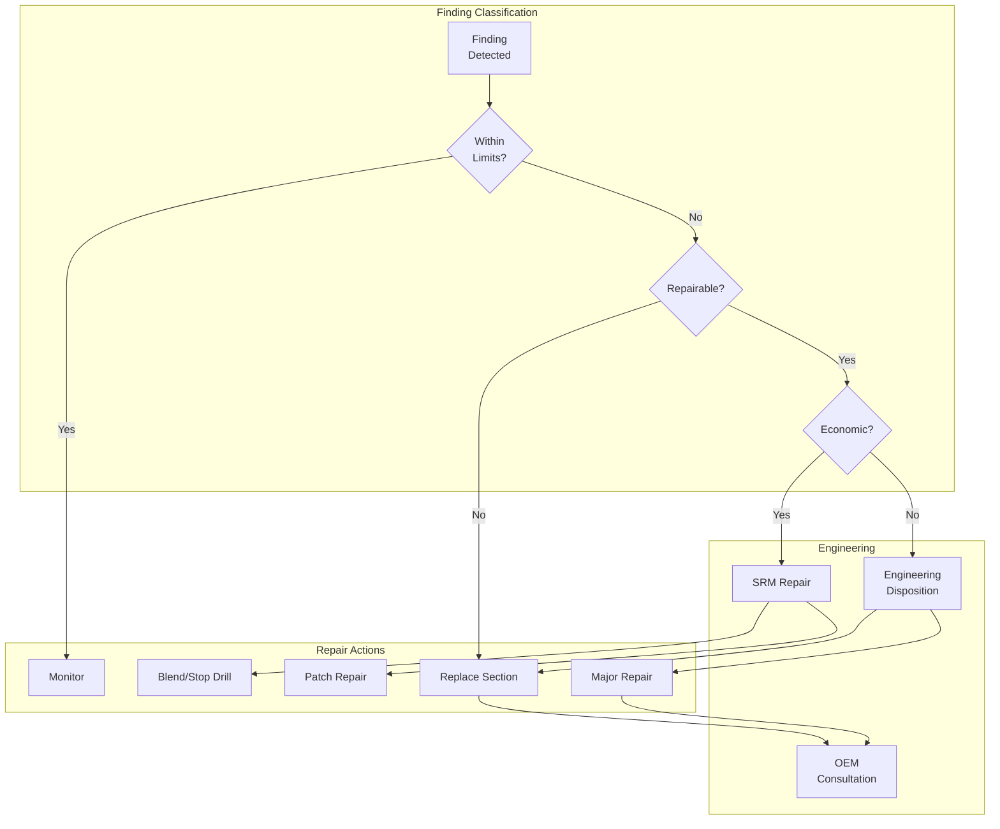
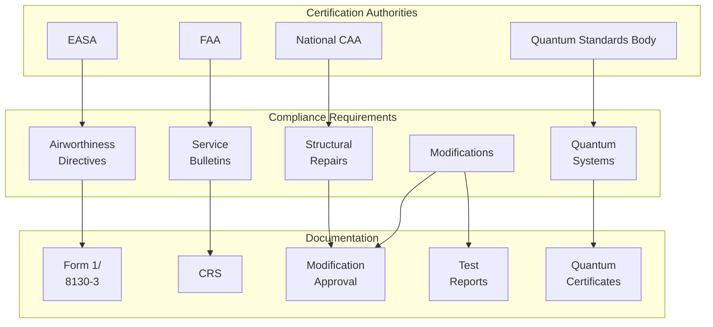

# 05-20-40-00 D-Check General Requirements - AMPEL360 BWB-Q100

## Document Information
- **ATA Chapter**: 05 - Time Limits/Maintenance Checks
- **Section**: 20 - Scheduled Maintenance Checks
- **Subsection**: 40 - D-Check
- **Document Type**: 00 - General Requirements
- **Version**: 1.0.0
- **Date**: 2025-01-20
- **Effectivity**: AMPEL360 BWB-Q100 MSN ALL
- **GAIA-QAO Reference**: AS-M-PAX-BW-Q1H

## Table of Contents
1. [Executive Summary](#1-executive-summary)
2. [D-Check Definition and Philosophy](#2-d-check-definition-and-philosophy)
3. [Interval Requirements](#3-interval-requirements)
4. [Scope and Work Content](#4-scope-and-work-content)
5. [Planning Requirements](#5-planning-requirements)
6. [Facility and Resource Requirements](#6-facility-and-resource-requirements)
7. [Major Structural Work](#7-major-structural-work)
8. [Complete System Overhaul](#8-complete-system-overhaul)
9. [Quantum System Lifecycle Actions](#9-quantum-system-lifecycle-actions)
10. [Quality Assurance and Certification](#10-quality-assurance-and-certification)

## 1. Executive Summary

### 1.1 Overview
The D-Check represents the most comprehensive scheduled maintenance event in the AMPEL360 BWB-Q100 lifecycle, essentially returning the aircraft to "like-new" condition through complete structural inspection, system overhaul, and restoration. This maintenance level includes work that can only be performed with extensive disassembly and specialized facilities.

### 1.2 Key Characteristics
- **Duration**: 45-60 days
- **Manhours**: 80,000-100,000
- **Cost**: $8-12 million
- **Interval**: 12 years or 60,000 flight hours
- **Facility**: Dedicated heavy maintenance base
- **Downtime Impact**: 2 months revenue loss

### 1.3 Strategic Importance
The D-Check serves as a major lifecycle milestone where:
- Aircraft structural integrity is comprehensively validated
- All systems are restored to original performance specifications
- Major modifications and upgrades are incorporated
- Quantum systems undergo complete refurbishment or replacement
- Asset value is restored for extended service life

### 1.4 DIKE Reference
- **DIKE ID**: DIKE-05-20-40-00-DCHECK-GEN-001
- **Traceability**: Links to manufacturer's recommendations, regulatory requirements, and lifecycle management strategies

---

## 2. D-Check Definition and Philosophy

### 2.1 D-Check Objectives



### 2.2 Maintenance Philosophy

#### 2.2.1 "Zero-Time" Concept
The D-Check aims to achieve "zero-time" status where practicable:
- Replace all life-limited components
- Restore all repairable components to new limits
- Update all systems to latest standards
- Reset maintenance cycles for many items

#### 2.2.2 Proactive Replacement Strategy
- Replace components approaching life limits
- Upgrade systems nearing obsolescence
- Implement latest safety enhancements
- Install efficiency improvements

### 2.3 Work Scope Categories

#### Table 2.3-1: D-Check Work Categories

| Category | Scope | Typical % of Work | Criticality |
|----------|-------|-------------------|-------------|
| **Structural** | Complete disassembly and inspection | 35% | Safety Critical |
| **Systems** | Total overhaul/replacement | 25% | Operational Critical |
| **Powerplant** | Major overhaul coordination | 10% | Performance Critical |
| **Interior** | Complete refurbishment | 15% | Customer Experience |
| **Quantum** | Generation upgrade | 10% | Technology Critical |
| **Modifications** | Major upgrades | 5% | Enhancement |

---

## 3. Interval Requirements

### 3.1 D-Check Interval Determination

#### 3.1.1 Primary Interval Drivers
```python
class DCheckIntervalOptimizer:
    def __init__(self):
        self.structural_life = StructuralLifeAnalysis()
        self.system_lifecycle = SystemLifecycleManager()
        self.economic_model = EconomicOptimizer()
        self.quantum_evolution = QuantumTechnologyEvolution()
        
    def calculate_optimal_d_check_interval(self, aircraft_profile):
        # Structural life limits
        structural_interval = self.structural_life.calculate_major_inspection(
            material_fatigue_curves=self.get_material_data(),
            usage_severity=aircraft_profile.severity_index,
            safety_factor=3.0,
            inspection_reliability=0.95
        )
        
        # System obsolescence curves
        system_intervals = {}
        for system in self.get_major_systems():
            obsolescence_point = self.system_lifecycle.predict_obsolescence(
                system_type=system,
                technology_evolution_rate=self.get_tech_evolution_rate(system),
                support_availability=self.get_vendor_support_timeline(system)
            )
            system_intervals[system] = obsolescence_point
        
        # Economic optimization
        economic_optimum = self.economic_model.find_optimal_interval(
            capital_cost=12000000,  # D-Check cost
            downtime_cost_per_day=250000,
            residual_value_curve=self.calculate_residual_value(),
            maintenance_cost_growth=self.project_maintenance_growth()
        )
        
        # Quantum system generations
        quantum_cycle = self.quantum_evolution.technology_refresh_cycle(
            current_generation='Gen-1',
            performance_improvement_per_gen=2.5,  # 2.5x per generation
            cost_reduction_per_gen=0.6,  # 40% cost reduction
            generation_cycle_years=4
        )
        
        # Regulatory maximum
        regulatory_limit = self.get_regulatory_maximum()
        
        # Integration and optimization
        optimal_interval = min(
            structural_interval,
            min(system_intervals.values()),
            economic_optimum,
            quantum_cycle * 3,  # 3 generations
            regulatory_limit
        )
        
        return {
            'recommended_interval_years': optimal_interval / 365,
            'recommended_interval_hours': optimal_interval * 24,
            'limiting_factor': self.identify_limiting_factor(optimal_interval),
            'confidence_level': self.calculate_confidence(),
            'sensitivity_analysis': self.perform_sensitivity_analysis()
        }
```

### 3.2 Standard D-Check Intervals

#### Table 3.2-1: D-Check Base Intervals

| Operating Environment | Flight Hours | Calendar Years | Cycles | Controlling Factor |
|----------------------|--------------|----------------|--------|-------------------|
| **Standard Commercial** | 60,000 FH | 12 years | 30,000 FC | Calendar typical |
| **High Utilization** | 60,000 FH | 10 years | 40,000 FC | Hours typical |
| **Low Utilization** | 40,000 FH | 15 years | 20,000 FC | Calendar limit |
| **Harsh Environment** | 48,000 FH | 10 years | 30,000 FC | Environment |
| **Quantum Intensive** | 48,000 FH | 12 years | 25,000 FC | Technology refresh |

### 3.3 Interval Adjustment Factors

#### Table 3.3-1: D-Check Interval Modifiers

| Factor | Impact | Adjustment Range | Approval Required |
|--------|--------|------------------|-------------------|
| **Corrosion environment** | High | -20% to -30% | Engineering Director |
| **Maintenance quality** | Medium | -10% to +10% | Chief Engineer |
| **Utilization rate** | Medium | -15% to +15% | Program Manager |
| **Modification status** | Low | -5% to +5% | Engineering Manager |
| **Quantum usage profile** | High | -25% to 0% | Quantum Director |

---

## 4. Scope and Work Content

### 4.1 Mandatory D-Check Content

#### 4.1.1 Structural Work


### 4.2 System Overhaul Requirements

#### Table 4.2-1: Major System D-Check Actions

| System | Action Required | Typical Downtime | Cost Impact |
|--------|----------------|------------------|-------------|
| **Flight Controls** | Complete actuator replacement | 120 hours | $850,000 |
| **Landing Gear** | Zero-time overhaul | 240 hours | $1,200,000 |
| **Hydraulics** | System replacement | 160 hours | $450,000 |
| **Fuel System** | Tank restoration | 320 hours | $380,000 |
| **Electrical** | Rewire major zones | 480 hours | $650,000 |
| **ECS** | Complete replacement | 200 hours | $950,000 |

### 4.3 Interior Transformation

#### 4.3.1 Cabin Modernization Scope
- Complete seat replacement with latest generation
- Cabin monuments replacement/upgrade
- IFE system technology refresh
- Lighting system LED conversion
- Lavatory and galley modernization
- Overhead bin modifications
- Cabin air quality enhancement

### 4.4 Technology Upgrades

#### Table 4.4-1: D-Check Technology Refresh

| Technology Area | Current Generation | Upgrade To | Benefits |
|-----------------|-------------------|------------|----------|
| **Avionics** | IMA Gen 2 | IMA Gen 4 | 50% more capability |
| **Quantum Systems** | QPU v1.0 | QPU v3.0 | 10x performance |
| **Connectivity** | 4G/Ku-band | 5G/Ka-band | 100x bandwidth |
| **Navigation** | GPS/IRS | Quantum PNT | GPS-independent |
| **Cybersecurity** | Level 2 | Level 4 | Quantum-safe |

---

## 5. Planning Requirements

### 5.1 Long-Range Planning Timeline

#### 5.1.1 24-Month Planning Horizon
```
T-24 months: D-Check slot reservation
T-18 months: Initial work scope development
T-15 months: Long-lead material ordering begins
T-12 months: Facility preparation starts
T-9 months: Detailed planning phase
T-6 months: Resource allocation
T-3 months: Final work package
T-1 month: Pre-input preparation
T-0: Aircraft arrival
```

### 5.2 Work Package Development

#### 5.2.1 Work Package Components
```python
class DCheckWorkPackage:
    def __init__(self):
        self.scope_manager = ScopeManager()
        self.task_generator = TaskGenerator()
        self.resource_planner = ResourcePlanner()
        self.cost_estimator = CostEstimator()
        
    def develop_d_check_package(self, aircraft_msn):
        work_package = {
            'aircraft': aircraft_msn,
            'base_tasks': [],
            'findings_allowance': [],
            'modifications': [],
            'customer_requests': [],
            'total_content': {}
        }
        
        # Base maintenance requirement
        base_tasks = self.task_generator.generate_d_check_tasks(
            aircraft_model='AMPEL360',
            maintenance_program_revision='latest',
            include_quantum_systems=True
        )
        
        # Age-related inspections
        age_tasks = self.task_generator.get_aging_aircraft_tasks(
            aircraft_age=self.get_aircraft_age(aircraft_msn),
            cycles=self.get_aircraft_cycles(aircraft_msn),
            corrosion_rating=self.assess_corrosion_risk(aircraft_msn)
        )
        
        # Modification package
        modifications = self.scope_manager.identify_modifications(
            mandatory_sbs=self.get_mandatory_service_bulletins(),
            recommended_sbs=self.get_recommended_sbs(),
            customer_mods=self.get_customer_modification_requests(),
            efficiency_upgrades=self.identify_efficiency_opportunities()
        )
        
        # Quantum system upgrade path
        quantum_upgrade = self.plan_quantum_upgrade(
            current_version=self.get_quantum_version(aircraft_msn),
            target_version='latest_stable',
            compatibility_requirements=self.check_system_compatibility()
        )
        
        # Resource requirements
        resource_plan = self.resource_planner.plan_d_check_resources(
            task_list=base_tasks + age_tasks + modifications,
            duration_days=50,
            shift_pattern='24/7',
            peak_manning=150
        )
        
        # Cost estimation
        cost_breakdown = self.cost_estimator.estimate_d_check_cost(
            labor_hours=resource_plan.total_manhours,
            material_requirements=self.calculate_material_needs(),
            subcontract_work=self.identify_subcontract_requirements(),
            facility_costs=self.calculate_facility_costs(50),  # days
            contingency_factor=1.15  # 15% contingency
        )
        
        work_package['base_tasks'] = base_tasks
        work_package['findings_allowance'] = self.calculate_findings_allowance()
        work_package['modifications'] = modifications
        work_package['total_content'] = {
            'total_tasks': len(base_tasks) + len(modifications),
            'estimated_manhours': resource_plan.total_manhours,
            'estimated_duration': 50,  # days
            'estimated_cost': cost_breakdown.total_cost,
            'critical_path': resource_plan.critical_path_days
        }
        
        return work_package
```

### 5.3 Supply Chain Planning

#### Table 5.3-1: D-Check Material Planning Timeline

| Material Category | Lead Time | Order Date | Value | Critical Path |
|-------------------|-----------|------------|-------|---------------|
| **Structural materials** | 12 months | T-15 months | $450K | Yes |
| **System components** | 18 months | T-20 months | $2.8M | Yes |
| **Interior materials** | 9 months | T-12 months | $1.5M | No |
| **Quantum components** | 24 months | T-24 months | $3.2M | Yes |
| **Rotable pool** | 6 months | T-9 months | $1.8M | Yes |

---

## 6. Facility and Resource Requirements

### 6.1 Facility Specifications

#### 6.1.1 Hangar Requirements
- **Size**: Minimum 150m × 150m × 40m height
- **Crane Capacity**: 100-ton minimum, full coverage
- **Docking**: 360-degree surround dock system
- **Environmental Control**: Full HVAC, ±2°C stability
- **Clean Rooms**: 
  - Class 1,000 for avionics (200 m²)
  - Class 100 for quantum systems (100 m²)
  - Class 10,000 general (500 m²)

#### 6.1.2 Support Facilities
```
Required Facilities:
- Paint Hangar: Full aircraft capability
- Component Shops: 5,000 m² minimum
- NDT Laboratory: Full capability including CT scanning
- Machine Shop: 5-axis CNC, large envelope
- Composite Repair: Autoclave 10m × 3m minimum
- Battery Shop: Explosion-proof, temperature controlled
- Quantum Laboratory: Cryogenic capability, EM shielded
- Calibration Lab: ISO 17025 certified
```

### 6.2 Human Resources

#### Table 6.2-1: D-Check Staffing Requirements

| Specialty | Core Team | Peak Team | Certification Requirements |
|-----------|-----------|-----------|---------------------------|
| **Structures** | 20 | 40 | Composite advanced, NDT III |
| **Systems** | 15 | 30 | Type rated, system specialist |
| **Avionics** | 10 | 20 | Cat III, digital systems |
| **Powerplant** | 8 | 12 | Engine type, borescope |
| **Interior** | 12 | 35 | Cabin systems, monuments |
| **Paint** | 8 | 15 | Aerospace coatings |
| **Quantum** | 6 | 10 | QSE Level IV, physics degree |
| **NDT** | 6 | 12 | Level III all methods |
| **QA/QC** | 10 | 18 | D-Check authorization |
| **Support** | 15 | 25 | Various trades |
| **TOTAL** | **110** | **217** | **Multi-discipline** |

### 6.3 Equipment and Tooling

#### 6.3.1 Major Equipment Requirements
```python
class DCheckEquipmentPlanning:
    def __init__(self):
        self.equipment_db = EquipmentDatabase()
        self.utilization_tracker = UtilizationTracker()
        self.procurement_system = ProcurementSystem()
        
    def plan_equipment_requirements(self, d_check_scope):
        equipment_needs = {
            'owned_equipment': [],
            'rental_requirements': [],
            'new_purchases': [],
            'specialized_tools': []
        }
        
        # Major ground support equipment
        gse_requirements = [
            {'item': 'Aircraft jack set', 'capacity': '500 ton', 'quantity': 1},
            {'item': 'Engine cradle', 'type': 'AMPEL360 specific', 'quantity': 2},
            {'item': 'Wing stands', 'adjustable': True, 'quantity': 4},
            {'item': 'Fuselage support', 'distributed_load': True, 'quantity': 6},
            {'item': 'Component dollies', 'various_sizes': True, 'quantity': 20}
        ]
        
        # NDT equipment
        ndt_equipment = [
            {'method': 'Ultrasonic phased array', 'coverage': '100%', 'units': 4},
            {'method': 'Eddy current array', 'channels': 64, 'units': 3},
            {'method': 'Digital radiography', 'portable': True, 'units': 2},
            {'method': 'Computed tomography', 'envelope': '2m³', 'units': 1},
            {'method': 'Thermography', 'resolution': '0.01°C', 'units': 2}
        ]
        
        # Quantum system equipment
        quantum_equipment = [
            {'item': 'Cryogenic service unit', 'capacity': '1000L', 'units': 2},
            {'item': 'Quantum state analyzer', 'qubits': 1000, 'units': 1},
            {'item': 'Magnetic shield room', 'size': '5m³', 'units': 1},
            {'item': 'Vibration isolation platform', 'rating': '0.001g', 'units': 2},
            {'item': 'Quantum calibration kit', 'standards': 'NIST', 'units': 1}
        ]
        
        # Determine procurement strategy
        for category in [gse_requirements, ndt_equipment, quantum_equipment]:
            for item in category:
                if self.is_available_internally(item):
                    equipment_needs['owned_equipment'].append(item)
                elif self.is_cost_effective_to_rent(item):
                    equipment_needs['rental_requirements'].append({
                        'item': item,
                        'rental_period': 60,  # days
                        'cost': self.calculate_rental_cost(item, 60)
                    })
                else:
                    equipment_needs['new_purchases'].append({
                        'item': item,
                        'justification': 'D-Check requirement',
                        'roi_period': self.calculate_roi(item)
                    })
        
        return equipment_needs
```

---

## 7. Major Structural Work

### 7.1 Structural Inspection Program

#### Table 7.1-1: D-Check Structural Inspection Zones

| Zone | Description | Access Required | Inspection Method | Typical Findings |
|------|-------------|-----------------|-------------------|------------------|
| **100** | Forward fuselage | Complete strip | Visual + Advanced NDT | 5-8% require repair |
| **200** | Center fuselage | Floor removal | UT + Thermography | 8-12% corrosion |
| **300** | Aft fuselage | Interior out | ET + Visual | 3-5% cracks |
| **400** | Wings | Tank entry | Phased array | 10-15% sealant |
| **500** | Empennage | Access panels | All methods | 2-4% findings |
| **600** | BWB Integration | Special platforms | Quantum sensors + NDT | 6-10% stress |

### 7.2 Repair Decision Matrix

#### 7.2.1 Structural Repair Categories


### 7.3 Corrosion Prevention and Control

#### 7.3.1 CPCP Implementation
- Remove all existing coatings in high-risk areas
- Apply latest generation protective systems
- Install improved drainage
- Upgrade sealants to latest specifications
- Implement quantum corrosion monitoring sensors

---

## 8. Complete System Overhaul

### 8.1 System Replacement Strategy

#### Table 8.1-1: D-Check System Replacement/Overhaul

| System | Action | Justification | Cost Impact | Benefit |
|--------|--------|---------------|-------------|---------|
| **Flight Controls** | Replace all actuators | Age/cycles | $1.2M | Zero-time reliability |
| **Hydraulics** | New generation system | Efficiency | $800K | 15% weight reduction |
| **Electrical** | Rewire 60% zones | Insulation aging | $1.5M | Enhanced safety |
| **Fuel System** | New pumps/valves | Reliability | $600K | Reduced maintenance |
| **ECS** | Latest technology | Efficiency | $1.8M | 20% fuel savings |
| **Landing Gear** | Zero-time overhaul | Mandatory | $2.5M | 12-year extension |

### 8.2 Avionics Modernization

#### 8.2.1 Technology Upgrade Path
```python
class AvionicsModernization:
    def __init__(self):
        self.current_config = AvionicsConfiguration()
        self.upgrade_catalog = UpgradeCatalog()
        self.compatibility_checker = CompatibilityChecker()
        self.certification_mgr = CertificationManager()
        
    def plan_avionics_upgrade(self, aircraft_msn):
        modernization_plan = {
            'current_state': self.current_config.get_configuration(aircraft_msn),
            'target_state': {},
            'upgrade_path': [],
            'certification_impact': {},
            'training_requirements': []
        }
        
        # Define target configuration
        target_systems = {
            'flight_management': {
                'current': 'FMS-2000',
                'target': 'FMS-4000X',
                'benefits': ['4D trajectory', 'RNP 0.1', 'Quantum optimization'],
                'cost': 450000
            },
            'surveillance': {
                'current': 'ADS-B Out',
                'target': 'ADS-B In/Out Enhanced',
                'benefits': ['CDTI', 'Enhanced safety', 'Spacing'],
                'cost': 280000
            },
            'communication': {
                'current': 'FANS-1/A+',
                'target': 'FANS-C/D/E',
                'benefits': ['4D contracts', 'Enhanced datalink', '5G capable'],
                'cost': 350000
            },
            'vision_systems': {
                'current': 'EVS-II',
                'target': 'CVS-4000',
                'benefits': ['Combined vision', 'AI enhancement', 'Low vis ops'],
                'cost': 680000
            },
            'quantum_integration': {
                'current': 'QIS-1.0',
                'target': 'QIS-3.0',
                'benefits': ['Predictive nav', 'Quantum security', 'AI fusion'],
                'cost': 1200000
            }
        }
        
        # Check compatibility and dependencies
        for system, upgrade in target_systems.items():
            compatibility = self.compatibility_checker.check_upgrade(
                current=upgrade['current'],
                target=upgrade['target'],
                aircraft_config=modernization_plan['current_state']
            )
            
            if compatibility.requires_prerequisites:
                modernization_plan['upgrade_path'].extend(
                    compatibility.prerequisites
                )
            
            modernization_plan['upgrade_path'].append({
                'system': system,
                'upgrade': upgrade,
                'sequence': compatibility.installation_sequence,
                'duration': compatibility.installation_time,
                'testing': compatibility.test_requirements
            })
        
        # Certification impact assessment
        cert_impact = self.certification_mgr.assess_impact(
            upgrades=modernization_plan['upgrade_path'],
            current_certification=self.get_current_certs(aircraft_msn),
            target_capabilities=['CAT IIIC', 'RNP AR 0.1', 'GBAS']
        )
        
        modernization_plan['certification_impact'] = cert_impact
        
        # Training requirements
        training_needs = self.identify_training_requirements(
            upgrades=target_systems,
            crew_qualifications='current',
            maintenance_qualifications='current'
        )
        
        modernization_plan['training_requirements'] = training_needs
        
        return modernization_plan
```

---

## 9. Quantum System Lifecycle Actions

### 9.1 Quantum Technology Refresh

#### Table 9.1-1: D-Check Quantum System Actions

| System | Current Gen | Upgrade To | Performance Gain | Investment |
|--------|-------------|------------|------------------|-----------|
| **QPU Core** | Gen 1 (128 qubit) | Gen 3 (1024 qubit) | 8x computing power | $2.5M |
| **Quantum Sensors** | v1.0 network | v3.0 integrated | 10x sensitivity | $1.8M |
| **QKD Security** | 1st generation | 3rd generation | 100x key rate | $800K |
| **Quantum Memory** | 100ms coherence | 10s coherence | 100x retention | $1.2M |
| **Cooling System** | Pulse tube | Dilution + ADR | 10mK vs 15mK | $600K |

### 9.2 Quantum System Replacement Strategy

#### 9.2.1 Technology Evolution Management
```python
class QuantumSystemLifecycle:
    def __init__(self):
        self.quantum_roadmap = QuantumTechnologyRoadmap()
        self.performance_analyzer = PerformanceAnalyzer()
        self.cost_benefit_analyzer = CostBenefitAnalyzer()
        
    def plan_quantum_refresh(self, current_config, d_check_date):
        refresh_plan = {
            'current_capability': self.assess_current_capability(current_config),
            'available_technology': self.quantum_roadmap.get_available_tech(d_check_date),
            'upgrade_recommendations': [],
            'total_investment': 0,
            'performance_improvement': {},
            'roi_analysis': {}
        }
        
        # Assess each quantum subsystem
        quantum_systems = [
            'quantum_processing_unit',
            'quantum_sensor_network', 
            'quantum_communication',
            'quantum_navigation',
            'quantum_maintenance_prediction'
        ]
        
        for system in quantum_systems:
            current = current_config[system]
            available = self.quantum_roadmap.get_best_available(system, d_check_date)
            
            # Performance delta analysis
            performance_gain = self.performance_analyzer.calculate_improvement(
                current_system=current,
                new_system=available,
                metrics=['speed', 'accuracy', 'reliability', 'efficiency']
            )
            
            # Cost-benefit analysis
            cba = self.cost_benefit_analyzer.analyze(
                upgrade_cost=available.cost,
                performance_gain=performance_gain,
                operational_savings=self.calculate_operational_savings(performance_gain),
                lifecycle_years=12  # To next D-Check
            )
            
            if cba.net_present_value > 0 and cba.payback_period < 5:
                refresh_plan['upgrade_recommendations'].append({
                    'system': system,
                    'current': current,
                    'upgrade_to': available,
                    'performance_gain': performance_gain,
                    'cost': available.cost,
                    'payback': cba.payback_period,
                    'npv': cba.net_present_value
                })
                refresh_plan['total_investment'] += available.cost
        
        # System integration considerations
        integration_requirements = self.analyze_integration_requirements(
            upgrades=refresh_plan['upgrade_recommendations']
        )
        
        refresh_plan['integration_complexity'] = integration_requirements
        
        # Risk assessment
        refresh_plan['risk_assessment'] = self.assess_upgrade_risks(
            upgrades=refresh_plan['upgrade_recommendations'],
            aircraft_age=self.get_aircraft_age(current_config),
            remaining_life=self.estimate_remaining_life(current_config)
        )
        
        return refresh_plan
```

### 9.3 Quantum Performance Validation

#### 9.3.1 Post-Upgrade Validation Protocol
1. **Baseline Performance Documentation**
   - Record all current system metrics
   - Document known limitations
   - Establish performance benchmarks

2. **System Integration Testing**
   - Quantum-classical interface validation
   - Cross-system communication verification
   - Redundancy and failover testing

3. **Performance Validation**
   - Computational benchmarks
   - Sensor accuracy verification
   - Communication security validation
   - Navigation precision testing

4. **Operational Validation**
   - Flight simulation testing
   - Maintenance prediction accuracy
   - Crew interface assessment
   - Customer benefit realization

---

## 10. Quality Assurance and Certification

### 10.1 D-Check Quality Framework

#### Table 10.1-1: D-Check Quality Gates

| Gate | Timing | Scope | Authority Required | Critical Items |
|------|--------|-------|-------------------|----------------|
| **QG1** | Week 1 | Disassembly complete | Chief Inspector | Damage assessment |
| **QG2** | Week 3 | Structural findings | Director + Customer | Repair decisions |
| **QG3** | Week 5 | System condition | Engineering Chief | Replacement approvals |
| **QG4** | Week 7 | Modification complete | Certification | Compliance verification |
| **QG5** | Week 9 | Assembly complete | Quality Director | Build standard |
| **QG6** | Week 10 | Test complete | All stakeholders | Release readiness |
| **QG7** | Final | Delivery ready | CEO + Customer | Asset acceptance |

### 10.2 Certification Requirements

#### 10.2.1 Regulatory Compliance Matrix


### 10.3 Final Acceptance Criteria

#### 10.3.1 Aircraft Release Requirements
1. **Documentation Complete**
   - All work cards closed
   - All findings addressed
   - All tests satisfactory
   - All certificates issued

2. **Performance Validated**
   - Ground testing complete
   - Flight test satisfactory
   - Systems within specifications
   - Quantum systems operational

3. **Cosmetic Standards**
   - Paint and markings complete
   - Interior to specification
   - No visible defects
   - Customer satisfaction

4. **Regulatory Compliance**
   - All ADs complied with
   - All SBs incorporated as required
   - All modifications approved
   - Certificate of Release to Service issued

---

## Appendices

### Appendix A: D-Check Planning Timeline Template

```
24-Month D-Check Planning Timeline:
Month 24: Initial planning kickoff
Month 22: Work scope development begins
Month 20: Long-lead quantum components ordered
Month 18: Facility slot confirmation
Month 16: Major material orders placed
Month 14: Detailed work package development
Month 12: Resource planning and allocation
Month 10: Subcontractor agreements
Month 8: Training requirements identified
Month 6: Final work scope review
Month 4: Pre-input planning
Month 2: Final preparations
Month 1: Pre-input inspection
Month 0: Aircraft arrival
```

### Appendix B: Typical D-Check Cost Breakdown

```
Cost Category Distribution (Total: $10M typical):
- Labor (45%): $4.5M
  - Direct labor: $3.6M
  - Overtime: $0.5M
  - Contract labor: $0.4M
  
- Materials (35%): $3.5M
  - Rotables: $1.5M
  - Consumables: $0.5M
  - Modifications: $1.0M
  - Quantum upgrades: $0.5M
  
- Subcontract (15%): $1.5M
  - Component overhaul: $0.8M
  - Specialized services: $0.4M
  - Engineering support: $0.3M
  
- Overhead (5%): $0.5M
  - Facility costs: $0.3M
  - Equipment rental: $0.1M
  - Administration: $0.1M
```

### Appendix C: D-Check Performance Metrics

```python
# Standard D-Check KPIs
kpi_targets = {
    'schedule_adherence': 0.95,  # 95% on-time delivery
    'budget_adherence': 0.90,    # 90% within budget
    'quality_score': 0.98,        # 98% first-time quality
    'safety_incidents': 0,        # Zero incidents
    'customer_satisfaction': 4.5, # Out of 5.0
    'rework_percentage': 0.03,    # <3% rework
    'finding_closure': 1.00,      # 100% findings addressed
    'modification_success': 0.98, # 98% modifications successful
    'test_pass_rate': 0.95,       # 95% first-time pass
    'documentation_accuracy': 0.99 # 99% accurate
}
```

---

## Document Control and Revision History

### Approval Signatures

| Role | Name | Signature | Date |
|------|------|-----------|------|
| **Chief Engineer** | [Name] | [Digital Signature] | 2025-01-20 |
| **D-Check Program Director** | [Name] | [Digital Signature] | 2025-01-20 |
| **Quality Assurance Director** | [Name] | [Digital Signature] | 2025-01-20 |
| **Quantum Systems Director** | [Name] | [Digital Signature] | 2025-01-20 |
| **VP Maintenance Operations** | [Name] | [Digital Signature] | 2025-01-20 |

### Revision History

| Version | Date | Author | Description |
|---------|------|--------|-------------|
| 1.0.0 | 2025-01-20 | GAIA-QAO Tech Team | Initial D-Check requirements |

### Distribution List

- Executive Management
- D-Check Planning Team
- Heavy Maintenance Facilities
- Engineering Department
- Supply Chain Management
- Finance Department
- Regulatory Compliance
- Customer Representatives

---

**END OF DOCUMENT**

**GAIA-QAO Certification**: This document is certified for use in the AMPEL360 BWB-Q100 program under the "No Flight Without Assurance" principle.

**Digital Signature**: [Blockchain-verified signature block]

**DIKE Traceability**: Full lineage available in GAIA-QAO Master Database
