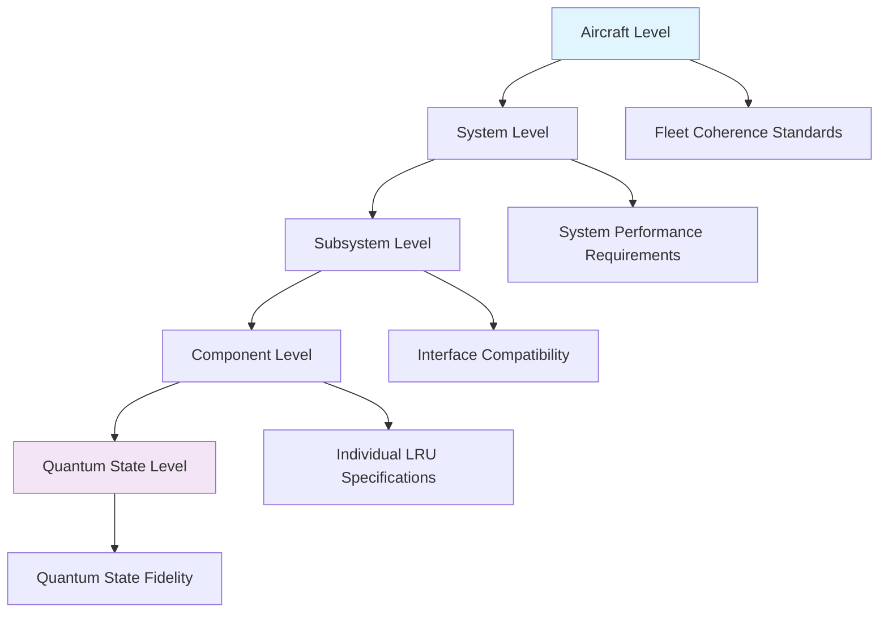
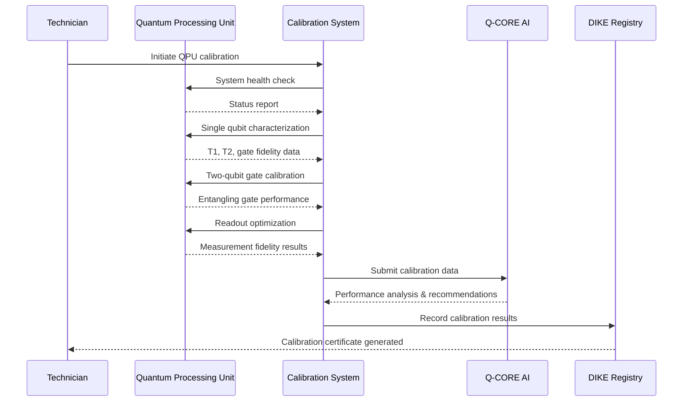
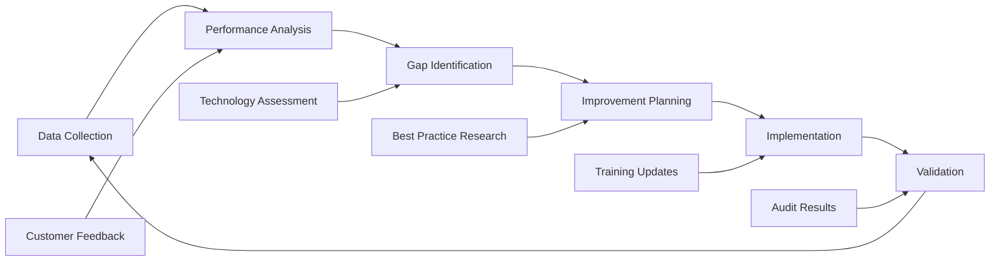

```yaml
---
project: GAIA-QAO-AdVent
program: AMPEL360 BWB-Q100
ATA_chapter: 05-90-00-00
doc_id: GQOIS-QAIR-ATA-05900000
version: 3.0.0
date: 2025-07-01
author: Amedeo Pelliccia
status: Final Draft
classification: GAIA-QAO Confidential
review_board: [Q-AIR-SAFETY, Q-DATAGOV, EASA-LIAISON]
info_code: QC # Quantum Calibration
next_review_date: 2026-06-30
---
```

# ATA 05-90-00-00 — Quantum Calibration Overview

<p align="center">
  
  
  
  
  
</p>

---

## 1. Introduction

### 1.1. Purpose
This document establishes the comprehensive framework for quantum system calibration procedures on the AMPEL360 BWB-Q100. It defines the calibration philosophy, methodologies, and requirements that ensure quantum systems maintain optimal performance, measurement accuracy, and operational reliability throughout the aircraft's service life.

### 1.2. Scope
This overview encompasses all quantum-enhanced systems requiring periodic calibration, including:
- Quantum Processing Units (QPUs)
- Quantum Telemetry Mesh (QTM) sensors
- Quantum Navigation Systems (QNS)
- Quantum Communication Systems (QCS)
- Quantum Structural Monitoring (QSM) networks
- Quantum-classical interface systems

### 1.3. Quantum Calibration Philosophy
The GAIA-QAO quantum calibration approach is founded on three core principles:

**1. Coherence Preservation:** All calibration procedures prioritize maintaining quantum coherence while achieving measurement accuracy
**2. Environmental Adaptation:** Calibration protocols adapt to operational environmental conditions
**3. Predictive Maintenance:** Calibration schedules optimize based on system performance trends and environmental factors

---

## 2. Quantum Calibration Framework

### 2.1. Calibration Hierarchy



### 2.2. Calibration Categories

#### 2.2.1. Temporal Classification
| Category | Frequency | Duration | Scope | Environmental Requirements |
|:---------|:----------|:---------|:------|:---------------------------|
| **Daily** | Every 24 hours | 30-45 minutes | Critical quantum systems | Standard hangar conditions |
| **Weekly** | Every 7 days | 2-3 hours | All quantum systems | Controlled environment |
| **Monthly** | Every 30 days | 6-8 hours | Complete quantum suite | Precision calibration facility |
| **Quarterly** | Every 90 days | 12-16 hours | System integration verification | Environmental chamber |
| **Annual** | Yearly | 24-48 hours | Full system recertification | NIST-traceable standards |

#### 2.2.2. Functional Classification
| Type | Purpose | Systems Affected | Calibration Method |
|:-----|:--------|:----------------|:-------------------|
| **Baseline** | Establish reference states | All quantum systems | Quantum state tomography |
| **Operational** | Maintain performance | Active systems | In-service verification |
| **Corrective** | Address drift/degradation | Affected systems | Targeted recalibration |
| **Predictive** | Prevent future issues | Risk-assessed systems | Proactive adjustment |
| **Verification** | Confirm accuracy | Post-maintenance systems | Independent measurement |

### 2.3. Quantum-Specific Calibration Challenges

#### 2.3.1. Decoherence Management
**Challenge:** Quantum states are extremely fragile and susceptible to environmental disturbances
**Solution:** 
- Rapid calibration protocols (<coherence time)
- Environmental isolation during calibration
- Real-time decoherence monitoring
- Adaptive calibration algorithms

#### 2.3.2. Measurement Disturbance
**Challenge:** Quantum measurements inherently disturb the system being measured
**Solution:**
- Non-destructive measurement techniques where possible
- Quantum non-demolition (QND) measurements
- Statistical ensemble measurements
- Indirect state verification methods

#### 2.3.3. Environmental Sensitivity
**Challenge:** Quantum systems are highly sensitive to temperature, magnetic fields, and vibration
**Solution:**
- Environmental monitoring and compensation
- Calibration in controlled conditions
- Temperature-dependent calibration curves
- Magnetic field mapping and shielding verification

---

## 3. Calibration Standards & References

### 3.1. Primary Quantum Standards

#### 3.1.1. NIST Quantum Standards Integration
The AMPEL360 quantum calibration program maintains traceability to national standards:

| Quantum Property | NIST Standard | Traceability Method | Uncertainty Budget |
|:-----------------|:--------------|:-------------------|:-------------------|
| **Frequency** | NIST-F2 Cesium Fountain | Direct frequency comparison | ±1 × 10^-16 |
| **Time** | UTC(NIST) | GPS disciplined oscillators | ±10 ns |
| **Magnetic Field** | NIST Magnetic Standards | Gaussmeter calibration | ±0.01% |
| **Temperature** | ITS-90 Scale | Platinum resistance thermometry | ±1 mK |
| **Voltage** | Josephson Voltage Standard | Quantum voltage transfer | ±10 nV |

#### 3.1.2. Quantum-Specific Reference Standards
**Quantum State References:**
- Single photon sources with >99.9% purity
- Entangled photon pairs with >95% fidelity
- Coherent atomic ensembles
- Quantum error syndrome generators
- Bell state measurement references

### 3.2. Secondary Standards & Working References

#### 3.2.1. Onboard Reference Systems
**Atomic Clock References:**
```yaml
System: Quantum Atomic Clock (QAC-360)
Purpose: Onboard time/frequency reference
Specifications:
  - Stability: 1 × 10^-15 @ 1 second averaging
  - Accuracy: ±1 × 10^-14 referenced to UTC
  - Drift: <1 × 10^-16 per day
  - Environmental compensation: Active
  - Calibration interval: 90 days

Calibration Protocol:
  1. GPS time comparison (daily)
  2. Rubidium oscillator cross-reference (weekly)
  3. NIST time service comparison (monthly)
  4. Laboratory frequency comparison (quarterly)
```

**Quantum Voltage Standards:**
```yaml
System: Josephson Junction Array (JJA-360)
Purpose: Quantum voltage reference
Specifications:
  - Voltage range: ±10V
  - Resolution: 1 nV
  - Accuracy: ±10 nV
  - Temperature coefficient: <0.1 nV/K
  - Calibration interval: 30 days

Calibration Protocol:
  1. Junction characterization
  2. Microwave frequency verification
  3. Temperature coefficient measurement
  4. Long-term stability assessment
```

---

## 4. Environmental Requirements

### 4.1. Calibration Environment Specifications

#### 4.1.1. Standard Calibration Environment
**Hangar Calibration Requirements:**
| Parameter | Requirement | Tolerance | Monitoring Method |
|:----------|:------------|:----------|:------------------|
| **Temperature** | 20°C ± 2°C | ±0.1°C stability | RTD sensors, 1 Hz sampling |
| **Humidity** | 45% ± 5% RH | ±1% RH stability | Capacitive sensors |
| **Pressure** | Ambient ± 5% | ±0.1% stability | Precision barometers |
| **Magnetic Field** | <1 μT variations | ±10 nT | Fluxgate magnetometers |
| **Vibration** | <0.01g RMS | 0.1-100 Hz band | Accelerometer array |
| **EMI** | <-60 dBm | 1 MHz-40 GHz | Spectrum analyzers |

#### 4.1.2. Precision Calibration Facility
**Laboratory-Grade Environment:**
| Parameter | Requirement | Tolerance | Special Conditions |
|:----------|:------------|:----------|:-------------------|
| **Temperature** | 20°C ± 0.1°C | ±0.01°C stability | Class 10 cleanroom |
| **Humidity** | 45% ± 1% RH | ±0.1% RH stability | Molecular sieve dryers |
| **Pressure** | 1013.25 hPa ± 0.1% | ±0.01% stability | Pressure regulation |
| **Magnetic Field** | <100 nT | ±1 nT stability | Mu-metal shielding |
| **Vibration** | <0.001g RMS | Isolation tables | Pneumatic isolation |
| **EMI** | <-80 dBm | Faraday cage | RF-sealed enclosure |

### 4.2. Environmental Monitoring & Compensation

#### 4.2.1. Real-Time Environmental Monitoring
```yaml
System: Environmental Monitoring Network (EMN-360)
Purpose: Continuous environmental parameter tracking
Coverage: All calibration locations

Sensor Network:
  - Temperature: 50+ distributed RTD sensors
  - Humidity: 20+ capacitive sensors  
  - Pressure: 10+ precision barometers
  - Magnetic field: 30+ 3-axis magnetometers
  - Vibration: 40+ triaxial accelerometers
  - EMI: 12+ broadband EMI monitors

Data Processing:
  - Sampling rate: 1-10 Hz per parameter
  - Data fusion: Kalman filtering
  - Anomaly detection: Statistical process control
  - Trending analysis: Machine learning algorithms
  - Compensation: Real-time parameter adjustment
```

#### 4.2.2. Environmental Compensation Algorithms
**Temperature Compensation:**
```python
# Pseudo-code for temperature compensation
def temperature_compensate(measurement, temp, ref_temp=20.0):
    """
    Compensate quantum measurement for temperature drift
    """
    temp_coeff = get_temperature_coefficient(measurement_type)
    compensation = temp_coeff * (temp - ref_temp)
    compensated_value = measurement * (1 + compensation)
    
    return compensated_value, calculate_uncertainty(compensation)
```

---

## 5. Quantum System Calibration Procedures

### 5.1. Quantum Processing Unit (QPU) Calibration

#### 5.1.1. QPU Performance Metrics
| Metric | Specification | Measurement Method | Calibration Frequency |
|:-------|:-------------|:-------------------|:---------------------|
| **Gate Fidelity** | >99.9% (1-qubit), >99.5% (2-qubit) | Randomized benchmarking | Daily |
| **Coherence Time T1** | >100 μs | Exponential decay measurement | Daily |
| **Coherence Time T2** | >50 μs | Ramsey interferometry | Daily |
| **Readout Fidelity** | >99.8% | State preparation and measurement | Daily |
| **Cross-Talk** | <0.1% between qubits | Simultaneous gate operations | Weekly |

#### 5.1.2. QPU Calibration Workflow


### 5.2. Quantum Sensor Calibration

#### 5.2.1. Quantum Magnetometer Calibration
```yaml
Procedure: QMAG-CAL-001
System: Quantum Magnetometers (NV Centers in Diamond)
Duration: 45 minutes
Frequency: Weekly

Calibration Steps:
  1. Environmental baseline establishment
     - Background magnetic field measurement
     - Temperature stabilization verification
     - Vibration level assessment
     - EMI noise floor characterization
  
  2. Sensor initialization
     - NV center ensemble preparation
     - Microwave pulse calibration
     - Optical excitation optimization
     - Readout laser alignment
  
  3. Sensitivity calibration
     - Known field application (1 nT to 1 mT range)
     - Response linearity verification
     - Dynamic range assessment
     - Noise equivalent magnetic field measurement
  
  4. Directional calibration
     - X, Y, Z axis sensitivity matching
     - Angular response characterization
     - Cross-axis sensitivity measurement
     - Orientation matrix determination

Performance Verification:
  - Sensitivity: <1 pT/√Hz @ 1 Hz
  - Bandwidth: DC to 10 kHz
  - Dynamic range: >140 dB
  - Angular accuracy: <0.1°
```

#### 5.2.2. Quantum Accelerometer Calibration
```yaml
Procedure: QACC-CAL-002
System: Quantum Accelerometers (Cold Atom Interferometry)
Duration: 60 minutes
Frequency: Weekly

Calibration Protocol:
  1. Atomic source preparation
     - Laser cooling system verification
     - Atom trap loading efficiency
     - Temperature achievement (<1 μK)
     - Atomic density optimization
  
  2. Interferometer alignment
     - Laser beam alignment verification
     - Phase stability measurement
     - Pulse timing optimization
     - Contrast maximization
  
  3. Sensitivity calibration
     - Gravity reference measurement
     - Known acceleration application
     - Scale factor determination
     - Noise floor characterization
  
  4. Environmental compensation
     - Temperature coefficient measurement
     - Magnetic field sensitivity assessment
     - Vibration isolation verification
     - Systematic error identification

Acceptance Criteria:
  - Sensitivity: <10 ng/√Hz
  - Bias stability: <1 μg over 1000 s
  - Scale factor accuracy: <10 ppm
  - Bandwidth: DC to 1 kHz
```

### 5.3. Quantum Communication System Calibration

#### 5.3.1. Quantum Key Distribution Calibration
```yaml
Procedure: QKD-CAL-003
System: Quantum Key Distribution
Duration: 90 minutes
Frequency: Daily

Calibration Sequence:
  1. Single photon source characterization
     - Photon purity verification (>99.9%)
     - Wavelength stability check (±0.01 nm)
     - Polarization state preparation
     - Timing jitter measurement (<10 ps)
  
  2. Quantum channel characterization
     - Transmission loss measurement
     - Polarization drift assessment
     - Environmental sensitivity evaluation
     - Security parameter verification
  
  3. Detection system calibration
     - Single photon detector efficiency
     - Dark count rate measurement
     - Timing resolution verification
     - Detection threshold optimization
  
  4. Protocol implementation verification
     - BB84 protocol compliance
     - Error correction performance
     - Privacy amplification efficiency
     - Key generation rate optimization

Performance Targets:
  - Raw key rate: >1 Mbps @ 10 km
  - Quantum bit error rate: <11%
  - Detection efficiency: >90%
  - Secure key rate: >100 kbps
```

---

## 6. Calibration Documentation & Traceability

### 6.1. DIKE Registry Integration

#### 6.1.1. Calibration Record Structure
```json
{
  "calibration_record": {
    "record_id": "CAL-YYYY-MM-DD-HH-MM-SS-UUID",
    "aircraft_registration": "N360QA",
    "calibration_type": "daily|weekly|monthly|quarterly|annual",
    "system_id": "ATA_system_designation",
    "component_serial": "quantum_component_serial_number",
    "technician_id": "blockchain_verified_technician_id",
    "procedure_reference": "calibration_procedure_document_id",
    "start_timestamp": "ISO8601_datetime",
    "end_timestamp": "ISO8601_datetime",
    "environmental_conditions": {
      "temperature": {"value": 20.1, "unit": "celsius", "uncertainty": 0.1},
      "humidity": {"value": 45.2, "unit": "percent_rh", "uncertainty": 0.5},
      "pressure": {"value": 1013.2, "unit": "hPa", "uncertainty": 0.1},
      "magnetic_field": {"value": 0.05, "unit": "microTesla", "uncertainty": 0.01}
    },
    "calibration_results": {
      "measurements": [],
      "pass_fail_status": "PASS|FAIL|CONDITIONAL",
      "performance_metrics": {},
      "uncertainty_budget": {},
      "next_calibration_due": "ISO8601_datetime"
    },
    "standards_used": [
      {
        "standard_id": "reference_standard_identifier",
        "calibration_date": "ISO8601_date",
        "traceability_chain": "NIST|NPL|PTB",
        "uncertainty": "measurement_uncertainty"
      }
    ],
    "deviations": [],
    "corrective_actions": [],
    "verification_signature": "digital_signature",
    "approval_signature": "supervisor_digital_signature"
  }
}
```

#### 6.1.2. Blockchain Verification
**Immutable Calibration Records:**
- Each calibration record receives a unique blockchain hash
- Multi-party verification through consensus mechanism
- Tamper-evident record modification detection
- Automated compliance verification
- Smart contract-based calibration scheduling

### 6.2. Regulatory Compliance Documentation

#### 6.2.1. Airworthiness Compliance
**EASA/FAA Requirements:**
```yaml
Compliance Framework: AWC-QCAL-001
Purpose: Demonstrate airworthiness compliance
Scope: All quantum system calibrations

Required Documentation:
  1. Calibration procedures (approved by authorities)
  2. Standards traceability certificates
  3. Technician qualifications and training records
  4. Equipment calibration certificates
  5. Statistical process control data
  6. Corrective action reports
  7. Management review records

Audit Trail Requirements:
  - Complete calibration history
  - Change control documentation
  - Non-conformance reports
  - Continuous improvement evidence
  - Management system effectiveness
```

---

## 7. Quality Assurance & Measurement Uncertainty

### 7.1. Measurement Uncertainty Analysis

#### 7.1.1. Uncertainty Budget Components
| Source | Type A (Statistical) | Type B (Systematic) | Combined Uncertainty |
|:-------|:-------------------|:-------------------|:-------------------|
| **Reference Standards** | ±0.01% | ±0.02% | ±0.022% |
| **Environmental Conditions** | ±0.05% | ±0.03% | ±0.058% |
| **Measurement Repeatability** | ±0.02% | ±0.01% | ±0.022% |
| **Calibration Equipment** | ±0.01% | ±0.015% | ±0.018% |
| **Operator Effects** | ±0.005% | ±0.01% | ±0.011% |
| **Long-term Stability** | ±0.01% | ±0.02% | ±0.022% |

**Combined Standard Uncertainty:** ±0.087%
**Expanded Uncertainty (k=2, 95% confidence):** ±0.174%

#### 7.1.2. Uncertainty Propagation
```python
# Quantum measurement uncertainty propagation
import numpy as np

def calculate_quantum_uncertainty(measurement_data, environmental_data):
    """
    Calculate measurement uncertainty for quantum calibration
    """
    # Type A uncertainty (statistical)
    type_a = np.std(measurement_data) / np.sqrt(len(measurement_data))
    
    # Type B uncertainty (systematic)
    type_b_sources = {
        'temperature': temp_uncertainty(environmental_data['temperature']),
        'magnetic_field': field_uncertainty(environmental_data['mag_field']),
        'vibration': vibration_uncertainty(environmental_data['vibration']),
        'reference_standard': 0.02e-2  # 0.02% systematic
    }
    
    type_b = np.sqrt(sum([u**2 for u in type_b_sources.values()]))
    
    # Combined uncertainty
    combined = np.sqrt(type_a**2 + type_b**2)
    
    # Expanded uncertainty (k=2)
    expanded = 2 * combined
    
    return {
        'type_a': type_a,
        'type_b': type_b,
        'combined': combined,
        'expanded': expanded,
        'sources': type_b_sources
    }
```

### 7.2. Statistical Process Control

#### 7.2.1. Control Chart Implementation
**Quantum System Performance Monitoring:**
```yaml
Control Charts: SPC-QCAL-001
Purpose: Monitor calibration process stability
Update Frequency: After each calibration

Chart Types:
  1. Individual-Moving Range (I-MR) Charts
     - Individual measurements vs. time
     - Moving range for process variation
     - Control limits: ±3σ from centerline
     - Specification limits overlay
  
  2. X-bar and R Charts
     - Sample means and ranges
     - Subgroup size: 5 measurements
     - Control limits based on historical data
     - Process capability indices (Cp, Cpk)
  
  3. CUSUM Charts
     - Cumulative sum of deviations
     - Early detection of process shifts
     - Decision intervals: ±5σ
     - Reset after out-of-control conditions

Action Rules:
  - Single point beyond control limits
  - 7+ consecutive points on one side of centerline
  - 2+ consecutive points beyond 2σ limits
  - Trends: 6+ consecutive increasing/decreasing points
```

---

## 8. Training & Certification

### 8.1. Quantum Calibration Specialist Program

#### 8.1.1. Core Competency Requirements
```yaml
Certification: Quantum Calibration Specialist (QCS)
Duration: 160 hours (4 weeks)
Prerequisites: Advanced maintenance certification + quantum physics fundamentals

Training Modules:
  Module 1: Quantum Metrology Fundamentals (40 hours)
    - Quantum measurement theory
    - Uncertainty principles and limitations
    - Quantum standards and traceability
    - Environmental effects on quantum systems
  
  Module 2: Quantum System Calibration (48 hours)
    - QPU calibration procedures
    - Quantum sensor calibration
    - Quantum communication system setup
    - Multi-system integration calibration
  
  Module 3: Measurement Standards & Traceability (32 hours)
    - NIST quantum standards
    - International measurement system
    - Uncertainty analysis and budgets
    - Statistical process control
  
  Module 4: Safety & Regulatory Compliance (24 hours)
    - Quantum system safety protocols
    - Regulatory requirements (EASA/FAA)
    - Documentation and record keeping
    - Quality management systems
  
  Module 5: Hands-On Practicum (16 hours)
    - Equipment operation
    - Procedure execution
    - Data analysis and interpretation
    - Report generation and certification

Assessment:
  - Written examination: >90% pass rate
  - Practical demonstration: Competency in all procedures
  - Safety assessment: 100% compliance
  - Certification project: Independent calibration verification
```

#### 8.1.2. Continuing Education Requirements
```yaml
Program: QCS Continuing Education
Frequency: Quarterly updates, annual recertification

Quarterly Requirements (12 hours):
  - New technology and procedure updates
  - Measurement uncertainty workshops
  - Statistical analysis training
  - Regulatory compliance updates
  - Case studies and lessons learned

Annual Recertification (40 hours):
  - Comprehensive knowledge assessment
  - Practical skills demonstration
  - Equipment proficiency verification
  - Quality system audit participation
  - Professional development planning

Specialization Tracks:
  - Advanced Quantum Metrology (80 hours)
  - Quantum Communication Systems (60 hours)
  - Statistical Process Control (40 hours)
  - Regulatory Affairs (50 hours)
```

---

## 9. Performance Monitoring & Continuous Improvement

### 9.1. Calibration Performance Metrics

#### 9.1.1. Key Performance Indicators
| Metric | Definition | Target | Current | Trend |
|:-------|:-----------|:-------|:--------|:------|
| **Calibration Success Rate** | Percentage of calibrations completed successfully | >99% | 99.3% | ✅ |
| **Measurement Uncertainty** | Average expanded uncertainty across all systems | <0.2% | 0.174% | ✅ |
| **Calibration Cycle Time** | Average time to complete calibration procedures | <4 hours | 3.2 hours | ✅ |
| **Equipment Availability** | Percentage of time calibration equipment is operational | >98% | 98.9% | ✅ |
| **Traceability Compliance** | Percentage of measurements with valid traceability | 100% | 100% | ✅ |
| **Technician Efficiency** | Calibrations completed per technician-day | 4 per day | 4.3 per day | 📈 |
| **Cost per Calibration** | Total cost including labor and equipment | <$2000 | $1847 | ✅ |
| **Customer Satisfaction** | Rating from aircraft operators | >4.5/5 | 4.7/5 | ✅ |

#### 9.1.2. Quantum-Specific Performance Metrics
| Quantum Metric | Definition | Target | Current | Status |
|:---------------|:-----------|:-------|:--------|:-------|
| **Quantum Fidelity** | Average quantum state fidelity after calibration | >99.9% | 99.94% | ✅ |
| **Coherence Time Stability** | Variation in coherence time measurements | <5% | 3.2% | ✅ |
| **Environmental Sensitivity** | Calibration stability under environmental variations | <0.1%/°C | 0.08%/°C | ✅ |
| **Quantum Error Rate** | Post-calibration quantum error rates | <0.1% | 0.07% | ✅ |

### 9.2. Continuous Improvement Process

#### 9.2.1. Performance Review Cycle


#### 9.2.2. Innovation Integration
**Emerging Technology Assessment:**
```yaml
Process: Innovation Assessment for Quantum Calibration
Frequency: Semi-annual review

Evaluation Areas:
  1. Advanced quantum standards
     - Improved atomic clocks
     - Enhanced quantum voltage standards
     - Novel quantum sensors
     - Better reference materials
  
  2. Measurement techniques
     - Non-destructive quantum measurements
     - Faster calibration protocols
     - Automated calibration systems
     - AI-enhanced uncertainty analysis
  
  3. Environmental control
     - Better isolation systems
     - Advanced temperature control
     - Magnetic field compensation
     - Vibration reduction methods

Implementation Criteria:
  - Technical merit and maturity
  - Cost-benefit analysis
  - Integration complexity
  - Training requirements
  - Regulatory acceptance path
```

---

## 10. References & Standards

### 10.1. International Standards
- **ISO/IEC 17025:2017** — General requirements for testing and calibration laboratories
- **JCGM 100:2008** — Evaluation of measurement data — Guide to expression of uncertainty
- **JCGM 200:2012** — International vocabulary of metrology — Basic concepts
- **IEEE 1451** — Standard for Smart Transducer Interface
- **NIST SP 250** — NIST Measurement Services

### 10.2. Aviation-Specific Standards
- **RTCA DO-178C** — Software considerations in airborne systems
- **RTCA DO-254** — Design assurance guidance for airborne electronic hardware
- **EASA CS-25** — Certification specifications for large aeroplanes
- **FAA AC 43.13-1B** — Acceptable methods, techniques, and practices

### 10.3. Quantum Standards & References
- **NIST SP 800-208** — Recommendation for stateful hash-based signature schemes
- **ITU-T Y.3800** — Overview on networks supporting quantum key distribution
- **ETSI GS QKD 002** — Quantum key distribution use cases
- **ISO/IEC 23837** — Security requirements, test and evaluation methods for quantum key distribution

---

## Document History

| Version | Date | Author | Changes |
|:--------|:-----|:-------|:--------|
| 1.0.0 | 2025-02-01 | A. Pelliccia | Initial release with basic quantum calibration framework |
| 2.0.0 | 2025-05-01 | A. Pelliccia | Added detailed procedures and NIST traceability |
| 3.0.0 | 2025-07-01 | A. Pelliccia | Comprehensive revision with advanced procedures, SPC, and continuous improvement |

---

*This document establishes the foundation for quantum calibration excellence in aerospace applications, ensuring that the AMPEL360 BWB-Q100's quantum systems maintain the highest levels of accuracy, reliability, and performance throughout their operational life.*
