---
project: GAIA-QAO-AdVent
program: AMPEL360 BWB-Q100
ATA_chapter: 05-90-10-00
doc_id: GQOIS-QAIR-ATA-05901000
version: 3.0.0
date: 2025-07-01
author: Amedeo Pelliccia
status: Final Draft
classification: GAIA-QAO Confidential
review_board: [Q-AIR-SAFETY, Q-DATAGOV, EASA-LIAISON]
info_code: QG # QPU General
next_review_date: 2026-06-30
parent_document: GQOIS-QAIR-ATA-05900000
---


# ATA 05-90-10-00 — QPU Calibration General

<p align="center">
  
  
  
  
  
</p>

---

## 1. Introduction

### 1.1. Purpose
This document establishes comprehensive calibration procedures for Quantum Processing Units (QPUs) integrated into the AMPEL360 BWB-Q100. It provides detailed methodologies for maintaining quantum computational accuracy, gate fidelity, and operational reliability essential for flight-critical quantum-enhanced systems.

### 1.2. Scope
These procedures apply to all QPU installations throughout the aircraft, including:
- Primary Flight Control QPU (Q-FCS-001)
- Navigation Optimization QPU (Q-NAV-002) 
- Propulsion Control QPU (Q-ENG-003)
- Structural Monitoring QPU (Q-SHM-004)
- Communication Security QPU (Q-SEC-005)
- Central Diagnostic QPU (Q-DIAG-006)

### 1.3. QPU Technology Overview
The AMPEL360 employs superconducting transmon-based QPUs operating at cryogenic temperatures, featuring:
- **64 Physical Qubits** per unit with full connectivity
- **Quantum Error Correction** using surface codes
- **Coherence Times:** T1 > 100 μs, T2 > 50 μs
- **Gate Fidelities:** >99.9% (single), >99.5% (two-qubit)
- **Operating Temperature:** 15 mK (dilution refrigerator)

---

## 2. QPU Architecture & Calibration Points

### 2.1. QPU System Architecture


### 2.2. Calibration Parameter Hierarchy

#### 2.2.1. Qubit-Level Parameters
| Parameter | Target Value | Tolerance | Measurement Method | Calibration Frequency |
|:----------|:-------------|:----------|:-------------------|:---------------------|
| **Qubit Frequency** | Design value ± 100 MHz | ±1 MHz | Spectroscopy | Daily |
| **Anharmonicity** | -200 to -300 MHz | ±10 MHz | Two-tone spectroscopy | Weekly |
| **T1 (Relaxation Time)** | >100 μs | >80 μs minimum | Exponential decay | Daily |
| **T2* (Dephasing Time)** | >50 μs | >40 μs minimum | Ramsey interferometry | Daily |
| **T2 (Echo Time)** | >70 μs | >50 μs minimum | Hahn echo | Weekly |

#### 2.2.2. Gate-Level Parameters
| Gate Type | Fidelity Target | Tolerance | Duration | Calibration Method |
|:----------|:----------------|:----------|:---------|:-------------------|
| **Single-Qubit X/Y** | >99.9% | >99.5% minimum | <20 ns | Randomized benchmarking |
| **Single-Qubit Z** | >99.95% | >99.8% minimum | Virtual gate | Process tomography |
| **Two-Qubit CNOT** | >99.5% | >99.0% minimum | <200 ns | Interleaved RB |
| **Two-Qubit CZ** | >99.7% | >99.2% minimum | <150 ns | Process tomography |

#### 2.2.3. Readout Parameters
| Parameter | Specification | Tolerance | Measurement | Frequency |
|:----------|:-------------|:----------|:------------|:----------|
| **Readout Fidelity** | >99.8% | >99.5% minimum | State preparation/measurement | Daily |
| **Assignment Fidelity** | >99.9% | >99.7% minimum | Confusion matrix | Daily |
| **Readout Duration** | <1 μs | <2 μs maximum | Time-resolved measurement | Weekly |
| **SNR** | >10 dB | >8 dB minimum | Signal/noise analysis | Daily |

---

## 3. Calibration Procedures Framework

### 3.1. Calibration Workflow Overview

```mermaid
sequenceDiagram
    participant Tech as Technician
    participant Control as Control System
    participant QPU as QPU Hardware
    participant Cryo as Cryogenic System
    participant Cal as Calibration Software
    participant DIKE as DIKE Registry

    Tech->>Control: Initiate calibration sequence
    Control->>Cryo: Verify temperature stability
    Cryo-->>Control: Temperature within spec (15±0.1 mK)
    
    Control->>QPU: System health check
    QPU-->>Control: All systems nominal
    
    Control->>Cal: Begin automated calibration
    
    loop Qubit Characterization
        Cal->>QPU: Spectroscopy sweep
        QPU-->>Cal: Frequency response
        Cal->>QPU: T1/T2 measurements
        QPU-->>Cal: Coherence data
    end
    
    loop Gate Calibration
        Cal->>QPU: Pulse optimization
        QPU-->>Cal: Gate performance metrics
        Cal->>QPU: Cross-talk characterization
        QPU-->>Cal: Isolation measurements
    end
    
    loop Readout Optimization
        Cal->>QPU: Readout pulse tuning
        QPU-->>Cal: Fidelity measurements
    end
    
    Cal->>DIKE: Upload calibration results
    DIKE-->>Tech: Calibration certificate
    
    Note over Tech,DIKE: Total calibration time: 30-45 minutes (daily)
```



### 3.2. Environmental Prerequisites

#### 3.2.1. Cryogenic System Requirements
```yaml
System: Dilution Refrigerator (DR-QPU-360)
Base Temperature: 15 mK ± 0.1 mK
Cooling Power: 2 mW @ 100 mK
Temperature Stability: <1 mK/hour drift

Prerequisites for Calibration:
  1. Temperature stability verification
     - Base temperature: 15 mK ± 0.1 mK
     - Mixing chamber: <10 mK
     - Still temperature: <600 mK
     - 4K stage: <4.2 K
  
  2. Vibration isolation
     - Building vibration: <0.1 μm RMS
     - Cryostat isolation: Active system operational
     - Pulse tube isolation: Decoupled from QPU
  
  3. Magnetic field environment
     - Ambient field: <1 μT
     - Magnetic shielding: >60 dB @ DC
     - Field stability: <10 nT/hour
  
  4. Electromagnetic interference
     - RF environment: <-120 dBm/Hz @ QPU frequencies
     - Microwave leakage: <-80 dBm
     - Digital noise: Isolated control lines
```

#### 3.2.2. Control Electronics Verification
```yaml
System: QPU Control Electronics (QCE-360)
Purpose: Classical control of quantum operations

Pre-Calibration Checks:
  1. Microwave generators
     - Frequency accuracy: ±1 kHz
     - Phase noise: <-90 dBc/Hz @ 1 kHz offset
     - Amplitude stability: ±0.01 dB
     - Output power: Calibrated to ±0.1 dB
  
  2. Arbitrary waveform generators
     - Sampling rate: 2 GS/s
     - Resolution: 16-bit
     - SFDR: >70 dBc
     - Jitter: <1 ps RMS
  
  3. Digitizer systems
     - Sampling rate: 1 GS/s
     - Bandwidth: 500 MHz
     - Dynamic range: >60 dB
     - ADC resolution: 14-bit effective
  
  4. Timing synchronization
     - Master clock: 10 MHz ± 1 Hz
     - Phase noise: <-100 dBc/Hz @ 1 kHz
     - Skew between channels: <100 ps
     - Jitter: <1 ps RMS
```

---

## 4. QPU Calibration Procedures

### 4.1. Daily Calibration Protocol

#### 4.1.1. Quick Health Check (15 minutes)
```yaml
Procedure: QPU-DAILY-HC-001
Purpose: Verify basic QPU operational status
Frequency: Every 24 hours
Prerequisites: System at base temperature

Health Check Sequence:
  1. Temperature verification (2 minutes)
     - Base temperature: 15 mK ± 0.1 mK
     - Gradient check across chip: <5 mK
     - Cooling power headroom: >20%
  
  2. Qubit frequency check (5 minutes)
     - Rapid spectroscopy scan for all qubits
     - Frequency drift: <1 MHz from last calibration
     - Identify any qubits requiring recalibration
  
  3. Basic gate fidelity spot check (5 minutes)
     - Single-qubit X/Y gates on 5 representative qubits
     - Two-qubit CNOT gates on 3 representative pairs
     - Minimum acceptable fidelity: >99.0%
  
  4. Readout verification (3 minutes)
     - State preparation and measurement on all qubits
     - Readout fidelity: >99.5%
     - Signal-to-noise ratio: >8 dB

Pass/Fail Criteria:
  - All temperatures within specification: Required
  - Frequency drift <1 MHz: Required
  - Gate fidelities >99.0%: Required
  - Readout fidelity >99.5%: Required
  
Actions if Failed:
  - Minor drift: Schedule immediate recalibration
  - Major drift: Initiate diagnostic protocol
  - Hardware issues: Escalate to quantum engineer
```

#### 4.1.2. Automated Calibration Sequence (30 minutes)
```yaml
Procedure: QPU-DAILY-CAL-002
Purpose: Maintain optimal QPU performance
Frequency: Daily, after health check passes

Calibration Workflow:
  1. Qubit characterization (10 minutes)
     - Individual qubit spectroscopy
     - T1/T2 coherence time measurement
     - Optimal drive amplitude determination
     - Frequency tracking and drift compensation
  
  2. Single-qubit gate calibration (8 minutes)
     - Rabi oscillation measurements
     - Ramsey fringe analysis for Z rotations
     - DRAG pulse optimization for reduced leakage
     - Gate fidelity verification via randomized benchmarking
  
  3. Two-qubit gate calibration (10 minutes)
     - Cross-resonance calibration for CNOT gates
     - ZZ interaction strength measurement
     - Conditional phase gate optimization
     - Crosstalk characterization and mitigation
  
  4. Readout optimization (2 minutes)
     - Readout pulse amplitude/frequency tuning
     - Integration weight optimization
     - Measurement-induced state mixing check

Automated Analysis:
  - Statistical process control monitoring
  - Trend analysis for predictive maintenance
  - Performance comparison with fleet averages
  - Optimization recommendations
```

### 4.2. Weekly Calibration Protocol

#### 4.2.1. Comprehensive System Characterization (2 hours)
```yaml
Procedure: QPU-WEEKLY-CAL-003
Purpose: Deep characterization and optimization
Frequency: Every 7 days
Prerequisites: Daily calibration current

Extended Characterization:
  1. Complete qubit mapping (30 minutes)
     - Full spectroscopy sweep (4-8 GHz)
     - Anharmonicity measurement for each qubit
     - Power-dependent frequency shifts
     - Temperature coefficient determination
  
  2. Advanced coherence measurements (30 minutes)
     - T1 measurement with exponential fitting
     - T2* via Ramsey interferometry
     - T2 via Hahn echo sequences
     - Dynamical decoupling characterization
  
  3. Gate set tomography (45 minutes)
     - Complete process tomography for all gates
     - Pauli transfer matrix determination
     - Gate error decomposition analysis
     - Systematic error identification
  
  4. Cross-talk and crosstalk (15 minutes)
     - Simultaneous randomized benchmarking
     - Spectator qubit effects measurement
     - Parasitic interactions quantification
     - Isolation verification between qubits

Advanced Analysis:
  - Principal component analysis of error modes
  - Machine learning optimization of pulse parameters
  - Predictive modeling for maintenance scheduling
  - Comparison with theoretical models
```

#### 4.2.2. Quantum Error Correction Assessment
```yaml
Procedure: QPU-QEC-ASSESS-004
Purpose: Verify quantum error correction capability
Frequency: Weekly
Duration: 45 minutes

QEC Testing Protocol:
  1. Surface code syndrome extraction (15 minutes)
     - 7x7 surface code implementation
     - Syndrome extraction circuit fidelity
     - Error detection probability measurement
     - Logical error rate assessment
  
  2. Error correction performance (20 minutes)
     - Single-qubit error injection and correction
     - Two-qubit error injection and correction
     - Correlated error handling verification
     - Error propagation analysis
  
  3. Logical qubit operations (10 minutes)
     - Logical X, Y, Z gate implementation
     - Logical CNOT between encoded qubits
     - Logical measurement procedures
     - Magic state distillation protocols

Performance Metrics:
  - Physical error rate: <0.1% target
  - Logical error rate: <10^-6 target
  - Syndrome extraction fidelity: >99.9%
  - Error correction latency: <10 μs
```

### 4.3. Monthly Calibration Protocol

#### 4.3.1. Complete System Recalibration (6 hours)
```yaml
Procedure: QPU-MONTHLY-CAL-005
Purpose: Comprehensive system optimization
Frequency: Every 30 days
Prerequisites: Weekly calibration current

Comprehensive Recalibration:
  1. Hardware verification (1 hour)
     - Cryogenic system performance audit
     - RF electronics calibration verification
     - Control wiring resistance measurement
     - Shielding effectiveness assessment
  
  2. Chip-level characterization (2 hours)
     - Complete device physics modeling
     - Parasitic coupling matrix determination
     - Environmental sensitivity mapping
     - Aging effects quantification
  
  3. Full gate set optimization (2 hours)
     - Gradient-free optimization algorithms
     - Multi-parameter simultaneous optimization
     - Composite pulse sequence development
     - Noise-resilient gate design
  
  4. System integration testing (1 hour)
     - End-to-end algorithm execution
     - Classical-quantum interface verification
     - Real-time feedback loop testing
     - Performance under operational conditions

Documentation Requirements:
  - Complete calibration report generation
  - Performance trend analysis
  - Maintenance recommendations
  - Regulatory compliance verification
```

---

## 5. Calibration Standards & Traceability

### 5.1. Primary Quantum Standards

#### 5.1.1. Frequency References
```yaml
Primary Standard: Cesium Atomic Clock (CAC-QPU-360)
Accuracy: ±1 × 10^-15 referenced to UTC
Stability: ±1 × 10^-14 @ 1 second averaging
Traceability: NIST-F2 Cesium Fountain Clock

Calibration Chain:
  1. NIST primary frequency standard
  2. GPS disciplined rubidium oscillator
  3. Local cesium atomic clock
  4. 10 MHz distribution system
  5. QPU microwave synthesizers

Verification Protocol:
  - Daily GPS time comparison
  - Weekly rubidium cross-reference
  - Monthly NIST time service verification
  - Quarterly laboratory comparison
```

#### 5.1.2. Quantum State References
```yaml
Reference System: Quantum State Calibrator (QSC-360)
Purpose: Traceable quantum state preparation
Capabilities:
  - Known quantum states with >99.99% fidelity
  - Entangled state references
  - Mixed state preparations
  - Measurement basis calibration

Standard States:
  - Computational basis: |0⟩, |1⟩
  - Superposition states: |+⟩, |-⟩, |+i⟩, |-i⟩
  - Bell states: |Φ+⟩, |Φ-⟩, |Ψ+⟩, |Ψ-⟩
  - GHZ states for multi-qubit references
  - Thermal states at known temperatures

Traceability:
  - NIST quantum metrology division
  - International quantum standards committee
  - Cross-validation with other national labs
  - Certified reference materials program
```

### 5.2. Measurement Uncertainty Budget

#### 5.2.1. Uncertainty Sources Analysis
| Source Category | Type A (Statistical) | Type B (Systematic) | Combined |
|:----------------|:--------------------|:--------------------|:---------|
| **Frequency Standards** | ±1×10^-15 | ±5×10^-16 | ±1.1×10^-15 |
| **Temperature Fluctuations** | ±0.1 mK | ±0.05 mK | ±0.11 mK |
| **Microwave Power** | ±0.01 dB | ±0.02 dB | ±0.022 dB |
| **Timing Jitter** | ±0.5 ps | ±0.3 ps | ±0.58 ps |
| **Environmental EMI** | ±0.1% | ±0.05% | ±0.11% |
| **Quantum State Preparation** | ±0.01% | ±0.02% | ±0.022% |

#### 5.2.2. Uncertainty Propagation Model
```python
import numpy as np
from scipy.stats import norm

def calculate_calibration_uncertainty(measurements, environment):
    """
    Calculate measurement uncertainty for QPU calibration
    """
    # Type A uncertainty (statistical)
    mean_value = np.mean(measurements)
    std_dev = np.std(measurements, ddof=1)
    type_a = std_dev / np.sqrt(len(measurements))
    
    # Type B uncertainty sources (systematic)
    freq_uncertainty = 1.1e-15 * mean_value  # Frequency standard
    temp_uncertainty = 0.11e-3 * environment.temp_coefficient
    power_uncertainty = 0.022 * mean_value  # 0.022 dB
    timing_uncertainty = 0.58e-12 * environment.timing_sensitivity
    emi_uncertainty = 0.11e-2 * mean_value  # 0.11%
    
    # Combine Type B uncertainties
    type_b = np.sqrt(
        freq_uncertainty**2 +
        temp_uncertainty**2 +
        power_uncertainty**2 +
        timing_uncertainty**2 +
        emi_uncertainty**2
    )
    
    # Combined standard uncertainty
    combined = np.sqrt(type_a**2 + type_b**2)
    
    # Expanded uncertainty (k=2, 95% confidence)
    expanded = 2 * combined
    
    return {
        'mean': mean_value,
        'type_a': type_a,
        'type_b': type_b,
        'combined': combined,
        'expanded': expanded,
        'coverage_factor': 2,
        'confidence_level': 0.95
    }
```

---

## 6. Performance Monitoring & Quality Control

### 6.1. Statistical Process Control

#### 6.1.1. Control Chart Implementation
```yaml
SPC System: QPU-SPC-360
Purpose: Monitor calibration process stability
Update Frequency: Real-time during calibration

Control Charts:
  1. Individual-Moving Range (I-MR) Charts
     - Gate fidelity vs. time
     - Coherence times (T1, T2)
     - Readout fidelity measurements
     - Control limits: ±3σ from process mean
  
  2. X-bar and R Charts
     - Multiple qubit performance
     - Subgroup size: 5 qubits
     - Sample frequency: Every calibration
     - Process capability indices (Cp, Cpk)
  
  3. CUSUM Charts
     - Cumulative sum of fidelity deviations
     - Early detection of process shifts
     - Decision intervals: ±5σ
     - Reset after out-of-control signals

Alert Conditions:
  - Single point beyond control limits
  - 7+ consecutive points on one side of centerline
  - 2+ points beyond 2σ limits
  - Trends: 6+ consecutive increasing/decreasing points
```

#### 6.1.2. Process Capability Analysis
```python
def calculate_process_capability(data, specification_limits):
    """
    Calculate process capability indices for QPU performance
    """
    mean = np.mean(data)
    std_dev = np.std(data, ddof=1)
    
    USL = specification_limits['upper']  # Upper specification limit
    LSL = specification_limits['lower']  # Lower specification limit
    
    # Process capability indices
    Cp = (USL - LSL) / (6 * std_dev)  # Process capability
    Cpk = min((USL - mean) / (3 * std_dev), 
              (mean - LSL) / (3 * std_dev))  # Process capability adjusted for centering
    
    # Performance indices
    Pp = (USL - LSL) / (6 * np.std(data))  # Process performance
    Ppk = min((USL - mean) / (3 * np.std(data)), 
              (mean - LSL) / (3 * np.std(data)))  # Process performance adjusted
    
    # Sigma level
    sigma_level = 3 * min(Cpk, 1.0)  # Conservative estimate
    
    return {
        'Cp': Cp,
        'Cpk': Cpk,
        'Pp': Pp,
        'Ppk': Ppk,
        'sigma_level': sigma_level,
        'process_centered': abs(mean - (USL + LSL)/2) < (USL - LSL)/20
    }

# QPU performance targets
qpu_specs = {
    'gate_fidelity': {'lower': 0.995, 'upper': 1.000},
    'coherence_t1': {'lower': 80e-6, 'upper': None},  # seconds
    'coherence_t2': {'lower': 40e-6, 'upper': None},  # seconds
    'readout_fidelity': {'lower': 0.998, 'upper': 1.000}
}
```

### 6.2. Calibration Performance Metrics

#### 6.2.1. Key Performance Indicators
| Metric | Target | Current | Trend | Specification |
|:-------|:-------|:--------|:------|:-------------|
| **Gate Fidelity (1-qubit)** | >99.9% | 99.94% | ✅ | >99.5% minimum |
| **Gate Fidelity (2-qubit)** | >99.5% | 99.62% | ✅ | >99.0% minimum |
| **T1 Coherence Time** | >100 μs | 127 μs | ✅ | >80 μs minimum |
| **T2 Coherence Time** | >50 μs | 68 μs | ✅ | >40 μs minimum |
| **Readout Fidelity** | >99.8% | 99.89% | ✅ | >99.5% minimum |
| **Calibration Success Rate** | >99% | 99.7% | ✅ | >95% minimum |
| **Calibration Time** | <45 min | 38 min | ✅ | <60 min maximum |
| **Process Capability (Cpk)** | >1.33 | 1.45 | ✅ | >1.0 minimum |

#### 6.2.2. Fleet Performance Comparison
```yaml
Fleet Analysis: QPU-FLEET-ANALYSIS-001
Purpose: Compare individual QPU performance against fleet
Update Frequency: Weekly

Comparison Metrics:
  1. Performance ranking
     - Gate fidelity percentile ranking
     - Coherence time percentile ranking
     - Reliability percentile ranking
     - Overall performance score
  
  2. Drift rate analysis
     - Calibration frequency requirements
     - Performance degradation trends
     - Environmental sensitivity comparison
     - Maintenance prediction accuracy
  
  3. Best practices identification
     - High-performing unit analysis
     - Optimization parameter sharing
     - Maintenance schedule optimization
     - Training material updates

Reporting:
  - Monthly fleet performance summary
  - Quarterly trend analysis report
  - Annual reliability assessment
  - Continuous improvement recommendations
```

---

## 7. Troubleshooting & Diagnostics

### 7.1. Common Calibration Issues

#### 7.1.1. Calibration Failure Decision Tree


#### 7.1.2. Performance Degradation Analysis
```yaml
Diagnostic Protocol: QPU-DIAG-PERF-001
Purpose: Analyze performance degradation causes
Trigger: KPI below threshold for 3 consecutive calibrations

Analysis Sequence:
  1. Environmental factors (15 minutes)
     - Temperature stability review
     - Magnetic field variation check
     - Vibration level assessment
     - EMI environment analysis
  
  2. Hardware diagnostics (30 minutes)
     - Control electronics verification
     - Cable/connection resistance check
     - RF leakage measurement
     - Power supply stability test
  
  3. Quantum system analysis (45 minutes)
     - Detailed spectroscopy sweep
     - Noise spectroscopy
     - Cross-talk characterization
     - Decoherence source identification
  
  4. Corrective actions (variable)
     - Parameter optimization
     - Hardware replacement if required
     - Environmental improvements
     - Procedure updates

Root Cause Categories:
  - Environmental: 40% of cases
  - Hardware aging: 25% of cases
  - Calibration drift: 20% of cases
  - Procedure issues: 10% of cases
  - Unknown/other: 5% of cases
```

### 7.2. Emergency Procedures

#### 7.2.1. Rapid Recovery Protocol
```yaml
Emergency Protocol: QPU-EMERGENCY-001
Purpose: Rapid QPU recovery for mission-critical situations
Trigger: Complete calibration failure
Target: <2 hours to operational status

Emergency Sequence:
  1. Immediate assessment (15 minutes)
     - System status verification
     - Critical parameter check
     - Safety system verification
     - Backup system activation if available
  
  2. Quick calibration attempt (30 minutes)
     - Essential parameters only
     - Reduced accuracy acceptable
     - Minimum operational capability
     - Basic functionality verification
  
  3. Hardware substitution (60 minutes)
     - Backup QPU activation
     - System reconfiguration
     - Minimal calibration required
     - Operational verification
  
  4. Classical fallback (15 minutes)
     - Disable quantum enhancement
     - Classical control algorithms
     - Reduced performance mode
     - Safety verification

Success Criteria:
  - Gate fidelity >95% (reduced from 99.5%)
  - Basic quantum operations functional
  - Safety systems operational
  - Mission can continue with degraded performance
```

---

## 8. Documentation & Record Keeping

### 8.1. DIKE Registry Integration

#### 8.1.1. Calibration Record Structure
```json
{
  "qpu_calibration_record": {
    "record_id": "QPU-CAL-2025-07-01-001",
    "aircraft_registration": "N360QA",
    "qpu_unit_serial": "QPU-AMPEL360-001",
    "calibration_type": "daily|weekly|monthly",
    "technician_id": "blockchain_verified_id",
    "start_timestamp": "2025-07-01T08:00:00Z",
    "end_timestamp": "2025-07-01T08:38:23Z",
    "environmental_conditions": {
      "base_temperature": {"value": 15.02, "unit": "mK", "uncertainty": 0.1},
      "magnetic_field": {"value": 0.03, "unit": "microTesla", "uncertainty": 0.01},
      "vibration_level": {"value": 0.008, "unit": "g_rms", "uncertainty": 0.001}
    },
    "calibration_results": {
      "qubit_parameters": [
        {
          "qubit_id": 1,
          "frequency": {"value": 5234.567, "unit": "MHz", "uncertainty": 0.001},
          "t1_time": {"value": 127.3, "unit": "microseconds", "uncertainty": 2.1},
          "t2_time": {"value": 68.7, "unit": "microseconds", "uncertainty": 1.8},
          "gate_fidelity": {"value": 0.9994, "unit": "probability", "uncertainty": 0.0001}
        }
      ],
      "two_qubit_gates": [
        {
          "qubit_pair": [1, 2],
          "cnot_fidelity": {"value": 0.9962, "unit": "probability", "uncertainty": 0.0003},
          "gate_time": {"value": 186, "unit": "nanoseconds", "uncertainty": 2}
        }
      ],
      "readout_performance": {
        "average_fidelity": {"value": 0.9989, "unit": "probability", "uncertainty": 0.0001},
        "snr": {"value": 12.3, "unit": "dB", "uncertainty": 0.2}
      },
      "overall_status": "PASS",
      "next_calibration_due": "2025-07-02T08:00:00Z"
    },
    "standards_traceability": [
      {
        "standard_type": "frequency_reference",
        "standard_id": "CAC-QPU-360",
        "last_calibration": "2025-06-15T10:00:00Z",
        "uncertainty": 1.1e-15
      }
    ],
    "quality_metrics": {
      "process_capability": {
        "cp": 1.45,
        "cpk": 1.38
      },
      "statistical_control": "in_control",
      "trend_analysis": "stable"
    },
    "blockchain_hash": "0x7a8b9c0d1e2f3456789abcdef...",
    "digital_signature": "quantum_safe_signature"
  }
}
```

#### 8.1.2. Automated Report Generation
```python
class QPUCalibrationReport:
    def __init__(self, calibration_data):
        self.data = calibration_data
        self.report_generator = ReportGenerator()
    
    def generate_summary_report(self):
        """Generate executive summary of calibration results"""
        summary = {
            'overall_performance': self.calculate_overall_score(),
            'key_metrics': self.extract_key_metrics(),
            'trends': self.analyze_trends(),
            'recommendations': self.generate_recommendations(),
            'compliance_status': self.check_compliance()
        }
        return self.report_generator.create_pdf_report(summary)
    
    def calculate_overall_score(self):
        """Calculate weighted performance score"""
        weights = {
            'gate_fidelity': 0.4,
            'coherence_time': 0.3,
            'readout_fidelity': 0.2,
            'calibration_stability': 0.1
        }
        
        scores = {}
        for metric, weight in weights.items():
            value = self.data.get_metric_value(metric)
            target = self.data.get_target_value(metric)
            scores[metric] = min(value / target, 1.0) * 100 * weight
        
        return sum(scores.values())
    
    def generate_recommendations(self):
        """AI-generated maintenance recommendations"""
        recommendations = []
        
        # Performance trend analysis
        if self.detect_degradation_trend():
            recommendations.append({
                'type': 'maintenance',
                'priority': 'medium',
                'description': 'Increasing performance degradation detected',
                'action': 'Schedule detailed diagnostic within 30 days'
            })
        
        # Environmental sensitivity
        if self.detect_environmental_sensitivity():
            recommendations.append({
                'type': 'environmental',
                'priority': 'low',
                'description': 'Performance sensitive to environmental changes',
                'action': 'Review isolation and shielding effectiveness'
            })
        
        return recommendations
```

---

## 9. Training & Certification

### 9.1. QPU Calibration Specialist Program

#### 9.1.1. Core Competencies
```yaml
Certification: QPU Calibration Specialist (QPUCS)
Duration: 80 hours (2 weeks)
Prerequisites: Quantum systems fundamentals + electronics background

Training Modules:
  Module 1: QPU Architecture & Physics (20 hours)
    - Superconducting transmon physics
    - Cryogenic system operation
    - Microwave control techniques
    - Quantum error sources
  
  Module 2: Calibration Procedures (24 hours)
    - Daily calibration protocols
    - Weekly characterization methods
    - Monthly optimization techniques
    - Emergency recovery procedures
  
  Module 3: Measurement & Analysis (20 hours)
    - Quantum process tomography
    - Randomized benchmarking
    - Statistical analysis methods
    - Uncertainty quantification
  
  Module 4: Troubleshooting & Diagnostics (16 hours)
    - Common failure modes
    - Diagnostic procedures
    - Performance optimization
    - Maintenance planning

Assessment Requirements:
  - Written examination: >90% pass rate
  - Practical calibration demonstration
  - Troubleshooting scenario exercise
  - Continuous competency verification
```

#### 9.1.2. Advanced Specializations
| Specialization | Prerequisites | Duration | Focus Areas |
|:---------------|:-------------|:---------|:------------|
| **QPU Design Engineer** | QPUCS + engineering degree | 120 hours | Device physics, optimization algorithms |
| **Quantum Metrology Specialist** | QPUCS + metrology background | 80 hours | Standards, traceability, uncertainty analysis |
| **Cryogenic Systems Expert** | QPUCS + thermodynamics | 60 hours | Dilution refrigeration, thermal management |
| **RF/Microwave Specialist** | QPUCS + RF experience | 100 hours | Control electronics, signal integrity |

---

## 10. Performance Optimization & Future Improvements

### 10.1. Machine Learning Enhanced Calibration

#### 10.1.1. AI-Optimized Calibration
```python
class QuantumMLCalibrator:
    def __init__(self, qpu_model):
        self.qpu = qpu_model
        self.optimizer = QuantumControlOptimizer()
        self.predictor = PerformancePredictor()
    
    def optimize_calibration_sequence(self):
        """Use ML to optimize calibration procedures"""
        # Historical performance data
        historical_data = self.load_calibration_history()
        
        # Feature extraction
        features = self.extract_calibration_features(historical_data)
        
        # Train predictive model
        self.predictor.train(features, historical_data.performance)
        
        # Optimize calibration parameters
        optimal_params = self.optimizer.optimize(
            objective=self.calibration_objective,
            constraints=self.get_physical_constraints(),
            initial_guess=self.get_current_parameters()
        )
        
        return optimal_params
    
    def predict_calibration_needs(self, current_state):
        """Predict when recalibration will be needed"""
        features = self.extract_state_features(current_state)
        performance_prediction = self.predictor.predict(features)
        
        time_to_recalibration = self.estimate_degradation_time(
            current_performance=current_state.performance,
            predicted_trajectory=performance_prediction,
            threshold=self.get_performance_threshold()
        )
        
        return time_to_recalibration
```

### 10.2. Continuous Improvement Framework

#### 10.2.1. Innovation Integration Process
```yaml
Innovation Process: QPU-INNOVATION-001
Purpose: Integrate new calibration technologies
Review Cycle: Quarterly assessment

Technology Assessment Areas:
  1. Hardware improvements
     - New qubit designs
     - Enhanced control electronics
     - Better isolation systems
     - Improved readout methods
  
  2. Software advances
     - Machine learning algorithms
     - Optimization techniques
     - Automated procedures
     - Predictive analytics
  
  3. Calibration methods
     - Faster calibration protocols
     - Higher accuracy techniques
     - Non-invasive measurements
     - Real-time optimization

Implementation Pathway:
  - Laboratory proof of concept
  - Simulation and modeling
  - Limited flight testing
  - Fleet-wide deployment
  - Performance validation
```

---

## 11. References & Standards

### 11.1. Quantum Computing Standards
- **IEEE 2995-2023** — Standard for Quantum Computing Definitions
- **ISO/IEC 4879:2023** — Quantum computing — Concepts and vocabulary
- **NIST SP 800-208** — Recommendation for Stateful Hash-Based Signature Schemes
- **IEC 62309** — Dependability of software containing artificial intelligence

### 11.2. Calibration & Metrology Standards
- **ISO/IEC 17025:2017** — General requirements for testing and calibration laboratories
- **JCGM 100:2008** — Guide to the expression of uncertainty in measurement
- **JCGM 200:2012** — International vocabulary of metrology
- **NIST SP 250** — NIST Measurement Services

### 11.3. Aviation Standards
- **RTCA DO-178C** — Software considerations in airborne systems
- **RTCA DO-254** — Design assurance guidance for airborne electronic hardware
- **EASA CS-25** — Certification specifications for large aeroplanes
- **SAE ARP4754A** — Guidelines for development of civil aircraft and systems

---

## Document History

| Version | Date | Author | Changes |
|:--------|:-----|:-------|:--------|
| 1.0.0 | 2025-02-15 | A. Pelliccia | Initial release with basic QPU calibration procedures |
| 2.0.0 | 2025-05-01 | A. Pelliccia | Added comprehensive procedures and NIST traceability |
| 3.0.0 | 2025-07-01 | A. Pelliccia | Complete revision with ML optimization and advanced diagnostics |

---

*This document establishes the comprehensive framework for QPU calibration excellence, ensuring that quantum processing units maintain peak performance throughout the operational life of the AMPEL360 BWB-Q100.*
