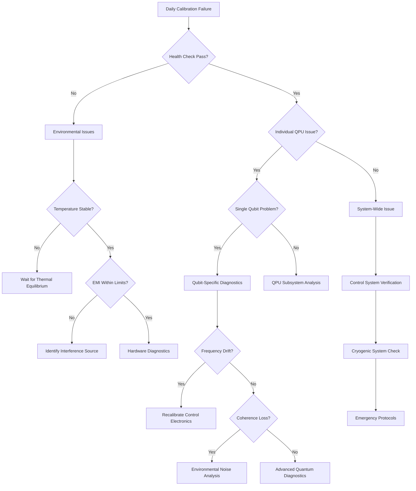

```yaml
---
project: GAIA-QAO-AdVent
program: AMPEL360 BWB-Q100
ATA_chapter: 05-90-10-01
doc_id: GQOIS-QAIR-ATA-05901001
version: 3.0.0
date: 2025-07-01
author: Amedeo Pelliccia
status: Final Draft
classification: GAIA-QAO Confidential
review_board: [Q-AIR-SAFETY, Q-DATAGOV, EASA-LIAISON]
info_code: QD # QPU Daily
next_review_date: 2026-06-30
parent_document: GQOIS-QAIR-ATA-05901000
---
```

# ATA 05-90-10-01 — Daily QPU Calibration Procedures

<p align="center">
  
  
  
  
  
</p>

---

## 1. Introduction

### 1.1. Purpose
This document provides detailed step-by-step procedures for daily calibration of Quantum Processing Units (QPUs) aboard the AMPEL360 BWB-Q100. Daily calibration ensures optimal quantum system performance, maintains gate fidelities within specification, and provides early detection of system degradation.

### 1.2. Scope
These procedures apply to all six QPU installations:
- **Q-FCS-001:** Primary Flight Control QPU
- **Q-NAV-002:** Navigation Optimization QPU  
- **Q-ENG-003:** Propulsion Control QPU
- **Q-SHM-004:** Structural Monitoring QPU
- **Q-SEC-005:** Communication Security QPU
- **Q-DIAG-006:** Central Diagnostic QPU

### 1.3. Calibration Objectives
Daily calibration achieves:
- **Performance Verification:** Confirm all quantum systems meet operational specifications
- **Drift Compensation:** Correct for environmental and aging-induced parameter drift
- **Early Warning:** Detect developing issues before they impact operations
- **Baseline Maintenance:** Establish daily reference for trending analysis

### 1.4. Prerequisites
Before beginning daily calibration:
- Aircraft in hangar with stable environmental conditions
- Cryogenic systems operational for >2 hours (thermal equilibrium)
- All QPU units at base temperature (15 mK ± 0.1 mK)
- Technician certified in QPU calibration procedures
- Calibration equipment functional and recently verified

---

## 2. Pre-Calibration Checklist

### 2.1. Environmental Verification

#### 2.1.1. Hangar Conditions Assessment
```yaml
Environmental Check: ENV-DAILY-001
Duration: 5 minutes
Frequency: Before each calibration session

Parameter Verification:
  Temperature: 20°C ± 2°C
    - Measurement: Digital thermometer (±0.1°C accuracy)
    - Stability: <0.5°C/hour variation
    - Action if failed: Wait for stabilization or move to controlled environment
  
  Humidity: 45% ± 5% RH
    - Measurement: Capacitive humidity sensor
    - Stability: <2% RH/hour variation
    - Action if failed: Activate dehumidification system
  
  Atmospheric Pressure: 1013 ± 50 hPa
    - Measurement: Precision barometer
    - Stability: <5 hPa/hour variation
    - Action if failed: Record for compensation calculations
  
  Magnetic Field: <1 μT ambient
    - Measurement: 3-axis fluxgate magnetometer
    - Variation: <100 nT over calibration period
    - Action if failed: Identify and remove magnetic sources

Documentation:
  - Record all environmental parameters in DIKE registry
  - Note any deviations from normal conditions
  - Assess impact on calibration uncertainty
```

#### 2.1.2. Electromagnetic Environment
```yaml
EMI Assessment: EMI-DAILY-002
Duration: 3 minutes
Equipment: Broadband EMI monitor

Frequency Bands Check:
  1-30 MHz (HF band):
    - Limit: <-60 dBm/Hz
    - Sources: AM radio, industrial equipment
    - Action: Verify hangar RF shielding
  
  30-300 MHz (VHF band):
    - Limit: <-70 dBm/Hz  
    - Sources: FM radio, aviation comm
    - Action: Coordinate with ATC if necessary
  
  300 MHz-3 GHz (UHF band):
    - Limit: <-80 dBm/Hz
    - Sources: Cell phones, WiFi, radar
    - Action: Enforce electronic device restrictions
  
  3-30 GHz (SHF band):
    - Limit: <-90 dBm/Hz
    - Sources: Satellite comm, weather radar
    - Action: Monitor and record for analysis

Critical Frequencies:
  - QPU operating frequencies: 4-8 GHz
  - Control frequencies: 100 MHz-1 GHz
  - Readout frequencies: 6-9 GHz
  - Acceptable interference: <-100 dBm at these frequencies
```

### 2.2. System Status Verification

#### 2.2.1. Cryogenic System Health Check
```yaml
Cryogenic Check: CRYO-DAILY-003
Duration: 10 minutes
System: Dilution Refrigerator Array (6 units)

Temperature Verification (per QPU):
  Base Temperature: 15 mK ± 0.1 mK
    - Measurement: Calibrated resistance thermometer
    - Stability: <0.05 mK/hour drift
    - Thermal gradient: <5 mK across chip
  
  Intermediate Stages:
    - 4K Stage: <4.2 K
    - 1K Stage: <1.2 K  
    - 100 mK Stage: <110 mK
    - 50 mK Stage: <55 mK

Cooling Performance:
  - Available cooling power: >1.5 mW @ 100 mK
  - Pump efficiency: >80% of rated capacity
  - Vibration isolation: <0.01 g RMS
  - Magnetic field: <100 nT at QPU location

System Alarms:
  - Check for any active alarms or warnings
  - Verify all protective systems operational
  - Confirm backup systems ready
  - Test emergency shutdown procedures
```

#### 2.2.2. Control Electronics Verification
```yaml
Electronics Check: ELEC-DAILY-004
Duration: 8 minutes
System: Quantum Control Electronics

Microwave Sources (per QPU):
  Frequency Accuracy: ±1 kHz from setpoint
    - Test method: Frequency counter verification
    - Drift: <100 Hz/hour
    - Phase noise: <-90 dBc/Hz @ 1 kHz offset
  
  Power Level Accuracy: ±0.1 dB from setpoint
    - Test method: Power meter verification
    - Stability: <0.05 dB/hour
    - Spurious content: <-50 dBc

Arbitrary Waveform Generators:
  Timing Accuracy: ±10 ps
    - Test method: High-resolution oscilloscope
    - Jitter: <1 ps RMS
    - Clock stability: <1 ppm drift
  
  Amplitude Accuracy: ±1% of full scale
    - Test method: Calibrated voltmeter
    - Linearity: <0.1% deviation
    - Bandwidth: DC to 500 MHz (-3 dB)

Data Acquisition Systems:
  Sampling Rate: 1 GS/s ± 0.1%
    - Test method: Internal calibration
    - Aperture jitter: <100 fs RMS
    - ENOB: >12 bits effective
  
  Input Range: ±1V with <0.1% nonlinearity
    - Test method: Precision voltage source
    - Noise floor: <-70 dBFS
    - Crosstalk: <-60 dB between channels
```

---

## 3. Daily Calibration Sequence

### 3.1. Rapid Health Assessment (15 minutes)

#### 3.1.1. Automated System Health Check
```yaml
Procedure: QPU-HEALTH-DAILY-001
Automation Level: Fully automated
Duration: 15 minutes total (2.5 minutes per QPU)
Operator Action: Monitor and verify results

Health Check Sequence (per QPU):
  Step 1: Communication Test (30 seconds)
    - Verify control system connectivity
    - Test command/response latency (<1 ms)
    - Check data integrity (0% packet loss)
    - Confirm system identification

  Step 2: Temperature Stability (30 seconds)
    - Verify base temperature: 15 mK ± 0.1 mK
    - Check thermal gradient: <5 mK across chip
    - Monitor cooling power: >20% headroom
    - Assess thermal time constants

  Step 3: Basic Spectroscopy (60 seconds)
    - Rapid frequency sweep for all qubits
    - Identify qubit resonances (±10 MHz tolerance)
    - Detect any missing or shifted peaks
    - Flag qubits requiring attention

  Step 4: Gate Response Test (30 seconds)  
    - Single π-pulse on each qubit
    - Verify population inversion >95%
    - Check for coherent oscillations
    - Measure basic gate fidelity

  Step 5: Readout Verification (30 seconds)
    - Prepare |0⟩ and |1⟩ states
    - Measure readout contrast >98%
    - Verify signal-to-noise ratio >8 dB
    - Check measurement time <1 μs
```

#### 3.1.2. Health Check Results Analysis
```python
class QPUHealthAnalyzer:
    def __init__(self, health_data):
        self.data = health_data
        self.thresholds = self.load_health_thresholds()
    
    def analyze_health_status(self):
        """Analyze health check results and determine system status"""
        results = {
            'overall_status': 'HEALTHY',
            'individual_qpu_status': {},
            'attention_required': [],
            'immediate_actions': []
        }
        
        for qpu_id, qpu_data in self.data.items():
            qpu_status = self.analyze_individual_qpu(qpu_id, qpu_data)
            results['individual_qpu_status'][qpu_id] = qpu_status
            
            if qpu_status['status'] == 'DEGRADED':
                results['attention_required'].append(qpu_id)
                results['overall_status'] = 'CAUTION'
            elif qpu_status['status'] == 'FAILED':
                results['immediate_actions'].append(qpu_id)
                results['overall_status'] = 'ALERT'
        
        return results
    
    def analyze_individual_qpu(self, qpu_id, data):
        """Analyze individual QPU health metrics"""
        status = {
            'status': 'HEALTHY',
            'issues': [],
            'recommendations': []
        }
        
        # Temperature analysis
        if data['base_temp'] > 15.1e-3:  # >15.1 mK
            status['issues'].append('Base temperature elevated')
            status['status'] = 'DEGRADED'
        
        # Qubit frequency analysis  
        freq_drift = self.calculate_frequency_drift(data['frequencies'])
        if max(freq_drift) > 1e6:  # >1 MHz drift
            status['issues'].append('Significant frequency drift detected')
            status['status'] = 'DEGRADED'
        
        # Gate fidelity analysis
        min_fidelity = min(data['gate_fidelities'])
        if min_fidelity < 0.95:  # <95%
            status['issues'].append('Gate fidelity below threshold')
            status['status'] = 'FAILED'
        
        # Readout analysis
        if data['readout_contrast'] < 0.98:  # <98%
            status['issues'].append('Readout contrast degraded')
            status['status'] = 'DEGRADED'
        
        return status
```

### 3.2. Comprehensive Calibration (30 minutes)

#### 3.2.1. Individual Qubit Characterization
```yaml
Procedure: QUBIT-CHAR-DAILY-005
Duration: 12 minutes total (2 minutes per QPU)
Automation: Semi-automated with operator verification

Characterization Sequence (per qubit):
  Step 1: Precision Spectroscopy (20 seconds)
    - High-resolution frequency sweep
    - Bandwidth: ±50 MHz around expected frequency
    - Resolution: 10 kHz steps
    - Extract: Center frequency, linewidth, anharmonicity
    
    Measurements:
      - Qubit frequency f01: ±1 kHz accuracy
      - Anharmonicity α: ±100 kHz accuracy  
      - Linewidth: Full-width half-maximum
      - Power dependence: AC Stark shift characterization
  
  Step 2: Coherence Time Measurement (45 seconds)
    - T1 relaxation: Exponential decay measurement
    - T2* dephasing: Ramsey interferometry
    - Measurement points: 20 time delays (exponentially spaced)
    - Fitting: Automated exponential curve fitting
    
    Target Values:
      - T1 > 100 μs (specification: >80 μs)
      - T2* > 50 μs (specification: >40 μs)
      - Fitting R² > 0.98 (data quality metric)
  
  Step 3: Optimal Drive Calibration (30 seconds)
    - Rabi oscillation measurement
    - Drive amplitudes: 10 points logarithmically spaced
    - Extract: π-pulse amplitude, π/2-pulse amplitude
    - Verify: Linear relationship between amplitude and rotation angle
    
    Calibration Points:
      - π-pulse amplitude: ±1% accuracy
      - π/2-pulse amplitude: ±1% accuracy
      - Pulse duration: Optimized for fidelity vs. speed
  
  Step 4: DRAG Pulse Optimization (25 seconds)
    - Derivative Removal by Adiabatic Gating
    - Minimize leakage to |2⟩ state
    - DRAG coefficient β optimization
    - Verify: Leakage <0.1% for optimized pulses
```

#### 3.2.2. Gate Fidelity Optimization
```yaml
Procedure: GATE-OPT-DAILY-006
Duration: 10 minutes total
Method: Randomized Benchmarking + Process Tomography

Single-Qubit Gate Calibration:
  Randomized Benchmarking Protocol:
    - Sequence lengths: [1, 2, 4, 8, 16, 32, 64, 128] gates
    - Number of sequences: 50 per length
    - Gate set: {I, X, Y, Z, X/2, Y/2, -X/2, -Y/2}
    - Measurement: Survival probability vs sequence length
    
  Analysis:
    - Exponential decay fitting: p = A·α^m + B
    - Average gate fidelity: F = (α + 1)/2
    - Target: F > 0.999 (>99.9%)
    - Uncertainty: σF < 0.0001 (0.01%)
  
  DRAG Optimization:
    - Sweep DRAG coefficient β: -0.5 to +0.5
    - Cost function: Leakage to |2⟩ + gate infidelity
    - Optimization: Nelder-Mead simplex algorithm
    - Verification: Process tomography on optimized gates

Two-Qubit Gate Calibration:
  Cross-Resonance Gate Protocol:
    - Control qubit: Drive at target frequency
    - Target qubit: Monitor conditional evolution
    - Parameters: Drive amplitude, frequency, phase
    - Duration: Optimize for π-rotation (typically ~200 ns)
  
  Calibration Steps:
    1. ZZ interaction strength measurement
    2. Optimal drive amplitude determination  
    3. Phase correction calibration
    4. Echo sequence optimization (if required)
    5. Verification via process tomography
  
  Performance Targets:
    - CNOT fidelity: >99.5%
    - Gate duration: <200 ns
    - Conditional phase accuracy: ±1°
    - Crosstalk to spectator qubits: <0.1%
```

#### 3.2.3. Readout System Optimization
```yaml
Procedure: READOUT-OPT-DAILY-007
Duration: 8 minutes total
Method: Optimal control theory + machine learning

Readout Pulse Optimization:
  Step 1: Resonator Characterization (2 minutes)
    - Readout resonator spectroscopy
    - Quality factor Q measurement
    - Coupling strength g determination
    - Optimal readout frequency identification
  
  Step 2: Pulse Shape Optimization (3 minutes)
    - Initial pulse: Gaussian envelope
    - Optimization target: Maximize SNR/√duration
    - Constraints: Total energy, bandwidth, peak power
    - Algorithm: Gradient-free optimization (CMA-ES)
  
  Step 3: Integration Weight Optimization (2 minutes)
    - Matched filter design
    - Noise characterization (frequency domain)
    - Optimal linear filter computation
    - Implementation: Digital signal processing
  
  Step 4: State Assignment (1 minute)
    - Prepare |0⟩ and |1⟩ states (100 times each)
    - Measure IQ plane distribution
    - Determine optimal threshold
    - Calculate assignment fidelity matrix

Performance Metrics:
  - Readout fidelity: >99.8%
  - SNR: >10 dB  
  - Measurement time: <1 μs
  - Assignment error: <0.2%
  - State preparation error: <0.1%
```

---

## 4. Quality Control & Verification

### 4.1. Performance Verification Protocol

#### 4.1.1. Automated Performance Assessment
```python
class DailyCalibrationValidator:
    def __init__(self, calibration_results):
        self.results = calibration_results
        self.specifications = self.load_performance_specs()
        self.historical_data = self.load_historical_performance()
    
    def validate_calibration_results(self):
        """Comprehensive validation of daily calibration results"""
        validation_report = {
            'overall_pass': True,
            'individual_systems': {},
            'trending_alerts': [],
            'recommendations': []
        }
        
        for qpu_id in self.results.keys():
            system_validation = self.validate_qpu_performance(qpu_id)
            validation_report['individual_systems'][qpu_id] = system_validation
            
            if not system_validation['pass']:
                validation_report['overall_pass'] = False
        
        # Trending analysis
        trends = self.analyze_performance_trends()
        validation_report['trending_alerts'] = trends['alerts']
        validation_report['recommendations'] = trends['recommendations']
        
        return validation_report
    
    def validate_qpu_performance(self, qpu_id):
        """Validate individual QPU performance against specifications"""
        qpu_results = self.results[qpu_id]
        specs = self.specifications[qpu_id]
        
        validation = {
            'pass': True,
            'metrics': {},
            'failures': []
        }
        
        # Gate fidelity validation
        for gate_type, fidelity in qpu_results['gate_fidelities'].items():
            spec_min = specs['gate_fidelity'][gate_type]['minimum']
            validation['metrics'][f'{gate_type}_fidelity'] = {
                'value': fidelity,
                'specification': spec_min,
                'pass': fidelity >= spec_min
            }
            if fidelity < spec_min:
                validation['pass'] = False
                validation['failures'].append(f'{gate_type} fidelity below specification')
        
        # Coherence time validation
        for coherence_type, time_value in qpu_results['coherence_times'].items():
            spec_min = specs['coherence_times'][coherence_type]['minimum']
            validation['metrics'][f'{coherence_type}_time'] = {
                'value': time_value,
                'specification': spec_min,
                'pass': time_value >= spec_min
            }
            if time_value < spec_min:
                validation['pass'] = False
                validation['failures'].append(f'{coherence_type} time below specification')
        
        # Readout fidelity validation
        readout_fidelity = qpu_results['readout_fidelity']
        spec_min = specs['readout_fidelity']['minimum']
        validation['metrics']['readout_fidelity'] = {
            'value': readout_fidelity,
            'specification': spec_min,
            'pass': readout_fidelity >= spec_min
        }
        if readout_fidelity < spec_min:
            validation['pass'] = False
            validation['failures'].append('Readout fidelity below specification')
        
        return validation
    
    def analyze_performance_trends(self):
        """Analyze performance trends over time"""
        trends = {
            'alerts': [],
            'recommendations': []
        }
        
        # Calculate trend slopes for key metrics
        for qpu_id in self.results.keys():
            historical = self.historical_data[qpu_id]
            current = self.results[qpu_id]
            
            # Gate fidelity trends
            fidelity_trend = self.calculate_trend_slope(
                historical['gate_fidelities'], 
                current['gate_fidelities']
            )
            
            if fidelity_trend < -0.001:  # Decreasing >0.1% per week
                trends['alerts'].append(f'QPU {qpu_id}: Gate fidelity declining')
                trends['recommendations'].append(
                    f'QPU {qpu_id}: Schedule detailed diagnostics'
                )
            
            # Coherence time trends
            coherence_trend = self.calculate_trend_slope(
                historical['coherence_times'],
                current['coherence_times']
            )
            
            if coherence_trend < -5e-6:  # Decreasing >5 μs per week
                trends['alerts'].append(f'QPU {qpu_id}: Coherence time declining')
                trends['recommendations'].append(
                    f'QPU {qpu_id}: Review environmental conditions'
                )
        
        return trends
```

#### 4.1.2. Statistical Process Control
```yaml
SPC Monitoring: QPU-SPC-DAILY-008
Purpose: Real-time process monitoring
Update: After each daily calibration

Control Charts (per QPU):
  1. Gate Fidelity Control Chart
     - Measurement: Average single-qubit gate fidelity
     - Control limits: μ ± 3σ (calculated from 30-day baseline)
     - Specification limits: >99.5% (minimum acceptable)
     - Alert conditions: Point beyond control limits, trends
  
  2. Coherence Time Control Chart  
     - Measurements: T1 and T2* times
     - Individual-Moving Range (I-MR) chart format
     - Control limits: Based on natural process variation
     - Trending analysis: 7-point trend detection
  
  3. Readout Fidelity Control Chart
     - Measurement: Average readout assignment fidelity
     - Target: >99.8% 
     - Control method: Exponentially weighted moving average
     - Sensitivity: Detect 0.1% shifts within 5 samples

Alert Actions:
  - Out of control: Immediate investigation required
  - Trending: Enhanced monitoring, potential calibration
  - Near limits: Preventive maintenance scheduling
  - Capability issues: Process improvement investigation
```

### 4.2. Environmental Correlation Analysis

#### 4.2.1. Performance-Environment Correlation
```python
class EnvironmentalCorrelationAnalyzer:
    def __init__(self, performance_data, environmental_data):
        self.performance = performance_data
        self.environment = environmental_data
        self.correlation_threshold = 0.3  # Significant correlation
    
    def analyze_correlations(self):
        """Analyze correlations between performance and environment"""
        correlations = {}
        
        # Temperature correlations
        temp_corr = self.calculate_correlation(
            self.performance['gate_fidelity'], 
            self.environment['temperature']
        )
        correlations['temperature'] = {
            'coefficient': temp_corr,
            'significance': abs(temp_corr) > self.correlation_threshold,
            'impact': 'Gate fidelity decreases with temperature increase' if temp_corr < 0 else 'Positive correlation'
        }
        
        # Magnetic field correlations
        mag_corr = self.calculate_correlation(
            self.performance['coherence_t2'],
            self.environment['magnetic_field_variation']
        )
        correlations['magnetic_field'] = {
            'coefficient': mag_corr,
            'significance': abs(mag_corr) > self.correlation_threshold,
            'impact': 'Coherence decreases with field variations' if mag_corr < 0 else 'No significant impact'
        }
        
        # Vibration correlations
        vib_corr = self.calculate_correlation(
            self.performance['readout_fidelity'],
            self.environment['vibration_level']
        )
        correlations['vibration'] = {
            'coefficient': vib_corr,
            'significance': abs(vib_corr) > self.correlation_threshold,
            'impact': 'Readout affected by vibration' if abs(vib_corr) > self.correlation_threshold else 'No impact'
        }
        
        return correlations
    
    def generate_environmental_recommendations(self, correlations):
        """Generate recommendations based on correlations"""
        recommendations = []
        
        for factor, analysis in correlations.items():
            if analysis['significance']:
                if factor == 'temperature' and analysis['coefficient'] < -0.5:
                    recommendations.append(
                        "Strong temperature sensitivity detected. "
                        "Consider enhanced thermal management."
                    )
                elif factor == 'magnetic_field' and abs(analysis['coefficient']) > 0.4:
                    recommendations.append(
                        "Magnetic field sensitivity detected. "
                        "Review shielding effectiveness."
                    )
                elif factor == 'vibration' and abs(analysis['coefficient']) > 0.3:
                    recommendations.append(
                        "Vibration sensitivity detected. "
                        "Check isolation system performance."
                    )
        
        return recommendations
```

---

## 5. Documentation & Reporting

### 5.1. Automated Report Generation

#### 5.1.1. Daily Calibration Report Structure
```json
{
  "daily_calibration_report": {
    "report_id": "DCR-2025-07-01-N360QA",
    "aircraft_registration": "N360QA",
    "calibration_date": "2025-07-01",
    "start_time": "08:00:00Z",
    "end_time": "08:45:32Z",
    "technician_id": "TECH-QPU-001",
    "weather_conditions": {
      "temperature": 22.1,
      "humidity": 43.2,
      "pressure": 1013.2,
      "magnetic_field": 0.028
    },
    "calibration_summary": {
      "overall_status": "PASS",
      "total_duration_minutes": 45.53,
      "qpu_systems_calibrated": 6,
      "issues_detected": 0,
      "performance_score": 98.7
    },
    "individual_qpu_results": [
      {
        "qpu_id": "Q-FCS-001",
        "system_name": "Primary Flight Control QPU",
        "calibration_status": "PASS",
        "key_metrics": {
          "average_gate_fidelity": 0.9994,
          "coherence_t1_avg": 127.3,
          "coherence_t2_avg": 68.7,
          "readout_fidelity": 0.9989
        },
        "drift_from_previous": {
          "gate_fidelity": -0.0001,
          "coherence_t1": -2.1,
          "coherence_t2": +1.3,
          "readout_fidelity": +0.0002
        },
        "individual_qubit_data": [
          {
            "qubit_id": 1,
            "frequency_mhz": 5234.567,
            "t1_microseconds": 127.3,
            "t2_microseconds": 68.7,
            "gate_fidelity": 0.9994,
            "readout_fidelity": 0.9989
          }
        ]
      }
    ],
    "trending_analysis": {
      "performance_trend": "stable",
      "alerts": [],
      "recommendations": [
        "All systems performing within specifications",
        "No immediate action required",
        "Continue standard monitoring schedule"
      ]
    },
    "environmental_impact": {
      "temperature_correlation": -0.12,
      "magnetic_field_correlation": 0.08,
      "vibration_correlation": -0.05,
      "significant_correlations": []
    },
    "next_calibration_due": "2025-07-02T08:00:00Z",
    "approval": {
      "technician_signature": "digital_signature_hash",
      "supervisor_approval": "supervisor_signature_hash",
      "timestamp": "2025-07-01T09:15:00Z"
    },
    "blockchain_hash": "0x8c9d0e1f2a3b4c5d..."
  }
}
```

#### 5.1.2. DIKE Registry Integration
```python
class DailyCalibrationDIKE:
    def __init__(self, blockchain_interface):
        self.blockchain = blockchain_interface
        self.encryption = QuantumSafeEncryption()
        
    def record_calibration_results(self, calibration_data):
        """Record calibration results in DIKE registry"""
        # Prepare data for blockchain storage
        dike_record = {
            'record_type': 'daily_qpu_calibration',
            'timestamp': datetime.utcnow().isoformat(),
            'data_hash': self.calculate_data_hash(calibration_data),
            'encrypted_data': self.encryption.encrypt(calibration_data),
            'metadata': {
                'aircraft_id': calibration_data['aircraft_registration'],
                'calibration_date': calibration_data['calibration_date'],
                'technician_id': calibration_data['technician_id'],
                'overall_status': calibration_data['calibration_summary']['overall_status']
            }
        }
        
        # Submit to blockchain
        transaction_hash = self.blockchain.submit_transaction(dike_record)
        
        # Generate immutable certificate
        certificate = self.generate_calibration_certificate(
            calibration_data, transaction_hash
        )
        
        return {
            'transaction_hash': transaction_hash,
            'certificate': certificate,
            'record_id': dike_record['data_hash']
        }
    
    def generate_calibration_certificate(self, data, tx_hash):
        """Generate digital calibration certificate"""
        certificate = {
            'certificate_id': f"CERT-{data['report_id']}",
            'issue_date': datetime.utcnow().isoformat(),
            'valid_until': (datetime.utcnow() + timedelta(days=1)).isoformat(),
            'aircraft_registration': data['aircraft_registration'],
            'calibration_summary': data['calibration_summary'],
            'blockchain_reference': tx_hash,
            'digital_signature': self.encryption.sign_certificate(data),
            'qr_code': self.generate_qr_code(data['report_id'], tx_hash)
        }
        
        return certificate
```

### 5.2. Performance Dashboard Integration

#### 5.2.1. Real-Time Performance Monitoring
```yaml
Dashboard Integration: QPU-DASH-DAILY-009
Purpose: Real-time performance visualization
Update Frequency: Live during calibration, summary post-completion

Dashboard Components:
  1. System Status Overview
     - Traffic light indicators for each QPU
     - Overall fleet health score
     - Active alerts and warnings
     - Calibration progress status
  
  2. Performance Metrics Display
     - Gate fidelity trends (30-day rolling)
     - Coherence time trends
     - Readout performance tracking
     - Comparative analysis vs. fleet average
  
  3. Environmental Monitoring
     - Real-time environmental parameters
     - Historical correlation analysis
     - Impact prediction modeling
     - Compensation effectiveness tracking
  
  4. Maintenance Planning
     - Next calibration schedule
     - Predicted maintenance windows
     - Resource allocation optimization
     - Parts availability status

User Access Levels:
  - Technician: Current calibration status, basic metrics
  - Supervisor: Full performance data, trend analysis
  - Engineering: Detailed diagnostics, optimization data
  - Management: Summary reports, fleet comparisons
```

---

## 6. Troubleshooting & Emergency Procedures

### 6.1. Common Calibration Issues

#### 6.1.1. Calibration Failure Decision Tree


#### 6.1.2. Emergency Calibration Protocol
```yaml
Emergency Protocol: QPU-EMERGENCY-DAILY-010
Trigger: Critical calibration failure
Objective: Restore basic quantum functionality
Duration: 30 minutes maximum

Emergency Sequence:
  Step 1: Immediate Assessment (5 minutes)
    - Verify system safety
    - Check for hardware damage
    - Assess environmental conditions
    - Determine criticality level
  
  Step 2: Rapid Calibration Attempt (15 minutes)
    - Reduced parameter set
    - Lower accuracy thresholds
    - Essential functionality only
    - Automated recovery procedures
  
  Step 3: Backup System Activation (5 minutes)
    - Switch to redundant QPU if available
    - Classical fallback algorithms
    - Reduced performance mode
    - Safety system verification
  
  Step 4: Documentation & Escalation (5 minutes)
    - Record failure details
    - Notify maintenance control
    - Escalate to quantum engineer
    - Schedule detailed diagnostics

Reduced Performance Thresholds:
  - Gate fidelity: >95% (vs. normal >99.5%)
  - Coherence times: >50% of specification
  - Readout fidelity: >95% (vs. normal >99.8%)
  - Environmental tolerance: Relaxed by factor of 2
```

### 6.2. Performance Recovery Procedures

#### 6.2.1. Gradual Performance Restoration
```python
class PerformanceRecoveryManager:
    def __init__(self, qpu_interface):
        self.qpu = qpu_interface
        self.recovery_steps = self.load_recovery_procedures()
        
    def execute_performance_recovery(self, failure_type):
        """Execute appropriate recovery procedure based on failure type"""
        recovery_plan = self.select_recovery_strategy(failure_type)
        
        for step in recovery_plan:
            try:
                result = self.execute_recovery_step(step)
                if result['success']:
                    self.log_recovery_success(step, result)
                    if self.verify_performance_restored():
                        return {'status': 'recovered', 'steps_completed': step['id']}
                else:
                    self.log_recovery_failure(step, result)
                    if step['critical']:
                        return {'status': 'failed', 'failed_at': step['id']}
            except Exception as e:
                self.log_exception(step, e)
                if step['critical']:
                    return {'status': 'error', 'error_at': step['id']}
        
        return {'status': 'partial_recovery', 'final_performance': self.assess_performance()}
    
    def select_recovery_strategy(self, failure_type):
        """Select appropriate recovery strategy"""
        strategies = {
            'coherence_loss': [
                {'id': 'environmental_optimization', 'critical': False},
                {'id': 'pulse_recalibration', 'critical': True},
                {'id': 'decoherence_mitigation', 'critical': False}
            ],
            'gate_fidelity_degradation': [
                {'id': 'control_electronics_check', 'critical': True},
                {'id': 'pulse_optimization', 'critical': True},
                {'id': 'crosstalk_mitigation', 'critical': False}
            ],
            'readout_degradation': [
                {'id': 'readout_pulse_optimization', 'critical': True},
                {'id': 'signal_path_verification', 'critical': True},
                {'id': 'threshold_recalibration', 'critical': False}
            ]
        }
        
        return strategies.get(failure_type, strategies['gate_fidelity_degradation'])
```

---

## 7. Training & Competency Requirements

### 7.1. Daily Calibration Technician Certification

#### 7.1.1. Core Competency Requirements
```yaml
Certification: Daily QPU Calibration Technician (DQCT)
Duration: 40 hours (1 week)
Prerequisites: Basic quantum systems training

Training Modules:
  Module 1: Daily Procedures Overview (8 hours)
    - Calibration philosophy and objectives
    - Environmental requirements
    - Safety procedures and protocols
    - Documentation requirements
  
  Module 2: Hands-On Calibration (16 hours)
    - Equipment operation and setup
    - Step-by-step procedure execution
    - Data interpretation and analysis
    - Quality control verification
  
  Module 3: Troubleshooting (12 hours)
    - Common failure modes
    - Diagnostic procedures
    - Recovery techniques
    - Emergency protocols
  
  Module 4: Documentation & Reporting (4 hours)
    - DIKE registry usage
    - Report generation
    - Data analysis tools
    - Communication protocols

Assessment Requirements:
  - Written examination: >85% pass rate
  - Practical demonstration: Full calibration sequence
  - Emergency response: Troubleshooting scenarios
  - Documentation: Complete calibration report
```

#### 7.1.2. Ongoing Competency Maintenance
```yaml
Competency Maintenance: DQCT-MAINT-001
Frequency: Quarterly assessments

Quarterly Requirements (8 hours):
  - Procedure updates and new techniques
  - Equipment changes and upgrades  
  - Safety briefings and incident reviews
  - Performance improvement workshops
  
Annual Recertification (16 hours):
  - Comprehensive practical assessment
  - Updated theoretical knowledge test
  - Emergency response drills
  - Continuous improvement participation

Performance Monitoring:
  - Calibration success rate tracking
  - Time to completion monitoring
  - Quality metrics assessment
  - Safety incident reporting
```

---

## 8. Continuous Improvement & Optimization

### 8.1. Performance Optimization Analysis

#### 8.1.1. Daily Performance Trending
```python
class DailyPerformanceOptimizer:
    def __init__(self, historical_data):
        self.history = historical_data
        self.ml_model = QuantumPerformancePredictor()
        
    def analyze_optimization_opportunities(self):
        """Identify opportunities for calibration optimization"""
        opportunities = {
            'time_reduction': self.analyze_time_optimization(),
            'accuracy_improvement': self.analyze_accuracy_optimization(),
            'reliability_enhancement': self.analyze_reliability_optimization(),
            'automation_potential': self.analyze_automation_opportunities()
        }
        
        return opportunities
    
    def analyze_time_optimization(self):
        """Analyze opportunities to reduce calibration time"""
        # Analyze which calibration steps take longest
        step_durations = self.extract_step_durations()
        
        # Identify steps with high variance (optimization potential)
        optimization_targets = []
        for step, durations in step_durations.items():
            if np.std(durations) / np.mean(durations) > 0.2:  # >20% CV
                optimization_targets.append({
                    'step': step,
                    'current_avg_time': np.mean(durations),
                    'potential_savings': np.std(durations),
                    'optimization_method': self.suggest_time_optimization(step)
                })
        
        return optimization_targets
    
    def suggest_time_optimization(self, step):
        """Suggest optimization methods for specific calibration steps"""
        optimizations = {
            'qubit_spectroscopy': 'Adaptive frequency search algorithms',
            'coherence_measurement': 'Optimized time point selection',
            'gate_calibration': 'Parallel qubit processing',
            'readout_optimization': 'Machine learning pulse design'
        }
        
        return optimizations.get(step, 'Process analysis required')
    
    def analyze_accuracy_improvement(self):
        """Analyze opportunities to improve calibration accuracy"""
        accuracy_analysis = {}
        
        # Analyze measurement uncertainties
        for metric in ['gate_fidelity', 'coherence_times', 'readout_fidelity']:
            uncertainties = self.extract_measurement_uncertainties(metric)
            
            accuracy_analysis[metric] = {
                'current_uncertainty': np.mean(uncertainties),
                'improvement_potential': self.calculate_improvement_potential(uncertainties),
                'limiting_factors': self.identify_limiting_factors(metric),
                'recommendations': self.generate_accuracy_recommendations(metric)
            }
        
        return accuracy_analysis
```

### 8.2. Fleet-Wide Optimization

#### 8.2.1. Cross-Aircraft Learning
```yaml
Fleet Optimization: FLEET-OPT-DAILY-011
Purpose: Share optimization insights across aircraft fleet
Analysis Frequency: Weekly fleet-wide analysis

Data Aggregation:
  - Anonymized performance data from all aircraft
  - Environmental correlation patterns
  - Optimization success stories
  - Failure mode statistics

Machine Learning Applications:
  1. Predictive maintenance scheduling
     - Predict optimal calibration frequency per aircraft
     - Anticipate performance degradation
     - Optimize maintenance resource allocation
  
  2. Environmental adaptation
     - Learn environmental sensitivities
     - Develop location-specific procedures
     - Optimize for operating conditions
  
  3. Procedure optimization
     - Identify most effective calibration sequences
     - Optimize parameter selection
     - Minimize calibration time while maintaining quality

Knowledge Sharing:
  - Best practices documentation
  - Optimization parameter sharing
  - Training material updates
  - Procedure standardization improvements
```

---

## 9. References & Standards

### 9.1. Technical Standards
- **IEEE 2995-2023** — Standard for Quantum Computing Definitions
- **ISO/IEC 4879:2023** — Quantum computing — Concepts and vocabulary
- **NIST SP 800-208** — Recommendation for Stateful Hash-Based Signature Schemes
- **IEC 62309** — Dependability of software containing artificial intelligence

### 9.2. Calibration Standards
- **ISO/IEC 17025:2017** — General requirements for testing and calibration laboratories
- **JCGM 100:2008** — Guide to the expression of uncertainty in measurement
- **NIST SP 250** — NIST Measurement Services
- **IEEE 1451** — Standard for Smart Transducer Interface

### 9.3. Aviation Standards
- **RTCA DO-178C** — Software considerations in airborne systems
- **EASA CS-25** — Certification specifications for large aeroplanes
- **SAE ARP4754A** — Guidelines for development of civil aircraft and systems
- **FAA AC 43.13-1B** — Acceptable methods, techniques, and practices

---

## Document History

| Version | Date | Author | Changes |
|:--------|:-----|:-------|:--------|
| 1.0.0 | 2025-03-01 | A. Pelliccia | Initial release with basic daily procedures |
| 2.0.0 | 2025-05-15 | A. Pelliccia | Added comprehensive automation and optimization |
| 3.0.0 | 2025-07-01 | A. Pelliccia | Complete revision with ML integration and fleet optimization |

---

*This document establishes the daily calibration procedures that ensure the AMPEL360 BWB-Q100's quantum systems maintain peak performance throughout their operational life, supporting safe and efficient quantum-enhanced flight operations.*
