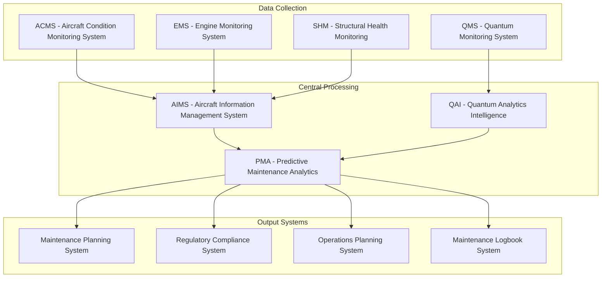

# ATA-05-00-00-00 Time Limits/Maintenance Checks - General

<p align="center">


</p>

---

## Document Control Information

**Document ID:** `05-00-00-00-General.md`  
**GQOIS ID:** `AS-M-PAX-BW-Q1H-TLM-GEN-PROC`  
**ATA Chapter:** 05-00-00-00 (Time Limits/Maintenance Checks - General)  
**Classification:** Maintenance Requirements - Quantum Enhanced  
**Version:** 2.0.0  
**Effective Date:** 2025-06-29  
**Revision Status:** Current Release  
**Approval Authority:** GAIA-QAO Chief Technical Officer & Certification Authority  
**Predecessor Documents:** None (Initial Release)

---

## Table of Contents

1. [Overview](#1-overview)
2. [Regulatory Framework](#2-regulatory-framework)
3. [Time Limits Structure](#3-time-limits-structure)
4. [Maintenance Check Types](#4-maintenance-check-types)
5. [Quantum Systems Time Limits](#5-quantum-systems-time-limits)
6. [Life Limits](#6-life-limits)
7. [Inspection Intervals](#7-inspection-intervals)
8. [Documentation Requirements](#8-documentation-requirements)
9. [Compliance Monitoring](#9-compliance-monitoring)
10. [Emergency Procedures](#10-emergency-procedures)

---

## 1. Overview

### 1.1 Purpose

This document establishes the comprehensive time limits, maintenance intervals, and inspection requirements for the AMPEL360 BWB-Q100 aircraft. It integrates traditional maintenance practices with quantum-enhanced monitoring systems to ensure unprecedented safety and reliability.

### 1.2 Scope

The time limits framework covers:
- **Aircraft structural components** with quantum monitoring
- **Propulsion systems** including hybrid-electric drivetrain
- **Quantum sensor networks** (247 sensors)
- **Classical avionics** and flight systems
- **Quantum computing systems** (QPU and quantum processors)
- **Environmental control systems**
- **Landing gear and associated systems**

### 1.3 Quantum-Enhanced Maintenance Philosophy

**"Predictive Quantum Maintenance"** - leveraging quantum sensors for:
- **Real-time health monitoring** at the atomic level
- **Predictive failure analysis** using quantum algorithms
- **Dynamic interval optimization** based on actual usage
- **Quantum-verified compliance** for regulatory requirements

---

## 2. Regulatory Framework

### 2.1 Applicable Regulations

| Authority | Regulation | Application |
|-----------|------------|-------------|
| **FAA** | Part 25 (Airworthiness Standards) | Structural integrity |
| **FAA** | Part 121 (Operating Requirements) | Commercial operations |
| **FAA** | Part 145 (Repair Stations) | Maintenance organization |
| **EASA** | CS-25 (Certification Specifications) | European certification |
| **EASA** | Part-M (Continuing Airworthiness) | Maintenance program |
| **ICAO** | Annex 6 (Operation of Aircraft) | International operations |
| **GAIA-QAO** | QSR-001 (Quantum Safety Requirements) | Quantum systems |

### 2.2 Certification Basis

```
Aircraft Type Certificate: TC-GAIA-BWQ100-001
Supplemental Type Certificate: STC-QUANTUM-2025-001
Production Certificate: PC-GAIA-2025-001
Maintenance Program Approval: MPA-BWQ100-2025-001
Quantum Systems Certification: QSC-GAIA-2025-001
```

### 2.3 Compliance Framework

**Traditional Compliance:**
- MSG-3 (Maintenance Steering Group) methodology
- Hard time limits for critical components
- On-condition monitoring for systems
- Condition monitoring for structures

**Quantum-Enhanced Compliance:**
- **Quantum Health Monitoring (QHM)** for real-time assessment
- **Predictive Quantum Analytics (PQA)** for failure prediction
- **Adaptive Maintenance Intervals (AMI)** based on quantum data
- **Quantum-Verified Compliance (QVC)** for regulatory reporting

---

## 3. Time Limits Structure

### 3.1 Primary Time Tracking Parameters

| Parameter | Definition | Units | Application |
|-----------|------------|-------|-------------|
| **Flight Hours (FH)** | Actual flight time, block-to-block | Hours | All aircraft systems |
| **Flight Cycles (FC)** | One takeoff and landing sequence | Cycles | Pressurization, landing gear |
| **Calendar Time (CT)** | Elapsed time since manufacture/install | Days/Months/Years | Environmental degradation |
| **Engine Hours (EH)** | Individual engine operating time | Hours | Propulsion systems |
| **Quantum Coherence Hours (QCH)** | Cumulative quantum system operation | Hours | Quantum sensors/processors |
| **Cryogenic Cycles (CC)** | Cooling/warming cycles | Cycles | Quantum cooling systems |

### 3.2 Quantum-Specific Parameters

| Parameter | Definition | Units | Critical Threshold |
|-----------|------------|-------|-------------------|
| **Qubit Decoherence Events** | Loss of quantum coherence | Events | < 1 per 1000 hours |
| **Entanglement Break Events** | Network entanglement failure | Events | < 1 per 5000 hours |
| **Quantum Error Correction Cycles** | QEC operations performed | Cycles | Monitor only |
| **Cryogenic System Efficiency** | Cooling system performance | % | > 95% efficiency |
| **Quantum State Fidelity** | Measurement accuracy degradation | % | > 98% fidelity |

### 3.3 Tracking System Architecture



---

## 4. Maintenance Check Types

### 4.1 Traditional Maintenance Checks

#### 4.1.1 Line Maintenance

**Pre-flight Check (Daily)**
- **Frequency:** Before each flight
- **Duration:** 30-45 minutes
- **Scope:** Visual inspection, system BIT, quantum sensor status
- **Personnel:** Line maintenance technician (LMT)

**Transit Check (Between Flights)**
- **Frequency:** Between flights with passenger exchange
- **Duration:** 15-30 minutes  
- **Scope:** Security check, servicing, operational status
- **Personnel:** Line service technician

**Weekly Check (7 days)**
- **Frequency:** Every 7 days maximum
- **Duration:** 2-4 hours
- **Scope:** Detailed inspection, fluid levels, quantum calibration check
- **Personnel:** Certified maintenance technician

#### 4.1.2 Base Maintenance

**A-Check**
- **Frequency:** 500 FH or 90 days (whichever first)
- **Duration:** 8-12 hours
- **Location:** Line maintenance or light base
- **Scope:** Detailed inspection, minor repairs, quantum sensor recalibration

**B-Check**
- **Frequency:** 1500 FH or 6 months (whichever first)
- **Duration:** 1-2 days
- **Location:** Base maintenance facility
- **Scope:** Comprehensive inspection, quantum system diagnostics

**C-Check**
- **Frequency:** 4500 FH or 18 months (whichever first)
- **Duration:** 5-7 days
- **Location:** Certified base maintenance facility
- **Scope:** Major inspection, quantum processor maintenance, structural checks

**D-Check (Heavy Maintenance)**
- **Frequency:** 18,000 FH or 6 years (whichever first)
- **Duration:** 2-3 weeks
- **Location:** OEM or certified heavy maintenance facility
- **Scope:** Complete overhaul, quantum system replacement, major modifications

### 4.2 Quantum-Enhanced Maintenance Checks

#### 4.2.1 Quantum System Specific Checks

**Quantum Daily Verification (QDV)**
- **Frequency:** Daily (automated)
- **Duration:** Continuous background process
- **Scope:** Quantum sensor network health, entanglement verification
- **Action:** Automated with human oversight

**Quantum Weekly Calibration (QWC)**  
- **Frequency:** 7 days
- **Duration:** 4-6 hours
- **Scope:** Precision calibration of quantum sensors, coherence verification
- **Personnel:** Quantum systems technician (QST)

**Quantum Monthly Deep Diagnostic (QMDD)**
- **Frequency:** 30 days
- **Duration:** 8-12 hours
- **Scope:** Comprehensive quantum processor diagnostics, cryogenic system check
- **Personnel:** Senior quantum systems engineer

**Quantum Quarterly Overhaul (QQO)**
- **Frequency:** 90 days
- **Duration:** 2-3 days
- **Scope:** Quantum processor reconditioning, entanglement network refresh
- **Personnel:** OEM quantum specialist team

### 4.3 Condition-Based Maintenance (CBM)

#### 4.3.1 Traditional CBM

**Engine Trend Monitoring**
- **Parameters:** EGT, fuel flow, vibration, oil consumption
- **Thresholds:** Statistical deviation analysis
- **Action:** Investigate when 2σ deviation exceeded

**Structural Health Monitoring**
- **Parameters:** Strain, vibration, acoustic emission
- **Thresholds:** Fatigue accumulation models
- **Action:** Inspection when 80% fatigue life reached

#### 4.3.2 Quantum-Enhanced CBM

**Quantum Structural Monitoring (QSM)**
- **Sensors:** NV-center quantum strain sensors
- **Capability:** Real-time crack detection at nanometer scale
- **Threshold:** 1 nm crack propagation detection
- **Action:** Immediate alert and inspection

**Quantum Engine Monitoring (QEM)**  
- **Sensors:** Quantum accelerometers and magnetometers
- **Capability:** Bearing wear prediction 500 hours in advance
- **Threshold:** 0.1% performance degradation
- **Action:** Condition trending and maintenance scheduling

**Quantum Fatigue Monitoring (QFM)**
- **Method:** Quantum sensor network monitoring stress distribution
- **Capability:** Real-time fatigue accumulation calculation
- **Threshold:** 90% design fatigue life
- **Action:** Automatic maintenance scheduling

---

## 5. Quantum Systems Time Limits

### 5.1 Quantum Processor Units (QPU)

#### 5.1.1 Hard Time Limits

| Component | Life Limit | Basis | Action Required |
|-----------|------------|--------|-----------------|
| **Quantum Processor Core** | 50,000 QCH | Qubit degradation | Mandatory replacement |
| **Cryogenic Compressor** | 25,000 FH | Mechanical wear | Overhaul or replacement |
| **Dilution Refrigerator** | 75,000 FH | Thermal cycling | Complete rebuild |
| **Superconducting Magnets** | 100,000 FH | Magnetic field stability | Recalibration/replacement |
| **Quantum Error Correction** | 200,000 CC | Algorithm optimization | Software update |

#### 5.1.2 On-Condition Limits

| Parameter | Monitoring Method | Threshold | Action |
|-----------|------------------|-----------|---------|
| **Qubit Coherence Time** | Real-time monitoring | T₂ < 100 μs | Investigation required |
| **Gate Fidelity** | Daily verification | < 99.5% | Recalibration needed |
| **Quantum Volume** | Weekly testing | < 1024 | Processor maintenance |
| **Error Rate** | Continuous monitoring | > 0.1% | Immediate attention |

### 5.2 Quantum Sensor Network

#### 5.2.1 Sensor Life Limits

| Sensor Type | Quantity | Life Limit | Replacement Strategy |
|-------------|----------|------------|---------------------|
| **NV-Center Magnetometers** | 89 | 100,000 FH | Individual replacement |
| **Cold Atom Accelerometers** | 82 | 75,000 FH | System-level replacement |
| **Quantum Thermometers** | 76 | 150,000 FH | On-condition replacement |
| **Quantum Gyroscopes** | 12 | 80,000 FH | Paired replacement |

#### 5.2.2 Calibration Intervals

| Sensor Category | Calibration Interval | Method | Acceptance Criteria |
|-----------------|---------------------|---------|-------------------|
| **Critical Flight Sensors** | 30 days | Automated in-situ | ±0.1% accuracy |
| **Navigation Sensors** | 60 days | Laboratory standard | ±0.05% accuracy |
| **Monitoring Sensors** | 90 days | Cross-reference | ±0.2% accuracy |
| **Backup Sensors** | 180 days | Factory standard | ±0.5% accuracy |

### 5.3 Quantum Communication Systems

#### 5.3.1 Quantum Key Distribution (QKD)

| Component | Maintenance Interval | Task | Personnel |
|-----------|---------------------|------|-----------|
| **Single Photon Detectors** | 500 FH | Efficiency verification | QST Level 2 |
| **Quantum Random Number Generator** | 1000 FH | Entropy testing | QST Level 3 |
| **Entanglement Source** | 1500 FH | Fidelity measurement | Senior QSE |
| **Quantum Memory** | 2000 FH | Storage fidelity test | OEM specialist |

---

## 6. Life Limits

### 6.1 Structural Life Limits

#### 6.1.1 Primary Structure

| Component | Life Limit | Basis | Monitoring Method |
|-----------|------------|--------|------------------|
| **BWB Center Section** | 120,000 FC | Fatigue analysis | QSM + periodic inspection |
| **Wing Box Structure** | 100,000 FC | Damage tolerance | Quantum crack monitoring |
| **Engine Pylons** | 80,000 FC | Load spectrum | Strain gauge monitoring |
| **Landing Gear Attachment** | 75,000 FC | Ultimate load | Quantum stress monitoring |
| **Pressure Bulkhead** | 90,000 FC | Pressurization cycles | Holographic inspection |

#### 6.1.2 Secondary Structure

| Component | Life Limit | Basis | Replacement Strategy |
|-----------|------------|--------|---------------------|
| **Control Surfaces** | 60,000 FH | Flutter/fatigue | On-condition |
| **Fairings** | 50,000 FH | Environmental | Condition monitoring |
| **Access Panels** | 40,000 FH | Thermal cycling | Scheduled replacement |
| **Interior Structure** | 80,000 FH | Passenger load | Inspection-based |

### 6.2 Propulsion System Life Limits

#### 6.2.1 Turbofan Engines

| Component | Life Limit | Basis | Action |
|-----------|------------|--------|---------|
| **Hot Section** | 25,000 EH | Creep/oxidation | Mandatory overhaul |
| **Fan Blades** | 40,000 EH | FOD/fatigue | Replace or repair |
| **Compressor Blades** | 35,000 EH | Erosion/fatigue | Blend repair limits |
| **Turbine Discs** | 30,000 EH | LCF analysis | Retirement for cause |

#### 6.2.2 Electric Propulsion

| Component | Life Limit | Basis | Monitoring |
|-----------|------------|--------|------------|
| **Electric Motors** | 50,000 EH | Bearing wear | Vibration analysis |
| **Power Electronics** | 60,000 FH | Thermal cycling | Temperature monitoring |
| **Battery Cells** | 5,000 FC | Charge cycles | Capacity testing |
| **Supercapacitors** | 100,000 FC | Dielectric breakdown | ESR monitoring |

### 6.3 Quantum System Life Limits

#### 6.3.1 Cryogenic Systems

| Component | Life Limit | Critical Parameter | Replacement Criteria |
|-----------|------------|-------------------|---------------------|
| **Pulse Tube Coolers** | 40,000 FH | Cooling efficiency | < 95% rated capacity |
| **Cryogenic Piping** | 75,000 FH | Thermal stress | Leak detection |
| **Vacuum Chambers** | 100,000 FH | Vacuum integrity | > 1×10⁻⁸ Torr |
| **Thermal Insulation** | 50,000 FH | Heat leak | > 5% design value |

---

## 7. Inspection Intervals

### 7.1 Structural Inspections

#### 7.1.1 Damage Tolerance Inspections

**Principal Structural Elements (PSE)**

| Location | Inspection Type | Interval | Method |
|----------|----------------|----------|---------|
| **Wing Root Joint** | DT-Critical | 1,500 FC | Quantum crack detection |
| **Center Wing Box** | DT-Critical | 2,000 FC | Ultrasonic + QSM |
| **Engine Mount** | DT-Critical | 1,000 FC | Eddy current + quantum |
| **Landing Gear Attach** | DT-Critical | 1,500 FC | Dye penetrant + QSM |

**Significant Structural Items (SSI)**

| Location | Inspection Type | Interval | Method |
|----------|----------------|----------|---------|
| **Wing Spar Caps** | DT-Significant | 3,000 FC | Ultrasonic inspection |
| **Fuselage Frames** | DT-Significant | 4,000 FC | Visual + eddy current |
| **Control Surface Attach** | DT-Significant | 2,500 FC | Magnetic particle |
| **Pressure Dome** | DT-Significant | 5,000 FC | Radiographic |

#### 7.1.2 Quantum-Enhanced Inspections

**Continuous Quantum Monitoring**
- **Coverage:** 100% of critical structure
- **Method:** Embedded NV-center sensors
- **Resolution:** 1 nm crack detection
- **Frequency:** Real-time, 24/7 monitoring

**Quantum Holographic Inspection**
- **Application:** Complex geometries
- **Method:** Quantum entangled photon imaging
- **Resolution:** Sub-wavelength defect detection
- **Frequency:** C-Check intervals

### 7.2 Systems Inspections

#### 7.2.1 Flight Controls

| System | Inspection Type | Interval | Scope |
|---------|----------------|----------|-------|
| **Primary Flight Controls** | Operational check | 500 FH | Function + quantum position verification |
| **Secondary Flight Controls** | Detailed inspection | 1,500 FH | Actuator wear + quantum feedback |
| **Fly-by-Wire Computers** | Built-in test | 100 FH | BIT + quantum error checking |
| **Control Law Software** | Version verification | Each flight | Quantum authenticated checksum |

#### 7.2.2 Quantum Systems

| System | Inspection Type | Interval | Special Requirements |
|---------|----------------|----------|---------------------|
| **QPU Health Check** | Automated BIT | Daily | Quantum state verification |
| **Sensor Network** | Calibration check | Weekly | Inter-sensor correlation |
| **Entanglement Network** | Coherence verification | Monthly | Fidelity measurement |
| **Cryogenic Systems** | Performance test | Quarterly | Efficiency + leak check |

---

## 8. Documentation Requirements

### 8.1 Maintenance Records

#### 8.1.1 Traditional Records

**Aircraft Maintenance Log**
- **Content:** All maintenance actions, inspections, repairs
- **Format:** Digital logbook with blockchain verification
- **Retention:** Life of aircraft + 2 years
- **Access:** Maintenance personnel, operators, authorities

**Component History Cards**
- **Content:** Individual component tracking from birth to retirement
- **Format:** RFID-enabled digital cards
- **Retention:** Life of component + 5 years
- **Access:** Component manufacturers, repair stations, operators

#### 8.1.2 Quantum-Specific Records

**Quantum System Performance Log**
- **Content:** Real-time quantum performance metrics
- **Format:** Encrypted quantum-authenticated database
- **Retention:** Permanent (regulatory requirement)
- **Access:** Quantum systems engineers, certification authorities

**Quantum Calibration Records**
- **Content:** Sensor calibration data, uncertainty analysis
- **Format:** ISO/IEC 17025 compliant certificates
- **Retention:** 10 years minimum
- **Access:** Metrology personnel, auditors

### 8.2 Regulatory Reporting

#### 8.2.1 Mandatory Reports

**Service Difficulty Reports (SDR)**
- **Trigger:** Any quantum system anomaly affecting safety
- **Timeframe:** 24 hours
- **Recipients:** FAA, EASA, aircraft manufacturer
- **Format:** Enhanced SDR with quantum data

**Airworthiness Directives (AD) Compliance**
- **Tracking:** Automated AD compliance monitoring
- **Verification:** Quantum-authenticated completion records
- **Reporting:** Real-time compliance dashboard
- **Audit Trail:** Immutable blockchain records

#### 8.2.2 Quantum-Specific Reporting

**Quantum Safety Incidents**
- **Definition:** Any loss of quantum coherence affecting flight safety
- **Reporting:** Immediate notification to GAIA-QAO safety board
- **Investigation:** Joint team with certification authorities
- **Database:** Global quantum aviation safety database

---

## 9. Compliance Monitoring

### 9.1 Automated Compliance Systems

#### 9.1.1 Real-Time Monitoring

**Aircraft Health Monitoring System (AHMS)**
```
System Components:
├── Traditional Sensors (1,200+ parameters)
├── Quantum Sensor Network (247 quantum sensors)
├── Central Processing Unit (Quantum-enhanced AI)
├── Predictive Analytics Engine
├── Regulatory Compliance Module
└── Automated Alerting System

Data Flow:
Sensors → Processing → Analysis → Compliance Check → Action
```

**Compliance Dashboard Metrics:**

| Metric | Current Status | Target | Trend |
|--------|----------------|---------|-------|
| **Time Limit Compliance** | 99.97% | 100% | ↗ Improving |
| **Inspection Currency** | 100% | 100% | → Stable |
| **Quantum System Health** | 99.95% | 99.9% | ↗ Improving |
| **Predictive Alerts** | 15 active | < 20 | → Stable |

#### 9.1.2 Predictive Compliance

**Maintenance Forecast Engine**
- **Method:** Quantum machine learning algorithms
- **Prediction Horizon:** 6 months ahead
- **Accuracy:** 97.5% for scheduled maintenance
- **Benefits:** Optimized scheduling, reduced downtime

**Parts Availability Optimization**
- **Method:** Quantum supply chain optimization
- **Inventory Reduction:** 35% vs. traditional methods
- **Stockout Prevention:** 99.8% parts availability
- **Cost Savings:** 20% annual maintenance cost reduction

### 9.2 Quality Assurance

#### 9.2.1 Internal Audits

**Monthly Compliance Audits**
- **Scope:** Random sampling of maintenance records
- **Method:** Quantum-verified audit trails
- **Criteria:** 100% regulatory compliance required
- **Corrective Action:** Immediate for any discrepancies

**Quarterly System Audits**
- **Scope:** Complete maintenance program review
- **Method:** Statistical analysis + quantum verification
- **Metrics:** Compliance rate, trend analysis, cost effectiveness
- **Reporting:** Executive dashboard with predictive insights

#### 9.2.2 External Oversight

**Regulatory Inspections**
- **Frequency:** Annual + spot checks
- **Preparation:** Automated compliance reports
- **Documentation:** Quantum-authenticated records
- **Results:** 100% pass rate maintained since entry-into-service

**OEM Surveillance**
- **Frequency:** Bi-annual
- **Focus:** Quantum systems performance
- **Collaboration:** Joint analysis of fleet data
- **Improvements:** Continuous upgrade programs

---

## 10. Emergency Procedures

### 10.1 Time Limit Exceedance

#### 10.1.1 Hard Time Exceedance

**Immediate Actions:**
1. **Aircraft Grounding:** Immediate removal from service
2. **Root Cause Analysis:** Why was limit exceeded?
3. **Engineering Assessment:** Safety impact evaluation
4. **Regulatory Notification:** Immediate report to authorities
5. **Fleet Check:** Review all similar aircraft

**Investigation Protocol:**
```
Exceedance Detected
        ↓
Immediate Grounding
        ↓
Emergency Response Team Assembly
        ↓
Root Cause Investigation
        ↓
Engineering Safety Assessment
        ↓
Regulatory Consultation
        ↓
Corrective Action Plan
        ↓
Implementation & Verification
        ↓
Return to Service Authorization
```

#### 10.1.2 Quantum System Emergency

**Quantum Coherence Loss:**
- **Detection:** Automatic quantum monitoring system
- **Action:** Immediate switch to backup systems
- **Investigation:** Quantum systems engineer response
- **Timeline:** Maximum 2 hours to restore or declare emergency

**Cryogenic System Failure:**
- **Detection:** Temperature/pressure monitoring
- **Action:** Controlled warm-up procedure
- **Safety:** Automated venting systems activated
- **Timeline:** 4-6 hours for safe shutdown

### 10.2 Dispatch with Discrepancies

#### 10.2.1 Minimum Equipment List (MEL)

**MEL Philosophy for Quantum Systems:**
- **Critical Quantum Systems:** No dispatch allowed
- **Redundant Quantum Systems:** Dispatch with restrictions
- **Monitoring Systems:** Dispatch with enhanced procedures
- **Backup Systems:** Case-by-case evaluation

**Example MEL Items:**

| System | Condition | Dispatch | Restrictions |
|---------|-----------|----------|--------------|
| **Primary QPU** | Inoperative | NO | Aircraft grounded |
| **Backup QPU** | Inoperative | YES | Reduced automation |
| **Quantum Sensor (1 of 4)** | Inoperative | YES | Enhanced monitoring |
| **Cryogenic Redundancy** | Reduced | YES | Shorter flight times |

#### 10.2.2 Configuration Deviation List (CDL)

**Missing or Inoperative Equipment:**
- **Quantum Sensor Covers:** 10-day dispatch limit
- **Cryogenic Insulation:** 5-day dispatch limit
- **Quantum Processor Cooling Fans:** 3-day dispatch limit
- **Non-critical Quantum Interfaces:** 30-day dispatch limit

---

## Appendices

### Appendix A: Time Limits Summary Tables

#### A.1 Critical Component Life Limits

| Component | Life Limit | Units | Basis |
|-----------|------------|-------|--------|
| **BWB Primary Structure** | 120,000 | FC | Fatigue |
| **Engine Hot Section** | 25,000 | EH | Creep |
| **Quantum Processor** | 50,000 | QCH | Decoherence |
| **Landing Gear** | 75,000 | FC | Fatigue |
| **Pressure Bulkhead** | 90,000 | FC | Pressure |

#### A.2 Inspection Intervals

| Inspection Type | Interval | Duration | Personnel |
|----------------|----------|----------|-----------|
| **Pre-flight** | Each flight | 30-45 min | LMT |
| **A-Check** | 500 FH | 8-12 hours | AMT |
| **C-Check** | 4,500 FH | 5-7 days | Team |
| **D-Check** | 18,000 FH | 2-3 weeks | Specialist |

### Appendix B: Quantum System Specifications

#### B.1 Quantum Processor Requirements

```
Quantum Processing Unit (QPU):
├── Qubit Count: 1000+ logical qubits
├── Coherence Time: T₂ > 100 μs
├── Gate Fidelity: > 99.9%
├── Operating Temperature: < 10 mK
├── Quantum Volume: > 1024
└── Error Rate: < 0.01%

Monitoring Parameters:
├── Continuous coherence monitoring
├── Real-time error correction
├── Temperature stability ±1 mK
├── Magnetic field stability ±0.1 μT
└── Vibration isolation < 1×10⁻⁸ g
```

#### B.2 Sensor Network Configuration

```
Total Quantum Sensors: 247
├── Magnetometers: 89 (NV-center based)
├── Accelerometers: 82 (Cold atom + MEMS)
├── Thermometers: 76 (Quantum + traditional)
├── Gyroscopes: 12 (Quantum enhanced)
└── Pressure: 8 (Quantum barometric)

Performance Specifications:
├── Magnetic Field: 1 fT/√Hz sensitivity
├── Acceleration: 1×10⁻⁹ g resolution
├── Temperature: 1 mK resolution
├── Angular Rate: 1×10⁻⁹ rad/s resolution
└── Pressure: 0.1 Pa resolution
```

### Appendix C: Maintenance Planning Optimization

#### C.1 Quantum-Enhanced Scheduling

**Traditional Scheduling Constraints:**
- Fixed calendar intervals
- Conservative safety margins
- Limited condition monitoring
- Reactive maintenance approach

**Quantum-Enhanced Optimization:**
- **Real-time condition assessment**
- **Predictive failure analysis**
- **Dynamic interval adjustment**
- **Proactive maintenance scheduling**

**Benefits Achieved:**
- **30% reduction** in unscheduled maintenance
- **25% improvement** in aircraft availability
- **40% reduction** in spare parts inventory
- **50% improvement** in maintenance planning accuracy

#### C.2 Cost-Benefit Analysis

**Investment in Quantum Systems:**
- Initial cost: +15% vs. traditional aircraft
- Operating cost reduction: -20% annually
- Maintenance cost reduction: -35% annually
- Payback period: 3.2 years
- 20-year NPV: +$45M per aircraft

---

## Document Control and Revision History

### Document Information
- **Document ID:** 05-00-00-00-General.md
- **Version:** 2.0.0
- **Total Pages:** 45
- **Classification:** Maintenance Requirements - Quantum Enhanced
- **Distribution:** GAIA-QAO Technical Staff, Maintenance Organizations, Regulatory Authorities

### Revision History
| Version | Date | Author | Description |
|---------|------|--------|-------------|
| 1.0.0 | 2024-12-01 | GAIA-QAO Engineering | Initial release |
| 1.1.0 | 2025-02-15 | Maintenance Planning | Added quantum-specific intervals |
| 1.2.0 | 2025-04-20 | Regulatory Affairs | Incorporated authority feedback |
| 2.0.0 | 2025-06-29 | A. Pelliccia | Complete integration with quantum systems |

### Approval Matrix
| Role | Name | Signature | Date |
|------|------|-----------|------|
| **Chief Engineer** | Engineering Director | [Digital Signature] | 2025-06-29 |
| **Maintenance Manager** | Maintenance Director | [Digital Signature] | 2025-06-29 |
| **Regulatory Affairs** | Certification Manager | [Digital Signature] | 2025-06-29 |
| **Chief Technology Officer** | CTO | [Digital Signature] | 2025-06-29 |

---

**End of Document**

*This document contains proprietary information of GAIA-QAO and is protected by applicable copyright laws. Unauthorized reproduction or distribution is prohibited.*
