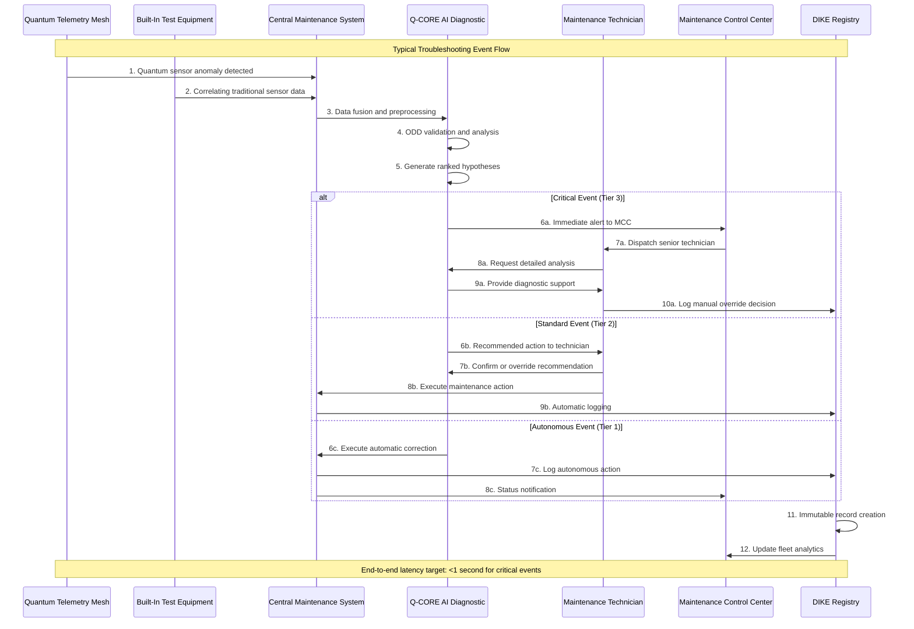

```yaml
---
project: GAIA-QAO-AdVent
program: AMPEL360 BWB-Q100
ATA_chapter: 05-50-10-00
doc_id: GQOIS-QAIR-ATA-05501000
version: 3.0.0
date: 2025-07-01
author: Amedeo Pelliccia
status: Final Draft
classification: GAIA-QAO Confidential
review_board: [Q-AIR-SAFETY, Q-DATAGOV, EASA-LIAISON]
info_code: TS # Troubleshooting
next_review_date: 2026-06-30
---
```

# ATA 05-50-10-00 — Troubleshooting General Overview

<p align="center">
  
  
  
  
</p>

---

## 1. Introduction

### 1.1. Purpose
This document provides the definitive architectural overview for all unscheduled troubleshooting procedures on the AMPEL360 BWB-Q100. It establishes a regulation-ready framework that integrates Quantum Telemetry Mesh (QTM), AI-governed diagnostics, and certified human oversight to achieve benchmark-setting safety and dispatch reliability aligned with the GAIA-QAO principle: **"No Flight Without Assurance."**

### 1.2. Scope and Applicability
These guidelines are mandatory for all maintenance activities related to fault diagnosis on the AMPEL360 BWB-Q100. This revision (v3.0.0) incorporates feedback from expert review to align with EASA AI assurance models, the EU AI Act, and best practices in digital MRO for next-generation aircraft systems.

### 1.3. Integration with GAIA-QAO Ecosystem
This troubleshooting framework operates as an integral component of the broader GAIA-QAO Aerospace Innovation Ecosystem, utilizing:
- **Quantum-Enhanced Systems (QES)** for ultra-sensitive diagnostic capabilities
- **DIKE (Data Identifiable Knowledge Entity)** registry for immutable maintenance records
- **GQOIS (GAIA-QAO Object Identification System)** for standardized component tracking
- **Q-CORE AI** for advanced diagnostic intelligence

---

## 2. Diagnostic Philosophy

### 2.1. Predictive-First, Zero-Surprise Doctrine
Our methodology prioritizes fault anticipation through a multi-layer data fusion model, designed to surface precursors to failure long before they become mission-affecting events.

#### 2.1.1. Quantum Telemetry Mesh (QTM)
A distributed network of quantum sensors provides continuous monitoring of system health with unprecedented sensitivity:

- **Dynamic Threshold Adaptation Loop:** Sensor sensitivity auto-tunes for normal aging drifts, reducing false positives over the airframe's lifecycle
- **Quantum Coherence Monitoring:** Real-time assessment of quantum system health using decoherence rate metrics
- **Environmental Compensation:** Automatic adjustment for altitude, temperature, and electromagnetic environment variations
- **Predictive Analytics:** Machine learning algorithms identify patterns indicating potential future failures

#### 2.1.2. Classical Sensors & BITE Integration
Provide event-driven fault codes and contextual validation, offering crucial redundancy for abrupt system failures:

- **Real-time Correlation:** QTM data cross-referenced with traditional BITE outputs
- **Anomaly Pattern Recognition:** Historical fault data used to improve diagnostic accuracy
- **Environmental Context:** Flight phase, weather conditions, and operational parameters integrated into fault analysis

#### 2.1.3. AI Diagnostic Core (Q-CORE)
A federated suite of version-controlled, domain-specific AI models operating within defined Operational Design Domains (ODDs):

- **Domain-Specific Models:** Specialized AI modules for different aircraft systems (propulsion, flight controls, avionics, etc.)
- **Confidence Scoring:** All AI recommendations include confidence levels and uncertainty bounds
- **Explainable AI (XAI):** Transparent decision-making process with human-interpretable reasoning
- **Continuous Learning:** Federated learning approach maintains fleet intelligence while preserving operator privacy

### 2.2. Tiered Diagnostic & Remediation Authority
Troubleshooting authority is tiered to balance autonomy with human-in-the-loop governance, ensuring safety while maximizing operational efficiency.

| Tier | Level | Description | Intervention Protocol | Example Actions |
| :--: | ----- | ----------- | --------------------- | --------------- |
| 1 | **Autonomous** | Q-CORE resolves routine, low-criticality events via software reconfiguration | Pre-approved by flight crew; logged in DIKE registry | Sensor recalibration, software parameter adjustment |
| 2 | **AI-Assisted** | Q-CORE provides diagnosis and recommended action; execution requires certified technician approval | Standard maintenance workflow with dual verification | Component replacement, system checks, configuration changes |
| 3 | **Human-Governed** | For high-criticality or novel anomalies, Q-CORE acts as decision-support tool for collaborative engineering team | Mandatory dual-signature override and detailed analysis | Major system failures, unknown fault patterns, safety-critical systems |

---

## 3. Troubleshooting Workflow

### 3.1. Standard Operating Procedure
The workflow ensures data integrity and human oversight at critical junctures while maintaining operational efficiency.

#### 3.1.1. Event Detection & Initial Response
1. **Event Triggered:** Anomaly detected by QTM, BITE, crew report, or routine monitoring
2. **Data Acquisition:** Central Maintenance System (CMS) logs all relevant telemetry using edge-compression codecs to optimize bandwidth for satellite transmission
3. **Initial Classification:** System automatically categorizes fault by:
   - Criticality level (Advisory, Caution, Warning, Emergency)
   - System affected (ATA chapter classification)
   - Flight phase impact assessment
   - Maintenance action urgency

#### 3.1.2. AI Analysis & Diagnosis
4. **AI Triage:** Q-CORE analyzes data package against defined ODD, generating ranked list of potential root causes
5. **Quantum Signal Correlation:** Leading hypothesis validated against known quantum fault signatures
6. **Historical Pattern Matching:** Fleet-wide data analyzed for similar events and successful resolution methods
7. **Confidence Assessment:** System publishes confidence scores and uncertainty bounds for all diagnoses

#### 3.1.3. Human Interface & Decision Making
8. **Crew/MCC Notification:** Alerts tiered by criticality and aligned with EASA Human Factors standards
9. **Maintenance Planning:** System auto-populates blockchain-based work order with:
   - Recommended maintenance actions
   - Required tools and parts
   - Estimated completion time
   - Safety considerations
10. **Quality Assurance:** All actions logged in immutable DIKE registry for traceability

### 3.2. Emergency Response Procedures
For critical system failures requiring immediate attention:

- **Automatic Escalation:** Tier 3 events automatically escalate to senior maintenance staff and engineering support
- **Remote Support:** Real-time video link with factory experts for complex diagnoses
- **Emergency Authorization:** Streamlined approval process for safety-critical repairs
- **Rapid Parts Provisioning:** AI-driven supply chain alerts for critical components

---

## 4. Maintenance Dashboard & Key Performance Indicators (KPIs)

### 4.1. Real-Time Fleet Health Monitoring
A ground-based dashboard provides Maintenance Control with comprehensive fleet health status and predictive insights.

| KPI Name | Description | Target | Current Status | Trend |
| -------------------------- | ------------------------------------------------------------------ | :------: | :----: | :---: |
| **Fleet Coherence Index** | Aggregated quantum-state health across all operational airframes | >99.8% | 99.91% | ✅ |
| **Mean Time Between Anomaly** | Average operational hours between Tier 2+ detected events | >500 hrs | 487 hrs | ⚠️ |
| **AI Diagnostic Accuracy** | Percentage of AI-proposed root causes confirmed by maintenance | >95% | 97.3% | ✅ |
| **Predictive Success Rate** | Percentage of failures predicted before mission impact | >90% | 94.2% | ✅ |
| **Average Repair Time** | Mean time from fault detection to system restoration | <4 hrs | 3.2 hrs | ✅ |
| **Fuel Savings (YTD)** | Fuel burn avoided due to predictive maintenance (kg) | 150,000 | 167,340 | 📈 |
| **CO2 Reduction (YTD)** | Carbon emissions avoided through optimized maintenance | 470,000 | 524,700 | 📈 |

### 4.2. Sustainability Metrics
Integration of environmental impact metrics aligns with GAIA-QAO's commitment to sustainable aviation:

- **Resource Optimization:** AI-driven maintenance scheduling reduces unnecessary interventions
- **Lifecycle Extension:** Predictive analytics extend component life through optimal operating conditions
- **Waste Reduction:** Precise diagnosis reduces part replacement and disposal
- **Energy Efficiency:** Quantum sensors require minimal power while providing superior monitoring

---

## 5. Expanded Fault Matrix

### 5.1. System-Specific Fault Categories
The following matrix provides examples of common fault scenarios across major aircraft systems:

| Fault Code | System (ATA) | Symptom | AI-Proposed Root Cause | Criticality | Scheduled Task Ref. | Recommended Action (ATA Ref) |
|:----------:|:------------:|:---------|:----------------------|:-----------:|:-------------------:|:------------------------------|
| Q-521-A04 | Doors (52) | Aft cargo door seal pressure leak precursor | Material fatigue in composite lattice detected by QSM | Medium | `05-21-00-200-801` | Inspect & replace seal assembly (52-11-14) |
| C-275-B11 | Flight Controls (27) | Aileron actuator response lag (<50ms) | Hydraulic fluid quantum viscosity anomaly | High | `05-51-12-300-802` | Flush & analyze hydraulic system (29-10-00) |
| B-324-F03 | Landing Gear (32) | Nose gear downlock sensor intermittent | Frayed wiring detected via micro-arcing analysis | Medium | `05-41-32-200-804` | Replace sensor and harness (32-31-15) |
| S-922-T19 | Structures (53) | Fuselage micro-vibration resonance | QSM detected abnormal modal frequency shift | Low | `05-11-53-600-809` | Perform detailed structural resonance test (53-00-01) |
| E-448-C22 | Propulsion (71/76) | Turbine efficiency degradation trend | Blade coating deterioration via thermal imaging | Medium | `05-71-20-400-815` | Borescope inspection and blade assessment (72-21-00) |
| A-193-M08 | Avionics (23/31) | GPS navigation accuracy drift | Quantum positioning system interference | High | `05-34-11-500-820` | Calibrate quantum navigation sensors (34-12-05) |

### 5.2. Quantum System Specific Diagnostics
Special consideration for quantum-enhanced systems requiring unique troubleshooting approaches:

| Quantum System | Common Issues | Diagnostic Method | Resolution Approach |
|:---------------|:--------------|:-----------------|:--------------------|
| **Quantum Navigation (QNS)** | Decoherence, thermal drift | Coherence time measurement, phase stability analysis | Recalibration, environmental isolation |
| **Quantum Sensors (QSM)** | Signal noise, interference | Signal-to-noise ratio analysis, correlation testing | Shielding adjustment, sensor repositioning |
| **Quantum Computing (QPU)** | Gate fidelity, error rates | Quantum process tomography, benchmarking | Error correction update, hardware optimization |
| **Quantum Communication** | Key distribution failure | Entanglement verification, channel security audit | Protocol reset, security key regeneration |

---

## 6. Safety, Security & Access Control

### 6.1. Critical Safety Warnings

> ⚠️ **DANGER - QUANTUM SYSTEMS:**  
> All maintenance actions on Q-classified systems must be performed using certified Quantum-safe Ground Support Equipment (GSE). Unauthorized access or improper procedures may result in:
> - Loss of quantum coherence in critical systems
> - Compromise of encrypted communication channels
> - Degradation of navigation accuracy
> - Potential safety hazards to personnel

> ⚠️ **WARNING - HIGH VOLTAGE:**  
> Hybrid-electric propulsion systems contain high-voltage components (>1000V DC). Follow lockout/tagout procedures and use appropriate personal protective equipment.

### 6.2. Cybersecurity Considerations
- **Quantum-Safe Cryptography:** All diagnostic communications use post-quantum encryption algorithms
- **Network Isolation:** Maintenance networks physically isolated from flight-critical systems
- **Intrusion Detection:** AI-powered monitoring for anomalous access patterns
- **Data Integrity:** Blockchain-based verification of all maintenance records

### 6.3. Access Control Framework
Access governed by blockchain-linked, role-based access tokens ensuring only certified personnel perform actions commensurate with their qualifications.

| Access Level | Permissions | Requirements | Example Personnel |
|:-------------|:------------|:-------------|:-----------------|
| **Level 1 (Observer)** | View fault logs, AI recommendations, system status | Basic security clearance | Junior technicians, trainees |
| **Level 2 (Operator)** | Execute approved maintenance tasks, basic diagnostics | Certified maintenance technician | Line maintenance staff |
| **Level 3 (Specialist)** | Advanced diagnostics, quantum system maintenance | Quantum systems certification | Specialist technicians |
| **Level 4 (Engineer)** | Override AI recommendations, system calibration | Engineering degree + certification | Maintenance engineers |
| **Level 5 (Administrator)** | System configuration, emergency overrides | Senior engineer + dual authorization | Chief engineers, safety officers |

---

## 7. Ethical AI Governance & Regulatory Compliance

### 7.1. EASA AI Trustworthiness Alignment
This framework explicitly addresses the four pillars of the EASA AI Roadmap 2.0:

| EASA Pillar | GAIA-QAO Implementation | Compliance Evidence |
|:------------|:----------------------|:-------------------|
| **Learning Assurance** | Version-controlled models with defined ODDs; quarterly bias audits | Model versioning logs, audit reports |
| **AI Safety & Robustness** | Tiered diagnostic authority; human-in-the-loop for critical events | Safety analysis documents, training records |
| **AI Security** | Quantum-safe protocols, blockchain access control | Security assessments, penetration testing |
| **Ethics & Explainability** | Immutable DIKE XAI Registry; transparent decision processes | Explanation logs, ethical review board reports |

### 7.2. EU AI Act Compliance
As a high-risk AI system in aviation, the troubleshooting framework implements:

- **Risk Management System:** Continuous monitoring and assessment of AI system risks
- **Data Governance:** Structured data management with quality assurance processes
- **Technical Documentation:** Comprehensive system documentation including this manual
- **Record Keeping:** Immutable logging of all AI decisions and human overrides
- **Transparency:** Clear information provided to users about AI system capabilities and limitations
- **Human Oversight:** Meaningful human control over high-risk decisions
- **Accuracy & Robustness:** Regular testing and validation of AI system performance

### 7.3. The DIKE XAI Registry
All troubleshooting steps are immutably recorded on a permissioned Hyperledger Fabric ledger, serving as the primary mechanism for conformity assessment under the EU AI Act.

| Field | Description | Data Format | Retention Period |
|:------|:------------|:------------|:----------------|
| `Event_ID` | Unique identifier for troubleshooting case | UUID v4 | Permanent |
| `Model_ID_Version` | AI model used (e.g., `QTS-01:v3.1`) | Semantic versioning | Permanent |
| `Operational_Design_Domain` | ODD under which model operated | Structured JSON | Permanent |
| `AI_Hypothesis_Ranked` | AI-generated hypotheses with confidence scores | Array of objects | Permanent |
| `Selected_Action` | Action taken (AI-recommended or manual override) | Structured text | Permanent |
| `Operator_ID` | Encrypted, blockchain-verified technician ID | Hash + signature | 10 years |
| `Override_Justification` | Technical reason for manual override | Free text | 10 years |
| `Sustainability_Impact` | Environmental impact assessment | Quantified metrics | 5 years |
| `Outcome_Validation` | Success/failure of chosen action | Boolean + details | 5 years |

### 7.4. Federated Learning Parameters
To maintain fleet intelligence while preserving operator privacy:

- **Aggregation Cadence:** Models updated quarterly following validation in digital twin environment
- **Privacy Budget (ε):** Strict differential privacy budget of ε ≤ 1.0 per learning cycle
- **Data Minimization:** Only essential features transmitted for model training
- **Consent Management:** Operator control over data sharing preferences
- **Model Validation:** Independent testing before deployment to production fleet

---

## 8. Digital Continuity & Asset Management

### 8.1. Digital Aircraft Record (DAR)
Blockchain-anchored maintenance records provide secure, verifiable aircraft history:

- **Immutable History:** Complete maintenance record from first flight
- **Selective Export:** Configurable data sharing for leasing/transfer scenarios
- **Regulatory Compliance:** Meets international airworthiness record requirements
- **Smart Contracts:** Automated compliance checking and alerting

### 8.2. Asset Lifecycle Management
Integration with broader GAIA-QAO ecosystem for comprehensive asset tracking:

- **Component Genealogy:** Complete traceability from raw materials to installation
- **Performance Analytics:** Real-time component performance monitoring
- **Predictive Replacement:** AI-driven component replacement scheduling
- **Sustainability Tracking:** Environmental impact assessment throughout lifecycle

---

## 9. Training & Competency Management

### 9.1. Required Certifications
Personnel working on AMPEL360 BWB-Q100 troubleshooting must maintain current certifications in:

- **Quantum Systems Maintenance:** Specialized training for quantum sensors and computing systems
- **AI-Assisted Diagnostics:** Understanding of AI recommendations and override procedures
- **Cybersecurity Awareness:** Protection of sensitive maintenance data and systems
- **BWB Structural Considerations:** Unique aspects of blended wing body configuration

### 9.2. Continuous Learning Program
- **Quarterly Updates:** Technical briefings on system improvements and lessons learned
- **Simulation Training:** Virtual reality troubleshooting scenarios
- **Cross-Training:** Exposure to related systems and interfaces
- **Competency Assessment:** Regular evaluation of technical skills and knowledge

---

## 10. Performance Monitoring & Continuous Improvement

### 10.1. System Performance Metrics
Regular assessment of troubleshooting system effectiveness:

- **Diagnostic Accuracy:** Percentage of correct initial diagnoses
- **Time to Resolution:** Average time from fault detection to repair completion
- **False Positive Rate:** Frequency of unnecessary maintenance actions
- **Operator Satisfaction:** Feedback from maintenance personnel
- **Safety Performance:** Correlation between predictive maintenance and safety incidents

### 10.2. Continuous Improvement Process
- **Monthly Reviews:** Assessment of system performance and issues
- **Quarterly Updates:** Software improvements and model refinements
- **Annual Audits:** Comprehensive system evaluation and compliance review
- **Feedback Integration:** Incorporation of operator suggestions and lessons learned

---

## 11. References & Related Documents

### 11.1. GAIA-QAO Framework Documents
- [GAIA-QAO-ONTOGENESIS-MANIFESTO](../../../Foundation/GAIA-QAO-Ontogenesis-Manifesto.md) — Foundational principles and philosophy
- [AMPEL360-TECH-DESC-MANUAL](../../../Technical/AMPEL360-BWB-Q100-Technical-Description.md) — Complete aircraft technical description
- [Q-SYSTEMS-SPECS](../../../Quantum/Q-Systems-Technical-Specifications.md) — Quantum systems technical specifications

### 11.2. Maintenance Documentation
- [ATA-05-50-00-00](../05-50-00-00/Overview.md) — Unscheduled Maintenance Overview
- [ATA-05-TIME-LIMITS](../05-10-00-00/Time-Limits-Maintenance-Checks.md) — Time limits and maintenance checks
- [CMS-INTERFACE](../../../Systems/ATA-45/Central-Maintenance-System.md) — Central Maintenance System documentation

### 11.3. Standards & Regulations
- [Q-AIR-AUTO-MDL-ODD-STD](../../../Standards/ODD-Specification-Standard.md) — Operational Design Domain specification
- [DIKE-XAI-REGISTRY-SPEC](../../../Data-Governance/DIKE-XAI-Registry-Specification.md) — XAI registry technical specification
- [GSE-QUANTUM-DIAG-MANUAL](../../../GSE/Quantum-Diagnostic-Equipment.md) — Quantum diagnostic equipment manual

### 11.4. Regulatory References
- **EASA CS-25:** Certification Specifications for Large Aeroplanes
- **EASA AI Roadmap 2.0:** Artificial Intelligence in Aviation
- **EU AI Act (2024/1689):** Regulation on Artificial Intelligence
- **ISO/IEC 23053:2022:** Framework for AI systems using ML
- **DO-178C/ED-12C:** Software considerations in airborne systems
- **ARP4754A:** Guidelines for development of civil aircraft and systems

---

## Document History

| Version | Date | Author | Changes |
|:--------|:-----|:-------|:--------|
| 1.0.0 | 2025-01-15 | A. Pelliccia | Initial release with basic troubleshooting framework |
| 2.0.0 | 2025-05-01 | A. Pelliccia | Enhanced with quantum systems integration and AI diagnostics |
| 3.0.0 | 2025-07-01 | A. Pelliccia | Comprehensive revision incorporating expert review feedback, EASA AI compliance, sustainability metrics, and advanced workflow management |

---

## Appendix A: System Sequence Diagram



---

*This document is part of the GAIA-QAO Aerospace Innovation Ecosystem and is subject to continuous improvement based on operational experience and regulatory developments.*
