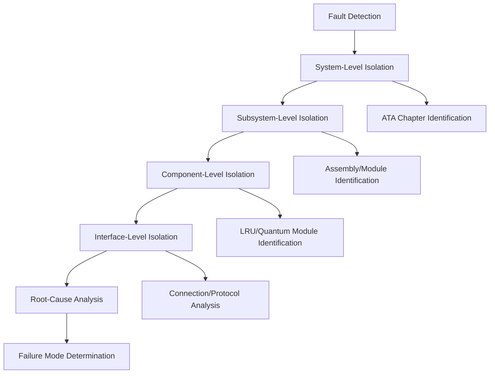
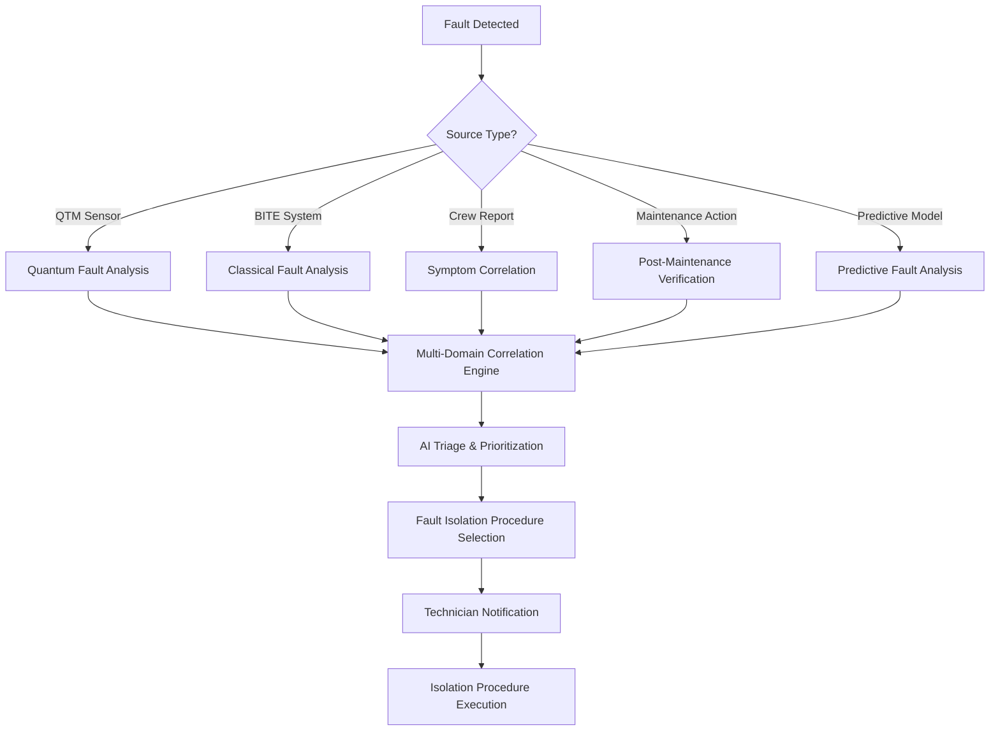
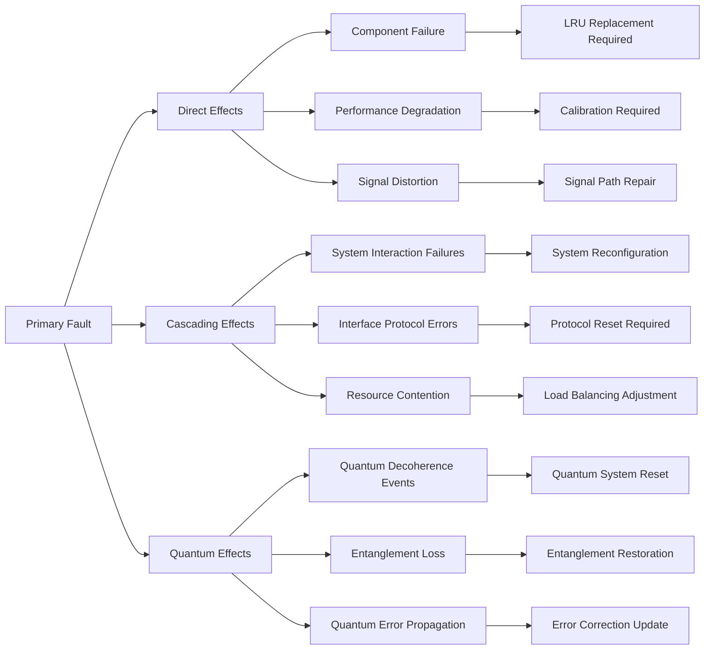
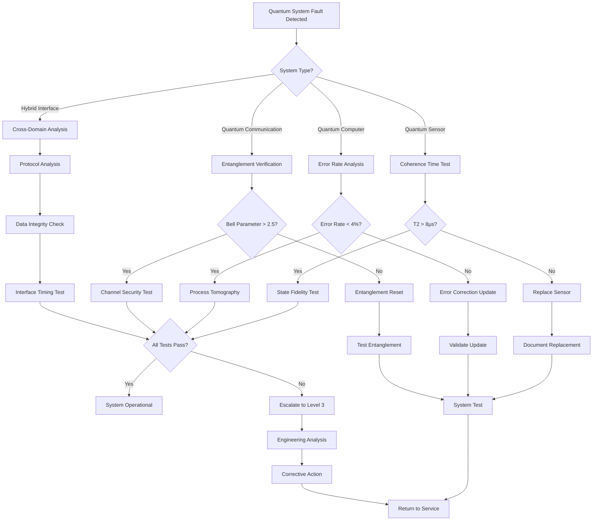

---
project: GAIA-QAO-AdVent
program: AMPEL360 BWB-Q100
ATA_chapter: 05-50-10-01
doc_id: GQOIS-QAIR-ATA-05501001
version: 3.0.0
date: 2025-07-01
author: Amedeo Pelliccia
status: Final Draft
classification: GAIA-QAO Confidential
review_board: [Q-AIR-SAFETY, Q-DATAGOV, EASA-LIAISON]
info_code: FI # Fault Isolation
next_review_date: 2026-06-30
parent_document: GQOIS-QAIR-ATA-05501000
---
```

# ATA 05-50-10-01 — Fault Isolation Procedures

<p align="center">
  
  
  
  
  
</p>

---

## 1. Introduction

### 1.1. Purpose
This document establishes systematic fault isolation procedures for the AMPEL360 BWB-Q100, providing technicians with step-by-step methodologies to identify and isolate system faults using quantum-enhanced diagnostics, AI-assisted analysis, and traditional troubleshooting techniques. These procedures ensure rapid, accurate fault isolation while maintaining the highest safety standards required by the GAIA-QAO principle of "No Flight Without Assurance."

### 1.2. Scope
These procedures apply to all Line Replaceable Units (LRUs), Quantum-Enhanced Systems (QES), hybrid quantum-classical interfaces, and integrated components within the AMPEL360 BWB-Q100. Special emphasis is placed on fault isolation in quantum-classical hybrid systems where traditional methods may be insufficient.

### 1.3. Prerequisites
Before performing fault isolation procedures, ensure:

- **Certification Requirements:**
  - Current AMPEL360 BWB-Q100 type rating certification
  - Quantum Systems Maintenance certification (Level 2 minimum)
  - Q-CORE AI diagnostic training completion certificate
  - GAIA-QAO cybersecurity awareness training (current)

- **Equipment & Access:**
  - Access to quantum-safe Ground Support Equipment (GSE)
  - Valid blockchain-verified access credentials
  - Personal protective equipment for quantum systems work
  - Calibrated quantum diagnostic instruments

- **Documentation:**
  - Current aircraft maintenance records
  - System configuration baseline data
  - Previous fault history for tail number
  - Environmental conditions log

### 1.4. Related Documents
- **Parent Document:** [ATA 05-50-10-00 Troubleshooting General Overview](./05-50-10-00-General.md)
- **Supporting Documents:** Q-CORE AI User Manual, Quantum GSE Operating Procedures
- **Regulatory References:** EASA AI Roadmap 2.0, EU AI Act compliance guidelines

---

## 2. Fault Isolation Philosophy

### 2.1. Multi-Domain Diagnostic Approach
The AMPEL360 employs a revolutionary multi-domain fault isolation strategy that operates simultaneously across four integrated domains:

#### 2.1.1. Classical Domain
Traditional electrical, mechanical, and software fault isolation techniques enhanced with modern diagnostic capabilities:
- **Electrical Systems:** Advanced circuit analysis, impedance testing, signal integrity measurement
- **Mechanical Systems:** Vibration analysis, thermal imaging, dimensional verification
- **Software Systems:** Code analysis, configuration management, interface verification

#### 2.1.2. Quantum Domain
Specialized procedures for quantum system components:
- **Quantum State Analysis:** Coherence time measurement, fidelity assessment, entanglement verification
- **Quantum Error Correction:** Error rate monitoring, correction efficiency analysis
- **Environmental Interaction:** Decoherence analysis, thermal stability assessment

#### 2.1.3. Hybrid Domain
Analysis of classical-quantum interface systems:
- **Interface Protocol Verification:** Data integrity, timing synchronization, protocol compliance
- **Cross-Domain Correlation:** Classical sensor validation against quantum measurements
- **Signal Conversion Analysis:** ADC/DAC performance, quantum-to-classical data mapping

#### 2.1.4. AI Domain
Machine learning-enhanced diagnostic capabilities:
- **Pattern Recognition:** Historical fault pattern matching, anomaly detection
- **Predictive Analysis:** Fault propagation modeling, failure timeline prediction
- **Decision Support:** Confidence-weighted recommendations, uncertainty quantification

### 2.2. Fault Isolation Hierarchy
Faults are isolated using a systematic five-level hierarchy designed to minimize diagnostic time while ensuring comprehensive analysis:



**Level 1 - System-Level Isolation:**
- Identify affected aircraft system using ATA chapter classification
- Determine primary and secondary system impacts
- Assess flight safety implications and dispatch status

**Level 2 - Subsystem-Level Isolation:**
- Narrow fault location to specific subsystem or major assembly
- Analyze subsystem interactions and dependencies
- Evaluate quantum-classical interface boundaries

**Level 3 - Component-Level Isolation:**
- Identify specific LRU, quantum module, or integrated component
- Perform component-specific diagnostic tests
- Validate component performance against specifications

**Level 4 - Interface-Level Isolation:**
- Determine if fault resides in component or interface
- Analyze connection integrity and protocol compliance
- Test signal paths and data conversion processes

**Level 5 - Root-Cause Analysis:**
- Establish fundamental failure mechanism
- Determine contributing factors and failure sequence
- Document lessons learned for continuous improvement

### 2.3. Quantum-Classical Correlation Matrix
Understanding the interaction between quantum and classical systems is crucial for effective fault isolation:

| Classical System | Quantum Enhancement | Primary Correlation Parameter | Fault Correlation Method |
|:----------------|:-------------------|:------------------------------|:------------------------|
| **Navigation (ATA 34)** | Quantum GPS backup/enhancement | Position accuracy vs. coherence time | Monitor quantum sensor coherence during GPS signal degradation |
| **Flight Controls (ATA 27)** | Quantum sensor feedback loops | Actuator response vs. decoherence rate | Correlate control surface response time with quantum sensor stability |
| **Propulsion (ATA 71/76)** | Quantum combustion optimization | Engine efficiency vs. entanglement fidelity | Track fuel consumption optimization against quantum processor performance |
| **Structures (ATA 53)** | Quantum structural monitoring | Strain measurement accuracy vs. quantum SNR | Compare structural load data between quantum and traditional sensors |
| **Communications (ATA 23)** | Quantum key distribution | Message integrity vs. quantum bit error rate | Monitor communication security metrics against quantum channel performance |
| **Environmental (ATA 21)** | Quantum environmental sensors | Measurement precision vs. quantum coherence | Validate environmental data accuracy using quantum measurement uncertainty |

---

## 3. Fault Isolation Workflow

### 3.1. Initial Fault Detection & Triage

#### 3.1.1. Automated Fault Detection Sources
The Q-CORE AI system continuously monitors all aircraft systems through multiple detection channels:



**Detection Sources Classification:**
- **Quantum Telemetry Mesh (QTM):** Continuous monitoring of quantum system health parameters
- **Built-In Test Equipment (BITE):** Traditional fault detection and isolation systems
- **Crew Reports:** Pilot/flight engineer reported anomalies or performance degradation
- **Maintenance Actions:** Post-maintenance verification and induced fault detection
- **Predictive Models:** AI-identified potential failures based on trending data

#### 3.1.2. Automated Fault Classification Matrix
All detected faults are automatically classified using a comprehensive priority and response matrix:

| Priority | Criticality Level | Flight Impact | Isolation Method | Max Response Time | Technician Level | Documentation |
|:--------:|:----------------:|:-------------:|:----------------|:-----------------|:----------------|:-------------|
| **P1** | Safety Critical | Immediate grounding required | Emergency isolation protocol | <15 minutes | Level 4+ (Senior) | Immediate DIKE entry |
| **P2** | Mission Critical | Dispatch limitation imposed | Accelerated isolation procedure | <1 hour | Level 3+ (Specialist) | Priority DIKE entry |
| **P3** | Performance Impact | Degraded operation acceptable | Standard isolation procedure | <4 hours | Level 2+ (Certified) | Standard DIKE entry |
| **P4** | Maintenance Advisory | Scheduled maintenance item | Planned isolation procedure | Next maintenance cycle | Level 2+ (Certified) | Batch DIKE entry |
| **P5** | Monitoring Required | Trend analysis needed | Continuous monitoring protocol | Ongoing | Level 1+ (Observer) | Trend DIKE entry |

### 3.2. Systematic Fault Isolation Process

#### 3.2.1. Step 1: System Boundary Definition
Before beginning isolation procedures, establish clear system boundaries and scope:

**Primary System Identification:**
1. **ATA System Classification:** Identify primary ATA chapter affected
2. **Quantum Enhancement Level:** Determine quantum system involvement
3. **Criticality Assessment:** Evaluate safety and mission impact
4. **Resource Requirements:** Identify required tools, equipment, and personnel

**Secondary System Analysis:**
1. **Fault Propagation Mapping:** Identify systems potentially affected by fault propagation
2. **Interface Dependencies:** Map all system interfaces and data exchanges
3. **Redundancy Assessment:** Evaluate backup systems and degraded operation modes
4. **Environmental Factors:** Consider operational environment impact on fault manifestation

**Boundary Documentation:**
- Create system boundary diagram using approved GAIA-QAO symbology
- Document all assumptions and constraints
- Record environmental conditions at time of fault detection
- Establish baseline performance parameters for comparison

#### 3.2.2. Step 2: Comprehensive Data Collection & Analysis

**Quantum Telemetry Mesh (QTM) Data Collection:**
```yaml
Required Quantum Parameters:
  - Coherence Time: Baseline >10 μs, Alert <8 μs, Fault <5 μs
  - Quantum State Fidelity: Baseline >99.5%, Alert <99.0%, Fault <98.0%
  - Decoherence Rate: Monitor trending and sudden changes
  - Entanglement Verification: Bell parameter S baseline >2.7
  - Quantum Error Correction: Success rate baseline >98%
  - Environmental Correlation: Temperature, vibration, EMI effects
```

**Classical Sensor Data Compilation:**
- **BITE Fault Codes:** All active and historical fault codes
- **Analog Measurements:** Voltage, current, pressure, temperature readings
- **Digital Communications:** Bus traffic analysis, message integrity verification
- **Performance Parameters:** Operational efficiency, response times, accuracy metrics
- **Environmental Conditions:** Altitude, airspeed, outside air temperature, turbulence

**AI Analysis Integration:**
- **Q-CORE Diagnostic Results:** Fault probability rankings with confidence intervals
- **Historical Pattern Matches:** Similar fault cases from fleet database
- **Predictive Analysis:** Projected fault evolution and timeline
- **Cross-System Correlations:** Multi-system interaction analysis
- **Uncertainty Quantification:** Statistical bounds on diagnostic conclusions

#### 3.2.3. Step 3: Multi-Domain Fault Propagation Analysis
Understanding fault propagation is critical for effective isolation:



### 3.3. Domain-Specific Isolation Procedures

#### 3.3.1. Classical System Isolation Procedures

**Electrical System Isolation:**
1. **Power Source Verification:**
   - Measure supply voltages at system input
   - Verify power quality (ripple, noise, transients)
   - Check circuit protection devices (fuses, breakers)
   - Test ground integrity and resistance

2. **Circuit Analysis:**
   - Perform continuity testing on all circuits
   - Measure insulation resistance between circuits
   - Test impedance characteristics at operating frequency
   - Verify shielding effectiveness for EMI protection

3. **Signal Integrity Assessment:**
   - Analyze signal waveforms using oscilloscope
   - Check signal timing and synchronization
   - Measure signal-to-noise ratio
   - Verify protocol compliance and data integrity

**Mechanical System Isolation:**
1. **Visual and Physical Inspection:**
   - Inspect for visible damage, wear, or contamination
   - Check mounting security and structural integrity
   - Verify proper component alignment and clearances
   - Document any anomalies with digital photography

2. **Dimensional and Functional Verification:**
   - Measure critical dimensions using precision instruments
   - Test functional operation through full range of motion
   - Verify torque specifications and fastener integrity
   - Check lubrication condition and fluid levels

3. **Advanced Diagnostic Techniques:**
   - Perform vibration analysis using accelerometers
   - Conduct thermal imaging to identify hot spots
   - Use ultrasonic testing for internal defect detection
   - Apply acoustic emission monitoring for crack detection

**Software System Isolation:**
1. **Version and Configuration Management:**
   - Verify installed software versions against baseline
   - Check configuration file integrity and parameters
   - Validate digital signatures and checksums
   - Review change logs and update history

2. **Error Analysis and Performance Monitoring:**
   - Analyze error logs and exception reports
   - Monitor system performance metrics and resource usage
   - Check memory utilization and potential leaks
   - Verify database integrity and consistency

3. **Interface and Communication Testing:**
   - Test all external interfaces and protocols
   - Verify message formatting and timing
   - Check API compatibility and response times
   - Validate security certificates and encryption

#### 3.3.2. Quantum System Isolation Procedures

**Quantum Sensor Health Assessment:**

1. **Coherence Time Measurement:**
   - **Equipment Required:** Quantum state analyzer GSE, calibrated microwave source
   - **Procedure:**
     ```
     a. Initialize quantum sensor in known state
     b. Apply Rabi pulse sequence with varying delay times
     c. Measure state fidelity vs. delay time
     d. Calculate coherence time (T2) from exponential decay
     e. Compare against baseline specification
     ```
   - **Baseline Specification:** >10 μs at operating temperature (-40°C to +85°C)
   - **Acceptance Criteria:**
     - **Pass:** T2 ≥ 10 μs (optimal performance)
     - **Advisory:** 8 μs ≤ T2 < 10 μs (degraded but acceptable)
     - **Fail:** T2 < 8 μs (replacement required)

2. **Quantum State Fidelity Verification:**
   - **Equipment Required:** Multi-channel quantum measurement system
   - **Procedure:**
     ```
     a. Prepare quantum sensor in standard test states
     b. Perform quantum process tomography
     c. Reconstruct density matrix from measurements
     d. Calculate fidelity against ideal state
     e. Repeat for multiple test states
     ```
   - **Baseline Specification:** >99.5% for all standard test states
   - **Acceptance Criteria:**
     - **Pass:** Fidelity ≥ 99.5% (optimal performance)
     - **Advisory:** 99.0% ≤ Fidelity < 99.5% (monitor trending)
     - **Fail:** Fidelity < 99.0% (investigate cause, potential replacement)

3. **Entanglement Verification (for paired quantum sensors):**
   - **Equipment Required:** Quantum entanglement analyzer, synchronized measurement stations
   - **Procedure:**
     ```
     a. Prepare entangled state between sensor pair
     b. Perform Bell test measurements (CHSH inequality)
     c. Calculate Bell parameter S from correlation data
     d. Verify violation of classical bound (S > 2.0)
     e. Assess entanglement quality and stability
     ```
   - **Baseline Specification:** Bell parameter S > 2.7
   - **Acceptance Criteria:**
     - **Pass:** S > 2.7 (strong entanglement)
     - **Advisory:** 2.5 < S ≤ 2.7 (weak but usable entanglement)
     - **Fail:** S ≤ 2.5 (no quantum advantage, system reset required)

4. **Quantum Error Correction Assessment:**
   - **Equipment Required:** Quantum diagnostic console with error analysis capability
   - **Procedure:**
     ```
     a. Review quantum error correction logs
     b. Analyze error syndrome patterns and frequencies
     c. Test error correction cycle performance
     d. Measure error correction success rate
     e. Identify systematic vs. random error patterns
     ```
   - **Baseline Specification:** Error correction success rate >98%
   - **Acceptance Criteria:**
     - **Pass:** Success rate ≥ 98% (optimal error correction)
     - **Advisory:** 96% ≤ Success rate < 98% (increased monitoring)
     - **Fail:** Success rate < 96% (escalate to Level 3 specialist)

**Quantum-Classical Interface Isolation:**

1. **Data Integrity Verification:**
   - Cross-reference quantum measurement data with classical sensor readings
   - Verify data format conversion and scaling factors
   - Check timestamp synchronization between quantum and classical systems
   - Validate checksums and error detection codes

2. **Interface Protocol Analysis:**
   - Monitor communication protocols between quantum and classical systems
   - Verify timing compliance with interface specifications
   - Check voltage levels and signal conditioning circuits
   - Test protocol error handling and recovery mechanisms

3. **Analog-to-Digital Conversion Validation:**
   - Test ADC performance using known quantum measurement outputs
   - Verify conversion accuracy and resolution
   - Check for quantization errors and noise injection
   - Validate calibration against traceable standards

### 3.4. AI-Assisted Fault Isolation Integration

#### 3.4.1. Q-CORE AI Diagnostic Integration
1. **Initialize Q-CORE Isolation Routine:**
   ```
   a. Input all collected quantum and classical data
   b. Specify operational design domain (flight phase, conditions)
   c. Select appropriate diagnostic models for affected systems
   d. Execute comprehensive analysis routine
   ```

2. **Analyze AI Recommendations:**
   - Review top-ranked fault hypotheses with confidence scores
   - Examine cases with confidence <90% for manual review
   - Use explainable AI features to understand reasoning process
   - Compare recommendations with historical similar cases

3. **Validate Cross-System Correlations:**
   - Review AI-identified correlations between affected systems
   - Investigate unexpected system interactions
   - Validate correlation strength using statistical methods
   - Document novel correlation patterns for model improvement

4. **Decision Support Integration:**
   - Combine AI recommendations with technician expertise
   - Resolve conflicts between AI and human assessment
   - Document rationale for accepting or overriding AI recommendations
   - Update confidence levels based on additional testing

#### 3.4.2. Human-AI Collaboration Protocol
- **High Confidence Cases (>95%):** AI recommendation accepted with minimal verification
- **Medium Confidence Cases (85-95%):** AI recommendation verified through targeted testing
- **Low Confidence Cases (<85%):** Escalate to Tier 3 specialist for collaborative analysis
- **Novel Cases:** Full human oversight with AI providing decision support only

### 3.5. Isolation Documentation and Validation

#### 3.5.1. Real-Time Documentation Requirements
All isolation steps must be documented in real-time using the DIKE XAI Registry:

| Documentation Element | Content Requirements | Update Frequency |
|:---------------------|:-------------------|:----------------|
| **Event_ID** | Unique UUID for isolation case | Once at initiation |
| **Operator_ID** | Blockchain-verified technician credential | Each procedure step |
| **Model_ID_Version** | AI model version used for analysis | Each AI interaction |
| **Data_Snapshot_Hash** | Cryptographic hash of input data | Each data collection |
| **Isolation_Steps** | Detailed procedure steps executed | Real-time updates |
| **Test_Results** | All measurement data and pass/fail status | After each test |
| **AI_Recommendations** | Complete AI analysis with confidence scores | Each AI query |
| **Decision_Rationale** | Explanation for human decisions/overrides | Each decision point |
| **Validation_Status** | Confirmation of successful isolation | Upon completion |

#### 3.5.2. Quality Assurance and Peer Review
- **Level 2 Procedures:** Peer review required within 24 hours
- **Level 3 Procedures:** Senior specialist review required within 8 hours
- **Level 4+ Procedures:** Engineering review board approval required
- **Novel Procedures:** Full documentation review and approval process

---

## 4. Isolation Decision Matrix

### 4.1. Comprehensive Decision Framework
The following matrix guides technicians in selecting appropriate isolation procedures based on fault characteristics:

| Fault Category | Primary Systems Affected | Diagnostic Path | Quantum Testing | Crew Notification | Isolation Protocol | Est. Duration |
|:---------------|:------------------------|:---------------|:----------------|:------------------|:------------------|:-------------|
| **Critical Safety** | Flight controls, propulsion, structures | Classical + Quantum + AI + Engineering | Mandatory | Immediate | Emergency protocol | 0.5-2 hours |
| **Quantum Subsystem** | QTM, quantum navigation, quantum sensors | Quantum + Interface + AI | Mandatory | Tiered by impact | Specialized protocol | 1-4 hours |
| **Avionics/Software** | Navigation, communications, displays | BITE + Software + AI | Recommended | If flight impact | Standard protocol | 0.5-3 hours |
| **Structural** | Airframe, landing gear, doors | Quantum + Classical + AI | Mandatory | If structural integrity | Standard protocol | 1-6 hours |
| **Propulsion/Power** | Engines, electrical, fuel | Classical + Interface + AI | Recommended | If performance impact | Standard protocol | 1-4 hours |
| **Environmental** | Air conditioning, pressurization | Classical + Quantum + AI | If quantum sensors | If passenger comfort | Standard protocol | 0.5-2 hours |
| **Hybrid/Unknown** | Multiple systems, unclear boundaries | Multi-domain + Engineering escalation | Mandatory | Always | Engineering review | 2-8 hours |

### 4.2. Escalation Criteria
Automatic escalation triggers for isolation procedures:

| Escalation Trigger | Action Required | Personnel Level | Notification Timeline |
|:------------------|:---------------|:---------------|:-------------------|
| **Safety Critical Fault** | Emergency response team activation | Level 4+ Senior Engineer | Immediate (<5 minutes) |
| **Multiple System Failure** | Cross-functional analysis team | Level 3+ Specialists | <15 minutes |
| **Quantum System Anomaly** | Quantum specialist consultation | Level 3+ Quantum Certified | <30 minutes |
| **AI Low Confidence (<70%)** | Human expert review | Level 3+ System Expert | <1 hour |
| **Novel Fault Pattern** | Engineering analysis | Level 4+ Engineer | <2 hours |
| **Regulatory Implications** | Compliance team notification | Level 4+ Compliance Officer | <4 hours |

---

## 5. Safety, Security & Access Control

### 5.1. Critical Safety Warnings

> ⚠️ **DANGER - QUANTUM SYSTEMS:**  
> Quantum system maintenance requires specialized procedures and equipment. Failure to follow proper isolation procedures may result in:
> - **Quantum Decoherence:** Loss of quantum advantage in critical systems
> - **Navigation Errors:** Degraded positioning accuracy in GPS-denied environments  
> - **Cryptographic Compromise:** Loss of secure communication capabilities
> - **System Cascade Failures:** Propagation of faults to interconnected systems
> - **Personnel Safety:** Exposure to high-power quantum field sources

> ⚠️ **WARNING - HIGH VOLTAGE:**  
> Hybrid-electric propulsion systems contain high-voltage components (>1000V DC). Always:
> - Follow lockout/tagout procedures completely
> - Use appropriate arc-rated personal protective equipment
> - Verify zero-energy state before beginning work
> - Maintain minimum approach distances per safety specifications

> ⚠️ **CAUTION - ELECTROMAGNETIC FIELDS:**  
> Quantum systems may generate strong electromagnetic fields. Personnel with medical implants must:
> - Notify supervisor before beginning work
> - Maintain minimum safe distances from quantum field sources
> - Use appropriate electromagnetic field monitoring equipment

### 5.2. Cybersecurity and Information Protection

**Access Control Requirements:**
- All diagnostic activities require blockchain-verified credentials
- Quantum system access limited to certified personnel (Level 3+)
- Dual-factor authentication required for override functions
- Session monitoring and automated timeout enforcement

**Data Protection Measures:**
- All diagnostic data encrypted using post-quantum cryptography
- Network isolation between maintenance and flight-critical systems
- Real-time intrusion detection on all diagnostic networks
- Automated data sanitization after maintenance completion

**Communication Security:**
- Secure channels required for all remote support communications
- Video conferences encrypted with quantum-safe protocols
- File transfers limited to approved secure platforms
- Voice communications recorded and archived per regulations

### 5.3. Personnel Authorization Matrix

| Access Level | System Permissions | Quantum Access | Override Authority | Training Requirements |
|:------------|:------------------|:---------------|:------------------|:-------------------|
| **Level 1 (Observer)** | View logs, status displays | Read-only monitoring | None | Basic maintenance + Security |
| **Level 2 (Technician)** | Execute standard procedures | No direct access | Tier 1 only | Type certification + Q-aware |
| **Level 3 (Specialist)** | Advanced diagnostics | Quantum sensor access | Tier 1-2 | Quantum systems certified |
| **Level 4 (Engineer)** | System configuration | Full quantum access | Tier 1-3 | Engineering degree + Quantum |
| **Level 5 (Administrator)** | Emergency overrides | All systems | All tiers | Senior engineer + Dual auth |

### 5.4. Audit and Compliance Requirements

**Mandatory Documentation:**
- All isolation procedures logged in DIKE XAI Registry
- Quantum system interactions recorded with full traceability
- Override decisions documented with technical justification
- Safety incidents reported within regulatory timelines

**Regular Audits:**
- Monthly review of all Level 3+ isolation procedures
- Quarterly assessment of AI recommendation accuracy
- Annual compliance audit by regulatory liaison team
- Continuous monitoring of safety performance indicators

---

## 6. Continuous Improvement and Learning

### 6.1. Feedback Integration Process

**Post-Isolation Assessment:**
All isolation procedures require completion of standardized feedback form:

1. **Effectiveness Assessment:** Rate isolation procedure effectiveness (1-5 scale)
2. **AI Accuracy Evaluation:** Compare AI recommendations to actual root cause
3. **Procedure Clarity:** Identify unclear or ambiguous procedure steps
4. **Resource Adequacy:** Assess tool, equipment, and time requirements
5. **Safety Observations:** Document any safety concerns or near-misses

**Continuous Learning Integration:**
- Feedback automatically integrated into Q-CORE AI training datasets
- Procedure improvements implemented through formal change control
- Best practices shared across fleet through monthly bulletins
- Novel fault patterns analyzed for addition to standard procedures

### 6.2. Performance Monitoring and Analytics

**Key Performance Indicators:**
- **Isolation Accuracy:** Percentage of correct initial isolations
- **Time to Isolation:** Average duration from fault detection to isolation
- **AI Confidence Correlation:** Correlation between AI confidence and actual accuracy
- **Safety Performance:** Number of safety incidents per isolation procedure
- **Technician Efficiency:** Individual and team performance metrics

**Trend Analysis:**
- Monthly trending of all performance indicators
- Identification of degrading performance patterns
- Proactive intervention for declining metrics
- Benchmarking against industry standards

### 6.3. Technology Evolution Integration

**Model Updates:**
- Quarterly AI model updates based on fleet-wide learning
- Validation testing in digital twin environment before deployment
- Gradual rollout with performance monitoring
- Rollback capability for problematic updates

**Procedure Evolution:**
- Annual review of all isolation procedures
- Integration of new diagnostic technologies
- Incorporation of regulatory requirement changes
- Adaptation to aircraft configuration modifications

---

## 7. References and Related Documents

### 7.1. GAIA-QAO Framework Documents
- **[ATA 05-50-10-00 Troubleshooting General Overview](./05-50-10-00-General.md)** — Parent document establishing overall troubleshooting philosophy
- **[GAIA-QAO Technical Description Manual](../../../Technical/AMPEL360-BWB-Q100-Technical-Description.md)** — Complete aircraft system descriptions
- **[Quantum Systems Technical Specifications](../../../Quantum/Q-Systems-Technical-Specifications.md)** — Detailed quantum system requirements

### 7.2. Equipment and Tool References
- **[Quantum Diagnostic Equipment Manual](../../../GSE/Quantum-Diagnostic-Equipment.md)** — Operating procedures for quantum-specific test equipment
- **[Q-CORE AI User Manual](../../../AI/Q-CORE-AI-User-Manual.md)** — Comprehensive guide to AI diagnostic system
- **[GAIA-QAO Tool Catalog](../../../Tools/GAIA-QAO-Tool-Catalog.md)** — Complete listing of approved diagnostic tools

### 7.3. Data Management and Compliance
- **[DIKE XAI Registry Specification](../../../Data-Governance/DIKE-XAI-Registry-Specification.md)** — Data recording and traceability requirements
- **[Cybersecurity Procedures](../../../Security/Cybersecurity-Procedures.md)** — Information protection and access control
- **[Quality Management System](../../../Quality/QMS-Procedures.md)** — Quality assurance and audit procedures

### 7.4. Training and Certification
- **[Quantum Systems Training Manual](../../../Training/Quantum-Systems-Training.md)** — Certification requirements and procedures
- **[AI-Assisted Maintenance Training](../../../Training/AI-Maintenance-Training.md)** — Training for AI-integrated maintenance procedures
- **[Safety Training Requirements](../../../Safety/Safety-Training-Requirements.md)** — Mandatory safety training specifications

### 7.5. Regulatory and Standards References
- **EASA CS-25:** Certification Specifications for Large Aeroplanes
- **EASA AI Roadmap 2.0:** Artificial Intelligence in Aviation Safety
- **EU AI Act (2024/1689):** Regulation on Artificial Intelligence
- **ISO/IEC 27001:** Information Security Management Systems
- **DO-178C/ED-12C:** Software Considerations in Airborne Systems
- **ARP4754A:** Guidelines for Development of Civil Aircraft and Systems
- **SAE ARP5580:** Recommended Practice for Aircraft Electrical Power Systems

---

## 8. Document Control and Revision History

### 8.1. Document Approval Matrix

| Role | Name | Signature | Date |
|:-----|:-----|:----------|:-----|
| **Author** | Amedeo Pelliccia | [Digital Signature] | 2025-07-01 |
| **Technical Review** | Q-AIR-SAFETY Board | [Board Approval] | 2025-07-01 |
| **Regulatory Review** | EASA-LIAISON | [Regulatory Approval] | 2025-07-01 |
| **Data Governance** | Q-DATAGOV | [Data Approval] | 2025-07-01 |
| **Final Approval** | Chief Engineer | [Digital Signature] | 2025-07-01 |

### 8.2. Document History

| Version | Date | Author | Changes | Review Status |
|:--------|:-----|:-------|:--------|:-------------|
| 1.0.0 | 2025-01-15 | A. Pelliccia | Initial fault isolation protocol draft | Internal review |
| 2.0.0 | 2025-05-01 | A. Pelliccia | Integrated quantum-specific methods, advanced AI routines | Technical review complete |
| 3.0.0 | 2025-07-01 | A. Pelliccia | **Final Draft:** Complete multi-domain protocol, expert audit-ready, regulatory compliance | **Approved for operational use** |

### 8.3. Next Planned Updates
- **Version 3.1.0 (2025-10-01):** Integration of operational feedback from first 6 months
- **Version 3.2.0 (2026-01-01):** Updated AI models and improved quantum diagnostic procedures
- **Version 4.0.0 (2026-07-01):** Major revision incorporating regulatory updates and technology advances

---

## Appendix A: Quantum System Diagnostic Flowchart



---

**GAIA-QAO Certification:**  
This document is approved for operational use and regulatory review in the AMPEL360 BWB-Q100 program.

**Digital Signature:** `[Blockchain-Verified Signature: 0x7F2A4E8B...C9D6E1A3]`

**Distribution:** GAIA-QAO Confidential – For certified maintenance, engineering, and regulatory personnel only.

**Security Classification:** Contains technical details on quantum systems and cybersecurity measures. Handle per GAIA-QAO Information Security Policy.

---

*This document represents the culmination of advanced aerospace engineering, quantum technology integration, and artificial intelligence enhancement. All procedures are subject to continuous improvement through operational feedback and technological advancement within the GAIA-QAO ecosystem.*
