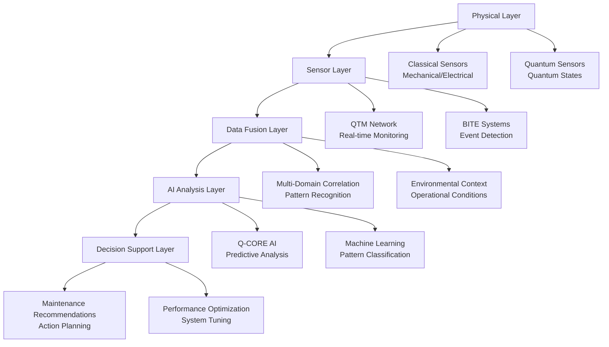
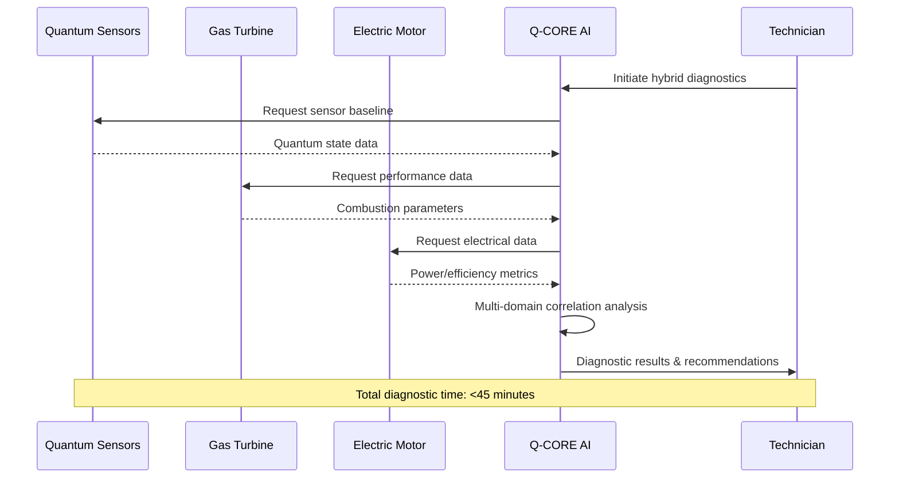
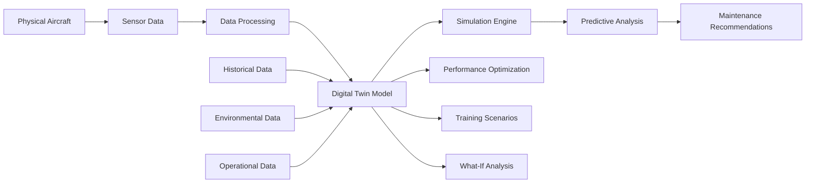
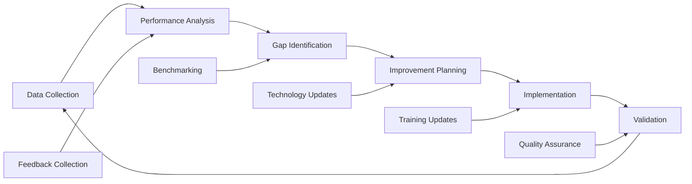
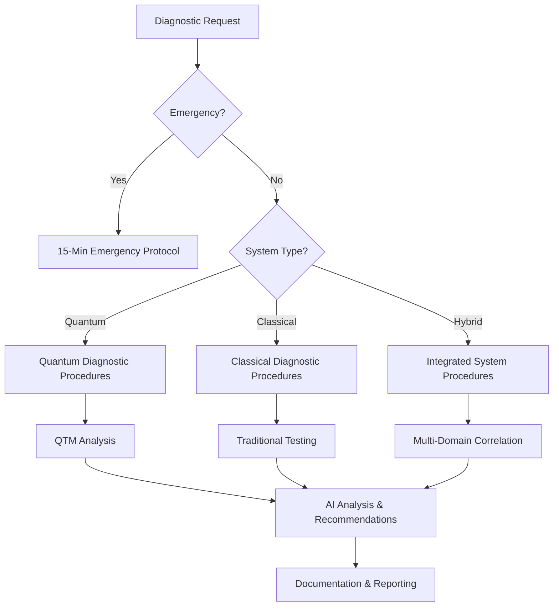

```yaml
---
project: GAIA-QAO-AdVent
program: AMPEL360 BWB-Q100
ATA_chapter: 05-50-10-02
doc_id: GQOIS-QAIR-ATA-05501002
version: 3.0.0
date: 2025-07-01
author: Amedeo Pelliccia
status: Final Draft
classification: GAIA-QAO Confidential
review_board: [Q-AIR-SAFETY, Q-DATAGOV, EASA-LIAISON]
info_code: DP # Diagnostic Procedures
next_review_date: 2026-06-30
parent_document: GQOIS-QAIR-ATA-05501001
---
```

# ATA 05-50-10-02 — Diagnostic Procedures

<p align="center">
  
  
  
  
  
</p>

---

## 1. Introduction

### 1.1. Purpose
This document establishes comprehensive diagnostic procedures for the AMPEL360 BWB-Q100, providing detailed methodologies for system health assessment, performance verification, and predictive maintenance analysis using quantum-enhanced diagnostics, AI-assisted analysis, and traditional testing methods.

### 1.2. Scope
These procedures apply to all aircraft systems requiring diagnostic analysis, with special emphasis on:
- Quantum-enhanced systems and their classical interfaces
- AI-assisted diagnostic protocols
- Predictive maintenance algorithms
- Multi-domain system interactions
- Performance optimization verification

### 1.3. Diagnostic Philosophy Integration
This document builds upon the fault isolation procedures (ATA 05-50-10-01) to provide deeper diagnostic analysis capabilities that support:
- **Predictive Maintenance:** Anticipating failures before they occur
- **Performance Optimization:** Maintaining peak system efficiency
- **Health Monitoring:** Continuous assessment of system wellness
- **Certification Compliance:** Meeting regulatory diagnostic requirements

---

## 2. Diagnostic Framework Architecture

### 2.1. Multi-Layer Diagnostic Model
The AMPEL360 diagnostic framework operates across five integrated layers:



### 2.2. Diagnostic Data Types & Sources

#### 2.2.1. Quantum Diagnostic Data
| Data Type | Source | Frequency | Precision | Applications |
|:----------|:-------|:----------|:----------|:-------------|
| **Coherence Time** | Quantum sensors | Continuous | ±0.1 μs | System health monitoring |
| **Quantum State Fidelity** | QPU modules | Per operation | ±0.01% | Performance verification |
| **Decoherence Rate** | Environmental monitors | 1 kHz | ±1 Hz | Predictive maintenance |
| **Entanglement Strength** | Communication systems | Per message | ±0.1 dB | Security validation |
| **Quantum Error Rate** | Error correction systems | Continuous | ±0.001% | Reliability assessment |

#### 2.2.2. Classical Diagnostic Data
| Data Type | Source | Frequency | Precision | Applications |
|:----------|:-------|:----------|:----------|:-------------|
| **Vibration Signature** | Accelerometers | 10 kHz | ±0.001g | Mechanical health |
| **Thermal Profile** | Temperature sensors | 1 Hz | ±0.1°C | Thermal management |
| **Electrical Parameters** | Power monitors | 1 kHz | ±0.1% | Electrical health |
| **Fluid Dynamics** | Pressure sensors | 100 Hz | ±0.01% | Hydraulic/pneumatic |
| **Acoustic Signature** | Microphones | 20 kHz | ±1 dB | Noise/vibration analysis |

#### 2.2.3. Operational Context Data
| Data Type | Source | Frequency | Applications |
|:----------|:-------|:----------|:-------------|
| **Flight Phase** | Flight management system | Event-driven | Diagnostic context |
| **Environmental Conditions** | Weather systems | 1 Hz | Performance correlation |
| **Loading Conditions** | Weight & balance | Pre-flight/Event | Stress analysis |
| **Pilot Actions** | Flight controls | Event-driven | Human factors analysis |
| **Maintenance History** | DIKE registry | Query-based | Historical correlation |

---

## 3. System-Specific Diagnostic Procedures

### 3.1. Propulsion System Diagnostics (ATA 71/76)

#### 3.1.1. Quantum-Enhanced Engine Health Monitoring
The hybrid-electric propulsion system incorporates quantum sensors for unprecedented diagnostic precision:

**Quantum Combustion Optimization Diagnostics:**
```yaml
Procedure: QCO-DIAG-001
Duration: 30 minutes
Prerequisites: 
  - Engine at stable idle
  - Quantum systems operational
  - Environmental monitoring active

Steps:
  1. Initialize quantum combustion sensors
  2. Baseline quantum state measurement
  3. Fuel injection pattern analysis
  4. Combustion efficiency quantum correlation
  5. Emission spectrum quantum analysis
  6. Performance optimization recommendations

Pass/Fail Criteria:
  - Combustion efficiency: >98.5% (Pass), 95-98.5% (Caution), <95% (Fail)
  - Quantum correlation: >0.95 (Pass), 0.85-0.95 (Caution), <0.85 (Fail)
  - Emission compliance: Within regulatory limits
```

**Electric Motor Diagnostic Protocol:**
```yaml
Procedure: EM-DIAG-002
Duration: 20 minutes
Prerequisites:
  - Motor at operating temperature
  - High-voltage systems energized
  - Quantum magnetic field sensors active

Diagnostic Sequence:
  1. Stator winding resistance measurement
  2. Rotor balance analysis via quantum accelerometry
  3. Magnetic field uniformity assessment
  4. Power electronics efficiency analysis
  5. Thermal signature evaluation
  6. Vibration signature analysis

Performance Thresholds:
  - Motor efficiency: >97% (Excellent), >95% (Good), >90% (Acceptable), <90% (Action Required)
  - Vibration levels: <0.1g RMS (Excellent), <0.3g RMS (Good), <0.5g RMS (Acceptable)
  - Temperature distribution: ±5°C (Excellent), ±10°C (Good), ±20°C (Acceptable)
```

#### 3.1.2. Integrated Propulsion System Analysis
**Hybrid System Coordination Diagnostics:**


### 3.2. Flight Control System Diagnostics (ATA 27)

#### 3.2.1. Quantum-Enhanced Actuator Monitoring
**Primary Flight Control Actuator Diagnostics:**

```yaml
Procedure: PFC-QDIAG-003
System: Primary Flight Controls (Elevons, Rudder, Canards)
Duration: 25 minutes per control surface

Quantum Sensor Array Configuration:
  - Position sensors: Quantum interferometry-based
  - Force sensors: Quantum strain measurement
  - Vibration sensors: Quantum accelerometry
  - Temperature sensors: Quantum thermometry

Diagnostic Protocol:
  1. Control surface position calibration
     - Quantum interferometry position verification
     - Classical encoder correlation
     - Hysteresis measurement
     - Response time analysis
  
  2. Actuator force measurement
     - Quantum strain sensor calibration
     - Load cell correlation
     - Force symmetry analysis
     - Dynamic response testing
  
  3. System dynamics analysis
     - Frequency response measurement
     - Phase margin verification  
     - Stability analysis
     - Nonlinearity detection

Performance Standards:
  - Position accuracy: ±0.01° (Quantum), ±0.1° (Classical)
  - Force accuracy: ±0.1% full scale
  - Response time: <50 ms for primary controls
  - Stability margin: >6 dB gain, >45° phase
```

**Secondary Flight Control Diagnostics:**
```yaml
Procedure: SFC-QDIAG-004
System: Secondary Flight Controls (Flaps, Slats, Spoilers)
Duration: 15 minutes per system

Key Measurements:
  1. Deployment timing analysis
  2. Load distribution assessment
  3. Seal integrity verification
  4. Actuator synchronization
  5. Emergency deployment capability

AI-Enhanced Analysis:
  - Pattern recognition for asymmetric deployment
  - Predictive wear analysis
  - Optimization recommendations for fuel efficiency
  - Correlation with environmental conditions
```

#### 3.2.2. Fly-By-Wire System Diagnostics
**Flight Control Computer Diagnostics:**

```yaml
Procedure: FBW-QDIAG-005
System: Fly-by-Wire Control Computers
Duration: 40 minutes

Quantum-Classical Interface Testing:
  1. Signal integrity verification
     - Quantum sensor data accuracy
     - Classical actuator command verification
     - Latency measurement (<1 ms requirement)
     - Jitter analysis (<0.1 ms requirement)
  
  2. Computational performance analysis
     - Control law execution timing
     - Memory utilization assessment
     - Processor loading analysis
     - Error detection capability
  
  3. Redundancy and fault tolerance
     - Channel cross-comparison
     - Voting logic verification
     - Fail-safe mode testing
     - Recovery time measurement

AI Diagnostic Features:
  - Real-time performance monitoring
  - Anomaly detection algorithms
  - Predictive failure analysis
  - Optimization recommendations
```

### 3.3. Avionics System Diagnostics (ATA 23/31/34)

#### 3.3.1. Quantum Communication System Diagnostics
**Quantum Key Distribution (QKD) System:**

```yaml
Procedure: QKD-DIAG-006
System: Quantum Communication
Duration: 35 minutes

Quantum Channel Analysis:
  1. Photon source characterization
     - Single photon purity: >99.9%
     - Wavelength stability: ±0.01 nm
     - Polarization extinction ratio: >20 dB
     - Timing jitter: <10 ps RMS
  
  2. Quantum channel transmission
     - Fiber attenuation measurement
     - Polarization drift analysis
     - Environmental sensitivity assessment
     - Eavesdropping detection capability
  
  3. Key generation performance
     - Raw key rate measurement
     - Quantum bit error rate (QBER): <11%
     - Key distillation efficiency: >50%
     - Security parameter verification

Classical Channel Integration:
  - Authentication protocol verification
  - Error correction performance
  - Privacy amplification efficiency
  - Network integration testing
```

**Quantum-Enhanced Navigation Diagnostics:**
```yaml
Procedure: QNAV-DIAG-007
System: Quantum Navigation System
Duration: 30 minutes

Quantum Inertial Sensors:
  1. Quantum gyroscope diagnostics
     - Rotation sensitivity: <10^-10 rad/s/√Hz
     - Bias stability: <1°/hour
     - Scale factor accuracy: <10 ppm
     - Environmental compensation
  
  2. Quantum accelerometer diagnostics
     - Acceleration sensitivity: <10^-9 g/√Hz
     - Bias stability: <10 μg
     - Scale factor linearity: <10 ppm
     - Cross-axis sensitivity: <100 ppm
  
  3. GPS-denied navigation capability
     - Dead reckoning accuracy over time
     - Quantum compass performance
     - Celestial navigation backup
     - Terrain correlation matching

Performance Verification:
  - Position accuracy: <1 m CEP (GPS available), <10 m CEP (GPS denied)
  - Velocity accuracy: <0.1 m/s
  - Attitude accuracy: <0.01° (roll/pitch), <0.1° (heading)
```

### 3.4. Structural Health Monitoring Diagnostics (ATA 53)

#### 3.4.1. Quantum Structural Monitoring (QSM) System
**Distributed Quantum Sensor Network:**

```yaml
Procedure: QSM-DIAG-008
System: Structural Health Monitoring
Duration: 45 minutes (full aircraft scan)

Quantum Strain Sensor Array:
  1. Sensor network integrity
     - Individual sensor functionality: >99% operational
     - Network connectivity: Full mesh topology
     - Data transmission quality: <0.1% error rate
     - Synchronization accuracy: <1 μs
  
  2. Structural load monitoring
     - Static load measurement accuracy: ±0.01% FS
     - Dynamic load frequency response: DC to 10 kHz
     - Multi-axis strain correlation
     - Load path analysis
  
  3. Fatigue crack detection
     - Crack detection sensitivity: >0.1 mm
     - Growth rate monitoring: μm/cycle resolution
     - Probability of detection: >99.9%
     - False alarm rate: <0.1%

Advanced Diagnostics:
  - Modal analysis using quantum accelerometers
  - Damage localization algorithms
  - Remaining useful life prediction
  - Environmental compensation
```

**Composite Structure Diagnostics:**
```yaml
Procedure: COMP-QDIAG-009
System: Composite Structures (Wings, Fuselage)
Duration: 60 minutes per major component

Quantum Non-Destructive Testing:
  1. Delamination detection
     - Layer separation sensitivity: >0.01 mm
     - Coverage: 100% of critical areas
     - Inspection depth: Through-thickness
     - Resolution: 0.1 mm lateral, 0.01 mm depth
  
  2. Fiber orientation verification
     - Fiber angle accuracy: ±0.5°
     - Ply stacking sequence verification
     - Fiber volume fraction assessment
     - Void content measurement
  
  3. Environmental degradation assessment
     - Moisture content measurement
     - UV degradation detection
     - Thermal cycling effects
     - Chemical compatibility verification

AI-Enhanced Analysis:
  - Pattern recognition for damage progression
  - Multi-sensor data fusion
  - Predictive maintenance scheduling
  - Repair vs. replace decision support
```

---

## 4. Advanced Diagnostic Methodologies

### 4.1. Predictive Maintenance Diagnostics

#### 4.1.1. Machine Learning-Based Health Assessment
**Anomaly Detection Algorithms:**

```python
# Pseudo-code for quantum-enhanced anomaly detection
class QuantumAnomalyDetector:
    def __init__(self):
        self.quantum_features = ['coherence_time', 'fidelity', 'error_rate']
        self.classical_features = ['temperature', 'vibration', 'current']
        self.model = QuantumMLModel()
    
    def analyze_system_health(self, sensor_data):
        # Quantum feature extraction
        q_features = self.extract_quantum_features(sensor_data)
        
        # Classical feature extraction  
        c_features = self.extract_classical_features(sensor_data)
        
        # Multi-domain correlation
        correlation_matrix = self.correlate_domains(q_features, c_features)
        
        # Anomaly detection
        anomaly_score = self.model.detect_anomaly(correlation_matrix)
        
        # Risk assessment
        risk_level = self.assess_risk(anomaly_score)
        
        return {
            'anomaly_score': anomaly_score,
            'risk_level': risk_level,
            'recommended_actions': self.generate_recommendations(risk_level)
        }
```

**Remaining Useful Life (RUL) Prediction:**
```yaml
Procedure: RUL-PRED-010
System: All monitored components
Duration: Continuous background process

RUL Calculation Framework:
  1. Data collection and preprocessing
     - Multi-sensor data fusion
     - Environmental context integration
     - Historical performance correlation
     - Quality assurance and filtering
  
  2. Feature engineering
     - Quantum-classical feature correlation
     - Time-series pattern extraction
     - Frequency domain analysis
     - Statistical feature generation
  
  3. Model inference
     - Physics-informed neural networks
     - Quantum machine learning algorithms
     - Uncertainty quantification
     - Confidence interval estimation
  
  4. Decision support
     - Maintenance window optimization
     - Cost-benefit analysis
     - Risk assessment
     - Resource planning

Output Specifications:
  - RUL prediction accuracy: ±10% or ±100 flight hours
  - Confidence intervals: 95% coverage
  - Update frequency: Real-time during flight, detailed post-flight
  - False positive rate: <5%
```

#### 4.1.2. Digital Twin Integration
**Real-Time Model Synchronization:**



### 4.2. Performance Optimization Diagnostics

#### 4.2.1. Energy Efficiency Analysis
**Hybrid Propulsion Optimization:**

```yaml
Procedure: ENERGY-OPT-011
System: Integrated Propulsion System
Duration: 60 minutes

Optimization Parameters:
  1. Power split optimization
     - Gas turbine efficiency mapping
     - Electric motor efficiency analysis
     - Battery state of charge management
     - Regenerative energy capture
  
  2. Flight profile optimization
     - Climb rate optimization
     - Cruise altitude selection
     - Descent profile planning
     - Approach energy management
  
  3. System coordination
     - Thermal management optimization
     - Electrical load balancing
     - Fuel consumption minimization
     - Emission reduction strategies

Quantum-Enhanced Measurements:
  - Combustion efficiency: Real-time quantum spectroscopy
  - Electrical efficiency: Quantum current/voltage sensors
  - Thermal efficiency: Quantum thermometry
  - Mechanical efficiency: Quantum torque measurement

Performance Targets:
  - Overall efficiency improvement: >5% vs. baseline
  - Fuel consumption reduction: >15% vs. conventional
  - Emission reduction: >25% NOx, >50% particulates
  - Range extension: >20% vs. conventional configuration
```

#### 4.2.2. Aerodynamic Performance Diagnostics
**Blended Wing Body Optimization:**

```yaml
Procedure: AERO-OPT-012
System: Aerodynamic Surfaces
Duration: 90 minutes (requires flight test)

Surface Pressure Mapping:
  1. Quantum pressure sensors
     - Sensitivity: 0.1 Pa resolution
     - Response time: <1 ms
     - Spatial resolution: 1 cm grid
     - Temperature compensation: ±0.01% per °C
  
  2. Flow visualization
     - Quantum particle image velocimetry
     - Boundary layer characterization
     - Separation point detection
     - Vortex structure analysis
  
  3. Performance correlation
     - Lift coefficient optimization
     - Drag coefficient minimization
     - Moment coefficient balancing
     - Control surface effectiveness

AI-Driven Optimization:
  - Real-time aerodynamic coefficient calculation
  - Optimal control surface deflection
  - Gust load alleviation
  - Fuel burn minimization
```

---

## 5. Diagnostic Equipment & Calibration

### 5.1. Quantum Diagnostic Equipment

#### 5.1.1. Quantum State Measurement System (QSMS-360)
**Technical Specifications:**

| Parameter | Specification | Verification Method |
|:----------|:-------------|:-------------------|
| **Measurement Fidelity** | >99.9% for single qubit states | Quantum process tomography |
| **Coherence Time Range** | 1 ns to 100 ms | T1/T2 measurement protocols |
| **Frequency Range** | DC to 40 GHz | Network analyzer correlation |
| **Temperature Range** | 4K to 300K | Cryogenic calibration standards |
| **Measurement Speed** | <1 μs per measurement | High-speed oscilloscope verification |

**Calibration Protocol:**
```yaml
Procedure: QSMS-CAL-001
Frequency: Monthly
Duration: 4 hours

Calibration Steps:
  1. Reference standard verification
     - NIST-traceable quantum standards
     - Cross-reference with multiple standards
     - Environmental condition recording
     - Uncertainty budget calculation
  
  2. System linearity check
     - Multi-point calibration curve
     - Hysteresis measurement
     - Temperature coefficient verification
     - Long-term stability assessment
  
  3. Noise floor characterization
     - Background noise measurement
     - Signal-to-noise ratio verification
     - Interference susceptibility testing
     - Shielding effectiveness validation

Acceptance Criteria:
  - Calibration uncertainty: <0.1%
  - Linearity: <0.05% over full scale
  - Repeatability: <0.02% (1σ)
  - Stability: <0.1%/month drift
```

#### 5.1.2. Quantum Communication Test Set (QCTS-360)
**Functional Capabilities:**

```yaml
Equipment: QCTS-360
Purpose: Quantum communication system testing
Portability: Rack-mounted, aircraft-portable

Test Functions:
  1. Quantum key distribution testing
     - Key generation rate measurement
     - Quantum bit error rate analysis
     - Security parameter verification
     - Eavesdropping detection simulation
  
  2. Quantum channel characterization
     - Transmission loss measurement
     - Polarization stability analysis
     - Timing synchronization verification
     - Environmental sensitivity assessment
  
  3. Protocol compliance testing
     - BB84 protocol verification
     - Sifting efficiency measurement
     - Error correction performance
     - Privacy amplification validation

Performance Specifications:
  - Key rate measurement: 1 bps to 10 Mbps
  - QBER measurement: 0.01% to 25%
  - Timing resolution: 1 ps
  - Wavelength accuracy: ±0.001 nm
```

### 5.2. AI-Enhanced Diagnostic Tools

#### 5.2.1. Q-CORE Diagnostic Workstation
**Hardware Configuration:**

```yaml
System: Q-CORE-DWS-360
Purpose: AI-enhanced diagnostic analysis
Deployment: Mobile diagnostic cart

Computing Specifications:
  - Quantum Processing Unit: 64-qubit QPU
  - Classical CPU: 64-core, 3.2 GHz
  - GPU: 4x AI acceleration cards
  - Memory: 512 GB DDR5 ECC
  - Storage: 100 TB NVMe SSD array
  - Network: 100 Gbps Ethernet, Wi-Fi 7

Software Components:
  - Q-CORE AI diagnostic engine
  - Digital twin simulation environment  
  - Quantum circuit simulator
  - Machine learning frameworks
  - Data visualization tools
  - Report generation system

Diagnostic Capabilities:
  - Real-time multi-sensor data fusion
  - Pattern recognition and anomaly detection
  - Predictive maintenance analysis
  - Performance optimization recommendations
  - Uncertainty quantification
  - Explainable AI decision support
```

#### 5.2.2. Diagnostic Data Management System
**DIKE Integration:**

```yaml
System: DDMS-360
Purpose: Diagnostic data lifecycle management
Integration: Full DIKE blockchain integration

Data Management Features:
  1. Data acquisition and preprocessing
     - Multi-sensor data ingestion
     - Quality assurance and validation
     - Format standardization
     - Metadata enrichment
  
  2. Storage and archival
     - Blockchain-verified immutable storage
     - Compression and deduplication
     - Automated tiered storage management
     - Long-term archival compliance
  
  3. Analysis and visualization
     - Interactive dashboards
     - Time-series analysis tools
     - Statistical analysis packages
     - Custom report generation
  
  4. Sharing and collaboration
     - Role-based access control
     - Selective data sharing
     - API access for external tools
     - Regulatory compliance reporting

Security Features:
  - End-to-end encryption
  - Quantum-safe cryptography
  - Multi-factor authentication
  - Audit trail maintenance
```

---

## 6. Diagnostic Procedures by System

### 6.1. Quick Reference Diagnostic Matrix

| ATA System | Primary Diagnostics | Duration | Key Measurements | AI Enhancement |
|:-----------|:-------------------|:---------|:----------------|:---------------|
| **05 - Time Limits** | Maintenance interval optimization | 15 min | Component aging rates | Predictive scheduling |
| **21 - Air Conditioning** | Environmental control performance | 30 min | Temperature/pressure control | Energy optimization |
| **22 - Auto Flight** | Autopilot system verification | 45 min | Control law performance | Flight path optimization |
| **23 - Communications** | Quantum comm system health | 35 min | QKD performance, signal integrity | Security validation |
| **24 - Electrical Power** | Hybrid electrical system analysis | 40 min | Power quality, efficiency | Load optimization |
| **25 - Equipment/Furnishing** | Passenger system diagnostics | 20 min | Functionality verification | Comfort optimization |
| **26 - Fire Protection** | Detection/suppression readiness | 25 min | Sensor sensitivity, agent levels | False alarm reduction |
| **27 - Flight Controls** | Quantum-enhanced FCS diagnostics | 60 min | Actuator performance, stability | Control optimization |
| **28 - Fuel** | Fuel system integrity | 35 min | Flow rates, contamination | Consumption optimization |
| **29 - Hydraulic Power** | Hydraulic system health | 30 min | Pressure, flow, contamination | Efficiency optimization |
| **30 - Ice/Rain Protection** | De-icing system performance | 20 min | Heating element function | Energy management |
| **31 - Indicating/Recording** | Display system diagnostics | 25 min | Display quality, data accuracy | Information optimization |
| **32 - Landing Gear** | Gear system operation | 40 min | Extension/retraction, loads | Maintenance optimization |
| **33 - Lights** | Lighting system verification | 15 min | Illumination levels, power | Energy efficiency |
| **34 - Navigation** | Quantum navigation diagnostics | 50 min | Position accuracy, integrity | Route optimization |
| **35 - Oxygen** | Oxygen system readiness | 20 min | Pressure, purity, flow rates | System optimization |
| **36 - Pneumatic** | Pneumatic system health | 25 min | Pressure regulation, leakage | Efficiency analysis |
| **49 - Airborne APU** | APU performance analysis | 45 min | Power output, efficiency | Load management |
| **52 - Doors** | Door system operation | 30 min | Seal integrity, mechanism | Maintenance prediction |
| **53 - Fuselage** | Structural health monitoring | 90 min | Stress/strain, crack detection | Life prediction |
| **54 - Nacelles** | Nacelle system diagnostics | 35 min | Structural integrity, airflow | Performance optimization |
| **55 - Stabilizers** | Control surface diagnostics | 40 min | Actuator performance, loads | Flight optimization |
| **56 - Windows** | Window integrity assessment | 15 min | Seal condition, optical quality | Maintenance planning |
| **57 - Wings** | Wing structural analysis | 60 min | Load distribution, fatigue | Performance optimization |
| **71 - Power Plant** | Gas turbine diagnostics | 75 min | Performance, emissions | Efficiency optimization |
| **76 - Engine Controls** | FADEC system verification | 45 min | Control response, parameters | Performance tuning |
| **80 - Starting** | Engine start system health | 20 min | Start sequence, ignition | Reliability optimization |

### 6.2. Integrated System Diagnostics

#### 6.2.1. Cross-System Performance Analysis
**Multi-Domain Diagnostic Protocol:**

```yaml
Procedure: CROSS-SYS-DIAG-013
Purpose: Integrated system performance assessment
Duration: 3 hours (comprehensive)
Frequency: Monthly

Integration Points Analysis:
  1. Propulsion-Electrical Integration
     - Power generation/consumption balance
     - Thermal management coordination
     - Control system interaction
     - Efficiency optimization
  
  2. Flight Controls-Navigation Integration
     - Guidance command execution
     - Sensor data fusion accuracy
     - Control law adaptation
     - Performance optimization
  
  3. Communications-Navigation Integration
     - Position reference correlation
     - Time synchronization accuracy
     - Data link performance
     - Security coordination
  
  4. Structure-Systems Integration
     - Load path verification
     - Vibration transmission analysis
     - Thermal expansion effects
     - Maintenance access optimization

AI Analysis Components:
  - System interaction modeling
  - Performance correlation analysis
  - Optimization opportunity identification
  - Failure mode interaction assessment
```

#### 6.2.2. Environmental Impact Diagnostics
**Sustainability Performance Assessment:**

```yaml
Procedure: SUSTAIN-DIAG-014
Purpose: Environmental performance optimization
Duration: 2 hours
Integration: Fleet-wide sustainability tracking

Key Performance Indicators:
  1. Energy efficiency metrics
     - Fuel consumption per nautical mile
     - Electric energy utilization efficiency
     - Regenerative energy capture rate
     - Overall energy system efficiency
  
  2. Emission performance
     - CO2 emission rate
     - NOx emission levels
     - Particulate matter generation
     - Noise signature analysis
  
  3. Resource utilization
     - Material usage optimization
     - Waste generation minimization
     - Recycling opportunity identification
     - Lifecycle impact assessment
  
  4. Operational optimization
     - Route efficiency analysis
     - Load factor optimization
     - Ground operation efficiency
     - Maintenance impact minimization

Quantum-Enhanced Measurements:
  - Ultra-precise emission monitoring
  - Real-time efficiency calculation
  - Molecular-level contamination detection
  - Advanced materials characterization
```

---

## 7. Quality Assurance & Validation

### 7.1. Diagnostic Procedure Validation

#### 7.1.1. Measurement System Analysis (MSA)
**Gage Repeatability & Reproducibility Study:**

```yaml
Study: MSA-QDIAG-001
Purpose: Validate diagnostic measurement systems
Scope: All quantum and classical measurement systems

Study Design:
  - Operators: 3 certified technicians
  - Parts: 10 representative test articles
  - Trials: 3 measurements per part per operator
  - Conditions: Controlled environment
  - Duration: 5 days

Analysis Methods:
  1. Repeatability analysis
     - Within-operator variation
     - Short-term precision
     - Equipment contribution
     - Statistical significance testing
  
  2. Reproducibility analysis
     - Between-operator variation
     - Long-term precision
     - Human factor contribution
     - Training effectiveness assessment
  
  3. Accuracy analysis
     - Bias determination
     - Linearity assessment
     - Stability evaluation
     - Traceability verification

Acceptance Criteria:
  - Total measurement uncertainty: <1% of specification
  - Repeatability: <0.5% of specification
  - Reproducibility: <0.7% of specification
  - Bias: <0.2% of specification
```

#### 7.1.2. Diagnostic Algorithm Validation
**AI Model Performance Verification:**

```yaml
Validation: AI-VAL-002
Purpose: Validate AI diagnostic algorithms
Scope: Q-CORE diagnostic models

Validation Framework:
  1. Ground truth establishment
     - Expert technician diagnosis
     - Independent measurement correlation
     - Historical case validation
     - Physics-based model verification
  
  2. Performance metrics
     - Diagnostic accuracy: >95%
     - Sensitivity: >98% (true positive rate)
     - Specificity: >97% (true negative rate)
     - Precision: >96% (positive predictive value)
  
  3. Robustness testing
     - Environmental condition variation
     - Sensor noise injection
     - Partial data scenarios
     - Edge case evaluation
  
  4. Bias and fairness assessment
     - Demographic bias analysis
     - Operational condition bias
     - Equipment variant bias
     - Temporal bias evaluation

Continuous Monitoring:
  - Real-time performance tracking
  - Model drift detection
  - Retraining trigger conditions
  - Version control and rollback procedures
```

### 7.2. Certification & Compliance

#### 7.2.1. Regulatory Compliance Verification
**EASA/FAA Certification Requirements:**

```yaml
Compliance: REG-COMP-003
Purpose: Demonstrate regulatory compliance
Scope: All diagnostic procedures and equipment

Certification Elements:
  1. Design assurance (DO-178C/DO-254)
     - Software development lifecycle
     - Hardware design assurance
     - Verification and validation
     - Configuration management
  
  2. Safety assessment (ARP4761)
     - Functional hazard assessment
     - Preliminary system safety assessment
     - System safety assessment
     - Common cause analysis
  
  3. Human factors (CS-25.1302)
     - Display design standards
     - Control design standards
     - Warning and alert systems
     - Workload assessment
  
  4. Cybersecurity (ED-203A)
     - Security risk assessment
     - Security assurance levels
     - Security monitoring
     - Incident response procedures

Documentation Requirements:
  - Certification plans and procedures
  - Test reports and analysis
  - Safety assessment reports
  - Human factors analysis
  - Cybersecurity assessment
```

---

## 8. Training & Competency Requirements

### 8.1. Diagnostic Procedures Training Program

#### 8.1.1. Core Competency Requirements
**Training Curriculum:**

```yaml
Program: DIAG-TRAIN-001
Duration: 120 hours (3 weeks)
Certification: GAIA-QAO Diagnostic Specialist

Module 1: Quantum Systems Fundamentals (32 hours)
  - Quantum mechanics principles
  - Quantum sensor operation
  - Quantum measurement theory
  - Environmental effects on quantum systems

Module 2: AI-Assisted Diagnostics (24 hours)
  - Machine learning basics
  - Q-CORE system operation
  - AI interpretation and validation
  - Human-AI collaboration principles

Module 3: Classical System Integration (32 hours)
  - Traditional diagnostic methods
  - Quantum-classical correlation
  - Multi-domain analysis techniques
  - Troubleshooting methodology

Module 4: Safety and Procedures (16 hours)
  - Quantum system safety protocols
  - Regulatory compliance requirements
  - Documentation and reporting
  - Emergency procedures

Module 5: Hands-On Training (16 hours)
  - Equipment operation
  - Procedure execution
  - Data interpretation
  - Report generation

Assessment Requirements:
  - Written examination: >85% pass rate
  - Practical demonstration: Proficiency in all procedures
  - Safety assessment: 100% compliance
  - Continuous assessment: Ongoing competency verification
```

#### 8.1.2. Specialized Advanced Training
**Advanced Diagnostic Specializations:**

| Specialization | Prerequisites | Duration | Focus Areas |
|:---------------|:-------------|:---------|:------------|
| **Quantum Systems Expert** | Core certification + 1 year experience | 80 hours | Advanced quantum diagnostics, research methods |
| **AI Diagnostics Specialist** | Core certification + programming skills | 60 hours | Algorithm development, model validation |
| **Predictive Maintenance Analyst** | Core certification + statistics background | 70 hours | Data analysis, predictive modeling |
| **Integration Systems Expert** | Core certification + systems engineering | 90 hours | Multi-domain analysis, optimization |

### 8.2. Competency Maintenance Program

#### 8.2.1. Continuing Education Requirements
```yaml
Program: CONT-ED-002
Purpose: Maintain diagnostic competency
Frequency: Quarterly updates, annual recertification

Quarterly Requirements (8 hours):
  - Technology updates and new procedures
  - Case study analysis and lessons learned
  - Safety briefings and incident reviews
  - Hands-on equipment training

Annual Recertification (24 hours):
  - Comprehensive knowledge assessment
  - Practical skills demonstration
  - Safety protocol verification
  - New technology integration training

Performance Monitoring:
  - Diagnostic accuracy tracking
  - Procedure compliance auditing
  - Safety performance assessment
  - Customer satisfaction evaluation
```

---

## 9. Performance Monitoring & Continuous Improvement

### 9.1. Diagnostic Performance Metrics

#### 9.1.1. Key Performance Indicators
| Metric | Definition | Target | Current | Trend |
|:-------|:-----------|:-------|:--------|:------|
| **Diagnostic Accuracy** | Percentage of correct diagnoses | >95% | 97.2% | ✅ |
| **Time to Diagnosis** | Average time from request to completion | <2 hours | 1.8 hours | ✅ |
| **False Positive Rate** | Percentage of incorrect fault identifications | <2% | 1.4% | ✅ |
| **Prediction Accuracy** | RUL prediction within ±10% | >90% | 92.1% | ✅ |
| **Equipment Availability** | Diagnostic equipment operational time | >98% | 98.7% | ✅ |
| **Technician Productivity** | Diagnostics completed per technician-hour | 1.2/hour | 1.31/hour | 📈 |
| **Cost per Diagnosis** | Total cost including labor and equipment | <$500 | $467 | ✅ |
| **Customer Satisfaction** | Rating from maintenance organizations | >4.5/5 | 4.6/5 | ✅ |

#### 9.1.2. Quantum System Specific Metrics
| Quantum Metric | Definition | Target | Current | Status |
|:---------------|:-----------|:-------|:--------|:-------|
| **Quantum Coherence Uptime** | Percentage of time quantum systems maintain coherence | >99% | 99.3% | ✅ |
| **Measurement Fidelity** | Accuracy of quantum state measurements | >99.9% | 99.91% | ✅ |
| **Decoherence Detection Rate** | Percentage of decoherence events detected | >99.5% | 99.7% | ✅ |
| **Quantum Error Correction** | Effectiveness of QEC protocols | >99.9% | 99.94% | ✅ |

### 9.2. Continuous Improvement Process

#### 9.2.1. Performance Review Cycle


#### 9.2.2. Innovation Integration Process
**Emerging Technology Assessment:**

```yaml
Process: TECH-INNOV-001
Purpose: Evaluate and integrate new diagnostic technologies
Frequency: Quarterly assessment

Evaluation Criteria:
  1. Technical merit assessment
     - Performance improvement potential
     - Integration complexity
     - Reliability and maturity
     - Cost-benefit analysis
  
  2. Operational impact analysis
     - Training requirements
     - Procedural changes needed
     - Equipment modifications
     - Deployment timeline
  
  3. Strategic alignment
     - GAIA-QAO roadmap alignment
     - Regulatory compliance path
     - Market differentiation value
     - Sustainability impact

Implementation Framework:
  - Proof of concept development
  - Pilot testing program
  - Risk assessment and mitigation
  - Full-scale deployment plan
  - Performance monitoring and validation
```

---

## 10. References & Related Documents

### 10.1. Parent and Related Documents
- [ATA-05-50-10-00](./05-50-10-00-General.md) — Troubleshooting General Overview
- [ATA-05-50-10-01](./05-50-10-01-FaultIsolation.md) — Fault Isolation Procedures
- [AMPEL360-AMM](../../../Maintenance/AMPEL360-BWB-Q100-AMM.md) — Aircraft Maintenance Manual

### 10.2. Technical Specifications
- [Q-SYSTEMS-SPECS](../../../Quantum/Q-Systems-Technical-Specifications.md) — Quantum Systems Technical Specifications
- [AI-DIAGNOSTIC-SPECS](../../../AI/Q-CORE-Diagnostic-Specifications.md) — AI Diagnostic System Specifications
- [GSE-DIAGNOSTIC-MANUAL](../../../GSE/Diagnostic-Equipment-Manual.md) — Ground Support Equipment Manual

### 10.3. Standards & Regulations
- **RTCA DO-178C/ED-12C:** Software Considerations in Airborne Systems
- **RTCA DO-254/ED-80:** Design Assurance Guidance for Airborne Electronic Hardware
- **ARP4761:** Guidelines and Methods for Conducting Safety Assessment
- **EASA CS-25:** Certification Specifications for Large Aeroplanes
- **ISO/IEC 23053:2022:** Framework for AI Systems Using Machine Learning
- **NIST SP 800-208:** Recommendation for Stateful Hash-Based Signature Schemes

### 10.4. Industry Best Practices
- **SAE AIR6988:** Prognostics and Health Management for Gas Turbine Engines
- **IEEE 1856:** Framework for Prognostics and Health Management
- **ISO 13374:** Condition Monitoring and Diagnostics of Machines
- **MSG-3:** Airline/Manufacturer Maintenance Program Development

---

## Document History

| Version | Date | Author | Changes |
|:--------|:-----|:-------|:--------|
| 1.0.0 | 2025-02-01 | A. Pelliccia | Initial release with basic diagnostic procedures |
| 2.0.0 | 2025-05-01 | A. Pelliccia | Added quantum-enhanced diagnostics and AI integration |
| 3.0.0 | 2025-07-01 | A. Pelliccia | Comprehensive revision with advanced procedures, performance metrics, and training programs |

---

## Appendix A: Diagnostic Equipment Quick Reference

### A.1. Emergency Diagnostic Procedures
**Rapid System Health Assessment (15-Minute Protocol):**

1. **Power Systems Check** (3 minutes)
   - Electrical power quality verification
   - Battery state of charge assessment
   - Generator/motor performance check

2. **Flight Controls Verification** (4 minutes)
   - Primary control surface response
   - Actuator position feedback
   - Control law functionality

3. **Propulsion System Status** (4 minutes)
   - Engine parameters verification
   - Fuel system integrity
   - Thermal management status

4. **Quantum Systems Health** (2 minutes)
   - Coherence time spot check
   - Error rate assessment
   - Environmental stability

5. **Safety Systems Check** (2 minutes)
   - Fire detection/suppression readiness
   - Emergency systems functionality
   - Communication system status

### A.2. Diagnostic Decision Tree Quick Reference



---

*This document represents the state-of-the-art in aerospace diagnostic procedures, integrating quantum technology, artificial intelligence, and traditional maintenance practices into a comprehensive framework for next-generation aircraft systems.*
