---
project: GAIA-QAO-AdVent
program: AMPEL360 BWB-Q100
ATA_chapter: 05-50-10-01-01
doc_id: GQOIS-QAIR-ATA-05501001-01
version: 3.0.0
date: 2025-07-01
author: Amedeo Pelliccia
status: Final Draft
classification: GAIA-QAO Confidential
review_board: [Q-AIR-SAFETY, Q-DATAGOV, EASA-LIAISON]
info_code: FTA # Fault Tree Analysis
next_review_date: 2026-06-30
parent_document: GQOIS-QAIR-ATA-05501001
---


# ATA 05-50-10-01-01 — Fault Tree Analysis

<p align="center">
  
  
  
  
  
</p>

---

## 1. Introduction

### 1.1. Purpose
This document provides comprehensive fault tree analyses for the AMPEL360 BWB-Q100 quantum-enhanced systems. It establishes systematic logical relationships between system failures and their root causes, supporting effective troubleshooting and maintenance decision-making processes.

### 1.2. Scope
This fault tree analysis covers:
- Safety-critical system failures
- Mission-critical system degradations
- Quantum system decoherence events
- Multi-system interaction failures
- Human factors in maintenance errors

### 1.3. Fault Tree Analysis Methodology
The GAIA-QAO fault tree approach integrates:
- **Classical Boolean Logic:** Traditional AND/OR gate analysis
- **Quantum Probability Theory:** Superposition and entanglement effects
- **AI-Enhanced Analysis:** Machine learning pattern recognition
- **Temporal Dependencies:** Time-based failure propagation
- **Environmental Correlations:** Operational context integration

---

## 2. Fault Tree Symbols & Conventions

### 2.1. Standard Fault Tree Symbols

| Symbol | Name | Description | Usage |
|:-------|:-----|:------------|:------|
| 🔺 | **Top Event** | Undesired system failure | Primary analysis target |
| ⭕ | **Intermediate Event** | System-level failure contributing to top event | Subsystem failures |
| 🟦 | **Basic Event** | Component-level failure (not developed further) | Root causes |
| 🔷 | **Undeveloped Event** | Event not analyzed due to lack of data | Future analysis |
| ⚫ | **Transfer Symbol** | Refers to analysis elsewhere in document | Cross-references |
| ⬜ | **House Event** | Event that either occurs or doesn't | Switch positions |

### 2.2. Logic Gate Symbols

| Symbol | Gate Type | Logic Operation | Quantum Extension |
|:-------|:----------|:----------------|:------------------|
| ∧ | **AND Gate** | All inputs must occur | Quantum correlation required |
| ∨ | **OR Gate** | Any input causes output | Quantum superposition possible |
| ⊕ | **XOR Gate** | Exactly one input occurs | Quantum interference effects |
| ≥k/n | **Voting Gate** | k out of n inputs must occur | Quantum threshold gates |
| ⚡ | **Priority AND** | Inputs occur in specific sequence | Temporal quantum evolution |
| 🌊 | **Quantum Gate** | Quantum mechanical failure modes | Decoherence, entanglement loss |

### 2.3. Quantum-Specific Symbols

| Symbol | Name | Description | Applications |
|:-------|:-----|:------------|:-------------|
| 🔮 | **Quantum State Event** | Quantum system state change | Coherence loss, state corruption |
| 🌀 | **Decoherence Event** | Loss of quantum coherence | Environmental interference |
| 🔗 | **Entanglement Event** | Quantum entanglement failure | Communication security breach |
| 📊 | **Superposition Event** | Quantum superposition collapse | Measurement-induced failures |
| ⚛️ | **Quantum Error Event** | Quantum computation error | Gate errors, readout errors |

---

## 3. Primary System Fault Trees

### 3.1. Flight Control System Failure

#### 3.1.1. Primary Flight Control Loss

```mermaid
graph TD
    A["🔺 Loss of Primary Flight Control<br/>Probability: 1×10⁻⁹ per flight hour"] --> B["∨ OR Gate"]
    
    B --> C["⭕ Quantum Control System Failure<br/>Prob: 5×10⁻¹⁰"]
    B --> D["⭕ Classical Actuator Failure<br/>Prob: 3×10⁻¹⁰"]
    B --> E["⭕ Power System Failure<br/>Prob: 2×10⁻¹⁰"]
    
    C --> F["∧ AND Gate"]
    F --> G["🔮 QPU Decoherence<br/>Prob: 1×10⁻⁶"]
    F --> H["🟦 Backup Classical System Fails<br/>Prob: 5×10⁻⁴"]
    
    D --> I["∨ OR Gate"]
    I --> J["🟦 Hydraulic Actuator Failure<br/>Prob: 1×10⁻⁵"]
    I --> K["🟦 Servo Valve Failure<br/>Prob: 2×10⁻⁵"]
    I --> L["🟦 Position Feedback Failure<br/>Prob: 5×10⁻⁶"]
    
    E --> M["∧ AND Gate"] 
    M --> N["🟦 Primary Generator Failure<br/>Prob: 1×10⁻⁴"]
    M --> O["🟦 Battery Backup Depletion<br/>Prob: 5×10⁻³"]
    
    style A fill:#ff5252
    style C fill:#f3e5f5
    style G fill:#e1f5fe
```


#### 3.1.2. Quantum Flight Control Subsystem Analysis

```mermaid
graph TD
    A["🔮 Quantum Flight Control Failure"] --> B["∨ OR Gate"]
    
    B --> C["🌀 Environmental Decoherence<br/>Prob: 5×10⁻⁷"]
    B --> D["⚛️ Quantum Gate Error<br/>Prob: 1×10⁻⁷"]
    B --> E["🔗 Quantum Entanglement Loss<br/>Prob: 3×10⁻⁷"]
    B --> F["📊 Measurement Error<br/>Prob: 2×10⁻⁷"]
    
    C --> G["∨ OR Gate"]
    G --> H["🟦 Temperature Fluctuation<br/>Prob: 1×10⁻³"]
    G --> I["🟦 Magnetic Field Interference<br/>Prob: 5×10⁻⁴"]
    G --> J["🟦 Vibration Coupling<br/>Prob: 2×10⁻⁴"]
    
    D --> K["∨ OR Gate"]
    K --> L["🟦 Microwave Control Error<br/>Prob: 1×10⁻⁴"]
    K --> M["🟦 Timing Synchronization Loss<br/>Prob: 5×10⁻⁵"]
    K --> N["🟦 Calibration Drift<br/>Prob: 2×10⁻⁴"]
    
    E --> O["∧ AND Gate"]
    O --> P["🟦 Photon Source Degradation<br/>Prob: 1×10⁻³"]
    O --> Q["🟦 Fiber Optic Damage<br/>Prob: 2×10⁻⁴"]
    
    F --> R["∨ OR Gate"]
    R --> S["🟦 Detector Noise Increase<br/>Prob: 5×10⁻⁴"]
    R --> T["🟦 Readout Electronics Failure<br/>Prob: 1×10⁻⁴"]
    
    style A fill:#f3e5f5
    style C fill:#fff3e0
    style D fill:#e8f5e8
```


### 3.2. Propulsion System Fault Tree

#### 3.2.1. Hybrid Propulsion System Loss

```mermaid
graph TD
    A["🔺 Total Propulsion Loss<br/>Probability: 1×10⁻⁸ per flight hour"] --> B["∧ AND Gate"]
    
    B --> C["⭕ Gas Turbine Failure<br/>Prob: 1×10⁻⁵"]
    B --> D["⭕ Electric Motor Failure<br/>Prob: 5×10⁻⁴"]
    
    C --> E["∨ OR Gate"]
    E --> F["🟦 Turbine Blade Failure<br/>Prob: 1×10⁻⁶"]
    E --> G["🟦 Fuel System Blockage<br/>Prob: 5×10⁻⁶"]
    E --> H["🔮 Quantum Combustion Control Failure<br/>Prob: 2×10⁻⁶"]
    
    D --> I["∨ OR Gate"]
    I --> J["🟦 Stator Winding Failure<br/>Prob: 1×10⁻⁴"]
    I --> K["🟦 Power Electronics Failure<br/>Prob: 2×10⁻⁴"]
    I --> L["🟦 Rotor Bearing Failure<br/>Prob: 1×10⁻⁴"]
    
    H --> M["∨ OR Gate"]
    M --> N["🌀 QPU Thermal Decoherence<br/>Prob: 1×10⁻³"]
    M --> O["🟦 Combustion Sensor Failure<br/>Prob: 2×10⁻³"]
    
    style A fill:#ff5252
    style H fill:#f3e5f5
    style N fill:#fff3e0
```


### 3.3. Navigation System Fault Tree

#### 3.3.1. Complete Navigation Loss

```mermaid
graph TD
    A["🔺 Complete Navigation Loss<br/>Probability: 1×10⁻⁷ per flight hour"] --> B["∧ AND Gate"]
    
    B --> C["⭕ GPS System Denial<br/>Prob: 1×10⁻²"]
    B --> D["⭕ Quantum Navigation Failure<br/>Prob: 1×10⁻⁵"]
    B --> E["⭕ Inertial Navigation Failure<br/>Prob: 1×10⁻⁴"]
    
    C --> F["∨ OR Gate"]
    F --> G["🟦 GPS Jamming<br/>Prob: 5×10⁻³"]
    F --> H["🟦 GPS Spoofing<br/>Prob: 3×10⁻³"]
    F --> I["🟦 Satellite Constellation Failure<br/>Prob: 1×10⁻⁴"]
    
    D --> J["∧ AND Gate"]
    J --> K["🔮 Quantum Sensor Array Failure<br/>Prob: 2×10⁻³"]
    J --> L["🟦 Quantum Processing Failure<br/>Prob: 5×10⁻³"]
    
    K --> M["≥3/5 Voting Gate"]
    M --> N["🌀 Sensor 1 Decoherence<br/>Prob: 1×10⁻²"]
    M --> O["🌀 Sensor 2 Decoherence<br/>Prob: 1×10⁻²"]
    M --> P["🌀 Sensor 3 Decoherence<br/>Prob: 1×10⁻²"]
    M --> Q["🌀 Sensor 4 Decoherence<br/>Prob: 1×10⁻²"]
    M --> R["🌀 Sensor 5 Decoherence<br/>Prob: 1×10⁻²"]
    
    E --> S["∨ OR Gate"]
    S --> T["🟦 IMU Gyro Failure<br/>Prob: 5×10⁻⁵"]
    S --> U["🟦 IMU Accelerometer Failure<br/>Prob: 3×10⁻⁵"]
    S --> V["🟦 Processing Unit Failure<br/>Prob: 2×10⁻⁵"]
    
    style A fill:#ff5252
    style D fill:#f3e5f5
    style K fill:#e1f5fe
```


### 3.4. Communication System Fault Tree

#### 3.4.1. Secure Communication Loss

```mermaid
graph TD
    A["🔺 Secure Communication Loss<br/>Probability: 1×10⁻⁶ per flight hour"] --> B["∧ AND Gate"]
    
    B --> C["⭕ Quantum Key Distribution Failure<br/>Prob: 1×10⁻⁴"]
    B --> D["⭕ Classical Communication Backup Failure<br/>Prob: 1×10⁻²"]
    
    C --> E["∨ OR Gate"]
    E --> F["🔗 Quantum Entanglement Breach<br/>Prob: 5×10⁻⁵"]
    E --> G["🟦 Photon Source Failure<br/>Prob: 2×10⁻⁴"]
    E --> H["🟦 Single Photon Detector Failure<br/>Prob: 3×10⁻⁴"]
    
    F --> I["∨ OR Gate"]
    I --> J["🟦 Eavesdropping Attempt<br/>Prob: 1×10⁻³"]
    I --> K["🌀 Environmental Decoherence<br/>Prob: 5×10⁻²"]
    I --> L["🟦 Fiber Optic Coupling Loss<br/>Prob: 1×10⁻²"]
    
    D --> M["∨ OR Gate"]
    M --> N["🟦 Radio Frequency Interference<br/>Prob: 5×10⁻³"]
    M --> O["🟦 Antenna System Failure<br/>Prob: 2×10⁻³"]
    M --> P["🟦 Encryption Module Failure<br/>Prob: 1×10⁻³"]
    
    style A fill:#ff5252
    style C fill:#f3e5f5
    style F fill:#e1f5fe
```


---

## 4. Quantum System Specific Fault Trees

### 4.1. Quantum Processing Unit (QPU) Failure Analysis

#### 4.1.1. QPU Complete Failure

```mermaid
graph TD
    A["🔺 QPU Complete Failure<br/>Probability: 1×10⁻⁵ per flight hour"] --> B["∨ OR Gate"]
    
    B --> C["⭕ Cryogenic System Failure<br/>Prob: 5×10⁻⁶"]
    B --> D["⭕ Quantum Circuit Failure<br/>Prob: 3×10⁻⁶"]
    B --> E["⭕ Control Electronics Failure<br/>Prob: 2×10⁻⁶"]
    
    C --> F["∨ OR Gate"]
    F --> G["🟦 Dilution Refrigerator Failure<br/>Prob: 1×10⁻⁵"]
    F --> H["🟦 Helium Supply Depletion<br/>Prob: 2×10⁻⁵"]
    F --> I["🟦 Thermal Isolation Breach<br/>Prob: 5×10⁻⁶"]
    
    D --> J["∨ OR Gate"]
    J --> K["⚛️ Qubit Decoherence<br/>Prob: 1×10⁻³"]
    J --> L["⚛️ Gate Error Rate Increase<br/>Prob: 5×10⁻⁴"]
    J --> M["⚛️ Readout Fidelity Loss<br/>Prob: 2×10⁻⁴"]
    
    K --> N["∨ OR Gate"]
    N --> O["🌀 T1 Relaxation Time Decrease<br/>Prob: 2×10⁻²"]
    N --> P["🌀 T2 Dephasing Time Decrease<br/>Prob: 3×10⁻²"]
    N --> Q["🟦 Charge Noise Increase<br/>Prob: 1×10⁻²"]
    
    E --> R["∨ OR Gate"]
    R --> S["🟦 Microwave Generator Failure<br/>Prob: 1×10⁻⁴"]
    R --> T["🟦 AWG Timing Drift<br/>Prob: 5×10⁻⁵"]
    R --> U["🟦 Digitizer Malfunction<br/>Prob: 2×10⁻⁵"]
    
    style A fill:#ff5252
    style D fill:#f3e5f5
    style K fill:#e1f5fe
```


#### 4.1.2. Quantum Error Propagation

```mermaid
graph TD
    A["🔺 Quantum Error Propagation<br/>Uncorrectable Error Rate > 10⁻⁶"] --> B["∧ AND Gate"]
    
    B --> C["⭕ Quantum Error Correction Failure<br/>Prob: 1×10⁻³"]
    B --> D["⭕ High Physical Error Rate<br/>Prob: 1×10⁻³"]
    
    C --> E["∨ OR Gate"]
    E --> F["🟦 Syndrome Extraction Error<br/>Prob: 1×10⁻²"]
    E --> G["🟦 Error Correction Logic Failure<br/>Prob: 5×10⁻³"]
    E --> H["🟦 Feedback Control Delay<br/>Prob: 2×10⁻³"]
    
    D --> I["∨ OR Gate"]
    I --> J["⚛️ Correlated Gate Errors<br/>Prob: 5×10⁻²"]
    I --> K["⚛️ Measurement Crosstalk<br/>Prob: 2×10⁻²"]
    I --> L["🌀 Environmental Disturbance<br/>Prob: 1×10⁻¹"]
    
    J --> M["∧ AND Gate"]
    M --> N["🟦 Control Pulse Distortion<br/>Prob: 1×10⁻¹"]
    M --> O["🟦 Qubit Frequency Drift<br/>Prob: 2×10⁻¹"]
    
    L --> P["∨ OR Gate"]
    P --> Q["🟦 Magnetic Field Fluctuation<br/>Prob: 3×10⁻¹"]
    P --> R["🟦 Temperature Instability<br/>Prob: 2×10⁻¹"]
    P --> S["🟦 Vibrational Coupling<br/>Prob: 1×10⁻¹"]
    
    style A fill:#ff5252
    style C fill:#f3e5f5
    style D fill:#e1f5fe
```


### 4.2. Quantum Sensor Network Fault Tree

#### 4.2.1. Quantum Telemetry Mesh Failure

```mermaid
graph TD
    A["🔺 QTM Network Failure<br/>Probability: 1×10⁻⁴ per flight hour"] --> B["≥50%/n Voting Gate"]
    
    B --> C["⭕ Quantum Magnetometer Failure<br/>Prob: 1×10⁻³"]
    B --> D["⭕ Quantum Accelerometer Failure<br/>Prob: 5×10⁻⁴"]
    B --> E["⭕ Quantum Strain Sensor Failure<br/>Prob: 2×10⁻⁴"]
    B --> F["⭕ Quantum Thermometer Failure<br/>Prob: 1×10⁻⁴"]
    
    C --> G["∨ OR Gate"]
    G --> H["🌀 NV Center Decoherence<br/>Prob: 1×10⁻²"]
    G --> I["🟦 Microwave Control Loss<br/>Prob: 2×10⁻³"]
    G --> J["🟦 Optical Pumping Failure<br/>Prob: 5×10⁻³"]
    
    D --> K["∨ OR Gate"]
    K --> L["🌀 Atomic Ensemble Decoherence<br/>Prob: 5×10⁻³"]
    K --> M["🟦 Laser Cooling System Failure<br/>Prob: 1×10⁻²"]
    K --> N["🟦 Magnetic Trap Instability<br/>Prob: 2×10⁻³"]
    
    E --> O["∨ OR Gate"]
    O --> P["🌀 Quantum Dot Decoherence<br/>Prob: 2×10⁻²"]
    O --> Q["🟦 Piezoelectric Coupling Loss<br/>Prob: 1×10⁻²"]
    O --> R["🟦 Readout Circuit Noise<br/>Prob: 5×10⁻³"]
    
    F --> S["∨ OR Gate"]
    S --> T["🌀 Thermal Decoherence<br/>Prob: 3×10⁻²"]
    S --> U["🟦 Resistance Bridge Failure<br/>Prob: 1×10⁻³"]
    S --> V["🟦 Reference Temperature Drift<br/>Prob: 2×10⁻³"]
    
    style A fill:#ff5252
    style C fill:#f3e5f5
    style H fill:#e1f5fe
```


---

## 5. Multi-System Interaction Fault Trees

### 5.1. Quantum-Classical Interface Failures

#### 5.1.1. Hybrid System Coordination Loss

```mermaid
graph TD
    A["🔺 Hybrid System Coordination Loss<br/>Probability: 5×10⁻⁶ per flight hour"] --> B["∨ OR Gate"]
    
    B --> C["⭕ Quantum-to-Classical Interface Failure<br/>Prob: 2×10⁻⁶"]
    B --> D["⭕ Classical-to-Quantum Interface Failure<br/>Prob: 2×10⁻⁶"]
    B --> E["⭕ Timing Synchronization Loss<br/>Prob: 1×10⁻⁶"]
    
    C --> F["∨ OR Gate"]
    F --> G["🟦 ADC Conversion Error<br/>Prob: 1×10⁻⁴"]
    F --> H["🟦 Signal Conditioning Failure<br/>Prob: 5×10⁻⁵"]
    F --> I["🔮 Quantum Measurement Disturbance<br/>Prob: 2×10⁻⁵"]
    
    D --> J["∨ OR Gate"]
    J --> K["🟦 DAC Output Failure<br/>Prob: 1×10⁻⁴"]
    J --> L["🟦 Amplifier Saturation<br/>Prob: 3×10⁻⁵"]
    J --> M["🔮 Quantum State Preparation Error<br/>Prob: 2×10⁻⁵"]
    
    E --> N["∨ OR Gate"]
    N --> O["🟦 Master Clock Drift<br/>Prob: 1×10⁻⁵"]
    N --> P["🟦 Phase-Locked Loop Unlock<br/>Prob: 2×10⁻⁵"]
    N --> Q["🟦 Communication Bus Latency<br/>Prob: 5×10⁻⁶"]
    
    style A fill:#ff5252
    style C fill:#f3e5f5
    style I fill:#e1f5fe
```


### 5.2. Environmental Cascade Failures

#### 5.2.1. Environmental Disturbance Propagation


---

## 6. Human Factors Fault Trees

### 6.1. Maintenance Error Analysis

#### 6.1.1. Quantum System Maintenance Error

```mermaid
graph TD
    A["🔺 Quantum System Maintenance Error<br/>Probability: 1×10⁻⁴ per maintenance action"] --> B["∨ OR Gate"]
    
    B --> C["⭕ Improper Calibration Procedure<br/>Prob: 3×10⁻⁵"]
    B --> D["⭕ Contamination Introduction<br/>Prob: 2×10⁻⁵"]
    B --> E["⭕ Incorrect Component Installation<br/>Prob: 4×10⁻⁵"]
    B --> F["⭕ Documentation Error<br/>Prob: 1×10⁻⁵"]
    
    C --> G["∨ OR Gate"]
    G --> H["🟦 Inadequate Training<br/>Prob: 1×10⁻²"]
    G --> I["🟦 Procedure Non-Compliance<br/>Prob: 5×10⁻³"]
    G --> J["🟦 Equipment Malfunction<br/>Prob: 2×10⁻³"]
    
    D --> K["∨ OR Gate"]
    K --> L["🟦 Cleanroom Protocol Violation<br/>Prob: 1×10⁻²"]
    K --> M["🟦 Improper PPE Usage<br/>Prob: 5×10⁻³"]
    K --> N["🟦 Environmental Control Failure<br/>Prob: 2×10⁻³"]
    
    E --> O["∨ OR Gate"]
    O --> P["🟦 Part Number Confusion<br/>Prob: 1×10⁻³"]
    O --> Q["🟦 Orientation Error<br/>Prob: 2×10⁻³"]
    O --> R["🟦 Torque Specification Error<br/>Prob: 5×10⁻⁴"]
    
    F --> S["∨ OR Gate"]
    S --> T["🟦 Record Keeping Error<br/>Prob: 5×10⁻³"]
    S --> U["🟦 Sign-off Without Verification<br/>Prob: 2×10⁻³"]
    S --> V["🟦 Incomplete Documentation<br/>Prob: 3×10⁻³"]
    
    style A fill:#ff5252
    style C fill:#fff3e0
    style H fill:#ffebee
```


---

## 7. Fault Tree Quantitative Analysis

### 7.1. Probability Calculation Methods

#### 7.1.1. Boolean Algebra for Classical Systems
For traditional fault tree analysis:

**OR Gate:** P(Output) = 1 - ∏(1 - P(Input_i))
**AND Gate:** P(Output) = ∏P(Input_i)
**XOR Gate:** P(Output) = ∑P(Input_i) - 2∑∑P(Input_i)P(Input_j) + ...

#### 7.1.2. Quantum Probability Calculations
For quantum systems, probability amplitudes must be considered:

```python
import numpy as np
from quantum_fault_analysis import QuantumFaultTree

def quantum_fault_probability(fault_tree):
    """
    Calculate fault probability for quantum systems
    considering superposition and entanglement effects
    """
    # Initialize quantum state amplitudes
    state_amplitudes = fault_tree.get_quantum_amplitudes()
    
    # Apply quantum gates representing fault propagation
    for gate in fault_tree.get_quantum_gates():
        state_amplitudes = gate.apply(state_amplitudes)
    
    # Calculate measurement probabilities
    failure_probability = np.abs(state_amplitudes[failure_state])**2
    
    # Account for decoherence effects
    decoherence_factor = calculate_decoherence(fault_tree.environment)
    effective_probability = failure_probability * decoherence_factor
    
    return effective_probability

def calculate_decoherence(environment):
    """
    Calculate decoherence effects on fault probability
    """
    temperature = environment.temperature
    magnetic_field = environment.magnetic_field
    vibration = environment.vibration
    
    # Empirical decoherence model
    decoherence_rate = (
        0.1 * (temperature - 15e-3) +  # Temperature effect
        0.05 * magnetic_field +        # Magnetic field effect  
        0.02 * vibration               # Vibration effect
    )
    
    return np.exp(-decoherence_rate * environment.exposure_time)
```

### 7.2. Cut Set Analysis

#### 7.2.1. Minimal Cut Sets
Identification of minimal combinations of events that cause system failure:

| System | Minimal Cut Set | Probability | Impact |
|:-------|:----------------|:------------|:-------|
| **Flight Control** | {QPU Decoherence, Backup System Failure} | 5×10⁻¹⁰ | Safety Critical |
| **Navigation** | {GPS Denial, QNS Failure, INS Failure} | 1×10⁻⁷ | Mission Critical |
| **Propulsion** | {Gas Turbine Failure, Electric Motor Failure} | 5×10⁻⁹ | Safety Critical |
| **Communication** | {QKD Failure, Classical Backup Failure} | 1×10⁻⁶ | Operational |

#### 7.2.2. Importance Analysis
Ranking of basic events by their contribution to system failure:

```python
def calculate_importance_measures(fault_tree):
    """
    Calculate various importance measures for fault tree events
    """
    results = {}
    
    for event in fault_tree.basic_events:
        # Fussell-Vesely Importance
        fv_importance = calculate_fv_importance(fault_tree, event)
        
        # Birnbaum Importance  
        birnbaum_importance = calculate_birnbaum_importance(fault_tree, event)
        
        # Risk Achievement Worth
        raw = calculate_raw(fault_tree, event)
        
        # Risk Reduction Worth
        rrw = calculate_rrw(fault_tree, event)
        
        results[event.name] = {
            'fussell_vesely': fv_importance,
            'birnbaum': birnbaum_importance,
            'raw': raw,
            'rrw': rrw
        }
    
    return results
```

---

## 8. Fault Tree Maintenance & Updates

### 8.1. Living Document Management

#### 8.1.1. Update Triggers
Fault trees are updated when:
- New failure modes are identified
- Component reliability data changes
- Operational experience provides new insights
- Design modifications affect failure paths
- Regulatory requirements change

#### 8.1.2. Version Control
```yaml
Version Control Protocol: FTA-VC-001
Update Frequency: Quarterly review, as-needed updates

Change Management:
  1. Failure data collection and analysis
  2. Engineering review and assessment
  3. Fault tree model updates
  4. Quantitative analysis revision
  5. Validation against operational data
  6. Stakeholder review and approval
  7. Implementation and distribution

Quality Assurance:
  - Independent technical review
  - Mathematical verification
  - Cross-reference validation
  - Regulatory compliance check
```

### 8.2. Integration with DIKE Registry

#### 8.2.1. Automated Data Integration
```json
{
  "fault_tree_update": {
    "update_id": "FTA-UPDATE-2025-07-001",
    "trigger_event": "operational_data_analysis",
    "affected_systems": ["ATA-27", "ATA-34", "ATA-76"],
    "data_sources": [
      {
        "source_type": "maintenance_records",
        "record_count": 15420,
        "date_range": "2025-01-01 to 2025-06-30"
      },
      {
        "source_type": "failure_reports",
        "report_count": 127,
        "severity_distribution": {
          "critical": 3,
          "major": 15,
          "minor": 109
        }
      }
    ],
    "analysis_results": {
      "probability_updates": [
        {
          "event_id": "QPU_DECOHERENCE_ENV",
          "old_probability": 1e-6,
          "new_probability": 8e-7,
          "confidence_interval": [6e-7, 1.2e-6]
        }
      ],
      "new_failure_modes": [
        {
          "mode_id": "QUANTUM_SENSOR_DRIFT",
          "description": "Gradual quantum sensor calibration drift",
          "probability": 2e-5,
          "detection_method": "trending_analysis"
        }
      ]
    },
    "validation_status": "approved",
    "implementation_date": "2025-07-15",
    "blockchain_hash": "0x4a5b6c7d8e9f..."
  }
}
```

---

## 9. Training & Application

### 9.1. Fault Tree Analysis Training

#### 9.1.1. Training Program Structure
```yaml
Program: Fault Tree Analysis for Quantum Systems
Duration: 40 hours (1 week)
Prerequisites: Systems engineering fundamentals

Training Modules:
  Module 1: Classical Fault Tree Analysis (12 hours)
    - Boolean logic and probability theory
    - Fault tree construction methods
    - Quantitative analysis techniques
    - Cut set analysis and importance measures
  
  Module 2: Quantum System Fault Analysis (16 hours)
    - Quantum probability theory
    - Decoherence and error propagation
    - Quantum-classical interface failures
    - Environmental interaction effects
  
  Module 3: Software Tools and Applications (8 hours)
    - Fault tree analysis software
    - Data integration and automation
    - Report generation and presentation
    - Maintenance and updates
  
  Module 4: Practical Applications (4 hours)
    - Case studies and examples
    - Hands-on fault tree construction
    - Analysis interpretation
    - Decision making applications

Assessment:
  - Written examination: >85% pass rate
  - Practical project: Fault tree construction
  - Case study analysis: Problem solving
  - Presentation: Communication skills
```

### 9.2. Operational Applications

#### 9.2.1. Troubleshooting Support
Fault trees support troubleshooting by:
- Identifying most likely failure causes
- Prioritizing diagnostic procedures
- Guiding maintenance actions
- Assessing repair urgency

#### 9.2.2. Risk Management
Applications in risk management:
- Identifying critical failure paths
- Assessing design vulnerabilities
- Supporting safety analysis
- Informing maintenance strategies

---

## 10. References & Standards

### 10.1. Fault Tree Analysis Standards
- **IEC 61025:2006** — Fault tree analysis (FTA)
- **IEEE 352-1987** — Guide for general principles of reliability analysis
- **MIL-STD-1629A** — Procedures for performing failure mode, effects and criticality analysis
- **SAE ARP4761** — Guidelines and methods for conducting safety assessment

### 10.2. Quantum System References
- **NIST SP 800-82** — Guide to industrial control systems security
- **ISO/IEC 23837** — Security requirements for quantum key distribution
- **ETSI GS QKD 003** — Components and internal interfaces
- **ITU-T Y.3800** — Overview on networks supporting quantum key distribution

---

## Document History

| Version | Date | Author | Changes |
|:--------|:-----|:-------|:--------|
| 1.0.0 | 2025-03-01 | A. Pelliccia | Initial release with basic fault trees |
| 2.0.0 | 2025-05-15 | A. Pelliccia | Added quantum-specific fault analysis |
| 3.0.0 | 2025-07-01 | A. Pelliccia | Comprehensive revision with quantitative analysis and human factors |

---

*This document provides the analytical foundation for understanding failure mechanisms in quantum-enhanced aerospace systems, supporting effective troubleshooting, maintenance planning, and risk management for the AMPEL360 BWB-Q100.*
