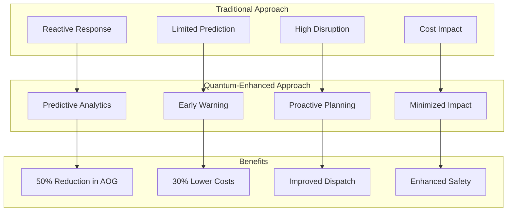
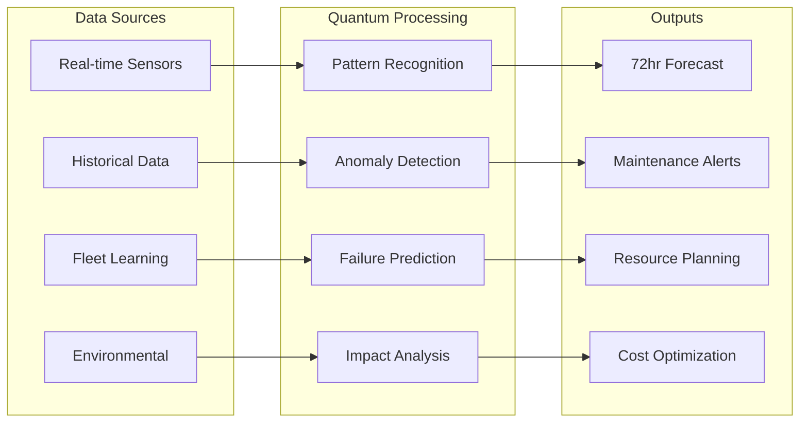
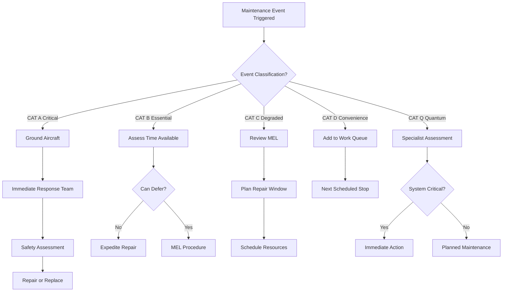
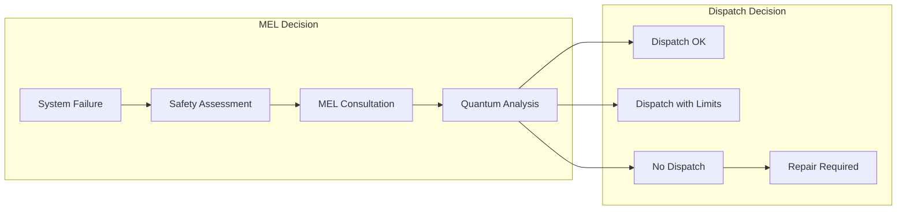
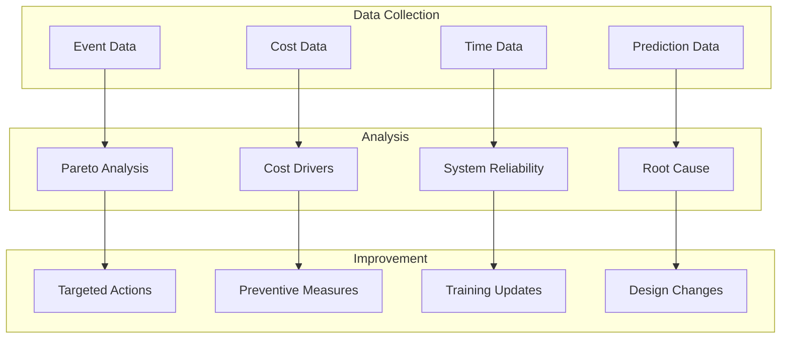

# 05-50-00-00 Unscheduled Maintenance Overview - AMPEL360 BWB-Q100

## Document Information
- **ATA Chapter**: 05 - Time Limits/Maintenance Checks
- **Section**: 50 - Unscheduled Maintenance
- **Subsection**: 00 - Overview
- **Document Type**: General Requirements and Framework
- **Version**: 1.0.0
- **Date**: 2025-01-20
- **Effectivity**: AMPEL360 BWB-Q100 MSN ALL
- **GAIA-QAO Reference**: AS-M-PAX-BW-Q1H

## Table of Contents
1. [Introduction and Philosophy](#1-introduction-and-philosophy)
2. [Unscheduled Maintenance Categories](#2-unscheduled-maintenance-categories)
3. [Quantum-Enhanced Predictive Framework](#3-quantum-enhanced-predictive-framework)
4. [Response Procedures](#4-response-procedures)
5. [Resource Management](#5-resource-management)
6. [Documentation Requirements](#6-documentation-requirements)
7. [Minimum Equipment List (MEL)](#7-minimum-equipment-list-mel)
8. [Aircraft on Ground (AOG) Management](#8-aircraft-on-ground-aog-management)
9. [Performance Metrics and Analysis](#9-performance-metrics-and-analysis)
10. [Continuous Improvement](#10-continuous-improvement)

## 1. Introduction and Philosophy

### 1.1 Purpose
This document establishes the framework for managing unscheduled maintenance events on the AMPEL360 BWB-Q100 aircraft, leveraging quantum-enhanced predictive capabilities to minimize disruptions while maintaining the highest safety standards.

### 1.2 Unscheduled Maintenance Philosophy



### 1.3 Key Principles
- **Safety First**: No compromise on airworthiness
- **Predictive Focus**: Quantum systems enable 72-hour prediction window
- **Rapid Response**: Minimize aircraft downtime
- **Smart Deferral**: Data-driven MEL management
- **Continuous Learning**: Every event improves prediction algorithms

### 1.4 DIKE Reference
- **DIKE ID**: DIKE-05-50-00-00-UNSCHED-OVW-001
- **Traceability**: Links to fault isolation procedures, MEL, and quantum predictive systems

## 2. Unscheduled Maintenance Categories

### 2.1 Event Classification

#### Table 2.1-1: Unscheduled Maintenance Categories

| Category | Description | Typical Response Time | Quantum Prediction | Dispatch Impact |
|----------|-------------|----------------------|-------------------|-----------------|
| **CAT A - Critical** | Safety of flight | Immediate | Limited | AOG |
| **CAT B - Essential** | Required for dispatch | <4 hours | 24-48 hr warning | Possible delay |
| **CAT C - Degraded** | Performance impact | <24 hours | 48-72 hr warning | MEL possible |
| **CAT D - Convenience** | Passenger comfort | Next opportunity | 7+ day forecast | No impact |
| **CAT Q - Quantum** | Quantum system specific | Varies | Self-diagnostic | Varies |

### 2.2 Event Triggers

```python
class UnscheduledEventTrigger:
    def __init__(self):
        self.event_classifier = EventClassifier()
        self.quantum_predictor = QuantumPredictor()
        self.response_system = ResponseSystem()
        self.notification_engine = NotificationEngine()
        
    def process_maintenance_trigger(self, trigger_source, trigger_data):
        event = {
            'id': self.generate_event_id(),
            'timestamp': datetime.now(),
            'source': trigger_source,
            'data': trigger_data,
            'classification': None,
            'response_plan': None,
            'notifications_sent': []
        }
        
        # Identify trigger source
        if trigger_source == 'pilot_report':
            event['classification'] = self.classify_pilot_report(trigger_data)
        elif trigger_source == 'maintenance_finding':
            event['classification'] = self.classify_maintenance_finding(trigger_data)
        elif trigger_source == 'quantum_prediction':
            event['classification'] = self.process_quantum_prediction(trigger_data)
        elif trigger_source == 'health_monitoring':
            event['classification'] = self.process_health_alert(trigger_data)
        elif trigger_source == 'regulatory':
            event['classification'] = self.process_regulatory_requirement(trigger_data)
            
        # Generate response plan
        event['response_plan'] = self.response_system.generate_plan(
            classification=event['classification'],
            aircraft_location=self.get_aircraft_location(),
            available_resources=self.check_resource_availability(),
            flight_schedule=self.get_upcoming_flights(),
            quantum_forecast=self.quantum_predictor.get_forecast()
        )
        
        # Send notifications
        notifications = self.notification_engine.send_notifications(
            event=event,
            recipients=self.determine_recipients(event['classification']),
            escalation_matrix=self.get_escalation_matrix()
        )
        
        event['notifications_sent'] = notifications
        
        return event
```

### 2.3 Trigger Sources

#### 2.3.1 Traditional Triggers
- Pilot reports (PIREP)
- Cabin crew reports
- Line maintenance findings
- Scheduled inspection findings
- System fault messages
- Ground incident damage

#### 2.3.2 Quantum-Enhanced Triggers
- Predictive health alerts
- Trend deviation warnings
- Component life predictions
- Environmental damage forecasts
- Usage pattern anomalies
- System degradation projections

## 3. Quantum-Enhanced Predictive Framework

### 3.1 Predictive Maintenance Architecture



### 3.2 Quantum Prediction Capabilities

```python
class QuantumPredictiveMaintenance:
    def __init__(self):
        self.quantum_processor = QuantumProcessor()
        self.sensor_network = SensorNetwork()
        self.ml_engine = MachineLearningEngine()
        self.fleet_database = FleetDatabase()
        
    def generate_maintenance_forecast(self, aircraft_msn, forecast_window=72):
        forecast = {
            'aircraft': aircraft_msn,
            'forecast_window': f'{forecast_window} hours',
            'generated_time': datetime.now(),
            'predictions': [],
            'confidence_scores': {},
            'recommended_actions': []
        }
        
        # Collect sensor data
        sensor_data = self.sensor_network.get_current_state(aircraft_msn)
        historical_data = self.sensor_network.get_historical_data(
            aircraft_msn, 
            lookback_days=30
        )
        
        # Quantum pattern analysis
        quantum_patterns = self.quantum_processor.analyze_patterns(
            current_state=sensor_data,
            historical_data=historical_data,
            quantum_algorithms=['VQE', 'QAOA', 'Quantum_SVM'],
            qubit_allocation=128
        )
        
        # System-by-system prediction
        systems = ['hydraulic', 'electrical', 'powerplant', 'flight_controls', 
                  'landing_gear', 'avionics', 'structures', 'quantum_systems']
        
        for system in systems:
            system_prediction = self.predict_system_health(
                system=system,
                sensor_data=sensor_data.get_system_data(system),
                quantum_patterns=quantum_patterns.get_system_patterns(system),
                fleet_experience=self.fleet_database.get_system_history(system)
            )
            
            if system_prediction.failure_probability > 0.01:  # 1% threshold
                prediction = {
                    'system': system,
                    'component': system_prediction.likely_component,
                    'failure_mode': system_prediction.failure_mode,
                    'probability': system_prediction.failure_probability,
                    'time_to_failure': system_prediction.ttf_hours,
                    'confidence': system_prediction.confidence_score,
                    'impact': self.assess_operational_impact(system_prediction)
                }
                
                forecast['predictions'].append(prediction)
                
                # Generate recommended action
                action = self.generate_maintenance_action(
                    prediction=prediction,
                    mel_allowance=self.check_mel_allowance(prediction),
                    parts_availability=self.check_parts_availability(prediction),
                    maintenance_opportunity=self.find_next_opportunity(aircraft_msn)
                )
                
                forecast['recommended_actions'].append(action)
        
        # Overall confidence score
        forecast['confidence_scores'] = {
            'overall': self.calculate_overall_confidence(quantum_patterns),
            'by_system': {s: self.calculate_system_confidence(s, quantum_patterns) 
                         for s in systems}
        }
        
        return forecast
```

### 3.3 Prediction Accuracy Metrics

#### Table 3.3-1: Quantum Prediction Performance

| Prediction Window | Accuracy Rate | False Positive | False Negative | Value Generated |
|-------------------|---------------|----------------|----------------|-----------------|
| **0-24 hours** | 95% | 3% | 2% | AOG prevention |
| **24-48 hours** | 88% | 7% | 5% | Schedule optimization |
| **48-72 hours** | 82% | 12% | 6% | Parts positioning |
| **72+ hours** | 75% | 18% | 7% | Planning insight |

## 4. Response Procedures

### 4.1 Response Decision Tree



### 4.2 Standard Response Procedures

#### 4.2.1 Immediate Response (CAT A)

```python
class ImmediateResponseProcedure:
    def __init__(self):
        self.response_coordinator = ResponseCoordinator()
        self.safety_assessor = SafetyAssessor()
        self.resource_dispatcher = ResourceDispatcher()
        self.documentation_system = DocumentationSystem()
        
    def execute_cat_a_response(self, event_data):
        response = {
            'event_id': event_data['id'],
            'response_start': datetime.now(),
            'actions_taken': [],
            'safety_status': None,
            'resolution': None
        }
        
        # Step 1: Ground aircraft if airborne
        if self.is_aircraft_airborne(event_data['aircraft_msn']):
            landing_plan = self.coordinate_emergency_landing(
                aircraft=event_data['aircraft_msn'],
                nearest_suitable=self.find_nearest_suitable_airport(),
                maintenance_capability=True
            )
            response['actions_taken'].append(landing_plan)
        
        # Step 2: Dispatch response team
        response_team = self.resource_dispatcher.dispatch_team(
            location=self.get_aircraft_location(event_data['aircraft_msn']),
            required_skills=self.determine_required_skills(event_data),
            priority='IMMEDIATE',
            equipment_needs=self.identify_equipment_needs(event_data)
        )
        
        response['actions_taken'].append({
            'action': 'team_dispatched',
            'team': response_team,
            'eta': response_team.estimated_arrival
        })
        
        # Step 3: Safety assessment
        safety_assessment = self.safety_assessor.assess_airworthiness(
            event_description=event_data['description'],
            system_affected=event_data['system'],
            preliminary_inspection=self.get_preliminary_inspection_data(),
            regulatory_requirements=self.get_applicable_regulations()
        )
        
        response['safety_status'] = safety_assessment
        
        # Step 4: Determine corrective action
        if safety_assessment.requires_immediate_repair:
            repair_plan = self.plan_immediate_repair(
                findings=safety_assessment.findings,
                available_resources=response_team.resources,
                time_constraints='minimize_ground_time',
                parts_availability=self.check_aog_parts()
            )
            
            response['resolution'] = repair_plan
            
        return response
```

### 4.3 Planned Response Procedures

#### Table 4.3-1: Response Time Standards

| Category | Initial Response | Diagnosis Complete | Parts Ordered | Work Started | Target Completion |
|----------|------------------|-------------------|---------------|--------------|-------------------|
| **CAT A** | <15 min | <1 hour | Immediate | <2 hours | ASAP |
| **CAT B** | <30 min | <2 hours | <1 hour | <4 hours | Same day |
| **CAT C** | <2 hours | <8 hours | <4 hours | Next stop | Within MEL |
| **CAT D** | <24 hours | Next check | As needed | Scheduled | Planned |
| **CAT Q** | <1 hour | <4 hours | Varies | Varies | Varies |

## 5. Resource Management

### 5.1 Resource Allocation Framework

```python
class UnscheduledResourceManager:
    def __init__(self):
        self.resource_pool = ResourcePool()
        self.skill_matrix = SkillMatrix()
        self.tool_inventory = ToolInventory()
        self.parts_system = PartsSystem()
        
    def allocate_resources(self, unscheduled_event):
        allocation = {
            'event_id': unscheduled_event.id,
            'personnel': [],
            'tools': [],
            'parts': [],
            'facilities': [],
            'estimated_duration': None
        }
        
        # Determine resource requirements
        requirements = self.analyze_requirements(
            event_type=unscheduled_event.classification,
            system_affected=unscheduled_event.system,
            location=unscheduled_event.location,
            complexity=self.assess_complexity(unscheduled_event)
        )
        
        # Allocate personnel
        available_personnel = self.resource_pool.get_available_personnel(
            location=unscheduled_event.location,
            skills_required=requirements.skills,
            certification_level=requirements.certification_level
        )
        
        if len(available_personnel) < requirements.personnel_count:
            # Escalation procedures
            additional_personnel = self.escalate_personnel_need(
                shortfall=requirements.personnel_count - len(available_personnel),
                skills_needed=requirements.skills,
                urgency=unscheduled_event.priority
            )
            available_personnel.extend(additional_personnel)
        
        allocation['personnel'] = self.assign_personnel(
            available=available_personnel,
            requirements=requirements,
            optimization_criteria='minimize_downtime'
        )
        
        # Allocate tools and equipment
        allocation['tools'] = self.tool_inventory.reserve_tools(
            tool_list=requirements.tools,
            duration=requirements.estimated_duration,
            priority=unscheduled_event.priority
        )
        
        # Parts allocation
        parts_strategy = self.determine_parts_strategy(
            required_parts=requirements.parts,
            stock_status=self.parts_system.check_stock(requirements.parts),
            aog_risk=unscheduled_event.classification == 'CAT_A',
            alternatives=self.identify_alternative_parts(requirements.parts)
        )
        
        allocation['parts'] = parts_strategy
        
        # Facility requirements
        if requirements.facility_needs:
            allocation['facilities'] = self.allocate_facilities(
                needs=requirements.facility_needs,
                duration=requirements.estimated_duration,
                location=unscheduled_event.location
            )
        
        allocation['estimated_duration'] = self.calculate_duration(
            task_complexity=requirements.complexity,
            resource_efficiency=self.calculate_team_efficiency(allocation['personnel']),
            parts_availability=parts_strategy.availability_factor
        )
        
        return allocation
```

### 5.2 AOG Resource Management

#### 5.2.1 AOG Response Kit Locations

| Location Type | Contents | Response Radius | Replenishment |
|---------------|----------|-----------------|---------------|
| **Major Hub** | Comprehensive spares | 1000 nm | Daily |
| **Line Station** | High-frequency items | 500 nm | Weekly |
| **Strategic Stock** | Critical spares | Global | As used |
| **Mobile Unit** | Emergency kit | Deployable | Event-based |

### 5.3 Skill Requirements

#### Table 5.3-1: Unscheduled Maintenance Skill Matrix

| Event Type | Required Skills | Minimum Cert | Preferred Experience |
|------------|-----------------|--------------|---------------------|
| **Structural** | Composite repair, NDT | B1/A&P | 5 years BWB |
| **Avionics** | Troubleshooting, LRU | B2 | IMA systems |
| **Powerplant** | Borescope, rigging | B1 + Type | Engine specific |
| **Quantum** | Quantum diagnostics | QSE Level II | 2 years quantum |
| **General** | Multi-skilled | B1/B2 | Type rated |

## 6. Documentation Requirements

### 6.1 Unscheduled Maintenance Records

```python
class UnscheduledMaintenanceDocumentation:
    def __init__(self):
        self.doc_system = DocumentationSystem()
        self.regulatory_compliance = RegulatoryCompliance()
        self.dike_system = DIKESystem()
        self.quantum_logger = QuantumEventLogger()
        
    def document_unscheduled_event(self, event, resolution):
        documentation = {
            'event_record': self.create_event_record(event),
            'work_performed': self.document_work(resolution),
            'parts_used': self.record_parts_consumption(resolution),
            'compliance': self.verify_compliance(event, resolution),
            'quantum_data': self.capture_quantum_data(event),
            'lessons_learned': self.extract_lessons(event, resolution)
        }
        
        # Create primary maintenance record
        maintenance_record = {
            'record_id': self.generate_record_id(),
            'aircraft_msn': event.aircraft_msn,
            'event_date': event.timestamp,
            'event_classification': event.classification,
            'discrepancy': {
                'reported_by': event.reporter,
                'description': event.description,
                'ata_chapter': event.ata_reference,
                'quantum_prediction': event.quantum_forecast if any else None
            },
            'corrective_action': {
                'action_taken': resolution.action_description,
                'parts_replaced': resolution.parts_list,
                'man_hours': resolution.total_manhours,
                'elapsed_time': resolution.elapsed_time
            },
            'release_to_service': {
                'released_by': resolution.releasing_engineer,
                'license_number': resolution.license_info,
                'limitations': resolution.mel_items if any else None,
                'next_action': resolution.follow_up_required
            }
        }
        
        # Regulatory compliance documentation
        if self.requires_regulatory_filing(event):
            regulatory_filing = self.regulatory_compliance.create_filing(
                event_type=event.classification,
                aircraft_data=self.get_aircraft_data(event.aircraft_msn),
                maintenance_action=resolution,
                applicable_regulations=self.identify_applicable_regs(event)
            )
            documentation['compliance']['regulatory_filing'] = regulatory_filing
        
        # DIKE traceability
        dike_entry = self.dike_system.create_entry(
            event_type='unscheduled_maintenance',
            source_document=maintenance_record,
            traceability_chain=self.establish_traceability(event, resolution),
            verification_hash=self.generate_verification_hash(maintenance_record)
        )
        
        documentation['dike_reference'] = dike_entry
        
        # Quantum system learning
        if event.quantum_prediction_available:
            quantum_learning = self.quantum_logger.log_prediction_outcome(
                prediction=event.quantum_forecast,
                actual_event=event,
                resolution=resolution,
                accuracy_assessment=self.assess_prediction_accuracy(event, resolution)
            )
            documentation['quantum_data']['learning_entry'] = quantum_learning
        
        return documentation
```

### 6.2 Documentation Standards

#### Table 6.2-1: Required Documentation Elements

| Document Type | Required Information | Retention Period | Regulatory Ref |
|---------------|---------------------|------------------|----------------|
| **Discrepancy Record** | Full description, reporter, time | Aircraft life | Part 43 |
| **Corrective Action** | Work performed, parts, references | Aircraft life | Part 145 |
| **Release to Service** | Engineer details, limitations | Aircraft life | Part 43 |
| **Test Records** | Results, parameters, acceptance | 2 years | OEM requirement |
| **Quantum Predictions** | Forecast, accuracy, correlation | Indefinite | GAIA-QAO |

## 7. Minimum Equipment List (MEL)

### 7.1 MEL Philosophy for AMPEL360



### 7.2 Quantum-Enhanced MEL Management

```python
class QuantumMELManager:
    def __init__(self):
        self.mel_database = MELDatabase()
        self.quantum_analyzer = QuantumSystemAnalyzer()
        self.risk_calculator = RiskCalculator()
        self.performance_predictor = PerformancePredictor()
        
    def evaluate_mel_dispatch(self, failed_item, flight_conditions):
        mel_evaluation = {
            'item': failed_item,
            'mel_reference': None,
            'dispatch_recommendation': None,
            'limitations': [],
            'repair_deadline': None,
            'quantum_assessment': {}
        }
        
        # Standard MEL lookup
        mel_item = self.mel_database.lookup_item(
            ata_chapter=failed_item.ata_chapter,
            item_name=failed_item.component_name,
            aircraft_model='AMPEL360'
        )
        
        if not mel_item:
            mel_evaluation['dispatch_recommendation'] = 'NO_DISPATCH'
            return mel_evaluation
            
        mel_evaluation['mel_reference'] = mel_item
        
        # Quantum risk assessment
        quantum_risk = self.quantum_analyzer.assess_dispatch_risk(
            failed_component=failed_item,
            remaining_redundancy=self.calculate_redundancy(failed_item),
            flight_profile=flight_conditions,
            system_health=self.get_system_health_score(failed_item.system),
            environmental_factors=flight_conditions.weather_forecast
        )
        
        mel_evaluation['quantum_assessment'] = {
            'risk_score': quantum_risk.overall_score,
            'degradation_forecast': quantum_risk.degradation_timeline,
            'cascade_probability': quantum_risk.cascade_failure_probability,
            'mission_completion_confidence': quantum_risk.mission_confidence
        }
        
        # Enhanced decision making
        if quantum_risk.overall_score > 0.8:  # High risk
            mel_evaluation['dispatch_recommendation'] = 'NO_DISPATCH_QUANTUM_OVERRIDE'
        elif quantum_risk.overall_score > 0.5:  # Moderate risk
            mel_evaluation['dispatch_recommendation'] = 'DISPATCH_WITH_RESTRICTIONS'
            mel_evaluation['limitations'] = self.generate_restrictions(
                mel_item.standard_limitations,
                quantum_risk.risk_factors,
                flight_conditions
            )
        else:  # Low risk
            mel_evaluation['dispatch_recommendation'] = 'DISPATCH_APPROVED'
            mel_evaluation['limitations'] = mel_item.standard_limitations
            
        # Calculate repair deadline
        mel_evaluation['repair_deadline'] = self.calculate_repair_deadline(
            mel_category=mel_item.repair_category,
            quantum_degradation=quantum_risk.degradation_timeline,
            regulatory_maximum=mel_item.max_repair_time
        )
        
        return mel_evaluation
```

### 7.3 MEL Categories Specific to AMPEL360

#### Table 7.3-1: AMPEL360-Specific MEL Items

| System | Component | Standard MEL | Quantum Override | Special Conditions |
|--------|-----------|--------------|------------------|-------------------|
| **Quantum Nav** | QNS Unit | 1 of 3 operative | All operative if IMC | GPS backup required |
| **Quantum Comms** | QKD Module | May be inop | Required over ocean | Classical crypto OK |
| **FBW Quantum** | QPU Enhancement | May be inop | Required CAT III | Degraded mode OK |
| **Health Monitor** | Sensor nodes | 10% may be inop | 5% limit if critical | Location dependent |

## 8. Aircraft on Ground (AOG) Management

### 8.1 AOG Response Framework

```python
class AOGManagementSystem:
    def __init__(self):
        self.aog_controller = AOGController()
        self.parts_locator = GlobalPartsLocator()
        self.recovery_planner = RecoveryPlanner()
        self.cost_optimizer = CostOptimizer()
        
    def manage_aog_event(self, aog_event):
        aog_response = {
            'event_id': aog_event.id,
            'response_initiated': datetime.now(),
            'recovery_plan': None,
            'parts_solution': None,
            'cost_estimate': None,
            'passenger_impact': None
        }
        
        # Immediate actions
        immediate_response = self.aog_controller.initiate_response(
            aircraft_location=aog_event.location,
            failure_description=aog_event.description,
            local_capabilities=self.assess_local_capabilities(aog_event.location),
            time_criticality=self.calculate_criticality(aog_event)
        )
        
        # Parts solution
        parts_requirement = self.identify_parts_requirement(aog_event)
        
        parts_solution = self.parts_locator.find_fastest_solution(
            required_parts=parts_requirement,
            aircraft_location=aog_event.location,
            search_options={
                'company_stock': True,
                'pool_access': True,
                'competitor_borrow': True,
                'manufacture_expedite': True,
                'cannibalization': self.evaluate_cannibalization_option()
            }
        )
        
        aog_response['parts_solution'] = parts_solution
        
        # Recovery planning
        recovery_options = self.recovery_planner.generate_options(
            aog_severity=aog_event.classification,
            parts_eta=parts_solution.delivery_time,
            repair_complexity=self.assess_repair_complexity(aog_event),
            passenger_count=aog_event.passenger_impact,
            network_impact=self.calculate_network_impact(aog_event)
        )
        
        # Cost optimization
        for option in recovery_options:
            option['total_cost'] = self.cost_optimizer.calculate_total_cost(
                direct_costs={
                    'parts': parts_solution.cost,
                    'labor': option.labor_cost,
                    'ferry': option.ferry_cost if applicable,
                    'expedite': option.expedite_charges
                },
                indirect_costs={
                    'passenger_care': option.passenger_cost,
                    'revenue_loss': option.revenue_impact,
                    'network_disruption': option.network_cost,
                    'reputation': self.estimate_reputation_impact(option)
                }
            )
        
        # Select optimal recovery plan
        optimal_plan = self.select_optimal_recovery(
            options=recovery_options,
            constraints={
                'max_downtime': aog_event.max_acceptable_delay,
                'budget_limit': self.get_aog_budget_authority(),
                'customer_service': self.get_service_standards()
            }
        )
        
        aog_response['recovery_plan'] = optimal_plan
        aog_response['cost_estimate'] = optimal_plan['total_cost']
        
        return aog_response
```

### 8.2 AOG Mitigation Strategies

#### Table 8.2-1: AOG Mitigation Options

| Strategy | Typical Application | Time to Implement | Success Rate | Cost Impact |
|----------|-------------------|-------------------|--------------|-------------|
| **Local repair** | Simple failures | 2-8 hours | 85% | Low |
| **Parts expedite** | Stock available | 4-24 hours | 90% | Medium |
| **Ferry flight** | Major base repair | 6-12 hours | 95% | High |
| **Aircraft swap** | Network flexibility | 2-6 hours | 80% | Medium |
| **Lease replacement** | Extended downtime | 24-48 hours | 70% | Very high |

## 9. Performance Metrics and Analysis

### 9.1 Unscheduled Maintenance KPIs

```python
class UnscheduledMaintenanceMetrics:
    def __init__(self):
        self.metrics_engine = MetricsEngine()
        self.trend_analyzer = TrendAnalyzer()
        self.benchmark_system = BenchmarkSystem()
        
    def calculate_unscheduled_metrics(self, time_period):
        metrics = {
            'period': time_period,
            'operational_metrics': {},
            'cost_metrics': {},
            'predictive_metrics': {},
            'comparative_metrics': {}
        }
        
        # Operational metrics
        operational = {
            'unscheduled_rate': self.calculate_unscheduled_rate(time_period),
            'mtbf_by_system': self.calculate_mtbf_by_system(time_period),
            'repeat_rate': self.calculate_repeat_defect_rate(time_period),
            'nff_rate': self.calculate_no_fault_found_rate(time_period),
            'dispatch_reliability': self.calculate_dispatch_reliability(time_period),
            'aog_events': self.count_aog_events(time_period),
            'average_downtime': self.calculate_average_downtime(time_period)
        }
        
        metrics['operational_metrics'] = operational
        
        # Cost metrics
        cost = {
            'total_unscheduled_cost': self.sum_unscheduled_costs(time_period),
            'cost_per_event': self.calculate_average_event_cost(time_period),
            'cost_by_category': self.breakdown_costs_by_category(time_period),
            'aog_cost_impact': self.calculate_aog_costs(time_period),
            'parts_expedite_cost': self.sum_expedite_charges(time_period)
        }
        
        metrics['cost_metrics'] = cost
        
        # Predictive performance
        predictive = {
            'prediction_accuracy': self.measure_prediction_accuracy(time_period),
            'prevention_rate': self.calculate_prevention_success(time_period),
            'early_warning_effectiveness': self.measure_warning_lead_time(time_period),
            'quantum_system_contribution': self.quantify_quantum_benefit(time_period)
        }
        
        metrics['predictive_metrics'] = predictive
        
        # Comparative analysis
        comparative = {
            'vs_target': self.compare_to_targets(operational),
            'vs_previous_period': self.compare_to_previous(time_period),
            'vs_fleet_average': self.compare_to_fleet(operational),
            'vs_industry_benchmark': self.benchmark_system.compare(operational)
        }
        
        metrics['comparative_metrics'] = comparative
        
        return metrics
```

### 9.2 Key Performance Indicators

#### Table 9.2-1: Unscheduled Maintenance KPIs

| KPI | Target | Current | Trend | Action Trigger |
|-----|--------|---------|-------|----------------|
| **Dispatch Reliability** | 99.5% | 99.3% | → | <99.0% |
| **Unscheduled Rate** | <0.5/1000 FH | 0.48 | ↓ | >0.6 |
| **Repeat Rate** | <5% | 4.2% | ↓ | >7% |
| **NFF Rate** | <10% | 8.5% | → | >15% |
| **AOG Events/Month** | <2 | 1.8 | ↓ | >3 |
| **Quantum Prediction Accuracy** | >85% | 87% | ↑ | <80% |

### 9.3 Trend Analysis



## 10. Continuous Improvement

### 10.1 Learning from Events

```python
class UnscheduledMaintenanceImprovement:
    def __init__(self):
        self.learning_system = LearningSystem()
        self.improvement_tracker = ImprovementTracker()
        self.implementation_manager = ImplementationManager()
        
    def process_improvement_cycle(self, events_data):
        improvement_plan = {
            'analysis_date': datetime.now(),
            'identified_improvements': [],
            'implementation_status': {},
            'expected_benefits': {}
        }
        
        # Pattern identification
        patterns = self.learning_system.identify_patterns(
            events=events_data,
            pattern_types=['repeat_failures', 'cascade_failures', 
                          'environmental_correlations', 'usage_patterns'],
            confidence_threshold=0.8
        )
        
        # Root cause analysis
        for pattern in patterns:
            root_causes = self.perform_root_cause_analysis(
                pattern=pattern,
                investigation_depth='5_why',
                data_sources=['maintenance_records', 'design_data', 
                             'operational_data', 'quantum_predictions']
            )
            
            # Generate improvement actions
            improvements = self.generate_improvements(
                root_causes=root_causes,
                improvement_types=['design_change', 'procedure_update',
                                 'training_enhancement', 'predictive_algorithm']
            )
            
            improvement_plan['identified_improvements'].extend(improvements)
        
        # Prioritize improvements
        prioritized = self.prioritize_improvements(
            improvements=improvement_plan['identified_improvements'],
            criteria={
                'safety_impact': 0.4,
                'cost_benefit': 0.3,
                'implementation_ease': 0.2,
                'fleet_applicability': 0.1
            }
        )
        
        # Implementation planning
        for improvement in prioritized[:10]:  # Top 10 improvements
            implementation = self.implementation_manager.create_plan(
                improvement=improvement,
                resources_required=self.estimate_resources(improvement),
                timeline=self.estimate_timeline(improvement),
                success_metrics=self.define_success_metrics(improvement)
            )
            
            improvement_plan['implementation_status'][improvement.id] = implementation
            improvement_plan['expected_benefits'][improvement.id] = {
                'reduction_in_events': improvement.expected_reduction,
                'cost_savings': improvement.annual_savings,
                'reliability_improvement': improvement.reliability_gain
            }
        
        return improvement_plan
```

### 10.2 Improvement Categories

#### Table 10.2-1: Continuous Improvement Focus Areas

| Category | Typical Improvements | Implementation Time | Expected Impact |
|----------|---------------------|-------------------|-----------------|
| **Predictive Algorithm** | Enhanced quantum models | 1-3 months | 20% better prediction |
| **Procedures** | Troubleshooting guides | 1 month | 15% faster diagnosis |
| **Training** | Scenario-based training | 2-3 months | 25% reduction in NFF |
| **Design** | Component upgrade | 6-12 months | 50% reduction in failures |
| **Tools** | Diagnostic equipment | 3-6 months | 30% faster resolution |

### 10.3 Success Stories

#### 10.3.1 Quantum Prediction Implementation
- **Before**: 2.5 AOG events/month average
- **After**: 0.8 AOG events/month (68% reduction)
- **Method**: 72-hour quantum predictions allow proactive replacement
- **ROI**: $2.4M annual savings

#### 10.3.2 Mobile Diagnostic Units
- **Before**: 6-hour average diagnosis time
- **After**: 2-hour average (67% reduction)
- **Method**: Quantum-equipped diagnostic pods at line stations
- **Investment**: $500K per unit, 18-month payback

---

## Appendices

### Appendix A: Quick Reference Guide

#### A.1 Response Time Matrix
```
Event Category vs Location:
             Hub    Line   Remote
CAT A        15min  30min  2hr
CAT B        30min  1hr    4hr
CAT C        2hr    4hr    24hr
CAT D        24hr   48hr   Next
CAT Q        1hr    2hr    4hr
```

### Appendix B: Contact Directory

```
24/7 Maintenance Control Center: [Contact]
AOG Desk: [Contact]
Quantum Support: [Contact]
Parts Emergency: [Contact]
Engineering Support: [Contact]
```

### Appendix C: Common Troubleshooting

#### C.1 Top 10 Unscheduled Events
1. Avionics LRU failure - See TSM 31-XX
2. Hydraulic leak - See TSM 29-XX
3. Engine indication - See TSM 71-XX
4. Tire change - See AMM 32-40
5. Battery failure - See TSM 24-30
6. Quantum sensor - See QMM 99-20
7. Cabin defect - See TSM 25-XX
8. Flight control - See TSM 27-XX
9. Air conditioning - See TSM 21-XX
10. Communication - See TSM 23-XX

### Appendix D: MEL Quick Reference

```
Critical Systems - No MEL Relief:
- All primary flight controls
- Both hydraulic systems (1 may be degraded)
- Primary electrical generation
- Fire detection/suppression
- Quantum navigation (IMC conditions)
```

---

## Document Control and Revision History

### Approval Signatures

| Role | Name | Signature | Date |
|------|------|-----------|------|
| **Chief Engineer** | [Name] | [Digital Signature] | 2025-01-20 |
| **Maintenance Director** | [Name] | [Digital Signature] | 2025-01-20 |
| **Quality Manager** | [Name] | [Digital Signature] | 2025-01-20 |
| **Quantum Systems Lead** | [Name] | [Digital Signature] | 2025-01-20 |

### Revision History

| Version | Date | Author | Description |
|---------|------|--------|-------------|
| 1.0.0 | 2025-01-20 | GAIA-QAO Tech Team | Initial release |

### Distribution List

- All Maintenance Stations
- Maintenance Control Center
- Engineering Support
- Quality Assurance
- Flight Operations
- Quantum Systems Team
- Training Department

---

**END OF DOCUMENT**

**GAIA-QAO Certification**: This document is certified for use in the AMPEL360 BWB-Q100 program under the "No Flight Without Assurance" principle.

**Digital Signature**: [Blockchain-verified signature block]

**DIKE Traceability**: Full lineage available in GAIA-QAO Master Database
