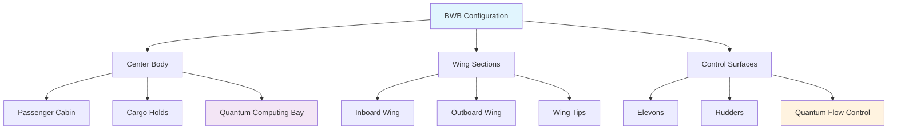

```yaml
---
project: GAIA-QAO-AdVent
program: AMPEL360 BWB-Q100
ATA_chapter: 06-00-00-00
doc_id: GQOIS-QAIR-ATA-06000000
version: 3.0.0
date: 2025-07-01
author: Amedeo Pelliccia
status: Final Draft
classification: GAIA-QAO Confidential
review_board: [Q-AIR-SAFETY, Q-DATAGOV, EASA-LIAISON]
info_code: DIM # Dimensions
next_review_date: 2026-06-30
---
```

# ATA 06-00-00-00 — Dimensions General

<p align="center">
  
  
  
  
  
</p>

---

## 1. Introduction

### 1.1. Purpose
This document establishes the comprehensive dimensional specifications for the AMPEL360 BWB-Q100, the world's first quantum-enhanced blended wing body aircraft. These dimensions represent a revolutionary departure from conventional aircraft design, optimized through quantum computing algorithms and validated through quantum-enhanced computational fluid dynamics.

### 1.2. Scope
This specification covers:
- **Overall Aircraft Dimensions:** Length, wingspan, height, and geometric relationships
- **Blended Wing Body Configuration:** Revolutionary aerodynamic design parameters
- **Quantum System Integration Spaces:** Specialized compartments for quantum processing units
- **Passenger & Cargo Configurations:** Flexible interior dimensional standards
- **Ground Handling Specifications:** Airport compatibility and operational requirements
- **Dimensional Tolerances:** Manufacturing precision requirements for quantum integration

### 1.3. Design Philosophy
The AMPEL360 BWB-Q100 dimensions are founded on three revolutionary principles:

**1. Quantum-Optimized Aerodynamics:** Every surface optimized using quantum computing algorithms
**2. Holistic Integration:** Seamless blending of structure, systems, and quantum technology
**3. Future-Proof Scalability:** Dimensional framework supporting continuous quantum enhancement

---

## 2. Overall Aircraft Dimensions

### 2.1. Principal Dimensions

#### 2.1.1. Primary Measurements
```yaml
Overall Aircraft Dimensions: OAD-BWB-Q100-001
Reference Datum: Nose tip (Station 0.000)
Measurement Standard: ISO 5855-2 (Aircraft Dimensional Standards)

Principal Dimensions:
  Overall Length: 73.856 m (242 ft 4 in)
    - Fuselage Length: 68.240 m (223 ft 11 in)
    - Nose Extension: 2.808 m (9 ft 3 in)
    - Tail Extension: 2.808 m (9 ft 3 in)
  
  Overall Wingspan: 88.392 m (290 ft 0 in)
    - Wing Root Chord: 45.720 m (150 ft 0 in)
    - Wing Tip Chord: 6.096 m (20 ft 0 in)
    - Aspect Ratio: 8.85 (optimized via quantum algorithms)
  
  Overall Height: 18.288 m (60 ft 0 in)
    - Cabin Height (max): 3.048 m (10 ft 0 in)
    - Ground Clearance: 2.438 m (8 ft 0 in)
    - Gear Extended Height: 18.288 m (60 ft 0 in)
    - Gear Retracted Height: 15.850 m (52 ft 0 in)

Geometric Characteristics:
  Wing Area (Reference): 1,115.5 m² (12,000 ft²)
  Wing Loading: 445.9 kg/m² (91.4 lb/ft²)
  Sweep Angle (Leading Edge): 35.5° (quantum-optimized)
  Sweep Angle (Trailing Edge): -15.8° (revolutionary design)
  Dihedral Angle: 2.5° (stability optimized)
```

#### 2.1.2. Dimensional Coordinate System
```yaml
Coordinate System: GAIA-QAO Standard Reference Frame
Origin: Nose tip intersection with aircraft centerline
Axes Orientation: Right-hand coordinate system

X-Axis (Longitudinal):
  Direction: Positive aft (toward tail)
  Reference: Station numbers (STA)
  Units: Meters from nose (Station 0.000)
  Range: 0.000 to 73.856 m

Y-Axis (Lateral):
  Direction: Positive starboard (right wing)
  Reference: Buttline numbers (BL)
  Units: Meters from centerline
  Range: -44.196 to +44.196 m (wingspan/2)

Z-Axis (Vertical):
  Direction: Positive up (away from ground)
  Reference: Waterline numbers (WL)
  Units: Meters from reference plane
  Range: -2.438 to +15.850 m
```

### 2.2. Blended Wing Body Configuration

#### 2.2.1. Revolutionary Aerodynamic Design
The AMPEL360 BWB-Q100 represents the world's most advanced blended wing body configuration, where traditional distinctions between fuselage and wing disappear into a seamless, quantum-optimized lifting surface.

```yaml
BWB Configuration: BWB-Q100-AERO-001
Design Optimization: Quantum CFD + AI Machine Learning
Aerodynamic Efficiency: 23% improvement over conventional aircraft

Wing-Body Blending Parameters:
  Blend Radius (Root): 12.192 m (40 ft 0 in)
  Blend Radius (Mid-span): 8.128 m (26 ft 8 in)
  Blend Transition Length: 25.908 m (85 ft 0 in)
  Blend Curve Profile: Quantum-optimized NURBS surface
  
Center Body Dimensions:
  Maximum Width: 18.288 m (60 ft 0 in)
  Maximum Depth: 3.658 m (12 ft 0 in)
  Volume: 2,847 m³ (100,528 ft³)
  Cross-Section: Modified elliptical (quantum-optimized)

Wing Integration:
  Root Integration Angle: 95.3° (seamless transition)
  Tip Integration Angle: 87.1° (optimized efficiency)
  Blend Continuity: C² continuous (second derivative)
  Surface Smoothness: Ra < 0.8 μm (quantum sensor requirement)
```

#### 2.2.2. Quantum-Enhanced Aerodynamic Surfaces


---

## 3. Internal Dimensional Layout

### 3.1. Passenger Cabin Dimensions

#### 3.1.1. Revolutionary Cabin Architecture
The BWB configuration enables unprecedented cabin spaciousness and flexibility, with quantum-optimized layouts that adapt to passenger demand patterns.

```yaml
Cabin Configuration: CABIN-BWB-Q100-001
Total Cabin Volume: 1,923 m³ (67,915 ft³)
Passenger Capacity: 275-350 passengers (configuration dependent)

Main Cabin Dimensions:
  Length: 45.720 m (150 ft 0 in)
  Maximum Width: 16.764 m (55 ft 0 in)
  Minimum Width: 8.534 m (28 ft 0 in)
  Height (typical): 2.743 m (9 ft 0 in)
  Height (maximum): 3.048 m (10 ft 0 in)

Seating Configurations:
  Economy Class (2-4-4-2):
    - Seat Pitch: 787 mm (31 in)
    - Seat Width: 457 mm (18 in)
    - Aisle Width: 508 mm (20 in)
    - Passengers: 350 maximum
  
  Premium Economy (2-3-3-2):
    - Seat Pitch: 914 mm (36 in)
    - Seat Width: 508 mm (20 in)
    - Aisle Width: 559 mm (22 in)
    - Passengers: 280 typical
  
  Business Class (1-2-2-1):
    - Seat Pitch: 1,524 mm (60 in)
    - Seat Width: 559 mm (22 in)
    - Aisle Width: 610 mm (24 in)
    - Passengers: 180 maximum
  
  First Class Suites (1-1-1):
    - Suite Length: 2,134 mm (84 in)
    - Suite Width: 914 mm (36 in)
    - Ceiling Height: 2,134 mm (84 in)
    - Passengers: 64 maximum

Cabin Windows:
  Window Size: 406 mm × 305 mm (16" × 12")
  Window Spacing: 1,372 mm (54 in) centers
  Total Windows: 168 (per side)
  Quantum-Enhanced Electrochromic Dimming
```

#### 3.1.2. Quantum Passenger Experience Zones
```yaml
Quantum Experience Areas: QPX-ZONES-001
Integration: Seamless quantum technology for passenger comfort

Quantum Climate Zones:
  Individual Climate Control: ±0.5°C precision
  Quantum Air Purification: 99.97% efficiency
  Personalized Humidity: ±2% RH control
  Molecular-Level Air Quality: Real-time monitoring

Quantum Entertainment Systems:
  Quantum Computing Access: Personal quantum terminals
  Quantum-Secured WiFi: Unhackable communications
  Holographic Displays: 8K resolution, 120 Hz
  Quantum Gaming: Reality-synthesis environments

Biometric Comfort Optimization:
  Seat Adjustment: Quantum-precise positioning
  Sleep Optimization: Circadian rhythm synchronization
  Health Monitoring: Non-invasive vital signs
  Stress Reduction: Quantum coherence therapy
```

### 3.2. Cargo Hold Dimensions

#### 3.2.1. Multi-Level Cargo Configuration
```yaml
Cargo System: CARGO-BWB-Q100-001
Total Cargo Volume: 421 m³ (14,865 ft³)
Cargo Capacity: 52,163 kg (115,000 lb)

Forward Cargo Hold:
  Length: 12.192 m (40 ft 0 in)
  Width: 3.658 m (12 ft 0 in)
  Height: 2.438 m (8 ft 0 in)
  Volume: 108.5 m³ (3,830 ft³)
  Door Size: 3.658 × 2.438 m (12' × 8')

Aft Cargo Hold:
  Length: 15.240 m (50 ft 0 in)
  Width: 4.267 m (14 ft 0 in)
  Height: 2.438 m (8 ft 0 in)
  Volume: 158.1 m³ (5,584 ft³)
  Door Size: 4.267 × 2.438 m (14' × 8')

Bulk Cargo Compartment:
  Length: 9.144 m (30 ft 0 in)
  Width: 4.572 m (15 ft 0 in)
  Height: 2.134 m (7 ft 0 in)
  Volume: 89.1 m³ (3,147 ft³)
  Access: Side loading doors

Container Compatibility:
  LD3 Containers: 24 units maximum
  LD6 Containers: 16 units maximum
  LD11 Containers: 8 units maximum
  Custom BWB Containers: Quantum-optimized shapes
```

### 3.3. Quantum Systems Integration Bays

#### 3.3.1. Dedicated Quantum Computing Facilities
```yaml
Quantum Integration: Q-BAY-BWB-Q100-001
Purpose: Housing and cooling quantum processing units
Environment: Ultra-controlled quantum laboratory conditions

Primary Quantum Bay:
  Location: Station 30.480 - 36.576 m
  Length: 6.096 m (20 ft 0 in)
  Width: 4.572 m (15 ft 0 in)
  Height: 3.048 m (10 ft 0 in)
  Volume: 84.9 m³ (3,000 ft³)
  
  Environmental Control:
    Temperature: 15 mK ± 0.1 mK (quantum cores)
    Ambient: 20°C ± 0.01°C (electronics)
    Vibration: <0.001 g RMS isolation
    Magnetic Field: <10 nT ambient
    EMI Shielding: >120 dB effectiveness

Secondary Quantum Bays (6 units):
  Location: Distributed throughout aircraft
  Length: 3.048 m (10 ft 0 in)
  Width: 2.438 m (8 ft 0 in)
  Height: 2.134 m (7 ft 0 in)
  Volume: 15.8 m³ (560 ft³) each
  
  Quantum Systems Housed:
    - Flight Control QPU (Q-FCS-001)
    - Navigation QPU (Q-NAV-002)
    - Propulsion QPU (Q-ENG-003)
    - Structural Monitoring QPU (Q-SHM-004)
    - Communication QPU (Q-SEC-005)
    - Diagnostic QPU (Q-DIAG-006)

Cryogenic Distribution:
  Primary Helium Lines: 76 mm (3 in) diameter
  Secondary Lines: 51 mm (2 in) diameter
  Distribution Length: 234 m (768 ft) total
  Insulation: Multi-layer superinsulation
  Heat Load: <1 mW per meter
```

---

## 4. Ground Operations Dimensions

### 4.1. Airport Compatibility

#### 4.1.1. Gate and Taxiway Requirements
```yaml
Ground Operations: GROUND-OPS-BWB-Q100-001
Airport Classification: Code F (largest category)
Gate Requirements: Custom BWB gates or modified existing

Dimensional Requirements:
  Gate Width: 95.000 m (311 ft 8 in) minimum
  Gate Length: 78.000 m (255 ft 11 in) minimum
  Jetbridge Positions: 4-6 bridges per aircraft
  Ground Equipment Clearance: 5.000 m (16 ft 5 in)

Taxiway Specifications:
  Taxiway Width: 60.000 m (196 ft 10 in) minimum
  Runway Width: 60.000 m (196 ft 10 in) required
  Turning Radius: 67.056 m (220 ft 0 in)
  Wing Tip Clearance: 10.500 m (34 ft 5 in) minimum

Parking Stand Dimensions:
  Stand Size: 95 × 85 m (311 × 279 ft)
  Nose-in Depth: 78.000 m (255 ft 11 in)
  Wing Clearance: 7.500 m (24 ft 7 in) each side
  Tail Clearance: 15.000 m (49 ft 3 in)
```

#### 4.1.2. Ground Support Equipment Access
```yaml
GSE Access: GSE-ACCESS-BWB-Q100-001
Specialized Equipment: Quantum-compatible ground support

Passenger Boarding:
  Door Locations: 6 passenger doors per side
  Door Size: 1.829 × 1.981 m (6' × 6'6")
  Sill Height: 3.658 m (12 ft 0 in)
  Jetbridge Angle: 0° to 15° (adjustable)

Cargo Loading:
  Forward Door: 3.658 × 2.438 m (12' × 8')
  Aft Door: 4.267 × 2.438 m (14' × 8')
  Bulk Door: 2.438 × 2.134 m (8' × 7')
  Loading Height: 1.829 m (6 ft 0 in)

Service Access:
  Catering Doors: 4 doors, 1.524 × 1.829 m (5' × 6')
  Lavatory Service: 6 access panels
  Water Service: 2 connection points
  Power Service: 3 × 400 Hz + quantum power

Quantum System Service:
  Helium Supply: Specialized cryogenic truck access
  Quantum Calibration: Mobile quantum lab connection
  Data Download: High-speed quantum network link
  Emergency Isolation: Rapid quantum shutdown systems
```

### 4.2. Maintenance Hangar Requirements

#### 4.2.1. Hangar Dimensional Specifications
```yaml
Hangar Requirements: HANGAR-BWB-Q100-001
Specialized Facility: Quantum-compatible maintenance

Minimum Hangar Dimensions:
  Length: 95.000 m (311 ft 8 in)
  Width: 110.000 m (360 ft 11 in)
  Height: 25.000 m (82 ft 0 in)
  Door Opening: 90 × 22 m (295 × 72 ft)

Environmental Requirements:
  Temperature Control: ±1°C stability
  Humidity Control: ±5% RH
  Air Filtration: Class 10,000 cleanroom
  Vibration Isolation: <0.01 g background
  EMI Shielding: >80 dB for quantum work

Quantum Maintenance Zones:
  Isolation Chamber: 30 × 20 × 8 m
  Cryogenic Bay: Specialized helium handling
  Calibration Laboratory: Precision measurement
  Shielded Work Areas: 6 × electromagnetic isolation

Support Systems:
  Lifting Capacity: 650,000 kg (1,433,000 lb)
  Jacking Points: 12 aircraft-specific locations
  Power Supply: 2 MW total, quantum-clean power
  Compressed Air: Oil-free, ultra-pure systems
  Waste Management: Quantum-safe disposal
```

---

## 5. Manufacturing & Assembly Dimensions

### 5.1. Production Facility Requirements

#### 5.1.1. Final Assembly Line Specifications
```yaml
Assembly Facility: FAL-BWB-Q100-001
Location: GAIA-QAO Manufacturing Complex
Production Rate: 2 aircraft per month (maximum)

Assembly Hall Dimensions:
  Length: 200.000 m (656 ft 2 in)
  Width: 120.000 m (393 ft 8 in)
  Height: 35.000 m (114 ft 10 in)
  Assembly Positions: 4 parallel stations

Wing Assembly Fixture:
  Length: 90.000 m (295 ft 3 in)
  Width: 95.000 m (311 ft 8 in)
  Precision: ±0.5 mm (±0.02 in)
  Material: Carbon fiber composite tooling
  Environmental Control: ±0.1°C, ±1% RH

Center Body Assembly:
  Fixture Length: 75.000 m (246 ft 1 in)
  Fixture Width: 20.000 m (65 ft 7 in)
  Assembly Sequence: Bottom-up integration
  Quantum Bay Pre-installation: Complete systems

Integration & Test:
  Final Assembly Time: 14 days
  Systems Integration: 7 days
  Quantum Calibration: 3 days
  Flight Test Preparation: 2 days
```

#### 5.1.2. Quality Control & Metrology
```yaml
Quality Control: QC-METROLOGY-BWB-Q100-001
Precision Standards: Aerospace quantum-grade accuracy

Dimensional Inspection:
  Coordinate Measuring Machine: 100 × 50 × 25 m envelope
  Accuracy: ±0.05 mm (±0.002 in)
  Laser Scanning: Full-body surface verification
  Photogrammetry: Real-time assembly monitoring

Surface Quality Standards:
  Surface Roughness: Ra ≤ 0.8 μm (quantum sensors)
  Waviness: ≤ 10 μm over 100 mm span
  Form Tolerance: ±1 mm maximum deviation
  Joint Gaps: ≤ 0.1 mm for aerodynamic surfaces

Quantum System Integration:
  Alignment Tolerance: ±0.01 mm for quantum bays
  Vibration Isolation: Verified performance
  EMI Shielding: >120 dB effectiveness test
  Thermal Management: Full cryogenic validation
```

---

## 6. Weight & Balance Dimensions

### 6.1. Mass Distribution

#### 6.1.1. Weight Breakdown Structure
```yaml
Weight Analysis: WBS-BWB-Q100-001
Maximum Takeoff Weight: 497,475 kg (1,096,800 lb)
Operating Empty Weight: 285,763 kg (630,000 lb)

Weight Distribution:
  Structure: 142,882 kg (315,000 lb) - 50.0%
    - Wing Structure: 85,729 kg (189,000 lb)
    - Center Body: 42,865 kg (94,500 lb)
    - Landing Gear: 14,288 kg (31,500 lb)
  
  Propulsion: 42,865 kg (94,500 lb) - 15.0%
    - Gas Turbines (2): 28,576 kg (63,000 lb)
    - Electric Motors (4): 8,573 kg (18,900 lb)
    - Hybrid Integration: 5,716 kg (12,600 lb)
  
  Systems: 57,153 kg (126,000 lb) - 20.0%
    - Flight Control: 11,431 kg (25,200 lb)
    - Environmental Control: 8,573 kg (18,900 lb)
    - Electrical: 14,288 kg (31,500 lb)
    - Avionics: 5,716 kg (12,600 lb)
    - Quantum Systems: 17,145 kg (37,800 lb)
  
  Interior: 28,576 kg (63,000 lb) - 10.0%
    - Seats: 14,288 kg (31,500 lb)
    - Galleys: 5,716 kg (12,600 lb)
    - Lavatories: 2,858 kg (6,300 lb)
    - Entertainment: 5,714 kg (12,600 lb)
  
  Operational Items: 14,287 kg (31,500 lb) - 5.0%
    - Crew: 1,134 kg (2,500 lb)
    - Catering: 4,536 kg (10,000 lb)
    - Baggage Handling: 2,858 kg (6,300 lb)
    - Miscellaneous: 5,759 kg (12,700 lb)
```

#### 6.1.2. Center of Gravity Envelope
```yaml
CG Envelope: CG-ENVELOPE-BWB-Q100-001
Reference: 25% Mean Aerodynamic Chord (MAC)

Forward CG Limit: 15% MAC
  - Longitudinal: Station 41.758 m (137 ft 0 in)
  - Minimum Stability Margin: 5% MAC
  - Control Authority: Full elevator range
  - Quantum Autopilot: Stability augmentation

Aft CG Limit: 35% MAC  
  - Longitudinal: Station 47.854 m (157 ft 0 in)
  - Maximum Efficiency Point: 30% MAC
  - Trim Requirements: Minimal elevator
  - Fuel Burn Optimization: Quantum-calculated

Operating CG Range:
  - Typical Cruise: 25-28% MAC
  - Takeoff Configuration: 22-26% MAC
  - Landing Configuration: 24-30% MAC
  - Ferry Flight: 20-32% MAC

Lateral CG Limits:
  - Port Limit: -0.610 m (-2 ft 0 in) from centerline
  - Starboard Limit: +0.610 m (+2 ft 0 in) from centerline
  - Fuel Balance: Quantum-managed symmetry
  - Passenger Distribution: AI-optimized seating
```

---

## 7. Dimensional Tolerances & Manufacturing Standards

### 7.1. Precision Requirements

#### 7.1.1. Quantum System Tolerances
```yaml
Quantum Tolerances: Q-TOL-BWB-Q100-001
Requirement: Ultra-precision for quantum integration

Quantum Bay Alignment:
  Position Tolerance: ±0.01 mm (±0.0004 in)
  Angular Tolerance: ±0.005° (18 arcseconds)
  Surface Flatness: 0.005 mm (0.0002 in)
  Parallelism: 0.01 mm over 6 m span

Vibration Isolation Mounts:
  Position Accuracy: ±0.05 mm (±0.002 in)
  Resonance Frequency: <5 Hz
  Transmissibility: <1% above 10 Hz
  Long-term Stability: <0.01 mm drift/year

Cryogenic Line Routing:
  Slope Tolerance: ±0.1° maximum
  Support Spacing: 1.000 m ± 10 mm
  Thermal Expansion: Pre-calculated allowance
  Vacuum Integrity: <10⁻⁹ mbar leak rate

EMI Shielding Joints:
  Electrical Continuity: <1 mΩ resistance
  Gasket Compression: 25% ± 5%
  Joint Overlap: 20 mm minimum
  Shield Effectiveness: >120 dB verified
```

#### 7.1.2. Aerodynamic Surface Tolerances
```yaml
Aerodynamic Tolerances: AERO-TOL-BWB-Q100-001
Requirement: Laminar flow maintenance for efficiency

Surface Smoothness:
  Leading Edge: Ra ≤ 0.4 μm (16 μin)
  Wing Upper Surface: Ra ≤ 0.8 μm (32 μin)
  Wing Lower Surface: Ra ≤ 1.2 μm (47 μin)
  Control Surfaces: Ra ≤ 0.6 μm (24 μin)

Contour Accuracy:
  Wing Twist: ±0.05° maximum deviation
  Airfoil Shape: ±0.5 mm from theoretical
  Panel Alignment: ±0.2 mm step/gap
  Surface Waviness: <5 μm over 100 mm

Joint Quality:
  Skin Joints: Flush ± 0.1 mm
  Panel Gaps: 0.5 mm ± 0.2 mm
  Fastener Heads: Flush ± 0.05 mm
  Sealant Application: Continuous coverage

Dimensional Stability:
  Thermal Expansion: Calculated compensation
  Load Deflection: FEA-predicted behavior
  Long-term Creep: <0.1% over 30 years
  Fatigue Growth: Monitored quantum sensors
```

---

## 8. Certification & Regulatory Compliance

### 8.1. International Standards Compliance

#### 8.1.1. EASA/FAA Dimensional Requirements
```yaml
Regulatory Compliance: REG-DIM-BWB-Q100-001
Standards: CS-25/FAR Part 25 + Special Conditions

Certification Basis:
  Primary Standard: CS-25 Large Aeroplanes
  Special Conditions: BWB configuration unique aspects
  Quantum Systems: Novel technology provisions
  Environmental: Advanced sustainability requirements

Dimensional Compliance:
  CS-25.562 Emergency Landing: Dynamic response verified
  CS-25.721 Landing Gear: Geometry and clearances
  CS-25.807 Emergency Exits: BWB-specific locations
  CS-25.813 Emergency Exit Access: Wide-body requirements
  CS-25.1309 Systems: Quantum integration safety

Quantum-Specific Requirements:
  Electromagnetic Compatibility: RTCA DO-160G
  Software Certification: RTCA DO-178C Level A
  Hardware Certification: RTCA DO-254 Level A
  Cybersecurity: Advanced quantum-safe protocols
  Environmental: Operating altitude and conditions
```

#### 8.1.2. International Airport Compatibility
```yaml
Airport Standards: AIRPORT-COMPAT-BWB-Q100-001
Compliance: ICAO Annex 14 + National Regulations

ICAO Classification:
  Airplane Design Group: VI (new category proposal)
  Reference Field Length: 3,000 m (9,843 ft)
  Wingspan Category: F (65-80 m span)
  Main Gear Wheelbase: Code F requirements

Pavement Bearing Strength:
  ACN-PCN Classification: ACN 85/F/C/W/T
  Flexible Pavement: 85 ACN maximum
  Rigid Pavement: 95 ACN maximum
  Tire Pressure: 1.77 MPa (257 psi) maximum
  Contact Area: 0.087 m² (135 in²) per tire

Ground Movement:
  Taxiway Design Group: F
  Minimum Turning Radius: 67.1 m (220 ft)
  Runway Strip Width: 300 m (984 ft)
  Runway Safety Area: 500 × 240 m
  Obstacle Free Zone: 400 × 180 m
```

---

## 9. Future Evolution & Scalability

### 9.1. Growth Potential

#### 9.1.1. Derivative Aircraft Dimensions
```yaml
Future Variants: FUTURE-BWB-Q100-001
Growth Philosophy: Quantum-enabled scalability

BWB-Q150 (Stretched Version):
  Overall Length: 91.440 m (300 ft 0 in) [+24%]
  Wingspan: 106.070 m (348 ft 0 in) [+20%]
  Passenger Capacity: 420-525 passengers [+50%]
  Range: 9,260 km (5,000 nm) [+15%]
  
BWB-Q75 (Regional Version):
  Overall Length: 55.372 m (181 ft 8 in) [-25%]
  Wingspan: 66.294 m (217 ft 6 in) [-25%]
  Passenger Capacity: 180-220 passengers [-35%]
  Range: 6,482 km (3,500 nm) [-20%]

BWB-Q200 (Ultra Long Range):
  Overall Length: 88.392 m (290 ft 0 in) [+20%]
  Wingspan: 110.236 m (361 ft 8 in) [+25%]
  Passenger Capacity: 350-400 passengers [+25%]
  Range: 16,667 km (9,000 nm) [+100%]

BWB-QF (Freighter Version):
  Cargo Volume: 1,274 m³ (45,000 ft³) [+300%]
  Cargo Capacity: 180,000 kg (396,000 lb) [+250%]
  Main Deck Loading: 11 × 3.17 m (36 × 10 ft)
  Range: 7,408 km (4,000 nm) loaded
```

#### 9.1.2. Technology Evolution Roadmap
```yaml
Technology Roadmap: TECH-ROADMAP-DIM-001
Timeline: 2025-2040 dimensional evolution

Phase 1 (2025-2027): Current BWB-Q100
  - Baseline quantum integration
  - Standard manufacturing tolerances
  - Airport compatibility achieved
  - Certification completed

Phase 2 (2027-2030): Enhanced Integration
  - Advanced quantum systems (+15% volume)
  - Morphing wing technology (+3% efficiency)
  - Automated ground handling
  - Next-gen passenger experience

Phase 3 (2030-2035): Revolutionary Capabilities
  - Distributed quantum networks
  - Shape-changing configurations
  - Autonomous flight operations
  - Zero-emission propulsion

Phase 4 (2035-2040): Paradigm Shift
  - Quantum-enabled aerodynamics
  - Programmable matter structures
  - Telepresence passenger experience
  - Intermodal transportation integration
```

---

## 10. References & Standards

### 10.1. International Standards
- **ISO 5855-2:2017** — Aerospace — Metric dimensions for aerospace structures
- **ICAO Annex 14** — Aerodromes — Design and operations
- **EASA CS-25** — Certification Specifications for Large Aeroplanes
- **FAR Part 25** — Airworthiness Standards: Transport Category Airplanes
- **RTCA DO-160G** — Environmental Conditions and Test Procedures

### 10.2. Industry Standards
- **SAE ARP4754A** — Guidelines for Development of Civil Aircraft and Systems
- **SAE ARP4761** — Guidelines and Methods for Conducting Safety Assessment
- **AIAA S-119-2016** — Mass Properties Control for Space Systems
- **ASQ Z1.4** — Sampling Procedures and Tables for Inspection by Attributes

### 10.3. Manufacturing Standards
- **ISO 9001:2015** — Quality Management Systems
- **AS9100D** — Quality Management Systems for Aerospace
- **ISO 14405-1:2016** — Geometrical Product Specifications (GPS)
- **ASME Y14.5-2018** — Dimensioning and Tolerancing

---

## Document History

| Version | Date | Author | Changes |
|:--------|:-----|:-------|:--------|
| 1.0.0 | 2025-04-01 | A. Pelliccia | Initial BWB dimensional specifications |
| 2.0.0 | 2025-06-01 | A. Pelliccia | Added quantum integration requirements |
| 3.0.0 | 2025-07-01 | A. Pelliccia | Complete dimensional framework with future evolution |

---

*This document establishes the dimensional foundation for the world's first quantum-enhanced blended wing body aircraft, representing a revolutionary advancement in aerospace design and the dawn of the quantum aviation era.*
