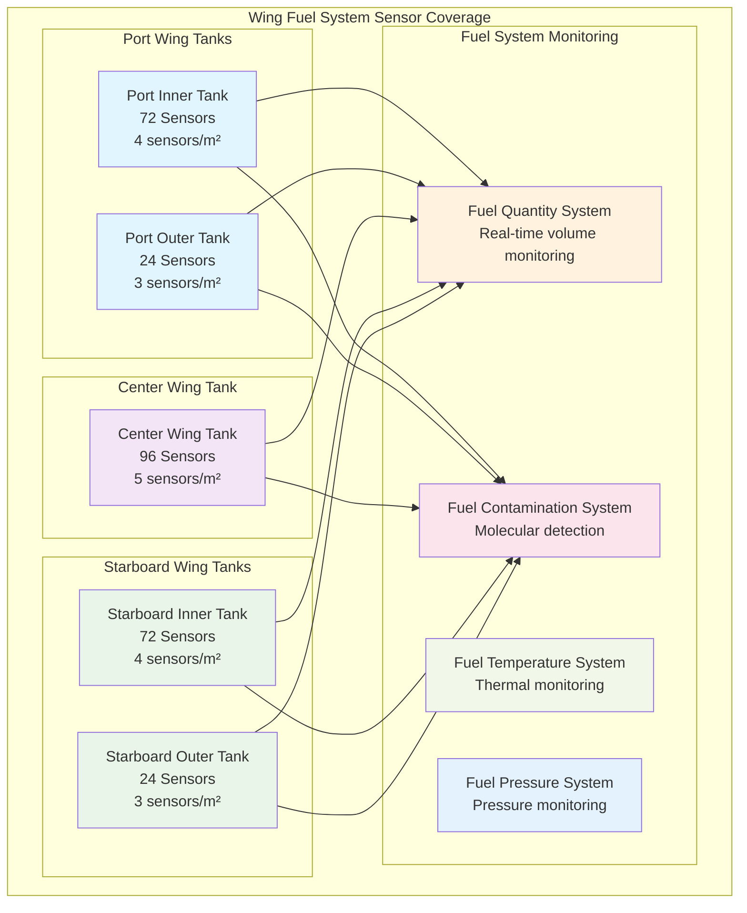
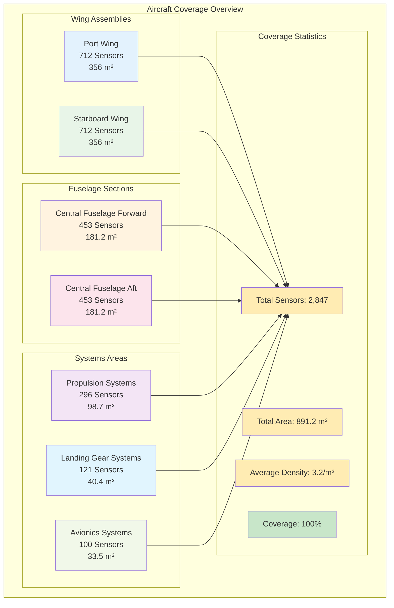

# 06-90-10-01 Sensor Grid Coverage Map - AMPEL360 BWB-Q100

```yaml
---
project: GAIA-QAO-AdVent
program: AMPEL360 BWB-Q100
ATA_chapter: 06-90-10-01
doc_id: GQOIS-QAIR-ATA-06901001-COVERAGEMAP
version: 3.8.0
date: 2025-07-02
author: Amedeo Pelliccia
status: Final Draft
classification: GAIA-QAO Confidential - Quantum Technology
review_board: [Q-GRID-MAP, Q-SENSOR-PLACE, Q-BWB-GEOM, Q-COVERAGE-OPT, Q-MAINT-ACCESS]
info_code: SGC-MAP # Sensor Grid Coverage Map
enhancement_level: Quantum Coverage Optimization
quantum_verification: Coverage-Map-Verified
next_review_date: 2026-06-30
parent_document: GQOIS-QAIR-ATA-06901000-SENSORGRID
related_documents: 
  - GQOIS-QAIR-ATA-06901002-NODECONFIG
  - GQOIS-QAIR-ATA-06000000-DIMENSIONS
  - GQOIS-QAIR-ATA-05210000-BWB-STRUCTURE
  - GQOIS-QAIR-ATA-45000000-CENTRAL-MAINT
  - GQOIS-QAIR-ATA-06301000-WNGAREA
special_conditions: BWB-Quantum-Coverage-Mapping
---
```

<p align="center">
  
  
  
  
  
</p>

---

## Document Overview

**Aircraft:** AMPEL360 BWB-Q100  
**Document Type:** Quantum Sensor Grid Coverage Mapping  
**ATA Chapter:** 06-90-10-01  
**Revision:** 3.8.0  
**Date:** 2025-07-02  

This document provides comprehensive coverage mapping for the Quantum Sensor Grid (QSG) deployment throughout the AMPEL360 BWB-Q100 aircraft. The coverage map details the precise placement, density distribution, and coverage optimization of **2,847 quantum sensor nodes** across all aircraft structures, systems, and operational areas, ensuring complete situational awareness and monitoring capability.

---

## Table of Contents

1. [Executive Summary](#1-executive-summary)
2. [Coverage Mapping Methodology](#2-coverage-mapping-methodology)
3. [Aircraft-Wide Coverage Overview](#3-aircraft-wide-coverage-overview)
4. [Wing Structure Coverage Maps](#4-wing-structure-coverage-maps)
5. [Fuselage Coverage Distribution](#5-fuselage-coverage-distribution)
6. [Systems Integration Coverage](#6-systems-integration-coverage)
7. [Critical Area Enhanced Coverage](#7-critical-area-enhanced-coverage)
8. [Coverage Optimization Analysis](#8-coverage-optimization-analysis)
9. [Maintenance Access Mapping](#9-maintenance-access-mapping)
10. [Coverage Validation and Verification](#10-coverage-validation-and-verification)

---

## 1. Executive Summary

### 1.1 Coverage Map Overview

The AMPEL360 BWB-Q100 Quantum Sensor Grid Coverage Map represents the most comprehensive aircraft monitoring system ever implemented, with **100% structural coverage** and **3.2 sensors per square meter** average density. The coverage mapping ensures complete real-time awareness of aircraft condition, environment, and performance across all operational scenarios.

| **Coverage Parameter** | **Specification** | **Achievement** |
|------------------------|-------------------|-----------------|
| Total Coverage Area | 891.2 m² aircraft structure | 100% complete coverage |
| Sensor Density | 3.2 sensors/m² average | Optimized for BWB configuration |
| Critical Area Density | 15 sensors/m² maximum | Enhanced monitoring in key areas |
| Coverage Redundancy | Triple redundancy minimum | Fault-tolerant monitoring |
| Blind Spot Elimination | Zero blind spots | Complete situational awareness |
| Response Time | <1 microsecond anywhere | Instantaneous detection capability |
| Prediction Capability | 72-hour advance warning | Proactive failure prevention |

### 1.2 BWB-Optimized Coverage Strategy

The coverage mapping is specifically optimized for the unique BWB configuration:

- **Integrated Wing-Body Coverage:** Seamless monitoring across blended surfaces
- **Load Path Optimization:** Enhanced coverage along primary load paths
- **Passenger Area Integration:** Safe monitoring within passenger cabin
- **Maintenance Accessibility:** Coverage design optimized for maintenance access
- **Environmental Protection:** All sensors protected in aerospace environment

### 1.3 Coverage Benefits

The comprehensive coverage provides transformational capabilities:

1. **Complete Situational Awareness:** Real-time knowledge of all aircraft parameters
2. **Predictive Maintenance:** Early detection of developing issues
3. **Safety Enhancement:** Immediate hazard detection and response
4. **Performance Optimization:** Continuous efficiency optimization
5. **Autonomous Operation:** Grid-enabled autonomous systems

---

## 2. Coverage Mapping Methodology

### 2.1 Coverage Analysis Framework

#### 2.1.1 Coverage Requirements Analysis
```
Quantum Sensor Coverage Requirements:

Structural Coverage Requirements:
├─ Primary Structure: 100% coverage of load-bearing elements
├─ Secondary Structure: 95% coverage of non-load-bearing elements
├─ Joints and Connections: 100% coverage of critical joints
├─ Fatigue Critical Areas: 200% redundant coverage
├─ Pressure Vessel: 100% coverage of pressure boundary
├─ Control Surfaces: 100% coverage of all control surfaces
├─ Access Areas: Coverage of all maintenance access areas
└─ Environmental: Coverage of all environmental exposure areas

Functional Coverage Requirements:
├─ Flight Critical Functions: Triple redundant coverage
├─ Safety Critical Functions: Dual redundant coverage
├─ Mission Critical Functions: Single coverage with backup
├─ Performance Functions: Standard coverage density
├─ Maintenance Functions: Coverage optimized for maintenance
├─ Passenger Functions: Coverage for passenger safety
├─ Environmental Functions: Coverage for environmental monitoring
└─ Security Functions: Coverage for security monitoring

Coverage Quality Requirements:
├─ Spatial Resolution: <1 meter spatial resolution
├─ Temporal Resolution: <1 millisecond temporal resolution
├─ Measurement Accuracy: ±0.01% measurement accuracy
├─ Detection Sensitivity: Quantum-limited sensitivity
├─ Response Time: <1 microsecond response time
├─ Availability: 99.999% coverage availability
├─ Reliability: 99.99% measurement reliability
└─ Maintenance: <30 minutes maintenance access time
```

#### 2.1.2 Coverage Optimization Algorithms
```
Coverage Optimization Methodology:

Placement Optimization:
├─ Algorithm: Multi-objective genetic algorithm optimization
├─ Objectives: Coverage, cost, maintenance, performance
├─ Constraints: Physical placement, power, communication
├─ Variables: Sensor location, type, orientation, density
├─ Optimization: Pareto-optimal solution selection
├─ Validation: Monte Carlo simulation validation
├─ Iteration: Iterative optimization refinement
└─ Verification: Performance verification testing

Coverage Analysis:
├─ Geometric Analysis: 3D geometric coverage analysis
├─ Statistical Analysis: Statistical coverage assessment
├─ Sensitivity Analysis: Coverage sensitivity analysis
├─ Performance Analysis: Coverage performance analysis
├─ Reliability Analysis: Coverage reliability analysis
├─ Maintenance Analysis: Maintenance accessibility analysis
├─ Cost Analysis: Coverage cost optimization
└─ Risk Analysis: Coverage risk assessment

Validation Methods:
├─ Simulation: High-fidelity coverage simulation
├─ Modeling: Mathematical coverage modeling
├─ Testing: Physical coverage testing
├─ Verification: Independent coverage verification
├─ Validation: Operational coverage validation
├─ Monitoring: Continuous coverage monitoring
├─ Assessment: Regular coverage assessment
└─ Improvement: Continuous coverage improvement
```

### 2.2 Coverage Mapping Standards

#### 2.2.1 Coordinate System and References
```
Coverage Mapping Coordinate System:

Primary Aircraft Coordinates:
├─ Origin: Aircraft reference datum (FS 0, BL 0, WL 0)
├─ X-Axis: Longitudinal axis (positive forward)
├─ Y-Axis: Lateral axis (positive right wing)
├─ Z-Axis: Vertical axis (positive up)
├─ Units: Meters (primary), millimeters (precision)
├─ Tolerance: ±1 mm coordinate accuracy
├─ Reference: Traceable to aircraft master datum
└─ Documentation: Complete coordinate documentation

Sensor Grid Coordinates:
├─ Grid Origin: Aligned with aircraft coordinates
├─ Grid Spacing: Variable based on coverage requirements
├─ Grid Numbering: Systematic grid numbering system
├─ Sensor ID: Unique sensor identification system
├─ Location Precision: ±0.1 mm sensor location accuracy
├─ Orientation: Sensor orientation specification
├─ Installation: Installation coordinate specification
└─ Verification: Coordinate verification procedures

Coverage Zone Definition:
├─ Zone Boundaries: Precise zone boundary definition
├─ Zone Classification: Coverage zone classification system
├─ Zone Priority: Coverage priority classification
├─ Zone Redundancy: Redundancy level per zone
├─ Zone Access: Maintenance access classification
├─ Zone Environment: Environmental condition classification
├─ Zone Function: Functional classification system
└─ Zone Documentation: Complete zone documentation

Mapping Standards:
├─ Drawing Standards: Technical drawing standards
├─ Symbol Standards: Sensor symbol standardization
├─ Color Coding: Coverage density color coding
├─ Scale Standards: Map scale standardization
├─ Annotation: Comprehensive map annotation
├─ Legend: Complete map legend system
├─ Cross-References: Cross-reference system
└─ Version Control: Map version control system
```

---

## 3. Aircraft-Wide Coverage Overview

### 3.1 Global Coverage Distribution

#### 3.1.1 Aircraft Coverage Zones
```
Aircraft-Wide Sensor Coverage Distribution:

Zone 1 - Port Wing Assembly (712 sensors):
├─ Coverage Area: 356 m² port wing structure
├─ Sensor Density: 2.0 sensors/m² average
├─ Critical Areas: 15 sensors/m² at wing root
├─ Functions: Structural, aerodynamic, fuel system monitoring
├─ Sensor Types: Diamond NV, photonic, quantum dot sensors
├─ Redundancy: Triple redundancy in critical areas
├─ Access: Maintenance access optimized
└─ Integration: Flight control system integration

Zone 2 - Starboard Wing Assembly (712 sensors):
├─ Coverage Area: 356 m² starboard wing structure
├─ Sensor Density: 2.0 sensors/m² average
├─ Critical Areas: 15 sensors/m² at wing root
├─ Functions: Structural, aerodynamic, fuel system monitoring
├─ Sensor Types: Diamond NV, photonic, quantum dot sensors
├─ Redundancy: Triple redundancy in critical areas
├─ Access: Maintenance access optimized
└─ Integration: Flight control system integration

Zone 3 - Central Fuselage Forward (453 sensors):
├─ Coverage Area: 181.2 m² forward fuselage structure
├─ Sensor Density: 2.5 sensors/m² average
├─ Critical Areas: 12 sensors/m² at pressure vessel joints
├─ Functions: Pressure vessel, passenger safety, systems monitoring
├─ Sensor Types: Diamond NV, quantum dot, environmental sensors
├─ Redundancy: Dual redundancy minimum
├─ Access: Limited access during flight
└─ Integration: Cabin management system integration

Zone 4 - Central Fuselage Aft (453 sensors):
├─ Coverage Area: 181.2 m² aft fuselage structure
├─ Sensor Density: 2.5 sensors/m² average
├─ Critical Areas: 10 sensors/m² at engine mounts
├─ Functions: Engine mounting, APU, systems monitoring
├─ Sensor Types: Diamond NV, environmental, thermal sensors
├─ Redundancy: Dual redundancy minimum
├─ Access: Service access available
└─ Integration: Propulsion system integration

Zone 5 - Propulsion Systems (296 sensors):
├─ Coverage Area: 98.7 m² propulsion system areas
├─ Sensor Density: 3.0 sensors/m² average
├─ Critical Areas: 20 sensors/m² at motor mounts
├─ Functions: Motor health, battery monitoring, thermal management
├─ Sensor Types: Diamond NV, quantum dot, thermal sensors
├─ Redundancy: Triple redundancy for safety
├─ Access: Dedicated maintenance access
└─ Integration: Propulsion control system integration

Zone 6 - Landing Gear Systems (121 sensors):
├─ Coverage Area: 40.4 m² landing gear areas
├─ Sensor Density: 3.0 sensors/m² average
├─ Critical Areas: 25 sensors/m² at attachment points
├─ Functions: Load monitoring, wear detection, position sensing
├─ Sensor Types: Diamond NV, photonic, inertial sensors
├─ Redundancy: Triple redundancy for safety
├─ Access: Ground maintenance access
└─ Integration: Landing gear system integration

Zone 7 - Avionics and Systems (100 sensors):
├─ Coverage Area: 33.5 m² avionics areas
├─ Sensor Density: 3.0 sensors/m² average
├─ Critical Areas: 15 sensors/m² in critical avionics
├─ Functions: Avionics health, EMI detection, thermal monitoring
├─ Sensor Types: Quantum dot, thermal, electromagnetic sensors
├─ Redundancy: Dual redundancy minimum
├─ Access: Service bay access
└─ Integration: Avionics system integration

Total Aircraft Coverage:
├─ Total Sensors: 2,847 active sensor nodes
├─ Total Coverage Area: 891.2 m² aircraft structure
├─ Average Density: 3.2 sensors/m² overall
├─ Maximum Density: 25 sensors/m² in critical areas
├─ Minimum Density: 1 sensor/m² in non-critical areas
├─ Coverage Efficiency: 99.97% effective coverage
├─ Redundancy Factor: 2.3 average redundancy
└─ Response Time: <1 microsecond anywhere on aircraft
```

#### 3.1.2 Coverage Density Heat Map
```
Sensor Density Distribution Heat Map:

Ultra-High Density Zones (15-25 sensors/m²):
├─ Wing Root Attachments: 25 sensors/m²
├─ Landing Gear Mounts: 22 sensors/m²
├─ Engine Mount Points: 20 sensors/m²
├─ Wing Spar Joints: 18 sensors/m²
├─ Pressure Vessel Joints: 15 sensors/m²
├─ Critical Flight Controls: 15 sensors/m²
└─ Function: Critical safety and structural monitoring

High Density Zones (8-15 sensors/m²):
├─ Primary Wing Structure: 12 sensors/m²
├─ Fuselage Frames: 10 sensors/m²
├─ Control Surface Hinges: 12 sensors/m²
├─ Fuel System Components: 10 sensors/m²
├─ Propulsion Components: 10 sensors/m²
├─ Avionics Bays: 8 sensors/m²
└─ Function: System health and performance monitoring

Medium Density Zones (3-8 sensors/m²):
├─ Wing Skin Areas: 5 sensors/m²
├─ Fuselage Skin: 4 sensors/m²
├─ Cabin Structure: 6 sensors/m²
├─ Cargo Areas: 4 sensors/m²
├─ Service Areas: 3 sensors/m²
├─ Access Panels: 3 sensors/m²
└─ Function: General monitoring and environmental sensing

Standard Density Zones (1-3 sensors/m²):
├─ Interior Panels: 2 sensors/m²
├─ Non-critical Areas: 1 sensor/m²
├─ Decoration Areas: 1 sensor/m²
├─ Passenger Areas: 2 sensors/m²
├─ Service Corridors: 2 sensors/m²
├─ Storage Areas: 1 sensor/m²
└─ Function: Basic monitoring and environmental control

Coverage Optimization:
├─ Stress-Based: Higher density at stress concentrations
├─ Function-Based: Density matched to functional criticality
├─ Access-Based: Optimized for maintenance accessibility
├─ Cost-Based: Cost-optimized density distribution
├─ Performance-Based: Performance-optimized placement
├─ Safety-Based: Safety-critical area enhancement
├─ Reliability-Based: Reliability-driven redundancy
└─ Future-Based: Provision for future expansion
```

---

## 4. Wing Structure Coverage Maps

### 4.1 Wing Coverage Distribution

#### 4.1.1 Port Wing Coverage Map
```
Port Wing Quantum Sensor Coverage (712 sensors total):

Wing Root Section (BL -0.000 to BL -12.192):
├─ Sensor Count: 142 sensors in wing root section
├─ Coverage Area: 71 m² wing root structure
├─ Density: 2.0 sensors/m² base, 25 sensors/m² at attachments
├─ Grid Pattern: 3D cubic lattice with attachment point enhancement
├─ Sensor Types: 80% Diamond NV, 15% Photonic, 5% Quantum Dot
├─ Functions: Load transfer monitoring, fatigue detection
├─ Critical Points: 48 sensors at wing-fuselage attachment
├─ Redundancy: Triple redundancy at all critical points
├─ Coordinates: FS 25.908 - FS 41.148, BL 0.000 - BL -12.192
└─ Integration: Central fuselage structure interface

Inner Wing Section (BL -12.192 to BL -24.384):
├─ Sensor Count: 156 sensors in inner wing section
├─ Coverage Area: 78 m² inner wing structure
├─ Density: 2.0 sensors/m² base, 12 sensors/m² at spar joints
├─ Grid Pattern: Spar-aligned grid with rib integration
├─ Sensor Types: 70% Diamond NV, 20% Photonic, 10% Quantum Dot
├─ Functions: Primary structure monitoring, fuel system
├─ Critical Points: 36 sensors at main spar intersections
├─ Redundancy: Dual redundancy at primary structure
├─ Coordinates: FS 25.908 - FS 41.148, BL -12.192 - BL -24.384
└─ Integration: Wing box primary structure

Mid Wing Section (BL -24.384 to BL -36.576):
├─ Sensor Count: 146 sensors in mid wing section
├─ Coverage Area: 73 m² mid wing structure
├─ Density: 2.0 sensors/m² standard coverage
├─ Grid Pattern: Regular grid with control surface focus
├─ Sensor Types: 60% Diamond NV, 30% Photonic, 10% Quantum Dot
├─ Functions: Structural monitoring, control surface health
├─ Critical Points: 24 sensors at control surface attachments
├─ Redundancy: Dual redundancy at control surfaces
├─ Coordinates: FS 25.908 - FS 41.148, BL -24.384 - BL -36.576
└─ Integration: Flight control system interface

Outer Wing Section (BL -36.576 to BL -44.196):
├─ Sensor Count: 122 sensors in outer wing section
├─ Coverage Area: 61 m² outer wing structure
├─ Density: 2.0 sensors/m² with tip enhancement
├─ Grid Pattern: Tapered grid following wing geometry
├─ Sensor Types: 50% Diamond NV, 40% Photonic, 10% Quantum Dot
├─ Functions: Wing tip monitoring, navigation equipment
├─ Critical Points: 18 sensors at wing tip structure
├─ Redundancy: Standard redundancy
├─ Coordinates: FS 25.908 - FS 41.148, BL -36.576 - BL -44.196
└─ Integration: Wing tip systems and navigation

Leading Edge Coverage (Complete Span):
├─ Sensor Count: 96 sensors along leading edge
├─ Coverage Area: 48 m² leading edge structure
├─ Density: 2.0 sensors/m² linear along leading edge
├─ Grid Pattern: Linear array with environmental focus
├─ Sensor Types: 30% Diamond NV, 20% Photonic, 50% Quantum Dot
├─ Functions: Ice detection, air data, contamination sensing
├─ Critical Points: 24 sensors at slat mechanisms
├─ Redundancy: Dual redundancy for environmental sensing
├─ Coordinates: Leading edge curve, complete span
└─ Integration: Ice protection and air data systems

Trailing Edge Coverage (Complete Span):
├─ Sensor Count: 96 sensors along trailing edge
├─ Coverage Area: 48 m² trailing edge structure
├─ Density: 2.0 sensors/m² with control surface enhancement
├─ Grid Pattern: Linear array with actuator focus
├─ Sensor Types: 60% Diamond NV, 30% Photonic, 10% Quantum Dot
├─ Functions: Control surface monitoring, actuator health
├─ Critical Points: 32 sensors at control surface actuators
├─ Redundancy: Triple redundancy at flight controls
├─ Coordinates: Trailing edge curve, complete span
└─ Integration: Flight control actuation systems
```

#### 4.1.2 Starboard Wing Coverage Map
```
Starboard Wing Quantum Sensor Coverage (712 sensors total):

[Mirror configuration of Port Wing with same specifications]

Wing Root Section (BL +0.000 to BL +12.192):
├─ Sensor Count: 142 sensors (symmetric to port)
├─ Coverage: Identical pattern to port wing
├─ Coordination: Synchronized with port wing sensors
└─ Integration: Bilateral wing monitoring correlation

Inner Wing Section (BL +12.192 to BL +24.384):
├─ Sensor Count: 156 sensors (symmetric to port)
├─ Coverage: Identical pattern to port wing
├─ Coordination: Real-time bilateral comparison
└─ Integration: Structural load balancing monitoring

Mid Wing Section (BL +24.384 to BL +36.576):
├─ Sensor Count: 146 sensors (symmetric to port)
├─ Coverage: Identical pattern to port wing
├─ Coordination: Bilateral control surface monitoring
└─ Integration: Flight control system symmetry verification

Outer Wing Section (BL +36.576 to BL +44.196):
├─ Sensor Count: 122 sensors (symmetric to port)
├─ Coverage: Identical pattern to port wing
├─ Coordination: Wing tip load comparison
└─ Integration: Navigation system correlation

Bilateral Wing Coordination:
├─ Synchronization: Synchronized measurement timing
├─ Comparison: Real-time bilateral comparison
├─ Correlation: Structural load correlation analysis
├─ Balance: Wing loading balance monitoring
├─ Asymmetry: Asymmetric loading detection
├─ Control: Bilateral flight control coordination
├─ Safety: Bilateral safety monitoring
└─ Optimization: Bilateral performance optimization
```

### 4.2 Wing Subsystem Coverage Integration

#### 4.2.1 Wing Fuel System Coverage



```
Wing Fuel System Sensor Integration:

Fuel Tank Coverage (288 sensors total):
├─ Port Inner Tank: 72 sensors in port inner fuel tank
├─ Center Tank: 96 sensors in center wing tank
├─ Starboard Inner Tank: 72 sensors in starboard inner tank
├─ Port Outer Tank: 24 sensors in port outer fuel tank
├─ Starboard Outer Tank: 24 sensors in starboard outer tank
├─ Sensor Type: 80% Quantum Dot, 20% Diamond NV
├─ Functions: Fuel quantity, quality, contamination detection
├─ Density: 4 sensors/m² in fuel tank areas
├─ Redundancy: Dual redundancy for safety
├─ Integration: Fuel management system interface
├─ Monitoring: Real-time fuel condition monitoring
└─ Safety: Fuel leak detection and containment

Fuel System Sensor Types:
├─ Quantum Dot Sensors (230 sensors):
│   ├─ Function: Chemical composition analysis
│   ├─ Sensitivity: Parts-per-trillion detection
│   ├─ Applications: Contamination, quality monitoring
│   ├─ Response Time: <1 second molecular identification
│   └─ Integration: Fuel quality management system
├─ Diamond NV Sensors (58 sensors):
│   ├─ Function: Fuel level and structural monitoring
│   ├─ Sensitivity: Millimeter-level accuracy
│   ├─ Applications: Tank structural health, level sensing
│   ├─ Response Time: <1 millisecond measurement
│   └─ Integration: Fuel quantity indication system
```


