# ATA 07-10-10-01 – SINGLE POINT JACKING
## AMPEL360 BWB-Q100 - GAIA-QAO Framework

---

## 📋 DOCUMENT CONTROL

| Field | Value |
|-------|--------|
| **Document ID** | `07-10-10-01-SinglePointJacking` |
| **Version** | 1.0.0 |
| **Date** | 2025-07-02 |
| **Classification** | GAIA-QAO Confidential |
| **ATA Chapter** | 07-10-10 - Single Point Jacking |
| **Aircraft Model** | AMPEL360 BWB-Q100 |
| **GAIA-QAO ID** | `AS-M-PAX-BW-Q1H-07-10-10-01` |

---

## 🎯 SINGLE POINT JACKING OVERVIEW

### Purpose and Scope
This document defines the procedures and requirements for **Single Point Jacking** operations on the AMPEL360 BWB-Q100. Single point jacking is used for specific maintenance tasks requiring localized lifting while maintaining the aircraft's overall stability and protecting the quantum sensor network.

### Unique BWB Considerations
The Blended Wing Body configuration presents unique challenges for single point jacking:
- **Non-traditional load paths** require careful analysis
- **Distributed quantum sensors** need protection during localized lifting
- **Wing-fuselage integration** creates complex stress patterns
- **Center of gravity variations** with fuel and payload changes

---

## 🏗️ AUTHORIZED SINGLE POINT LOCATIONS

### Primary Single Point Jack Locations

```mermaid
graph TB
    subgraph Aircraft["AMPEL360 BWB-Q100 - Single Point Jack Locations"]
        subgraph Nose["Nose Section"]
            SP01["SP-01-NOSE<br/>📍 Nose Landing Gear Bay<br/>⚖️ 15,000 kg max<br/>🎯 Nose gear maintenance<br/>🔬 Medium quantum density"]
        end
        
        subgraph WingTips["Wing Tip Areas"]
            SP02["SP-02-TIP-L<br/>📍 Port Wing Tip<br/>⚖️ 8,000 kg max<br/>🎯 Wingtip equipment<br/>🔬 Low quantum density"]
            SP03["SP-03-TIP-R<br/>📍 Starboard Wing Tip<br/>⚖️ 8,000 kg max<br/>🎯 Wingtip equipment<br/>🔬 Low quantum density"]
        end
        
        subgraph Emergency["Emergency Points"]
            SP04["SP-04-EMER-L<br/>📍 Port Emergency<br/>⚖️ 12,000 kg max<br/>🎯 Emergency maintenance<br/>🔬 Variable density"]
            SP05["SP-05-EMER-R<br/>📍 Starboard Emergency<br/>⚖️ 12,000 kg max<br/>🎯 Emergency maintenance<br/>🔬 Variable density"]
        end
        
        subgraph Tail["Tail Section"]
            SP06["SP-06-TAIL<br/>📍 Aft Extremity<br/>⚖️ 6,000 kg max<br/>🎯 Tail maintenance<br/>🔬 Low quantum density"]
        end
        
        subgraph Support["Support Systems"]
            CGC[Center of Gravity<br/>Calculation System]
            QMS[Quantum Monitoring<br/>Real-time Protection]
            LDS[Load Distribution<br/>Stress Analysis]
            SAS[Stability Analysis<br/>Continuous Assessment]
        end
    end
    
    SP01 --> CGC
    SP02 --> CGC
    SP03 --> CGC
    SP04 --> CGC
    SP05 --> CGC
    SP06 --> CGC
    
    CGC --> QMS
    CGC --> LDS
    CGC --> SAS
    
    QMS --> ProtSys[Quantum Protection<br/>Active Isolation]
    LDS --> MonSys[Load Monitoring<br/>Real-time Feedback]
    SAS --> AlertSys[Stability Alerts<br/>Safety Warnings]
    
    style SP01 fill:#74b9ff,stroke:#0984e3,stroke-width:3px
    style SP02 fill:#fd79a8,stroke:#e84393,stroke-width:2px
    style SP03 fill:#fd79a8,stroke:#e84393,stroke-width:2px
    style SP04 fill:#fdcb6e,stroke:#e17055,stroke-width:2px
    style SP05 fill:#fdcb6e,stroke:#e17055,stroke-width:2px
    style SP06 fill:#a29bfe,stroke:#6c5ce7,stroke-width:2px
    style CGC fill:#00b894,stroke:#00a085,stroke-width:3px
    style QMS fill:#2d3436,stroke:#636e72,stroke-width:2px
```

### Single Point Jack Specifications

| Point ID | Location | Max Load | Lift Height | Primary Use | Quantum Impact |
|----------|----------|----------|-------------|-------------|----------------|
| **SP-01-NOSE** | Nose Landing Gear Bay | 15,000 kg | 500mm | Nose gear maintenance | Medium - sensor protection required |
| **SP-02-TIP-L** | Port Wing Tip | 8,000 kg | 300mm | Wingtip equipment access | Low - minimal sensor interference |
| **SP-03-TIP-R** | Starboard Wing Tip | 8,000 kg | 300mm | Wingtip equipment access | Low - minimal sensor interference |
| **SP-04-EMER-L** | Port Emergency Point | 12,000 kg | 400mm | Emergency maintenance | Variable - depends on location |
| **SP-05-EMER-R** | Starboard Emergency Point | 12,000 kg | 400mm | Emergency maintenance | Variable - depends on location |
| **SP-06-TAIL** | Aft Extremity | 6,000 kg | 250mm | Tail section access | Low - standard precautions |

---

## 🔄 SINGLE POINT JACKING PROCEDURE

### Master Procedure Flow

```mermaid
flowchart TD
    Start([🚀 Initiate Single Point Jacking]) --> PreAssess[📋 Pre-Jacking Assessment]
    
    PreAssess --> CGCalc[⚖️ Center of Gravity Calculation]
    CGCalc --> LoadAnalysis[📊 Load Path Analysis]
    LoadAnalysis --> QuantumSurvey[🔬 Quantum Sensor Survey]
    QuantumSurvey --> StabilityCheck[🏗️ Stability Verification]
    
    StabilityCheck --> StableOK{Stability Acceptable?}
    StableOK -->|❌ No| StabCorrect[🔧 Stability Correction]
    StableOK -->|✅ Yes| SafetySetup[🛡️ Safety System Setup]
    
    StabCorrect --> AddSupport[🏗️ Additional Support Required]
    AddSupport --> StabilityCheck
    
    SafetySetup --> QuantumProtect[🔬 Quantum Protection Activation]
    QuantumProtect --> JackPosition[📍 Jack Positioning]
    JackPosition --> ConnectJack[🔗 Jack Connection]
    
    ConnectJack --> ConnectOK{Connection Verified?}
    ConnectOK -->|❌ No| ReConnect[🔧 Reconnection Required]
    ConnectOK -->|✅ Yes| PreLiftCheck[📋 Pre-Lift Checklist]
    
    ReConnect --> ConnectJack
    
    PreLiftCheck --> CheckOK{All Systems Ready?}
    CheckOK -->|❌ No| ResolveConcerns[🔧 Resolve Concerns]
    CheckOK -->|✅ Yes| InitialLift[⬆️ Initial Lift Phase]
    
    ResolveConcerns --> PreLiftCheck
    
    InitialLift --> MonitorLift[📊 Monitor Lifting Process]
    MonitorLift --> LiftRate[📏 Control Lift Rate]
    LiftRate --> StressMonitor[🔍 Stress Monitoring]
    StressMonitor --> QuantumCheck[🔬 Quantum System Check]
    
    QuantumCheck --> AnyAlerts{Any Alerts?}
    AnyAlerts -->|✅ Yes| HandleAlert[⚠️ Handle Alert Condition]
    AnyAlerts -->|❌ No| ContinueLift[⬆️ Continue Lifting]
    
    HandleAlert --> AlertType{Alert Type?}
    AlertType -->|Load| LoadCorrect[⚖️ Load Correction]
    AlertType -->|Quantum| QuantumCorrect[🔬 Quantum Correction]
    AlertType -->|Stability| StabCorrectLift[🏗️ Stability Correction]
    AlertType -->|Critical| EmergencyStop[🛑 Emergency Stop]
    
    LoadCorrect --> ContinueLift
    QuantumCorrect --> ContinueLift
    StabCorrectLift --> ContinueLift
    
    ContinueLift --> TargetHeight{Target Height Reached?}
    TargetHeight -->|❌ No| MonitorLift
    TargetHeight -->|✅ Yes| LockPosition[🔒 Lock Position]
    
    LockPosition --> FinalVerify[✅ Final Verification]
    FinalVerify --> WorkReady[🎯 Ready for Work]
    
    EmergencyStop --> EmergencyProc[🚨 Emergency Procedures]
    EmergencyProc --> EmergencyComplete[⚠️ Emergency Complete]
    
    WorkReady --> MaintenanceWork[🔧 Perform Maintenance]
    MaintenanceWork --> WorkComplete[✅ Work Complete]
    WorkComplete --> LoweringProc[⬇️ Lowering Procedure]
    LoweringProc --> Complete([✅ Operation Complete])
    
    style Start fill:#00b894,stroke:#00a085,stroke-width:3px
    style WorkReady fill:#00b894,stroke:#00a085,stroke-width:3px
    style Complete fill:#00b894,stroke:#00a085,stroke-width:3px
    style EmergencyStop fill:#d63031,stroke:#b2bec3,stroke-width:3px
    style QuantumProtect fill:#6c5ce7,stroke:#5f3dc4,stroke-width:2px
    style QuantumCheck fill:#6c5ce7,stroke:#5f3dc4,stroke-width:2px
    style CGCalc fill:#74b9ff,stroke:#0984e3,stroke-width:2px
    style StabilityCheck fill:#fd79a8,stroke:#e84393,stroke-width:2px
```

---

## 📊 CENTER OF GRAVITY ANALYSIS

### CG Calculation for Single Point Operations

```mermaid
graph TD
    subgraph CG_Analysis["Center of Gravity Analysis System"]
        subgraph Input_Data["Input Parameters"]
            Aircraft_Weight[Aircraft Empty Weight<br/>48,500 kg baseline]
            Fuel_Load[Fuel Loading<br/>Variable 0-15,000 kg]
            Cargo_Load[Cargo/Payload<br/>Variable 0-12,000 kg]
            Equipment_Status[Equipment Status<br/>Removed/Installed]
        end
        
        subgraph Calculations["CG Calculations"]
            Total_Weight[Total Aircraft Weight<br/>Dynamic Calculation]
            CG_Position[CG Position<br/>Longitudinal/Lateral]
            Stability_Margin[Stability Margin<br/>Safety Assessment]
            Jack_Moment[Jack Point Moment<br/>Load Distribution]
        end
        
        subgraph Limits["Operating Limits"]
            Forward_Limit[Forward CG Limit<br/>Station 580]
            Aft_Limit[Aft CG Limit<br/>Station 650]
            Lateral_Limit[Lateral CG Limit<br/>±50mm centerline]
            Single_Point_Limit[Single Point Limit<br/>±100mm from nominal]
        end
        
        subgraph Validation["Validation System"]
            CG_Validator[CG Position Validator]
            Stability_Check[Stability Assessment]
            Jack_Approval[Jack Operation Approval]
            Safety_Override[Safety Override System]
        end
    end
    
    Aircraft_Weight --> Total_Weight
    Fuel_Load --> Total_Weight
    Cargo_Load --> Total_Weight
    Equipment_Status --> Total_Weight
    
    Total_Weight --> CG_Position
    CG_Position --> Stability_Margin
    CG_Position --> Jack_Moment
    
    CG_Position --> CG_Validator
    Stability_Margin --> Stability_Check
    Jack_Moment --> Jack_Approval
    
    CG_Validator --> Forward_Limit
    CG_Validator --> Aft_Limit
    CG_Validator --> Lateral_Limit
    
    Stability_Check --> Safety_Override
    Jack_Approval --> Safety_Override
    
    Safety_Override --> Approved[✅ Operation Approved]
    Safety_Override --> Denied[❌ Operation Denied]
    
    style Total_Weight fill:#74b9ff,stroke:#0984e3,stroke-width:2px
    style CG_Position fill:#00b894,stroke:#00a085,stroke-width:2px
    style Safety_Override fill:#fd79a8,stroke:#e84393,stroke-width:3px
    style Approved fill:#00b894,stroke:#00a085,stroke-width:3px
    style Denied fill:#d63031,stroke:#b2bec3,stroke-width:3px
```

### CG Limits for Single Point Operations

| Configuration | Forward Limit | Aft Limit | Lateral Limit | Single Point Restriction |
|---------------|---------------|------------|---------------|-------------------------|
| **Empty Aircraft** | Station 585 | Station 645 | ±30mm | SP-01, SP-06 only |
| **Service Load** | Station 580 | Station 650 | ±40mm | All points authorized |
| **Maximum Load** | Station 575 | Station 655 | ±50mm | Restricted operations |
| **Emergency Config** | Station 570 | Station 660 | ±75mm | Emergency points only |

---

## 🔬 QUANTUM SENSOR PROTECTION

### Sensor Protection During Single Point Operations

### Protection Protocols by Jack Point

| Jack Point | Sensors Affected | Magnetic Field Limit | Vibration Limit | Special Requirements |
|------------|------------------|---------------------|------------------|---------------------|
| **SP-01-NOSE** | 148 (Medium density) | <0.3 Gauss | <0.05g | Active compensation required |
| **SP-02-TIP-L** | 24 (Low density) | <0.8 Gauss | <0.1g | Standard monitoring |
| **SP-03-TIP-R** | 24 (Low density) | <0.8 Gauss | <0.1g | Standard monitoring |
| **SP-04-EMER-L** | 50-200 (Variable) | <0.5 Gauss | <0.08g | Adaptive protection |
| **SP-05-EMER-R** | 50-200 (Variable) | <0.5 Gauss | <0.08g | Adaptive protection |
| **SP-06-TAIL** | 32 (Low density) | <0.8 Gauss | <0.1g | Basic procedures |

---

## ⚙️ EQUIPMENT SPECIFICATIONS

### Single Point Jack Equipment

```mermaid
mindmap
  root((Single Point Jack Equipment))
    Portable Jacks
      Hydraulic Jacks
        15,000 kg capacity
        500mm stroke
        Precision control
      Pneumatic Jacks
        8,000 kg capacity
        300mm stroke
        Quick setup
      Manual Jacks
        6,000 kg capacity
        Emergency backup
        No power required
    Support Equipment
      Jack Stands
        Adjustable height
        Safety locks
        Stability base
      Load Spreaders
        Aluminum construction
        Various sizes
        Load distribution
      Cribbing Blocks
        Composite material
        Modular system
        Quick assembly
    Monitoring Systems
      Load Cells
        Real-time feedback
        ±0.1% accuracy
        Wireless data
      Position Sensors
        ±1mm precision
        Continuous monitoring
        Auto-compensation
      Quantum Sensors
        Interference detection
        Field strength monitor
        Alert system
    Safety Equipment
      Emergency Stops
        Wireless remote
        Dead-man switch
        Automatic activation
      Backup Systems
        Manual override
        Independent power
        Fail-safe design
      Isolation Systems
        Magnetic shielding
        Vibration dampening
        EMI protection
```

### Jack Selection Criteria

---

## 🛡️ SAFETY PROCEDURES

### Pre-Jacking Safety Checklist

### Safety Monitoring During Operations

| Safety Parameter | Normal Range | Warning Threshold | Emergency Threshold | Automatic Response |
|------------------|--------------|-------------------|---------------------|-------------------|
| **Load Distribution** | Within 5% of calculated | 10% deviation | 15% deviation | Load redistribution |
| **Jack Pressure** | 95-105% nominal | 110% nominal | 120% nominal | Pressure relief |
| **Aircraft Tilt** | ±0.5° | ±1.0° | ±1.5° | Automatic correction |
| **Quantum Coherence** | >99% | <98% | <95% | Protection enhancement |
| **Magnetic Field** | <0.1 Gauss | 0.5 Gauss | 1.0 Gauss | Immediate isolation |
| **Vibration Level** | <0.02g | 0.05g | 0.1g | Vibration suppression |

---

## 📊 OPERATIONAL PROCEDURES

### Nose Landing Gear Bay Jacking (SP-01)

### Wing Tip Jacking Procedures (SP-02/SP-03)

**Unique Considerations for Wing Tip Operations:**
- **Minimal structural support** requires careful load monitoring
- **Low quantum sensor density** allows standard procedures
- **Fuel redistribution** may be required for balance
- **Weather sensitivity** due to exposed location

**Procedure Overview:**
1. **Fuel Management**: Redistribute fuel away from wing tip
2. **Equipment Positioning**: Use lightweight, portable jacks
3. **Support Installation**: Install secondary support points
4. **Lifting Sequence**: Gradual lift with continuous monitoring
5. **Work Authorization**: Verify stability before maintenance
6. **Lowering Protocol**: Reverse sequence with care

---

## 🔧 MAINTENANCE INTEGRATION

### Maintenance Tasks Requiring Single Point Jacking

```mermaid
graph TD
    subgraph MaintenanceTasks["Maintenance Tasks by Jack Point"]
        subgraph SP01_Tasks["SP-01 Nose Tasks"]
            NLG_Service[Nose Landing Gear<br/>Service & Repair]
            Nose_Avionics[Nose Avionics<br/>Access & Maintenance]
            Radar_Service[Weather Radar<br/>Service & Calibration]
            Nose_Structure[Nose Structure<br/>Inspection & Repair]
        end
        
        subgraph SP02_03_Tasks["SP-02/03 Wing Tip Tasks"]
            Nav_Lights[Navigation Lights<br/>Replacement & Service]
            Wing_Tips[Wing Tip Equipment<br/>Maintenance & Inspection]
            Antenna_Service[Antenna Systems<br/>Service & Alignment]
            Surface_Repair[Wing Tip Surfaces<br/>Repair & Refinishing]
        end
        
        subgraph SP04_05_Tasks["SP-04/05 Emergency Tasks"]
            Emergency_Access[Emergency Access<br/>Component Replacement]
            Structural_Repair[Emergency Structural<br/>Repair & Reinforcement]
            System_Bypass[System Bypass<br/>Installation & Service]
            Damage_Assessment[Damage Assessment<br/>& Temporary Repair]
        end
        
        subgraph SP06_Tasks["SP-06 Tail Tasks"]
            Tail_Equipment[Tail Equipment<br/>Service & Repair]
            Aft_Structure[Aft Structure<br/>Inspection & Maintenance]
            Tail_Surfaces[Control Surfaces<br/>Adjustment & Repair]
            Beacon_Service[Beacon & Strobe<br/>Light Maintenance]
        end
        
        subgraph Planning["Maintenance Planning"]
            Task_Scheduler[Maintenance Scheduler]
            Resource_Allocation[Resource Allocation]
            Risk_Assessment[Risk Assessment]
            Integration_Check[Integration Verification]
        end
    end
    
    NLG_Service --> Task_Scheduler
    Nose_Avionics --> Task_Scheduler
    Nav_Lights --> Task_Scheduler
    Emergency_Access --> Task_Scheduler
    Tail_Equipment --> Task_Scheduler
    
    Task_Scheduler --> Resource_Allocation
    Resource_Allocation --> Risk_Assessment
    Risk_Assessment --> Integration_Check
    
    Integration_Check --> Approved_Work[✅ Work Approved]
    Integration_Check --> Additional_Review[🔍 Additional Review Required]
    
    Additional_Review --> Risk_Assessment
    
    style Task_Scheduler fill:#74b9ff,stroke:#0984e3,stroke-width:2px
    style Risk_Assessment fill:#fd79a8,stroke:#e84393,stroke-width:2px
    style Approved_Work fill:#00b894,stroke:#00a085,stroke-width:3px
    style Additional_Review fill:#fdcb6e,stroke:#e17055,stroke-width:2px
```

### Work Authorization Matrix

| Jack Point | Maximum Work Duration | Personnel Limit | Equipment Restrictions | Special Authorizations |
|------------|----------------------|-----------------|------------------------|------------------------|
| **SP-01-NOSE** | 8 hours | 4 technicians | Non-magnetic tools only | Quantum safety officer required |
| **SP-02-TIP-L** | 4 hours | 2 technicians | Standard tools acceptable | Standard supervision |
| **SP-03-TIP-R** | 4 hours | 2 technicians | Standard tools acceptable | Standard supervision |
| **SP-04-EMER-L** | 12 hours | 6 technicians | Situation dependent | Emergency authorization |
| **SP-05-EMER-R** | 12 hours | 6 technicians | Situation dependent | Emergency authorization |
| **SP-06-TAIL** | 6 hours | 3 technicians | Standard tools acceptable | Standard supervision |

---

## 📈 PERFORMANCE MONITORING

### Key Performance Indicators

### Continuous Improvement Tracking

| Metric | Q1 2025 | Q2 2025 | Q3 2025 | Q4 2025 Target | Improvement Actions |
|--------|---------|---------|---------|----------------|-------------------|
| **Setup Time** | 48 min | 45 min | 42 min | 40 min | Equipment standardization |
| **Success Rate** | 99.2% | 99.5% | 99.7% | 99.8% | Enhanced training program |
| **Quantum Impact** | 0.8% | 0.5% | 0.3% | 0.2% | Improved isolation systems |
| **Safety Score** | 97.5% | 98.8% | 99.2% | 99.5% | Advanced safety protocols |
| **Equipment Uptime** | 97.8% | 98.5% | 99.1% | 99.3% | Predictive maintenance |

---

## 🚨 EMERGENCY PROCEDURES

### Emergency Response Flowchart

```mermaid
flowchart TD
    Emergency[🚨 Emergency Detected] --> EmergencyType{Emergency Type?}
    
    EmergencyType -->|Equipment Failure| EquipFail[⚙️ Equipment Failure Protocol]
    EmergencyType -->|Structural Alert| StructAlert[🏗️ Structural Alert Protocol]
    EmergencyType -->|Quantum Alert| QuantumAlert[🔬 Quantum Alert Protocol]
    EmergencyType -->|Personnel Injury| InjuryAlert[🏥 Personnel Injury Protocol]
    
    EquipFail --> EquipSteps[1. Emergency Stop<br/>2. Assess Damage<br/>3. Secure Aircraft<br/>4. Investigate Cause]
    StructAlert --> StructSteps[1. Hold Position<br/>2. Assess Structure<br/>3. Add Support<br/>4. Expert Consultation]
    QuantumAlert --> QuantumSteps[1. Isolation Activation<br/>2. Sensor Assessment<br/>3. Protection Enhancement<br/>4. System Recovery]
    InjuryAlert --> InjurySteps[1. Medical Response<br/>2. Scene Safety<br/>3. Incident Documentation<br/>4. Investigation]
    
    EquipSteps --> Assessment[📋 Situation Assessment]
    StructSteps --> Assessment
    QuantumSteps --> Assessment
    InjurySteps --> Assessment
    
    Assessment --> SafetyCheck{Aircraft Safe?}
    SafetyCheck -->|✅ Yes| ContinueOps[Continue Operations<br/>with Modifications]
    SafetyCheck -->|❌ No| SecureAircraft[🔒 Secure Aircraft<br/>End Operations]
    
    ContinueOps --> Documentation[📋 Document Incident]
    SecureAircraft --> Documentation
    
    Documentation --> Investigation[🔍 Root Cause Analysis]
    Investigation --> CorrectiveAction[🔧 Corrective Actions]
    CorrectiveAction --> TrainingUpdate[📚 Training Updates]
    TrainingUpdate --> ProcessImprovement[📈 Process Improvement]
    
    style Emergency fill:#d63031,stroke:#2d3436,stroke-width:3px
    style EquipFail fill:#fd79a8,stroke:#e84393,stroke-width:2px
    style StructAlert fill:#fdcb6e,stroke:#e17055,stroke-width:2px
    style QuantumAlert fill:#6c5ce7,stroke:#5f3dc4,stroke-width:2px
    style InjuryAlert fill:#ff7675,stroke:#d63031,stroke-width:2px
    style ProcessImprovement fill:#00b894,stroke:#00a085,stroke-width:2px
```

### Emergency Contact Information

| Emergency Type | Primary Contact | Secondary Contact | Response Time |
|----------------|----------------|-------------------|---------------|
| **Equipment Failure** | Maintenance Chief | Equipment Specialist | <15 minutes |
| **Structural Issues** | Structural Engineer | Safety Officer | <30 minutes |
| **Quantum System Alert** | Quantum Specialist | System Engineer | <10 minutes |
| **Personnel Injury** | Medical Emergency | Safety Manager | Immediate |
| **Environmental Hazard** | Environmental Officer | Facility Manager | <20 minutes |

---

## 📚 TRAINING AND CERTIFICATION

### Training Program Structure

### Certification Requirements by Role

| Role | Basic Req. | Advanced Req. | Recertification | Special Training |
|------|------------|---------------|-----------------|------------------|
| **Operator** | 40 hours | N/A | Annual | Quantum awareness |
| **Lead Technician** | 40 hours | 60 hours | Annual | Emergency procedures |
| **Supervisor** | 40 hours | 80 hours | Bi-annual | Leadership & risk mgmt |
| **Quantum Specialist** | 40 hours | 120 hours | Bi-annual | Quantum system specialist |
| **Safety Officer** | 40 hours | 100 hours | Annual | Safety management system |
| **Instructor** | 80 hours | 160 hours | Bi-annual | Teaching methodology |

---

## 📄 REVISION HISTORY

| Version | Date | Author | Changes |
|---------|------|--------|---------|
| 1.0.0 | 2025-07-02 | GAIA-QAO Technical Team | Initial release for BWB-Q100 single point jacking procedures |

---

**END OF DOCUMENT**

*This document provides comprehensive procedures for single point jacking operations on the AMPEL360 BWB-Q100. All operations must be performed by certified personnel following these procedures and applicable safety regulations.*
