# ATA 07-10-10-02 – MULTI-POINT JACKING
## AMPEL360 BWB-Q100 - GAIA-QAO Framework

---

## 📋 DOCUMENT CONTROL

| Field | Value |
|-------|--------|
| **Document ID** | `07-10-10-02-MultiPointJacking` |
| **Version** | 1.0.0 |
| **Date** | 2025-07-02 |
| **Classification** | GAIA-QAO Confidential |
| **ATA Chapter** | 07-10-10-02 - Multi-Point Jacking |
| **Aircraft Model** | AMPEL360 BWB-Q100 |
| **GAIA-QAO ID** | `AS-M-PAX-BW-Q1H-07-10-10-02` |
| **Parent Document** | ATA 07-10-10-00-General |

---

## 🎯 MULTI-POINT JACKING OVERVIEW

### Purpose and Scope
Multi-point jacking of the AMPEL360 BWB-Q100 involves the **coordinated operation of multiple jack points** to achieve full aircraft lifting, major maintenance configurations, or complex structural access requirements. This document defines the specialized procedures for **synchronized multi-jack operations** while maintaining the integrity of the quantum sensor network and BWB structural requirements.

### BWB Multi-Point Advantages
The Blended Wing Body configuration benefits from multi-point jacking through:
- **Distributed Load Management**: Even stress distribution across the integrated structure
- **Optimal CG Control**: Precise center of gravity maintenance during operations
- **Enhanced Stability**: Multiple contact points provide superior aircraft stability
- **Quantum Network Protection**: Coordinated protection of all sensor zones simultaneously

### Multi-Point Configurations
1. **Full Aircraft Lifting**: All 6 primary jack points (Standard maintenance configuration)
2. **Partial Multi-Point**: 3-4 strategic points for specific access requirements
3. **Synchronized Pairs**: Coordinated bilateral operations (Port/Starboard)
4. **Progressive Multi-Point**: Sequential activation for complex procedures

---

## 🏗️ MULTI-POINT CONFIGURATION MATRIX

### Standard Multi-Point Configurations


### Configuration Selection Matrix

| Configuration | Jack Points | Total Capacity | Primary Applications | Quantum Impact | Time Required |
|---------------|-------------|----------------|---------------------|----------------|---------------|
| **Full Lift** | All 6 primary | 231,100 kg | Major maintenance, inspections | Maximum protection | 90 minutes |
| **Forward Access** | JP-01,02,03 | 164,900 kg | Avionics, nose gear, forward systems | High protection | 60 minutes |
| **Landing Gear** | JP-02,03,04,05 | 188,600 kg | MLG maintenance, wing work | Ultra-high protection | 75 minutes |
| **Wing Bilateral** | JP-02,03 | 122,400 kg | Wing inspections, engine access | Maximum field control | 45 minutes |
| **Aft Access** | JP-04,05,06 | 97,200 kg | Tail work, aft systems | Standard protection | 50 minutes |

---

## ⚡ SYNCHRONIZED LIFTING PROCEDURES

### Master Synchronization System


### Synchronization Control Parameters

**🎯 Master Control System Specifications:**

```yaml
Synchronization_Control_System:
  Communication_Network:
    Protocol: Ethernet_based_real_time_control
    Latency: <5ms_between_all_jack_points
    Data_rate: 1000_measurements_per_second
    Redundancy: Dual_path_communication_backup
    
  Load_Balancing_Algorithm:
    Tolerance: ±1%_load_distribution_maximum
    Response_time: <50ms_automatic_adjustment
    Prediction: AI_enhanced_load_forecasting
    Compensation: Automatic_hydraulic_flow_control
    
  Emergency_Coordination:
    Stop_command_propagation: <10ms_all_jacks
    Emergency_lowering: Coordinated_descent_rate
    Load_transfer: Automatic_redistribution
    Isolation: Individual_jack_emergency_stop
```

### Progressive Lifting Sequence


---

## 🔄 LOAD DISTRIBUTION AND BALANCING

### Dynamic Load Balancing System


### Load Distribution Specifications

**📊 Multi-Point Load Distribution Requirements:**

| Load Distribution Parameter | Specification | Monitoring Frequency | Alert Threshold |
|----------------------------|---------------|---------------------|-----------------|
| **Inter-Jack Variance** | ±1% maximum | 10 Hz continuous | ±0.8% warning |
| **Total Load Accuracy** | ±0.5% of calculated | 10 Hz continuous | ±0.4% warning |
| **CG Position Tolerance** | ±5mm from target | 100 Hz continuous | ±4mm warning |
| **Load Path Deviation** | ±2% from design | 1 Hz continuous | ±1.5% warning |
| **Dynamic Load Factor** | <1.1g maximum | 1000 Hz continuous | >1.05g warning |

### Advanced Load Calculation Matrix

```yaml
Multi_Point_Load_Calculations:
  Static_Analysis:
    Aircraft_empty_weight: 48,500_kg
    Fuel_loading: Variable_0_to_35,000_kg
    Cargo_loading: Variable_0_to_15,000_kg
    Passenger_loading: Variable_0_to_180_passengers
    
  Dynamic_Factors:
    Wind_loading: Up_to_35_knots_consideration
    Temperature_effects: -20°C_to_+50°C_range
    Altitude_pressure: Sea_level_to_2000m_capability
    Vibration_damping: Active_suppression_system
    
  Safety_Margins:
    Primary_safety_factor: 2.5x_working_load
    Emergency_reserve: 150%_normal_capacity
    Fatigue_considerations: 10,000_cycle_rating
    Environmental_margins: 125%_environmental_loads
    
  Real_Time_Adjustments:
    Load_redistribution: <500_kg_increments
    CG_compensation: Automatic_trim_adjustment
    Thermal_expansion: Structure_growth_compensation
    Quantum_protection: Load_optimization_for_sensors
```

---

## ⚛️ QUANTUM NETWORK COORDINATION

### Multi-Point Quantum Protection Strategy


### Coordinated Quantum Protection Parameters

**🔬 Multi-Point Quantum System Specifications:**

```yaml
Multi_Point_Quantum_Protection:
  Global_Field_Management:
    Compensation_network: 6_active_compensation_nodes
    Field_uniformity: <0.1_Gauss_variation_globally
    Response_time: <10ms_coordinated_adjustment
    Monitoring_resolution: 1kHz_sampling_all_zones
    
  Zone_Specific_Requirements:
    Ultra_high_zones: <0.2_Gauss_maximum_ever
    High_density_zones: <0.3_Gauss_operational_limit
    Standard_zones: <0.5_Gauss_normal_operation
    Low_density_zones: <1.0_Gauss_acceptable_limit
    
  Network_Resilience:
    Fault_tolerance: 95%_sensor_operational_minimum
    Redundant_communication: Dual_path_all_zones
    Self_healing_capability: Automatic_route_optimization
    Emergency_isolation: <5_second_zone_isolation
    
  Performance_Optimization:
    Load_dependent_tuning: Dynamic_protection_adjustment
    Predictive_algorithms: ML_enhanced_field_prediction
    Adaptive_filtering: Real_time_noise_cancellation
    Coordinated_calibration: Multi_point_reference_system
```

### Quantum Network State Management


---

## 🔧 SPECIALIZED MULTI-POINT PROCEDURES

### Full Aircraft Lifting - 6-Point Procedure

```mermaid
flowchart TD
    Start([Full Aircraft Lifting<br/>6-Point Procedure]) --> TeamBrief[Team Coordination<br/>Briefing]
    
    TeamBrief --> Assignments[Role Assignments]
    
    subgraph Assignments[Personnel Role Assignments]
        A1[Lead Operator<br/>Master Control Station]
        A2[Jack Operators<br/>Individual Jack Points]
        A3[Quantum Specialist<br/>Network Monitoring]
        A4[Load Engineer<br/>Distribution Analysis]
        A5[Safety Observer<br/>Emergency Coordination]
    end
    
    Assignments --> Setup[Coordinated Setup]
    
    subgraph Setup[Coordinated Equipment Setup]
        S1[Simultaneous Jack<br/>Positioning - All 6]
        S2[Master Control<br/>Network Establishment]
        S3[Communication<br/>Verification All Stations]
        S4[Quantum Protection<br/>System Activation]
    end
    
    Setup --> Synchronization[Lift Synchronization]
    
    subgraph Synchronization[Synchronized Lifting Process]
        SY1[Simultaneous Contact<br/>All Jack Points]
        SY2[Progressive Load<br/>Application 1mm/min]
        SY3[Continuous Balance<br/>Monitoring ±1%]
        SY4[Target Height<br/>Achievement ±2mm]
    end
    
    Synchronization --> Verification[Final Verification]
    
    subgraph Verification[Complete System Verification]
        V1[Load Distribution<br/>Final Check]
        V2[Structural Stability<br/>Verification]
        V3[Quantum Network<br/>Integrity Confirmation]
        V4[Safety Systems<br/>All Green Status]
    end
    
    Verification --> Complete([Full Lift<br/>Complete])
    
    %% Emergency Paths
    Synchronization -->|Load Imbalance| Emergency[Emergency<br/>Coordination]
    Verification -->|System Failure| Emergency
    
    Emergency --> EmergencyLower[Coordinated<br/>Emergency Lowering]
    EmergencyLower --> Investigation[Incident<br/>Investigation]
    
    style Start fill:#4caf50
    style Complete fill:#4caf50
    style Emergency fill:#f44336
    style A1 fill:#fff3e0
    style SY1 fill:#e8f5e8
    style V1 fill:#f3e5f5
```



### Partial Multi-Point Configurations

#### 4-Point Landing Gear Configuration

**🔧 JP-02, JP-03, JP-04, JP-05 Coordinated Operation:**

```yaml
Four_Point_Landing_Gear_Configuration:
  Primary_Objectives:
    Main_landing_gear: COMPLETE_access_both_sides
    Wing_root_work: SIMULTANEOUS_bilateral_operations
    Center_of_gravity: MAINTAINED_within_3mm_tolerance
    Load_distribution: OPTIMIZED_for_4_point_stability
    
  Operational_Parameters:
    Total_capacity: 188,600_kg_combined
    Load_tolerance: ±0.8%_between_points
    Synchronization: <5ms_response_time_all_jacks
    Quantum_protection: ULTRA_HIGH_all_wing_root_zones
    
  Special_Procedures:
    Forward_balance: NOSE_DOWN_attitude_maintained
    Aft_stability: DUAL_aft_point_coordination
    Wing_deflection: REAL_TIME_monitoring_required
    Emergency_support: JP_01_standby_activation_ready
    
  Success_Criteria:
    MLG_clearance: 200mm_minimum_all_gear
    Access_envelope: 360_degree_around_landing_gear
    Work_platform: STABLE_maintenance_environment
    Time_efficiency: <75_minutes_setup_to_handover
```

#### 3-Point Forward Access Configuration


---

## 📊 PERFORMANCE MONITORING AND OPTIMIZATION

### Multi-Point Performance Metrics

```mermaid
graph TB
    subgraph PerformanceMetrics["Multi-Point Performance Monitoring"]
        subgraph Efficiency["Operational Efficiency"]
            E1["Setup Time<br/>Target: 90 min<br/>Current: 89 min<br/>Status: ✅"]
            E2["Load Accuracy<br/>Target: ±1%<br/>Current: ±0.6%<br/>Status: ✅"]
            E3["Synchronization<br/>Target: ±1%<br/>Current: ±0.4%<br/>Status: ✅"]
        end
        
        subgraph Reliability["System Reliability"]
            R1["Success Rate<br/>Target: 99%<br/>Current: 99.8%<br/>Status: ✅"]
            R2["System Uptime<br/>Target: 98%<br/>Current: 99.2%<br/>Status: ✅"]
            R3["Communication<br/>Target: 99.5%<br/>Current: 99.9%<br/>Status: ✅"]
        end
        
        subgraph Quantum["Quantum Performance"]
            Q1["Network Integrity<br/>Target: >98%<br/>Current: 99.4%<br/>Status: ✅"]
            Q2["Field Control<br/>Target: <0.5G<br/>Current: <0.3G<br/>Status: ✅"]
            Q3["Coherence Time<br/>Target: >95%<br/>Current: 97.8%<br/>Status: ✅"]
        end
        
        subgraph Safety["Safety Metrics"]
            S1["Incident Rate<br/>Target: 0/1000<br/>Current: 0/1200<br/>Status: ✅"]
            S2["Emergency Response<br/>Target: <15s<br/>Current: <8s<br/>Status: ✅"]
            S3["Load Monitoring<br/>Target: 100%<br/>Current: 100%<br/>Status: ✅"]
        end
    end
    
    style E1 fill:#c8e6c9
    style E2 fill:#c8e6c9
    style R1 fill:#c8e6c9
    style Q1 fill:#c8e6c9
    style S1 fill:#c8e6c9
```



### Continuous Improvement Analytics

**📈 Multi-Point Operation Optimization:**

```yaml
Continuous_Improvement_System:
  Data_Collection:
    Operation_timing: AUTOMATED_chronometer_system
    Load_distribution: REAL_TIME_data_logging
    Quantum_performance: CONTINUOUS_network_analytics
    Personnel_efficiency: TIME_MOTION_analysis_tools
    
  Analysis_Algorithms:
    Pattern_recognition: ML_operation_optimization
    Predictive_modeling: FAILURE_prevention_algorithms
    Performance_trending: STATISTICAL_process_control
    Best_practice_identification: COMPARATIVE_analysis
    
  Implementation_Strategy:
    Procedure_optimization: EVIDENCE_based_improvements
    Training_enhancement: PERFORMANCE_gap_analysis
    Equipment_upgrades: ROI_justified_investments
    Technology_integration: QUANTUM_AI_advancement
    
  Feedback_Loop:
    Real_time_adjustment: IMMEDIATE_operation_optimization
    Weekly_review: TEAM_performance_assessment
    Monthly_analysis: SYSTEMIC_improvement_planning
    Quarterly_evaluation: STRATEGIC_technology_roadmap
```

---

## 🚨 MULTI-POINT EMERGENCY PROCEDURES

### Coordinated Emergency Response


### Emergency Response Time Requirements

**⚡ Multi-Point Emergency Response Standards:**

| Emergency Type | Detection Time | Response Time | Recovery Time | Personnel Required |
|----------------|----------------|---------------|---------------|-------------------|
| **Single Jack Failure** | <2 seconds | <10 seconds | <5 minutes | 3 operators |
| **Multiple Jack Failure** | <1 second | <5 seconds | <15 minutes | Full team + emergency |
| **Communication Loss** | <3 seconds | <15 seconds | <10 minutes | 2 operators + supervisor |
| **Quantum Critical** | <1 second | <3 seconds | <30 minutes | Quantum specialist + team |
| **Load Imbalance Critical** | <0.5 seconds | <2 seconds | <3 minutes | Lead operator |

### Backup and Redundancy Systems

```yaml
Multi_Point_Backup_Systems:
  Primary_Redundancy:
    Hydraulic_system: DUAL_independent_pumps_each_jack
    Control_system: TRIPLE_redundant_master_controllers
    Communication: DUAL_path_fiber_plus_wireless_backup
    Power_supply: UPS_plus_generator_backup_capability
    
  Emergency_Systems:
    Manual_operation: INDIVIDUAL_jack_manual_override
    Mechanical_backup: SAFETY_stands_all_positions
    Emergency_lowering: GRAVITY_assisted_controlled_descent
    Load_transfer: MOBILE_jacks_rapid_deployment
    
  Monitoring_Redundancy:
    Load_cells: DUAL_sensors_each_jack_point
    Position_feedback: TRIPLE_redundant_position_sensors
    Quantum_monitoring: DISTRIBUTED_sensor_network
    Communication_status: CONTINUOUS_link_verification
    
  Recovery_Capabilities:
    Partial_operation: MINIMUM_3_jack_safe_operation
    Emergency_configuration: ALTERNATIVE_jack_point_usage
    Manual_coordination: VISUAL_AUDIO_backup_protocols
    External_assistance: MOBILE_crane_integration_capability
```

---

## 🎓 ADVANCED TRAINING PROGRAM

### Multi-Point Jacking Certification


### Competency Assessment Matrix

**📋 Multi-Point Jacking Competency Requirements:**

| Competency Area | Theory Hours | Practical Hours | Assessment Type | Pass Criteria |
|-----------------|--------------|-----------------|-----------------|---------------|
| **Coordination Theory** | 16 | 20 | Written + Simulation | 90% minimum |
| **Load Engineering** | 12 | 16 | Calculation + Practical | 95% accuracy |
| **Quantum Protection** | 8 | 12 | Technical + Hands-on | 100% compliance |
| **Emergency Response** | 8 | 24 | Scenario + Timed | <Response time targets |
| **Team Leadership** | 12 | 20 | Assessment + 360 Review | Supervisor approval |

### Advanced Simulation Training

```yaml
Multi_Point_Simulation_Program:
  Virtual_Reality_Training:
    Aircraft_models: PHOTO_REALISTIC_BWB_Q100_representation
    Physics_engine: ACCURATE_load_distribution_simulation
    Failure_scenarios: 50_DIFFERENT_emergency_situations
    Team_interaction: MULTI_USER_collaborative_environment
    
  Simulation_Scenarios:
    Routine_operations: STANDARD_multi_point_procedures
    Complex_configurations: NON_STANDARD_jack_combinations
    Emergency_situations: ESCALATING_crisis_management
    Equipment_failures: REALISTIC_system_degradation
    
  Performance_Metrics:
    Response_time: MILLISECOND_accuracy_measurement
    Decision_quality: AI_ENHANCED_assessment_algorithms
    Team_coordination: COMMUNICATION_effectiveness_analysis
    Technical_accuracy: PROCEDURE_compliance_verification
    
  Continuous_Improvement:
    Scenario_updates: REAL_WORLD_incident_integration
    Performance_analytics: INDIVIDUAL_PROGRESS_tracking
    Best_practice_capture: EXPERT_KNOWLEDGE_distillation
    Technology_integration: LATEST_EQUIPMENT_simulation
```

---

## 🔮 FUTURE TECHNOLOGY INTEGRATION

### Next-Generation Multi-Point Systems


### Development Roadmap

**🚀 Multi-Point Technology Evolution:**

```yaml
Technology_Roadmap:
  Phase_1_2025_2026:
    Enhanced_synchronization: SUB_MILLISECOND_coordination
    Improved_quantum_protection: NEXT_GEN_isolation_systems
    Predictive_analytics: AI_ENHANCED_performance_optimization
    Advanced_simulation: PHOTO_REALISTIC_training_environments
    
  Phase_2_2026_2028:
    Partial_automation: COMPUTER_ASSISTED_coordination
    Quantum_position_sensors: ULTRA_PRECISE_positioning
    Digital_twin_integration: REAL_TIME_virtual_representation
    Advanced_materials: LIGHTER_STRONGER_jack_components
    
  Phase_3_2028_2030:
    Full_automation: MINIMAL_HUMAN_intervention
    Quantum_computing_integration: OPTIMIZATION_algorithms
    Self_healing_systems: AUTONOMOUS_error_correction
    Predictive_maintenance: ZERO_DOWNTIME_operations
    
  Phase_4_2030_Beyond:
    Conscious_systems: AI_DECISION_making_capability
    Quantum_communication: INSTANTANEOUS_coordination
    Molecular_engineering: REVOLUTIONARY_materials
    Universal_compatibility: MULTI_AIRCRAFT_platforms
```

---

## 📞 SUPPORT AND RESOURCES

### 24/7 Technical Support
- **Multi-Point Operations Center**: +1-555-MULTI-JACK
- **Coordination Specialist**: +1-555-COORD-SPEC
- **Quantum Network Support**: +1-555-QUANTUM-NET
- **Emergency Multi-Point**: +1-555-EMRG-MULTI

### Technical Documentation
- **Coordination Procedures**: Available in GAIA-QAO Technical Library
- **Load Calculation Tools**: Engineering software suite access
- **Emergency Response Cards**: Physical cards at each jack station
- **Training Materials**: VR modules and simulation access

---

## 📄 REVISION HISTORY

| Version | Date | Author | Changes |
|---------|------|--------|---------|
| 1.0.0 | 2025-07-02 | GAIA-QAO Multi-Point Systems Team | Initial comprehensive multi-point procedures document |

---

**END OF DOCUMENT**

*This document provides comprehensive procedures for coordinated multi-point jacking operations of the AMPEL360 BWB-Q100 aircraft. All multi-point operations must follow these procedures exactly, with particular attention to synchronization requirements and quantum system protection protocols.*
