# ATA 07-10-00-00 – JACKING SYSTEMS OVERVIEW
## AMPEL360 BWB-Q100 - GAIA-QAO Framework

---

## 📋 DOCUMENT CONTROL

| Field | Value |
|-------|--------|
| **Document ID** | `07-10-00-00-Overview` |
| **Version** | 1.0.0 |
| **Date** | 2025-07-02 |
| **Classification** | GAIA-QAO Confidential |
| **ATA Chapter** | 07-10 - Jacking Systems |
| **Aircraft Model** | AMPEL360 BWB-Q100 |
| **GAIA-QAO ID** | `AS-M-PAX-BW-Q1H-07-10` |
| **Parent Document** | ATA 07-00-00-00-General |

---

## 🎯 SYSTEM OVERVIEW

### Purpose and Scope
The Jacking Systems for the AMPEL360 BWB-Q100 represent a revolutionary approach to aircraft ground handling, specifically engineered for the unique Blended Wing Body (BWB) configuration while maintaining the integrity of the integrated quantum sensor network. This overview provides comprehensive technical specifications, operational procedures, and safety protocols for all jacking operations.

### Key Design Features
- **BWB-Optimized Jack Point Distribution**: Six primary jack points strategically positioned for optimal load distribution across the non-traditional airframe geometry
- **Quantum-Safe Technology**: All jacking equipment designed to operate within strict magnetic field and vibration limits to preserve quantum sensor coherence
- **Smart Load Monitoring**: Real-time load distribution monitoring via integrated quantum sensor network
- **Predictive Safety Systems**: AI-powered predictive analysis for proactive safety management

---

## 🏗️ SYSTEM ARCHITECTURE

### Jack Point Distribution Strategy

```mermaid
graph TB
    subgraph Aircraft["AMPEL360 BWB-Q100 - Top View"]
        subgraph Forward["Forward Section"]
            JP01["JP-01-FWD<br/>45,000 kg<br/>📍 Station 150<br/>🔴 Ultra-High Quantum Density"]
        end
        
        subgraph WingRoot["Wing Root Section"]
            JP02["JP-02-PORT<br/>65,000 kg<br/>📍 Station 320L<br/>🔴 Ultra-High Quantum Density"]
            JP03["JP-03-STBD<br/>65,000 kg<br/>📍 Station 320R<br/>🔴 Ultra-High Quantum Density"]
        end
        
        subgraph Aft["Aft Section"]
            JP04["JP-04-AFT-L<br/>35,000 kg<br/>📍 Station 480L<br/>🔵 Standard Quantum Density"]
            JP05["JP-05-AFT-R<br/>35,000 kg<br/>📍 Station 480R<br/>🔵 Standard Quantum Density"]
        end
        
        subgraph Emergency["Emergency Backup"]
            JP06["JP-06-AUX<br/>25,000 kg<br/>📍 Station 300<br/>🟡 Medium Quantum Density<br/>⚠️ Emergency Use Only"]
        end
        
        %% Load Distribution Lines
        JP01 -.-> JP02
        JP01 -.-> JP03
        JP02 -.-> JP04
        JP03 -.-> JP05
        JP06 -.-> JP01
        
        %% Center of Gravity
        CG[("⚖️ Center of Gravity<br/>Station 325<br/>±15mm tolerance")]
        
        JP02 -.-> CG
        JP03 -.-> CG
    end
    
    style JP01 fill:#ff6b6b,stroke:#d32f2f,stroke-width:3px
    style JP02 fill:#ff6b6b,stroke:#d32f2f,stroke-width:3px
    style JP03 fill:#ff6b6b,stroke:#d32f2f,stroke-width:3px
    style JP04 fill:#2196f3,stroke:#1976d2,stroke-width:2px
    style JP05 fill:#2196f3,stroke:#1976d2,stroke-width:2px
    style JP06 fill:#ffc107,stroke:#f57c00,stroke-width:2px
    style CG fill:#4caf50,stroke:#388e3c,stroke-width:3px
```



### Technical Specifications Summary

| Parameter | Specification | BWB Consideration | Quantum Impact |
|-----------|---------------|-------------------|----------------|
| **Total Jack Points** | 6 primary + 2 emergency | Distributed for BWB geometry | Ultra-high density zones protected |
| **Maximum Load** | 270,000 kg combined | 2.5x safety factor | Load monitoring via quantum sensors |
| **Precision** | ±2mm positioning | Critical for BWB balance | Sub-millimeter deformation tracking |
| **Lift Range** | ±1.2m vertical travel | Maintenance access optimization | Vibration isolation throughout range |
| **Operating Speed** | 2mm/min maximum | Quantum decoherence prevention | Magnetic field <1 Gauss maintained |

---

## 🔧 JACK POINT DETAILED SPECIFICATIONS

### JP-01-FWD: Forward Center Section

```mermaid
graph LR
    subgraph JP01_Detail["JP-01-FWD Detailed Configuration"]
        subgraph Structure["Structural Interface"]
            Frame["Main Frame 15<br/>Titanium Reinforcement"]
            Attach["Attachment Points (4)<br/>Grade 8 Titanium Bolts"]
            Load["Load Distribution Plate<br/>Carbon Fiber Composite"]
        end
        
        subgraph Quantum["Quantum Protection"]
            Isolation["Magnetic Isolation<br/>μ-Metal Shielding"]
            Sensors["25 Quantum Sensors/m²<br/>Diamond NV-Centers"]
            Monitor["Real-time Monitoring<br/>Coherence Tracking"]
        end
        
        subgraph Safety["Safety Systems"]
            Emergency["Emergency Release<br/>Manual Override"]
            Backup["Hydraulic Backup<br/>Redundant Systems"]
            Alert["Load Alert System<br/>Audio/Visual Warnings"]
        end
        
        Frame --> Attach
        Attach --> Load
        Load --> Isolation
        Isolation --> Sensors
        Sensors --> Monitor
        
        Emergency --> Backup
        Backup --> Alert
    end
    
    style Frame fill:#e3f2fd
    style Sensors fill:#fff3e0
    style Emergency fill:#ffebee
```



**Technical Details:**
- **Location**: Fuselage Station 150, Waterline 120
- **Load Capacity**: 45,000 kg (99,000 lbs)
- **Jack Travel**: +1,200mm / -200mm from neutral
- **Structural Interface**: Main bulkhead frame with 4-point attachment
- **Quantum Sensor Density**: 25 sensors/m² (Ultra-High)
- **Special Requirements**: 
  - Magnetic field isolation <0.5 Gauss
  - Vibration dampening 0.1-100 Hz
  - Temperature control ±2°C during operation

### JP-02-PORT & JP-03-STBD: Wing Root Sections


**Synchronized Operation Requirements:**
- **Load Capacity**: 65,000 kg each (130,000 kg combined)
- **Synchronization Tolerance**: ±1% load difference maximum
- **Cross-Communication**: Real-time data exchange <10ms latency
- **Quantum Protection**: Dual magnetic isolation systems
- **Emergency Protocol**: Independent operation capability if synchronization fails

### JP-04-AFT-L & JP-05-AFT-R: Aft Section Points


**Balance-Critical Design:**
- **Combined Capacity**: 70,000 kg
- **Balance Tolerance**: ±2% load differential
- **CG Monitoring**: Continuous center of gravity tracking
- **Auto-Correction**: Hydraulic adjustment system for balance maintenance

### JP-06-AUX: Emergency Auxiliary Point


**Emergency Use Specifications:**
- **Location**: Fuselage Station 300 (Center)
- **Capacity**: 25,000 kg (emergency rating)
- **Activation**: Automatic upon primary jack failure detection
- **Operation**: Manual override available
- **Integration**: Medium quantum sensor density monitoring

---

## ⚡ HYDRAULIC SYSTEMS INTEGRATION

### Primary Hydraulic Circuit


**System Specifications:**
- **Operating Pressure**: 210 bar (3,045 psi)
- **Maximum Pressure**: 250 bar (3,625 psi) with relief valve
- **Flow Rate**: 280 L/min variable
- **Filtration**: 10 micron high-pressure filtration
- **Emergency Backup**: Accumulator system for 15-minute operation
- **Quantum Compatibility**: Non-magnetic hydraulic fluid, EMI-shielded components

---

## 🛡️ QUANTUM PROTECTION SYSTEMS

### Magnetic Field Management


**Magnetic Protection Specifications:**
- **Operational Limit**: <0.5 Gauss during lifting operations
- **Sensor Locations**: <1 Gauss maximum ever
- **Monitoring Frequency**: 1 kHz continuous sampling
- **Response Time**: <50ms for compensation activation
- **Compensation Range**: ±2 Gauss field correction capability

### Vibration Control Systems


**Vibration Control Performance:**
- **Detection Range**: 0.1-1000 Hz full spectrum analysis
- **Isolation Efficiency**: >95% attenuation above 10 Hz
- **Response Time**: <10ms for active dampening activation
- **Quantum Decoherence Prevention**: <0.1g acceleration at sensor locations

---

## 📊 OPERATIONAL PROCEDURES

### Standard Jacking Sequence


### Critical Safety Checkpoints

| Phase | Checkpoint | Quantum Requirement | Safety Action |
|-------|------------|---------------------|---------------|
| **Pre-Lift** | Equipment Calibration | All sensors operational | GO/NO-GO decision |
| **Initial Engagement** | Load Distribution | ±5% tolerance | Automatic adjustment |
| **Progressive Lift** | Quantum Coherence | >98% network integrity | Continue monitoring |
| **Working Height** | System Stability | All locks engaged | Final verification |
| **Emergency** | Sensor Protection | Immediate isolation | Protective shutdown |

---

## 🔧 MAINTENANCE REQUIREMENTS

### Scheduled Maintenance Intervals


### Maintenance Task Details

#### Daily Operations (Pre-Use)
```yaml
Daily_Maintenance_Checklist:
  Visual_Inspection:
    - Jack_point_condition: VERIFY
    - Hydraulic_leak_check: NO_LEAKS
    - Electrical_connections: SECURE
    - Quantum_sensor_status: ALL_ACTIVE
    
  Functional_Tests:
    - Hydraulic_pressure_test: 210_bar_nominal
    - Load_cell_zero_check: CALIBRATED
    - Emergency_stop_test: FUNCTIONAL
    - Communication_systems: OPERATIONAL
    
  Documentation:
    - Inspection_log_entry: COMPLETE
    - Any_discrepancies: REPORT
    - Next_inspection_due: SCHEDULE
```

#### Weekly Comprehensive Check
- **Detailed Equipment Examination**: All mechanical components
- **Load Cell Calibration**: Precision verification within ±0.1%
- **Quantum Sensor Network**: Complete integrity verification
- **Safety System Testing**: All emergency protocols
- **Performance Data Analysis**: Trend monitoring

#### Monthly Service Requirements
- **Hydraulic System Service**: Filter replacement, fluid analysis
- **Quantum Network Validation**: Full calibration cycle
- **Complete Load Testing**: All jack points to 50% capacity
- **Environmental System Check**: Magnetic field mapping update

#### Annual Certification
- **Major Component Inspection**: NDT testing of critical parts
- **Complete System Overhaul**: As required by usage hours
- **Certification Authority Review**: Compliance verification
- **Documentation Update**: All manuals and procedures

---

## 📈 PERFORMANCE METRICS

### Key Performance Indicators

```mermaid
graph TB
    subgraph KPIs["Jacking System KPIs"]
        subgraph Reliability["Reliability Metrics"]
            Uptime["System Uptime<br/>Target: 99.8%<br/>Current: 99.9%"]
            MTBF["Mean Time Between Failures<br/>Target: 2000 hrs<br/>Current: 2150 hrs"]
            SuccessRate["Operation Success Rate<br/>Target: 99.9%<br/>Current: 100%"]
        end
        
        subgraph Performance["Performance Metrics"]
            Precision["Positioning Precision<br/>Target: ±2mm<br/>Current: ±1.5mm"]
            Speed["Setup Speed<br/>Target: 45 min<br/>Current: 42 min"]
            LoadAccuracy["Load Accuracy<br/>Target: ±1%<br/>Current: ±0.8%"]
        end
        
        subgraph Quantum["Quantum Protection"]
            FieldControl["Magnetic Field Control<br/>Target: <0.5 Gauss<br/>Current: <0.3 Gauss"]
            SensorIntegrity["Sensor Integrity<br/>Target: 99%<br/>Current: 99.7%"]
            Coherence["Network Coherence<br/>Target: 98%<br/>Current: 99.1%"]
        end
        
        subgraph Safety["Safety Metrics"]
            Incidents["Safety Incidents<br/>Target: 0/1000 ops<br/>Current: 0/1000 ops"]
            ResponseTime["Emergency Response<br/>Target: <15 sec<br/>Current: <10 sec"]
            Training["Personnel Training<br/>Target: 100%<br/>Current: 100%"]
        end
    end
    
    style Uptime fill:#c8e6c9
    style Precision fill:#c8e6c9
    style FieldControl fill:#c8e6c9
    style Incidents fill:#c8e6c9
```



### Performance Trending Analysis

| Metric | Q4 2024 | Q1 2025 | Target 2025 | Trend |
|--------|---------|---------|-------------|-------|
| **System Availability** | 99.7% | 99.9% | 99.8% | ↗ Improving |
| **Setup Time** | 48 min | 42 min | 40 min | ↗ Improving |
| **Load Accuracy** | ±1.2% | ±0.8% | ±1.0% | ↗ Exceeding |
| **Quantum Protection** | 99.3% | 99.7% | 99.0% | ↗ Exceeding |
| **Safety Record** | 0 incidents | 0 incidents | <1/1000 | ↗ Maintaining |

---

## 🚨 TROUBLESHOOTING GUIDE

### Common Issues and Solutions


### Emergency Response Procedures

#### Critical Failure Response
1. **Immediate Actions** (0-30 seconds)
   - Activate emergency stop systems
   - Isolate hydraulic pressure
   - Secure aircraft position
   - Alert emergency response team

2. **Assessment Phase** (30 seconds - 5 minutes)
   - Evaluate system status
   - Check quantum sensor integrity
   - Assess structural loads
   - Determine recovery strategy

3. **Recovery Operations** (5 minutes +)
   - Execute emergency lowering if required
   - Transfer loads to backup systems
   - Implement containment procedures
   - Document incident details

---

## 📚 TRAINING REQUIREMENTS

### Personnel Certification Levels


### Recertification Requirements
- **Annual Refresher**: All certification levels
- **Quantum Systems Update**: Bi-annual specialized training
- **Emergency Procedures**: Quarterly drill participation
- **New Technology Integration**: As system upgrades occur

---

## 🔮 FUTURE DEVELOPMENTS

### Planned Enhancements

#### Short Term (6-12 months)
- **AI-Enhanced Load Balancing**: Machine learning optimization
- **Predictive Maintenance**: Advanced analytics integration
- **Remote Monitoring**: Real-time status dashboard
- **Enhanced Quantum Protection**: Next-generation isolation systems

#### Medium Term (1-2 years)
- **Fully Automated Jacking**: Minimal human intervention
- **Advanced Materials**: Lighter, stronger jack components
- **Integrated Digital Twin**: Real-time simulation overlay
- **Enhanced Safety Systems**: Proactive risk prevention

#### Long Term (2-5 years)
- **Quantum-Enhanced Positioning**: Quantum sensors for positioning
- **Self-Healing Systems**: Autonomous repair capabilities
- **Zero-Magnetic Systems**: Complete magnetic field elimination
- **Next-Gen BWB Integration**: Enhanced geometrical optimization

---

## 📞 SUPPORT CONTACTS

### Technical Support
- **24/7 Operations Center**: +1-555-GAIA-JACK
- **Quantum Systems Specialist**: +1-555-QUANTUM-2
- **Emergency Response**: +1-555-EMERGENCY
- **Training Center**: +1-555-TRAINING

### Documentation
- **Technical Updates**: jack-systems@gaia-qao.org
- **Training Materials**: training-jack@gaia-qao.org
- **Emergency Procedures**: emergency@gaia-qao.org

---

## 📄 DOCUMENT REVISION HISTORY

| Version | Date | Author | Changes |
|---------|------|--------|---------|
| 1.0.0 | 2025-07-02 | GAIA-QAO Jacking Systems Team | Initial detailed overview document |

---

**END OF DOCUMENT**

*This document provides comprehensive coverage of the AMPEL360 BWB-Q100 Jacking Systems and serves as the foundation for all related sub-system documentation within the ATA 07-10 series.*
